 


 2502.11433 
 Guojun Xiong et el. 
 
 🤗 2025-02-19 
 



↗ arXiv


↗ Hugging Face


↗ Papers with Code


### TL;DR



기존의 금융 거래 알고리즘은 **다양한 시장 신호의 통합**, **비정상적인 데이터 분포**, **주관적인 기술 지표의 과도한 의존** 등의 문제점을 가지고 있었습니다.  이러한 문제는 예측 정확도를 떨어뜨리고 전략의 일반화 가능성을 낮추는 요인이 됩니다.  본 연구는 이러한 문제를 해결하기 위해 **대규모 언어 모델(LLM)**과 **강화 학습(RL)**을 결합한 새로운 프레임워크인 FLAG-TRADER를 제시합니다.

FLAG-TRADER는 **부분적으로 미세 조정된 LLM**을 정책 네트워크로 활용하여 사전 학습된 지식을 활용하면서 금융 분야에 적응합니다.  **매개변수 효율적인 미세 조정**을 통해 계산 효율성을 유지하면서 성능을 향상시켰으며, 다양한 금융 거래 작업에서 기존 방법보다 뛰어난 성능을 보였습니다. 이는 LLM과 RL의 시너지 효과를 보여주는 결과이며, 금융 분야 AI 연구에 중요한 기여를 합니다.



#### Key Takeaways


 LLM과 강화학습을 통합한 새로운 금융 거래 프레임워크 제시 



 매개변수 효율적인 미세 조정 및 강화학습 기반 정책 최적화를 통한 성능 향상 



 다양한 금융 거래 작업에서 기존 방법보다 우수한 성능 입증 


#### Why does it matter?
본 논문은 **강화 학습 기반의 대규모 언어 모델(LLM)**을 금융 거래에 적용하여 기존의 한계를 극복하는 새로운 프레임워크를 제시합니다. 이는 **다양한 시장 신호 통합, 비정상적인 데이터 분포 대처, 주관적인 지표 의존성 감소** 등의 문제를 해결하는 데 기여하며, 향후 금융 AI 분야 연구에 중요한 방향을 제시할 것으로 예상됩니다. 특히, 매개변수 효율적인 미세 조정 기법과 강화 학습 기반의 정책 최적화를 결합한 접근 방식은 **계산 효율성과 성능 향상** 모두를 달성하는 데 기여합니다. 이러한 결과는 금융 AI 분야 연구자들에게 중요한 시사점을 제공하고, 향후 연구의 새로운 방향을 제시합니다.

------
#### Visual Insights

> 🔼 그림 1은 제시된 논문에서 금융 거래를 위한 LLM 기반 강화 학습 설정에 대한 개략적인 개요를 보여줍니다. 환경은 현재 상태  st 를 제공합니다. 작업 세부 정보, 행동 공간, 현재 상태가 포함된 프롬프트가 LLM에 입력되고, LLM은 거래 행동 at 를 출력합니다. 이 행동은 환경에서 실행되며, 보상 r(st, at) 와 다음 상태 st+1 을 생성합니다. 그런 다음 로그 가능도 logπθ(at|lang(st)) 가 정책 기울기 방법(예: PPO)에 의해 활용되며, 반복적인 업데이트를 위해 경험 튜플이 재생 버퍼에 저장됩니다.
> 

> 
read the caption

> Figure 1: A high-level overview of our LLM-based reinforcement learning setup for financial trading. The environment provides the current state stsubscript𝑠𝑡s_{t}italic_s start_POSTSUBSCRIPT italic_t end_POSTSUBSCRIPT. A prompt containing task details, the action space, and the current state is fed into the LLM, which outputs a trading action atsubscript𝑎𝑡a_{t}italic_a start_POSTSUBSCRIPT italic_t end_POSTSUBSCRIPT. The action is executed in the environment, yielding a reward r⁢(st,at)𝑟subscript𝑠𝑡subscript𝑎𝑡r(s_{t},a_{t})italic_r ( italic_s start_POSTSUBSCRIPT italic_t end_POSTSUBSCRIPT , italic_a start_POSTSUBSCRIPT italic_t end_POSTSUBSCRIPT ) and next state st+1subscript𝑠𝑡1s_{t+1}italic_s start_POSTSUBSCRIPT italic_t + 1 end_POSTSUBSCRIPT. The log-likelihood logπθ⁡(at|lang⁢(st))subscriptsubscript𝜋𝜃conditionalsubscript𝑎𝑡langsubscript𝑠𝑡\log_{\pi_{\theta}}(a_{t}|\texttt{lang}(s_{t}))roman_log start_POSTSUBSCRIPT italic_π start_POSTSUBSCRIPT italic_θ end_POSTSUBSCRIPT end_POSTSUBSCRIPT ( italic_a start_POSTSUBSCRIPT italic_t end_POSTSUBSCRIPT | lang ( italic_s start_POSTSUBSCRIPT italic_t end_POSTSUBSCRIPT ) ) is then leveraged by a policy gradient method (e.g., PPO), with experience tuples stored in a replay buffer for iterative updates.
> 


| Model | MSFT CR↑ | MSFT SR↑ | MSFT AV↓ | MSFT MDD↓ | JNJ CR↑ | JNJ SR↑ | JNJ AV↓ | JNJ MDD↓ | UVV CR↑ | UVV SR↑ | UVV AV↓ | UVV MDD↓ |
|---|---|---|---|---|---|---|---|---|---|---|---|---|
| **Buy & Hold** | 15.340 | 1.039 | 24.980 | 9.428 | 13.895 | 1.343 | 17.500 | 9.847 | 36.583 | 2.112 | 29.299 | 15.406 |
| *Financial Domain Models* |  |  |  |  |  |  |  |  |  |  |  |  |
| **Palmyra-Fin-70B** | 14.697 | 0.897 | 27.518 | 9.428 | 5.748 | 0.450 | 19.317 | 9.367 | 37.875 | 2.039 | 31.200 | 15.967 |
| *Proprietary Models* |  |  |  |  |  |  |  |  |  |  |  |  |
| **GPT-o1-preview** | 17.184 | 0.962 | 30.000 | 9.428 | 13.561 | 1.086 | 20.864 | 9.847 | 41.508 | 2.147 | 32.479 | 9.633 |
| **GPT-4** | 16.654 | 0.932 | 30.022 | 9.428 | 13.712 | 1.103 | 20.894 | 9.860 | 31.791 | 1.640 | 32.567 | 10.434 |
| **GPT-4o** | 12.461 | 0.924 | 22.653 | 6.647 | 9.099 | 0.875 | 17.471 | 7.169 | 8.043 | 0.496 | 27.241 | 14.889 |
| *Open-Source Models* |  |  |  |  |  |  |  |  |  |  |  |  |
| **Qwen2.5-72B-Instruct** | 7.421 | 0.588 | 21.238 | 6.973 | 14.353 | 1.140 | 20.995 | 9.812 | 37.178 | 1.822 | 34.223 | 13.365 |
| **Llama-3.1-70B-Instruct** | 17.396 | 1.335 | 21.892 | 7.045 | 13.868 | 1.121 | 20.779 | 9.825 | 35.981 | 1.728 | 34.986 | 15.406 |
| **DeepSeek-67B-Chat** | 13.941 | 0.834 | 28.081 | 7.850 | 14.426 | 1.185 | 20.450 | 9.825 | 29.940 | 1.481 | 33.964 | 15.407 |
| **Yi-1.5-34B-Chat** | 22.093 | 1.253 | 29.613 | 9.428 | 14.004 | 1.180 | 19.938 | 9.847 | 20.889 | 1.020 | 34.417 | 14.936 |
| **Qwen2.5-32B-Instruct** | -0.557 | -0.041 | 22.893 | 8.946 | 2.905 | 0.292 | 16.725 | 7.169 | -1.623 | -0.097 | 27.973 | 17.986 |
| **DeepSeek-V2-Lite (15.7B)** | 11.904 | 0.694 | 28.796 | 16.094 | -7.482 | -0.670 | 18.773 | 17.806 | 33.560 | 1.703 | 33.099 | 12.984 |
| **Yi-1.5-9B-Chat** | 19.333 | 1.094 | 29.690 | 9.428 | 18.606 | 1.611 | 19.409 | 10.986 | 49.415 | 2.410 | 34.446 | 11.430 |
| **Llama-3.1-8B-Instruct** | 22.703 | 1.322 | 28.855 | 7.385 | 13.988 | 1.486 | 20.460 | 9.969 | 41.108 | 1.981 | 34.866 | 16.429 |
| **Qwen-2.5-Instruct-7B** | -10.305 | -0.724 | 23.937 | 23.371 | 21.852 | 0.980 | 37.425 | 9.573 | 11.752 | 0.853 | 22.988 | 15.451 |
| *FLAG-TRADER* |  |  |  |  |  |  |  |  |  |  |  |  |
| **SmolLM2-135M-Instruct** | 20.106 | 1.373 | 24.932 | 9.428 | 33.724 | 3.344 | 17.174 | 9.320 | 46.799 | 1.463 | 67.758 | 35.039 |

> 🔼 표 1은 7가지 주식에 대해 백본 모델로 서로 다른 LLMs을 사용한 주식 거래 성능을 보여줍니다.  각 LLM의 누적 수익률(CR), 샤프 지수(SR), 연간 변동성(AV), 최대 손실(MDD)을 비교하여 주식 시장에서의 각 모델의 성과를 종합적으로 평가합니다.  표는 다양한 규모와 유형의 LLMs의 성능을 비교하여 FLAG-TRADER 프레임워크의 효과를 입증하는 데 사용됩니다.
> 

> 
read the caption

> Table 1: Performance of stock trading with different LLMs as backbone model across seven stocks.
> 

### In-depth insights

#### LLM + RL Fusion
LLM과 RL의 융합은 **금융 거래와 같은 복잡한 순차적 의사결정 문제**에 대한 강력한 접근 방식을 제시합니다. LLM은 다양한 시장 신호를 통합하고 복잡한 패턴을 파악하는 능력을 제공하는 반면, RL은 **보상 기반 최적화**를 통해 시장 변동성에 적응하는 역동적인 전략을 학습하는 데 도움이 됩니다. 이러한 융합은 **데이터 효율성을 높이고 주관적인 편향을 줄이며** 기존 RL 기반 접근 방식의 한계를 극복하는 데 기여합니다. 그러나 **모델의 복잡성과 계산 비용**은 여전히 중요한 고려 사항이며, **시장의 비정상성 및 리스크 관리**에 대한 추가적인 연구가 필요합니다.  **파라미터 효율적인 미세 조정 및 강화 학습 알고리즘의 최적화**는 이러한 융합 접근 방식의 실용성을 높이는 데 중요한 역할을 합니다.  궁극적으로, LLM과 RL의 성공적인 융합은 **금융 시장에서 보다 정교하고 효율적인 자동화된 거래 시스템**을 구축하는 데 필수적입니다.

#### Parameter-Efficient Tuning
매개변수 효율적인 미세 조정(Parameter-Efficient Tuning)은 **대규모 언어 모델(LLM)**의 매개변수를 모두 미세 조정하지 않고, **특정 하위 집합**만 조정하여 성능을 개선하는 기법입니다. 이는 전체 모델을 미세 조정하는 것보다 훨씬 **계산 효율적**이며, **과적합** 문제를 줄이는 데에도 도움이 될 수 있습니다.  **FLAG-TRADER**에서 제시된 것처럼, **기존의 사전 학습된 지식을 유지하면서** 특정 도메인(금융 거래)에 적응할 수 있도록 일부 매개변수만 미세 조정하는 접근 방식은 **자원 효율성과 성능 측면**에서 큰 장점을 제공합니다.  **전체 모델을 미세 조정하는 데 드는 높은 비용과 시간을 절감**하고, **일반적인 추론 능력**을 유지하면서 특정 작업에 대한 성능을 향상시키는 전략입니다.  하지만 이 기법은 **미세 조정할 매개변수의 신중한 선택**과 **적절한 정규화 기법**의 활용이 필요하며, 모델의 성능 개선 범위는 **초기 모델의 품질과 미세 조정 데이터의 질**에 따라 달라질 수 있다는 점을 주의해야 합니다.

#### Sequential Decision Making
연구 논문에서 '순차적 의사결정(Sequential Decision Making)'에 대한 심층적인 고찰은 **시계열 데이터의 특성을 고려한 의사결정 모델의 중요성**을 강조합니다.  금융 시장과 같이 시간에 따라 변화하는 환경에서는 현재의 결정이 미래에 영향을 미치므로, **단일 시점의 최적화가 아닌 장기적인 관점에서의 최적화 전략**이 필수적입니다.  따라서, 순차적 의사결정은 **마르코프 결정 과정(MDP)과 강화 학습(RL)**과 같은 프레임워크를 통해 효과적으로 모델링될 수 있습니다.  **LLM(대규모 언어 모델)을 활용한 순차적 의사결정**은 다양한 시장 신호를 통합하고, 비정형 텍스트 데이터를 효과적으로 처리하여 보다 정교한 예측과 전략 수립을 가능하게 합니다.  하지만, **LLM의 계산 비용과 비정상적인 시장 변동성에 대한 취약성**은 순차적 의사결정 모델 개발의 주요 과제입니다.  따라서, **매개변수 효율적인 미세 조정(parameter-efficient fine-tuning) 기법을 통해 LLM의 성능을 향상**시키고, **강화학습 기반의 보상 최적화(reward-driven optimization)**를 통해 실제 시장 환경에 적응하는 모델을 구축하는 것이 중요한 연구 방향입니다.

#### Financial Trading
금융 거래는 **높은 수익률**을 약속하지만 **위험도 동반**하는 복잡한 영역입니다.  본 논문에서는 **대규모 언어 모델(LLM)**과 **강화 학습(RL)**을 결합하여 금융 거래의 어려움을 해결하고자 시도합니다.  **LLM의 다중 모달 기능**은 시장 신호를 종합적으로 분석하는 데 도움이 되지만, **순차적 의사 결정**과 **비정상적인 시장 상황**에 대한 적응력은 여전히 과제로 남아 있습니다.  **FLAG-TRADER**는 이러한 문제를 해결하기 위해 **부분 미세 조정된 LLM**을 정책 네트워크로 사용하여 이전의 지식을 활용하면서 금융 도메인에 적응하는 효율적인 방법을 제시합니다.  **강화 학습 기반 최적화**를 통해 LLM의 거래 성능을 향상시키고 다른 금융 관련 과제에서도 성과를 개선할 수 있음을 보여줍니다.  그러나 **계산 비용**, **시장의 불확실성**, **프롬프트 설계의 편향** 등 해결해야 할 과제들이 여전히 남아있습니다.

#### Future Research
미래 연구 방향으로는 **계산 비용 감소**를 위한 효율적인 알고리즘 개발과 **시장 변동성 및 비정상성**에 대한 모델 강건성 향상 연구가 중요합니다.  **프롬프트 설계 개선**을 통해 의사결정 편향을 줄이고, **위험 관리**를 위한 요소를 통합하는 연구도 필요합니다.  **다양한 금융 상품 및 시장**에 대한 적용성 확대 및 **실제 거래 환경**에서의 성능 검증을 위한 실험도 중요한 과제입니다.  특히, **지속적인 학습 및 적응 능력**을 갖춘 모델 개발을 통해 시장 변화에 유연하게 대응하는 시스템 구축이 미래 연구의 핵심이 될 것입니다.  **설명 가능성(Explainability)**을 높여 모델의 의사결정 과정을 투명하게 이해하는 연구도 중요하며, 이를 통해 신뢰도를 높이고 실제 금융 시장에서의 채택 가능성을 높일 수 있을 것입니다.

### More visual insights

More on figures

> 🔼 그림 2는 금융 거래를 위한 FLAG-TRADER 파이프라인을 보여줍니다.  LLM 기반의 actor-critic 아키텍처를 사용하며, LLM은 사전 훈련된 지식을 유지하는 동결된 기본 계층(θfrozen)과 금융 의사결정을 위해 훈련 가능한 상위 계층(θtrain)으로 구성됩니다. Policy_Net과 Value_Net은 모두 이러한 훈련 가능한 계층을 공유하지만, 정책 헤드(θP)와 가치 헤드(θV)는 별도로 유지되며 정책 경사 방법으로 업데이트됩니다.  즉,  미리 학습된 LLM의 기본적인 언어 이해 능력은 유지하면서,  금융 거래에 특화된 상위 계층을 추가 학습시켜 효율적인 금융 거래 의사결정을 수행합니다.
> 

> 
read the caption

> Figure 2: The FLAG-Trader pipeline for financial trading, utilizing an LLM-based actor-critic architecture. The LLM consists of frozen base layers θfrozensubscript𝜃frozen\theta_{\texttt{frozen}}italic_θ start_POSTSUBSCRIPT frozen end_POSTSUBSCRIPT that retain pre-trained knowledge and trainable top layers θtrainsubscript𝜃train\theta_{\texttt{train}}italic_θ start_POSTSUBSCRIPT train end_POSTSUBSCRIPT for financial decision-making. Both the Policy_Net and Value_Net share these trainable layers while maintaining separate policy head θPsubscript𝜃𝑃\theta_{P}italic_θ start_POSTSUBSCRIPT italic_P end_POSTSUBSCRIPT and value head θVsubscript𝜃𝑉\theta_{V}italic_θ start_POSTSUBSCRIPT italic_V end_POSTSUBSCRIPT, which are updated by policy gradient method.
> 

> 🔼 그림 3은 금융 거래를 위한 프롬프트의 형식을 보여줍니다.  프롬프트는 크게 네 가지 부분으로 구성됩니다. 첫째, 금융 거래 목표를 명시하는 작업 설명입니다. 이 부분은 문제 영역과 기대되는 행동을 설명합니다. 둘째, 사용 가능한 거래 결정(매수, 보유, 매도)을 구체적으로 지정하는 실행 가능한 행동 집합입니다. 셋째, 시장 지표, 과거 가격 데이터, 포트폴리오 상태를 통합하여 의사 결정 과정의 맥락을 제공하는 현재 상태 표현입니다. 마지막으로, 실행 가능한 거래 결정을 생성하는 출력 동작입니다. 이러한 구조화된 프롬프트를 통해 LLM은 포괄적인 입력을 받아 정보에 입각한 거래 전략을 생성할 수 있습니다.
> 

> 
read the caption

> Figure 3: The format of input prompt. It contains the task description, the legible action set, the current state description, and the output action format.
> 

More on tables


| Model | HON CR↑ | HON SR↑ | HON AV↓ | HON MDD↓ | TSLA CR↑ | TSLA SR↑ | TSLA AV↓ | TSLA MDD↓ | BTC CR↑ | BTC SR↑ | BTC AV↓ | BTC MDD↓ |
|---|---|---|---|---|---|---|---|---|---|---|---|---|
| **Buy & Hold** | 33.256 | 2.347 | 23.967 | 9.195 | 39.244 | 0.869 | 75.854 | 37.975 | 21.821 | 0.683 | 37.426 | 20.796 |
| ***Financial Domain Models*** |  |  |  |  |  |  |  |  |  |  |  |  |
| **Palmyra-Fin-70B** | 20.016 | 1.464 | 22.974 | 6.824 | -6.661 | -0.222 | 50.379 | 25.820 | -20.812 | -1.212 | 20.036 | 27.782 |
| ***Proprietary Models*** |  |  |  |  |  |  |  |  |  |  |  |  |
| **GPT-o1-preview** | 13.162 | 0.776 | 28.511 | 11.558 | 34.499 | 0.796 | 72.822 | 35.490 | 34.060 | 1.114 | 35.846 | 17.075 |
| **GPT-4** | 34.342 | 2.005 | 28.779 | 9.195 | 45.246 | 1.190 | 63.896 | 25.031 | 22.396 | 0.828 | 31.699 | 17.206 |
| **GPT-4o** | 38.540 | 2.418 | 26.782 | 8.979 | 45.946 | 1.348 | 57.281 | 21.631 | 14.330 | 0.532 | 31.304 | 17.278 |
| ***Open-Source Models*** |  |  |  |  |  |  |  |  |  |  |  |  |
| **Qwen2.5-72B-Instruct** | 34.309 | 2.000 | 28.779 | 9.292 | 39.112 | 1.075 | 61.136 | 26.985 | 0.549 | 0.325 | 1.979 | 0.897 |
| **Llama-3.1-70B-Instruct** | 43.944 | 2.646 | 27.903 | 8.993 | 37.545 | 0.891 | 70.815 | 29.813 | 20.440 | 0.758 | 31.604 | 17.813 |
| **DeepSeek-67B-Chat** | 32.536 | 1.909 | 28.628 | 10.782 | 35.647 | 0.885 | 67.660 | 33.359 | 28.307 | 0.891 | 37.219 | 17.944 |
| **Yi-1.5-34B-Chat** | 30.743 | 1.823 | 28.335 | 9.195 | 35.364 | 0.808 | 73.561 | 35.490 | 13.620 | 0.434 | 36.778 | 22.790 |
| **Qwen2.5-32B-Instruct** | 26.332 | 1.980 | 22.348 | 5.261 | 21.336 | 0.729 | 49.157 | 20.704 | 11.566 | 0.869 | 15.608 | 7.984 |
| **DeepSeek-V2-Lite (15.7B)** | 16.686 | 0.974 | 28.771 | 16.806 | 31.458 | 0.744 | 68.524 | 35.404 | 4.804 | 0.153 | 36.846 | 20.562 |
| **Yi-1.5-9B-Chat** | 29.028 | 1.700 | 28.682 | 12.588 | 31.350 | 0.703 | 74.895 | 37.975 | 7.953 | 0.253 | 36.799 | 26.545 |
| **Llama-3.1-8B-Instruct** | 39.079 | 2.320 | 28.299 | 10.341 | 35.622 | 0.832 | 71.936 | 36.383 | 20.521 | 0.646 | 37.240 | 21.104 |
| **Qwen-2.5-Instruct-7B** | 4.291 | 0.285 | 24.933 | 14.156 | 41.203 | 0.925 | 74.862 | 37.975 | 19.477 | 0.612 | 37.289 | 20.796 |
| ***FLAG-TRADER*** |  |  |  |  |  |  |  |  |  |  |  |  |
| **SmolLM2-135M-Instruct** | 34.342 | 2.429 | 23.913 | 10.872 | 50.394 | 1.362 | 64.004 | 37.975 | 45.511 | 1.734 | 30.903 | 24.440 |
> 🔼 표 2는 7개의 주식에 대해 백본 모델로 다양한 LLMs을 사용한 주식 거래 성능을 보여줍니다.  각 LLM의 성능은 누적 수익률(CR), 샤프 비율(SR), 연간 변동성(AV), 최대 손실(MDD)의 네 가지 지표로 측정됩니다.  이 표는 서로 다른 LLM 아키텍처가 주식 거래 성능에 미치는 영향을 비교 분석하는 데 도움이 됩니다.
> 

> 
read the caption

> Table 2: Performance of stock trading with different LLMs as backbone model across seven stocks.
> 


| Parameter | Default Value | Description |
|---|---|---|
| `total_timesteps` | 13860 | Total number of timesteps |
| `learning_rate` | 5e-05 | Learning rate of optimizer |
| `num_envs` | 1 | Number of parallel environments |
| `num_steps` | 40 | Steps per policy rollout |
| `anneal_lr` | true | Enable learning rate annealing |
| `gamma` | 0.95 | Discount factor γ |
| `gae_lambda` | 0.98 | Lambda for Generalized Advantage Estimation |
| `update_epochs` | 1 | Number of update epochs per cycle |
| `norm_adv` | true | Advantages whitening |
| `clip_coef` | 0.2 | Surrogate clipping coefficient |
| `clip_vloss` | true | Clipped loss for value function |
| `ent_coef` | 0.05 | Coefficient of entropy term |
| `vf_coef` | 0.5 | Coefficient of value function |
| `kl_coef` | 0.05 | KL divergence with reference model |
| `max_grad_norm` | 0.5 | Maximum gradient clipping norm |
| `target_kl` | null | Target KL divergence threshold |
| `dropout` | 0.0 | Dropout rate |
| `llm` | "SmolLM2-135M-Instruct" | Model to fine-tune |
| `train_dtype` | "float16" | Training data type |
| `gradient_accumulation_steps` | 8 | Number of gradient accumulation steps |
| `minibatch_size` | 32 | Mini-batch size for fine-tuning |
| `max_episode_steps` | 65 | Maximum number of steps per episode |
> 🔼 표 3은 본 논문에서 제안하는 FLAG-TRADER 모델의 학습에 사용된 PPO(Proximal Policy Optimization) 알고리즘의 하이퍼파라미터와 설정 값들을 보여줍니다.  각 하이퍼파라미터의 이름, 기본값, 그리고 해당 파라미터의 역할에 대한 설명을 포함하고 있습니다.  총 학습 단계 수, 학습률, 환경 수, 정책 업데이트 주기, 할인율, 일반화 이점 추정(GAE) 파라미터, 엔트로피 계수, 가치 함수 계수, KL 발산, 최대 기울기 크기 제한, 목표 KL 발산, 드롭아웃 비율, 미세 조정할 모델 등의 정보가 포함되어 있습니다.  이 표는 FLAG-TRADER 모델의 학습 과정과 성능에 영향을 미치는 주요 요소들을 이해하는 데 도움을 줍니다.
> 

> 
read the caption

> Table 3: FLAG-Trader with PPO Finetuning Hyperparameters and Settings.
> 

### Full paper


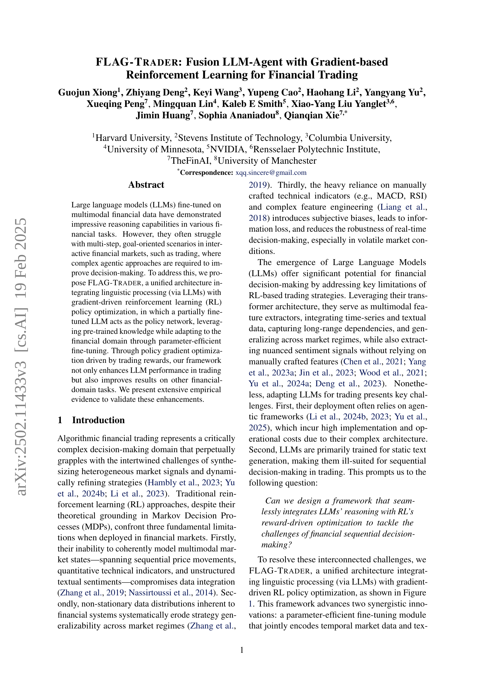
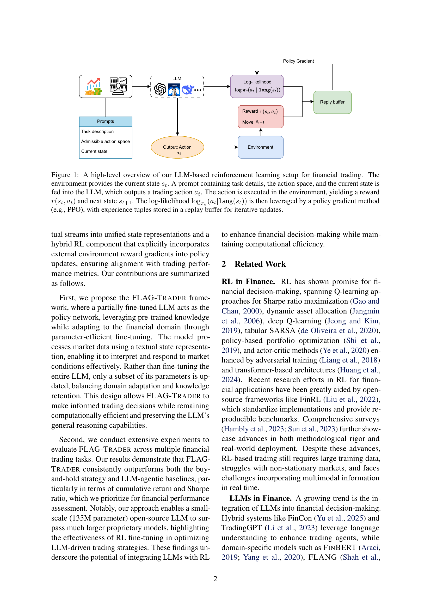
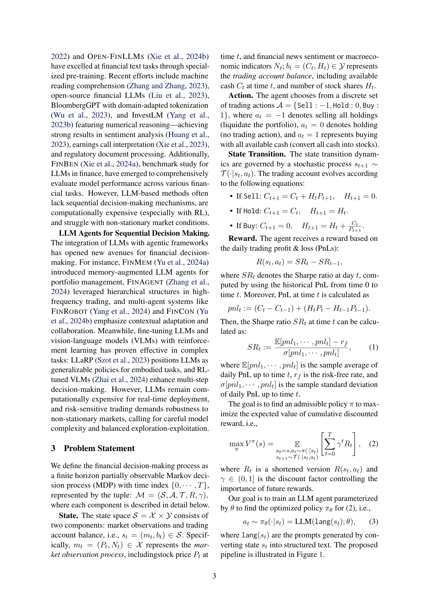
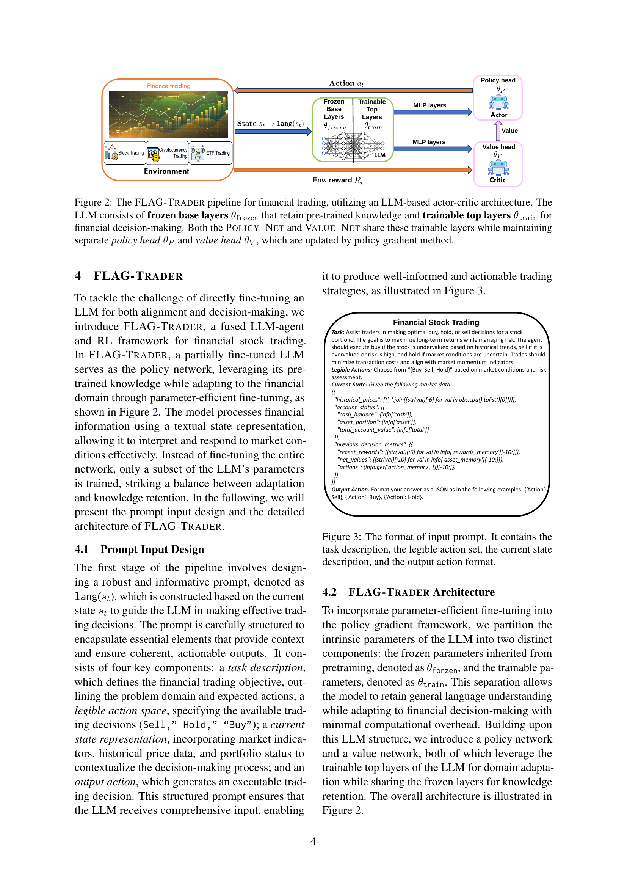
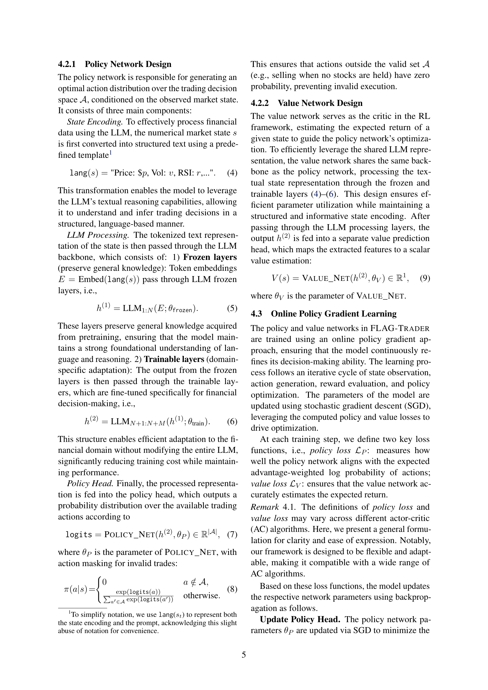
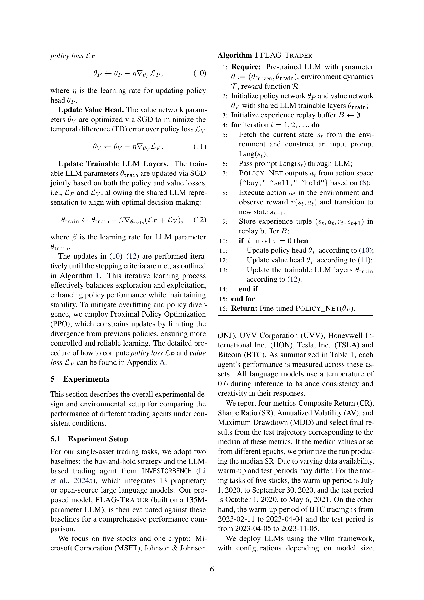
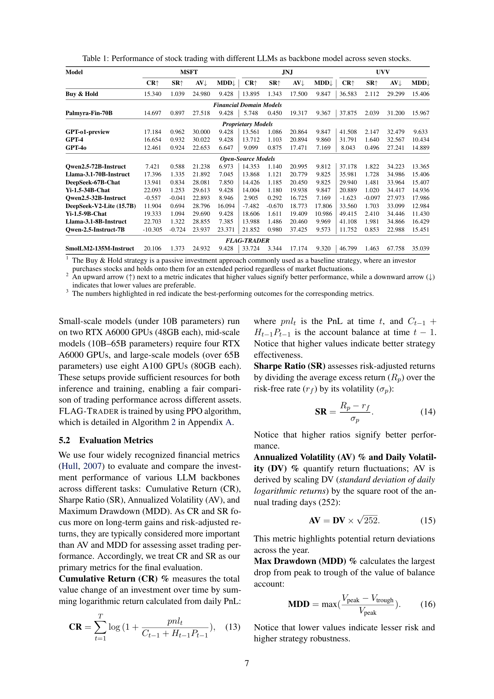
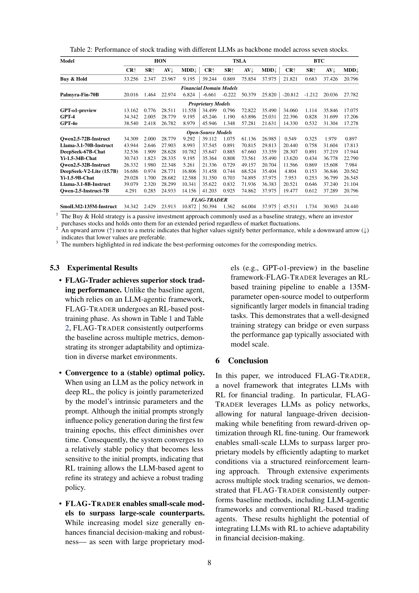
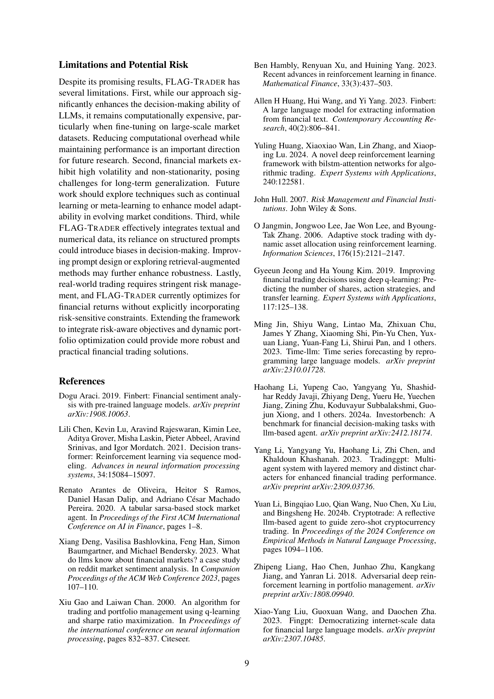
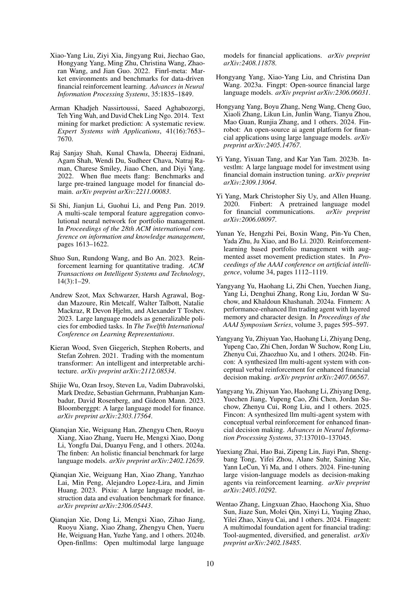
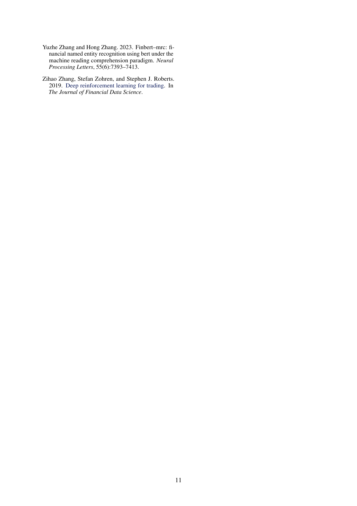
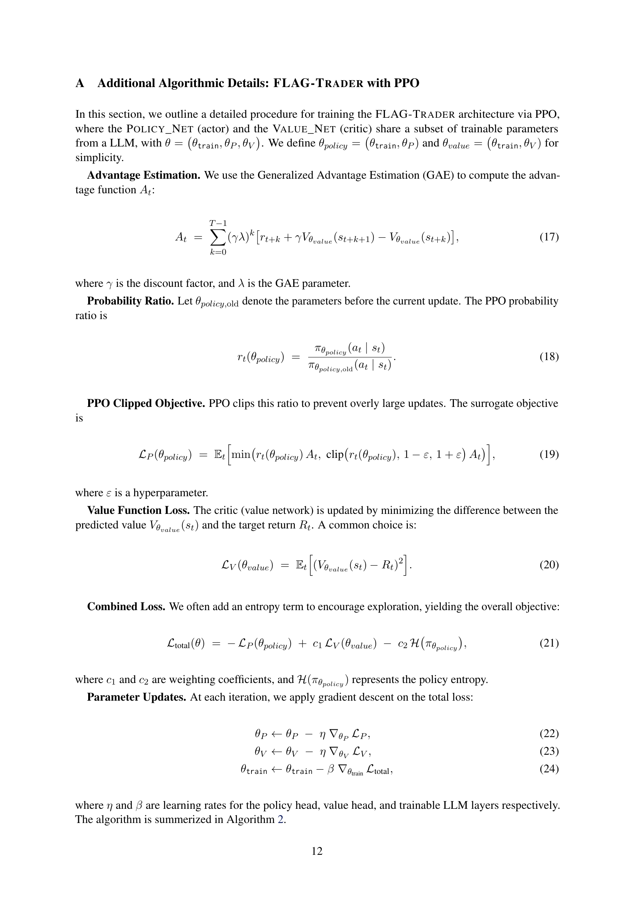
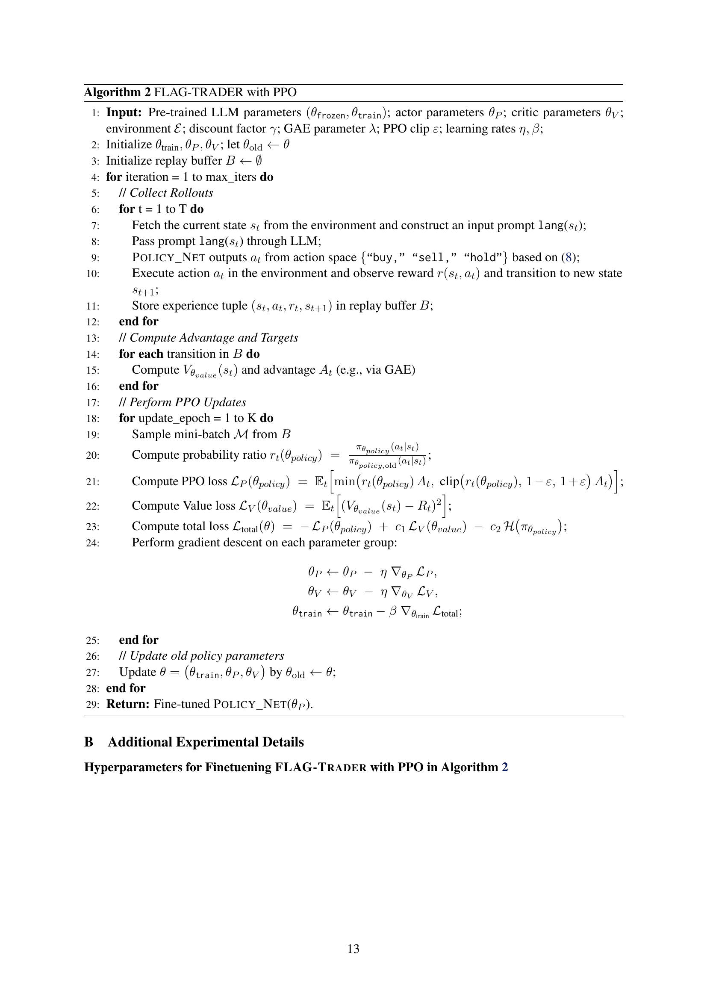
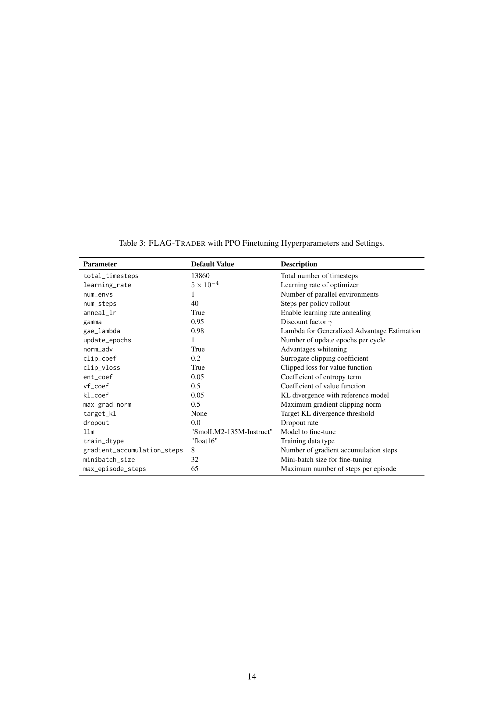
