 


 2502.11438 
 Jimin Lee et el. 
 
 🤗 2025-02-18 
 



↗ arXiv


↗ Hugging Face


↗ Papers with Code


### TL;DR



Text-to-SQL은 자연어 질문을 실행 가능한 SQL 쿼리로 변환하는 과제입니다. 기존의 접근 방식은 유사한 학습 예제를 찾아 LLM을 안내하는 방식이었지만, 실제 환경에서는 이러한 예제가 부족한 경우가 많아 어려움을 겪었습니다.  이러한 문제를 해결하기 위해, 이 논문에서는 **SAFE-SQL이라는 새로운 프레임워크를 제안**합니다.

SAFE-SQL은 **LLM을 활용하여 테스트 입력과 관련된 여러 Text-to-SQL 예제를 생성**합니다.  그런 다음 **세 가지 관련성 평가를 통해 이러한 예제들을 필터링**하여 고품질 인 컨텍스트 학습 예제를 만듭니다.  **자체 생성 예제를 사용**함으로써 SAFE-SQL은 이전의 제로샷 및 퓨샷 Text-to-SQL 프레임워크를 능가하여 **더 높은 실행 정확도**를 달성합니다. 특히 기존 방법이 어려움을 겪는 어려운 시나리오에서 더욱 향상된 성능을 보였습니다.  본 연구는 **완전히 비지도 학습 방식**으로 진행되었다는 점에서도 중요한 의의를 가집니다.



#### Key Takeaways


 LLM을 이용한 자체 증강 인 컨텍스트 학습으로 Text-to-SQL 성능 향상 



 정교한 예제 선택 기법을 통해 복잡하고 전례 없는 시나리오에서도 높은 정확도 달성 



 기존 방법 대비 우수한 성능과 효율성을 입증 


#### Why does it matter?
본 논문은 **텍스트를 SQL 쿼리로 변환하는 Text-to-SQL 과제에서의 어려움을 해결하기 위해 자체 증강 인 컨텍스트 학습을 제안**합니다.  기존의 접근 방식은 유사한 학습 예제가 없을 경우 어려움을 겪는 반면, SAFE-SQL은 **LLM을 활용하여 자체적으로 예제를 생성 및 필터링**하여 성능을 향상시킵니다. 이는 **실세계 Text-to-SQL 시스템의 실용성을 높이는 데 크게 기여**하며,  **새로운 연구 방향을 제시**할 수 있습니다.  **특히 복잡하고 전례 없는 시나리오에서의 성능 향상은 주목할 만하며**,  추후 연구에서 **더욱 효율적이고 정확한 자체 생성 예제 생성 및 필터링 기법**을 연구하는 데 중요한 기준을 제공할 것입니다.

------
#### Visual Insights


| Method | Model | Easy | Medium | Hard | Extra | All |
|---|---|---|---|---|---|---|
| **Supervised Fine-Tuning (SFT)** |  |  |  |  |  |  |
| SYN-SQL | Sense 13B | **95.2** | 88.6 | 75.9 | 60.3 | 83.5 |
| SQL-Palm | PaLM2 | 93.5 | 84.8 | 62.6 | 48.2 | 77.3 |
| **Zero-shot Methods** |  |  |  |  |  |  |
| Baseline | GPT-4 | 84.3 | 73.1 | 65.8 | 40.3 | 69.1 |
| Baseline | GPT-4o | 87.2 | 77.2 | 68.4 | 48.7 | 73.4 |
| Baseline | GPT-4o-mini | 84.8 | 75.6 | 67.0 | 46.1 | 71.5 |
| C3q-SQL | GPT-4 | 90.2 | 82.8 | 77.3 | 64.3 | 80.6 |
| **Few-shot Methods** |  |  |  |  |  |  |
| DIN-SQL | GPT-4 | 91.1 | 79.8 | 64.9 | 43.4 | 74.2 |
| DAIL-SQL | GPT-4 | 90.7 | **89.7** | 75.3 | 62.0 | 83.1 |
| ACT-SQL | GPT-4 | 91.1 | 79.4 | 67.2 | 44.0 | 74.5 |
| PTD-SQL | GPT-4 | **94.8** | 88.8 | 85.1 | 64.5 | 85.7 |
| DEA-SQL | GPT-4 | 88.7 | **89.5** | 85.6 | 70.5 | 85.6 |
| **Self-augmented In-Context Learning** |  |  |  |  |  |  |
| SAFE-SQL | GPT-4 | 93.2 | 88.9 | **85.8** | 74.7 | 86.8 |
| SAFE-SQL | GPT-4o | 93.4 | 89.3 | **88.4** | **75.8** | **87.9** |
| SAFE-SQL | GPT-4o-mini | 93.6 | 87.5 | 86.1 | **75.2** | **87.4** |

> 🔼 표 1은 Spider 개발 데이터셋의 다양한 난이도 수준에 대한 각 모델의 실행 정확도를 보여줍니다. 각 행에서 가장 높은 점수는 굵게 표시하고, 두 번째로 높은 점수는 밑줄을 쳐서 강조합니다. 이 표는 제로샷, 퓨샷, 그리고 감독 학습 방법들을 포함한 다양한 접근 방식들과 SAFE-SQL의 성능을 비교 분석하는 데 사용됩니다. 특히, 어려운 질문들에 대한 SAFE-SQL의 우수한 성능을 보여줍니다.
> 

> 
read the caption

> Table 1: Execution accuracy across difficulty levels on the Spider development set. The highest score per row is in bold, and the second highest is underlined.
> 

### In-depth insights

#### Self-Augmented Learning
자기 증강 학습(Self-Augmented Learning)은 **모델이 스스로 학습 데이터를 생성하고 개선하는 반복적인 프로세스**를 통해 기존의 한계를 극복하고자 하는 접근법입니다. 이는 특히, 유사한 학습 예시가 부족한 실제 환경에서 강력한 성능을 발휘합니다. 본 논문에서는 자기 증강 학습을 통해 **텍스트-SQL 변환 작업의 정확성과 견고성을 향상**시키는 방법을 제시합니다. **LLM(대규모 언어 모델)을 활용하여 테스트 입력과 관련된 다수의 텍스트-SQL 예시를 생성**하고, 이를 **정교한 관련성 평가를 통해 필터링**하여 고품질의 학습 데이터를 구성합니다.  **생성된 예시는 문장 유사도, 구조적 유사도, 추론 경로 유효성 등의 기준으로 평가**되며, 임계값을 넘는 예시만 최종 학습에 사용됩니다. 이러한 자기 증강 학습 방식은 기존의 제로샷 및 퓨샷 학습 방식을 뛰어넘는 성능을 보이며, 특히 어려운 시나리오에서 효과적임을 보여줍니다.  **전체 과정은 비지도 학습 방식으로 진행**되어 추가적인 미세 조정이나 학습 비용 없이 성능 개선을 이룰 수 있다는 점이 주요 특징입니다.

#### Fine-grained Filtering
**미세 조정 필터링**은 자체 생성된 예제의 품질을 높이는 데 중요한 역할을 합니다. 이는 단순히 유사한 질의문을 찾는 것 이상으로, **의미, 구조, 추론 과정의 세 가지 측면**을 종합적으로 고려하여 **임계값 기반 필터링**을 통해 고품질의 예제만을 선별하는 과정입니다. 이를 통해 잡음이 많은 데이터를 제거하고, 모델의 정확성과 강건성을 향상시키는 효과를 거둘 수 있습니다. 특히 복잡하거나 전례 없는 시나리오에서는 **정확한 SQL 생성**에 필수적이며, 기존의 검색 기반 방법이 어려움을 겪는 부분을 보완합니다. **임계값 조정**을 통해 필터링의 강도를 조절할 수 있으며, 이는 모델의 성능에 영향을 미치므로 최적의 임계값을 찾는 것이 중요합니다.  **다양한 모델 크기**에 대한 실험 결과를 통해, 미세 조정 필터링이 모델의 성능 향상에 기여함을 확인할 수 있습니다.

#### Schema-Aware Synthesis
**스키마 인식 합성 (Schema-Aware Synthesis)**은 데이터베이스 스키마에 대한 풍부한 이해를 바탕으로 질의 생성 과정을 개선하는 접근 방식입니다. 단순히 자연어 질의를 SQL 질의로 변환하는 것을 넘어, **데이터베이스의 테이블 구조, 속성, 관계 등을 고려하여 더욱 정확하고 효율적인 SQL 질의를 생성**하는 것을 목표로 합니다. 이는 기존의 단순 패턴 매칭 방식이나 규칙 기반 시스템보다 훨씬 정교한 접근 방식이며, 특히 복잡한 질의나 모호한 자연어 표현에 대한 처리 능력을 향상시킵니다. **스키마 정보를 활용하여 후보 SQL 질의들을 생성하고 필터링**하는 과정을 거쳐, 최적의 질의를 선택하는 방식으로 높은 정확도를 달성할 수 있습니다.  또한, **스키마 정보는 자연어 질의의 모호성을 해소하고, 질의의 의도를 정확하게 파악**하는 데 중요한 역할을 합니다.  **스키마 인식 합성은 인공지능 기반의 Text-to-SQL 시스템의 성능 향상**에 크게 기여할 뿐만 아니라, 실제 데이터베이스 응용 환경에서 사용자의 질의 의도를 더욱 정확하게 반영하는 데 도움을 줄 수 있다는 점에서 큰 의미를 가집니다.  **실제 시스템 구현에서는 스키마 정보를 효율적으로 처리하고 활용하는 기술이 중요**하며, 스키마의 복잡성이나 데이터 양의 증가에 따른 시스템 성능 저하 문제를 해결하는 방안 또한 고려되어야 합니다.

#### LLM-based In-context
LLM 기반 인컨텍스트 학습은 **대규모 언어 모델(LLM)**의 강력한 능력을 활용하여 **텍스트-SQL 변환 과제**를 해결하는 새로운 접근 방식입니다.  기존의 규칙 기반 또는 기계 학습 방식과 달리, LLM은 **제공된 예시(in-context learning)**를 바탕으로 SQL 쿼리를 생성합니다. 이는 다양한 질문 유형에 대한 유연성과 적응력을 높여줍니다. 하지만, **적절한 예시 선택**이 성능에 큰 영향을 미치므로, **저품질 예시 필터링** 및 **고품질 예시 생성** 기법이 중요합니다.  **SAFE-SQL**과 같은 최신 연구는 **자체 생성 예시**를 활용하여 이러한 문제를 해결하려고 시도하며,  **스키마 연결** 및 **문맥적 연관성 평가** 등을 통해 정확도를 높입니다.  결국, LLM 기반 인컨텍스트 학습은 **데이터 의존성 감소**, **신속한 적용**, **높은 유연성** 등의 장점을 가지지만,  **저품질 예시에 대한 취약성**을 극복하는 것이 향후 연구의 주요 과제가 될 것입니다.

#### Future Directions
본 논문에서 제시된 SAFE-SQL 모델의 미래 방향은 **다양한 데이터베이스 스키마와 자연어 질문 유형에 대한 일반화 성능 향상**에 초점을 맞춰야 합니다.  현재 모델은 특정 데이터셋에 대해서는 우수한 성능을 보이지만, 다양한 스키마와 복잡한 질문에 대한 일반화 능력은 제한적일 수 있습니다. 따라서, **더욱 다양하고 대규모의 데이터셋을 활용한 추가 학습**과 **모델의 추론 과정에 대한 설명력 강화**를 통해 이러한 문제를 해결할 수 있을 것입니다.  또한, **계산 비용을 줄이기 위한 효율적인 알고리즘 개발** 및 **다국어 지원을 위한 확장**도 중요한 연구 과제입니다.  마지막으로,  **모델의 신뢰성과 투명성을 높이기 위한 연구**가 필요합니다.  **오류 분석 및 수정 메커니즘**을 개선하여  실제 환경에서의 안정적인 성능을 보장하는 것이 중요하며,  **윤리적인 측면**을 고려하여 편향된 결과를 최소화하는 방안을 모색해야 합니다.

### More visual insights

More on tables


| Models | EX | EM |
|---|---|---|
| GPT-4o + SAFE | 87.9 | 78.3 |
| w/o Reasoning path | 84.4 (-3.5) | 73.6(-4.7) |
| w/o Relevance filtering | 82.1 (-5.8) | 68.5(-9.7) |
| w/o Schema linking | 80.4 (-7.5) | 65.1(-13.2) |
| w/o Similar examples | 77.1 (-10.8) | 61.9(-16.4) |
> 🔼 표 2는 SAFE-SQL의 각 구성 요소를 제거했을 때 성능 저하를 보여주는 절삭 연구 결과를 보여줍니다. 각 구성요소(추론 경로, 관련성 점수, 스키마 연결, 유사 예제)의 중요성을 보여주는 실험 결과입니다. 각 구성 요소를 제거하면 성능이 저하되는 것을 확인할 수 있습니다.
> 

> 
read the caption

> Table 2: Ablation study results for SAFE-SQL, where removing each component leads to a performance drop.
> 


| Score | cos θ | # of Generated EX | % Filtered EX |
|---|---|---|---| 
| ≥ 0 | 0.581 | 10340 | 0 % |
| ≥ 2 | 0.625 | 10185 | 1.50% (-155) |
| ≥ 4 | 0.744 | 9883 | 4.41% (-457) |
| ≥ 6 | 0.762 | 9378 | 9.30% (-962) |
| ≥ 8 | 0.765 | 8606 | 16.76% (-1734) |
| ≥ 10 | 0.769 | 6795 | 34.28% (-3545) |
> 🔼 표 3은 SAFE-SQL에서 자체 생성된 예시의 품질을 평가하고 필터링하는 과정을 요약한 표입니다. 테이블은 각 점수에 따라 생성 및 필터링된 예시의 수, 임베딩 유사도 분석 결과를 보여줍니다. 점수가 높을수록 더 많은 예시가 필터링되고, 임베딩 유사도 또한 높아지는 경향을 보입니다. 이는 고품질의 예시가 테스트 질문과 더 높은 유사도를 가짐을 의미합니다.
> 

> 
read the caption

> Table 3: Summary of data generation, filtering results, and embedding similarity analysis by score.
> 


| SQL Question | GOLD SQL Query | Augmented SQL Question | Generated Reasoning Path | Relevance Score |
|---|---|---|---|---|
| Question1: What are the names, countries, and ages for every singer in descending order of age? | SELECT name, country, age FROM singer ORDER BY age DESC | What are the names, ages, and countries of all singers from a specific country, sorted by age in descending order? | 1. Identify the desired columns: name, age, and country. | Semantic similarity = 10 Structural Similarity = 10 Reasoning path = 10 Relevance score = (10+10+10)/3 = 10 |
| Question2: Return the names and template ids for documents that contain the letter w in their description. | SELECT document_name, template_id FROM Documents WHERE Document_Description LIKE "%"w%" | Retrieve the titles and category IDs of articles whose summaries contain the word "data". | 1. Identify the necessary columns: extract title and category_id from the Articles table. | Semantic similarity = 7 Structural Similarity = 9 Reasoning path = 8 Relevance score = (7+9+8)/3 = 8 |
| Question3: What is the number of car models that are produced by each maker and what is the id and full name of each maker? | SELECT Count(*), T2.FullName, T2.id FROM MODEL_LIST AS T1 JOIN CAR_MAKERS AS T2 ON T1.Maker = T2.id GROUP BY T2.id; | List all employees who work in the IT department along with their employee ID and hire date. | 1. Identify required details: employee ID and hire date. | Semantic similarity = 6 Structural Similarity = 3 Reasoning path = 2 Relevance score = (6+3+2)/3 = 3.67 |
> 🔼 표 4는 GPT-40 모델을 사용하여 생성된 원본 SQL 질의와 증강된 SQL 질의, 그리고 각 질의에 대한 추론 과정을 보여줍니다. 원본 질의는 사용자의 자연어 질문을 SQL 질의로 변환한 것입니다. 증강된 질의는 원본 질의와 유사하지만 약간 다른 질문으로, 모델이 다양한 질문 유형에 대해 일반화할 수 있도록 합니다. 각 질의에 대한 추론 과정은 모델이 SQL 질의를 생성하는 데 사용한 단계별 논리적 과정을 설명합니다. 이를 통해 사용자가 모델의 추론 과정을 이해하고 모델이 어떻게 질의를 생성하는지 확인할 수 있습니다. 각 질의의 유사성 점수는 의미적 유사성, 구조적 유사성 및 추론 과정 유사성을 고려하여 계산됩니다. 점수가 높을수록 질의가 원본 질의와 더 유사하고 모델의 추론 과정이 더 일관성이 있음을 나타냅니다.
> 

> 
read the caption

> Table 4: Examples of original and augmented SQL questions with reasoning paths by GPT-4o.
> 


| α | β | γ | **Easy** | **Medium** | **Hard** | **Extra** | **EX** |
|---|---|---|---|---|---|---|---| 
| 0.33 | 0.33 | 0.33 | **93.4** | **89.3** | 88.4 | **75.8** | **87.9** |
| 1 | 0 | 0 | 90.7 | 84.2 | 82.3 | 68.3 | 82.8 |
| 0 | 1 | 0 | 89.8 | 85.6 | 81.2 | 69.2 | 83.1 |
| 0 | 0 | 1 | 89.2 | 85.1 | 84.3 | 71.7 | 83.7 |
| 0.5 | 0.5 | 0 | 91.2 | 87.3 | 82.5 | 69.4 | 84.4 |
| 0.5 | 0 | 0.5 | 92.5 | 87.9 | 83.5 | 70.3 | 85.3 |
| 0 | 0.5 | 0.5 | 92.7 | 86.8 | **88.5** | 72.4 | 86.1 |
> 🔼 표 5는 어려움 수준별 실행 정확도를 보여줍니다. 세 가지 요소인 의미적 유사성(α), 구조적 유사성(β), 추론 경로 품질(γ)의 가중치를 다르게 하여 실험을 진행했습니다. 각 가중치 조합에 따른 쉬운, 중간, 어려운, 추가 어려운 문제들에 대한 실행 정확도를 보여줍니다. 이를 통해 각 요소의 중요도를 비교 분석할 수 있습니다.
> 

> 
read the caption

> Table 5: Execution accuracy across difficulty levels under different weights: semantic similarity (α𝛼\alphaitalic_α), Structural similarity (β𝛽\betaitalic_β), and reasoning path quality (γ𝛾\gammaitalic_γ).
> 


| ## Schema linking | ## Tables | ## Foreign keys | ## Question | ## Similar Question | ## SQL query | ## Reasoning Path |
|---|---|---|---|---|---|---|
| schema_linking[i] | test_table[i] | test_foreign_keys[i] | test_question[i] |  |  | |
> 🔼 표 6은 본 논문에서 제안하는 SAFE-SQL 모델의 핵심 구성 요소 중 하나인,  LLM(대규모 언어 모델)을 사용하여 질의와 유사한 예시들을 생성하는 과정에서 사용되는 프롬프트(명령어)를 보여줍니다.  프롬프트는 LLM에게 질의와 관련된 테이블, 외래키 정보, 그리고 생성해야 할 유사 질의, SQL 쿼리, 추론 과정 등을 명확하게 지시하여,  모델이 양질의 예시들을 생성하도록 유도하는 역할을 합니다.  세부적으로는 의미적 유사성, 구조적 유사성, 그리고 추론 과정의 유사성을 고려하여 생성된 질의와 SQL 쿼리의 품질을 높이도록 설계되어 있습니다.
> 

> 
read the caption

> Table 6: The zero-shot prompt used for example generation
> 


| Schema linking | Tables | Foreign keys | Question | Similar Question | SQL query | Reasoning Path |
|---|---|---|---|---|---|---|
| schema_linking[i] | test_table[i] | test_foreign_keys[i] | test_question[i] |  |  |  |
> 🔼 표 7은 SAFE-SQL에서 생성된 예시들을 필터링하는 데 사용된 제로샷 프롬프트를 보여줍니다. 이 프롬프트는 테스트 질문과 생성된 예시 질문 간의 의미적 유사성, 구조적 유사성, 그리고 추론 경로의 타당성을 평가하여 각 예시에 대한 관련성 점수를 계산하는 방법을 자세히 설명합니다.  점수는 의미적 유사성, 구조적 유사성, 추론 경로의 타당성 세 가지 측면을 고려하여 계산됩니다. 각 측면은 0에서 10까지의 점수를 받으며, 최종 점수는 세 점수의 평균으로 계산됩니다. 이 프롬프트는 모델이 질문과 데이터베이스 스키마 간의 관계를 이해하고, 정확하고 일관성 있는 SQL 쿼리를 생성하는 데 도움을 줍니다.
> 

> 
read the caption

> Table 7: The zero-shot prompt used for filtering examples.
> 


| Criteria | Score Range | Description |
|---|---|---|
| Semantic Similarity of Questions | 10 | Almost identical meaning and intent. |
|  | 7–9 | Minor paraphrasing but highly relevant. |
|  | 4–6 | Some overlap but different focus. |
|  | 1–3 | Mostly unrelated meaning. |
|  | 0 | Completely different intent. |
| Keyword & Structural Similarity | 10 | Nearly identical structural relationships and dependencies. |
|  | 7–9 | Mostly similar structure, with minor differences in entity connections. |
|  | 4–6 | Some overlap, but noticeable differences in how key components interact. |
|  | 1–3 | Few shared structural relationships, making alignment weak. |
|  | 0 | No meaningful structural similarities. |
| Reasoning Path Similarity | 10 | Exact reasoning process to get right SQL query. |
|  | 7–9 | Mostly similar but with minor differences. |
|  | 4–6 | Some alignment but different key steps. |
|  | 1–3 | Largely different reasoning. |
|  | 0 | Completely unrelated logic. |
> 🔼 표 8은 SAFE-SQL 모델의 최종 SQL 쿼리 추론 단계에서 사용되는 제로샷 프롬프트를 보여줍니다. 이 프롬프트는 테스트 질문과 유사한 질문, 해당 SQL 쿼리, 그리고 쿼리가 도출되는 방법을 설명하는 자세한 추론 경로를 포함하는 여러 개의 선택된 예시를 모델에 제공합니다. 이 예시들은 질문의 의미, 데이터베이스 스키마 요소, 그리고 추론 과정의 일관성 세 가지 주요 기준을 바탕으로 선택됩니다. 모델은 이 예시들을 사용하여 테스트 질문에 대한 최종 SQL 쿼리를 생성합니다.
> 

> 
read the caption

> Table 8: The zero-shot prompt used for Final SQL query inference.
> 


| Criteria | Score Range | Description |
|---|---|---|
| Semantic Similarity of Questions | 10 | Almost identical meaning and intent. |
|  | 7–9 | Minor paraphrasing but highly relevant. |
|  | 4–6 | Some overlap but different focus. |
|  | 1–3 | Mostly unrelated meaning. |
|  | 0 | Completely different intent. |
| Keyword & Structural Similarity | 10 | Nearly identical structural relationships and dependencies. |
|  | 7–9 | Mostly similar structure, with minor differences in entity connections. |
|  | 4–6 | Some overlap, but noticeable differences in how key components interact. |
|  | 1–3 | Few shared structural relationships, making alignment weak. |
|  | 0 | No meaningful structural similarities. |
| Reasoning Path Similarity | 10 | Exact reasoning process to get right SQL query. |
|  | 7–9 | Mostly similar but with minor differences. |
|  | 4–6 | Some alignment but different key steps. |
|  | 1–3 | Largely different reasoning. |
|  | 0 | Completely unrelated logic. |
> 🔼 표 9는 Spider dev 데이터셋의 다양한 난이도에서 Qwen 시리즈의 여러 크기의 모델에 대한 실행 정확도 성능을 보여줍니다.  다양한 모델 크기 (3B, 7B, 14B)에 따른 성능 차이를  난이도별(쉬움, 중간, 어려움, 추가 어려움)로 비교 분석하여 모델 크기가 Text-to-SQL 성능에 미치는 영향을 보여줍니다.
> 

> 
read the caption

> Table 9: Execution accuracy performance of different size of models of Qwen series across difficulty levels of spider dev set.
> 


| Header | Description |
|---|---| 
| **Semantic Similarity of Questions** | The selected examples closely match the intent of the test question. Variations in wording do not change the meaning. |
| **Structural Similarity** | The database schema elements (tables, columns, joins) used in the examples align with the test question. The SQL syntax and structure are relevant to the expected query. |
| **Reasoning Path Similarity** | The logical steps used to construct the SQL query align with the reasoning required for the test question. Key transformations, filtering conditions, and aggregation logic are similar. |
| **Final SQL Query Construction** | Using the selected examples, generate the final SQL query that correctly retrieves the desired result for the given test question. Follow the reasoning patterns observed in the examples. Maintain correct table joins, filters, aggregations, and conditions based on schema constraints. Ensure that the final query accurately represents the intent of the test question while leveraging the insights from the selected examples. Now, generate the final SQL query for the given test question: |
| Tables | test_table[i] |
| Foreign_keys | test_foreign_keys[i] |
| Question | text_question[i] |
| Filtered_example | filtered_example[i] |
> 🔼 표 10은 Spider 개발 데이터 세트의 다양한 난이도 수준에서 여러 방법의 실행 정확도 성능을 보여줍니다.  각 방법은 특정 모델을 사용하여 평가되었으며, '쉬움', '중간', '어려움', '추가 어려움' 등 네 가지 난이도 수준에서의 실행 정확도가 백분율로 제시됩니다.  이는 다양한 난이도의 질의에 대한 각 방법의 성능을 비교하는 데 도움이 됩니다.
> 

> 
read the caption

> Table 10: Execution accuracy performance of different methods across difficulty levels of spider dev set.
> 

### Full paper


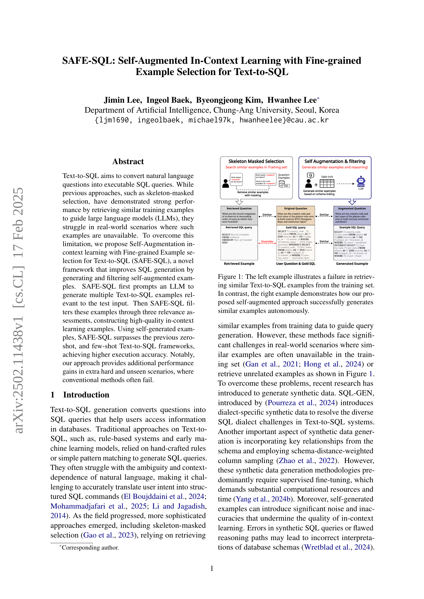
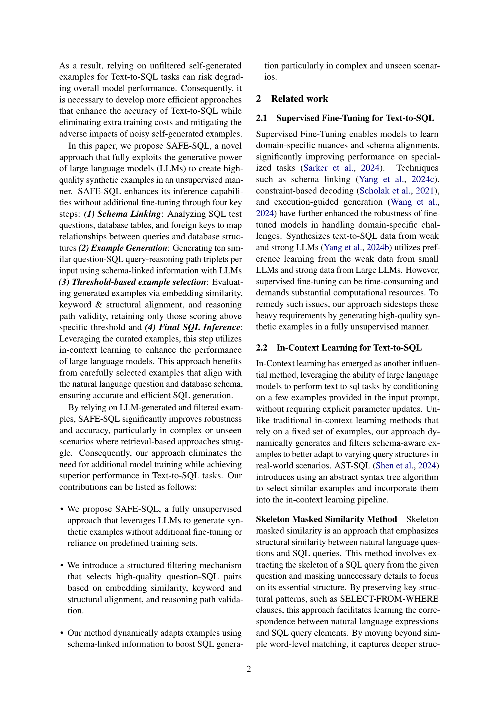
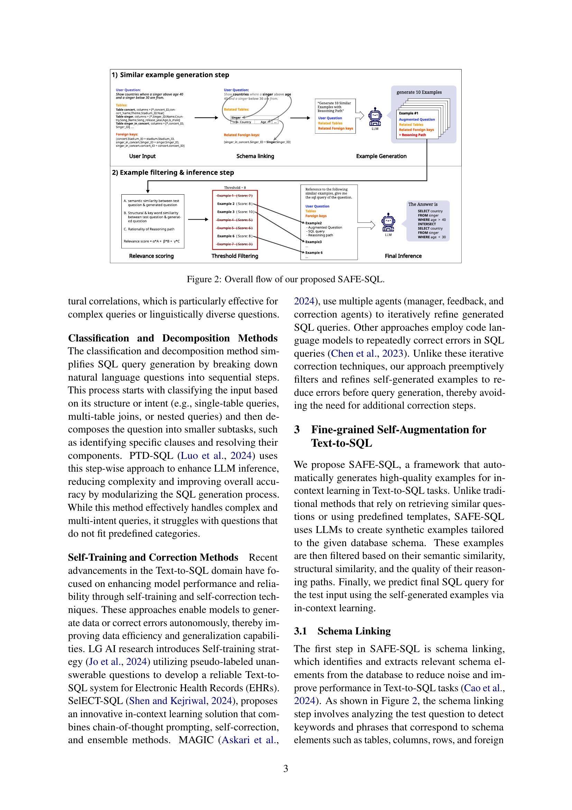
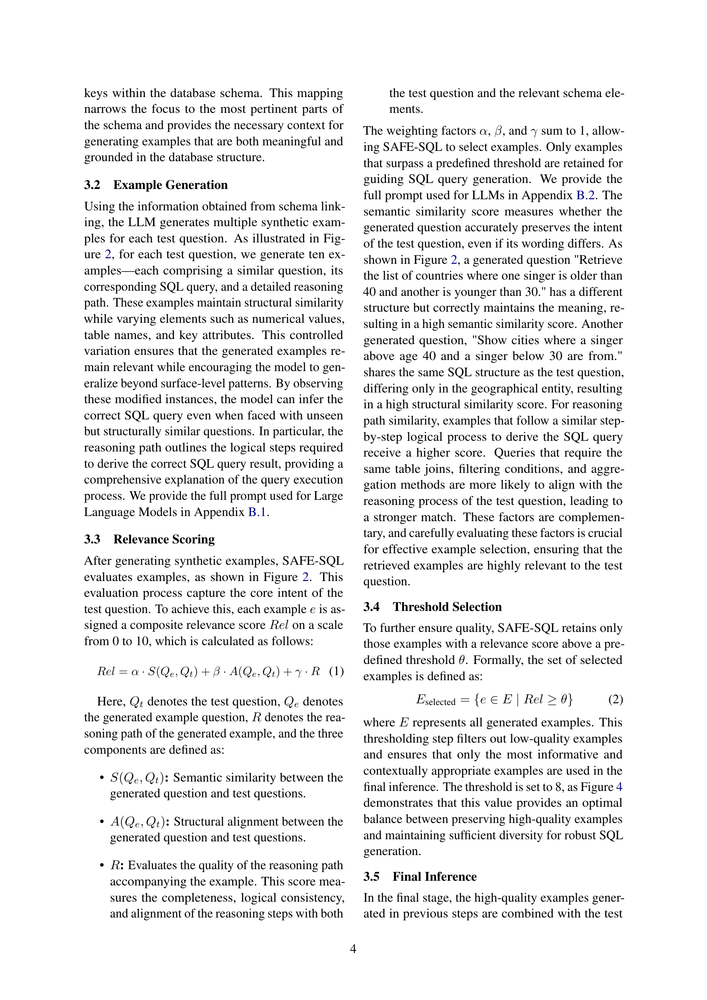
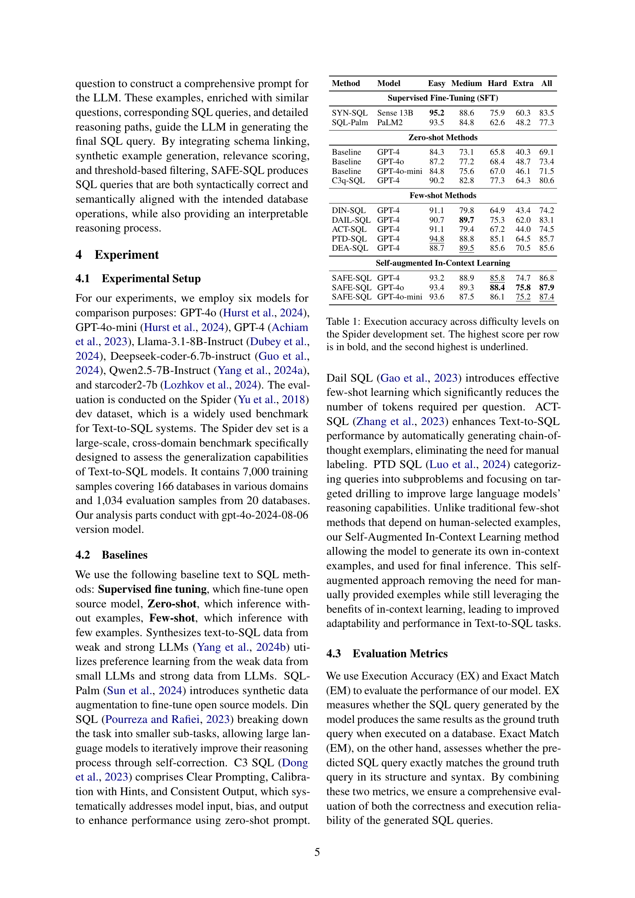
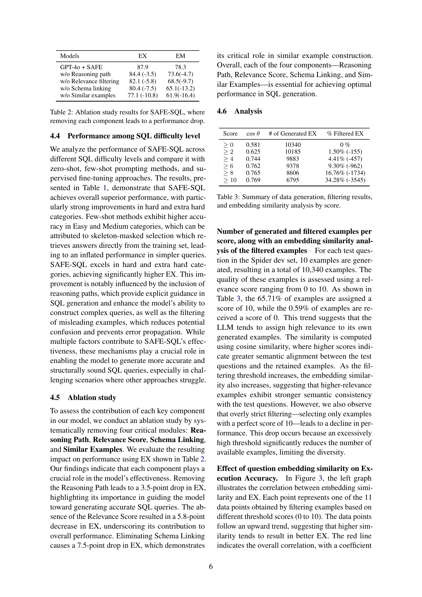
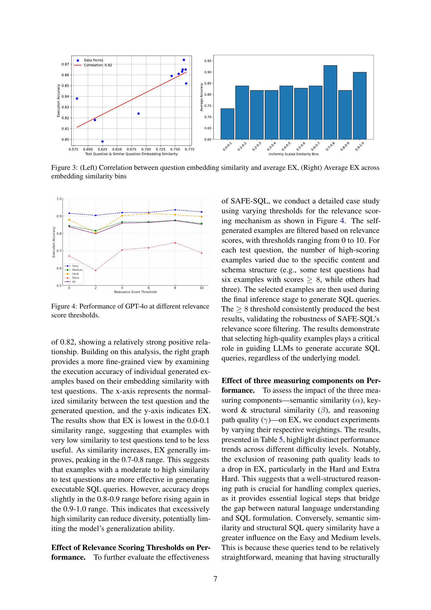
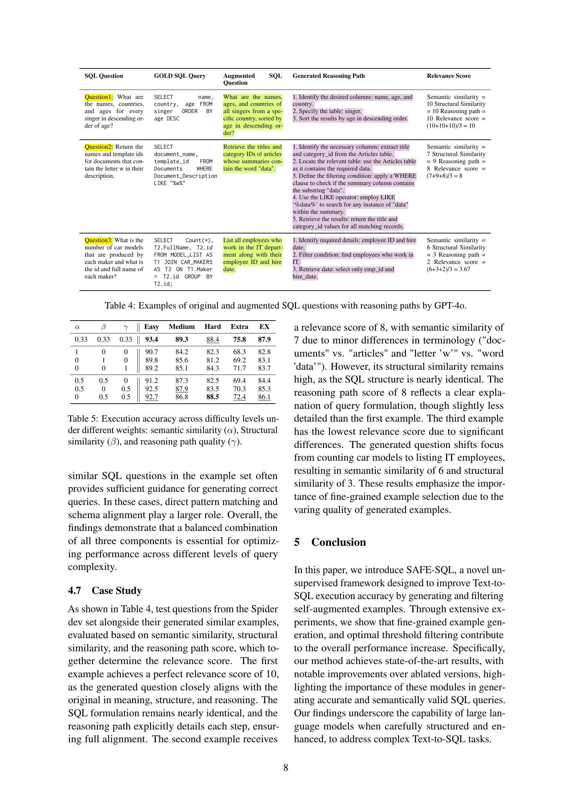
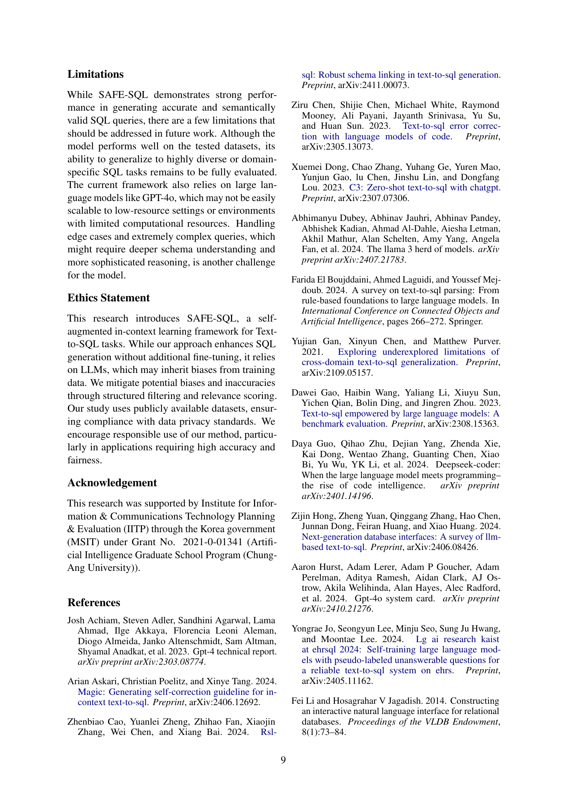
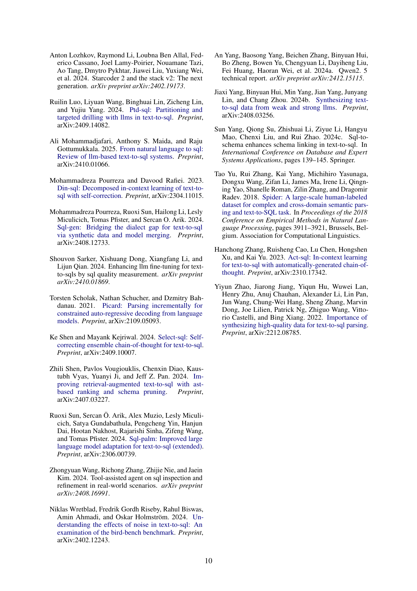
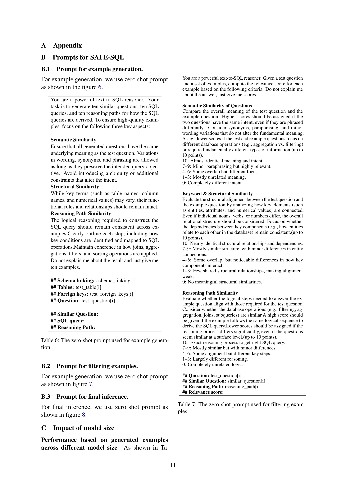
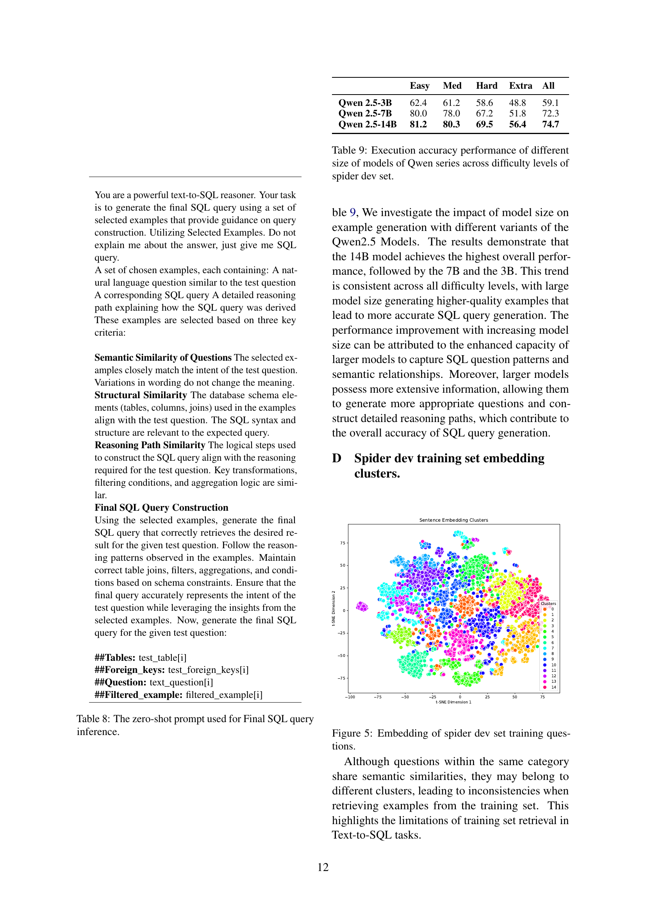
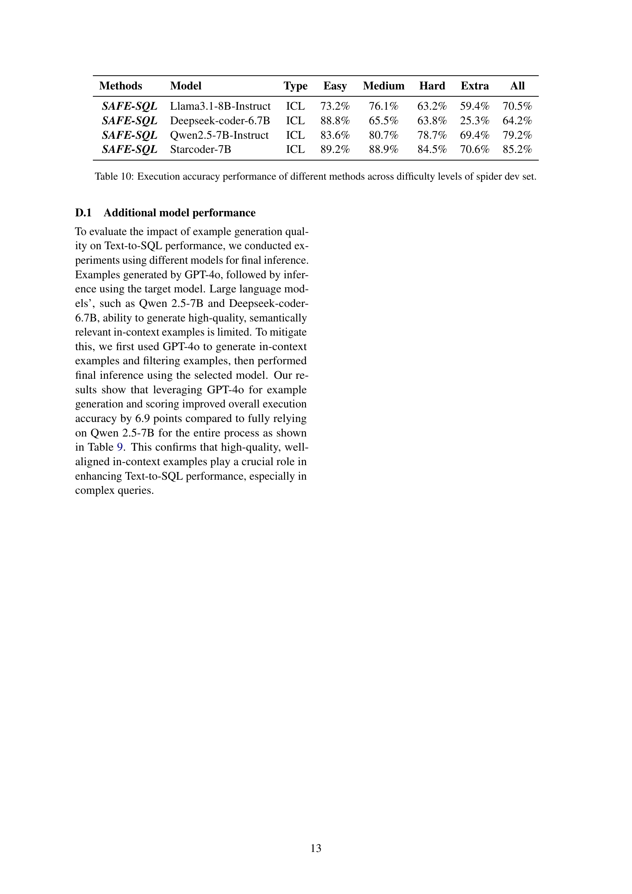
