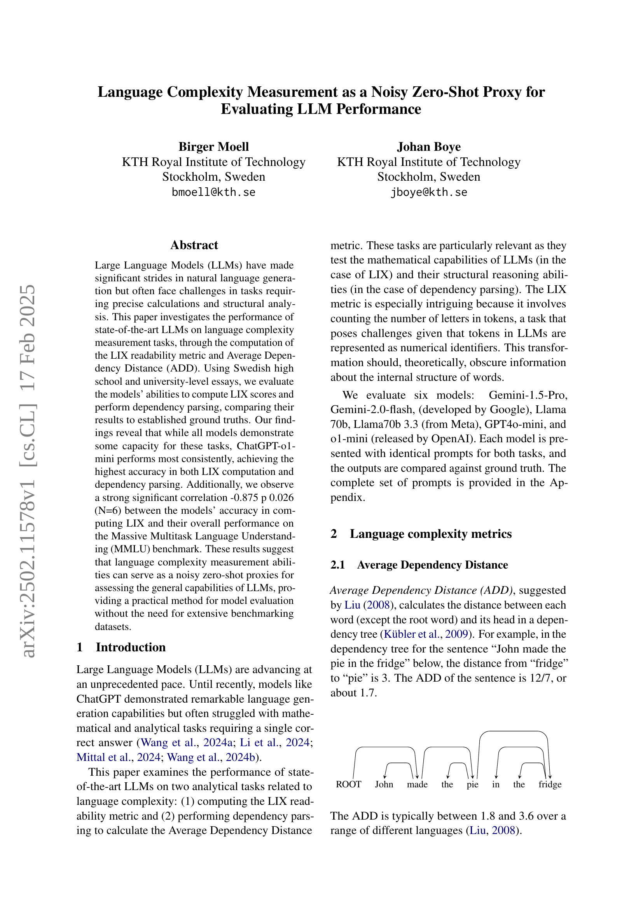
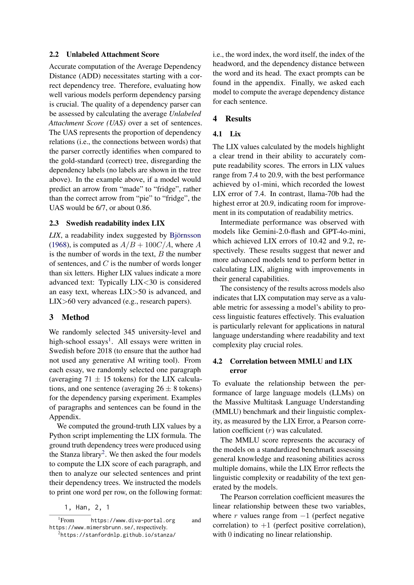
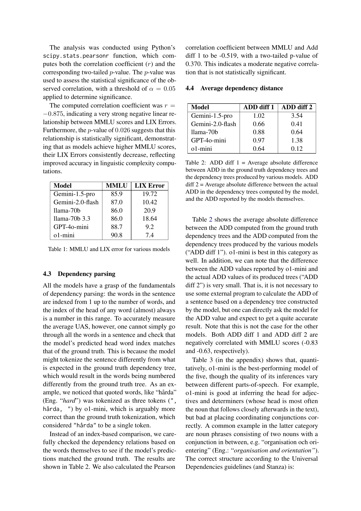
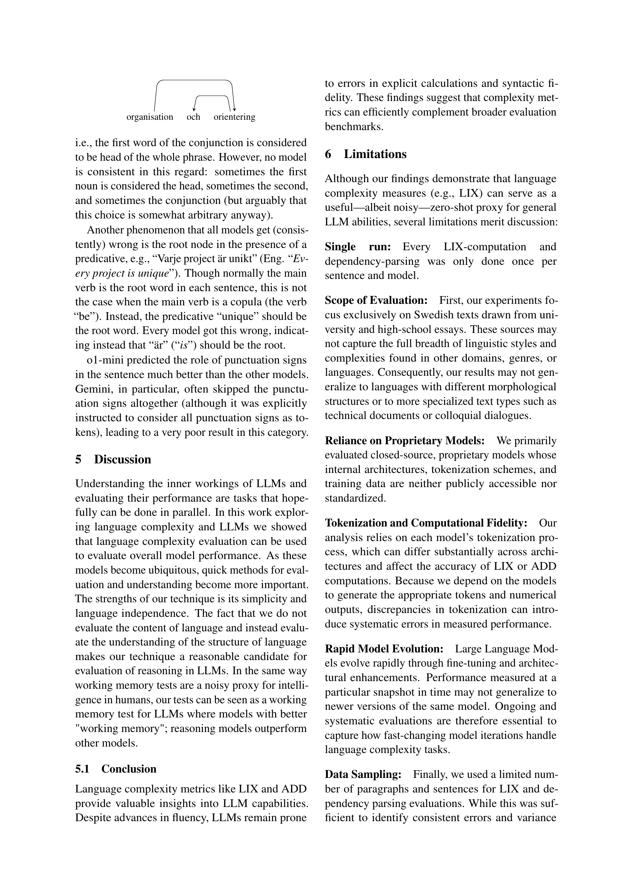
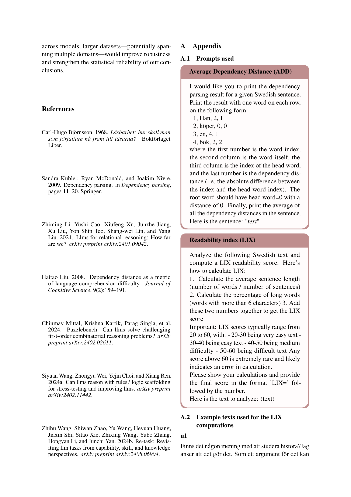
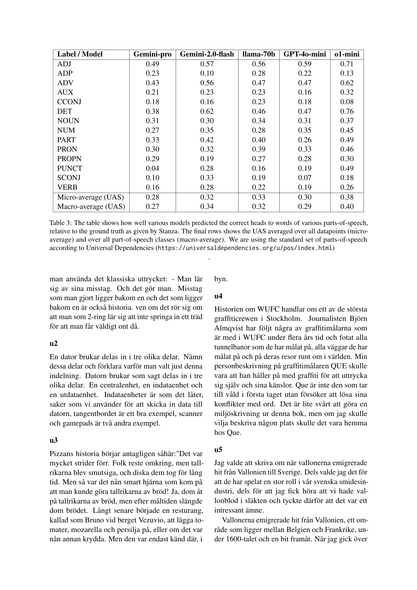
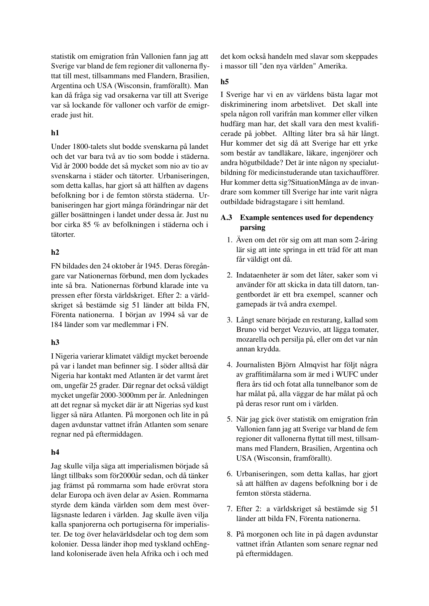
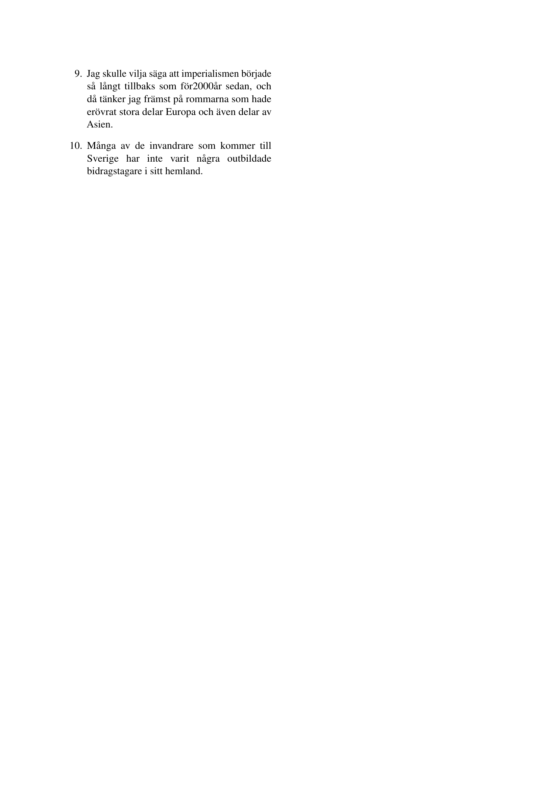

 


 2502.11578 
 Birger Moell et el. 
 
 🤗 2025-02-18 
 



↗ arXiv


↗ Hugging Face


↗ Papers with Code


### TL;DR



대규모 언어 모델(LLM)은 자연어 생성 능력이 뛰어나지만, 정확한 계산 및 구조적 분석이 필요한 작업에서는 어려움을 겪습니다. 본 논문에서는 **LLM의 언어 복잡성 측정 능력**을 평가하여 이러한 문제를 해결하고자 합니다. 특히, LIX 가독성 지표와 평균 의존 거리(ADD)를 계산하는 LLM의 성능을 스웨덴어 고교 및 대학 에세이를 사용하여 평가했습니다.

본 연구는 다양한 LLM 모델의 LIX 점수 및 의존성 구문 분석 성능을 기준 진실값과 비교 분석하여 모델의 능력을 평가했습니다. 그 결과, **모델 간 일관성 있는 성능 차이**가 나타났으며, 특히 ChatGPT-01-mini 모델이 가장 높은 정확도를 보였습니다.  또한, LLM의 LIX 계산 정확도와 MMLU 벤치마크 성능 간의 강한 상관관계를 발견하여, **언어 복잡성 측정 능력이 LLM의 전반적인 성능을 평가하는 데 유용한 지표**임을 시사합니다. 이는 **방대한 벤치마킹 데이터셋 없이도 LLM을 효율적으로 평가**할 수 있는 새로운 방법론을 제시하는 중요한 결과입니다.



#### Key Takeaways


 LLM의 LIX 및 ADD 계산 정확도는 MMLU 성능과 높은 상관관계를 보인다. 



 언어 복잡성 측정은 LLM의 제로샷 평가를 위한 효과적인 프록시 지표로 활용될 수 있다. 



 ChatGPT-01-mini가 LIX 및 ADD 계산, 의존성 구문 분석에서 가장 높은 정확도를 보였다. 


#### Why does it matter?
본 논문은 **LLM의 언어적 복잡성 측정 능력이 모델의 전반적 성능을 평가하는 데 유용한 지표**가 될 수 있음을 보여줍니다.  **제로샷 평가 방법**을 제시하여 방대한 벤치마킹 데이터셋 없이도 LLM의 성능을 효율적으로 평가할 수 있는 새로운 가능성을 제시하며, **향후 LLM 연구 및 개발에 중요한 시사점**을 제공합니다. 특히, 언어 분석 및 이해 분야 연구자들에게 **새로운 평가 지표 및 방법론**을 제안하여 연구의 폭을 넓힐 수 있습니다.

------
#### Visual Insights


| Model | MMLU | LIX Error |
|---|---|---|
| Gemini-1.5-pro | 85.9 | 19.72 |
| Gemini-2.0-flash | 87.0 | 10.42 |
| llama-70b | 86.0 | 20.9 |
| llama-70b 3.3 | 86.0 | 18.64 |
| GPT-4o-mini | 88.7 | 9.2 |
| o1-mini | 90.8 | 7.4 |

> 🔼 다양한 언어 모델의 Massive Multitask Language Understanding (MMLU) 점수와 LIX 오류율을 보여주는 표입니다. MMLU 점수는 모델의 일반적인 언어 이해 능력을 나타내고, LIX 오류율은 모델이 스웨덴어 텍스트의 가독성 점수를 계산하는 정확도를 나타냅니다. 이 표는 MMLU 점수와 LIX 오류율 간의 상관관계를 분석하는 데 사용됩니다.
> 

> 
read the caption

> Table 1: MMLU and LIX error for various models
> 

### In-depth insights

#### LLM Complexity Proxies
본 논문은 대규모 언어 모델(LLM)의 성능 평가를 위한 새로운 지표로서 언어 복잡도 측정을 제안합니다.  **LLM의 복잡성을 간접적으로 측정하는 프록시 지표**로서, LLM이 LIX 가독성 지표 계산 및 의존성 구문 분석과 같은 언어 분석 작업을 얼마나 정확하게 수행하는지를 평가합니다.  이는 **수치 계산 및 구조적 추론 능력**을 평가하는 데 효과적입니다.  흥미로운 점은 LLM의 언어 복잡도 측정 능력과 MMLU 벤치마크에서의 전반적인 성능 간에 높은 상관 관계가 있다는 것입니다. 이는 **언어 복잡도 측정 능력이 LLM의 일반적인 능력을 평가하는 데 유용한 프록시 지표**가 될 수 있음을 시사합니다.  하지만, 이러한 프록시 지표는 **잡음이 포함될 수 있으며**, 모델의 토큰화 방식이나 특정 언어 및 도메인에 대한 편향 등의 한계점을 가지고 있습니다.  **더욱 포괄적인 평가를 위해서는 다양한 지표를 함께 활용**하는 것이 중요합니다.

#### Swedish LLM Tests
스웨덴어 LLM 테스트는 **스웨덴어를 사용하는 대규모 언어 모델(LLM)**의 성능을 평가하기 위한 다양한 방법을 제시합니다. 이는 단순히 언어 생성 능력뿐만 아니라, **수치 계산 및 구조적 추론 능력**도 포함합니다.  **LIX 가독성 지표 및 평균 의존 거리(ADD)**와 같은 언어 복잡성 측정 지표를 사용하여, 모델의 정확성을 객관적으로 평가하고, **MMLU 벤치마크**와의 상관관계를 분석하여 일반적인 LLM 성능과의 연관성을 탐색합니다. 이를 통해, 스웨덴어 LLM의 강점과 약점을 파악하고, 향후 모델 개발 방향을 제시할 수 있습니다.  **특히, 특정 언어에 대한 LLM 테스트의 중요성**을 강조하며, 다양한 언어적 맥락과 복잡성을 고려한 평가의 필요성을 제기합니다. 이는 스웨덴어 뿐 아니라 다른 언어에도 적용 가능한 일반적인 프레임워크를 제공합니다.  **ChatGPT-01-mini의 우수한 성능**은 주목할 만하며, 향후 모델 개발에 대한 시사점을 제공합니다. 마지막으로, **데이터 샘플링 및 모델의 변화**와 같은 제한점을 인지하여, 보다 엄밀한 연구 설계의 필요성을 시사합니다.

#### MMLU Correlation
본 논문은 거대 언어 모델(LLM)의 언어 복잡도 측정 능력과 MMLU(Massive Multitask Language Understanding) 벤치마크 성능 간의 상관관계를 분석합니다. **LIX 가독성 지표 및 평균 의존 거리(ADD) 계산 능력을 통해 LLM의 언어 이해 능력을 평가**하고, 이를 MMLU 점수와 비교 분석하여 상관관계를 도출합니다. 분석 결과, **LLM의 LIX 계산 정확도와 MMLU 점수 간에 강한 음의 상관관계**가 나타났습니다. 즉, MMLU 점수가 높을수록 LIX 계산 오류가 적다는 것을 의미합니다. 이는 **LLM의 언어 복잡도 측정 능력이 전반적인 언어 이해 능력을 반영**할 수 있음을 시사합니다.  하지만 이러한 상관관계는 제한된 데이터셋과 특정 언어(스웨덴어)에 기반하므로, 일반화에는 추가 연구가 필요합니다.

#### Dependency Parsing
본 논문에서 의존성 분석(Dependency Parsing)은 **LLM의 구조적 추론 능력**을 평가하기 위한 중요한 지표로 제시됩니다.  LLM이 단어 간의 관계를 얼마나 정확하게 파악하고 표현하는지를 평가하는 데 사용되며, ADD (Average Dependency Distance) 계산의 기반이 됩니다.  **ADD는 각 단어와 그 머리 단어 사이의 거리를 측정**하여 문장의 복잡성을 나타냅니다.  높은 정확도의 의존성 분석은 정확한 ADD 계산으로 이어지고, 이는 LLM의 전반적인 언어 이해 능력을 반영합니다.  반대로, 부정확한 의존성 분석은 ADD 계산의 오류로 이어져 LLM의 성능 저하를 보여줍니다.  **UAS (Unlabeled Attachment Score)**는 의존성 분석의 정확도를 측정하는 또 다른 지표로,  **LLM이 단어 간의 연결을 얼마나 정확하게 파악하는지** 보여줍니다.  논문은 다양한 LLM 모델의 UAS와 ADD 성능을 비교 분석하여 각 모델의 강점과 약점을 제시하고 있습니다. 따라서 의존성 분석은 LLM의 언어 이해 능력을 평가하는데 있어서 매우 중요한 역할을 하며, 본 연구에서는 이를 통해 **LLM의 전반적인 성능을 간접적으로 평가하는 프록시**로 활용하고 있습니다.

#### LLM Evaluation Limits
LLM 평가의 어려움은 **데이터의 한계**와 **모델의 복잡성**, 그리고 **평가 지표의 제한**에서 비롯됩니다.  대규모 언어 모델(LLM)은 방대한 데이터로 훈련되지만, 이 데이터 자체가 편향되거나 불균형적일 수 있으며, 실제 세계의 다양성을 완전히 반영하지 못할 수 있습니다.  또한, LLM의 내부 작동 원리는 매우 복잡하여 **모델의 성능을 정확히 측정하고 예측하는 데 어려움**이 있습니다.  기존의 평가 지표들은 단순히 정확도나 유창성에만 초점을 맞추는 경우가 많아, LLM의 **추론 능력, 상식적 이해, 윤리적 고려 사항** 등 중요한 측면을 제대로 평가하지 못할 수 있습니다.  따라서, **더욱 포괄적이고 다차원적인 평가 지표 및 방법론**의 개발이 시급하며, 다양한 분야의 전문가들이 참여하는 **협력적인 연구**가 필요합니다.  **지속적인 모델 개선**과 **새로운 평가 기준**의 제시를 통해 LLM의 잠재력을 극대화하고, 그 위험을 최소화하는 것이 중요합니다.

### More visual insights

More on tables


| Model | ADD diff 1 | ADD diff 2 |
|---|---|---|
| Gemini-1.5-pro | 1.02 | 3.54 |
| Gemini-2.0-flash | 0.66 | 0.41 |
| llama-70b | 0.88 | 0.64 |
| GPT-4o-mini | 0.97 | 1.38 |
| o1-mini | 0.64 | 0.12 |
> 🔼 표 2는 두 가지 다른 평균 절대 차이를 보여줍니다. 첫 번째는 실제 의존성 트리와 다양한 모델에서 생성한 의존성 트리 사이의 ADD(평균 의존 거리)의 평균 절대 차이입니다. 두 번째는 모델에서 계산된 의존성 트리의 실제 ADD와 모델 자체에서 보고한 ADD 사이의 평균 절대 차이입니다.
> 

> 
read the caption

> Table 2: ADD diff 1 = Average absolute difference between ADD in the ground truth dependency trees and the dependency trees produced by various models. ADD diff 2 = Average absolute difference between the actual ADD in the dependency trees computed by the model, and the ADD reported by the models themselves.
> 


| Label / Model | Gemini-pro | Gemini-2.0-flash | llama-70b | GPT-4o-mini | o1-mini |
|---|---|---|---|---|---| 
| ADJ | 0.49 | 0.57 | 0.56 | 0.59 | 0.71 |
| ADP | 0.23 | 0.10 | 0.28 | 0.22 | 0.13 |
| ADV | 0.43 | 0.56 | 0.47 | 0.47 | 0.62 |
| AUX | 0.21 | 0.23 | 0.23 | 0.16 | 0.32 |
| CCONJ | 0.18 | 0.16 | 0.23 | 0.18 | 0.08 |
| DET | 0.38 | 0.62 | 0.46 | 0.47 | 0.76 |
| NOUN | 0.31 | 0.30 | 0.34 | 0.31 | 0.37 |
| NUM | 0.27 | 0.35 | 0.28 | 0.35 | 0.45 |
| PART | 0.33 | 0.42 | 0.40 | 0.26 | 0.49 |
| PRON | 0.30 | 0.32 | 0.39 | 0.33 | 0.46 |
| PROPN | 0.29 | 0.19 | 0.27 | 0.28 | 0.30 |
| PUNCT | 0.04 | 0.28 | 0.16 | 0.19 | 0.49 |
| SCONJ | 0.10 | 0.33 | 0.19 | 0.07 | 0.18 |
| VERB | 0.16 | 0.28 | 0.22 | 0.19 | 0.26 |
| Micro-average (UAS) | 0.28 | 0.32 | 0.33 | 0.30 | 0.38 |
| Macro-average (UAS) | 0.27 | 0.34 | 0.32 | 0.29 | 0.40 |
> 🔼 표 3은 다양한 형태소 분석 모델이 Stanza가 제공하는 정답과 비교하여 각 품사의 단어에 대한 올바른 머리를 얼마나 잘 예측했는지 보여줍니다. 마지막 행은 모든 데이터 포인트에 대한 UAS 평균(마이크로 평균)과 모든 품사 클래스에 대한 UAS 평균(매크로 평균)을 보여줍니다. 이 표는 Universal Dependencies(https://universaldependencies.org/u/pos/index.html)의 표준 품사 집합을 사용합니다.
> 

> 
read the caption

> Table 3: The table shows how well various models predicted the correct heads to words of various parts-of-speech, relative to the ground truth as given by Stanza. The final rows shows the UAS averaged over all datapoints (micro-average) and over all part-of-speech classes (macro-average). We are using the standard set of parts-of-speech according to Universal Dependencies (https://universaldependencies.org/u/pos/index.html)
> 

### Full paper



