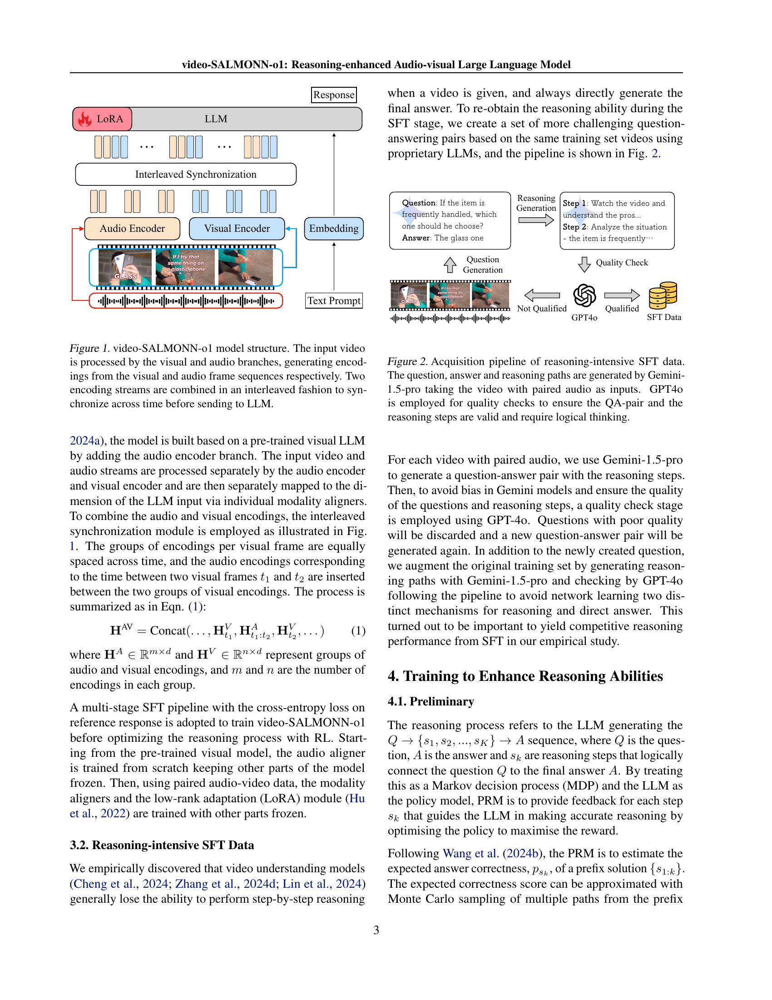
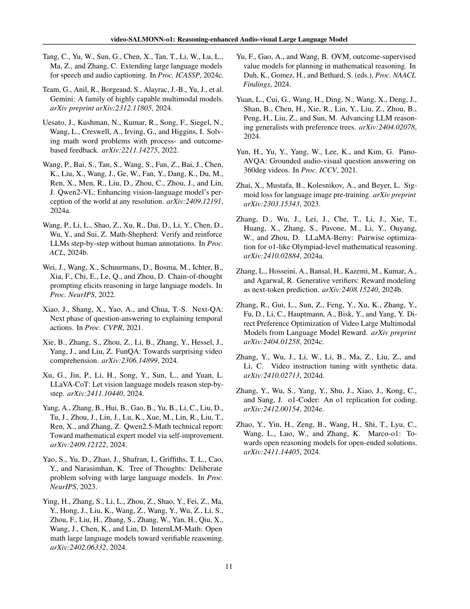
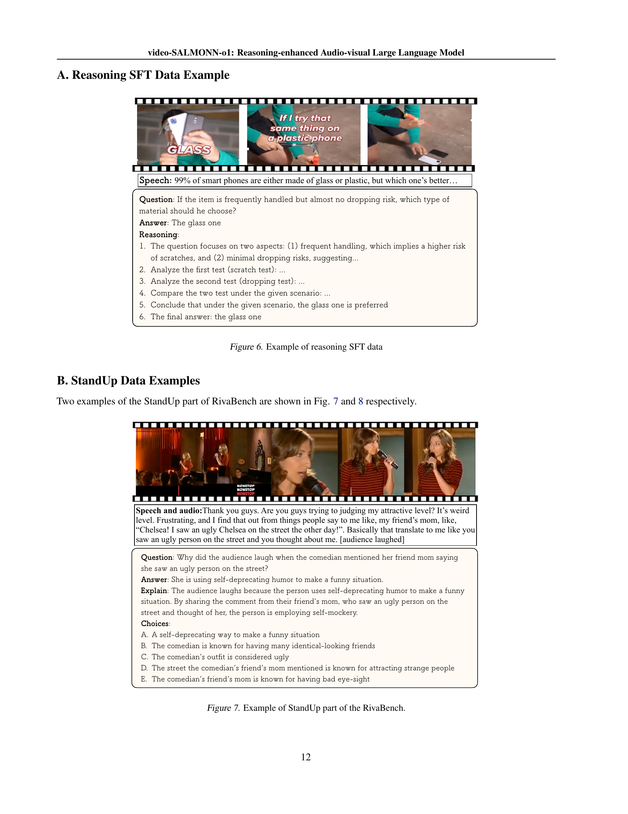

 


 2502.11775 
 Guangzhi Sun et el. 
 
 🤗 2025-02-18 
 



↗ arXiv


↗ Hugging Face


↗ Papers with Code


### TL;DR



최근 몇 년 동안 대규모 언어 모델(LLM)의 추론 능력 향상에 대한 연구가 활발히 진행되어 왔지만, 대부분 수학 문제 해결이나 시각적 그래프 입력에 초점을 맞춰 왔습니다. 이는 일반적인 비디오 이해에는 적용하기 어려운 한계가 있습니다. 본 논문에서는 **일반적인 비디오 이해 작업을 위한 최초의 오픈소스 추론 강화 시각-청각 LLM인 video-SALMONN-01**을 제시합니다.

본 논문에서는 **단계별 솔루션을 포함한 어려운 시각-청각 질문**을 특징으로 하는 **추론 집약적 데이터셋**과, **다중 모드 입력에 최적화된 효율적인 단계 수준 보상 모델링**을 달성하기 위해 **대조적 단계 선택**을 활용하는 **pDPO(Process Direct Preference Optimization)**를 제안합니다. 또한, **4,000개 이상의 고품질 질문-답변 쌍**을 포함하는 **최초의 추론 집약적 비디오 이해 벤치마크인 RivaBench**를 소개합니다. 실험 결과, video-SALMONN-01은 다양한 비디오 추론 벤치마크에서 기준 모델보다 성능이 향상되었음을 보여줍니다.



#### Key Takeaways


 video-SALMONN-01은 오픈소스 시각-청각 대규모 언어 모델로, 비디오 이해 작업에서 추론 능력을 향상시킵니다. 



 pDPO(Process Direct Preference Optimization)는 다중 모드 입력에 맞춘 효율적인 단계 선택을 통해 추론 능력을 향상시킵니다. 



 RivaBench는 고품질의 질문-답변 쌍을 갖춘 최초의 추론 집약적 비디오 이해 벤치마크입니다. 


#### Why does it matter?
이 논문은 **비디오 이해를 위한 추론 능력 향상**이라는 중요한 문제를 다루고 있으며, **새로운 벤치마크와 방법론**을 제시하여 향후 연구에 큰 영향을 미칠 것으로 예상됩니다. **영상 이해 분야의 발전**에 기여하고, **다양한 응용 분야**로 확장될 가능성이 있습니다. 또한, 제시된 **오픈소스 모델과 데이터셋**은 다른 연구자들에게 귀중한 자료가 될 것입니다.

------
#### Visual Insights

> 🔼 본 그림은 video-SALMONN-01 모델의 구조를 보여줍니다. 입력 비디오는 시각 및 오디오 분기로 처리되어 각각 시각 프레임 시퀀스와 오디오 프레임 시퀀스로부터 인코딩을 생성합니다. 두 인코딩 스트림은 시간에 걸쳐 동기화하기 위해 엇갈린 방식으로 결합된 후 LLM으로 전송됩니다.  즉, 시각 정보와 청각 정보를 시간적으로 정렬하여 LLM에 전달하여  더욱 효과적인 이해를 돕는 구조임을 보여줍니다.
> 

> 
read the caption

> Figure 1: video-SALMONN-o1 model structure. The input video is processed by the visual and audio branches, generating encodings from the visual and audio frame sequences respectively. Two encoding streams are combined in an interleaved fashion to synchronize across time before sending to LLM.
> 


| Attribute | Academic | StandUp | SynthDec |
|---|---|---|---|
| Num. of QA | 1,912 | 2,128 | 200 |
| Duration (s) | 47.2 ± 66.1 | 43.2 ± 15.1 | 8.1 ± 3.2 |
| Format | 5-way MCQ | 5-way MCQ | Yes/No |

> 🔼 표 1은 RivaBench 데이터셋의 기본 통계를 보여줍니다. 지속시간은 평균 ± 표준편차로 표시됩니다. SynthDec 분할에는 인간 주석자가 합성 비디오와 유사한 콘텐츠를 갖도록 검색한 100개의 합성 비디오와 100개의 실제 비디오가 포함됩니다. MCQ는 객관식 질문을 의미합니다. 모든 비디오는 YouTube에서 가져왔습니다.  이 표는 RivaBench 데이터셋의 크기, 비디오 길이, 질문 형식 등의 정보를 요약하여 RivaBench 데이터셋의 특징을 한눈에 이해하도록 돕습니다.
> 

> 
read the caption

> Table 1: RivaBench basic statistics. The duration is given by mean ±plus-or-minus\pm± standard deviation. The SynthDec split contains 100 synthetic videos and 100 real videos that human annotators search to have similar content as synthetic videos. MCQ stands for multiple-choice questions. Video sources are all from YouTube.
> 

### In-depth insights

#### Audio-Visual Reasoning
논문에서 "오디오-비주얼 추론"이라는 제목을 가진 부분은 시각 및 청각 정보를 통합하여 추론하는 능력을 다룹니다.  **비디오 이해는 시각적, 청각적 정보가 서로 복잡하게 상호 작용하는 영역**이므로, 이러한 정보를 결합하여 의미있는 추론을 하는 것은 매우 중요합니다. 이는 단순한 정보 결합이 아니라, **시각적 정보와 청각적 정보 간의 관계를 파악하고, 이를 바탕으로 질문에 대한 답을 도출**하는 고차원적인 추론 능력을 필요로 합니다.  **이러한 과정에서 모델은 단순히 정보를 처리하는 것을 넘어, 문맥을 이해하고 상황을 판단**해야 합니다. 예를 들어, 비디오 속 인물의 행동과 말투를 분석하여 감정을 추론하거나, 배경음악과 시각적 효과를 연관 지어 이야기의 전개를 예측하는 등의 작업이 이에 해당합니다. 따라서, **오디오-비주얼 추론은 다양한 영역에서 활용될 수 있는 잠재력**을 가지고 있으며, 효과적인 오디오-비주얼 추론 모델 개발을 위한 연구가 활발히 진행될 것으로 예상됩니다. 특히 **대규모 언어 모델(LLM)과의 결합**을 통해, 더욱 정교하고 복잡한 추론이 가능해질 것으로 기대됩니다.

#### pDPO Optimization
본 논문에서 제안하는 pDPO(process direct preference optimization)는 기존의 강화학습 기반 추론 최적화 방식의 한계를 극복하기 위한 새로운 접근법입니다. **기존 PRM(process reward model) 방식은 각 추론 단계에 대한 보상을 별도로 모델링해야 하므로 계산 비용이 많이 들고 확장성이 떨어지는 단점이 있습니다.**  pDPO는 이러한 문제를 해결하기 위해 **대조적인 단계 선택(contrastive step selection)** 기법을 활용합니다.  이는 효율적인 단계별 보상 모델링을 가능하게 하여 다중 모드 입력에 적합한 효율적인 추론 과정을 가능하게 합니다.  **pDPO는 단계별 쌍대 선호도 모델링(pairwise preference modeling)**을 통해 각 단계의 상대적 중요도를 평가하고, 효율적인 대조 학습을 통해 오류가 발생하기 쉬운 단계를 집중적으로 학습합니다.  **RivaBench라는 새로운 벤치마크를 통해 다양한 시나리오에서 pDPO의 성능을 검증**하였으며, 기존 방법 대비 우수한 성능을 보였습니다.  **특히, 영상 이해 분야에서 복잡하고 어려운 질문에 대한 단계별 솔루션을 제공**하는데 효과적임을 보여주는 핵심적인 기여를 하였습니다.

#### RivaBench Benchmark
RivaBench 벤치마크는 비디오 이해를 위한 최초의 **추론 집약적** 벤치마크로서, **다양한 시나리오**에서 전문가가 엄선한 4,000개 이상의 고품질 질의응답 쌍을 제공합니다.  이는 기존의 비디오 이해 벤치마크와 달리, 단순한 영상 묘사나 인식 능력을 넘어 **추론 능력**을 중점적으로 평가하는 데 초점을 맞춥니다. 특히, **스탠드업 코미디, 학술 발표, 합성 비디오 탐지** 세 가지 대표적인 시나리오를 포함하여 다양한 유형의 질문과 답변을 다룹니다. 이는 모델의 **일반화 능력**과 **다양한 영상 유형에 대한 적응력**을 평가하는 데 유용합니다.  RivaBench는 **고품질 데이터**와 **다양한 시나리오**를 통해,  비디오 이해 모델의 추론 능력을 보다 정확하고 포괄적으로 평가할 수 있게 합니다. 이는 **영상 이해 분야의 발전**에 크게 기여할 것으로 기대됩니다.

#### Zero-Shot Detection
논문에서 제시된 영상 이해 모델이 **제로샷 합성 영상 탐지** 능력을 보여준다는 것은 매우 흥미로운 부분입니다. 이는 모델이 훈련 데이터에 없었던 유형의 영상(합성 영상)에 대해서도 일반화된 추론 능력을 갖추고 있음을 시사합니다.  **기존 모델들이 합성 영상을 실제 영상으로 잘못 분류하는 반면,** 본 논문의 모델은 합성 영상의 특징을 효과적으로 파악하여 제로샷으로 분류할 수 있었다는 점에서 **모델의 강력한 일반화 능력**을 확인할 수 있습니다. 이러한 성과는 모델 설계 및 훈련 과정에서의 **추론 능력 강화 전략**의 효과를 보여주는 중요한 증거가 됩니다.  **추가적으로,**  이러한 제로샷 탐지 능력의 메커니즘에 대한 심층적인 분석은 향후 다양한 영상 이해 문제에 대한 모델 개발 및 개선에 중요한 시사점을 제공할 수 있습니다.  **특히,** 합성 영상의 증가 추세를 고려할 때,  이 모델의 **실용적 가치**는 매우 크다고 할 수 있습니다.

#### Future of Reasoning
추론의 미래는 **대규모 언어 모델(LLM)**의 발전과 밀접한 관련이 있습니다. 현재 LLM은 수학 문제 해결이나 이미지 기반 추론에서 상당한 능력을 보여주지만, **비디오 이해**와 같은 복합적인 다중 모드 작업에서는 여전히 한계가 있습니다.  향후 연구는 **더욱 정교한 다중 모드 LLM**을 개발하는 데 초점을 맞춰야 합니다. 이는 풍부한 오디오-비주얼 데이터와 효과적인 학습 방법을 통해 비디오의 복잡한 시각 및 청각 정보를 정확하게 이해하고 추론할 수 있는 능력을 향상시켜야 함을 의미합니다.  또한, **단계별 추론 과정의 최적화** 및 **효율적인 보상 모델링** 기법 개발도 중요한 연구 과제입니다.  **일반적인 비디오 이해 작업에 초점을 맞춘 새로운 벤치마크** 개발 또한 필수적이며, 이를 통해 다양한 시나리오에서 LLM의 추론 성능을 객관적으로 평가하고 개선할 수 있습니다.  궁극적으로, 추론의 미래는 단순한 답변 생성을 넘어 **설명 가능하고 신뢰할 수 있는 추론 과정**을 제공하는 데 있습니다. 이를 위해서는 **인간의 전문가 지식을 활용한 데이터셋 구축** 및 **해석 가능한 추론 메커니즘 개발**이 중요하며,  **윤리적 고려** 또한 연구 개발 과정 전반에 걸쳐 중요하게 고려되어야 합니다.

### More visual insights

More on figures

> 🔼 그림 2는 추론 집약적 SFT 데이터 획득 파이프라인을 보여줍니다. 비디오와 쌍을 이루는 오디오를 입력으로 사용하여 Gemini-1.5-pro가 질문, 답변 및 추론 경로를 생성합니다. GPT-40은 QA 쌍과 추론 단계가 유효하고 논리적 사고를 필요로 하는지 확인하기 위한 품질 검사에 사용됩니다. 즉, Gemini-1.5-pro가 비디오와 오디오 데이터를 기반으로 질문과 답변을 생성하고, 그에 대한 추론 과정을 제시하면, GPT-40이 이 과정이 타당하고 논리적인지 평가하여 품질을 관리하는 과정입니다. 최종적으로 품질 검사를 통과한 질문, 답변, 추론 경로만 SFT 데이터로 사용됩니다.
> 

> 
read the caption

> Figure 2: Acquisition pipeline of reasoning-intensive SFT data. The question, answer and reasoning paths are generated by Gemini-1.5-pro taking the video with paired audio as inputs. GPT4o is employed for quality checks to ensure the QA-pair and the reasoning steps are valid and require logical thinking.
> 

> 🔼 그림 3은 pDPO를 위한 단계별 예상 정확도 점수를 구성하기 위한 대조적 단계 선택(위쪽)과 쌍별 전개(아래쪽)를 보여줍니다. 대조적 단계 선택: 이 예시에서는 상위 2단계인 s2와 s5가 선택되고, s2에 대해서는 대안 단계인 s2'가 샘플링되어 기본 쌍을 형성합니다. 쌍별 전개: 각 단계에 대해 세 개의 전개가 표시되고, s2와 s2'는 동일한 접두사 솔루션을 가진 단계 쌍입니다. 참조 답변과 비교하여 GPT-40을 사용하여 답변의 정확성을 확인합니다.
> 

> 
read the caption

> Figure 3: Illustration of the contrastive step selection (top) and pairwise rollout (bottom) to construct per-step expected correctness score for pDPO. Contrastive step selection: Top 2 steps, s2subscript𝑠2s_{2}italic_s start_POSTSUBSCRIPT 2 end_POSTSUBSCRIPT and s5subscript𝑠5s_{5}italic_s start_POSTSUBSCRIPT 5 end_POSTSUBSCRIPT are selected in this example, and for s2subscript𝑠2s_{2}italic_s start_POSTSUBSCRIPT 2 end_POSTSUBSCRIPT, an alternative step, s2′subscriptsuperscript𝑠′2s^{\prime}_{2}italic_s start_POSTSUPERSCRIPT ′ end_POSTSUPERSCRIPT start_POSTSUBSCRIPT 2 end_POSTSUBSCRIPT, is sampled to form the preference pair. Pairwise rollout: Three rollouts are shown for each step and s2subscript𝑠2s_{2}italic_s start_POSTSUBSCRIPT 2 end_POSTSUBSCRIPT and s2′subscriptsuperscript𝑠′2s^{\prime}_{2}italic_s start_POSTSUPERSCRIPT ′ end_POSTSUPERSCRIPT start_POSTSUBSCRIPT 2 end_POSTSUBSCRIPT are step pairs with the same prefix solution. The answer correctness is checked using GPT-4o by comparing it against the reference answer.
> 

> 🔼 그림 4는 SFT(Supervised Fine-Tuning) 데이터에서 추론 단계 수의 분포를 보여줍니다. 왼쪽 그래프는 전체 SFT 데이터의 분포를, 오른쪽 그래프는 추론 집약적(reasoning-intensive) 하위 데이터셋의 분포를 나타냅니다. 추론 집약적 하위 데이터셋은 문제의 난이도가 높기 때문에 일반적으로 더 많은 추론 단계가 필요합니다.
> 

> 
read the caption

> Figure 4: Distributions of the numbers of reasoning steps in SFT data. Left: Distribution of the entire SFT data. Right: Distribution on the reasoning-intensive subset of SFT data. Due to the difficulty of the reasoning-intensive subset, more reasoning steps are required in general for samples in this set.
> 

> 🔼 그림 5는 pDPO를 위한 대조적 단계 선택의 효과를 분석한 것입니다. 전체 솔루션 경로 쌍에 더하여 중간 단계 쌍도 항상 사용됩니다.  다양한 상위 T 단계를 선택했을 때의 성능을 비교하여 최적의 단계 선택 전략을 찾고자 하였습니다.  x축은 상위 T 단계 개수를 나타내고, y축은 정확도 또는 다른 적절한 지표를 나타낼 것입니다.  다른 색상은 서로 다른 단계 선택 방법을 나타낼 것입니다. 이 그림을 통해 pDPO에서 중간 단계를 포함하는 것이 전체 솔루션 경로만 사용하는 것보다 성능 향상에 더 효과적이라는 점을 보여줍니다.
> 

> 
read the caption

> Figure 5: Comparison between different top T steps selected for pDPO. Pairs of full solution paths are always used in addition to pairs of intermediate steps.
> 

> 🔼 그림 6은 논문의 3.2절 '추론 집약적 SFT 데이터'에서 설명하는, 비디오 이해 모델을 위한 추론 능력 향상을 위한 강화 학습 데이터의 예시를 보여줍니다. 그림은 질문, 답변, 그리고 단계별 추론 과정을 보여주는 스크린샷과 함께, 사용된 비디오 클립의 일부를 보여줍니다. 각 단계는 해당 비디오 프레임과 함께, 추론 과정의 설명을 포함하고 있습니다. 이는 모델이 단순히 답변을 생성하는 것이 아니라, 단계별로 논리적 추론 과정을 거쳐 답변에 도달하는 방식을 보여주는 예시입니다.
> 

> 
read the caption

> Figure 6: Example of reasoning SFT data
> 

> 🔼 그림 7은 RivaBench 데이터셋의 StandUp 부분의 예시를 보여줍니다. 코미디언의 말과 행동, 청중의 반응 등 다양한 요소들이 포함된 영상 클립과 질문, 답변이 함께 제시되어 있습니다. 이를 통해 모델이 비디오의 내용을 이해하고, 유머의 핵심을 파악하여 질문에 답할 수 있는 능력을 평가할 수 있습니다.
> 

> 
read the caption

> Figure 7: Example of StandUp part of the RivaBench.
> 

> 🔼 그림 8은 RivaBench 데이터셋의 StandUp 부분의 예시를 보여줍니다.  이 그림은 코미디언의 말과 행동, 그리고 청중의 반응을 보여주는 비디오 클립의 일부분과 함께 질문과 답변, 그리고 추가적인 설명을 포함합니다.  StandUp 부분은 코미디 비디오에 대한 질문에 답하기 위해서는 오디오와 비디오 정보를 종합적으로 이해해야 하는 어려운 추론 능력이 요구된다는 점을 보여주기 위해 설계되었습니다.
> 

> 
read the caption

> Figure 8: Example of StandUp part of the RivaBench.
> 

> 🔼 그림 9는 RivaBench 데이터셋의 Academic 부분의 예시를 보여줍니다.  이 그림은 강의 영상의 일부 화면과 함께, 질문, 정답, 그리고 해당 질문에 대한 답을 도출하기 위한 단계별 추론 과정을 보여주는 캡션을 포함하고 있습니다. 이는  비디오 이해를 위한 추론 능력 평가에 사용되는 질문의 유형과 난이도를 보여주는 대표적인 예시입니다.  이 그림을 통해 사용자가  영상과 음성 정보를 통합하여 추론 문제를 해결하는 과정을 이해하는 데 도움이 됩니다.
> 

> 
read the caption

> Figure 9: Example of Academic part of the RivaBench.
> 

> 🔼 그림 10은 RivaBench의 학문적 부분의 예시를 보여줍니다.  영상과 오디오 데이터를 활용하여 학생들의 학습 능력을 평가하는 질문과 답변, 그리고 추론 과정을 보여줍니다.  특히, 로봇 증강 현실(Robot AR) 환경과 줌(Zoom) 환경에서 학생들이 과제를 수행하는 방식의 차이를 보여주는 데이터가 포함되어 있으며, Robot AR 환경이 학습 성과 향상에 미치는 영향을 분석하기 위한 데이터로 사용됩니다.  두 환경에서 학생들이 습득한 핵심 역량(Key Learning Competencies)을 비교 분석하여 Robot AR 환경의 효과를 보여줍니다.  자세하게는, 전압과 전류에 대한 이해, 직렬 및 병렬 연결, 회로 및 구성 요소에 대한 지식, 브레드보드 사용, 멀티미터 측정 및 동작 회로에 대한 이해 등을 평가합니다.
> 

> 
read the caption

> Figure 10: Example of Academic part of the RivaBench.
> 

> 🔼 이 그림은 RivaBench 데이터셋의 SynthDec 부분에 포함된 합성 비디오의 예시 클립을 보여줍니다.  SynthDec는 합성 비디오 감지를 위한 과제로,  실제 비디오와 구별하기 어려운 고품질 합성 비디오를 포함합니다.  그림은 비디오의 일부 프레임을 캡처하여 합성 비디오의 특징과 품질을 보여주고, 모델이 어떤 종류의 시각적 특징을 고려하여 합성 여부를 판단해야 하는지 보여주는 역할을 합니다.
> 

> 
read the caption

> Figure 11: Example video clip of the SynthDec part of RivaBench.
> 

> 🔼 그림 12는 RivaBench의 SynthDec 부분에 대한 예시 비디오 클립을 보여줍니다. 이 그림은 합성 비디오 감지(Synthetic Video Detection) 작업에 사용된 데이터셋의 일부를 보여주는 것으로,  실제 비디오와 구분하기 어려울 정도로 정교하게 제작된 합성 비디오의 예시를 제공합니다.  비디오에는 물리 법칙을 위반하거나 왜곡된 물체가 포함될 수 있으며, 이는 AI 모델이 실제 비디오와 합성 비디오를 구별하는 능력을 평가하는 데 도움이 됩니다.
> 

> 
read the caption

> Figure 12: Example video clip of the SynthDec part of RivaBench.
> 

> 🔼 그림 13은 논문의 RivaBench 벤치마크 중 StandUp 부분에 속하는 예시 비디오와 그에 대한 두 가지 다른 해결책(SFT 모델과 pDPO 모델)을 보여줍니다. SFT(Supervised Fine-Tuning) 모델은 비디오의 내용을 제대로 이해하지 못하여 잘못된 답변을 제시하지만, pDPO(Process Direct Preference Optimization) 모델은 비디오의 시각 및 청각 정보를 종합적으로 분석하여 정확한 답변과 추론 단계를 제시합니다. 이를 통해 pDPO가 더 효과적이고 정확한 추론 능력을 가지고 있음을 시각적으로 보여줍니다. 그림에는 비디오의 일부 프레임과 각 모델의 답변 및 추론 과정이 자세하게 나와 있습니다.
> 

> 
read the caption

> Figure 13: Example video and solutions from the StandUp test set.
> 

> 🔼 그림 14는 VideoMME 테스트 세트의 한 예시 비디오와 그에 대한 두 가지 다른 해결 방법을 보여줍니다. VideoMME는 비디오 이해를 위한 벤치마크이며, 이 그림에서는 비디오에 대한 질문과 그에 대한 두 가지 상반된 답변이 제시됩니다. 첫 번째 답변은 단순히 비디오 내용을 설명하는 반면, 두 번째 답변은 보다 자세한 추론 과정을 통해 답을 도출합니다. 이는 video-SALMONN-01 모델이 단순한 설명을 넘어 추론 능력을 갖추고 있음을 보여주는 예시입니다.
> 

> 
read the caption

> Figure 14: Example video and solutions from videoMME test set.
> 

> 🔼 그림 15는 논문의 VideoMME 테스트 세트에서 발췌한 예시 비디오와 그에 대한 두 가지 다른 해결책을 보여줍니다.  각 해결책은 비디오 내용을 이해하고 질문에 답하기 위한 단계별 추론 과정을 제시합니다. 첫 번째 해결책은 비디오의 시각적 세부 사항을 정확하게 파악하지 못하고 잘못된 결론에 도달하는 반면, 두 번째 해결책은 비디오의 시각 및 청각적 정보를 모두 활용하여 보다 정확하고 논리적인 추론 과정을 보여줍니다. 이를 통해 다양한 모달리티(시각, 청각) 정보를 통합하여 추론하는 모델의 능력과, 부정확한 추론 단계를 식별하고 수정하는 능력을 보여줍니다.  두 해결책의 비교를 통해, 모델의 추론 능력 향상을 위한 효과적인 전략을 파악할 수 있습니다.
> 

> 
read the caption

> Figure 15: Example video and solutions from videoMME test set.
> 

> 🔼 그림 16은 합성 비디오 감지를 위한 video-SALMONN-01, GPT-40, Gemini-1.5-pro 세 가지 모델의 예측 결과를 보여줍니다. 각 모델은 동일한 합성 비디오에 대해 YES(합성 비디오) 또는 NO(실제 비디오)로 응답하고, 그 이유를 단계별로 설명합니다. video-SALMONN-01은 시각적 단서(예: 비정상적인 흐릿함, 왜곡된 신체 부위)를 분석하여 합성 비디오임을 정확하게 판단하는 반면, GPT-40와 Gemini-1.5-pro는 비디오의 자연스러움과 일관성에 기반하여 실제 비디오로 잘못 판단합니다. 이는 video-SALMONN-01이 합성 비디오 감지에 있어 더욱 정교하고 정확한 추론 능력을 가짐을 시사합니다.
> 

> 
read the caption

> Figure 16: Example output from video-SALMONN-o1, GPT-4o and Gemini-1.5-pro for synthetic video detection.
> 

> 🔼 그림 17은 합성 비디오 감지를 위해 video-SALMONN-01, GPT-4, Gemini-1.5-pro 세 가지 모델의 출력 결과를 보여줍니다. 각 모델은 합성 비디오 여부를 판별하고 그 이유를 단계별로 설명합니다. video-SALMONN-01은 비디오의 색상, 그림자 정렬 등을 분석하여 합성 비디오라고 판단하는 반면, GPT-4는 비디오의 자연스러움을 근거로 실제 비디오라고 판단하고, Gemini-1.5-pro는 추가적인 정보 없이는 판단할 수 없다고 응답합니다. 이는 각 모델이 시각적 정보를 해석하고 추론하는 방식의 차이를 보여주는 예시입니다.
> 

> 
read the caption

> Figure 17: Example output from video-SALMONN-o1, GPT-4o and Gemini-1.5-pro for synthetic video detection.
> 

> 🔼 그림 18은 대조적 단계 선택 과정의 예시를 보여줍니다. 두 개의 샘플 경로가 표시되고 각 추론 단계에 대한 점수 d_{s_{k}}가 제공됩니다. 첫 번째 솔루션의 세 번째 단계는 시각적 환각으로 인해 잘못되었으며, 결과적으로 그 단계에 매우 높은 점수가 할당되고 해당 단계가 롤아웃에 사용됩니다. 즉, 시각적 정보 해석에 어려움이 있는 단계를 찾아내어, 해당 단계의 보상 모델링을 개선하는 데 집중하는 것을 보여줍니다. 이는 모델의 시각적 추론 능력 향상을 위한 핵심 전략임을 시사합니다.
> 

> 
read the caption

> Figure 18: Example of the contrastive step selection process where two sampled paths are shown and the scores dsksubscript𝑑subscript𝑠𝑘d_{s_{k}}italic_d start_POSTSUBSCRIPT italic_s start_POSTSUBSCRIPT italic_k end_POSTSUBSCRIPT end_POSTSUBSCRIPT are given for each reasoning steps. The 3rd step in the first solution is wrong due to visual hallucination, and as a result, a very high score is assigned to that step and that step will be used to perform rollout.
> 

More on tables


| Model | Modality | VideoMME | NExT-QA | RivaBench StandUp | RivaBench Academic | RivaBench SynthDec (P/R) |
|---|---|---|---|---|---|---|
| Proprietary models |  |  |  |  |  |  |
| Gemini-1.5-pro (Team et al., 2024) | A+V | 75.0%† | 79.2% | 75.8% | 67.1% | 23.6% (55%/15%) |
| Gemini-1.5-pro+reasoning | A+V | 75.1% | 79.5% | 81.8% | 69.5% | 40.0% (49%/34%) |
| GPT-4o (OpenAI Team, 2024) | V | 71.9%† | 81.7% | 63.3% | 60.0% | 34.1%(90%/21%) |
| GPT-4o+reasoning | V | 72.1% | 81.9% | 69.6% | 61.0% | 25.8%(53%/17%) |
| Open-source baselines |  |  |  |  |  |  |
| LLaVA-OneVision (Li et al., 2024a) | V | 58.2%† | 79.4%† | 67.2% | 45.8% | 0.0%(97%/0%) |
| video-SALMONN (Sun et al., 2024b) | A+V | 43.3% | 49.2% | 47.8% | 33.6% | 0.0%(100%/0%) |
| Video-LLaMA 2.1 (Cheng et al., 2024) | A+V | 54.9%† | 75.6% | 53.7% | 34.3% | 0.0%(99%/0%) |
| video-SALMONN-o1 (ours, SFT) | A+V | 62.9% | 78.2% | 68.6% | 42.5% | 5.8%(97%/5%) |
| video-SALMONN-o1 (ours, pDPO) | A+V | 65.6% | 82.3% | 76.7% | 48.3% | 17.8%(87%/13%) |
> 🔼 표 2는 제안된 video-SALMONN-01 모델의 성능을 다른 시각적(V) 및 시각-청각적(A+V) LLM과 비교하여 보여줍니다.  SFT는 추론 데이터를 사용한 SFT 이후의 모델을 나타내고, pDPO는 동일한 SFT 모델을 기반으로 pDPO를 사용하여 학습된 모델을 나타냅니다. SynthDec에 대해서는 F1 점수(정밀도/재현율)가, 다른 데이터셋에 대해서는 정확도가 보고됩니다. † 기호는 해당 논문에서 직접 가져온 결과임을 나타냅니다. video-SALMONN-01은 추론 중에 추론을 수행하지만 다른 오픈소스 모델은 직접 답변을 제공합니다.
> 

> 
read the caption

> Table 2: Main results of video-SALMONN-o1 compared against other visual (V) and audio-visual (A+V) LLMs. SFT refers to the model after SFT with reasoning data and pDPO refers to the model obtained after training with pDPO based on the same SFT model. F1-score (Precision/Recall) is reported for SynthDec and accuracy is reported for others. Results with ††\dagger† are directly taken from the corresponding papers. video-SALMONN-o1 performs reasoning during inference and other open-source models give answers directly.
> 


| Training Data | Inference Reasoning | VideoMME | NExT-QA | Academic | StandUp |
|---|---|---|---|---|---| 
| Full SFT data | &#x2713; | 63.7% | 80.7% | 45.2% | 72.3% |
| Full SFT data | ✓ | 62.9% | 78.2% | 42.5% | 68.6% |
| w/o any reasoning | &#x2713; | 63.2% | 81.0% | 44.1% | 71.1% |
| w/o reasoning-intensive part | &#x2713; | 62.7% | 78.9% | 44.7% | 71.5% |
| w/o reasoning-intensive part | ✓ | 61.6% | 76.6% | 42.3% | 67.5% |
| Reasoning-intensive part only | ✓ | 58.8% | 75.2% | 40.1% | 63.5% |
| Full SFT data + pDPO | ✓ | **65.6**% | **82.3**% | **48.3**% | **76.7**% |
> 🔼 표 3은 오디오-비주얼 SFT 데이터의 여러 부분이 VideoMME, 학술, 스탠드업 테스트 세트에 미치는 영향을 보여줍니다. 두 번째로 좋은 결과에는 밑줄이 표시되어 있습니다. '추론 집약 부분 없이'는 추론 집약 SFT 데이터를 제거한 것을 의미하며, '추론 없이'는 SFT 중에 답변을 직접 출력하는 것을 의미합니다. '추론 집약 부분만'은 QA에 대해 항상 추론을 수행합니다.
> 

> 
read the caption

> Table 3: Effect of different parts of the audio-visual SFT data on VideoMME, Academic and StandUp test sets. Underscore for second-best results. “w/o reasoning-intensive part” means removing the reasoning-intensive SFT data, and “w/o any reasoning” always directly outputting answers during SFT. “Reasoning-intensive part only” always performs reasoning for QA.
> 


| Training Configuration | Inference | VideoMME | NExT-QA | StandUp | Academic |
|---|---|---|---|---|---| 
| SFT | 1-best | 62.9% | 78.2% | 68.6% | 42.5% |
| SFT | Major@20 | 63.5% | 81.5% | 73.5% | 45.3% |
| SFT + ORM | RM@20 | 62.7% | 78.5% | 69.0% | 42.6% |
| SFT + PRM | RM@20 | 63.5% | 79.3% | 72.1% | 43.9% |
| SFT + pDPO | 1-best | **65.6**% | **82.3**% | **76.7**% | **48.3**% |
> 🔼 표 4는 다양한 보상 모델링 방법이 VideoMME, NEXT-QA, RivaBench의 StandUp 및 Academic 분할에 미치는 영향을 보여줍니다. Major@20 및 RM@20은 Zhang et al.(2024a)에 따라 평가되었으며, 여기서 Major@20은 20개의 샘플 경로에 대한 다수결 투표의 정확도를 나타내고 RM@20은 20개의 샘플에 대한 최고 n을 나타냅니다. 샘플은 모두 SFT 이후의 모델에서 생성됩니다. 전체 경로를 사용하는 pDPO는 완전한 추론 경로의 선호도 쌍만을 사용합니다.
> 

> 
read the caption

> Table 4: Effect of different reward modelling methods on VideoMME, NExT-QA, the StandUp and Academic split of RivaBench. Major@20 and RM@20 are evaluated following Zhang et al. (2024a), where Major@20 refers to the accuracy under majority voting with 20 sampled paths, and RM@20 is the best-of-n with 20 samples. Samples are all generated from the model after SFT. pDPO with full paths only uses preference pairs of complete reasoning paths.
> 


| Type | Prompt content |
|---|---| 
| Direct answer | &lt;VIDEO&gt;Select the best answer to the following question based on the video. Respond with only the letter of the correct option. |
|  | {Question} |
|  | Choose from: A. {Option A}, B, {Option B}… |
| Reasoning | &lt;VIDEO&gt; Question: |
|  | {Question} |
|  | Choose from: A. {Option A}, B, {Option B}… |
|  | Answer the question step by step. Output each thinking step. Mark the end of each step with &lt;end_of_step&gt; token. |
| SynthDec | An AI-generated video contains unnatural distorted things, such as distorted hands or faces. Is the given video AI generated? Answer YES or NO. Answer step by step and output each step clearly. |
> 🔼 표 5는 다양한 유형의 작업에 사용되는 프롬프트를 보여줍니다. 세 가지 유형의 작업(직접 답변, 추론, 합성 감지)에 대해 각기 다른 프롬프트가 제공됩니다. 직접 답변 작업의 경우, 비디오를 기반으로 질문에 대한 최상의 답변을 선택하라는 프롬프트가 제공됩니다. 추론 작업의 경우, 단계별로 질문에 답하고 각 단계의 끝에 <end_of_step> 토큰을 표시하라는 프롬프트가 제공됩니다. 합성 감지 작업의 경우, 비디오에 왜곡된 부분(예: 왜곡된 손이나 얼굴)이 있는지 확인하고 단계별로 답변하라는 프롬프트가 제공됩니다.
> 

> 
read the caption

> Table 5: Prompt used for different types of tasks.
> 

### Full paper



