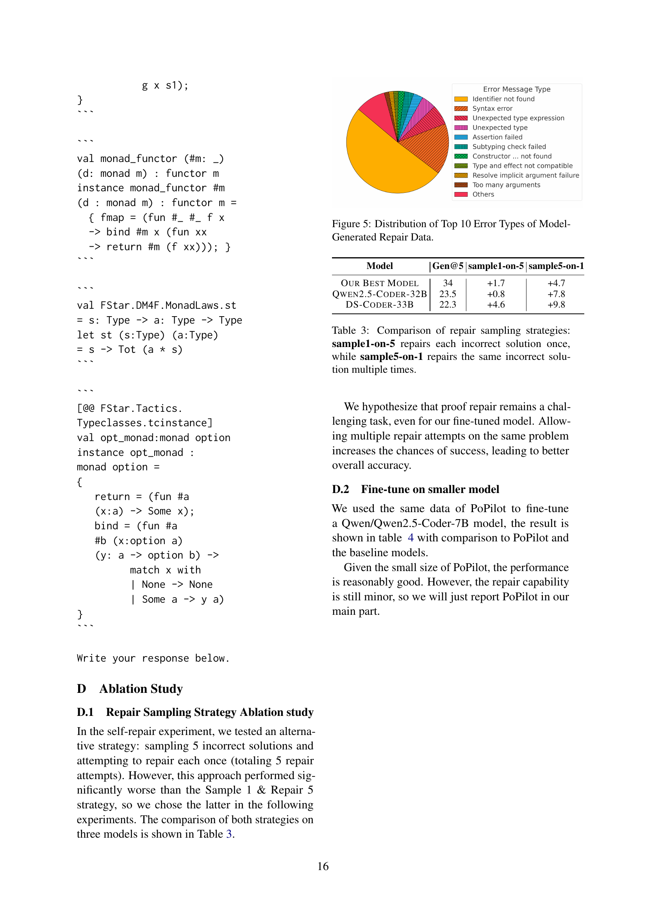

 


 2502.11901 
 Dylan Zhang et el. 
 
 🤗 2025-02-18 
 



↗ arXiv


↗ Hugging Face


↗ Papers with Code


### TL;DR



소프트웨어의 안전성과 신뢰성 확보가 중요해짐에 따라, 증명 지향 프로그래밍(proof-oriented programming)에 대한 관심이 높아지고 있습니다. 하지만, 증명 지향 프로그래밍 언어에 대한 데이터 부족과 복잡한 추론 과정으로 인해 기존의 대규모 언어 모델(LLM)은 성능이 제한적이었습니다.

본 논문에서는 이러한 문제를 해결하기 위해, 합성 데이터 증강 기법을 활용한 새로운 모델 PoPilot을 제시합니다. PoPilot은 증명 지향 프로그래밍 언어에 대한 기본 문제를 생성하고, 기존 저장소의 코드를 활용하여 다양한 코드 데이터를 통합하며, 새로운 증명 및 수정 데이터를 생성하는 방식을 통해 데이터 부족 문제를 해결합니다. 그 결과, 기존 모델보다 64% 향상된 성능을 보였고, GPT-40의 성능 또한 54% 향상시켰습니다.



#### Key Takeaways


 합성 데이터 증강을 통해 데이터 부족 문제를 해결하여, 증명 지향 프로그래밍 모델의 성능을 크게 향상시켰습니다. 



 PoPilot 모델은 GPT-40보다 64% 높은 성능을 보이며, 프로젝트 수준의 증명 생성 및 수정 작업에서 우수한 성능을 입증했습니다. 



 본 연구는 저자원 언어 모델의 성능 향상 방안을 제시하며, 증명 지향 프로그래밍 분야의 발전과 다른 분야로의 확장 가능성을 제시합니다. 


#### Why does it matter?
**본 논문은 데이터 부족 문제를 해결하기 위해 합성 데이터 증강 기법을 제시함으로써, 기존의 대규모 언어 모델보다 64% 향상된 성능을 보이는 새로운 증명 지향 프로그래밍 모델을 개발한 연구입니다.** 이는 소프트웨어 검증 분야에서 중요한 진전으로, 안전과 보안이 중요한 시스템의 신뢰성을 높이는 데 기여할 수 있습니다. 또한, **저자원 언어 모델의 성능 향상 방안을 제시하여, 다양한 프로그래밍 언어 분야에 적용 가능성을 보여줍니다.** 앞으로 증명 지향 프로그래밍 분야의 발전과 다른 저자원 언어 모델에 대한 연구에 중요한 영향을 미칠 것으로 예상됩니다. 특히, 합성 데이터 증강 기법은 향후 연구에서 다양한 응용 분야에 적용될 수 있는 잠재력을 가지고 있습니다.

------
#### Visual Insights

> 🔼 그림 1은 저장소 수준 데이터 생성 파이프라인을 보여줍니다. 기존 저장소의 타입 선언 및 증명을 사용하여 새로운 문제를 생성하는 문제 합성 루프와, 기존 저장소 내에서 새로운 증명과 수정 데이터를 만드는 수정 루프의 두 가지 주요 구성 요소로 이루어져 있습니다. 이러한 합성 및 수정 데이터는 증강된 데이터로 결합되어 LLM(대규모 언어 모델)을 미세 조정하는 데 사용됩니다. 미세 조정된 LLM은 증명 생성과 수정 모두에 사용될 수 있습니다.
> 

> 
read the caption

> Figure 1: Illustration of repository-level data generation pipeline.
> 


| Model | Pass@1 | +Repair |
|---|---|---|
| Qwen-2.5-coder-7B-instruct | 0.25 | 0.30 |
| Qwen-2.5-coder-14B-instruct | 0.50 | 0.55 |
| Qwen-2.5-coder-32B-instruct | 0.48 | 0.58 |
| Qwen-2-72B-instruct | 0.34 | 0.43 |
| DeepSeek-Coder-V2-Lite-Instruct | 0.43 | 0.53 |
| LLama-3.1-70B | 0.21 | 0.27 |
| GPT-4o | 0.60 | 0.70 |
| **Fine-tune Data Mixture** |  |  |
| 54K F* Only | 0.42 | 0.47 |
| + Evol | 0.52 | 0.56 |
| 93K F* Only | 0.48 | 0.52 |
| + DSP-V1 | 0.52 | 0.54 |
| + DSP-V1 + Evol + CodeAlpaca + RBR | **0.58** | **0.62** |
| - F* NL2Code | 0.48 (**-)** | 0.52(**-)** |

> 🔼 표 1은 다양한 모델과 미세 조정 데이터 혼합에 따른 성능 비교 결과를 보여줍니다.  'F* only'는 합성 F* 데이터를, 'Evol'은 80K(54K F*) / 50K(93K F*) Magicoder-Evol-Instruct 데이터를, 'DSP-V1'은 20K Deepseek-Prover-V1 데이터를, 'CodeAlpaca'는 15K CodeAlpaca 데이터를, 'RBR'은 15K RunBugRun 데이터를 각각 사용한 결과를 나타냅니다.  각 모델의 Pass@1(한 번 시도 성공률)과 Pass@1+Repair(수정 후 성공률)을 비교하여 어떤 모델과 데이터 혼합 방식이 가장 효과적인지 보여줍니다.
> 

> 
read the caption

> Table 1: Performance comparison across different models and fine-tuning data mixtures. F* only: synthetic F* data, Evol: 80K (54K F*) / 50K (93K F*) Magicoder-Evol-Instruct data, DSP-V1: 20K Deepseek-Prover-V1 data, CodeAlpaca: 15K CodeAlpaca data, RBR: 15K RunBugRun data
> 

### In-depth insights

#### Proof-Oriented LLM
**증명 지향적 거대 언어 모델(LLM)**은 소프트웨어의 정확성과 안전성을 보장하기 위해 형식적 검증을 통합하는 프로그래밍 패러다임인 증명 지향적 프로그래밍(POP)을 위한 새로운 가능성을 제시합니다.  기존 LLM들이 POP 언어(예: F*)의 데이터 부족으로 어려움을 겪는 반면, 증명 지향적 LLM은 **합성 데이터 증강**을 통해 이 문제를 해결하고자 합니다. 이는 기본적인 POP 문제를 생성하고, 기존 저장소 내에서 새로운 증명과 수정 데이터를 만드는 것을 포함합니다.  **합성 데이터를 사용함으로써**,  LLM은 다양한 코드 데이터로 추론 능력을 향상시키고 프로젝트 수준의 코드에 대한 증명을 생성하고 수정할 수 있습니다.  결과적으로,  **프로젝트 수준의 POP에서 GPT-40보다 64% 향상된 성능**을 보이는 PoPilot과 같은 모델을 만들어 낼 수 있습니다.  **데이터 다양성**은 이러한 모델의 성능 향상에 중요하며,  다양한 프로그래밍 언어의 데이터를 통합하는 것이 효과적임을 보여줍니다.  **증명 지향적 LLM은 소프트웨어 안전성에 대한 요구가 높아지는 시대**에,  소프트웨어 개발 과정에서 형식적 검증의 채택을 가속화할 수 있는 잠재력을 가지고 있습니다.

#### Synthetic Data Aug
본 논문에서 제시된 'Synthetic Data Augmentation' 전략은 **데이터 부족 문제**를 해결하기 위한 핵심적인 방법론입니다.  기존의 증명 기반 프로그래밍 언어(예: F*) 데이터셋의 규모가 작고, 프로젝트 수준의 구현 사례가 부족한 현실을 감안하여 **인공 데이터를 생성**하는 접근법을 취합니다. 이는 단순히 기존 데이터를 변형하는 것 이상으로, **다양한 유형의 프로그래밍 문제** (자연어-코드 변환, 코드 완성, 코드 수정)를 포함한 **합성 데이터셋**을 구축하여 모델의 일반화 능력 및 추론 능력 향상에 기여합니다. 특히, 프로젝트 수준의 합성 데이터 생성은 **모델의 실제 적용성을 높이는 데 중요**하며, 기존 모델의 성능을 상당히 개선하는 결과를 보여줍니다.  **GPT-40 대비 64% 성능 향상**이라는 결과는 이러한 합성 데이터 증강 전략의 효과를 명확히 보여주는 사례입니다.  하지만, **데이터 품질 관리** 및 **편향성 문제**에 대한 고려가 필요하며, 더욱 다양한 프로그래밍 언어 및 실제 프로젝트에 대한 적용 가능성을 확인하는 후속 연구가 필요할 것으로 예상됩니다.

#### PoPilot: Model & Data
본 논문에서 제시된 PoPilot 모델과 데이터는 **프루프 지향 프로그래밍(Proof-Oriented Programming)** 분야의 어려움인 데이터 부족 문제를 해결하기 위한 혁신적인 시도를 보여줍니다.  **합성 데이터 증강** 기법을 통해 F* 언어를 위한 충분한 데이터를 생성하고, 다양한 프로그래밍 과제를 통해 모델의 추론 능력을 향상시켰습니다. 특히, **기존 저장소의 코드를 활용한 합성 데이터 생성** 및 **실패한 증명 수정 데이터 생성** 기법은 실제 시나리오를 반영하여 모델의 성능 향상에 크게 기여했습니다. PoPilot은 이러한 데이터들을 바탕으로 **프루프 생성 및 수정** 모두에서 우수한 성능을 보였으며, 특히 GPT-40 대비 64% 향상된 성능을 기록하여 **대규모 언어 모델을 프루프 지향 프로그래밍에 적용하는 새로운 가능성**을 제시했습니다.  하지만, **F* 언어에 특화된 데이터**라는 점과 **데이터 합성 과정의 복잡성**은 향후 연구에서 개선해야 할 부분입니다.  더 다양한 프로그래밍 언어와 데이터셋을 활용하여 PoPilot의 일반화 성능을 높이는 연구가 필요할 것으로 보입니다.

#### Project-Level Eval
논문의 "Project-Level Eval" 부분은 **프로젝트 수준의 실제 코드베이스에서 모델의 성능을 평가**하는 데 초점을 맞춘 것으로 보입니다. 단순한 함수 수준의 평가를 넘어, 실제 소프트웨어 개발 환경에서의 복잡성과 상호 의존성을 고려하여 모델의 일반화 능력과 실용성을 측정하려는 시도로 해석됩니다. 이는 단순히 합성 데이터나 작은 예제로는 드러나지 않는 **모델의 한계점과 강점**을 보다 정확하게 파악하는 데 중요한 과정입니다.  **다양한 프로젝트 규모와 복잡도의 코드베이스를 사용**하여 평가함으로써, 모델의 확장성과 실제 적용 가능성을 판단하는 객관적인 지표를 제시할 수 있을 것입니다. 또한, 이를 통해 **개발 과정에서의 실질적인 문제 해결 능력**을 평가하여 모델의 실용적 가치를 높일 수 있습니다.  결론적으로, "Project-Level Eval"은 단순한 성능 측정을 넘어, **실제 세계의 문제 해결에 대한 모델의 적합성**을 평가하는 중요한 지표가 될 것으로 예상됩니다.

#### Future Work & Limits
본 논문은 데이터 부족 환경에서의 증명 지향 프로그래밍(proof-oriented programming)에 대한 LLM의 성능 향상에 초점을 맞추고 있습니다. **향후 연구 방향으로는 다른 프로그래밍 언어로의 확장과 더욱 복잡한 프로젝트 수준의 문제 해결에 대한 연구가 필요합니다.**  **현재 F* 언어에 국한된 모델의 일반화 능력 향상을 위해 다양한 프로그래밍 언어의 데이터를 활용한 추가적인 연구가 요구됩니다.** 또한, **더욱 정교하고 복잡한 증명 문제를 생성하고 해결하는 모델의 능력을 높이는 방안을 모색해야 합니다.**  **모델의 성능 평가 지표를 다양화하여, 단순한 정확도 측정을 넘어 증명의 효율성 및 가독성과 같은 요소들을 고려하는 것이 중요합니다.**  마지막으로, **현재 모델의 한계점을 명확히 파악하고 이를 극복하기 위한 구체적인 전략을 수립해야 합니다.**  예를 들어, 모델의 학습 데이터의 품질 향상과 더불어, 모델이 이해할 수 없는 복잡한 코드에 대한 처리 전략을 마련하는 것이 중요한 과제가 될 것입니다.  결론적으로, 향후 연구는 **모델의 일반화 능력 향상, 복잡한 문제 해결 능력 제고, 그리고 다양한 성능 평가 지표의 활용**에 초점을 맞춰야 할 것입니다.

### More visual insights

More on figures

> 🔼 그림 2는 논문에서 제시된 함수 수준의 증명 기반 프로그래밍의 예시를 보여줍니다.  F* 언어로 작성된 코드 조각과, 그 코드 조각에 대한 속성을 증명하는 코드를 함께 보여줍니다.  이 예시는 주어진 리스트의 길이를 계산하는 함수 (`list_with_length`)와, 이 함수가 리스트의 원래 길이를 유지한다는 것을 증명하는 보조정리(`lemma_length_preserved`)로 구성되어 있습니다.  이를 통해, 논문에서 제시하는 합성 데이터 증강 기법을 사용하여 LLM이 함수 수준의 증명 기반 프로그래밍을 학습하는 과정을 설명하기 위한 구체적인 예시를 제공합니다.
> 

> 
read the caption

> Figure 2: Function-level Proof-oriented programming example.
> 

> 🔼 이 그림은 새로 생성된 정의와 기존 정의의 길이를 비교하여 보여줍니다. 가로축은 정의의 길이(토큰 수)를 나타내고, 세로축은 각 길이에 해당하는 정의의 빈도수를 나타냅니다. 두 개의 막대 그래프가 있는데, 하나는 기존 저장소에서 가져온 정의의 길이 분포를, 다른 하나는 모델이 새로 생성한 정의의 길이 분포를 보여줍니다. 이 그림을 통해 모델이 생성한 정의의 길이가 기존 정의의 길이와 어떻게 다른지, 그리고 생성된 정의의 길이 분포가 어떠한지 확인할 수 있습니다.  특히 긴 정의를 생성하는 데 어려움을 겪는다는 것을 보여줍니다.
> 

> 
read the caption

> Figure 3: Length Comparison between Generated Definitions vs Existing Definitions.
> 

> 🔼 그림 4는 최첨단 모델이 생성한 잘못된 출력 결과를 PoPilot이 수정하는 과정을 보여줍니다.  다양한 최첨단 모델(Qwen2.5-Coder-32B-Instruct, DS-Coder-33B-Ins, GPT-40, Qwen2.5-72B-Ins, Llama-3.3-70B-Ins)들이 생성한 잘못된 F* 코드를 PoPilot이 얼마나 효과적으로 수정하는지 보여주는 막대 그래프입니다.  Gen@5는 5번 시도 중 정답률을 나타내고, Self Repair@5는 모델 자체의 오류 수정 능력을, Ours Repair@5는 PoPilot을 사용한 오류 수정 능력을 각각 나타냅니다. PoPilot이 다른 모델의 오류를 수정하는 데 있어 뛰어난 성능을 보임을 시각적으로 확인할 수 있습니다. 특히 자체 오류 수정(Self Repair)에 비해 PoPilot을 이용한 오류 수정(Ours Repair)의 정확도가 크게 향상되었음을 보여줍니다.
> 

> 
read the caption

> Figure 4: PoPilot repairing failed outputs for state-of-the-art models.
> 

> 🔼 그림 5는 모델이 생성한 수정 데이터에서 상위 10개 오류 유형의 분포를 보여줍니다. 모델이 생성한 코드 수정에서 가장 흔하게 발생하는 오류 유형은 식별자를 찾을 수 없음, 구문 오류, 예상치 못한 유형 표현식, 예상치 못한 유형, 어설션 실패, 하위 유형 검사 실패, 생성자를 찾을 수 없음, 유형 및 효과가 호환되지 않음, 암시적 인수 확인 실패, 인수가 너무 많음 등입니다. 이러한 오류 유형의 분포는 모델의 F* 언어에 대한 이해도와 교육 데이터의 충분성을 나타내는 지표로 활용될 수 있습니다.
> 

> 
read the caption

> Figure 5: Distribution of Top 10 Error Types of Model-Generated Repair Data.
> 

More on tables


| Baseline Models | Generate@5 | Repair@5 | Gen+Rep (Total 10) | Generate@10 |
|---|---|---|---|---|
| Qwen2.5-Coder-32B-Instruct | 23.5 | 0.8 | 24.3 | 27.1 |
| Deepseek-Coder-33B-Instruct | 22.3 | 4.6 | 26.9 | 28.8 |
| GPT-4o | 22.2 | 1.7 | 23.9 | 23.8 |
| Qwen2.5-72B-Instruct | 23.4 | 3.0 | 26.4 | 25.8 |
| Llama-3.3-70B-Instruct-Turbo | 19.6 | 3.9 | 23.5 | 21.6 |
| **Data Mixture** |  |  |  |  |
| *Existing Repos* | 30.7 | 1.0 | 31.7 | 35.3 |
| + Syn. Project Proof | 32.2 | 2.2 | 34.4 | 36.2 |
| + Func + Syn. Project Proof | 32.8 | 2.7 | 35.5 | 37.8 |
| + Syn. Project Proof + Syn. Repair | 32.7 | 0.7 | 33.4 | 37.5 |
| + Syn. Project Proof + Model Repair | 33.1 | 4.2 | 37.3 | 37.2 |
| + Syn. Project Proof + All Repair | **34.0** | 4.7 | 38.7 | 38.0 |
| PoPilot | 33.0 | **6.4** | **39.4** | **38.5** |
> 🔼 표 2는 기준 모델과 미세 조정 데이터 구성에 대한 성능 비교를 보여줍니다. 기존 저장소(Existing Repos): 시드 데이터셋의 기존 저장소 수준 정의 및 증명 30K개; 합성 프로젝트 증명(Syn. Project Proof): 4.1절에 설명된 대로 모델이 생성한 새로운 정의 및 증명 30K개; 함수(Func): 5.2절의 다른 데이터셋과 혼합된 합성 간단 질문; 합성 복구(Syn. Repair): 4.2.1절의 합성 복구 데이터 30K개; 모델 복구(Model Repair): 4.2.2절의 모델이 생성한 복구 데이터 30K개; 모든 복구(All Repair): 합성 복구 + 모델 복구; PoPilot: 표 1에서 최고 성능을 미세 조정하는 데 사용된 기존 저장소 + 합성 프로젝트 증명 + 모든 복구 + 180K개의 혼합 함수 수준 코딩 데이터
> 

> 
read the caption

> Table 2: Performance comparison of baseline models and fine-tuning data configurations. Existing Repos: 30K existing repository level definition + proofs from the seed dataset; Syn. Project Proof : 30K model generated new definitions + proofs as described in 4.1; Func: synthetic simple questions mixed with other datasets in 5.2; Syn. Repair: 30K synthetic repair data in 4.2.1, Model Repair: 30K model-generarted repair data in 4.2.2; All Repair: Syn. Repair + Model Repair; PoPilot: Existing Repos + Syn. Project Proof + All Repair + 180K mixed function-level coding data used to finetune the best performance in Table 1
> 


| Model | Gen@5 | sample1-on-5 | sample5-on-1 |
|---|---|---|---| 
| Our Best Model | 34 | +1.7 | +4.7 |
| Qwen2.5-Coder-32B | 23.5 | +0.8 | +7.8 |
| DS-Coder-33B | 22.3 | +4.6 | +9.8 |
> 🔼 표 3은 잘못된 솔루션을 수정하는 두 가지 전략을 비교한 것입니다. sample1-on-5는 각 잘못된 솔루션을 한 번만 수정하고, sample5-on-1은 동일한 잘못된 솔루션을 여러 번 수정합니다. 이 표는 동일한 잘못된 솔루션에 대한 여러 번의 수정 시도가 성공률에 미치는 영향을 보여줍니다.
> 

> 
read the caption

> Table 3: Comparison of repair sampling strategies: sample1-on-5 repairs each incorrect solution once, while sample5-on-1 repairs the same incorrect solution multiple times.
> 


| Baseline Models | Generate@5 | Repair@5 | Gen+Rep (Total 10) | Generate@10 |
|---|---|---|---|---|
| Qwen2.5-Coder-32B-Instruct | 23.5 | 0.8 | 24.3 | 27.1 |
| Deepseek-Coder-33B-Instruct | 22.3 | 4.6 | 26.9 | 28.8 |
| GPT-4o | 22.2 | 1.7 | 23.9 | 23.8 |
| Qwen2.5-72B-Instruct | 23.4 | 3.0 | 26.4 | 25.8 |
| Llama-3.3-70B-Instruct-Turbo | 19.6 | 3.9 | 23.5 | 21.6 |
| **Fine-tuned model** |  |  |  |  |
| PoPilot-small | 21.9 | 3.9 | 25.8 | 29.2 |
| **PoPilot** | **33.0** | **6.4** | **39.4** | **38.5** |
> 🔼 표 4는 보다 작은 모델(Qwen2.5-Coder-7B를 기반으로 함)에 대한 성능 비교 결과를 보여줍니다.  기존의 대규모 언어 모델들(Qwen2.5-Coder-32B-INSTRUCT, Deepseek-Coder-33B-INSTRUCT, GPT-40, Qwen2.5-72B-INSTRUCT, LLaMa-3.3-70B-INSTRUCT-TURBO)과 비교하여,  작은 모델을 fine-tuning한 결과(POPILOT-SMALL)와 논문의 주요 모델인 POPILOT의 성능을 보여줍니다.  Generate@5, Repair@5, Gen+Rep (Total 10), Generate@10 지표를 통해 코드 생성 및 복구 능력을 평가합니다.
> 

> 
read the caption

> Table 4: Performance comparison of the small model
> 

### Full paper



