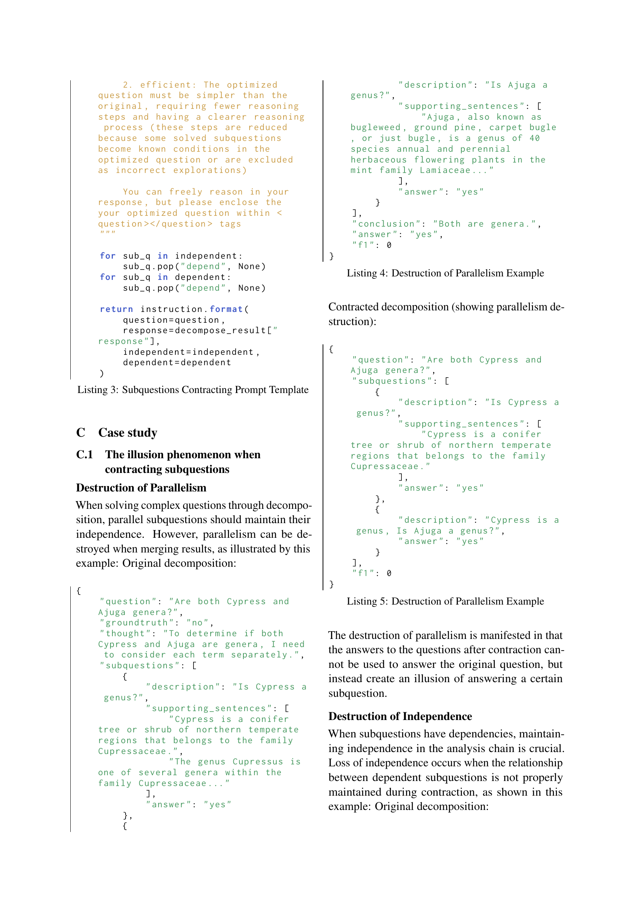
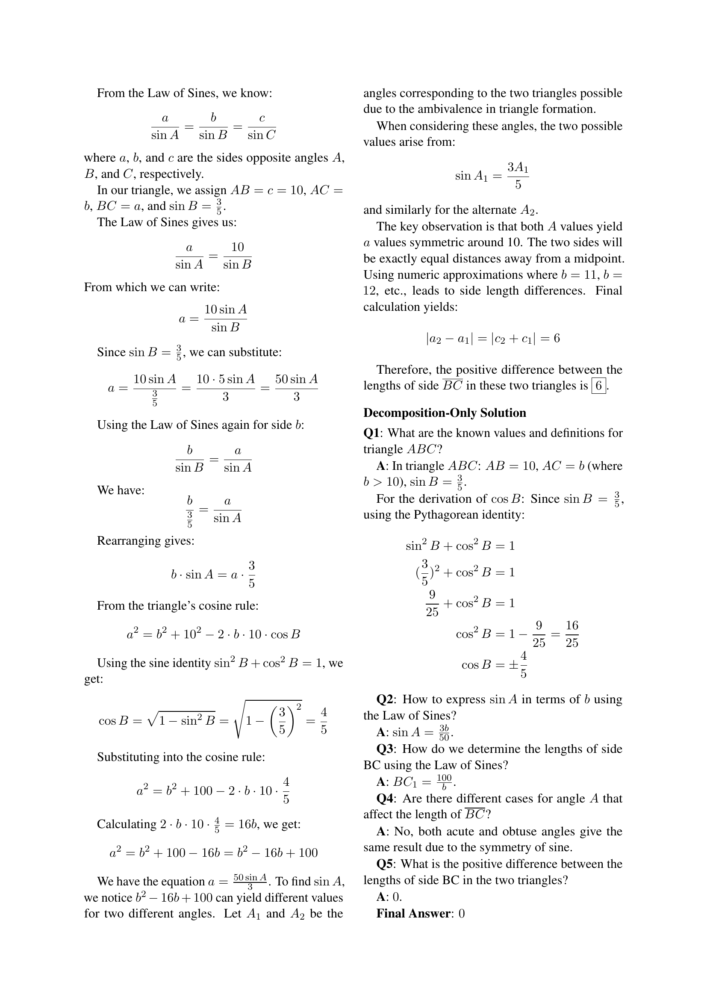
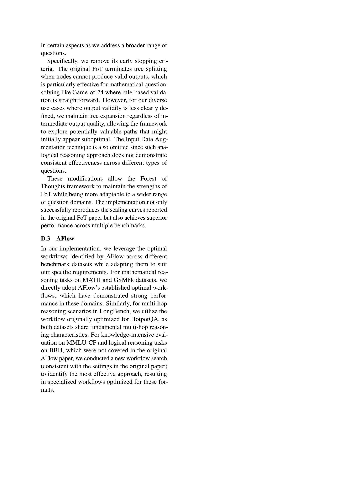

 


 2502.12018 
 Fengwei Teng et el. 
 
 🤗 2025-02-19 
 



↗ arXiv


↗ Hugging Face


↗ Papers with Code


### TL;DR



대규모 언어 모델(LLM)은 훈련 및 테스트 시간 확장을 통해 성능을 향상시키지만, 기존의 테스트 시간 확장 기법들은 과거 정보 누적 문제로 인해 계산 자원 낭비 및 추론 효율 저하를 야기합니다. 이러한 문제는 특히 복잡한 추론 과정에서 두드러집니다.

본 연구에서는 인간의 추론 과정이 마르코프 프로세스와 유사하게 독립적인 하위 질문들을 해결하는 방식으로 진행되는 점에 착안하여, **Atom of Thoughts (AOT)**라는 새로운 테스트 시간 확장 기법을 제안합니다. AOT는 현재 질문을 하위 질문들로 분해하고, 이들을 다시 통합하여 새로운 원자적 질문 상태를 생성하는 반복적인 과정을 통해 마르코프 전이를 구현합니다. 이를 통해 과거 정보 누적 문제를 해결하고, 추론 효율성을 높입니다.



#### Key Takeaways


 Atom of Thoughts (AOT)는 마르코프 프로세스 기반의 추론 방식을 통해 복잡한 추론 과정을 독립적인 하위 질문으로 분해하고, 계산 비용을 절감하며 추론 효율성을 향상시킵니다. 



 AOT는 기존의 테스트 시간 확장 방법들과의 통합이 용이하며, 플러그인 방식으로 기존 방법들을 개선하는 데 활용될 수 있습니다. 



 여러 벤치마크 실험 결과를 통해 AOT가 단독 프레임워크 및 플러그인 방식 모두에서 우수한 성능을 보임을 입증합니다. 


#### Why does it matter?
본 논문은 **테스트 시간 확장(test-time scaling)** 방법의 효율성을 높이는 데 중요한 의미를 가집니다. 기존 방법들이 과도한 과거 정보 축적으로 인해 계산 비용이 많이 들고 추론 효율이 떨어지는 문제점을 지적하고, 이를 해결하기 위한 새로운 방법인 **Atom of Thoughts (AOT)**를 제시합니다. AOT는 마르코프 프로세스 기반의 추론 방식으로, **메모리 효율성과 계산 효율성을 높여** 대규모 언어 모델의 추론 성능을 향상시키는 데 기여합니다.  **다양한 벤치마크 실험 결과**를 통해 AOT의 우수성을 입증하고 있으며, 이는 앞으로 **추론 효율성 개선에 대한 연구 방향**을 제시하는 데 중요한 의미를 가집니다.

------
#### Visual Insights

> 🔼 그림 1은 테스트 시간 확장 방법에서 계산 자원 할당을 비교한 것입니다. 기존의 테스트 시간 확장 방법은 과거 정보를 처리하는 데 일부 계산 자원을 할당하지만, AoT는 현재 원자 질문 상태와 직접적으로 관련된 추론에 모든 계산 자원을 할당합니다. 즉, AoT는 과거 정보에 계산 자원을 낭비하지 않고 현재 질문에 집중하여 효율성을 높입니다.
> 

> 
read the caption

> Figure 1: Comparison of computational resource allocation in test-time scaling methods. Traditional test-time scaling methods allocate computational resources partially to process historical information, while AoT dedicates all computational resources to reasoning directly related to the current atomic question state.
> 


| Method | MATH | GSM8K | BBH | MMLU-CF | HotpotQA | LongBench | Avg. |
|---|---|---|---|---|---|---|---| 
| CoT | 78.3 | 90.9 | 78.3 | 69.6 | 67.2 | 57.6 | 73.7 |
| CoT-SC (n=5) | 81.8 | 92.0 | 83.4 | 71.1 | 66.2 | 58.6 | 75.5 |
| Self-Refine | 78.7 | 91.7 | 80.0 | 69.7 | 68.3 | 58.2 | 74.4 |
| Analogical Prompting | 65.4 | 87.2 | 72.5 | 65.8 | 64.7 | 52.9 | 68.1 |
| AFlow | 83.0 | 93.5 | 76.0 | 69.5 | 73.5 | 61.0 | 76.1 |
| FoT (n=8) | 82.5 | 94.0 | 82.4 | 70.6 | 66.7 | 59.1 | 75.9 |
| AoT (d=1) + FoT (n=2) | 82.6 | 94.2 | 82.2 | 69.7 | 67.6 | 58.4 | 75.8 |
| AoT (Ours) | 83.6 | 95.0 | 86.0 | 70.9 | 80.6 | 68.5 | 80.8 |
| AoT* (Ours) | 84.9 | 95.1 | 87.4 | 71.2 | 81.0 | 68.8 | 81.4 |

> 🔼 표 1은 여섯 가지 다른 추론 과제에 걸쳐 세 가지 AoT 변형(기본 버전, FoT 통합 버전, 그리고 세 번의 실행 결과 중 최적의 답을 LLM을 사용하여 선택하는 계산 집약적 버전)의 성능을 비교한 표입니다. MATH, GSM8K, BBH, MMLU-CF에 대해서는 정확도를, HotpotQA와 LongBench에 대해서는 F1 점수를 보고합니다.
> 

> 
read the caption

> Table 1: Performance Comparison Across Tasks (%). We evaluate three variants: the base version (AoT), a version integrated with FoT (AoT (d𝑑ditalic_d=1) + FoT(n𝑛nitalic_n=2)), and a computationally intensive version (AoT ∗) that uses LLM to select the optimal answer from three runs. Results are reported as exact match accuracy for MATH, GSM8K, BBH, and MMLU-CF, and F1 scores for HotpotQA and LongBench.
> 

### In-depth insights

#### Markov Reasoning
본 논문에서 제시된 마르코프 추론(Markov Reasoning)은 **복잡한 추론 과정을 독립적인 하위 질문들의 순차적 해결로 분해**하는 접근 방식입니다. 각 하위 질문은 자체적으로 완결되고 검증 가능하며, 이전 단계의 정보에 의존하지 않고 현재 상태에만 의존하는 **마르코프 과정**과 유사합니다. 이러한 접근 방식은 기존 방법들의 **누적된 정보에 대한 과도한 의존성을 제거**, 계산 자원 낭비를 줄이고 효율적인 추론을 가능하게 합니다.  **AOT (Atom of Thoughts)** 프레임워크는 이러한 마르코프 추론을 구현하는 핵심이며, 질문을 의존성 기반의 비순환 그래프로 분해하고 하위 질문들을 통합하여 새로운 원자적 질문 상태를 생성하는 반복적인 분해-통합 과정을 통해 작동합니다.  결과적으로 **계산 효율성을 높이고 기존 테스트 시간 확장 기법과의 통합을 용이하게** 하는 장점을 제공합니다.

#### AOT Framework
AOT(Atom of Thoughts) 프레임워크는 **복잡한 추론 과정을 마르코프 연쇄로 변환**하는 혁신적인 방법론입니다.  **문제를 작은 원자적 질문들로 분해하고, 의존성 그래프를 통해 서로의 관계를 파악**합니다.  이후 **원자적 질문들을 순차적으로 풀어나가면서 마르코프 특성을 유지**, 기존의 연쇄적 추론 방식에서 발생하는 **역사 정보 누적 및 계산 비효율성을 해결**합니다.  **플러그인 방식으로 기존 추론 방법들과 호환**되어 유연성을 높이며, **실험 결과 다양한 추론 작업에서 우수한 성능**을 보였습니다.  **특히 멀티홉 추론 문제에서 괄목할 만한 성능 향상**을 이루었으며,  **계산 비용 대비 효율성 또한 뛰어나**다는 점이 강점입니다.  하지만, **초기 그래프 분해 단계의 정확성에 대한 의존도가 높아**, 이 부분에 대한 추가 연구가 필요합니다.

#### Empirical Studies
본 논문의 가상의 "실증 연구" 부분에서는 제안된 방법론의 성능을 다양한 벤치마크 데이터셋을 사용하여 종합적으로 평가할 것입니다. **다양한 유형의 추론 문제**에 대한 모델의 성능을 측정하여 **일반화 성능**을 평가합니다. 또한, **계산 효율성** 측면에서도 기존 방법론과 비교 분석하여 **비용 대비 성능**을 평가합니다. 특히, **대규모 언어 모델의 확장성** 및 **추론 시간 단축**에 대한 효과를 분석하고, 여러 가지 **변수 설정**에 따른 성능 변화를 분석하여 **모델의 강건성**을 검증합니다. 마지막으로, **에러 분석**을 통해 모델의 한계점을 파악하고 향후 연구 방향을 제시하여 연구의 신뢰도를 높일 것입니다.  **실험 결과 및 통계적 유의성**을 바탕으로 제안된 방법론의 우수성을 입증하고, **한계점과 개선 방향**을 제시하여 후속 연구에 대한  방향을 제시할 것입니다.

#### Efficiency Gains
본 논문에서 제시된 효율성 증대는 주로 **마르코프 특성을 지닌 사고 과정(Atom of Thoughts)**을 통해 이루어집니다.  기존의 방법들이 과거의 모든 정보를 처리하는 반면, AOT는 현재 상태에만 집중하여 연산량을 크게 줄입니다.  **문제를 작은 단위로 분해하여 처리**함으로써 불필요한 계산을 피하고, **단계별로 독립적인 질문들을 풀어나가는 마르코프 체인 구조**를 통해 효율적인 추론을 가능하게 합니다.  **플러그인 방식으로 다른 기존 방법들과 통합**할 수 있어,  기존 방법들의 성능을 향상시키는 데에도 도움이 됩니다. 실험 결과는 이러한 효율성 증대가 실제로 성능 저하 없이 계산량을 감소시키는 것을 보여줍니다.  AOT의 효율성은 특히 복잡한 추론이 필요한 문제에서 두드러지며, **계산 비용 대비 성능 향상**이 뛰어나다는 것을 보여줍니다.

#### Future Work
본 논문에서 제시된 Atom of Thoughts (AOT) 프레임워크는 **마르코프 특성을 가진 추론 과정**을 통해 복잡한 문제 해결을 효율적으로 수행하지만, 여전히 개선의 여지가 있습니다. **DAG(Directed Acyclic Graph) 기반의 분해 과정의 정확성**에 대한 의존도가 높고, 이 과정에서 발생하는 오류가 누적될 가능성이 있습니다. 따라서 향후 연구는 **오류 복구 메커니즘**을 추가하여 AOT의 강건성을 높이는 데 집중해야 합니다. 또한, 현재 AOT는 주로 수학적 추론 문제에 초점을 맞추고 있으므로, **다양한 유형의 추론 문제**에 대한 적용성을 확장하는 연구가 필요합니다.  더 나아가, **AOT와 다른 테스트 시간 확장 기법들과의 통합**을 통해 시너지 효과를 창출하고, **대규모 언어 모델의 추론 효율성**을 더욱 향상시키는 방안을 모색해야 합니다. 마지막으로, **인간의 추론 과정과의 비교 분석**을 통해 AOT의 한계점을 파악하고, 인간의 추론 능력을 모방하는 더욱 발전된 모델을 개발하는 데 활용할 수 있습니다.

### More visual insights

More on figures

> 🔼 그림 2는 제안된 방법인 AoT(Atom of Thoughts)의 개요를 보여줍니다. 왼쪽 부분은 각 상태  Qi가 이전 상태로부터 DAG(Directed Acyclic Graph) 분해 및 축약을 통해 도출된 원자적 추론 상태를 나타내는 마르코프 프로세스를 보여줍니다. 오른쪽 부분은 AoT가 기존의 테스트 시간 확장 방법(예: CoT, ToT)과 통합될 수 있는 능력을 보여줍니다. 이 통합의 핵심 기능은 마르코프 프로세스의 중간 상태 Qi가 다른 방법을 위한 진입점(Q0) 역할을 할 수 있다는 점입니다. 이를 통해 유연한 구성이 가능하며 원래 질문과 동일한 답변을 유지합니다. 이러한 설계를 통해 AoT는 독립적인 반복 프레임워크와 기존 방법을 구조적 최적화를 통해 향상시킬 수 있는 전처리 모듈 모두로 기능할 수 있습니다.
> 

> 
read the caption

> Figure 2: The overview of AoT. The left portion illustrates our Markov process where each state Qisubscript𝑄𝑖Q_{i}italic_Q start_POSTSUBSCRIPT italic_i end_POSTSUBSCRIPT represents an atomic reasoning state derived through DAG decomposition and contraction from its predecessor. The right portion demonstrates AoT’s integration capability with existing test-time scaling methods (e.g., CoT, ToT). A key feature of this integration is that any intermediate state Qisubscript𝑄𝑖Q_{i}italic_Q start_POSTSUBSCRIPT italic_i end_POSTSUBSCRIPT from our Markov process can serve as an entry point (Q0subscript𝑄0Q_{0}italic_Q start_POSTSUBSCRIPT 0 end_POSTSUBSCRIPT) for other methods, enabling flexible composition while maintaining answer equivalence with the original question. This design allows AoT to function both as a standalone iterative framework and as a preprocessing module that can enhance existing approaches through structural optimization.
> 

> 🔼 그림 3은 MATH 데이터셋에서 전이 시간에 따른 성능 확장을 보여줍니다. 더 어두운 파란색은 더 얕은 깊이에서 더 큰 샘플 크기를 나타내며, 대부분의 문제는 더 적은 분해 단계로 해결됨을 보여줍니다.  즉, 문제의 복잡성에 따라 필요한 연산량이 달라지며, 간단한 문제는 적은 단계로 해결되고, 복잡한 문제는 더 많은 단계가 필요함을 시각적으로 보여주는 그림입니다.  x축은 분해 단계(Depth), y축은 정확도(Performance)를 나타냅니다.
> 

> 
read the caption

> Figure 3: Performance scaling with transition times on MATH dataset. Darker blue indicates larger sample sizes at shallower depths, as most problems are solved with fewer decomposition steps.
> 

> 🔼 그림 4는 MATH 데이터셋에서 계산 효율성을 보여주는 성능 비교를 나타냅니다. 녹색 선은 다양한 트리 수(2k, k=0, 1, 2, ...)를 사용한 FoT의 성능을 보여주고, 회색 추세선은 다른 기준 방법들을 나타내어 성능 향상과 계산 비용 간의 상충 관계를 보여줍니다. FoT(n=8)을 단독으로 사용하는 것보다 AoT(d=1)과 FoT(n=2)를 결합하여 사용했을 때 약간 더 나은 성능을 달성하면서 상당히 적은 계산량을 필요로 함을 보여줍니다.
> 

> 
read the caption

> Figure 4: Performance comparison on MATH dataset showing computational efficiency. The green line shows FoT scaling with varying tree numbers (2k,k=0,1,2,…formulae-sequencesuperscript2𝑘𝑘012…2^{k},k=0,1,2,...2 start_POSTSUPERSCRIPT italic_k end_POSTSUPERSCRIPT , italic_k = 0 , 1 , 2 , …), while the gray trend line (representing other baseline methods) together demonstrate the trade-off between performance gains and computational costs. AoT (d𝑑ditalic_d=1) combined with FoT(n𝑛nitalic_n=2) achieves slightly better performance to standalone FoT(n𝑛nitalic_n=8) while requiring substantially less computation.
> 

> 🔼 이 그림은 MATH 데이터셋의 질문들에 대한 솔루션의 깊이(depth) 분포를 보여줍니다. 가로축은 솔루션의 깊이를 나타내고, 세로축은 해당 깊이를 가진 질문의 개수를 나타냅니다. 막대의 색깔이 진할수록 해당 깊이의 질문이 데이터셋에 더 많이 나타남을 의미합니다. 이 그림을 통해 MATH 데이터셋에서 어떤 깊이의 솔루션이 가장 흔한지, 그리고 깊이에 따른 질문의 분포가 어떻게 되는지 알 수 있습니다.  즉, 질문을 풀기 위한 추론 단계의 수가 어떻게 분포되어 있는지 시각적으로 보여주는 그림입니다.
> 

> 
read the caption

> Figure 5: Distribution of solution depths across questions. Darker orange bars indicate depths that appear more frequently in the dataset.
> 

> 🔼 이 그림은 질문에 대한 답변에서 나타나는 하위 질문의 개수 분포를 보여줍니다. 짙은 녹색 막대는 데이터셋에서 더 자주 나타나는 하위 질문 개수를 나타냅니다.  즉, 이 그림은 문제 해결 과정에서 얼마나 많은 하위 질문들로 문제가 나뉘어지는지, 그리고 각 하위 질문의 개수가 전체 문제 풀이에서 어떤 패턴을 보이는지를 시각적으로 보여주는 것입니다.  x축은 하위 질문의 개수를 나타내고, y축은 각 하위 질문 개수를 갖는 질문의 개수를 나타냅니다.
> 

> 
read the caption

> Figure 6: Distribution of subquestion counts across questions. Darker green bars represent more common subquestion counts in the solutions.
> 

> 🔼 그림 7은 질문을 하위 질문으로 분해했을 때, 하위 질문의 개수와 정답률 간의 상관관계를 보여줍니다. 그래프의 색깔 농도는 데이터 밀도를 나타내며, 어두운 색일수록 해당 하위 질문 개수를 갖는 데이터가 많다는 것을 의미합니다.  즉, 하위 질문의 개수가 많을수록 정답률이 낮아지는 경향이 있음을 시각적으로 보여줍니다. 이는 더 복잡한 문제일수록 더 많은 하위 질문으로 분해되어야 하지만, 그 과정에서 오류가 누적될 가능성이 높아지기 때문일 것으로 추측할 수 있습니다. 
> 

> 
read the caption

> Figure 7: Number of subquestions vs accuracy. Color intensity (green) reflects data density - darker points represent more frequent patterns.
> 

> 🔼 그림 8은 솔루션의 깊이(해결 과정의 단계 수)와 정확도 사이의 관계를 보여줍니다.  색깔의 진하기는 데이터 밀도를 나타내며, 더 어두운 점은 더 자주 나타나는 패턴임을 의미합니다.  즉,  문제 해결 과정의 단계 수가 많을수록 정확도가 낮아지는 경향이 있음을 시각적으로 보여주는 그래프입니다.  또한, 특정 깊이에서의 데이터 분포(빈도)를 색깔의 진하기로 표현하여, 어떤 깊이가 더 자주 나타나는지 한눈에 알 수 있도록 합니다. 이는 문제 해결 전략의 효율성을 분석하는 데 도움이 됩니다.
> 

> 
read the caption

> Figure 8: Solution depth vs accuracy. Color intensity (orange) reflects data density - darker points represent more frequent patterns.
> 

More on tables


| Method |  | HotpotQA |  |  | LongBench |  |  |
|---|---|---|---|---|---|---|---| 
|  | F1 | Hit | F1 | Hit |  |  |  |
| CoT | QwQ | 68.1 | 82.4 | 52.7 | 65.6 |  |  |
|  | DeepSeek-R1 | 70.0 | 85.5 | 56.0 | 69.9 |  |  |
|  | o3-mini | 77.2 | 88.3 | 55.3 | 70.0 |  |  |
| AoT | gpt-4o-mini | 80.6 | 89.8 | 60.5 | 69.3 |  |  |
|  | o3-mini | 81.4 | 91.4 | 63.3 | 72.1 |  |  |
> 🔼 표 2는 다양한 모델에서 HotpotQA와 LongBench에 대한 F1 점수와 적중률(F1>0)을 보여주는 다중 홉 질문응답 과제에서 추론 모델 성능 비교표입니다.  다중 홉 추론 능력을 평가하기 위해 HotpotQA와 LongBench 두 가지 벤치마크 데이터셋이 사용되었습니다. 표에는 각 모델의 HotpotQA와 LongBench 성능이 F1 점수와 적중률(F1>0)로 나타나 있습니다.  F1 점수는 모델의 정밀도와 재현율을 고려한 성능 지표이고, 적중률(Hit rate)은 F1 점수가 0보다 큰 경우의 비율을 나타내어 모델의 전반적인 추론 능력을 평가하는 데 사용됩니다. 이 표를 통해 다양한 모델의 다중 홉 질의응답 성능을 비교하여 각 모델의 강점과 약점을 파악하고, 모델 개선 방향을 설정하는 데 도움이 될 수 있습니다.
> 

> 
read the caption

> Table 2: Comparison of Reasoning Model Performance on Multi-hop QA Tasks. Results show F1 scores and Hit rates (F1 > 0) for HotpotQA and LongBench across different models.
> 


| Method | MATH | GSM8K |
|---|---|---|
| **AoT** (Full) | **83.6** | **95.0** |
| **AoT** w/o Decomposition | 82.9 | 94.8 |
| **AoT** w/o DAG Structure | 82.7 | 94.3 |
> 🔼 표 3은 AoT 구성 요소에 대한 ablation study 결과를 보여줍니다.  분해 단계를 제거하면 성능이 크게 저하되고, DAG 구조를 제거하더라도 분해 단계를 유지하면 성능 저하가 더욱 심해짐을 보여줍니다.  즉, AoT의 성능 향상에 분해와 DAG 구조 모두 중요한 역할을 한다는 것을 의미합니다.  DAG는 질문을 하위 질문으로 분해하는 데 도움을 주고, 분해는 Markov 속성을 유지하는 데 중요한 역할을 합니다.
> 

> 
read the caption

> Table 3: Ablation Study on AoT Components (%). Removing the decomposition phase causes notable performance drops, while removing the DAG structure but keeping decomposition leads to even larger degradation.
> 

### Full paper



