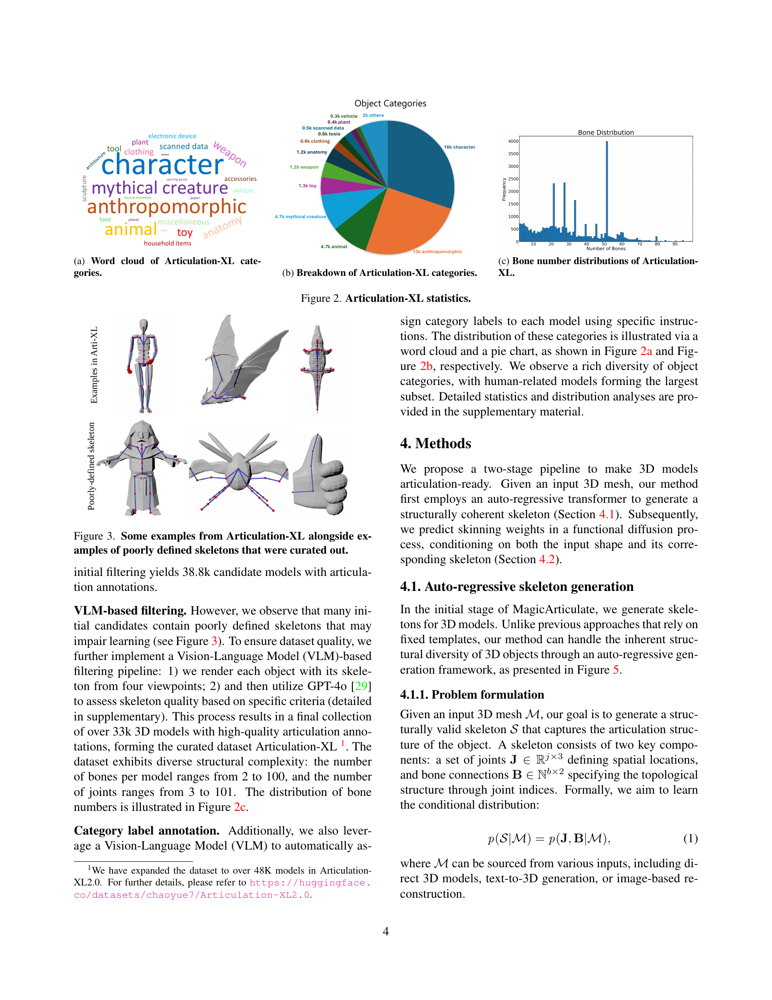

 


 2502.12135 
 Chaoyue Song et el. 
 
 🤗 2025-02-18 
 



↗ arXiv


↗ Hugging Face


↗ Papers with Code


### TL;DR



3D 콘텐츠 생성의 급증으로 정적 3D 모델을 애니메이션 가능한 모델로 자동 변환하는 기술에 대한 수요가 높아지고 있습니다. 기존의 방법들은 수작업에 의존하여 시간과 비용이 많이 들었고, 대규모 벤치마크의 부족으로 학습 기반 솔루션의 개발이 어려웠습니다.  이러한 문제를 해결하기 위해 본 연구에서는 새로운 프레임워크를 제시합니다.

본 연구에서는 **Articulation-XL이라는 3만 개 이상의 3D 모델을 포함하는 대규모 데이터셋**을 구축하고, 이를 기반으로 **자동 아티큘레이션 생성 및 스키닝 가중치 예측을 위한 새로운 방법론**을 제안합니다.  **자동 회귀 변환기를 활용한 골격 생성 방법**은 다양한 뼈 개수를 효율적으로 처리하고, **기능적 확산 과정을 통한 스키닝 가중치 예측**은 복잡한 메시 토폴로지를 효과적으로 다룹니다. 실험 결과, 제안된 방법은 기존 방법들을 상당히 능가하는 성능을 보였습니다.



#### Key Takeaways


 33,000개 이상의 고품질 아티큘레이션 주석이 달린 3D 모델을 포함하는 Articulation-XL이라는 대규모 벤치마크를 제시 



 다양한 뼈 또는 관절 수를 가진 골격과 3D 모델 간의 고유한 종속성을 처리하는 새로운 골격 생성 방법 제시 



 정점과 관절 간의 부피 기하학적 거리 사전 정보를 통합하여 스키닝 가중치를 예측하는 기능적 확산 프로세스 제시 


#### Why does it matter?
본 논문은 **대규모 3D 모델 아티큘레이션 데이터셋을 구축**하고, **자동 아티큘레이션 생성 및 스키닝 가중치 예측을 위한 효율적인 프레임워크를 제시**함으로써, 3D 콘텐츠 생성 분야의 혁신을 가져올 잠재력이 있습니다. **자동화된 아티큘레이션 생성 및 고품질 애니메이션 제작을 위한 새로운 가능성을 열어주는 연구**로서, 게임, VR/AR, 로보틱스 시뮬레이션 등 다양한 분야의 연구자들에게 중요한 의미를 지닙니다. 특히, **대규모 데이터셋의 공개는 향후 관련 연구의 발전에 크게 기여할 것**으로 예상됩니다.

------
#### Visual Insights

> 🔼 그림 1은 MagicArticulate가 3D 모델에 대한 골격과 스키닝 가중치를 자동으로 생성하여 추가적인 수동 수정 없이도 모델을 관절 조작이 가능하도록 만드는 과정을 보여줍니다. 입력 메시는 Rodin Gen-1 [50]과 Tripo 2.0 [1]에 의해 생성되었으며, 메시와 골격은 Maya 소프트웨어 렌더러 [19]를 사용하여 렌더링되었습니다.  이 그림은 3가지 다른 종류의 3D 모델(소년, 기린, 강아지)에 대해 입력 메시, 생성된 골격, 그리고 애니메이션 결과를 보여주어 MagicArticulate의 성능을 시각적으로 보여줍니다.
> 

> 
read the caption

> Figure 1: Given a 3D model, MagicArticulate can automatically generate the skeleton and skinning weights, making the model articulation-ready without further manual refinement. The input meshes are generated by Rodin Gen-1 [50] and Tripo 2.0 [1]. The meshes and skeletons are rendered using Maya Software Renderer [19].
> 


|       | Dataset | CD-J2J | CD-J2B | CD-B2B |
|-------|---------|--------|--------|--------|
| RigNet* | _ModelsRes._ | 7.132  | 5.486  | 4.640  |
| Pinocchio |         | 6.852  | 4.824  | 4.089  |
| Ours-hier* |         | 4.451  | 3.454  | 2.998  |
| RigNet   |         | 4.143  | 2.961  | 2.675  |
| Ours-spatial* |         | 4.103  | 3.101  | 2.672  |
| Ours-hier |         | 3.654  | 2.775  | 2.412  |
| Ours-spatial |         | **3.343** | **2.455** | **2.140** |
| Pinocchio | _Arti-XL_ | 8.360  | 6.677  | 5.689  |
| RigNet   |         | 7.478  | 5.892  | 4.932  |
| Ours-hier |         | 3.025  | 2.408  | 2.083  |
| Ours-spatial |         | **2.586** | **1.959** | **1.661** |

> 🔼 표 1은 골격 생성에 대한 정량적 비교 결과를 보여줍니다. Articulation-XL과 ModelsResource 두 데이터셋에서 CD-J2J, CD-J2B, CD-B2B 세 가지 평가 지표를 사용하여 서로 다른 방법들을 비교합니다. 값이 낮을수록 성능이 더 우수함을 나타냅니다. 지표는 10⁻² 단위로 측정됩니다. * 표시는 Articulation-XL에서 학습된 모델을 ModelsResource에서 테스트한 결과임을 나타냅니다.
> 

> 
read the caption

> Table 1: Quantitative comparison on skeleton generation. We compare different methods using CD-J2J, CD-J2B, and CD-B2B as evaluation metrics on both Articulation-XL (Arti-XL) and ModelsResource (Modelres.). Lower values indicate better performance. The metrics are in units of 10−2superscript10210^{-2}10 start_POSTSUPERSCRIPT - 2 end_POSTSUPERSCRIPT. Here, * denotes models trained on Articulation-XL and tested on ModelsResource.
> 

### In-depth insights

#### Articulation-XL Dataset
Articulation-XL 데이터셋은 **정적 3D 모델을 관절이 있는 모델로 자동 변환**하는 작업에 대한 핵심적인 역할을 합니다.  기존의 방법들은 수동으로 어노테이션을 해야 했기에 시간과 노력이 많이 들었지만, Articulation-XL은 **33,000개 이상의 고품질 3D 모델과 관절 정보 어노테이션**을 제공하여 학습 기반 솔루션 개발에 큰 도움을 줍니다.  **Objaverse-XL 데이터셋을 엄선하여 제작**되었다는 점에서 데이터의 질 또한 보장합니다.  이를 통해 다양한 객체 카테고리와 복잡한 토폴로지의 3D 모델에 대한 일반화 성능을 향상시킬 수 있습니다.  **뼈의 수와 관절의 수가 다양하게 포함**되어 있어 모델의 다양성을 확보하고, **모델의 방향에 대한 제약 없이** 다양한 형태의 뼈 구조를 학습할 수 있도록 지원합니다.  결론적으로, Articulation-XL 데이터셋은 3D 모델 관절화 분야의 발전에 크게 기여할 것으로 예상되며, 이를 바탕으로 한 MagicArticulate 모델의 성능 향상에 중요한 역할을 수행합니다.

#### Autoregressive Skeleton
자연어 처리 분야의 발전과 더불어 **오토리그레시브(자기회귀) 모델**이 3D 모델의 골격 생성에 활용되고 있습니다. 이는 기존의 사전 정의된 템플릿 방식을 넘어, **가변적인 뼈 개수와 관절 구조**를 가진 다양한 3D 모델에 적용 가능한 유연성을 제공합니다.  **순차적 생성 과정**을 통해 뼈와 관절 사이의 의존성을 자연스럽게 처리하며, **다양한 물체의 골격 구조**를 효과적으로 학습할 수 있습니다.  본 논문에서 제시된 오토리그레시브 골격 생성 방식은 **대규모 데이터셋**을 기반으로 훈련되며, **다양한 객체 카테고리**에 대한 일반화 성능이 우수하다는 장점이 있습니다.  하지만 **복잡한 형태의 3D 모델**이나 **저해상도 모델**의 경우에는 생성 성능이 저하될 수 있으며, 향후 연구를 통해 이러한 한계를 극복하는 것이 필요합니다.  특히, **다양한 골격 구조의 표현 능력**을 향상시키기 위한 모델 개선과, **효율적인 훈련 전략**에 대한 연구가 지속적으로 이뤄져야 할 것입니다.

#### Diffusion-Based Skinning
본 논문에서 제시된 확산 기반 스키닝 기법은 기존의 기하학적 방법이나 신경망 기반 방법의 한계를 극복하기 위해 고안되었습니다. **기존 방법들은 복잡한 토폴로지나 다양한 객체 카테고리에 대해서는 일반화 성능이 떨어지는 경향이 있었습니다.**  본 연구에서는 **기능적 확산(functional diffusion) 프로세스를 활용하여 메쉬 표면 상에서 매끄럽게 변화하는 스키닝 가중치를 생성**합니다. 이는 정점과 관절 간의 부피 기반 기하학적 거리 정보를 활용하여 복잡한 토폴로지의 메쉬에서도 효과적으로 작동합니다. **볼륨 기반 기하학적 거리 정보는 정점과 관절 간의 거리 정보를 3차원 공간에서 고려하여 보다 정확하고 안정적인 스키닝 가중치를 예측**하는 데 기여합니다.  **본 논문의 스키닝 방법은 다양한 객체 카테고리에 대해 우수한 일반화 성능을 보이며, 사실적인 애니메이션을 가능하게 하는 고품질의 스키닝 결과를 생성**하는 것으로 실험을 통해 확인되었습니다.  따라서 **본 논문의 확산 기반 스키닝은 3D 모델의 관절화를 위한 효율적이고 강력한 도구**가 될 수 있음을 보여줍니다.

#### Method Limitations
이 논문에서 제시된 방법의 한계점을 깊이 있게 고찰해보면, **대규모 데이터셋에 대한 의존성**이 매우 크다는 점을 발견할 수 있습니다.  Articulation-XL과 같은 방대한 양의 고품질 데이터가 없다면, 제시된 모델의 성능은 크게 저하될 가능성이 높습니다. 또한, **복잡한 형태의 3D 모델에 대한 일반화 능력**이 아직 제한적이며, 특히 극도로 복잡하거나 비정형적인 형태를 가진 객체에 대해서는 정확도가 떨어질 수 있습니다.  **스켈레톤 생성 과정에서의 계산 비용** 또한 고려해야 할 사항입니다.  자동 회귀적 접근 방식은 효율적이지만, 복잡한 스켈레톤을 생성하는 데 상당한 계산 시간이 필요할 수 있습니다. 마지막으로, **다양한 객체 범주에 대한 일반화 성능**을 더욱 향상시키기 위한 추가적인 연구가 필요합니다. 특히, 현재 모델은 특정 범주에 대해서는 우수한 성능을 보이지만, 다른 범주에서는 상대적으로 낮은 성능을 보일 수 있습니다. 따라서, 향후 연구에서는 이러한 한계점들을 해결하기 위한 노력이 필요하며, 더욱 견고하고 일반화된 3D 모델 아티큘레이션 방법론을 개발하는 것이 중요합니다.

#### Future Work
본 논문의 "향후 연구 방향"에 대한 심도있는 고찰은 **데이터셋의 확장 및 다양화**, **알고리즘의 개선 및 일반화**, **실제 애플리케이션 적용 및 평가**의 세 가지 핵심 축으로 요약할 수 있습니다.  **Articulation-XL 데이터셋의 확장**은 더욱 다양한 물체 카테고리와 복잡한 형태의 3D 모델을 포함하여 모델의 일반화 성능을 높이는 데 중요합니다.  **더욱 정교한 알고리즘 개발**은 다양한 형태의 오류(예: 뼈대의 부정확한 생성, 스키닝 가중치 예측의 부정확성 등)를 해결하고, 다양한 입력 데이터(텍스트, 이미지, 비디오 등)에 대한 적응력을 높이는 데 초점을 맞춰야 합니다.  마지막으로, **실제 애플리케이션(게임, VR/AR, 로보틱스 시뮬레이션 등)에의 적용 및 실제 환경에서의 성능 평가**를 통해 모델의 실용성을 검증하고 개선 방향을 도출하는 것이 중요합니다. 이러한 노력을 통해 MagicArticulate는 보다 현실적이고 다양한 3D 애니메이션 제작을 위한 핵심 기술로 자리매김할 수 있을 것입니다.

### More visual insights

More on figures

> 🔼 이 그림은 논문의 Articulation-XL 데이터셋에 포함된 3D 모델들의 카테고리를 단어 구름(Word Cloud) 형태로 시각화한 것입니다. 단어의 크기는 해당 카테고리에 속한 모델의 개수에 비례하며,  데이터셋에서 각 카테고리가 얼마나 큰 비중을 차지하는지 보여줍니다.  자주 등장하는 카테고리는 데이터셋에서 많은 수의 모델을 차지하고 있음을 의미합니다. 예를 들어, 'character'나 'animal'과 같은 카테고리가 크게 나타난다는 것은 이러한 유형의 3D 모델이 데이터셋에서 상당히 많은 부분을 차지한다는 것을 의미합니다.
> 

> 
read the caption

> (a) Word cloud of Articulation-XL categories.
> 

> 🔼 그림 (b)는 Articulation-XL 데이터셋에 포함된 3D 모델들의 카테고리 분포를 보여줍니다. 각 카테고리에 속한 모델의 개수를 시각적으로 나타내어, 데이터셋의 다양성과 균형을 파악하는 데 도움을 줍니다.  예를 들어, ‘character’ 와 ‘anthropomorphic’ 카테고리가 가장 많은 모델을 포함하고 있음을 알 수 있습니다.  이러한 정보는 모델의 성능 평가나 추가적인 데이터 수집 전략을 세우는 데 유용하게 활용될 수 있습니다.
> 

> 
read the caption

> (b) Breakdown of Articulation-XL categories.
> 

> 🔼 이 그림은 논문의 Articulation-XL 데이터셋에 포함된 3D 모델들의 뼈 개수 분포를 보여줍니다. 가로축은 뼈의 개수를 나타내고, 세로축은 해당 뼈 개수를 가진 모델들의 개수를 나타냅니다. 이는 데이터셋에 다양한 복잡도의 3D 모델들이 포함되어 있음을 시각적으로 보여줍니다.
> 

> 
read the caption

> (c) Bone number distributions of Articulation-XL.
> 

> 🔼 그림 2는 Articulation-XL 데이터셋의 통계를 보여줍니다. (a)는 데이터셋에 포함된 다양한 객체 범주의 단어 구름을, (b)는 각 범주의 비율을 나타내는 파이 차트를, (c)는 데이터셋 내 객체들의 뼈 개수 분포를 히스토그램으로 보여줍니다. 이를 통해 Articulation-XL 데이터셋의 다양성과 규모를 한눈에 파악할 수 있습니다.
> 

> 
read the caption

> Figure 2: Articulation-XL statistics.
> 

> 🔼 이 그림은 논문의 Articulation-XL 데이터셋에서 발췌한 몇 가지 3D 모델과, 데이터셋에서 제외된 부적절한 골격 정보를 가진 모델들을 보여줍니다. Articulation-XL 데이터셋은 정확하고 양질의 골격 주석이 달린 3D 모델들을 포함하도록 구성되었으며, 이 그림은 데이터셋의 품질 관리 기준을 보여주는 좋은 예시입니다. 왼쪽은 Articulation-XL에 포함된 양질의 골격 애니메이션이 가능한 3D 모델들이고, 오른쪽은 골격 정보가 부정확하거나 부적절하여 제외된 모델들입니다. 이를 통해 사용자는 데이터셋의 엄격한 품질 관리 기준과, 양질의 3D 모델과 그렇지 않은 모델들의 차이를 명확히 이해할 수 있습니다.
> 

> 
read the caption

> Figure 3: Some examples from Articulation-XL alongside examples of poorly defined skeletons that were curated out.
> 

> 🔼 그림 4는 제안된 방법의 개요를 보여줍니다. 입력 메시로부터 표면에서 포인트 클라우드를 샘플링하여 고정 길이의 형태 토큰으로 인코딩한 후, 이를 스켈레톤 토큰의 시작 부분에 추가하여 입력 형태에 조건화된 자기 회귀적 스켈레톤 생성을 달성합니다. 입력 메시는 Rodin Gen-1 [50]에 의해 생성됩니다.
> 

> 
read the caption

> Figure 4: Overview of our method for auto-regressive skeleton generation. Given an input mesh, we begin by sampling point clouds from its surface. These sampled points are then encoded into fixed-length shape tokens, which are appended to the start of skeleton tokens to achieve auto-regressive skeleton generation conditioned on input shapes. The input mesh is generated by Rodin Gen-1 [50].
> 

> 🔼 그림 5는 뼈대 생성을 위한 두 가지 순서 지정 방법, 즉 공간적 순서 지정과 계층적 순서 지정을 비교합니다. 공간적 순서 지정은 뼈의 공간적 위치에 따라 뼈를 정렬하는 반면, 계층적 순서 지정은 뼈의 계층적 구조를 고려하여 정렬합니다. 그림에서는 각 뼈에 고유한 번호를 매겨 두 가지 방법의 차이를 보여줍니다. 숫자는 뼈의 순서를 나타냅니다. 이 그림은 MagicArticulate의 자동 회귀 뼈대 생성 프레임워크의 핵심 구성 요소를 설명합니다.
> 

> 
read the caption

> Figure 5: Spatial sequence ordering versus hierarchical sequence ordering. The numbers indicate the bone ordering indices.
> 

> 🔼 그림 6은 ModelsResource 데이터셋(왼쪽)과 Articulation-XL 데이터셋(오른쪽)에서 생성된 골격의 비교 결과를 보여줍니다.  본 논문에서 제안하는 방법으로 생성된 골격(Ours)은 아티스트가 직접 제작한 참조 골격과 매우 유사하지만, RigNet과 Pinocchio 방법은 다양한 물체 범주에 대한 골격 생성에서 어려움을 겪는다는 것을 보여줍니다. 특히, 비인간형 물체의 경우 Pinocchio는 참조 골격과의 차이가 매우 크고, RigNet 또한 복잡한 토폴로지를 가진 물체에 대해서는 성능이 저하되는 것을 알 수 있습니다.  본 논문의 방법은 다양한 물체 범주에 걸쳐 고품질의 골격을 생성하는 우수한 성능을 보여줍니다.
> 

> 
read the caption

> Figure 6: Comparison of skeleton creation results on ModelsResource (left) and Articulation-XL (right). Our generated skeletons more closely resemble the artist-created references, while RigNet and Pinocchio struggle to handle various object categories.
> 

> 🔼 그림 7은 Tripo 2.0 [1]에서 생성된 3D 모델에 대한 골격 생성 결과를 보여줍니다. 제시된 결과는 다양한 객체 범주에 걸쳐 MagicArticulate 방법이 RigNet [43] 및 Pinocchio [3] 방법보다 더 나은 일반화 성능을 보임을 시사합니다.  MagicArticulate는 다양한 형태의 물체에 대해서도 정확한 골격을 생성하는 능력을 보여주는 반면, RigNet과 Pinocchio는 특정 유형의 물체에 대해서만 만족스러운 결과를 제공하는 데 그쳤습니다.
> 

> 
read the caption

> Figure 7: Skeleton creation results on 3D generated meshes. Our method has a better generalization performance than both RigNet [43] and Pinocchio [3] across difference object categories. The 3D models are generated by Tripo 2.0 [1].
> 

> 🔼 그림 8은 ModelsResource(위쪽) 및 Articulation-XL(아래쪽) 데이터셋에서 기존 방법들과 비교하여 스키닝 가중치 예측 결과를 보여줍니다. 시각화는 예측된 스키닝 가중치와 L1 오차 맵을 포함합니다. 자세한 내용은 보충 자료를 참조하십시오.
> 

> 
read the caption

> Figure 8: Comparisons with previous methods for skinning weight prediction on ModelsResource (top) and Articulation-XL (bottom). We visualize skinning weights and L1 error maps. For more results, please refer to the supplementary materials.
> 

> 🔼 그림 S9는 스키닝 가중치 예측을 위한 함수 확산 아키텍처의 개요를 보여줍니다.  [52]에서 얻은 스켈레톤 및 형태 특징을 조건으로 하여 노이즈가 있는 스키닝 가중치 함수 집합 {(x, ft(x))∣x∈P}이 주어지면, 스키닝 가중치 함수를 디노이징하여 목표 가중치를 근사합니다.  이 그림은 함수 확산 모델이 어떻게 노이즈가 있는 스키닝 가중치 함수에 디노이징 과정을 적용하여 원래의 스키닝 가중치를 복원하는지 시각적으로 보여줍니다.  크로스 어텐션과 셀프 어텐션 메커니즘을 통해 스켈레톤 및 형태 정보를 활용하여 정확도를 높입니다.
> 

> 
read the caption

> Figure S9: Overview of the function diffusion architecture for skinning weight prediction. Given a set of noised skinning weight functions {(x,ft⁢(x))∣x∈𝒫}conditional-set𝑥subscript𝑓𝑡𝑥𝑥𝒫\{(x,f_{t}(x))\mid x\in\mathcal{P}\}{ ( italic_x , italic_f start_POSTSUBSCRIPT italic_t end_POSTSUBSCRIPT ( italic_x ) ) ∣ italic_x ∈ caligraphic_P }, conditioned on skeleton and shape features from [52], we denoise the skinning weight functions to approximate the target weights.
> 

> 🔼 그림 S10은 스키닝 가중치 함수에 노이즈를 추가하는 과정을 보여줍니다. 원래 스키닝 가중치 함수 f₀(x)에 노이즈 함수 g(x)를 더하여 노이즈가 추가된 함수 fₜ(x)를 얻습니다. 이 그림은 기능 확산 프로세스에서 노이즈 추가 단계를 시각적으로 설명합니다.
> 

> 
read the caption

> Figure S10: Process of adding noise to the skinning weight function. Given x∈𝒫𝑥𝒫x\in\mathcal{P}italic_x ∈ caligraphic_P and the original skinning weight function f0⁢(x)subscript𝑓0𝑥f_{0}(x)italic_f start_POSTSUBSCRIPT 0 end_POSTSUBSCRIPT ( italic_x ), we add the noise function g⁢(x)𝑔𝑥g(x)italic_g ( italic_x ) to obtain the noised function ft⁢(x)subscript𝑓𝑡𝑥f_{t}(x)italic_f start_POSTSUBSCRIPT italic_t end_POSTSUBSCRIPT ( italic_x ).
> 

> 🔼 그림 S11은 제시된 논문에서 세 가지 서로 다른 유형의 데이터(3D 생성, 3D 스캔, 3D 재구성)로부터 얻은 입력 메시에 대한 세 가지 골격 생성 방법(논문의 방법, RigNet, Pinocchio)의 비교 결과를 보여줍니다. 이 그림은 논문에서 제안된 방법이 다양한 유형의 데이터에 대해서도 강건한 성능을 보임을 시각적으로 보여줍니다.
> 

> 
read the caption

> Figure S11: Comparison of skeleton generation methods on out-of-domain data. The input meshes are from 3D generation, 3D scan, and 3D reconstruction.
> 

> 🔼 그림 S12는 ModelsResource 데이터셋(왼쪽)과 Articulation-XL 데이터셋(오른쪽)에서 세 가지 골격 생성 방법(저희 방법, RigNet, Pinocchio)의 결과를 비교한 것입니다.  저희 방법은 아티스트가 직접 제작한 참조 골격과 매우 유사한 결과를 보여주는 반면, RigNet과 Pinocchio는 다양한 물체 범주에 대한 처리에 어려움을 겪는 것을 보여줍니다.  다양한 형태의 물체에 대해 저희 방법의 우수성을 시각적으로 보여줍니다.
> 

> 
read the caption

> Figure S12: Comparison of skeleton generation methods on ModelsResource (left) and Articulation-XL (right). Our results more closely resemble the artist-created references, while RigNet and Pinocchio struggle to handle various object categories.
> 

> 🔼 그림 S13은 다양한 방향으로 배치된 3D 모델에 대한 골격 생성 결과를 보여줍니다. 생성된 골격에 사소한 차이가 있을 수 있지만 모든 결과는 해부학적으로 타당하며 리깅에 적합합니다. 즉, 여러 각도에서 봤을 때도 골격의 기본적인 구조와 관절의 위치가 실제 모델과 일관되게 유지됨을 보여줍니다. 이는 제안된 방법이 다양한 모델 방향에 대해 강건하고 안정적인 결과를 생성함을 시사합니다.
> 

> 
read the caption

> Figure S13: Skeleton results on 3D models with different orientations. Although minor differences may appear in the generated skeletons, all results maintain anatomically valid and suitable for rigging purposes.
> 

> 🔼 이 그림은 ModelsResource 데이터셋(위쪽 세 줄)과 Articulation-XL 데이터셋(아래쪽 세 줄)에서 세 가지 스키닝 가중치 예측 방법의 결과를 보여줍니다. 각 행은 하나의 3D 모델을 나타내며,  왼쪽에서부터 '아티스트가 직접 만든 스키닝 가중치', '본 논문에서 제시된 방법', 'RigNet', 'GVB'의 결과를 보여줍니다. 각 방법의 스키닝 가중치 시각화와 L1 오차 지도가 함께 표시되어 있어, 예측된 스키닝 가중치의 정확도를 시각적으로 비교할 수 있습니다.  L1 오차 지도는 예측된 가중치와 실제 가중치 간의 차이를 보여주는 색상 지도입니다. 밝은 색상은 큰 오차를, 어두운 색상은 작은 오차를 나타냅니다.
> 

> 
read the caption

> Figure S14: Comparison of skinning weight prediction methods on ModelsResource (first three rows) and Articulation-XL (last three rows). We visualize the predicted skinning weights alongside their corresponding L1 error maps.
> 

> 🔼 그림 S15는 VLM(Vision-Language Model)을 이용한 데이터 필터링 과정에 대한 설명입니다.  자세히는, VLM에게 3D 모델과 해당 모델의 골격을 네 방향에서 렌더링한 이미지를 보여주고, 골격의 품질(메쉬 경계를 벗어난 뼈나 관절의 유무, 해부학적 정확성, 자연스러운 자세 등)을 평가하도록 지시하는 입력 지침을 보여줍니다.  이 지침을 통해 VLM은 골격의 품질을 평가하고, 낮은 품질의 골격을 가진 3D 모델을 제거하는 데 사용됩니다.
> 

> 
read the caption

> Figure S15: Input instructions to VLM for data filtering.
> 

> 🔼 이 그림은 논문의 5.4절(Ablation studies)에 속하며, VLM(Vision-Language Model)을 사용하여 3D 오브젝트의 카테고리를 라벨링하기 위한 입력 지침을 보여줍니다.  그림에는 3D 오브젝트의 다양한 측면을 보여주는 8개의 이미지(RGB 이미지 4개와 노말맵 4개)가 2x4 형식으로 배치되어 있으며, VLM이 이 이미지들을 분석하여 오브젝트의 카테고리를 정확하게 분류할 수 있도록 자세한 카테고리 설명과 분류 기준이 제시되어 있습니다.  즉, VLM이 3D 오브젝트 이미지를 보고 어떤 종류인지(캐릭터, 동물, 가구 등) 판단할 수 있도록 주는 설명서 역할을 하는 그림입니다.
> 

> 
read the caption

> Figure S16: Input instructions to VLM for category labeling.
> 

> 🔼 그림 S17은 논문의 데이터 필터링 단계에서 사용된 VLM(Vision-Language Model)에 입력으로 사용된 렌더링된 이미지들의 예시를 보여줍니다. 각 이미지는 3D 모델과 해당 모델의 골격을 네 가지 다른 각도에서 렌더링한 결과물을 담고 있으며, VLM은 이러한 이미지들을 바탕으로 골격의 정확성과 품질을 평가합니다.  이를 통해 품질이 낮거나 부정확한 골격을 가진 3D 모델들을 데이터셋에서 제거하여, 후속 학습 과정의 정확성을 높이고자 하는 목적을 가지고 있습니다.
> 

> 
read the caption

> Figure S17: Input rendered examples to VLM for data filtering.
> 

> 🔼 그림 S18은 논문의 섹션 9.3 (카테고리 주석)에서 설명하는 바와 같이, VLM(Vision-Language Model)을 이용한 카테고리 라벨링을 위해 사용된 입력 렌더링 예시들을 보여줍니다.  각 이미지는 3D 객체의 네 가지 다른 각도에서 렌더링된 RGB 이미지와 노말 맵을 포함합니다. 이 이미지들은 VLM이 3D 객체의 카테고리를 정확하게 분류하는데 사용되었습니다.
> 

> 
read the caption

> Figure S18: Input rendered examples to VLM for category labeling.
> 

More on tables


| Dataset | Precision | Recall | avg L1 |
|---|---|---|---|
| _ModelsResource_ |  |  |  |
| GVB | 69.3% | 79.2% | 0.687 |
| RigNet | 77.1% | **83.5%** | 0.464 |
| Ours | **82.1%** | 81.6% | **0.398** |
| _Articulation-XL_ |  |  |  |
| GVB | 75.7% | 68.3% | 0.724 |
| RigNet | 72.4% | 71.1% | 0.698 |
| Ours | **80.7%** | **77.2%** | **0.337** |
> 🔼 표 2는 세 가지 방법(GVB, RigNet, 제안된 방법)을 사용하여 스키닝 가중치 예측 성능을 정량적으로 비교한 결과를 보여줍니다.  Precision과 Recall은 높을수록 성능이 좋음을, 평균 L1-norm 오차는 낮을수록 성능이 좋음을 나타냅니다.  이 표는 제안된 방법이 다른 두 방법보다 더 우수한 성능을 보임을 보여주는 정량적 지표를 제공합니다.
> 

> 
read the caption

> Table 2: Quantitative comparison on skinning weight prediction. We compare our method with GVB and RigNet. For Precision and Recall, larger values indicate better performance. For average L1-norm error, smaller values are preferred.
> 


|             | CD-J2J | CD-J2B | CD-B2B |
|-------------|--------|--------|--------|
| w/o data filtering | 2.982  | 2.327  | 2.015  |
| 4,096 points | 2.635  | 2.024  | 1.727  |
| 12,288 points| 2.685  | 2.048  | 1.760  |
| Ours (8,192) | **2.586** | **1.959** | **1.661** |
> 🔼 본 표는 뼈대 생성에 대한 추가 실험 결과를 보여줍니다.  자세히는 데이터 필터링 유무, 샘플링된 메시 포인트의 개수 변화에 따른 뼈대 생성 성능 변화를 보여줍니다. 세 가지 지표(CD-J2J, CD-J2B, CD-B2B)를 사용하여 정량적으로 평가합니다.  낮은 값은 더 나은 성능을 나타냅니다.
> 

> 
read the caption

> Table 3: Ablation studies for skeleton generation.
> 


|                     | Precision | Recall | avg L1 |
| :------------------ | :-------- | :------ | :----- |
| w/o geodesic dist. | 81.5%     | 77.7%   | 0.444  |
| w/o weights norm   | 82.0%     | 77.9%   | 0.436  |
| w/o shape features | 81.4%     | 81.3%   | 0.412  |
| Ours                | **82.1%** | **81.6%** | **0.398** |
> 🔼 표 4는 스키닝 가중치 예측에 대한 ablation 연구 결과를 보여줍니다.  각 열은 geodesic distance prior 사용 유무, 가중치 정규화 적용 유무, shape feature 사용 유무에 따른 precision, recall 및 평균 L1 오차를 나타냅니다. 이를 통해 각 요소가 skinning 가중치 예측 성능에 미치는 영향을 정량적으로 분석합니다.
> 

> 
read the caption

> Table 4: Ablation studies on skinning weight prediction.
> 


| Dataset | Precision | Recall | avg L1 | avg Dist. |
|---|---|---|---|---|
| _ModelsResource_ |  |  |  |  |
| GVB | 69.3% | 79.2% | 0.687 | 0.0067 |
| RigNet | 77.1% | **83.5%** | 0.464 | 0.0054 |
| Ours | **82.1%** | 81.6% | **0.398** | **0.0039** |
| _Articulation-XL_ |  |  |  |  |
| GVB | 75.7% | 68.3% | 0.724 | 0.0095 |
| RigNet | 72.4% | 71.1% | 0.698 | 0.0091 |
| Ours | **80.7%** | **77.2%** | **0.337** | **0.0050** |
> 🔼 표 S5는 세 가지 방법(제안된 방법, GVB, RigNet)의 스키닝 가중치 예측 성능을 정량적으로 비교한 표입니다.  Precision과 Recall은 높을수록 성능이 좋음을 나타내고, 평균 L1-norm 오차와 평균 거리 오차는 낮을수록 성능이 좋음을 나타냅니다.  본 표는 제안된 방법이 기존 방법들보다 우수한 성능을 보임을 보여줍니다.
> 

> 
read the caption

> Table S5: Quantitative comparison on skinning weight prediction. We compare our method with GVB and RigNet. For Precision and Recall, larger values indicate better performance. For average L1-norm error and average distance error, smaller values are preferred.
> 


|---|---|---|---|---| 
| | Precision | Recall | avg L1 | avg Dist. | 
|---|---|---|---|---| 
| w/o geodesic dist. | 81.5% | 77.7% | 0.444 | 0.0046 | 
| w/o weights norm | 82.0% | 77.9% | 0.436 | 0.0045 | 
| w/o shape features | 81.4% | 81.3% | 0.412 | 0.0042 | 
| Ours | **82.1%** | **81.6%** | **0.398** | **0.0039** | 
> 🔼 표 S6는 ModelsResource 데이터셋에서 스키닝 가중치 예측에 대한 ablation study 결과를 보여줍니다.  각 열은 스키닝 가중치 예측 성능 평가 지표 (정밀도, 재현율, 평균 L1 오차, 평균 거리 오차)를 나타내며, 각 행은 특정 구성요소를 제거했을 때의 성능 변화를 보여줍니다. 예를 들어, 'w/o geodesic dist.' 행은 거리 기반 정보를 제거했을 때의 결과를, 'w/o weights norm.' 행은 가중치 정규화를 제거했을 때의 결과를, 'w/o shape features' 행은 형태 특징을 제거했을 때의 결과를 나타냅니다. 마지막 행인 'Ours'는 모든 구성 요소를 포함한 모델의 결과를 보여줍니다. 이 표를 통해 각 구성 요소가 모델 성능에 미치는 영향을 정량적으로 분석하고, 제안된 방법의 효율성과 견고성을 평가할 수 있습니다.
> 

> 
read the caption

> Table S6: Ablation studies on ModelsResource for skinning weight prediction.
> 


| Category | # Objects | Category | # Objects | Category | # Objects |
|---|---|---|---|---|---| 
| character | 16020 | miscellaneous | 584 | architecture | 132 |
| anthropomorphic | 13393 | scanned data | 546 | planet | 49 |
| animal | 4760 | plant | 382 | paper | 46 |
| mythical creature | 4734 | accessories | 293 | musical instrument | 25 |
| toy | 1360 | vehicle | 283 | sporting goods | 21 |
| weapon | 1257 | sculpture | 276 | armor | 13 |
| anatomy | 1227 | household items | 274 | robot | 4 |
| clothing | 595 | food | 206 |  |  |
> 🔼 Articulation-XL 데이터셋에 포함된 각 카테고리별 개체 수를 보여주는 표입니다.  각 카테고리(예: 캐릭터, 동물, 가구 등)에 속한 3D 모델의 개수를 정확하게 나타내어 데이터셋의 구성과 규모를 파악하는 데 도움을 줍니다.  이는 데이터셋의 다양성과 균형을 평가하는 데 중요한 정보를 제공합니다.
> 

> 
read the caption

> Table S7: Object counts for each category in the Articulation-XL dataset.
> 

### Full paper



