 


 2502.12154 
 Zhicong Tang et el. 
 
 🤗 2025-02-18 
 



↗ arXiv


↗ Hugging Face


↗ Papers with Code


### TL;DR



기존의 확산 모델은 **Classifier-free guidance(CFG)**라는 기술을 사용하여 조건부 이미지 생성 성능을 향상시키지만, **훈련 속도 저하 및 추론 속도 저하**라는 문제점을 가지고 있습니다. 또한, CFG는 추가적인 네트워크를 필요로 하여 모델의 복잡성을 증가시키고, 샘플링 분포의 왜곡을 초래할 수 있습니다.  이러한 문제점으로 인해, 고품질 이미지를 빠르게 생성하는 데 어려움이 있습니다.

본 논문에서는 **Classifier-free guidance(CFG) 없이도 고품질의 이미지를 생성**할 수 있는 새로운 방법인 **Model-guidance(MG)**를 제안합니다. MG는 기존 확산 모델의 목적 함수를 수정하여 조건부 확률을 직접적으로 학습하는 방식을 사용합니다. 이를 통해 **훈련 속도 향상 및 추론 속도 향상**, 그리고 **CFG를 사용하는 모델과 동등하거나 그 이상의 성능**을 달성했습니다.  실험 결과, MG는 ImageNet 256 데이터셋에서 최첨단의 성능을 보였으며, 다양한 모델과 데이터셋에 대해서도 효과적임을 확인했습니다.



#### Key Takeaways


 Model-guidance(MG)는 Classifier-free guidance(CFG)를 제거하여 확산 모델 훈련 속도를 크게 향상시키고 추론 속도를 두 배로 높였습니다. 



 MG는 ImageNet 256 벤치마크에서 최첨단 성능(FID 1.34)을 달성하여, 다양한 모델과 데이터셋에서 효과적임을 입증했습니다. 



 MG는 기존 확산 모델에 쉽게 적용 가능한 플러그 앤 플레이 방식으로, 코드 수정이 단 한 줄에 불과합니다. 


#### Why does it matter?
본 논문은 **분산 모델 훈련을 가속화하고 추론 속도를 두 배로 높이는 새로운 방법인 Model-guidance(MG)**를 제시함으로써, 기존 확산 모델의 한계를 극복하고 성능을 크게 향상시켰다는 점에서 중요합니다. **ImageNet 256 벤치마크에서 최첨단 성능(FID 1.34)**을 달성하여, **다양한 모델과 데이터셋에 대한 효과성, 효율성, 확장성**을 입증했습니다.  이 연구는 **기존 확산 모델의 성능 향상과 훈련 효율성 개선**에 크게 기여하며, **향후 연구의 새로운 방향**을 제시할 수 있습니다.

------
#### Visual Insights

> 🔼 그림 1은 제안된 모델 가이드(MG) 방법을 보여줍니다. MG는 확산 모델에서 일반적으로 사용되는 분류기 없는 가이드(CFG)를 제거하여 ImageNet에서 최첨단 성능(FID 1.34)을 달성합니다. (a)는 추론 과정에서 모델을 두 번 실행하는 CFG(녹색과 빨간색)와 달리 MG는 최종 분포를 직접 학습(파란색)하는 것을 보여줍니다. (b)는 MG가 코드 한 줄만 수정하면 우수한 성능 향상을 제공함을 보여줍니다. (c)는 기존 방법들과 비교하여 MG가 CFG 없이도 가장 낮은 FID 값을 달성함을 보여줍니다.
> 

> 
read the caption

> Figure 1: We propose Model-guidance (MG), removing Classifier-free guidance (CFG) for diffusion models and achieving state-of-the-art on ImageNet with FID of 1.341.34\mathbf{1.34}bold_1.34. (a) Instead of running models twice during inference (green and red), MG directly learns the final distribution (blue).  (b) MG requires only one line of code modification while providing excellent improvements. (c) Comparing to concurrent methods, MG yields lowest FID even without CFG.
> 


| Model | FID ↓ | sFID ↓ | IS ↑ | Pre. ↑ | Rec. ↑ | img/s ↑ |
|---|---|---|---|---|---|---|
| ADM | 10.9 | - | 101.0 | 0.69 | 0.63 | - |
| VDM++ | 2.40 | - | 225.3 | 0.78 | 0.66 | - |
| LDM-4 | 10.5 | - | 103.5 | 0.71 | 0.62 | - |
| U-ViT-H | 8.97 | - | 136.7 | 0.69 | 0.63 | - |
| MDTv2 | 5.06 | - | 155.6 | 0.72 | 0.66 | 0.2 |
| REPA | 5.90 | 6.33 | 162.1 | 0.71 | 0.56 | 0.76 |
| L-DiT | 2.17 | 4.36 | 205.6 | 0.77 | 0.65 | 0.06 |
| VARd30 | 2.16 | - | 288.7 | 0.81 | 0.61 | 11.2 |
| RARXXL | 3.83 | - | 274.5 | 0.79 | 0.61 | 3.9 |
| MAR-H | 2.35 | - | 227.8 | 0.79 | 0.62 | 0.6 |
| DiT-XL/2 | 9.62 | 6.85 | 121.5 | 0.67 | 0.67 | 0.2 |
| +MG(ours) | **2.03** | 4.36 | 292.1 | 0.81 | 0.66 | 0.2 |
| SiT-XL/2 | 8.61 | 6.32 | 131.7 | 0.68 | 0.67 | 0.76 |
| +MG(ours) | **1.34** | 4.58 | 321.5 | 0.81 | 0.65 | 0.76 |
| Improve | 78.9% | 36.4% | 140% | 20.9% | 1.49% | 0.0% |
| Improve | 84.4% | 27.5% | 144% | 19.1% | 2.99% | 0.0% |

> 🔼 표 1은 Classifier-free guidance(CFG) 없이 ImageNet 256 데이터셋에서 다양한 확산 모델의 성능을 비교 분석한 결과를 보여줍니다.  본 논문에서 제안하는 Model-guidance(MG) 기법을 적용했을 때, 특히 DiT-XL/2와 SiT-XL/2 모델의 성능이 크게 향상되어 최첨단(state-of-the-art) 수준에 도달했음을 보여줍니다.  표에는 FID, SFID, IS, Precision, Recall, IMG/s 등의 지표가 포함되어 있으며, MG 적용 전후의 성능 변화를 정량적으로 비교하여 MG의 효과를 명확하게 제시합니다.
> 

> 
read the caption

> Table 1: Experiments on ImageNet 256 without CFG. By deploying our method, the performances of both DiT-XL/2 and SiT-XL/2 are greatly boosted, achieving state-of-the-art.
> 

### In-depth insights

#### Model-Guidance (MG)
논문에서 제안하는 "모델-지도(MG)"는 기존 확산 모델 학습에서 흔히 사용되는 분류기-자유 지도(CFG) 방식을 제거하는 새로운 목적 함수입니다. **MG의 핵심은 데이터 분포만을 모델링하는 기존 방식에서 벗어나 조건부 사후 확률을 통합하는 것**입니다.  CFG의 아이디어를 바탕으로 하지만, **추론 속도를 두 배로 높이고 학습 과정을 가속화**하여 효율성을 극대화합니다.  **단일 네트워크 전달만으로 추론이 가능**하며 코드 수정 또한 최소화되어 기존 모델에 쉽게 적용할 수 있다는 장점이 있습니다.  실험 결과, MG는 CFG를 사용하는 다른 확산 모델들과 비교했을 때 ImageNet 256 벤치마크에서 최첨단 성능을 달성하였고, 다양한 모델과 데이터셋에서 효과적이고 확장성이 높음을 입증했습니다.  **MG는 CFG의 한계점인 추가적인 무조건 모델 학습 및 두 번의 전달 과정을 제거하여 계산 비용을 절감하고 성능을 향상**시켰다는 점에서 큰 의의를 지닙니다.

#### CFG Re-examined
본 논문에서 'CFG 재검토'라는 제목으로 다루어질 내용은 **기존 Classifier-free Guidance(CFG)의 한계점을 짚어보고, 이를 개선하기 위한 새로운 방향**을 제시하는 데 초점을 맞출 것입니다.  CFG는 확산 모델에서 조건부 이미지 생성의 성능을 향상시키는 데 효과적이지만, 동시에 **추가적인 계산 비용**과 **모델의 복잡성 증가**라는 단점을 가지고 있습니다.  따라서, 'CFG 재검토'에서는 CFG의 이러한 문제점들을 자세히 분석하고,  **더욱 효율적이고 효과적인 대안**을 제시하는 데 집중할 것입니다.  이는 단순히 CFG를 개선하는 것을 넘어, 확산 모델 학습 및 추론 과정 전반에 대한 새로운 관점을 제시할 수 있을 것입니다.  **새로운 방법론**은 기존 CFG의 장점은 유지하면서 단점은 최소화하는 방향으로 개발될 것이며, 실험 결과를 통해 **성능 향상 및 효율성 증대**를 입증할 것입니다. 또한, 다양한 모델 및 데이터셋에서의 확장성을 검증하여, **실제 응용 가능성**을 높이는 데 기여할 것입니다.  본 논문은 CFG의 재해석을 통해 확산 모델 연구에 새로운 패러다임을 제시할 것으로 예상됩니다.

#### MG Training
본 논문에서 제안하는 MG(Model-guidance) 학습 방법은 기존의 CFG(Classifier-free guidance) 방식의 단점을 해결하기 위해 **후방 확률(posterior probability)** 개념을 도입한 혁신적인 접근 방식입니다.  **단일 네트워크** 내에서 조건부 및 무조건부 확률 분포를 동시에 학습하는 CFG와 달리, MG는 **조건부 확률과 무조건부 확률 간의 차이를 직접 학습**하여 조건에 맞는 고품질 샘플을 생성합니다. 이를 통해, 학습 속도 향상 및 추론 속도 향상이라는 두 가지 주요 이점을 얻습니다.  특히, MG는 **추론 시 단일 네트워크 전달만으로도** CFG의 두 배 속도를 달성하며, 코드 수정 또한 최소화되어 기존 확산 모델에 손쉽게 통합될 수 있습니다.  **단일 단계 학습**이라는 효율성과 **뛰어난 생성 품질**을 동시에 제공하며, 다양한 모델과 데이터셋에서 그 효과가 검증되었습니다.  결론적으로 MG는 학습 및 추론 효율성을 높이는 동시에, CFG를 능가하는 품질의 샘플을 생성하는 강력한 학습 방법으로 평가됩니다.

#### Ablation Studies
본 논문의 ablation study는 **모델 성능에 영향을 미치는 주요 요소들을 체계적으로 분석**하기 위해 설계되었습니다.  구체적으로, 가중치 매개변수 (w), 드롭 비율 (λ), 모델 입력으로서 가중치 사용 여부, 그리고 빈 클래스 (Ø) 사용 여부 등의 변수들을 조작하여 각 요소가 최종 성능에 미치는 영향을 정량적으로 평가하였습니다. **실험 결과는 각 요소의 중요성을 밝히고, 모델 성능을 향상시키기 위한 최적의 설정을 제시**합니다.  특히 가중치 매개변수 (w)의 경우, 수동 검색보다 자동 조정 기법이 비슷한 성능을 보이며 효율성을 높인다는 점을 강조합니다. 또한, 고해상도 이미지 데이터셋과 다양한 크기의 모델에 대한 확장성 실험을 통해 제시된 방법의 **범용성과 효율성을 검증**하고 있습니다.  **이러한 ablation study는 제시된 방법의 강점과 한계를 명확히 보여주며,  추후 연구 방향에 대한 귀중한 통찰력을 제공**합니다.

#### Future Works
본 논문의 "미래 연구" 섹션에서는 **모델 가이던스(MG)의 확장성과 일반화 가능성**에 대한 심도있는 연구가 필요합니다.  다양한 데이터셋과 모델 아키텍처에 대한 MG의 성능 평가를 통해 범용성을 입증하고, **고해상도 이미지 생성 및 비디오 생성과 같은 복잡한 작업**으로의 확장 가능성을 확인해야 합니다. 또한, **MG와 다른 생성 모델 기법들(예: GAN, VAE, Flow 모델)과의 비교 연구**를 통해 MG의 강점과 약점을 명확히 밝히고 상호 보완적인 연구 방향을 모색해야 합니다.  **MG의 학습 과정을 더욱 효율화**하는 연구도 중요한데,  학습 시간 단축 및 메모리 사용량 감소를 위한 새로운 최적화 기법이나 알고리즘 개발을 통해 실용성을 높일 수 있습니다.  **MG를 기반으로 한 새로운 응용 분야**에 대한 탐색 또한 중요한 과제입니다. 예를 들어,  조건부 이미지 생성을 넘어서,  텍스트-이미지 변환,  영상 편집,  3D 모델 생성 등 다양한 분야에 MG를 적용하여 그 유용성을 확대할 수 있습니다.  마지막으로,  **MG의 이론적 토대를 더욱 탄탄히** 하기 위한 연구가 필요합니다.  확률적 미분 방정식(SDE)과의 관계를 깊이있게 분석하고,  MG의 수렴성과 안정성을 수학적으로 증명하는 연구를 통해 신뢰도를 높여야 할 것입니다. 

### More visual insights

More on tables


| Model | FID ↓ | sFID ↓ | IS ↑ | Pre. ↑ | Rec. ↑ | img/s ↑ |
|---|---|---|---|---|---|---|
| ADM | 4.59 | 5.25 | 186.7 | 0.82 | 0.52 | - |
| VDM++ | 2.12 | - | 267.7 | 0.81 | 0.65 | - |
| LDM | 3.60 | - | 247.7 | 0.87 | 0.48 | - |
| U-ViT-H | 2.29 | 5.68 | 263.9 | 0.82 | 0.57 | - |
| MDTv2 | 1.58 | 4.52 | 314.7 | 0.79 | 0.65 | 0.1 |
| REPA | 1.42 | 4.70 | 305.7 | 0.80 | 0.65 | 0.39 |
| L-DiT | 1.35 | 4.15 | 295.3 | 0.79 | 0.65 | 0.03 |
| VARd30 | 1.73 | - | 350.2 | 0.82 | 0.60 | 6.3 |
| RARXXL | 1.48 | - | 326.0 | 0.80 | 0.63 | 2.1 |
| MAR-H | 1.55 | - | 303.7 | 0.81 | 0.62 | 0.3 |
| DiT-XL/2 | 2.27 | 4.60 | 278.2 | 0.83 | 0.57 | 0.1 |
| +MG(ours) | **2.03** | 4.36 | 292.1 | 0.81 | 0.66 | 0.2 |
| SiT-XL/2 | 2.06 | 4.49 | 277.5 | 0.83 | 0.59 | 0.39 |
| +MG(ours) | **1.34** | 4.58 | 321.5 | 0.81 | 0.65 | 0.76 |
| Improve | 35.0% | 2.00% | 15.9% | 2.41% | 10.2% | 94.9% |
> 🔼 표 2는 ImageNet 256 데이터셋에서 Classifier-free guidance (CFG)를 사용한 여러 확산 모델들의 성능을 비교 분석한 결과를 보여줍니다.  본 논문에서 제안하는 방법(MG)은 기존 CFG 방식을 사용하는 다른 모델들과 비교하여, 효율성 저하 없이도 뛰어난 성능을 달성함을 보여줍니다.  즉, CFG를 사용하지 않고도 다른 모델들보다 더 좋은 결과를 얻었다는 것을 의미합니다. FID, SFID, IS, Precision, Recall 및 이미지 생성 속도 등 다양한 지표를 통해 MG의 우수성을 입증합니다.
> 

> 
read the caption

> Table 2: Experiments on ImageNet 256 with CFG. Comparing to models with CFG, our method still obtains excellent results and surpasses others without efficiency loss.
> 


| Model | w | FID ↓ | sFID ↓ | IS ↑ | Pre. ↑ | Rec. ↑ |
|---|---|---|---|---|---|---|
| DiT-B/2 | 1.00 | 43.5 | 36.7 | 39.23 | 0.62 | 0.34 |
| DiT-B/2+MG(ours) | 1.25 | 9.86 | 8.87 | 176.1 | 0.81 | 0.37 |
| DiT-B/2+MG(ours) | 1.50 | 7.24 | 5.56 | 189.2 | 0.84 | 0.38 |
| DiT-B/2+MG(ours) | 1.75 | 8.21 | 6.63 | 197.2 | 0.86 | 0.38 |
| DiT-B/2+MG(ours) | 2.00 | 9.66 | 7.90 | 224.7 | 0.85 | 0.39 |
| DiT-B/2+MG(ours) | Auto | 7.60 | 6.29 | 192.4 | 0.85 | 0.38 |
| SiT-B/2 | 1.00 | 33.0 | 27.8 | 65.24 | 0.68 | 0.35 |
| SiT-B/2+MG(ours) | 1.25 | 8.94 | 7.87 | 194.3 | 0.83 | 0.38 |
| SiT-B/2+MG(ours) | 1.50 | 6.49 | 5.69 | 212.3 | 0.86 | 0.38 |
| SiT-B/2+MG(ours) | 1.75 | 8.03 | 6.91 | 221.0 | 0.86 | 0.39 |
| SiT-B/2+MG(ours) | 2.00 | 9.14 | 7.99 | 236.7 | 0.88 | 0.40 |
| SiT-B/2+MG(ours) | Auto | 6.86 | 5.88 | 219.1 | 0.87 | 0.38 |
> 🔼 표 3은 안내 스케일(w)의 영향을 실험한 결과를 보여줍니다.  w 값을 다르게 설정하여 (1.0, 1.25, 1.5, 1.75, 2.0) 이미지 생성 품질과 다양성 간의 균형을 어떻게 조절하는지 보여줍니다.  실험은 DiT-B/2와 SiT-B/2 모델에 대해 진행되었으며, FID, SFID, IS, 정밀도, 재현율 지표를 사용하여 성능을 평가했습니다.  표에서 확인할 수 있듯이, w 값에 따라 FID와 IS 점수가 변화하는 것을 볼 수 있으며, 적절한 w 값을 선택하는 것이 중요함을 시사합니다.  이는 모델 안내의 강도를 조절하여 최적의 결과를 얻을 수 있음을 의미합니다.
> 

> 
read the caption

> Table 3: Experiments on scale w𝑤witalic_w.
> 


| Model | λ | FID ↓ | sFID ↓ | IS ↑ | Pre. ↑ | Rec. ↑ |
|---|---|---|---|---|---|---|
| DiT-B/2 | 1.00 | 43.5 | 36.7 | 39.23 | 0.62 | 0.34 |
| DiT-B/2 +MG(ours) | 0.05 | 11.7 | 9.90 | 156.7 | 0.78 | 0.33 |
| DiT-B/2 +MG(ours) | 0.10 | 7.24 | 5.56 | 189.2 | 0.84 | 0.38 |
| DiT-B/2 +MG(ours) | 0.15 | 7.62 | 5.99 | 183.4 | 0.83 | 0.38 |
| DiT-B/2 +MG(ours) | 0.20 | 9.01 | 7.04 | 171.7 | 0.81 | 0.36 |
| SiT-B/2 | 1.00 | 33.0 | 27.8 | 65.24 | 0.68 | 0.35 |
| SiT-B/2 +MG(ours) | 0.05 | 10.8 | 9.25 | 168.8 | 0.80 | 0.34 |
| SiT-B/2 +MG(ours) | 0.10 | 6.49 | 5.69 | 212.3 | 0.86 | 0.38 |
| SiT-B/2 +MG(ours) | 0.15 | 6.77 | 5.89 | 207.4 | 0.85 | 0.37 |
| SiT-B/2 +MG(ours) | 0.20 | 8.87 | 8.06 | 199.6 | 0.84 | 0.37 |
> 🔼 이 표는 람다(λ) 값을 변화시켜가면서 수행한 실험 결과를 보여줍니다. 람다는 조건부 확률과 무조건부 확률을 학습하는 비율을 조절하는 하이퍼파라미터입니다.  표에는 각 람다 값에 따른 FID, SFID, IS, 정밀도, 재현율 등의 지표가 제시되어 있습니다.  이를 통해 람다 값의 변화가 모델 성능에 미치는 영향을 분석하고 최적의 람다 값을 찾는 데 도움이 됩니다.
> 

> 
read the caption

> Table 4: Experiments on drop ratio λ𝜆\lambdaitalic_λ.
> 


| Model | w-in | FID ↓ | sFID ↓ | IS ↑ | Pre. ↑ | Rec. ↑ |
|---|---|---|---|---|---|---|
| DiT-B/2 | ✗ | 43.5 | 36.7 | 39.23 | 0.62 | 0.34 |
| +MG(ours) | ✗ | **7.24** | **5.56** | **189.2** | **0.84** | 0.38 |
| +MG(ours) | ✓ | 8.13 | 6.03 | 175.1 | 0.84 | **0.39** |
| SiT-B/2 | ✗ | 33.0 | 27.8 | 65.24 | 0.68 | 0.35 |
| +MG(ours) | ✗ | **6.49** | **5.69** | **212.3** | **0.86** | **0.38** |
| +MG(ours) | ✓ | 7.33 | 5.96 | 207.4 | 0.85 | 0.38 |
> 🔼 표 5는 모델 입력으로 가중치 w를 사용하는 실험 결과를 보여줍니다.  이 표는 Model-guidance(MG) 방법의 성능에 w 매개변수가 미치는 영향을 분석하기 위해 수행된 실험 결과를 제시합니다.  다양한 w 값에 따른 FID, SFID, IS, Precision, Recall 등의 지표를 비교하여 최적의 w 값을 찾고,  MG 방법의 성능 개선에 미치는 영향을 정량적으로 평가합니다.  표에는 DiT-B/2 및 SiT-B/2 모델에 대한 결과가 포함되어 있습니다.
> 

> 
read the caption

> Table 5: Experiments on Model input w𝑤witalic_w.
> 


| Model | ∅-cls | FID ↓ | sFID ↓ | IS ↑ | Pre. ↑ | Rec. ↑ |
|---|---|---|---|---|---|---|
| DiT-B/2 | ✗ | 43.5 | 36.7 | 39.23 | 0.62 | 0.34 |
| +MG(ours) | ✗ | 9.66 | 8.73 | 174.4 | 0.81 | 0.35 |
| +MG(ours) | ✓ | 7.24 | 5.56 | 189.2 | 0.84 | 0.38 |
| SiT-B/2 | ✗ | 33.0 | 27.8 | 65.24 | 0.68 | 0.35 |
| +MG(ours) | ✗ | 9.03 | 7.96 | 183.3 | 0.82 | 0.35 |
| +MG(ours) | ✓ | 6.49 | 5.69 | 212.3 | 0.86 | 0.38 |
> 🔼 표 6은 비어있는 클래스(∅)를 사용했을 때와 사용하지 않았을 때의 성능 차이를 보여줍니다.  Model-guidance(MG) 방법에서 비어있는 클래스를 사용하는 것이 모델 성능에 미치는 영향을 실험적으로 평가한 결과를 보여주는 표입니다.  구체적으로는, FID, SFID, IS, Precision, Recall 지표를 사용하여 DiT-B/2와 SiT-B/2 모델에 대해 비어있는 클래스를 사용했을 때와 사용하지 않았을 때의 성능 차이를 비교 분석합니다.
> 

> 
read the caption

> Table 6: Experiments on empty class ∅\varnothing∅.
> 


| Model | FID ↓ | sFID ↓ | IS ↑ | Pre. ↑ | Rec. ↑ |
|---|---|---|---|---|---| 
| DiT-B/2 | 43.5 | 36.7 | 39.23 | 0.62 | 0.34 |
| DiT-B/2 +MG(ours) | 7.24 | 5.56 | 189.2 | 0.84 | 0.38 |
| DiT-L/2 | 23.3 | 18.4 | 132.7 | 0.73 | 0.40 |
| DiT-L/2 +MG(ours) | 5.43 | 4.66 | 236.3 | 0.83 | 0.44 |
| DiT-XL/2 | 19.5 | 15.6 | 163.5 | 0.79 | 0.46 |
| DiT-XL/2 +MG(ours) | 3.37 | 4.73 | 257.2 | 0.84 | 0.51 |
| SiT-B/2 | 33.0 | 27.8 | 65.24 | 0.68 | 0.35 |
| SiT-B/2 +MG(ours) | 6.49 | 5.69 | 212.3 | 0.86 | 0.38 |
| SiT-L/2 | 18.9 | 16.3 | 173.2 | 0.71 | 0.42 |
| SiT-L/2 +MG(ours) | 4.50 | 4.03 | 243.9 | 0.85 | 0.46 |
| SiT-XL/2 | 17.3 | 13.9 | 192.1 | 0.78 | 0.50 |
| SiT-XL/2 +MG(ours) | 2.89 | 3.12 | 261.0 | 0.85 | 0.54 |
> 🔼 표 7은 모델 크기에 따른 실험 결과를 보여줍니다.  본 논문에서 제안하는 Model-guidance(MG) 방법이 다양한 크기의 모델에 적용될 수 있음을 보여주는 표입니다.  다양한 크기의 DiT 및 SiT 모델들(B/2, L/2, XL/2)을 사용하여 FID, SFID, IS, 정밀도, 재현율 등의 지표를 측정하여 MG 방법의 확장성을 평가하였습니다.  표의 각 열은 모델 크기별 성능 지표를 보여주며, MG 적용 전후의 성능 변화를 비교하여 MG의 효과를 확인할 수 있습니다.
> 

> 
read the caption

> Table 7: Experiments on Model size. Our method scales to models with different sizes.
> 


| Model | FID ↓ | sFID ↓ | IS ↑ | Pre. ↑ | Rec. ↑ |
|---|---|---|---|---|---| 
| DiT-XL/2 | 3.04 | 5.02 | 240.8 | 0.84 | 0.54 |
| DiT-XL/2+MG(ours) | 2.78 | 4.86 | 257.2 | 0.83 | 0.58 |
| SiT-XL/2 | 2.62 | 4.18 | 252.2 | 0.84 | 0.57 |
| SiT-XL/2+MG(ours) | 2.24 | 4.03 | 276.9 | 0.86 | 0.60 |
> 🔼 표 8은 ImageNet 512 데이터셋을 사용하여 고해상도 이미지 데이터셋에서 제안된 방법의 확장성을 평가한 실험 결과를 보여줍니다.  이 표에는 다양한 모델들에 대한 FID, SFID, IS, 정밀도, 재현율 및 이미지 생성 속도를 포함합니다. 이를 통해 고해상도 이미지 생성 작업에서도 제안된 방법의 성능을 확인할 수 있습니다.
> 

> 
read the caption

> Table 8: Experiments on ImageNet 512. Our method scales to high-resolution image datasets.
> 

### Full paper


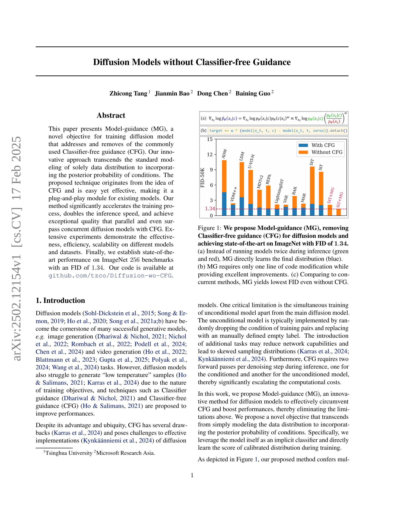
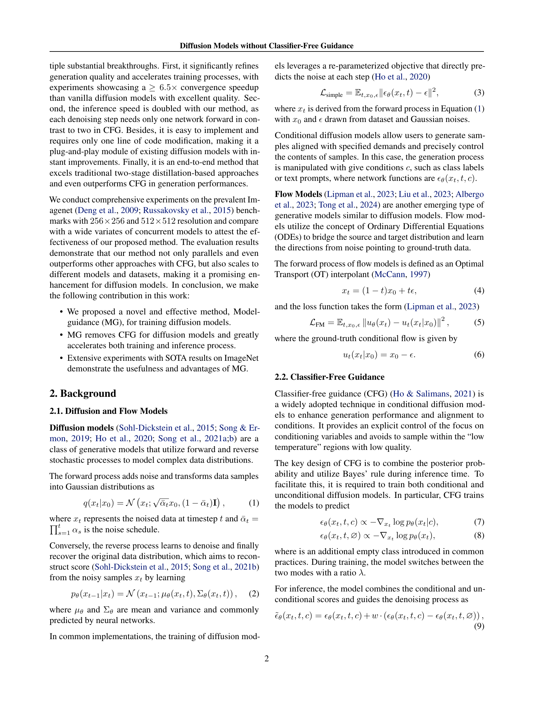
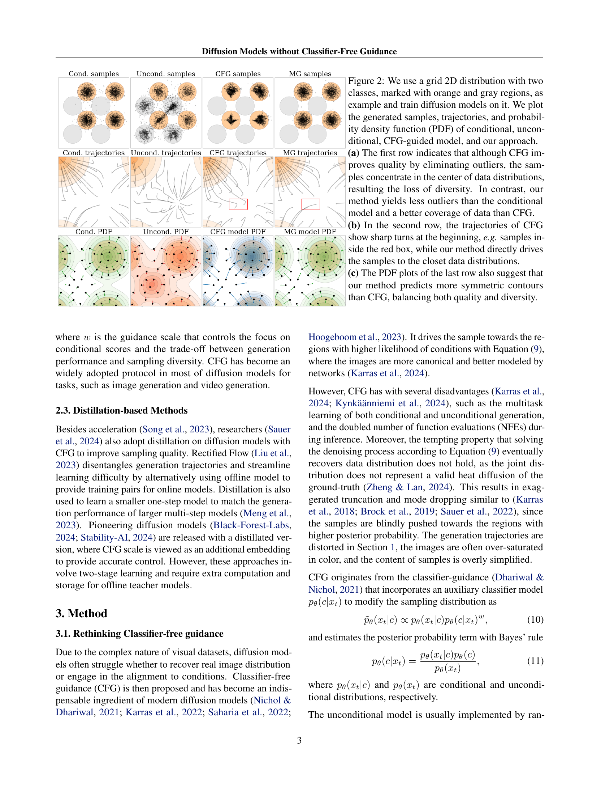
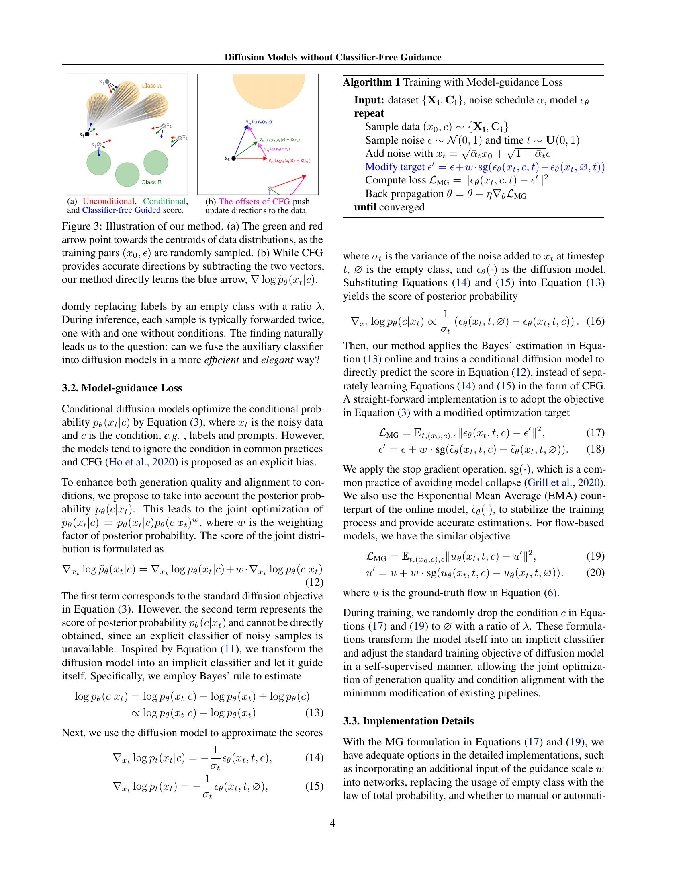
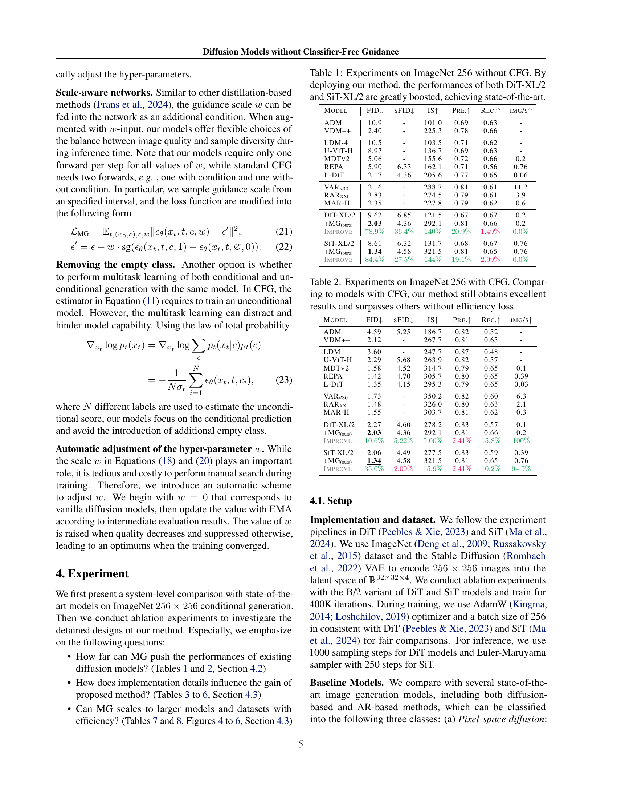
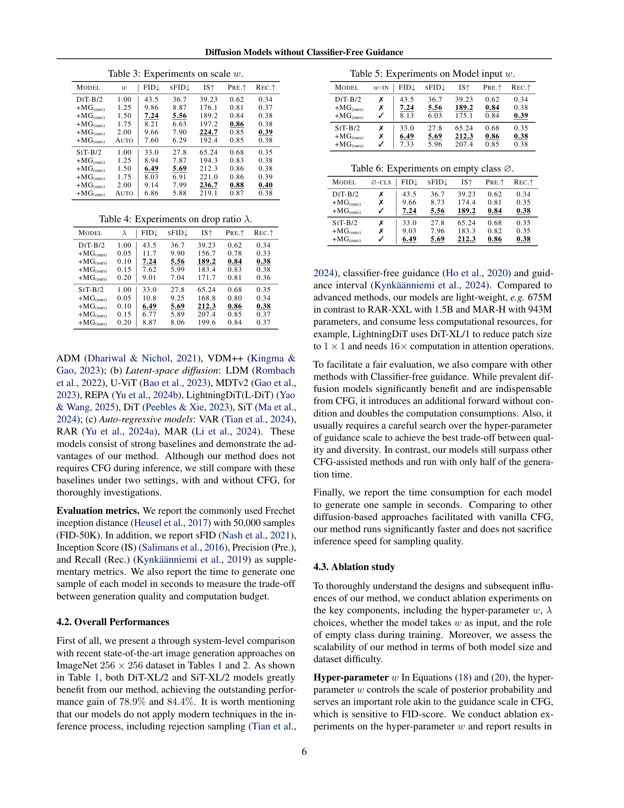
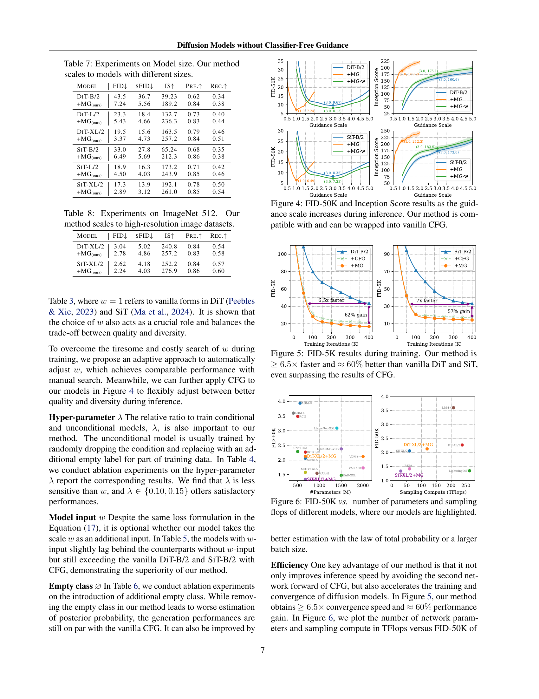
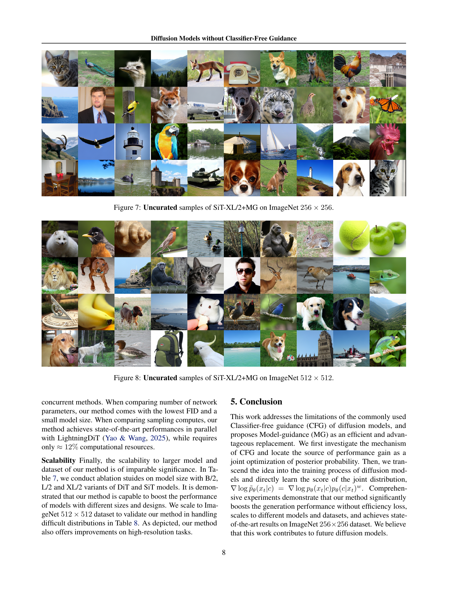
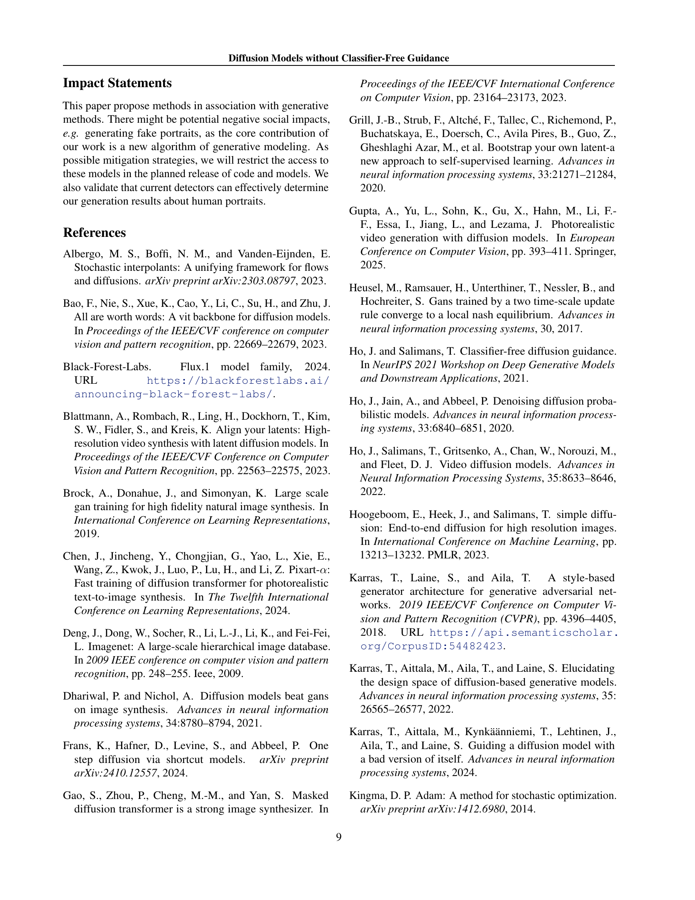
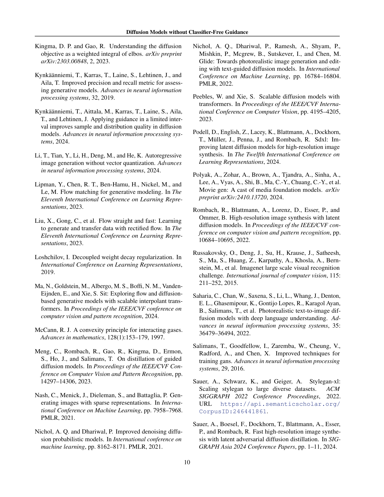
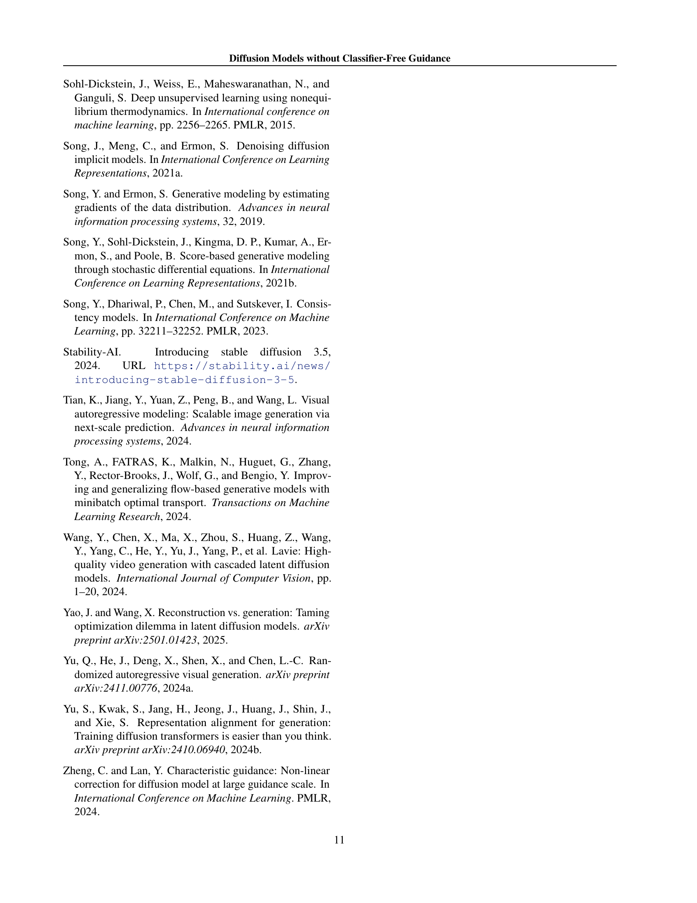
