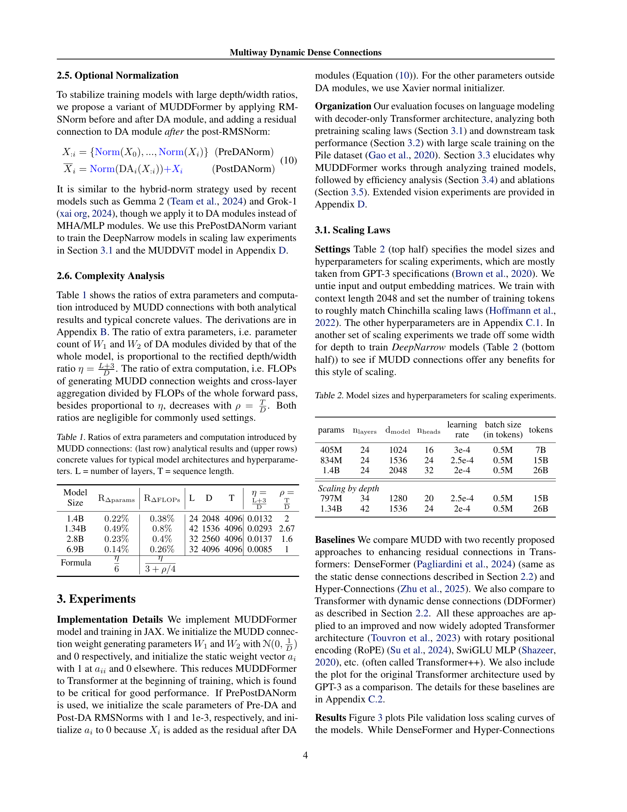
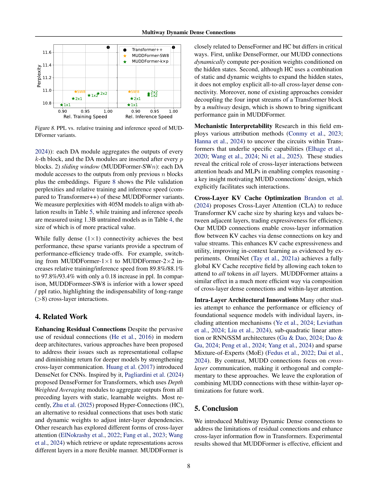

 


 2502.12170 
 Da Xiao et el. 
 
 🤗 2025-02-19 
 



↗ arXiv


↗ Hugging Face


### TL;DR



기존 Transformer 모델들은 깊이가 깊어질수록 **잔차 연결(residual connection)**의 한계로 인해 성능 향상에 어려움을 겪습니다. 깊은 계층에서 정보 흐름이 원활하지 않고, 표현력이 저하되는 문제가 발생합니다.  이러한 문제는 **메커니즘적 해석 연구**를 통해 확인되었으며, **깊은 계층에서 잔차 스트림이 과부하**되는 현상과 관련이 있습니다.

본 논문에서는 이러한 문제를 해결하기 위해 **다중 경로 동적 밀집 연결(MUDD) 구조**를 제안합니다.  **각 시퀀스 위치와 입력 스트림(쿼리, 키, 밸류, 잔차)**에 따라 연결 가중치를 동적으로 생성하여 계층 간 정보 흐름을 향상시키는 방법입니다.  실험 결과, MUDDFormer는 다양한 모델 아키텍처와 규모에서 기존 Transformer를 상당히 능가하는 성능을 보였으며,  **비슷한 성능을 달성하는데 필요한 연산량을 1.8~2.4배 감소**시켰습니다.  특히,  **매개변수 및 연산량 증가는 미미**했지만, 성능 향상은 매우 컸습니다.



#### Key Takeaways


 다중 경로 동적 밀집 연결(MUDD)을 통해 Transformer의 잔차 연결 문제를 해결 



 MUDDFormer는 기존 Transformer보다 훨씬 우수한 성능을 보이며, 비슷한 성능을 달성하는데 필요한 연산량을 1.8~2.4배 줄임 



 다양한 모델 아키텍처와 규모에서 언어 모델링 및 비전 작업에서 효과적으로 작동 


#### Why does it matter?
본 논문은 **Transformer의 성능을 크게 향상시키는 새로운 연결 구조**를 제시하여, **대규모 언어 모델 연구에 중요한 영향**을 미칠 수 있습니다.  **잔차 연결의 한계를 극복**하고 계층 간 정보 흐름을 향상시키는 방법을 제시함으로써, **더 깊고 강력한 Transformer 모델 개발**에 기여할 수 있습니다. 또한, **효율성과 확장성**에 대한 분석을 통해 실제적인 적용 가능성을 높였습니다. 따라서,  대규모 언어 모델 연구자들에게 큰 관심을 불러일으킬 것으로 예상됩니다.

------
#### Visual Insights


| Model | RΔ params | RΔ FLOPs | L | D | T | η | ρ |
|---|---|---|---|---|---|---|---|---|
| 1.4B | 0.22% | 0.38% | 24 | 2048 | 4096 | 0.0132 | 2 |
| 1.34B | 0.49% | 0.8% | 42 | 1536 | 4096 | 0.0293 | 2.67 |
| 2.8B | 0.23% | 0.4% | 32 | 2560 | 4096 | 0.0137 | 1.6 |
| 6.9B | 0.14% | 0.26% | 32 | 4096 | 4096 | 0.0085 | 1 |
| Formula | η/6 | η/(3+ρ/4) |  |  |  |  |  |

> 🔼 이 표는 MUDD 연결이 Transformer 모델에 추가되었을 때 발생하는 추가적인 파라미터와 계산량의 비율을 보여줍니다.  표의 위쪽 부분은 일반적인 모델 구조와 하이퍼파라미터에 대한 구체적인 값을 제시하고, 마지막 행은 이론적인 분석 결과를 보여줍니다.  L은 레이어 수, T는 시퀀스 길이를 나타냅니다.  추가 파라미터 비율은 전체 모델 파라미터 수 대비 MUDD 연결을 생성하는 데 필요한 파라미터 수의 비율을, 추가 계산 비율은 전체 순전파 연산량 대비 MUDD 연결 가중치 생성과 계층 간 집계에 필요한 연산량의 비율을 나타냅니다.
> 

> 
read the caption

> Table 1: Ratios of extra parameters and computation introduced by MUDD connections: (last row) analytical results and (upper rows) concrete values for typical model architectures and hyperparameters. L = number of layers, T = sequence length.
> 

### In-depth insights

#### Residual Limits
잔차 연결의 한계에 대한 심층적인 논의는 **깊이가 깊은 트랜스포머 모델에서의 성능 저하**를 설명하는 데 중점을 둡니다. 잔차 연결은 역전파 과정에서 기울기 소실 문제를 완화하는 데 효과적이지만, **깊은 네트워크에서는 정보 흐름의 병목 현상**을 야기할 수 있습니다. 이는 깊은 레이어에서 특징이 유사해지는 표현 붕괴 현상과 관련이 있으며, 상당수의 레이어를 제거해도 성능 저하가 거의 없는 것으로 나타납니다.  **다층적 연결(Dense Connection)**은 이러한 문제를 해결하기 위한 시도로 제시되었지만, 고정된 가중치를 사용하는 한계로 인해 표현력이 제한됩니다. 따라서 **역전파 과정에서 다양한 계층의 정보를 효과적으로 통합하고 레이어 간 정보 흐름을 개선**하기 위한 새로운 접근 방식이 필요합니다.

#### MUDD Connections
MUDD 연결은 Transformer의 잔차 연결 한계를 극복하기 위한 **혁신적인 방법**입니다. 기존의 정적이고 공유된 연결 가중치와 달리, **각 시퀀스 위치와 각 입력 스트림(쿼리, 키, 값 또는 잔차)**에 따라 가중치를 동적으로 생성합니다. 이는 Transformer 블록의 표현력을 크게 향상시키고, 심층 모델에서의 정보 흐름을 원활하게 합니다.  **다층적이고 다방향적인 정보 흐름**을 가능하게 하여 심층 모델의 성능을 크게 향상시키는 것을 실험적으로 증명했습니다. 특히, **계산 비용을 크게 증가시키지 않고** 성능을 비약적으로 향상시킨다는 점이 핵심적인 강점입니다.  **다양한 모델 아키텍처와 규모에 걸쳐** 우수한 성능을 보이며, 특히 대규모 언어 모델에서 뛰어난 효율성을 보여줍니다.  이는 **잔차 연결의 한계를 뛰어넘는 새로운 패러다임**을 제시하며, 향후 심층 학습 모델 발전에 중요한 기여를 할 것으로 기대됩니다.

#### Scaling & Efficiency
본 논문은 **확장성 및 효율성** 측면에서 다양한 크기의 모델과 토큰 수에 대한 실험 결과를 제시합니다.  **MUDDFormer**는 기존 Transformer 모델들에 비해 훨씬 적은 연산량으로 유사하거나 더 나은 성능을 달성함을 보여줍니다. 특히, **매우 큰 모델의 훈련 및 추론 속도** 면에서 뛰어난 효율성을 보이며, **매개변수 수 증가에 대한 성능 향상** 또한 효율적으로 이루어짐을 강조합니다.  **계산량 대비 성능 향상**은 다양한 크기의 모델에서 일관되게 나타나며, 이는 MUDDFormer의 설계가 **모델 크기의 확장에 강인함**을 의미합니다.  하지만, **추론 속도 개선**은 훈련 속도 개선만큼 두드러지지는 않아 향후 연구에서 개선될 여지가 있음을 시사합니다. **메모리 사용량**에 대한 분석 및 고려가 추가된다면 더욱 완벽한 효율성 평가가 가능할 것입니다.

#### Ablation Studies
본 논문의 **절제 연구(Ablation Studies)** 부분은 제안된 모델의 각 구성 요소의 중요성을 밝히는 데 중점을 둡니다.  이는 모델의 성능에 대한 각 구성 요소의 기여도를 측정하기 위해, 각 구성 요소를 제거하거나 변경하면서 모델 성능의 변화를 관찰하는 방식으로 진행됩니다.  예를 들어, 다층 다이나믹 밀집 연결(MUDD)의 각 특징인 정적 연결, 동적 연결, 다중 경로 연결 등을 순차적으로 제거하여 성능 변화를 분석합니다. 이를 통해 **각 구성 요소가 모델 성능 향상에 얼마나 기여하는지** 정량적으로 평가하고, **MUDD의 핵심 구성 요소**를 명확히 밝히는 데 도움이 됩니다.  또한, **다양한 변형 모델**들을 제시하고 비교함으로써, 최적의 모델 구조를 찾고자 하는 시도가 보여집니다.  이러한 절제 연구는 제안된 모델의 강점과 약점을 명확히 이해하고, 향후 연구 방향을 제시하는 데 중요한 역할을 합니다.  **결과적으로, 절제 연구는 제안된 모델의 신뢰성과 일반화 성능을 높이는 데 기여**합니다.

#### Future Work
본 논문에서 제시된 MUDDFormer는 Transformer의 성능을 향상시키는 효과적인 방법을 제시하지만, **여러 가지 추가 연구 방향**을 제시할 수 있습니다.  **다양한 모델 아키텍처 및 크기**에 대한 MUDDFormer의 일반화 성능을 더욱 폭넓게 평가하고,  **다른 종류의 작업 (예: 이미지 분류)**에 대한 적용 가능성을 탐색하는 것이 중요합니다. 또한, **계산 효율성을 높이기 위한 최적화** 전략 (예: 희소 연결, 양자화, 지식 증류)을 연구하고,  **MUDD 연결의 메커니즘에 대한 이론적 분석**을 심화하여 성능 향상의 근본 원인을 규명해야 합니다.  **다른 첨단 기술과의 통합** (예: MoE,  스위치 트랜스포머) 또한 향후 연구의 중요한 과제입니다.  마지막으로,  **MUDDFormer의 해석성을 높이기 위한 연구**는 모델의 신뢰성 및 안전성을 확보하는 데 필수적입니다. 이러한 추가 연구를 통해 MUDDFormer의 실용성 및 잠재력을 더욱 확장할 수 있을 것입니다.

### More visual insights

More on tables


| params | nlayers | dmodel | nheads | learning rate | batch size (in tokens) | tokens |
|---|---|---|---|---|---|---|
| 405M | 24 | 1024 | 16 | 3e-4 | 0.5M | 7B |
| 834M | 24 | 1536 | 24 | 2.5e-4 | 0.5M | 15B |
| 1.4B | 24 | 2048 | 32 | 2e-4 | 0.5M | 26B |
| *Scaling by depth* |  |  |  |  |  |  |
| 797M | 34 | 1280 | 20 | 2.5e-4 | 0.5M | 15B |
| 1.34B | 42 | 1536 | 24 | 2e-4 | 0.5M | 26B |
> 🔼 이 표는 논문의 확장 실험을 위해 사용된 모델 크기와 하이퍼파라미터를 보여줍니다.  모델 크기는 파라미터 수(params), 레이어 수(nlayers), 임베딩 차원(dmodel), 헤드 수(nheads)로 정의됩니다. 하이퍼파라미터는 학습률(learning rate), 배치 크기(batch size), 토큰 수(tokens)를 포함합니다. 표의 상단 절반은 기본적인 확장 실험 설정을 나타내고, 하단 절반은 깊이를 늘리고 너비를 줄이는 'DeepNarrow' 모델에 대한 설정을 나타냅니다.  이를 통해 모델 크기와 깊이, 너비의 관계를 실험적으로 확인하고자 합니다.
> 

> 
read the caption

> Table 2: Model sizes and hyperparameters for scaling experiments.
> 


Model|Pile ppl↓|FLAN ppl↓|LAM|BADA|PIQA|WinoGrande|ARC-E|ARC-C|SciQ|LogiQA|BoolQ|HellaSwag|RACE-M|RACE-H|Avg acc↑ / Δacc
---|---|---|---|---|---|---|---|---|---|---|---|---|---|---|---|---
Pythia-1.4B|7.29|9.30|61.6|71.0|57.2|60.5|26.1|86.6|21.4|63.3|40.5|37.3|33.9|50.8
MUDDPythia-1.4B|6.92|8.54|63.9|71.8|57.4|61.6|26.2|87.2|23.0|62.0|42.6|38.7|34.7|51.7/+0.9
Pythia-2.8B|6.63|8.16|64.7|73.9|59.4|64.4|29.5|88.2|21.2|64.5|45.4|38.1|34.9|53.1
MUDDPythia-2.8B|6.29|7.50|68.5|74.6|61.4|66.5|31.9|90.4|21.5|68.1|46.8|39.0|36.7|55.0/+1.9
Pythia-6.9B|6.29|7.85|67.3|75.2|60.9|67.3|31.3|89.7|25.3|63.7|48.0|40.6|37.0|55.1
Pythia-12B|6.01|7.26|70.5|76.0|63.9|70.2|31.8|90.2|22.4|67.4|50.3|40.6|38.3|56.5
MUDDFM-2.8B|6.01|7.08|70.7|75.7|63.4|70.4|34.2|91.8|24.0|67.4|49.5|40.6|38.1|56.9

Pythia-1.4B|-|-|54.5|71.0|57.5|63.1|28.9|92.2|22.9|63.0|40.5|35.4|34.6|51.2
MUDDPythia-1.4B|-|-|58.2|73.0|59.0|64.1|28.2|94.0|23.8|61.5|42.6|37.9|35.2|52.5/+1.3
Pythia-2.8B|-|-|60.5|73.6|60.6|67.3|32.3|94.3|21.7|65.6|45.1|38.4|35.6|54.1
MUDDPythia-2.8B|-|-|63.6|75.5|63.6|70.3|34.0|95.5|28.1|67.5|47.1|44.5|37.3|57.0/+2.9
Pythia-6.9B|-|-|63.8|75.5|63.7|70.2|35.6|95.1|27.0|65.7|48.1|39.0|36.5|56.4
Pythia-12B|-|-|67.3|76.0|64.2|71.0|36.5|95.3|21.8|68.0|50.3|40.1|38.8|57.2
MUDDFM-2.8B|-|-|65.6|76.4|66.8|73.0|39.2|95.6|25.2|70.9|49.8|41.4|38.0|58.4
> 🔼 표 3은 다양한 하류 작업(하류 평가)에서 제로샷(0-shot) 및 파이브샷(5-shot) 설정으로  MUDDPythia 및 Pythia 모델의 성능을 보여줍니다.  여러 언어 모델링 벤치마크(LAMBADA, PIQA, WinoGrande, ARC, SciQ, BoolQ, HellaSwag, RACE)에 대한 정확도 점수와 Pile 및 FLAN 데이터셋에 대한 perplexity 점수가 포함되어 있습니다.  이 표는 MUDDPythia 모델이 다양한 벤치마크에서 Pythia 모델보다 우수한 성능을 보임을 보여줍니다.
> 

> 
read the caption

> Table 3: Zero-shot and five-shot downstream evaluations results.
> 


| Model | Training (K tokens/s) |  | Inference (tokens/s) |  |
|---|---|---|---|---|
| Size | TFM++ | MUDDFM | TFM++ | MUDDFM |
| 1.3B | 1147 | 1030 ×**89.8%** | 325 | 286 ×**88.1%** |
| 2.8B | 684 | 575 ×**84.0%** | 181 | 163 ×**90.0%** |
| 6.9B | 332 | 318 ×**95.6%** | 95.5 | 89.7 ×**94.0%** |
> 🔼 표 4는 Transformer++와 MUDDFormer의 학습 처리량과 추론 속도를 비교한 표입니다.  모델 크기별(1.3B, 2.8B, 6.9B) Transformer++와 MUDDFormer의 TPU v5p-128 pod를 사용한 학습 처리량 (K tokens/s)과 NVIDIA A100 80G GPU를 사용한 추론 속도 (tokens/s)를 측정하여 비교 분석한 결과를 보여줍니다.  각 모델 크기에 대한 상대적인 속도 비율(%)도 함께 제시되어 MUDDFormer의 효율성을 Transformer++와 비교하여 명확하게 보여줍니다.
> 

> 
read the caption

> Table 4: Training throughput and inference speed comparison between Transformer++ and MUDDFormer.
> 


| Config | ppl | Config | ppl |
|---|---|---|---| 
| Transformer++ | 11.68 | MUDDFormer | **10.77** |
| + Static Dense | 11.44 | - Q dense | 10.89 |
| + Dynamic Dense | 11.09 | - K dense | 10.90 |
| + Multiway Static Dense | 11.27 | - V dense | 11.05 |
| + Multiway Dynamic Dense | 10.83 | - R dense | 11.14 |
| + Mul. Dyn. Dense + Re-alloc | **10.77** |  |  |
| + Re-alloc | 11.93 |  |  |
> 🔼 이 표는 논문의 3.5절 'Ablations and Variants'에서 MUDDFormer의 성능에 각 구성 요소가 기여하는 정도를 보여줍니다.  구체적으로, Transformer++ 모델에 MUDDFormer의 구성 요소(정적, 동적, 다중 경로 밀집 연결, 매개변수 재할당)를 순차적으로 추가하여 성능 변화를 측정하고, 각 구성 요소의 중요성을 분석합니다. 또한, 다중 경로 밀집 연결의 경우 각 입력 스트림(쿼리, 키, 값, 잔차)에 대해 밀집 연결을 제거했을 때의 성능 변화를 보여줍니다.  결과적으로, 각 구성 요소가 MUDDFormer의 성능 향상에 기여하며, 특히 값 스트림에 대한 밀집 연결이 중요함을 보여줍니다.
> 

> 
read the caption

> Table 5: Ablations of MUDDFormer’s components.
> 


| Model | nlayers | dmodel | dmlp | nheads | params |
|---|---|---|---|---|---| 
| (MUDD)ViT-S/16 | 12 | 384 | 1536 | 6 | 22M |
| ViT-M/16 | 12 | 512 | 2048 | 8 | 39M |
> 🔼 이 표는 ImageNet-1k 이미지 분류 작업에 사용된 비전 트랜스포머(ViT) 모델의 구조를 보여줍니다.  각 모델의 레이어 수, 모델 차원, MLP 차원, 헤드 수 및 파라미터 수를 보여줍니다.  ViT-S/16, MUDDViT-S/16 및 ViT-M/16 모델의 세부 사항을 비교하여 MUDD 연결이 모델 구조에 미치는 영향을 보여줍니다.
> 

> 
read the caption

> Table 6: ViT Model architectures for ImageNet-1k classification.
> 


| Model | val. loss | acc@e90 | acc@e300 | Rel. size |
|---|---|---|---|---|
| ViT-S/16 | 0.993 | 53.4 | 76.0 | 1 |
| MUDDViT-S/16 | 0.877 | 56.0 | 78.0 | 1.007 |
| ViT-M/16 | 0.890 | 55.2 | 77.9 | 1.72 |
> 🔼 표 7은 Vision Transformer (ViT) 모델을 사용하여 ImageNet-1k 데이터셋에 대해 이미지 분류 작업을 수행한 결과를 보여줍니다.  ViT-S/16 모델과 MUDD 연결을 추가한 MUDDViT-S/16 모델, 그리고 더 큰 ViT-M/16 모델의 검증 손실(validation loss)과 상위 1% 정확도(top-1 accuracy)를 90 에폭과 300 에폭에서 측정하여 비교합니다.  이를 통해 MUDD 연결이 ViT 모델의 성능 향상에 미치는 영향과 모델 크기의 변화에 따른 성능 변화를 분석합니다.
> 

> 
read the caption

> Table 7: ViT for ImageNet-1k classification results.
> 

### Full paper



