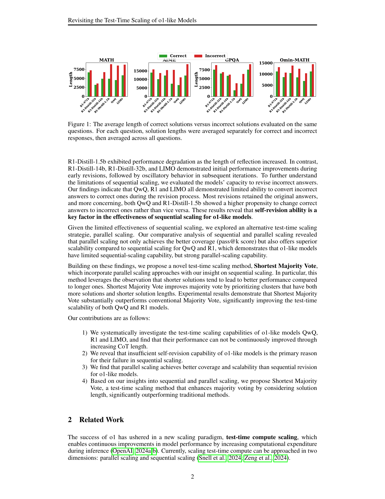

 


 2502.12215 
 Zhiyuan Zeng et el. 
 
 🤗 2025-02-19 
 



↗ arXiv


↗ Hugging Face


### TL;DR



기존 연구는 대규모 언어 모델(LLM)의 추론 성능 향상을 위해 계산 자원을 늘리는 테스트 시간 확장(test-time scaling) 기법에 주목했습니다. 특히, OpenAI의 o1 시리즈 모델은 추론 과정에서 계산 자원 할당을 늘려 추론 능력을 향상시켰습니다. 하지만, 이 연구는 o1과 유사한 모델들(QwQ, R1, LIMO)에서 긴 추론 과정이 항상 정확도 향상으로 이어지지 않음을 발견했습니다. 오히려 정답은 오답보다 짧은 경우가 많았습니다. 이는 모델의 자기 수정 능력과 관련이 있습니다.  

본 연구는 이 문제를 해결하기 위해 순차적 확장과 병렬적 확장 전략을 비교 분석하고, 병렬적 확장이 더 나은 성능을 보임을 확인했습니다.  또한, 솔루션 길이의 특징을 활용한 '최단 다수결(Shortest Majority Vote)'이라는 새로운 방법론을 제안했습니다. 이 방법은 병렬적 확장 전략과 솔루션 길이 특징을 결합하여 기존의 다수결 방법보다 모델의 테스트 시간 확장 능력을 크게 향상시킵니다.



#### Key Takeaways


 더 긴 추론 과정이 항상 더 나은 정확도를 보장하지 않음 



 병렬적 확장 전략이 순차적 전략보다 효율적임 



 솔루션 길이를 고려한 새로운 테스트 시간 확장 방법 제시 


#### Why does it matter?
**본 논문은 테스트 시간 확장의 효과에 대한 기존 가정에 의문을 제기하고, 대규모 언어 모델의 테스트 시간 확장 능력에 대한 새로운 이해를 제공합니다.**  이는 **새로운 테스트 시간 확장 방법을 제시**하고, **향후 연구를 위한 새로운 방향**을 제시하기 때문에 중요합니다.  **본 연구는 기존의 연구 방향을 재고하고 새로운 관점을 제시**함으로써, **연구 분야의 발전에 기여**할 것입니다.  특히, **병렬적 확장 전략**의 중요성을 강조하고, **솔루션 길이를 고려한 새로운 방법론**을 제안하여 **모델 성능 향상**에 기여하는 점에서 중요한 의미를 가집니다.

------
#### Visual Insights

> 🔼 이 그림은 동일한 질문에 대해 정답과 오답의 평균 길이를 비교하여 보여줍니다. 각 질문에 대해 정답과 오답의 길이를 따로 평균낸 후, 모든 질문에 대해 다시 평균을 냈습니다. 즉, 정답은 더 짧은 경향이 있고 오답은 더 긴 경향이 있음을 시각적으로 보여주는 그래프입니다.  이는 모델의 추론 과정에서 더 긴 답변이 항상 더 정확한 것을 의미하지 않음을 시사합니다.
> 

> 
read the caption

> Figure 1: The average length of correct solutions versus incorrect solutions evaluated on the same questions. For each question, solution lengths were averaged separately for correct and incorrect responses, then averaged across all questions.
> 


| R1-32b | R1-14b | R1-1.5b | QwQ | LIMO |
|---|---|---|---|---|
| 72% | 70% | 58% | 32% | 54% |

> 🔼 표 1은 모델이 잘못된 답변을 수정하는 과정에서 원래의 잘못된 답변을 유지하는 비율을 보여줍니다.  각 모델(R1-32b, R1-14b, R1-1.5b, QwQ, LIMO)에 대해 잘못된 답변을 수정하는 시도 중 원래 잘못된 답변을 그대로 유지한 비율의 백분율을 나타냅니다. 이는 모델의 자기 수정 능력의 한계를 보여주는 지표로 해석될 수 있습니다.  높은 비율은 모델이 잘못된 답변을 수정하는 데 어려움을 겪거나, 수정 과정에서 오류를 범할 가능성이 높음을 시사합니다.
> 

> 
read the caption

> Table 1: The proportion of the revisions that models sitck to the original wrong answers.
> 

### In-depth insights

#### o1-like Model Scaling
본 논문은 OpenAI의 o1 시리즈와 유사한 모델들(QwQ, R1, LIMO)의 테스트 시간 확장(test-time scaling) 능력에 대한 심층적인 재검토를 제시합니다. **기존의 가정과 달리, 이러한 모델들의 추론 체인 길이 증가가 정확도 향상으로 이어지지 않음**을 밝히고, 오히려 긴 추론 과정은 자기 수정(self-revision) 시도 증가로 인한 성능 저하를 야기한다는 점을 발견합니다.  **잘못된 답변을 수정하려는 능력이 제한적**이며, 올바른 답변을 잘못된 답변으로 수정하는 경우가 더 많다는 점을 지적합니다.  **병렬 확장(parallel scaling) 전략이 순차적 확장(sequential scaling)보다 뛰어난 성능**을 보임을 보여주며,  짧은 정답이 긴 정답보다 더 정확하다는 관찰을 바탕으로 기존의 다수결 투표 방식을 개선한 '최단 다수결 투표(Shortest Majority Vote)' 방법을 제안합니다. 이는 병렬 확장 전략과 길이 특징을 결합하여 모델의 테스트 시간 확장성을 크게 향상시키는 효과를 보입니다.  결론적으로, **o1 유사 모델의 테스트 시간 확장 능력에 대한 재고와 새로운 접근 방식의 필요성**을 강조합니다.

#### Sequential Scaling Fails
연구는 **순차적 확장이 일관되게 정확도를 향상시키지 못한다**는 점을 보여줍니다.  더 긴 추론 체인이 항상 더 나은 성능으로 이어지는 것은 아니며, 오히려 **잘못된 답변은 올바른 답변보다 더 긴 경향이 있다**는 것을 발견했습니다. 이러한 현상은 모델의 자기 수정 능력과 밀접한 관련이 있는데, **더 긴 추론 체인에는 더 많은 자기 수정이 포함되어 있으며, 이는 종종 성능 저하로 이어질 수 있습니다.**  **순차적 확장의 한계는 모델의 자기 수정 능력의 부족**으로 인한 것으로 나타났습니다.  모델은 잘못된 답변을 수정하는 능력이 제한적이며, 오히려 올바른 답변을 잘못된 답변으로 바꾸는 경우가 더 많았습니다. 따라서 **병렬 확장 전략이 순차적 확장보다 더 나은 적용범위와 확장성을 제공**한다는 것을 알 수 있습니다.  결론적으로, **단순히 추론 체인의 길이만 늘리는 것은 ol-like 모델의 성능 향상을 보장하지 않는다**는 점을 시사합니다.  더 효과적인 테스트 시간 확장 전략은 모델의 자기 수정 능력을 고려해야 합니다.

#### Parallel: A Better Path
본 논문의 "Parallel: A Better Path" 부분은 병렬 처리 방식이 순차적 접근 방식보다 **테스트 시간 확장(test-time scaling)**에 더 효과적임을 시사합니다.  **다수의 솔루션을 병렬적으로 생성하고 최적의 솔루션을 선택하는 병렬 전략**은 순차적으로 솔루션 길이를 늘리는 것보다 더 나은 성능을 보여주는 것으로 분석됩니다. 이는 특히 모델의 자기 수정 능력이 제한적인 경우에 더욱 두드러집니다.  **순차적 접근 방식은 과도한 자기 수정으로 인해 오히려 성능 저하를 초래할 수 있으나**, 병렬 방식은 다양한 솔루션을 탐색하여 최적의 결과를 얻을 가능성이 높습니다.  따라서 **병렬 처리 방식은 모델의 확장성과 효율성을 향상**시키는 데 중요한 역할을 한다는 결론을 제시합니다.  본 논문은 이러한 병렬 전략의 효과를 실험적으로 증명하고,  **'Shortest Majority Vote'와 같은 새로운 병렬 전략**을 제안하여 기존 방식보다 성능을 향상시키는 방안을 제시합니다.

#### Shortest Majority Vote
본 논문에서 제시된 '최단 다수결 투표(Shortest Majority Vote)' 방식은 **긴 추론 과정이 항상 정확성을 높이는 것은 아님**을 보여주는 연구 결과에 기반합니다.  이는 기존의 긴 Chain-of-Thought (CoT)를 이용한 테스트 시간 확장 방식의 한계를 드러냅니다.  **짧은 답변이 더 정확할 가능성이 높음**을 발견하여, 이를 다수결 투표 방식에 통합하여 효율성을 높였습니다.  **병렬적 확장 전략과 답변 길이 특징을 결합**하여 기존의 다수결 투표 방식보다 성능 향상을 이끌어냈다는 점이 핵심입니다.  **모델의 자기 수정 능력의 부족**이 긴 CoT의 효과 감소와 관련이 있음을 밝히고, 이를 보완하는 방식으로 제시된 만큼, **모델의 특성에 맞는 효율적인 추론 전략**을 제시하는 데 의의가 있습니다.  하지만 이 방법의 효과는 특정 모델과 데이터셋에 국한될 수 있으며, 더욱 광범위한 실험 및 분석이 필요합니다.

#### Future Research
본 논문은 test-time scaling이 o1-like 모델에서 일관되게 성능 향상을 가져오지 못한다는 점을 보여줍니다.  **향후 연구는 모델의 자기 수정 능력 개선에 초점을 맞춰야 합니다.**  이는 더 효과적인 self-revision 메커니즘을 개발하거나,  **외부 피드백을 활용한 접근법을 통해 해결될 수 있습니다.** 또한, **병렬 전략과 순차적 전략의 장점을 결합한 새로운 test-time scaling 방법론을 개발하는 것도 중요한 연구 방향입니다.**  **다양한 종류의 문제와 데이터셋에 대한 실험을 통해 방법론의 일반화 가능성을 검증하는 것도 필수적입니다.**  마지막으로,  **계산 비용을 고려하여 효율적인 test-time scaling 전략을 설계하는 연구가 필요합니다.** 이러한 연구들을 통해, 보다 강력하고 효율적인 test-time scaling 기법이 개발되어 LLM의 추론 능력을 더욱 향상시킬 수 있을 것으로 기대됩니다.

### More visual insights

More on figures

> 🔼 이 그림은 QwQ와 R1 모델의 솔루션 길이에 대한 평가 결과를 보여줍니다.  각 모델에 대해 정답과 오답의 평균 솔루션 길이를 비교하여 Test-Time Scaling에서 솔루션 길이가 정확도에 미치는 영향을 분석합니다.  AIME, MATH, Omni-MATH, GPQA 등 여러 벤치마크 데이터셋에서의 결과를 보여주어 다양한 문제 유형에 대한 일반화 성능을 평가합니다.  그래프를 통해 정답의 평균 솔루션 길이가 오답보다 짧다는 것을 확인할 수 있습니다.
> 

> 
read the caption

> (a) Evaluation for Solution length.
> 

> 🔼 그림 2(b)는 QwQ와 R1 모델의 솔루션 길이에 따른 정확도를 보여줍니다. 솔루션을 길이에 따라 다섯 그룹으로 나누고 각 그룹의 평균 정확도를 계산했습니다. 이를 통해 솔루션 길이가 길다고 해서 항상 정확도가 높아지는 것은 아님을 보여줍니다. 실제로는 짧은 솔루션이 더 높은 정확도를 보이는 경우도 있습니다.
> 

> 
read the caption

> (b) Evaluation for accuracy.
> 

> 🔼 그림 2는 QwQ와 R1 모델의 솔루션들을 길이에 따라 다섯 개의 그룹으로 나누고, 각 그룹의 솔루션 길이(a)와 정확도(b)를 평가한 결과를 보여줍니다. 각 질문에 대해 모델이 생성한 솔루션들을 길이 순으로 정렬한 후, 길이 기준 상위 20%씩 다섯 개의 그룹으로 나눕니다.  (예: 가장 긴 솔루션들이 그룹 5, 가장 짧은 솔루션들이 그룹 1).  따라서, 각 그룹에는 서로 다른 질문들에 대한 솔루션들이 포함되어 있으며, 각 그룹 내 솔루션들의 평균 길이와 정확도가 계산되어 비교됩니다. 이를 통해 솔루션의 길이와 정확도 간의 상관관계를 분석합니다.
> 

> 
read the caption

> Figure 2: Solutions of QwQ and R1 were categorized into different groups according to their length and evaluated in terms of solution length (a) and accuracy (b). The categorization of solutions is progressed for each question independently, i.e., all groups of solutions are corresponding to the same questions.
> 

> 🔼 그림 (a)는 모델이 생성할 수 있는 최대 토큰 수 제한(Max Token Limitation)이 모델의 정확도에 미치는 영향을 보여줍니다.  x축은 최대 토큰 수 제한을 나타내고, y축은 모델의 정확도를 나타냅니다. 각 선은 다른 모델(LIMO, QwQ, R1-Distill-32b, R1-Distill-14b, R1-Distill-1.5b)의 결과를 나타냅니다. 이 그래프를 통해 최대 토큰 수 제한이 모델 정확도에 미치는 영향과 최적의 토큰 수 제한을 파악할 수 있습니다. 특히 16k 토큰 제한을 기점으로 성능 향상이 감소하는 것을 확인할 수 있습니다.
> 

> 
read the caption

> (a) Max Token Limitation
> 

> 🔼 그림 (b)는 모델이 생성한 솔루션의 길이에 따른  'Wait' 이라는 단어의 빈도를 보여줍니다.  더 긴 솔루션일수록  'Wait' 단어가 더 많이 등장하는 경향을 보여줍니다. 이는 모델이 솔루션을 생성하는 과정에서 자체적으로 수정 및 검토하는 과정(self-revision)이 더 많이 발생함을 시사합니다.  이러한 self-revision은 솔루션의 길이를 늘리지만, 정확도 향상으로 이어지지 않는다는 것을 연구는 보여줍니다.
> 

> 
read the caption

> (b) Frequence of “Wait”
> 

> 🔼 그림 3은 두 가지 하위 그림으로 구성됩니다. (a)는 모델 정확도와 최대 토큰 제한 매개변수 간의 관계를 보여줍니다. 최대 토큰 제한은 모델이 생성할 수 있는 토큰의 최대 수를 제어하며, 특히 긴 솔루션을 생성할 때 모델 정확도에 영향을 미칩니다. (b)는 솔루션 길이와 솔루션에 나타나는 평균 'wait' 횟수 간의 관계를 보여줍니다. 'wait'는 모델이 스스로 수정하는 과정에서 자주 사용하는 단어로, 자기 수정 횟수가 많을수록 솔루션이 길어지는 경향이 있습니다.
> 

> 
read the caption

> Figure 3: (a): The relationship between model accuracy and the generation parameter Max Token Limitation. (b): The relationship between solution length and the average number of “wait” occur in a solution.
> 

> 🔼 그림 4(a)는 R1-Distill-32b, R1-Distill-14b, LIMO 세 가지 모델에 대한 순차적 수정(sequential revision) 과정에서의 정확도 변화를 보여줍니다.  각 모델이 여러 번 수정을 거치면서 정확도가 어떻게 변하는지 시각적으로 나타냅니다.  수정 횟수가 증가함에 따라 정확도 변화 추이를 통해 각 모델의 자기 수정 능력 및 그 한계를 파악할 수 있습니다.
> 

> 
read the caption

> (a) Acc of R1-Distill-32b, 14b and LIMO
> 

> 🔼 그림 (b)는 R1-Distill-1.5b와 QwQ 모델에 대한 순차적 수정(sequential revision) 과정에서의 정확도 변화를 보여줍니다.  가로축은 수정 단계(Iteration)를, 세로축은 정확도(Accuracy)를 나타냅니다.  두 모델 모두 초기 수정 단계에서는 정확도가 상승하지만, 반복적인 수정을 거치면서 정확도 향상이 둔화되거나 오히려 감소하는 경향을 보입니다. 이는 장황한 답변(long CoT)이 항상 정확도를 높이는 것은 아니라는 연구 결과를 뒷받침합니다.  R1-Distill-1.5b 모델은 특히 정확도 저하가 두드러집니다.
> 

> 
read the caption

> (b) Acc of R1-Distill-1.5b, QwQ
> 

> 🔼 이 그림은 순차적 수정 과정에서 모델의 솔루션 길이 변화를 보여줍니다.  반복적인 수정을 거치면서 솔루션의 길이가 어떻게 증가하는지 시각적으로 나타냅니다. 각 모델의 솔루션 길이 변화 추이를 통해 순차적 확장 전략의 효과를 분석하는 데 도움이 됩니다.
> 

> 
read the caption

> (c) Solution lengths during revisions.
> 

> 🔼 그림 4는 순차적 수정 과정에서의 모델 정확도 변화와 솔루션 길이 변화를 보여줍니다. (a)에서는 R1-Distill-32b, R1-Distill-14b, LIMO 모델의 정확도 변화를, (b)에서는 R1-Distill-1.5b, QwQ 모델의 정확도 변화를 순차적 수정 횟수에 따라 나타냅니다. (c)는 수정 횟수가 증가함에 따라 솔루션 길이가 증가하는 것을 보여줍니다.  즉, 여러 번 수정을 거치면서 모델의 정확도가 어떻게 변하는지, 그리고 솔루션의 길이가 어떻게 변하는지를 보여주는 그림입니다. 이를 통해 순차적 스케일링 전략의 효과와 한계를 파악할 수 있습니다.
> 

> 
read the caption

> Figure 4: (a): Accuracy of R1-Distill-32b, R1-Distill-14b and LIMO during sequential revisions. (b): Accuracy of R1-Distill-1.5b and QwQ during sequential revisions. (c) Solution length increased with the more revision steps.
> 

> 🔼 이 그림은 순차적 확장 과정 동안 초기 정답을 오답으로 바꾸는 비율(정답에서 오답으로)과 초기 오답을 정답으로 바꾸는 비율(오답에서 정답으로)을 보여줍니다.  각 모델(R1-Distill-32b, R1-Distill-14b, R1-Distill-1.5b, QwQ, LIMO)에 대해 반복 횟수에 따른 이러한 비율의 변화를 시각적으로 나타냅니다. 이는 모델의 자기 수정 능력과 정확도 간의 관계를 이해하는 데 중요한 정보를 제공합니다.
> 

> 
read the caption

> Figure 5: The ratio of turning an initial correct answer to incorrect one (correct to wrong) and an initial incorrect answer to a correct one (wrong to correct) during sequential scaling.
> 

> 🔼 이 그림은 AIME 벤치마크에서 순차적 확장과 병렬 확장의 적용 범위를 비교 분석한 결과를 보여줍니다. 순차적 확장은 모델이 해결책을 반복적으로 수정하는 방식을 사용하는 반면, 병렬 확장은 여러 해결책을 동시에 생성하고 그 중 가장 좋은 해결책을 선택하는 방식을 사용합니다. 그래프는 토큰 수에 따른 적용 범위의 변화를 보여주며, 병렬 확장이 순차적 확장보다 더 나은 적용 범위를 달성함을 시각적으로 나타냅니다.  QwQ와 R1 모델의 성능을 비교 분석하여, 병렬 확장 전략의 우수성을 보여줍니다.
> 

> 
read the caption

> (a) Evaluation on Coverage.
> 

> 🔼 그림 (b)는 다양한 길이의 솔루션을 가진 QwQ 및 R1 모델의 정확도를 보여줍니다. 각 모델의 솔루션을 길이에 따라 그룹으로 나누고, 각 그룹의 평균 정확도를 계산했습니다. 그래프는 솔루션 길이가 증가함에 따라 정확도가 일관되게 향상되지 않음을 보여줍니다. 일부 경우에는 솔루션 길이가 길어질수록 정확도가 감소하는 것을 관찰할 수 있습니다. 이는 o1 유사 모델의 테스트 시간 확장 능력에 대한 기존 가정에 이의를 제기하는 결과입니다.
> 

> 
read the caption

> (b) Evaluation on Accuracy
> 

> 🔼 그림 6은 AIME 벤치마크에서 순차적 스케일링과 병렬 스케일링의 성능을 보여줍니다. (a)는 순차적 스케일링과 병렬 스케일링의 적용범위(coverage)를 비교하고, (b)는 순차적 수정(sequential revision)과 다수결 투표(majority vote)의 정확도를 비교합니다.  순차적 스케일링은 모델이 반복적으로 답을 수정하는 방식이고, 병렬 스케일링은 여러 개의 답을 생성한 후 가장 좋은 답을 선택하는 방식입니다. 이 그림은 병렬 스케일링이 순차적 스케일링보다 더 나은 적용범위와 확장성을 제공함을 보여줍니다.
> 

> 
read the caption

> Figure 6: (a): the coverage of sequential scaling and parallel scaling on AIME. (b): the accuracy of squential revision and majority vote on AIME.
> 

> 🔼 그림 7은 AIME 벤치마크에서 다수결 투표, 최단 길이, 그리고 최단 길이 다수결 투표의 병렬 확장 성능을 보여줍니다. 세 가지 방법 모두 토큰 수가 증가함에 따라 정확도가 향상되지만, 최단 길이 다수결 투표가 다른 두 방법보다 더 나은 성능을 보임을 알 수 있습니다. 이는 최단 길이 다수결 투표가 솔루션 길이를 고려하여 최적의 솔루션을 선택하기 때문입니다.
> 

> 
read the caption

> Figure 7: Parallel-scaling performance of Majority Vote, Shortest and Shortest Majority Vote on AIME.
> 

> 🔼 그림 8은 다양한 길이를 가진 해답 그룹에서 정답의 수와 토큰의 분포를 보여줍니다.  각 모델(R1-671b, R1-Distill-32b, R1-Distill-14b, QwQ, LIMO)과 벤치마크(AIME, GPQA)에 대해, 해답의 길이를 기준으로 5개의 그룹으로 나누고 각 그룹 내 정답의 수와 그 그룹을 구성하는 토큰의 총 개수를 나타냅니다. 이는 모델이 생성하는 해답의 길이와 정확도 간의 관계를 분석하는 데 사용됩니다. 즉, 긴 해답이 항상 더 정확한 것은 아님을 시각적으로 보여줍니다.
> 

> 
read the caption

> Figure 8: The number of correct solutions and tokens distributed across groups of different lengths.
> 

### Full paper



