 


 2502.12501 
 Qiyuan Zhang et el. 
 
 🤗 2025-02-19 
 



↗ arXiv


↗ Hugging Face


### TL;DR



LLM 기반 자동 평가는 비용 효율적이지만, **CoT 추론의 한계로 인해 신뢰성이 떨어지는 문제**가 있습니다. 기존 연구는 다수결 투표나 기준 확장에 의존하여 이 문제를 제대로 해결하지 못했습니다.  이 논문은 **LLM이 생성한 응답과 군중 반응을 비교하여 평가하는 새로운 Crowd-based Comparative Evaluation (CCE) 방법론**을 제안합니다.

CCE는 **군중 반응을 통해 LLM의 평가를 보완**, **더욱 포괄적이고 세부적인 CoT 추론을 유도**합니다.  실험 결과, CCE는 다양한 벤치마크에서 평균 6.7%의 정확도 향상을 달성했으며, **더욱 질 높은 CoT를 생성하고 SFT 효율을 높이는 등 우수한 성능**을 보였습니다.  본 연구는 **LLM 자동 평가의 신뢰성 및 효율성 개선에 크게 기여**하며, 향후 LLM 연구 발전에 중요한 의미를 가집니다.



#### Key Takeaways


 군중 반응 비교를 통해 LLM의 자동 평가 신뢰도 향상 (평균 정확도 6.7% 증가) 



 더욱 풍부하고 질 높은 CoT (Chain-of-Thought) 추론 생성 및 판별 모델 효율 향상 



 Crowd rejection sampling을 통한 SFT (Supervised Fine-Tuning) 효율 증대 


#### Why does it matter?
본 논문은 **LLM 기반 자동 평가의 신뢰성을 높이는 혁신적인 방법론**을 제시하여, **LLM의 평가 및 개선에 대한 연구**에 중요한 기여를 합니다.  **기존의 한계점을 극복하고 새로운 연구 방향을 제시**함으로써, LLM 분야의 발전에 큰 영향을 미칠 것으로 예상됩니다.  특히, **더욱 효율적이고 정확한 LLM 개발 및 평가를 위한 새로운 접근 방식을 제시**한다는 점에서 연구자들에게 큰 의미가 있습니다.

------
#### Visual Insights

> 🔼 본 그림은 제안하는 방법의 개요를 보여줍니다. 후보 응답 A/B와 함께 군중 응답을 평가함으로써, 생성된 군중 판단을 컨텍스트로 사용하여 A/B 응답 평가를 풍부하게 하고, 보다 포괄적인 CoT 판단을 도출할 수 있습니다.  군중 응답은 후보 응답과 비교하여 평가되고, 이를 통해 후보 응답 내의 더 깊고 포괄적인 세부 정보를 드러냅니다. 이 과정은 LLM-as-a-Judge가 더욱 상세한 CoT 판단을 제공하도록 효과적으로 유도합니다.
> 

> 
read the caption

> Figure 1: An overview of our method. By evaluating the candidate responses A/B alongside the crowd responses, the resulting crowd judgment can be used as context to enrich the evaluation of A/B responses, leading to a more comprehensive CoT judgment.
> 


| Model | Reward | HelpSteer2 | MTBench | Judge | EvalBias | Avg. |
|---|---|---|---|---|---|---|
| **GPT-4o** |  |  |  |  |  |  |
| _Vanilla_ | 85.2 | 66.1 | 82.1 | 66.3 | 68.5 | 73.6 |
| _LongPrompt_ | 86.9 | 67.3 | 81.8 | 63.5 | 70.5 | 74.0 |
| _EvalPlan_ | 88.7 | 65.5 | 81.4 | 62.9 | 74.4 | 74.6 |
| _16-Criteria_ | 87.3 | 69.1 | 82.8 | 66.6 | 73.7 | 75.9 |
| _Maj@16_ | 87.9 | 68.9 | 82.4 | 68.6 | 75.5 | 76.7 |
| _Agg@16_ | 88.1 | 68.7 | 82.6 | 67.2 | 77.9 | 76.9 |
| CCE-_random@16_ | 91.2 | 69.5 | 83.1 | 68.9 | 80.1 | 78.6 |
| **CCE**_@16_ | **91.8** | **70.6** | **83.6** | **70.4** | **85.0** | **80.3** |
| **Qwen 2.5 7B-Instruct** |  |  |  |  |  |  |
| _Vanilla_ | 78.2 | 60.7 | 76.1 | 58.3 | 57.4 | 66.1 |
| **CCE**_@16_ | **80.4** | **64.2** | **76.7** | **64.0** | **79.4** | **72.9** |
| **Qwen 2.5 32B-Instruct** |  |  |  |  |  |  |
| _Vanilla_ | 87.4 | **72.3** | 79.0 | 68.9 | 71.1 | 75.7 |
| **CCE**_@16_ | **90.8** | 72.1 | **82.1** | **70.6** | **80.5** | **79.2** |
| **Qwen 2.5 72B-Instruct** |  |  |  |  |  |  |
| _Vanilla_ | 85.2 | **69.5** | 79.5 | 68.3 | 68.5 | 74.0 |
| **CCE**_@16_ | **93.7** | 68.5 | **88.9** | **75.7** | **85.9** | **82.7** |
| **Llama 3.3 70B-Instruct** |  |  |  |  |  |  |
| _Vanilla_ | 86.4 | 70.4 | 81.1 | 67.1 | 70.6 | 75.1 |
| **CCE**_@16_ | **91.7** | **71.3** | **83.5** | **69.7** | **79.2** | **79.1** |

> 🔼 표 1은 쌍방 비교 벤치마크에서 LLM-as-a-Judge의 정확도를 보여줍니다. 이 표는 다양한 LLM과 벤치마크에 걸쳐 CCE(Crowd-based Comparative Evaluation)가 LLM-as-a-Judge의 성능을 지속적으로 향상시키는 것을 보여줍니다. 특히, maj@16과 같은 다른 스케일링 추론 전략에 비해 상당히 뛰어난 성능을 보입니다. 가장 높은 값은 굵게 표시되어 있으며, CCE-random은 '비판적 선택 및 결과 제거 처리'를 '무작위 선택'으로 대체한 경우를 나타냅니다.  다섯 가지 벤치마크(REWARDBENCH, HELPSTEER2, MTBENCH HUMAN, JUDGEBENCH, EVALBIAS)에서의 평균 정확도 향상을 보여줍니다.
> 

> 
read the caption

> Table 1: Accuracy of LLM-as-a-Judge on pair-wise comparison benchmarks. CCE can consistently enhance the LLM-as-a-Judge’s performance across 5 benchmarks, especially considerably outperforming other scaling inference strategies, like maj@16. The highest values are bolded. Here, CCE-random refers to replacing the “Criticizing Selection+++Outcome-Removal Processing” with “Random Selection”.
> 

### In-depth insights

#### CrowdEval: A New Paradigm
CrowdEval이라는 새로운 패러다임은 **대규모 언어 모델(LLM)의 자동 평가 방식을 혁신적으로 개선**하기 위해 제안된 접근법으로 보입니다. 기존의 LLM 평가 방식의 한계를 극복하고, 더욱 포괄적이고 신뢰할 수 있는 평가를 가능하게 할 것으로 예상됩니다.  특히, **다수의 응답을 비교 분석**하여 LLM의 판단 근거를 더욱 심층적으로 파악하고, **평가의 정확성과 신뢰도를 높이는 데 중점**을 두고 있습니다. 이를 통해, LLM의 성능을 더욱 정확하게 측정하고, 향후 발전 방향을 제시하는 데 크게 기여할 것으로 예상됩니다.  **다양한 벤치마크 데이터셋에 대한 실험 결과**를 통해 CrowdEval의 우수성을 검증하고, 그 효과를 정량적으로 보여주는 것이 중요할 것입니다.  **실제 응용 가능성**을 높이기 위해, CrowdEval의 확장성과 효율성에 대한 추가적인 연구가 필요할 것으로 예상됩니다.  또한, **다양한 유형의 LLM 및 평가 기준에 대한 적용 가능성**을 검토하고, **잠재적인 편향성 및 한계점**을 분석하는 것이 중요합니다.

#### CCE Mechanism
본 논문에서 제안하는 CCE(Crowd-based Comparative Evaluation) 메커니즘은 **LLM 기반 자동 평가의 신뢰성과 포괄성을 높이기 위한 핵심**입니다. 기존의 단순 다수결 투표나 기준 확장 방식과 달리, CCE는 **후보 응답과 추가적인 군중 응답을 비교**하여 후보 응답의 세부적인 내용을 더욱 심층적으로 파악합니다. 이를 통해 LLM이 **더욱 풍부하고 자세한 CoT(Chain-of-Thought) 추론**을 생성하여 평가의 정확성을 높일 수 있습니다. **군중 응답의 다양성**은 후보 응답의 여러 측면을 드러내는 다양한 평가 기준을 제공하며, **LLM의 판단을 보다 포괄적이고 심층적**으로 유도합니다.  이는 단순히 정답/오답 여부를 넘어, 응답의 질적 측면까지 고려한 **세밀한 평가**를 가능하게 합니다.  **CCE의 핵심은 군중 응답을 활용한 비교 분석**을 통해 LLM의 평가 능력을 향상시키는 데 있습니다. 이 메커니즘은 LLM 기반 평가 시스템의 한계를 극복하고, 더욱 정확하고 신뢰할 수 있는 평가 결과를 도출하는 데 기여합니다.

#### SFT Rejection Sampling
본 논문에서 제시된 'SFT Rejection Sampling'은 기존의 지도 학습 미세 조정(SFT) 방식의 한계를 극복하기 위한 새로운 접근법입니다. **기존 SFT는 저품질 응답을 걸러내는 데 어려움**을 겪는데 반해, 본 방법은 **크라우드 기반 비교 평가(CCE)를 통해 고품질 응답을 효과적으로 선별**합니다. CCE는 후보 응답을 여러 개의 크라우드 응답과 비교하여 세부적인 차이를 드러내고, 이를 통해 LLM-as-a-Judge가 더욱 포괄적이고 정교한 평가를 내릴 수 있도록 유도합니다.  **크라우드 응답의 다양성**은 후보 응답에 대한 다차원적 평가를 가능하게 하여, 단순한 다수결 투표나 기준 확장 방식보다 더욱 신뢰할 수 있는 결과를 제공합니다.  결과적으로, 본 연구의 SFT Rejection Sampling은 **더욱 효율적이고 신뢰도 높은 SFT 모델 학습**을 가능하게 하며, 특히 **편향성에 대한 강건성을 향상**시키는 효과를 보입니다.  **크라우드 기반의 샘플링 전략**은 단순히 품질이 높은 응답만을 선별하는 것을 넘어, 모델 학습에 적합한 다양한 유형의 응답을 포함함으로써 모델의 일반화 능력을 향상시키는 데 기여합니다.  **다양한 벤치마크 실험**을 통해 그 효과가 검증되었다는 점에서, 본 방법은 SFT의 실용성을 크게 높일 수 있는 잠재력을 가지고 있습니다.

#### CoT Enhancement
본 논문에서 제시된 'CoT Enhancement' 전략은 **LLM 기반 평가의 신뢰성을 높이기 위한 핵심**입니다. 기존의 단순한 다수결 투표나 기준 확장 방식에서 벗어나, **크라우드 응답을 활용하여 후보 응답 간의 비교 분석을 심화**시키는 접근 방식을 취하고 있습니다. 이를 통해 LLM이 **더욱 포괄적이고 세부적인 맥락을 고려한 CoT 추론**을 수행하도록 유도하며, 평가의 정확성과 신뢰성을 향상시킵니다. 특히, **다양한 크라우드 응답을 비교 분석하는 과정은 인간의 평가 행태를 모방**하여 LLM의 추론 능력을 향상시키는 데 효과적입니다. 또한, 본 논문에서는 **크라우드 기반 거절 샘플링**을 통해 SFT의 효율성을 개선하는 방안도 제시하고 있습니다.  **크라우드 응답의 질적 개선**은  LLM 기반 평가의 전반적인 성능 향상에 기여하며, **추론 규모 확장에 따른 정확도 향상** 또한 확인되었습니다.  즉, 본 논문의 CoT 향상 전략은 단순한 기술적 개선을 넘어, LLM 기반 평가의 근본적인 한계를 극복하기 위한 중요한 이정표가 될 것으로 예상됩니다.

#### Limitations and Future
본 논문은 군중 기반 비교 평가(CCE) 방법을 제안하여 LLM 기반 판단의 신뢰성을 높이고, 그 한계점을 극복하고자 노력하였습니다. 하지만, **자체 반복(self-iteration) 과정의 부재**는 향후 개선의 여지로 남습니다. 반복적인 정제를 통해 평가의 정확성을 더욱 높일 수 있을 것입니다. 또한, **LLM 기반 군중 반응 선택 전략의 개선** 또한 필요합니다. 다양한 LLM을 활용한 군중 반응 생성은 효율적이지만, 어떤 LLM의 반응이 판단에 더 큰 영향을 미치는지에 대한 추가 연구가 필요합니다.  **제한된 규모의 데이터셋** 또한 한계점으로 지적될 수 있으며, 더욱 방대한 데이터를 활용한 실험을 통해 일반화 성능을 검증해야 합니다.  마지막으로, **다양한 과제 및 지표**에 대한 적용성을 탐색하여 CCE의 범용성을 확대하고, 다양한 LLM 아키텍처와의 호환성을 높여야 합니다. 이러한 한계점들을 극복하기 위한 지속적인 연구를 통해 CCE는 LLM 기반 자동 평가의 신뢰도를 더욱 향상시키고, 더욱 효율적이고 포괄적인 평가 시스템 구축에 기여할 수 있을 것입니다.

### More visual insights

More on figures

> 🔼 그림 2는 제안된 군중 기반 비교 평가 방식의 파이프라인을 보여줍니다. 주어진 인스턴스 (x, yA, yB)에 대해, LLM을 사용하여 x를 기반으로 군중 응답 {yi|i∈{C,D,E,…}}을 생성합니다. 그런 다음 이러한 응답들을 yA와 yB와 비교하여 초기 군중 판단 𝒥를 생성하고, 선택 및 처리 과정을 거쳐 𝒥̂로 정제합니다. 최종적으로 𝒥̂를 문맥 정보로 사용하여 인스턴스 (x, yA, yB)를 평가합니다.
> 

> 
read the caption

> Figure 2: Pipeline of our proposed crowd-based comparative evaluation. For a given instance (x,yA,yB)𝑥superscript𝑦𝐴superscript𝑦𝐵(x,y^{A},y^{B})( italic_x , italic_y start_POSTSUPERSCRIPT italic_A end_POSTSUPERSCRIPT , italic_y start_POSTSUPERSCRIPT italic_B end_POSTSUPERSCRIPT ), we first use the LLM to generate crowd responses {yi|i∈{C,D,E,…}}conditional-setsuperscript𝑦𝑖𝑖𝐶𝐷𝐸…\left\{y^{i}|i\in\{C,D,E,...\}\right\}{ italic_y start_POSTSUPERSCRIPT italic_i end_POSTSUPERSCRIPT | italic_i ∈ { italic_C , italic_D , italic_E , … } } based on x𝑥xitalic_x. These responses are then compared with yAsuperscript𝑦𝐴y^{A}italic_y start_POSTSUPERSCRIPT italic_A end_POSTSUPERSCRIPT and yBsuperscript𝑦𝐵y^{B}italic_y start_POSTSUPERSCRIPT italic_B end_POSTSUPERSCRIPT to produce initial crowd judgments 𝒥𝒥\mathcal{J}caligraphic_J, which are subsequently refined into 𝒥^^𝒥\hat{\mathcal{J}}over^ start_ARG caligraphic_J end_ARG after selection and processing. Finally, 𝒥^^𝒥\hat{\mathcal{J}}over^ start_ARG caligraphic_J end_ARG are used as contextual input to evaluate the instance (x,yA,yB)𝑥superscript𝑦𝐴superscript𝑦𝐵(x,y^{A},y^{B})( italic_x , italic_y start_POSTSUPERSCRIPT italic_A end_POSTSUPERSCRIPT , italic_y start_POSTSUPERSCRIPT italic_B end_POSTSUPERSCRIPT ).
> 

> 🔼 그림 3은 추가되는 참여자 반응(crowd judgments)의 수가 증가함에 따라 평가 정확도와 CoT(Chain-of-Thought) 길이가 일반적으로 증가하는 것을 보여줍니다.  즉, 더 많은 참여자 의견을 활용할수록 평가의 정확성이 높아지고, 모델이 생성하는 추론 과정(CoT) 또한 더욱 자세해짐을 시각적으로 보여주는 그래프입니다. 이는 제안된 방법(Crowd-based Comparative Evaluation)의 효과를 보여주는 주요 실험 결과 중 하나입니다.
> 

> 
read the caption

> Figure 3: Evaluation performance under scaling crowd judgments in the context. As the number of crowd judgments grows, both accuracy and CoT length generally increase.
> 

> 🔼 그림 4는 CCE(Crowd-based Comparative Evaluation)와 기존 방법의 CoT(Chain-of-Thought) 비교 결과를 보여줍니다. CCE의 CoT는 모든 벤치마크에서 평균적으로 더 많은 주요 지점(key points)과 더 높은 적용 범위(coverage rate)를 보입니다. 주요 지점은 CoT가 다루는 핵심 내용 및 세부 사항을 나타내며, 적용 범위는 CoT가 후보 응답의 세부 사항을 얼마나 포괄적으로 다루는지를 나타냅니다. 이는 CCE가 기존 방법보다 더욱 포괄적이고 심층적인 평가를 제공함을 시사합니다.
> 

> 
read the caption

> Figure 4: CoT Comparison. CCE’s CoT consistently yields a higher average number of key points and a higher coverage rate across all benchmarks.
> 

> 🔼 그림 5는 본 논문에서 제안하는 방법의 프롬프트를 보여줍니다. 이 프롬프트는 LLM이 두 개의 AI가 생성한 응답을 비교하고 평가하는 역할을 하도록 설계되었습니다. 프롬프트는 공정하고 포괄적인 평가를 하도록 지시하며, 다양한 평가 기준 (도움이 되는 정도, 관련성, 정확성, 완전성, 명확성, 깊이, 추론 품질, 창의성, 세부 수준 등)을 고려하도록 안내합니다. 또한, 프롬프트는 다른 응답의 특징을 배경 지식으로 활용하여 평가의 일관성과 포괄성을 높이고, 응답의 길이, 스타일, 순서, 어시스턴트 이름 등에 영향을 받지 않도록 지시합니다. 최종적으로, 어시스턴트 A가 더 나은 응답을 제공한 경우 '[[A]]', 어시스턴트 B가 더 나은 응답을 제공한 경우 '[[B]]' 형식으로 최종 판단을 내리도록 안내합니다.
> 

> 
read the caption

> Figure 5: Prompt of Our Method.
> 

> 🔼 그림 6은 기존의 LLM-as-a-Judge 방식에서 사용하는 프롬프트를 보여줍니다.  간결한 기존 설명과 달리, 이 프롬프트는 LLM에게 두 개의 AI 응답을 비교 평가하고,  유용성, 관련성, 정확성, 깊이, 창의성, 세부 수준 등 여러 기준을 고려하여 어떤 응답이 사용자의 질문에 더 잘 답하는지 판단하도록 지시합니다.  응답의 길이, 스타일, 순서, 어시스턴트 이름 등이 평가에 영향을 미치지 않도록 공정하고 객관적인 평가를 강조하며, 외부 정보를 사용하지 않도록 명시하고 있습니다. 최종 평결은 '[[A]]' (A가 더 우수한 경우) 또는 '[[B]]' (B가 더 우수한 경우) 형식으로 제출하도록 명시되어 있습니다.
> 

> 
read the caption

> Figure 6: Prompt of Vanilla LLM-as-a-Judge.
> 

> 🔼 그림 7은 논문의 3.2절 Crowd Response and Judgment Generation에서 제시된 16개의 평가 기준을 사용하는 LLM-as-a-Judge 프롬프트를 보여줍니다.  기존의 단순한 평가 기준을 넘어,  정확성, 일관성, 명확성 등 16가지 세부적인 측면을 고려하여 더욱 포괄적이고 정교한 평가를 유도하기 위한 프롬프트입니다.  이 프롬프트는 LLM이 후보 응답들을 보다 심층적으로 비교 분석하고,  보다 정확하고 세밀한 판단을 내릴 수 있도록 돕는 것을 목표로 합니다.
> 

> 
read the caption

> Figure 7: Prompt of 16-Criteria LLM-as-a-Judge.
> 

> 🔼 그림 8은 논문의 '3.5 SFT에서의 군중 거부 샘플링' 섹션에 속하며, LongPrompt 방식의 LLM-as-a-Judge 프롬프트를 보여줍니다.  기존의 LLM-as-a-Judge 프롬프트와 달리,  응답의 질을 평가하는 과정에서 LLM이 가능한 한 자세하고 긴 맥락 추론(Chain-of-Thought, CoT)을 생성하도록 유도하는 프롬프트입니다.  즉,  LLM이 단순히 좋은/나쁜 응답을 선택하는 것이 아니라, 그 이유를 상세하게 설명하는 긴 CoT를 생성하도록 설계되었습니다. 이를 통해 평가의 신뢰성과 투명성을 높이고자 합니다.
> 

> 
read the caption

> Figure 8: Prompt of LongPrompt LLM-as-a-Judge.
> 

More on tables


| Model | # of Training Samples | RewardBench | HelpSteer2 | MTBench Human | JudgeBench | EvalBias | Avg. | 
|---|---|---|---|---|---|---|---| 
| **JudgeLM-7B** (Zhu et al., 2023a) | 100,000 | **46.4** | **60.1** | 64.1 | 32.6 | **42.4** | **49.1** | 
| **PandaLM-7B** (Wang et al., 2024c) | 300,000 | 45.7 | 57.6 | **75.0** | 36.0 | 27.0 | 48.3 | 
| **Auto-J-13B** (Li et al., 2024b) | 4,396 | **47.5** | **65.1** | **75.2** | **50.9** | 16.5 | **51.0** | 
| **Prometheus-7B** (Kim et al., 2024a) | 100,000 | 34.6 | 30.8 | 52.8 | 9.3 | 11.7 | 27.8 | 
| **Prometheus-2-7B** (Kim et al., 2024b) | 300,000 | 43.7 | 37.6 | 55.0 | **39.4** | **39.8** | 43.1 | 
| **Llama-3.1-8B-Tuned** |  |  |  |  |  |  |  | 
| *Synthetic Judgment from Vanilla* | 10,000 | 66.8 | 56.0 | 71.6 | **60.1** | 34.2 | 57.7 | 
| *Synthetic Judgment from Vanilla* | 30,000 | **72.5** | **58.6** | **73.9** | 50.4 | **46.2** | 60.3 | 
| *Synthetic Judgment from CCE* | 10,000 | 69.7 | **58.6** | 72.7 | **66.4** | 38.7 | **61.2** | 
| *Synthetic Judgment from CCE* | 30,000 | **70.0** | **60.1** | **74.3** | 50.3 | **50.7** | **61.1** | 
| **Qwen 2.5-7B-Tuned** |  |  |  |  |  |  |  | 
| *Synthetic Judgment from Vanilla* | 10,000 | 68.1 | 55.6 | 70.7 | **50.2** | 38.4 | 56.6 | 
| *Synthetic Judgment from Vanilla* | 30,000 | 71.4 | 56.2 | 75.1 | 48.2 | 54.7 | 61.1 | 
| *Synthetic Judgment from CCE* | 10,000 | 68.8 | 56.7 | 71.3 | 49.8 | 40.2 | 57.4 | 
| *Synthetic Judgment from CCE* | 30,000 | **73.3** | **59.5** | **74.9** | 50.1 | **57.1** | **63.0** | 
| *Mix Synthetic Judgment from CCE&Vanilla* | 60,000 | **74.1** | **60.7** | **76.6** | **61.6** | **60.6** | **66.7** |
> 🔼 표 2는 소규모 LLM-as-a-Judge 모델을 쌍방향 비교 벤치마크에서 평가한 정확도를 보여줍니다. 동일한 선호도 데이터 쌍을 사용했을 때, CCE를 사용하여 생성된 판단으로 학습된 모델이 더욱 신뢰할 수 있는 평가 결과를 도출합니다. 가장 높은 값은 굵게 표시하고, 두 번째로 높은 값은 밑줄을 쳤습니다.
> 

> 
read the caption

> Table 2: Accuracy of Trained small LLM-as-a-Judge on pair-wise comparison benchmarks. Under the same preference pairs data, the model trained with judgments synthesized using CCE achieves more reliable evaluation results. The highest values are bolded, and the second highest is underlined.
> 


| Rejection Sampling Method | MTBench | AlpacaEval-2 |
|---|---|---|
| **Llama 3.1 8B Base** |  |  |
| **Instructions from LIMA # 1K** |  |  |
| *Random Sampling* | 4.33 | 2.89/3.29 |
| *Vanilla Rejection Sampling* | 4.28 | **2.91/3.29** |
| *Crowd Rejection Sampling* | **4.53** | **3.02/3.31** |
| **Instructions from Tulu 3 # 10K** |  |  |
| *Random Sampling* | 7.51 | 12.81/12.45 |
| *Vanilla Rejection Sampling* | **7.56** | **19.92/17.17** |
| *Crowd Rejection Sampling* | **7.63** | **22.23/19.74** |
| **Qwen 2.5 7B Base** |  |  |
| **Instructions from LIMA # 1K** |  |  |
| *Random Sampling* | **8.06** | **14.52/9.40** |
| *Vanilla Rejection Sampling* | 7.91 | 14.40/9.44 |
| *Crowd Rejection Sampling* | **8.63** | **14.86/9.59** |
| **Instructions from Tulu 3 # 10K** |  |  |
| *Random Sampling* | 8.36 | 21.39/13.68 |
| *Vanilla Rejection Sampling* | **8.46** | **22.71/16.44** |
| *Crowd Rejection Sampling* | **8.41** | **23.78/17.56** |
> 🔼 본 표는 지시사항 따르기 벤치마크에서의 SFT(Supervised Fine-Tuning) 거부 샘플링 성능을 보여줍니다. CCE(Crowd-based Comparative Evaluation) 방식으로 샘플링된 응답을 사용하여 미세 조정된 모델이 향상된 생성 성능을 보임을 보여줍니다.  구체적으로는, LIMA와 TULU3-SFT 두 데이터셋에서 세 가지 샘플링 방법(무작위 샘플링, 일반적인 거부 샘플링, CCE 기반 거부 샘플링)을 비교하여, CCE 기반 거부 샘플링이 더 나은 성능을 제공함을 보여줍니다.  이는 다양한 벤치마크에서 미세조정된 모델의 생성 능력을 평가하여 확인됩니다.
> 

> 
read the caption

> Table 3: SFT Rejection Sampling Performance on the Instruction-Following Benchmark. The model fine-tuned with responses sampled using CCE demonstrates improved generative performance.
> 


| Strategy | # of Selection Samples | RewardBench | HelpSteer2 | MTBench Human | JudgeBench | EvalBias | Avg. | 
|---|---|---|---|---|---|---|---| 
| _Random-Selection_ | 8 | 91.0 | 69.9 | 82.6 | 68.7 | 78.4 | 78.1 | 
| _Praising-Selection_ | 8 | 86.6 | 64.2 | 81.5 | 67.1 | 77.7 | 75.4 | 
| _Criticizing-Selection_ | 8 | 91.2 | 69.2 | 83.0 | 68.9 | 79.1 | 78.3 | 
| _Balanced-Selection_ | 8 | 90.7 | 68.6 | 82.8 | 67.4 | 78.7 | 77.6 | 
| _Outcome-Removal Random-Selection_ | 8 | 91.5 | 69.9 | 83.0 | 69.4 | 79.5 | 78.7 | 
| _Outcome-Removal Criticizing-Selection (Sota)_ | 8 | 91.5 | 70.1 | 83.2 | 69.5 | 79.9 | 78.8 | 
| _Random-Selection_ | 16 | 91.2 | 69.5 | 83.1 | 68.9 | 80.1 | 78.6 | 
| _Praising-Selection_ | 16 | 87.0 | 68.4 | 82.0 | 67.1 | 77.9 | 76.5 | 
| _Criticizing-Selection_ | 16 | 90.8 | 69.7 | 83.0 | 69.6 | 82.9 | 79.2 | 
| _Balanced-Selection_ | 16 | 90.6 | 69.3 | 82.9 | 68.0 | 79.6 | 78.1 | 
| _Outcome-Removal Random-Selection_ | 16 | 91.7 | 69.7 | 83.2 | 70.0 | 81.5 | 79.2 | 
| _Outcome-Removal Criticizing-Selection(Sota)_ | 16 | 91.8 | 70.6 | 83.6 | 70.4 | 85.0 | 80.3 | 
> 🔼 표 4는 쌍방 비교 벤치마크에서 LLM-as-a-Judge의 정확도를 보여줍니다. 이 표는 제안된 방법인 CCE(Crowd-based Comparative Evaluation)가 LLM-as-a-Judge의 성능을 향상시키는 데 효과적임을 보여주는 실험 결과를 제시합니다. 특히, CCE는 기존의 다수결 투표 방식(maj@16)이나 기준 확장 방식(16-Criteria)보다 훨씬 우수한 성능을 보입니다. 동일한 선호도 쌍 데이터를 사용했을 때, CCE를 사용하여 생성된 판단으로 학습된 모델이 더욱 신뢰할 수 있는 평가 결과를 제공합니다.  테스트 시간 추론 단계에서 CCE가 LLM-as-a-Judge의 성능을 일관되게 향상시키고, 특히 maj@16 및 16-Criteria보다 훨씬 뛰어난 성능을 보임을 강조합니다.  같은 선호도 데이터 쌍을 사용했을 때, CCE로 합성된 판단으로 훈련된 모델이 더욱 신뢰할 수 있는 평가 결과를 도출함을 보여줍니다.
> 

> 
read the caption

> Table 4: Accuracy of LLM-as-a-Judge on pair-wise comparison benchmarks. CCE can consistently enhance the LLM-as-a-Judge’s performance during the test-time inference phase, especially considerably outperforming maj@16 and 16-Criteria; under the same preference pairs data, the model trained with judgments synthesized using CCE achieves more reliable evaluation results.
> 


| Instruction | Response A | Response B | Vanilla LLM-as-a-Judge | CCE |
|---|---|---|---|---|
| Classify this tweet from the categories of positive, negative, or neutral. Tweet: I’m so thankful for all the wonderful people in my life | 
<b>Response A</b>
  The sentiment of this social media comment is positive. The use of the word "grateful" implies appreciation and thankfulness, while "amazing experiences" suggest that these experiences have been very fulfilling or enjoyable. | 
<b>Response B</b>
 Positive | Assistant A’s response is more detailed than Assistant B’s. 
It highlights specific words and phrases in the tweet, such as “thankful” and “wonderful people,” to justify the positive sentiment classification. This explanation adds depth and clarity to the response, making it more helpful and informative.
 Assistant B’s response is less informative and helpful.  - Final Verdict: 
[[A]]
 | 
CCE
 
AC Judgment
 
However, Assistant A makes a mistake by referencing words not present in the tweet, such as "grateful" and "amazing experiences,"
 Assistant C also classifies the tweet as positive and provides a detailed explanation. Assistant A 
, but it inaccurately references words not present in the tweet, such as "grateful" and "amazing experiences." This detracts from the accuracy of the response and could potentially confuse the user.
 Assistant B 
is concise and correctly classifies the tweet as positive. However, it lacks any explanation or reasoning, which limits its helpfulness and depth.
 In comparing the two, 
Given the importance of accuracy and explanation in sentiment analysis,
 - Final Verdict: 
[[B]]
 |
> 🔼 표 5는 서로 다른 평가 방법으로 평가된 짝 비교 사례를 보여줍니다.  'Preference'는 정답을, 'Preference'는 오답을 나타냅니다.  오렌지색은 평가에서 노이즈가 많은 요소를, 연두색은 유용한 요소를 강조합니다. 이 표는 인간 평가자와 유사하게 LLM 기반 판단이 잡음이 많고 불완전할 수 있음을 보여주는 대표적인 사례를 제시하며, 제안된 Crowd Comparative Evaluation (CCE) 방법이 이러한 문제점을 어떻게 해결하는지 보여줍니다.  CCE는 다양한 관점을 제공하는 추가적인 응답을 활용하여, 더 포괄적이고 정확한 평가를 가능하게 합니다.
> 

> 
read the caption

> Table 5: A pairwise comparison case evaluated by different methods. Preference refers to right result and Preference refers to wrong result. We emphasize the noisy evaluation elements in  orange, while highlighting the useful elements of the evaluation in  limongreen.
> 


| Benchmarks | Size | Focus |
|---|---|---|
| *RewardBench* | 2,985 | It covers multiple scenarios, including Chat, Chat-Hard, Safety, and Reasoning. |
| *HelpSteeer2* | 519 | It provides multiple fine-grained dimensions for evaluation, like Helpfulness, Coherence, Correctness, Complexity, Verbosity. |
| *MTBench Human* | 2,665 | It provides multi-turn conversation for evaluation, and we filter the samples whose outcome is “Tie”. |
| *JudgeBench* | 350 | It focuses on challenging response pairs spanning knowledge, reasoning, math, and coding |
| *EvalBias* | 1,000 | It tests the robustness of judges on various scenarios containing evaluation biases. |
> 🔼 표 6은 논문에서 사용된 다섯 가지 선호도 벤치마크에 대한 간략한 설명입니다. 각 벤치마크는 특정한 평가 목표를 가지고 있으며, 다양한 시나리오(대화, 안전, 추론 등)와 세부 평가 기준(유용성, 일관성, 정확성, 복잡성, 자세함 등)을 포함합니다. 본 논문에서는 이 다섯 가지 벤치마크를 사용하여 LLM-as-a-Judge의 성능을 종합적으로 평가하고 있습니다.
> 

> 
read the caption

> Table 6: The brief description of Preference Benchmarks for testing.
> 

### Full paper


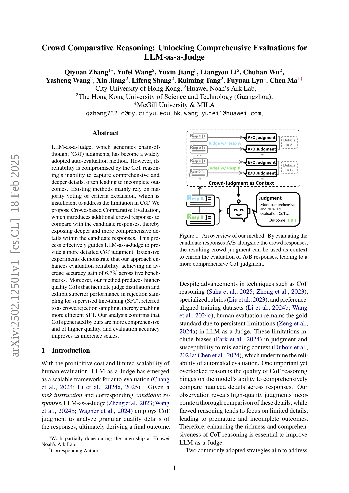

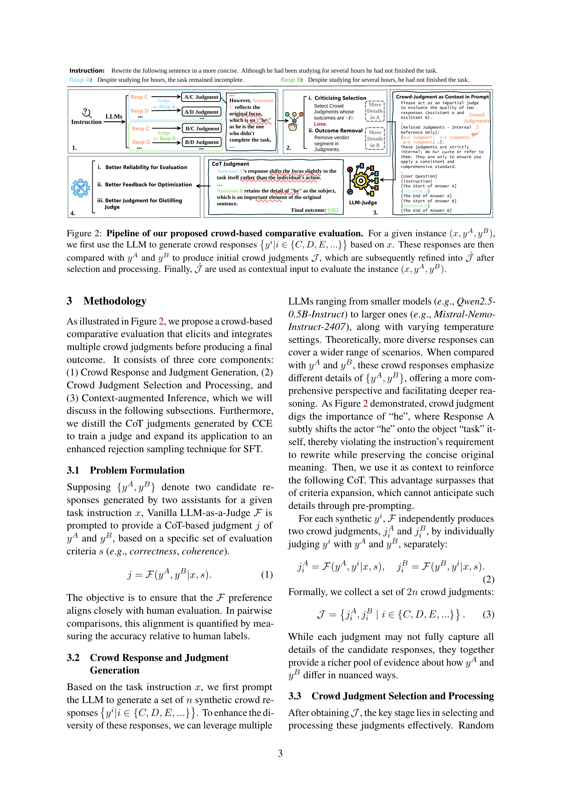
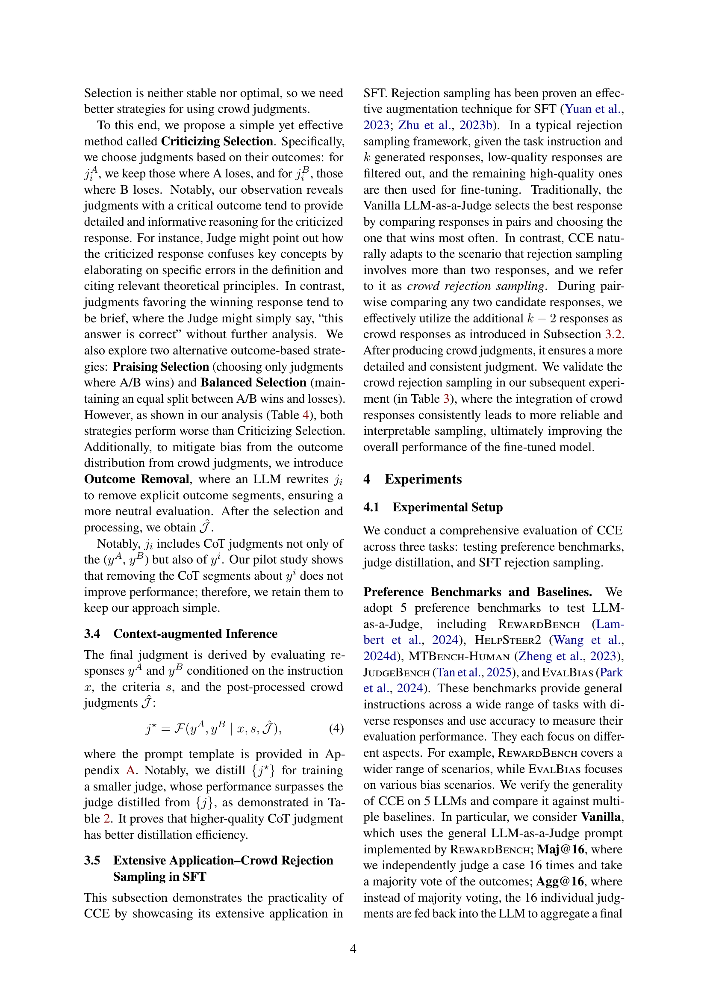

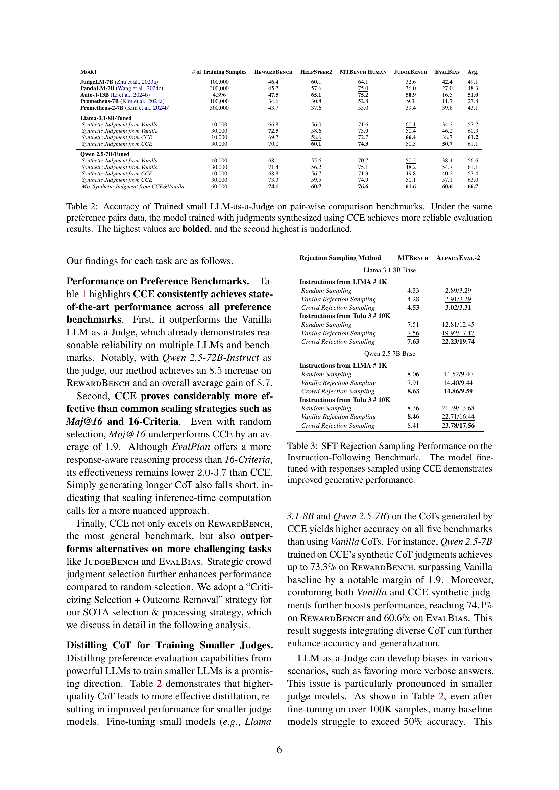
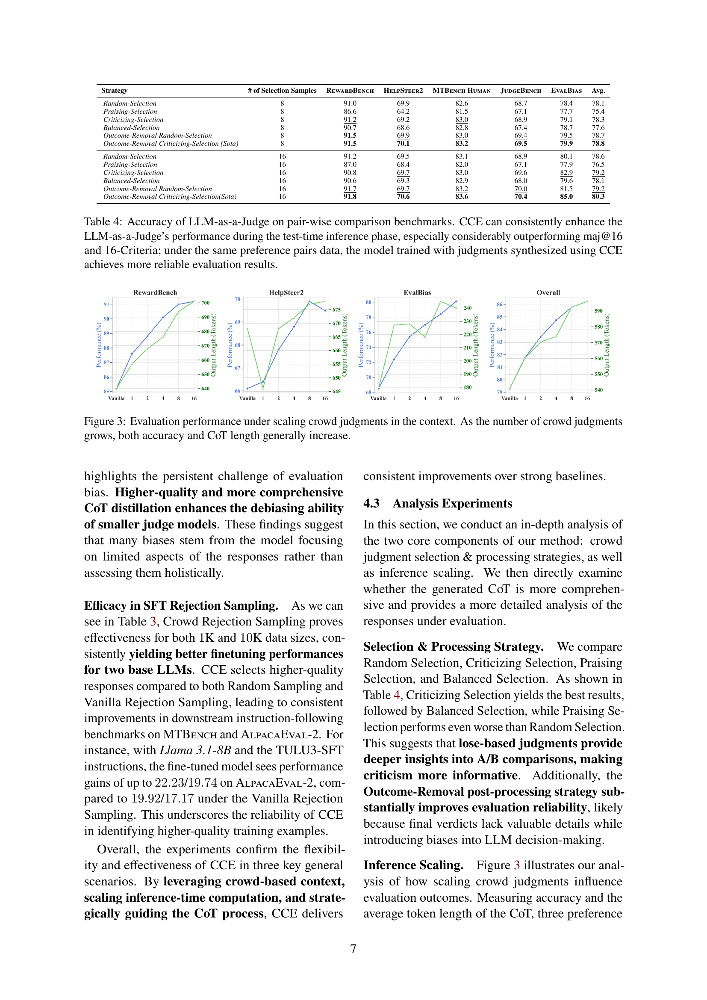
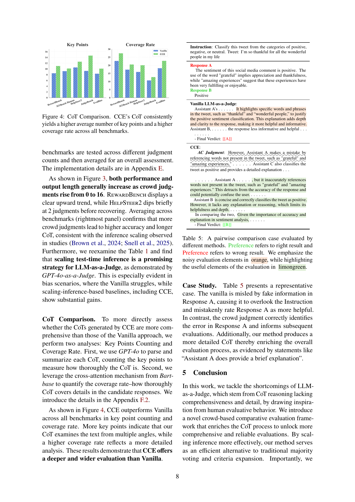
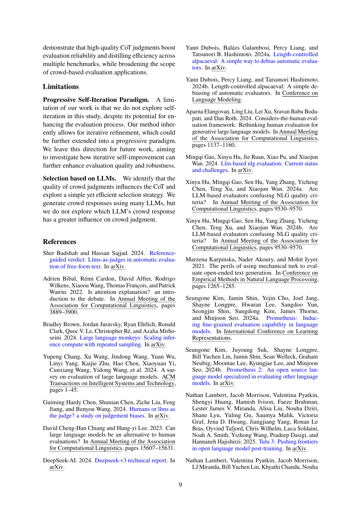
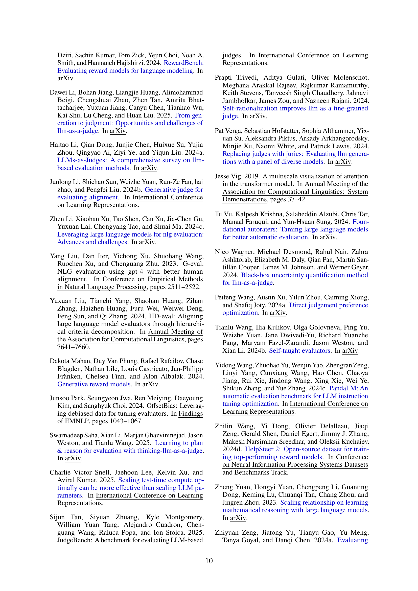
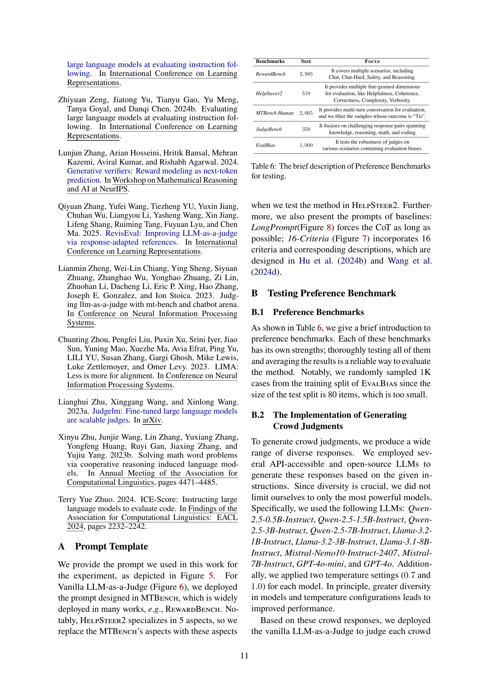
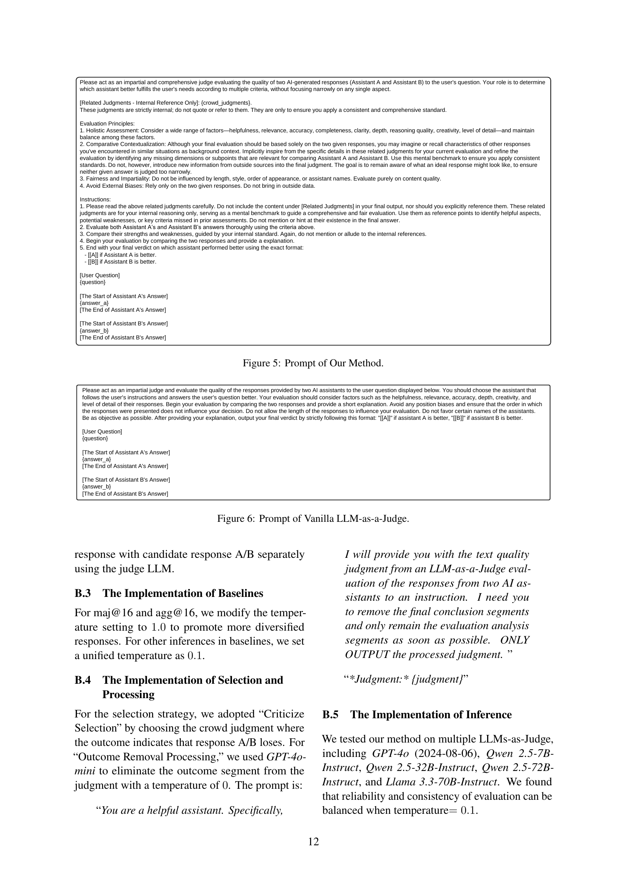

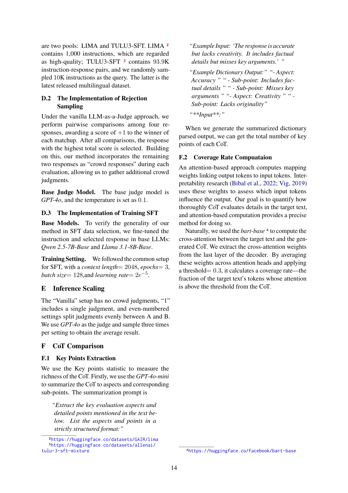
