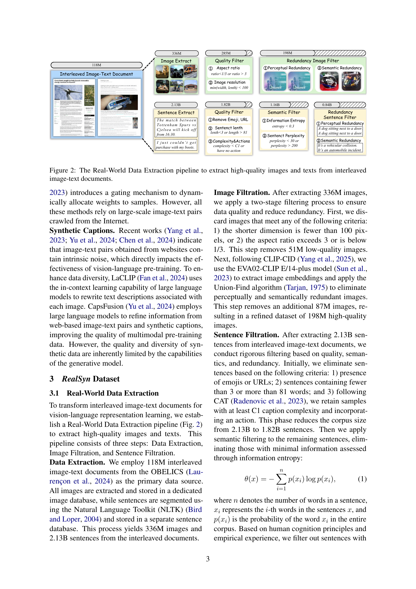
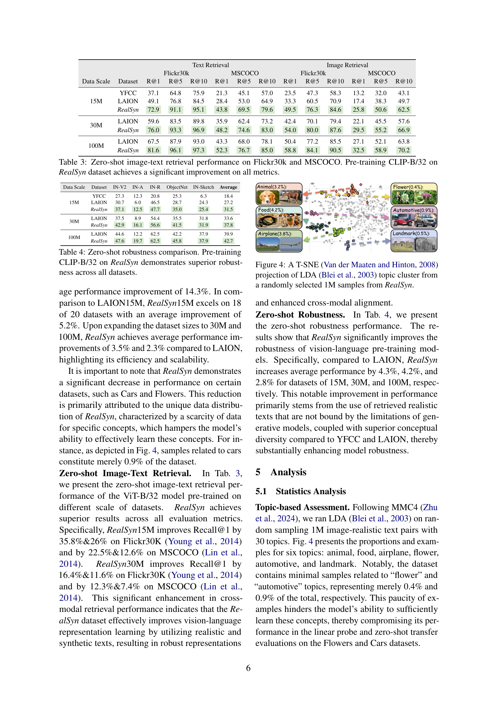
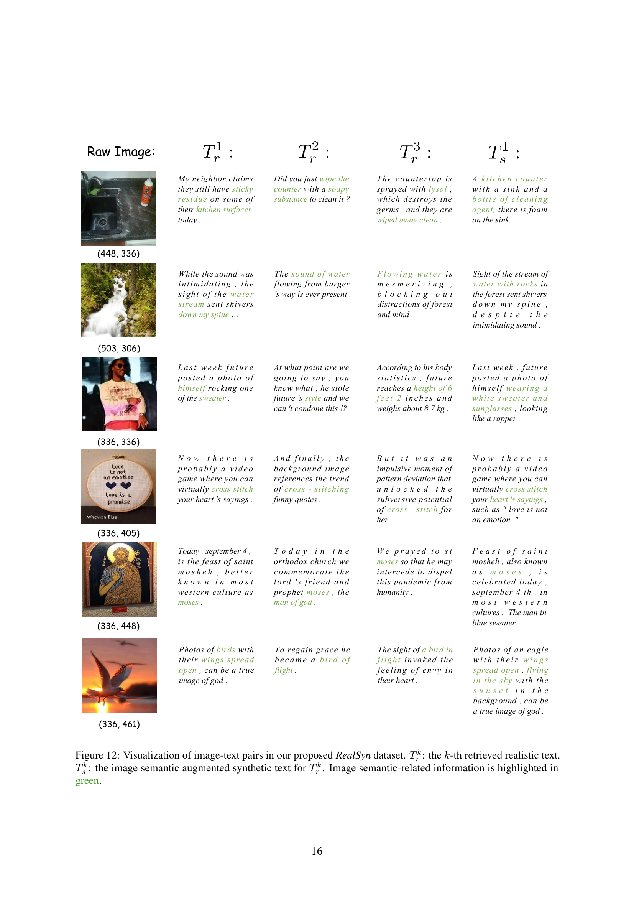

 


 2502.12513 
 Tiancheng Gu et el. 
 
 🤗 2025-02-19 
 



↗ arXiv


↗ Hugging Face


### TL;DR



기존의 이미지-텍스트 쌍 데이터셋은 짝을 이루지 않은 다중 모드 문서 데이터(예: 이미지와 텍스트가 섞여있는 문서)를 활용하지 못하는 한계가 있습니다. 이러한 비짝 데이터는 풍부한 정보를 담고 있지만, 기존 방법으로는 활용이 어렵습니다.  

본 논문에서는 이러한 문제를 해결하기 위해 **계층적 검색 기법과 이미지 의미 증강 생성 모듈**을 제안합니다. 이를 통해 **실제 데이터에서 고품질의 이미지-텍스트 쌍을 효율적으로 추출**하고, **합성 데이터를 생성하여 데이터 다양성을 확보**합니다.  **15M, 30M, 100M 세 가지 규모로 제공되는 RealSyn 데이터셋**을 구축하여 다양한 하위 작업에서 성능 향상을 보였습니다.



#### Key Takeaways


 비전-언어 표현 학습을 위해 기존에 활용되지 않던 다양한 형태의 이미지-텍스트 문서를 효과적으로 활용하는 새로운 방법 제시 



 실제 및 합성 텍스트를 통합한 대규모 데이터셋 RealSyn (15M, 30M, 100M) 공개 및 다양한 하위 작업에서 최첨단 성능 달성 



 RealSyn 데이터셋의 확장성 및 효율성을 실험적으로 검증, 향후 연구를 위한 새로운 가능성 제시 


#### Why does it matter?
본 논문은 **비교적 활용되지 않은 다양한 형태의 이미지-텍스트 문서를 활용**하여 **비전-언어 표현 학습을 향상**시키는 새로운 방법론을 제시합니다.  **대규모 데이터셋 RealSyn**을 통해 **스케일러블하고 효과적인 모델 학습**이 가능함을 보여주며, **다양한 하위 작업에서 최첨단 성능**을 달성합니다. 이는 **향후 연구에 대한 새로운 방향**을 제시하고, **다양한 분야의 연구자들에게 유용한 자료**가 될 것입니다.

------
#### Visual Insights

> 🔼 그림 1은 다양한 이미지와 텍스트가 서로 뒤섞여 있는 다중 모드 문서(multimodal interleaved documents)가 기존의 비전-언어 표현 학습(vision-language representation learning)에 적합하지 않다는 점을 보여줍니다. 이러한 문서들로부터 이미지와 텍스트를 효과적으로 분리하여 이미지-텍스트 쌍(image-text pairs)을 생성하는 과정을 설명합니다.  본 논문에서는 계층적 검색(hierarchical retrieval) 및 합성 텍스트 생성(synthetic text generation) 기법을 통해 다중 모드 문서에서 이미지와 텍스트의 연관성을 효과적으로 찾아내고, 이를 바탕으로 새로운 이미지-텍스트 쌍을 생성하는 방법을 제시합니다. 이 그림은 본 논문에서 제안하는 방법의 개념적 틀을 보여줍니다.
> 

> 
read the caption

> Figure 1: Multimodal interleaved documents are unsuitable for vision-language representation learning. We construct distinct image-text pairs from such documents via retrieval and generation.
> 


| Data Scale | Dataset | Food101 | CIFAR10 | CIFAR100 | Birdsnap | SUN397 | Cars | Aircraft | DTD | Pets | Caltech | Flowers | STL10 | EuroSAT | RESISC45 | KITTI | Country | UCF101 | Memes | SST2 | ImageNet | Average |
|---|---|---|---|---|---|---|---|---|---|---|---|---|---|---|---|---|---|---|---|---|---|---|
| 15M | YFCC | 67.2 | 90.4 | 70.8 | 47.7 | 66.7 | 23.8 | 29.7 | 62.4 | 65.7 | 80.1 | 90.0 | 94.7 | 94.9 | 79.4 | 75.4 | 18.4 | 70.8 | 48.6 | 56.2 | 56.7 | 64.5 |
|  | LAION | 71.0 | 93.3 | 78.1 | 41.0 | 66.3 | 76.9 | 43.0 | 71.2 | 74.5 | 87.6 | 88.2 | 93.6 | 95.3 | 82.9 | 72.2 | 13.5 | 75.4 | 55.7 | 57.3 | 59.3 | 69.8 |
|  | RealSyn | 77.1 | 94.5 | 78.7 | 43.4 | 71.4 | 64.7 | 42.7 | 71.3 | 79.9 | 90.0 | 88.2 | 96.4 | 96.2 | 87.2 | 72.4 | 16.7 | 79.9 | 55.7 | 57.7 | 64.0 | 71.4 |
| 30M | LAION | 76.1 | 94.5 | 80.0 | 47.4 | 70.3 | 82.3 | 45.9 | 74.7 | 80.3 | 89.8 | 89.5 | 95.6 | 95.5 | 84.5 | 72.6 | 15.2 | 76.6 | 56.2 | 60.0 | 64.3 | 72.6 |
|  | RealSyn | 81.2 | 95.4 | 81.8 | 48.4 | 74.5 | 73.4 | 45.2 | 74.2 | 84.1 | 91.3 | 90.6 | 97.2 | 96.5 | 89.2 | 74.5 | 19.0 | 82.6 | 55.0 | 56.2 | 68.5 | 73.9 |
| 100M | LAION | 80.2 | 95.7 | 82.5 | 51.3 | 73.4 | 85.3 | 46.1 | 75.6 | 83.2 | 91.1 | 92.0 | 96.9 | 95.2 | 85.9 | 68.4 | 17.4 | 80.0 | 57.3 | 61.4 | 68.3 | 74.4 |
|  | RealSyn | 84.2 | 96.3 | 83.5 | 54.0 | 76.2 | 77.4 | 47.6 | 75.6 | 86.3 | 92.1 | 91.7 | 97.7 | 96.8 | 90.6 | 73.1 | 21.1 | 83.7 | 57.3 | 58.9 | 71.6 | 75.8 |

> 🔼 표 1은 RealSyn 데이터셋으로 사전 훈련된 ViT-B/32 모델을 20개의 다운스트림 데이터셋에서 선형 탐침(linear probe) 방식으로 평가한 결과를 보여줍니다.  RealSyn을 사용하여 사전 훈련한 모델은 평균적으로 1.3%에서 6.9%까지 성능 향상을 보였습니다.  표는 각 데이터셋에 대한 모델의 성능(정확도 등)을 수치로 제시하며, RealSyn 기반 사전 훈련의 효과를 정량적으로 보여줍니다.  각 데이터셋의 성능 비교를 통해 RealSyn 데이터셋의 효용성을 확인할 수 있습니다.
> 

> 
read the caption

> Table 1: Linear probe on 20 downstream datasets. Pre-training ViT-B/32 on RealSyn achieves 1.3%-6.9% average performance improvement.
> 

### In-depth insights

#### Multimodal Doc Use
본 논문에서 제시하는 핵심 아이디어는 **다양한 모드(이미지, 텍스트)가 혼합된 문서를 효과적으로 활용하는 방법**입니다. 기존의 이미지-텍스트 쌍 데이터셋과 달리, **이미지와 텍스트가 명시적으로 연결되지 않은 다모달 문서**는 방대한 양의 정보를 포함하고 있으나, 기존의 접근 방식으로는 활용이 어려웠습니다.  이를 해결하기 위해, 논문에서는 **계층적 검색 및 합성 텍스트 생성 기법**을 통해 이미지와 관련된 텍스트를 효율적으로 연결하고, 세부적인 시각 정보를 강화하는 방안을 제시합니다.  **실제 데이터와 합성 데이터를 결합한 RealSyn 데이터셋**을 구축하여, 다모달 문서의 효과적인 활용을 위한 새로운 패러다임을 제시하고, **확장성 및 성능 향상을 실험적으로 입증**합니다.  이는 **비정형 데이터의 활용 범위를 넓히는 획기적인 연구**로, 다양한 분야에서의 응용 가능성을 시사합니다.

#### Hierarchical Retrieval
본 논문에서 제안하는 계층적 검색(Hierarchical Retrieval) 방법은 대규모 데이터셋에서 효율적인 이미지-텍스트 페어링을 위한 핵심 전략입니다. **0.84B개의 문장에서 직접 의미 기반 검색을 수행하는 것은 계산 비용이 매우 높기 때문에**, 계층적 접근 방식을 통해 이 문제를 해결합니다. 먼저, K-Means 알고리즘을 사용하여 문장들을 2M개의 클러스터로 나눕니다. **이미지 임베딩과 클러스터 중심 임베딩 간의 유사도를 비교**하여 이미지에 가장 관련성이 높은 클러스터를 찾습니다. 그 후, 해당 클러스터 내에서 이미지와 의미적으로 관련된 문장들을 검색합니다. 이러한 **계층적 검색 방식은 계산 효율성을 높여 대규모 데이터셋에서도 실시간에 가까운 검색 속도**를 제공합니다.  이는 실제 환경에서의 적용 가능성을 크게 높이는 중요한 요소이며, **RealSyn 데이터셋의 확장성과 실용성**에 크게 기여합니다.  **계층적 구조를 통해 검색의 정확도와 속도 사이의 균형을 효과적으로 조절**할 수 있다는 점 또한 주목할 만한 부분입니다.

#### Synthetic Text Gen
합성 텍스트 생성(Synthetic Text Gen) 부분은 논문에서 **실제 이미지와 의미적으로 관련된 텍스트가 부족한 문제를 해결하기 위한 핵심 전략**으로 제시됩니다.  **기존의 실제 데이터만으로는 다양한 시각적 의미를 충분히 포착하지 못하는 한계**를 인지하고, **합성 데이터를 통해 세밀한 시각 정보를 보강**하고자 합니다.  이를 위해 계층적 검색(Hierarchical Retrieval)을 통해 이미지와 관련된 다수의 현실적인 텍스트를 효율적으로 연결하고, 시각적 의미를 강화하는 합성 텍스트 생성 모듈(Image Semantic Augmented Generation module)을 설계한 것으로 보입니다.  **단순히 텍스트를 생성하는 것이 아니라, 실제 텍스트와 시각 정보를 결합하여 보다 정교한 텍스트를 생성하는 방식**을 사용한 것이 특징입니다.  이는 모델의 **표현 학습 성능 향상**과 **롱테일 개념 학습**에 기여할 것으로 예상됩니다.  결과적으로, **실제 데이터와 합성 데이터의 조화**를 통해 데이터의 다양성을 확보하고, 모델의 일반화 능력을 높일 수 있을 것으로 기대됩니다.

#### RealSyn Dataset
RealSyn 데이터셋은 **기존의 이미지-텍스트 쌍 데이터셋의 한계를 극복하기 위해 제안된 대규모 멀티모달 데이터셋**입니다. 기존 데이터셋들이 웹에서 크롤링된 이미지-텍스트 쌍에 의존하는 반면, RealSyn은 **실제 세계의 이미지-텍스트가 혼합된 문서(interleaved document)를 활용**하여 **더욱 현실적이고 다양한 데이터**를 제공합니다.  **계층적 검색 및 이미지 의미론적 증강 생성 모듈**을 통해 이미지와 관련된 여러 개의 의미론적으로 유의미한 텍스트를 효율적으로 연결하고, **합성 텍스트를 생성하여 데이터 다양성을 확보**합니다.  **15M, 30M, 100M 세 가지 규모로 제공**되어 다양한 연구 목적에 맞게 활용 가능하며, **실제 텍스트와 합성 텍스트를 통합**하여 비전-언어 표현 학습 성능 향상에 크게 기여할 것으로 기대됩니다.  **데이터셋의 균형 및 다양성을 높이기 위한 의미론적 균형 샘플링 전략**도 적용되어 모델의 강건성을 향상시키는 데 도움이 됩니다.  **전체적으로 RealSyn 데이터셋은 비전-언어 모델의 성능 향상 및 확장성 확보에 중요한 역할**을 할 것으로 예상됩니다.

#### Scalability & Limits
본 논문에서 제시된 연구의 확장성과 한계에 대한 심층적인 고찰은 **데이터 크기의 증가에 따른 성능 향상의 정도**와 **모델의 확장성** 그리고 **현실 세계 데이터의 제약** 등 세 가지 측면에서 이루어져야 합니다.  **대용량 데이터셋의 활용 가능성**을 보여주는 실험 결과는 고무적이나, 데이터셋의 규모가 커짐에 따라 성능 향상이 감소하는 지점이 있는지, 혹은 어떤 규모 이상에서는 오히려 성능이 저하될 가능성이 있는지에 대한 분석이 필요합니다. 또한, 다양한 모델 크기와 구조에 대한 실험을 통해 **모델의 확장성**을 평가하고, 특정 모델 구조에서의 성능 저하 원인을 규명해야 합니다. 마지막으로, **현실 세계 데이터의 불완전성**은 본 연구의 한계로 작용할 수 있습니다.  실제 문서 데이터의 다양성과 품질을 충분히 반영하지 못하면, **일반화 성능이 저하**될 수 있으므로, 이러한 한계를 극복하기 위한 전략과 방향에 대한 논의가 필요합니다.  특히, 데이터 수집 및 전처리 과정의 효율성 개선과 노이즈 제거 방안에 대한 연구가 지속되어야 합니다.

### More visual insights

More on figures

> 🔼 이 그림은 논문의 3.1절 'Real-World Data Extraction'에서 설명하는, 섞여있는 이미지-텍스트 문서에서 고품질의 이미지와 텍스트를 추출하는 파이프라인을 보여줍니다.  1억 1800만 개의 섞인 이미지-텍스트 문서에서 시작하여, 이미지와 텍스트를 추출하고, 품질 필터링과 중복 제거를 통해 1억 9800만 개의 고품질 이미지와 8억 4000만 개의 고품질 문장을 얻는 과정을 단계별로 시각화하여 보여줍니다.  각 단계에서의 데이터 수량 변화와 적용된 필터링 기준이 명시적으로 제시되어, 데이터 전처리 과정에 대한 자세한 이해를 돕습니다.
> 

> 
read the caption

> Figure 2: The Real-World Data Extraction pipeline to extract high-quality images and texts from interleaved image-text documents.
> 

> 🔼 이 그림은 논문에서 제안하는 프레임워크의 구조를 보여줍니다. 이 프레임워크는 섞여있는 문서(interleaved documents)에서 추출한 실제 데이터(real-world data)로부터 개별적인 이미지-텍스트 쌍(distinct image-text pairs)을 생성하기 위해 검색(retrieval) 및 생성(generation) 과정을 거칩니다.  구체적으로, 실제 데이터에서 고품질의 이미지와 텍스트를 추출하는 단계, 이미지와 관련된 의미적으로 적절한 텍스트를 효율적으로 연결하는 계층적 검색(hierarchical retrieval) 방법, 그리고 세분화된 시각 정보를 향상시키기 위해 합성 텍스트(synthetic text)를 생성하는 이미지 의미론적 증강 생성(image semantic augmented generation) 모듈이 포함되어 있습니다.  전반적으로, 이 그림은 논문에서 제시하는 방법론의 핵심 단계들을 시각적으로 표현하고 있습니다.
> 

> 
read the caption

> Figure 3: The architecture of our proposed framework, which constructs distinct image-text pairs from real-world data extracted from interleaved documents via retrieval and generation.
> 

> 🔼 그림 4는 RealSyn 데이터셋에서 무작위로 선택된 100만 개의 샘플에서 LDA(Latent Dirichlet Allocation) 토픽 클러스터링을 적용한 후, t-SNE(t-distributed Stochastic Neighbor Embedding) 기법을 이용해 2차원 공간에 시각화한 결과입니다. LDA는 문서 집합에서 숨겨진 토픽(주제)을 찾아내는 통계적 기법이며, t-SNE는 고차원 데이터를 저차원 공간에 매핑하여 시각화하는 차원 축소 기법입니다.  이 그림을 통해 RealSyn 데이터셋에 존재하는 다양한 토픽의 분포와 관계를 시각적으로 파악할 수 있습니다. 각 점은 하나의 문서를 나타내며, 서로 가까운 점들은 유사한 토픽을 공유하는 문서들임을 의미합니다.
> 

> 
read the caption

> Figure 4: A T-SNE Van der Maaten and Hinton (2008) projection of LDA Blei et al. (2003) topic cluster from a randomly selected 1M samples from RealSyn.
> 

> 🔼 그림 5(a)는 다양한 데이터셋에서 이미지-텍스트 유사도와 텍스트 토큰 분포를 비교 분석한 결과를 보여줍니다. YFCC15M, LAION, RealSyn-R1(가장 관련성이 높은 검색된 사실적 텍스트), RealSyn-S1(RealSyn-R1을 기반으로 생성된 의미론적 강화 합성 텍스트) 데이터셋을 대상으로 이미지-텍스트 유사도 지표와 텍스트 토큰 수를 비교 분석하여 데이터 풍부성을 평가합니다. 인터넷에서 수집한 기존 데이터셋과 비교하여 RealSyn 데이터셋은 OCR 데이터를 제거한 후에도 강력한 유사도 지표를 보여줍니다. 또한 검색된 사실적 텍스트와 합성 텍스트 모두 더 많은 단어를 포함하고 있어 시각-언어 표현 학습에 유용한 풍부한 텍스트 컨텍스트를 제공합니다.
> 

> 
read the caption

> (a) Richness assessment comparison
> 

> 🔼 그림 5(b)는 다양한 데이터셋에서의 다양성 평가 결과를 보여줍니다.  RealSyn-R1(RealSyn 데이터셋에서 검색된 가장 관련성이 높은 사실적인 텍스트)과 RealSyn-S1(RealSyn-R1을 기반으로 생성된 의미론적 증강 합성 텍스트)의 고유한 개체 수를 계산하여 다양성을 평가했습니다.  인터넷에서 수집한 데이터셋과 비교하여 RealSyn은 더욱 풍부한 텍스트 문맥을 제공하며, 이는 실제 세계 지식을 보다 잘 반영함을 시사합니다.  합성 텍스트 또한 다양성 측면에서 우수한 성능을 보여줍니다. RealSyn의 다양한 데이터 분포는 모델의 강건성과 성능 향상에 기여합니다.
> 

> 
read the caption

> (b) Diversity assessment comparison
> 

> 🔼 그림 5는 RealSyn 데이터셋의 풍부성과 다양성을 다른 데이터셋과 비교 분석한 결과를 보여줍니다. RealSyn-R1은 가장 관련성이 높은 실제 텍스트를 나타내고, RealSyn-S1은 RealSyn-R1을 기반으로 생성된 의미론적으로 풍부한 합성 텍스트를 의미합니다.  두 그래프를 통해 RealSyn 데이터셋이 기존 데이터셋보다 더욱 풍부하고 다양한 텍스트 정보를 포함하고 있음을 시각적으로 보여줍니다. 왼쪽 그래프는 이미지-텍스트 유사도와 텍스트 토큰 분포를 비교하고, 오른쪽 그래프는 고유한 개체의 수를 통해 데이터셋의 다양성을 측정합니다.
> 

> 
read the caption

> Figure 5: The richness assessment and diversity assessment on different datasets. RealSyn-R1: the most relevant retrieved realistic text. RealSyn-S1: the semantic augmented synthetic text based on RealSyn-R1.
> 

> 🔼 그림 6은 모델의 확장성능을 보여줍니다.  LAION30M과 RealSyn30M으로 사전 훈련된 모델들을 비교하여, 데이터셋 크기가 증가함에 따라 성능이 어떻게 변하는지 보여줍니다. 세 가지 하위 작업(선형 탐침, 제로샷 전이, 강건성)에 대한 성능을 비교 분석하여 RealSyn30M이 다양한 규모에서 더 나은 성능을 보임을 시각적으로 보여줍니다.  각 하위 작업마다 성능 향상 정도를 수치로 명확하게 제시하여 RealSyn30M의 우수성을 강조합니다.
> 

> 
read the caption

> Figure 6: Model scaling capability. We compare the models pre-trained on LAION30M and RealSyn30M.
> 

> 🔼 그림 7은 COCO2017 및 Flickr30k 데이터셋을 사용한 이미지 캡션링 비교 결과를 보여줍니다.  B4, MT., RL. 및 Cd.는 각각 BLEU, METEOR, ROUGE-L 및 CIDEr 평가 지표를 나타냅니다. 이 그림은 RealSyn 데이터셋으로 사전 훈련된 모델이 다른 데이터셋으로 사전 훈련된 모델에 비해 이미지 캡션링 성능이 얼마나 향상되는지를 보여주는 다양한 지표들을 비교 분석한 결과를 시각적으로 제시합니다.  각 지표의 값은 막대 그래프의 높이로 표현되며, RealSyn 기반 모델이 대부분의 지표에서 더 높은 값을 나타내는 것을 확인할 수 있습니다.
> 

> 
read the caption

> Figure 7: Image captioning comparisons on COCO2017 and Flickr30k. B4, MT., RL. and Cd. represent the metric of BLEU, METEOR, ROUGE-L, and Cider.
> 

> 🔼 그림 8은 15M개의 데이터에 대해 무작위 샘플링과 의미 기반 균형 샘플링 방법을 적용했을 때 클러스터링 분포를 보여줍니다.  무작위 샘플링은 클러스터 크기의 불균형을 보이는 반면, 의미 기반 균형 샘플링은 클러스터 크기의 분포를 보다 고르게 만들어 긴 꼬리 개념(long-tail concept) 학습에 유리함을 시각적으로 보여줍니다. 이는 샘플링 전략이 데이터 다양성 확보와 모델의 강건성 향상에 중요한 역할을 함을 의미합니다.
> 

> 
read the caption

> Figure 8: Clustering distribution of 15M data obtained from random sampling and semantic balanced sampling.
> 

> 🔼 그림 9는 논문에서 제시된 RealSyn 데이터셋의 예시 이미지-텍스트 쌍을 보여줍니다.  원본 이미지와 함께, 추출된 사실적인 텍스트(Tk)와 이미지 의미론적 증강 생성 모듈을 통해 생성된 합성 텍스트(Tk)가 함께 제시됩니다. 이미지의 의미와 관련된 정보는 녹색으로 강조 표시되어 있습니다.  이 그림은 실제 문서에서 이미지와 텍스트를 추출하고, 관련성 있는 텍스트를 검색하며, 이미지의 의미를 세밀하게 포착하기 위해 합성 텍스트를 생성하는 본 논문의 방법론을 잘 보여주는 예시입니다.
> 

> 
read the caption

> Figure 9: Visualization of the raw interleaved document, the retrieved realistic text, and synthetic text. Image semantic-related information is highlighted in green.
> 

> 🔼 그림 10은 RealSyn 데이터셋의 크기를 다르게 하여(15M, 30M, 100M) ViT-B/32 모델을 사전 훈련시킨 결과를 보여줍니다.  세 가지 주요 지표(선형 탐침, 제로샷 전이, 강건성)에 대한 성능을 데이터셋 크기에 따라 그래프로 나타내어, RealSyn 데이터셋의 크기가 커짐에 따라 모델 성능이 어떻게 향상되는지 시각적으로 보여줍니다.  각 지표의 성능 향상 정도를 수치적으로 비교 분석하여 RealSyn 데이터셋의 확장성(scalability)을 평가합니다.
> 

> 
read the caption

> Figure 10: Data Scaling Analysis. Pre-training ViT-B/32 on RealSyn in different data scales.
> 

> 🔼 그림 11은 제안된 RealSyn 데이터셋의 이미지-텍스트 쌍 시각화입니다.  각 이미지에 대해, 여러 개의 의미적으로 관련된 현실적인 텍스트(Trk)가 추출되고,  이미지 의미론적 증강 생성 모듈을 통해 해당 Trk를 기반으로 이미지 의미론적 증강 합성 텍스트(Tks)가 생성됩니다.  이미지 의미와 관련된 정보는 녹색으로 강조 표시되어 있습니다.  즉,  실제 이미지와 함께 여러 개의 관련된 텍스트 (실제 텍스트와 합성 텍스트 모두)가 표시되어, RealSyn 데이터셋이 다양한 유형의 텍스트를 어떻게 통합하는지 보여줍니다.  이를 통해 모델이 보다 풍부한 시각적 의미를 학습할 수 있도록 합니다.
> 

> 
read the caption

> Figure 11: Visualization of image-text pairs in our proposed RealSyn dataset. Trksubscriptsuperscript𝑇𝑘𝑟T^{k}_{r}italic_T start_POSTSUPERSCRIPT italic_k end_POSTSUPERSCRIPT start_POSTSUBSCRIPT italic_r end_POSTSUBSCRIPT: the k𝑘kitalic_k-th retrieved realistic text. Tsksubscriptsuperscript𝑇𝑘𝑠T^{k}_{s}italic_T start_POSTSUPERSCRIPT italic_k end_POSTSUPERSCRIPT start_POSTSUBSCRIPT italic_s end_POSTSUBSCRIPT: the image semantic augmented synthetic text for Trksubscriptsuperscript𝑇𝑘𝑟T^{k}_{r}italic_T start_POSTSUPERSCRIPT italic_k end_POSTSUPERSCRIPT start_POSTSUBSCRIPT italic_r end_POSTSUBSCRIPT. Image semantic-related information is highlighted in green.
> 

More on tables


| Data Scale | Dataset | Food101 | CIFAR10 | CIFAR100 | Birdsnap | SUN397 | Cars | Aircraft | DTD | Pets | Caltech | Flowers | STL10 | EuroSAT | RESISC45 | KITTI | Country | UCF101 | Memes | SST2 | ImageNet | Average |
|---|---|---|---|---|---|---|---|---|---|---|---|---|---|---|---|---|---|---|---|---|---|---|
| 15M | YFCC | 36.3 | 74.0 | 40.3 | 19.4 | 41.8 | 2.1 | 2.3 | 12.0 | 19.8 | 59.8 | 48.9 | 87.7 | 21.2 | 20.3 | 23.8 | 5.1 | 27.8 | 47.4 | 50.1 | 32.3 | 33.6 |
|  | LAION | 49.1 | 85.7 | 56.9 | 11.5 | 45.1 | 49.9 | 3.8 | 25.7 | 54.6 | 78.1 | 30.5 | 89.5 | 36.7 | 36.1 | 21.7 | 5.6 | 38.2 | 48.8 | 49.9 | 37.1 | 42.7 |
|  | RealSyn | 60.0 | 85.7 | 58.3 | 10.5 | 56.4 | 27.6 | 5.5 | 33.2 | 61.7 | 80.2 | 31.2 | 92.4 | 56.5 | 56.2 | 34.0 | 8.9 | 52.6 | 53.3 | 51.3 | 43.3 | 47.9 |
| 30M | LAION | 58.9 | 85.9 | 63.1 | 17.4 | 54.8 | 61.0 | 4.3 | 36.4 | 65.5 | 82.0 | 41.3 | 91.3 | 40.3 | 43.7 | 24.3 | 7.2 | 47.4 | 51.5 | 50.1 | 44.9 | 48.6 |
|  | RealSyn | 67.5 | 89.0 | 65.2 | 15.0 | 60.6 | 39.2 | 7.9 | 37.8 | 70.5 | 84.0 | 42.2 | 93.8 | 59.9 | 61.9 | 27.7 | 10.6 | 56.7 | 52.5 | 50.1 | 50.9 | 52.1 |
| 100M | LAION | 68.9 | 90.5 | 68.6 | 23.6 | 60.6 | 68.3 | 7.8 | 41.2 | 74.7 | 87.1 | 47.7 | 94.4 | 45.6 | 53.4 | 23.6 | 10.4 | 54.5 | 51.9 | 53.3 | 52.8 | 53.9 |
|  | RealSyn | 73.5 | 89.5 | 68.8 | 20.1 | 65.0 | 48.5 | 10.2 | 46.1 | 76.7 | 87.6 | 48.8 | 94.4 | 69.0 | 65.5 | 24.6 | 12.1 | 60.5 | 52.4 | 54.1 | 56.2 | 56.2 |
> 🔼 표 2는 20개의 다운스트림 데이터셋에서 Zero-shot 전이 학습 결과를 보여줍니다.  RealSyn으로 사전 훈련된 ViT-B/32 모델은 평균적으로 2.3%~14.3%의 성능 향상을 달성했습니다.  각 데이터셋에 대한 Zero-shot 전이 학습 결과(ViT-B/32 모델 사용)를 보여주는 표이며, RealSyn 데이터셋을 사용하여 사전 훈련 했을 때의 성능 향상 정도를 수치적으로 제시하고 있습니다.  YFCC, LAION 데이터셋과 비교하여 RealSyn 데이터셋의 효과를 보여주는 표입니다.
> 

> 
read the caption

> Table 2: Zero-shot transfer on 20 downstream datasets. Pre-training ViT-B/32 on RealSyn achieves 2.3%-14.3% average performance improvement.
> 


| Data Scale | Dataset | Text Retrieval |  |  |  | Image Retrieval |  |  |  | 
|---|---|---|---|---|---|---|---|---|---|---|
|  |  | Flickr30k | MSCOCO | Flickr30k | MSCOCO |  |  |  |  | 
|  |  | R@1 | R@5 | R@10 | R@1 | R@5 | R@10 | R@1 | R@5 | R@10 | 
|---|---|---|---|---|---|---|---|---|---|---|
| 15M | YFCC | 37.1 | 64.8 | 75.9 | 21.3 | 45.1 | 57.0 | 23.5 | 47.3 | 58.3 | 
|  | LAION | 49.1 | 76.8 | 84.5 | 28.4 | 53.0 | 64.9 | 33.3 | 60.5 | 70.9 | 
|  | _RealSyn_ | 72.9 | 91.1 | 95.1 | 43.8 | 69.5 | 79.6 | 49.5 | 76.3 | 84.6 | 
| 30M | LAION | 59.6 | 83.5 | 89.8 | 35.9 | 62.4 | 73.2 | 42.4 | 70.1 | 79.4 | 
|  | _RealSyn_ | 76.0 | 93.3 | 96.9 | 48.2 | 74.6 | 83.0 | 54.0 | 80.0 | 87.6 | 
| 100M | LAION | 67.5 | 87.9 | 93.0 | 43.3 | 68.0 | 78.1 | 50.4 | 77.2 | 85.5 | 
|  | _RealSyn_ | 81.6 | 96.1 | 97.3 | 52.3 | 76.7 | 85.0 | 58.8 | 84.1 | 90.5 | 
> 🔼 표 3은 RealSyn 데이터셋으로 CLIP-B/32를 사전 훈련했을 때, Flickr30k 및 MSCOCO 데이터셋에서 달성한 제로샷 이미지-텍스트 검색 성능을 보여줍니다.  RealSyn 데이터셋을 사용한 사전 훈련을 통해 모든 평가 지표에서 상당한 성능 향상을 확인할 수 있습니다.  구체적으로, 표는 RealSyn 데이터셋의 세 가지 크기(15M, 30M, 100M)에 따른 R@1, R@5, R@10 지표를 Flickr30k와 MSCOCO 데이터셋에 대해 각각 제시합니다. 이를 통해 RealSyn 데이터셋의 크기가 증가함에 따라 검색 성능이 향상되는 것을 확인할 수 있습니다.
> 

> 
read the caption

> Table 3: Zero-shot image-text retrieval performance on Flickr30k and MSCOCO. Pre-training CLIP-B/32 on RealSyn dataset achieves a significant improvement on all metrics.
> 


| Data Scale | Dataset | IN-V2 | IN-A | IN-R | ObjectNet | IN-Sketch | Average |
|---|---|---|---|---|---|---|---| 
| 15M | YFCC | 27.3 | 12.3 | 20.8 | 25.3 | 6.3 | 18.4 |
|  | LAION | 30.7 | 6.0 | 46.5 | 28.7 | 24.3 | 27.2 |
|  | RealSyn | 37.1 | 12.5 | 47.7 | 35.0 | 25.4 | 31.5 |
| 30M | LAION | 37.5 | 8.9 | 54.4 | 35.5 | 31.8 | 33.6 |
|  | RealSyn | 42.9 | 16.1 | 56.6 | 41.5 | 31.9 | 37.8 |
| 100M | LAION | 44.6 | 12.2 | 62.5 | 42.2 | 37.9 | 39.9 |
|  | RealSyn | 47.6 | 19.7 | 62.5 | 45.8 | 37.9 | 42.7 |
> 🔼 표 4는 RealSyn에서 사전 훈련된 CLIP-B/32 모델이 모든 데이터 세트에서 뛰어난 강건성을 보여준다는 것을 보여주는 제로샷 강건성 비교 결과를 보여줍니다.  특히, 다양한 시각적 특징과 텍스트적 특징을 가진 어려운 데이터 세트에서도 RealSyn으로 사전 훈련된 모델이 더욱 안정적인 성능을 유지한다는 것을 보여줍니다.  다양한 데이터셋(IN-V2, IN-A, IN-R, ObjectNet, IN-Sketch)에 대한 제로샷 성능을 비교하여 RealSyn 기반의 사전 훈련 모델의 견고함을 평가합니다.
> 

> 
read the caption

> Table 4: Zero-shot robustness comparison. Pre-training CLIP-B/32 on RealSyn demonstrates superior robustness across all datasets.
> 


| Model | Dataset | Linear probe Avg | Transfer Avg | Robustness Avg |
|---|---|---|---|---|
| CLIP-B/32 | YFCC | 64.5 | 33.6 | 18.4 |
|  | LAION | 69.8 | 42.7 | 27.2 |
|  | RealSyn-Random | 70.7 | 46.8 | 30.5 |
|  | RealSyn-Balance | 71.4 | 47.9 | 31.5 |
> 🔼 표 5는 15M 데이터셋에서 개념 균형 샘플링과 무작위 샘플링을 비교한 결과를 보여줍니다.  개념 균형 샘플링은 데이터셋의 다양성을 높여 모델의 성능을 향상시키는 데 효과적임을 보여줍니다. 표에는 선형 탐침(Linear Probe), 제로샷 전이(Zero-shot Transfer), 강건성(Robustness) 세 가지 지표에 대한 결과가 포함되어 있으며, 각 지표에서 개념 균형 샘플링이 무작위 샘플링보다 더 나은 성능을 보여주는 것을 확인할 수 있습니다.
> 

> 
read the caption

> Table 5: Comparison of concept balance sampling and random sampling on the 15M dataset.
> 


| $T^{1}_{r}$ | $T^{2}_{r}$ | $T^{3}_{r}$ | $T^{4}_{r}$ | $T^{5}_{r}$ | Linear probe Avg |
|---|---|---|---|---|---| 
| ✓ |  |  |  |  | 70.3 |
| ✓ | ✓ |  |  |  | 71.0 |
| ✓ | ✓ | ✓ |  |  | 71.2 |
| ✓ | ✓ | ✓ | ✓ |  | 70.9 |
| ✓ | ✓ | ✓ | ✓ | ✓ | 70.6 |
> 🔼 표 6은 15M 데이터셋에서 다양한 유형의 텍스트를 사용한 실험 결과를 보여줍니다.  𝑇𝑘𝑟T^{k}_{r}은 제𝑘번째로 검색된 의미적으로 관련된 사실적인 텍스트를 나타내고,  𝑇𝑘𝑠T^{k}_{s}는 𝑇𝑘𝑟T^{k}_{r}에 대한 이미지 의미론적 증강 합성 텍스트를 나타냅니다.  즉, 이 표는 실험에서 사실적인 텍스트와 합성 텍스트의 개수를 달리하여 실험 결과를 비교 분석한 것입니다.  다양한 조합으로 실험을 진행하여 각 조합에서의 성능 변화를 보여줌으로써,  사실적인 텍스트와 합성 텍스트가 모델 성능에 미치는 영향을 분석합니다.
> 

> 
read the caption

> Table 6: Ablation experiment results using different types of text on the 15M dataset. Trksubscriptsuperscript𝑇𝑘𝑟T^{k}_{r}italic_T start_POSTSUPERSCRIPT italic_k end_POSTSUPERSCRIPT start_POSTSUBSCRIPT italic_r end_POSTSUBSCRIPT: the k𝑘kitalic_k-th retrieved semantic relevant realistic text. Tsksubscriptsuperscript𝑇𝑘𝑠T^{k}_{s}italic_T start_POSTSUPERSCRIPT italic_k end_POSTSUPERSCRIPT start_POSTSUBSCRIPT italic_s end_POSTSUBSCRIPT: the image semantic augmented synthetic text for Trksubscriptsuperscript𝑇𝑘𝑟T^{k}_{r}italic_T start_POSTSUPERSCRIPT italic_k end_POSTSUPERSCRIPT start_POSTSUBSCRIPT italic_r end_POSTSUBSCRIPT.
> 


| $T^1_s$ | $T^2_s$ | $T^3_s$ | $T^4_s$ | $T^5_s$ | Linear probe Avg | 
|---|---|---|---|---|---| 
| ✓ |  |  |  |  | 70.2 | 
| ✓ | ✓ |  |  |  | 70.0 | 
| ✓ | ✓ | ✓ |  |  | 69.9 | 
| ✓ | ✓ | ✓ | ✓ |  | 69.4 | 
| ✓ | ✓ | ✓ | ✓ | ✓ | 69.1 |
> 🔼 표 7은 CLIP 사전 훈련에 사용된 초매개변수들을 보여줍니다.  초매개변수는 모델 학습 과정에서 사용되는 설정 값으로, 학습률, 가중치 감쇠, 배치 크기, 최적화 알고리즘, 학습률 스케줄러 등이 포함됩니다.  각 초매개변수의 값은 표에 자세히 나와있습니다. 이러한 설정값들은 CLIP 모델의 성능에 영향을 미치므로, 사전 훈련 결과를 분석하고 모델 성능을 최적화하는 데 중요한 역할을 합니다.
> 

> 
read the caption

> Table 7: Hyperparameters used for CLIP pre-training.
> 


| Hyperparameter | Value |
|---|---| 
| Initial temperature | 0.07 |
| Weight decay | 0.2 |
| Batch size | 4096 |
| Learning rate | 0.001 |
| Learning rate scheduler | OneCycleLR |
| Pct start | 0.1 |
| Training epochs | 32 |
| GPU | 8×A100 |
| Adam β₁ | 0.9 |
| Adam β₂ | 0.98 |
| Adam ϵ | 10⁻⁶ |
> 🔼 표 8은 선형 탐침(Linear Probe) 방식의 성능 평가에 사용된 20개의 하위 데이터셋에 대한 정보를 보여줍니다. 각 데이터셋의 데이터 분포(클래스 수, 훈련 데이터 수, 테스트 데이터 수)와 성능 평가 지표(정확도 또는 평균 정확도)를 명시하여 선형 탐침 방식의 성능 평가를 위한 데이터셋의 특징을 자세히 설명합니다.
> 

> 
read the caption

> Table 8: List of linear probe datasets with the data distribution and evaluation metrics.
> 


| Dataset | Classes | Train size | Test size | Evaluation metric |
|---|---|---|---|---|
| Food101 | 102 | 75,750 | 25,250 | accuracy |
| CIFAR10 | 10 | 50,000 | 10,000 | accuracy |
| CIFAR100 | 100 | 50,000 | 10,000 | accuracy |
| Birdsnap | 500 | 42,138 | 2,149 | accuracy |
| SUN397 | 397 | 19,850 | 19,850 | accuracy |
| Cars | 196 | 8,144 | 8,041 | accuracy |
| Aircraft | 100 | 6,667 | 3,333 | mean per class |
| DTD | 47 | 3,760 | 1,880 | accuracy |
| Pets | 37 | 3,680 | 3,669 | mean per class |
| Caltech101 | 101 | 3,000 | 5,677 | mean per class |
| Flowers | 102 | 2,040 | 6,149 | mean per class |
| STL10 | 10 | 5,000 | 8,000 | accuracy |
| EuroSAT | 10 | 10,000 | 5,000 | accuracy |
| RESISC45 | 45 | 3,150 | 25,200 | accuracy |
| KITTI | 4 | 6770 | 711 | accuracy |
| Country211 | 211 | 42,200 | 21,100 | accuracy |
| UCF101 | 101 | 9,537 | 1,794 | accuracy |
| Memes | 2 | 8,500 | 500 | ROC AUC |
| SST2 | 2 | 7,792 | 1,821 | accuracy |
| ImageNet | 1000 | 1,281,167 | 50,000 | accuracy |
> 🔼 표 9는 다양한 크기의 CLIP 모델을 RealSyn30M 및 LAION30M 데이터셋으로 사전 훈련한 후, 20개의 하위 스트림 데이터셋에서 선형 프로브 방식으로 성능을 평가한 결과입니다. RealSyn30M 데이터셋으로 사전 훈련한 모델은 LAION30M 데이터셋으로 훈련한 모델에 비해 평균 1.3%~3.0% 향상된 성능을 보였습니다. 이는 RealSyn30M 데이터셋이 하위 스트림 작업에서 더 나은 특징 표현 학습에 효과적임을 시사합니다.
> 

> 
read the caption

> Table 9: Linear probe on 20 downstream datasets. Pre-training different scale CLIP models on RealSyn30M and LAION30M, achieves 1.3%-3.0% average performance improvement.
> 


| Model | Dataset | Food101 | CIFAR10 | CIFAR100 | Birdsnap | SUN397 | Cars | Aircraft | DTD | Pets | Caltech | Flowers | STL10 | EuroSAT | RESISC45 | KITTI | Country | UCF101 | Memes | SST2 | ImageNet | Average |
|---|---|---|---|---|---|---|---|---|---|---|---|---|---|---|---|---|---|---|---|---|---|---|
| ViT-B/32 | LAION | 76.1 | 94.5 | 80.0 | 47.4 | 70.3 | 82.3 | 45.9 | 74.7 | 80.3 | 89.8 | 89.5 | 95.6 | 95.5 | 84.5 | 72.6 | 15.2 | 76.6 | 56.2 | 60.0 | 64.3 | 72.6 |
|  | RealSyn | 81.2 | 95.4 | 81.8 | 48.4 | 74.5 | 73.4 | 45.2 | 74.2 | 84.1 | 91.3 | 90.6 | 97.2 | 96.5 | 89.2 | 74.5 | 19.0 | 82.6 | 55.0 | 56.2 | 68.5 | 73.9 |
| ViT-B/16 | LAION | 82.1 | 95.1 | 81.4 | 57.5 | 73.4 | 87.3 | 47.1 | 76.1 | 84.4 | 91.5 | 92.7 | 96.8 | 95.6 | 86.8 | 70.8 | 17.6 | 80.3 | 59.5 | 65.6 | 68.8 | 75.5 |
|  | RealSyn | 87.5 | 95.8 | 82.5 | 59.4 | 77.5 | 81.0 | 48.7 | 77.9 | 88.9 | 92.5 | 94.2 | 98.3 | 96.9 | 91.5 | 70.8 | 22.1 | 85.1 | 60.6 | 64.7 | 73.9 | 77.5 |
| ViT-L/14 | LAION | 84.7 | 96.4 | 83.5 | 59.2 | 75.5 | 88.5 | 46.6 | 77.8 | 85.0 | 92.6 | 94.3 | 97.9 | 95.9 | 88.0 | 71.7 | 18.7 | 81.1 | 58.6 | 64.6 | 71.2 | 76.6 |
|  | RealSyn | 90.3 | 97.5 | 86.2 | 64.3 | 79.7 | 83.6 | 51.4 | 79.6 | 90.0 | 94.5 | 94.8 | 98.9 | 96.6 | 92.7 | 73.8 | 25.0 | 86.4 | 63.8 | 66.1 | 76.7 | 79.6 |
> 🔼 표 10은 20개의 하위스트림 데이터셋에서 제로샷 전이 성능을 보여줍니다. RealSyn30M과 LAION30M에서 사전 훈련된 다양한 크기의 CLIP 모델을 비교하여 평균 3.5~5.5%의 성능 향상을 보였습니다.  표는 각 데이터셋에 대한 제로샷 전이 성능(ViT-B/32, ViT-B/16, ViT-L/14 모델)을 보여주며, RealSyn30M으로 사전 훈련된 모델이 LAION30M으로 훈련된 모델보다 우수한 성능을 나타내는 것을 확인할 수 있습니다.
> 

> 
read the caption

> Table 10: Zero-shot transfer on 20 downstream datasets. Pre-training different scale CLIP models on RealSyn30M and LAION30M, achieves 3.5%-5.5% average performance improvement.
> 


| Model | Dataset | Food101 | CIFAR10 | CIFAR100 | Birdsnap | SUN397 | Cars | Aircraft | DTD | Pets | Caltech | Flowers | STL10 | EuroSAT | RESISC45 | KITTI | Country | UCF101 | Memes | SST2 | ImageNet | Average |
|---|---|---|---|---|---|---|---|---|---|---|---|---|---|---|---|---|---|---|---|---|---|---|
| ViT-B/32 | LAION | 58.9 | 85.9 | 63.1 | 17.4 | 54.8 | 61.0 | 4.3 | 36.4 | 65.5 | 82.0 | 41.3 | 91.3 | 40.3 | 43.7 | 24.3 | 7.2 | 47.4 | 51.5 | 50.1 | 44.9 | 48.6 |
|  | RealSyn | 67.5 | 89.0 | 65.2 | 15.0 | 60.6 | 39.2 | 7.9 | 37.8 | 70.5 | 84.0 | 42.2 | 93.8 | 59.9 | 61.9 | 27.7 | 10.6 | 56.7 | 52.5 | 50.1 | 50.9 | 52.1 |
| ViT-B/16 | LAION | 67.6 | 89.1 | 63.5 | 20.8 | 55.7 | 66.9 | 5.4 | 39.0 | 70.2 | 84.9 | 42.9 | 94.3 | 31.1 | 45.4 | 34.0 | 8.7 | 52.2 | 54.5 | 50.6 | 49.4 | 51.3 |
|  | RealSyn | 75.8 | 89.6 | 64.7 | 18.9 | 64.3 | 48.2 | 7.9 | 41.2 | 76.0 | 87.5 | 45.2 | 95.1 | 56.8 | 64.3 | 27.1 | 13.1 | 59.1 | 54.5 | 54.0 | 55.9 | 54.9 |
| ViT-L/14 | LAION | 70.8 | 88.8 | 69.5 | 22.8 | 61.6 | 69.7 | 4.9 | 40.8 | 68.0 | 87.3 | 42.2 | 95.3 | 41.5 | 53.7 | 25.9 | 10.4 | 54.7 | 54.1 | 51.8 | 51.5 | 53.3 |
|  | RealSyn | 80.7 | 94.1 | 73.1 | 20.9 | 66.4 | 53.6 | 10.1 | 48.1 | 72.8 | 89.4 | 49.8 | 96.2 | 68.5 | 70.1 | 32.2 | 15.3 | 63.9 | 54.1 | 56.9 | 59.5 | 58.8 |
> 🔼 표 11은 Zero-shot 이미지-텍스트 검색의 강건성을 비교 분석한 결과를 보여줍니다.  RealSyn30M과 LAION30M 데이터셋으로 사전 훈련된 다양한 크기의 CLIP 모델들에 대한 Zero-shot 성능을 다양한 데이터셋(IN-V2, IN-A, IN-R, ObjectNet, IN-Sketch)에서 평가했습니다.  RealSyn30M으로 사전 훈련된 모델들이 LAION30M으로 훈련된 모델들보다 평균 4.2%~8.6% 향상된 성능을 보였음을 보여줍니다. 이는 RealSyn 데이터셋이 다양한 시각적 특징과 텍스트에 대한 더 나은 일반화 능력을 제공함을 시사합니다.
> 

> 
read the caption

> Table 11: Zero-shot robustness comparison. Pre-training different scale CLIP models on RealSyn30M and LAION30M, achieves 4.2%-8.6% average performance improvement.
> 


| Model | Dataset | IN-V2 | IN-A | IN-R | ObjectNet | IN-Sketch | Average |
|---|---|---|---|---|---|---|---| 
| ViT-B/32 | LAION | 37.5 | 8.9 | 54.4 | 35.5 | 31.8 | 33.6 |
|  | RealSyn | 42.9 | 16.1 | 56.5 | 41.5 | 31.9 | 37.8 |
| ViT-B/16 | LAION | 42.4 | 12.8 | 60.3 | 40.2 | 34.8 | 38.1 |
|  | RealSyn | 48.0 | 24.1 | 63.1 | 46.7 | 36.8 | 43.8 |
| ViT-L/14 | LAION | 45.1 | 17.1 | 64.9 | 43.1 | 39.0 | 41.8 |
|  | RealSyn | 52.8 | 34.7 | 71.6 | 50.4 | 42.4 | 50.4 |
> 🔼 표 12는 12가지 하위 데이터셋에서 선형 프로브 결과를 보여줍니다. ResNet50을 사용하는 CLIP을 이미지-텍스트 쌍으로 사전 훈련했을 때 2.1%의 성능 향상이 있었습니다. 이 표는 RealSyn 데이터셋으로 사전 훈련된 모델이 다양한 이미지 분류 작업에서 얼마나 잘 일반화되는지 보여줍니다. 각 하위 데이터셋에 대한 정확도를 보여주는 세부 결과가 포함되어 있습니다.
> 

> 
read the caption

> Table 12: Linear probe on 12 downstream datasets. Pre-training CLIP (ResNet50) on image-text pairs achieves 2.1% performance improvement.
> 


| Model | Method | Food101 | CIFAR10 | CIFAR100 | Birdsnap | SUN397 | Cars | Aircraft | VOC2007 | DTD | Pets | Caltech101 | Flowers | Average |
|---|---|---|---|---|---|---|---|---|---|---|---|---|---|---|
| ResNet50 | SimCLR | 68.4 | 90.6 | 71.6 | 37.4 | 58.8 | 50.3 | 50.3 | 80.5 | 74.5 | 83.6 | 90.3 | 91.2 | 70.6 |
|  | Real&Syn Texts | 72.5 | 89.1 | 69.0 | 57.1 | 63.6 | 51.4 | 48.1 | 85.5 | 69.7 | 90.5 | 88.1 | 88.8 | 72.7 |
> 🔼 표 13은 대규모 이미지-텍스트 사전 훈련 데이터셋과의 비교를 통해 현재 데이터셋을 비교 분석한 표입니다.  이 표는 각 데이터셋의 이미지 수, 이미지당 평균 토큰 수, 이미지당 평균 텍스트 수, 텍스트 유형(실제 텍스트 또는 합성 텍스트), 그리고 데이터 소스 유형을 보여줍니다.  CC12M, YFCC15M, LAION400M, 그리고 제안된 RealSyn(15M, 30M, 100M) 데이터셋에 대한 정보를 포함하고 있습니다.  RealSyn 데이터셋은 다른 데이터셋과 달리 실제 이미지-텍스트 문서에서 추출된 실제 및 합성 텍스트를 모두 포함하고 있다는 점을 보여줍니다.
> 

> 
read the caption

> Table 13: Current Dataset Comparison. Comparison with large-scale image-text pre-training datasets.
> 


| Dataset | #Images | #Avg Tokens / Image | #Avg Texts / Image | Text Type | Source Type |
|---|---|---|---|---|---| 
| CC12M | 12,000,000 | - | 1 | Realistic | Website |
| YFCC15M | 15,000,000 | 16 | 1 | Realistic | Website |
| CapsFusion | 120,000,000 | - | 1 | Synthetic | Image-Text Pair |
| LAION400M | 400,000,000 | 27 | 1 | Realistic | Website |
| *RealSyn15M* | 15,239,498 | 40 | 4 | Realistic & Synthetic | Interleaved Image-Text |
| *RealSyn30M* | 30,328,852 | 38 | 4 | Realistic & Synthetic | Interleaved Image-Text |
| *RealSyn100M* | 100,862,786 | 36 | 4 | Realistic & Synthetic | Interleaved Image-Text |
> 🔼 표 14는 RealSyn15M 데이터셋에서 다양한 유형의 텍스트를 사용한 실험 결과를 보여줍니다.  각 이미지에 대해 여러 개의 의미적으로 관련된 현실적인 텍스트(Tkr)와 Tkr을 기반으로 생성된 이미지 의미론적 증강 합성 텍스트(Tks)를 사용하여 실험을 수행했습니다.  표는 다양한 텍스트 조합을 사용했을 때 선형 프로브, 제로샷 전이, 제로샷 강건성 성능을 비교 분석하여 어떤 텍스트 조합이 가장 효과적인지 보여줍니다.
> 

> 
read the caption

> Table 14: Ablation experiment results using different types of text on RealSyn15M. Trksubscriptsuperscript𝑇𝑘𝑟T^{k}_{r}italic_T start_POSTSUPERSCRIPT italic_k end_POSTSUPERSCRIPT start_POSTSUBSCRIPT italic_r end_POSTSUBSCRIPT: the k𝑘kitalic_k-th retrieved semantic relevant realistic text. Tsksubscriptsuperscript𝑇𝑘𝑠T^{k}_{s}italic_T start_POSTSUPERSCRIPT italic_k end_POSTSUPERSCRIPT start_POSTSUBSCRIPT italic_s end_POSTSUBSCRIPT: the image semantic augmented synthetic text for Trksubscriptsuperscript𝑇𝑘𝑟T^{k}_{r}italic_T start_POSTSUPERSCRIPT italic_k end_POSTSUPERSCRIPT start_POSTSUBSCRIPT italic_r end_POSTSUBSCRIPT.
> 

### Full paper



