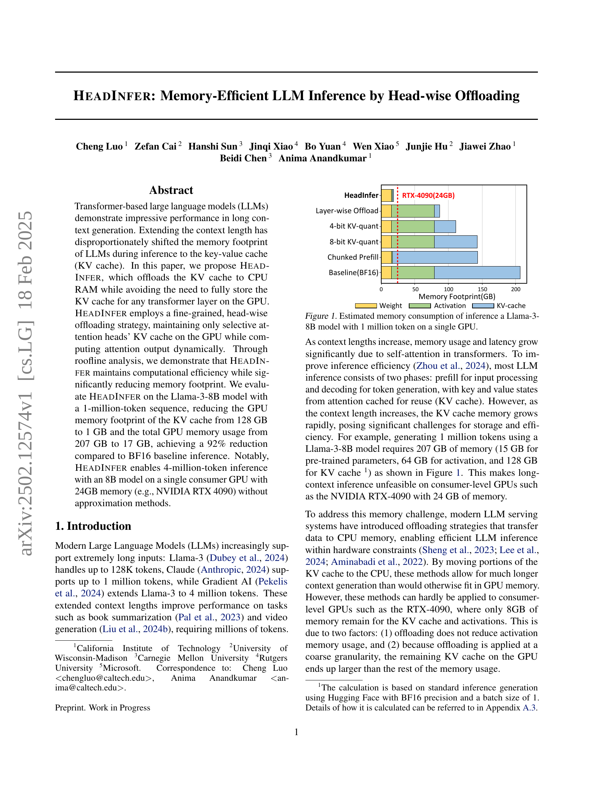
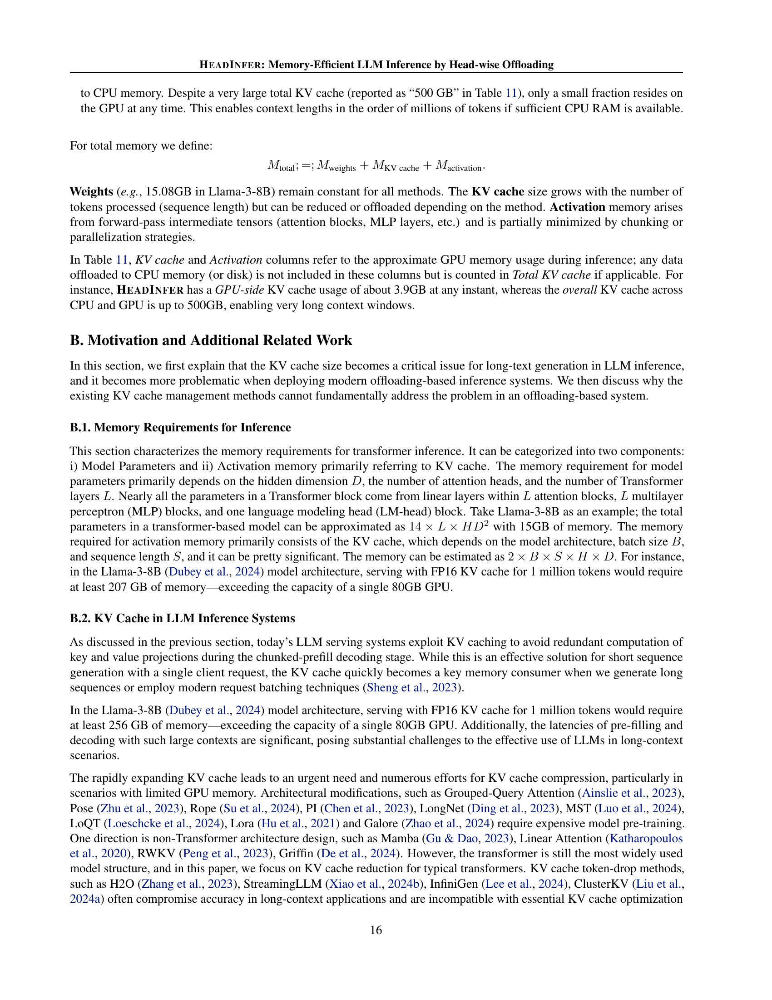

 


 2502.12574 
 Cheng Luo et el. 
 
 🤗 2025-02-19 
 



↗ arXiv


↗ Hugging Face


### TL;DR



대규모 언어 모델(LLM)은 장문 컨텍스트 생성에서 뛰어난 성능을 보이지만, **추론 과정에서의 메모리 사용량이 과도하게 증가**하는 문제가 있습니다. 특히, 키-밸류 캐시(KV 캐시)는 메모리 부족 현상의 주요 원인입니다. 기존의 레이어 단위 오프로딩 방식은 활성화 메모리 사용량을 줄이지 못하고, GPU 메모리의 상당 부분을 KV 캐시가 차지하여 소비자급 GPU에서 장문 컨텍스트 처리가 어려웠습니다.

본 논문에서는 **HEADINFER**라는 새로운 추론 프레임워크를 제시합니다. HEADINFER는 **헤드 단위 오프로딩 전략**을 사용하여, GPU 메모리에 선택적인 어텐션 헤드의 KV 캐시만 유지하고, 어텐션 출력을 동적으로 계산합니다. Roofline 분석을 통해 계산 효율성을 입증하고, Llama-3-8B 모델을 대상으로 한 실험 결과를 통해 GPU 메모리 사용량을 획기적으로 줄이고 장문 컨텍스트 처리 성능을 크게 향상시켰음을 보여줍니다. 또한, HEADINFER는 **다양한 모델과 컨텍스트 길이에 적용 가능**하고, 기존 추론 프레임워크에 쉽게 통합될 수 있도록 설계되어 실용성을 높였습니다.



#### Key Takeaways


 HEADINFER는 헤드 단위 오프로딩 전략을 통해 GPU 메모리 사용량을 획기적으로 줄여, 소비자급 GPU에서도 장문 컨텍스트 추론을 가능하게 합니다. 



 본 연구는 Roofline 분석을 통해 HEADINFER의 계산 효율성을 입증하고, Llama-3-8B 모델을 대상으로 한 실험 결과를 통해 GPU 메모리 사용량을 최대 92%까지 감소시켰음을 보여줍니다. 



 HEADINFER는 다양한 모델과 컨텍스트 길이에 적용 가능하며, 기존 추론 프레임워크에 최소한의 변경만으로 통합될 수 있도록 설계되었습니다. 


#### Why does it matter?
본 논문은 **장문 컨텍스트 추론을 위한 메모리 효율적인 방법론**을 제시하여, 소비자급 GPU에서도 대규모 언어 모델의 장문 컨텍스트 처리를 가능하게 함으로써 **AI 연구의 접근성을 높이는 데 중요한 의미**를 가집니다. 특히, **최근의 장문 컨텍스트 처리 연구 동향에 부합하며**, 향후 연구 방향을 제시하는 중요한 발판이 될 수 있습니다. 또한, 제시된 방법론의 효율성과 일반화 가능성을 실험적으로 검증하여, **실제 응용 가능성을 높였으며**, 추가적인 연구를 위한 기반을 마련했습니다.

------
#### Visual Insights

> 🔼 그림 1은 단일 GPU에서 100만 토큰을 사용하여 Llama-3-8B 모델 추론 시 예상되는 메모리 소비량을 보여줍니다.  Llama-3-8B 모델의 추론 과정에서 가중치, 활성화 및 KV 캐시의 메모리 사용량을 각각 나타냅니다.  컨텍스트 길이가 증가함에 따라 KV 캐시의 메모리 사용량이 기하급수적으로 증가하는 것을 보여주어,  장문 컨텍스트 처리에 어려움을 겪는 것을 시각적으로 보여줍니다.  특히, KV 캐시가 전체 메모리 사용량의 상당 부분을 차지하며, 이는 장문 컨텍스트 처리를 위한 GPU 메모리 제약의 심각성을 강조합니다.
> 

> 
read the caption

> Figure 1: Estimated memory consumption of inference a Llama-3-8B model with 1 million token on a single GPU.
> 


| LongBench V2 | Overall | Easy | Hard | Short | Medium | Long |
|---|---|---|---|---|---|---|
| Standard 25K | 28.4 | 30.2 | 27.3 | 33.9 | 25.1 | 25.9 |
| Chunked Prefill 30K | 28.2 | 27.1 | 28.9 | 32.8 | 25.6 | 25.9 |
| Layer-wise offload 45K | 29.0 | 29.2 | 28.9 | 36.1 | 24.2 | 26.9 |
| HeadInfer 1024K | 30.2 | 31.2 | 29.6 | 33.9 | 27.0 | 30.6 |

> 🔼 이 표는 LongBench v2 벤치마크를 사용하여 RTX 4090 GPU에서 다양한 방법(표준 추론, 청크 사전 채우기, 계층별 오프로드, HEADINFER)의 성능을 비교 분석한 결과를 보여줍니다.  과제 난이도(쉬움/어려움)와 문맥 길이(짧음/중간/김)를 변수로 하여 벤치마크 점수를 측정하였으며, 전체 성능은 모든 질문에 대한 평균 점수를 나타냅니다.  다양한 문맥 길이와 난이도에서 각 방법의 상대적 성능을 비교하여 HEADINFER의 효율성을 보여줍니다.
> 

> 
read the caption

> Table 1: Performance(benchmark score) of different methods on LongBench v2 on a single RTX-4090 GPU, under different task difficulties (Easy/Hard) and context lengths (Short/Medium/Long). Overall performance is average scores on all questions.
> 

### In-depth insights

#### Head-wise Offload
본 논문에서 제안하는 헤드별 오프로딩(Head-wise Offload) 전략은 **메모리 효율적인 대규모 언어 모델 추론을 위한 혁신적인 방법**입니다. 기존의 계층별 또는 전체 KV 캐시 오프로딩과 달리, HEADINFER는 개별 어텐션 헤드 단위로 KV 캐시를 CPU 메모리로 오프로딩하여 GPU 메모리 사용량을 획기적으로 줄입니다. **어텐션 헤드의 독립성**을 활용하여, GPU는 특정 헤드의 KV 캐시만 유지하면서 어텐션 연산을 동적으로 수행합니다. 이를 통해 **계산 효율성을 유지하면서 메모리 사용량을 크게 감소**시키는 효과를 거둡니다.  **적응형 헤드 그룹화, 청크 단위 사전 채우기, 비동기 데이터 전송** 등의 최적화 기법을 통해 소비자 수준의 GPU에서도 수백만 토큰의 긴 문맥 추론을 가능하게 합니다.  **Llama-3-8B 모델을 사용한 실험 결과**는 GPU 메모리 사용량을 92% 감소시키는 동시에 성능 저하 없이 400만 토큰의 추론을 가능하게 함을 보여줍니다.  **HEADINFER는 다양한 모델과 프레임워크에 적용 가능하며 확장성이 뛰어난 전략**이라는 점에서 큰 의의를 가집니다.

#### Roofline Analysis
본 논문에서 제시된 "Roofline Analysis"는 **GPU의 성능 제한 요소를 명확히 파악**하기 위한 분석 방법으로, **계산 성능과 메모리 대역폭의 균형**을 고려하여 최적의 하드웨어 활용 방안을 제시하는 데 중점을 둡니다.  **계산 집약적 작업과 메모리 집약적 작업의 비율**을 나타내는 지표인 연산 강도를 통해, GPU가 계산 성능이나 메모리 대역폭 중 어느 쪽에 의해 제한되는지 확인합니다.  **Roofline 모델을 통해 얻은 결과**는  LLM 추론 과정에서의 병목 현상을 정확하게 진단하고, HEADINFER와 같은 최적화 기법의 효율성을 객관적으로 평가하는 데 유용하게 활용됩니다. 특히, **prefill 단계와 decoding 단계에서의 연산 강도 차이**를 분석하여, 각 단계별 최적화 전략을 수립하는 데 중요한 근거를 제공합니다.  이를 통해, **HEADINFER가 계산 효율성을 유지하면서 메모리 사용량을 효과적으로 줄이는 방법**을 보여주는 핵심적인 근거를 제공합니다.  **단순한 메모리 사용량 감소를 넘어, 실제 성능 향상**에 대한 객관적이고 수치적인 근거를 제시함으로써, HEADINFER의 우수성을 더욱 강조합니다.

#### Long Context LLM
장문 컨텍스트 LLM은 **매우 긴 입력 시퀀스를 처리**할 수 있도록 설계된 대규모 언어 모델입니다. 이는 기존 모델이 제한된 컨텍스트 창으로 인해 긴 문서나 복잡한 대화를 효과적으로 처리하지 못하는 문제점을 해결하기 위한 중요한 발전입니다.  **장문 컨텍스트 처리 능력**은 요약, 번역, 질의응답과 같은 다양한 작업의 성능을 향상시키는 데 기여합니다. 하지만, 장문 컨텍스트 LLM은 **메모리 사용량이 기하급수적으로 증가**하는 문제를 안고 있습니다.  본 논문에서는 이러한 문제를 해결하기 위해 **헤드 단위 오프로딩 기법**을 제시하고 있으며, GPU 메모리 부족 문제를 해결하는 동시에 계산 효율성을 유지하는 효과적인 방법을 제시하고 있습니다.  **HEADINFER** 와 같은 혁신적인 기법들은 향후 장문 컨텍스트 LLM의 발전과 실제 응용 분야 확장에 중요한 역할을 할 것으로 예상됩니다.  **CPU와 GPU 메모리의 효율적인 활용**을 통해 더욱 강력하고 실용적인 장문 컨텍스트 LLM 개발에 기여할 것으로 기대됩니다.

#### Memory Efficiency
본 논문은 대규모 언어 모델(LLM) 추론에서 메모리 효율성을 크게 향상시키는 HEADINFER라는 새로운 프레임워크를 제시합니다. **HEADINFER의 핵심 아이디어는 head-wise offloading 전략을 통해 GPU 메모리에 필요한 KV 캐시의 양을 줄이는 것**입니다.  기존의 layer-wise offloading과 달리, HEADINFER는 각 어텐션 헤드의 KV 캐시를 개별적으로 관리하여 GPU 메모리 사용량을 최소화합니다. 이를 통해 **수백만 토큰의 긴 컨텍스트를 소비자급 GPU에서도 효율적으로 처리**할 수 있습니다.  **어댑티브 헤드 그룹핑 기법**은 컨텍스트 길이에 따라 GPU에 유지할 헤드 수를 동적으로 조정하여 메모리 사용량과 계산 효율성 간의 균형을 맞춥니다. 또한, **비동기 데이터 전송 기법**을 사용하여 GPU 연산과 CPU-GPU 간 데이터 이동을 중첩시킴으로써 성능 저하를 최소화합니다.  HEADINFER는 다양한 LLM 모델과 긴 컨텍스트 길이에서 우수한 메모리 효율성과 성능을 보여주는 실험 결과를 제시하여, **소비자급 하드웨어에서도 대규모 언어 모델 추론을 가능하게 하는 중요한 발전**임을 보여줍니다.  **특히, 400만 토큰 추론을 24GB 메모리의 단일 GPU에서 구현**한 것은 주목할 만한 성과입니다.  이는 기존의 근사 방법 없이 달성한 결과로서, **LLM의 접근성을 높이는 데 크게 기여**할 것으로 예상됩니다.

#### Ablation Study
본 논문의 "절제 연구(Ablation Study)" 부분은 **모델 성능에 대한 다양한 요소의 기여도를 정량적으로 분석**하기 위해 고안되었습니다.  이는 단순히 성능 수치만 제시하는 것이 아니라, **각 구성 요소의 상호작용 및 중요도를 밝힘**으로써 모델의 설계 및 개선 방향을 제시하는 데 중요한 역할을 합니다.  특히, 본 연구에서 제시된 HEADINFER 모델의 핵심 구성 요소들이 어떻게 전체 성능에 기여하는지, 그리고 각 요소들을 제거했을 때 성능이 얼마나 저하되는지를 보여주는 실험 결과를 통해 **HEADINFER의 효율성과 강건성을 입증**합니다.  **다양한 컨텍스트 길이와 모델 크기에 따른 실험 결과**를 바탕으로,  각 요소의 중요도가 상황에 따라 어떻게 변하는지에 대한 심층적인 분석을 제공하여, **모델의 일반화 성능 및 실용성을 높이는 데 기여**할 것으로 예상됩니다.  결론적으로, 이 절제 연구는 HEADINFER 모델의 성능을 이해하고 개선하는 데 필수적인 통찰력을 제공하며,  **미래 연구 방향**을 제시하는 데 중요한 역할을 수행할 것입니다.

### More visual insights

More on figures

> 🔼 그림 2는 Transformer 모델 추론 시 Key-Value(KV) 캐시 관리 전략을 보여줍니다. KV 캐시는 계층(Layer)과 헤드(Head) 두 가지 차원으로 구성됩니다.  기존의 계층별 오프로딩(Layer-wise offloading) 방법은 각 계층의 KV 캐시 전체를 GPU 메모리에서 CPU 메모리로 이동시키는 방식입니다. 이때 각 계층은 모든 헤드의 KV 캐시를 사용할 수 있는 할당량을 갖습니다. 반면 HeadInfer는 이보다 더욱 효율적인 메모리 관리를 위해 헤드별 오프로딩(Head-wise offloading) 전략을 사용합니다. HeadInfer는 특정 시점에 GPU 메모리에 단 하나의 헤드 KV 캐시만 저장하고 나머지는 CPU 메모리에 저장하는 방식입니다. 이렇게 하면 필요에 따라 헤드 단위로 동적으로 KV 캐시를 할당하고 관리하여 GPU 메모리 사용량을 최소화할 수 있습니다.
> 

> 
read the caption

> Figure 2: Demonstrations of KV cache policies in inference. Full KV cache contains two main dimensions: layer and head. Layer-wise offloads KV cache in the layer’s dimension, with a cache budget of all heads per layer. HeadInfer further reduces GPU memory by adaptively reallocating cache budgets in the head’s dimension, with a cache budget of one head.
> 

> 🔼  그림 3은 다양한 추론 방법들의 세분성(granularity)을 보여줍니다. 각 큐브는 시퀀스(S), 레이어(L), 헤드(H)의 세 가지 차원을 따라 전체 어텐션 프로세스를 나타냅니다. 표준 추론은 모든 것을 GPU에 배치합니다. 청크 사전 채우기(chunked prefill)는 한 번에 모든 토큰의 시퀀스 차원의 일부만 GPU에서 가져옵니다. 레이어별 오프로딩(layer-wise offloading)은 GPU에서 레이어의 하위 집합을 가져오고 나머지는 오프로딩합니다. HeadInfer는 레이어 내에서 선택된 헤드만 유지하는 더욱 세분화된 접근 방식을 제시합니다. 이 그림은 GPU 메모리 제약 조건 하에서 장문 컨텍스트 추론의 효율성을 높이기 위한 다양한 방법의 차이점을 시각적으로 보여줍니다.
> 

> 
read the caption

> Figure 3: Granularity of different methods. Each cube represents the entire attention process along three dimensions: Sequence (S), Layers (L), and Heads (H). Standard inference puts everything on the GPU. Chunked-prefill fetches only a part of the sequence dimension of all tokens on the GPU at a time. Layer-wise offloading fetches a subset of layers on the GPU, offloading the rest. HeadInfer introduces an even finer approach that maintains only selected heads within a layer.
> 

> 🔼 그림 4는 HEADINFER의 메모리 관리 전략을 보여주는 스냅샷입니다. 모델의 모든 파라미터는 GPU에 저장되고,  Key-Value 캐시(KV 캐시)는 헤드 단위로 분할되어 GPU와 CPU 간에 핑퐁 메모리를 사용하여 이동합니다.  이는 GPU 메모리의 제한을 극복하고, 장기 컨텍스트 추론을 위한 효율적인 메모리 관리 전략을 보여줍니다.  특히, 특정 헤드의 KV 캐시만 GPU에 유지하고 나머지는 CPU로 이동시켜, GPU 메모리 사용량을 크게 줄입니다. 동시에, 비동기식 데이터 전송을 통해 계산 효율성을 유지합니다.
> 

> 
read the caption

> Figure 4: HeadInfer snapshot. All parameters are stored on the GPU. Head-wise partitioned KV cache is moved across GPU and CPU with the ping-pong memory.
> 

> 🔼 그림 5는 RTX 4090 GPU를 사용하여 FlashAttention 커널의 성능을 분석한 Roofline plot입니다. Roofline plot은 GPU의 계산 성능과 메모리 대역폭을 고려하여, 어떤 연산이 계산 제한적인지 또는 메모리 제한적인지를 보여줍니다. 이 그림은 prefill 및 decoding 단계에서 각각의 어떤 동작이 계산 제한적인지 또는 메모리 제한적인지, 그리고 HEADINFER가 메모리 사용량을 줄이면서도 계산 효율을 유지하는지 여부를 보여줍니다.  x축은 연산 강도(FLOP/Byte), y축은 성능(TFLOP/s)을 나타냅니다. 여러 가지 다른 방법(Baseline, Offload, HeadInfer)의 prefill 및 decoding 성능을 비교하여 HEADINFER의 효율성을 보여줍니다.  특히,  HEADINFER는 긴 문맥 길이에서도 계산 효율성을 유지하면서 메모리 사용량을 크게 줄이는 것을 보여줍니다.
> 

> 
read the caption

> Figure 5: Flashattention in the roofline plot analysis using the RTX-4090 device setting.
> 

> 🔼 그림 6은 Needle-in-a-Haystack 벤치마크에서 HeadInfer가 표준 추론과 동일한 정확도를 제공함을 보여줍니다. 이 그림은 다양한 문맥 길이와 하드웨어 환경에서 HeadInfer의 성능을 평가한 결과를 보여주는 여러 그래프로 구성될 수 있습니다.  각 그래프는 특정 문맥 길이에 대한 HeadInfer의 정확도를 표준 추론 결과와 비교하여 HeadInfer의 정확성이 문맥 길이에 영향을 받지 않고 표준 추론과 동일함을 시각적으로 보여줍니다.
> 

> 
read the caption

> Figure 6: HeadInfer provides equal accuracy as standard inference on the Needle-in-a-Haystack benchmark
> 

> 🔼  그림 7은 주제와 관련이 없는 정보를 질의할 때 토큰 삭제 방법이 작동하지 않는다는 것을 보여줍니다. LongBench(Bai et al., 2023b)의 10K 문서를 사용하고 주제와 관련 없는 문장 하나를 추가했습니다. H2O는 주제와 관련 없는 토큰을 삭제하여 잘못된 결과를 생성합니다. StreamingLLM은 질의에 따라 토큰을 삭제하지만 질문 토큰은 남겨두어 환각 현상을 유발합니다. HeadInfer는 KV 캐시의 75%를 압축하더라도 긴 입력에서 정확한 정보를 성공적으로 출력합니다.
> 

> 
read the caption

> Figure 7: Token eviction methods cannot work when querying the less relevant information to the main theme. Here, we use a 10K document from LongBench (Bai et al., 2023b) and add one sentence that is not relevant to the main theme. In this case, H2O discards tokens less relevant to the main theme, leading to error generation. StreamingLLM discards tokens based on the query but remaining question tokens, making it Hallucinations. HeadInfer can successfully output the exact information from the lengthy input, even when we compress 75% of the KV cache
> 

> 🔼 그림 8은 A100 GPU를 사용하여 수행한 roofline 분석 플롯입니다. roofline 분석은 GPU의 성능을 제한하는 요소(메모리 대역폭 또는 계산 성능)를 파악하는 데 사용되는 시각적 도구입니다. 이 플롯은 플래시 어텐션(FlashAttention) 커널의 계산 처리량과 연산 강도를 보여줍니다. 이 분석을 통해  A100 GPU에서 prefill과 decoding 단계의 성능을 제한하는 요인이 무엇인지, 그리고 HEADINFER가 어떻게 이러한 제약을 완화하는지 이해할 수 있습니다.  x축은 연산 강도(FLOP/바이트)이고 y축은 성능(TFLOP/s)입니다. 각 선은 메모리 대역폭과 계산 성능의 포화 한계를 나타냅니다. 플롯의 데이터 포인트는 prefill과 decoding 각 단계의 플래시 어텐션 커널의 성능을 나타냅니다. HEADINFER를 포함한 여러 가지 방법을 비교하여 GPU 성능 제한 요인과 성능 향상 효과를 분석합니다.
> 

> 
read the caption

> Figure 8: Flashattention in the roofline plot analysis using A100 device setting.
> 

> 🔼 그림 9는 헤드 관점에서 추론 시 KV 캐시 정책을 보여줍니다. 위쪽 그림은 LLM 생성에서 다양한 정책을 적용한 어텐션 맵의 상징적 그림을 보여주고, 아래쪽 그림은 HeadInfer의 개요를 보여줍니다.  HeadInfer는 어텐션 헤드 단위로 KV 캐시를 동적으로 오프로드하여 GPU 메모리 사용량을 줄이고 긴 문맥 길이를 지원하는 추론 프레임워크입니다.  그림은 풀 헤드 KV 캐시, 슬라이딩 윈도우 KV 캐시, HeadInfer + 50% 스파스티시티의 세 가지 방법을 비교하여 보여줍니다. HeadInfer는 풀 헤드 방식보다 GPU 메모리 효율이 훨씬 높으며, 슬라이딩 윈도우 방식보다 더 정확한 결과를 생성합니다. HeadInfer + 50% 스파스티시티는 일부 헤드를 오프로드하여 메모리 사용량을 더욱 줄이는 것을 보여줍니다.
> 

> 
read the caption

> Figure 9: Demonstrations of KV cache policies in inference from the head-wise view. Upper plots illustrate symbolic plots of an attention map deploying different policies in LLM generation. Lower: the overview of HeadInfer.
> 

> 🔼 그림 10은 HeadInfer가 (n+1)개의 레이어와 (j+1)개의 어텐션 헤드를 갖는 모델을 생성하는 과정을 보여줍니다.  CPU 메모리와 GPU 메모리 사이의 핑퐁 메모리 디자인을 사용하여 비동기적 오프로딩을 수행하는 방법을 보여줍니다. GPU는 현재 헤드의 어텐션을 계산하는 동안, CPU는 다음 헤드의 KV 캐시를 미리 가져오고 이전 헤드의 캐시를 오프로드합니다. 이러한 겹침을 통해 GPU 계산과 메모리 이동 사이의 동기화를 보장합니다.  각 레이어와 헤드의 KV 캐시가 GPU와 CPU 간에 어떻게 이동하는지, 그리고 각 단계에서의 메모리 상태를 시각적으로 보여줍니다.  비동기적 전송을 사용하여 GPU 연산을 메모리 이동과 겹쳐 처리 효율을 높입니다.
> 

> 
read the caption

> Figure 10: Workflow of HeadInfer generating a model with (n+1) layers and (j+1) attention heads.
> 

More on tables


| SCBench | kv | prefix-suffix | vt | qa-chn | qa-eng | choice-eng | mf | many-shot | summary |
|---|---|---|---|---|---|---|---|---|---| 
| Standard 25K | 15.8 | 9.6 | 4.6 | 9.4 | 13.3 | 36.5 | 2.6 | 16.3 | 32.3 |
| Chunked Prefill 30K | 21.4 | 10.4 | 6.9 | 9.4 | 15.5 | 38.6 | 2.2 | 25.2 | 33.5 |
| Layer-wise offload 45K | 22.6 | 12.8 | 8.4 | 10.4 | 15.7 | 37.8 | 2.2 | 25.9 | 33.6 |
| **HeadInfer** 1024K | **28** | **17.2** | **42** | **11.9** | **23.0** | **59.8** | **9.4** | **25.9** | **37.1** |
> 🔼 표 2는 단일 RTX 4090 GPU에서 다양한 방법을 사용하여 SCBench 벤치마크를 수행한 결과를 보여줍니다.  각 열은 특정 작업 유형의 성능 점수를 나타냅니다.  kv 및 prefix-suffix는 키-값 및 접두사-접미사 시나리오에서 문자열 검색 작업을 나타냅니다. vt는 변수 추적 작업, qa-chn 및 qa-eng는 각각 중국어 및 영어 질문 답변 작업, choice-eng는 영어 선택형 질문 답변 작업, mf는 수학 문제 풀이 작업, many-shot은 문맥 내에서 여러 샷을 찾는 작업, summary는 문서 요약 작업을 나타냅니다.  표는 다양한 컨텍스트 길이(25K, 30K, 45K, 1024K 토큰)에 대한 각 방법의 성능을 비교하여 어떤 방법이 다양한 유형의 장문 이해 작업에서 가장 효율적인지 보여줍니다.
> 

> 
read the caption

> Table 2: Performance(benchmark score) of different methods on SCBench on a single RTX-4090 GPU. kv and prefix-suffix are string retrieval in key-value and prefix-suffix scenarios. vt is variable tracking. qa-chn, qa-eng, and choice-eng are English/Chinese question answering. mf is finding the math answer. many-shot is finding multiple shots in context. summary is document summarization.
> 


| Context Length | Llama-3-8B | Llama-2-7B | Mistral-7B | Qwen2-7B | Gemma-2-9b |
|---|---|---|---|---|---| 
| Standard | 25K | 10K | 30K | 35K | 10K |
| Chunked Prefill | 30K | 20K | 40K | 70K | 10K |
| 4-bit KV-quant | 45K | 30K | 40K | 50K | 20K |
| Layer-wise offload | 45K | 60K | 45K | 50K | 35K |
| **HeadInfer** | **4096K** | **1024K** | **4096K** | **4200K** | **1300K** |
> 🔼 표 3은 다양한 모델 추론에서 시스템 최적화 방법을 사용한 최대 컨텍스트 길이를 비교한 표입니다. 이 표에 있는 모든 실험은 24GB의 메모리를 가진 단일 RTX-4090 GPU와 1TB 메모리를 가진 AMD EPYC 7V12 CPU에서 실행되었습니다. 표에는 표준 추론, 청크 채우기, 계층별 오프로드, HEADINFER의 네 가지 방법에 대한 다양한 모델의 최대 컨텍스트 길이가 나와 있습니다.  각 방법의 성능을 비교하여 HEADINFER가 가장 긴 컨텍스트 길이를 지원함을 보여줍니다.
> 

> 
read the caption

> Table 3: Comparison of maximum context length with system optimization methods on various models inference. All experiments within this table run on a single RTX-4090 GPU with 24GB and AMD EPYC 7V12 CPUs with 1TB memory.
> 


| Context Length | Llama-3-70B |
|---|---| 
| Standard | 10K |
| **HeadInfer** + 10k chunk size | **950K** |
| **HeadInfer** + 5k chunk size | **1000K** |
> 🔼 표 4는 긴 입력 컨텍스트를 사용한 Llama3-70B 모델 추론 결과를 보여줍니다. 표에는 표준 추론, HEADINFER 및 HEADINFER의 다양한 청크 크기 변형을 사용한 추론 결과의 컨텍스트 길이(토큰 수)가 나와 있습니다.  HEADINFER는 긴 컨텍스트 추론에서 상당한 성능 향상을 보여줍니다. 특히, 10K 청크 크기를 사용한 HEADINFER는 950K 토큰의 컨텍스트 길이를 달성하고, 5K 청크 크기로는 1000K 토큰을 달성합니다.
> 

> 
read the caption

> Table 4:  Llama3-70B Inference with long context input.
> 


| Context Length | Llama-3-8B |
|---|---| 
| Standard | 25K |
| Layer-wise Offload | 45K |
| Chunked Prefill | 30K |
| HeadInfer Head=8 Group = 1 | 550K |
| HeadInfer Head=4 Group = 2 | 1100K |
| HeadInfer Head=2 Group = 4 | 2100K |
| **HeadInfer** | **4096K** |
> 🔼 표 5는 본 논문에서 제안하는 HeadInfer 모델의 성능 평가를 위해 Llama-3-8B 모델을 사용하여 수행한 실험 결과를 보여줍니다.  HeadInfer 모델의 다양한 구성 요소(sequence, layer, head)들의 영향을 분석하기 위한 ablation study 결과가 제시되어 있습니다.  각 구성 요소별 granularity를 조절하며 context length 확장에 미치는 영향을 정량적으로 비교 분석하여 HeadInfer 모델의 효율성과 확장성을 보여줍니다.  표에는 다양한 context 길이에 대한 각 방법의 성능을 수치로 나타내어 HeadInfer가 다른 방법들에 비해 얼마나 효과적으로 context length를 확장할 수 있는지 보여줍니다.
> 

> 
read the caption

> Table 5:  Ablation study of HeadInfer on Llama-3-8B.
> 


| Prefill Latency(s) | 1K | 10K | 20K | 40K | 100K | 200K | 400K | 1M | 2M | 4M |
|---|---|---|---|---|---|---|---|---|---|---|
| Standard | 0.11 | 1.23 | 2.83 | - | - | - | - | - | - | - |
| Chunked Prefill | 0.11 | 1.23 | 2.83 | - | - | - | - | - | - | - |
| Layer-offload | 0.12 | 1.24 | 2.84 | 6.93 | - | - | - | - | - | - |
| HeadInfer (head=8/group=1) | 0.12 | 1.24 | 2.84 | 7.11 | 30.2 | 100 | 357 | - | - | - |
| HeadInfer (head=4/group=2) | 0.13 | 1.23 | 2.89 | 7.26 | 30.2 | 99 | 351 | 2033 | - | - |
| HeadInfer (head=2/group=4) | 0.14 | 1.23 | 2.94 | 7.54 | 30.5 | 100 | 353 | 2035 | 7952 | - |
| HeadInfer (head=1/group=8) | 0.21 | 1.27 | 3.06 | 7.77 | 31.2 | 101 | 356 | 2054 | 7975 | 27114 |
| HeadInfer Adaptive | 0.13 | 1.24 | 2.84 | 7.11 | 30.2 | 99 | 351 | 2033 | 7952 | 27114 |
> 🔼 표 6은 다양한 문맥 길이에 따른 Llama-3-8B 모델의 prefill 오버헤드(초 단위)를 보여줍니다.  표는 표준, 청크 사전 채우기, 계층 오프로딩, HEADINFER 및 HEADINFER 적응형 방법을 포함한 여러 가지 방법에 대한 prefill 지연 시간을 보여줍니다.  다양한 문맥 길이(1K, 10K, 20K, 40K, 100K, 200K, 400K, 1M, 2M, 4M 토큰)에 대한 각 방법의 prefill 성능을 비교하여,  HEADINFER가 특히 긴 문맥에서 다른 방법들보다 효율적인지 확인할 수 있습니다.
> 

> 
read the caption

> Table 6: Prefill overhead (in seconds) of Llama3-8B under different context lengths.
> 


| Decoding Latency(s) | 1K | 10K | 20K | 40K | 100K | 200K | 400K | 1M | 2M | 4M |
|---|---|---|---|---|---|---|---|---|---|---|
| Standard | 0.03 | 0.03 | 0.03 | 0.04 | - | - | - | - | - | - |
| Chunked Prefill | 0.03 | 0.03 | 0.03 | 0.04 | - | - | - | - | - | - |
| Layer-offload | 0.03 | 0.09 | 0.17 | 0.28 | 0.66 | 1.3 | 2.58 | - | - | - |
| HeadInfer (head=8/group=1) | 0.03 | 0.09 | 0.17 | 0.28 | 0.66 | 1.3 | 2.58 | - | - | - |
| HeadInfer (head=4/group=2) | 0.04 | 0.10 | 0.16 | 0.28 | 0.67 | 1.31 | 2.58 | 6.41 | - | - |
| HeadInfer (head=2/group=4) | 0.06 | 0.11 | 0.17 | 0.30 | 0.68 | 1.32 | 2.59 | 6.46 | 13.7 | - |
| HeadInfer (head=1/group=8) | 0.10 | 0.14 | 0.21 | 0.33 | 0.71 | 1.33 | 2.61 | 6.51 | 13.8 | 27.2 |
| HeadInfer Adaptive | 0.03 | 0.09 | 0.17 | 0.28 | 0.66 | 1.73 | 3.03 | 6.41 | 13.7 | 27.2 |
> 🔼 표 7은 다양한 크기의 KV 캐시(컨텍스트)에서 Llama3-8B 모델의 디코딩 오버헤드(초당 생성된 토큰)을 보여줍니다.  표는 표준 방식, 청크 전처리, 계층별 오프로딩, HEADINFER 및 적응형 HEADINFER를 포함한 여러 가지 방법을 비교합니다. 각 방법에 대한 초당 생성 토큰 수가 1K, 10K, 20K, 40K, 100K, 200K, 400K, 1M, 2M, 4M 토큰의 다양한 컨텍스트 크기에 대해 제시됩니다. 이 표는 서로 다른 방법들이 긴 컨텍스트에서 어떻게 성능에 영향을 미치는지 보여줍니다.
> 

> 
read the caption

> Table 7: Decoding overhead (in seconds per generated token) of Llama3-8B under different KV cache (context) sizes.
> 


| Method | Supported Sequence Length within Ruler |
|---|---| 
| Standard Inference | 16K |
| Chunked-Prefill | 32K |
| Layer-wise Offload | 32K |
| HeadInfer | 128K |
> 🔼 표 8은 Ruler 벤치마크에서 다양한 추론 방법에 대해 달성 가능한 최대 시퀀스 길이를 보여줍니다. 표준 추론은 메모리 제약으로 인해 16K 토큰으로 제한되는 반면, 청크 사전 채우기와 계층적 오프로드는 각각의 최적화 전략을 통해 이를 두 배인 32K 토큰으로 확장합니다. HEADINFER는 다른 오프로드 방법보다 4배 향상된 128K 토큰으로 시퀀스 처리를 가능하게 하여 상당한 발전을 보여줍니다. 이러한 시퀀스 길이 확장은 HEADINFER의 새로운 헤드별 오프로드 전략을 통해 더욱 효율적으로 GPU 메모리를 관리하기 때문에 가능합니다.
> 

> 
read the caption

> Table 8: Maximum achievable sequence lengths for different inference methods
> 


| Context | NIAH | MK-2 | MK-3 | VT | CWE | FWE | QA-1 | QA-2 |
|---|---|---|---|---|---|---|---|---|
| Length | (%) | (%) | (%) | (%) | (%) | (%) | (%) | (%) |
| 4K | 100.0 | 99.6 | 100.0 | 99.20 | 99.38 | 94.53 | 84.6 | 59.8 |
| 8K | 100.0 | 99.8 | 99.6 | 99.08 | 94.68 | 84.93 | 79.2 | 56.2 |
| 16K | 100.0 | 100.0 | 99.4 | 98.72 | 56.90 | 90.60 | 79.6 | 53.2 |
| 32K | 100.0 | 99.6 | 99.8 | 97.32 | 2.78 | 93.20 | 77.2 | 50.4 |
| 64K | 100.0 | 97.4 | 97.8 | 92.48 | 0.10 | 84.27 | 76.0 | 49.4 |
| 128K | 100.0 | 75.2 | 56.6 | 54.68 | 0.10 | 74.8 | 71.8 | 41.2 |
|  |  |  |  |  |  |  |  |  |
| HeadInfer only |  |  |  |  |  |  |  |  |
> 🔼 표 9는 Ruler 벤치마크의 다양한 컨텍스트 길이에 따른 성능을 보여줍니다. Ruler 벤치마크는 다양한 컨텍스트 길이(4K, 8K, 16K, 32K, 64K, 128K 토큰)에서 13가지 복잡한 작업을 포함하는 종합적인 벤치마크로, 모델의 장문 컨텍스트 이해 능력을 평가하기 위해 고안되었습니다.  표에는 각 작업(Needle-in-a-Haystack, Multi-hop Tracing, Aggregation, Question Answering)과 컨텍스트 길이에 따른 정확도(%)가 나타나 있습니다.  HEADINFER가 다양한 컨텍스트 길이와 작업 유형에서 일관되게 좋은 성능을 보여주는 것을 확인할 수 있습니다. 하지만, 장문 컨텍스트 작업(Multi-hop Tracing, Aggregation, Question Answering)의 경우 컨텍스트 길이가 길어질수록 정확도가 다소 감소하는 경향을 보입니다.
> 

> 
read the caption

> Table 9: Performance on Ruler benchmark tasks across different context lengths
> 


| Method | Weight | KV-cache | Activation | Total | Total KV cache* |
|---|---|---|---|---|---| 
| Standard | 15.08 | 128 | 64 | 207 | 128 |
| Chunked Prefill | 15.08 | 128 | 0.625 | 143 | 128 |
| 4bit-KV-quant | 15.08 | 32 | 64 | 111 | 32 |
| layer-wise-offload | 15.08 | 8 | 64 | 87 | 128 |
| HeadInfer | 15.08 | 1 | 0.625 | 16.7 | 128 |

*Total KV cache includes both GPU and CPU memory for offloading methods
> 🔼 표 10은 100만 토큰의 컨텍스트 길이를 가진 Llama3-8B 모델에 대한 다양한 추론 방법들의 메모리 사용량 비교를 보여줍니다. 표에는 표준 방법, 청크 전처리, 4비트 KV 양자화, 계층별 오프로드, HEADINFER의 가중치, KV 캐시, 활성화 메모리 사용량, 그리고 총 메모리 사용량을 보여줍니다.  각 방법은 GPU 메모리와 CPU 메모리 사용량을 모두 포함하여 총 KV 캐시 사용량을 보여줍니다. 이 표는 HEADINFER가 다른 방법에 비해 메모리 효율성이 뛰어남을 보여주는 중요한 근거가 됩니다.
> 

> 
read the caption

> Table 10: Memory usage comparison for Llama3-8B with 1 million context length
> 


| Method | Weights | KV cache | Activation | Total | Total KV cache * |
|---|---|---|---|---|---| 
| Standard-25K | 15.08 | 3.13 | 1.56 | 19.77 | 3.13 |
| Chunked-Prefill-30K | 15.08 | 3.75 | 0.63 | 19.46 | 3.75 |
| 4bit-KV-Quant-45K | 15.08 | 1.41 | 2.81 | 19.30 | 1.41 |
| Layer-Wise-Offload-45K | 15.08 | 0.35 | 2.81 | 18.25 | 5.63 |
| HeadInfer-4000K | 15.08 | 3.91 | 0.63 | 19.61 | 500 |

*Total KV cache includes both GPU and CPU memory for offloading methods
> 🔼 표 11은 100만 토큰의 컨텍스트 길이를 가진 Llama-3-8B 모델에 대한 다양한 추론 방법의 메모리 사용량을 분석한 결과를 보여줍니다. 표에는 표준 추론, 청크 사전 채우기, 4비트 KV 양자화, 계층별 오프로딩 및 HEADINFER를 포함한 다섯 가지 대표적인 전략에 대한 가중치, KV 캐시 및 활성화 메모리 사용량이 나와 있습니다. 각 전략에 대한 메모리 사용량 분석을 통해 컨텍스트 길이 확장에 따른 메모리 효율성을 비교하고 HEADINFER의 효과를 강조합니다.
> 

> 
read the caption

> Table 11: Memory consumption analysis for different inference methods (in GB) on Llama-3-8B
> 


| Operator | Regular |  |  |  |  | Offload |  |  |  |
|---|---|---|---|---|---|---|---|---|---| 
|  | Ops | Memory | Arithmetic Intensity | FLOPS | Bound | Memory (KV cache) | Arithmetic Intensity | FLOPS | Bound |
|---|---|---|---|---|---|---|---|---|---| 
| **Prefill** |  |  |  |  |  |  |  |  |  |
| flashattention (1k) | 17G | 21M | 820 | 165T | compute | 4.2M | 4100 | 102T | memory |
| flashattention (10k) | 1.7T | 209M | 8200 | 165T | compute | 42M | 41000 | 165T | compute |
| flashattention (100k) | 172T | 2.1G | 82000 | 165T | compute | 419M | 410000 | 165T | compute |
| head-wise (1k) | 2.1G | 2.6M | 820 | 165T | compute | 0.5M | 4100 | 102T | memory |
| head-wise (10k) | 215G | 26M | 8200 | 165T | compute | 5.2M | 41000 | 312T | compute |
| head-wise (100k) | 21T | 262M | 82000 | 165T | compute | 52M | 410000 | 312T | compute |
| **Decode** |  |  |  |  |  |  |  |  |  |
| flashattention (1k) | 17M | 17M | 1 | 1T | memory | 17M | 1 | 13G | memory |
| flashattention (10k) | 168M | 168M | 1 | 1T | memory | 168M | 1 | 13G | memory |
| flashattention (100k) | 1.7G | 1.7G | 1 | 1T | memory | 1.7G | 1 | 13G | memory |
| head-wise (1k) | 2.1M | 2.1M | 1 | 1T | memory | 2.1M | 1 | 13G | memory |
| head-wise (10k) | 21M | 21M | 1 | 1T | memory | 21M | 1 | 13G | memory |
| head-wise (100k) | 210M | 210M | 1 | 1T | memory | 210M | 1 | 13G | memory |
> 🔼 표 12는 RTX 4090 설정 하에서 다양한 어텐션 메커니즘의 성능을 비교한 표입니다.  Prefill 및 Decode 단계 모두에서  flashattention 및 head-wise 접근 방식의 연산 속도와 메모리 사용량을 연산 강도(Arithmetic Intensity)와 함께 보여줍니다.  이는 GPU의 메모리 대역폭과 계산 성능의 한계를 고려하여, 각 어텐션 메커니즘의 성능 병목 현상(compute-bound 또는 memory-bound)을 파악하는 데 도움이 됩니다.  특히, context 길이에 따른 성능 변화를 분석하여  head-wise 방식의 효율성을 보여줍니다.
> 

> 
read the caption

> Table 12: Performance comparison of different attention mechanisms under RTX-4090 setting
> 


| Arithmetic | Intensity |
|---|---|
> 🔼 표 13은 A100 설정 하에서 다양한 어텐션 메커니즘의 성능을 비교한 표입니다.  'Regular' 열은 일반적인 어텐션 메커니즘의 성능을 보여주고, 'Offload' 열은 KV 캐시 오프로딩을 사용한 경우의 성능을 보여줍니다.  'Prefill'은 입력 토큰 처리 단계, 'Decode'는 토큰 생성 단계를 나타냅니다. 각 열은 연산 수 (Ops), 메모리 사용량 (Memory), 연산 강도 (Arithmetic Intensity), FLOPS (처리 성능), FLOPS 경계 (FLOPS Bound), 메모리 크기 (Memory), 연산 강도 (Arithmetic Intensity) 등의 정보를 포함합니다. 이 표는 HEADINFER의 성능을 분석하는 데 사용됩니다.
> 

> 
read the caption

> Table 13: Performance comparison of different attention mechanisms under A100 setting
> 


| Memory |
|---|---| 
| (KV cache) |
> 🔼 표 14는 1M 토큰의 입력에 대한 prefill 단계와 1M KV 캐시를 사용한 decoding 단계에서 HEADINFER 모델과 HEADINFER에 50% sparsity 기법을 적용한 모델의 성능을 비교한 표입니다.  두 모델 모두 prefill과 decoding에서 속도 향상을 보여주는 것을 알 수 있습니다.  특히, HEADINFER + 50% sparsity 모델은 decoding에서 약 2배의 속도 향상을 보였습니다.
> 

> 
read the caption

> Table 14: Prefill 1M, Decoding with 1M KV cache performance comparison
> 

### Full paper



