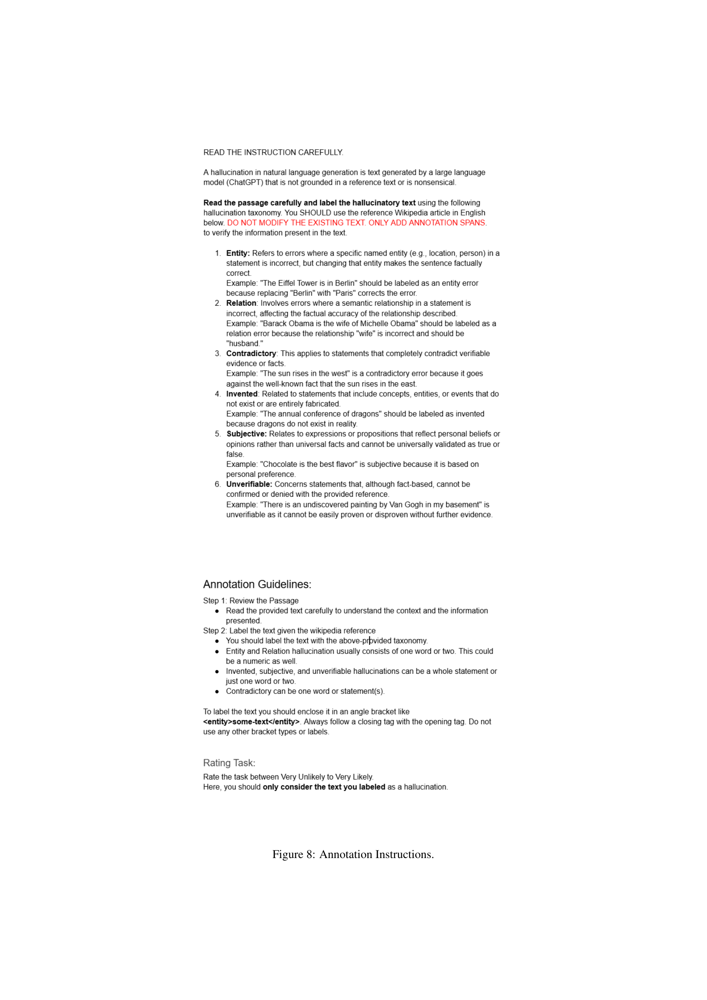

 


 2502.12769 
 Saad Obaid ul Islam et el. 
 
 🤗 2025-02-21 
 



↗ arXiv


↗ Hugging Face


↗ Papers with Code


### TL;DR



대규모 언어 모델(LLM)은 정보 검색 등 다양한 작업에 활용되지만, 사실이 아닌 정보를 생성하는 '환각(hallucination)' 현상이 문제입니다. 기존 연구는 주로 영어에 집중되어 다국어 환경에 대한 이해가 부족했습니다. 본 연구는 이러한 문제를 해결하기 위해 30개 언어와 6개의 오픈소스 LLM을 사용하여 다국어 환각 탐지 모델을 개발하고, 각 언어와 모델별 환각률을 정량적으로 측정했습니다.

연구 결과, 고자원 언어일수록 환각 토큰 수는 많지만, 언어의 디지털 표현 수준과 환각률 사이에는 상관관계가 없다는 것을 발견했습니다. 또한, **소규모 LLM이 대규모 LLM보다 환각률이 더 높다는 것을 밝혀냈습니다.** 본 연구는 다국어 LLM의 환각 문제를 종합적으로 이해하고, 향후 다국어 LLM 개발 및 평가에 중요한 기여를 할 것으로 기대됩니다. **특히, 다양한 언어와 모델에 대한 환각률을 정량적으로 제시**하여 향후 연구의 방향을 제시하고, **실제 환경에서 LLM을 사용하는 방식을 고려**했다는 점에서 실용적인 시사점을 제공합니다.



#### Key Takeaways


 다국어 LLM의 환각률을 실제 사용 환경에서 정량적으로 측정하는 새로운 방법론 제시 



 고자원 언어일수록 환각 토큰 수는 많지만, 언어의 디지털 표현과 환각률 간 상관관계는 없음 



 소규모 LLM이 대규모 LLM보다 환각률이 더 높음 


#### Why does it matter?
본 논문은 **다국어 환경에서 대규모 언어 모델(LLM)의 환각(hallucination) 문제를 정량적으로 평가**하는 최초의 연구 중 하나입니다.  LLM의 실용성을 높이기 위해서는 환각 문제 해결이 필수적이며, 이 연구는 다양한 언어와 모델에 대한 환각 비율을 제시하여 **향후 연구 방향을 제시**하고, **다국어 LLM 개발 및 평가에 중요한 기여**를 합니다.  특히, 실제 환경에서 LLM을 사용하는 방식을 반영하여 연구가 진행되었다는 점에서, **실제 응용 연구에 중요한 시사점**을 제공합니다.

------
#### Visual Insights

> 🔼 본 그림은 논문에서 제시하는 다국어 환경에서의 거대 언어 모델(LLM) 환각 비율 추정 방법을 보여줍니다. 좌측은 환각 검출 및 모델 평가 부분으로, 영어 기반 FAVA 데이터셋을 30개 언어로 자동 번역하여 다국어 환각 검출(HD) 모델을 학습시키고, 최첨단 LLM인 GPT-4를 활용해 30개 언어에 대한 환각 데이터셋을 생성하는 과정을 나타냅니다. 고자원 언어 5개에 대해서는 수동으로(gold) 환각 주석을 추가하여 30개 언어 평가 벤치마크인 mFAVA를 구성합니다. mFAVA를 사용하여 HD 모델의 언어별 성능(정밀도 및 재현율)을 평가합니다. 우측은 실제 환경에서의 환각 비율 추정 부분으로, HD 모델의 검출 결과와 성능을 바탕으로 30개 언어와 6개의 LLM 계열에 대한 환각 비율을 추정하는 과정을 보여줍니다.
> 

> 
read the caption

> Figure 1: Illustration of our approach for estimating hallucination rates in the wild. Hallucination Detection and Model Evaluation (left side): (1) We automatically translate the English FAVA Mishra et al. (2024) dataset to 30 languages and train our multilingual hallucination detection (HD) model on this (noisy) multilingual training data; (2) We synthesize a silver multilingual hallucination evaluation dataset by prompting a state-of-the-art LLM (GPT-4) to introduce hallucinations in its answers to knowledge-seeking questions; for a subset of five high-resource languages, we additionally collect gold (i.e., human) hallucination annotations; we dub this 30-language evaluation benchmark mFAVA. We use mFAVA to estimate HD model’s per-language performances (precision and recall). Hallucination Rate Estimation in the Wild (right side): (3) We estimate the hallucination rates for all 30 languages and six different LLM families from the number of detections of the HD model and its performance.
> 


| **Very Unlikely** | **Unlikely** | **Neutral** | **Likely** | **Very Likely** |
|---|---|---|---|---|
| 21.8% | 24.7% | 13.0% | 25.3% | 15.2% |

> 🔼 표 1은 다섯 개의 고품질 언어(Arabic, Chinese, German, Russian, Turkish)에 대해, GPT-4가 생성한 삽입형 환각이 독자를 속일 가능성에 대한 평가자들의 평점을 보여줍니다. 각 언어에 대해 평가자들은 각 구절에 대해 '매우 그럴듯하지 않음'에서 '매우 그럴듯함'까지 5단계 리커트 척도로 평가하여, 환각된 텍스트의 현실성을 평가했습니다. 이는 환각 검출 모델의 성능을 평가하는 데 사용된 MFAVA(Multilingual FAVA) 데이터셋의 신뢰성을 평가하기 위해 수행되었습니다.
> 

> 
read the caption

> Table 1: Annotator ratings for probability of augmented text fooling the reader for the 5 gold languages.
> 

### In-depth insights

#### LLM Hallucination Rates
본 논문은 다국어 환경에서 대규모 언어 모델(LLM)의 환각 비율을 정량적으로 측정하는 방법론을 제시합니다. **핵심은 다양한 언어와 여러 오픈소스 LLM을 사용하여 실제 환경에서의 환각 발생률을 추정하는 것**입니다.  여기에는 **다국어 환각 탐지 모델을 훈련**하고, **다양한 언어에 대한 대규모 평가 데이터셋을 구축**하는 과정이 포함됩니다.  흥미로운 점은, **고자원 언어일수록 LLM이 더 긴 응답을 생성하지만, 길이를 정규화한 환각 비율과는 상관관계가 없다**는 것입니다.  또한, **모델의 크기가 작을수록 환각 비율이 높아지는 경향**이 관찰됩니다.  **다국어 지원 능력이 향상될수록 환각 비율이 증가**하는 것으로 나타나며,  이는 **모델의 복잡성과 다국어 데이터의 질적 차이**에 기인할 수 있음을 시사합니다.  결론적으로, 이 연구는 **실제 환경에서의 LLM 환각 문제에 대한 통찰력**을 제공하며, 향후 연구를 위한 중요한 기반을 마련합니다.

#### Multilingual Detection
본 논문에서 다국어 감지에 대한 논의는 **다국어 환경에서의 환각(hallucination) 검출 모델의 성능 평가 및 분석**에 초점을 맞춥니다.  단순히 다양한 언어를 지원하는 모델을 만드는 것을 넘어, 각 언어의 특징과 다양한 환각 유형을 고려하여 **모델의 정확도와 재현율을 개선하는 전략**을 제시합니다.  **저자들은 영어 기반의 기존 데이터셋을 다른 언어로 번역 및 활용**,  그리고 고자원 언어에 대한 수동 주석 데이터를 추가하여 **다국어 환각 검출 모델을 효과적으로 훈련**시키는 방법을 제안합니다. 이를 통해 다국어 환경에서의 LLM 환각 문제를 해결하기 위한 실질적인 해결책을 제시하며,  **다국어 환각 검출의 어려움과 해결 방안**에 대한 심도있는 논의를 제공합니다. 특히, **고자원 언어와 저자원 언어 간의 성능 차이**에 대한 분석은 향후 연구 방향을 제시하는데 중요한 시사점을 제공합니다.  **실제 환경에서의 다국어 LLM 성능 평가**에 대한 논의를 통해, 실용적인 측면을 강조하는 것도 중요한 부분입니다.

#### MFAVA Benchmark
본 논문에서 제시된 MFAVA 벤치마크는 **다국어 환경에서의 LLM 환각 현상 탐지 및 평가**를 위한 중요한 기준이 됩니다. 영어 기반의 기존 데이터셋을 다국어로 변환하여 학습 데이터를 확보하고, 고품질 다국어 데이터를 확보하기 위한 노력을 보여줍니다. 특히, **5개 고자원 언어에 대한 정확한 수동 주석**을 통해 실버 데이터의 신뢰성을 검증하고, 나아가 다른 언어들에 대한 환각율 추정의 기반을 마련한 점은 주목할 만합니다.  **장기 답변을 요구하는 지식 집약적 질문응답 과제**에 초점을 맞춰 실제 사용 환경에 가까운 평가를 수행한 점 또한 강점입니다. 하지만, **전체 30개 언어에 대한 고품질 수동 주석 데이터의 부재**는 한계점으로 지적될 수 있으며, 향후 연구에서 이 부분을 개선하여 더욱 신뢰도 높은 다국어 LLM 환각 평가를 가능하게 할 필요가 있습니다.

#### Cross-lingual Transfer
본 논문에서 다루는 다국어 전이 학습(Cross-lingual Transfer)은 영어 중심의 기존 연구 한계를 극복하기 위한 핵심 전략입니다. **저자들은 영어 기반의 환각 검출 데이터셋을 다양한 언어로 번역하여 다국어 학습 모델을 구축**합니다. 이는 **자원이 부족한 언어에 대한 환각 검출 성능 향상**에 기여하며, 영어에 치우치지 않은 객관적인 환각 평가를 가능하게 합니다. 하지만, **번역 과정에서 발생하는 노이즈**는 모델 성능에 영향을 미칠 수 있으며, 고려해야 할 중요한 제약 조건입니다. **다양한 언어에 대한 고품질의 수동 주석 데이터 확보의 어려움** 또한 연구의 한계로 지적됩니다. 따라서, 저자들은 **일부 언어에 대해서는 고품질의 수동 주석 데이터와 대규모의 저품질 자동 주석 데이터를 병행**하여 활용하는 전략을 제시합니다. 이러한 전략은 다국어 환각 연구의 실용성과 효율성을 높이는데 기여하지만, **자동 주석 데이터의 신뢰성 확보가 중요**한 과제로 남습니다.  결론적으로, 다국어 전이 학습은 다국어 환각 현상 연구에 필수적이나,  데이터 품질 및 자원 제약 등의 한계를 극복하기 위한 지속적인 노력이 필요합니다.

#### Future Work
본 논문은 다국어 환경에서의 거대언어모델(LLM) 환각 현상에 대한 심층적인 분석을 제시하지만, 여전히 **미래 연구를 위한 여러 가지 중요한 방향**을 제시하고 있습니다.  **다양한 언어와 LLM의 크기에 따른 환각률의 상관관계에 대한 더욱 폭넓은 연구**가 필요하며, 특히 저자원 언어에 대한 연구가 부족하다는 점을 지적하고 있습니다.  또한, **환각 유형의 세분화된 분류 체계 및 이를 정확하게 탐지하는 모델 개발**이 중요한 과제로 제시됩니다.  현재의 환각 탐지 모델은 개별 유형을 구분하는 데 어려움을 보이고 있기 때문입니다.  나아가, **실제 사용 환경에서의 환각률 측정을 위한 보다 정교한 프로토콜 개발**도 향후 연구 방향으로 제시됩니다.  **더욱 현실적인 환경을 반영하는 데이터셋 구축 및 다양한 LLM 아키텍처에 대한 연구**가 필요하며, **환각 현상 완화를 위한 새로운 기법 개발**과 **환각과 사실성 사이의 상호 작용에 대한 이해**를 높이는 연구도 중요합니다.  마지막으로, **저자원 언어에 대한 환각 탐지 및 완화 연구**에 대한 지속적인 관심이 필요합니다.

### More visual insights

More on figures

> 🔼 그림 2는 다섯 가지 고자원 언어에 대한 환각 구간 검출(이진; 파란색 막대) 및 분류(범주형; 주황색 막대)에 대한 분석자 간 일치도(IAA)를 보여줍니다. 또한, 사람이 직접 라벨링한 데이터와 GPT-4가 생성한 환각 데이터 간의 환각 구간 및 분류 일치도(Silver-Gold; 구간만 일치: 빨간색 막대, 구간 및 유형 일치: 녹색 막대)를 보여줍니다.
> 

> 
read the caption

> Figure 2: 1) Inter-annotator agreement (IAA) for hallucination span detection (Binary; blue bars) and classification (Category; orange bars) for five high-resource languages; 2) Hallucination span and class agreement between human labels and GPT-4 generated hallucinations (Silver-Gold; agreement on spans only: red bars; agreement on spans and hallucination type: green bars).
> 

> 🔼 그림 3은 다섯 번의 LLM 실행에 대한 평균 ± 표준편차를 보여줍니다. 아랍어(AR), 중국어(ZH), 독일어(DE), 러시아어(RU), 터키어(TR)에 대한 세 가지 LLM의 환각률 추정치(𝐻𝑅est,l)을 보여줍니다. 이 추정치는 Multi(Bidirect) 모델의 𝑃𝑙 및 𝑅𝑙 추정치를 기반으로 하며, (1) mFAVA-Silver(위쪽 행)와 (2) mFAVA-Gold(아래쪽 행)에 대한 결과를 보여줍니다. 두 추정치 집합은 높은 상관관계를 보입니다(r=0.83, p=1.26e-04). 즉, 은색 데이터셋을 사용한 환각률 추정치와 금색 데이터셋을 사용한 추정치가 매우 유사함을 의미합니다.
> 

> 
read the caption

> Figure 3: Comparison of hallucination rate estimates 𝐻𝑅est,lsubscript𝐻𝑅est𝑙\mathit{HR}_{\text{est},l}italic_HR start_POSTSUBSCRIPT est , italic_l end_POSTSUBSCRIPT (mean ±plus-or-minus\pm± std over five LLM runs) for Arabic (AR), Chinese (ZH), German (DE), Russian (RU), and Turkish (TR) for 3 LLMs based on the estimates of Plsubscript𝑃𝑙\mathit{P}_{l}italic_P start_POSTSUBSCRIPT italic_l end_POSTSUBSCRIPT and Rlsubscript𝑅𝑙\mathit{R}_{l}italic_R start_POSTSUBSCRIPT italic_l end_POSTSUBSCRIPT of the Multi (Bidirect) model on (1) mFAVA-Silver (top row) and (2) mFAVA-Gold (bottom row). The two sets of estimates are highly correlated (r=0.83,p=1.26⁢e−04)formulae-sequence𝑟0.83𝑝1.26𝑒04(r=0.83,p=1.26e-04)( italic_r = 0.83 , italic_p = 1.26 italic_e - 04 ).
> 

> 🔼 그림 4는 30개 언어와 11개의 대규모 언어 모델(LLM)에 대해 실제 환경에서의 환각 비율에 대한 평균 추정치를 보여줍니다. 각 평균 점수는 15개의  𝐻𝑅est,l    추정치(다른 세 개의 HD 모델 인스턴스를 다섯 개의 다른 LLM 응답에 적용한 것)의 평균입니다. 평균 비율은 위에서 아래로(언어별로) 그리고 왼쪽에서 오른쪽으로(LLM별로) 증가합니다.
> 

> 
read the caption

> Figure 4: Mean estimates of in-the-wild hallucination rates (±plus-or-minus\pm± std) for 30 languages and 11 LLMs. Each mean score is an average of 15 𝐻𝑅est,lsubscript𝐻𝑅est𝑙\mathit{HR}_{\text{est},l}italic_HR start_POSTSUBSCRIPT est , italic_l end_POSTSUBSCRIPT estimates, (3 different HD model instances applied to 5 different LLM responses). Average rates increase from top to bottom (over languages) and from left to right (over LLMs).
> 

> 🔼 그림 5a는 모델 크기와 환각 비율 간의 상관관계를 보여줍니다. 더 큰 모델일수록 환각이 덜 발생하는 경향이 있음을 보여줍니다. 각 LLM에 대해 15개의 HR 추정치(3개의 HD 모델 인스턴스 × 5개의 LLM 생성)가 있습니다. 더 작은 모델들과 더 큰 모델들 간의 차이가 유의미한지 확인하기 위해 t-검정을 수행했습니다. 더 작은 모델들은 유의미하게 더 많이 환각을 생성하는 반면 더 큰 모델들의 환각 비율은 유의미하지 않게 다릅니다. 요약하면, 더 작은 모델들이 유의미하게 더 많이 환각을 생성합니다.
> 

> 
read the caption

> (a)
> 

> 🔼 그림 (b)는 더 큰 모델(7B-9B 파라미터)의 환각 대 응답 길이 상관 관계를 보여줍니다. 각 하위 그림은 특정 모델에 대한 환각 수와 평균 응답 길이 간의 산점도를 보여줍니다. 각 산점도에는 피어슨 상관 계수(Pearson r)와 p값이 표시되어 있으며, 더 큰 모델이 더 긴 응답을 생성할 때 환각이 더 많이 발생한다는 것을 보여줍니다. 
> 

> 
read the caption

> (b)
> 

> 🔼 그림 7(c)는 더 큰 모델(매개변수가 많은 모델)의 환각과 응답 길이 간의 상관관계를 보여줍니다.  각 하위 그림은 특정 언어 모델의 환각 토큰 수와 평균 응답 길이 사이의 산점도와 선형 회귀선을 나타냅니다. 산점도는 양의 상관관계를 보여주는데, 즉 응답 길이가 길어질수록 환각 토큰 수가 증가하는 경향이 있음을 시각적으로 보여줍니다.  각 그림에는 피어슨 상관 계수(Pearson r)와 p-값이 표시되어 있어 통계적 유의성을 평가할 수 있습니다. 이는 더 큰 모델에서도 응답 길이가 환각과 관련이 있음을 시사합니다.
> 

> 
read the caption

> (c)
> 

> 🔼 그림 5는 세 가지 주요 결과를 보여줍니다. (a) 큰 언어 모델(LLM)이 작은 LLM보다 환각(hallucination)을 훨씬 적게 생성한다는 것을 보여주는 t-검정 결과입니다. p 값은 각 비교에 표시됩니다. (b)는 지원 언어 수와 환각률 간의 상관 관계를 보여줍니다. 지원 언어 수가 많을수록 환각률이 높아지는 경향이 있습니다. (c)는 응답 길이가 증가함에 따라 절대 환각 수 (Hdetected,l)도 증가한다는 것을 보여줍니다. 이는 응답이 길어질수록 환각이 발생할 가능성이 높아짐을 시사합니다.
> 

> 
read the caption

> Figure 5: 5(a) Larger models hallucinate significantly less than smaller ones. Bars are labeled with p𝑝pitalic_p-values from t𝑡titalic_t-test. 5(b) Correlation between hallucination rates (averaged over all 30 languages) and the officially declared number of supported languages. 5(c) On average, as response length increases, so do the absolute hallucinations Hdetected,lsubscript𝐻detected𝑙\mathit{H}_{\text{detected},l}italic_H start_POSTSUBSCRIPT detected , italic_l end_POSTSUBSCRIPT.
> 

> 🔼 그림 6은 논문에서 제시된 다국어 허구 데이터셋인 mFava-Silver에서 6가지 유형의 레이블이 30개 언어에 걸쳐 어떻게 분포되어 있는지를 보여줍니다.  각 언어별로, 개체, 관계, 모순, 발명, 주관적, 검증 불가능 등 여섯 가지 허구 유형에 해당하는 토큰의 수를 시각적으로 나타내어, 각 언어에서 어떤 유형의 허구가 얼마나 자주 발생하는지 비교 분석할 수 있도록 합니다. 이는 다국어 모델의 허구 생성 경향을 이해하는 데 중요한 정보를 제공합니다.
> 

> 
read the caption

> Figure 6: Distribution of 6 labels across 30 languages in mFava-Silver dataset.
> 

> 🔼 이 그림은 더 작은 언어 모델들(매개변수 수가 적은 모델)에서 생성된 응답의 길이와 환각(hallucination) 현상 간의 상관관계를 보여줍니다.  x축은 응답의 평균 길이를, y축은 환각의 수를 나타냅니다. 각 그래프는 특정 모델의 결과를 보여주며, 점들은 개별 응답들을, 그리고 붉은 선은 상관관계를 나타냅니다. 이를 통해 작은 모델의 경우 응답 길이가 길어질수록 환각 발생 횟수도 증가하는 경향이 있음을 확인할 수 있습니다.
> 

> 
read the caption

> (a) Hallucinations vs response length correlation of smaller models.
> 

> 🔼 이 그림은 더 큰 언어 모델들에서 생성된 응답의 길이와 환각(hallucination) 간의 상관관계를 보여줍니다.  각 점은 특정 언어 모델의 응답 길이와 그 응답에서 감지된 환각의 수를 나타냅니다. 상관 관계의 강도와 유의성을 수치적으로 보여주는 피어슨 상관 계수(Pearson correlation coefficient)와 p-값이 제시되어 있습니다. 이를 통해 더 큰 모델일수록 응답 길이가 길어짐에 따라 환각이 증가하는 경향이 있는지, 또는 다른 상관 관계가 있는지 확인할 수 있습니다.
> 

> 
read the caption

> (b) Hallucinations vs response length correlation of bigger models.
> 

> 🔼 이 그림은 더 큰 언어 모델들에서의 환각(hallucination)과 응답 길이 간의 상관관계를 보여줍니다.  더 큰 모델들(예: Aya-23-8B, Mistral-v0.3-7B, EuroLLM-9B)의 출력에 대한 환각 발생 건수와 응답 길이를 산점도로 나타내고, 상관 계수와 p-값을 함께 제시하여 통계적 유의성을 검증합니다. 각 모델별로 환각과 응답 길이 사이의 관계를 시각적으로 보여주어 모델 크기와 환각 발생 간의 관계를 분석하는 데 도움을 줍니다.
> 

> 
read the caption

> (c) Hallucinations vs response length correlation of bigger models.
> 

> 🔼 이 그림은 모델별로 생성된 응답의 길이와 환각(hallucination) 간의 상관관계를 보여줍니다. 각 하위 그림은 특정 언어 모델의 응답 길이와 환각 발생 빈도 간의 산점도와 상관 계수를 나타냅니다. 더 작은 모델들은 더 큰 모델들보다 응답 길이와 환각 간의 상관관계가 더 높은 경향을 보입니다. 이는 더 짧은 응답에서는 환각이 덜 발생할 수 있음을 시사합니다.
> 

> 
read the caption

> Figure 7: Per model correlations between hallucinations and response length.
> 

More on tables


|       | **ENT** | **REL** | **INV** | **CON** | **UNV** | **SUB** | **Total** |
| :---- | ----: | ----: | ----: | ----: | ----: | ----: | ----: |
| RU    | 184   | 65    | 188   | 287   | 211   | 153   | 1,088  |
| AR    | 144   | 10    | 171   | 123   | 150   | 69    | 667   |
| ZH    | 264   | 18    | 259   | 282   | 265   | 139   | 1,227  |
| DE    | 546   | 25    | 311   | 324   | 333   | 238   | 1,777  |
| TR    | 149   | 27    | 288   | 244   | 161   | 149   | 1,018  |
| **Total** | 1,287 | 145   | 1,217 | 1,260 | 1,120 | 748   | 5,777  |
> 🔼 표 2는 5개의 고자원 언어(아랍어, 중국어, 독일어, 러시아어, 터키어)에 대한 Gold 평가 데이터셋에서 각 언어별로 식별된 환각 토큰의 개수를 보여줍니다. 각 범주(ENT: 개체, REL: 관계, INV: 발명된 것, CON: 모순되는 것, UNV: 검증할 수 없는 것, SUB: 주관적인 것)별 환각 토큰의 수를 세분화하여 제시합니다. 이는 다양한 유형의 환각이 각 언어에서 어떻게 나타나는지에 대한 통찰력을 제공합니다.
> 

> 
read the caption

> Table 2: Hallucinated span counts in the gold dataset across languages. ENT (Entity), REL (Relation), INV (Invented), CON (Contradictory), UNV (Unverifiable), SUB (Subjective).
> 


| Task | Model | Context | German Silver | German Gold | Chinese Silver | Chinese Gold | Arabic Silver | Arabic Gold | Russian Silver | Russian Gold | Turkish Silver | Turkish Gold |
|---|---|---|---|---|---|---|---|---|---|---|---|---|
|  | Mono | Bidirect | 78.0 | 58.0 | 62.4 | 55.1 | 75.3 | 54.4 | 78.9 | 60.7 | 78.5 | 66.7 |
| Binary | Multi | Bidirect | **89.5** | **65.0** | 69.7 | 58.7 | **82.5** | **61.6** | **89.1** | **65.5** | **86.4** | **72.5** |
|  | Multi | Causal | 81.8 | 59.6 | **76.3** | **62.2** | 75.3 | 60.0 | 75.8 | 55.6 | 75.7 | 67.3 |
|  | Mono | Bidirect | 53.4 | 38.3 | 35.2 | 22.6 | 14.6 | 7.3 | 63.3 | 36.2 | 49.1 | 30.3 |
| Category | Multi | Bidirect | **73.2** | **45.0** | 46.5 | 30.1 | **66.1** | **37.2** | **72.3** | **41.5** | **72.9** | **51.8** |
|  | Multi | Causal | 68.7 | 43.4 | **56.5** | **34.1** | 51.8 | 29.4 | 62.6 | 37.9 | 58.6 | 42.4 |
> 🔼 본 표는 다국어(Multi) 및 단일언어(Mono) 환각 검출 모델의 성능을 mFAVA 데이터셋의 실버 및 골드 평가 데이터를 사용하여 5개의 고자원 언어에 대해 토큰 수준의 F1 점수로 제시합니다. 환각 검출만 수행하는 경우(Binary)와 환각 검출 및 유형 분류를 함께 수행하는 경우(Category)의 성능이 보고됩니다. 미래 토큰 마스킹 없이(Bidirect) 또는 미래 토큰 마스킹을 사용하여(Causal) 미세 조정된 모델의 성능이 비교됩니다. 각 열에서 가장 좋은 결과는 굵게 표시됩니다.
> 

> 
read the caption

> Table 3: Token-level F1 performance of multilingual (Multi) and monolingual (Mono) hallucination detection models for five high-resource languages with both Silver and Gold evaluation data in mFAVA. Performance reported for hallucination detection alone (Binary) and hallucination detection and type classification (Category). Models fine-tuned without (Bidirect) or with (Causal) future token masking. Bold: best result in each column.
> 


| **ENT** | **REL** | **INV** | **CON** | **UNV** | **SUB** |
|---|---|---|---|---|---| 
| Count | 11143 | 9036 | 5649 | 4024 | 5670 | 6396 |
> 🔼 이 표는 논문의 실버(Silver) 데이터셋에서 30개 언어에 걸쳐 각 범주(Entity, Relation, Invented, Contradictory, Unverifiable, Subjective)별 출현 빈도를 보여줍니다.  실버 데이터셋은 사람이 아닌 GPT-4 모델을 이용하여 생성한 데이터이기 때문에, 각 범주의 분포는 실제 데이터와 다를 수 있습니다. 이 표는 논문의 다국어 환경에서의 환각(hallucination) 검출 모델 성능을 평가하는 데 사용됩니다.  각 범주의 데이터 분포를 파악하여 모델의 성능을 더욱 정확하게 평가할 수 있습니다.
> 

> 
read the caption

> Table 4: Distribution of categories across 30 languages in silver set.
> 


| Parameter | Value |
|---|---| 
| Translate Train-Val Split | 70:30 |
| Seeds | [42, 47, 49] |
| Quantization | 4-bit BF16 |
| Model | Llama-3-8B (base) |
| GPUs | 4 × H100 |
| LoRA *r* | 32 |
| LoRA *α* | 32 |
| LoRA Dropout | 0.05 |
| LoRA Target Modules | All |
| Epochs | ~2 (until convergence) |
| Input Length | 4096 |
| Learning Rate | 1 × 10-4 |
| Weight Decay | 0.01 |
| Batch Size | 8 |
| Gradient Accumulation | 8 |
> 🔼 표 5는 본 논문의 다국어 환각 검출 모델 학습에 대한 세부 정보를 제공합니다.  모델의 구체적인 하이퍼파라미터, 학습 데이터 분할 방식, 사용된 컴퓨팅 자원 등을 자세히 설명하여, 재현성 있는 연구 결과를 얻을 수 있도록 합니다.  구체적으로는, 번역된 학습 데이터의 분할 비율, 사용된 모델, 정량화 방식, GPU 수, LORA 어댑터의 차원, 드롭아웃 비율, 학습 에폭 수, 최적화에 사용된 학습률과 가중치 감쇠 등 모델 학습의 주요 설정 값들을 보여줍니다.
> 

> 
read the caption

> Table 5: Training Details
> 


| Language | Language Family | Script | Test-Set |
|---|---|---|---|
| Arabic | Afro-Asiatic (Semitic) | Arabic | Gold |
| Chinese | Sino-Tibetan (Sinitic) | Chinese (Han) | Gold |
| German | Indo-European (Germanic) | Latin | Gold |
| Russian | Indo-European (Slavic) | Cyrillic | Gold |
| Turkish | Turkic (Common Turkic) | Latin | Gold |
| Basque | Language Isolate | Latin | Silver |
| Cantonese | Sino-Tibetan (Sinitic) | Chinese (Han) | Silver |
| Catalan | Indo-European (Romance) | Latin | Silver |
| Czech | Indo-European (Slavic) | Latin | Silver |
| Esperanto | Constructed | Latin | Silver |
| Finnish | Uralic (Finnic) | Latin | Silver |
| French | Indo-European (Romance) | Latin | Silver |
| Hebrew | Afro-Asiatic (Semitic) | Hebrew | Silver |
| Hindi | Indo-Aryan | Devanagari | Silver |
| Hungarian | Uralic (Ugric) | Latin | Silver |
| Indonesian | Austronesian (Malayo-Polynesian) | Latin | Silver |
| Italian | Indo-European (Romance) | Latin | Silver |
| Japanese | Japonic | Kanji | Silver |
| Korean | Koreanic | Hangul | Silver |
| Latin | Indo-European (Italic) | Latin | Silver |
| Lithuanian | Indo-European (Slavic) | Latin | Silver |
| Malay | Austronesian (Malayo-Polynesian) | Latin | Silver |
| Polish | Indo-European (Slavic) | Latin | Silver |
| Portuguese | Indo-European (Romance) | Latin | Silver |
| Romanian | Indo-European (Romance) | Latin | Silver |
| Serbian | Indo-European (Slavic) | Cyrillic | Silver |
| Sindhi | Indo-Aryan | Arabic | Silver |
| Spanish | Indo-European (Romance) | Latin | Silver |
| Urdu | Indo-Aryan | Arabic | Silver |
| Vietnamese | Austroasiatic (Vietic) | Latin | Silver |
> 🔼 이 표는 지식 집약적인 질문을 생성하기 위한 프롬프트를 보여줍니다.  구체적으로, 주어진 언어의 참조 자료를 바탕으로 지식 집약적이고 간결한 질문 두 개를 생성하라는 지시사항을 담고 있습니다.  각 질문은 참조 텍스트를 충분히 읽어야만 답할 수 있도록 설계되어 있습니다.
> 

> 
read the caption

> Table 6: Prompt for generating knowledge-intensive queries.
> 


| Model | max_new_tokens | temperature | top_p | top_k | repetition_penalty | do_sample |
|---|---|---|---|---|---|---|
| Llama-3.x | 1024 | 0.6 | 0.9 | – | – | True |
| Aya | 1024 | – | 0.3 | – | – | True |
| Qwen-2.5 | 1024 | 0.7 | 0.9 | 20 | 1.05 | True |
| Mistral | 1024 | – | – | 50 | – | True |
| Gemma-2 | 1024 | – | – | – | – | True |
| EuroLLM | 1024 | – | – | – | – | True |
> 🔼 표 7은 언어의 분류를 보여줍니다. 언어 가족(Glottolog 5.0 기준), 스크립트, 테스트 세트 상태를 기준으로 합니다. 5개 언어에 대해서는 골드 테스트 세트를 사용할 수 있고, 나머지 언어는 실버 테스트 세트를 사용합니다.  각 언어의 가족, 스크립트, 사용된 테스트 세트 종류(골드 또는 실버)가 명시되어 있어, 연구의 다국어 데이터셋 구성에 대한 자세한 정보를 제공합니다.
> 

> 
read the caption

> Table 7: Classification of languages by language family (based on Glottolog 5.0), script, and test-set status. Gold test sets are available for 5 languages, while the rest have silver test sets.
> 


| Language | Unique Categories | Total Articles | Total Queries |
|---|---|---|---|
| Arabic | 537 | 959 | 1907 |
| Basque | 486 | 938 | 1872 |
| Cantonese | 261 | 401 | 793 |
| Catalan | 359 | 989 | 1976 |
| Chinese | 712 | 977 | 1939 |
| Czech | 720 | 988 | 1975 |
| Esperanto | 608 | 956 | 1912 |
| French | 332 | 987 | 1973 |
| Finnish | 549 | 995 | 1972 |
| German | 797 | 984 | 1967 |
| Hebrew | 660 | 999 | 1991 |
| Hindi | 153 | 186 | 367 |
| Hungarian | 745 | 992 | 1964 |
| Indonesian | 457 | 958 | 1913 |
| Italian | 678 | 988 | 1974 |
| Japanese | 667 | 999 | 1991 |
| Korean | 539 | 747 | 1488 |
| Latin | 334 | 465 | 916 |
| Lithuanian | 711 | 946 | 1888 |
| Malay | 442 | 778 | 1556 |
| Polish | 889 | 1000 | 1998 |
| Portuguese | 390 | 955 | 1909 |
| Romanian | 351 | 811 | 1618 |
| Russian | 462 | 999 | 1996 |
| Spanish | 938 | 977 | 1952 |
| Serbian | 386 | 798 | 1587 |
| Sindhi | 224 | 519 | 1029 |
| Turkish | 660 | 856 | 1650 |
| Urdu | 567 | 878 | 1749 |
| Vietnamese | 326 | 660 | 1311 |
| **Total** | **15,940** | **25,685** | **51,133** |
> 🔼 이 표는 논문에서 사용된 각 모델 패밀리에 대한 HuggingFace model.generate() 함수의 매개변수 설정을 보여줍니다.  '-' 표시는 기본값을 사용했음을 의미합니다. 각 모델의 생성 설정에 대한 자세한 내용은 HuggingFace 저장소(Wolf, 2019)에서 확인할 수 있습니다.  표에는 max_new_tokens(새로 생성할 토큰의 최대 개수), temperature(샘플링 확률 분포의 뾰족한 정도), top_p(누적 확률이 top_p에 도달할 때까지 토큰을 샘플링), top_k(상위 k개 토큰만 샘플링), repetition_penalty(반복 토큰에 대한 패널티), do_sample(샘플링 여부) 등의 매개변수가 포함되어 있습니다.
> 

> 
read the caption

> Table 8: Huggingface model.generate() parameters for each model family. – indicate default is used. Generation configurations are provided in model’s respective HuggingFace (Wolf, 2019) repositories
> 


| Language | Precision (%) | Recall (%) | F1 Score (%) |
|---|---|---|---|
| **GOLD** |  |  |  |
| Arabic (Gold) | 73.98 | 53.40 | 61.63 |
| Chinese (Gold) | 70.73 | 53.93 | 58.79 |
| German (Gold) | 58.19 | 74.06 | 65.05 |
| Turkish (Gold) | 79.67 | 66.95 | 72.57 |
| Russian (Gold) | 63.18 | 68.46 | 65.53 |
| **Average** | 69.15 | 63.36 | 64.71 |
| **SILVER** |  |  |  |
| Arabic | 93.28 | 74.81 | 82.59 |
| Chinese | 80.33 | 66.28 | 69.77 |
| German | 91.64 | 87.77 | 89.50 |
| Turkish | 89.58 | 83.92 | 86.43 |
| Russian | 93.05 | 86.04 | 89.15 |
| Basque | 87.22 | 74.46 | 79.80 |
| Cantonese | 78.49 | 49.40 | 56.12 |
| Catalan | 94.70 | 87.46 | 90.85 |
| Czech | 93.99 | 84.75 | 89.00 |
| Esperanto | 94.28 | 86.53 | 90.05 |
| French | 91.58 | 89.37 | 90.31 |
| Finnish | 86.67 | 84.26 | 85.15 |
| Hebrew | 82.75 | 32.97 | 44.19 |
| Hindi | 68.01 | 68.48 | 66.77 |
| Hungarian | 92.35 | 74.29 | 81.93 |
| Indonesian | 92.12 | 85.75 | 88.72 |
| Italian | 93.76 | 87.26 | 90.28 |
| Korean | 86.39 | 79.11 | 82.31 |
| Japanese | 77.06 | 61.03 | 67.15 |
| Lithuanian | 90.48 | 75.39 | 81.81 |
| Malay | 86.15 | 68.96 | 75.73 |
| Portuguese | 95.80 | 86.77 | 90.94 |
| Serbian | 86.16 | 76.75 | 79.91 |
| Sindhi | 82.00 | 69.38 | 74.36 |
| Spanish | 95.86 | 85.34 | 90.14 |
| Vietnamese | 89.35 | 84.57 | 86.71 |
| Urdu | 88.82 | 72.32 | 79.39 |
| **Average** | 88.22 | 76.42 | 80.71 |
> 🔼 표 9는 논문의 hallucination 평가 데이터셋에 대한 언어별 통계를 보여줍니다.  각 언어에 대해 고유 범주 수, 기사 수, 질문 수를 보여줍니다. 이 표는 다국어 hallucination 검출 및 평가 연구의 규모와 범위를 보여주는 데 중요한 역할을 합니다.
> 

> 
read the caption

> Table 9: Per language statistics for hallucination evaluation dataset.
> 

### Full paper



