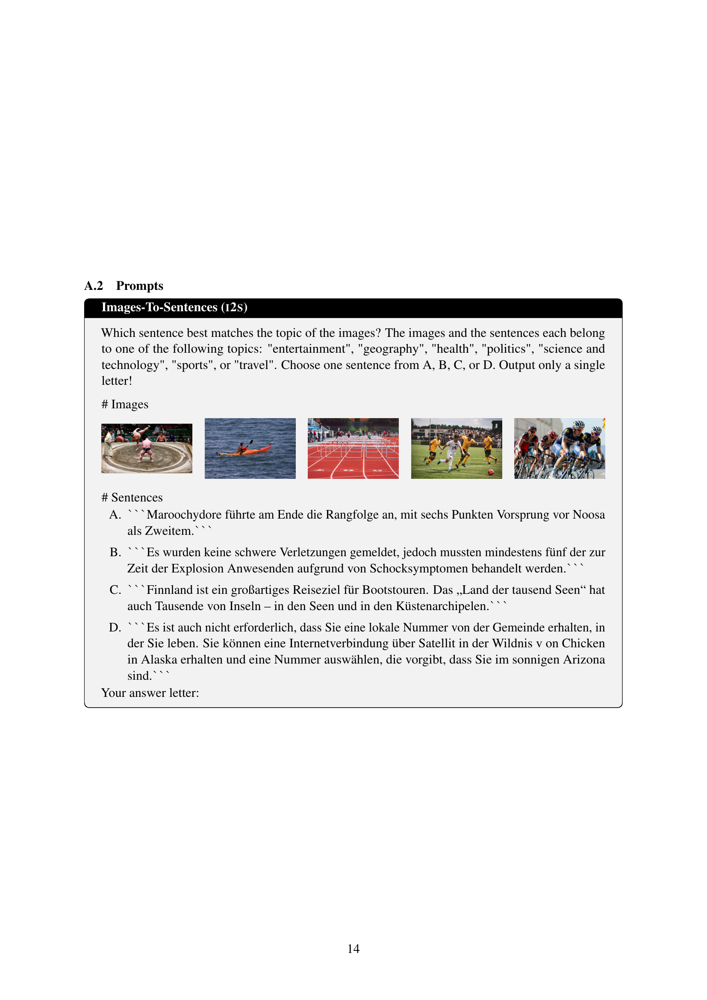

 


 2502.12852 
 Fabian David Schmidt et el. 
 
 🤗 2025-02-20 
 



↗ arXiv


↗ Hugging Face


↗ Papers with Code


### TL;DR



기존의 다국어 비전-언어(VL) 벤치마크는 제한된 언어만을 다루어 **고자원 언어에 치우친 LVLMs(대규모 비전-언어 모델) 평가**라는 문제점이 있습니다. 이는 저자원 언어에 대한 연구와 개발을 저해하는 요인입니다.

본 논문에서는 이 문제를 해결하기 위해 **205개 이상의 언어를 지원하는 대규모 다국어 VL 벤치마크인 MVL-SIB**를 제시합니다. MVL-SIB를 이용한 다양한 LVLMs의 실험 결과, **저자원 언어에서 LVLMs의 교차 모달 토픽 매칭 성능이 저조**하며, **이미지 사용에 대한 VL 지원이 텍스트 지원보다 더 크게 감소**함을 보여줍니다.  MVL-SIB는 다국어 VL 이해에 대한 종합적인 평가 도구로서의 역할을 할 것입니다.



#### Key Takeaways


 MVL-SIB는 205개 이상의 언어를 지원하는 대규모 다국어 비전-언어 벤치마크입니다. 



 저자원 언어에서의 LVLMs의 교차 모드 토픽 매칭 성능이 기대치보다 낮게 나타났습니다. 



 MVL-SIB는 다국어 VL 이해에 대한 종합적인 평가 도구로 사용될 수 있습니다. 


#### Why does it matter?
**다국어 VL 이해에 대한 종합적인 연구**를 제공하며, **저자원 언어에 대한 VL 성능 평가의 중요성**을 강조하고 **향후 연구를 위한 새로운 가능성**을 제시합니다. 이는 다국어 및 저자원 언어 처리 분야의 발전에 크게 기여할 것입니다.

------
#### Visual Insights


| Topic | Images |
|---|---| 
| **Entertainment** | [https://arxiv.org/html/2502.12852/entertainment_0_scaled.png](https://arxiv.org/html/2502.12852/entertainment_0_scaled.png), [https://arxiv.org/html/2502.12852/entertainment_1_scaled.png](https://arxiv.org/html/2502.12852/entertainment_1_scaled.png), [https://arxiv.org/html/2502.12852/entertainment_2_scaled.png](https://arxiv.org/html/2502.12852/entertainment_2_scaled.png), [https://arxiv.org/html/2502.12852/entertainment_3_scaled.png](https://arxiv.org/html/2502.12852/entertainment_3_scaled.png), [https://arxiv.org/html/2502.12852/entertainment_4_scaled.png](https://arxiv.org/html/2502.12852/entertainment_4_scaled.png), [https://arxiv.org/html/2502.12852/entertainment_5_scaled.png](https://arxiv.org/html/2502.12852/entertainment_5_scaled.png), [https://arxiv.org/html/2502.12852/entertainment_6_scaled.png](https://arxiv.org/html/2502.12852/entertainment_6_scaled.png), [https://arxiv.org/html/2502.12852/entertainment_7_scaled.png](https://arxiv.org/html/2502.12852/entertainment_7_scaled.png), [https://arxiv.org/html/2502.12852/entertainment_8_scaled.png](https://arxiv.org/html/2502.12852/entertainment_8_scaled.png), [https://arxiv.org/html/2502.12852/entertainment_9_scaled.png](https://arxiv.org/html/2502.12852/entertainment_9_scaled.png) |
| **Geography** | [https://arxiv.org/html/2502.12852/geography_0_scaled.png](https://arxiv.org/html/2502.12852/geography_0_scaled.png), [https://arxiv.org/html/2502.12852/geography_1_scaled.png](https://arxiv.org/html/2502.12852/geography_1_scaled.png), [https://arxiv.org/html/2502.12852/geography_2_scaled.png](https://arxiv.org/html/2502.12852/geography_2_scaled.png), [https://arxiv.org/html/2502.12852/geography_3_scaled.png](https://arxiv.org/html/2502.12852/geography_3_scaled.png), [https://arxiv.org/html/2502.12852/geography_4_scaled.png](https://arxiv.org/html/2502.12852/geography_4_scaled.png), [https://arxiv.org/html/2502.12852/geography_5_scaled.png](https://arxiv.org/html/2502.12852/geography_5_scaled.png), [https://arxiv.org/html/2502.12852/geography_6_scaled.png](https://arxiv.org/html/2502.12852/geography_6_scaled.png), [https://arxiv.org/html/2502.12852/geography_7_scaled.png](https://arxiv.org/html/2502.12852/geography_7_scaled.png), [https://arxiv.org/html/2502.12852/geography_8_scaled.png](https://arxiv.org/html/2502.12852/geography_8_scaled.png), [https://arxiv.org/html/2502.12852/geography_9_scaled.png](https://arxiv.org/html/2502.12852/geography_9_scaled.png) |
| **Health** | [https://arxiv.org/html/2502.12852/health_0_scaled.png](https://arxiv.org/html/2502.12852/health_0_scaled.png), [https://arxiv.org/html/2502.12852/health_1_scaled.png](https://arxiv.org/html/2502.12852/health_1_scaled.png), [https://arxiv.org/html/2502.12852/health_2_scaled.png](https://arxiv.org/html/2502.12852/health_2_scaled.png), [https://arxiv.org/html/2502.12852/health_3_scaled.png](https://arxiv.org/html/2502.12852/health_3_scaled.png), [https://arxiv.org/html/2502.12852/health_4_scaled.png](https://arxiv.org/html/2502.12852/health_4_scaled.png), [https://arxiv.org/html/2502.12852/health_5_scaled.png](https://arxiv.org/html/2502.12852/health_5_scaled.png), [https://arxiv.org/html/2502.12852/health_6_scaled.png](https://arxiv.org/html/2502.12852/health_6_scaled.png), [https://arxiv.org/html/2502.12852/health_7_scaled.png](https://arxiv.org/html/2502.12852/health_7_scaled.png), [https://arxiv.org/html/2502.12852/health_8_scaled.png](https://arxiv.org/html/2502.12852/health_8_scaled.png), [https://arxiv.org/html/2502.12852/health_9_scaled.png](https://arxiv.org/html/2502.12852/health_9_scaled.png) |
| **Politics** | [https://arxiv.org/html/2502.12852/politics_0_scaled.png](https://arxiv.org/html/2502.12852/politics_0_scaled.png), [https://arxiv.org/html/2502.12852/politics_1_scaled.png](https://arxiv.org/html/2502.12852/politics_1_scaled.png), [https://arxiv.org/html/2502.12852/politics_2_scaled.png](https://arxiv.org/html/2502.12852/politics_2_scaled.png), [https://arxiv.org/html/2502.12852/politics_3_scaled.png](https://arxiv.org/html/2502.12852/politics_3_scaled.png), [https://arxiv.org/html/2502.12852/politics_4_scaled.png](https://arxiv.org/html/2502.12852/politics_4_scaled.png), [https://arxiv.org/html/2502.12852/politics_5_scaled.png](https://arxiv.org/html/2502.12852/politics_5_scaled.png), [https://arxiv.org/html/2502.12852/politics_6_scaled.png](https://arxiv.org/html/2502.12852/politics_6_scaled.png), [https://arxiv.org/html/2502.12852/politics_7_scaled.png](https://arxiv.org/html/2502.12852/politics_7_scaled.png), [https://arxiv.org/html/2502.12852/politics_8_scaled.png](https://arxiv.org/html/2502.12852/politics_8_scaled.png), [https://arxiv.org/html/2502.12852/politics_9_scaled.png](https://arxiv.org/html/2502.12852/politics_9_scaled.png) |
| **Science & Technology** | [https://arxiv.org/html/2502.12852/science_0_scaled.png](https://arxiv.org/html/2502.12852/science_0_scaled.png), [https://arxiv.org/html/2502.12852/science_1_scaled.png](https://arxiv.org/html/2502.12852/science_1_scaled.png), [https://arxiv.org/html/2502.12852/science_2_scaled.png](https://arxiv.org/html/2502.12852/science_2_scaled.png), [https://arxiv.org/html/2502.12852/science_3_scaled.png](https://arxiv.org/html/2502.12852/science_3_scaled.png), [https://arxiv.org/html/2502.12852/science_4_scaled.png](https://arxiv.org/html/2502.12852/science_4_scaled.png), [https://arxiv.org/html/2502.12852/science_5_scaled.png](https://arxiv.org/html/2502.12852/science_5_scaled.png), [https://arxiv.org/html/2502.12852/science_6_scaled.png](https://arxiv.org/html/2502.12852/science_6_scaled.png), [https://arxiv.org/html/2502.12852/science_7_scaled.png](https://arxiv.org/html/2502.12852/science_7_scaled.png), [https://arxiv.org/html/2502.12852/science_8_scaled.png](https://arxiv.org/html/2502.12852/science_8_scaled.png), [https://arxiv.org/html/2502.12852/science_9_scaled.png](https://arxiv.org/html/2502.12852/science_9_scaled.png) |
| **Sports** | [https://arxiv.org/html/2502.12852/sports_0_scaled.png](https://arxiv.org/html/2502.12852/sports_0_scaled.png), [https://arxiv.org/html/2502.12852/sports_1_scaled.png](https://arxiv.org/html/2502.12852/sports_1_scaled.png), [https://arxiv.org/html/2502.12852/sports_2_scaled.png](https://arxiv.org/html/2502.12852/sports_2_scaled.png), [https://arxiv.org/html/2502.12852/sports_3_scaled.png](https://arxiv.org/html/2502.12852/sports_3_scaled.png), [https://arxiv.org/html/2502.12852/sports_4_scaled.png](https://arxiv.org/html/2502.12852/sports_4_scaled.png), [https://arxiv.org/html/2502.12852/sports_5_scaled.png](https://arxiv.org/html/2502.12852/sports_5_scaled.png), [https://arxiv.org/html/2502.12852/sports_6_scaled.png](https://arxiv.org/html/2502.12852/sports_6_scaled.png), [https://arxiv.org/html/2502.12852/sports_7_scaled.png](https://arxiv.org/html/2502.12852/sports_7_scaled.png), [https://arxiv.org/html/2502.12852/sports_8_scaled.png](https://arxiv.org/html/2502.12852/sports_8_scaled.png), [https://arxiv.org/html/2502.12852/sports_9_scaled.png](https://arxiv.org/html/2502.12852/sports_9_scaled.png) |
| **Travel** | [https://arxiv.org/html/2502.12852/travel_0_scaled.png](https://arxiv.org/html/2502.12852/travel_0_scaled.png), [https://arxiv.org/html/2502.12852/travel_1_scaled.png](https://arxiv.org/html/2502.12852/travel_1_scaled.png), [https://arxiv.org/html/2502.12852/travel_2_scaled.png](https://arxiv.org/html/2502.12852/travel_2_scaled.png), [https://arxiv.org/html/2502.12852/travel_3_scaled.png](https://arxiv.org/html/2502.12852/travel_3_scaled.png), [https://arxiv.org/html/2502.12852/travel_4_scaled.png](https://arxiv.org/html/2502.12852/travel_4_scaled.png), [https://arxiv.org/html/2502.12852/travel_5_scaled.png](https://arxiv.org/html/2502.12852/travel_5_scaled.png), [https://arxiv.org/html/2502.12852/travel_6_scaled.png](https://arxiv.org/html/2502.12852/travel_6_scaled.png), [https://arxiv.org/html/2502.12852/travel_7_scaled.png](https://arxiv.org/html/2502.12852/travel_7_scaled.png), [https://arxiv.org/html/2502.12852/travel_8_scaled.png](https://arxiv.org/html/2502.12852/travel_8_scaled.png), [https://arxiv.org/html/2502.12852/travel_9_scaled.png](https://arxiv.org/html/2502.12852/travel_9_scaled.png) |

> 🔼 표 1은 다양한 언어 크기의 205개 언어에 걸쳐 대규모 다국어 비전-언어 벤치마크인 MVL-SIB에서 평가된 교차 모드 이미지 텍스트 주제 일치 작업을 보여줍니다.  이 표에서는 LVLMs가 주어진 참조 이미지(또는 문장)의 주제와 가장 일치하는 4개의 후보 문장(또는 이미지) 중 하나를 선택해야 합니다. 참조 이미지/문장의 개수(k)는 1, 3, 5개로 다양합니다.  각 열에서 최고 성능 모델은 굵게 표시하고, 두 번째로 높은 성능 모델은 밑줄이 그어져 있습니다.  언어는 위키피디아 크기에 따라 계층화되어 있습니다.  측정항목은 정답 문자로 시작하는 응답의 비율입니다.  자세한 내용은 4절을 참조하십시오.
> 

> 
read the caption

> Table 1: Cross-modal Topic Matching: LVLMs must select the candidate sentence (image) from 4 choices that topically align with k𝑘kitalic_k reference images (sentences). Prompts provided in §A.2. Languages are tiered by Wikipedia sizes (cf. §5). Number of languages in parentheses. Metric: share of responses starting with correct option letter. Details in §4. In each column, the best model is emphasized in bold, the second-best model is underlined.
> 

### Full paper



