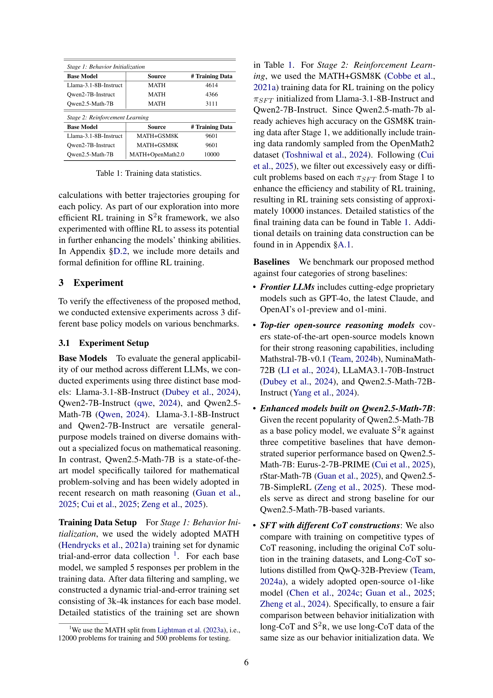
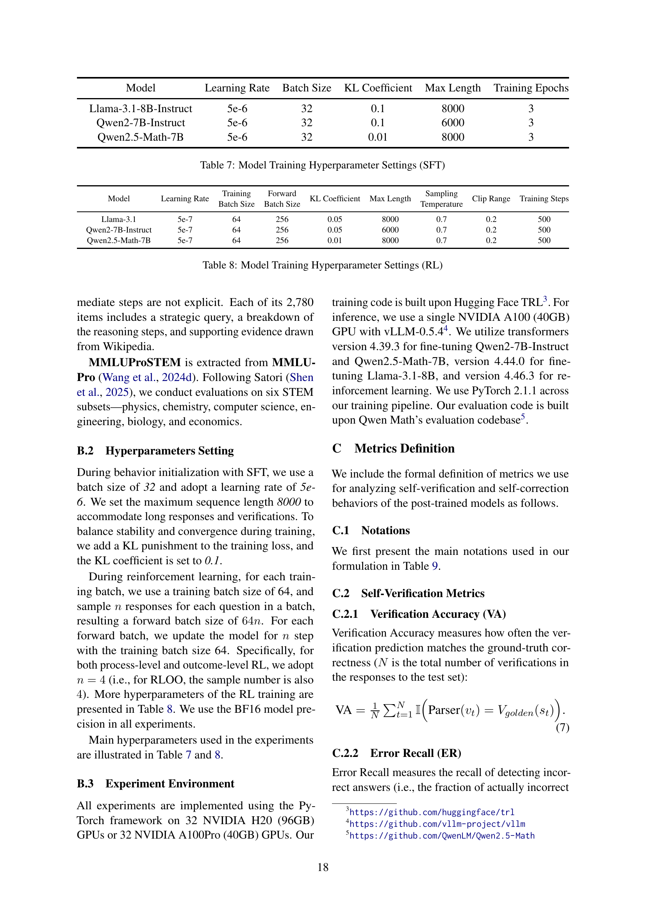
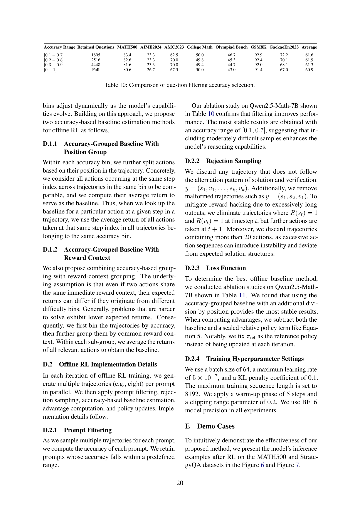

 


 2502.12853 
 Ruotian Ma et el. 
 
 🤗 2025-02-21 
 



↗ arXiv


↗ Hugging Face


↗ Papers with Code


### TL;DR



최근 대규모 언어 모델(LLM)의 성능 향상을 위해 **추론 시간 확장** 기법이 주목받고 있지만, 대부분 **방대한 데이터나 막대한 훈련 비용**이 필요합니다.  기존 연구들은 강력한 기반 모델을 중심으로 연구가 진행되었기에 **상대적으로 성능이 낮은 모델의 추론 능력 향상**은 여전히 과제로 남아있습니다.  이러한 한계점을 극복하기 위한 새로운 접근법이 필요합니다.

본 논문에서는 **S2R이라는 새로운 프레임워크**를 제안합니다. S2R은 **LLM이 추론 과정 중 스스로 검증하고 수정하는 능력**을 향상시켜 추론 능력을 강화합니다. **지도 학습 미세 조정 및 강화 학습**을 통해 LLM의 자가 검증 및 수정 능력을 향상시키고, **최소한의 자원으로 모델의 추론 과정을 적응적으로 개선**하도록 합니다. 실험 결과, 제한된 데이터만으로도 기존 방법보다 우수한 성능을 달성함을 보여주었습니다. 특히 **소규모 또는 성능이 낮은 LLM의 성능 향상**에 효과적임을 입증하였습니다.



#### Key Takeaways


 S2R은 제한된 데이터와 자원으로 LLM의 추론 능력을 효과적으로 향상시키는 새로운 프레임워크입니다. 



 자가 검증 및 수정 행동을 통한 반복적인 추론 과정 개선을 통해, 기존 방법 대비 효율적인 성능 향상을 달성했습니다. 



 제안된 방법은 다양한 기반 모델과 도메인에서 일반화 가능성을 보이며, 향후 LLM 연구에 새로운 가능성을 제시합니다. 


#### Why does it matter?
본 논문은 **LLM의 추론 능력 향상을 위한 효율적인 프레임워크인 S2R을 제시**하여,  **소규모 또는 성능이 낮은 LLM의 추론 능력을 효과적으로 향상시키는 방법**을 제시합니다.  **강화 학습과 효율적인 자가 검증 및 수정 기법을 활용**하여,  **대규모 데이터나 훈련 없이도 성능 향상**을 이끌어낸 연구결과는 **LLM 연구의 새로운 방향**을 제시하며 **다양한 분야의 연구자들에게 중요한 의미**를 가집니다. 특히 **제한된 자원으로 LLM의 성능을 향상시키려는 연구자들에게 실질적인 도움**을 줄 수 있습니다.

------
#### Visual Insights

> 🔼 본 그림은 Qwen2.5-Math-7B 모델을 기반으로 다양한 경쟁 모델들과 S2R의 데이터 효율성을 비교 분석한 결과를 보여줍니다.  모델 성능(정확도)을 세로축에, 사용된 데이터 크기(로그 스케일)를 가로축에 표시하여, 동일한 성능을 달성하는데 필요한 데이터 양을 비교합니다.  S2R이 경쟁 모델들에 비해 훨씬 적은 데이터로도 높은 성능을 달성함을 시각적으로 보여줍니다. 이는 S2R의 높은 데이터 효율성을 강조하는 결과입니다.
> 

> 
read the caption

> Figure 1: The data efficiency of S2r compared to competitive methods, with all models initialized from Qwen2.5-Math-7B.
> 


| Base Model | Source | # Training Data |
|---|---|---|
| *Stage 1: Behavior Initialization* |  |  |
| Llama-3.1-8B-Instruct | MATH | 4614 |
| Qwen2-7B-Instruct | MATH | 4366 |
| Qwen2.5-Math-7B | MATH | 3111 |
| *Stage 2: Reinforcement Learning* |  |  |
| Llama-3.1-8B-Instruct | MATH+GSM8K | 9601 |
| Qwen2-7B-Instruct | MATH+GSM8K | 9601 |
| Qwen2.5-Math-7B | MATH+OpenMath2.0 | 10000 |

> 🔼 본 논문의 표 1은 세 가지 기본 모델(Llama-3.1-8B-Instruct, Qwen2-7B-Instruct, Qwen2.5-Math-7B)에 대한 훈련 데이터 통계를 보여줍니다. 각 모델에 대해, 데이터 출처(MATH)와 훈련 데이터의 크기(# Training Data)를 나타냅니다.  S2R(Self-verification and Self-correction via Reinforcement Learning) 프레임워크의 1단계(Behavior Initialization)와 2단계(Reinforcement Learning)에서 사용된 훈련 데이터를 구분하여 제시합니다.
> 

> 
read the caption

> Table 1: Training data statistics.
> 

### In-depth insights

#### LLM Self-Correction
LLM의 자기 수정 기능은 **모델의 추론 과정에서 발생할 수 있는 오류를 스스로 인식하고 수정하는 능력**을 의미합니다. 이는 단순히 정답을 맞추는 것 이상으로, **모델의 사고 과정을 투명하게 만들고, 신뢰성을 높이며, 안전성을 강화**하는 데 중요한 역할을 합니다.  **강화학습(RL)**은 LLM이 자기 수정 능력을 학습하는 데 효과적인 방법으로 제시되고 있으며, **보상(Reward) 설계**가 중요한 요소입니다.  성과 측면에서, 자기 수정 기능은 **정확도 향상**뿐 아니라 **추론 과정의 효율성 개선**에도 기여할 수 있습니다.  **다양한 평가 지표**를 통해 자기 수정의 효과를 측정하고 분석하는 것이 중요하며, 특히 오류의 종류와 난이도에 따른 성능 차이를 분석하여 모델 개선에 활용해야 합니다.  **데이터 효율성**을 고려한 자기 수정 기법의 개발 또한 중요한 연구 방향이 될 것입니다.  궁극적으로, **더욱 안전하고 신뢰할 수 있는 LLM**을 개발하기 위해서는 자기 수정 기능의 지속적인 연구와 발전이 필수적입니다.

#### RL for Reasoning
강화학습(RL) 기반 추론은 **대규모 언어 모델(LLM)**의 추론 능력을 향상시키는 데 효과적인 방법으로 떠오르고 있습니다.  기존의 지도 학습 방식과 달리, RL은 모델이 **자체적으로 시행착오를 통해 학습**할 수 있도록 하여, 보다 **유연하고 일반화된 추론 능력**을 갖도록 합니다. 특히, **자기 검증 및 자기 수정**과 같은 메타인지 능력을 향상시키는 데 효과적이며, 이를 통해 LLM은 보다 정확하고 신뢰할 수 있는 결과를 생성할 수 있습니다.  **다양한 RL 알고리즘**이 LLM 추론에 적용되고 있으며, 각 알고리즘은 특정한 강점과 약점을 가지고 있습니다.  **보상 함수 설계**는 RL 기반 추론의 성능을 결정하는 중요한 요소이며, 효과적인 보상 함수를 설계하는 것은 여전히 활발한 연구 분야입니다.  향후 연구는 **더욱 효율적이고 안전한 RL 알고리즘** 개발과, **다양한 도메인 및 작업**에 대한 RL 기반 추론 방법의 적용 및 일반화 가능성 연구에 집중될 것으로 예상됩니다.

#### Data Efficiency
본 논문은 **데이터 효율성** 측면에서 기존의 대규모 언어 모델(LLM) 학습 방식의 한계를 극복하고자 하는 새로운 접근 방식을 제시합니다.  기존 LLM 학습은 방대한 데이터셋을 필요로 하지만, 제안된 방법은 상대적으로 적은 데이터만으로도 성능 향상을 달성합니다.  이는 **자기 검증 및 자기 수정**이라는 핵심적인 사고 능력을 모델에 부여함으로써 가능해졌습니다.  **강화 학습**을 통해 모델의 자기 검증 및 자기 수정 능력을 향상시킴으로써, 제한된 데이터 환경에서도 효과적인 추론 능력을 발휘할 수 있게 되었습니다. 특히, **다양한 규모의 모델**에 적용 가능하며, **도메인 내외의 다양한 과제**에 대한 일반화 성능도 보여줍니다. 따라서, 본 논문의 접근 방식은 데이터 효율성 측면에서 LLM의 성능 향상에 중요한 시사점을 제공하며, **자원 제약이 있는 환경**에서도 LLM을 효과적으로 활용할 수 있는 가능성을 보여줍니다.

#### Offline RL
본 논문에서 오프라인 강화학습(Offline RL)은 **온라인 학습의 높은 자원 소모 문제를 해결하기 위한 효율적인 대안**으로 제시됩니다.  온라인 RL은 학습 중 실시간으로 데이터를 샘플링해야 하므로 많은 시간과 자원이 필요하지만, 오프라인 RL은 사전에 수집된 데이터를 사용하기 때문에 효율성이 훨씬 높습니다. 논문에서는 오프라인 RL을 통해 **모델의 자기 검증 및 자기 수정 능력을 향상시키는 실험 결과**를 제시하며, 특히 **정책 수준에서의 오프라인 RL이 효과적임**을 보여줍니다.  **정확도 기반의 트래젝토리 그룹화** 전략을 통해 베이스라인 추정의 정확성을 높여 오프라인 RL의 성능을 향상시켰으며,  온라인 RL과 비교하여 **비슷한 성능을 달성하면서도 효율성을 크게 높였다는 점**이 주목할 만합니다.  이는 **제한된 자원을 가진 환경에서도 강화학습 기반의 LLM 성능 향상이 가능함**을 시사하는 중요한 결과입니다.  **추가적인 분석을 통해 오프라인 RL의 장점**을 더 자세히 탐구하고,  **다양한 분야의 LLM에 대한 적용 가능성**을 확인할 필요가 있겠습니다.

#### Future Work
본 논문의 "미래 연구" 부분에서는 **LLM의 자기 검증 및 자기 수정 능력 향상을 위한 심층 연구**가 필요함을 시사합니다.  **다양한 RL 알고리즘 및 보상 모델**을 추가적으로 탐구하여 성능 개선을 도모하고, **오프라인 RL의 효율성을 높이는 연구**도 진행해야 합니다. 특히, **다양한 도메인의 문제에 대한 일반화 능력 향상**을 위한 연구와 **더욱 적은 데이터로 뛰어난 성능을 달성하는 방안**을 모색해야 합니다.  **실제 응용 분야에 대한 적용 연구** 및 **LLM의 추론 과정에 대한 해석력 향상** 연구 또한 중요한 미래 과제입니다.  더 나아가, **LLM의 안전성 및 윤리적 문제**에 대한 고려와 **책임 있는 AI 개발**에 대한 연구도 필수적입니다.  이를 통해 **실제 세계 문제 해결에 기여**할 수 있는 강력하고 신뢰할 수 있는 LLM 개발이 가능해질 것입니다.

### More visual insights

More on figures

> 🔼 그림 2는 제안된 S2R 프레임워크의 개요를 보여줍니다. S2R은 두 단계로 구성됩니다. 1단계는 강화 학습을 통해 모델이 자체적으로 검증하고 수정하는 행동을 초기화하는 단계입니다. 이 단계에서는 주의깊게 선택된 데이터셋을 사용하여 지도 학습 미세 조정을 수행합니다. 2단계는 결과 수준과 과정 수준의 강화 학습을 통해 모델의 자체 검증 및 수정 능력을 더욱 강화하는 단계입니다. 이 그림은 각 단계에서의 입력, 출력, 그리고 사용되는 알고리즘을 시각적으로 보여줍니다.
> 

> 
read the caption

> Figure 2: Overview of S2r.
> 

> 🔼 그림 (a)는 제안된 S2R 프레임워크의 개요를 보여줍니다.  S2R은 강화 학습을 통해 LLM이 추론 중에 자체적으로 검증하고 수정하는 기능을 향상시키는 효율적인 방법입니다.  이 그림은 데이터 구성 단계, 행동 초기화 단계, 그리고 강화 학습 단계의 세 가지 주요 단계로 나누어져 있습니다. 각 단계는 LLM이 자체 검증 및 자체 수정 능력을 개발하는 데 필요한 과정을 자세히 설명합니다.  특히, 강화 학습 단계에서는 결과 수준과 과정 수준의 두 가지 강화 학습 방법이 모두 사용되어 모델이 추론 과정을 적응적으로 개선할 수 있도록 합니다.
> 

> 
read the caption

> (a)
> 

> 🔼 그림 (b)는 제안된 S2R 프레임워크의 강화 학습 단계를 보여줍니다. 이 단계에서 자기 검증 및 자기 수정 동작이 강화됩니다.  구체적으로,  처음에는 감독식 미세 조정으로 자기 검증 및 자기 수정 행동이 초기화되고, 그 후 결과 수준 및 과정 수준 강화 학습을 통해 이러한 기술이 더욱 강화됩니다. 이 그림은 각 질문에 대한 여러 응답을 생성하고, 난이도에 따라 여러 번의 시행착오 과정을 거쳐 올바른 답에 도달하는 과정을 시각적으로 보여줍니다.  최종 목표는 모델이 추론 과정 중에 자체적으로 추론 과정을 조정하고 개선할 수 있도록 하는 것입니다.
> 

> 
read the caption

> (b)
> 

> 🔼 그림 3은 모델의 검증 및 수정 능력에 대한 평가 결과를 보여줍니다. 세 가지 기본 모델(Llama-3.1-8B-Instruct, Qwen2-7B-Instruct, Qwen2.5-Math-7B)에 대해, 지도 학습(SFT)만 적용한 경우와, SFT에  결과 수준 강화 학습(ORL) 및 과정 수준 강화 학습(PRL)을 추가로 적용한 경우의 검증 정확도, 오류 재현율, 정답 정밀도, 오답 수정률 등의 지표를 비교 분석합니다. 각 그래프는 특정 지표에 대한 세 가지 모델의 성능 변화를 보여주며, 강화 학습을 통해 모델의 검증 및 수정 능력이 향상되었음을 시각적으로 보여줍니다.
> 

> 
read the caption

> Figure 3: Evaluation on verification and correction.
> 

> 🔼 그림은 제시된 캡션만으로는 내용을 충분히 이해하기 어렵습니다.  본 논문의 3.4절(자체 검증 및 자체 수정 기능 분석)에서 다루는 내용과 관련이 있는 것으로 보이며, 자체 검증(self-verification) 과 자체 수정(self-correction)의 정확도를 보여주는 그래프로 추정됩니다.  SFT(Supervised Fine-tuning) 기반 모델과 강화 학습(RL)을 적용한 모델의 성능 비교를 보여주는 것으로 보이며, 각 그래프는 자체 검증의 정확도와 자체 수정의 성공률을 나타내는 지표를 보여주고 있습니다.  구체적으로, 'Verification Accuracy', 'Error Recall', 'Correct Precision', 'Incorrect to Correct', 'Correct to Incorrect' 와 같은 지표를 통해  RL 학습이  자체 검증 및 자체 수정 능력 향상에 미치는 영향을 분석한 결과를 시각적으로 보여주는 것으로 예상됩니다.
> 

> 
read the caption

> (a)
> 

> 🔼 그림 (b)는 제안된 S2R 프레임워크의 강화 학습 단계를 보여줍니다. 특히, 결과 수준과 과정 수준의 강화 학습 모두가 초기 정책 모델의 자가 검증 및 자가 수정 능력을 향상시키는 데 사용됨을 보여줍니다.  결과 수준 강화 학습은 최종 답변의 정확성에 초점을 맞추고, 과정 수준 강화 학습은 중간 단계의 추론 과정에서의 정확성에 초점을 맞춥니다. 이 그림은 각 단계에서의 입력, 출력, 보상 및 업데이트 과정을 시각적으로 보여주어 S2R 프레임워크의 작동 방식을 자세히 설명합니다.
> 

> 
read the caption

> (b)
> 

> 🔼 그림 4는 MATH500 테스트 세트에서 평가한 다양한 모델의 난이도 수준별 정확도와 평균 시도 횟수를 보여줍니다.  각 난이도 수준(1~5)에 대해, 기본 모델(SFT)과 강화 학습을 적용한 모델(SFT+RL)의 정확도와 시도 횟수를 비교하여, 모델의 성능과 효율성을 난이도에 따라 분석합니다.  난이도가 높아질수록 정확도와 시도 횟수의 변화를 자세히 보여주어, 강화 학습이 모델의 추론 능력 향상에 미치는 영향을 시각적으로 보여줍니다.
> 

> 
read the caption

> Figure 4: The accuracy and average trial number of different models across difficulty levels. Evaluated on MATH500 test set.
> 

> 🔼 그림 5는 본 논문의 S2R(Self-verify and Self-correct via Reinforcement Learning) 프레임워크에서 사용되는 SFT(Supervised Fine-tuning) 데이터 생성 과정의 예시를 보여줍니다.  구체적으로, 하나의 문제에 대해 여러 번의 답변 시도와 검증 과정을 거치는 과정을 보여주며, 잘못된 답변이 나올 경우  '잠시만요, 다시 확인해볼게요'와 같은 메시지와 함께 수정된 답변과 검증 과정이 이어지는 것을 보여줍니다. 이를 통해 모델이 반복적인 자가 검증 및 수정을 통해 사고 과정을 개선하는 방식을 시각적으로 설명하고 있습니다. 그림에는 문제, 잘못된 답변 및 수정된 답변, 그리고 각 단계에 대한 검증 과정이 포함되어 있습니다.
> 

> 
read the caption

> Figure 5: SFT data example.
> 

More on tables


| Model | MATH | AIME | AMC | College Math | Olympiad Bench | GSM8K | GaokaoEn 2023 | Average |
|---|---|---|---|---|---|---|---|---|
| **Datasets** |  |  |  |  |  |  |  |  |
| **Frontier LLMs** |  |  |  |  |  |  |  |  |
| GPT-4o⋆ | 76.6 | 9.3 | 47.5 | 48.5 | 43.3 | 92.9 | 67.5 | 55.1 |
| Claude3.5-Sonnet⋆ | 78.3 | 16.0 | - | - | - | 96.4 | - | - |
| GPT-o1-preview⋆ | 85.5 | 44.6 | 90.0 | - | - | - | - | - |
| GPT-o1-mini⋆ | 90.0 | 56.7 | 95.0 | 57.8 | 65.3 | 94.8 | 78.4 | 76.9 |
| **Top-tier Open-source Reasoning LLMs** |  |  |  |  |  |  |  |  |
| Mathstral-7B-v0.1⋆ | 57.8 | 0.0 | 37.5 | 33.7 | 21.5 | 84.9 | 46.0 | 40.2 |
| NuminaMath-72B-CoT⋆ | 64.0 | 3.3 | 70.0 | 39.7 | 32.6 | 90.8 | 58.4 | 51.3 |
| LLaMA3.1-70B-Instruct⋆ | 65.4 | 23.3 | 50.0 | 42.5 | 27.7 | 94.1 | 54.0 | 51.0 |
| Qwen2.5-Math-72B-Instruct⋆ | 85.6 | 30.0 | 70.0 | 49.5 | 49.0 | 95.9 | 71.9 | 64.6 |
| **General Model: Llama-3.1-8B-Instruct** |  |  |  |  |  |  |  |  |
| Llama-3.1-8B-Instruct | 48.0 | 6.7 | 30.0 | 30.8 | 15.6 | 84.4 | 41.0 | 36.6 |
| Llama-3.1-8B-Instruct + Original Solution SFT | 31.0 | 3.3 | 7.5 | 22.0 | 8.0 | 58.7 | 28.3 | 22.7 |
| Llama-3.1-8B-Instruct + Long CoT SFT | 51.4 | 6.7 | 27.5 | 36.3 | 19.0 | 87.0 | 48.3 | 39.5 |
| **Llama-3.1-8B-S2r-BI (ours)** | 49.6 | 10.0 | 20.0 | 33.3 | 17.6 | 85.3 | 41.0 | 36.7 |
| **Llama-3.1-8B-S2r-PRL (ours)** | 53.6 | 6.7 | 25.0 | 33.7 | 18.5 | 86.7 | 43.1 | 38.2 |
| **Llama-3.1-8B-S2r-ORL (ours)** | 55.0 | 6.7 | 32.5 | 34.7 | 20.7 | 87.3 | 45.2 | 40.3 |
| **General Model: Qwen2-7B-Instruct** |  |  |  |  |  |  |  |  |
| Qwen2-7B-Instruct | 51.2 | 3.3 | 30.0 | 18.2 | 19.1 | 86.4 | 39.0 | 35.3 |
| Qwen2-7B-Instruct + Original Solution SFT | 41.2 | 0.0 | 25.0 | 30.1 | 10.2 | 74.5 | 34.8 | 30.8 |
| Qwen2-7B-Instruct + Long CoT SFT | 60.4 | 6.7 | 32.5 | 36.3 | 23.4 | 81.2 | 53.5 | 42.0 |
| **Qwen2-7B-S2r-BI (ours)** | 61.2 | 3.3 | 27.5 | 41.1 | 27.1 | 87.4 | 49.1 | 42.4 |
| **Qwen2-7B-S2r-PRL (ours)** | 65.4 | 6.7 | 35.0 | 36.7 | 27.0 | 89.0 | 49.9 | 44.2 |
| **Qwen2-7B-S2r-ORL (ours)** | 64.8 | 3.3 | 42.5 | 34.7 | 26.2 | 86.4 | 50.9 | 44.1 |
| **Math-Specialized Model: Qwen2.5-Math-7B** |  |  |  |  |  |  |  |  |
| Qwen2.5-Math-7B | 51.0 | 16.7 | 45.0 | 21.5 | 16.7 | 58.3 | 39.7 | 35.6 |
| Qwen2.5-Math-7B-Instruct | 83.2 | 13.3 | 72.5 | 47.0 | 40.4 | 95.6 | 67.5 | 59.9 |
| Eurus-2-7B-PRIME⋆ | 79.2 | 26.7 | 57.8 | 45.0 | 42.1 | 88.0 | 57.1 | 56.6 |
| rStar-Math-7B⋆ | 78.4 | 26.7 | 47.5 | 52.5 | 47.1 | 89.7 | 65.7 | 58.2 |
| Qwen2.5-Math-7B + Original Solution SFT | 58.0 | 6.7 | 42.5 | 35.8 | 20.0 | 79.5 | 51.9 | 42.1 |
| Qwen2.5-Math-7B + Long CoT SFT | 80.2 | 16.7 | 60.0 | 49.6 | 42.1 | 91.4 | 69.1 | 58.4 |
| **Qwen2.5-Math-7B-S2r-BI (ours)** | 81.6 | 23.3 | 60.0 | 43.9 | 44.4 | 91.9 | 70.1 | 59.3 |
| **Qwen2.5-Math-7B-S2r-PRL (ours)** | 83.4 | 26.7 | 70.0 | 43.8 | 46.4 | 93.2 | 70.4 | 62.0 |
| **Qwen2.5-Math-7B-S2r-ORL (ours)** | 84.4 | 23.3 | 77.5 | 43.8 | 44.9 | 92.9 | 70.1 | 62.4 |
> 🔼 표 2는 다양한 수학 벤치마크에서 S2R 및 기타 강력한 기준 모델의 성능을 보여줍니다.  BI는 지도 학습 미세 조정을 통해 동작을 초기화한 모델을 나타내고, ORL은 결과 수준 강화 학습으로 훈련된 모델을, PRL은 과정 수준 강화 학습으로 훈련된 모델을 나타냅니다.  가장 높은 결과는 굵게 표시하고, 두 번째로 높은 결과는 밑줄이 그어져 있습니다. 일부 기준 모델의 경우 Guan et al.(2025)의 원래 보고서의 결과를 사용했습니다. 이 표는 모델의 수학적 추론 능력을 다양한 측면에서 평가하여 S2R의 효과를 보여줍니다.
> 

> 
read the caption

> Table 2: The performance of S2r and other strong baselines on the most challenging math benchmarks is presented. BI refers to the behavior-initialized models through supervised fine-tuning, ORL denotes models trained with outcome-level RL, and PRL refers to models trained with process-level RL. The highest results are highlighted in bold and the second-best results are marked with underline. For some baselines, we use the results from their original reports or from Guan et al. (2025), denoted by ∗.
> 


| Model | FOLIO | CRUX-Eval | Strategy-QA | MMLUPro-STEM |
|---|---|---|---|---|
| Qwen2.5-Math-72B-Instruct | 69.5 | 68.6 | 94.3 | 66.0 |
| Llama-3.1-70B-Instruct∗ | 65.0 | 59.6 | 88.8 | 61.7 |
| OpenMath2-Llama3.1-70B∗ | 68.5 | 35.1 | 95.6 | 55.0 |
| QwQ-32B-Preview∗ | 84.2 | 65.2 | 88.2 | 71.9 |
| Eurus-2-7B-PRIME | 56.7 | 50.0 | 79.0 | 53.7 |
| Qwen2.5-Math-7B-Instruct | 61.6 | 28.0 | 81.2 | 44.7 |
| Qwen2.5-Math-7B | 37.9 | 40.8 | 61.1 | 46.0 |
| Qwen2.5-Math-7B-S2r-BI (ours) | 58.1 | 48.0 | 88.7 | 49.8 |
| Qwen2.5-Math-7B-S2r-ORL (ours) | 61.6 | 50.9 | 90.8 | 50.0 |
> 🔼 표 3은 제안된 방법과 기준 방법의 4가지 교차 도메인 작업에 대한 성능을 보여줍니다. 제안된 S2R 방법은 다양한 기준 모델에서 일관되게 우수한 성능을 보여줍니다. 특히, Qwen2.5-Math-7B 모델에서는 MATH500과 GSM8K에서 기준 모델을 각각 32.2%와 34.3% 향상시킵니다. 또한, S2R은 동일한 기준 모델에서 파생된 기준 방법들보다 대부분의 벤치마크에서 우수한 성능을 보입니다. 흥미롭게도, S2R은 최근 제안된 경쟁력 있는 기준 방법들(Eurus-2-7B-PRIME, rStar-Math-7B, Qwen2.5-7B-SimpleRL)보다 우수한 성능을 보입니다. 이는 S2R이 데이터 구성과 보상 모델링에 대한 노력을 줄이고 효율성을 높인다는 것을 보여줍니다. 마지막으로, 동일한 규모의 SFT 데이터를 사용하여 S2R은 QwQ-32B-Preview에서 추출된 장기 CoT 모델보다 우수한 성능을 보여주는데, 이는 작은 LLMs에서 자체 검증 및 자체 수정을 배우는 것이 장기 CoT의 효과적인 대안임을 보여줍니다.  표에 제시된 결과는 Shen et al.(2025)에 보고된 결과를 포함하여 여러 출처에서 가져왔습니다.
> 

> 
read the caption

> Table 3: Performance of the proposed method and the baseline methods on 4 cross-domain tasks. The results with ∗ are reported by Shen et al. (2025).
> 


| Base Model | Methods | Overall Verification Acc. | Initial Verification Acc. |
|---|---|---|---| 
| ** Llama3.1-8B-Instruct** | Problem-solving | 80.10 | 87.28 |
|  | Confirmative | 65.67 | 77.27 |
| ** Qwen2-7B-Instruct** | Problem-solving | 73.28 | 90.24 |
|  | Confirmative | 58.31 | 76.16 |
| ** Qwen2.5-Math-7B** | Problem-solving | 77.25 | 91.21 |
|  | Confirmative | 61.58 | 82.80 |
> 🔼 본 표는 문제 해결 방식과 확인 방식의 두 가지 검증 방법을 비교 분석한 결과를 보여줍니다. 문제 해결 방식은 문제를 다시 풀어서 답을 확인하는 방식이고, 확인 방식은 기존 답의 정확성을 다른 관점에서 평가하는 방식입니다. 표에는 각 방식의 전체 검증 정확도와 초기 답이 맞았을 때와 틀렸을 때의 초기 검증 정확도가 제시되어 있습니다.  세 가지 기본 모델(Llama-3.1-8B-Instruct, Qwen2-7B-Instruct, Qwen2.5-Math-7B)에 대한 결과가 포함되어 있습니다.
> 

> 
read the caption

> Table 4: Comparison of problem-solving and confirmative verification.
> 


| Model | MATH 500 | AIME 2024 | AMC 2023 | College Math | Olympiad Bench | GSM8K | GaokaoEn 2023 |
|---|---|---|---|---|---|---|---| 
| **Datasets** |  |  |  |  |  |  |  |
| **General Model: Qwen2-7B-Instruct** |  |  |  |  |  |  |  |
| Qwen2-7B-Instruct | 51.2 | 3.3 | 30.0 | 18.2 | 19.1 | 86.4 | 39.0 | 35.3 |
| **Qwen2-7B-S2r-BI (ours)** | 61.2 | 3.3 | 27.5 | **41.1** | **27.1** | 87.4 | 49.1 | 42.4 |
| **Qwen2-7B-S2r-PRL (ours)** | **65.4** | <ins>6.7</ins> | 35.0 | 36.7 | <ins>27.0</ins> | **89.0** | <ins>49.9</ins> | <ins>44.2</ins> |
| **Qwen2-7B-S2r-ORL (ours)** | <ins>64.8</ins> | 3.3 | **42.5** | 34.7 | 26.2 | 86.4 | **50.9** | 44.1 |
| **Qwen2-7B–Instruct-S2r-PRL-offline (ours)** | 61.6 | **10.0** | 32.5 | 40.2 | 26.5 | <ins>87.6</ins> | 50.4 | 44.1 |
| **Qwen2-7B-Instruct-S2r-ORL-offline (ours)** | 61.0 | <ins>6.7</ins> | <ins>37.5</ins> | <ins>40.5</ins> | 27.3 | 87.4 | 49.6 | **44.3** |
| **Math-Specialized Model: Qwen2.5-Math-7B** |  |  |  |  |  |  |  |  |
| Qwen2.5-Math-7B | 51.0 | 16.7 | 45.0 | 21.5 | 16.7 | 58.3 | 39.7 | 35.6 |
| **Qwen2.5-Math-7B-S2r-BI (ours)** | 81.6 | <ins>23.3</ins> | 60.0 | 43.9 | 44.4 | 91.9 | 70.1 | 59.3 |
| **Qwen2.5-Math-7B-S2r-PRL (ours)** | <ins>83.4</ins> | **26.7** | <ins>70.0</ins> | 43.8 | <ins>46.4</ins> | **93.2** | <ins>70.4</ins> | <ins>62.0</ins> |
| **Qwen2.5-Math-7B-S2r-ORL (ours)** | **84.4** | 23.3 | **77.5** | 43.8 | 44.9 | <ins>92.9</ins> | 70.1 | **62.4** |
| **Qwen2.5-Math-7B-S2r-PRL-offline (ours)** | <ins>83.4</ins> | <ins>23.3</ins> | 62.5 | **50.0** | **46.7** | <ins>92.9</ins> | **72.2** | 61.6 |
| **Qwen2.5-Math-7B-S2r-ORL-offline (ours)** | 82.0 | 20.0 | 67.5 | <ins>49.8</ins> | 45.8 | 92.6 | <ins>70.4</ins> | 61.2 |
> 🔼 표 5는 본 논문에서 제안하는 S2R 기법에 대해 온라인 강화 학습과 오프라인 강화 학습을 사용했을 때의 성능 비교 결과를 보여줍니다.  온라인 학습과 오프라인 학습 모두에서 S2R의 효과를 확인하고,  두 학습 방식 간의 차이점과 장단점을 분석하여 오프라인 학습의 효율성을 강조합니다.  다양한 벤치마크 데이터셋에서의 정확도와 평균 시행 횟수를 비교 분석하여 오프라인 강화학습의 실용성을 보여줍니다.
> 

> 
read the caption

> Table 5: Comparison of S2r using online and offline RL training.
> 


| Without Asking for Confirmative Verification | Asking for Confirmative Verification |
|---|---|---|
| Model | Confirmative out of 100 | Confirmative out of 100 |
| GPT-4o | 26 | 44 |
| GPT-4-Preview-1106 | 32 | 61 |
| QwQ-32B-preview | 37 | 58 |
| Llama-3.1-70B-Instruct | 28 | 50 |
> 🔼 표 6은 모델이 자체적으로 검증하는 능력을 평가하기 위해 '문제 해결' 방식과 '확인' 방식 두 가지 검증 방법을 사용한 결과를 보여줍니다.  각 방식에 대한 전반적인 정확도와 초기 응답이 정답일 때와 오답일 때의 초기 검증 정확도를 비교 분석하여, 각 방식의 강점과 약점을 보여줍니다.  이를 통해, 모델의 자체 검증 능력을 향상시키기 위한 최적의 접근 방식을 선택하는 데 도움이 되는 정보를 제공합니다.
> 

> 
read the caption

> Table 6:
> 


| Model | Learning Rate | Batch Size | KL Coefficient | Max Length | Training Epochs |
|---|---|---|---|---|---| 
| Llama-3.1-8B-Instruct | 5e-6 | 32 | 0.1 | 8000 | 3 |
| Qwen2-7B-Instruct | 5e-6 | 32 | 0.1 | 6000 | 3 |
| Qwen2.5-Math-7B | 5e-6 | 32 | 0.01 | 8000 | 3 |
> 🔼 본 표는 논문의 실험 설정 부분에 있는 표 7이며, 지도 학습 방식(Supervised Fine-tuning)을 사용하여 언어 모델을 학습시킬 때 사용된 하이퍼파라미터 설정값들을 보여줍니다.  세 가지 기본 모델(Llama-3.1-8B-Instruct, Qwen2-7B-Instruct, Qwen2.5-Math-7B)에 대해 학습률, 배치 크기, KL 계수, 최대 길이, 학습 에폭 등의 하이퍼파라미터 값이 제시되어 있습니다. 이 설정값들은 각 모델의 특성과 학습 목표에 맞춰 조정되었음을 알 수 있습니다.
> 

> 
read the caption

> Table 7: Model Training Hyperparameter Settings (SFT)
> 


| Model | Learning Rate | Training Batch Size | Forward Batch Size | KL Coefficient | Max Length | Sampling Temperature | Clip Range | Training Steps |
|---|---|---|---|---|---|---|---|---|
| Llama-3.1 | 5e-7 | 64 | 256 | 0.05 | 8000 | 0.7 | 0.2 | 500 |
| Qwen2-7B-Instruct | 5e-7 | 64 | 256 | 0.05 | 6000 | 0.7 | 0.2 | 500 |
| Qwen2.5-Math-7B | 5e-7 | 64 | 256 | 0.01 | 8000 | 0.7 | 0.2 | 500 |
> 🔼 본 표는 강화 학습(Reinforcement Learning)을 사용하여 언어 모델을 훈련시킬 때 사용된 하이퍼파라미터 설정을 보여줍니다.  모델 학습 설정에서 학습률, 배치 크기, KL 계수, 최대 길이, 샘플링 온도, 클립 범위, 훈련 단계 등 다양한 하이퍼파라미터 값을 보여줍니다. 이를 통해 세 가지 다른 기본 모델에 대한 강화 학습 훈련의 세부 정보를 이해하는 데 도움이 됩니다.
> 

> 
read the caption

> Table 8: Model Training Hyperparameter Settings (RL)
> 


The below is the Markdown format of the given HTML table.

| Variable | Description |
|---|---| 
| π | The policy |
| x | Problem instance |
| y | Series of predefined actions:  y={a1,a2,…,an} |
| ai | The i-th action in the response y, and let |
|  | Type(ai)∈{verify,solve,&lt;end&gt;} |
| sj | jth attempt to solve the problem |
| vj | jth self-verification for the jth attempt |
|  | The text parser to get the self-verification result |
|  | indicating the correctness of action sj |
| Vgolden(⋅) |  Vgolden(ai)∈{correct,incorrect} |
| R(⋅) | The rule based reward function |
|  | R(⋅)∈{-1,1} |
|  | R(sj) = { 1, & Vgolden(sj)=correct  -1, otherwise } |
|  | R(vj) = { 1, & Parser(vj)=Vgolden(sj)  -1, otherwise } |
| <end> | End of action series |
| 𝕀(⋅) | The indicator function, 𝕀(⋅)∈{0,1}.  𝕀(⋅)=1 if the condition inside holds true, and 𝕀(⋅)=0 otherwise. |
> 🔼 이 표는 논문의 방법론 섹션에 있는 표 9로, 강화 학습을 통해 LLMs의 자기 검증 및 자기 수정 능력을 향상시키는 S2R 프레임워크에 대한 설명에 사용되는 변수들을 정의하고 있습니다. 각 변수의 이름, 설명, 그리고 데이터 타입이 명시되어 있어, 이후의 분석 및 결과 해석에 필요한 기본적인 정보를 제공합니다.
> 

> 
read the caption

> Table 9: Variable Lookup Table
> 


| Accuracy Range | Retained Questions | MATH500 | AIME2024 | AMC2023 | College Math | Olympiad Bench | GSM8K | GaokaoEn2023 | Average |
|---|---|---|---|---|---|---|---|---|---| 
| [0.1-0.7] | 1805 | 83.4 | 23.3 | 62.5 | 50.0 | 46.7 | 92.9 | 72.2 | 61.6 |
| [0.2-0.8] | 2516 | 82.6 | 23.3 | 70.0 | 49.8 | 45.3 | 92.4 | 70.1 | 61.9 |
| [0.3-0.9] | 4448 | 81.6 | 23.3 | 70.0 | 49.4 | 44.7 | 92.0 | 68.1 | 61.3 |
| [0-1] | Full | 80.6 | 26.7 | 67.5 | 50.0 | 43.0 | 91.4 | 67.0 | 60.9 |
> 🔼 표 10은 질문 필터링 정확도 선택에 대한 비교 결과를 보여줍니다.  다양한 정확도 범위를 사용하여 질문을 필터링했을 때 MATH500, AIME2024, AMC2023, College Math, Olympiad Bench, GSM8K, GaokaoEn2023 데이터셋에서의 정확도를 비교 분석한 결과입니다. 각 범위별로 유지된 질문의 수와 평균 정확도를 제시하여 어떤 정확도 범위가 모델 성능 향상에 가장 효과적인지 보여줍니다.  [0.1-0.7] 범위가 가장 안정적인 결과를 보이는 것을 확인할 수 있습니다.
> 

> 
read the caption

> Table 10: Comparison of question filtering accuracy selection.
> 


| Baseline Method | MATH500 | AIME2024 | AMC2023 | College Math | Olympiad Bench | GSM8K | GaokaoEn2023 | Average |
|---|---|---|---|---|---|---|---|---|
| **Based on reward context** | 82.4 | 26.7 | 65.0 | 50.1 | 46.1 | 92.9 | 71.2 | 62.1 |
| **Based on accuracy group with position** | 83.4 | 23.3 | 62.5 | 50.0 | 46.7 | 92.9 | 72.2 | 61.6 |
| **Based on accuracy group with reward context** | 82.4 | 23.3 | 67.5 | 49.3 | 45.8 | 93.3 | 71.2 | 61.8 |
> 🔼 표 11은 다양한 기준 모델들의 성능을 보여줍니다.  세 가지 다른 기준 모델(Reward Context 기반, 위치 기반 정확도 그룹, 보상 컨텍스트 기반 정확도 그룹)의 MATH500, AIME2024, AMC2023, 대학 수학, 수학 올림피아드 벤치마크, GSM8K, GaokaoEn2023 데이터셋에 대한 성능을 비교 분석합니다. 각 기준 모델의 강점과 약점을 파악하고, 어떤 방식이 특정 데이터셋에 더 효과적인지 보여줍니다. 이를 통해 효율적인 강화 학습 전략을 선택하는 데 도움을 줍니다.
> 

> 
read the caption

> Table 11: The performance of different baselines
> 

### Full paper



