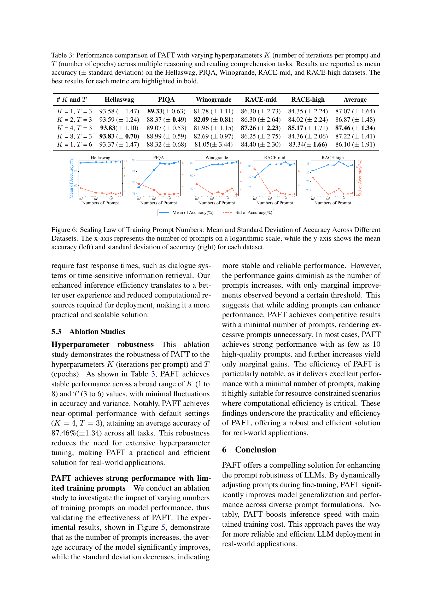

 


 2502.12859 
 Chenxing Wei et el. 
 
 🤗 2025-02-19 
 



↗ arXiv


↗ Hugging Face


### TL;DR



대규모 언어 모델(LLM)은 특정 작업에 대한 성능을 향상시키기 위해 파인튜닝(fine-tuning)이라는 과정을 거칩니다. 그러나 기존의 파인튜닝 방법은 **특정 프롬프트(prompt)에 과적합**되어, 약간의 프롬프트 변화에도 성능이 크게 저하되는 문제점이 있습니다. 이는 LLM의 실제 응용에서 사용자 입력의 변화에 민감하게 반응하여 예측 성능이 떨어지는 문제로 이어집니다.

본 논문에서는 이러한 문제를 해결하기 위해 **PAFT(Prompt-Agnostic Fine-Tuning)**라는 새로운 파인튜닝 기법을 제안합니다. PAFT는 다양한 프롬프트를 생성하고, 파인튜닝 과정에서 이러한 프롬프트들을 무작위로 사용하여 모델이 특정 프롬프트에 과적합되지 않고 **작업의 근본 원리를 학습**하도록 유도합니다. 실험 결과, PAFT를 사용하여 학습된 모델은 다양한 프롬프트, 심지어 이전에 본 적 없는 프롬프트에 대해서도 강건한 성능을 보였으며, 추론 속도 또한 향상되었습니다. 이는 **LLM의 견고성과 일반화 능력을 크게 향상**시키는 중요한 발견입니다.



#### Key Takeaways


 PAFT는 다양한 프롬프트를 사용한 동적 파인튜닝을 통해 프롬프트 변화에 강건한 LLM을 학습시킵니다. 



 PAFT는 기존 방법보다 우수한 강건성과 일반화 성능을 보이며, 동시에 추론 속도를 향상시킵니다. 



 PAFT는 광범위한 실험을 통해 그 효과를 검증하였으며, LLM의 실제 응용 분야에 중요한 시사점을 제공합니다. 


#### Why does it matter?
본 논문은 **프롬프트 변화에 강건한 대규모 언어 모델(LLM)**을 개발하는 데 중요합니다. 기존의 파인튜닝 방법은 특정 프롬프트에 과적합되어 **일반화 성능이 저하**되는 문제가 있습니다. 본 논문에서 제시하는 PAFT 기법은 이러한 문제를 해결하여 **다양한 프롬프트에 대한 견고성 및 일반화 성능을 향상**시키는 효과적인 방법을 제공합니다. 이는 LLM의 실제 응용 분야에서 중요한 발전이며, 향후 연구에 대한 새로운 방향을 제시합니다.

------
#### Visual Insights

> 🔼 그림 1은 프롬프트의 작은 변화가 모델의 정확도에 얼마나 큰 영향을 미치는지 보여줍니다. 두 가지 예시는 동일한 사용자 질문을 보여주지만, 프롬프트가 단어 하나만 다를 뿐 결과가 다릅니다. 첫 번째 프롬프트는 전체 데이터셋에서 86.27%의 정확도를 달성하지만, 두 번째 프롬프트는 66.93%로 크게 떨어집니다. 이는 모델이 프롬프트에 대한 강건성이 부족하면 작은 수정이라도 성능에 큰 변동을 일으킬 수 있음을 보여줍니다.
> 

> 
read the caption

> Figure 1: This figure shows how small changes in prompts can drastically affect the accuracy of a model. Two examples show the same user question, but the prompts differ by only one word, resulting in different answers. The first prompt achieves 86.27% accuracy across the entire dataset, while the second prompt drops significantly to 66.93%. This highlights how even small modifications can lead to large swings in performance if a model lacks prompt robustness.
> 


| Methods | Hellaswag |  |  | PIQA |  |  | Winogrande |  |  | RACE-mid |  |  | RACE-high |  |  | Average |  |  |
|---|---|---|---|---|---|---|---|---|---|---|---|---|---|---|---|---|---|---|
| Metric | Mean | Std | Top | Mean | Std | Top | Mean | Std | Top | Mean | Std | Top | Mean | Std | Top | Mean | Std | Top |
| Base Model | 47.36 | ±9.78 | 0% | 74.68 | ±6.24 | 0% | 45.15 | ±11.78 | 0% | 71.39 | ±7.33 | 0% | 67.62 | ±6.78 | 0% | 61.24 | ±8.38 | 0% |
| user-specified prompt | 92.35 | ±2.78 | 0% | 77.87 | ±2.36 | 0% | 78.16 | ±7.97 | 0% | 79.88 | ±6.32 | 22% | 81.05 | ±4.45 | 4% | 81.86 | ±4.78 | 5% |
| TopAccuracy prompt | 91.27 | ±2.79 | 86% | 75.96 | ±3.89 | 0% | 66.77 | ±3.94 | 0% | 84.81 | ±4.06 | 59% | 82.45 | ±3.26 | 14% | 80.25 | ±3.63 | 32% |
| BATprompt | 90.30 | ±1.79 | 78% | 83.41 | ±1.74 | 16% | 69.01 | ±4.45 | 0% | 83.92 | ±5.38 | 65% | 81.33 | ±4.21 | 12% | 81.56 | ±3.51 | 34% |
| ZOPO prompt | 92.46 | ±2.43 | 86% | 83.52 | ±2.23 | 27% | 74.75 | ±3.81 | 0% | 83.50 | ±5.05 | 51% | 82.36 | ±4.53 | 35% | 83.32 | ±3.61 | 40% |
| PAFT | 93.83 | ±0.70 | 100% | 89.33 | ±0.63 | 100% | 82.09 | ±0.81 | 100% | 87.26 | ±2.23 | 94% | 85.17 | ±1.71 | 73% | 87.57 | ±1.57 | 94% |
| PAFT Improvement | +1.37 | -1.09 | 14% | +5.81 | -1.11 | 73% | +3.93 | -3.00 | 100% | +2.45 | -1.83 | 29% | +2.72 | -1.55 | 38% | +4.25 | -1.94 | 54% |

> 🔼 표 1은 다양한 추론 및 독해 이해 과제에서 여러 가지 미세 조정 방법의 성능을 비교한 것입니다.  LLaMA3-8B 모델(LoRA rank 8 사용)을 기반으로, 테스트 프롬프트 세트에 대한 평균 정확도, 표준 편차, 특정 점수 임계값(Hellaswag는 90%, Winogrande는 80%, 기타 데이터셋은 85%)을 초과하는 테스트 프롬프트의 비율을 보여줍니다.  기준 모델(미세 조정 없음), 사용자 지정 프롬프트(Wei et al., 2024), 최고 정확도 프롬프트(훈련 세트에서 가장 높은 정확도를 보이는 프롬프트 사용), BATprompt(Shi et al., 2024, 가장 강력한 프롬프트 사용), ZOPO(Hu et al., 2024, 최적 프롬프트 사용)를 비교 대상으로 하였습니다. PAFT(제안된 방법)는 모든 과제에서 가장 높은 정확도와 가장 낮은 분산을 달성하여 우수한 성능을 보여줍니다.  마지막 행은 두 번째로 성능이 좋은 방법과 PAFT를 비교하여 보여주며, 'Top' 열은 Hellaswag의 경우 90%, Winogrande의 경우 80%, 기타 데이터셋의 경우 85%의 정확도를 달성한 테스트 프롬프트의 비율을 나타냅니다.
> 

> 
read the caption

> Table 1: Performance comparison of different fine-tuning methods on the test prompt sets across various reasoning and reading comprehension tasks using the LLaMA3-8B Meta (2024) with LoRA rank 8. Results are reported as average accuracy, standard deviation, and percentage of test prompts exceeding a specific score threshold (90% for Hellaswag, 80% for Winogrande, and 85% for other datasets). The Base Model represents the pre-trained model without fine-tuning, user-specified prompt Wei et al. (2024) refers to fine-tuning with LoRA using human-designed prompts, TopAccuracy prompt refers to fine-tuning with LoRA using the prompt exhibiting the highest accuracy on the training set, BATprompt refers to fine-tuning with LoRA using the most robust prompt generated by BATprompt Shi et al. (2024), and ZOPO prompt refers to fine-tuning with LoRA using the optimal prompt selected by ZOPO Hu et al. (2024) from the training prompt set. PAFT (our proposed method) demonstrates superior performance, achieving the highest accuracy and lowest variance across all tasks. The last rows show the comparison of PAFT with the second-best performing method (underlined). The Top column indicates the percentage of test prompts with a correct rate of 90% for Hellaswag, 80% for Winogrande, and 85% for other datasets.
> 

### In-depth insights

#### Prompt Robustness
본 논문은 프롬프트 변화에 대한 강건성(prompt robustness)을 중점적으로 다룹니다. **대규모 언어 모델(LLM)**은 미세 조정 후 다운스트림 작업에 잘 적응하지만, **프롬프트의 작은 변화에도 성능이 크게 저하될 수 있다**는 취약점을 지적합니다. 이는 모델이 특정 프롬프트 형식에 과적합되어 실제 사용 환경에서의 일반화 성능이 떨어지기 때문입니다. 따라서 **다양한 프롬프트를 동적으로 조정하는 프롬프트 불가지론적 미세 조정(PAFT)** 기법을 제안합니다. PAFT는 **다양한 후보 프롬프트 집합을 생성하고, 미세 조정 중에 이를 무작위로 샘플링하여 모델이 특정 프롬프트보다는 작업의 기본 원칙을 학습하도록 유도**합니다. 실험 결과, PAFT는 다양한 프롬프트에서 강력한 강건성과 일반화 성능을 보이며, **미처 본 적 없는 프롬프트에도 성능 저하가 적습니다**. 이는 모델 성능과 추론 속도를 향상시키고, 훈련 효율성도 유지합니다.  **프롬프트 엔지니어링에 대한 의존도를 줄이고, 실제 사용 환경에서의 견고한 성능**을 보장하는 데 PAFT가 효과적임을 보여줍니다.

#### PAFT Framework
본 논문에서 제시된 PAFT(Prompt-Agnostic Fine-Tuning) 프레임워크는 기존의 지도학습 기반 파인튜닝의 한계를 극복하기 위한 **혁신적인 접근 방식**을 제시합니다.  **다양한 프롬프트를 동적으로 활용**하여 모델이 특정 프롬프트 형식에 과적합되는 것을 방지하고, **기본적인 과제 원리**를 학습하도록 유도합니다.  이를 위해 **후보 프롬프트 생성 단계**와 **동적 파인튜닝 단계**의 두 단계로 구성됩니다.  먼저, 다양한 종류의 프롬프트를 생성하고, 파인튜닝 과정에서 이들을 무작위로 선택하여 모델을 훈련시킴으로써 **강건성과 일반화 성능**을 향상시킵니다.  **실험 결과**는 PAFT가 다양한 프롬프트에 대한 강건성을 높이고, 기존 방법들보다 성능과 추론 속도를 향상시키는 것을 보여줍니다.  **핵심은 프롬프트의 다양성 확보**를 통해 모델의 **과적합 방지**와 **일반화 성능 향상**에 있습니다.  따라서 PAFT는 실제 응용 환경에서 프롬프트 변화에 강인한 LLM 개발에 중요한 기여를 할 것으로 기대됩니다.

#### Dynamic Tuning
본 논문에서 제시된 '동적 미세 조정(Dynamic Tuning)'은 기존의 정적 미세 조정 방식의 한계를 극복하기 위한 혁신적인 방법입니다. **다양한 프롬프트를 동적으로 활용하여 모델 학습**을 진행함으로써 특정 프롬프트 형식에 대한 과적합을 방지하고, 다양한 프롬프트에 대한 **강력한 견고성과 일반화 능력**을 확보합니다. 이는 **실제 사용 환경에서 다양한 사용자 입력에 대해서도 일관된 성능**을 유지하는 데 중요한 역할을 합니다.  **랜덤하게 프롬프트를 선택하는 전략**은 모델이 다양한 프롬프트 포뮬레이션에 노출될 수 있도록 하여, **기저 작업 원리를 학습**하도록 유도합니다. 단순히 특정 프롬프트 패턴에 과적합하는 것을 막아, **모델의 견고성을 크게 향상**시키는 핵심 요소입니다.  **동적 프롬프트 샘플링 전략**은 훈련 효율성을 유지하면서 모델의 강건성과 일반화 성능을 향상시키는 데 효과적입니다.  이는 **실제 환경에서의 프롬프트 변화에 대한 유연성**을 높여주는 중요한 기술적 진보로 평가될 수 있습니다.

#### Ablation Studies
본 논문의 "절제 연구(Ablation Studies)" 부분은 **PAFT 모델의 핵심 구성 요소들의 기여도를 체계적으로 분석**하기 위해 다양한 실험을 설계하고 수행한 결과를 제시합니다.  특히, 동적 미세 조정 과정에서의 프롬프트 샘플링 전략, 프롬프트 후보군 생성 방법, 그리고 미세 조정 과정에서의 하이퍼파라미터 설정 등이 모델 성능에 미치는 영향을 정밀하게 분석합니다.  **각 구성요소의 중요성을 정량적으로 밝히고, PAFT 모델의 성능 향상에 대한 기여도를 명확히 함**으로써, 모델의 설계 및 개선 방향에 대한 귀중한 통찰력을 제공합니다.  **절제 연구를 통해 PAFT의 강건성과 일반화 성능을 뒷받침하는 주요 요인을 명확히 제시**함으로써, 제안된 방법의 신뢰성을 더욱 높이고, 실제 응용 환경에서의 효용성을 강조합니다.  결론적으로, 이 부분은 PAFT 모델의 설계 원리를 심층적으로 이해하고, 향후 연구 방향을 제시하는데 중요한 역할을 수행합니다.

#### Future Work
본 논문은 프롬프트 변화에 강건한 대형 언어 모델(LLM)을 위한 프롬프트 애그노스틱 파인튜닝(PAFT) 기법을 제시하지만, **향후 연구를 위한 몇 가지 중요한 방향**이 있습니다.  **동적 프롬프트 선택 전략**을 개선하여 커리큘럼 학습이나 중요도 샘플링과 같은 더욱 효율적이고 효과적인 방법을 모색해야 합니다.  또한, **적대적 학습**을 통합하여 모델의 강건성을 더욱 높일 수 있는지,  그리고 **적대적 프롬프트 생성 전략** 및 모델 안정화 기법에 대한 연구도 필요합니다.  **다양한 적대적 프롬프트 생성 전략**과 이들의 모델 강건성에 대한 영향을 조사하여 PAFT의 실용성 및 일반화 성능을 더욱 향상시키는 것이 중요합니다. 마지막으로, **다양한 LLM 아키텍처 및 하류 작업**에 대한 PAFT의 적용성을 탐구하여 이 기법의 범용성을 입증하는 연구가 필요합니다.

### More visual insights

More on figures

> 🔼 그림 2는 기존의 지도학습 미세조정(SFT)과 제안된 프롬프트 불변 미세조정(PAFT) 방법을 비교하여 주요 차이점을 보여줍니다. SFT는 고정된 데이터셋과 미리 정의된 프롬프트에 의존하기 때문에 다양한 프롬프트에 대한 강건성과 일반화 성능이 제한적입니다. 반면 PAFT는 훈련 중에 프롬프트를 동적으로 선택하여 다양한 프롬프트에 대한 강건성과 일반화 성능을 향상시킵니다.  상용 LLM을 활용하여 후보 프롬프트를 생성함으로써 PAFT는 보다 일반적이고 확장 가능한 솔루션을 제공합니다.  즉, PAFT는 다양한 프롬프트에 대한 모델의 적응력을 높여, 특정 프롬프트에 과적합되는 것을 방지하고 일반화 성능을 향상시키는 방법입니다.
> 

> 
read the caption

> Figure 2: An overview of PAFT: This figure compares Traditional Supervised Fine-tuning (SFT) and Prompt-Agnostic Fine-Tuning (PAFT), highlighting their main differences. SFT relies on a fixed dataset and predefined prompts, which limits its robustness and generalization to different prompts. In contrast, PAFT dynamically selects prompts during training, which improves robustness and generalization to a wide range of prompts. By leveraging a commercial LLM to generate candidate prompts, PAFT provides a more general and scalable solution.
> 

> 🔼 본 그림은 네 가지 데이터셋에서 기본 모델과 SFT(Supervised Fine-Tuning) 모델의 정확도를 450개 이상의 다양한 프롬프트에 대해 평가한 예비 실험 결과를 보여줍니다.  각 모델의 정확도 분포를 확률 분포 플롯으로 나타냅니다. SFT 모델이 기본 모델보다 전반적인 정확도는 향상되었지만, 일부 프롬프트에서는 정확도가 여전히 낮고 표준 편차가 높아 프롬프트에 따라 정확도 차이가 매우 크다는 것을 보여줍니다.  이를 통해 프롬프트 디자인의 영향과 모델 미세 조정을 통한 추가 최적화의 필요성을 강조합니다.
> 

> 
read the caption

> Figure 3: This figure presents the results of preliminary experiments conducted on four datasets to evaluate the accuracy of the base model and the SFT model across over 450 diverse prompts. The probability distribution plots illustrate the distribution of accuracy for models. The results show that while the SFT model has an overall improvement in accuracy compared to the base model, the accuracy of some prompts is still relatively low, and the standard deviation of the SFT model is high, indicating that the accuracy varies greatly between different prompts, which highlights the impact of prompt design and the need for further optimization through model fine-tuning.
> 

> 🔼 그림 4는 기본 모델, SFT 모델, 그리고 PAFT 모델의 성능을 여러 추론 및 독해 이해 과제에서 비교한 것입니다. 그림 3과 시각적으로 비교하여 PAFT의 효과를 보여줍니다. PAFT 학습 중에 사용되지 않은 테스트 프롬프트에 대한 다양한 모델의 정확도 분포를 확률 분포 플롯이 보여줍니다. PAFT 모델은 기본 모델과 SFT 모델에 비해 모든 과제에서 더 높은 정확도와 더 낮은 분산을 달성하여 우수한 성능을 보여줍니다.
> 

> 
read the caption

> Figure 4: The performance of the base model, the SFT model, and the PAFT model is compared on multiple reasoning and reading comprehension tasks. This is a visual comparison to Figure 3 to illustrate the effectiveness of PAFT, where the probability distribution plots show the distribution of accuracy of different models on the test prompts that were not used during PAFT training. The PAFT model shows superior performance compared to the base model and the SFT model, achieving higher accuracy and lower variance in all tasks.
> 

> 🔼 그림 5는 다양한 추론 및 독해 이해 과제에서 TopAccuracy, 사용자 지정, BATprompt, ZOPO 및 PAFT 모델의 성능을 비교한 것입니다. 결과는 정답 분포로 제시됩니다. 테스트는 학습에 사용되지 않은 50개의 새로운 프롬프트 테스트 세트에서 수행되었습니다. PAFT 모델은 다른 기준 모델보다 우수한 성능을 보여주었고, 모든 과제에서 더 높은 정확도와 더 낮은 분산을 달성했습니다.  즉, PAFT 모델은 다양한 프롬프트에 대해 더욱 강력하고 일반화된 성능을 보여주는 것을 의미합니다.
> 

> 
read the caption

> Figure 5: The performance of TopAccuracy, User-specified, BATprompt, ZOPO, and PAFT models is compared on multiple reasoning and reading comprehension tasks. Results are reported in terms of their correct distribution. The tests are conducted on a test set of 50 unseen prompts, different from the ones used in training. The PAFT model shows superior performance compared to other baselines, achieving higher accuracy and lower variance in all tasks.
> 

> 🔼 그림 6은 다양한 데이터셋에 걸쳐 훈련 프롬프트 수의 스케일링 법칙: 평균 정확도 및 표준 편차를 보여줍니다. X축은 로그 스케일의 프롬프트 수를 나타내고, Y축은 각 데이터셋에 대한 평균 정확도(왼쪽)와 정확도의 표준 편차(오른쪽)를 나타냅니다. 이 그래프는 사용된 프롬프트의 수가 증가함에 따라 모델 성능이 어떻게 변하는지 보여주는 통계적 분석 결과를 시각적으로 표현합니다. 즉, 프롬프트 개수가 많아질수록 평균 정확도는 높아지지만, 일정 수준을 넘어서면 그 효과는 감소합니다. 또한 표준편차는 프롬프트의 수가 증가함에 따라 감소하는 경향을 보입니다. 이는 다양한 프롬프트를 사용하여 모델의 견고성과 일반화 성능을 향상시킬 수 있음을 시사합니다.
> 

> 
read the caption

> Figure 6: Scaling Law of Training Prompt Numbers: Mean and Standard Deviation of Accuracy Across Different Datasets. The x-axis represents the number of prompts on a logarithmic scale, while the y-axis shows the mean accuracy (left) and standard deviation of accuracy (right) for each dataset.
> 

More on tables


| Inference time/h | Hellaswag | PIQA | Winogrande | RACE | Average |
|---|---|---|---|---|---| 
| Base Model | 3.97 | 1.35 | 1.72 | 6.24 | 3.32 |
| user-specified prompt | 6.52 | 0.98 | 3.27 | 8.23 | 4.75 |
| TopAccuracy prompt | 5.75 | 1.13 | 2.76 | 7.56 | 4.30 |
| BATprompt | 4.57 | 1.57 | 3.14 | 7.98 | 4.32 |
| ZOPO prompt | 5.12 | 0.87 | 3.23 | 8.28 | 4.38 |
| **PAFT** | **1.19** | **0.39** | **0.45** | **2.08** | **1.02** |
| PAFT Improvement | $\times$3.3 | $\times$2.23 | $\times$3.82 | $\times$3.00 | $\times$3.25 |
> 🔼 표 2는 다양한 미세 조정 방법에 대한 추론 시간(시간)을 비교한 표입니다. 기준 모델은 미세 조정 없이 사전 훈련된 모델을 나타내며, 다른 행은 서로 다른 프롬프트를 사용하여 LoRA로 미세 조정된 모델의 추론 시간을 보여줍니다. PAFT는 다른 방법보다 더 나은 추론 효율성을 보여줍니다. 마지막 행은 PAFT 개선의 배수를 보여줍니다. 즉, 이 표는 다양한 미세 조정 기법을 사용하여 동일한 작업에 대해 모델 추론 시간을 비교 분석하여 PAFT의 추론 속도 향상 효과를 명확히 보여줍니다.
> 

> 
read the caption

> Table 2: Comparison of inference time (in hours) for different fine-tuning methods. The base model represents the pre-trained model without fine-tuning, while the other rows show the inference time of models fine-tuned with LoRA using different prompts. PAFT shows better inference efficiency than other methods. The last line shows the multiple of PAFT improvement.
> 


| # K and T | Hellaswag | PIQA | Winogrande | RACE-mid | RACE-high | Average |
|---|---|---|---|---|---|---|
| K = 1, T = 3 | 93.58 (± 1.47) | 89.33 (± 0.63) | 81.78 (± 1.11) | 86.30 (± 2.73) | 84.35 (± 2.24) | 87.07 (± 1.64) |
| K = 2, T = 3 | 93.59 (± 1.24) | 88.37 (± 0.49) | 82.09 (± 0.81) | 86.30 (± 2.64) | 84.02 (± 2.24) | 86.87 (± 1.48) |
| K = 4, T = 3 | 93.83 (± 1.10) | 89.07 (± 0.53) | 81.96 (± 1.15) | 87.26 (± 2.23) | 85.17 (± 1.71) | 87.46 (± 1.34) |
| K = 8, T = 3 | 93.83 (± 0.70) | 88.99 (± 0.59) | 82.69 (± 0.97) | 86.25 (± 2.75) | 84.36 (± 2.06) | 87.22 (± 1.41) |
| K = 1, T = 6 | 93.37 (± 1.47) | 88.32 (± 0.68) | 81.05 (± 3.44) | 84.40 (± 2.30) | 83.34 (± 1.66) | 86.10 (± 1.91) |
> 🔼 이 표는 PAFT 모델의 하이퍼파라미터 K(프롬프트당 반복 횟수)와 T(에포크 수)를 다르게 하여 여러 추론 및 독해 이해 과제에서 성능을 비교한 결과를 보여줍니다.  Hellaswag, PIQA, Winogrande, RACE-mid, RACE-high 데이터셋에서 평균 정확도(표준 편차 포함)를 제시하며, 각 지표에 대한 최고 성능은 굵은 글씨로 강조 표시되어 있습니다.  다양한 하이퍼파라미터 설정에 따른 모델 성능의 안정성과 최적 하이퍼파라미터 값을 확인하는 데 도움이 됩니다.
> 

> 
read the caption

> Table 3: Performance comparison of PAFT with varying hyperparameters K𝐾Kitalic_K (number of iterations per prompt) and T𝑇Titalic_T (number of epochs) across multiple reasoning and reading comprehension tasks. Results are reported as mean accuracy (±plus-or-minus\pm± standard deviation) on the Hellaswag, PIQA, Winogrande, RACE-mid, and RACE-high datasets. The best results for each metric are highlighted in bold.
> 


| Number of samples | train dataset | validation dataset | test dataset |
|---|---|---|---| 
| Hellaswag | 39900 | 10000 | 10000 |
| PIQA | 16000 | 2000 | 3000 |
| Winogrande | 40398 | 1267 | 1767 |
| RACE | 87866 | 4887 | 4934 |
> 🔼 표 4는 다양한 데이터셋(Hellaswag, PIQA, Winogrande, RACE)에 대한 학습, 검증 및 테스트 데이터셋의 샘플 수를 보여줍니다. 각 데이터셋에 대해 학습 데이터의 샘플 수, 검증 데이터의 샘플 수, 테스트 데이터의 샘플 수가 명시되어 있습니다. 이 표는 실험 설정 부분에서 사용된 데이터셋의 크기를 보여주어 논문의 실험 결과를 이해하는 데 도움이 됩니다.
> 

> 
read the caption

> Table 4: Number of samples in the train, validation, and test datasets for various dateset.
> 


| Methods | LoRA Target | Max Length | SFT Samples | LR | Training Prompts | Epoch |
|---|---|---|---|---|---|---|
| LoRA | q & v Proj | 1024 | 20000 | 0.0001 | 1 | 3 |
| PAFT | q & v Proj | 1024 | 20000 | 0.0001 | 400 | 3 |
> 🔼 표 5는 본 논문의 실험에서 사용된 다양한 방법들에 대한 세부 실험 파라미터들을 보여줍니다.  표에는 LoRA의 대상 모듈(Lora Target), 최대 시퀀스 길이(Max Length), 지도 학습 미세 조정을 위한 샘플 수(SFT Samples), 학습률(LR), 훈련 프롬프트 수(Training Prompts) 등이 포함되어 있습니다.  Epoch는 훈련 에포크 수를 나타냅니다. 표에 나열되지 않은 다른 파라미터들은 모든 실험에서 일관되게 유지되었습니다. 이 표는 다양한 실험 설정에서 사용된 하이퍼파라미터들을 명확하게 제시하여 실험 결과의 재현성과 신뢰도를 높이는 데 기여합니다.
> 

> 
read the caption

> Table 5: Detailed experimental parameters. This table lists the specific parameters we used in the experiments for various methods. These parameters include the target module of LoRA (Lora Target), the maximum sequence length (Max Length), the number of samples for supervised fine-tuning (SFT Samples), the learning rate (LR), the number of training prompts (Training Prompts). Epoch(Epoch) represents the epoch of training. All other parameters not listed here remain consistent across all experiments.
> 


| Training time/h | Hellaswag | PIQA | Winogrande | RACE | Average |
|---|---|---|---|---|---| 
| LoRA + user-specified prompt | 3.01 | 2.35 | 3.27 | 3.95 | 3.15 |
| LoRA + TopAccuracy prompt | 3.00 | 2.29 | 2.98 | 3.93 | 3.05 |
| LoRA + BATprompt | 3.02 | 2.23 | 3 | 3.93 | 3.05 |
| LoRA + ZOPO prompt | 2.97 | 2.3 | 2.97 | 3.83 | 3.02 |
| PAFT | 2.98 | 2.32 | 3.38 | 3.81 | 3.12 |
> 🔼 표 6은 LLaMA3-8B(Meta, 2024) 모델과 LoRA Rank 8을 사용하여 다양한 추론 및 독해 이해 과제에 대한 테스트 프롬프트 집합에서 여러 미세 조정 방법의 훈련 시간을 비교한 것입니다. NVIDIA RTX 4090 GPU에서 실험을 수행했으며 결과는 시간(시간)으로 보고됩니다. LoRA + TopAccuracy 프롬프트는 훈련 세트에서 가장 높은 정확도를 가진 프롬프트를 나타내며, LoRA + 사용자 지정 프롬프트(Wei et al., 2024)는 사람이 디자인한 프롬프트를 사용한 미세 조정을 나타내고, LoRA + BATprompt(Shi et al., 2024)는 BATprompt로 생성된 가장 강력한 프롬프트를 사용하며, LoRA + ZOPO 프롬프트(Hu et al., 2024)는 ZOPO가 훈련 프롬프트 세트에서 선택한 최적의 프롬프트를 사용합니다.
> 

> 
read the caption

> Table 6: Training Time Comparison of Different Fine-tuning Methods on the Test Prompt Sets Across Various Reasoning and Reading Comprehension Tasks Using the LLaMA3-8BMeta (2024) Model with LoRA Rank 8. Experiments were conducted on an NVIDIA RTX 4090 GPU. Results are reported as training time in hours. LoRA + TopAccuracy prompt  prompt refers to the prompt with the highest accuracy in the training set, LoRA + user-specified prompt Wei et al. (2024) refers to fine-tuning with human-designed prompts, LoRA + BATprompt Shi et al. (2024) uses the most robust prompt generated by BATprompt, and LoRA + ZOPO prompt Hu et al. (2024) employs the optimal prompt selected by ZOPO from the training prompt set.
> 


| Tokens | Hellaswag | PIQA | Winogrande | RACE | Average |
|---|---|---|---|---|---| 
| Total Tokens | 11.7k | 12.1k | 10.9k | 12.3k | 11.75k |
> 🔼 표 7은 후보 프롬프트 생성을 위해 사용된 토큰 수를 보여줍니다. 이 표는 각 과제에 대해 약 400개의 후보 프롬프트를 생성하는 데 사용된 토큰의 수를 보여줍니다. 평균 토큰 사용량은 11.75k입니다. 생성된 프롬프트의 수는 비용을 관리하기 위해 그림 5에서 관찰된 스케일링 법칙에 따라 조정될 수 있습니다. 즉, 그림 5의 결과를 바탕으로 생성할 프롬프트의 수를 조절하여 비용을 효율적으로 관리할 수 있다는 의미입니다.
> 

> 
read the caption

> Table 7: Token Usage for Candidate Prompt Generation. This table shows the number of tokens used to generate approximately 400 candidate prompts for each task. The average token usage is 11.75k. The number of generated prompts can be adjusted based on the scaling law observed in Figure 5 to control costs.
> 

### Full paper



