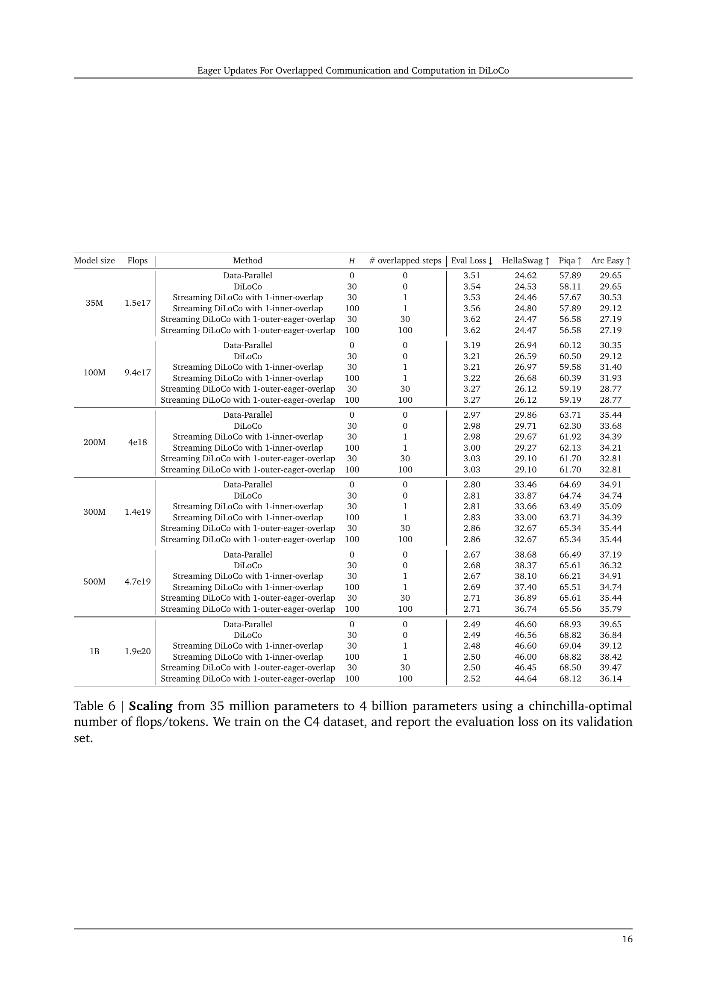

 


 2502.12996 
 Satyen Kale et el. 
 
 🤗 2025-02-19 
 



↗ arXiv


↗ Hugging Face


### TL;DR



대규모 언어 모델 학습은 막대한 양의 데이터와 연산을 필요로 하므로 분산 학습이 필수적입니다. 기존의 분산 학습 방법들은 통신에 많은 시간이 소요되는 문제점을 가지고 있었는데, 특히 데이터 센터 간의 저대역폭 통신 환경에서는 이 문제가 더욱 심각해집니다. 이로 인해 컴퓨팅 자원이 놀고 있는 시간이 많아져 효율성이 떨어집니다.

본 논문에서는 통신 지연 문제를 해결하기 위해 **통신과 연산을 중첩**하는 새로운 기법인 '열성 업데이트'를 제안합니다. 이 기법은 각 작업자가 지역적으로 계산한 최신 경사도를 먼저 사용하고, 이후 다른 작업자들과의 통신을 통해 최종 경사도를 업데이트하는 방식입니다.  **실험 결과, 열성 업데이트는 기존 방법과 비슷한 수준의 정확도를 달성하면서도 통신 시간을 획기적으로 줄여 컴퓨팅 효율을 높였음을 보였습니다.**



#### Key Takeaways


 열성 업데이트 기법을 통해 분산 학습 시 통신과 연산을 효과적으로 중첩하여 저대역폭 환경에서도 성능 저하 없이 학습 가능 



 기존 DiLoCo와 비교하여 경쟁력 있는 성능을 제공하며, 특히 저대역폭 환경에서 효율성이 뛰어남 



 본 연구는 대규모 언어 모델 학습의 효율성을 향상시키는 새로운 분산 학습 방식을 제시함으로써, 관련 분야 연구에 중요한 기여 


#### Why does it matter?
본 논문은 **대규모 언어 모델 학습의 병목 현상인 통신 지연 문제를 해결하기 위한 효과적인 방법**을 제시합니다.  **데이터 병렬 학습의 한계를 극복**하고, **저대역폭 환경에서도 경쟁력 있는 성능**을 제공하는 새롭고 효율적인 분산 학습 기법을 제안하여, **향후 분산 학습 및 대규모 모델 연구에 큰 영향**을 미칠 것으로 예상됩니다.  특히, **통신과 연산의 중첩을 통해 효율성을 극대화**하는 접근 방식은 관련 분야 연구에 새로운 가능성을 열어줍니다.

------
#### Visual Insights

> 🔼 그림 1은 DiLoCo의 데이터 흐름과 연산 과정을 보여줍니다. 4개의 작업자가 병렬로 실행되고, 순차적으로 계산(외부 및 내부 최적화 단계)과 통신(작업자 간 외부 기울기 평균화)을 번갈아 수행하는 방식을 나타냅니다. 외부 최적화 단계에서 작업자들은 독립적으로 여러 최적화 단계를 수행하고, 그 후 외부 최적화 단계에서 업데이트를 동기화합니다. 이 과정은 표준 데이터 병렬 학습보다 훨씬 적은 통신을 필요로 하지만, 작업자가 데이터 센터인 환경에서는 각 외부 최적화 단계에서 필요한 차단으로 인해 상당한 속도 저하가 발생할 수 있습니다. 그림에서는 내부 최적화 단계에서 작업자들이 독립적으로 최적화를 수행하고, 외부 최적화 단계에서 업데이트를 주고받는 과정을 시각적으로 보여줍니다.
> 

> 
read the caption

> Figure 1: Data flow and operations in standard DiLoCo. Here, 4 workers execute in parallel and alternate sequentially computation (the outer and inner optimization steps) and communication (averaging outer gradients across workers).
> 


| Method | Token Budget | Hours spent w/+∞ Gbits/s | Hours spent w/ 1 Gbits/s | Terabytes exchanged | Eval Loss ↓ | HellaSwag ↑ | Piqa ↑ | Arc Easy ↑ |
|---|---|---|---|---|---|---|---|---|
| Data-Parallel | 25B | 0.67 | 109 | 441 | 2.67 | **42.09** | 67.35 | **40.42** |
|  | 100B | 2.7 | 438 | 1,767 | 2.52 | 49.78 | 69.15 | **44.03** |
|  | 250B | 6.75 | 1097 | 4,418 | **2.45** | 53.86 | 70.45 | **44.21** |
| Streaming DiLoCo with 1-inner-step overlap | 25B | 0.67 | 0.88 | 1.10 | **2.66** | 42.08 | **67.46** | 38.42 |
|  | 100B | 2.7 | 3.5 | 4.42 | **2.51** | **49.98** | **69.96** | **44.03** |
|  | 250B | 6.75 | 8.75 | 11.05 | **2.45** | **54.24** | **71.38** | 41.92 |
| Streaming DiLoCo with 1-outer-step overlap | 25B | 0.67 | 0.67 | 1.10 | 2.69 | 40.51 | 66.87 | 39.12 |
|  | 100B | 2.7 | 2.7 | 4.42 | 2.53 | 49.48 | 68.82 | 41.05 |
|  | 250B | 6.75 | 6.75 | 11.05 | 2.46 | 53.30 | 69.00 | 41.93 |

> 🔼 본 표는 10억개의 파라미터를 가진 모델을 Dolma 데이터셋으로 과적합 훈련시킨 결과를 보여줍니다.  데이터 병렬 처리 방식과 제안된 방법을 비교하여, 제안된 방법이 총 통신량을 400배 줄이고 최대 대역폭을 8배 줄이면서도 약간 더 나은 성능을 보임을 보여줍니다.  특히, 통신 지연 허용 범위가 내부 최적화 단계 전체 시간만큼 늘어났음에도 불구하고 성능 저하 없이 효율적인 훈련이 가능함을 시사합니다.
> 

> 
read the caption

> Table 1: Overtraining Data-Parallel and our method on Dolma with a 1 billion parameters model. The latter performs slightly better despite exchanging in total 400×400\times400 × fewer bits, reducing the peak bandwidth by 8×8\times8 ×, and with a significantly relaxed training communication latency constraint: allowing communication to be as long as a full inner optimization phase.
> 

### In-depth insights

#### Eager Updates' Impact
본 논문에서 제안하는 'Eager Updates' 기법은 분산 학습 환경에서 통신과 연산을 중첩시켜 효율성을 높이는 데 중점을 둡니다. 기존 DiLoCo 방식의 단점인 통신 지연으로 인한 계산 자원 낭비 문제를 해결하기 위해, **외부 기울기(outer gradient)의 전체적인 합산을 기다리지 않고, 각 노드에서 계산된 외부 기울기의 일부를 먼저 사용**하는 전략을 취합니다. 이를 통해 통신 지연 시간 동안에도 연산을 지속적으로 수행할 수 있게 되어, **전반적인 처리 시간 단축과 컴퓨팅 자원 활용도 향상**을 가져옵니다. 특히, 저대역폭 네트워크 환경에서 그 효과가 두드러지게 나타나며, **표준 DiLoCo와 비교하여 경쟁력 있는 성능**을 제공하는 것으로 실험 결과를 통해 확인되었습니다.  그러나, 단순히 외부 기울기를 조기에 적용하는 것만으로는 오히려 수렴 속도가 저하될 수 있다는 점을 고려하여, **현재 로컬 외부 기울기와 이전 외부 기울기를 적절히 조합**하는 방식을 채택하여 이러한 문제를 완화했습니다.  이러한 'Eager Updates'의 긍정적 효과는 대규모 언어 모델 학습과 같은 고성능 컴퓨팅 환경에서 더욱 크게 나타나며,  **향후 분산 학습 분야의 발전에 중요한 기여**를 할 것으로 기대됩니다.

#### Delayed Gradient
지연된 그래디언트 개념은 분산 학습 환경에서 통신 지연을 완화하기 위한 효과적인 전략입니다. **주요 아이디어는 각 워커가 지역적으로 그래디언트를 계산하고 업데이트를 수행한 후, 일정 시간이 지난 후에야 전역 그래디언트를 합쳐 업데이트하는 것입니다.** 이를 통해 통신에 소요되는 시간과 대기 시간을 다른 계산 작업과 겹쳐서 줄일 수 있습니다.  **하지만, 단순히 그래디언트 업데이트를 지연시키면 수렴 속도가 저하될 수 있으므로, 지연된 그래디언트를 효과적으로 활용하기 위해서는 그래디언트를 어떻게 효율적으로 병합하고, 지연 시간을 최소화하는 것이 중요합니다.**  본 논문에서 제시된 '열정적인 업데이트' 전략은 이러한 문제에 대한 해결책을 제시합니다.  **열정적인 업데이트는 지역 그래디언트를 먼저 사용하여 빠르게 업데이트를 수행하고, 그 후에 전역 그래디언트를 사용하여 업데이트를 보정하는 방식입니다.**  이를 통해 수렴 속도 저하를 최소화하면서 통신 지연을 줄이는 효과를 얻을 수 있습니다.  **결론적으로 지연된 그래디언트 전략은 분산 학습 시스템의 성능을 향상시키기 위한 중요한 요소이며, 그 효과적인 활용을 위한 전략 개발 및 최적화가 필요합니다.**

#### DiLoCo's Enhancements
본 논문은 DiLoCo라는 분산 학습 방법의 효율성을 높이는 방안을 제시합니다. **DiLoCo는 대규모 언어 모델을 효과적으로 학습하는 데 사용되는 기법으로, 계산과 통신을 분리하여 처리**합니다. 기존 DiLoCo는 통신 단계에서 병목 현상이 발생할 수 있는데, 이 논문에서는 **계산과 통신을 중첩(overlap)시키는 기법을 통해 이러한 병목 현상을 완화**합니다.  특히, **'eager updates'라는 새로운 방법을 제안**, 기존 방법보다 성능이 우수함을 보여줍니다.  **저대역폭 환경에서도 DiLoCo의 성능을 유지하면서, 계산 자원 활용도를 높이는 데 기여**합니다.  **지연된 외부 기울기(delayed outer gradients)**를 사용하는 접근 방식 또한 제시하며, 다양한 실험 결과를 통해 eager updates의 효과를 입증합니다.  결론적으로, 이 연구는 DiLoCo의 성능 향상과 함께, 분산 학습 시스템의 효율적인 설계에 대한 심도 있는 통찰력을 제공합니다.  **대규모 모델 학습의 어려움을 해결하고, 실제 환경에서의 적용 가능성을 높였다는 점에서 중요한 의의**를 지닙니다.

#### Communication
본 논문에서 'Communication'이라는 제목으로 다뤄지는 부분은 분산 학습 환경에서의 통신 오버헤드를 줄이기 위한 효율적인 전략에 초점을 맞추고 있습니다. 특히, **대규모 언어 모델 학습 시 발생하는 통신 병목 현상을 완화하기 위해 통신과 연산을 중첩(overlap)하는 기법**을 제시하고 있습니다. 이를 위해, **기존 DiLoCo 알고리즘을 개선하여 외부 기울기(outer gradient)의 통신을 다음 내부 최적화 단계(inner optimization phase)와 병렬로 처리**하는 방법을 제안합니다.  **단순히 통신을 지연시키는 방식이 아닌, 각 노드에서 계산된 외부 기울기를 즉시 사용하고, 나중에 도착하는 다른 노드의 외부 기울기로 업데이트**하는 'eager update' 전략을 통해 성능 저하 없이 높은 컴퓨팅 활용도를 달성하는 것을 보여줍니다.  **낮은 대역폭 환경에서도 DiLoCo와 경쟁력 있는 성능**을 제공하며, 다양한 모델 크기와 대역폭 조건에서의 실험 결과를 통해 이 기법의 효율성을 입증합니다.  **결론적으로, 본 논문의 'Communication' 파트는 단순한 통신 최적화를 넘어, 분산 학습의 효율성을 극대화하기 위한 통신과 연산의 효과적인 중첩 전략을 제시**하고 있으며, 대규모 모델 학습의 실질적인 문제 해결에 기여할 수 있는 중요한 연구입니다.

#### Overtraining Analysis
본 논문에서는 과적합 분석에 대한 명확한 제목을 제시하지 않았지만, **대규모 언어 모델의 훈련에 있어 과적합 현상을 다루는 부분이 존재**합니다. 특히,  **토큰 수를 늘려 과적합을 유발하는 실험**을 통해 표준 DiLoCo와 제안된 eager update 방법의 성능을 비교 분석합니다.  **고용량 토큰 환경에서 eager update 기법이 DiLoCo보다 성능 저하가 덜하며, 대역폭 효율성 측면에서도 우수함**을 보여줍니다.  이는 **통신과 연산의 중첩을 통해 연산 자원 활용도를 높인 결과**로 해석될 수 있습니다.  즉,  **제한된 대역폭 환경에서도 효율적인 훈련이 가능**함을 시사합니다.  **과적합을 막기 위한 다른 기술들과의 비교 분석이 부족**한 점은 아쉽지만, 제안된 방법의 효율성과 대규모 모델 훈련에 대한 실질적인 도움을 제시했다는 점에서 의미가 있습니다.  **추가적인 과적합 방지 기술과의 결합 및 다양한 모델 크기와 데이터셋에 대한 추가적인 실험**이 향후 연구 과제로 제시될 수 있습니다.

### More visual insights

More on figures

> 🔼 그림 2는 지연된 외부 기울기(delayed outer gradients)를 사용하는 DiLoCo의 데이터 흐름과 연산을 보여줍니다. 4개의 작업자는 서로 병렬로, 그리고 외부 기울기의 평균화에 필요한 통신과도 병렬로 최적화 단계를 실행합니다. 이는 외부 최적화기에서 평균화된 외부 기울기의 적용을 지연시킴으로써 달성됩니다.  좀 더 자세히 설명하면, 각 작업자는 독립적으로 내부 최적화 단계를 수행하고, 그 결과를 외부 기울기로 집계합니다.  하지만 이 외부 기울기는 바로 적용되지 않고, 다음 내부 최적화 단계가 시작되기 전까지 지연됩니다. 이러한 지연은 통신과 계산이 겹치도록 하여 전체 처리 시간을 단축하는 효과를 가져옵니다.
> 

> 
read the caption

> Figure 2: Data flow and operations in DiLoCo with delayed outer gradients. Here, 4 workers execute optimization steps in parallel with each other, as well as with the communication required for averaging outer gradients. This is accomplished by delaying the application of the averaged outer gradient in the outer optimizer.
> 

> 🔼 그림 3(a)는 10억개의 파라미터를 가진 언어 모델에 대한 다양한 대역폭에서의 DiLoCo 계열의 알고리즘과 데이터 병렬 학습의 연산량 사용률을 시뮬레이션한 결과를 보여줍니다.  각 알고리즘은 다양한 대역폭에서 얼마나 많은 시간을 계산에 할애하고 얼마나 많은 시간을 통신에 소비하는지 보여줍니다. 이를 통해 저대역폭 환경에서도 효율적인 연산량을 유지하기 위한 DiLoCo 알고리즘 최적화의 효과를 시각적으로 확인할 수 있습니다.
> 

> 
read the caption

> (a) 1B parameters model.
> 

> 🔼 그림 (b)는 100억 개의 매개변수를 가진 모델에 대한 다양한 대역폭에서의 DiLoCo 계열 알고리즘의 계산 활용도를 시뮬레이션한 결과를 보여줍니다. DiLoCo 알고리즘은 통신과 계산을 중첩하여 대역폭이 낮은 환경에서도 높은 계산 효율을 달성하는 것을 목표로 합니다. 이 그림은 여러 DiLoCo 변형(표준 DiLoCo, 1-내부 단계 중첩, 1-외부 단계 중첩)과 데이터 병렬 방식을 비교하여 다양한 대역폭에서 각 알고리즘의 계산 시간 대비 통신 시간 비율을 보여줍니다. 이를 통해 DiLoCo의 중첩 기법이 제한된 대역폭 환경에서도 효과적임을 시각적으로 보여줍니다.
> 

> 
read the caption

> (b) 10B parameters model
> 

> 🔼 그림 3(c)는 1000억 개의 파라미터를 가진 모델에 대한 다양한 대역폭에서의 DiLoCo 계열의 분산 학습 방법들의 계산 자원 활용도를 시뮬레이션한 결과를 보여줍니다.  x축은 WAN 대역폭(Gbit/s)을 나타내고, y축은 계산 자원 활용도(0.0~1.0)를 나타냅니다. 0.8의 계산 자원 활용도는 전체 시간의 80%를 계산에, 20%를 통신에 사용함을 의미합니다. 데이터 병렬 방식(Data-Parallel)은 매우 높은 대역폭을 필요로 하는 반면, 제안된 방법은 1~5 Gbit/s의 비교적 낮은 대역폭에서도 95%에 가까운 높은 계산 자원 활용도를 달성함을 보여줍니다.  다양한 DiLoCo 변형(Streaming DiLoCo, 1-inner-step overlapped, 1-outer-step overlapped) 들의 성능을 비교 분석하여  제안된 방법의 효율성을 강조합니다.
> 

> 
read the caption

> (c) 100B parameters model
> 

> 🔼 그림 3은 다양한 대역폭에서 시뮬레이션된 컴퓨팅 활용도를 보여줍니다. 컴퓨팅 활용도 0.8은 시간의 80%가 계산에, 20%가 통신에 사용됨을 의미합니다. 본 논문의 최고 성능 방법은 1B, 10B, 100B 파라미터 모델에서 대역폭이 1~5 Gbit/s로 거의 일정하게 유지되면서 95%의 컴퓨팅 활용도에 도달합니다. 반면, 데이터 병렬 방식은 100, 200, 300 Gbit/s의 대역폭이 필요합니다. 이 그림은 제안된 방법이 데이터 병렬 방식보다 훨씬 효율적으로 통신 대역폭을 사용함을 보여줍니다.
> 

> 
read the caption

> Figure 3: Compute Utilization simulated across a range of bandwidth. A compute utilization of 0.8 means 80% of the time is spent in computation, and 20% in communication. Our best method reaches a compute utilization of 95% for models 1B, 10B, and 100B with a bandwidth roughly constant between 1 and 5 Gbit/s. Data-Parallel on the other hand requires 100, 200, and 300Gbit/s.
> 

> 🔼 그림 4 (a)는 C4 데이터셋을 사용하여 35M개에서 1B개까지 다양한 크기의 모델을 학습시킨 후 평가 손실을 보여줍니다.  각 모델의 크기에 따라 총 학습 연산량(Total training flops)이 증가하며, 이에 따라 평가 손실이 감소하는 추세를 보입니다.  다양한 방법들(Data-Parallel, Streaming DiLoCo, inner-overlap, outer-eager-overlap)에 대한 결과가 비교되어 제시됩니다.  이를 통해 다양한 분산 학습 방법의 성능을 손실 값을 기준으로 비교 분석할 수 있습니다.
> 

> 
read the caption

> (a) Evaluation loss on C4
> 

> 🔼 그림 4(b)는 35M개에서 1B개 매개변수까지 모델 크기를 키우면서 C4 데이터셋에서 훈련된 모델의 HellaSwag 정확도를 보여줍니다. 이 그래프는 다양한 분산 학습 방법(Data-Parallel, Streaming DiLoCo, 그리고 중첩된 기울기 업데이트를 사용한 Streaming DiLoCo 변형)에 걸쳐 성능을 비교합니다. 그래프의 x축은 총 훈련 플롭(FLOPs)이고, y축은 HellaSwag 정확도입니다. 이는 다양한 모델 크기에 대한 다양한 학습 방법의 상대적 성능을 시각적으로 보여줍니다.
> 

> 
read the caption

> (b) HellaSwag accuracy
> 

> 🔼 그림 4는 C4 데이터셋을 사용하여 35M(1.49e17 FLOPs)부터 1B(1.9e20 FLOPs) 파라미터까지 다양한 크기의 모델을 학습시킨 결과를 보여줍니다.  x축은 총 학습 연산량(FLOPs)을 나타내고, y축은 C4 데이터셋에 대한 평가 손실(왼쪽)과 HellaSwag 정확도(오른쪽)를 나타냅니다. 이 그림은 모델 크기가 증가함에 따라 성능이 어떻게 변하는지, 그리고 제안된 방법이 기존 방법들에 비해 얼마나 효율적인지를 보여주는 데 사용됩니다.  다양한 방법(Data-Parallel, Streaming DiLoCo, 그리고 제안된 방법의 여러 변형)의 성능을 비교하여, 모델 크기의 증가에 따른 성능 변화와 상대적인 효율성을 시각적으로 보여줍니다.
> 

> 
read the caption

> Figure 4: Scaling models from 35M (1.49e17 flops) to 1B parameters (1.9e20 flops) on C4.
> 

> 🔼 그림 5는 다양한 내부 최적화 단계 수 H에 대해, 단순 지연 버전(알고리즘 2)과 능동 버전(알고리즘 3)을 사용하여 외부 단계에 걸친 중첩 통신을 비교한 것입니다.  x축은 내부 반복 횟수 H를 나타내고 y축은 C4 데이터셋에서 평가 손실을 나타냅니다. 이 그림은 능동 업데이트 방법이 내부 최적화 단계 수의 변화에 대해 더욱 안정적인 성능을 보여줌을 보여줍니다.
> 

> 
read the caption

> Figure 5: Comparison of overlapping communication over an outer step, using the naïve delayed version (Algorithm 2) and the eager version (Algorithm 3) when varying the number of inner steps H𝐻Hitalic_H.
> 

More on tables


| Communication overlap | Tolerated latency in sec. ↑ | Eval Loss ↓ | HellaSwag ↑ | Piqa ↑ | Arc-Easy ↑ |
|---|---|---|---|---|---| 
| No overlap | 0 | **2.67** | **38.26** | 66.59 | 34.91 |
| 1-inner-step | 0.08 | **2.67** | 37.96 | 66.10 | **36.14** |
| 1-outer-step delayed | 2.4 | 3.01 | 29.40 | 60.93 | 34.73 |
| 1-outer-step delayed, lowered LR | 2.4 | 2.73 | 35.83 | 64.96 | 34.21 |
| 1-outer-step eager | 2.4 | 2.69 | 37.52 | **66.86** | 34.91 |
| 2-outer-steps eager | **4.8** | 2.73 | 36.47 | 64.85 | 35.43 |
> 🔼 표 2는 5억개의 파라미터를 가진 모델을 사용하여 (순전파 및 역전파) 한 단계를 0.08초 만에 수행하는 통신 중첩 비교 결과를 보여줍니다. Douillard et al.(2025)에서 제안한 1-inner-step 중첩을 사용하면 통신에 0.08초가 걸리지만, 본 논문에서는 최대 2.4초(H=30, 총 30단계)까지 중첩할 것을 제안합니다. 표에는 다양한 통신 중첩 방법(중첩 없음, 1-inner-step, 1-outer-step 지연, 1-outer-step 지연(학습률 감소), 1-outer-step 긴급, 2-outer-step 긴급)에 따른 허용 지연 시간, 평가 손실, HellaSwag 정확도, Piqa 정확도, Arc-Easy 정확도가 제시되어 있습니다. 이를 통해 다양한 방법의 성능과 통신 지연 시간 간의 상관관계를 분석하고, 제안하는 방법의 효율성을 보여줍니다.
> 

> 
read the caption

> Table 2: Communication overlap comparison for a 500M parameters model, performing a step (forward & backward) in 0.08 seconds. Overlapping 1-inner-step as proposed by (Douillard et al., 2025) allows communication to take 0.08 seconds, while we propose to overlap up to 2.4 seconds (H=30𝐻30H=30italic_H = 30 total steps).
> 


| Overlapping | DiLoCo variant | Evaluation loss |
|---|---|---:|
| No overlap | DiLoCo | 2.68 |
|  | Streaming DiLoCo | 2.67-0.3% |
| 1-outer-step eager | DiLoCo | 2.69 |
|  | Streaming DiLoCo | 2.71+0.7% |
> 🔼 표 3은 통신 중복 없이 실행한 DiLoCo와 제안된 1-외부 단계 간절한 업데이트 방식을 비교 분석한 결과를 보여줍니다.  기본 DiLoCo 알고리즘과 부분 동기화를 사용하는 DiLoCo의 스트리밍 변형 두 가지를 기반으로 비교합니다.  모델의 크기와 상관없이 간절한 업데이트 방식이 더 나은 성능을 보여줍니다.
> 

> 
read the caption

> Table 3: DiLoCo variant comparison for no communication overlapping v.s. our 1-outer-step eager overlapping when varying the underlying DiLoCo algorithms: either the standard DiLoCo (Douillard et al., 2024) where all parameters are synchronized together, or its streaming variant (Douillard et al., 2025) with partial synchronization.
> 


| Model scale | Hidden dim | Num layers | Num heads | Token budget |
|---|---|---|---|---|
| 35M | 2,048 | 6 | 8 | 700M |
| 100M | 3,072 | 9 | 12 | 1.5B |
| 200M | 4,096 | 12 | 16 | 3.5B |
| 300M | 5,120 | 15 | 20 | 6B |
| 500M | 6,144 | 18 | 24 | 11B |
| 1B | 8,192 | 24 | 32 | 25B |
> 🔼 표 4는 모델 크기가 3천5백만 파라미터에서 10억 파라미터까지 변화하는 다양한 모델에 대한 아키텍처 하이퍼파라미터를 보여줍니다.  각 모델 크기에 대해, 층의 수, 은닉층 크기, 헤드의 수, 컨볼루션 계층의 수 와 같은 하이퍼파라미터들이 제시되어 있으며, 이는 칠린칠라(Chinchilla) 최적 토큰 예산을 기반으로 합니다. 모든 모델 크기에서 어휘 크기는 32,000으로 동일하게 유지됩니다. 이 표는 모델의 크기에 따른 하이퍼파라미터의 변화를 명확히 보여주어, 모델 성능에 대한 이해를 돕습니다.
> 

> 
read the caption

> Table 4: Architecture hyperparameters: we consider model from 35M to 1B with the following hyperameters and chinchilla-optimal token budget. For all model scale, the vocabulary size is 32,0003200032{,}00032 , 000.
> 


| Model size | # layers | Step time | Method | 50% | 80% | 90% | 95% | 99% |
|---|---|---|---|---|---|---|---|---|
| 1B | 24 | 0.1s | Data-Parallel | 86.8 | 152.6 | 184.2 | 222.3 | 569.0 |
|  |  |  | Streaming DiLoCo | 1.4 | 5.2 | 9.1 | 16.0 | 28.1 |
|  |  |  | Streaming DiLoCo with 1-inner-step overlapped FP4 com. H=30 | 2.4 | 3.6 | 4.3 | 4.3 | 4.3 |
|  |  |  | Streaming DiLoCo with 1-inner-step overlapped FP4 com. H=100 | 0.4 | 0.9 | 1.7 | 2.0 | 3.0 |
|  |  |  | Streaming DiLoCo with 1-outer-step overlapped FP4 com. H=30 | 1.1 | 2.0 | 2.0 | 2.0 | 2.4 |
|  |  |  | Streaming DiLoCo with 1-outer-step overlapped FP4 com. H=100 | 0.1 | 0.2 | 0.2 | 0.2 | 0.2 |
| 10B | 48 | 0.8s | Data-Parallel | 104.8 | 222.3 | 222.3 | 268.3 | 471.5 |
|  |  |  | Streaming DiLoCo | 1.7 | 5.2 | 9.1 | 13.3 | 19.3 |
|  |  |  | Streaming DiLoCo with 1-inner-step overlapped FP4 com. H=30 | 1.4 | 2.4 | 2.4 | 3.0 | 3.0 |
|  |  |  | Streaming DiLoCo with 1-inner-step overlapped FP4 com. H=100 | 0.4 | 0.9 | 1.4 | 1.4 | 1.7 |
|  |  |  | Streaming DiLoCo with 1-outer-step overlapped FP4 com. H=30 | 0.7 | 1.1 | 1.4 | 1.4 | 1.4 |
|  |  |  | Streaming DiLoCo with 1-outer-step overlapped FP4 com. H=100 | 0.1 | 0.2 | 0.2 | 0.3 | 0.3 |
| 100B | 108 | 4.9s | Data-Parallel | 184.2 | 323.8 | 390.7 | 390.7 | 471.5 |
|  |  |  | Streaming DiLoCo | 2.4 | 6.2 | 9.1 | 11.0 | 19.3 |
|  |  |  | Streaming DiLoCo with 1-inner-step overlapped FP4 com. H=30 | 0.9 | 1.7 | 2.0 | 2.0 | 2.0 |
|  |  |  | Streaming DiLoCo with 1-inner-step overlapped FP4 com. H=100 | 0.5 | 0.9 | 1.1 | 1.1 | 1.4 |
|  |  |  | Streaming DiLoCo with 1-outer-step overlapped FP4 com. H=30 | 0.5 | 0.8 | 0.9 | 0.9 | 0.9 |
|  |  |  | Streaming DiLoCo with 1-outer-step overlapped FP4 com. H=100 | 0.2 | 0.3 | 0.3 | 0.3 | 0.4 |
> 🔼 표 5는 100억 및 1000억 파라미터 모델에 대한 단계 시간(순수 계산)을 Kaplan 등(2020)의 규칙과 60%의 MFU(최대 부동 소수점 연산)를 사용하여 필요한 FLOP(부동 소수점 연산)을 기반으로 추정한 것입니다. 모든 DiLoCo 및 Streaming DiLoCo 변형에는 H=100이 사용됩니다. 모든 Streaming DiLoCo 변형에는 3계층의 단편 크기가 사용됩니다.
> 

> 
read the caption

> Table 5: Simulation: we estimate the step time (pure compute) of 10B and 100B based on the required flops using Kaplan et al. (2020) rule and using a MFU of 60%. For all DiLoCo and Streaming DiLoCo-variants, we use H=100𝐻100H=100italic_H = 100. For all Streaming DiLoCo-variants, we use a fragment size of 3 layers.
> 


| Model size | Flops | Method | H | # overlapped steps | Eval Loss ↓ | HellaSwag ↑ | Piqa ↑ | Arc Easy ↑ |
|---|---|---|---|---|---|---|---|---|
| 35M | 1.5e17 | Data-Parallel | 0 | 0 | 3.51 | 24.62 | 57.89 | 29.65 |
| 35M | 1.5e17 | DiLoCo | 30 | 0 | 3.54 | 24.53 | 58.11 | 29.65 |
| 35M | 1.5e17 | Streaming DiLoCo with 1-inner-overlap | 30 | 1 | 3.53 | 24.46 | 57.67 | 30.53 |
| 35M | 1.5e17 | Streaming DiLoCo with 1-inner-overlap | 100 | 1 | 3.56 | 24.80 | 57.89 | 29.12 |
| 35M | 1.5e17 | Streaming DiLoCo with 1-outer-eager-overlap | 30 | 30 | 3.62 | 24.47 | 56.58 | 27.19 |
| 35M | 1.5e17 | Streaming DiLoCo with 1-outer-eager-overlap | 100 | 100 | 3.62 | 24.47 | 56.58 | 27.19 |
| 100M | 9.4e17 | Data-Parallel | 0 | 0 | 3.19 | 26.94 | 60.12 | 30.35 |
| 100M | 9.4e17 | DiLoCo | 30 | 0 | 3.21 | 26.59 | 60.50 | 29.12 |
| 100M | 9.4e17 | Streaming DiLoCo with 1-inner-overlap | 30 | 1 | 3.21 | 26.97 | 59.58 | 31.40 |
| 100M | 9.4e17 | Streaming DiLoCo with 1-inner-overlap | 100 | 1 | 3.22 | 26.68 | 60.39 | 31.93 |
| 100M | 9.4e17 | Streaming DiLoCo with 1-outer-eager-overlap | 30 | 30 | 3.27 | 26.12 | 59.19 | 28.77 |
| 100M | 9.4e17 | Streaming DiLoCo with 1-outer-eager-overlap | 100 | 100 | 3.27 | 26.12 | 59.19 | 28.77 |
| 200M | 4e18 | Data-Parallel | 0 | 0 | 2.97 | 29.86 | 63.71 | 35.44 |
| 200M | 4e18 | DiLoCo | 30 | 0 | 2.98 | 29.71 | 62.30 | 33.68 |
| 200M | 4e18 | Streaming DiLoCo with 1-inner-overlap | 30 | 1 | 2.98 | 29.67 | 61.92 | 34.39 |
| 200M | 4e18 | Streaming DiLoCo with 1-inner-overlap | 100 | 1 | 3.00 | 29.27 | 62.13 | 34.21 |
| 200M | 4e18 | Streaming DiLoCo with 1-outer-eager-overlap | 30 | 30 | 3.03 | 29.10 | 61.70 | 32.81 |
| 200M | 4e18 | Streaming DiLoCo with 1-outer-eager-overlap | 100 | 100 | 3.03 | 29.10 | 61.70 | 32.81 |
| 300M | 1.4e19 | Data-Parallel | 0 | 0 | 2.80 | 33.46 | 64.69 | 34.91 |
| 300M | 1.4e19 | DiLoCo | 30 | 0 | 2.81 | 33.87 | 64.74 | 34.74 |
| 300M | 1.4e19 | Streaming DiLoCo with 1-inner-overlap | 30 | 1 | 2.81 | 33.66 | 63.49 | 35.09 |
| 300M | 1.4e19 | Streaming DiLoCo with 1-inner-overlap | 100 | 1 | 2.83 | 33.00 | 63.71 | 34.39 |
| 300M | 1.4e19 | Streaming DiLoCo with 1-outer-eager-overlap | 30 | 30 | 2.86 | 32.67 | 65.34 | 35.44 |
| 300M | 1.4e19 | Streaming DiLoCo with 1-outer-eager-overlap | 100 | 100 | 2.86 | 32.67 | 65.34 | 35.44 |
| 500M | 4.7e19 | Data-Parallel | 0 | 0 | 2.67 | 38.68 | 66.49 | 37.19 |
| 500M | 4.7e19 | DiLoCo | 30 | 0 | 2.68 | 38.37 | 65.61 | 36.32 |
| 500M | 4.7e19 | Streaming DiLoCo with 1-inner-overlap | 30 | 1 | 2.67 | 38.10 | 66.21 | 34.91 |
| 500M | 4.7e19 | Streaming DiLoCo with 1-inner-overlap | 100 | 1 | 2.69 | 37.40 | 65.51 | 34.74 |
| 500M | 4.7e19 | Streaming DiLoCo with 1-outer-eager-overlap | 30 | 30 | 2.71 | 36.89 | 65.61 | 35.44 |
| 500M | 4.7e19 | Streaming DiLoCo with 1-outer-eager-overlap | 100 | 100 | 2.71 | 36.74 | 65.56 | 35.79 |
| 1B | 1.9e20 | Data-Parallel | 0 | 0 | 2.49 | 46.60 | 68.93 | 39.65 |
| 1B | 1.9e20 | DiLoCo | 30 | 0 | 2.49 | 46.56 | 68.82 | 36.84 |
| 1B | 1.9e20 | Streaming DiLoCo with 1-inner-overlap | 30 | 1 | 2.48 | 46.60 | 69.04 | 39.12 |
| 1B | 1.9e20 | Streaming DiLoCo with 1-inner-overlap | 100 | 1 | 2.50 | 46.00 | 68.82 | 38.42 |
| 1B | 1.9e20 | Streaming DiLoCo with 1-outer-eager-overlap | 30 | 30 | 2.50 | 46.45 | 68.50 | 39.47 |
| 1B | 1.9e20 | Streaming DiLoCo with 1-outer-eager-overlap | 100 | 100 | 2.52 | 44.64 | 68.12 | 36.14 |
> 🔼 표 6은 Chinchilla 최적의 FLOP/토큰 수를 사용하여 3,500만 개의 매개변수에서 40억 개의 매개변수로 확장하는 실험 결과를 보여줍니다. C4 데이터셋으로 모델을 학습시켰고, 검증 세트의 평가 손실을 보고합니다.  각 모델 크기(35M, 100M, 200M, 300M, 500M, 1B)에 대해 데이터 병렬, DiLoCo, 1-inner-step 중첩 DiLoCo, 1-outer-step eager 중첩 DiLoCo의 성능을 비교 분석합니다. 각 방법에 대한 평가 손실, HellaSwag 정확도, Piqa 정확도, Arc-Easy 정확도가 제시되어 있습니다.
> 

> 
read the caption

> Table 6: Scaling from 35 million parameters to 4 billion parameters using a chinchilla-optimal number of flops/tokens. We train on the C4 dataset, and report the evaluation loss on its validation set.
> 

### Full paper



