 


 2502.13063 
 Yuri Kuratov et el. 
 
 🤗 2025-02-19 
 



↗ arXiv


↗ Hugging Face


### TL;DR



본 연구는 대규모 언어 모델에서 토큰 시퀀스를 짧은 실수 벡터 시퀀스로 압축하는 문제를 다룹니다. 기존 연구는 강력한 모델을 인코더로 사용하지만, 무손실 압축 비율은 10배를 넘지 못했습니다. 이는 이론적으로 가능한 정보 용량보다 훨씬 낮은 수치입니다. 

본 연구는 인코더 대신 샘플별 최적화 절차를 사용하여 이러한 한계를 탐구합니다. 그 결과 최대 1500배의 압축률을 달성, 기존 연구와 비교하여 2자릿수의 차이를 보였습니다. 또한, 압축 한계는 입력 길이가 아닌, 조건 없이 시퀀스에 대한 교차 엔트로피 손실(즉, 불확실성)에 의해 결정됨을 보여줍니다.  이는 입력 임베딩의 이론적 용량과 실제 활용 간의 상당한 격차를 보여주는 것으로, 모델 설계의 최적화 여지가 크다는 것을 시사합니다.



#### Key Takeaways


 단일 벡터를 이용하여 1500개 이상의 토큰을 손실 없이 압축하고 복원할 수 있음을 실험적으로 증명. 



 기존 연구 대비 최대 150배 향상된 압축률 달성. 이는 이론적 용량과 실제 활용 간의 격차를 부각. 



 압축 한계는 입력 길이가 아닌 불확실성(교차 엔트로피 손실)에 의해 결정됨. 잠재 공간의 활용 가능성을 시사. 


#### Why does it matter?
본 논문은 **대규모 언어 모델의 입력 임베딩 공간 용량의 한계를 탐구**하고, 이를 통해 모델 설계 최적화에 대한 중요한 통찰력을 제공합니다.  **기존의 압축 방식보다 훨씬 높은 압축률을 달성**함으로써,  **향후 효율적인 모델 설계 및 메모리 관리 방식 연구에 새로운 방향**을 제시합니다.  또한, **잠재 공간 추론 및 에피소드 메모리 활용 연구에 중요한 시사점**을 제공하여, 관련 분야 연구 발전에 기여할 것으로 예상됩니다.

------
#### Visual Insights

> 🔼 그림 1은 다양한 언어 모델에서 단일 입력 벡터로부터 디코딩될 수 있는 최대 토큰 수를 보여줍니다.  각 모델의 입력 벡터 크기에 따라 디코딩 가능한 토큰 수가 다르다는 것을 보여주는 그래프입니다.  예를 들어, 작은 모델(예: pythia-160m)은 몇 개의 토큰만 처리할 수 있지만, 더 큰 모델(예: Llama-3.2-8B)은 훨씬 더 많은 토큰을 처리할 수 있습니다. 이는 모델의 크기가 커짐에 따라 단일 벡터에 더 많은 정보를 담을 수 있음을 시사합니다.  이 그림은 본 논문에서 제시하는 압축 방법의 효율성과 가능성을 보여주는 중요한 근거입니다.
> 

> 
read the caption

> Figure 1:  How many tokens fit into a single input vector? We estimate maximum number of tokens that can be decoded from a single input vector across various language models.
> 


| Model | Metric | Pythia-160M | Pythia-410M | Pythia-1.4B | Llama-3.2-1B | Llama-3.2-3B | Llama-3.1-8B |
|---|---|---|---|---|---|---|---| 
| PG-19 | Max, tokens | 80 | 96 | 160 | 512 | 1024 | 1568 |
|  | Gain, tokens | 70.9 ± 11.0 | 81.3 ± 12.0 | 158.0 ± 29.1 | 426.2 ± 79.2 | 720.3 ± 80.2 | 1094.1 ± 127.6 |
|  | Information Gain | 396.4 ± 46.0 | 431.4 ± 51.6 | 792.8 ± 143.4 | 2119.9 ± 364.8 | 3292.2 ± 320.0 | 4865.7 ± 546.6 |
| Fanfics | Max, tokens | 80 | 96 | 192 | 512 | 1024 | 1568 |
|  | Gain, tokens | 70.9 ± 10.5 | 81.2 ± 11.6 | 152.9 ± 28.0 | 449.6 ± 83.7 | 734.1 ± 85.0 | 1071.8 ± 168.6 |
|  | Information Gain | 378.1 ± 45.9 | 429.8 ± 46.2 | 776.9 ± 132.5 | 2213.8 ± 365.8 | 3354.5 ± 344.9 | 4768.9 ± 622.6 |
| Random | Max, tokens | 65 | 72 | 139 | 316 | 460 | 792 |
|  | Gain, tokens | 61.3 ± 6.6 | 76.9 ± 8.7 | 144.4 ± 17.5 | 294.9 ± 64.8 | 456.9 ± 72.1 | 623.2 ± 97.3 |
|  | Information Gain | 500.8 ± 38.9 | 630.4 ± 65.2 | 1108.2 ± 136.2 | 2265.2 ± 498.7 | 3382.6 ± 585.2 | 4541.2 ± 758.6 |

> 🔼 표 1은 다양한 텍스트 소스와 모델에 대한 압축 용량을 보여줍니다.  'Max tokens' 열은 모델이 성공적으로 디코딩할 수 있는 최대 토큰 수를 나타내고, Token Gain은 메모리 벡터를 사용했을 때 추가적으로 정확하게 예측된 토큰 수를 나타내며, Information Gain은 메모리 벡터를 사용하여 감소된 불확실성(크로스 엔트로피)을 측정합니다. PG-19와 팬픽션 데이터셋의 경우, 언어 모델은 자연어 예측 능력을 활용하여 디코딩 용량이 Token Gain보다 더 큰 경향을 보이며, 2024년 10월 이후에 게시된 팬픽션 데이터셋에 대한 성능이 PG-19 데이터셋에 대한 성능과 유사하다는 점을 통해 모델이 사전 학습 데이터에 의존하지 않음을 알 수 있습니다. 반면 무작위 텍스트의 경우 예측 가능한 구조가 없어 두 지표가 거의 동일합니다. 이를 통해 모델 자체의 예측 능력과 학습 가능한 입력 벡터로부터의 디코딩을 구분할 수 있습니다. 큰 모델일수록 모든 지표에서 더 높은 압축 용량을 보입니다.
> 

> 
read the caption

> Table 1:  Compression capacity across different text sources and models. We report Decoding Capacity (in Tokens) ('Max, tokens' in the Table), Token Gain, and Information Gain for texts from PG-19, fanfics, random. Notably, Information Gain remains similar across all text sources for each model (except random for Pythia). For PG-19 and fanfics, LMs leverage their ability to predict natural language, so the Decoding Capacity (in Tokens) generally exceeds the Token Gain. Furthermore, we find no evidence that the models benefit from potentially having PG-19 in their pre-training data, as their performance on PG-19 is not significantly better than on fanfics published after October 2024. In contrast, random text offers no predictable structure, making these two metrics nearly identical. This allows us to distinguish how many tokens model can predict by itself compared to decoding from trainable input vector. Larger models consistently show greater compression capacity across all metrics.
> 

### In-depth insights

#### Embedding Limits
본 논문에서 제시된 "임베딩 한계"에 대한 심층적인 고찰은 **대용량 언어 모델의 입력 임베딩 공간 용량에 대한 실질적인 제한**을 탐구하는 데 중점을 둡니다. 이는 이론적인 정보 용량과 실제 모델 활용 간의 상당한 차이를 보여줍니다.  연구진은 기존의 인코더를 샘플별 최적화 절차로 대체하여 **최대 1500배의 압축률**을 달성, 이론적 용량과 실제 성능 간의 격차를 명확히 드러냅니다.  **압축 한계는 입력 길이가 아니라 불확실성 감소, 즉 크로스 엔트로피 손실에 의해 결정**됨을 실험적으로 증명합니다.  이러한 발견은 임베딩 활용에 있어 상당한 개선 여지가 있음을 시사하며, **모델 설계 최적화를 위한 중요한 방향**을 제시합니다.  특히,  **잠재 공간의 효율적인 활용**에 대한 추가 연구 필요성을 강조합니다.

#### Compression via Optimization
본 논문에서 제시된 '압축을 통한 최적화(Compression via Optimization)' 개념은 기존의 토큰 임베딩 방식을 뛰어넘는 혁신적인 접근법입니다.  **기존의 방법들은 강력한 모델을 인코더로 사용하지만, 손실 없는 압축 비율은 10배를 넘지 못하는 한계를 보였습니다.** 하지만 이 연구는 인코더 대신 샘플별 최적화 과정을 도입하여 이러한 한계를 극복하고자 합니다.  **놀랍게도 최대 1500배에 달하는 압축률을 달성**, 기존 방법 대비 2자릿수의 차이를 보여줍니다.  이는 단순히 계산량 감소를 넘어, **임베딩 공간의 용량에 대한 새로운 이해를 제시**하며 모델 설계에 대한 새로운 가능성을 열어줍니다.  **압축 한계는 입력 길이가 아닌, 불확실성 감소, 즉 교차 엔트로피 손실과 관련**되어 있음을 실험적으로 증명했습니다.  이는 이론적 용량과 실제 활용 간의 격차를 보여주는 중요한 발견이며, **향후 모델 설계 및 최적화 방향**을 제시하는 데 큰 의미를 지닙니다.

#### Capacity & Entropy
본 논문에서 다루는 '용량 및 엔트로피' 개념은 **대규모 언어 모델(LLM)의 입력 임베딩 벡터가 얼마나 많은 정보를 효율적으로 저장하고 처리할 수 있는지**에 대한 심층적인 분석을 의미합니다.  이는 단순히 벡터의 차원이나 비트 수를 넘어, 실제로 모델이 정보를 인코딩 및 디코딩하는 능력에 초점을 맞춥니다.  **크로스 엔트로피 감소**는 벡터가 텍스트 시퀀스의 불확실성을 얼마나 줄이는지를 정량화하는 척도이며, 이를 통해 벡터의 정보 저장 용량을 평가할 수 있습니다.  **토큰 게인(Token Gain)**은 벡터를 사용했을 때 정확하게 예측된 토큰 수의 증가를 측정하여, 용량을 토큰 단위로 직접적으로 나타냅니다.  **결론적으로, 이 연구는 LLM의 입력 벡터 용량을 이론적 한계와 비교 분석하여, 모델 설계 최적화를 위한 중요한 통찰력을 제공합니다.**  더 나아가, **단일 벡터로 인코딩 가능한 토큰 수의 놀라운 증가**는  LLM의 잠재력을 시사하며,  향후 효율적인 장문 텍스트 처리 및 메모리 증강 모델 개발에 중요한 함의를 지닙니다.

#### Scaling & Linearity
본 논문은 입력 임베딩의 용량 한계를 탐구하며, 놀랍게도 **단일 벡터에 1500개 이상의 토큰을 손실 없이 압축 및 복원**할 수 있음을 보여줍니다.  이러한 압축 성능은 기존의 토큰 임베딩 방식을 훨씬 뛰어넘는 것으로, 모델 설계 최적화의 상당한 여지를 시사합니다.  특히, **압축 성능은 입력 길이가 아닌 불확실성 감소**에 의해 결정되는데, 이는 크로스 엔트로피 손실과 직접적인 연관성을 지닙니다.  **여러 개의 훈련 가능한 벡터를 사용하면 압축 용량이 거의 선형적으로 증가**하는 것을 확인하였습니다. 이는 대규모 언어 모델의 잠재적인 용량을 활용하는 효율적인 방식을 제시합니다.  **모델의 크기와 사전 훈련 데이터의 질이 압축 성능에 영향**을 미치지만, **자연어 이해 능력과는 무관하게 일관된 성능**을 보입니다.  이는 훈련 가능한 벡터가 언어 모델의 사전 지식과 무관하게 정보를 효율적으로 저장할 수 있음을 보여주는 결과입니다.

#### Future Research
본 논문은 **대규모 언어 모델의 입력 임베딩 공간 용량의 한계**를 탐구하며, 기존의 토큰 압축 방식보다 훨씬 높은 압축률을 달성하는 방법을 제시합니다. 하지만, 압축된 벡터의 의미론적 특성과, 더 큰 모델이나 다른 아키텍처에 대한 적용 가능성, 그리고 압축 과정의 계산 비용 등은 여전히 미지수로 남아 있습니다. 따라서, **향후 연구는 이러한 한계점을 해결**하는 데 초점을 맞춰야 합니다. 구체적으로, 압축된 벡터의 의미를 명확히 해석하고, 다양한 downstream task에서의 성능을 평가하는 연구가 필요하며, **더 큰 모델이나 다른 아키텍처(예: 순환 신경망)**에 적용 가능성을 검증하는 연구가 중요합니다.  또한, 압축 과정의 효율성을 높이기 위한 알고리즘 개선 및 최적화 연구도 필요합니다.  **압축된 벡터의 구조와 특성**에 대한 심층적인 분석을 통해, 압축 방식의 개선과 새로운 응용 분야를 발굴할 수 있을 것입니다.  **데이터 보안 및 지적 재산권** 관련 문제에 대한 고려도 중요한 연구 주제가 될 것입니다.

### More visual insights

More on figures

> 🔼 그림 2는 본 논문에서 제안하는 텍스트 압축 방법을 보여줍니다. 먼저, 미리 훈련된 큰 언어 모델(LLM)이 있습니다. 이 모델은 고정되어 있으며, 새로운 매개변수는 추가되지 않습니다.  입력 텍스트는  [t1, t2, ..., tN] 토큰 시퀀스로 표현됩니다.  이 텍스트를 압축하기 위해 하나 또는 여러 개의 '메모리(mem)' 벡터가 사용됩니다. 이 메모리 벡터는 각 텍스트에 대해 별도로 학습됩니다. 학습 과정에서 메모리 벡터는 LLM의 입력으로 추가되고, LLM은 다음 토큰을 예측하기 위해 [m1, ..., mk, t1, t2, ..., ti] 시퀀스를 처리합니다. 목표는 메모리 벡터를 사용하여 원래 토큰 시퀀스를 정확하게 복원하는 것입니다.
> 

> 
read the caption

> Figure 2: Compressing text into a [mem] vector. The pre-trained LLM is frozen, and we only finetune one or multiple [mem] vectors to decode the sequence of tokens [t1,t2,…,tN]subscript𝑡1subscript𝑡2…subscript𝑡𝑁[t_{1},t_{2},\ldots,t_{N}][ italic_t start_POSTSUBSCRIPT 1 end_POSTSUBSCRIPT , italic_t start_POSTSUBSCRIPT 2 end_POSTSUBSCRIPT , … , italic_t start_POSTSUBSCRIPT italic_N end_POSTSUBSCRIPT ]. [mem] vectors are trained for each text separately.
> 

> 🔼 그림 3은 다양한 언어 모델의 압축 결과를 보여주는 그래프입니다.  가로축은 원본 텍스트의 교차 엔트로피(CE)를, 세로축은 압축된 텍스트의 교차 엔트로피를 나타냅니다.  빨간색 선은 모델별 임계값으로, 이 값보다 낮으면 텍스트가 손실 없이 압축되었음을 의미합니다. 이 임계값은 엔트로피 관점에서 입력 벡터의 용량(정보 이득, CH)을 나타냅니다. 완벽하게 압축되지 않은 텍스트의 경우, 압축 과정은 일관된 모델별 값(검은색 점선의 편향)으로 CE를 줄입니다.  Llama-3.1-8B와 같이 큰 모델은 작은 모델(예: Pythia-160M)에 비해 더 큰 용량으로 인해 압축 임계값에 도달하기 전에 더 긴 텍스트를 처리할 수 있습니다.  이러한 경향은 PG-19와 같은 자연어 텍스트와 무작위 단어 시퀀스로 구성된 비자연어 텍스트 모두에서 나타납니다.
> 

> 
read the caption

> Figure 3:  Information gain of text compression to [mem] vector doesn’t depend on language understanding capabilities of models. Compression results for various language models show the relationship between the cross-entropy (CE) of the original and decompressed texts. If the text CE falls below a model-specific threshold (red line), the text is losslessly compressed. This value is a input vector capacity in terms of entropy (Information Gain, CHsubscript𝐶𝐻C_{H}italic_C start_POSTSUBSCRIPT italic_H end_POSTSUBSCRIPT). For texts that are not perfectly compressed, the compression process reduces their CE to a consistent, model-specific value (bias of the black dashed line). Larger models (e.g., Llama-3.1-8B) can handle longer texts before reaching the compression threshold, due to their greater capacity compared to smaller models (e.g., Pythia-160M). This behavior holds for both natural texts (PG-19) and unnatural random texts consisting of random word sequences.
> 

> 🔼 그림 4는 학습 가능한 [mem] 벡터의 개수에 따라 압축 성능이 선형적으로 증가함을 보여줍니다. 점선은 이상적인 선형적 비례 관계를 나타내고, 음영 영역은 표준 편차 ±1을 나타냅니다. Pythia-160m 모델은 최대 2048 토큰의 입력 컨텍스트 길이를 가지며, 최대 2016 토큰의 텍스트를 32개의 [mem] 입력 벡터로 성공적으로 인코딩할 수 있습니다. Llama-3.2-1B 모델은 단 16개의 입력 벡터만으로도 7168 토큰의 텍스트를 완벽하게 디코딩할 수 있습니다.
> 

> 
read the caption

> Figure 4:  Compression scales linearly with the number of trainable [mem] vectors. Dashed lines represent ideal linear scaling, and shaded regions indicate ±1plus-or-minus1\pm 1± 1 std. Pythia-160m reaches its maximum input context length of 2048 tokens and can successfully encode texts of up to 2016 tokens into 32 [mem] input vectors. Llama-3.2-1B can perfectly decode texts of 7168 tokens from just 16 input vectors.
> 

> 🔼 그림 5는 학습된 입력 임베딩의 정보 용량 활용에 대한 내용을 보여줍니다. 상단 그래프는 최대 토큰 용량(식 1 참조)과 정확하게 디코딩된 토큰의 증가량을 비교하여 학습된 메모리 임베딩의 활용도 차이를 보여줍니다. 하단 그래프는 자연어 텍스트와 무작위 텍스트에 대한 용량 활용도를 보여줍니다.
> 

> 
read the caption

> Figure 5:  Only fraction of learned input embedding information capacity can be utilized. Top. Maximum token capacity (see Eq. 1) against gain in correctly decoded tokens shows differences in utilization of learned memory embedding for studied models. Bottom. Capacity utilization for natural and random texts.
> 

> 🔼 그림 6은 다양한 언어 모델의 압축 결과를 보여주는 그래프입니다. 가로축은 원본 텍스트의 교차 엔트로피(CE), 세로축은 압축된 텍스트의 교차 엔트로피를 나타냅니다. 모델별 임계값(빨간색 선) 아래에 있는 텍스트는 손실 없이 압축되었음을 의미하며, 이는 입력 벡터의 엔트로피 용량(정보 이득, CH)에 해당합니다. 임계값보다 높은 텍스트는 일관된 모델별 값(검은색 점선의 편향)으로 CE가 감소합니다. Llama-3.1-8B 와 같이 큰 모델은 작은 모델(예: Pythia-160M)보다 더 긴 텍스트를 압축할 수 있습니다. 이러한 경향은 PG-19와 같은 자연어 텍스트와 임의의 단어 시퀀스로 구성된 비자연어 텍스트 모두에서 나타납니다.
> 

> 
read the caption

> Figure 6:  Information gain of text compression to [mem] vector doesn’t depend on language understanding capabilities of models. Compression results for various language models show the relationship between the cross-entropy (CE) of the original and decompressed texts. If the text CE falls below a model-specific threshold (red line), the text is losslessly compressed. This value is a input vector capacity in terms of entropy (Information Gain, CHsubscript𝐶𝐻C_{H}italic_C start_POSTSUBSCRIPT italic_H end_POSTSUBSCRIPT). For texts that are not perfectly compressed, the compression process reduces their CE to a consistent, model-specific value (bias of the black dashed line). Larger models (e.g., Llama-3.1-8B) can handle longer texts before reaching the compression threshold, due to their greater capacity compared to smaller models (e.g., Pythia-160M). This behavior holds for both natural texts (PG-19) and unnatural random texts consisting of random word sequences.
> 

> 🔼 그림 7은 동일한 문장에 대한 임베딩 간의 코사인 유사도와 서로 다른 문장에 대한 임베딩 간의 코사인 유사도의 경험적 확률 밀도를 보여줍니다. 자기 유사도는 동일한 토큰 시퀀스 사이에서 측정되고, 타 유사도는 서로 다른 시퀀스 사이에서 측정됩니다. GovReport(Huang et al., 2021)와 Sheared-LLaMA-1.3B (Xia et al., 2024)에서 측정되었습니다.
> 

> 
read the caption

> Figure 7: Intra/inter-sample embeddings cosine similarity. Empirical probability densities of cosine similarity between intra-sample and inter-sample embeddings. Intra-sample similarities are measured between of the same sequence of tokens, while inter-sample between different ones. Measured on GovReport Huang et al. (2021) and Sheared-Llama-1.3B Xia et al. (2024).
> 

> 🔼  그림 8은 동일한 입력 시퀀스에 대한 32개의 임베딩 쌍 사이의 모든 선형 보간선을 보여줍니다. 모든 보간선은 밀도가 높은 영역을 보여주기 위해 높은 투명도로 그려집니다. 회색 선은 주어진 보간 매개변수 θ에 대한 정확도의 최소값과 최대값을 나타냅니다. 이 그림은 동일한 입력 시퀀스에 대해 여러 개의 임베딩이 생성될 수 있으며, 이러한 임베딩 간의 보간이 항상 완벽한 재구성을 보장하지 않음을 시각적으로 보여줍니다. 즉, 임베딩 공간이 연속적이지 않고 불연속적인 부분이 있음을 나타냅니다.
> 

> 
read the caption

> Figure 8: Intra-sample Interpolation Accuracies. Interpolation lines are provided for all pairs between 32 embeddings of the same input sequence. All interpolation lines are printed with high transparency to show denser regions. Grey lines depict minimums and maximums of the accuracy for a given interpolation parameter θ𝜃\thetaitalic_θ.
> 

### Full paper


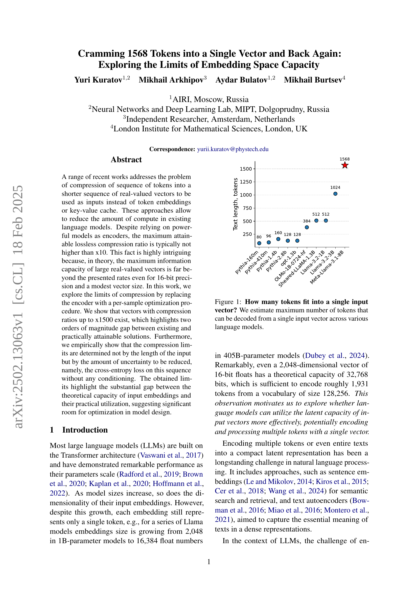
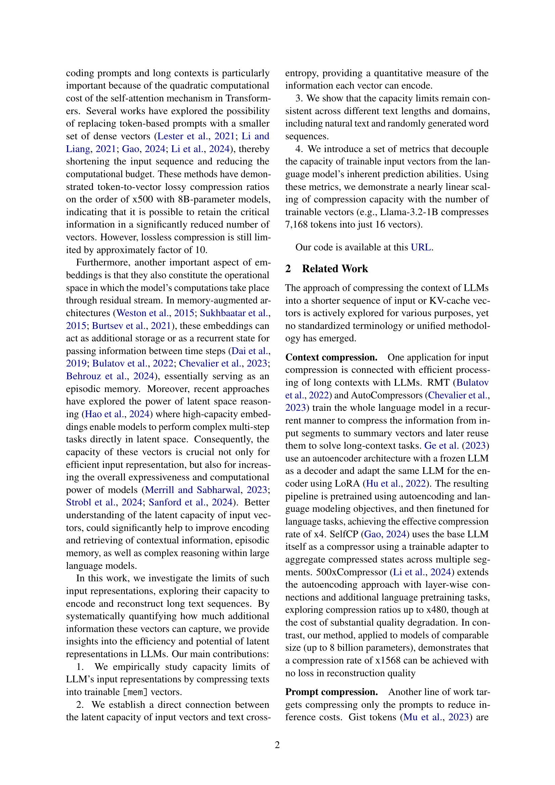
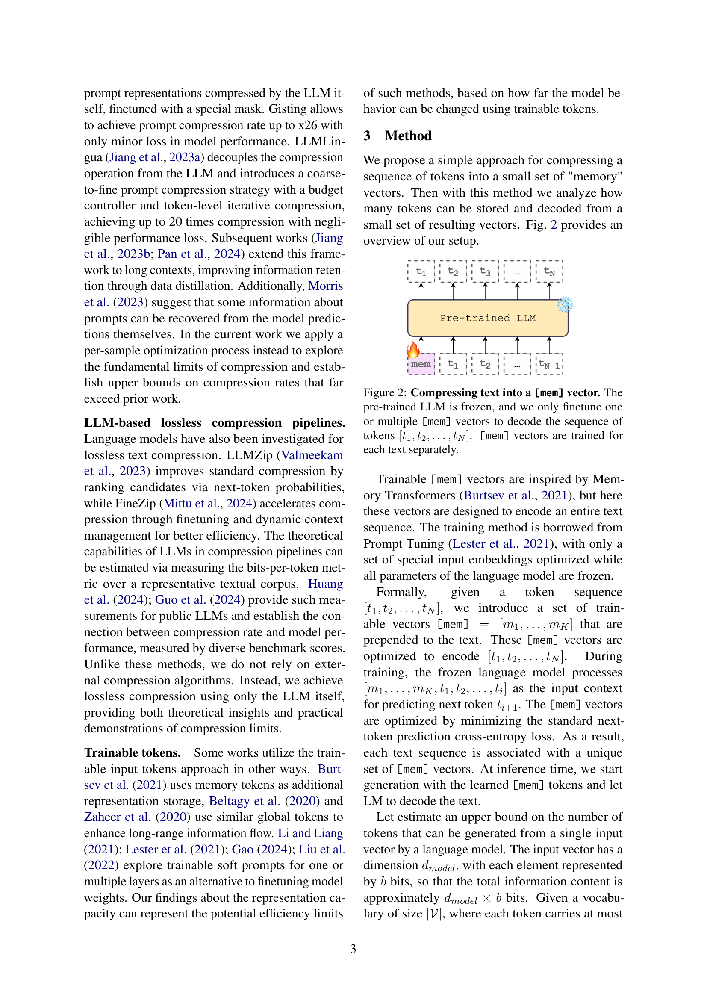
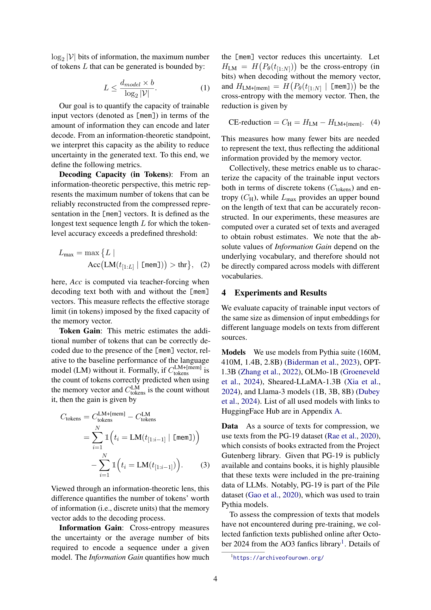
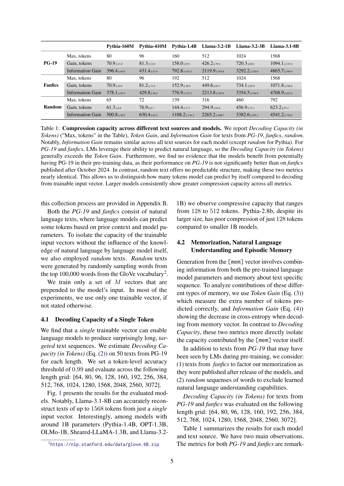
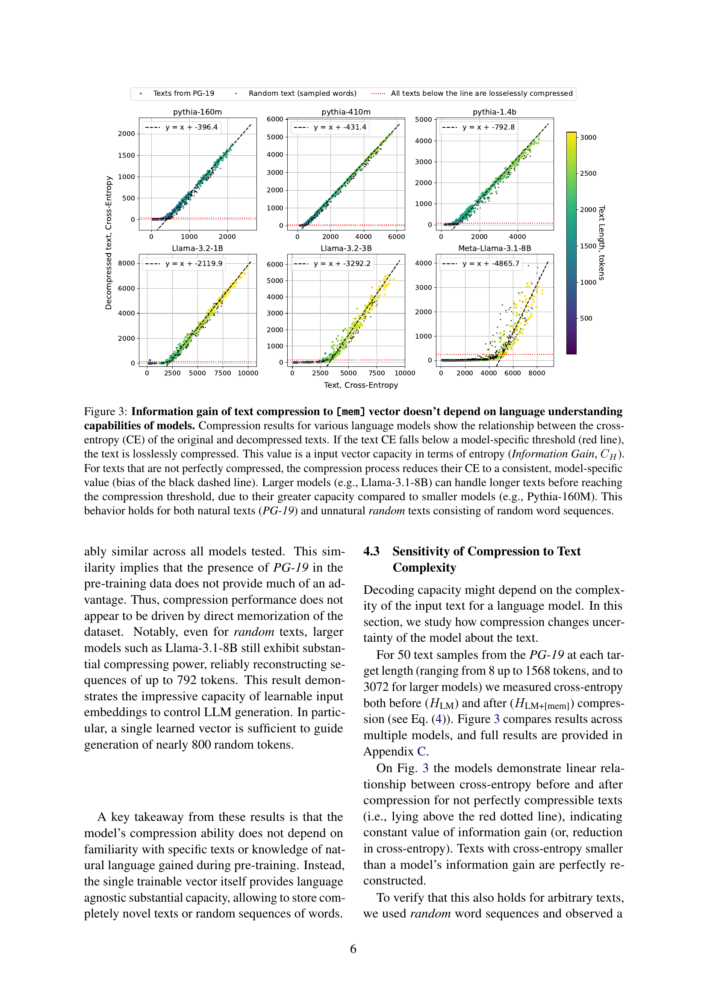
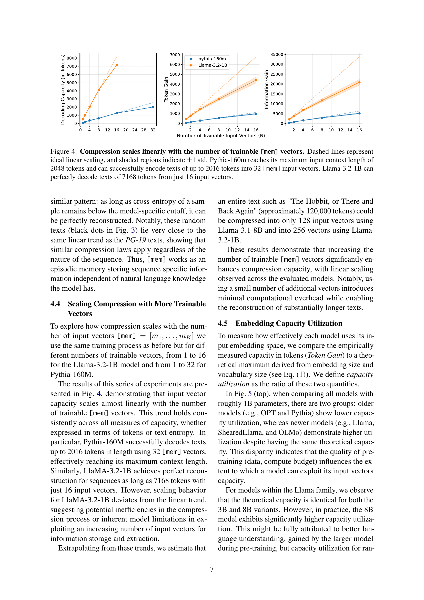
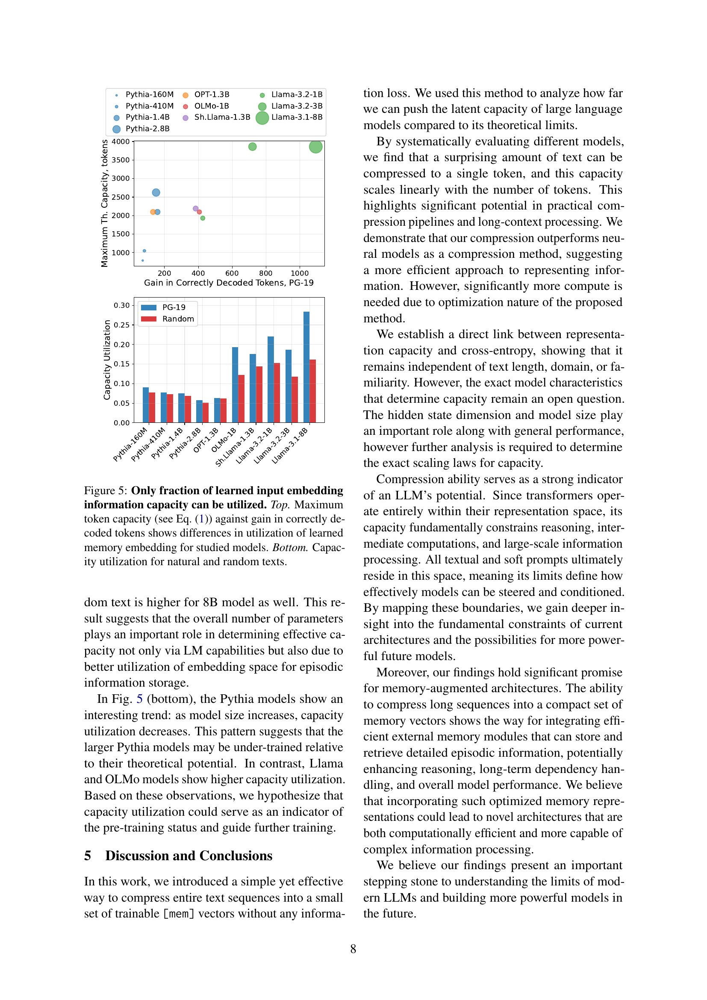
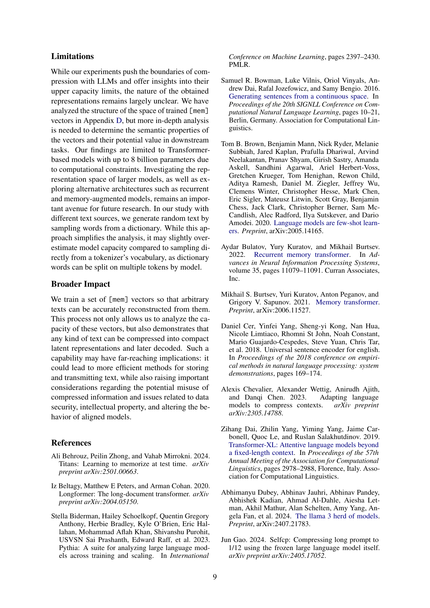
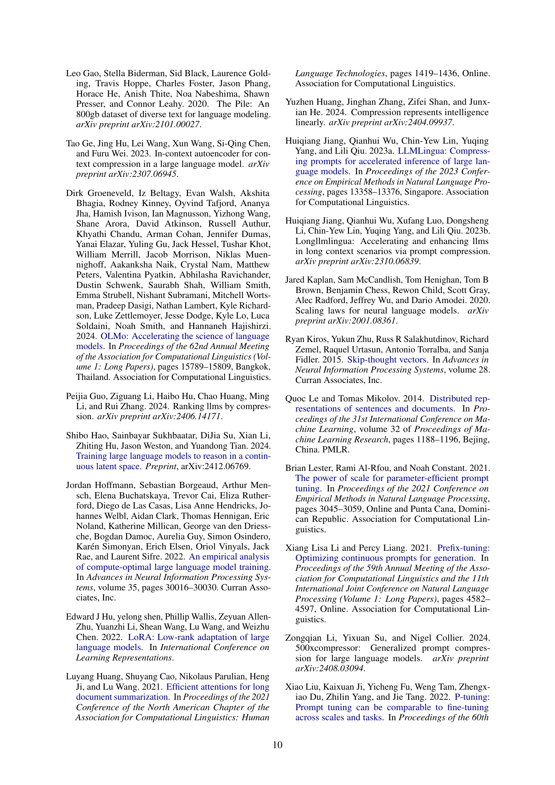
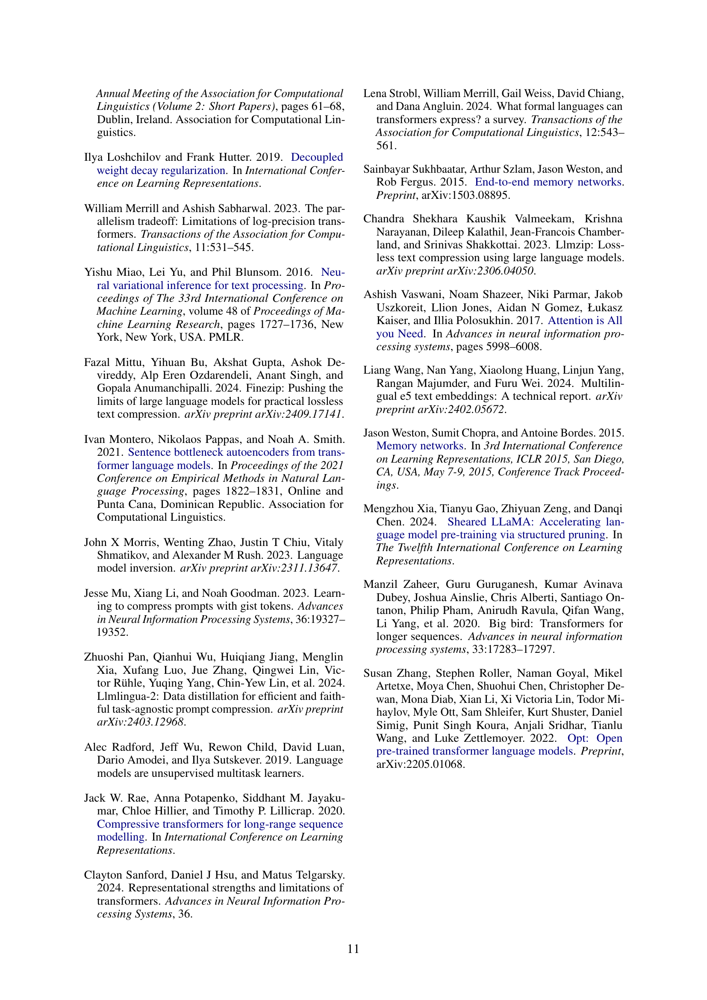
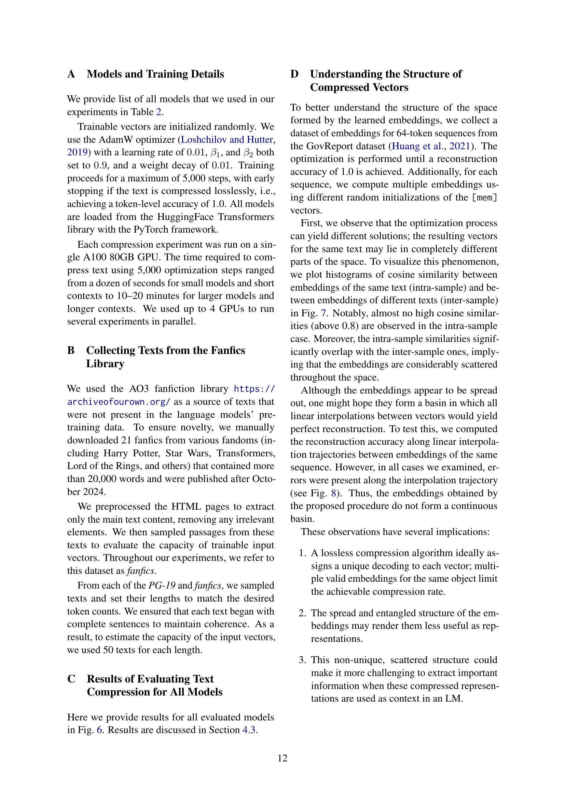
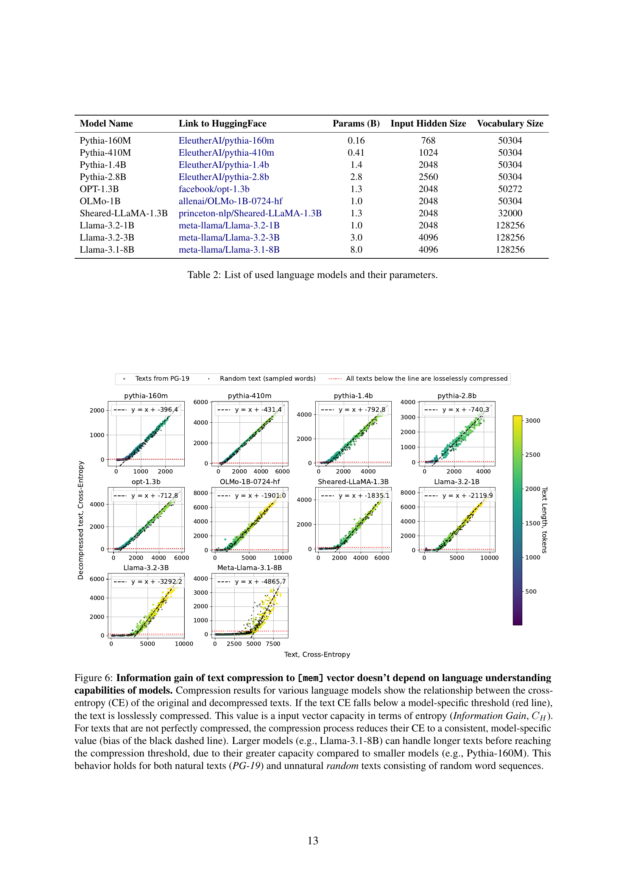
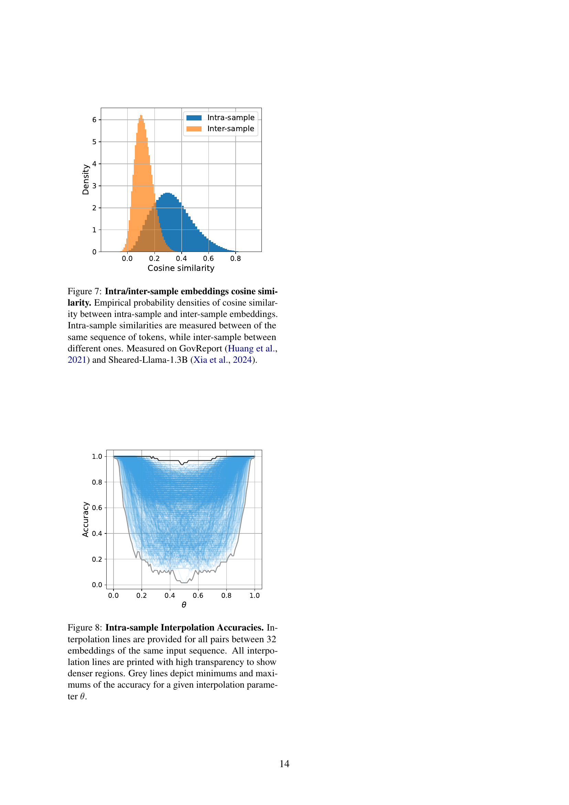
