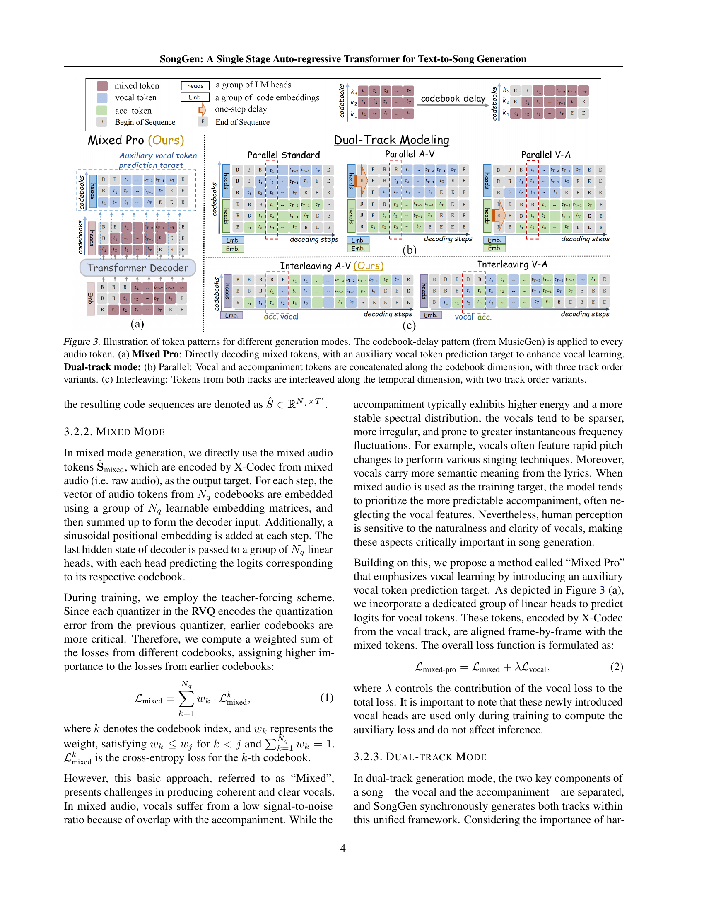

 


 2502.13128 
 Zihan Liu et el. 
 
 🤗 2025-02-20 
 



↗ arXiv


↗ Hugging Face


↗ Papers with Code


### TL;DR



기존의 텍스트-음악 생성 모델들은 복잡한 다단계 과정을 거쳐 보컬과 반주를 개별적으로 생성하는 한계점을 지녔습니다. 이는 훈련 및 추론 과정을 복잡하게 만들고, 보컬과 반주 간의 조화로운 통합이 어려웠습니다. 또한, 기존 모델들은 제한된 음악 속성 제어 및 데이터 부족 문제를 안고 있었습니다.

본 논문에서는 이러한 문제를 해결하기 위해 단일 단계 오토 회귀 변환기 기반의 새로운 텍스트-음악 생성 모델 SongGen을 제시합니다. SongGen은 가사와 음악 설명 텍스트를 입력받아 보컬과 반주를 동시에 생성하며, 장르, 분위기, 음색 등 다양한 음악 속성을 세밀하게 제어할 수 있습니다.  SongGen은 오픈 소스로 공개되어 모델 가중치, 코드, 데이터 등을 제공하여 연구 활성화에 기여합니다.  실험 결과, SongGen은 기존 모델보다 우수한 성능을 보였으며, 특히 자연스러운 보컬 생성에 있어서 뛰어난 성능을 보였습니다.



#### Key Takeaways


 SongGen은 텍스트 입력으로부터 보컬과 반주를 생성하는 단일 단계 오토 회귀 변환기 모델입니다. 



 SongGen은 가사, 악기, 장르, 분위기, 음색 등 다양한 음악 속성에 대한 세밀한 제어를 가능하게 합니다. 



 SongGen은 오픈 소스로 공개되어 모델 가중치, 훈련 코드, 주석이 달린 데이터 및 전처리 파이프라인을 제공합니다. 


#### Why does it matter?
본 논문은 **단일 단계 오토 회귀 변환기 기반의 텍스트-음악 생성 모델 SongGen**을 제시하여 다양한 음악 속성에 대한 세밀한 제어를 가능하게 합니다. **기존의 다단계 방법론과 달리**, SongGen은 훈련 및 추론 파이프라인을 간소화하며, **오픈소스로 공개**되어 연구자들이 이 분야의 발전에 크게 기여할 수 있습니다. 또한, SongGen은 **음악 데이터 전처리 파이프라인**을 제공하여 관련 연구의 진입 장벽을 낮추고 **향후 연구 방향**을 제시합니다.  이러한 SongGen의 **혁신적인 접근 방식**은 음악 생성 분야의 새로운 표준을 제시하고, 향후 음악 생성 기술의 발전에 중요한 영향을 미칠 것으로 예상됩니다.

------
#### Visual Insights

> 🔼 그림 1은 기존의 다단계 텍스트-음악 생성 방법과 SongGen의 단일 단계 접근 방식을 비교합니다. 기존 방법은 텍스트에서 보컬을 생성하고, 그 다음 보컬과 함께 텍스트 프롬프트를 사용하여 반주를 생성하는 등 여러 단계의 과정을 거칩니다. 이러한 다단계 방식은 복잡하고 유연성이 부족하며 훈련 및 추론 파이프라인이 번거롭습니다. 반면 SongGen은 단일 단계 오토 회귀 트랜스포머를 사용하여 보컬과 반주를 동시에 생성하거나 별도로 생성할 수 있어 더욱 간단하고 유연한 파이프라인을 제공합니다. SongGen은 혼합 모드와 이중 트랙 모드 모두를 지원하여 다양한 애플리케이션에 유연성을 제공합니다.
> 

> 
read the caption

> Figure 1:  Traditional methods often rely on multi-stage processes, making pipelines inflexible and complex. SongGen simplifies this with a single-stage auto-regressive transformer that supports both mixed mode and dual-track mode song generation.
> 


| Model | FAD ↓ | KL ↓ | CLAP ↑ | PER ↓ | SECS ↑ | OVL. ↑ | REL. ↑ | VQ. ↑ | HAM. ↑ | SS. ↑ |
|---|---|---|---|---|---|---|---|---|---|---|
| Ground Truth | - | - | - | - | - | 4.57 | 4.49 | 4.49 | 4.47 | 4.58 |
| Suno | - | - | - | - | - | 4.28 | 3.31 | 4.22 | 4.33 | - |
| Stable Audio Open (Evans et al., 2024) | 4.87 | 1.15 | 0.28 | - | - | 3.01 | 2.87 | 1.29 | - | - |
| MusicGen (Copet et al., 2024) | 5.17 | 0.89 | 0.09 | - | - | 3.15 | 2.44 | - | - | - |
| Parler-tts* (Lyth & King, 2024) | 4.13 | 1.00 | 0.19 | 58.61 | 64.37 | 2.58 | 2.13 | 2.28 | 2.35 | - |
| Mixed | 1.74 | 0.71 | 0.35 | 51.84 | 73.69 | 3.58 | 3.70 | 3.55 | 3.39 | 3.92 |
| Mixed pro (ours) | 1.71 | 0.69 | 0.35 | 40.58 | 73.78 | 3.96 | 3.86 | 4.07 | 4.01 | 4.04 |
| Parallel (standard) | 2.45 | 0.75 | 0.33 | 48.40 | 72.27 | 3.19 | 3.27 | 3.36 | 2.98 | 3.44 |
| Parallel (V-A) | 2.54 | 0.73 | 0.33 | 46.30 | 72.43 | 3.36 | 3.32 | 3.48 | 3.08 | 3.47 |
| Parallel (A-V) | 2.31 | 0.72 | 0.34 | 47.00 | 72.50 | 3.40 | 3.33 | 3.51 | 3.21 | 3.51 |
| Interleaving (V-A) | 1.96 | 0.71 | 0.34 | 41.82 | 73.12 | 3.77 | 3.69 | 3.98 | 3.65 | 3.88 |
| Interleaving (A-V) (ours) | 1.87 | 0.69 | 0.35 | 39.46 | 73.16 | 3.95 | 3.87 | 4.15 | 3.82 | 3.93 |

> 🔼 표 1은 SongGen 모델의 성능을 평가하기 위해 객관적 및 주관적 지표를 사용하여 수행된 실험 결과를 보여줍니다.  객관적 지표로는 FAD, KL, CLAP, PER, SECS를 사용했고, 주관적 지표로는 MOS (Mean Opinion Score)를 사용하여 전반적인 품질, 관련성, 보컬 품질, 조화, 화자 유사성 등 다섯 가지 측면을 평가했습니다.  Parler-tts 모델은 저자의 학습 데이터를 사용하여 미세 조정되었습니다.  표에서 가장 높은 점수를 받은 결과는 노란색으로 강조 표시되어 있으며, 객관적 지표의 상위 두 결과는 각각 굵게 표시되고 밑줄이 그어져 있습니다.
> 

> 
read the caption

> Table 1: Objective and Subjective evaluation of Text-to-Song generation. * denotes that we finetune Parlet-tts using our training data. The overall first and second results are marked with bold and underline, respectively. The top subjective results in both of our generation modes are highlighted in yellow.
> 

### In-depth insights

#### Single-Stage SongGen
본 논문에서 제안하는 Single-Stage SongGen은 기존의 다단계 방식 Text-to-Song 생성 모델과 달리, **단일 단계의 오토회귀 변환기(auto-regressive transformer)**를 사용하여 텍스트 입력으로부터 보컬과 반주를 동시에 생성하는 모델입니다. 이는 다단계 모델의 복잡한 파이프라인과 유연성 부족 문제를 해결하고자 하는 시도입니다. SongGen은 가사, 악기, 장르, 분위기, 음색 등 다양한 음악 속성에 대한 세분화된 제어를 가능하게 하며, 선택적으로 3초 분량의 참조 음성 클립을 사용한 음성 복제도 지원합니다. **혼합 모드(mixed mode)**와 **이중 트랙 모드(dual-track mode)**라는 두 가지 출력 모드를 지원하여 다운스트림 애플리케이션에서의 유연성을 높였습니다. 각 모드에 대해 다양한 토큰 패턴 전략을 탐구하여 성능 향상을 이끌어냈으며, 효과적인 품질 관리 기능을 갖춘 자동화된 데이터 전처리 파이프라인을 설계했습니다.  **개방형 모델**로서 모델 가중치, 훈련 코드, 주석이 달린 데이터, 전처리 파이프라인을 공개하여 커뮤니티 참여와 향후 연구를 장려하고자 합니다.

#### Token Strategy
본 논문에서 제시된 SongGen 모델의 핵심적인 부분 중 하나는 바로 **토큰 전략**입니다. 이는 단순히 오디오를 숫자로 변환하는 것을 넘어, 음악의 다양한 요소들을 효과적으로 표현하고 모델이 학습 및 생성하는 과정에 중요한 영향을 미칩니다. 특히, **혼합 모드(Mixed Mode)**와 **이중 트랙 모드(Dual-Track Mode)**에서 각기 다른 토큰 패턴을 사용하여 음성과 반주를 생성하는 방식은 흥미로운 시도입니다. **혼합 모드**에서는 음성과 반주가 섞인 오디오 토큰을 직접 예측하지만, 음성의 명료도를 높이기 위해 보조적인 음성 토큰 예측 목표를 추가한 것이 특징입니다. 반면, **이중 트랙 모드**에서는 음성과 반주를 별도로 생성하여, 후처리 과정에서의 유연성을 높입니다.  여러 트랙 조합 패턴을 실험하여 최적의 성능을 얻는 전략을 제시하고 있으며, 이는 **음성과 반주 사이의 정교한 조화**를 이루는 데 중요한 역할을 합니다.  **다양한 토큰 패턴 전략**을 통해 얻은 결과와 통찰력은 향후 연구에 귀중한 기여를 할 것으로 예상되며, **데이터 효율성**을 높이는 전략 또한 포함되어 있습니다.  전반적으로 SongGen의 토큰 전략은 음악 생성 모델의 성능과 제어 가능성을 향상시키는 데 효과적인 접근 방식임을 보여줍니다.

#### Data Preprocessing
본 논문에서 데이터 전처리 과정은 **고품질의 음악 데이터셋을 구축**하는 데 중추적인 역할을 합니다.  기존의 공개 데이터셋의 부족을 해결하기 위해, 다양한 음원 데이터 소스를 활용하고, 음원 분리, 세그먼테이션, 가사 인식, 캡션 생성 등의 여러 단계를 거칩니다. 특히, **음성 활동 탐지(VAD)**를 이용해 보이스와 반주를 분리하고, 저품질 데이터를 걸러내는 과정은 노이즈가 많은 음악 데이터의 특성을 고려한 중요한 전처리 단계입니다.  또한, **자동화된 파이프라인을 구축**하여 효율성을 높이고, **다중 ASR 모델 활용 및 편집 거리 기반 필터링** 등을 통해 가사 인식의 정확도를 높였습니다.  **CLAP 스코어를 활용한 캡션 품질 관리**는 정확하고 유의미한 텍스트 정보를 확보하는 데 기여합니다.  **데이터 전처리 과정 전반에 걸친 자동화**는 대규모 데이터셋 구축의 효율성을 극대화하고, **SongGen 모델의 성능 향상**에 크게 기여하는 요소입니다.  결과적으로, 2,000시간에 달하는 고품질 데이터셋을 구축하여 모델 학습에 사용하였습니다.

#### Ablation Studies
본 논문의 "Ablation Studies" 부분은 모델 성능에 기여하는 요소들을 체계적으로 분석하여 **SongGen 모델의 강점과 한계점**을 명확히 밝히는 데 중점을 둡니다.  **다양한 훈련 전략, 가사 처리 방식, 오디오 코덱** 등의 변수들을 제거하거나 변경하여 실험을 수행하고 그 결과를 비교 분석함으로써 각 요소의 중요성을 정량적으로 평가합니다.  특히, 고품질 미세 조정(HQFT)과 커리큘럼 학습(CL) 전략의 효과를 면밀히 검토하고, 가사 토큰화 방식과 통합 방법의 영향을 분석하여 **최적의 모델 구성**을 제시합니다.  **다중 트랙 모드와 혼합 모드의 성능 차이**를 비교하고, 각 모드 내 다양한 토큰 패턴 전략의 효과를 분석하여 **모델의 유연성과 한계**를 보여줍니다.  결과적으로, 이러한 ablation study는 SongGen 모델의 설계 및 성능 향상에 중요한 통찰력을 제공하고, **향후 연구 방향**을 제시하는 데 기여합니다.

#### Future Work
본 논문의 "향후 연구" 부분은 **SongGen 모델의 한계점을 명확히 인지**하고 있으며, 이를 개선하기 위한 구체적인 방향을 제시하고 있습니다. 특히, 현재 30초 길이의 짧은 음악 생성에 그치는 한계를 극복하기 위해 **더 긴 음악 생성을 위한 연구**가 필요하며, 더 높은 음질을 위한 16kHz보다 높은 샘플링 레이트를 지원하는 오디오 코덱 개발 또한 중요 과제로 제시됩니다.  또한, **데이터 부족 문제 해결**을 위한 연구는 향후 SongGen의 성능 향상과 응용 분야 확장에 있어 필수적입니다.  **다양한 음악 스타일과 장르에 대한 지원 확대**, 그리고 다국어 지원을 통한 보편성 확보도 중요한 연구 방향입니다.  **윤리적 문제 고려** 또한 언급되어 있으며, 저작권 침해 및 오용 방지에 대한 연구가 필수적임을 강조합니다.  **모델의 설명력 강화**를 위한 연구 또한 중요합니다.  결론적으로, SongGen의 미래 연구는 단순한 성능 개선을 넘어, **윤리적 책임감을 갖춘 지속 가능한 음악 생성 모델** 구축을 위한 노력으로 이어져야 함을 시사합니다.

### More visual insights

More on figures

> 🔼 SongGen의 개요를 보여주는 그림입니다. 사용자 정의 제어(가사, 설명 텍스트, 선택적 참조 음성)를 크로스 어텐션을 통해 통합하는 오토리그레시브 트랜스포머 디코더가 다양한 패턴의 오디오 토큰을 생성합니다. 최종 음악은 오디오 코덱 디코더를 통해 이러한 토큰으로부터 합성됩니다.  다양한 오디오 토큰 패턴(Mixed mode, Dual-track mode)과 사용자 정의 제어(가사, 설명 텍스트, 3초 음성 클립)의 통합 과정을 시각적으로 보여줍니다.
> 

> 
read the caption

> Figure 2: Overview of SongGen: An auto-regressive transformer decoder generates audio tokens with diverse patterns, incorporating user-defined controls via cross-attention. The final song is synthesized from these tokens through the audio codec decoder.
> 

> 🔼 그림 3은 서로 다른 음악 생성 모드에 대한 토큰 패턴을 보여줍니다. MusicGen에서 가져온 코드북 지연 패턴이 모든 오디오 토큰에 적용됩니다. (a) Mixed Pro: 보조 보컬 토큰 예측 타겟을 사용하여 보컬 학습을 강화하는 혼합 토큰을 직접 디코딩합니다. 듀얼 트랙 모드: (b) Parallel: 코드북 차원을 따라 보컬 및 반주 토큰을 연결하고, 세 가지 트랙 순서 변형을 사용합니다. (c) Interleaving: 시간적 차원을 따라 두 트랙의 토큰을 엇갈리게 배치하고, 두 가지 트랙 순서 변형을 사용합니다.
> 

> 
read the caption

> Figure 3: Illustration of token patterns for different generation modes. The codebook-delay pattern (from MusicGen) is applied to every audio token. (a) Mixed Pro: Directly decoding mixed tokens, with an auxiliary vocal token prediction target to enhance vocal learning. Dual-track mode: (b) Parallel: Vocal and accompaniment tokens are concatenated along the codebook dimension, with three track order variants. (c) Interleaving: Tokens from both tracks are interleaved along the temporal dimension, with two track order variants.
> 

> 🔼 그림 4는 SongGen 모델이 생성한 노래의 멜 스펙트로그램 시각화를 보여줍니다. 다양한 창법 기법들을 보여주는 멜 스펙트로그램을 통해 SongGen 모델의 음악적 표현력을 시각적으로 보여줍니다. 세부적으로는, 음높이와 음색의 변화, 그리고 비브라토 등의 창법이 스펙트로그램 상에 잘 나타나 있으며, 이를 통해 SongGen 모델이 단순한 음악 생성을 넘어서 실제 가수의 표현력을 모방할 수 있음을 보여줍니다.
> 

> 
read the caption

> Figure 4: Mel-spectrogram visualization of our generated song featuring various singing techniques.
> 

> 🔼 그림 5는 SongGen 모델의 디코더 내부에서 어텐션 메커니즘이 어떻게 동작하는지 시각화한 것입니다.  (a)와 (d)는 혼합 모드(Mixed Pro)에서, (b)와 (e)는 이중 트랙 모드(Interleaving A-V)에서 각각 18번째 레이어와 8번째 레이어, 그리고 21번째 레이어의 어텐션 가중치를 나타냅니다.  각 그래프는 특정 시점에서 디코더가 이전 시점의 어떤 토큰에 얼마나 주의를 기울였는지를 보여줍니다.  대각선 방향의 밝은 영역은 자신에게 집중하는 것을, 다른 영역의 밝은 영역은 다른 토큰과의 연관성을 나타냅니다. 이를 통해 혼합 모드와 이중 트랙 모드에서 어텐션 패턴의 차이를 비교 분석할 수 있으며, SongGen 모델의 내부 동작 원리를 이해하는 데 도움이 됩니다.
> 

> 
read the caption

> Figure 5: Visualization of decoder attention.
> 

> 🔼 그림 6은 SongGen 모델 훈련에 사용된 세 가지 오디오 코덱(X-Codec, Encodec, DAC)의 손실 함수 곡선을 보여줍니다. X-Codec은 음향 및 의미 정보를 모두 고려하는 반면, Encodec과 DAC는 주로 음향 재구성에 중점을 둡니다. 그래프는 X-Codec이 더 안정적인 훈련과 빠른 수렴을 보여주는 반면, 다른 두 코덱은 상대적으로 불안정하고 수렴 속도가 느림을 보여줍니다. 이는 SongGen과 같은 노래 생성 작업에서 오디오 토큰에 의미 정보를 통합하는 것이 매우 효과적임을 시사합니다.
> 

> 
read the caption

> Figure 6: Training loss curves of different audio codecs
> 

More on tables


| Model | FAD ↓ | OVL ↑ | REL ↑ | VQ ↑ | HAM ↑ |
|---|---|---|---|---|---| 
| mixed pro | 1.96 | 3.72 | 3.48 | 3.88 | 3.87 |
| inter.(A-V) | 2.21 | 3.70 | 3.47 | 3.91 | 3.83 |
> 🔼 표 2는 참조 음성 없이 SongGen 모델이 텍스트를 사용하여 노래를 생성한 결과를 보여줍니다.  모델 성능을 평가하기 위해 FAD, OVL, REL, VQ, HAM 지표를 사용하였습니다.  각 지표는 노래의 충실도, 전반적인 품질, 텍스트 관련성, 보컬 품질, 조화로움을 각각 나타냅니다.  표에서 볼 수 있듯이, 'Mixed pro'와 'Interleaving (A-V)'모드 모두 우수한 성능을 보여주지만, 'Interleaving (A-V)'모드가 보컬 품질 측면에서 약간 더 뛰어난 결과를 보였습니다.
> 

> 
read the caption

> Table 2: Text-to-Song results without voice input.
> 


| Model | FAD ↓ | KL ↓ | CLAP ↑ | PER ↓ | SECS ↑ |
|---|---|---|---|---|---| 
| w/o HQFT | 2.01 | 0.72 | 0.32 | 43.68 | 72.83 |
| w/o CL | 2.35 | 0.73 | 0.33 | 55.71 | 72.81 |
| **ours** | **1.71** | **0.69** | **0.35** | **40.58** | **73.78** |
> 🔼 표 3은 SongGen 모델 학습 과정에 대한 ablation study 결과를 보여줍니다. HQFT(High-Quality Finetuning)와 CL(Curriculum Learning)이 모델 성능에 미치는 영향을 분석합니다. HQFT는 고품질 데이터로 미세 조정하는 기법이고, CL은 학습 과정 중 손실 함수의 가중치를 조정하는 기법입니다. 표에는 HQFT와 CL을 적용했을 때와 적용하지 않았을 때의 성능 지표(FAD, KL, CLAP, PER, SECS) 값이 제시되어 있습니다. 이를 통해 각 기법의 효과와 전체적인 학습 전략의 효율성을 평가할 수 있습니다.
> 

> 
read the caption

> Table 3: Ablation results on training scheme. HQFT is short for High-Quality Finetuning and CL stands for curriculum learning.
> 


| Tokenizer | w/ Lyrics | Encoder | FAD ↓ | PER ↓ | SECS ↑ |
|---|---|---|---|---|---| 
| VoiceBPE | ✗ | prepend | 3.41 | 62.38 | 69.09 |
| VoiceBPE | ✓ | prepend | 3.56 | 56.21 | 70.70 |
| VoiceBPE | ✗ | cross | 1.95 | 61.81 | 72.59 |
| T5 | ✓ | cross | 1.88 | 55.27 | 73.67 |
| VoiceBPE | ✓ | cross | **1.73** | **43.34** | **73.59** |
> 🔼 본 표는 가사 통합 방법에 대한 추가 분석 결과를 보여줍니다.  구체적으로는, 사용된 토크나이저(VoiceBPE vs. T5), 가사 인코더 사용 여부, 통합 방식(추가 vs. 크로스 어텐션) 등 세 가지 변수를 조합하여 실험했습니다.  각 조합에 따른 FAD, PER, SECS 지표의 결과를 제시하여 최적의 가사 통합 방식을 도출하고 그 이유를 분석합니다.
> 

> 
read the caption

> Table 4: Ablation results on different lyric integration methods.
> 


| Model | FAD ↓ | KL ↓ | CLAP ↑ | PER ↓ | SECS ↑ |
|---|---|---|---|---|---| 
| Encodec | 10.84 | 0.99 | 0.19 | 60.67 | 71.36 |
| DAC | 4.36 | 0.86 | 0.24 | 68.64 | 71.66 |
| X-Codec (ours) | **1.73** | **0.70** | **0.33** | **43.34** | **73.59** |
> 🔼 본 표는 SongGen 모델에서 다양한 오디오 코덱(X-Codec, Encodec, DAC)을 사용했을 때의 성능 비교 결과를 보여줍니다. 각 코덱의 FAD, KL, CLAP, PER, SECS 지표 값을 제시하여 X-Codec이 다른 코덱들보다 더 나은 성능을 보임을 보여줍니다.  이는 X-Codec이 음향 정보뿐 아니라 의미 정보까지 고려하여 오디오 토큰을 생성하기 때문입니다.
> 

> 
read the caption

> Table 5: Ablation results of different neural audio codecs.
> 

### Full paper



