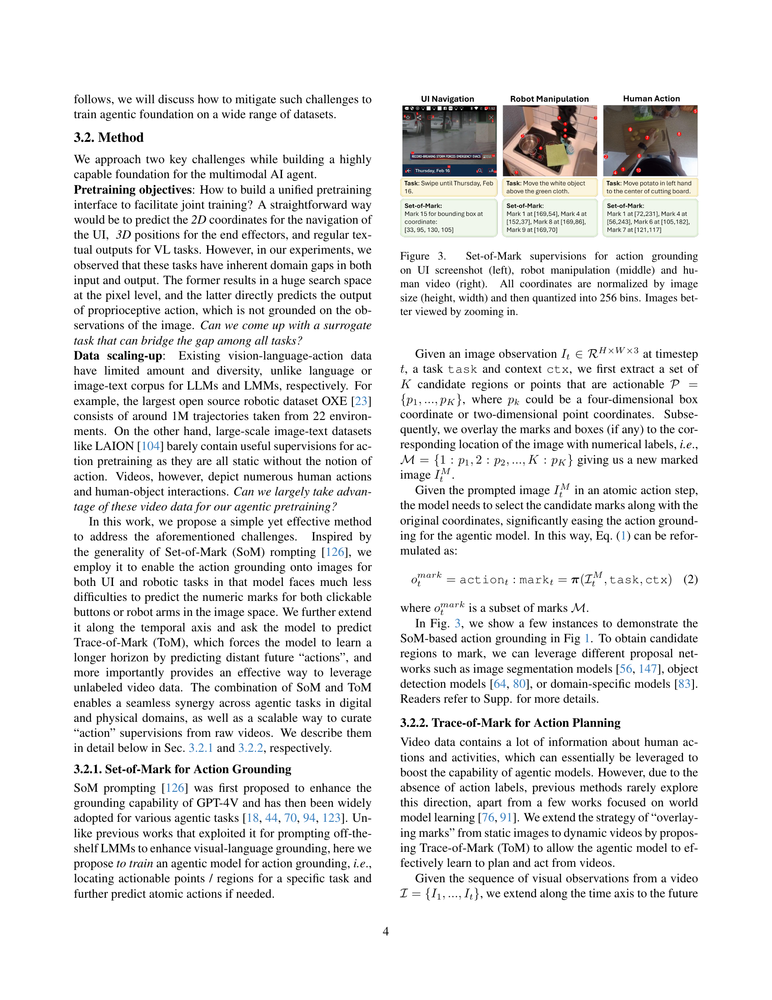

 


 2502.13130 
 Jianwei Yang et el. 
 
 🤗 2025-02-19 
 



↗ arXiv


↗ Hugging Face


### TL;DR



최근 몇 년 동안 비전-언어-행동(VLA) 모델을 기반으로 AI 에이전트를 개발하는 데 대한 관심이 높아지고 있습니다. 하지만 기존의 VLA 모델은 여러 환경(예: 2D 디지털 환경과 3D 물리적 환경)에서 별도로 훈련되기 때문에 일반화 능력이 제한적입니다. 또한, 기존 모델은 특정 작업에 초점을 맞추어 멀티모달 이해 능력이 떨어집니다.  본 논문은 이러한 문제점들을 해결하기 위해 새로운 기초 모델을 제안합니다.

본 논문에서는 멀티모달 입력을 이해하고, 행동 계획을 세우고, 디지털 및 물리적 환경 모두에서 에이전트 작업을 수행할 수 있는 Magma라는 기초 모델을 제시합니다. Magma는 이미지, 비디오, 로보틱스 데이터의 방대한 양을 사용하여 사전 훈련됩니다. 특히, **SoM(Set-of-Mark)**과 **ToM(Trace-of-Mark)**이라는 두 가지 보조 작업을 통해 이미지 및 비디오 데이터에서 행동에 대한 지도를 생성합니다.  실험 결과, Magma는 UI 탐색 및 로봇 조작 작업에서 최첨단 성과를 달성했으며, 다양한 멀티모달 작업에서 기존 대규모 멀티모달 모델과 비교하여 유리한 결과를 보였습니다.



#### Key Takeaways


 Magma는 디지털 및 물리적 환경 모두에서 다양한 멀티모달 AI 에이전트 작업을 수행할 수 있는 최초의 기초 모델입니다. 



 Magma는 UI 탐색과 로봇 조작 작업에서 최첨단 성능을 달성했습니다. 



 Magma는 이미지, 비디오, 로보틱스 데이터를 사용하여 사전 훈련되었으며, 다양한 하위 작업에 대한 제로샷 일반화 능력을 보여줍니다. 


#### Why does it matter?
본 논문은 **다양한 모드의 입력을 해석하고 환경 내에서 접지할 수 있는 최초의 기초 모델인 Magma**를 소개합니다.  이는 **사용자의 명령어를 해석하고 계획을 세우고 행동을 실행하여 복잡한 작업을 수행할 수 있는 능력**을 보여줍니다.  이러한 연구는 **다양한 분야의 연구자들이 멀티모달 AI 에이전트를 개발하는 데 중요한 영향**을 미칠 것입니다. 특히 **UI 탐색 및 로봇 조작 과제에서 최첨단 성능**을 달성하고 이러한 작업에 특화된 기존 모델보다 훨씬 뛰어난 성능을 보여줍니다. 이 연구는 **향후 멀티모달 AI 에이전트 개발을 위한 새로운 방향**을 제시합니다.

------
#### Visual Insights

> 🔼 그림 1은 다양한 모드의 입력을 해석하고 환경 내에서 지식을 활용할 수 있는 최초의 기초 모델인 Magma를 소개합니다. Magma는 사용자가 설명한 목표가 주어지면 계획을 세우고 행동을 실행하여 목표를 달성할 수 있습니다. 자유롭게 사용 가능한 시각 및 언어 데이터에서 지식을 효과적으로 전이함으로써 Magma는 언어적 및 공간적 지능을 연결하여 복잡한 작업을 수행합니다.
> 

> 
read the caption

> Figure 1: We introduce Magma, the first foundation model that is capable of interpreting and grounding multimodal inputs within its environment. Given a described goal, Magma is able to formulate plans and execute actions to achieve it. By effectively transferring knowledge from freely available visual and language data, Magma bridges verbal and spatial intelligence to navigate complex tasks.
> 


| Data Type | Set-of-Mark | Trace-of-Mark |
|---|---|---|
| UI Screenshots | ✓ | ✗ |
| Robotics Images | ✓ | ✓ |
| Instructional Videos | ✓ | ✓ |

> 🔼 본 표는 논문의 3.2절(방법론)에서 제시된 Set-of-Mark(SoM)와 Trace-of-Mark(ToM) 라벨링 기법이 다양한 데이터 유형에 어떻게 적용되는지를 보여줍니다.  SoM은 이미지 또는 비디오 내에서 행동 가능한 객체를 표시하는 데 사용되며, UI(사용자 인터페이스) 스크린샷, 로봇 조작 이미지, 그리고 사람의 행동 비디오 등 다양한 데이터 유형에 적용됩니다.  ToM은 비디오 내에서 객체의 움직임을 추적하는 데 사용되며, 주로 로봇 조작 비디오와 사람의 행동 비디오에 적용됩니다. UI 스크린샷의 경우, 연속적인 스크린샷 시퀀스가 아니기 때문에 ToM이 적용되지 않습니다.
> 

> 
read the caption

> Table 1: SoM and ToM applied to various data types. ToM is not applied to UI data as they are a sequence of discrete screenshots.
> 

### In-depth insights

#### Multimodal AI Agents
본 논문은 **멀티모달 AI 에이전트**라는 주제에 대해 심도있는 논의를 제공합니다. 멀티모달 AI 에이전트는 시각, 언어, 촉각 등 다양한 모달리티의 정보를 통합하여 **복잡한 작업을 수행**할 수 있는 인공지능 시스템입니다. 이러한 시스템은 **디지털 및 물리적 환경** 모두에서 작동하며, 사용자의 명령을 이해하고 계획을 세운 후, 적절한 행동을 실행합니다.  **Magma와 같은 기초 모델**은 멀티모달 AI 에이전트 개발에 중요한 역할을 합니다. 이 모델은 다양한 데이터셋으로 사전 학습되어 사용자 상호작용, 로봇 조작, 시각적 언어 이해 등 다양한 과제를 수행할 수 있습니다. **Magma의 성공은 셋-오브-마크(SoM) 및 트레이스-오브-마크(ToM)**와 같은 혁신적인 기술의 활용에 기인하며, 이를 통해 시공간적 지능을 향상시켰습니다.  하지만, **데이터 편향** 문제 및 **안전성 확보** 등 풀어야 할 과제가 남아있습니다.  **향후 연구는 이러한 한계점을 극복**하고 멀티모달 AI 에이전트의 일반화 능력 및 신뢰성을 향상시키는 데 집중되어야 합니다.

#### Magma Model
Magma 모델은 **다양한 모드(시각, 언어, 행동)의 입력을 해석하고, 디지털 및 물리적 환경 모두에서 작업을 수행하는 능력을 갖춘 기초 모델**입니다. 기존의 VL(Vision-Language) 모델을 능가하여 VL 이해 능력은 유지하면서, 시공간적 지능을 갖춰 UI 탐색부터 로봇 조작까지 다양한 작업을 수행합니다. **SoM(Set-of-Mark) 및 ToM(Trace-of-Mark)** 라벨링을 통해 이미지 및 비디오 데이터에서 실행 가능한 시각적 개체와 개체의 움직임을 효과적으로 식별하여 에이전트 기능을 부여합니다. **대규모의 이종 데이터셋**을 사용하여 사전 훈련된 Magma는 UI 탐색 및 로봇 조작 작업에서 최첨단 성능을 달성하며, 다른 다중 모드 모델과 비교하여 우수한 성능을 보입니다.  **공개된 코드와 모델**을 통해 재현성을 확보하고, 다양한 분야에서의 응용 가능성을 높였습니다.

#### Action Grounding
본 논문에서 '액션 그라운딩(Action Grounding)'은 **멀티모달 입력을 환경 내에서 해석하고 연결하는 능력**을 의미합니다.  이는 단순히 시각적 정보를 이해하는 것을 넘어, **말로 설명된 목표를 달성하기 위해 계획을 세우고 행동을 수행**하는 능력을 포함합니다.  특히, **GUI(그래픽 사용자 인터페이스) 탐색이나 로봇 조작**과 같은 에이전트 작업을 성공적으로 수행하는 데 중요한 역할을 합니다.  **SoM(Set-of-Mark)**과 **ToM(Trace-of-Mark)** 라벨링 기법을 통해 이미지와 비디오 데이터에서 액션 가능한 객체와 객체의 움직임을 효과적으로 표현하여 모델 학습에 활용합니다.  결과적으로, **디지털 및 물리적 환경 모두에서 에이전트의 공간-시간적 지능을 향상**시키는 데 기여합니다.  이는 **다양한 에이전트 작업에 대한 일반화 능력을 향상**시키는 핵심 요소로 작용하며,  **Magma 모델의 핵심적인 성능 개선**에 기여한 부분입니다.  **데이터의 이질성을 극복하고 액션과 시각 정보의 연관성을 강화**하는 핵심 기술입니다.

#### Future Work
본 논문은 다양한 모드의 입력을 이해하고 물리적 및 디지털 환경에서 에이전트 작업을 수행하는 기초 모델인 Magma를 제시합니다.  **향후 연구는 몇 가지 중요한 방향으로 나아갈 수 있습니다.** 첫째, **Magma 모델의 확장성을 높이기 위한 연구**가 필요합니다.  더 큰 규모의 데이터셋을 활용하여 모델의 성능을 향상시키고, 보다 다양한 작업에 적용할 수 있도록 하는 연구가 중요합니다. 둘째, **모델의 일반화 능력 향상을 위한 연구**가 필요합니다.  다양한 환경에서도 안정적으로 작동하는 강건한 모델을 개발하기 위해서는 도메인 적응(domain adaptation) 기술에 대한 연구가 필수적입니다. 셋째, **Magma 모델의 설명 가능성을 높이는 연구**가 중요합니다. 모델의 의사결정 과정을 이해하고, 신뢰성을 높이기 위해서는 모델의 내부 동작에 대한 설명을 제공하는 연구가 필요합니다. 마지막으로, **윤리적 고려사항을 포함한 책임감 있는 AI 에이전트 개발**에 대한 연구가 필요합니다.  Magma와 같은 강력한 모델은 사회에 긍정적인 영향을 미치도록 개발하고 사용되어야 하며, 이를 위해서는 윤리적 문제점을 해결하고, 안전성을 확보하는 연구가 중요합니다.

#### Limitations
본 논문에서 제시된 다중 모달 AI 에이전트 모델은 뛰어난 성능을 보이지만, 몇 가지 **한계점**이 존재합니다.  **데이터 편향**은 가장 큰 문제 중 하나로, 특히 로봇 조작 및 사용자 인터페이스 탐색 작업에 사용된 데이터셋의 다양성과 대표성 부족으로 인해 모델의 일반화 성능이 저하될 수 있습니다.  **데이터 크기의 제한** 또한 모델의 성능 향상에 걸림돌이 될 수 있습니다.  **계산 비용** 또한 상당히 높아 대규모 학습 및 배포에 어려움이 있습니다.  더불어, 모델의 **해석력 부족**은 신뢰성을 저해하는 요인이며,  **예측의 정확도**를 높이고 **실시간 응답** 속도를 개선하기 위한 추가 연구가 필요합니다.  마지막으로, **다양한 작업 환경에 대한 적응력**을 높이는 것이 향후 연구의 중요한 과제입니다.  모델의 안전성 및 윤리적 측면 또한 고려되어야 합니다.

### More visual insights

More on figures

> 🔼 그림 2는 다양한 모드(시각, 언어 등)의 입력을 이해하고(다중 모드 이해) 주어진 목표를 달성하기 위한 행동을 예측하는(다중 모드 행동 예측) 능력을 갖춘 다중 모드 AI 에이전트의 개념을 보여줍니다.  에이전트는 사용자의 목표를 입력받아 다양한 모드의 정보를 처리하고, 최종적으로 적절한 행동을 출력합니다.  이 그림은 논문의 핵심 개념을 간략하게 시각적으로 표현한 것입니다.
> 

> 
read the caption

> Figure 2: A multimodal AI agent should be capable of mutimodal understanding and action-prediction towards a given goal.
> 

> 🔼 그림 3은 Set-of-Mark(SoM)를 이용하여 행동 접지를 위한 지도 학습 데이터를 보여줍니다. 왼쪽부터 UI 스크린샷, 로봇 조작, 사람의 비디오에 대한 SoM 지도 학습의 예시가 나와있습니다. 각 이미지에서 수행 가능한 동작과 관련된 시각적 개체(예: UI에서 클릭 가능한 버튼, 로봇 암의 위치, 사람의 손 동작)에 SoM 레이블을 지정했습니다. 이미지 크기(높이, 너비)로 정규화한 후 256개의 구간으로 양자화하여 좌표를 표시합니다. 더 자세한 내용을 보시려면 이미지를 확대하여 보시기 바랍니다.
> 

> 
read the caption

> Figure 3: Set-of-Mark supervisions for action grounding on UI screenshot (left), robot manipulation (middle) and human video (right). All coordinates are normalized by image size (height, width) and then quantized into 256 bins. Images better viewed by zooming in.
> 

> 🔼 그림 4는 로봇 조작(왼쪽)과 인간 행동(오른쪽)에 대한 Trace-of-Mark(ToM) 지도 감독의 예시를 보여줍니다. ToM은 이미지 내에서 수행 가능한 동작을 나타내는 Set-of-Mark(SoM)과 동일한 좌표 정규화 및 양자화 방식을 사용합니다. 그림에서는 모델이 예측해야 하는 미래의 궤적(Trace)을 보여주는 이미지들이 제시되어 있습니다.  즉, SoM이 현재 시점에서의 조작 가능한 객체를 표시하는 반면, ToM은 미래의 동작 궤적을 예측하여 모델이 장기적인 계획을 세우고 실행할 수 있도록 돕는 역할을 합니다. 로봇 팔이나 사람 손의 움직임을 추적하여 미래의 궤적을 예측함으로써, 모델은 시간적 맥락을 이해하고 더욱 정확한 동작 계획을 수립할 수 있습니다.
> 

> 
read the caption

> Figure 4: Trace-of-Mark supervisions for robot manipulation (left) and human action (right). Same coordinate normalization and quantization is used as SoM. Images show the future traces to predict.
> 

> 🔼 그림 5는 카메라 움직임이 있는 비디오에서 SoM(Set-of-Mark) 및 ToM(Trace-of-Mark)을 생성하기 위한 알고리즘 2의 과정을 보여줍니다.  알고리즘은 먼저 비디오 프레임에 대해 CoTracker를 사용하여 점 추적을 수행합니다. 그런 다음 전역 움직임이 있는지 확인하고, 있다면 호모그래피 변환을 적용하여 카메라 움직임의 영향을 줄입니다. 이후 추적된 점들을 전경과 배경으로 분류하고, K-Means 클러스터링을 통해 전경 추적을 클러스터링합니다. 마지막으로 첫 번째 프레임에 SoM을 적용하고, 전경 및 배경 추적을 반환합니다. 이를 통해 모델은 동적 비디오 데이터에서도 효과적으로 작업 지점을 찾고 미래의 동작을 계획할 수 있게 됩니다.
> 

> 
read the caption

> Figure 5: An illustration of Alg. 2 to handle videos with camera motions for SoM/ToM generation.
> 

> 🔼 그림 6은 Magma 모델의 사전 훈련에 사용된 데이터셋의 개요를 보여줍니다. 다양한 영역의 데이터셋이 포함되어 있으며, 교육용 비디오(주황색), 로봇 조작(녹색), UI 탐색(분홍색), 다중 모드 이해(파란색) 데이터가 있습니다. 각 데이터셋의 크기는 이미지 샘플 수를 기준으로 계산됩니다. 비디오 및 로봇 데이터의 경우 짧은 클립과 궤적에서 이미지를 추출합니다.  이 그림은 다양한 유형의 데이터로 구성된 Magma 모델의 강력한 다중 모드 학습 능력을 보여줍니다.
> 

> 
read the caption

> Figure 6: Overview of Pretraining Data Sources. A diverse collection of datasets including instructional videos (orange), robotics manipulation (green), UI navigation (pink), and multimodal understanding (blue). Note that we count the size of each dataset by the number of image samples. For video and robotics data, we extract the images from the short clips and trajectories, respectively.
> 

> 🔼 그림 7은 Magma의 사전 훈련 파이프라인을 보여줍니다.  모든 훈련 데이터에서 텍스트는 토큰으로 분할되고, 서로 다른 도메인의 이미지와 비디오는 공유된 비전 인코더를 통해 인코딩됩니다. 그 결과 생성된 이산 및 연속 토큰은 LLM에 입력되어 언어, 공간 및 행동 유형의 출력을 생성합니다. 제안된 방법은 다중 모드 이해와 행동 예측 작업을 조정합니다.  간략히 말해, 다양한 데이터(텍스트, 이미지, 비디오)를 각각의 형태에 맞춰 처리한 후, 이들을 통합하여 LLM에 입력하고 최종 결과를 도출하는 과정을 보여주는 그림입니다.
> 

> 
read the caption

> Figure 7: Magma pretraining pipeline. For all training data, texts are tokenized into tokens, while images and videos from different domains are encoded by a shared vision encoder. The resulted discrete and continuous tokens are then fed into a LLM to generate the outputs in verbal, spatial and action types. Our proposed method reconcile the multimodal understanding and action prediction tasks.
> 

> 🔼 그림 8은 Google Robots 및 Bridge 환경에서 SimplerEnv 작업에 대한 Magma 모델의 성능을 OpenVLA 모델과 비교한 것입니다. Magma(OXE)는 Open-X-Embodiment 데이터셋 [22]으로만 학습된 모델이고, Magma는 본 논문에서 제시된 사전 학습된 모델입니다. 각 작업에 대한 결과는 시각적 매칭 및 변형 집계 시나리오에 걸쳐 평균된 것입니다.  이 그림은 다양한 로봇 조작 작업에서 Magma 모델의 우수한 제로샷 일반화 성능을 보여줍니다. 특히 OpenVLA 모델보다 훨씬 더 높은 성공률을 달성하였습니다.
> 

> 
read the caption

> Figure 8: SimplerEnv performance comparison on Google Robots and Bridge. Magma(OXE) represents our model trained solely on Open-X-Embodiment (OXE) [22], while Magma is our pretrained model. Results for each task are averaged across visual matching and variant aggregation scenarios.
> 

> 🔼 그림 9는 실제 WidowX 로봇을 사용하여 다양한 일상적인 물체 조작 작업을 포함한 4가지 작업에 대해 Magma 모델의 성능을 평가한 결과를 보여줍니다.  간략하게 말하면,  소량의 데이터로 미세 조정을 수행한 후에도 Magma 모델은 다양한 물체 조작 작업에서 우수한 일반화 성능을 보임을 시각적으로 보여주는 그림입니다.  각 작업의 성공률을 비교하여 Magma 모델의 효율성과 강력함을 강조합니다.
> 

> 
read the caption

> Figure 9: Few-shot finetuning and generalization performance on real robot. On a WidowX robot, we evaluate Magma on 4 tasks including diverse everyday object manipulation.
> 

> 🔼 그림 10은 LIBERO 시뮬레이션 벤치마크에서의 몇 샷 미세 조정 결과를 보여줍니다. 각 작업에 대해 10개의 궤적을 사용하여 미세 조정을 수행했습니다. 이 그림은 다양한 로봇 조작 작업에 대한 Magma 모델의 성능을 보여주며, 특히 제한된 데이터로도 효과적으로 일반화할 수 있음을 강조합니다.  OpenVLA와 Magma 모델을 비교하여 Magma 모델의 우수성을 보여줍니다.
> 

> 
read the caption

> Figure 10: Few-shot finetuning results on the LIBERO simulation benchmark, using 10 trajectories per task for fine-tuning.
> 

> 🔼 그림 11은 Magma 모델의 공간 추론 능력을 보여주는 예시입니다. 주어진 미로에서 색상이 있는 블록들의 의미(녹색: 시작점, 빨간색: 끝점, 파란색: 경로)를 설명하고, 파란색 경로를 따라 S에서 E까지 이동할 때 오른쪽으로 몇 번 회전하는지 묻는 질문에 대한 Magma와 GPT-4의 예측 결과를 비교합니다. GPT-4조차 어려워하는 이러한 공간 추론 문제에 대해 Magma는 상대적으로 적은 양의 사전 학습 데이터에도 불구하고 정답을 잘 맞춥니다. 이는 Magma 모델의 강력한 공간 추론 능력을 보여주는 것입니다.
> 

> 
read the caption

> Figure 11: Spatial evaluation predictions. Spatial reasoning questions are challenging even for GPT-4o but Magma can answer relatively well despite relying on much fewer pretraining data.
> 

> 🔼 그림 12는 Magma-PT-UI의 학습 데이터 샘플을 보여줍니다. 다양한 액션 그라운딩 및 UI 이해 작업이 포함되어 있습니다. (a)는 경계 상자 또는 점 좌표를 질의로 주면, 어시스턴트가 자연어 설명 또는 내용을 반환하는 것을 보여줍니다. (b)는 자연어 또는 정확한 내용을 질의로 주면, 어시스턴트가 경계 상자 좌표의 값을 반환하는 것을 보여줍니다. (c)는 자연어를 질의로 주면 어시스턴트가 점 좌표의 값을 반환하는 것을 보여줍니다. (d)는 위젯 캡션을, (e)는 UI 요약을 보여줍니다.  본 그림은 다양한 유형의 질문과 그에 대한 모델의 응답을 보여줌으로써 Magma 모델의 멀티모달 이해 능력과 액션 그라운딩 능력을 보다 명확하게 설명합니다.
> 

> 
read the caption

> Figure 12: Training samples in our Magma-PT-UI. It covers a wide range of action grounding and UI understanding tasks including: (a) Given the bounding box or point coordinates as the query, assistant should return the natural language description or the content. (b) Given the natural language or the exact content as the query, assistant should return the value of the bounding box coordinates.. (c) Given the natural language as the query, assistant should return the value of the point coordinate. (d) Widget captioning. (e) UI summarization.
> 

> 🔼 그림 13은 세 가지 작업 중심 사전 학습 데이터셋에서 동사 분포를 보여줍니다.  (a)는 UI 탐색, (b)는 로봇 조작, (c)는 교육용 비디오를 나타냅니다. 각 그래프는 해당 데이터셋에서 가장 흔하게 나타나는 동사들을 빈도 순으로 보여주는 막대 그래프입니다. UI 탐색 데이터셋에서는 '선택', '이동', '검색' 등의 동사가 많이 나타나며, 로봇 조작 데이터셋에서는 '놓기', '옮기기', '밀기' 등의 물리적 조작 동사가 많이 나타납니다. 교육용 비디오 데이터셋에서는 더욱 다양한 동사가 나타나는데, 이는 비디오의 작업이 더 복잡하고 다양하기 때문입니다.  이 그림은 Magma 모델의 사전 학습에 사용된 데이터셋의 특징을 보여주며, 각 데이터셋의 작업 유형과 특성을 반영하는 동사 분포를 통해 Magma 모델이 다양한 유형의 작업을 수행할 수 있는 능력을 갖추도록 돕는 것을 시각적으로 보여줍니다.
> 

> 
read the caption

> Figure 13: Action distributions in three types of action-oriented pretraining datasets. (a) UI Navigation; (b) Robotic Manipulation; (c) Instructional Videos.
> 

> 🔼 그림 14는 실제 로봇 실험 환경을 보여줍니다. WidowX 250 로봇 팔에 Magma 모델을 적용하여 주방 관련 조작 작업(물건 집어 옮기기, 부드러운 조작 등)을 수행하는 모습을 보여줍니다. 그림에는 로봇 팔이 여러 가지 주방 도구들을 조작하는 연속적인 동작들이 나열되어 있습니다. 이는 Magma 모델이 다양한 물체 조작 작업들을 성공적으로 수행할 수 있음을 시각적으로 보여주는 예시입니다.
> 

> 
read the caption

> Figure 14: Real robot setup. Magma is deployed on a WidowX 250 robot arm to perform a sequence of kitchen manipulation tasks including object pick-place and soft manipulation.
> 

> 🔼 그림 15는 모바일 UI 탐색 샘플을 보여줍니다. 모델에게 '도쿄 날씨는 어떻습니까?'와 'Instagram 앱 설치'라는 두 가지 작업을 제시합니다. 모델은 새로운 관찰 결과와 이전 작업 정보를 바탕으로 순차적으로 작업을 수행합니다.  각 이미지는 사용자 인터페이스의 스크린샷과 수행된 단계를 보여주고, 모델이 어떤 요소를 선택하거나, 어떤 텍스트를 입력해야 하는지 시각적으로 나타냅니다.  이를 통해 모델이 시각적 정보와 과거 상호작용 기록을 활용하여 작업을 수행하는 과정을 이해할 수 있습니다.
> 

> 
read the caption

> Figure 15: Examples for mobile UI navigation sample. We prompt the model with two tasks: “What’s the weather like in Tokyo” and “Install app ‘Instagram’”. The model take actions sequentially given the new observation and history action information.
> 

> 🔼 이 그림은 OpenVLA 모델을 사용하여 '소시지를 핫도그에 넣기' 작업을 수행했을 때 실패한 로봇의 동작을 보여줍니다. 그림은 로봇 암이 소시지를 집으려고 시도하지만 성공하지 못하고 여러 번 실패하는 과정을 보여주는 일련의 이미지를 포함합니다. OpenVLA 모델이 이 작업에 필요한 정밀한 공간적 이해와 계획 능력이 부족하여 실패했음을 시사합니다.
> 

> 
read the caption

> a Robot policy rollout for task “Put the sausage to hotdog” for OpenVLA model. (Failure)
> 

> 🔼 이 그림은 OpenVLA 모델이 '버섯을 냄비에 넣으세요'라는 작업을 수행하는 동안 로봇의 동작을 보여줍니다. 그림은 로봇 암이 버섯을 집으려고 시도하는 여러 단계를 보여주는 일련의 이미지를 보여줍니다. 그러나 로봇은 버섯을 성공적으로 집거나 냄비에 넣지 못하여 작업에 실패합니다. 이 그림은 OpenVLA 모델의 공간적 추론 및 계획 능력의 한계를 보여줍니다.
> 

> 
read the caption

> b Robot policy rollout for task “Pick up the mushroom to the pot” for OpenVLA model. (Failure)
> 

More on tables


| Model | Size | VQAv2 | TextVQA | POPE | _SS_-Mobile | _SS_-Desktop | SS-Web | VWB-Ele-G | VWB-Act-G | SE-Google Robot | SE-Bridge |
|---|---|---|---|---|---|---|---|---|---|---|---| 
| GPT-4V [99] | n/a | 77.2 | **78.0** | n/a | 22.6/24.5 | 20.2/11.8 | 9.2/8.8 | **67.5** | **75.7** | - | - |
| GPT-4V-OmniParser [83] | n/a | n/a | n/a | n/a | **92.7**/49.4 | 64.9/26.3 | **77.3**/39.7 | - | - | - | - |
| LLaVA-1.5 [71] | 7.4B | 78.5 | 58.2 | 85.9 | - | - | - | 12.1 | 13.6 | - | - |
| LLaVA-Next [75] | 7.4B | **81.8** | 64.9 | **86.5** | - | - | - | 15.0 | 8.7 | - | - |
| Qwen-VL [3] | 9.6B | 78.8 | 63.8 | n/a | 7.5/4.8 | 5.7/5.0 | 3.5/2.4 | 14.0 | 10.7 | - | - |
| Qwen-VL-Chat [3] | 9.6B | 78.2 | 61.5 | n/a | - | - | - | - | - | - | - |
| Fuyu [4] | 8B | 74.2 | n/a | n/a | 41.0/1.3 | 33.0/3.6 | 33.9/4.4 | 19.4 | 15.5 | - | - |
| SeeClick [19] | 9.6B | - | - | - | **78.0**/**52.0** | 72.2/**30.0** | 55.7/32.5 | 9.9 | 1.9 | - | - |
| Octo [113] | 93M | - | - | - | - | - | - | - | - | 6.0 | **15.9** |
| RT-1-X [23] | 35M | - | - | - | - | - | - | - | - | **34.2** | 1.1 |
| OpenVLA [54] | 8B | - | - | - | - | - | - | - | - | 31.7 | 14.5 |
| Magma-8B (Ours) | 8.6B | **80.0** | **66.5** | **87.4** | 60.4/**58.5** | **75.3**/52.9 | 69.1/**52.0** | **96.3** | **71.8** | **52.3** | **35.4** |
> 🔼 표 2는 영어로 된 제목 그대로 다양한 모달리티를 사용하는 인공지능 에이전트의 제로샷 성능 평가 결과를 보여줍니다.  Magma 모델은 도메인 특화된 추가 학습 없이 사전 훈련된 상태로 평가되었으며, UI 탐색, 로봇 조작, 다양한 멀티모달 이해 작업 등 광범위한 작업을 수행할 수 있는 유일한 모델임을 보여줍니다.  ScreenSpot, VisualWebBench, SimplerEnv 세 가지 벤치마크의 결과가 제시되며, 'SS', 'VWB', 'SE'는 각각 해당 벤치마크를 나타냅니다. 'n/a'는 해당 데이터가 없음을, '-'는 지원되지 않음을 의미합니다.  OmniParser를 사용하여 시각적 결과만 제공했음을 명시하고 있습니다.
> 

> 
read the caption

> Table 2: Zero-shot evaluation on agentic intelligence. We report the results for pretrained Magma without any domain-specific finetuning. Magma is the only model that can conduct the full task spectrum. “SS” denotes the ScreenSpot benchmark proposed in SeeClick [19]; “VWB” denotes VisualWebBench [79]; “SE” denotes the SimplerEnv simulator [65]. ‘n/a’ means not available and ‘-’ means not supported. For all related evaluations, we use OmniParser to provide the detection results only, without local semantics.
> 


| Model | SoM+ToM | SS-Overal | VWB-Ele-G | VWB-Act-G | SE-Bridge | SE-Google |
|---|---|---|---|---|---|---|
| `Magma`-8B (UI) | ✗ | 57.7 | 68.5 | 58.3 | - | - |
| `Magma`-8B (OXE) | ✗ | - | - | - | 22.2 | 35.7 |
| `Magma`-8B (ACT) | ✗ | 56.2 | 89.1 | 21.4 | 17.5 | 31.5 |
| `Magma`-8B (Full) | ✗ | 57.4 | 90.1 | 25.2 | 17.7 | 37.5 |
| `Magma`-8B (Full) | ✓ | **61.4** | **96.3** | **71.8** | **35.4** | **52.3** |
> 🔼 본 표는 데이터 혼합과 사전 학습 기법의 효과에 대한 추가 분석 결과를 보여줍니다.  SoM(Set-of-Mark)과 ToM(Trace-of-Mark)을 사용하지 않은 경우(w/o SoM+ToM)를 기준으로, UI 작업(2D 좌표)과 로봇 조작(7DoF)에 대한 원래의 작업 감독 방식과 비교하여 SoM과 ToM을 사용한 사전 학습의 영향을 분석합니다. 다양한 조합으로 사전 학습된 모델의 성능을 비교 분석하여, 각 기법이 모델 성능 향상에 미치는 영향을 정량적으로 보여줍니다.
> 

> 
read the caption

> Table 3: Ablation study on the effect of data mixtures and pretraining techniques. w/o SoM+Tom means using original action supervisions (2D coordinates for UI and 7DoF for robots.)
> 


| Method | Backbone | Input Source |  | Cross-Website |  |  | Cross-Task |  |  | Cross-Domain |  |  |
|---|---|---|---|---|---|---|---|---|---|---|---|---|
|  |  | DoM Tree | Image | Ele. Acc | Op. F1 | Step SR | Ele. Acc | Op. F1 | Step SR | Ele. Acc | Op. F1 | Step SR |
| GPT-4-MindAct [27] | GPT-4 [98] | ✓ |  | 35.8 | 51.1 | 30.1 | 41.6 | 60.6 | 36.2 | 37.1 | 46.5 | 26.4 |
| GPT-4V-OmniParser [83] | GPT-4V [99] | ✓ | ✓ | 41.0 | 84.8 | 36.5 | 42.4 | 87.6 | 39.4 | 45.5 | 85.7 | 42.0 |
| SeeAct [141] | GPT-4V [99] |  | ✓ |  |  | 13.9 | - | - | 20.3 | - | - | 23.7 |
|  | Gemini-Pro [36] | ✓ | ✓ | 21.5 | 67.7 | 19.6 | 21.5 | 67.7 | 19.6 | 20.7 | 64.3 | 18.0 |
|  | GPT-4V [99] | ✓ | ✓ | 38.0 | 67.8 | 32.4 | 46.4 | 73.4 | 40.2 | 42.4 | 69.3 | 36.8 |
| Fuyu-8B‡ | Fuyu-8B [4] |  | ✓ | 4.8 | 81.3 | 4.0 | 8.3 | 83.9 | 6.6 | 3.6 | 83.0 | 3.0 |
| Fuyu-8B-GUI [17] | Fuyu-8B [4] |  | ✓ | 13.9 | 80.7 | 12.2 | 19.1 | 86.1 | 15.6 | 14.2 | 83.1 | 11.7 |
| MiniCPM-V‡ | MiniCPM-V [128] |  | ✓ | 8.2 | 78.2 | 6.0 | 11.0 | 85.6 | 8.5 | 6.5 | 81.4 | 5.2 |
| MiniCPM-V-GUI [17] | MiniCPM-V [128] |  | ✓ | 20.3 | 81.7 | 17.3 | 23.8 | 86.8 | 20.8 | 17.9 | 74.5 | 17.6 |
| Qwen-VL♮ | Qwen-VL [3] |  | ✓ | 13.2 | 83.5 | 9.2 | 15.9 | 86.7 | 13.3 | 14.1 | 84.3 | 12.0 |
| SeeClick [19] | Qwen-VL [3] |  | ✓ | 21.4 | 80.6 | 16.4 | 28.3 | 87.0 | 25.5 | 23.2 | 84.8 | 20.8 |
| CogAgent† [43] | CogVLM [118] |  | ✓ | 27.3 | - | 23.4 | 30.2 | - | 26.9 | 33.1 | - | 28.5 |
| Qwen2-UIX [78] | Qwen2 [124] |  | ✓ | 39.2 | - | 31.0 | 43.4 | - | 38.2 | 40.4 | - | 34.9 |
| Magma-8B (Ours) | LLaMA3 [92] |  | ✓ | 57.2 | 76.9 | 45.4 | 54.8 | 79.7 | 43.4 | 55.7 | 80.6 | 47.3 |
> 🔼 표 4는 Mind2Web 데이터셋을 사용하여 웹 UI 탐색 작업에 대한 효율적인 미세 조정 결과를 보여줍니다.  세 가지 주요 지표를 사용하여 모델 성능을 평가합니다. 'Ele. Acc'는 요소 선택 정확도를 나타내며, 예측된 정답 작업과 실제 작업 간의 토큰 일치 F1 점수를 나타냅니다.  'Step SR'은 단계별 성공률을 나타냅니다.  표에는 여러 모델의 결과가 제시되며, Chen et al. [17], Cheng et al. [19], Liu et al. [78] 에서 보고된 결과와 비교하여 Magma 모델의 성능을 보여줍니다.
> 

> 
read the caption

> Table 4: Efficient finetuning on Mind2Web for web UI navigation. “Ele. Acc” denotes element selection accuracy. “Op. F1” denotes the token-wise F1 score between predicted ground-truth operation. “Step SR” denotes the step-wise success rate. ‡ Numbers reported in Chen et al. [17]. ♮ Numbers reported in Cheng et al. [19]. † Numbers reported in Liu et al. [78].
> 


| Method | Backbone | DoM Tree | Image | General | Install | GoogleApps | Single | WebShopping | Overall |
|---|---|---|---|---|---|---|---|---|---| 
| GPT-4V-SeeAct† [141] | GPT-4V [99] |  | ✓ | 34.1 | 39.4 | 40.0 | 46.2 | 38.2 | 39.6 |
| GPT-4V-ReAct† [127] | GPT-4V [99] |  | ✓ | 36.2 | 42.5 | 46.6 | 49.1 | 39.2 | 42.7 |
| GPT-4V-OmniParser [83] | GPT-4V [99] | ✓ | ✓ | 48.3 | 57.8 | 51.6 | 77.4 | 52.9 | 57.7 |
| Fuyu-8B‡ | Fuyu-8B [4] |  | ✓ | - | 45.9 | 40.0 | 47.2 | 40.8 | - |
| Fuyu-8B-GUI [17] | Fuyu-8B [4] |  | ✓ | - | 50.9 | 41.6 | 45.7 | 43.8 | - |
| MiniCPM-V‡ | MiniCPM-V [128] |  | ✓ | - | 50.2 | 45.1 | 56.2 | 44.0 | - |
| MiniCPM-V-GUI [17] | MiniCPM-V [128] |  | ✓ | - | 62.3 | 46.5 | 67.3 | 57.5 | - |
| Qwen-VL♮ | Qwen-VL [3] |  | ✓ | 49.5 | 59.9 | 46.9 | 64.7 | 50.7 | 54.3 |
| SeeClick [19] | Qwen-VL [3] |  | ✓ | 54.0 | 66.4 | 54.9 | 63.5 | 57.6 | 59.3 |
| Magma-8B (Ours) | LLaMA3 [92] |  | ✓ | **61.5** | **73.2** | **62.7** | **77.5** | **61.7** | **67.3** |
> 🔼 표 5는 AITW(Android In The Wild) 데이터셋을 사용하여 모바일 UI 탐색 작업에 대한 효율적인 미세 조정 결과를 보여줍니다.  DOM 트리 또는 이미지 스크린샷을 사용하여 여러 모델을 비교했습니다.  Magma 모델은 여러 작업에 대해 통합적으로 미세 조정되었으며 개별 작업에 대한 결과가 보고됩니다.  Zhang et al. [138], Chen et al. [17], Cheng et al. [19]의 연구에서 보고된 수치도 함께 제시되어 Magma의 성능을 더욱 명확하게 비교할 수 있도록 합니다.
> 

> 
read the caption

> Table 5: Efficient finetuning on AITW for mobile UI navigation. We compared models either using DoM tree or image screenshot. We finetune our Magma jointly and then report the results on individual tasks. † Numbers reported in Zhang et al. [138]. ‡ Numbers reported in Chen et al. [17]. ♮ Numbers reported in Cheng et al. [19].
> 


| Model | VSR | BLINK-val | SpatialEval - Spatial Map | SpatialEval - Maze Nav. | SpatialEval - Spatial Grid |
|---|---|---|---|---|---| 
| GPT-4o | 74.8 | 60.0 | - | - | - |
| Gemini | - | 61.4 | - | - | - |
| LLaVA-1.5-7B | 57.1* | 37.1 | 28.4 | 28.8 | 41.6 |
| LLaVA-1.6-7B [75] | 52.2* | - | 28.0 | 34.8 | 32.2 |
| Qwen-VL-9.6B [3] | - | 40.3 | 28.7 | 31.8 | 25.7 |
| Magma-8B (Actw/o) | 62.8 | 30.1 | 36.9 | **44.8** | 37.5 |
| Magma-8B (Fullw/o) | 58.1 | 38.3 | 27.5 | 33.5 | 47.3 |
| Magma-8B (Full) | **65.1** | **41.0** | **43.4** | 36.5 | **64.5** |
> 🔼 표 6은 다양한 모델의 공간 추론 능력을 평가한 결과를 보여줍니다.  각 모델은 VSR, BLINK-val, SpatialEval2 세 가지 벤치마크에 대해 평가되었으며, Zero-shot 설정에서 수행되었습니다. 표에는 각 모델의 성능(정확도 또는 성공률)이 벤치마크별로 제시되어 있습니다.  * 표시는 연구팀이 제공한 모델 가중치를 직접 평가하여 얻은 결과임을 나타내며, 'w/o'는 SoM과 ToM을 사용하지 않고 사전 훈련된 모델을 의미합니다.  즉, SoM(Set-of-Mark)과 ToM(Trace-of-Mark) 기법의 효과를 확인하기 위한 비교 분석 결과도 포함되어 있습니다.
> 

> 
read the caption

> Table 6: Spatial reasoning evaluations. We use * to denote results that are obtained by us evaluating the provided model weights. Superscript ‘w/o’ means models pretrained without SoM/ToM.
> 


| Model | VQAv2 | GQA | MME | POPE | TextVQA | ChartQA | DocVQA |
|---|---|---|---|---|---|---|---| 
| LLaVA-1.5-7B [61] | 76.6 | 62.6 | 1510.8 | 85.9 | 46.1 | 18.2 | 28.1 |
| LLaVA-Next-7B [75] | 80.1 | **64.2** | 1519.3 | **86.4** | 64.9 | 54.8 | 74.4 |
| Magma-8B (SFT) | 79.5 | 61.5 | 1510.1 | 86.2 | 67.7 | 73.0 | 80.4 |
| Magma-8B (Actw/o) | 81.3 | 63.5 | 1559.5 | 86.1 | 69.8 | 71.0 | 84.1 |
| Magma-8B (Fullw/o) | 81.3 | 62.9 | 1576.0 | 86.3 | 69.6 | 71.7 | 83.8 |
| Magma-8B (Full) | **81.4** | 64.0 | **1588.7** | 86.3 | **70.2** | **76.2** | **84.8** |
> 🔼 표 7은 다양한 멀티모달 이미지 이해 작업에 대한 미세 조정된 성능을 보여줍니다.  SoM(Set-of-Mark)과 ToM(Trace-of-Mark)을 사용하여 전체 데이터셋으로 사전 훈련된 모델(마지막 행)이 동일한 모델 클래스의 자체 기준 및 대응 모델과 비교하여 전반적으로 최상의 성능을 달성했습니다.  즉, 다양한 시각적 질문 응답 및 이미지 이해 과제에서 Magma 모델의 성능을 보여주는 표입니다.  사전 훈련 과정에서 SoM과 ToM 기법을 사용한 모델이 다른 모델들에 비해 우수한 성능을 나타냄을 보여줍니다.
> 

> 
read the caption

> Table 7: Finetuned performance on multimodal image understanding tasks. Pretraining on full set with SoM and ToM (last row) attains the overall best performance compared with our own baselines and counterparts of the same model class.
> 


| Method | Backbone | IntentQA | Next-QA | VideoMME (w/o subs) |  |  | MVBench |  |  |  |
|---|---|---|---|---|---|---|---|---|---|---|
| Gemini-1.5 [36] | - | - | - | 81.7 | 74.3 | 67.4 | - | - | - | 37.7 |
| GPT-4V [2] | GPT-4 | - | - | 70.5 | 55.8 | 53.5 | - | - | - | 43.7 |
| LLaVA-OV [60] | Qwen2-7B | - | 79.4 | 68.1 | 54.9 | 47.8 | 46.0 | 74.5 | 48.0 | 56.7 |
| Long-Llava 9B [119] | Long-Llava 9B | - | - | 52.4 | 42.2 | 36.4 | - | - | - | 49.1 |
| LongVA [136] | Qwen2-7B | - | 69.3 | 61.1 | 50.4 | 46.2 | 49.0 | 53.0 | 42.5 | 51.3 |
| ShareGPT4Video [15] | LLaMA3-8B | - | - | 48.3 | 36.3 | 35.0 | 40.0 | 49.5 | 41.5 | 51.2 |
| Video-Llama2 [20] | Llama2-7B | - | - | 55.9 | 45.4 | 42.1 | - | - | - | 34.1 |
| Video-Chat2 [63] | Mistral 7B | - | 43.3 | 48.3 | 37.0 | 33.2 | 47.5 | 75.0 | 50.5 | 60.4 |
| Video-Llava [69] | Vicuna-7B | - | 51.4 | 45.3 | 38.0 | 36.2 | 50.0 | 38.5 | 30.5 | 43.0 |
| IG-VLM [55] | Vicuna-7B | 60.3 | - | - | - | - | - | - | - | - |
| SF-LLaVA [121] | Vicuna-7B | 60.1 | - | - | - | - | - | - | - | - |
| Magma-8B (Ours) | LLaMA3-8B | 88.6 | 80.9 | 72.9 | 55.8 | 44.3 | 65.0 | 79.0 | 55.5 | 59.4 |
> 🔼 표 8은 다양한 최첨단 비디오 질의응답(VQA) 벤치마크에 대한 영점(Zero-shot) 성능을 비교 분석한 표입니다. 매개변수 수가 비슷한 다른 최첨단 접근 방식들과 Magma 모델의 성능을 비교하여 Magma 모델이 Video-Llama2 및 ShareGPT4Video와 같은 일부 최첨단 접근 방식보다 대부분의 벤치마크에서 경쟁력 있는 성능을 보여주고 심지어 능가하는 것을 보여줍니다.  특히 Magma 모델은 비디오 지시어 미세 조정 데이터를 훨씬 적게 사용했음에도 불구하고 우수한 성능을 달성했습니다.  각 벤치마크는 다양한 종류의 비디오 질의응답 과제를 포함하며, Magma 모델의 강점과 약점을 다각적으로 분석하는 데 유용합니다.
> 

> 
read the caption

> Table 8: Zero-shot Video QA benchmarks. We compare our Magma model to other state-of-the-art approaches with comparable numbers of parameters. Our Magma model performs competitively and even outperforms some state-of-the-art approaches such as Video-Llama2 and ShareGPT4Video on most benchmarks, despite using much fewer video instruction tuning data.
> 


| Setting | Pretraining | Finetuning |  |  | 
|---|---|---|---|---| 
|  |  | UI | Image/Video | Real Robot | 
| batch size | 1024 | 32 |  |  | 
| base learning rate | 1e-5 | 1e-5 | 1e-5 | 1e-5 | 
| learning rate scheduler | Constant | Cosine | Cosine | Constant | 
| training epochs | 3 | 3 | 1 | 20 | 
| optimizer | adamw | adamw | adamw | adamw | 
| Image Resolution | 512 | 768 | 768 | 256 | 
| Number of Crops | 4 or 1 | 4 | 4 or 1 | 1 | 
> 🔼 표 9는 Magma 모델의 사전 훈련 및 미세 조정에 사용된 실험 설정을 보여줍니다. 사전 훈련 단계에서는 배치 크기, 기본 학습률, 학습률 스케줄러, 최적화기, 에폭 수, 이미지 해상도, 자르기 횟수 등의 하이퍼파라미터를 설정합니다. 미세 조정 단계에서는 이러한 하이퍼파라미터들이 각 작업에 맞게 조정됩니다.  모든 훈련 작업에는 최대 32개의 Nvidia H100 GPU 또는 64개의 AMD MI300 GPU가 사용됩니다.  표는 다양한 데이터셋(SeeClick-Web, SeeClick-Mobile, Vision2UI)에 대한 설정과 UI, 이미지/비디오, 실제 로봇 데이터에 대한 설정을 구분하여 보여줍니다.
> 

> 
read the caption

> Table 9: Experimental settings pretraining and finetuning of Magma models. We maximally use either 32 Nvidia H100s or 64 AMD MI300 GPUs for all training jobs.
> 


| Source | Task | Size |
|---|---|---|
| SeeClick-Web | text_2_point | 271K |
|  | text_2_bbox | 54K |
|  | point_2_text | 54K |
|  | bbox_2_text | 54K |
| SeeClick-Mobile | text_2_point | 274K |
|  | text_2_bbox | 56K |
|  | UI summarization | 48K |
|  | widget captioning | 42K |
| Visison2UI | input_2_point | 980K |
|  | input_2_bbox | 982K |
|  | text_2_point | 794K |
|  | text_2_bbox | 774K |
|  | point_2_text | 199K |
|  | bbox_2_text | 193K |
| Magma-PT-UI (Ours) | Mixed | 2.8M |
> 🔼 표 10은 논문의 데이터셋 구성 부분에서 UI 관련 전처리 데이터의 통계를 보여줍니다.  UI 데이터셋은 크게 SeeClick-Web과 SeeClick-Mobile, Vision2UI 세 가지로 나뉘며 각 데이터셋 별로 text_2_point, text_2_bbox, point_2_text, bbox_2_text 와 같은 다양한 작업 유형의 데이터 수가 제시되어 있습니다.  각 작업 유형은 UI 요소의 텍스트와 좌표 정보 간의 매핑 관계를 나타내는 데 사용되는 방식을 보여줍니다.  이는 모델이 UI 상호작용을 이해하고 생성하는 데 사용된 학습 데이터의 양과 다양성을 정확하게 파악하는 데 중요합니다.
> 

> 
read the caption

> Table 10: Statistics of UI related pretraining data.
> 


| Dataset | Size | Domain |
|---|---|---|
| ShareGPT [106] | 40K | Text |
| ShareGPT4V [13] | 39K | General |
| LLaVA-Instruct [71] | 158K | General |
| LAION-GPT4V [58] | 11K | General |
| VQAv2 [39] | 83K | General VQA |
| GQA [45] | 72K | General VQA |
| OKVQA [105] | 9K | Knowledge VQA |
| OCRVQA [93] | 80K | OCR VQA |
| ChartQA [87] | 7K | Chart VQA |
| DVQA [46] | 16K | Chart VQA |
| DocVQA [89] | 10K | Document VQA |
| AI2D [51] | 2K | Infographic VQA |
| SynthDog-EN [53] | 20K | Document Understanding |
| A-OKVQA | 66K | Knowledge VQA |
| RefCOCO [133] | 48K | Grounding Desc. |
| VG [57] | 86K | Referring Exp. |
| InfographicsVQA [90] | 24k | Infographic VQA |
| ChartQA (Aug) [87] | 20k | Chart VQA |
| FigureQA [47] | 20k | Chart/Figure VQA |
| TQA [52] | 1.5k | Textbook VQA |
| ScienceQA [82] | 5k | Textbook VQA |
| Magma-SFT-Image (Ours) | 820k | Mixed |
> 🔼 본 논문의 표 11은 본 논문 제출 시 표 5에서 언급된 다중 모드 이미지 이해 실험에 사용된 82만 개의 Magma 이미지 지시 튜닝 데이터에 대한 자세한 분석을 제공합니다. 이 표는 Magma 모델의 다중 모드 이미지 이해 능력을 평가하기 위해 사용된 데이터의 구성과 규모에 대한 세부 정보를 제공하여, 실험 결과의 신뢰성과 재현성을 높이는 데 기여합니다.  각 데이터셋의 크기와 특징 (일반 VQA, OCR VQA, 차트 VQA, 문서 VQA, 배경 설명 등)이 명시되어 있어 데이터 셋의 다양성과 균형을 파악하는 데 도움이 됩니다.
> 

> 
read the caption

> Table 11: A detailed breakdown of our 820k Magma image instruction tuning data used in our multimodal image understanding experiments shown in Table 5 in our main submission.
> 

### Full paper



