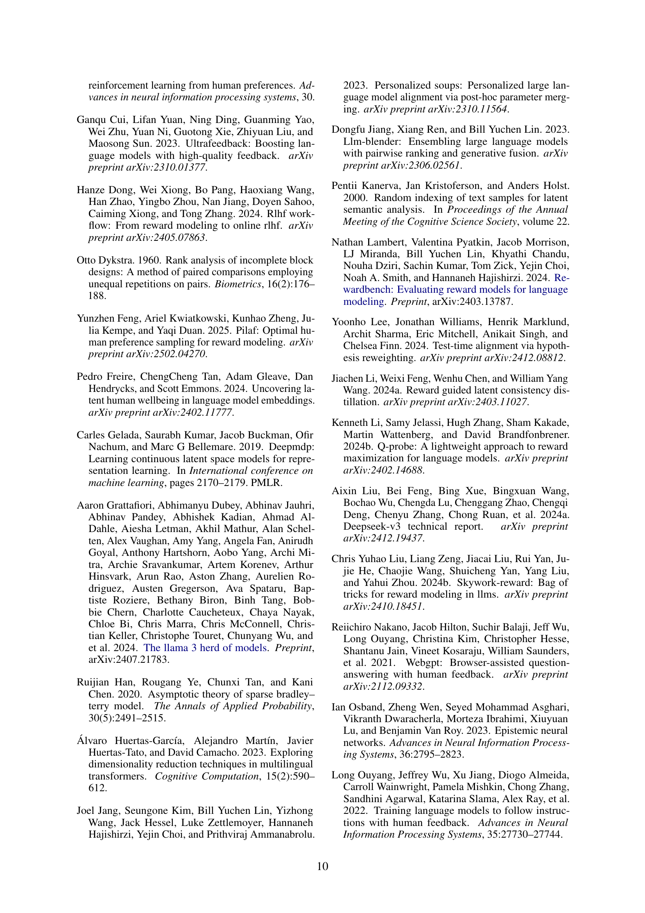

 


 2502.13131 
 Feng Luo et el. 
 
 🤗 2025-02-19 
 



↗ arXiv


↗ Hugging Face


### TL;DR



기존의 인공지능 모델은 단순한 스칼라 값으로 사람의 선호도를 나타내어 다양하고 복합적인 선호도를 제대로 반영하지 못한다는 문제점이 있었습니다. 이는 특정 집단의 선호도가 과대 또는 과소 평가되는 결과를 초래할 수 있습니다. 또한, 수집하기 어렵고 비용이 많이 드는 세분화된 데이터에 의존하는 경향이 있습니다.

본 논문에서는 이러한 문제를 해결하기 위해 **PCA(주성분 분석) 기반의 새로운 보상 모델인 DRMs(Decomposed Reward Models)를 제안**합니다. DRMs는 이진 비교 데이터를 사용하여 인간의 선호도를 다차원 벡터로 나타내고 PCA를 통해 각 차원의 독립적인 선호도를 추출합니다. 이를 통해 다양한 사용자의 요구를 만족시키는 유연하고 해석 가능한 보상 모델을 구축할 수 있습니다. 실험 결과, DRMs는 기존 모델보다 우수한 성능을 보였으며, 특히 새로운 사용자에게 적응하는 능력이 뛰어났습니다.



#### Key Takeaways


 DRMs는 PCA를 이용하여 다양한 인간 선호도를 효율적으로 추출하는 새로운 방법을 제시합니다. 



 DRMs는 기존의 단일 스칼라 보상 모델의 한계를 극복하고, 사용자 선호도에 맞춰 유연하게 적응할 수 있습니다. 



 DRMs는 해석 가능하고 확장 가능하며, 개인화된 AI 시스템 개발 및 LLM 정렬에 중요한 의미를 지닙니다. 


#### Why does it matter?
본 논문은 **다양한 인간의 선호도를 효과적으로 포착하는 새로운 프레임워크인 DRMs(Decomposed Reward Models)를 제시**하여, 기존의 제한적인 단일 스칼라 보상 모델의 문제점을 해결합니다.  이는 **개인화된 AI 시스템 개발 및 LLM 정렬에 대한 새로운 방향**을 제시하며, 추후 연구에 대한 중요한 의미를 지닙니다. 특히, **PCA를 활용한 다차원적 선호도 분석**은 다양한 응용 분야에 적용 가능한 혁신적인 방법론을 제시합니다.  더불어, **해석 가능성과 확장성을 모두 고려**한 모델 설계는 AI 연구의 윤리적 측면까지 고려한 점에서 높이 평가됩니다.

------
#### Visual Insights

> 🔼 그림 1은 DRMs(Decomposed Reward Models)의 분해 과정을 보여줍니다. 기존의 단일 차원 모델에서는 프롬프트-응답 쌍에 대한 예측이 잘못될 수 있습니다. 반면에 DRMs는 다차원적 선호도를 포착하여 인간의 복잡하고 다면적인 선호도를 더 효과적으로 반영합니다.  다차원 벡터로 표현된 선호도는 PCA(주성분 분석)를 통해 다양한 선호도 요소(예: 유용성, 안전성, 유머)를 추출하고, 이들을 독립적인 기저 벡터로 분해하여 각기 다른 사용자의 요구에 맞춰 유연하게 조합할 수 있게 합니다.  이러한 분해된 보상들은 다른 사용자의 필요에 맞춰 유연하게 결합될 수 있으며, 기존의 보상 모델에 비해 해석 가능하고 확장 가능한 대안을 제공합니다.
> 

> 
read the caption

> Figure 1: Illustration of the decomposition pipeline in DRMs. In the original single-dimensional head, a prompt–response pair can be predicted incorrectly. In contrast, DRMs capture preferences along multiple dimensions, aligning more effectively with the complex and multifaceted nature of human preferences.
> 


| Benchmark | Attribute | Gemma-2B-RM Single Head | Gemma-2B-RM Max Value | Gemma-2B-RM Max Head | Llama3-8B-RM Single Head | Llama3-8B-RM Max Value | Llama3-8B-RM Max Head |
|---|---|---|---|---|---|---|---| 
| **RewardBench** | Overall | 0.733 | **0.735** | head_0 | 0.862 | **0.869** | head_0 |
|  | Chat | 0.944 | **0.950** | head_0 | 0.983 | **0.986** | head_0 |
|  | Chat Hard | 0.467 | **0.660** | head_3 | 0.684 | **0.695** | head_3 |
|  | Safety | **0.759** | 0.745 | head_0, head_8 | 0.868 | **0.886** | head_0 |
|  | Reasoning | 0.759 | **0.821** | head_32 | 0.912 | **0.923** | head_0 |
| **RPR** | Overall | 0.714 | **0.735** | head_0 | **0.853** | 0.839 | head_0 |
|  | User-Friendliness | 0.506 | **0.798** | head_9, head_26 | 0.719 | **0.899** | head_10 |
|  | Narrative & Storytelling | 0.662 | **0.825** | head_12 | 0.838 | **0.912** | head_5 |
|  | Linguistic Creativity | 0.817 | **0.885** | head_12 | 0.875 | **0.981** | head_37 |
|  | Scientific Rigor | **0.881** | **0.881** | head_34 | 0.940 | **0.964** | head_0 |
|  | Humor & Entertainment | 0.690 | **0.964** | head_9 | 0.893 | **0.952** | head_37, head_74 |

> 🔼 표 1은 상위 100개의 분해된 보상 헤드의 성능을 보여줍니다. '단일 헤드'는 훈련된 단일 헤드 기준선을 나타내고, '최대값'은 각 속성에 대해 달성된 최고 점수를 나타내며, '최대 헤드'는 이 최고 점수를 달성한 특정 헤드를 나타냅니다. '전체'는 모든 속성에 걸친 단일 헤드의 평균 정확도를 나타냅니다. 이 표는 다양한 속성에 대한 여러 보상 헤드의 성능을 비교하여, 각 헤드가 특정 속성에 특화되어 있음을 보여줍니다. 
> 

> 
read the caption

> Table 1: Performance of top 100 decomposed reward heads. “Single Head' is the trained single-head baseline. “Max Value' refers to the highest score achieved for each attribute, while “Max Head' indicates which specific head attains this maximum score. “Overall' represents the average accuracy of a single head across all attributes.
> 

### In-depth insights

#### Diverse Reward Models
다양한 보상 모델(Diverse Reward Models)은 인간의 다양하고 복잡한 선호도를 포착하기 위해 **여러 보상 신호**를 통합하는 강력한 접근 방식입니다. 기존의 단일 보상 신호 접근 방식은 인간 선호도의 전체 범위를 포착하는 데 어려움을 겪을 수 있습니다. 다양한 보상 모델은 이러한 한계를 극복하여 다양한 선호도를 보다 정확하게 반영할 수 있습니다. **다차원 보상 신호**를 사용함으로써 사용자의 다양한 요구 사항과 선호도를 충족하고, 모델의 해석성을 높일 수 있다는 **장점**이 있습니다. 예를 들어, 유용성, 안전성, 유머와 같은 여러 가지 측면을 고려하여 보상 신호를 생성할 수 있습니다. 다양한 보상 모델의 설계 및 훈련은 복잡한 과제이지만, 최근의 연구는 이 문제를 해결하기 위해 PCA와 같은 차원 축소 기법과 다양한 머신러닝 기술을 활용하고 있습니다. **개인화된 LLM 정렬**을 향상시키고자 하는 미래의 연구는 이러한 다양한 보상 모델 접근 방식을 더욱 발전시키고 개선하는 데 주력할 것으로 예상됩니다.

#### PCA for Preferences
본 논문에서 제안하는 'PCA를 활용한 선호도 분석(PCA for Preferences)'은 기존의 단순한 스칼라 기반 보상 모델의 한계를 극복하기 위한 혁신적인 접근 방식입니다. **다차원적이고 복합적인 인간의 선호도를 효과적으로 포착**하기 위해, PCA를 이용하여 다양한 선호도 차원을 추출하고, 이를 직교하는 기저 벡터로 나타냅니다. 이는 **단일 스칼라 값으로는 표현할 수 없는 다양한 선호도 측면을 명확히 구분**하여 분석할 수 있게 합니다.  **PCA는 고차원의 임베딩 차이 데이터를 저차원의 의미있는 특징으로 변환**하여, 해석 가능성과 확장성을 높이는 데 중요한 역할을 합니다. 이러한 **분해된 보상 모델(DRMs)**은 개별 사용자의 선호도에 맞춰 유연하게 조합될 수 있으며, 추가적인 훈련 없이 새로운 사용자에게 적응할 수 있습니다.  **해석 가능성과 확장성을 동시에 만족**하는 이러한 접근 방식은 개인화된 LLM 정렬을 위한 강력한 프레임워크로서 활용될 수 있다는 점에서 큰 의의를 가집니다.  더 나아가, **추출된 주요 성분 분석 결과를 사용자의 선호도 특징과 연관시켜 설명 가능성을 높일** 수 있습니다.  이 방법은 단순히 예측 성능을 향상시키는 것뿐만 아니라, **인간의 선호도를 이해하고, 이를 LLM에 반영하는 과정 자체의 투명성을 높이는** 데 기여합니다.

#### Test-Time Adaptation
본 논문에서 제시된 'Test-Time Adaptation' 전략은 **사용자의 선호도에 대한 미세 조정 없이 새로운 사용자에게 신속하게 적응**할 수 있는 강력한 방법을 제시합니다.  **소규모 적응 데이터셋을 활용하여 기존 학습된 모델의 가중치를 조정**함으로써, 기존의 재학습 기반 방법들과 달리 효율적이고 유연한 사용자 맞춤형 시스템 구축이 가능해집니다. 이러한 접근 방식은 **개인화된 AI 시스템 개발에 있어 확장성과 해석 가능성 측면**에서 상당한 이점을 제공합니다.  특히 **다양한 사용자의 선호도를 효과적으로 포착**하고, 새로운 사용자의 요구에 맞춰 **실시간으로 유연하게 적응**하는 능력은  LLM(대규모 언어 모델)의 개인화와 해석 가능성 향상에 중요한 의미를 지닙니다.  **저자들은 실험을 통해 제시된 방법의 우수성을 검증**하였으며, 향후 개인화된 LLM 개발 및 적용에 중요한 기여를 할 것으로 기대됩니다.

#### Interpretability Study
본 논문에서는 **해석 가능성 연구(Interpretability Study)**를 통해 인간의 선호도를 다차원적으로 이해하고자 하는 시도가 미흡하다는 점을 지적합니다.  **단순히 선호도 점수만을 사용하는 기존 방법의 한계를 넘어, PCA를 활용하여 추출된 다양한 선호도 차원을 분석함으로써 인간 선호도의 복잡성을 더 잘 이해할 수 있도록 합니다.**  본 연구는 PCA의 고유 벡터가 인간 선호도의 다양한 측면을 반영한다는 것을 보여주는 결과를 제시합니다. 예를 들어, 특정 고유 벡터는 안전성과 강하게 상관관계를 가지는 반면, 다른 고유 벡터는 유머와 관련이 있음을 보여줍니다.  **이러한 고유 벡터의 해석 가능성을 통해, 모델이 어떤 기준으로 선호도를 판단하는지에 대한 통찰력을 제공하여 모델의 투명성을 높일 수 있습니다.**  하지만, 모든 고유 벡터에 대한 명확한 해석을 제공하는 데에는 한계가 있을 수 있으며, **향후 연구에서는 더욱 심도있는 해석 및 다양한 인간 선호도 측면에 대한 추가적인 분석이 필요합니다.**  **이를 통해, AI 모델의 윤리적 문제를 해결하고 보다 신뢰할 수 있는 시스템을 구축하는 데 기여할 수 있을 것으로 예상됩니다.**

#### Future Work
본 논문은 다양한 인간의 선호도를 효과적으로 포착하는 새로운 프레임워크인 DRMs(Decomposed Reward Models)을 제시하지만, **향후 연구를 위한 몇 가지 중요한 방향**을 제시하고 있습니다.  먼저, 대규모(2048 또는 4096개)의 분해된 보상 헤드를 수동으로 분석하는 것은 비현실적이므로, 각 헤드가 어떤 선호도 특성과 연관되는지 자동으로 분석하는 방법론 개발이 필요합니다. 즉, **자동화된 헤드 해석 기법** 개발이 중요한 과제입니다. 또한, 심리학 전문가와의 협업을 통해 인간의 선호도를 심층적으로 탐구함으로써, 계산 모델과 인지 과학 사이의 간극을 메우는 연구가 필요하며, **인지 과학적 관점**을 통합하는 것이 중요합니다. 마지막으로, 본 논문은 제한된 크기의 적응 데이터셋을 사용하는데, **더욱 다양하고 대규모의 데이터셋**을 활용한 실험을 통해 DRMs의 일반화 성능을 더욱 향상시킬 수 있을 것입니다. 이러한 향후 연구는 DRMs의 실용성과 해석력을 더욱 높여, 더욱 개인화되고 투명한 AI 시스템 개발에 기여할 것입니다.

### More visual insights

More on figures

> 🔼 그림 2는 Gemma-2B-RM을 백본으로 사용하는 DRMs(Decomposed Reward Models)에서 RewardBench에 대한 상위 100개의 분해된 보상 헤드의 가중치 분포를 보여줍니다. 각 선은 특정 속성(예: 채팅 품질, 안전성, 추론)에 대한 상위 100개 보상 헤드의 가중치를 나타내며, 가중치 분포는 해당 속성에 대한 보상 헤드의 중요도를 반영합니다. 이 그림은 DRMs가 다양한 속성에 대한 보상 헤드의 가중치를 어떻게 분포시키는지 보여주는 시각적 표현입니다.
> 

> 
read the caption

> Figure 2: Weight distributions of the top 100 decomposed reward heads on RewardBench for DRMs using Gemma-2B-RM as the backbone.
> 

> 🔼 그림 3은 DRMs(Decomposed Reward Models)에서 사용된 가중치 벡터들 간의 상관관계를 보여줍니다. Gemma-2B-RM이 특징 추출기(feature extractor)로 사용되었으며, 각 속성(attribute)의 가중치 벡터 간의 피어슨 상관계수(Pearson correlation coefficient)를 나타내는 상관관계 행렬(correlation matrix)을 시각화하고 있습니다. 이를 통해, 각 속성 벡터들 간의 유사성 및 상이점을 정량적으로 분석하여 DRMs가 다양한 인간 선호도를 어떻게 포착하는지 보여줍니다. 예를 들어, ‘스토리텔링’과 ‘유머’는 높은 상관관계를, ‘과학적 엄격성’은 다른 많은 속성들과는 상관관계가 낮거나 음의 상관관계를 보이는 것을 확인할 수 있습니다.
> 

> 
read the caption

> Figure 3: Correlation among weight vectors for DRMs. The feature extractor is Gemma-2B-RM.
> 

> 🔼 그림 4는 Gemma-2B-RM 기반의 테스트 시간 적응에 대한 적응 집합 크기 및 보상 헤드 수에 대한 절삭 연구 결과를 보여줍니다.  x축은 적응 집합 크기(n)를 나타내고, y축은 정확도를 나타냅니다.  각 선은 서로 다른 수의 보상 헤드를 사용한 결과를 나타내며, 다양한 크기의 적응 집합을 사용하여 모델 성능이 어떻게 변하는지 보여줍니다. 이를 통해 최적의 적응 성능을 달성하기 위한 적응 집합 크기와 보상 헤드 수의 최적 조합을 파악할 수 있습니다.  테스트 시간 적응은 새로운 사용자의 선호도에 맞게 모델을 빠르게 조정하는 데 중요한 역할을 합니다.
> 

> 
read the caption

> Figure 4: Ablations on the adaptation set size and number of reward heads for test-time adaptation based on Gemma-2B-RM.
> 

> 🔼 그림 5는 Llama3-8B-RM에 대한 테스트 시간 적응을 위해 적응 세트 크기와 보상 헤드 수에 대한 추가 실험 결과를 보여줍니다. 이 그래프는 테스트 시간 적응 성능에 대한 적응 데이터 크기와 사용된 보상 헤드 수의 영향을 보여줍니다.  x축은 적응 세트 크기를 나타내고 y축은 정확도를 나타냅니다. 여러 선은 서로 다른 수의 보상 헤드를 사용한 결과를 보여줍니다. 이 그림은 본 논문의 주요 내용을 뒷받침하는 추가적인 증거를 제공합니다.  즉, 적응 데이터의 양이 많아질수록, 그리고 적절한 수의 보상 헤드가 사용될수록 테스트 시간 적응 성능이 향상됨을 보여줍니다.
> 

> 
read the caption

> Figure 5: Ablations on the adaptation set size and number of reward heads for test-time adaptation on Llama3-8B-RM.
> 

> 🔼 그림 6은 Gemma-2B-RM을 백본으로 사용하는 DRMs에서 RPR에 대한 상위 100개의 분해된 보상 헤드의 가중치 분포를 보여줍니다. 각 선은 특정 속성에 대한 상위 100개 헤드의 가중치를 나타내며, 이는 각 헤드가 특정 속성에 얼마나 기여하는지에 대한 통찰력을 제공합니다.  가중치 분포는 특정 속성에 대한 보상 헤드의 중요도를 시각적으로 보여주어, 모델의 해석성을 높이고 다양한 사용자 선호도를 파악하는 데 도움이 됩니다.
> 

> 
read the caption

> Figure 6: Weight distributions of the top 100 decomposed reward heads on RPR for DRMs using Gemma-2B-RM as the backbone.
> 

More on tables


| Base Model | Method | User
Friendliness | Narrative
& Storytelling | Linguistic
Creativity | Scientific
Rigor | Humor
& Entertainment | Overall |
|---|---|---|---|---|---|---|---|
| **Gemma-2B-RM** | Single Head | 0.506 | 0.662 | 0.817 | 0.881 | 0.690 | 0.714 |
|  | Shared-Base | 0.517(0.000) | 0.688(0.000) | 0.817(0.000) | 0.881(0.000) | 0.690(0.000) | 0.721(0.000) |
|  | Random (Uniform) | 0.713(0.062) | 0.782(0.068) | 0.920(0.045) | 0.907(0.043) | 0.907(0.026) | 0.848(0.024) |
|  | Random (Gaussian) | 0.582(0.039) | 0.760(0.060) | 0.823(0.063) | 0.873(0.025) | 0.817(0.053) | 0.771(0.022) |
|  | **DRM (Ours)** | **0.789(0.062)** | **0.871(0.033)** | **0.953(0.034)** | **0.907(0.019)** | **0.975(0.017)** | **0.900(0.017)** |
| **Llama3-8B-RM** | Single Head | 0.685 | 0.825 | 0.846 | 0.964 | 0.905 | 0.844 |
|  | Shared-Base | 0.674(0.000) | 0.825(0.000) | 0.827(0.000) | 0.964(0.000) | 0.881(0.000) | 0.832(0.000) |
|  | Random (Uniform) | 0.616(0.104) | 0.860(0.037) | 0.798(0.103) | 0.958(0.007) | 0.906(0.031) | 0.823(0.041) |
|  | Random (Gaussian) | 0.730(0.100) | 0.892(0.027) | 0.887(0.055) | 0.956(0.008) | 0.919(0.032) | 0.875(0.028) |
|  | **DRM (Ours)** | **0.812(0.063)** | **0.946(0.029)** | **0.945(0.015)** | **0.969(0.010)** | **0.991(0.011)** | **0.931(0.016)** |
> 🔼 표 2는 RPR 데이터셋(적응 데이터셋 크기 n=5)을 사용하여 다양한 모델들의 성능을 비교한 결과를 보여줍니다.  비교 대상은 단일 헤드 기준 모델, 공유 기반 모델, 그리고 임의로 생성된 다중 헤드 기준 모델입니다. 단일 헤드 기준 모델을 제외한 다른 모델들은 모두 HyRe 기법을 사용하여 테스트 시간 적응을 수행했습니다. 표에는 20개의 무작위로 선택된 적응 데이터셋에 대한 표준 편차가 함께 제시되어 있습니다.
> 

> 
read the caption

> Table 2: Evaluation Results on RPR (n=5𝑛5n=5italic_n = 5). We compare DRMs with trained baselines (“Single Head' and “Shared-Base'), and randomly generated multi-head baselines (“Random'). Except for single-head baseline, other methods use HyRe for test-time adaptation. Standard deviation over 20 sampled adaptation sets are reported.
> 


| Base Model | Method | Chat | Chat Hard | Safety | Reasoning | Overall |
|---|---|---|---|---|---|---|
| **Gemma-2B-RM** | Single Head | 0.944 | 0.467 | 0.759 | 0.759 | 0.733 |
|  | Shared-Base | 0.947(0.000) | 0.476(0.000) | 0.765(0.000) | 0.774(0.000) | 0.740(0.000) |
|  | Random (Uniform) | 0.940(0.005) | 0.567(0.029) | **0.800(0.010)** | 0.843(0.019) | 0.787(0.009) |
|  | Random (Gaussian) | 0.951(0.005) | 0.573(0.033) | 0.781(0.015) | 0.839(0.021) | 0.786(0.008) |
|  | **DRMs(Ours)** | **0.953(0.003)** | **0.650(0.028)** | **0.872(0.025)** | **0.814(0.013)** |  |
| **Llama3-8B-RM** | Single Head | **0.989** | 0.684 | 0.891 | 0.920 | 0.871 |
|  | Shared-Base | 0.986(0.000) | 0.684(0.000) | 0.895(0.000) | 0.927(0.000) | 0.873(0.000) |
|  | Random (Uniform) | 0.985(0.003) | **0.903(0.010)** | 0.915(0.014) | 0.857(0.023) |  |
|  | Random (Gaussian) | 0.982(0.004) | 0.889(0.009) | **0.936(0.011)** | 0.868(0.024) |  |
|  | **DRMs(Ours)** | 0.986(0.002) | **0.755(0.032)** | 0.885(0.036) | 0.914(0.036) | **0.885(0.012)** |
> 🔼 표 3은 두 가지 기본 모델(Gemma-2B-RM과 Llama3-8B-RM)에서 서로 다른 방법들을 비교 분석한 결과를 보여줍니다. 테스트 시간 적응(test-time adaptation)을 위해 사용된 적응 데이터셋의 크기(n)는 15입니다. 표에는 채팅 품질, 채팅 난이도, 안전성, 추론 능력 등 다양한 속성에 대한 각 모델의 성능 점수가 제시되어 있으며, 단일 헤드 모델(Single Head), 공유 기반 모델(Shared-Base), 무작위 헤드 모델(Random), 제안된 DRMs 모델의 성능을 비교합니다. 각 모델의 평균 정확도와 표준 편차를 포함하여 상세한 성능 비교가 이뤄집니다.
> 

> 
read the caption

> Table 3: Evaluation Results (n=15𝑛15n=15italic_n = 15), comparing different methods across two base models.
> 


| Benchmark | Attributes | Single Head | Random (Uniform) | DRM(Ours) |
|---|---|---|---|---|
| **RewardBench** | Overall | 0.759 | 0.770 | **0.830** |
|  | Chat | 0.905 | 0.897 | **0.920** |
|  | Chat Hard | 0.621 | 0.600 | **0.692** |
|  | Safety | 0.699 | 0.753 | **0.786** |
|  | Reasoning | 0.813 | 0.832 | **0.920** |
| **RPR** | Overall | 0.746 | 0.630 | **0.796** |
|  | User-Friendliness | 0.640 | 0.555 | **0.657** |
|  | Narrative & Storytelling | 0.713 | 0.610 | **0.763** |
|  | Linguistic Creativity | 0.808 | 0.595 | **0.843** |
|  | Scientific Rigor | 0.762 | 0.661 | **0.806** |
|  | Humor & Entertainment | 0.798 | 0.744 | **0.905** |
> 🔼 표 4는 instruction-tuned 모델인 gemma-2-9b-it에 대해 DRMs의 성능을 보여줍니다. 단일 헤드 기준 모델은 DRMs와 동일한 데이터셋으로 학습되었습니다. 이전 설정과 일치하도록 RewardBench에는 n=15, RPR에는 n=5의 적응 데이터셋 크기를 사용했습니다. 이 표는 다양한 속성에 대한 DRMs의 성능을 보여주는 다양한 지표(예: 정확도, 평균 정확도)를 포함합니다. 이를 통해 instruction-tuned 모델에서의 DRMs의 효과성 및 다양한 속성에 대한 적응력을 평가할 수 있습니다.
> 

> 
read the caption

> Table 4: Performance of DRMs on instruction-tuned model gemma-2-9b-it. Single head baseline is trained with the same dataset used for DRMs. Aligned with the previous setting, we use n=15𝑛15n=15italic_n = 15 and n=5𝑛5n=5italic_n = 5 for RewardBench and RPR respectively.
> 

### Full paper



