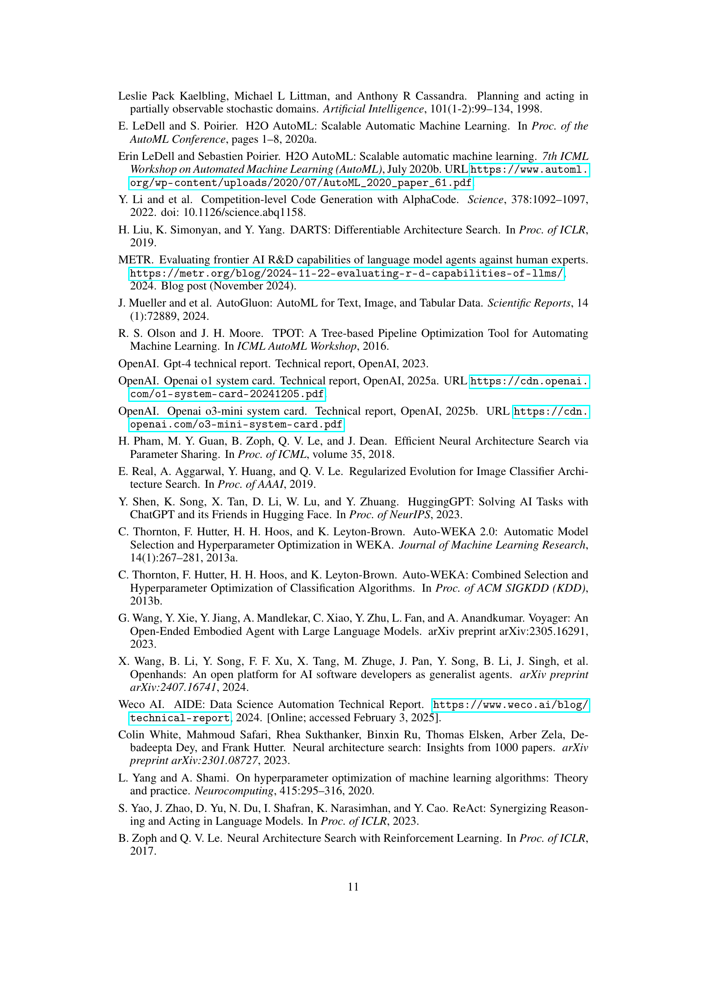

 


 2502.13138 
 Zhengyao Jiang et el. 
 
 🤗 2025-02-20 
 



↗ arXiv


↗ Hugging Face


↗ Papers with Code


### TL;DR



최근 머신러닝 모델 개발은 **복잡하고 시간이 많이 소요되는 과정**이며, 연구자들은 시행착오에 많은 시간을 할애합니다. 이러한 문제를 해결하기 위해 기존 AutoML 기법들은 자동화된 모델 선택 및 하이퍼파라미터 최적화를 시도했지만, 여전히 **검색 공간 정의 및 계산 비용**과 같은 어려움이 존재합니다. 

본 논문에서는 **대규모 언어 모델(LLM)을 기반으로 한 AI 기반 코드 탐색 에이전트인 AIDE**를 제안합니다. AIDE는 머신러닝 엔지니어링 문제를 코드 최적화 문제로 보고, 시행착오 과정을 트리 검색으로 형식화합니다. **유망한 솔루션을 재사용 및 개선**하여 계산 자원을 효율적으로 활용하며, 다양한 머신러닝 엔지니어링 벤치마크에서 최첨단 성능을 달성합니다. AIDE의 오픈소스 공개는 연구 확장과 협업을 가능하게 하여 AutoML 분야의 발전을 가속화합니다.



#### Key Takeaways


 LLM 기반 머신러닝 엔지니어링 에이전트 AIDE 제시 



 다양한 벤치마크에서 최첨단 성능 달성 



 AIDE의 오픈소스 공개를 통한 연구 확장 및 협업 가능성 제시 


#### Why does it matter?
본 논문은 **LLM 기반 머신러닝 엔지니어링 에이전트인 AIDE**를 소개하여 머신러닝 모델 개발 과정의 반복적인 시행착오를 자동화함으로써 연구자들의 효율성을 높이고 혁신적인 솔루션 개발에 집중할 수 있도록 합니다.  **AIDE의 오픈소스 공개**는 다른 연구자들이 이를 활용하고 개선하여 더욱 발전된 머신러닝 엔지니어링 기술을 개발할 수 있는 기회를 제공하며, **다양한 벤치마크에서 우수한 성능**을 입증하여 AutoML 분야의 새로운 가능성을 제시합니다. 이는 **현재 AutoML 연구의 한계를 극복**하고 머신러닝 모델 개발의 효율성을 높이는 데 크게 기여할 것으로 예상됩니다.

------
#### Visual Insights

> 🔼 그림 1은 AIDE의 솔루션 트리(T)의 예시를 보여줍니다. 각 노드는 파이썬 스크립트를 나타내며, 화살표는 코딩 연산자(f)가 제안하는 전이를 나타냅니다. 일부 가지는 버그로 끝나지만, 다른 가지는 개선되거나 최적화된 솔루션으로 이어집니다. 이 그림은 AIDE 알고리즘이 어떻게 솔루션 공간을 체계적으로 탐색하여 최적의 솔루션을 찾는지 시각적으로 보여줍니다. 각 노드의 평가 결과를 바탕으로, AIDE는 트리 탐색 알고리즘을 사용하여 가장 좋은 솔루션으로 이동합니다.  이는 AIDE의 반복적이고 점진적인 최적화 과정을 잘 보여주는 예시입니다.
> 

> 
read the caption

> Figure 1: A sample solution tree T𝑇Titalic_T for AIDE, where each node is a Python script. Arrows represent transitions proposed by the coding operator f𝑓fitalic_f. Some branches terminate in a bug, while others lead to improved or optimal solutions.
> 


| Agent | Model | Exceeds % of humans ↑ | Above Median (%) ↑ |
|---|---|---|---| 
| AIDE | GPT-4 Turbo | 51.38 | 50.00 |
| AutoML (H2O) | N/A | 35.34 | 18.75 |
| AutoGPT (Langchain) | GPT-4 Turbo | 32.34 | 0.00 |
| Human with ChatGPT | GPT-4 Turbo | 41.17 | 18.75 |

> 🔼 이 표는 Kaggle의 16가지 표 형태 머신러닝 과제에서 AIDE를 다른 에이전트 프레임워크들과 비교한 결과를 보여줍니다.  'Exceeds % of humans'는 경쟁자 중 AIDE보다 성능이 낮았던 인간 참가자의 비율을 평균낸 값입니다.  'Above Median (%)는 AIDE의 점수가 인간 참가자 중앙값보다 높았던 경쟁의 비율을 나타냅니다. 즉, AIDE의 성능이 얼마나 인간 수준을 능가하는지, 그리고 중간 수준의 인간 참가자보다 얼마나 더 좋은 성능을 보이는지를 보여주는 지표입니다.
> 

> 
read the caption

> Table 1: Comparing AIDE to other agent frameworks on 16 tabular machine learning tasks from Kaggle. Exceeds % of humans indicates the percentage of human Kaggle participants being outperformed by the agents, averaged across the competitions. Above Median (%) is the fraction of competitions where the score was strictly above the median of human Kaggle participants.
> 

### In-depth insights

#### AI-Driven Code Search
AI 기반 코드 검색은 소프트웨어 개발의 혁신을 가져올 **잠재력**을 지닌 분야입니다. **대규모 언어 모델(LLM)**의 발전으로 코드를 생성하고, 수정하고, 이해하는 AI의 능력이 향상되었으며, 이는 코드베이스 내에서 원하는 기능이나 구현을 빠르게 찾는 데 활용될 수 있습니다.  **효율적인 코드 검색**은 개발 시간 단축, 유지보수 비용 절감, 개발자 생산성 향상으로 이어집니다.  그러나, **코드의 다양성과 복잡성**은 AI 기반 코드 검색의 정확도와 효율성에 영향을 미치는 요소가 됩니다. **세밀한 검색 기능**과 **정확한 코드 이해 능력**은 AI 기반 코드 검색 시스템의 성패를 좌우하며, 이를 위해서는 **지속적인 연구 개발**이 필수적입니다.  **다양한 프로그래밍 언어**에 대한 지원과 **다양한 코드 스타일**에 대한 적응력 또한 중요한 고려 사항입니다.  **보안 취약점** 발견 및 **코드 품질 향상**에도 AI 기반 코드 검색 기술이 기여할 수 있습니다.  결론적으로, AI 기반 코드 검색은 소프트웨어 개발 방식을 혁신적으로 바꿀 가능성이 높지만, **기술적 과제**를 해결하고 **신뢰성과 안정성**을 확보하기 위한 노력이 지속적으로 필요합니다.

#### LLM-powered Agent
LLM 기반 에이전트는 **대규모 언어 모델(LLM)**의 능력을 활용하여 **자동화된 머신러닝 엔지니어링**을 가능하게 하는 혁신적인 접근 방식입니다. 기존의 반복적이고 수동적인 작업들을 자동화하여 효율성을 높이고, **인간 전문가의 시간과 노력을 절감**하는 데 크게 기여합니다.  **코드 최적화 문제**로 머신러닝 엔지니어링을 재정의하여 시행착오 과정을 트리 탐색으로 형식화함으로써, 유망한 솔루션을 재사용하고 개선하여 성능 향상을 이끌어냅니다.  **LLM의 도메인 지식 활용**은 탐색 공간을 효과적으로 좁히고 계산 자원을 효율적으로 사용할 수 있게 합니다.  **다양한 머신러닝 엔지니어링 벤치마크**에서 최첨단 성능을 달성함으로써, LLM 기반 에이전트의 실용성과 효과성을 입증하였습니다.  하지만, **과도한 프롬프트 크기**와 **과적합** 문제를 해결하기 위한 추가적인 연구가 필요하며, **복잡한 문제 해결**을 위한 전략의 고도화도 중요한 과제입니다.  궁극적으로, LLM 기반 에이전트는 **인간 전문가의 역할을 보완하고 협력**하는 방향으로 발전하며, AI 주도의 머신러닝 엔지니어링 시대를 앞당길 것입니다.

#### Tree Search Method
본 논문에서 제시된 트리 탐색 기법은 **기계 학습 엔지니어링 문제를 코드 최적화 문제로 재구성**하고, **시행착오 과정을 트리 탐색으로 형식화**하여 효율적인 솔루션 탐색을 가능하게 합니다.  **LLM(대규모 언어 모델)을 활용**하여 새로운 코드 솔루션을 제안하고, **성능 평가를 통해 최적의 솔루션을 선택**하는 과정은 반복적인 개선을 통해 최적화된 결과를 도출합니다.  단순히 무작위적인 시행착오를 반복하는 것이 아니라, **기존 솔루션을 재사용 및 개선**하여 계산 자원을 효율적으로 사용합니다.  이러한 트리 기반의 점진적 최적화 전략은 기존의 전체적인 최적화 문제 해결 방식에 비해 **계산 효율성을 높이고, 성능을 향상**시키는 데 크게 기여합니다. 특히, **LLM의 도메인 지식 활용**을 통해 유망한 솔루션을 효과적으로 찾아내는 것이 핵심적이며, 이는 **샘플 효율성 향상**으로 이어집니다.  그러나, 트리의 깊이와 탐색 전략에 따라 성능이 달라질 수 있으므로, **최적의 트리 탐색 전략을 수립**하는 것은 중요한 과제입니다. 또한, LLM의 제한된 컨텍스트 창 크기 및 계산 비용 등의 요소를 고려하여 **실용적인 탐색 전략을 설계**하는 것이 중요합니다.

#### Benchmark Results
본 논문에서 제시된 벤치마크 결과는 AIDE의 성능을 다각적으로 평가하기 위해 **다양한 벤치마크 데이터셋과 평가 지표를 활용**했다는 점에서 주목할 만합니다.  **Kaggle 경진대회, OpenAI의 MLE-Bench, 그리고 METR의 RE-Bench** 등 실제 머신러닝 엔지니어링 문제들을 반영한 벤치마크에서 AIDE가 기존 방법들에 비해 우수한 성능을 보였다는 것은 고무적입니다. 특히,  **시간 제약 하에서 인간 전문가를 능가하는 성능**을 보인 RE-Bench 결과는 AIDE의 효율성과 실용성을 강조합니다.  그러나, **벤치마크 결과의 일반화 가능성**에 대한 논의가 부족하다는 점은 아쉬움으로 남습니다.  **다양한 유형의 문제와 데이터셋에 대한 추가적인 실험**을 통해 AIDE의 성능을 더욱 폭넓게 검증하고, 그 한계점을 명확히 밝히는 후속 연구가 필요할 것으로 예상됩니다. 또한, **특정 벤치마크 환경에 최적화된 결과**가 아닌, 더욱 일반적인 머신러닝 엔지니어링 과제에서도 우수한 성능을 발휘할 수 있도록 AIDE의 알고리즘을 개선해야 할 것입니다. 

#### Future of AutoML
AutoML의 미래는 **자동화된 머신러닝 엔지니어링의 발전**에 달려 있습니다.  본 논문에서 제시된 AIDE와 같은 강력한 LLM 기반 에이전트는 반복적인 시행착오 과정을 자동화하여 연구자들이 혁신적인 솔루션에 집중할 수 있도록 지원합니다.  **코드 공간 탐색**은 사전 정의된 구성 설정 공간에 국한되지 않고, **LLM의 코드 생성 및 수정 능력**을 활용하여 더욱 유연하고 효율적인 최적화를 가능하게 합니다.  그러나, **LLM의 한계 및 데이터 편향**은 여전히 극복해야 할 과제이며, **해석 가능성 및 신뢰성**에 대한 연구가 더욱 필요합니다.  AIDE의 성공은 AutoML이 단순한 하이퍼파라미터 최적화를 넘어, **전체 머신러닝 파이프라인의 설계 및 최적화**를 자동화하는 방향으로 나아갈 것임을 시사합니다.  **다양한 도메인과 복잡한 문제에 대한 적용성 확장**과 **인간 전문가의 역할 재정립** 또한 AutoML의 미래를 논의할 때 중요하게 고려되어야 할 부분입니다.

### More visual insights

More on figures

> 🔼 그림 2는 Weco Kaggle 벤치마크의 전체 데이터셋에 대한 AIDE의 성능 분포를 보여줍니다.  가로축은 경쟁 순위(성능)를 나타내고, 세로축은 AIDE가 해당 순위를 넘어서는 인간 참가자의 비율(%)을 나타냅니다.  즉, 각 막대는 특정 경쟁에서 AIDE의 성능이 상위 X%의 인간 참가자를 능가했음을 보여줍니다.  이 그래프는 AIDE의 성능이 Weco Kaggle 벤치마크 내 다양한 과제에 걸쳐 일관되지 않고, 일부 과제에서는 매우 높은 성능을, 다른 과제에서는 상대적으로 낮은 성능을 보임을 시각적으로 보여줍니다. 리더보드 분포를 기반으로 인간 참가자 대비 AIDE의 성능 우위 비율을 추정했습니다.
> 

> 
read the caption

> Figure 2: AIDE’s performance distribution on full Weco-Kaggle benchmark. Exceeds % of Humans values are estimated from the leaderboard distribution.
> 

> 🔼 그림 3은 MLE-bench Lite 데이터셋(복잡도: 낮음)에서 AIDE를 사용했을 때와 사용하지 않았을 때의 o1-preview 성능을 비교한 것입니다. AIDE를 사용하지 않았을 때보다 사용했을 때 유효 제출 비율, 중앙값 이상 성능, 금메달 획득률, 메달 획득률이 모두 상당히 향상되었음을 보여줍니다. 이는 AIDE의 반복적인 최적화 접근 방식이 모델의 문제 해결 능력을 크게 향상시켜 더욱 신뢰할 수 있고 질 높은 솔루션을 체계적으로 개선할 수 있게 함을 시사합니다.
> 

> 
read the caption

> Figure 3: Performance of o1-preview with and without AIDE on MLE-bench Lite (complexity=low) set.
> 

> 🔼 그림 4는 METR(2024)에서 보고한 바와 같이 AIDE+o1-preview와 최고 수준의 인간 과학자들이 7가지 AI R&D 과제에서 달성한 평균 점수를 보여줍니다. AIDE는 실험 반복 속도를 높임으로써 6시간 이내에 인간 과학자들을 능가하는 성과를 달성했습니다. 그러나 AIDE가 지역적 최적점에 빠질 수 있는 단순한 탐욕적 정책을 채택했기 때문에 인간 과학자들이 결국 따라잡았습니다.
> 

> 
read the caption

> Figure 4: Average score achieved by AIDE+o1-preview and top human scientists on 7 AI R&D tasks, as report by METR (2024). AIDE managed to surpass human scientists within six hours by enabling faster experiment iterations. However, human scientists eventually caught up, as AIDE adopts a simple greedy policy that may lead to local optima on challenging R&D tasks.
> 

> 🔼 그림 5는 자전거 대여 수요 예측 Kaggle 대회의 작업 설명서를 보여줍니다.  이 그림은 대회 설명, 데이터 필드(날짜, 계절, 휴일 여부, 날씨, 온도, 습도, 풍속, 비등록 사용자 대여 수, 등록 사용자 대여 수, 총 대여 수 등), 파일(train.csv, test.csv, sample_submission.csv 등), 평가 지표(RMSLE), 제출 형식 등 대회에 대한 상세한 정보를 담고 있습니다. 이 정보는 AIDE 에이전트가 문제를 이해하고 코드를 생성하는 데 사용됩니다.  즉, AIDE가 Kaggle 대회에 참가하여 문제를 해결하기 위해 필요한 모든 정보가 이 작업 설명서에 포함되어 있습니다.
> 

> 
read the caption

> Figure 5: The task descriptor for bike-sharing-demand
> 

More on tables


| Competition | Total Teams | AIDE Rank | Exceeds % of Human | Above Median |
|---|---|---|---|---|
| [playground-series-s3e14](http://kaggle.com/c/playground-series-s3e14) | 1877 | 897 | 52.21% | False |
| [playground-series-s3e16](http://kaggle.com/c/playground-series-s3e16) | 1431 | 693 | 51.57% | False |
| [playground-series-s3e19](http://kaggle.com/c/playground-series-s3e19) | 1174 | 742 | 36.80% | True |
| [playground-series-s3e22](http://kaggle.com/c/playground-series-s3e22) | 1543 | 1142 | 25.99% | True |
| [playground-series-s3e24](http://kaggle.com/c/playground-series-s3e24) | 1910 | 655 | 65.71% | False |
| [playground-series-s3e25](http://kaggle.com/c/playground-series-s3e25) | 1633 | 948 | 41.95% | True |
| [tabular-playground-series-aug-2022](http://kaggle.com/c/tabular-playground-series-aug-2022) | 1889 | 392 | 79.25% | False |
| [tabular-playground-series-feb-2021](http://kaggle.com/c/tabular-playground-series-feb-2021) | 1434 | 559 | 61.02% | False |
| [tabular-playground-series-feb-2022](http://kaggle.com/c/tabular-playground-series-feb-2022) | 1257 | 708 | 43.68% | True |
| [tabular-playground-series-jan-2022](http://kaggle.com/c/tabular-playground-series-jan-2022) | 1592 | 886 | 44.35% | True |
| [tabular-playground-series-jul-2021](http://kaggle.com/c/tabular-playground-series-jul-2021) | 1294 | 1126 | 12.98% | True |
| [tmdb-box-office-prediction](http://kaggle.com/c/tmdb-box-office-prediction) | 1395 | 692 | 50.39% | False |
| [bike-sharing-demand](http://kaggle.com/c/bike-sharing-demand) | 3243 | 262 | 91.92% | False |
| [cat-in-the-dat](http://kaggle.com/c/cat-in-the-dat) | 1341 | 714 | 46.76% | True |
| [house-prices-advanced-regression-techniques](http://kaggle.com/c/house-prices-advanced-regression-techniques) | 4978 | 1357 | 72.74% | False |
| [new-york-city-taxi-fare-prediction](http://kaggle.com/c/new-york-city-taxi-fare-prediction) | 1485 | 819 | 44.85% | True |
| **Average** |  |  | 51.38% | 50.00% |
> 🔼 표 2는 Weco-Kaggle Lite 데이터셋을 사용하여 AIDE의 성능을 평가한 결과를 보여줍니다. Weco-Kaggle Lite는 상대적으로 복잡도가 낮고 CPU 기반 연산을 주로 사용하는 16개의 표 형태 머신러닝 작업으로 구성됩니다.  2024년 2월에 AIDE 에이전트를 수동으로 실행하여 Kaggle 리더보드의 공개/비공개 순위를 기준으로 AIDE의 성능을 평가하였습니다.  표에는 각 대회의 전체 참가자 수, AIDE의 순위, AIDE가 사람보다 성능이 뛰어난 비율(Exceeds % of Human), 그리고 AIDE가 중간값보다 높은 성능을 달성한 비율(Above Median)이 포함되어 있습니다.
> 

> 
read the caption

> Table 2: AIDE vs. human performance comparison on Weco-Kaggle Lite. The submissions were made manually in February 2024. All rankings are actual rankings on the private/public Kaggle leaderboard, assessed in February 2024.
> 


| Agent | Model | Valid Subm. (%) | Above Median (%) | Gold (%) | Any Medal (%) |
|---|---|---|---|---|---| 
AIDE | o1-preview | 82.8 ± 1.1 | 29.4 ± 1.3 | 9.4 ± 0.8 | 16.9 ± 1.1 |
| AIDE | GPT-4o | 54.9 ± 1.0 | 14.4 ± 0.7 | 5.0 ± 0.4 | 8.7 ± 0.5 |
| AIDE | Llama 3.1 | 27.3 ± 2.6 | 6.7 ± 1.4 | 1.7 ± 0.7 | 3.0 ± 1.0 |
| AIDE | Claude 3.5 | 51.1 ± 3.3 | 12.9 ± 2.2 | 4.4 ± 1.4 | 7.6 ± 1.8 |
| MLAB | GPT-4o | 44.3 ± 2.6 | 1.9 ± 0.7 | 0.8 ± 0.5 | 0.8 ± 0.5 |
| OpenHands | GPT-4o | 52.0 ± 3.3 | 7.1 ± 1.7 | 2.7 ± 1.1 | 4.4 ± 1.4 |
> 🔼 표 3은 Chan et al.(2024)의 연구에서 AIDE와 다른 에이전트 프레임워크를 비교한 MLE-Bench 결과(pass@1)를 보여줍니다. 'Valid Subm.(%)'는 제출물이 유효성 검사를 통과한 모든 경쟁의 비율을 나타내며, 'Above Median(%)'은 점수가 사람 참가자의 중간값보다 높았던 경쟁의 비율을 나타냅니다. 'Any Medal(%)'은 동메달, 은메달 또는 금메달을 받은 비율을 나타냅니다. AIDE+o1-preview와 AIDE+GPT-4o를 제외하고 각 실험은 3개의 시드로 반복되었으며, AIDE+o1-preview와 AIDE+GPT-4o는 각각 16개와 36개의 시드를 사용했습니다. 점수는 평균 ± 표준오차를 나타냅니다.
> 

> 
read the caption

> Table 3: Full MLE-Bench results (pass@1) reported by (Chan et al., 2024) comparing AIDE to other agent frameworks. Valid Subm. (%) is the fraction of all competitions (not just those with a submission) where the submission passed validity checks. Above Median (%) is the fraction of competitions where the score was strictly above the median of human Kaggle participants. Any Medal (%) is the fraction awarded a bronze, silver, or gold medal (the primary success metric). Each experiment is repeated with 3 seeds, except for AIDE+o1-preview and AIDE+GPT-4o, which use 16 and 36 seeds respectively. Scores represent the mean ± one standard error of the mean.
> 


| AutoGPT                  | Human with ChatGPT          |
|--------------------------|----------------------------|
| **Parameter**            | **Parameter**              |
| **Value**                | **Value**                  |
| `agent`                  | `model`                     |
| `LangChain AutoGPT`       | `gpt-4-0125-preview`        |
| `model`                  |                             |
| `gpt-4-0125-preview`     |                             |
| `seed`                   |                             |
| `1`                      |                             |
| `max_runtime`            |                             |
| `600`                    |                             |
> 🔼 표 4는 세 가지 기준 모델(H2O AutoML, AutoGPT, ChatGPT 사용 인간)의 하이퍼파라미터를 보여줍니다. 각 기준 모델의 주요 설정과 매개변수 값을 명시하여 실험의 재현성을 높이고 비교 분석의 기반을 마련합니다.  H2O AutoML의 경우 사용 알고리즘, AutoGPT의 경우 모델과 실행 시간 제한, ChatGPT를 이용한 인간의 경우 모델을 명시합니다.
> 

> 
read the caption

> Table 4: Baseline hyperparameters.
> 

### Full paper



