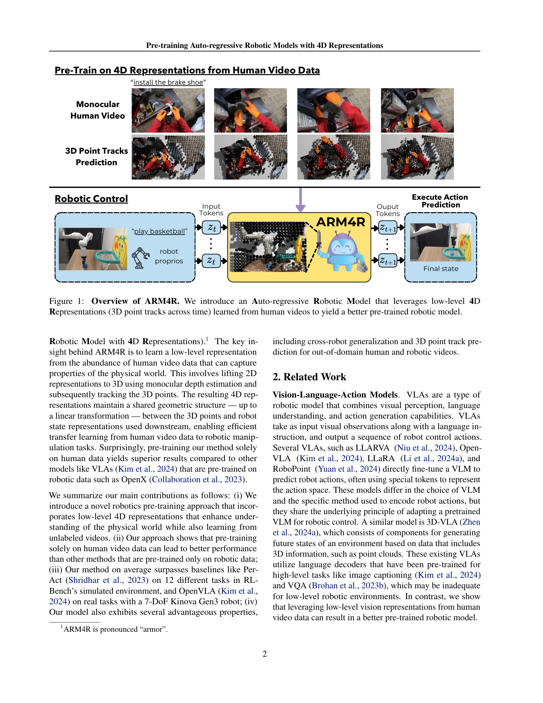
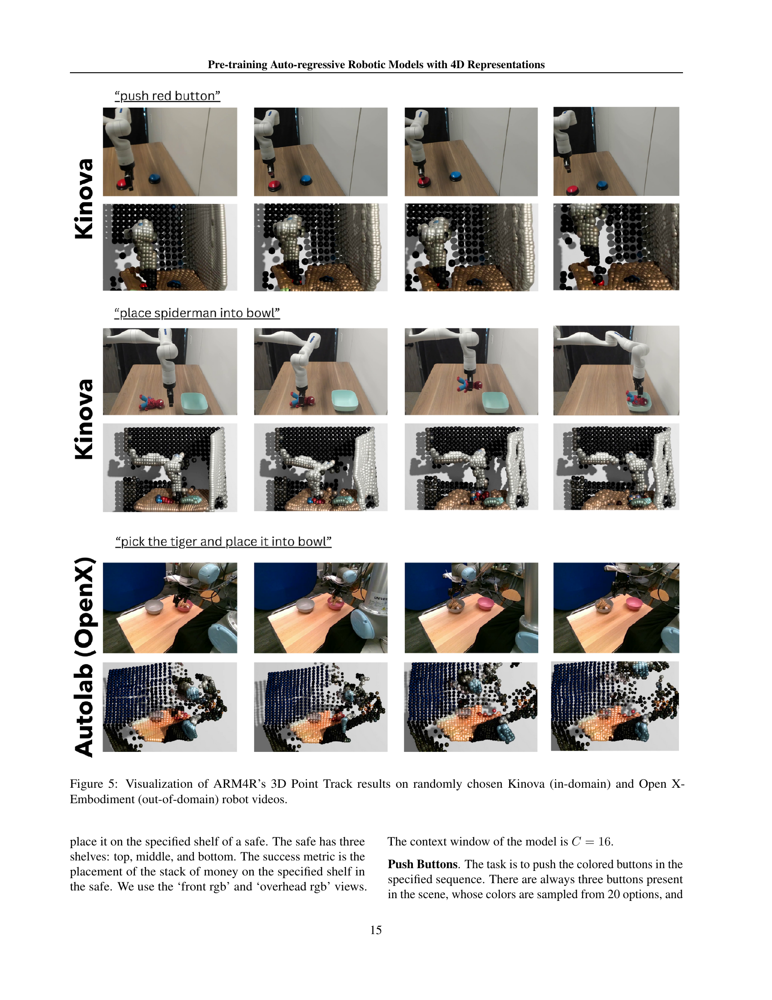

 


 2502.13142 
 Dantong Niu et el. 
 
 🤗 2025-02-19 
 



↗ arXiv


↗ Hugging Face


### TL;DR



**로봇 제어 분야는 대규모 데이터 부족으로 사전 학습의 효과를 제대로 보지 못했습니다.** 기존의 Vision-Language-Action 모델들은 고수준의 사전 학습 목표를 가지고 있어 저수준의 로봇 제어에는 적합하지 않았습니다.  **인간의 동작 데이터는 풍부하지만, 로봇 제어에 바로 적용하기 어려운 문제점이 있었습니다.**

본 논문에서는 **인간 비디오 데이터에서 4D 표현(시간에 따른 3D 점 추적)**을 학습하고 이를 로봇 제어에 적용하는 새로운 사전 학습 방법을 제시합니다. 이를 통해 **물리적 세계를 효과적으로 모델링하고, 인간 동작 데이터에서 로봇 제어로 효율적인 전이 학습을 가능하게 합니다.**  실험 결과는 다양한 로봇 환경에서 지속적인 성능 향상을 보여주며, **제한된 로봇 데이터만을 사용하는 기존 방법보다 훨씬 우수한 성능을 입증했습니다.**



#### Key Takeaways


 인간 동작 비디오 데이터를 활용한 저수준 4D 표현 학습을 통해 로봇 사전 학습 모델을 효과적으로 개선 



 다양한 로봇 환경 및 구성에서 일관된 성능 향상을 보임 



 기존 로봇 사전 학습 방법 대비 우수한 성능 및 일반화 능력을 보유 


#### Why does it matter?
**본 논문은 로봇 제어 분야에서의 사전 학습의 중요성을 강조하며, 대규모 로봇 데이터 세트 없이도 효과적인 사전 학습이 가능함을 보여줍니다.**  이는 로봇 학습 연구의 새로운 가능성을 제시하며, 향후 연구 방향을 제시하는 데 중요한 의미를 가집니다. **특히, 저수준 4D 표현을 사용한 사전 학습 기법은 로봇 제어의 물리적 특성을 더 잘 반영하여 일반화 성능을 향상시킵니다.**  본 논문의 결과는 다양한 로봇 환경 및 구성에서 일관되게 성능 향상을 보여주어, **실제 로봇 응용 분야에서의 실용적인 적용 가능성을 시사합니다.**

------
#### Visual Insights

> 🔼 그림 1은 본 논문에서 제안하는 ARM4R 모델의 개요를 보여줍니다. ARM4R은 자동 회귀 로봇 모델로, 인간의 비디오 데이터에서 학습된 저수준 4D 표현(시간에 따른 3D 점 추적)을 활용하여 더 나은 사전 훈련된 로봇 모델을 생성합니다. 그림은 단안 비디오에서 3D 점 추적을 예측하고, 이를 로봇 제어에 사용하는 과정을 보여줍니다.  인간의 비디오 데이터를 활용하여 로봇 조작 작업에 효과적으로 전이 학습을 수행할 수 있음을 시각적으로 설명합니다.
> 

> 
read the caption

> Figure 1: Overview of ARM4R. We introduce an Auto-regressive Robotic Model that leverages low-level 4D Representations (3D point tracks across time) learned from human videos to yield a better pre-trained robotic model.
> 


| Method | open drawer | meat off grill | turn tap | put money | push buttons | sweep dustpan | slide block | close jar | screw bulb | place wine | reach and drag | stack blocks | Average Success Rate (%) |
|---|---|---|---|---|---|---|---|---|---|---|---|---|---|---|
| Image-BC (ViT) | 0 | 0 | 16 | 0 | 0 | 0 | 0 | 0 | 16 | 0 | 0 | 0 | 2.67 |
| C2FARM-BC | 20 | 20 | 68 | 12 | 72 | 0 | 16 | 24 | 8 | 18 | 24 | 4 | 23.83 |
| ManiGaussian | 76 | 60 | 56 | - | 20 | 64 | 24 | 28 | - | - | 92 | 12 | 48.00 |
| LLARVA | 60 | 80 | 56 | 44 | 56 | 56 | 84 | 100 | 28 | 8 | 12 | 52 | 0 | 48.33 |
| PerAct | 80 | 84 | 80 | 44 | 48 | 56 | 72 | 60 | 24 | 12 | 68 | 36 | 55.33 |
| ARM4R | 88.8 | 94.4 | 61.6 | 92.0 | 67.2 | 72.0 | 85.6 | 24.0 | 10.4 | 36.0 | 77.6 | 4.0 | 59.47 |

> 🔼 표 1은 RLBench 벤치마크의 12가지 작업에 대해 ARM4R의 성능을 여러 관련 기준과 비교한 결과를 보여줍니다. 각 작업에 대해 25개의 에피소드와 5개의 랜덤 시드를 사용하여 평균 성공률을 계산했습니다. ARM4R은 12가지 작업 중 4가지 작업에서 최고 성능을 달성했으며, 평균 성공률 또한 가장 높았습니다. 이 표는 시뮬레이션 환경에서 ARM4R의 강력한 성능을 보여주는 증거입니다.
> 

> 
read the caption

> Table 1: Success rate (%) on RLBench Multi-Task setting. We compare ARM4R’s performance against several related baselines on 12 tasks from the RLBench benchmark. We use 25 episodes per task and 5 random seeds, averaging the results to get the success rate. ARM4R achieves the best performance on 4 of 12 tasks and the best average success rate.
> 

### In-depth insights

#### 4D Rep. Pre-training
본 논문에서 제시하는 4D 표현 사전 학습 방식은 **인간의 비디오 데이터를 활용하여 로봇 제어 모델을 효과적으로 사전 학습**시키는 혁신적인 방법입니다.  **단순히 2D 이미지 데이터가 아닌, 3D 점 추적 정보를 시간적 흐름과 결합하여 4D 표현**을 생성하는 것이 핵심입니다.  이를 통해 물리적 세계에 대한 이해도를 높이고, 다양한 로봇 환경과 구성에서의 일반화 성능을 향상시킵니다.  **사전 학습된 모델은 다양한 로봇 작업에서 일관되게 성능 향상**을 보이며, 특히 로봇 데이터가 부족한 상황에서 효과적임을 보여줍니다.  **인간의 비디오 데이터에서 학습된 지식을 로봇 제어로 효율적으로 전이**시키는 점이 핵심적인 강점이며, 향후 로보틱스 분야의 사전 학습 연구에 중요한 방향을 제시할 것으로 기대됩니다.  하지만, 카메라 움직임과 물체 움직임의 분리가 어렵다는 점, 다양한 카메라 시점에 대한 일반화 부족 등 개선할 부분도 존재합니다.

#### Human Video Transfer
본 논문에서 제시된 "휴먼 비디오 전이(Human Video Transfer)" 개념은 **인간의 동작 데이터를 로봇 제어에 적용하는 핵심 전략**입니다.  **대규모의 비표지 데이터를 활용**하여 로봇 학습의 어려움을 해결하고자 합니다.  이는 비용이 많이 드는 로봇 데이터 수집 대신 풍부한 인간 동작 영상 데이터를 활용함으로써 **효율적인 사전 학습**을 가능하게 합니다.  **4D 표현(3D 포인트 추적 + 시간)**을 통해 인간 동작의 공간적, 시간적 특징을 효과적으로 모델링하고, 이를 로봇 제어에 전이하여 **일반화 성능을 향상**시키는 데 초점을 맞추고 있습니다.  이러한 전이 학습은 **저수준의 로봇 제어**에 효과적으로 적용되어 다양한 환경과 로봇 구성에 대한 **견고한 성능**을 보여줍니다.  **단순한 2D 영상 데이터가 아닌, 깊이 정보를 활용한 3D 포인트 추적**을 통해 물리적 세계에 대한 이해를 높임으로써 기존의 비전-언어-행동 모델의 한계를 극복하고 있습니다.  결론적으로,  본 연구는 **휴먼 비디오 데이터의 효과적인 활용 전략**을 제시하며 로봇 학습 분야의 발전에 기여할 잠재력을 보여주고 있습니다.

#### ARM4R Architecture
ARM4R의 아키텍처는 **다중 모드(언어, 이미지, 3D 포인트 트랙, 로봇 상태)** 입력을 처리하고 시계열 데이터의 의존성을 포착하기 위해 **인과 관계가 있는 변환기**를 사용하는 것으로 특징지어집니다.  **각 모드에 대한 별도의 인코더**가 있어서, 언어는 CLIP 텍스트 인코더, 이미지는 Vision Transformer, 3D 포인트와 로봇 상태는 다층 퍼셉트론을 사용합니다.  **어텐션 풀링 메커니즘**을 통해 인코딩된 특징들이 통합되어 현재 관측값을 나타내는 토큰을 생성합니다.  **자기 회귀적 예측**을 통해, 모델은 다음 시간 단계의 3D 포인트 위치 또는 로봇 상태를 예측합니다.  이 아키텍처는 **인간 비디오 데이터에서 로우 레벨 4D 표현을 효율적으로 학습**하고, **로봇 제어를 위한 전이 학습을 용이하게** 하도록 설계되었습니다.  **모듈화된 디자인**은 다양한 로봇 환경과 구성에 대한 적응력을 높입니다.  **인간 데이터의 풍부함을 활용**하면서 **로봇 데이터에 대한 의존성을 줄이는** 것이 핵심 강점입니다.

#### Cross-Robot Generalization
본 논문에서 다룬 핵심 개념인 ‘Cross-Robot Generalization’은 **로봇 제어 모델이 특정 로봇 플랫폼을 넘어 다양한 로봇 시스템에서도 효과적으로 작동하는 능력**을 의미합니다.  이는 단순히 동일한 작업을 수행하는 것을 넘어, 로봇의 물리적 특성(자유도, 센서, 구동계 등)과 환경의 차이에도 불구하고 **일관된 성능**을 유지하는 것을 의미합니다.  **인간의 영상 데이터를 활용한 사전 학습**을 통해 낮은 수준의 로봇 제어에 필요한 물리적 직관을 모델이 학습하고, 이를 바탕으로 다양한 로봇 플랫폼에 적용 가능하다는 점이 중요한 통찰입니다.  **4D 표현(3D 공간 정보 + 시간)**을 사용하여 영상 데이터에서 추출한 정보는 로봇의 상태 표현과 선형 변환의 관계를 유지하므로, **효율적인 전이 학습**을 가능하게 합니다.  이는 **데이터 효율성**을 높이며, 다양한 로봇 플랫폼에서의 추가 학습 데이터 수집 부담을 줄여줍니다.  이러한 Cross-Robot Generalization 능력은 **로봇 기술의 실용성과 확장성**을 크게 높이는 데 기여할 것으로 기대됩니다.  향후 연구는 더욱 다양한 로봇, 작업, 환경에서의 실험을 통해 이러한 일반화 능력의 범위와 한계를 탐구하고, 더욱 강건하고 효율적인 Cross-Robot Generalization 방법론을 개발하는데 집중해야 할 것입니다. 

#### Limitations and Future
이 논문의 "한계점 및 미래 연구 방향"에 대한 심층적인 고찰은 **3D 점 추적의 카메라 좌표계 의존성**이라는 핵심적인 한계점을 드러냅니다.  카메라 고유 특성 및 움직임에 대한 불변성이 부족하여 정확도 저하 가능성을 내포하고 있습니다.  **세계 좌표계 기반 3D 추적**으로 전환 및 다중 시점 융합을 통한 강인성 향상이 미래 연구의 주요 방향으로 제시됩니다.  또한, **대규모 데이터셋 확보** 및 **다양한 로봇 환경 및 센서 모달리티**에 대한 일반화 연구도 중요한 과제입니다.  **효율적인 4D 표현 학습** 및 **저수준 로봇 제어**에 대한 깊이 있는 이해를 바탕으로 한 추가적인 연구가 필요합니다. 특히, **물체와 카메라의 움직임 분리**와 **특정 작업에 중요한 부분에 대한 선택적 추적**은 향후 성능 개선에 큰 영향을 미칠 것으로 예상됩니다.

### More visual insights

More on figures

> 🔼 그림 2는 ARM4R 모델의 세 가지 훈련 단계를 보여줍니다. 위쪽 회색 상자는 3D 점을 시간에 따라 예측하여 전체 장면에 대한 4D 표현을 학습하는 첫 두 단계에 초점을 맞춥니다. 1단계에서는 대규모 자기중심적 인간 데이터셋(Epic-Kitchens100)을 사용하여 사전 훈련하고, 2단계에서는 로봇 장면의 더 작은 데이터셋(1~2K 데모)을 사용하여 미세 조정하여 로봇 장면과 카메라에 맞게 점 추적을 조정합니다. 아래쪽 회색 상자는 최종적으로 3D 점이 아닌 로봇 고유수용성 상태를 예측하도록 모델을 미세 조정하여 로봇 제어를 가능하게 합니다.
> 

> 
read the caption

> Figure 2:  ARM4R is trained in three stages. Top Grey Box: The first two stages focus on learning a scene-wide 4D representation by predicting 3D points across time, where Stage 1 pre-trains on a large egocentric human dataset (Epic-Kitchens100), and Stage 2 fine-tunes on a smaller dataset (1-2K demonstrations) of robotic scenes, adapting the point tracking to robotic scene and camera. Bottom Grey Box: Finally, the model is fine-tuned to predict robot proprioceptive states rather than 3D points to enable robotic control.
> 

> 🔼 그림 3은 ARM4R 모델의 성능에 대한 ablation study 결과를 보여줍니다. 실제 Kinova 로봇 환경에서 세 가지 작업(Pick, Destack, Stack)을 수행하며, 모델 학습 단계(Stage) 중 Stage 1(인간 비디오 사전 학습)과 Stage 2(로봇 비디오 미세 조정)을 제외한 경우의 성능을 비교 분석합니다. 결과는 Stage 1과 Stage 2 모두 모델 성능 향상에 기여하지만, Stage 1의 영향이 Stage 2보다 훨씬 크다는 것을 보여줍니다. 즉, 인간 비디오 데이터를 활용한 사전 학습이 로봇 제어 성능 향상에 중요한 역할을 한다는 것을 시사합니다.
> 

> 
read the caption

> Figure 3: Ablation Study for Stages 1 and 2. We train ARM4R on three real tasks in the Kinova setting, ablating Stages 1 and 2. The results indicate that while both stages improve performance, Stage 1 has a more significant impact.
> 

> 🔼 그림 4는 ARM4R 모델이 생성한 3D 포인트 추적 결과를 보여줍니다.  Epic-Kitchens 데이터셋(도메인 내)과 Ego-4D 데이터셋(도메인 외)의 무작위로 선택된 영상들을 사용했습니다.  이 그림은 ARM4R 모델이 다양한 유형의 인간 활동 영상에서 3D 포인트들을 정확하게 추적할 수 있음을 시각적으로 보여줍니다.  특히 도메인 내 영상과 도메인 외 영상 모두에서 일관된 성능을 보이는 점에 주목할 필요가 있습니다.  이는 ARM4R 모델의 일반화 능력이 우수함을 보여주는 증거입니다.
> 

> 
read the caption

> Figure 4: Visualization of ARM4R’s 3D Point Track results on randomly chosen Epic-Kitchens (in-domain) and Ego-4D (out-of-domain) human videos.
> 

> 🔼 그림 5는 ARM4R 모델이 생성한 3D 포인트 트랙 결과를 보여줍니다.  Kinova 로봇 비디오(도메인 내)와 Open X-Embodiment 로봇 비디오(도메인 외)에서 무작위로 선택된 비디오에 대한 결과가 포함되어 있습니다.  이 그림을 통해 ARM4R 모델이 다양한 로봇 환경과 구성에서 3D 포인트를 효과적으로 추적하고, 도메인 내외 데이터에 대해 일반화 성능을 보임을 시각적으로 확인할 수 있습니다.  각 로봇 비디오의 작업에 대한 짧은 설명과 함께 시각화된 3D 포인트 트랙이 제시되어 있습니다.
> 

> 
read the caption

> Figure 5: Visualization of ARM4R’s 3D Point Track results on randomly chosen Kinova (in-domain) and Open X-Embodiment (out-of-domain) robot videos.
> 

> 🔼 그림 6은 논문에서 사용된 Kinova 로봇의 실제 실험 환경 설정을 보여줍니다.  실제 로봇 팔과 카메라의 배치, 그리고 작업 공간을 상세하게 보여주는 사진입니다. 로봇 팔의 관절과 그리퍼, 그리고 작업 공간에 배치된 물체들이 보이며,  실험 환경에 대한 전반적인 이해를 돕습니다. 특히, 로봇 팔의 위치와 카메라의 각도는 로봇의 시각적 입력과 제어에 중요한 영향을 미치므로, 이 그림은 이러한 측면을 명확히 보여줍니다.
> 

> 
read the caption

> Figure 6: The real-world experiment setup of Kinova robot.
> 

> 🔼 그림 7은 실제 키노바 로봇 설정에서 수행된 작업에 대한 설명입니다.  각 작업은 로봇 암의 초기 위치, 물체의 위치, 목표 위치, 그리고 작업 수행 순서를 보여줍니다.  이 그림은 키노바 로봇을 사용한 실험의 세부사항을 이해하는 데 도움을 줍니다.  각 작업(큐브 줍기, 큐브 쌓기, 큐브 내리기, 버튼 누르기, 장난감/농구공 줍고 놓기)의 단계별 과정을 시각적으로 보여주어 실험 설정을 자세히 설명합니다.
> 

> 
read the caption

> Figure 7: Task building of real-world Kinova setup.
> 

> 🔼 그림 8은 실제 프랑카 로봇 실험 환경을 보여줍니다. 프랑카 로봇 양쪽에 설치된 두 대의 로지텍 BRIO 4K 카메라가 로봇의 조작 동작을 촬영합니다. 깊이 정보 없이 RGB 영상만 제공하며, 자동 초점 기능은 꺼져 있고 640x480 해상도로 데이터를 수집합니다. 이 그림은 실제 로봇 실험의 하드웨어 설정을 간략하게 보여주는 이미지입니다.
> 

> 
read the caption

> Figure 8: The real-world experiment setup of Franka robot.
> 

More on tables


| open | drawer |
|---|---|
> 🔼 표 2는 실제 Kinova 로봇을 사용한 다중 작업 설정에서의 성공률(%)을 보여줍니다. ARM4R의 성능을 관련 기준 모델인 ATM과 OpenVLA와 비교하여 5가지 범주로 그룹화된 13가지 실제 작업에 대해 평가했습니다.  각 작업에 대해 25개의 에피소드를 사용하여 평가했고, 3개의 시드에 대한 결과를 평균하여 최종 성공률을 계산했습니다. ARM4R은 모든 작업에서 두 기준 모델을 능가합니다.
> 

> 
read the caption

> Table 2: Success rate (%) on the real Kinova Multi-Task setting. We compare ARM4R’s performance to ATM and OpenVLA, two related baselines, on 13 real tasks grouped into five categories. We use 25 episodes per task for evaluation, averaging the results over 3 seeds to get the final success rate. ARM4R outperforms both baselines on all the tasks.
> 


| meat off | grill |
|---|---|
> 🔼 표 3은 여러 로봇 모델의 사전 훈련 기법을 비교 분석한 표입니다.  Kinova 로봇을 사용한 세 가지 작업(큐브 집기, 큐브 쌓기, 큐브 분리)에서 ARM4R을 다른 사전 훈련 기반 로봇 모델들과 비교하여 평균 성공률을 보여줍니다.  ARM4R이 다른 모델들보다 평균 성공률이 가장 높다는 것을 보여주는 결과를 제시합니다. 이 표는 다양한 사전 훈련 전략의 효과를 비교하여 ARM4R의 성능 우수성을 강조합니다.
> 

> 
read the caption

> Table 3: Pre-training approaches comparison. We compare ARM4R to several other robotic models that leverage pre-training on three tasks with a Kinova robot. We find that our approach yields the best average success rate.
> 


| turn | tap |
|---|---|
> 🔼 표 4는 ARM4R 모델의 로봇 간 전이 성능을 보여줍니다. 사전 훈련된 모델을 서로 다른 로봇(Kinova, Franka)에서 모터 제어를 위해 미세 조정하고, 큐브 관련 작업에 대한 성공률을 보고합니다.  각 로봇에 대해 큐브 집기, 쌓기, 분해하기 세 가지 작업의 성공률을 보여줍니다. 이 표는 모델이 서로 다른 로봇 플랫폼에서 얼마나 잘 일반화되는지 보여주는 지표입니다.
> 

> 
read the caption

> Table 4: Success rate (%) of ARM4R on cross-robot setting. We fine-tune the pre-trained model for motor control on different robots and report success rates of cube tasks.
> 


| put | money |
|---|---|
> 🔼 표 5는 논문의 세 가지 훈련 단계(인간 비디오 사전 훈련, 로봇 비디오 미세 조정, 로봇 제어 미세 조정)에 사용된 하이퍼파라미터를 보여줍니다. 각 단계별 학습률, 가중치 감쇠, 배치 크기, 에폭 수를 상세하게 나타내어 모델 훈련 과정을 이해하는 데 도움을 줍니다.
> 

> 
read the caption

> Table 5: Training Hyperparameters for the three stages.
> 

### Full paper



