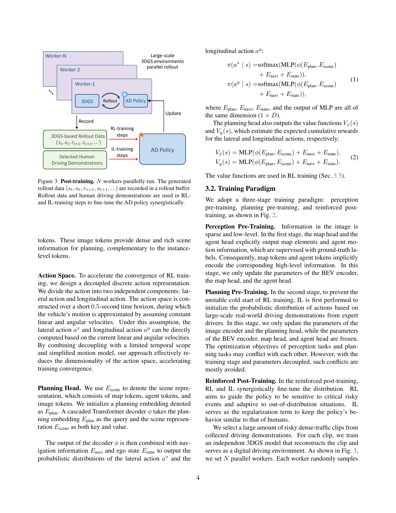
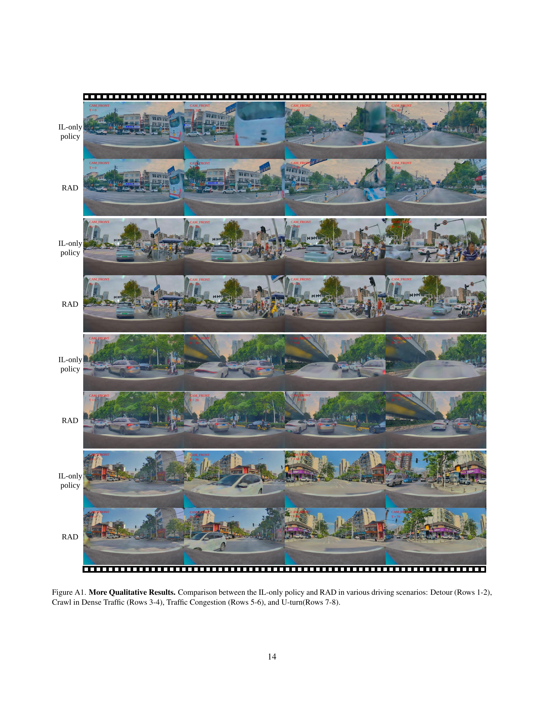

 


 2502.13144 
 Hao Gao et el. 
 
 🤗 2025-02-20 
 



↗ arXiv


↗ Hugging Face


↗ Papers with Code


### TL;DR



기존의 자율주행 알고리즘은 주로 모방 학습(Imitation Learning)에 의존해 왔는데, 이는 **원인과 결과의 혼란(causal confusion)** 및 **오픈루프(open-loop)** 문제로 인해 실제 환경 적용에 어려움을 겪었습니다.  또한, **시뮬레이터 기반 강화 학습**은 현실 세계와의 차이(sim2real gap) 때문에 성능 저하가 발생하는 문제점이 있었습니다.  본 연구에서는 이러한 문제점들을 해결하고자 새로운 접근 방식을 제시합니다. 

본 연구에서는 **대규모 3DGS(3D Gaussian Splatting) 기반의 폐쇄 루프 강화 학습 프레임워크**를 제시하여 이러한 문제를 해결했습니다.  **3DGS 기술을 통해 실제 환경과 매우 유사한 가상 환경**을 구축하여 자율주행 에이전트가 다양한 상황을 경험하고 학습할 수 있도록 했습니다.  여기에 **모방 학습 기법을 강화 학습에 통합**하여 안전성을 높이고 인간의 주행 패턴을 모방하도록 했습니다.  결과적으로, 제안된 방법론은 기존 방법론보다 **훨씬 낮은 충돌률**과 **향상된 안전성**을 보였습니다.



#### Key Takeaways


 3DGS 기반 강화학습을 통해 실제 환경과 유사한 대규모 가상 환경에서 자율주행 정책을 안전하게 학습할 수 있음 



 모방 학습과 강화 학습을 결합하여 안전성과 인간과의 유사성을 동시에 고려한 학습 방법론을 제시함 



 제안된 방법론을 통해 기존 모방 학습 방식보다 충돌률을 3배 이상 감소시키는 등 우수한 성능을 달성함 


#### Why does it matter?
본 논문은 **대규모 3DGS 기반 강화학습을 통해 엔드-투-엔드 자율주행 정책을 훈련하는 새로운 방법론**을 제시하여 자율주행 분야의 중요한 발전을 이끌어냈습니다. 기존의 모방 학습 방식의 한계를 극복하고, **실제 환경과 유사한 가상 환경에서의 안전한 학습 및 실제 환경 적용 가능성**을 높였기 때문에, 향후 자율주행 기술 연구에 큰 영향을 미칠 것으로 예상됩니다. 특히, **안전성과 인간과의 유사성을 모두 고려한 학습 방법론**은 자율주행 시스템의 신뢰도 향상에 크게 기여할 것으로 기대됩니다. 또한, 제시된 방법론은 향후 **다양한 자율주행 시스템 개발 및 개선 연구**에 활용될 수 있습니다.

------
#### Visual Insights

> 🔼 그림 1은 End-to-End 자율 주행(AD)의 세 가지 다른 학습 패러다임을 보여줍니다. (a)는 사람의 주행 데이터를 모방하여 AD 정책을 학습시키는 모방 학습(IL) 방법을 보여줍니다. IL은 오픈 루프 갭과 인과 관계 혼동이라는 과제에 직면합니다. (b)는 시뮬레이터 기반 강화 학습(RL) 방법을 보여줍니다. 시뮬레이터 기반 RL은 시뮬레이션과 현실 세계 간의 격차와 단순한 에이전트 동작이라는 과제에 직면합니다. (c)는 본 논문에서 제안하는 방법으로, 대규모 3DGS(3D Gaussian Splatting) 기반의 폐쇄 루프 RL 학습 방법을 보여줍니다. 이 방법은 모방 학습을 규제 항으로 통합하여 안전성을 높이고 사람의 주행 행동과의 일치성을 유지합니다. 3DGS 기반 RL은 광범위한 상태 공간 탐색과 시뮬레이션의 현실성을 통해 문제를 해결합니다.
> 

> 
read the caption

> Figure 1: Different training paradigms of end-to-end autonomous driving (AD).
> 


| RL:IL | CR↓ | DCR↓ | SCR↓ | DR↓ | PDR↓ | HDR↓ | ADD↓ | Long. Jerk↓ | Lat. Jerk↓ |
|---|---|---|---|---|---|---|---|---|---| 
| 0:1 | 0.229 | 0.211 | 0.018 | 0.066 | 0.039 | 0.027 | 0.238 | 3.928 | 0.103 |
| 1:0 | 0.143 | 0.128 | 0.015 | 0.080 | 0.065 | 0.015 | 0.345 | 4.204 | 0.085 |
| 2:1 | 0.137 | 0.125 | 0.012 | 0.059 | 0.050 | 0.009 | 0.274 | 4.538 | 0.092 |
| 4:1 | 0.089 | 0.080 | 0.009 | 0.063 | 0.042 | 0.021 | 0.257 | 4.495 | 0.082 |
| 8:1 | 0.125 | 0.116 | 0.009 | 0.084 | 0.045 | 0.039 | 0.323 | 5.285 | 0.115 |

> 🔼 강화된 후반 학습 단계에서 RL과 IL 단계의 혼합 비율에 대한 ablation study 결과를 보여주는 표입니다.  RL 비율이 증가함에 따라 충돌률(CR)은 감소하지만, 주행 경로의 인간과의 유사성(ADD)은 감소하는 것을 보여줍니다.  표는 RL과 IL의 비율을 다르게 하여 실험한 결과, 충돌률, 주행 안정성, 주행 경로의 부드러움 등 다양한 지표에 미치는 영향을 정량적으로 비교 분석합니다.  최적의 RL-IL 비율을 찾는 데 도움이 되는 정보를 제공합니다.
> 

> 
read the caption

> Table 1: Ablation on RL-to-IL step mixing ratios in the reinforced post-training stage.
> 

### In-depth insights

#### 3DGS-RL Driving
3DGS-RL 기반 자율주행은 **사실적인 3D 환경 생성**과 **강화학습(RL)** 알고리즘을 결합하여 자율주행 모델을 학습시키는 새로운 접근법입니다. 3DGS(3D Gaussian Splatting) 기술은 실제와 유사한 고품질의 3D 시뮬레이션 환경을 제공하여, 기존의 시뮬레이터보다 더욱 다양하고 현실적인 주행 상황을 학습시킬 수 있습니다.  **RL 알고리즘**을 통해 에이전트는 시뮬레이션 환경에서 다양한 주행 상황을 경험하고, 보상함수를 통해 최적의 주행 정책을 학습하게 됩니다.  이러한 방식은 **실제 도로 주행 데이터의 부족**이나 **안전 문제**를 해결하는데 도움을 줄 수 있으며,  **데이터 효율성을 높이고 안전한 자율주행 기술 개발을 가속화**할 수 있다는 장점을 갖습니다.  하지만, **현실세계와 시뮬레이션 환경 간의 차이(Sim2Real Gap)**,  **보상함수 설계의 어려움**,  **강화학습 알고리즘의 복잡성** 등의 과제를 해결해야 합니다.  특히, 안전에 민감한 자율주행 시스템에서 **강화학습 과정에서의 안전성 확보**는 매우 중요한 문제이며, 앞으로 더욱 심도있는 연구가 필요합니다.

#### RL+IL Synergy
본 논문에서 제시된 **강화학습(RL)과 모방학습(IL)의 시너지 효과**는 자율주행 정책을 훈련하는 혁신적인 접근 방식을 보여줍니다.  **RL은 인과 관계를 모델링하고 오픈루프 문제를 해결하며, IL은 인간의 주행 행동과의 유사성을 유지**하는 역할을 합니다.  이러한 상호 보완적인 관계는 단순히 모방하는 것보다 더욱 안전하고 효율적인 자율 주행 시스템을 만드는 데 기여합니다.  **3DGS 기반 시뮬레이터**를 사용하여 광범위한 시나리오를 탐색하고, **안전 관련 보상 설계**를 통해 안전에 중점을 두면서,  **인간과의 정렬 문제**를 해결하기 위해 IL을 통합하는 전략은 실제 환경에서의 안전성과 일반화 성능을 향상시키는 데 중요한 역할을 합니다.  **폐쇄 루프 평가 벤치마크**를 통한 실험 결과는 RL+IL 시너지의 효과를 입증하며,  기존의 IL 기반 방법보다 충돌률이 현저히 낮은 등 우수한 성능을 보여줍니다.  이는 자율주행 분야에서의 RL과 IL 통합의 중요성을 강조하는 동시에,  **3DGS 기반 시뮬레이션**의 발전 가능성을 보여주는 결과입니다.

#### Reward Shaping
강화학습 기반 자율주행 모델에서 **보상(Reward)**은 에이전트(자율주행 자동차)의 행동을 학습시키는 핵심 요소입니다.  단순히 목표 달성 여부만으로 보상을 설계하면 학습이 어렵고 비효율적이므로, **보상 조형(Reward Shaping)**이 중요합니다.  보상 조형은 중간 단계 목표를 설정하여 부분적인 성공에도 보상을 주거나, 위험 행위에 대한 페널티를 부여하는 등의 방법으로 학습 과정을 효율적으로 안내합니다.  본 논문에서는 **충돌 회피, 주행 안정성,  인간 운전자와의 행동 일관성** 등을 고려한 다양한 보상 요소들을 설계하고,  **3DGS 기반 시뮬레이션 환경**에서의 실험을 통해 각 요소들의 효과를 분석합니다.  특히, **희소 보상 문제(Sparse Reward Problem)**를 해결하기 위해 보조적인 보상 함수를 도입하여 학습 속도와 안정성을 높였을 가능성이 높습니다.  **보상 설계의 섬세함**은 학습된 에이전트의 안전성과 성능에 직결되며, **실제 주행 환경과의 괴리**를 줄이기 위한 노력의 중요한 일환입니다.

#### Closed-Loop Eval
**폐쇄 루프 평가(Closed-Loop Eval)**는 자율 주행 모델의 성능을 실제 환경에 가깝게 평가하는 중요한 방법입니다.  **실제 주행 환경과 유사한 시뮬레이션 환경**에서 모델이 어떻게 작동하는지 평가하여, **개방 루프 평가(Open-Loop Eval)에서 드러나지 않는 문제점들을 찾아낼 수 있습니다.** 예를 들어, 센서 오류나 예상치 못한 상황에 대한 모델의 반응, 누적 오차에 따른 주행 안정성 저하 등을 면밀하게 분석할 수 있습니다.  **3DGS 기반의 현실적인 시뮬레이션 환경**을 사용하면 더욱 정교한 폐쇄 루프 평가가 가능하며,  **다양한 시나리오와 돌발 상황을 포함한 광범위한 테스트**를 통해 모델의 강인성과 일반화 능력을 향상시킬 수 있습니다. **보상 설계**와 **알고리즘 최적화**를 통해 안전성과 성능을 동시에 고려하는 폐쇄 루프 평가는 자율 주행 기술의 안전성과 신뢰성 확보에 필수적입니다.  따라서 **다양한 지표를 활용한 종합적인 평가**가 필요하며, **실제 도로 주행 테스트와의 상관관계**를 분석하는 연구가 더욱 중요해지고 있습니다.

#### Future Works
본 논문은 종단간 자율주행 정책을 위한 3DGS 기반 강화학습의 새로운 프레임워크를 제시하지만, **여전히 개선의 여지가 있는 몇 가지 제한점**을 가지고 있습니다.  미래 연구 방향으로는 **비반응적 방식으로 동작하는 3DGS 환경을 보다 현실적인 상호작용 환경으로 발전시키는 것**이 중요합니다.  즉, 다른 교통 참여자들이 자율주행 차량의 행동에 반응하여 동적으로 움직이는 시뮬레이션 환경을 구축해야 합니다.  또한, **현재 3DGS가 비강체 보행자, 관측되지 않은 시야, 저조도 상황 등을 사실적으로 렌더링하는 데 어려움**을 겪고 있으므로, 이러한 한계를 극복하기 위한 기술적 개선이 필요합니다.  **강화학습의 확장성을 높이는 연구**도 중요한데, 더욱 큰 규모의 데이터셋과 보다 복잡한 환경에서도 안정적으로 학습이 가능하도록 하는 것이 핵심입니다. 마지막으로, **사람의 운전 행동과 더욱 유사한 정책을 학습**할 수 있도록, 강화학습과 모방학습의 조화로운 결합 방식에 대한 심도있는 연구가 필요하며, 안전성 및 신뢰성을 극대화하는 방안도 함께 고려되어야 합니다.

### More visual insights

More on figures

> 🔼 그림 2는 RAD의 전반적인 프레임워크를 보여줍니다. RAD는 세 가지 단계의 학습 과정을 거칩니다. 첫 번째 단계인 지각 사전 학습 단계에서는 지도와 에이전트의 정답 정보를 사용하여 인스턴스 수준의 토큰이 해당 정보를 인코딩하도록 안내합니다. 두 번째 단계인 계획 사전 학습 단계에서는 대규모의 주행 데모를 사용하여 행동 분포를 초기화합니다. 마지막 단계인 강화된 사후 학습 단계에서는 강화 학습(RL)과 모방 학습(IL)을 상호 보완적으로 사용하여 AD 정책을 미세 조정합니다.
> 

> 
read the caption

> Figure 2: Overall framework of RAD. RAD takes a three-stage training paradigm. In the perception pre-training, ground-truths of map and agent are used to guide instance-level tokens to encode corresponding information. In the planning pre-training stage, large-scale driving demonstrations are used to initialize the action distribution. In the reinforced post-training stage, RL and IL synergistically fine-tune the AD policy.
> 

> 🔼 그림 3은 강화 학습(RL)과 모방 학습(IL)을 결합하여 자율 주행 정책을 미세 조정하는 과정을 보여줍니다. 여러 작업자가 병렬적으로 시뮬레이션 환경에서 자율 주행 에이전트를 실행하고, 각 에이전트의 상태(s), 행동(a), 보상(r), 다음 상태(s')를 기록하여 롤아웃 버퍼에 저장합니다. 이 롤아웃 데이터와 사람의 주행 데모를 사용하여 RL 및 IL 학습 단계를 수행, 자율 주행 정책을 동시에 미세 조정합니다.
> 

> 
read the caption

> Figure 3: Post-training. N𝑁Nitalic_N workers parallelly run. The generated rollout data (st,at,rt+1,st+1,…)subscript𝑠𝑡subscript𝑎𝑡subscript𝑟𝑡1subscript𝑠𝑡1…(s_{t},a_{t},r_{t+1},s_{t+1},...)( italic_s start_POSTSUBSCRIPT italic_t end_POSTSUBSCRIPT , italic_a start_POSTSUBSCRIPT italic_t end_POSTSUBSCRIPT , italic_r start_POSTSUBSCRIPT italic_t + 1 end_POSTSUBSCRIPT , italic_s start_POSTSUBSCRIPT italic_t + 1 end_POSTSUBSCRIPT , … ) are recorded in a rollout buffer. Rollout data and human driving demonstrations are used in RL- and IL-training steps to fine-tune the AD policy synergistically.
> 

> 🔼 그림 4는 네 가지 유형의 보상 소스에 대한 예시 다이어그램입니다. (1) 앞쪽의 동적 장애물과의 충돌은 보상 rdc를 발생시킵니다. (2) 정적 도로변 장애물과의 충돌은 보상 rsc를 발생시킵니다. (3) 연석 위로 이동하면 위치 편차 임계값 dmax를 초과하여 보상 rpd가 발생합니다. (4) 인접 차선으로 향하는 방향 전환이 헤딩 편차 임계값 ψmax를 초과하면 보상 rhd가 발생합니다.
> 

> 
read the caption

> Figure 4: Example diagram of four types of reward sources. (1): Collision with a dynamic obstacle ahead triggers a reward rdcsubscript𝑟dcr_{\text{dc}}italic_r start_POSTSUBSCRIPT dc end_POSTSUBSCRIPT. (2): Hitting a static roadside obstacle incurs a reward rscsubscript𝑟scr_{\text{sc}}italic_r start_POSTSUBSCRIPT sc end_POSTSUBSCRIPT. (3): Moving onto the curb exceeds the positional deviation threshold dmaxsubscript𝑑maxd_{\text{max}}italic_d start_POSTSUBSCRIPT max end_POSTSUBSCRIPT, triggering a reward rpdsubscript𝑟pdr_{\text{pd}}italic_r start_POSTSUBSCRIPT pd end_POSTSUBSCRIPT. (4): Drifting toward the adjacent lane exceeds the heading deviation threshold ψmaxsubscript𝜓max\psi_{\text{max}}italic_ψ start_POSTSUBSCRIPT max end_POSTSUBSCRIPT, triggering a reward rhdsubscript𝑟hdr_{\text{hd}}italic_r start_POSTSUBSCRIPT hd end_POSTSUBSCRIPT.
> 

> 🔼 그림 5는 3DGS 환경에서 IL 전용 정책과 RAD의 폐쇄 루프 정성적 비교 결과를 보여줍니다. 1행과 2행은 보행자에게 양보하는 상황을, 3행과 4행은 무방호 좌회전 상황을 보여줍니다.  두 상황 모두에서 RAD는 IL 전용 정책보다 더 안전하고 효율적인 주행을 보여줍니다. 특히, 복잡한 교통 상황에서 장애물을 피하고 원활하게 주행하는 RAD의 성능이 더욱 두드러집니다.
> 

> 
read the caption

> Figure 5: Closed-loop qualitative comparisons between the IL-only policy and RAD in 3DGS environments. Rows 1-2 correspond to Yield to Pedestrians. Rows 3-4 correspond to Unprotected Left-turn.
> 

> 🔼 그림 A1은 IL 전용 정책과 RAD의 다양한 주행 시나리오(도로 우회전(1-2행), 밀집 교통 환경에서의 저속 주행(3-4행), 교통 정체(5-6행), 유턴(7-8행))에 대한 정성적 비교 결과를 보여줍니다. 각 시나리오에서 IL 전용 정책은 동적 장애물 회피나 복잡한 교통 상황 관리에 어려움을 겪는 반면, RAD는 동적 장애물을 효과적으로 피하고 까다로운 작업을 잘 처리하여 주행 안전성과 안정성을 높였음을 보여줍니다.
> 

> 
read the caption

> Figure A1:  More Qualitative Results. Comparison between the IL-only policy and RAD in various driving scenarios: Detour (Rows 1-2), Crawl in Dense Traffic (Rows 3-4), Traffic Congestion (Rows 5-6), and U-turn(Rows 7-8).
> 

More on tables


| ID | Dynamic | Static | Position | Heading | CR↓ | DCR↓ | SCR↓ | DR↓ | PDR↓ | HDR↓ | ADD↓ | Long. Jerk↓ | Lat. Jerk↓ |
|---|---|---|---|---|---|---|---|---|---|---|---|---|---| 
| 1 | ✓ |  |  |  | 0.172 | 0.154 | 0.018 | 0.092 | 0.033 | 0.059 | 0.259 | 4.211 | 0.095 |
| 2 |  | ✓ | ✓ | ✓ | 0.238 | 0.217 | 0.021 | 0.090 | 0.045 | 0.045 | 0.241 | 3.937 | 0.098 |
| 3 | ✓ |  | ✓ | ✓ | 0.146 | 0.128 | 0.018 | 0.060 | 0.030 | 0.030 | 0.263 | 3.729 | 0.083 |
| 4 | ✓ | ✓ |  | ✓ | 0.151 | 0.142 | 0.009 | 0.069 | 0.042 | 0.027 | 0.303 | 3.938 | 0.079 |
| 5 | ✓ | ✓ | ✓ |  | 0.166 | 0.157 | 0.009 | 0.048 | 0.036 | 0.012 | 0.243 | 3.334 | 0.067 |
| 6 | ✓ | ✓ | ✓ | ✓ | 0.089 | 0.080 | 0.009 | 0.063 | 0.042 | 0.021 | 0.257 | 4.495 | 0.082 |
> 🔼 표 2는 보상 요소별 ablation study 결과를 보여줍니다. 다양한 보상 요소들을 결합하여 학습한 모델의 성능을 비교 분석하여 각 보상 요소의 영향력과 중요도를 파악합니다.  Collision Ratio (CR), Dynamic Collision Ratio (DCR), Static Collision Ratio (SCR), Deviation Ratio (DR), Positional Deviation Ratio (PDR), Heading Deviation Ratio (HDR), Average Deviation Distance (ADD), Longitudinal Jerk, Lateral Jerk 등 다양한 지표를 통해 각 보상 요소가 모델 성능에 미치는 영향을 정량적으로 분석합니다.  결과적으로 모든 보상 요소를 포함했을 때 가장 좋은 성능을 보이며, 특히 충돌률이 가장 낮음을 보여줍니다.
> 

> 
read the caption

> Table 2: Ablation on reward sources. The table shows the impact of different reward components on performance.
> 


| ID | PPO Obj. | Dynamic Col. | Static Col. | Position Dev. | Heading Dev. | CR↓ | DCR↓ | SCR↓ | DR↓ | PDR↓ | HDR↓ | ADD↓ | Long. Jerk↓ | Lat. Jerk↓ |
|---|---|---|---|---|---|---|---|---|---|---|---|---|---|---|
| 1 | ✓ |  |  |  |  | 0.249 | 0.223 | 0.026 | 0.077 | 0.047 | 0.030 | 0.266 | 4.209 | 0.104 |
| 2 | ✓ | ✓ |  |  |  | 0.178 | 0.163 | 0.015 | 0.151 | 0.101 | 0.050 | 0.301 | 3.906 | 0.085 |
| 3 | ✓ |  | ✓ | ✓ | ✓ | 0.137 | 0.125 | 0.012 | 0.157 | 0.145 | 0.012 | 0.296 | 3.419 | 0.071 |
| 4 | ✓ | ✓ |  | ✓ | ✓ | 0.169 | 0.151 | 0.018 | 0.075 | 0.042 | 0.033 | 0.254 | 4.450 | 0.098 |
| 5 | ✓ | ✓ | ✓ |  | ✓ | 0.149 | 0.134 | 0.015 | 0.063 | 0.057 | 0.006 | 0.324 | 3.980 | 0.086 |
| 6 | ✓ | ✓ | ✓ | ✓ |  | 0.128 | 0.119 | 0.009 | 0.066 | 0.030 | 0.036 | 0.254 | 4.102 | 0.092 |
| 7 |  | ✓ | ✓ | ✓ | ✓ | 0.187 | 0.175 | 0.012 | 0.077 | 0.056 | 0.021 | 0.309 | 5.014 | 0.112 |
| 8 | ✓ | ✓ | ✓ | ✓ | ✓ | 0.089 | 0.080 | 0.009 | 0.063 | 0.042 | 0.021 | 0.257 | 4.495 | 0.082 |
> 🔼 표 3은 보조 목적 함수의 영향을 분석한 결과를 보여줍니다.  각 보조 목적 함수(동적 충돌, 정적 충돌, 위치 편차, 방향 편차)를 제거했을 때 성능 지표(충돌 비율, 주행 안정성 등)가 어떻게 변하는지 보여주는 실험 결과가 수록되어 있습니다.  이를 통해 각 보조 목적 함수가 최종 성능에 미치는 영향과 중요도를 파악할 수 있습니다.  특히, 모든 보조 목적 함수를 사용했을 때 가장 좋은 성능을 보이는 것을 확인할 수 있습니다.
> 

> 
read the caption

> Table 3: Ablation on auxiliary objectives. The table shows the impact of different auxiliary objectives on performance.
> 


| Method | CR↓ | DCR↓ | SCR↓ | DR↓ | PDR↓ | HDR↓ | ADD↓ | Long. Jerk↓ | Lat. Jerk↓ |
|---|---|---|---|---|---|---|---|---|---| 
| VAD [17] | 0.335 | 0.273 | 0.062 | 0.314 | 0.255 | 0.059 | 0.304 | 5.284 | 0.550 |
| GenAD [49] | 0.341 | 0.299 | 0.042 | 0.291 | 0.160 | 0.131 | 0.265 | 11.37 | 0.320 |
| VADv2 [2] | 0.270 | 0.240 | 0.030 | 0.243 | 0.139 | 0.104 | 0.273 | 7.782 | 0.171 |
| RAD | 0.089 | 0.080 | 0.009 | 0.063 | 0.042 | 0.021 | 0.257 | 4.495 | 0.082 |
> 🔼 표 4는 3DGS(3D Gaussian Splatting) 기반의 고밀도 교통 환경 평가 벤치마크에서 다른 IL(Imitation Learning) 기반 방법들과 비교하여 RAD(Reinforcement Learning 기반 End-to-End 주행 정책 학습 방법)의 성능을 정량적으로 비교 분석한 표입니다.  Closed-loop 환경에서의 다양한 지표(충돌 비율, 주행 안정성, 주행 경로 정확도 등)를 통해 RAD의 우수성을 보여줍니다.
> 

> 
read the caption

> Table 4: Closed-loop quantitative comparisons with other IL-based methods on the 3DGS dense-traffic evaluation benchmark.
> 


| config | Planning Pre-Training |
|---|---| 
| learning rate | 1e-4 |
| learning rate schedule | cosine decay |
| optimizer | AdamW [19, 30] |
| optimizer hyper-parameters | \(\beta_{1}\), \(\beta_{2}\), \(\epsilon\) = 0.9, 0.999, 1e-8 |
| weight decay | 1e-4 |
| batch size | 512 |
| training steps | 30k |
| planning head dim | 256 |
> 🔼 표 A1은 RAD의 계획 사전 훈련 단계에서 사용된 하이퍼파라미터들을 보여줍니다.  구체적으로, 학습률, 학습률 스케줄, 최적화 알고리즘(AdamW), 최적화 알고리즘의 하이퍼파라미터들(β1, β2, ε), 가중치 감쇠, 배치 크기, 훈련 단계 수, 계획 헤드 차원 등의 세부 정보를 포함하고 있습니다. 이 표는 RAD 모델의 훈련 과정을 이해하는 데 중요한 역할을 합니다.
> 

> 
read the caption

> Table A1: Hyperparameters used in RAD Planning Pre-Training stage.
> 


| config | Reinforced Post-Training |
|---|---| 
| learning rate | 5e-6 |
| learning rate schedule | cosine decay |
| optimizer | AdamW [19, 30] |
| optimizer hyper-parameters | \(\beta_{1}\), \(\beta_{2}\), \(\epsilon\) = 0.9, 0.999, 1e-8 |
| weight decay | 1e-4 |
| RL worker number | 32 |
| RL batch size | 32 |
| IL batch size | 128 |
| GAE parameter | \(\gamma=0.9\), \(\lambda=0.95\) |
| clipping thresholds | \(\epsilon_{x}=0.1\), \(\epsilon_{y}=0.2\) |
| deviation threshold | \(d_{\text{max}}=2.0m\), \(\psi_{\text{max}}=40^{\circ}\) |
| planning head dim | 256 |
| value function dim | 256 |
> 🔼 표 A2는 논문의 RAD 강화 학습 후반 단계에 사용된 하이퍼파라미터들을 보여줍니다.  학습률, 최적화 알고리즘(AdamW), 가중치 감쇠, 배치 크기, GAE 파라미터(감마, 람다), 클리핑 임계값(엡실론), 편차 임계값(dmax, θmax) 등의 하이퍼파라미터 값들이 자세히 제시되어 있습니다. 이 표는 강화 학습 과정의 세부적인 설정을 이해하는 데 중요한 역할을 합니다.
> 

> 
read the caption

> Table A2: Hyperparameters used in RAD Reinforced Post-Training stage.
> 

### Full paper



