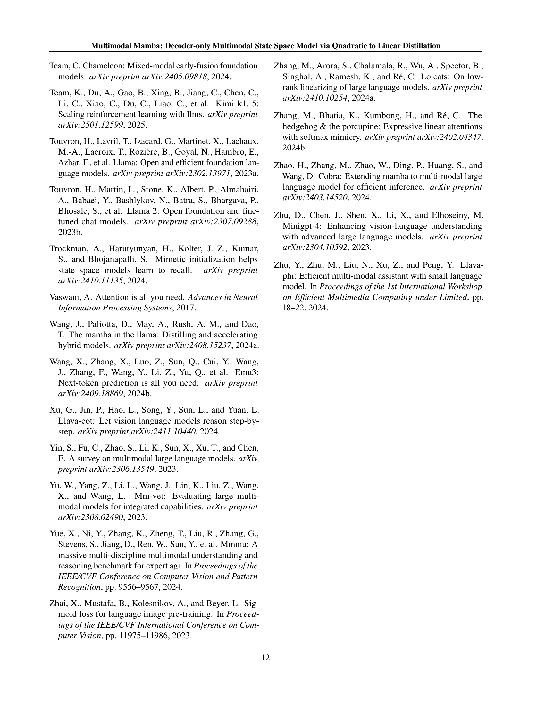

 


 2502.13145 
 Bencheng Liao et el. 
 
 🤗 2025-02-19 
 



↗ arXiv


↗ Hugging Face


### TL;DR



최근 다중 모달 대규모 언어 모델(MLLM)은 뛰어난 성능을 보이지만, 계산 복잡도가 높고, 메모리 사용량이 많아 실제 적용에 어려움이 있습니다. 특히, 긴 문장이나 고해상도 이미지를 처리하는 데는 더욱 큰 제약이 따릅니다. 기존의 접근 방식은 선형 복잡도의 모델을 사용하거나, 디코더 전용 모델을 확장하는 방식이었지만, 각각 한계가 존재했습니다.

본 논문에서는 이러한 문제를 해결하기 위해, **선형 복잡도의 디코더 전용 다중 모달 상태 공간 모델인 mmMamba**를 제안합니다. mmMamba는 기존의 Transformer 기반 MLLM으로부터 지식을 효과적으로 증류하는 3단계 증류 기법을 사용합니다. 또한, **모든 Transformer 계층을 Mamba-2 계층으로 변환하는 mmMamba-linear**와 Transformer 계층과 Mamba-2 계층을 혼합한 **mmMamba-hybrid**의 두 가지 변형 모델을 제시하여 유연성을 확보했습니다. 실험 결과, mmMamba는 기존 모델보다 훨씬 빠르고 메모리 효율적으로 동작하면서 동등하거나 더 나은 성능을 보였습니다.



#### Key Takeaways


 선형 복잡도의 디코더 전용 다중 모달 모델 mmMamba 제시 



 3단계 증류 기법을 통한 효과적인 지식 전이 



 mmMamba-linear 및 mmMamba-hybrid의 유연한 아키텍처를 통한 성능-효율성 균형 


#### Why does it matter?
본 논문은 **계산 비용이 많이 드는 기존의 다중 모달 대규모 언어 모델의 한계를 극복**하기 위해, 선형 복잡도의 디코더 전용 다중 모달 상태 공간 모델을 제시합니다. 이는 **효율성과 성능 간의 균형을 맞추는 새로운 방법론**을 제공하며, 다양한 분야의 연구자들에게 큰 영향을 미칠 수 있습니다. 특히, **장문의 컨텍스트 처리 및 고해상도 이미지/비디오 이해**와 같은 과제 해결에 큰 도움이 되고, 향후 연구를 위한 새로운 방향을 제시합니다.

------
#### Visual Insights

> 🔼 그림 1은 mmMamba의 성능을 종합적으로 비교 분석한 결과를 보여줍니다. (a)는 Transformer의 지식을 Mamba-2로 증류하여 선형 복잡도 및 하이브리드 디코더 전용 VLM을 구축하는 mmMamba의 구조를 보여줍니다. (b)는 이차 복잡도의 디코더 전용 VLM인 HoVLE로부터 증류하여, mmMamba-linear가 기존의 선형 및 이차 복잡도 VLM에 비해 경쟁력 있는 성능을 더 적은 매개변수로 달성함을 보여줍니다 (예: EVE-7B보다 2배 적음). mmMamba-hybrid는 모든 벤치마크에서 기존 모델들을 능가하고, teacher 모델인 HoVLE의 성능에 근접합니다. (c)와 (d)는 동일한 단일 NVIDIA 4090 GPU에서 mmMamba-linear와 mmMamba-hybrid의 속도와 메모리 사용량을 teacher 모델인 HoVLE와 비교한 것입니다. mmMamba-linear는 일관되게 낮은 지연 시간과 메모리 사용량을 유지하는 반면, mmMamba-hybrid의 자원 소비는 HoVLE보다 훨씬 효율적으로 확장됩니다. 103K 토큰에서 mmMamba-linear는 HoVLE에 비해 20.6배의 속도 향상을 보이고 GPU 메모리를 75.8% 절약하는 반면, mmMamba-hybrid는 13.5배의 속도 향상과 60.2%의 GPU 메모리 절약을 달성합니다.
> 

> 
read the caption

> Figure 1:  Comprehensive comparison of mmMamba. (a) Our mmMamba can build linear-complexity and hybrid decoder-only VLM by distilling the knowledge in Transformer to Mamba-2. (b) By distilling from the quadratic-complexity decoder-only VLM HoVLE, our mmMamba-linear achieves competitive performance against existing linear and quadratic-complexity VLMs with fewer parameters (e.g., 2×\times× fewer than EVE-7B), while mmMamba-hybrid surpasses them across all benchmarks and approaches the teacher model HoVLE’s performance. (c)-(d) We compare the speed and memory of mmMamba-linear and mmMamba-hybrid with the teacher model HoVLE on the same single NVIDIA 4090 GPU. mmMamba-linear maintains consistently low latency and memory usage, while mmMamba-hybrid’s resource consumption scales significantly better than HoVLE. At 103K tokens, mmMamba-linear demonstrates 20.6×\times× speedup compared to HoVLE and saves 75.8% GPU memory, while mmMamba-hybrid achieves 13.5×\times× speedup and saves 60.2% GPU memory.
> 


| Method | Recipe | Complexity | # P. | # T.P. | MME | MMB | POPE | SEED | MMMU | MM-Vet | TQA | SQA-I | GQA |
|---|---|---|---|---|---|---|---|---|---|---|---|---|---|---|
| **Encoder-based VLMs** |  |  |  |  |  |  |  |  |  |  |  |  |  |
| OpenFlamingo (Awadalla et al., 2023) | PT, SFT | Quadratic | 9B | 96.6% | - | 4.6 | - | - | - | - | 33.6 | - | - |
| MiniGPT-4 (Zhu et al., 2023) | PT, SFT | Quadratic | 13B | 94.8% | 581.7 | 23.0 | - | - | - | 22.1 | - | - | 32.2 |
| Qwen-VL (Bai et al., 2023b) | PT, SFT | Quadratic | 7B | 100.0% | - | 38.2 | - | 56.3 | - | - | 63.8 | 67.1 | 59.3 |
| LLaVA-Phi (Zhu et al., 2024) | PT, SFT | Quadratic | 3B | 90.0% | 1335.1 | 59.8 | 85.0 | - | - | 28.9 | 48.6 | 68.4 | - |
| MobileVLM-3B (Chu et al., 2023) | PT, SFT | Quadratic | 3B | 90.0% | 1288.9 | 59.6 | 84.9 | - | - | - | 47.5 | 61.0 | 59.0 |
| VisualRWKV (Hou et al., 2024) | PT, SFT | **Linear** | 3B | 90.0% | 1369.2 | 59.5 | 83.1 | - | - | - | 48.7 | 65.3 | 59.6 |
| VL-Mamba (Qiao et al., 2024) | PT, SFT | **Linear** | 3B | 90.0% | 1369.6 | 57.0 | 84.4 | - | - | 32.6 | 48.9 | 65.4 | 56.2 |
| Cobra (Zhao et al., 2024) | PT, SFT | **Linear** | 3.5B | 82.6% | - | - | **88.4** | - | - | - | 58.2 | - | **62.3** |
| **Decoder-only VLMs** |  |  |  |  |  |  |  |  |  |  |  |  |  |
| Fuyu-8B (HD) (Bavishi et al., 2023) | PT, SFT | Quadratic | 8B | 100.0% | 728.6 | 10.7 | 74.1 | - | - | 21.4 | - | - | - |
| SOLO (Chen et al., 2024a) | PT, SFT | Quadratic | 7B | 100.0% | 1001.3 | - | - | 64.4 | - | - | - | 73.3 | - |
| Chameleon-7B (Team, 2024) | PT, SFT | Quadratic | 7B | 100.0% | 170 | 31.1 | - | 30.6 | 25.4 | 8.3 | 4.8 | 47.2 | - |
| EVE-7B (Diao et al., 2024) | PT, SFT | Quadratic | 7B | 100.0% | 1217.3 | 49.5 | 83.6 | 61.3 | 32.3 | 25.6 | 51.9 | 63.0 | 60.8 |
| Emu3 (Wang et al., 2024b) | PT, SFT | Quadratic | 8B | 100.0% | - | 58.5 | 85.2 | 68.2 | 31.6 | 37.2 | 64.7 | 89.2 | 60.3 |
| HoVLE (Tao et al., 2024) | DT, PT, SFT | Quadratic | **2.6B** | 100.0% | **1433.5** | **71.9** | 87.6 | **70.7** | **33.7** | **44.3** | **66.0** | **94.8** | 60.9 |
| mmMamba | **DT** | **Linear** | **2.7B** | **14.7%** | 1303.5 | 57.2 | 85.2 | 62.9 | 30.7 | 31.1 | 47.7 | 79.2 | 57.4 |
| mmMamba | **DT** | **Hybrid** | **2.7B** | **11.2%** | 1371.1 | 63.7 | 86.7 | 66.3 | 32.3 | 36.9 | 55.1 | 86.9 | 59.3 |

> 🔼 표 1은 다양한 비전-언어 모델(VLMs)들과 제안된 mmMamba 모델의 성능을 일반적인 VLM 벤치마크에서 비교한 표입니다.  각 모델의 학습 방식(Recipe)을 나타내는 약어(PT: 사전학습, SFT: 지도 학습 미세 조정, DT: 증류 학습)와 모델의 계산 복잡도(Complexity, 토큰 수에 따른 복잡도), 총 파라미터 수(# P.), 훈련 가능한 파라미터 비율(# T.P.)이 함께 제시됩니다.  성능은 여러 VLM 벤치마크(MME, MMB, POPE, SEED, MMMU, MM-Vet, TQA, SQA-I, GQA)에 대한 결과로 나타나며, 최고 성능은 굵은 글씨체로, 두 번째로 높은 성능은 밑줄로 표시됩니다. 이 표는 mmMamba 모델이 기존 모델들에 비해 얼마나 효율적이고 경쟁력 있는 성능을 보이는지 보여줍니다.
> 

> 
read the caption

> Table 1: Comparison with existing VLMs on general VLM benchmarks. “Recipe” denotes the adopted training recipe. “PT”, “SFT”, and “DT” denote the pre-training, supervised fine-tuning, and distillation training, respectively. “Complexity” denotes the model computation complexity with respect to the number of tokens. “# P.” denotes the number of total parameters. “# T.P.” denotes the percentage of trainable parameters (trainable paramterstotal parameterstrainable paramterstotal parameters\frac{\text{trainable paramters}}{\text{total parameters}}divide start_ARG trainable paramters end_ARG start_ARG total parameters end_ARG). The best performance is highlighted in bold and the second-best result is underlined.
> 

### In-depth insights

#### Quadratic to Linear
본 논문의 "Quadratic to Linear" 부분은 **계산 복잡도를 이차(quadratic)에서 선형(linear)으로 줄이는 방법론**을 제시하는 핵심 내용을 담고 있습니다.  기존의 대규모 다중 모달 언어 모델(MLLM)들은 Transformer 구조를 기반으로 하여 이차적 계산 복잡도를 가지는 반면, 본 연구는 **Mamba-2라는 선형 복잡도 모델**을 통해 이를 해결하고자 합니다.  이는 단순히 모델을 선형화하는 것 이상으로, **Transformer의 지식을 Mamba-2로 효과적으로 증류하는 다단계 증류 기법**을 통해 이루어집니다.  **계산 효율성 증대** 뿐만 아니라, **기존의 인코더 기반 접근 방식과 달리 디코더 전용 MLLM을 직접적으로 선형 구조로 변환**하는 것을 목표로 하여,  **모델의 간결성과 효율성을 동시에 추구**합니다.  이러한 변환 과정은 **초기화 전략과 다단계 증류 과정**을 통해 이루어지며, 선형 모델과 하이브리드 모델을 모두 제시하여 성능과 효율성 간의 균형을 맞추는 유연성을 제공합니다.  결론적으로,  "Quadratic to Linear"는 **계산 효율성 개선과 함께 다중 모달 이해 능력을 유지하는 혁신적인 접근법**을 보여주는 중요한 부분입니다.

#### Progressive Distillation
본 논문에서 제안하는 **점진적 증류(Progressive Distillation)** 방법은 단순히 기존의 거대 언어 모델(LLM)의 지식을 선형 복잡도 모델로 전달하는 것을 넘어, 단계적인 학습 과정을 통해 효율성과 성능을 동시에 개선하는 전략을 제시합니다.  **세 단계**로 나뉘어 진행되는 이 방법은 먼저, 새로운 매개변수를 가진 Mamba-2 레이어의 초기화를 Transformer 레이어와의 유사성을 바탕으로 진행하고, **MSE 손실 함수**를 이용해 새로운 매개변수의 동작을 Transformer 레이어와 일치시킵니다. 두 번째 단계에서는 Mamba-2 레이어의 모든 매개변수를 미세 조정하여 레이어 단위의 행동 일관성을 유지하고, 마지막 단계에서는 KL-divergence 손실 함수를 사용하여 모델의 최종 출력을 Transformer 기반 모델과 일치시켜, **다중 모드 이해 능력**을 개선합니다. 이러한 단계적 접근 방식은 계산 비용을 효율적으로 관리하면서, 최종적으로 **선형 복잡도의 디코더 전용 다중 모드 LLM**을 구축하는 데 효과적인 방법을 제공합니다.  **mmMamba-linear 및 mmMamba-hybrid** 와 같은 다양한 아키텍처 변형을 가능하게 하여,  **성능과 효율성 간의 균형**을 맞추는 데 유연성을 제공합니다.

#### Mamba Architecture
**맘바 아키텍처**는 기존의 Transformer 기반의 이차 복잡도를 갖는 모델들과 달리, 선형 복잡도를 갖는 새로운 다중 모달 상태 공간 모델입니다.  **핵심 아이디어는 Transformer의 어텐션 메커니즘을 맘바-2의 상태 공간 메커니즘으로 변환하는 것**이며, 이를 통해 기존 모델의 장점을 유지하면서 연산 복잡도를 크게 줄일 수 있습니다. 이는 단순히 매개변수를 전이하는 것이 아니라, **3단계의 점진적 증류 과정**을 통해 Transformer의 지식을 효과적으로 맘바-2로 전달하는 정교한 기법을 사용합니다. 이를 통해 **mmMamba-linear와 같은 순수 선형 모델뿐만 아니라, mmMamba-hybrid처럼 Transformer와 Mamba-2 레이어를 혼합한 유연한 아키텍처**도 구축할 수 있습니다.  **맘바 아키텍처는 효율성과 성능 간의 균형을 조절할 수 있는 유연성**을 제공하며, 다양한 배포 환경에 적합하게 최적화될 수 있다는 장점이 있습니다. 특히, 장문의 컨텍스트 처리에서 우수한 효율성을 보이는데, 이는 **선형 복잡도** 덕분입니다.

#### Efficiency Analysis
본 논문의 효율성 분석 부분은 **mmMamba 모델의 연산 효율성을 기존의 Transformer 기반 모델들과 비교 분석**하여 그 우수성을 입증하는 데 초점을 맞추고 있습니다. 특히, 고정된 프롬프트와 디코딩 길이를 가진 상황에서 mmMamba 모델이 **Transformer 기반 모델들보다 훨씬 빠른 추론 속도**를 보임을 실험적으로 확인하였습니다.  또한, **긴 문맥 처리 상황에서 mmMamba 모델의 메모리 사용량이 기존 모델들에 비해 훨씬 효율적**임을 보여주는 결과를 제시합니다. 이는 mmMamba 모델의 선형 복잡도 알고리즘과 효율적인 메모리 관리 기법 덕분입니다.  **mmMamba-linear와 mmMamba-hybrid의 두 가지 변형 모델을 비교 분석**하여 각 모델의 속도와 메모리 사용량의 차이를 분석함으로써, 다양한 상황에 맞는 최적의 모델 선택을 위한 근거를 제시하고 있습니다.  결론적으로, 본 논문의 효율성 분석은 **mmMamba 모델의 우수한 연산 효율성과 확장성**을 보여주는 핵심적인 부분입니다.

#### Future of VLMs
미래의 VLM은 **더욱 효율적이고 강력하며, 다양한 모달리티를 통합하는 방향**으로 발전할 것입니다. **연산 복잡도를 낮추는 기술** (예: 선형 복잡도 모델, 효율적인 주의 메커니즘)이 중요해지며, **매우 큰 모델을 훈련하고 배포하기 위한 새로운 방법론**이 필요할 것입니다.  **데이터 효율성 및 지속 가능성** 또한 중요한 과제로, 적은 양의 데이터로도 높은 성능을 달성하고 환경 친화적인 훈련 및 배포 방식이 요구될 것입니다.  **다양한 모달리티 (텍스트, 이미지, 비디오, 오디오 등)를 원활하게 통합**하여, 보다 풍부하고 몰입적인 상호 작용을 제공하는 멀티모달 VLM이 주목받을 것으로 예상됩니다. 또한, **윤리적 문제 및 편향성 해결**을 위한 연구가 더욱 중요해지며, 안전하고 책임감 있는 VLM 개발이 필수적입니다.  결론적으로, **사용자 중심적이며, 효율적이고, 지속 가능하며, 윤리적으로 안전한 멀티모달 VLM**을 향한 지속적인 연구 개발이 미래 VLM의 핵심이 될 것입니다.

### More visual insights

More on tables


| Model | LLM Backbone | Vision Encoder | Total Params | Visual Tokens | Output Tokens | Speed (tokens/s) | Total (s) |
|---|---|---|---|---|---|---|---| 
| LLaVA-Phi | Phi-2.7B | CLIP ViT-L/14 | 3.1B | 576 | 256 | 26.92 | 9.51 |
| MobileVLM-3B | LLaMA-2.7B | CLIP ViT-L/14 | 3.1B | 144 | 256 | 35.26 | 7.26 |
| HoVLE | 32-layer Transformer |  | 2.6B | 768 | 256 | 33.03 | 7.75 |
| Cobra-3.5B | Mamba-2.8B | DINOv2 + SigLIP ViT-SO | 3.5B | 729 | 256 | 99.22 | 2.58 |
| VisualRWKV-3B | RWKV6-3B | CLIP ViT-L/14 | 3.4B | 577 | 256 | 41.34 | 6.19 |
| mmMamba-linear | 32-layer Mamba2 |  | 2.7B | 768 | 256 | 132.43 | 1.93 |
| mmMamba-hybrid | 24-layer Mamba2 + 8-layer Transformer |  | 2.7B | 768 | 256 | 134.77 | 1.90 |
> 🔼 표 2는 동일한 다중 모드 프롬프트와 고정된 디코딩 길이를 사용하여 추론 효율성을 비교한 표입니다. 인코더 기반, 디코더 전용, 2차 복잡도 및 선형 복잡도를 가진 비슷한 매개변수 크기(3B)의 VLM들을 비교 분석했습니다. 결과는 mmMamba-linear/hybrid의 속도 향상을 보여줍니다. 벤치마크 레시피는 Cobra를 따르며, 단일 NVIDIA RTX 4090 GPU에서 결과를 보고합니다. 총 시간에는 프리필링 및 디코딩 시간이 모두 포함되며, 속도는 출력 토큰 수 / 총 시간으로 계산됩니다.
> 

> 
read the caption

> Table 2: Inference efficiency comparison under same multimodal prompt and fixed decode length. We compare with VLMs of the similar parameter scale (3B) across encoder-based, decoder-only, quadratic-complexity, and linear-complexity. The results highlight the speed advantage of mmMamba-linear/hybrid. The benchmark recipe directly follows Cobra, and we report the results on the same single NVIDIA RTX 4090 GPU. Note that “Total Time” includes the time of both prefilling and decoding, and “Speed” = “Output Tokens” / “Total Time”.
> 


| ID | Stage1 | Stage2 | Stage3 | MME | POPE | TextVQA | SQA-I |
|---|---|---|---|---|---|---|---| 
| 1 |  |  |  | NAN | NAN | NAN | NAN |
| 2 | ✓ |  |  | 969.8 | 70.6 | 13.47 | 40.8 |
| 3 |  | ✓ |  | 1007.1 | 72.9 | 25.5 | 52.1 |
| 4 |  |  | ✓ | 1188.4 | 83.0 | 40.0 | 63.4 |
| 5 | ✓ | ✓ |  | 1108.9 | 75.3 | 28.0 | 59.3 |
| 6 | ✓ |  | ✓ | 1263.1 | 84.0 | 42.5 | 77.1 |
| 7 |  | ✓ | ✓ | 1255.5 | 83.5 | 41.1 | 72.1 |
| 8 | ✓ | ✓ | ✓ | 1303.5 | 85.2 | 47.7 | 79.2 |
> 🔼 표 3은 논문의 다단계 증류 학습 과정에 대한 ablation study 결과를 보여줍니다. 각 단계(Stage-1, Stage-2, Stage-3)를 제외했을 때, MME, POPE, TextVQA, SQA-I 지표에 미치는 영향을 정량적으로 비교 분석하여 각 단계의 중요성을 보여줍니다.  Stage-1은 새로 도입된 SSM 매개변수에 대한 계층별 증류, Stage-2는 전체 Mamba-2 매개변수에 대한 계층별 증류, Stage-3은 최종 출력에 대한 종단간 증류를 의미합니다.  결과는 각 단계가 성능 향상에 기여하는 정도와 전체적인 성능에 미치는 영향을 보여줍니다.
> 

> 
read the caption

> Table 3: Ablation for training stages.
> 


| Init Strategy | MME | POPE | TextVQA | SQA-I |
|---|---|---|---|---|
| from scratch | 1214.0 | 83.1 | 40.0 | 67.4 |
| inherit \boldsymbol{W}_{Q,K,V} | 1222.6 | 84.0 | 41.9 | 73.3 |
| inherit \boldsymbol{W}_{Q,K,V} + mimic | 1303.5 | 85.2 | 47.7 | 79.2 |
> 🔼 이 표는 모델의 매개변수 초기화 방법에 따른 성능 변화를 보여줍니다.  'from scratch' 전략은 매개변수를 무작위로 초기화하는 반면, 'WQ,K,V 상속' 전략은 Transformer 레이어의 WQ, WK, WV 매개변수를 상속하고, 제안된 방법은 추가적인 매개변수를 초기화하여 Transformer의 동작을 모방합니다. 결과적으로, 제안된 방법이 다른 초기화 전략보다 우수한 성능을 보여줍니다.
> 

> 
read the caption

> Table 4: Ablation for parameter initialization.
> 


| Attention Layers | MME | POPE | TextVQA | SQA-I |
|---|---|---|---|---|
| 0 | 1303.5 | 85.2 | 47.7 | 79.2 |
| 1 | 1304.3 | 85.5 | 48.0 | 79.3 |
| 2 | 1318.4 | 86.3 | 48.4 | 79.9 |
| 4 | 1329.1 | 86.8 | 51.5 | 82.8 |
| 8 | 1371.1 | 86.7 | 55.1 | 86.9 |
| 32 | 1433.5 | 87.6 | 66.0 | 94.8 |
> 🔼 표 5는 mmMamba 모델의 성능에 대한 어텐션 레이어 개수의 영향을 보여줍니다.  mmMamba-pure는 순수하게 Mamba-2 레이어만 사용하는 모델이고, mmMamba-hybrid는 Transformer 레이어와 Mamba-2 레이어를 섞어 사용하는 모델입니다. 마지막으로, HoVLE는 비교를 위한 기준 모델로서 순수 Transformer 레이어만 사용하는 모델입니다.  레이어 개수를 변화시키면서 각 모델의 MME, POPE, TextVQA, SQA-I 지표를 측정하여 mmMamba의 하이브리드 구조가 성능에 미치는 영향을 분석합니다.  0은 순수 Mamba-2 레이어, 8은 하이브리드 구조 (Transformer와 Mamba-2 레이어 혼합), 32는 순수 Transformer 레이어(HoVLE)를 의미합니다.
> 

> 
read the caption

> Table 5: Ablation for the number of interleaved attention layers. “0” denotes mmMamba-pure, “8” denotes mmMamba-hybrid, “32” denotes the full Transformer model HoVLE.
> 


| Hybrid strategy | MME | POPE | TextVQA | SQA-I |
|---|---|---|---|---|
| Tail-stacked | 1305.5 | 85.9 | 53.7 | 79.4 |
| Head-stacked | 1329.4 | 85.9 | 55.0 | 80.8 |
| Tail-interleaved | 1308.3 | 86.1 | 55.0 | 86.5 |
| Head-interleaved | 1371.1 | 86.7 | 55.1 | 86.9 |
> 🔼 표 6은 mmMamba 모델의 하이브리드 구조에 대한 추가 실험 결과를 보여줍니다.  mmMamba는 Transformer 계층과 Mamba-2 계층을 혼합하여 사용하는 하이브리드 아키텍처를 가지고 있는데, 이 표는 Transformer 계층의 배치 전략(Tail-stacked, Head-stacked, Tail-interleaved, Head-interleaved)을 다르게 하여 성능 변화를 비교 분석한 것입니다. 각 전략에 따른 MME, POPE, TextVQA, SQA-I 지표의 성능 수치가 제시되어 있습니다.  어떤 전략이 가장 효과적인지, 그리고 하이브리드 아키텍처의 유연성과 성능-효율 균형에 대한 통찰력을 제공합니다.
> 

> 
read the caption

> Table 6: Ablation for hybrid strategy.
> 

### Full paper



