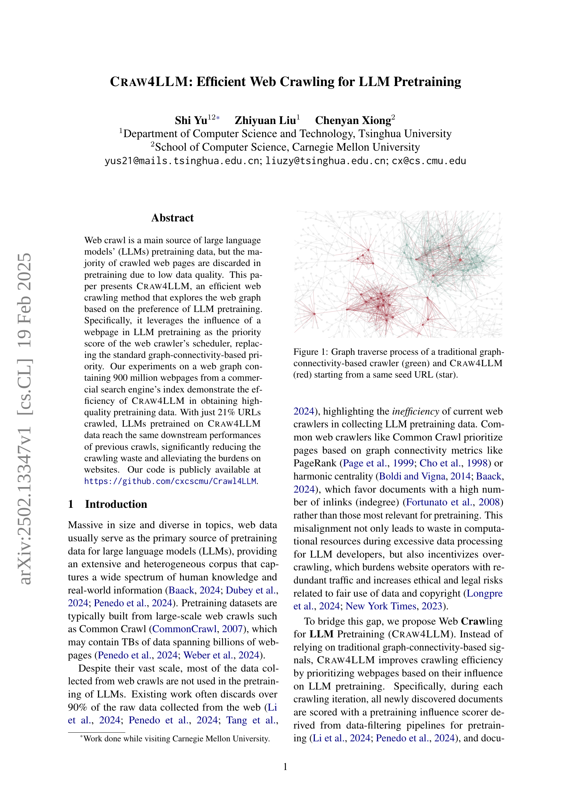
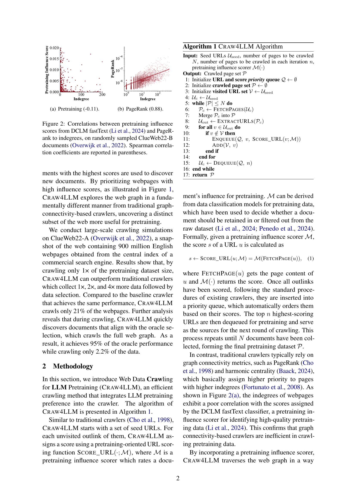
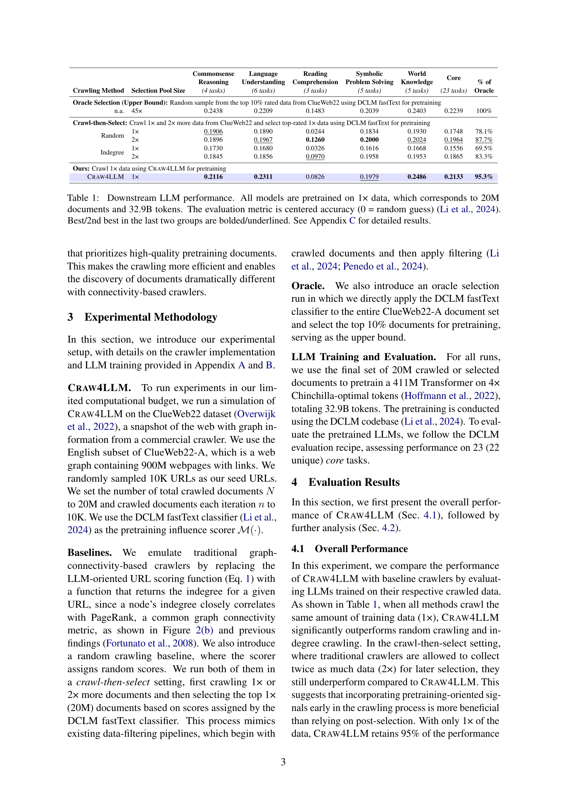
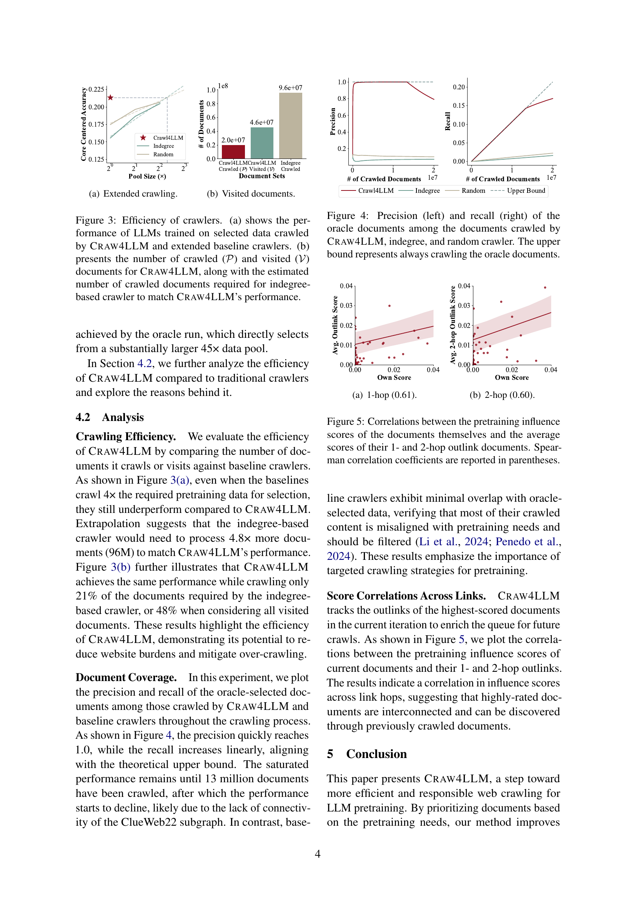
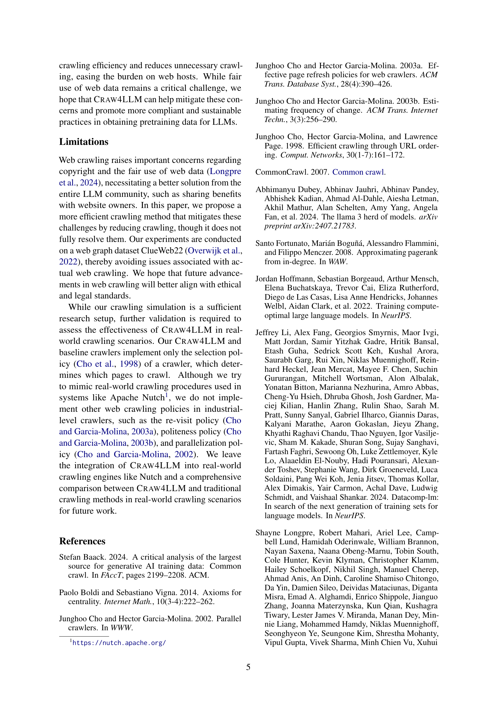
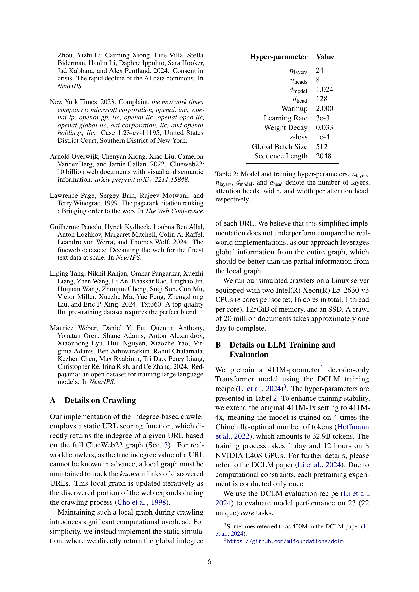
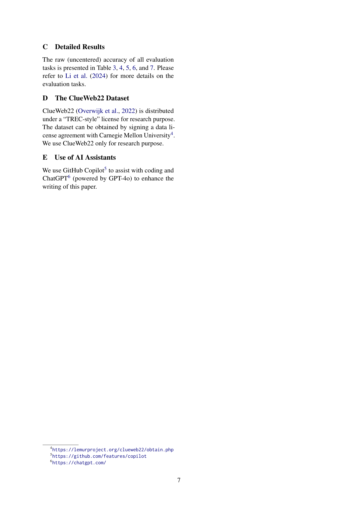
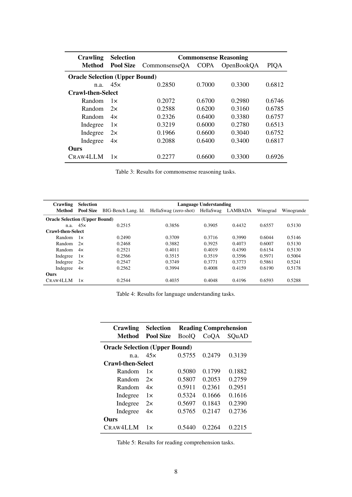
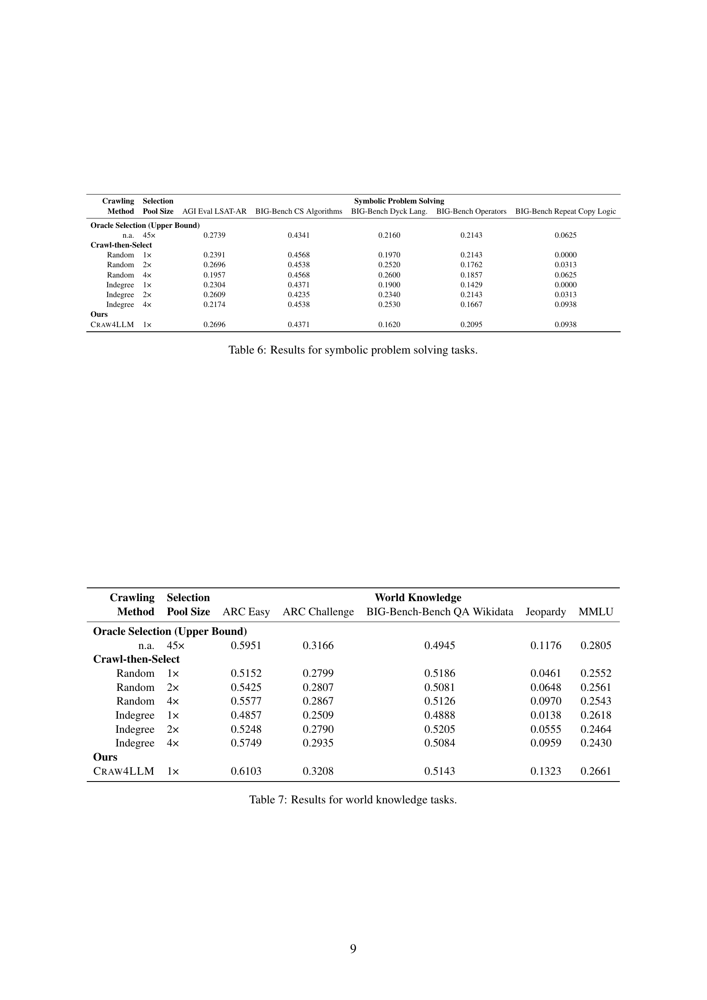

 


 2502.13347 
 Shi Yu et el. 
 
 🤗 2025-02-20 
 



↗ arXiv


↗ Hugging Face


↗ Papers with Code


### TL;DR



대규모 언어 모델(LLM)의 사전 훈련을 위해 웹 크롤링은 필수적이나, 기존 방식은 크롤링한 웹 페이지의 대부분을 품질이 낮다는 이유로 버리는 비효율적인 면이 있습니다.  **웹 크롤링 과정에서 LLM 사전 훈련에 유용한 데이터를 우선적으로 선택하는 것이 중요**합니다. 

본 논문에서는 **LLM 사전 훈련에 유용한 데이터를 우선적으로 크롤링하는 새로운 방법인 CRAW4LLM**을 제시합니다.  CRAW4LLM은 기존의 그래프 연결성 기반의 크롤링 방식과 달리, **LLM 사전 훈련에 미치는 영향력을 기준으로 웹 페이지의 우선순위를 정하며, 실험 결과 기존 방식보다 훨씬 효율적**임을 보였습니다.  **단 21%의 URL만 크롤링해도 동일한 성능을 달성**하여 데이터 낭비와 웹사이트 부담을 크게 줄였습니다. 또한, **웹 데이터 사용의 윤리적, 법적 문제에 대한 중요성**도 함께 강조하고 있습니다.



#### Key Takeaways


 LLM 사전 훈련에 최적화된 웹 페이지를 우선적으로 크롤링하는 새로운 방법 제시 



 기존 크롤링 방식 대비 21%의 URL만 크롤링해도 동일한 성능 달성, 데이터 낭비 및 웹사이트 부담 감소 효과 입증 



 크롤링 과정의 효율성과 윤리적, 법적 고려사항에 대한 중요성 강조 


#### Why does it matter?
본 논문은 **LLM 사전 훈련을 위한 효율적인 웹 크롤링 기법**을 제시하여 연구자들이 **데이터 낭비를 줄이고 웹사이트 부담을 완화**하는 데 도움을 줍니다. **LLM 사전 훈련 데이터의 품질과 효율성을 개선**하는 데 기여하며, **윤리적이고 법적 문제에 대한 고려**를 강조합니다.  향후 연구를 위한 새로운 방향을 제시하며 **웹 크롤링 기술의 발전**에 중요한 기여를 할 수 있습니다.

------
#### Visual Insights

> 🔼 그림 1은 기존의 그래프 연결 기반 웹 크롤러(녹색)와 CRAW4LLM(빨간색)이 동일한 시드 URL(별표)에서 시작하여 웹 그래프를 탐색하는 과정을 보여줍니다. 기존 크롤러는 페이지의 그래프 연결성(예: PageRank, 인링크 수)을 기반으로 우선순위를 정하는 반면, CRAW4LLM은 LLM 사전 학습에 유용한 웹 페이지를 우선적으로 탐색합니다. 이는 LLM 사전 학습에 대한 각 웹 페이지의 영향력을 우선 순위 점수로 사용하여 이루어집니다. 그림을 통해 CRAW4LLM이 기존 크롤러와는 다른 방식으로 웹 그래프를 탐색하여 LLM 사전 학습에 더 유용한 데이터를 효율적으로 수집함을 알 수 있습니다.
> 

> 
read the caption

> Figure 1: Graph traverse process of a traditional graph-connectivity-based crawler (green) and Craw4LLM (red) starting from a same seed URL (star).
> 


| Crawling Method | Selection Pool Size | Commonsense Reasoning (4 tasks) | Language Understanding (6 tasks) | Reading Comprehension (3 tasks) | Symbolic Problem Solving (5 tasks) | World Knowledge (5 tasks) | Core (23 tasks) | % of Oracle | 
|---|---|---|---|---|---|---|---|---| 
| **Oracle Selection (Upper Bound):** Random sample from the top 10% rated data from ClueWeb22 using DCLM fastText for pretraining |  | 0.2438 | 0.2209 | 0.1483 | 0.2039 | 0.2403 | 0.2239 | 100% | 
| n.a. | 45× | 0.2438 | 0.2209 | 0.1483 | 0.2039 | 0.2403 | 0.2239 | 100% | 
| **Crawl-then-Select:** Crawl 1× and 2× more data from ClueWeb22 and select top-rated 1× data using DCLM fastText for pretraining |  |  |  |  |  |  |  |  | 
| Random | 1× | 0.1906 | 0.1890 | 0.0244 | 0.1834 | 0.1930 | 0.1748 | 78.1% | 
|  | 2× | 0.1896 | 0.1967 | 0.1260 | 0.2000 | 0.2024 | 0.1964 | 87.7% | 
| Indegree | 1× | 0.1730 | 0.1680 | 0.0326 | 0.1616 | 0.1668 | 0.1556 | 69.5% | 
|  | 2× | 0.1845 | 0.1856 | 0.0970 | 0.1958 | 0.1953 | 0.1865 | 83.3% | 
| **Ours:** Crawl 1× data using Craw4LLM for pretraining |  |  |  |  |  |  |  |  | 
| Craw4LLM | 1× | 0.2116 | 0.2311 | 0.0826 | 0.1979 | 0.2486 | 0.2133 | 95.3% |

> 🔼 표 1은 다양한 하류 작업에서 사전 훈련된 대규모 언어 모델(LLM)의 성능을 보여줍니다. 모든 모델은 20M개의 문서와 32.9B 토큰에 해당하는 1배의 데이터로 사전 훈련되었습니다. 평가 지표는 중심 정확도(0은 무작위 추측)(Li et al., 2024)이며, 마지막 두 그룹에서 가장 높은/두 번째로 높은 점수는 굵은 글씨/밑줄로 표시되어 있습니다. 자세한 결과는 부록 C를 참조하십시오.
> 

> 
read the caption

> Table 1:  Downstream LLM performance. All models are pretrained on 1× data, which corresponds to 20M documents and 32.9B tokens. The evaluation metric is centered accuracy (0 = random guess) (Li et al., 2024). Best/2nd best in the last two groups are bolded/underlined. See Appendix C for detailed results.
> 

### In-depth insights

#### LLM Crawl Efficiency
본 논문에서 제시된 CRAW4LLM은 기존 웹 크롤링 방식과 달리 **LLM 사전 학습에 유용한 웹 페이지를 우선적으로 크롤링**함으로써 효율성을 크게 향상시켰습니다.  기존 방식은 페이지 랭크나 연결 수 등 웹 그래프의 연결성에 기반하여 페이지 중요도를 평가하지만, CRAW4LLM은 LLM 사전 학습 성능에 미치는 영향력을 기준으로 삼아 **불필요한 크롤링을 최소화**합니다. 이를 통해 동일한 성능을 달성하는데 필요한 크롤링 비용을 획기적으로 줄이고 웹사이트 부담을 경감시키는 효과를 보였습니다.  **LLM 사전 학습 데이터의 품질을 높이는 동시에 효율성을 개선**하는 CRAW4LLM의 접근 방식은 웹 크롤링 및 LLM 사전 학습 분야에 시사하는 바가 큽니다.  **특히, 제한된 자원으로 최대의 성능을 달성**하려는 연구에 중요한 의미를 지닙니다.

#### Pretraining Influence
본 논문에서 "Pretraining Influence"는 **LLM 사전 학습에 특정 웹페이지가 미치는 영향력**을 정량적으로 측정하고 활용하는 개념입니다.  기존 웹 크롤링 방식은 페이지의 연결성(graph connectivity)에 기반한 PageRank나 Harmonic Centrality를 우선순위로 삼았으나, 본 논문은 **LLM 사전 학습 성능에 실질적으로 기여하는 페이지를 효율적으로 선별**하는 데 초점을 맞춥니다.  따라서, 단순한 연결성이 아닌,  **LLM 사전 학습 데이터 필터링 과정에서 도출된 영향력 점수 (influence score)**를 이용하여 크롤링 우선순위를 결정합니다.  이는 크롤링 자원의 낭비를 줄이고 웹사이트 부담을 완화하는 효율적인 전략이며, **데이터 품질 향상**으로 이어지는 핵심 요소입니다.  **새로운 크롤링 알고리즘 CRAW4LLM은 이러한 영향력 점수를 활용**하여 기존 방식보다 훨씬 적은 비율의 웹페이지만 크롤링해도 동일한 성능을 달성함으로써 그 효과를 입증합니다.

#### CRAW4LLM Method
CRAW4LLM은 기존 웹 크롤링 방식의 비효율성을 해결하기 위해 **LLM 사전 학습에 최적화된 웹 페이지 우선 순위 지정** 전략을 사용하는 새로운 웹 크롤링 방법론입니다.  기존 크롤러들이 PageRank나 harmonic centrality와 같은 그래프 연결성 지표에 의존하는 것과 달리, CRAW4LLM은 **LLM 사전 학습 성능에 미치는 영향력을 기반으로 우선순위 점수**를 부여합니다. 이는 LLM 사전 학습 데이터 필터링 파이프라인에서 도출된 예측 모델을 활용하여 각 웹 페이지의 사전 학습 적합성을 평가하고, 이를 크롤링 스케줄러에 반영함으로써 효율성을 극대화합니다.  **데이터 품질에 집중**하여 불필요한 크롤링을 최소화하고, 제한된 크롤링 자원으로도 높은 성능의 LLM 사전 학습 데이터셋을 확보할 수 있습니다. 결과적으로, 웹사이트 부담을 줄이고 윤리적, 법적 문제 발생 가능성을 낮추는 동시에 LLM 성능 향상에 기여합니다.  **핵심은 LLM 사전 학습 성능과의 직접적인 연관성**을 기반으로 웹 페이지를 선택하는 데 있으며, 이러한 전략은 기존의 그래프 연결성 기반 방법론보다 훨씬 효율적이고 목적 지향적입니다.

#### Crawling Limitations
본 논문에서 제시된 크롤링 방법의 한계는 크게 **저작권 및 공정 이용 문제**, **실제 웹 크롤링 환경과의 차이**, 그리고 **크롤링 효율성의 실제 검증 부족**으로 요약할 수 있습니다.  저작권 문제는 웹 데이터 활용의 근본적인 어려움이며, 본 연구에서 제시된 크롤링 방식이 이를 완전히 해결하지는 못한다는 점이 한계로 지적됩니다.  또한, 실험은 시뮬레이션 환경에서 이루어져 실제 웹 크롤링 환경의 복잡성을 충분히 반영하지 못하고 있으며, **실제 웹 환경에서의 효율성 검증이 부족**하다는 점이 아쉬운 부분입니다.  마지막으로, 제시된 크롤링 방법의 효율성을 다양한 웹 크롤러와 비교 분석하여 검증하는 것이 필요합니다. 이러한 한계들을 보완하는 후속 연구가 필요하며, 특히 **윤리적이고 법적인 웹 데이터 사용에 대한 고려**는 앞으로 더욱 중요해질 것입니다.

#### Future Research
본 논문은 LLM 사전 학습을 위한 효율적인 웹 크롤링 방법인 CRAW4LLM을 제시합니다. **향후 연구는 실제 웹 크롤링 환경에서 CRAW4LLM의 효과를 검증하는 데 초점을 맞춰야 합니다.**  이는 ClueWeb22와 같은 정적 웹 그래프 데이터셋이 아닌, 동적으로 변화하는 실제 웹 환경을 고려해야 함을 의미합니다.  **크롤링 정책 (예: 재방문 정책, 예의 정책, 병렬화 정책)과의 통합 및 다른 크롤링 엔진과의 비교 연구도 필요합니다.** 또한, 저작권 및 윤리적 문제에 대한 고려가 중요하며, **웹사이트 운영자와의 협력을 통해 지속 가능한 웹 크롤링 전략을 수립하는 방안을 모색해야 합니다.**  **다양한 LLM 사전 학습 데이터 필터링 기법과의 연동 및 성능 비교 연구를 통해 CRAW4LLM의 일반화 가능성을 높이는 것도 중요합니다.**  마지막으로, **더욱 정교한 사전 학습 영향력 평가 지표를 개발하고 적용하여 크롤링의 효율성을 더욱 개선하는 방안을 탐색해야 합니다.**

### More visual insights

More on figures

> 🔼 그림 2(a)는 DCLM fastText (Li et al., 2024)에서 나온 사전 훈련 영향 점수와 ClueWeb22-B 문서들(Overwijk et al., 2022)의 In-degree 간의 상관관계를 보여줍니다.  DCLM fastText는 사전 훈련 데이터에 대한 데이터 필터링 파이프라인에서 파생된 사전 훈련 영향 점수를 계산하는 데 사용된 모델입니다.  이 그림은 사전 훈련 영향 점수와 In-degree 간의 상관관계가 거의 없음을 보여주며,  기존의 그래프 연결성 기반 크롤러가 사전 훈련 데이터 수집에 비효율적임을 시사합니다.
> 

> 
read the caption

> (a) Pretraining (-0.11).
> 

> 🔼 그림 2(b)는 ClueWeb22-B 문서에서 사전 훈련 영향력 점수와 PageRank 간의 상관관계를 보여줍니다.  PageRank는 웹 페이지의 중요도를 나타내는 지표로, 높은 PageRank 값을 가진 페이지는 일반적으로 더 많은 인바운드 링크를 가지고 있습니다.  이 그림은 PageRank와 사전 훈련 영향력 점수 사이의 상관 관계가 0.88로 매우 높다는 것을 보여줍니다. 이는 PageRank가 높은 페이지가 사전 훈련에 유용한 고품질 데이터를 포함할 가능성이 높다는 것을 시사합니다. 
> 

> 
read the caption

> (b) PageRank (0.88).
> 

> 🔼 그림 2는 무작위로 추출된 ClueWeb22-B 문서(Overwijk et al., 2022)에서 DCLM fastText (Li et al., 2024)의 사전 훈련 영향 점수와 PageRank 및 진입 차수 간의 상관 관계를 보여줍니다.  각 그래프는 사전 훈련 영향 점수와 PageRank 또는 진입 차수 간의 산점도를 나타내며, 상관 관계의 강도를 보여주는 스피어만 상관 계수가 괄호 안에 표시되어 있습니다. 이 그림은 사전 훈련에 유용한 웹 페이지를 선택하는 데 있어 기존의 그래프 연결성 기반 방법(PageRank, 진입 차수)의 한계를 시각적으로 보여줍니다. 사전 훈련 영향 점수는 기존 지표보다 사전 훈련 데이터 선택에 더 적합한 웹 페이지를 식별하는 데 훨씬 효과적임을 보여줍니다.
> 

> 
read the caption

> Figure 2: Correlations between pretraining influence scores from DCLM fastText (Li et al., 2024) and PageRank to indegrees, on randomly sampled ClueWeb22-B documents (Overwijk et al., 2022). Spearman correlation coefficients are reported in parentheses.
> 

> 🔼 그림 3(a)는 기존 크롤러와 CRAW4LLM의 효율성을 비교 분석한 결과를 보여줍니다. 기존 크롤러(Indegree, Random)는 학습에 필요한 데이터를 확보하기 위해 더 많은 웹페이지를 크롤링해야 하는 반면, CRAW4LLM은 훨씬 적은 양의 데이터로 동일한 성능을 달성합니다.  x축은 크롤링한 데이터의 양을 나타내고 y축은 LLM의 성능을 나타냅니다.  CRAW4LLM은 적은 양의 데이터로도 높은 성능을 보이는 것을 확인할 수 있습니다.
> 

> 
read the caption

> (a) Extended crawling.
> 

> 🔼 그림 3(b)는 CRAW4LLM 크롤러와 기존 크롤러의 방문 문서 수를 비교하여 크롤링 효율성을 보여줍니다. CRAW4LLM은 동일한 성능을 달성하는 데 필요한 문서 수의 21%만 크롤링하지만, 방문한 문서 수는 더 많습니다. 이는 CRAW4LLM이 크롤링 초기 단계에서 고품질의 사전 학습 데이터를 효율적으로 찾아내어 불필요한 크롤링을 줄이기 때문입니다.
> 

> 
read the caption

> (b) Visited documents.
> 

> 🔼 그림 3은 크롤러의 효율성을 보여줍니다. (a)는 Craw4LLM과 확장된 기준 크롤러에 의해 크롤링된 선택 데이터로 학습된 LLMs의 성능을 보여줍니다. (b)는 Craw4LLM에 대한 크롤링된(𝒫) 및 방문된(𝒱) 문서 수와 Craw4LLM의 성능에 맞추기 위해 필요한 진입 차수 기반 크롤러의 크롤링된 문서 수를 추정한 것을 보여줍니다.
> 

> 
read the caption

> Figure 3: Efficiency of crawlers. (a) shows the performance of LLMs trained on selected data crawled by Craw4LLM and extended baseline crawlers. (b) presents the number of crawled (𝒫𝒫\mathcal{P}caligraphic_P) and visited (𝒱𝒱\mathcal{V}caligraphic_V) documents for Craw4LLM, along with the estimated number of crawled documents required for indegree-based crawler to match Craw4LLM’s performance.
> 

> 🔼 그림 4는 Craw4LLM, Indegree 및 Random Crawler가 크롤링한 문서들 중에서 Oracle 문서의 정밀도(Precision)와 재현율(Recall)을 보여줍니다. 왼쪽 그래프는 정밀도, 오른쪽 그래프는 재현율을 나타냅니다. 상단 경계선(Upper Bound)은 항상 Oracle 문서를 크롤링하는 경우를 나타냅니다. 이 그림은 크롤링 전략에 따른 Oracle 문서 획득 효율성을 비교 분석하여 Craw4LLM의 우수성을 시각적으로 보여줍니다.
> 

> 
read the caption

> Figure 4: Precision (left) and recall (right) of the oracle documents among the documents crawled by Craw4LLM, indegree, and random crawler. The upper bound represents always crawling the oracle documents.
> 

More on tables


| Hyper-parameter | Value |
|---|---| 
| nlayers | 24 |
| nheads | 8 |
| dmodel | 1,024 |
| dhead | 128 |
| Warmup | 2,000 |
| Learning Rate | 3e-3 |
| Weight Decay | 0.033 |
| z-loss | 1e-4 |
| Global Batch Size | 512 |
| Sequence Length | 2048 |
> 🔼 표 2는 본 논문에서 사용된 언어 모델의 훈련에 사용된 하이퍼파라미터들을 보여줍니다.  `nlayers`는 레이어 수, `nheads`는 어텐션 헤드 수, `dmodel`은 모델의 너비, `dhead`는 어텐션 헤드 당 너비를 나타냅니다.  이러한 하이퍼파라미터들은 모델의 구조와 성능에 영향을 미치는 중요한 요소입니다.
> 

> 
read the caption

> Table 2: Model and training hyper-parameters. nlayerssubscript𝑛layersn_{\text{layers}}italic_n start_POSTSUBSCRIPT layers end_POSTSUBSCRIPT, nlayerssubscript𝑛layersn_{\text{layers}}italic_n start_POSTSUBSCRIPT layers end_POSTSUBSCRIPT, dmodelsubscript𝑑modeld_{\text{model}}italic_d start_POSTSUBSCRIPT model end_POSTSUBSCRIPT, and dheadsubscript𝑑headd_{\text{head}}italic_d start_POSTSUBSCRIPT head end_POSTSUBSCRIPT denote the number of layers, attention heads, width, and width per attention head, respectively.
> 


| Crawling | Selection | Commonsense Reasoning |  |  |  |
|---|---|---|---|---|---| 
| **Method** | **Pool Size** | CommonsenseQA | COPA | OpenBookQA | PIQA |
| **Oracle Selection (Upper Bound)** |  |  |  |  |  |
| n.a. | 45× | 0.2850 | 0.7000 | 0.3300 | 0.6812 |
| **Crawl-then-Select** |  |  |  |  |  |
| Random | 1× | 0.2072 | 0.6700 | 0.2980 | 0.6746 |
| Random | 2× | 0.2588 | 0.6200 | 0.3160 | 0.6785 |
| Random | 4× | 0.2326 | 0.6400 | 0.3380 | 0.6757 |
| Indegree | 1× | 0.3219 | 0.6000 | 0.2780 | 0.6513 |
| Indegree | 2× | 0.1966 | 0.6600 | 0.3040 | 0.6752 |
| Indegree | 4× | 0.2088 | 0.6400 | 0.3400 | 0.6817 |
| **Ours** |  |  |  |  |  |
| Craw4LLM | 1× | 0.2277 | 0.6600 | 0.3300 | 0.6926 |
> 🔼 본 표는 상식 추론 과제에 대한 실험 결과를 보여줍니다.  각 상식 추론 과제(CommonsenseQA, COPA, OpenBookQA, PIQA)에 대해, 다양한 크롤링 방법(무작위 크롤링, In-degree 기반 크롤링, CRAW4LLM)과 크롤링 데이터 규모(1x, 2x, 4x)에 따른 성능을 나타냅니다. Oracle Selection (Upper Bound)는 최상위 10% 데이터를 사용한 경우의 성능을 나타내어 비교 기준을 제공합니다. 이를 통해 CRAW4LLM의 효율성 및 우수성을 보여줍니다.
> 

> 
read the caption

> Table 3: Results for commonsense reasoning tasks.
> 


| Crawling | Selection | Language Understanding |  |  |  |  |  |
|---|---|---|---|---|---|---|---| 
| **Method** | **Pool Size** | BIG-Bench Lang. Id. | HellaSwag (zero-shot) | HellaSwag | LAMBADA | Winograd | Winogrande |
|---|---|---|---|---|---|---|---| 
| **Oracle Selection (Upper Bound)** |  |  |  |  |  |  |  |
| n.a. | 45× | 0.2515 | 0.3856 | 0.3905 | 0.4432 | 0.6557 | 0.5130 |
| **Crawl-then-Select** |  |  |  |  |  |  |  |
| Random | 1× | 0.2490 | 0.3709 | 0.3716 | 0.3990 | 0.6044 | 0.5146 |
| Random | 2× | 0.2468 | 0.3882 | 0.3925 | 0.4073 | 0.6007 | 0.5130 |
| Random | 4× | 0.2521 | 0.4011 | 0.4019 | 0.4390 | 0.6154 | 0.5130 |
| Indegree | 1× | 0.2566 | 0.3515 | 0.3519 | 0.3596 | 0.5971 | 0.5004 |
| Indegree | 2× | 0.2547 | 0.3749 | 0.3771 | 0.3773 | 0.5861 | 0.5241 |
| Indegree | 4× | 0.2562 | 0.3994 | 0.4008 | 0.4159 | 0.6190 | 0.5178 |
| **Ours** |  |  |  |  |  |  |  |
| Craw4LLM | 1× | 0.2544 | 0.4035 | 0.4048 | 0.4196 | 0.6593 | 0.5288 |
> 🔼 표 4는 다양한 언어 이해 작업에 대한 실험 결과를 보여줍니다.  각 작업(BIG-Bench Lang. ID, HellaSwag(zero-shot), HellaSwag, LAMBADA, Winograd, Winogrande)에 대해 세 가지 크롤링 방법 (무작위 크롤링, In-degree 기반 크롤링, CRAW4LLM)과 데이터 선택 방식(크롤링 데이터 1배, 2배, 4배 크롤링 후 상위 1배 선택)의 성능을 비교 분석합니다. 오라클 선택(Oracle Selection) 결과는 최고 성능의 기준점 역할을 합니다.  각 방법의 성능은 중심화된 정확도(centered accuracy)로 측정됩니다.
> 

> 
read the caption

> Table 4: Results for language understanding tasks.
> 


| Crawling | Selection | Reading Comprehension |  |  |
|---|---|---|---|---|
| **Method** | **Pool Size** | BoolQ | CoQA | SQuAD |
| **Oracle Selection (Upper Bound)** |  |  |  |  |
| n.a. | 45× | 0.5755 | 0.2479 | 0.3139 |
| **Crawl-then-Select** |  |  |  |  |
| Random | 1× | 0.5080 | 0.1799 | 0.1882 |
| Random | 2× | 0.5807 | 0.2053 | 0.2759 |
| Random | 4× | 0.5911 | 0.2361 | 0.2951 |
| Indegree | 1× | 0.5324 | 0.1666 | 0.1616 |
| Indegree | 2× | 0.5697 | 0.1843 | 0.2390 |
| Indegree | 4× | 0.5765 | 0.2147 | 0.2736 |
| **Ours** |  |  |  |  |
| Craw4LLM | 1× | 0.5440 | 0.2264 | 0.2215 |
> 🔼 표 5는 본 논문의 실험 결과 중 읽기 이해(Reading Comprehension) 작업에 대한 결과를 보여줍니다.  각각의 크롤링 방법(CRAW4LLM, 랜덤 크롤링, Indegree 기반 크롤링)과 크롤링 데이터 크기(1x, 2x, 4x)별로 BoolQ, CoQA, SQUAD 세 가지 읽기 이해 데이터셋에 대한 성능(정확도)을 비교 분석하여 CRAW4LLM의 효율성을 보여줍니다. Oracle Selection (Upper Bound)는 최상위 10% 데이터를 사용한 경우의 성능을 나타냅니다.
> 

> 
read the caption

> Table 5: Results for reading comprehension tasks.
> 


| Crawling | Selection | AGI Eval LSAT-AR | BIG-Bench CS Algorithms | BIG-Bench Dyck Lang. | BIG-Bench Operators | BIG-Bench Repeat Copy Logic |
|---|---|---|---|---|---|---|
| **Oracle Selection (Upper Bound)** |  | 0.2739 | 0.4341 | 0.2160 | 0.2143 | 0.0625 |
| **Crawl-then-Select** |  |  |  |  |  |  |
| Random | 1× | 0.2391 | 0.4568 | 0.1970 | 0.2143 | 0.0000 |
| Random | 2× | 0.2696 | 0.4538 | 0.2520 | 0.1762 | 0.0313 |
| Random | 4× | 0.1957 | 0.4568 | 0.2600 | 0.1857 | 0.0625 |
| Indegree | 1× | 0.2304 | 0.4371 | 0.1900 | 0.1429 | 0.0000 |
| Indegree | 2× | 0.2609 | 0.4235 | 0.2340 | 0.2143 | 0.0313 |
| Indegree | 4× | 0.2174 | 0.4538 | 0.2530 | 0.1667 | 0.0938 |
| **Ours** |  |  |  |  |  |  |
| Craw4LLM | 1× | 0.2696 | 0.4371 | 0.1620 | 0.2095 | 0.0938 |
> 🔼 표 6은 논문의 실험 결과를 보여주는 표이며, 기호적 문제 해결 작업에 대한 다양한 모델의 성능을 비교 분석합니다. 구체적으로, 각 모델이 AGI Eval, LSAT-AR, BIG-Bench CS Algorithms, BIG-Bench Dyck Lang, BIG-Bench Operators, BIG-Bench Repeat Copy Logic 등 다양한 기호적 문제 해결 벤치마크에서 달성한 성능 점수를 보여줍니다. 크롤링 방법(임의 크롤링, In-degree 크롤링, CRAW4LLM)과 크롤링 데이터 크기(1x, 2x, 4x)에 따른 성능 변화를 비교하여 CRAW4LLM의 효율성과 우수성을 보여주는 표입니다.
> 

> 
read the caption

> Table 6: Results for symbolic problem solving tasks.
> 


| Crawling | Selection | World Knowledge |  |  |  |  |
|---|---|---|---|---|---|---|
| **Method** | **Pool Size** | ARC Easy | ARC Challenge | BIG-Bench-Bench QA Wikidata | Jeopardy | MMLU |
| **Oracle Selection (Upper Bound)** |  |  |  |  |  |  |
| n.a. | 45× | 0.5951 | 0.3166 | 0.4945 | 0.1176 | 0.2805 |
| **Crawl-then-Select** |  |  |  |  |  |  |
| Random | 1× | 0.5152 | 0.2799 | 0.5186 | 0.0461 | 0.2552 |
| Random | 2× | 0.5425 | 0.2807 | 0.5081 | 0.0648 | 0.2561 |
| Random | 4× | 0.5577 | 0.2867 | 0.5126 | 0.0970 | 0.2543 |
| Indegree | 1× | 0.4857 | 0.2509 | 0.4888 | 0.0138 | 0.2618 |
| Indegree | 2× | 0.5248 | 0.2790 | 0.5205 | 0.0555 | 0.2464 |
| Indegree | 4× | 0.5749 | 0.2935 | 0.5084 | 0.0959 | 0.2430 |
| **Ours** |  |  |  |  |  |  |
| Craw4LLM | 1× | 0.6103 | 0.3208 | 0.5143 | 0.1323 | 0.2661 |
> 🔼 표 7은 세계 지식 관련 과제에 대한 결과를 보여줍니다.  각 행은 크롤링 방법(임의, 차수 기반, CRAW4LLM)과 크롤링 데이터 크기(1x, 2x, 4x)에 따른 성능을 나타냅니다.  세계 지식 과제는 다양한 지식 데이터베이스(ARC Easy, ARC Challenge, BIG-Bench QA, Wikidata, Jeopardy, MMLU)를 사용하며, 각 과제에 대한 정확도 점수가 제시됩니다.  오라클 선택(최상위 10% 데이터 사용) 결과는 상한선으로 사용됩니다. 이 표는 CRAW4LLM이 다른 방법보다 더 효율적으로 고품질의 세계 지식 관련 데이터를 수집할 수 있음을 보여줍니다.
> 

> 
read the caption

> Table 7: Results for world knowledge tasks.
> 

### Full paper



