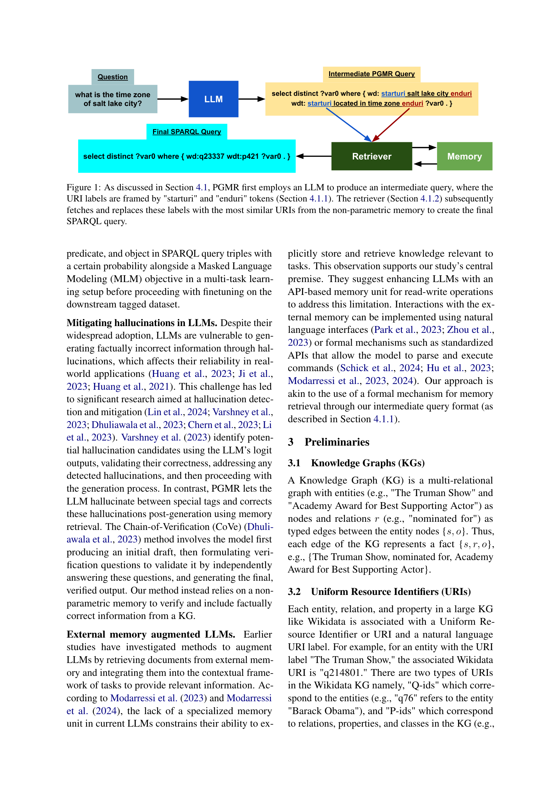

 


 2502.13369 
 Aditya Sharma et el. 
 
 🤗 2025-02-20 
 



↗ arXiv


↗ Hugging Face


↗ Papers with Code


### TL;DR



많은 연구에서 대규모 언어 모델(LLM)을 활용하여 자연어 질문을 SPARQL 질의로 변환하는 연구가 진행되고 있지만, LLM은 **내부 매개변수 지식에만 기반하여 KG 요소(URI 등)를 생성**하기 때문에 **환각(hallucination)**과 **분포 외 오류(out-of-distribution error)**에 취약합니다. 이는 생성된 SPARQL 질의가 사실적으로는 틀린 정보를 포함하는 등의 문제를 야기합니다. 

본 논문에서는 이러한 문제를 해결하기 위해 **PGMR(Post-Generation Memory Retrieval)**이라는 새로운 모듈형 프레임워크를 제시합니다. PGMR은 **비매개변수 메모리 모듈**을 통합하여 LLM이 SPARQL 질의 구문 생성에 집중하는 동안 관련 KG 요소를 정확하게 검색합니다.  실험 결과, PGMR은 다양한 데이터셋과 LLM에서 **URI 환각을 현저히 감소**시키고 **성능을 크게 향상**시키는 것으로 나타났습니다. 특히, 분포 외 평가에서도 강인함을 보였습니다.



#### Key Takeaways


 LLM 기반 SPARQL 질의 생성에서 발생하는 URI 환각 현상을 크게 감소시키는 PGMR 프레임워크를 제안했습니다. 



 PGMR은 다양한 데이터셋과 LLM에 대해 우수한 성능을 보이며, 특히 데이터 분포 변화에 강인함을 보였습니다. 



 본 연구는 LLM 기반 KGQA 시스템의 정확성과 신뢰성 향상에 크게 기여하며, 향후 연구를 위한 새로운 방향을 제시합니다. 


#### Why does it matter?
본 논문은 **대규모 언어 모델(LLM)** 기반 **SPARQL 질의 생성**에서의 **환각(hallucination)** 문제를 해결하는 새로운 방법론을 제시하여, **지식 그래프(KG)** 기반 질의응답 시스템의 정확성과 신뢰성을 크게 향상시켰다는 점에서 중요합니다.  **실세계 정보 검색(IR) 애플리케이션**에 LLM을 적용하는 데 있어 중요한 문제점을 해결하고, 관련 연구 분야에 새로운 방향을 제시할 수 있습니다.  **PGMR(Post-Generation Memory Retrieval)**과 같은 새로운 기술의 개발 및 평가는 향후 연구의 중요한 이정표가 될 것입니다.  또한, 제시된 방법론은 다양한 데이터셋과 LLM에 걸쳐 뛰어난 성능을 보여주어 실용적인 가치를 더욱 높였습니다.

------
#### Visual Insights

> 🔼 본 그림은 논문의 4.1절에서 설명하는 PGMR(Post-Generation Memory Retrieval) 모델의 동작 과정을 보여줍니다. 먼저, LLM(Large Language Model)이 질문을 받아 URI(Uniform Resource Identifier) 레이블이 'starturi'와 'enduri' 토큰으로 둘러싸인 중간 단계 쿼리를 생성합니다.  그 후, 4.1.2절에서 설명하는 Retriever 모듈이 비모수 메모리에서 가장 유사한 URI를 찾아 레이블을 교체하여 최종 SPARQL 쿼리를 생성합니다.  즉, LLM은 쿼리 구조 생성에 집중하고, Retriever는 정확한 KG(Knowledge Graph) 요소를 가져오는 역할을 분담하는 것을 보여주는 그림입니다.
> 

> 
read the caption

> Figure 1: As discussed in Section 4.1, PGMR first employs an LLM to produce an intermediate query, where the URI labels are framed by 'starturi' and 'enduri' tokens (Section 4.1.1). The retriever (Section 4.1.2) subsequently fetches and replaces these labels with the most similar URIs from the non-parametric memory to create the final SPARQL query.
> 


| Model | Type | Query EM ↑ | BLEU ↑ | URI EM ↑ | URI Hallucination ↓ |
|---|---|---|---|---|---| 
| **T5-Small** | finetuned | 35.08 % | 81.87 | 38.44 % | 27.75 % |
| **T5-Small PGMR (ours)** | finetuned | 74.23 % | 92.76 | 80.15 % | **0.38 %** |
| **Llama 3.1 8B** | finetuned | 0.72 % | 64.83 | 0.79 % | 89.84 % |
| **Llama 3.1 8B PGMR (ours)** | finetuned | 69.48 % | 89.96 | 78.76 % | **0.01 %** |
| **GPT 4o** | few-shot | 1.26 % | 47.03 | 4.36 % | 81.81 % |
| **GPT 4o PGMR (ours)** | few-shot | 43.53 % | 73.53 | 69.60 % | **0.0 %** |

> 🔼 표 1은 LCQUAD 2.0 데이터셋(원본 분할)을 사용한 실험 결과를 보여줍니다.  다양한 언어 모델(LLM)에서 PGMR(Post-Generation Memory Retrieval)을 사용했을 때, 직접 SPARQL 쿼리 생성 방식보다 환각(hallucination) 현상이 크게 감소하고, Query EM(Exact Match) 점수가 유의미하게 향상되었음을 보여줍니다.  6장에서 자세히 논의됩니다.
> 

> 
read the caption

> Table 1: Results on LCQUAD 2.0 (original split): Across different LLMs, PGMR demonstrates a substantial reduction in hallucinations while achieving significantly higher Query EM scores than direct SPARQL generation, as discussed in Section 6.
> 

### In-depth insights

#### Hallucination Mitigation
본 논문은 언어 모델 기반 SPARQL 질의 생성에서 **환각(hallucination)** 문제를 해결하는 데 중점을 둡니다.  기존의 방법들은 지식 그래프(KG) 요소, 특히 URI를 생성할 때 내부 매개변수 지식에만 의존하여 사실과 다른 정보를 생성하는 경향이 있습니다. 이는 **PGMR(Post-Generation Memory Retrieval)**이라는 새로운 모듈식 프레임워크를 통해 해결하고자 합니다. PGMR은 비매개변수 메모리 모듈을 통합하여 LLM이 SPARQL 구문 생성에 집중하도록 하면서 KG 요소의 정확한 검색을 보장합니다.  **후처리 단계에서의 메모리 검색**을 통해 환각을 줄이고, 다양한 데이터셋과 LLM에서 일관되게 우수한 성능을 보입니다. 특히 URI 환각을 크게 완화하여 여러 시나리오에서 문제를 거의 해결합니다.  **데이터 분포 변화에 대한 강건성**도 보여주며, 실제 세계 정보 검색 응용 프로그램에 적용 가능성을 높입니다.

#### PGMR Framework
PGMR 프레임워크는 **대규모 언어 모델(LLM)의 환각 문제를 해결하기 위해 후처리 메모리 검색을 통합한 모듈식 아키텍처**입니다.  LLM이 SPARQL 질의 구문 생성에 집중하는 동안, **비모수적 메모리 모듈이 관련 KG 요소를 정확하게 검색**합니다.  즉, LLM은 자연어 엔티티와 관계를 특수 토큰으로 묶어 중간 SPARQL 질의를 생성하고, 추출기가 이를 KG URI로 바꾸어 최종 질의를 만듭니다. 이러한 **분리된 접근 방식은 URI 환각을 줄이고 분포 외 오류를 방지**하여 SPARQL 질의 생성의 신뢰성과 정확성을 향상시킵니다. **사후 처리 방식은 LLM의 내부 매개변수 지식에만 의존하지 않고 외부 지식 기반을 활용**하므로,  **다양한 데이터셋과 LLM에 걸쳐 일관되게 높은 성능**을 보입니다.  **특히 URI 환각 문제를 거의 완벽하게 해결**하여 실제 정보 검색 응용 프로그램에 적용 가능성을 높였습니다.

#### KGQA Enhancements
본 논문은 지식 그래프 질의응답(KGQA) 시스템의 성능 향상에 중점을 둡니다. 특히, **대규모 언어 모델(LLM)** 기반 질의 생성에서 발생하는 **환각(hallucination)** 문제 해결에 초점을 맞춥니다.  **PGMR(Post-Generation Memory Retrieval)** 이라는 새로운 모듈식 프레임워크를 제시하여, LLM이 SPARQL 질의 구문 생성에 집중하는 동안, 별도의 메모리 모듈이 KG 요소를 정확하게 검색하는 방식을 채택합니다. 이를 통해 LLM의 내부 매개변수에만 의존하지 않고, **외부 지식 기반의 정보를 활용**하여 생성된 SPARQL 질의의 신뢰성과 정확성을 높이는 것을 목표로 합니다. 실험 결과, PGMR은 다양한 데이터셋과 LLM에서 일관되게 우수한 성능을 보이며, 특히 URI 환각 문제를 상당 부분 해결하는 것으로 나타났습니다.  **데이터 분포 변화에 대한 강인성**도 확인되어, PGMR의 실용성을 더욱 높였습니다.  **향후 연구**로는 더욱 복잡한 질의에 대한 처리 능력 향상과, PGMR 기반의 더욱 강력한 KGQA 시스템 개발 가능성을 제시합니다.

#### Experimental Results
본 논문의 실험 결과는 **PGMR (Post-Generation Memory Retrieval) 모델이 기존의 LLM 기반 SPARQL 쿼리 생성 방식보다 URI 환각 현상을 현저히 줄이고, 쿼리 정확도를 크게 향상시킨다는 것을 보여줍니다.**  다양한 LLM (T5, Llama, GPT)과 데이터셋(LC-QUAD 2.0, QALD-10)에 걸쳐 일관된 성능 향상을 확인했으며, 특히 **데이터 분포 변화에도 강인한 성능을 유지**하는 것을 확인했습니다.  **알려지지 않은 URI를 포함하는 테스트셋에서도 PGMR의 우수성이 두드러졌으며, URI 환각을 거의 완벽하게 제거**했습니다.  이러한 결과는 PGMR의 모듈식 구조, 즉 LLM이 쿼리 구문 생성에 집중하고 메모리 모듈이 KG 요소 검색을 담당하는 구조가 **LLM의 한계를 극복하고 신뢰할 수 있는 SPARQL 쿼리 생성을 가능하게 함**을 시사합니다.  하지만, 복잡한 쿼리의 경우에는 여전히 개선의 여지가 있음을 논문에서 언급하고 있습니다.

#### Future Research
미래 연구 방향은 **대규모 언어 모델(LLM)의 환각 문제 해결 및 SPARQL 쿼리 생성 성능 향상**에 초점을 맞춰야 합니다.  본 논문에서 제시된 PGMR은 URI 환각을 상당히 줄였지만, 복잡한 쿼리나 다양한 데이터 분포에 대한 로버스트성을 높이는 추가 연구가 필요합니다. **더욱 강력한 LLM을 사용하거나, PGMR 프레임워크를 SPARQL 쿼리 데이터로 사전 훈련**하는 방식을 고려할 수 있습니다. 또한, **다국어 지원 및 다양한 지식 그래프(KG)에 대한 적용성 확장** 연구도 중요합니다.  **실제 정보 검색 시스템에 PGMR을 통합하여 성능 평가**하고, 사용자 피드백을 바탕으로 시스템을 개선하는 연구도 필요합니다. 마지막으로, **다른 KGQA 방법론과 PGMR을 결합**하여 성능을 더욱 향상시키는 연구가 미래의 중요한 연구 과제가 될 것입니다.  **PGMR의 효율성을 높이는 경량화 연구**도 실용적인 측면에서 중요한 과제입니다.

### More visual insights

More on tables


| Model           |                                          |
|-----------------|------------------------------------------|
| T5-Small PGMR    | (ours)                                   |
> 🔼 표 2는 LCQUAD 2.0 데이터셋의 알려지지 않은 URI 분할에 대한 결과를 보여줍니다. 이는 훈련 데이터에 없던 URI를 포함하는 질문에 대한 모델 성능을 평가하기 위한 것입니다.  결과는 다양한 언어 모델에서 PGMR이 직접적인 SPARQL 생성과 비교하여 환각을 현저히 줄이고 질의 정확도를 향상시킨다는 것을 보여줍니다.  이는 데이터 분포 변화에 대한 PGMR의 강인성을 보여주는 중요한 결과입니다.  6장에서 자세히 논의됩니다.
> 

> 
read the caption

> Table 2: Results on LCQUAD 2.0 (unknown URI split): Even in an out-of-distribution setting, PGMR significantly mitigates hallucinations and enhances Query EM performance compared to direct SPARQL generation across various LLMs, as discussed in Section 6.
> 


| Model | Notes |
|---|---| 
| Llama 3.1 8B PGMR | (ours) |
> 🔼 표 3은 QALD-10 데이터셋을 사용한 실험 결과를 보여줍니다.  QALD-10은 LCQUAD 2.0보다 더 복잡한 쿼리를 포함하고 있기 때문에,  본 논문에서 제안하는 PGMR 모델의 성능을 더욱 엄격하게 평가할 수 있습니다.  표에서 확인할 수 있듯이 PGMR은 다양한 LLMs(대규모 언어 모델)에서 직접 SPARQL 생성 방식보다 훨씬 더 높은 Query EM 점수를 달성하면서 동시에 환각(hallucination)을 상당히 줄이는 것을 확인할 수 있습니다.  이는 PGMR이 복잡한 쿼리에도 우수한 성능과 안정성을 제공함을 의미합니다. 6장에서 자세히 논의됩니다.
> 

> 
read the caption

> Table 3: Results on QALD-10: PGMR consistently minimizes hallucinations across LLMs while attaining significantly better Query EM scores than direct SPARQL generation, even for the more complex QALD-10 dataset, as discussed in Section 6.
> 

### Full paper



