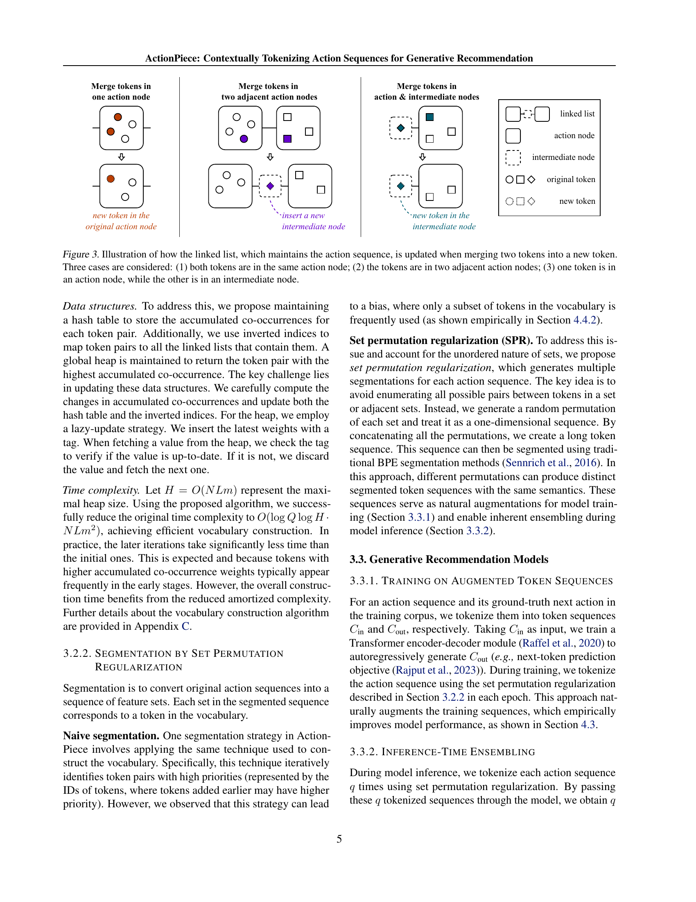

 


 2502.13581 
 Yupeng Hou et el. 
 
 🤗 2025-02-20 
 



↗ arXiv


↗ Hugging Face


↗ Papers with Code


### TL;DR



기존 생성형 추천 시스템은 사용자 행동을 **컨텍스트**를 고려하지 않고 독립적으로 토큰화하여 성능 저하 문제를 야기했습니다.  즉, 동일한 행동이라도 상황에 따라 다른 의미를 가질 수 있음에도 불구하고, 동일한 토큰으로 처리되어 사용자의 의도를 제대로 반영하지 못하는 문제가 발생했습니다. 이는 사용자의 선호도를 정확하게 파악하고 효과적인 추천을 제공하는 데 어려움을 초래했습니다.

본 논문에서는 이러한 문제를 해결하기 위해 **ActionPiece**라는 새로운 방법론을 제안합니다. ActionPiece는 각 행동을 아이템 특징의 집합으로 나타내고, 이러한 특징들의 동시 발생 빈도를 기반으로 새로운 토큰을 생성하는 **컨텍스트 인식 토큰화** 기법을 사용합니다. 또한, 특징 집합의 순서에 무관한 특성을 고려하여 시퀀스 분할 과정에 **순열 정규화**를 적용함으로써 다양한 의미적 표현을 생성합니다.  실험 결과, ActionPiece는 기존 방법에 비해 **NDCG@10 지표를 최대 12.82%까지 향상**시키는 우수한 성능을 보였습니다.



#### Key Takeaways


 ActionPiece는 **컨텍스트를 고려한 행동 토큰화**를 통해 기존 생성형 추천 시스템의 한계를 극복 



 **새로운 어휘 구축 및 시퀀스 분할 기법**으로 추천 정확도와 효율성을 향상 



 **다양한 실험 결과**를 통해 ActionPiece의 우수성을 입증, NDCG@10 기준 최대 12.82% 성능 향상 


#### Why does it matter?
본 논문은 **추천 시스템 분야의 혁신적인 접근 방식**을 제시하여 기존의 한계를 극복하고 성능을 향상시켰다는 점에서 중요합니다. 특히, **컨텍스트 인식 행동 토큰화**라는 새로운 개념을 도입하여 사용자 행동의 복잡한 상호 작용을 효과적으로 모델링함으로써, **추천 정확도 및 효율성을 개선**했습니다. 이러한 연구 결과는 추천 시스템의 발전에 크게 기여할 뿐만 아니라, 자연어 처리 및 기타 시퀀스 데이터 분석 분야에도 응용될 수 있어 연구자들에게 폭넓은 영향을 미칠 것으로 예상됩니다.  더 나아가, 본 논문에서 제시된 **새로운 방법론은 추가적인 연구를 위한 훌륭한 기반**을 제공하며, 특히, 다양한 데이터 유형과 추천 시나리오에 대한 적용 및 확장 가능성을 탐색하는 미래 연구에 새로운 방향을 제시합니다.

------
#### Visual Insights

> 🔼 ActionPiece의 토큰화 과정을 보여주는 그림입니다. 각각의 행위(action)는 순서가 없는 특징 집합(unordered feature set)으로 표현됩니다. 그림에서는 동일한 행위가 주변 문맥에 따라 다른 토큰으로 토큰화될 수 있음을 보여주는 두 가지 가능한 토큰화된 시퀀스를 보여줍니다. 즉, 같은 행위라도 앞뒤 문맥에 따라 다른 의미를 가질 수 있고, ActionPiece는 이러한 문맥을 명시적으로 고려하여 토큰화한다는 것을 보여줍니다. 자세한 내용은 4.5절에서 확인할 수 있습니다.
> 

> 
read the caption

> Figure 1: Illustration of the tokenization process of ActionPiece. Each action is represented as an unordered feature set. This figure presents two possible tokenized sequences. The same action can be tokenized into different tokens depending on the surrounding context. A detailed case study can be found in Section 4.5.
> 


| Action Tokenization | Example | Contextual | Unordered |
|---|---|---|---| 
| Product Quantization | VQ-Rec [2023] | ✗ | ✔ |
| Hierarchical Clustering | P5-CID [2023] | ✗ | ✗ |
| Residual Quantization | TIGER [2023] | ✗ | ✗ |
| Text Tokenization | LMIndexer [2024] | ✗ | ✗ |
| Raw Features | HSTU [2024] | ✗ | ✗ |
| SentencePiece | SPM-SID [2024] | ✗ | ✗ |
| ActionPiece | Ours | ✔ | ✔ |

> 🔼 표 1은 생성적 추천을 위한 다양한 행동 토큰화 방법들을 비교한 표입니다.  'Contextual' 열은 주변 문맥에 따라 동일한 행동이 다른 토큰으로 변환될 수 있는지를 나타내고, 'Unordered' 열은 항목 특징 또는 의미 ID가 순서에 상관없이 사용되는지를 보여줍니다.  각 행동 토큰화 방법에 대한 예시와 함께, Contextual 여부와 Unordered 여부를 체크 표시하여 비교 분석하였습니다.
> 

> 
read the caption

> Table 1: Comparison of different action tokenization methods for generative recommendation. “Contextual” denotes whether the same actions can be tokenized into different tokens based on the surrounding context. “Unordered” denotes whether the item features or semantic IDs are used in an order-agnostic manner.
> 

### In-depth insights

#### Contextual Tokenization
본 논문에서 제시하는 맥락적 토큰화는 기존의 단순한 토큰화 방식을 넘어, **각 행위(action)의 주변 맥락을 고려하여 토큰을 생성**하는 방법입니다. 이는 기존의 맥락에 무관하게 동일한 행위에 대해 동일한 토큰을 할당하는 방식의 한계를 극복하기 위한 시도입니다. **각 행위를 아이템 특징들의 집합으로 표현하고, 이들의 공동 출현 빈도를 기반으로 새로운 토큰을 생성**하는 과정을 통해 맥락을 반영합니다. 특히, **특징 집합의 순서에 무관함을 고려하여 집합 순열 정규화(SPR) 기법을 도입**, 다양한 의미를 지닌 토큰 시퀀스를 생성하고 모델 학습 및 추론 과정에 활용합니다. 이러한 맥락 인식 토큰화는 단순히 토큰의 수를 늘리는 것 이상의 의미를 지니며, **더욱 정확하고 효율적인 생성적 추천 모델을 구축**하는 데 기여할 것으로 예상됩니다.  이는 특히 시계열 데이터 분석에서 맥락 정보가 중요한 역할을 하는 추천 시스템의 성능 향상에 크게 기여할 것으로 기대됩니다.

#### ActionPiece Model
ActionPiece 모델은 기존의 generative recommendation (GR) 모델들이 각 행동을 독립적으로 토큰화하는 한계를 극복하기 위해 제안된 새로운 방법입니다. **문맥을 고려한 토큰화**를 통해 같은 행동이라도 주변 문맥에 따라 다른 의미를 가질 수 있음을 인지하고, 각 행동을 아이템 특징들의 집합으로 표현합니다. 이는 **토큰 사전 구성 및 시퀀스 분할** 과정을 거쳐 이루어집니다. 특징 집합의 비순서적 특성을 고려하여 **집합 순열 정규화** 기법을 도입하여 동일한 의미를 갖는 여러 토큰 시퀀스를 생성, 모델의 일반화 능력을 향상시킵니다. 실험 결과, ActionPiece는 기존 방법보다 성능이 향상됨을 보여주며, **문맥 인식 토큰화의 중요성**을 강조합니다.  **특히, vocabulary construction 과정에서 set permutation regularization 기법을 활용하여 모델의 학습 데이터를 풍부하게 만들고,  inference 과정에서 inference-time ensembling 전략을 통해 성능 향상을 도모하는 점이 핵심입니다.**

#### Generative RecSys
생성형 추천 시스템(Generative RecSys)는 사용자 행동을 토큰화하여 자기회귀적으로 예측하는 새로운 패러다임입니다. 기존의 접근 방식은 각 행동을 독립적으로 처리하지만, **ActionPiece는 맥락을 고려하여 토큰화함으로써 성능 향상**을 도모합니다. 핵심은 각 행동을 아이템 특징들의 집합으로 표현하고, 공동 출현 빈도에 기반하여 새로운 토큰을 생성하는 것입니다. **ActionPiece는 집합 순열 규제를 통해 동일한 의미를 가진 다양한 분절화를 생성**하며, 이는 모델 학습 및 추론 과정에 다양성을 더하고 성능 향상에 기여합니다.  **실험 결과는 ActionPiece가 기존 방식보다 NDCG@10 지표에서 6.00%~12.82% 향상**되었음을 보여줍니다.  이는 **맥락 인식 토큰화의 중요성**을 강조하며, 생성형 추천 시스템의 발전에 기여할 수 있는 중요한 발견입니다.  ActionPiece는 자연어 처리 분야의 발전을 생성형 추천 시스템에 적용하는 혁신적인 시도로 평가할 수 있습니다.

#### Ablation Experiments
본 논문의 "Ablation Experiments" 부분은 제안된 모델의 성능에 각 구성 요소가 얼마나 기여하는지 분석하기 위해 **계획적으로 특정 기능을 제거**한 실험 결과를 보여줍니다.  이를 통해 각 구성요소의 중요도를 정량적으로 평가하고, 모델의 성능 향상에 가장 크게 기여한 부분을 명확히 파악할 수 있습니다.  **특히, 어떤 요소를 제거했을 때 성능이 얼마나 저하되는지**를 보여주는 것은 모델의 핵심 구성 요소를 이해하는 데 중요한 역할을 합니다.  이는 단순히 최종 성능만을 비교하는 것보다 더욱 심도있는 분석을 제공하여, 모델 개선을 위한 구체적인 방향을 제시한다는 점에서 가치가 있습니다.  **다양한 변형 모델을 비교 분석함으로써, 연구의 견고성을 높이고**, 제안된 방법의 우수성을 더욱 효과적으로 보여주는 데 기여할 것입니다.  **결과 해석을 통해 얻은 통찰력은 향후 연구 방향 설정에 중요한 정보**를 제공하고, 유사한 연구를 수행하는 다른 연구자들에게도 유용한 지침을 제공할 것입니다.

#### Future Directions
본 논문의 "미래 방향"에 대한 제 생각은 다음과 같습니다. **ActionPiece의 핵심 아이디어인 context-aware 토큰화는 다양한 시퀀스 추천 시스템에 적용될 수 있는 잠재력이 크다**는 점입니다. 특히, 비정형 데이터를 다루는 분야(예: 이미지, 비디오)에서의 응용은 흥미로운 연구 주제가 될 것입니다. 또한, **현재의 ActionPiece는 단일 모달리티에 초점을 맞추고 있지만, 다양한 모달리티(텍스트, 이미지, 비디오 등)를 결합한 멀티모달 추천 시스템으로 확장하는 연구**가 필요합니다. 이는 사용자 행동의 풍부한 정보를 활용하여 더욱 정확하고 개인화된 추천을 제공할 수 있기 때문입니다. **셋째로, ActionPiece의 효율성을 개선하는 방안을 모색**하는 것이 중요합니다. 현재의 알고리즘은 계산량이 상당히 클 수 있으므로, 더 빠르고 효율적인 토큰화 기법에 대한 연구가 필요합니다. 마지막으로, **ActionPiece의 일반화 성능을 향상**시키는 것이 중요합니다. 현재의 실험 결과는 긍정적이지만, 다양한 데이터셋에 대한 추가 실험을 통해 일반화 성능을 검증하고, 더 견고한 모델을 개발하는 연구가 필요합니다.

### More visual insights

More on figures

> 🔼 그림 2는 어휘 구축 과정에서 동시 발생하는 토큰 쌍의 가중치를 계산하는 방법을 보여줍니다. 이 예시에서는 시퀀스의 두 인접한 집합(하나는 ○○  ○으로 표현되는 4개의 토큰을, 다른 하나는 □□□으로 표현되는 3개의 토큰을 가짐)을 고려합니다. 토큰 쌍은 단일 집합 내(<○,○>, <○,○>, <○,○>, <□,□>, <□,□>, <□,□>)와 두 인접 집합 간(<○,□>, <○,□>, <○,□>)에서 계산됩니다.  즉, 같은 집합 내에 있는 토큰 쌍과 인접한 집합에 있는 토큰 쌍 모두의 동시 발생 횟수를 고려하여 가중치를 부여합니다.
> 

> 
read the caption

> Figure 2: Illustration of how weights of co-occurring token pairs are counted during vocabulary construction. In this example, two adjacent sets in the sequence are considered: one with 4444 tokens (represented as ○○\bigcirc○) and another with 3333 tokens (represented as □□\square□). Token pairs are counted within a single set (<○,○><\bigcirc,\bigcirc>< ○ , ○ > and <□,□><\square,\square>< □ , □ >) and across the two adjacent sets (<○,□><\bigcirc,\square>< ○ , □ >).
> 

> 🔼 그림 3은 ActionPiece 알고리즘에서 두 토큰을 새로운 토큰으로 병합할 때 작업 시퀀스를 유지하는 연결 리스트가 어떻게 업데이트되는지 보여줍니다. 세 가지 경우가 고려됩니다. 1) 두 토큰이 모두 동일한 작업 노드에 있는 경우, 2) 두 토큰이 인접한 작업 노드에 있는 경우, 3) 한 토큰이 작업 노드에 있고 다른 토큰이 중간 노드에 있는 경우입니다. 그림은 각 경우에 연결 리스트가 어떻게 변경되는지를 시각적으로 보여주어 ActionPiece 알고리즘의 동작 과정을 이해하는 데 도움을 줍니다.
> 

> 
read the caption

> Figure 3: Illustration of how the linked list, which maintains the action sequence, is updated when merging two tokens into a new token. Three cases are considered: (1) both tokens are in the same action node; (2) the tokens are in two adjacent action nodes; (3) one token is in an action node, while the other is in an intermediate node.
> 

> 🔼 그림 4는 세 개의 데이터셋에 걸쳐 어휘 크기에 따른 추천 성능(NDCG@10)과 평균 토큰화된 시퀀스 길이(NSL)를 분석한 결과를 보여줍니다. NDCG@10 값이 높을수록 추천 성능이 우수함을 나타내고, NSL 값이 낮을수록 토큰화된 시퀀스가 짧다는 것을 의미합니다. ActionPiece를 적용하지 않은 경우(N/A)에는 액션 시퀀스가 초기 토큰으로만 표현됩니다. 이 그림을 통해 ActionPiece의 어휘 크기 변화에 따른 성능 변화와 토큰화된 시퀀스 길이 변화를 비교 분석하여 최적의 어휘 크기를 찾는 과정을 확인할 수 있습니다.
> 

> 
read the caption

> Figure 4: Analysis of recommendation performance (NDCG@10, ↑↑\uparrow↑) and average tokenized sequence length (NSL, ↓↓\downarrow↓) w.r.t. vocabulary size across three datasets. “N/A” indicates that ActionPiece is not applied, i.e., action sequences are represented solely by initial tokens.
> 

More on tables


| Datasets | Metric | ID-based BERT4Rec | ID-based SASRec | ID-based FDSA | Feature + ID S3-Rec | Feature + ID VQ-Rec | Feature + ID P5-CID | Generative TIGER | Generative LMIndexer | Generative HSTU | Generative SPM-SID | Generative ActionPiece | Improv. |
|---|---|---|---|---|---|---|---|---|---|---|---|---|---|
| Sports | R@5 | 0.0115 | 0.0233 | 0.0182 | 0.0251 | 0.0181 | 0.0287 | 0.0264 | 0.0222 | 0.0258 | 0.0280 | **0.0316 ± 0.0005** | +12.86% |
|  | N@5 | 0.0075 | 0.0154 | 0.0122 | 0.0161 | 0.0132 | 0.0179 | 0.0181 | 0.0142 | 0.0165 | 0.0180 | **0.0205 ± 0.0002** | +11.71% |
|  | R@10 | 0.0191 | 0.0350 | 0.0288 | 0.0385 | 0.0251 | 0.0426 | 0.0400 |  — | 0.0414 | 0.0446 | **0.0500 ± 0.0007** | +12.11% |
|  | N@10 | 0.0099 | 0.0192 | 0.0156 | 0.0204 | 0.0154 | 0.0224 | 0.0225 |  — | 0.0215 | 0.0234 | **0.0264 ± 0.0003** | +12.82% |
| Beauty | R@5 | 0.0203 | 0.0387 | 0.0267 | 0.0387 | 0.0434 | 0.0468 | 0.0454 | 0.0415 | 0.0469 | 0.0475 | **0.0511 ± 0.0014** | +7.58% |
|  | N@5 | 0.0124 | 0.0249 | 0.0163 | 0.0244 | 0.0311 | 0.0315 | 0.0321 | 0.0262 | 0.0314 | 0.0321 | **0.0340 ± 0.0011** | +5.92% |
|  | R@10 | 0.0347 | 0.0605 | 0.0407 | 0.0647 | 0.0741 | 0.0701 | 0.0648 |  — | 0.0704 | 0.0714 | **0.0775 ± 0.0017** | +4.59% |
|  | N@10 | 0.0170 | 0.0318 | 0.0208 | 0.0327 | 0.0372 | 0.0400 | 0.0384 |  — | 0.0389 | 0.0399 | **0.0424 ± 0.0011** | +6.00% |
| CDs | R@5 | 0.0326 | 0.0351 | 0.0226 | 0.0213 | 0.0314 | 0.0505 | 0.0492 |  — | 0.0417 | 0.0509 | **0.0544 ± 0.0005** | +6.88% |
|  | N@5 | 0.0201 | 0.0177 | 0.0137 | 0.0130 | 0.0209 | 0.0326 | 0.0329 |  — | 0.0275 | 0.0337 | **0.0359 ± 0.0004** | +6.53% |
|  | R@10 | 0.0547 | 0.0619 | 0.0378 | 0.0375 | 0.0485 | 0.0785 | 0.0748 |  — | 0.0638 | 0.0778 | **0.0830 ± 0.0008** | +5.73% |
|  | N@10 | 0.0271 | 0.0263 | 0.0186 | 0.0182 | 0.0264 | 0.0416 | 0.0411 |  — | 0.0346 | 0.0424 | **0.0451 ± 0.0005** | +6.37% |
> 🔼 표 2는 Amazon 상품평 데이터셋(McAuley et al., 2015)에서 다양한 추천 방법들의 성능을 비교한 표입니다.  표에는 여러 추천 모델(BERT4Rec, SASRec, FDSA, S3-Rec, VQ-Rec, P5-CID, TIGER, LMIndexer, HSTU, SPM-SID, ActionPiece)의 Recall@K와 NDCG@K 지표가 제시되어 있습니다.  K값은 5와 10을 사용하였습니다.  가장 우수한 성능은 굵은 글씨체로 강조 표시되었으며, ActionPiece 모델의 성능 향상률은 가장 강력한 기준 모델 대비 백분율로 표시되어 있습니다.  즉, 이 표는 ActionPiece 모델이 기존의 여러 추천 모델보다 우수한 성능을 보임을 보여주는 실험 결과를 제시합니다.
> 

> 
read the caption

> Table 2: Performance comparison of different methods on the Amazon Reviews dataset (McAuley et al., 2015). The best and second-best performance is denoted in bold and underlined fonts. “R@K” and “N@K” are short for “Recall@K” and “NDCG@K”, respectively. “Improv.” denotes the percentage improvement of our method compared to the strongest baseline method.
> 


| Variants | Sports | Beauty | CDs |
|---|---|---|---|
| **TIGER with larger vocabularies** |
| (1.1) TIGER - 1k (4 × 28) | 0.0225 | 0.0384 | 0.0411 |
| (1.2) TIGER-49k (6 × 213) | 0.0162 | 0.0317 | 0.0338 |
| (1.3) TIGER-66k (4 × 214) | 0.0194 | N/A† | 0.0319 |
| **Vocabulary construction** |
| (2.1) _w/o_ tokenization | 0.0215 | 0.0389 | 0.0346 |
| (2.2) _w/o_ context-aware | 0.0258 | 0.0416 | 0.0429 |
| (2.3) _w/o_ weighted counting | 0.0257 | 0.0412 | 0.0435 |
| **Set permutation regularization** |
| (3.1) only for inference | 0.0192 | 0.0316 | 0.0329 |
| (3.2) only for training | 0.0244 | 0.0387 | 0.0422 |
| ActionPiece (40k) | **0.0264** | **0.0424** | **0.0451** |
> 🔼 표 3은 ActionPiece의 ablation study 결과를 보여줍니다.  NDCG@10 지표를 사용하여 추천 성능을 측정했습니다.  각 변수 제거 실험을 통해 ActionPiece의 성능 향상에 기여하는 요소를 분석하였습니다.  각 실험에서 NDCG@10 값이 가장 높은 결과는 굵은 글씨체로 표시되어 있습니다.  다양한 변수 제거를 통해, 문맥 인식 토큰화, 가중치 부여된 공동 출현 횟수 계산, 집합 순열 정규화 (SPR) 등이 ActionPiece 성능 향상에 중요하게 작용함을 확인할 수 있습니다.
> 

> 
read the caption

> Table 3: Ablation analysis of ActionPiece. The recommendation performance is measured using NDCG@10101010. The best performance is denoted in bold fonts.
> 


This table summarizes notations used in the paper. 

| Notation | Explaination |
|---|---| 
| $i$, $i_1$, $i_j$ | item, item identifier, item ID |
| $t$ | the number of actions in the input action sequence; the timestamp when the model makes a prediction |
| $i_{t+1}$ | the ground-truth next item |
| $"{i}_{t+1}$ | the predicted next item |
| $S = \{i_1, i_2, \ldots, i_t\}$ | the action sequence where each action is represented with the interacted item ID |
| $"{"}, "{"}_1, "{"}_j$ | a set of item features or tokens |
| $m = |\mathcal{A}_j|$ | the number of features associated with each item |
| $f_{j,k}$ | the $k$-th feature of item $i_j$ |
| $\mathcal{F}_k$ | the collection of all possible choices for the $k$-th feature |
| $S' = \{\mathcal{A}_1, \mathcal{A}_2, \ldots, \mathcal{A}_t\}$ | the action sequence where each action is represented with a set of item features |
| $c$, $c_1$, $c_j$ | input & generated tokens |
| $l$ | the number of tokens in the token sequence |
| $C = \{c_1, c_2, \ldots, c_l\}$ | the token sequence tokenized from the input action sequence $S'$ |
| $\{c_{l+1}, \ldots, c_q\}$ | the tokens generated by the GR model |
| $\mathcal{V}$ | vocabulary of ActionPiece tokenizer |
| $\mathcal{R}$ | merge rules of ActionPiece tokenizer |
| $\{(c_u, c_v) \to c_{new}\}$ | one merge rule indicating two adjacent tokens $c_u$ and $c_v$ can be replaced by a token $c_{new}$ |
| $Q = |\mathcal{V}|$ | size of ActionPiece vocabulary |
| $P(c, c')$ | probability that tokens $c$ and $c'$ are adjacent when flattening a sequence of sets into a token sequence |
| $N$ | the number of action sequences in the training corpus |
| $L$ | the average length of action sequences in the training corpus |
| $H$ | Maximal heap size, $O(NLm)$|
> 🔼 표 4는 논문에서 사용된 표기법과 설명을 보여줍니다.  각 표기법은 변수 이름, 데이터 유형, 그리고 해당 변수에 대한 간략한 설명을 담고 있습니다.  예를 들어, 'S = {i1, i2,..., it}'는 사용자의 과거 행동 시퀀스를 나타내며, 'Aj'는 각 행동에 관련된 아이템 특징들의 집합을 나타냅니다.  이 표는 논문의 방법론 부분을 이해하는 데 필수적인 정보를 담고 있습니다.
> 

> 
read the caption

> Table 4: Notations and explanations.
> 


| Aspect | BPE | ActionPiece |
|---|---|---|
| **Data Type** | text sequences | action (unordered feature set) sequences |
| **Token** | a byte sequence | a feature set |
| **Initial Vocabulary** | single bytes | single-feature sets |
| **Merging Unit** | adjacent byte pairs | feature pairs within one set or between adjacent sets |
| **Co-occurrence Weighting** | raw frequency counting | probabilistic weighting (Figure 2) |
| **Segmentation Strategy** | greedy fixed-order merging | set permutation regularization (Algorithm 4) |
| **Intermediate Structures** | N/A | intermediate nodes for cross-action merges |
> 🔼 표 5는 ActionPiece와 BPE의 차이점을 비교한 표입니다. 두 알고리즘 모두 반복적인 방식으로 어휘를 구성하지만, ActionPiece는 순서가 없는 특징 집합 시퀀스에 대해 동작하도록 설계된 반면, BPE는 텍스트 시퀀스에 대해 동작하도록 설계되었습니다. 표에는 데이터 유형, 토큰, 초기 어휘, 병합 단위, 동시 발생 빈도 가중치, 분할 전략, 중간 구조 등의 측면에서 두 알고리즘의 차이점을 보여줍니다.
> 

> 
read the caption

> Table 5: Comparison between ActionPiece and BPE.
> 


| Datasets | #Users | #Items | #Actions | Avg. t |
|---|---|---|---|---|
| **Sports** | 18,357 | 35,598 | 260,739 | 8.32 |
| **Beauty** | 22,363 | 12,101 | 176,139 | 8.87 |
| **CDs** | 75,258 | 64,443 | 1,022,334 | 14.58 |
> 🔼 표 6은 실험에 사용된 세 개의 아마존 리뷰 데이터셋(스포츠, 뷰티, CD)의 통계를 보여줍니다. 각 데이터셋에 대해 사용자 수, 아이템 수, 상호작용 수(액션 수), 그리고 액션 시퀀스 당 평균 액션 수를 나타냅니다. 이 정보는 각 데이터셋의 규모와 특징을 파악하는 데 도움이 되며, 모델 성능 비교에 중요한 맥락을 제공합니다.
> 

> 
read the caption

> Table 6: Statistics of the processed datasets. “Avg. t𝑡titalic_t” denotes the average number of actions in an action sequence.
> 


| Hyperparameter | Sports | Beauty | CDs |
|---|---|---|---|
| learning_rate | 0.005 | 0.001 | 0.001 |
| warmup_steps | 10,000 | 10,000 | 10,000 |
| dropout_rate | 0.1 | 0.1 | 0.1 |
| weight_decay | 0.15 | 0.15 | 0.07 |
| vocabulary_size | 40,000 | 40,000 | 40,000 |
| n_inference_segments | 5 | 5 | 5 |
| beam_size | 50 | 50 | 50 |
| num_layers | 4 | 4 | 4 |
| d_model | 128 | 128 | 256 |
| d_ff | 1,024 | 1,024 | 2,048 |
| num_heads | 6 | 6 | 6 |
| d_kv | 64 | 64 | 64 |
| optimizer | adamw | adamw | adamw |
| lr_scheduler | cosine | cosine | cosine |
| train_batch_size | 256 | 256 | 256 |
| max_epochs | 200 | 200 | 200 |
| early_stop_patience | 20 | 20 | 20 |
> 🔼 표 7은 ActionPiece 모델의 하이퍼파라미터 설정을 세 개의 데이터셋(Sports, Beauty, CDs)에 대해 각각 보여줍니다. 학습률, 워밍업 스텝, 드롭아웃 비율, 가중치 감쇠, 어휘 크기, 추론 시 앙상블 세그먼트 수, 빔 크기, 레이어 수, 모델 차원, 피드포워드 차원, 헤드 수, 키/값 차원, 최적화 알고리즘, 학습률 스케줄러, 배치 크기, 에폭 수, 조기 종료 조건 등의 하이퍼파라미터 값들이 데이터셋별로 자세히 제시되어 있습니다. 이 표는 ActionPiece 모델의 성능에 영향을 미치는 다양한 하이퍼파라미터들을 조정하고 최적화하는 과정을 보여주는 중요한 정보를 제공합니다.
> 

> 
read the caption

> Table 7: Hyperparameter settings of ActionPiece for each dataset.
> 

### Full paper



