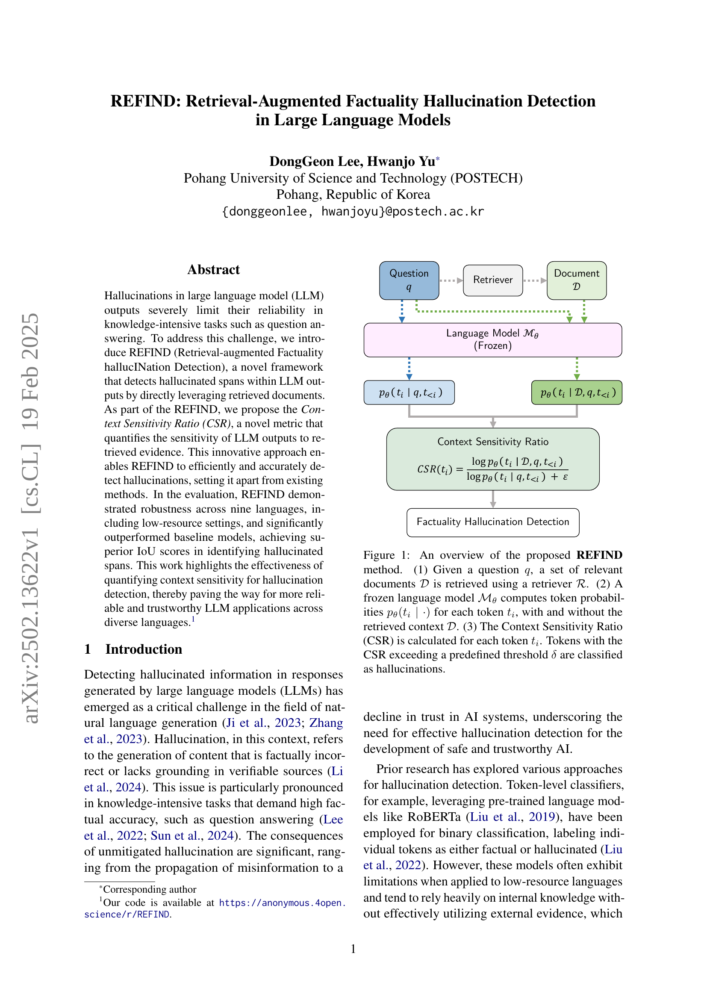
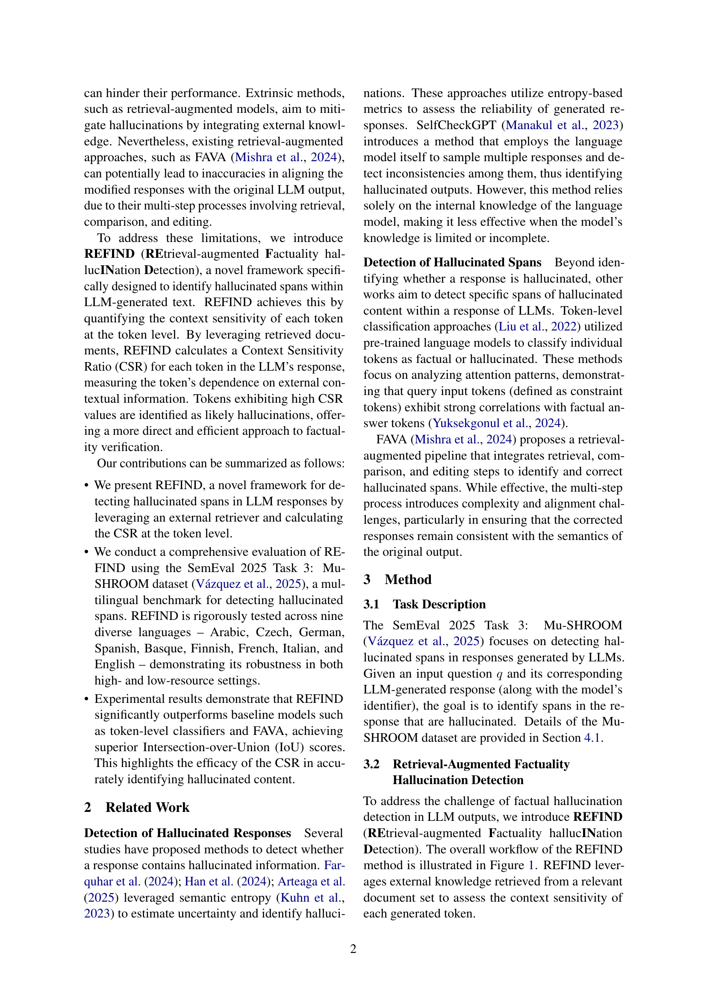
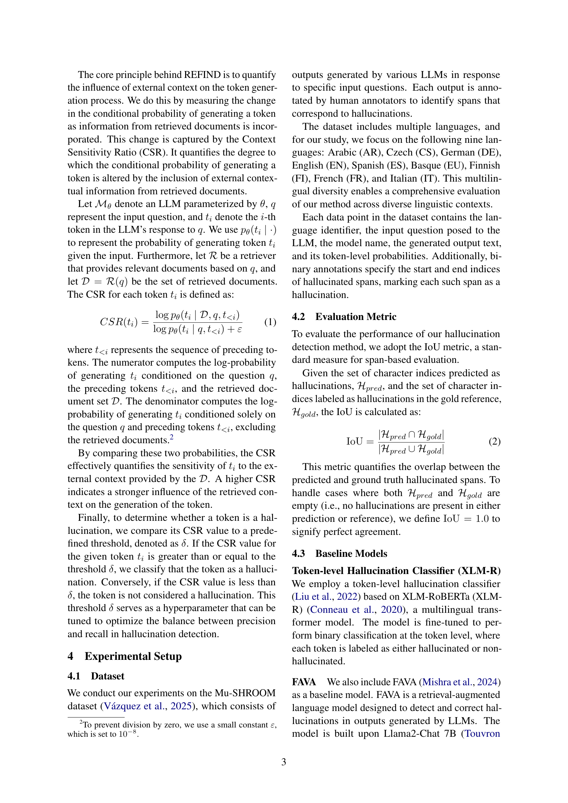
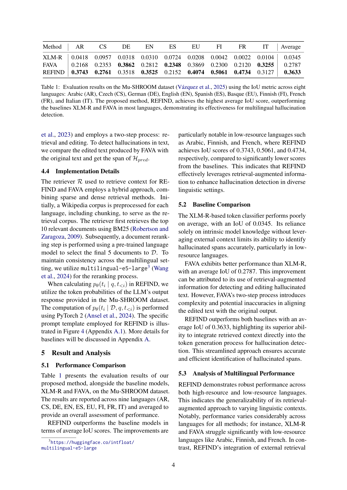
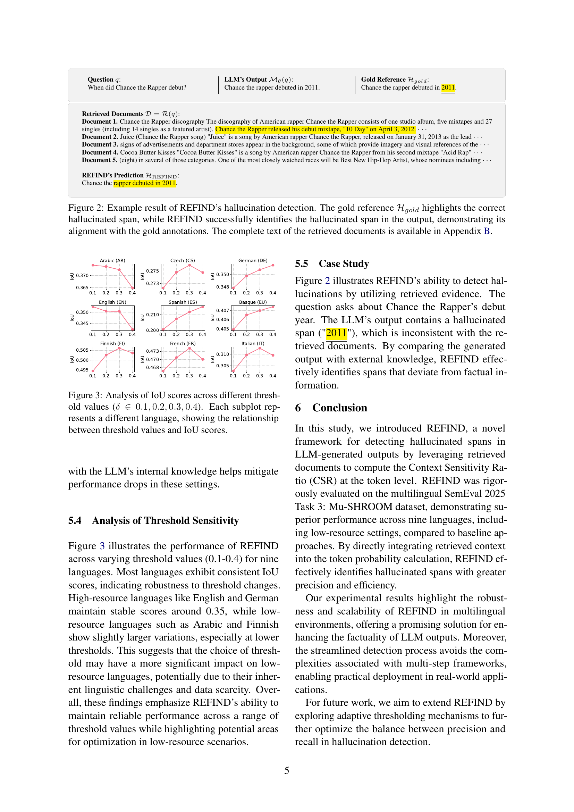
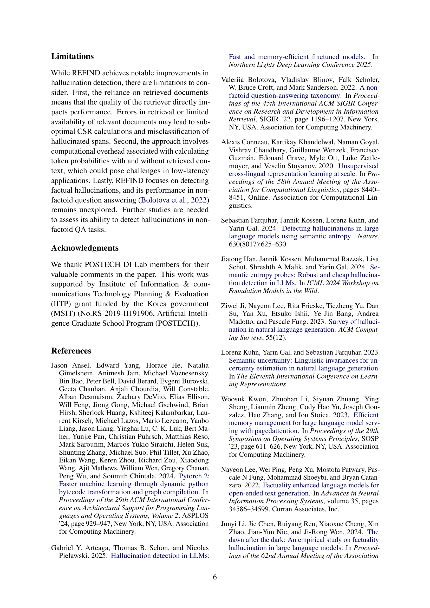
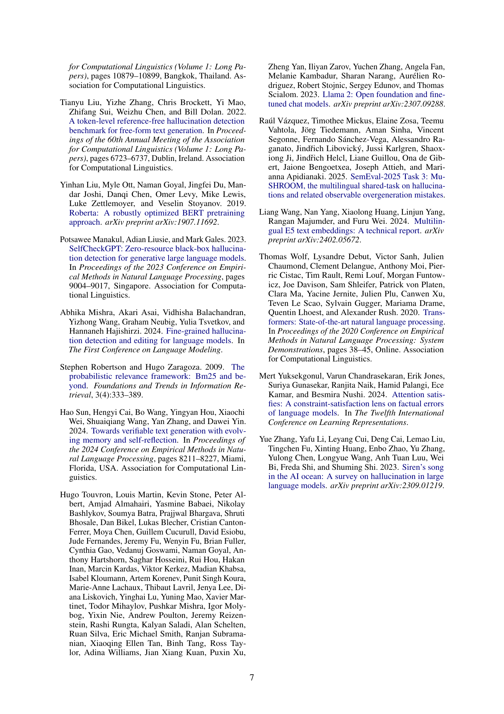
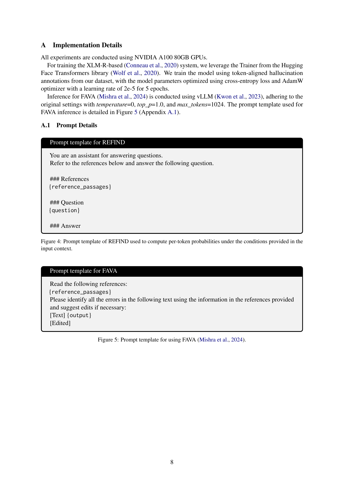
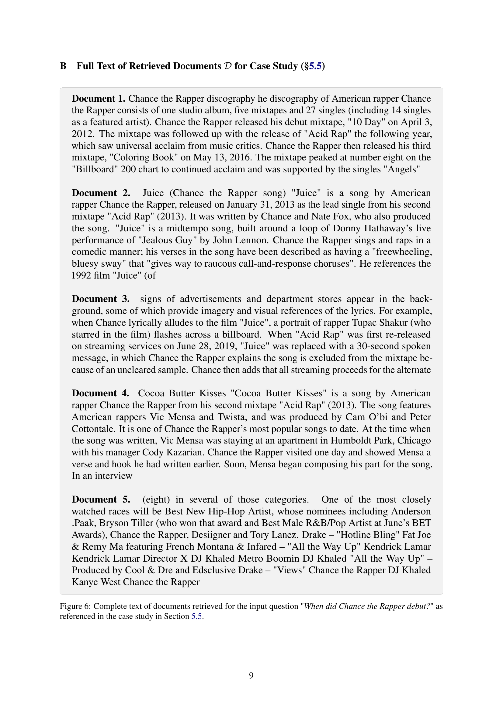

 


 2502.13622 
 DongGeon Lee et el. 
 
 🤗 2025-02-20 
 



↗ arXiv


↗ Hugging Face


↗ Papers with Code


### TL;DR



대규모 언어 모델(LLM)은 질문 응답과 같은 지식 집약적인 작업에서 뛰어난 성능을 보이지만, **사실과 다른 정보를 생성하는 환각(hallucination) 문제**가 있습니다. 이는 LLM의 신뢰성과 안전성에 심각한 제약이 됩니다.  기존의 환각 탐지 방법들은 저자원 언어나 다단계 과정에서 정확도가 떨어지는 문제점이 있습니다.

본 연구에서는 **검색 기반 사실성 환각 탐지(REFIND)**라는 새로운 프레임워크를 제시합니다. REFIND는 검색된 문서를 활용하여 LLM 출력물의 문맥 민감도를 정량화하는 새로운 지표인 **문맥 민감도 비율(CSR)**을 사용합니다.  실험 결과, REFIND는 다양한 언어(저자원 언어 포함)에서 기존 방법보다 우수한 성능을 보였습니다.  이는 **LLM의 신뢰성과 안전성 향상에 크게 기여**할 것으로 기대됩니다.



#### Key Takeaways


 REFIND는 검색된 문서를 직접 활용하여 LLM 출력물에서 환각 구간을 효율적으로 탐지합니다. 



 REFIND는 9개 언어(저자원 언어 포함)에서 우수한 성능을 보이며, 기존 방법보다 환각 구간 식별의 정확도가 높습니다. 



 REFIND는 문맥 민감도 비율(CSR)이라는 새로운 지표를 제시하여, LLM 출력물의 문맥 의존성을 정량화함으로써 환각 탐지의 정확성을 높였습니다. 


#### Why does it matter?
본 논문은 **대규모 언어 모델(LLM)의 환각(hallucination) 문제를 해결하기 위한 새로운 프레임워크인 REFIND**를 제시하여, 다양한 언어에서 환각 구간을 정확하게 탐지하는 방법을 제시합니다.  기존 방법들의 한계를 극복하고, 특히 저자원 언어 환경에서도 뛰어난 성능을 보여줌으로써, **LLM의 신뢰성 및 안전성 향상에 크게 기여**할 것으로 기대됩니다.  향후 연구는 환각 탐지의 정확성 및 효율성을 더욱 높이는 방향으로 진행될 것으로 예상되며, 다양한 응용 분야에서의 활용 가능성을 높일 수 있습니다.

------
#### Visual Insights

> 🔼 제안된 REFIND 방법의 개요를 보여주는 그림입니다. 질문(q)이 주어지면 검색기(ℛ)를 사용하여 관련 문서 집합(𝒟)을 검색합니다. 그런 다음, 고정된 언어 모델(ℳθ)을 사용하여 검색된 컨텍스트(𝒟)가 있고 없는 경우 각 토큰(ti)에 대한 토큰 확률(pθ(ti∣⋅))을 계산합니다. 마지막으로, 각 토큰에 대해 컨텍스트 민감도 비율(CSR)을 계산하고, 미리 정의된 임계값(δ)을 초과하는 토큰은 환각으로 분류합니다.
> 

> 
read the caption

> Figure 1:  An overview of the proposed REFIND method. (1) Given a question q𝑞qitalic_q, a set of relevant documents 𝒟𝒟\mathcal{D}caligraphic_D is retrieved using a retriever ℛℛ\mathcal{R}caligraphic_R. (2) A frozen language model ℳθsubscriptℳ𝜃\mathcal{M}_{\theta}caligraphic_M start_POSTSUBSCRIPT italic_θ end_POSTSUBSCRIPT computes token probabilities pθ⁢(ti∣⋅)subscript𝑝𝜃conditionalsubscript𝑡𝑖⋅p_{\theta}(t_{i}\mid\cdot)italic_p start_POSTSUBSCRIPT italic_θ end_POSTSUBSCRIPT ( italic_t start_POSTSUBSCRIPT italic_i end_POSTSUBSCRIPT ∣ ⋅ ) for each token tisubscript𝑡𝑖t_{i}italic_t start_POSTSUBSCRIPT italic_i end_POSTSUBSCRIPT, with and without the retrieved context 𝒟𝒟\mathcal{D}caligraphic_D. (3) The Context Sensitivity Ratio (CSR) is calculated for each token tisubscript𝑡𝑖t_{i}italic_t start_POSTSUBSCRIPT italic_i end_POSTSUBSCRIPT. Tokens with the CSR exceeding a predefined threshold δ𝛿\deltaitalic_δ are classified as hallucinations.
> 


| Method | AR | CS | DE | EN | ES | EU | FI | FR | IT | Average |
|---|---|---|---|---|---|---|---|---|---|---|
| XLM-R | 0.0418 | 0.0957 | 0.0318 | 0.0310 | 0.0724 | 0.0208 | 0.0042 | 0.0022 | 0.0104 | 0.0345 |
| FAVA | 0.2168 | 0.2353 | **0.3862** | 0.2812 | **0.2348** | 0.3869 | 0.2300 | 0.2120 | **0.3255** | 0.2787 |
| REFIND | **0.3743** | **0.2761** | 0.3518 | **0.3525** | 0.2152 | **0.4074** | **0.5061** | **0.4734** | 0.3127 | **0.3633** |

> 🔼 표 1은 Mu-SHROOM 데이터셋(Vázquez et al., 2025)을 사용하여 8개 언어(아랍어(AR), 체코어(CS), 독일어(DE), 영어(EN), 스페인어(ES), 바스크어(EU), 핀란드어(FI), 프랑스어(FR), 이탈리아어(IT))에 대해 IoU 지표를 사용하여 평가한 결과를 보여줍니다. 제안된 방법인 REFIND는 대부분의 언어에서 기준 모델인 XLM-R과 FAVA를 능가하는 가장 높은 평균 IoU 점수를 달성하여 다국어 환각 검출의 효과성을 입증합니다.
> 

> 
read the caption

> Table 1:  Evaluation results on the Mu-SHROOM dataset Vázquez et al. (2025) using the IoU metric across eight languages: Arabic (AR), Czech (CS), German (DE), English (EN), Spanish (ES), Basque (EU), Finnish (FI), French (FR), and Italian (IT). The proposed method, REFIND, achieves the highest average IoU score, outperforming the baselines XLM-R and FAVA in most languages, demonstrating its effectiveness for multilingual hallucination detection.
> 

### Full paper



