 


 2502.13685 
 Jusen Du et el. 
 
 🤗 2025-02-20 
 



↗ arXiv


↗ Hugging Face


↗ Papers with Code


### TL;DR



기존의 선형 시퀀스 모델들은 메모리 용량이 제한적이고 메모리 간섭 문제로 인해 장기 기억 관련 작업에서 성능이 저하되는 문제점을 가지고 있습니다.  **트랜스포머 모델은 독립적인 키-값 캐시를 유지하여 메모리 간섭 문제를 해결하지만, 계산 복잡도가 높다는 단점**이 있습니다.  이러한 문제를 해결하기 위해 본 연구에서는 뇌의 메모리 작동 방식에서 영감을 얻은 새로운 아키텍처인 MoM을 제시합니다.

MoM은 **여러 개의 독립적인 메모리 상태**를 사용하고, 라우터 네트워크를 통해 입력 토큰을 적절한 메모리 상태에 할당합니다.  이를 통해 메모리 용량을 늘리고 메모리 간섭을 줄여 장기 기억 관련 작업에서 우수한 성능을 발휘합니다.  **선형 시간 복잡도의 학습 및 상수 시간 복잡도의 추론**이라는 선형 시퀀스 모델의 장점을 유지하면서 트랜스포머 모델과 비슷한 성능을 달성하는 것이 MoM의 주요 기여입니다.  다양한 언어 작업에서 기존의 선형 시퀀스 모델들을 능가하는 성능을 보였으며, 특히 장기 기억이 중요한 작업에서 그 효과가 더욱 두드러졌습니다.



#### Key Takeaways


 MoM은 다중 독립 메모리 상태와 라우터 네트워크를 활용하여 메모리 용량을 획기적으로 증대시키고 메모리 간섭을 최소화합니다. 



 MoM은 선형 시간 복잡도의 학습과 상수 시간 복잡도의 추론을 유지하면서 기존 선형 시퀀스 모델보다 우수한 성능을 보입니다. 



 MoM은 특히 장기 기억과 상호 간섭 완화가 중요한 하류 작업에서 뛰어난 성능을 보이며, 트랜스포머 모델과 유사한 성능을 달성합니다. 


#### Why does it matter?
본 논문은 **선형 시퀀스 모델링의 메모리 용량 및 간섭 문제**를 해결하기 위해 **MoM(Mixture-of-Memories)**이라는 새로운 아키텍처를 제시하여 기존 모델의 성능을 뛰어넘는 결과를 제시했습니다. **장기 기억 및 상호 간섭 완화**에 대한 새로운 접근 방식을 제시함으로써 자연어 처리 분야의 발전에 크게 기여할 것으로 예상됩니다. 특히, **선형 복잡도를 유지하면서 트랜스포머 수준의 성능**을 달성한 것은 향후 연구에 중요한 시사점을 제공합니다.  이는 **대규모 언어 모델의 효율성 및 확장성** 문제 해결에 대한 새로운 방향을 제시하며,  메모리 제약 조건이 있는 환경에서도 우수한 성능을 발휘하는 모델 개발에 중요한 의미를 가집니다.

------
#### Visual Insights

> 🔼  그림 1은 MoM(Mixture-of-Memories)의 구조를 보여줍니다. 각 입력 토큰은 라우터 네트워크를 통해 K개의 독립적인 메모리 상태 중 일부를 선택적으로 활성화시킵니다. 활성화된 메모리 상태는 입력 토큰으로 업데이트되지만, 비활성화된 메모리 상태는 이전 상태를 유지하여 현재 입력으로 인한 간섭을 방지합니다. 또한, 지속적으로 활성화되는 공유 메모리가 도입되어 장기적인 의존성을 포착합니다. 그림에서는 기본적인 메모리 업데이트 메커니즘만을 보여주지만, 게이팅 또는 더 복잡한 업데이트 메커니즘을 포함하는 다른 메커니즘도 유사한 방식으로 동작합니다.
> 

> 
read the caption

> Figure 1: Framework of MoM. Each input token selectively activates and updates K𝐾Kitalic_K memory states, leaving non-activated memory states unchanged to avoid interference from current input. Additionally, we introduce a continuously activated shared memory. This figure presents the basic memory update mechanism; other mechanisms involving gating or more complex updates follow a similar approach.
> 


Method|Memory Update Rule
---|---|---
LA|\bm{M}_{t}=\bm{M}_{t-1}+\bm{k}_{t}^{T}\bm{v}_{t}
Lightning|\bm{M}_{t}=\gamma\bm{M}_{t-1}+\bm{k}_{t}^{T}\bm{v}_{t}
RetNet|\bm{M}_{t}=\gamma\bm{M}_{t-1}+\bm{k}_{t}^{T}\bm{v}_{t}
HGRN2|\bm{M}_{t}=(\bm{a}_{t}^{T}\bm{1})\bm{M}_{t-1}+(1-\bm{a}_{t})^{T}\bm{v}_{t}
GLA|\bm{M}_{t}=(\bm{a}_{t}^{T}\bm{1})\bm{M}_{t-1}+\bm{k}_{t}^{T}\bm{v}_{t}
Mamba2|\bm{M}_{t}=\alpha_{t}\bm{M}_{t-1}+\beta_{t}\bm{k}_{t}^{T}\bm{v}_{t}
DeltaNet|\bm{M}_{t}=(\bm{I}-\bm{k}_{t}^{T}\bm{k}_{t})\bm{M}_{t-1}+\beta_{t}\bm{k}_{t}^{T}\bm{v}_{t}
G-DeltaNet|\bm{M}_{t}=\alpha_{t}(\bm{I}-\bm{k}_{t}^{T}\bm{k}_{t})\bm{M}_{t-1}+\beta_{t}\bm{k}_{t}^{T}\bm{v}_{t}
TTT|\bm{M}_{t}=\bm{M}_{t-1}+\beta_{t}\nabla l(\bm{M}_{t-1};\bm{k}_{t},\bm{v}_{t})
Titan|\bm{M}_{t}=\alpha_{t}\bm{M}_{t-1}+\beta_{t}\nabla l(\bm{M}_{t-1};\bm{k}_{t},\bm{v}_{t})

> 🔼 표 1은 다양한 선형 순차 모델의 메모리 업데이트 규칙을 보여줍니다.  선형 순차 모델을 순환 신경망(RNN)으로 해석할 수 있다는 것을 보여주는 표입니다.  각 모델의 메모리 업데이트 과정을 수식으로 제시하고 있으며, αt 와 βt는 데이터에 따라 변하는 스칼라 값이고, at는 데이터에 따라 변하는 벡터 값이며, γ는 데이터와 무관한 상수임을 설명합니다.  이 표는 MoM 모델의 메모리 업데이트 메커니즘을 이해하는 데 도움을 주며, MoM 모델이 기존 선형 순차 모델과 어떻게 관련되는지 보여줍니다.
> 

> 
read the caption

> Table 1: Memory Update Rules. We demonstrate that several current linear sequence models can be viewed as recurrent models in terms of memory updates, where αt,βt∈(0,1)subscript𝛼𝑡subscript𝛽𝑡01\alpha_{t},\beta_{t}\in(0,1)italic_α start_POSTSUBSCRIPT italic_t end_POSTSUBSCRIPT , italic_β start_POSTSUBSCRIPT italic_t end_POSTSUBSCRIPT ∈ ( 0 , 1 ) are data-dependent scaler, 𝒂tsubscript𝒂𝑡\bm{a}_{t}bold_italic_a start_POSTSUBSCRIPT italic_t end_POSTSUBSCRIPT is data-dependent vector, and γ𝛾\gammaitalic_γ is a data-independent constant.
> 

### In-depth insights

#### MoM's Bio-Inspiration
MoM(Mixture-of-Memories)은 인간 뇌의 기억 메커니즘에서 영감을 얻은 모델입니다. **특히 해마의 세타-감마 진동을 통한 다중 항목 기억 유지 및 기억 간섭 최소화 전략**이 핵심입니다.  뇌는 서로 다른 기억들을 시간적으로 분리하여 저장함으로써 기억 간섭을 방지하는데, MoM은 이를 **여러 개의 독립적인 메모리 상태(multiple independent memory states)**를 사용하여 모방합니다. 각 메모리 상태는 특정 입력 토큰에 할당되며, 이는 **기억 용량 증가 및 간섭 감소**로 이어집니다.  이러한 생물학적 영감은 단순한 모방을 넘어, **모델의 구조적 설계 및 동작 방식**에 직접적으로 반영되어 있습니다.  즉, MoM의 다중 메모리 상태 및 라우팅 메커니즘은 뇌의 기억 처리 방식을 효율적으로 구현하려는 시도이며, **단순한 효율 증대를 넘어 기억의 질적 향상**을 목표로 합니다.  이는 기존 선형 시퀀스 모델의 한계를 극복하고, 장기 기억 및 복잡한 추론 과제에서 성능 향상을 도모하는 중요한 전략입니다.

#### Linear Memory Mgmt
선형 메모리 관리(Linear Memory Mgmt)는 **메모리 사용량을 선형적으로 제한**하여 메모리 효율을 높이는 기법입니다.  이는 특히 대규모 언어 모델(LLM)과 같이 방대한 양의 데이터를 처리하는 시스템에서 중요합니다.  **기존의 비선형 메모리 관리 방식**은 메모리 사용량이 데이터 크기에 따라 기하급수적으로 증가하는 문제를 가지고 있습니다.  반면 선형 메모리 관리는 메모리 사용량을 데이터 크기에 비례하여 증가시키기 때문에 메모리 과부하를 방지할 수 있습니다.  이러한 접근 방식은 **모델의 크기 제한을 완화**하고, **메모리 제약이 있는 환경에서도 성능을 유지**하는 데 도움이 됩니다.  하지만 선형 메모리 관리는 **메모리 접근 속도 저하**라는 단점을 가질 수 있습니다.  또한 **복잡한 메모리 관리 알고리즘**이 필요할 수 있기 때문에 구현의 어려움이 따를 수 있습니다. 따라서 선형 메모리 관리 기법의 효율성은 특정 응용 프로그램과 시스템 환경에 따라 달라집니다.  **최적의 성능을 위해서는 메모리 접근 패턴과 데이터 크기를 고려한 알고리즘 설계**가 필수적입니다.

#### MoM's Router Network
MoM의 라우터 네트워크는 입력 토큰들을 여러 개의 독립적인 메모리 상태 중 하나로 **동적으로 라우팅**하는 역할을 합니다. 이는 단순히 모든 토큰을 단일 메모리에 집중시키는 기존의 선형 시퀀스 모델링 방식과는 대조적입니다. **소프트맥스 함수**를 사용하여 각 토큰의 중요도 점수를 계산하고, 상위 k개의 메모리 상태를 선택하여 해당 토큰을 전달합니다. 이 과정에서 **중요도 점수가 높은 토큰일수록 더 많은 메모리 상태에 접근**할 수 있도록 설계되어, 중요한 정보의 손실을 최소화합니다. 또한, **메모리 간섭을 최소화**하기 위해 활성화되지 않은 메모리 상태는 그대로 유지됩니다. 이러한 라우팅 메커니즘은 다양한 유형의 입력을 여러 메모리 상태에 효율적으로 분산시켜 메모리 용량을 증가시키고 장기 기억 성능을 향상시키는 핵심 요소입니다.  **다양한 메모리 업데이트 메커니즘**과의 호환성 또한 고려되어, 유연성과 확장성을 확보했습니다.  결과적으로 MoM은 효율성을 유지하면서 **장기 기억 성능을 획기적으로 향상**시키는 뛰어난 성능을 보여줍니다.

#### Recall Intensive Tasks
본 논문에서 "Recall Intensive Tasks"는 **장기 기억 및 정보 회상 능력**이 중요한 과제들을 의미합니다.  이는 단순히 정보를 처리하는 것을 넘어, 과거에 학습한 정보를 정확하게 기억하고 활용해야만 성공적으로 수행할 수 있는 작업들을 가리킵니다.  **Transformer 모델이 이러한 과제에서 강점을 보이는 이유는 각 토큰에 대한 독립적인 key-value 캐시를 유지하여 메모리 간섭을 최소화하고, 사실상 무제한의 메모리 용량을 제공하기 때문입니다.** 반면, 선형 시퀀스 모델링 기법들은 고정된 크기의 메모리 상태에 모든 입력 시퀀스를 압축하여 메모리 용량이 제한적이고 메모리 간섭이 발생하기 쉽습니다.  **MoM(Mixture-of-Memories) 모델은 인간 뇌의 메모리 작용 원리를 모방하여, 여러 개의 독립적인 메모리 상태를 사용하여 메모리 용량을 확장하고 메모리 간섭을 줄이는 방법을 제시합니다.** 이를 통해 선형 시퀀스 모델의 효율성을 유지하면서도, **메모리 집약적 과제에서 Transformer 모델에 필적하는 성능을 달성**할 수 있음을 실험적으로 증명하고 있습니다.  따라서, 본 논문의 "Recall Intensive Tasks" 부분은 메모리 간섭 문제 해결과 메모리 용량 확장의 중요성을 강조하고, MoM 모델의 핵심적인 강점을 보여주는 부분이라고 할 수 있습니다.

#### Future Enhancements
미래 향상에 대한 심도있는 고찰을 위해서는 **MoM(Mixture-of-Memories)** 모델의 제한점과 한계를 먼저 파악해야 합니다.  현재 MoM은 다수의 독립적인 메모리 상태를 사용하여 메모리 간섭을 완화하고 메모리 용량을 확장하지만, **메모리 상태 간의 최적의 상호작용 및 정보 교환 방식**에 대한 추가 연구가 필요합니다.  **루터 네트워크의 효율성 개선** 또한 중요한 과제입니다.  입력 토큰을 메모리 상태에 효율적으로 라우팅하는 알고리즘 개선을 통해 연산 비용을 줄이고 정확도를 높일 수 있습니다.  더 나아가 **다양한 메모리 업데이트 메커니즘**에 대한 연구를 통해 MoM의 성능을 더욱 향상시킬 수 있습니다.  **생물학적 메모리 시스템의 추가적인 영감**을 얻어 새로운 메모리 관리 전략을 도입하는 것도 고려할 수 있습니다.  예를 들어, 뇌의 메모리 통합 및 재구성 과정을 모방하여 MoM의 메모리 효율성을 높이는 방안을 모색할 수 있습니다.  또한, **다양한 하드웨어 플랫폼**에서 MoM의 효율적인 구현을 위한 연구도 필수적입니다.  **병렬 처리 및 분산 처리** 기술을 활용하여 MoM의 처리 속도를 향상시키고 메모리 소모량을 줄일 수 있습니다. 마지막으로, **대규모 언어 모델(LLM)과의 통합**을 통해 MoM의 활용 범위를 확장하고 실제 응용 분야에서의 성능을 평가할 수 있습니다.

### More visual insights

More on figures

> 🔼 그림 2는 MoM의 효율성을 보여줍니다. 특정 시퀀스 길이에서 1,000개의 토큰을 생성하는 데 필요한 추론 시간과 GPU 메모리 소비량을 보여주는 그래프입니다. MoM은 시퀀스 길이가 길어짐에 따라 다른 모델들보다 훨씬 적은 메모리를 사용하고, 추론 속도 또한 빠릅니다. 이는 MoM이 장문의 시퀀스를 처리하는 데 효율적임을 시사합니다.
> 

> 
read the caption

> Figure 2: Efficiency of MoM. We demonstrate the inference time and GPU memory consumption required to generate 1K tokens at specific sequence lengths.
> 

> 🔼 그림 3은 3억 4천만개의 파라미터를 가진 모델을 150억개의 토큰으로 학습시킨 결과의 손실 곡선을 보여줍니다.  무작위 시드 42를 사용하여 재현성을 확보했습니다.  그래프는 학습 과정 전반에 걸쳐 MoM 모델의 손실이 다른 기준 모델들보다 꾸준히 낮게 유지됨을 보여줍니다.  이는 MoM 모델이 더 효율적으로 학습하고 수렴한다는 것을 시사합니다.  특히 학습 후반부에서도 MoM 모델의 우수성이 두드러지게 나타납니다.
> 

> 
read the caption

> Figure 3: Training Loss. Loss curves for training 340M models on 15B tokens with a fixed random seed of 42.
> 

More on tables


| Scale | Model | FDA | SWDE | SQUAD | NQ | TriviaQA | Drop | Avg. |
|---|---|---|---|---|---|---|---|---|
| 340M Params 15B Tokens L=24, d=1024 | Transformer++ | 46.14 | 25.87 | 33.22 | 18.94 | 45.97 | 20.03 | 31.70 |
|  | RetNet | 5.90 | 9.28 | 22.41 | 6.91 | 40.05 | 18.59 | 17.19 |
|  | HGRN2 | 11.53 | 17.34 | 24.08 | 12.67 | 43.84 | 17.35 | 21.14 |
|  | GLA | 11.26 | 16.78 | 27.85 | 12.77 | 43.90 | 17.68 | 21.71 |
|  | GSA | 6.36 | 16.87 | 21.90 | 14.60 | 42.18 | 16.72 | 19.77 |
|  | Gated DeltaNet | 20.53 | 23.24 | 28.55 | 14.98 | 44.91 | 16.48 | 24.78 |
|  | MoM | 30.79 | 26.05 | 29.63 | 13.84 | 44.79 | 20.41 | 27.59 |
| 1.3B Params 100B Tokens L=24, d=2048 | Transformer++† | 44.32 | 32.43 | 42.59 | 24.49 | 58.47 | 21.56 | 37.31 |
|  | RetNet† | 13.62 | 22.59 | 33.46 | 15.43 | 53.79 | 19.79 | 26.45 |
|  | HGRN2† | 12.35 | 23.24 | 33.19 | 19.10 | 55.27 | 19.65 | 27.13 |
|  | GLA† | 27.61 | 30.93 | 35.04 | 22.27 | 56.28 | 19.45 | 31.93 |
|  | GSA† | 23.25 | 32.80 | 35.57 | 22.96 | 57.05 | 20.65 | 32.05 |
|  | Gated DeltaNet | 30.25 | 27.65 | 34.06 | 23.22 | 58.23 | 20.36 | 32.30 |
|  | MoM | 41.14 | 34.30 | 37.08 | 24.11 | 58.59 | 21.03 | 36.04 |
> 🔼 표 2는 기억 집약적 작업에 대한 결과를 보여줍니다. 모든 입력은 최대 2,000 토큰 길이로 잘립니다. MoM은 두 가지 모델 크기 모두에서 다른 모든 선형 모델을 크게 능가합니다. 13억 매개변수 모델에서 MoM은 Transformer 모델과 거의 동등한 성능을 달성합니다.
> 

> 
read the caption

> Table 2: Results on Recall-Intensive Tasks. All inputs are truncated to a maximum length of 2K tokens. MoM significantly outperforms all other linear models across both model sizes. In the 1.3B model, MoM even achieves performance very close to that of Transformer models.
> 


| Scale | Model | Wiki. ppl↓ | Lamb. ppl↓ | ARC-e acc↑ | ARC-c accn↑ | Hella. accn↑ | Lamb. acc↑ | PIQA acc↑ | Wino. acc↑ | Avg. | 
|---|---|---|---|---|---|---|---|---|---|---|
| 340M Params   15B Tokens   L=24, d=1024 | Transformer++ | 26.88 | 76.46 | 44.91 | 25.94 | 34.95 | 26.90 | 64.31 | 51.07 | 41.35 |
|  | RetNet | 31.07 | 87.11 | 44.49 | 23.04 | 33.86 | 23.93 | 63.49 | 52.33 | 40.19 |
|  | HGRN2 | 27.90 | 77.40 | 45.24 | 23.63 | 35.61 | 24.74 | 65.45 | 54.06 | 41.46 |
|  | GLA | 28.78 | 79.95 | 44.53 | 22.27 | 34.84 | 24.94 | 63.93 | 51.38 | 40.32 |
|  | GSA | 28.17 | 82.50 | 45.50 | 24.23 | 35.00 | 24.02 | 64.85 | 50.43 | 40.67 |
|  | Gated DeltaNet | 26.47 | 58.59 | 46.04 | 23.55 | 35.18 | 27.01 | 66.05 | 50.83 | 41.44 |
|  | MoM | 26.00 | 51.25 | 46.13 | 24.15 | 35.91 | 28.26 | 65.61 | 52.57 | 42.11 |
| 1.3B Params   100B Tokens   L=24, d=2048 | Transformer++† | 17.61 | 19.29 | 55.01 | 28.07 | 49.21 | 40.95 | 70.08 | 56.27 | 49.93 |
|  | RetNet† | 18.18 | 21.97 | 57.49 | 26.88 | 48.09 | 37.75 | 69.37 | 53.28 | 48.81 |
|  | HGRN2† | 17.32 | 15.65 | 58.33 | 28.07 | 51.93 | 42.31 | 71.33 | 52.01 | 50.66 |
|  | GLA† | 17.61 | 19.66 | 55.18 | 27.56 | 48.89 | 40.03 | 69.86 | 53.91 | 49.24 |
|  | GSA† | 16.69 | 16.02 | 58.33 | 28.33 | 50.98 | 42.03 | 72.25 | 53.43 | 50.89 |
|  | Gated DeltaNet† | 17.14 | 18.80 | 56.82 | 27.39 | 49.77 | 39.94 | 71.76 | 51.78 | 49.58 |
|  | MoM† | 16.64 | 14.83 | 55.35 | 27.99 | 50.95 | 43.43 | 71.27 | 56.83 | 50.97 |
> 🔼 표 3은 다양한 크기의 언어 모델에서 일반적인 상식 추론 작업에 대한 결과를 보여줍니다. 선형 모델과 트랜스포머 모델의 성능은 비슷하지만, MoM은 모든 모델 크기에서 일관되게 최고의 평균 성능을 달성합니다.  이 표는 다양한 상식 추론 데이터셋(WikiText, LAMBADA, ARC-e, ARC-c, HellaSwag, PiQA, Winograd Schema Challenge)에서 MoM, Transformer 모델, 기타 선형 모델들의 성능을 비교하여, MoM이 상식 추론 능력에서 우수함을 보여줍니다. 특히, perplexity(낮을수록 좋음)와 정확도(높을수록 좋음) 측면에서 MoM의 우수성을 확인할 수 있습니다.
> 

> 
read the caption

> Table 3: Results on Common-Sense Reasoning Tasks. The performance of linear models and Transformer models is comparable; however, MoM consistently achieves the best average performance across all model sizes.
> 


| Wiki. | ppl↓ |
> 🔼 표 4는 LongBench 벤치마크 결과를 보여줍니다. LongBench는 다양한 종류의 장문 텍스트 이해 작업을 평가하는 벤치마크이며, 요약, 퓨샷 학습, 합성 작업, 코드 완성 등 여러 가지 작업이 포함됩니다. 이 표는 각 작업에 대한 MoM(Mixture-of-Memories) 모델과 기타 여러 선형 모델들의 성능을 비교 분석하여 MoM 모델의 효율성을 보여줍니다.  Sum은 요약, FS는 퓨샷 학습, Syn은 합성 작업을 의미합니다. 모든 평가는 Contributors (2023)를 사용하여 수행되었습니다.
> 

> 
read the caption

> Table 4: LongBench Results. All evaluations were done using Contributors (2023). Note: Sum = Summarization, FS = Few-shot, Syn = Synthetic.
> 


| Lamb. | ppl↓ |
|---|---|
> 🔼 표 5는 혼합 메모리와 단일 메모리의 성능 비교를 보여줍니다.  MoM 모델은 다양한 메모리 업데이트 메커니즘을 사용하여 구성되었으며, 결과적으로 단일 메모리의 용량을 단순히 늘리는 것보다 분리된 메모리 세그먼트를 사용하는 것이 더 나은 성능을 보였음을 보여줍니다.  즉, 여러 개의 독립적인 메모리를 사용하는 것이 단일 메모리의 크기를 늘리는 것보다 메모리 간섭을 줄이고 장기 기억 성능을 향상시키는 데 더 효과적임을 의미합니다.
> 

> 
read the caption

> Table 5: Comparison Between Mixed Memory and Single Memory. We constructed MoM models using different memory update mechanisms. Separate memory segments yielded better performance compared to simply increasing the memory capacity of a single memory.
> 


| Model       | Metric   |
|--------------|-----------|
| **ARC-e**   | acc↑      |
> 🔼 표 6은 본 논문에서 제안하는 MoM 모델의 성능에 대한 ablation study 결과를 보여줍니다.  다양한 수의 메모리와 공유 메모리 사용 여부를 변화시켜가며 recall-intensive 작업에 대한 평균 성능을 측정했습니다.  구체적으로 메모리 수와 활성화된 메모리 수를 변경하여 모델 성능에 미치는 영향을 분석하고 공유 메모리의 효과를 확인했습니다. 이를 통해 MoM 모델의 주요 구성 요소들이 성능에 어떻게 기여하는지에 대한 통찰력을 제공합니다.
> 

> 
read the caption

> Table 6: Ablation Study. We performed ablation studies on the number of memories and the use of shared memory. The table presents the average results across all recall-intensive tasks.
> 


| Model | Accuracy |
|---|---| 
| ARC-c | accn ↑ |
> 🔼 표 7은 LongBench 벤치마크에 대한 다양한 모델의 성능을 보여줍니다. LongBench는 요약, 몇 샷 학습, 합성 작업 및 코드 완성을 포함한 여러 언어 이해 작업을 평가하는 벤치마크입니다. 이 표는 SQA(단일 문서 질의응답), MQA(다중 문서 질의응답), 요약, 몇 샷 학습 및 합성 작업에 대한 각 모델의 성능을 보여줍니다. 또한 중국어 및 영어에 대한 평균 점수도 제공합니다. 이 표는 다양한 언어 작업에서 MoM 모델의 강력한 성능을 보여주는 데 도움이 됩니다.
> 

> 
read the caption

> Table 7: Complete Results of LongBench. (SQA: Single-doc QA, MQA: Multi-doc QA, Sum: Summarization, FS: Few-shot learning, Syn: Synthetic)
> 


| Hella. |
| accn ↑ |
> 🔼 표 8은 논문의 실험 결과 부분에서 다양한 매개변수를 변경하며 수행한 반복 실험 결과를 보여줍니다. 특히 기억 용량 및 간섭 문제에 초점을 맞춘 여러 가지 기억 메커니즘에 대한 비교 분석 결과를 제시합니다.  표에는 다양한 매개변수 조합(기억의 개수, 활성화된 기억의 개수, 공유 메모리 사용 여부 등)에 따른 재현율 집약적 작업(recall-intensive tasks)의 성능 지표(정확도)가 수치로 나타나 있습니다. 이를 통해 MoM 모델의 성능에 영향을 미치는 요소들을 분석하고, 최적의 설정을 찾는 데 도움이 되는 정보를 제공합니다.
> 

> 
read the caption

> Table 8: Complete Ablation Study Results. The complete results of the ablation studies on recall-intensive tasks.
> 


| Lamb. | acc ↑ |

> 🔼 표 9는 논문의 실험 결과 중 재현율 집약적 과제에 대한 추가 분석 결과를 보여줍니다. 여러 가지 하이퍼파라미터(메모리 수, 활성화된 메모리 수, 공유 메모리 사용 여부)를 변경하면서 성능 변화를 측정하여 MoM 모델의 성능에 미치는 영향을 분석했습니다.  표에는 각 하이퍼파라미터 조합에 따른 다양한 재현율 집약적 과제(FDA, SWDE, SQUAD, NQ, TriviaQA, Drop)의 성능 지표가 자세히 제시되어 있습니다.
> 

> 
read the caption

> Table 9: Complete Ablation Study Results. The complete results of the ablation studies on recall-intensive tasks.
> 

### Full paper


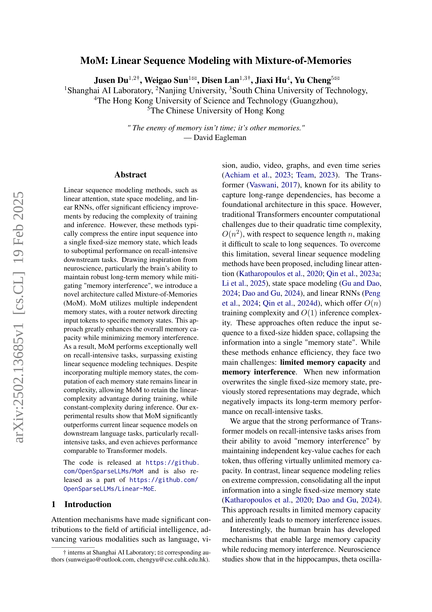
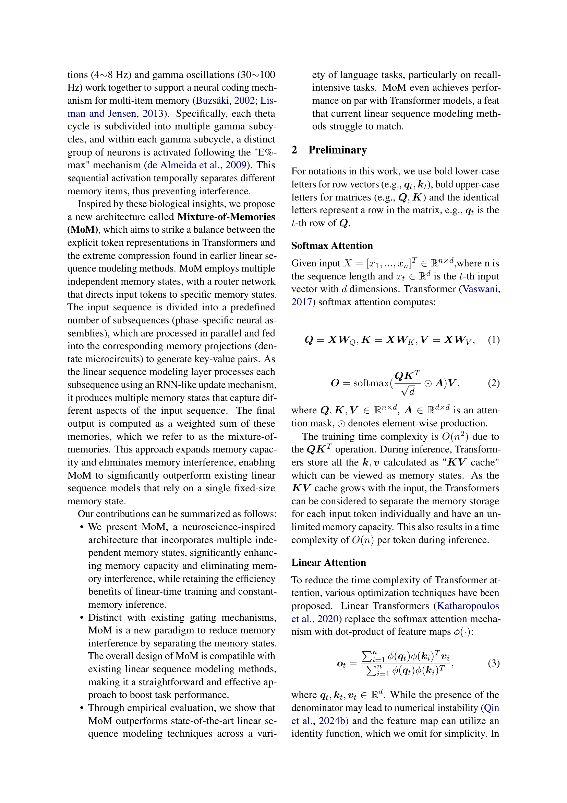
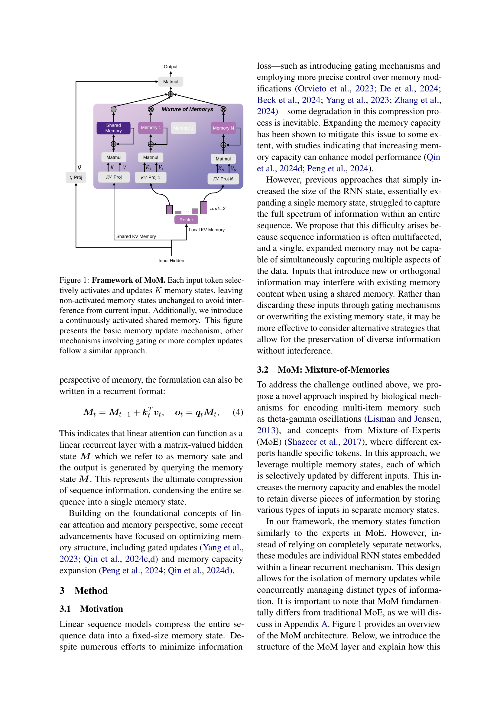
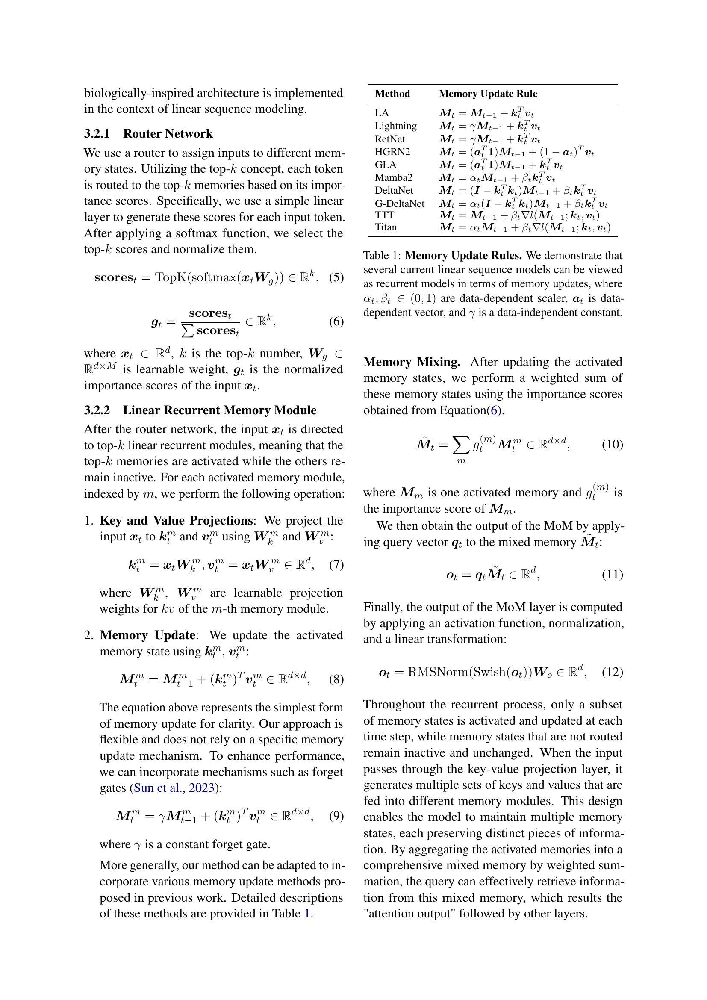
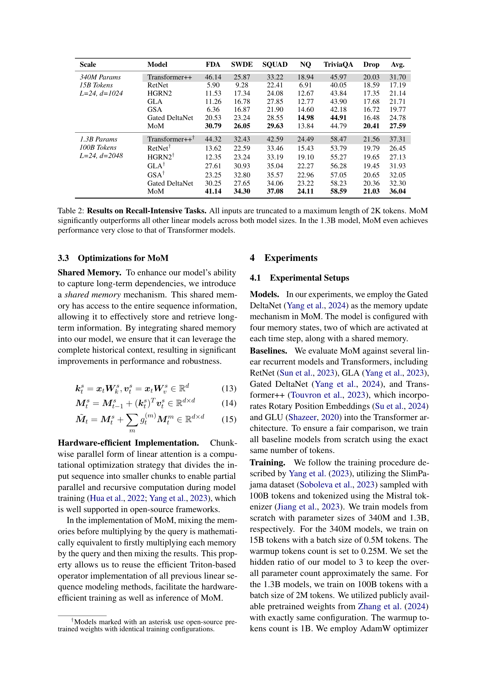
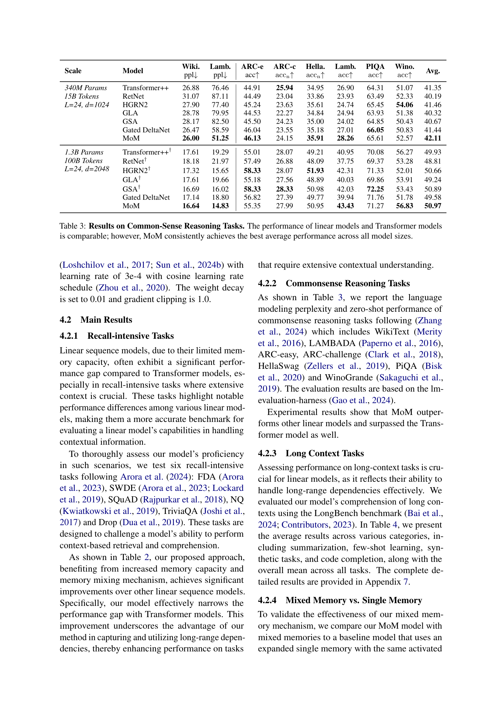
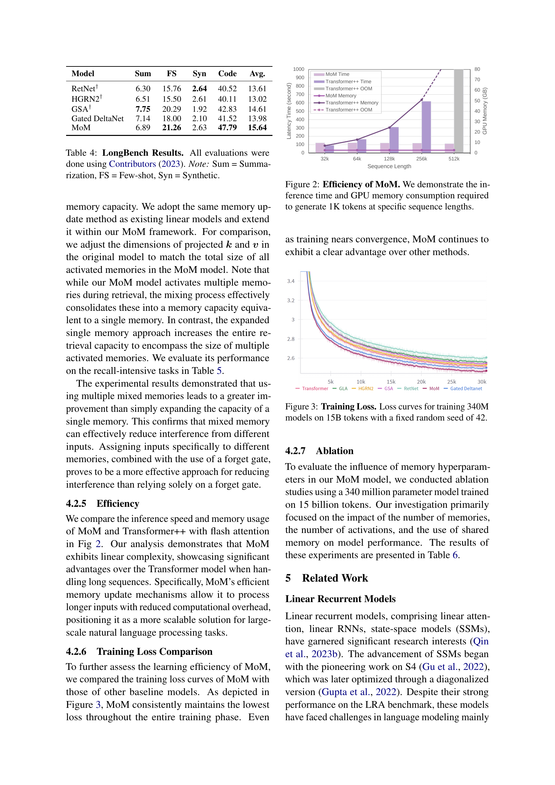
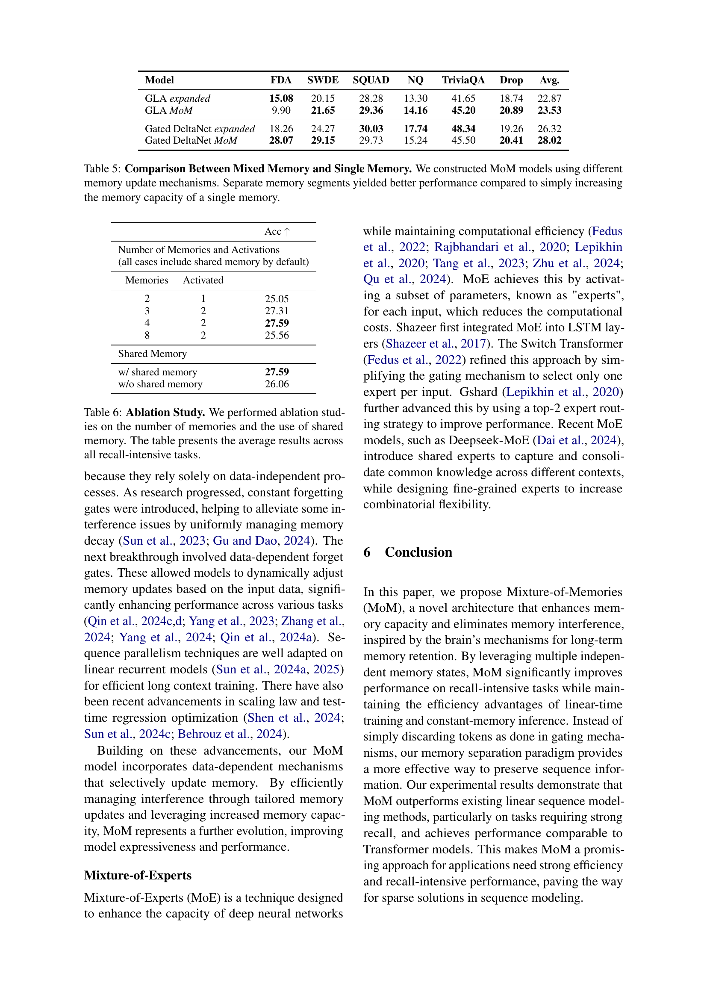
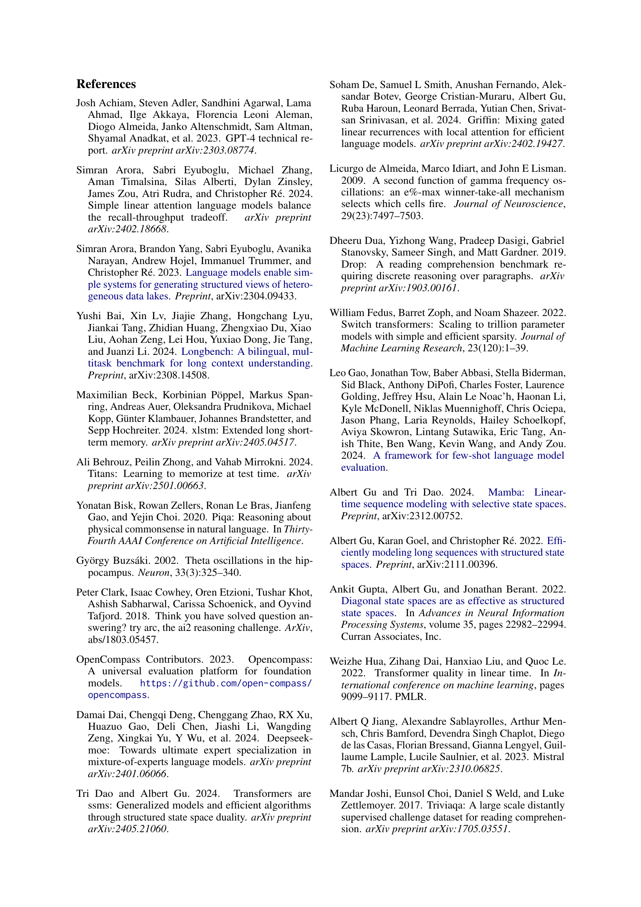
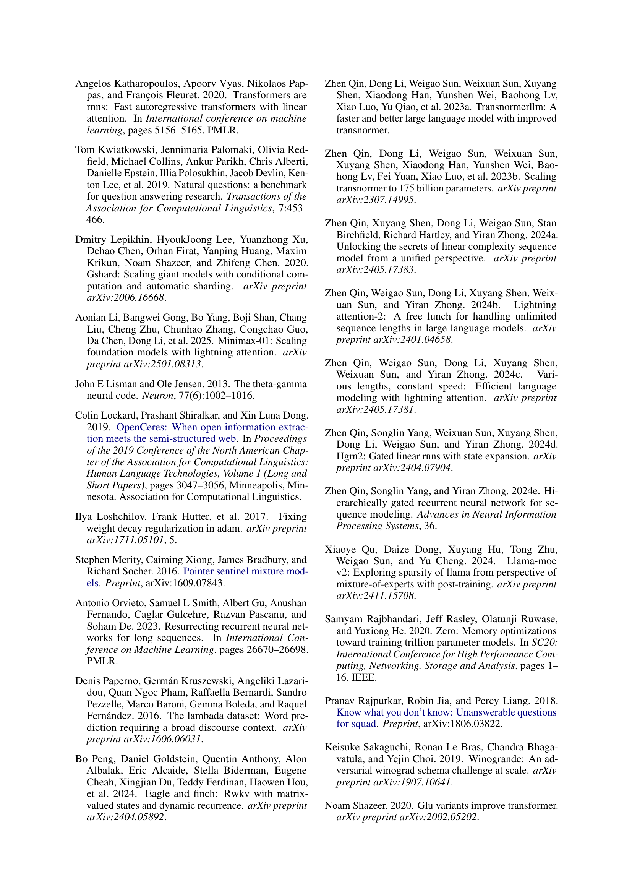
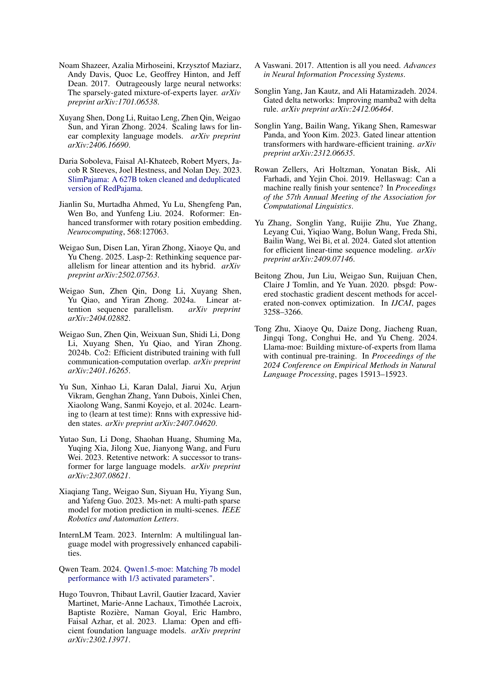
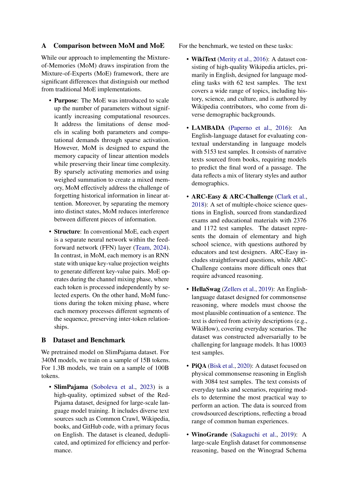
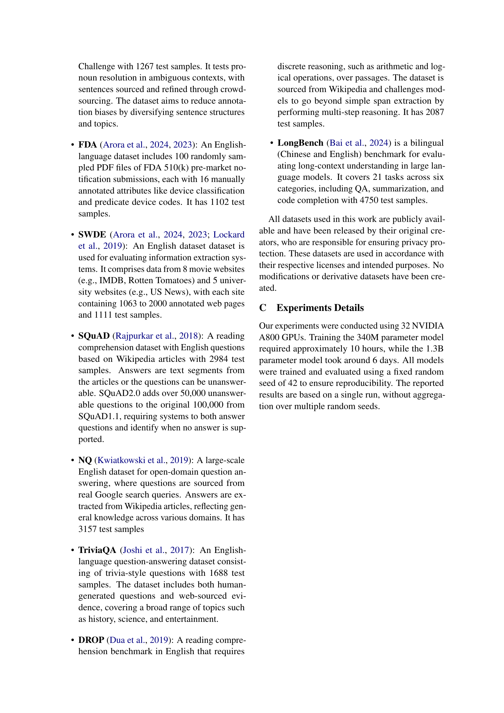
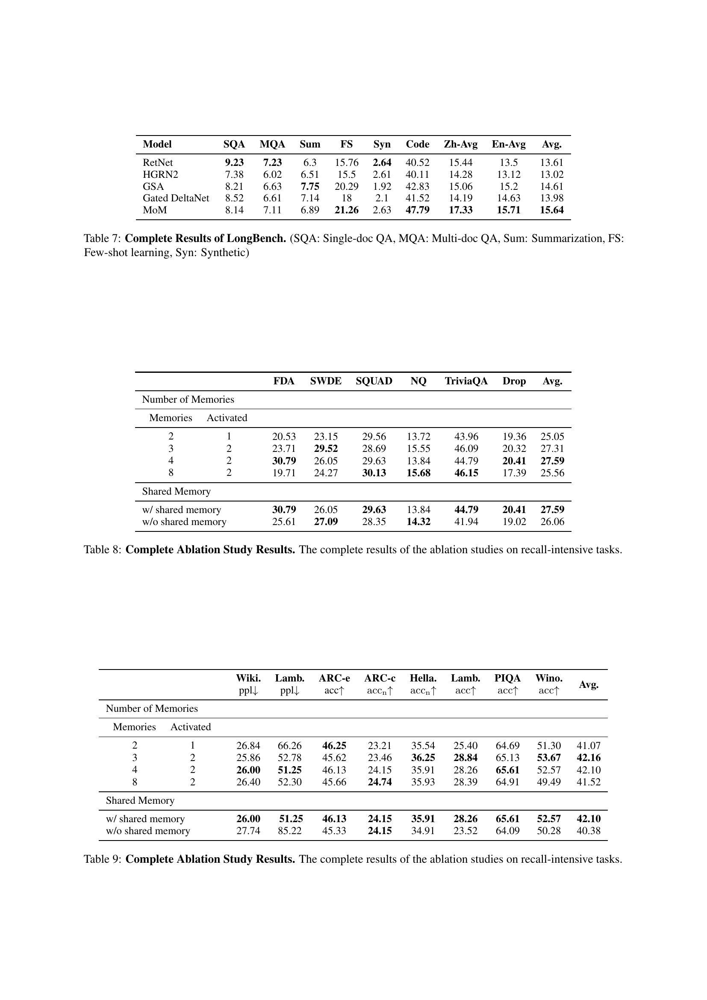
