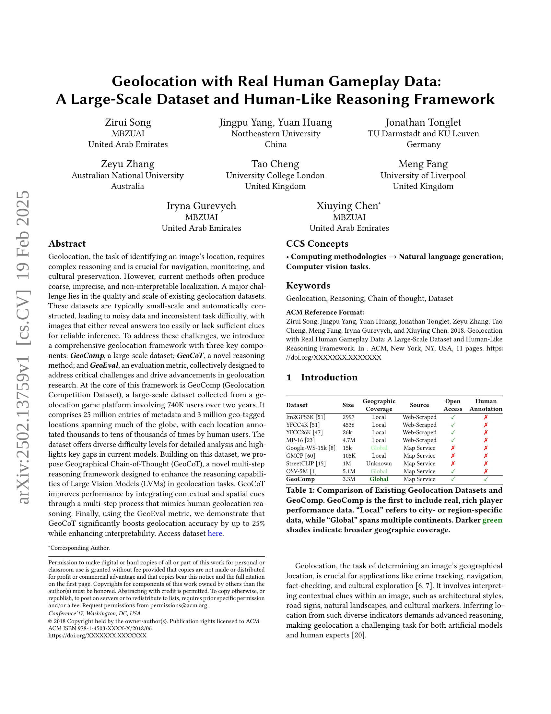

 


 2502.13759 
 Zirui Song et el. 
 
 🤗 2025-02-21 
 



↗ arXiv


↗ Hugging Face


↗ Papers with Code


### TL;DR



기존의 지리적 위치 추정 방법들은 데이터셋의 규모와 품질, 그리고 해석 가능성의 부족으로 인해 정확도가 낮고, 결과 해석이 어려운 문제점을 가지고 있습니다. 특히, 기존 데이터셋들은 자동으로 생성되어 잡음이 많고, 과제의 난이도가 일관되지 않아 신뢰할 수 있는 결과를 얻기 어렵다는 문제가 있었습니다. 

본 논문에서는 이러한 문제점들을 해결하기 위해, 2년간 74만 명의 사용자가 참여한 지리적 위치 추정 게임 플랫폼에서 수집한 **대규모 데이터셋 GeoComp**과, 인간의 추론 과정을 모방한 **새로운 추론 프레임워크 GeoCoT**를 제시합니다. GeoCoT는 다양한 지리적 단서들을 활용하여 다단계 추론을 수행하며, 그 결과의 해석 가능성을 높였습니다. 또한, 새롭게 제안한 **평가 지표 GeoEval**을 사용하여 GeoCoT의 성능을 평가하고, 기존 방법들에 비해 최대 25% 향상된 정확도를 달성했음을 보여줍니다.



#### Key Takeaways


 새로운 대규모 지리적 위치 추정 데이터셋 GeoComp 제시 



 인간 유사 추론 프레임워크 GeoCoT 제안 및 정확도 향상 



 새로운 평가 지표 GeoEval 제안 


#### Why does it matter?
이 논문은 **대규모의 실제 인간 게임플레이 데이터를 활용한 지리적 위치 추정 연구**에 중요한 기여를 합니다. 기존의 작고 자동으로 생성된 데이터셋의 한계를 극복하고, **새로운 대규모 데이터셋(GeoComp)과 인간의 추론 과정을 모방한 추론 프레임워크(GeoCoT)**를 제시하여 지리적 위치 추정 정확도를 크게 향상시켰습니다. 또한, **새로운 평가 지표(GeoEval)**를 제안하여 연구의 신뢰성을 높였습니다. 이러한 연구 결과는 지리적 위치 추정 분야의 발전에 크게 기여하며, 향후 연구 방향을 제시하는 데 중요한 의미를 가집니다.

------
#### Visual Insights

> 🔼 이 그림은 논문에서 제시된 지리 위치 추측 게임 플랫폼의 게임 방식을 보여줍니다. 같은 이미지를 보고 두 명의 플레이어가 각자의 단서를 이용하여 위치를 추측합니다. 플레이어의 추측 위치와 실제 위치 간의 거리에 따라 점수가 결정됩니다. 그림에서는 두 명의 플레이어가 각자 다른 위치를 선택했고, 그중 한 명이 실제 위치와 가까운 위치를 선택하여 승리한 것을 보여줍니다.
> 

> 
read the caption

> Figure 1. The gaming logic of our platform: Two players independently guess the location based on the same image and their own hints, with scores determined by the distance between their predictions and the ground truth location.
> 


| Dataset | Size | Geographic Coverage | Source | Open Access | Human Annotation |
|---|---|---|---|---|---| 
| Im2GPS3K (Vo et al., 2017b) | 2997 | Local | Web-Scraped | ✓ | ✗ |
| YFCC4K (Vo et al., 2017b) | 4536 | Local | Web-Scraped | ✓ | ✗ |
| YFCC26K (Theiner et al., 2022a) | 26k | Local | Web-Scraped | ✓ | ✗ |
| MP-16 (Larson et al., 2017) | 4.7M | Local | Web-Scraped | ✓ | ✗ |
| Google-WS-15k (Clark et al., 2023a) | 15k | Global | Map Service | ✗ | ✗ |
| GMCP (Zamir and Shah, 2014) | 105K | Local | Map Service | ✗ | ✗ |
| StreetCLIP (Haas et al., 2023) | 1M | Unknown | Map Service | ✗ | ✗ |
| OSV-5M (Astruc et al., 2024) | 5.1M | Global | Map Service | ✓ | ✗ |
| **GeoComp** | **3.3M** | **Global** | **Map Service** | **✓** | **✓** |

> 🔼 표 1은 기존의 지리 위치 확인 데이터셋들과 새롭게 제안하는 GeoComp 데이터셋을 비교 분석한 표입니다. GeoComp 데이터셋의 가장 큰 특징은 실제 사용자들의 게임 플레이 데이터를 풍부하게 포함하고 있다는 점입니다.  데이터셋의 범위는 지역(도시 또는 특정 지역) 또는 전 세계(여러 대륙)로 구분되며, 표의 색상은 더 어두운 녹색일수록 더 넓은 지역을 포함하고 있음을 나타냅니다.  이 표를 통해 기존 데이터셋의 한계점을 파악하고 GeoComp 데이터셋의 장점을 명확히 보여줍니다.
> 

> 
read the caption

> Table 1. Comparison of Existing Geolocation Datasets and GeoComp. GeoComp is the first to include real, rich player performance data. “Local” refers to city- or region-specific data, while “Global” spans multiple continents. Darker green shades indicate broader geographic coverage.
> 

### In-depth insights

#### Geolocation's Challenge
지리적 위치 확인(Geolocation)은 이미지 내 건축 양식, 도로 표지판, 자연 풍경 등 다양한 시각적 단서를 해석하여 위치를 추론하는 복잡한 과정입니다. **기존의 Geolocation 방법론은 종종 자동으로 생성된 소규모 데이터셋에 의존**, **정확도가 떨어지고 해석이 어려운 결과**를 생성합니다. 이러한 한계는 주로 데이터의 질과 규모에서 비롯되는데, 기존 데이터셋은 이미지가 위치 정보를 너무 쉽게 드러내거나 충분한 단서가 없어 신뢰할 수 있는 추론을 하기 어려운 경우가 많습니다.  따라서 **대규모의, 인간이 직접 참여하여 생성한 고품질 데이터셋 구축이 시급한 과제**입니다.  이를 통해 다양한 난이도의 위치 추론 과제를 포괄하고, 현존 모델의 한계를 부각하여 Geolocation 연구의 발전을 이끌어낼 수 있습니다.  **인간과 같은 추론 능력을 갖춘 시스템 개발** 또한 중요한 과제이며, 이는 다양한 지리적 단서들을 통합하고 사람의 추론 과정을 모방하는 다단계 추론 프레임워크 개발을 필요로 합니다.

#### GeoComp Dataset
본 논문에서 제시된 GeoComp 데이터셋은 기존 지리 위치 추정(Geolocation) 연구의 주요 한계점인 **데이터셋의 규모 및 품질 문제**를 해결하기 위해 고안되었습니다.  **740,000명 이상의 사용자들이 2년 동안 참여한 지리 위치 추정 게임 플랫폼**의 데이터를 기반으로 하며, **2,500만 개 이상의 주석이 달린 300만 개의 지리 태깅된 위치 정보**를 포함하고 있습니다.  이는 기존 데이터셋보다 훨씬 큰 규모이며, **실제 사용자들의 플레이 데이터를 포함**한다는 점에서 차별성을 갖습니다.  **다양한 난이도의 작업**들을 포함하여 모델의 성능을 폭넓게 평가할 수 있도록 하며, **전 세계적으로 고르게 분포된 위치 정보**는 편향성을 최소화하고 일반화 성능 향상에 기여합니다.  GeoComp 데이터셋은 단순히 이미지와 위치 정보만 제공하는 것이 아니라, **사용자들의 플레이 패턴 및 성적까지 포함**하여 더욱 심도있는 연구를 가능하게 합니다.  **인간의 추론 과정을 모방한 새로운 추론 프레임워크인 GeoCoT의 훈련 및 평가에도 활용**되어,  실제 사용자와 유사한 추론 능력을 가진 모델 개발에 중요한 역할을 할 것으로 기대됩니다.

#### GeoCoT Reasoning
GeoCoT 추론은 기존의 어설픈 위치 추정 방식에서 벗어나 **인간의 추론 과정을 모방**하여 이미지의 위치를 보다 정확하게 예측하는 혁신적인 프레임워크입니다.  **다단계 추론 과정**을 통해 대륙, 국가, 도시 등의 단계별 정보를 추출하여 점진적으로 위치를 특정하는 방식으로, **지리적 단서**들을 종합적으로 고려합니다.  **랜드마크, 기후, 건축 양식, 교통 표지판 등 다양한 시각적 정보**를 활용하여 단순한 패턴 인식을 넘어 심층적인 추론을 수행합니다.  이는 기존의 단순 분류 또는 검색 기반 방식의 한계를 극복하고, **높은 정확도와 해석 가능성**을 동시에 달성하는 핵심입니다.  GeoCoT의 뛰어난 성능은 대규모 데이터셋 GeoComp를 바탕으로 한 훈련과, 인간의 추론 과정을 모사한 설계에 기인합니다.  결과적으로 **정확도 향상과 더불어 추론 과정의 투명성을 확보**,  모델의 신뢰도를 높였습니다.  **다양한 지리적 환경과 언어를 포괄하는 GeoComp 데이터셋**은 GeoCoT의 일반화 능력을 향상시키는 데 중요한 역할을 수행했습니다.

#### Human-Level Accuracy
논문에서 "인간 수준의 정확도"라는 제목을 분석해 보면, **자동화된 지리 위치 확인 시스템이 인간 전문가의 수준만큼 정확하게 위치를 파악할 수 있는지** 여부를 평가하는 데 초점을 맞춘다는 것을 알 수 있습니다. 이는 단순히 시스템의 정확도만을 평가하는 것이 아니라, 인간의 지리적 추론 능력과 비교하여 **시스템의 성능 한계를 탐색하고 개선 방향을 모색하는** 데 중요한 의미를 지닙니다.  특히,  대규모 데이터셋과 인간 참여 기반의 게임 플랫폼을 활용한 실험 결과는 시스템의 성능을 객관적으로 평가하는 데 유용한 지표가 될 수 있으며, **인간과 시스템의 추론 과정 비교 분석**을 통해 시스템의 강점과 약점을 도출하고 개선할 수 있습니다.  **인간 수준의 정확도 달성 여부는 시스템의 실용성과 상용화 가능성을 판단하는 중요한 기준**이 될 수 있으며, 향후 지리 위치 확인 기술 발전에 중요한 영향을 미칠 것으로 예상됩니다.

#### Future Directions
본 논문에서 제시된 거대 언어 모델 기반의 지리적 추론 프레임워크는 **정확도와 해석력을 향상**시키는 잠재력을 보여주었지만, 여전히 개선의 여지가 있습니다. **데이터의 불균형 문제 해결**을 위해, 인구 밀도가 낮거나 접근성이 떨어지는 지역의 데이터 확보 노력이 필요합니다. 또한, **모델의 일반화 성능 향상**을 위해 다양한 환경과 언어를 포함하는 더욱 광범위한 데이터셋 구축이 중요합니다.  **다양한 지리적 특징과 문화적 요소**를 고려하여 모델을 더욱 정교화하고, **인간의 추론 과정과 유사한 다단계 추론**을 위한 알고리즘 개발이 미래 연구 방향입니다.  **모델의 설명 가능성**을 높이기 위한 연구 또한 필요하며, **에러 분석 및 오류 유형에 대한 심층적인 연구**를 통해 모델의 성능 향상에 기여할 수 있습니다. 마지막으로, **실제 응용 분야에 대한 적용 연구**를 통해 모델의 실용성을 검증하고, 다양한 응용 서비스 개발을 위한 기반을 마련하는 것이 중요합니다.

### More visual insights

More on figures

> 🔼 그림 2는 GeoComp 데이터셋에 있는 3,238,919개의 지리 태깅된 위치의 공간 분포를 보여줍니다. (a)는 전 세계 지도에서 공간적 이질성을 보여줍니다. 유럽과 아시아와 같은 도시화된 지역에는 밀집된 클러스터가 있고, 아프리카와 시베리아와 같은 지역은 희소하게 분포되어 있습니다. (b)는 북미와 아시아가 주도하는 지리 태깅된 위치의 비율 분포를 보여주는 원형 차트입니다. (c)는 이전 데이터셋과의 비교를 보여줍니다. OSV-5M과 같은 이전 데이터셋에서는 미국과 같은 단일 국가가 데이터의 25%를 차지하는 반면, 이 데이터셋은 국가 수준에서 균형을 이룹니다.
> 

> 
read the caption

> Figure 2. Spatial distribution of 3,238,919 geo-tagged locations in GeoComp: (a) The global map shows spatial heterogeneity, with dense clusters in more urbanized regions like Europe and Asia, and sparse coverage in areas like Africa and Siberia. (b) The pie chart highlights the proportional geo-tagged locations distribution, led by North America and Asia. (c) Unlike previous datasets like OSV-5M, where a single country (e.g., America) dominates 25% of the data, our dataset is balanced at country level.
> 

> 🔼 그림 3은 주요 국가에서 게임 플레이어의 실력(초보, 중급, 전문가)에 따른 성과를 보여줍니다. 각 국가별로 세 가지 실력 수준의 플레이어들의 평균 점수를 비교하여, 각 국가 플레이어들의 지리적 추론 능력 차이와 실력별 점수 차이를 보여줍니다.  특히, 전문가 플레이어는 초보 플레이어보다 훨씬 높은 점수를 기록하는 것을 확인할 수 있습니다.
> 

> 
read the caption

> Figure 3. Performance of game players of different levels in mainstream countries.
> 

> 🔼 그림 4는 기존의 지리 위치 확인 방식과 본 논문에서 제안하는 새로운 방법을 비교하여 보여줍니다. 기존 방식들은 데이터셋의 품질 한계로 인해 정확도가 떨어지는 조잡한 예측에 그쳤지만, 본 논문의 생성 및 추론 기반 방법은 보다 세밀한 도시 수준의 예측을 가능하게 합니다.  기존 방법들은 이미지를 격자 단위로 나누어 분류하거나, 유사한 이미지를 검색하는 방식을 사용하여 전체적인 지역만을 예측하는 반면, 본 논문의 방법은 다단계 추론 과정을 통해 점진적으로 위치를 특정해나가는 방식으로, 보다 정확하고 해석 가능한 결과를 제공합니다.
> 

> 
read the caption

> Figure 4. Comparison of previous geolocation tasks and our proposed paradigm: while previous works focused on coarse-grained predictions limited by dataset quality, our generation and reasoning-based method enables fine-grained city-level predictions.
> 

> 🔼 그림 5는 LLaVA, GPT-40, GeoReasoner 세 가지 모델의 이미지 지리적 위치 추론 결과를 정성적으로 비교 분석한 그림입니다. 각 모델은 입력 이미지에 대한 단서(파란색), 정답 예측(녹색), 오답 예측(빨간색), 불확실한 예측(주황색)을 보여줍니다. 이를 통해 각 모델의 추론 과정과 정확도를 시각적으로 비교하고, GeoCoT 모델의 우수성을 보여주는 데 활용됩니다.
> 

> 
read the caption

> Figure 5. Qualitative comparison of LLaVA, GPT4o, and GeoReasoner. Clues are shown in blue, correct predictions in green, incorrect in red, and vague/uncertain guesses in orange.
> 

More on tables


| Model | City Accuracy↑ | City Recall↑ | City F1↑ | Country Accuracy↑ | Country Recall↑ | Country F1↑ | Continent Accuracy↑ | Continent Recall↑ | Continent F1↑ |
|---|---|---|---|---|---|---|---|---|---| 
| LLaVA-1.6 | 0.002 | 0.001 | 0.002 | 0.041 | 0.019 | 0.028 | 0.175 | 0.067 | 0.056 |
| LLama-3.2-Vision | 0.081 | 0.037 | 0.030 | 0.630 | 0.199 | 0.217 | 0.866 | 0.643 | 0.639 |
| Qwen-VL | 0.016 | 0.013 | 0.014 | 0.069 | 0.042 | 0.070 | 0.130 | 0.115 | 0.077 |
| GeoCLIP | 0.018 | 0.007 | 0.008 | 0.550 | 0.197 | 0.204 | 0.872 | 0.746 | 0.731 |
| GeoReasoner | 0.018 | 0.014 | 0.012 | 0.092 | 0.053 | 0.085 | 0.208 | 0.161 | 0.144 |
| GPT-4o | 0.092 | 0.048 | 0.044 | 0.615 | 0.188 | 0.208 | 0.807 | 0.468 | 0.487 |
| GPT-4o(CoT) | 0.094 | 0.052 | 0.042 | 0.623 | 0.194 | 0.212 | 0.819 | 0.430 | 0.449 |
| GeoCoT | 0.118 | 0.089 | 0.086 | 0.640 | 0.260 | 0.291 | 0.862 | 0.638 | 0.646 |
> 🔼 표 2는 국가 수준 및 도시 수준의 지리적 위치 확인에서 정밀도, 재현율, F1 점수를 비교한 표입니다.  세 가지 지표(정밀도, 재현율, F1 점수)는 세 가지 등급(최고, 중간, 최저)으로 표시되며,  굵은 글씨는 제안된 모델이 최고 성능을 달성했음을 나타냅니다.  각 모델의 성능을 국가, 도시, 대륙 세 가지 수준으로 비교하여, 제안된 모델의 성능 우수성을 보여줍니다.
> 

> 
read the caption

> Table 2. Comparison of Precision, Recall and F1 scores in country-level and city-level geolocation. The scores are represented as follows: best, second, and third. Bold values indicate that our model achieves the best performance.
> 


| Model | Street (1km) | City (25km) | Country (750km) |
|---|---|---|---|
| LLaVA-1.6 | 0.006 | 0.020 | 0.082 |
| Llama-3.2-Vision | 0.018 | 0.104 | 0.638 |
| Qwen-VL | 0.004 | 0.014 | 0.090 |
| GeoCLIP | 0.035 | 0.077 | 0.625 |
| GeoReasoner | 0.010 | 0.020 | 0.128 |
| GPT-4o | 0.045 | 0.147 | 0.678 |
| GPT-4o(CoT) | 0.047 | 0.151 | 0.701 |
| GeoCoT | **0.073** | **0.157** | **0.711** |
> 🔼 표 3은 다양한 크기의 지리 위치 확인 작업에서 여러 모델의 정확도를 보여줍니다.  'Street' (1km), 'City' (25km), 'Country' (750km)의 세 가지 거리 임계값을 사용하여 미세한 위치 확인과 대략적인 위치 확인 모두 평가합니다. 각 모델의 정확도는 세 가지 거리 임계값 모두에서 비교됩니다. 이 표는 다양한 모델의 성능을 세 가지 다른 크기의 지리 위치 확인 작업에 대한 상대적인 강점과 약점을 보여줍니다.
> 

> 
read the caption

> Table 3. Accuracy of different models on geolocation tasks at various scales.
> 


| Model | Similarity | GeoEval |  |  |  | 
|---|---|---|---|---|---| 
|  | GPTScore | CE | AE | AC | LC | 
| LLaVA-1.6 | 0.478 | 1.262 | 1.271 | 1.446 | 1.490 | 
| Llama-3.2-Vision | 0.566 | 2.203 | 2.386 | 2.558 | 2.721 | 
| Qwen-VL | 0.371 | 1.231 | 1.255 | 1.453 | 1.484 | 
| GeoReasoner | 0.424 | 1.421 | 1.533 | 1.719 | 2.038 | 
| GPT-4o | 0.613 | 2.320 | 2.891 | 2.809 | 3.143 | 
| GPT-4o(CoT) | 0.663 | 2.462 | 3.136 | 3.156 | 3.540 | 
| GeoCoT | **0.728** | **2.690** | **3.538** | **3.696** | **3.945** |
> 🔼 표 4는 GeoEval 프레임워크 내에서 지상 진실 기반 지표를 사용하여 GeoCoT 추론 과정을 평가한 결과를 보여줍니다. GeoEval 프레임워크는 추론 과정의 완성도, 특징 추출 정확도, 추론 및 단서 일치 정확도, 추론의 논리적 일관성 등 네 가지 측면을 평가합니다. 표에는 각 지표에 대한 GeoCoT의 점수와 여러 기준 모델(LLaVA-1.6, Llama-3.2-Vision, Qwen-VL, GeoReasoner, GPT-40, GPT-40(CoT))의 점수가 비교되어 제시됩니다. 이를 통해 GeoCoT의 추론 능력을 다각적으로 평가하고 다른 모델들과의 성능 차이를 명확히 보여줍니다.
> 

> 
read the caption

> Table 4. Evaluation of GeoCoT’s reasoning process using ground truth-based metrics within the GeoEval framework.
> 


| Model | OH Count ↓ | FH Count ↓ | AH Count ↓ |
|---|---|---|---|
| GeoReasoner | 237 | 151 | 203 |
| GPT-4o | 43 | 4 | 35 |
| GeoCoT | 5 | 1 | 18 |
> 🔼 표 5는 GeoCoT 추론 과정의 환각(hallucination) 현상 평가 결과를 보여줍니다.  환각은 모델이 실제 이미지에 없는 객체나 속성을 생성하거나, 잘못된 사실을 언급하거나, 잘못된 속성을 대상에 부여하는 등의 현상을 말합니다. 이 표는 세 가지 유형의 환각(객체 환각, 사실 환각, 속성 환각)에 대해 GeoReasoner, GPT-40, 그리고 GeoCoT 모델의 오류 건수를 비교 분석하여 GeoCoT 모델의 추론 과정에서 환각 현상이 다른 모델들에 비해 얼마나 적게 발생하는지를 보여줍니다.
> 

> 
read the caption

> Table 5. Hallucination Evaluation on Reasoning Data.
> 


| Model | Im2GPS |  | Im2GPS3K |  |  |
|---|---|---|---|---|---|---|
|  | Street | City | Country | Street | City | Country |
|  | 1km | 25km | 750km | 1km | 25km | 750km |
| LLaVA-1.6 | 0.04 | 0.18 | 0.39 | 0.03 | 0.14 | 0.32 |
| Llama-3.2-Vision | 0.09 | 0.37 | 0.65 | 0.07 | 0.27 | 0.52 |
| Qwen-VL | 0.04 | 0.21 | 0.37 | 0.04 | 0.15 | 0.26 |
| GeoCLIP | 0.17 | 0.41 | 0.77 | 0.13 | 0.32 | 0.67 |
| GeoReasoner | 0.05 | 0.19 | 0.33 | 0.04 | 0.15 | 0.26 |
| PlaNet | 0.08 | 0.25 | 0.54 | 0.09 | 0.25 | 0.48 |
| CPlaNet | 0.17 | 0.37 | 0.62 | 0.10 | 0.27 | 0.49 |
| Translocator | 0.20 | 0.48 | 0.76 | 0.12 | 0.31 | 0.59 |
| GeoDecoder | 0.22 | 0.50 | 0.80 | 0.13 | 0.34 | 0.61 |
| GPT-4o | 0.13 | 0.47 | 0.74 | 0.14 | 0.40 | 0.66 |
| GPT-4o(ZS-CoT) | 0.16 | 0.49 | 0.77 | 0.14 | 0.45 | 0.69 |
| GeoCoT | **0.22** | **0.55** | **0.83** | **0.15** | **0.46** | **0.74** |
> 🔼 표 6은 기존 벤치마크 데이터셋에서 GeoCoT과 최첨단 지리 위치 확인 모델들의 성능을 비교한 표입니다.  Im2GPS와 Im2GPS3K 데이터셋을 사용하여 Street(1km), City(25km), Country(750km) 세 가지 레벨에서 정확도를 평가하였습니다. 각 모델의 Street, City, Country 레벨별 정확도를 비교하여 GeoCoT의 성능 우수성을 보여줍니다.
> 

> 
read the caption

> Table 6. Performance comparison of GeoCoT and state-of-the-art geolocation models on traditional benchmarks.
> 

### Full paper



