 


 2502.13908 
 Hossein A. Rahmani et el. 
 
 🤗 2025-02-20 
 



↗ arXiv


↗ Hugging Face


↗ Papers with Code


### TL;DR



현재 정보 검색 시스템 평가는 **많은 인력과 시간을 필요로 하는 수동적인 관련성 판단**에 의존하고 있습니다. 이는 비용이 많이 들고, 특히 새로운 주제나 자원이 부족한 상황에서는 어려움을 겪습니다. 이러한 문제를 해결하기 위해 **대규모 언어 모델(LLM)을 활용한 자동 관련성 평가**가 주목받고 있지만, **LLM의 편향성과 신뢰성 문제**가 여전히 남아 있습니다.

본 논문에서는 SIGIR 2024에서 진행된 LLMJudge 챌린지를 통해 수집된 **42개의 LLM 기반 관련성 판단 데이터셋**을 공개하고 분석합니다. 다양한 팀들이 제안한 여러 LLM 기반 관련성 평가 방법들을 비교 분석하여, 각 방법들의 강점과 약점을 파악하고, **LLM 자동 평가 시스템의 편향성 및 신뢰성을 개선하기 위한 방향**을 제시합니다. 또한, 본 논문은 다양한 평가 지표를 사용하여 LLM 기반 평가 시스템의 성능을 측정하고, **인간 평가자와의 차이점**을 분석하여 **향후 연구 방향**을 제시합니다.



#### Key Takeaways


 LLM 기반 자동 관련성 평가의 편향성 및 신뢰성 문제를 규명 



 LLMJudge 데이터셋 공개를 통한 후속 연구 지원 



 다양한 LLM 기반 평가 방법론 비교 분석 및 효과적인 전략 제시 


#### Why does it matter?
본 논문은 **LLM을 활용한 자동화된 관련성 평가의 신뢰성과 편향성에 대한 심층적인 분석**을 제공하며, 이 분야 연구자들에게 귀중한 데이터셋과 분석 결과를 제공합니다. **LLM 기반 평가의 한계와 개선 방향을 제시**함으로써, 정보 검색 및 자연어 처리 분야의 발전에 크게 기여할 수 있습니다.

------
#### Visual Insights

> 🔼 그림 (a)는 논문의 LLMJudge 데이터셋에 대한 개발(Dev) 세트의 성능을 보여줍니다.  LLMJudge 과제에서 제출된 샘플(Sample)의 NDCG@10 점수와 전체(Full) 인간 평가자의 NDCG@10 점수 간의 상관관계를 산점도로 나타냅니다.  두 점수 간의 강한 양의 상관관계는 LLM이 생성한 평가가 인간 평가자의 평가와 일치함을 시사합니다.  Kendall's τ 값은 상관관계의 강도를 수치적으로 나타냅니다.
> 

> 
read the caption

> (a) Dev set
> 


| | **Dev** | **Test** |
|---|---|---|
| # queries | 25 | 25 |
| # passage | 7,224 | 4,414 |
| # qrels | 7,263 | 4,423 |
| # irrelevant (0) | 4,538 | 2,005 |
| # related (1) | 1,403 | 1,233 |
| # highly relevant (2) | 625 | 808 |
| # perfectly relevant (3) | 697 | 377 |

> 🔼 LLMJudge 데이터셋의 통계를 보여주는 표입니다.  데이터셋에 포함된 질의, 문단, qrel(query relevance judgment)의 수, 각 관련성 점수(0: irrelevant, 1: related, 2: highly relevant, 3: perfectly relevant)별 문단 수를 보여줍니다.  데이터셋이 개발(dev)셋과 테스트(test)셋으로 나뉘어져 각 셋에 대한 통계가 제시됩니다.
> 

> 
read the caption

> Table 1. Statistics of LLMJudge Dataset
> 

### In-depth insights

#### LLM Relevance Judge
LLM 기반의 관련성 판정(LLM Relevance Judge)은 정보 검색 및 자연어 처리 분야에서 **인간의 노력을 줄이고 효율성을 높일 수 있는 혁신적인 방법**으로 제시되고 있습니다. 본 논문은 LLM이 자동으로 관련성을 평가하는 다양한 접근 방식을 평가하고 비교 분석한 결과를 제시합니다.  **LLM이 생성한 관련성 판단의 편향성, 신뢰성 및 효율성 등의 측면**에서 다양한 요소를 분석하며, **다양한 모델의 성능을 비교**하고 여러 가지 평가 지표를 사용하여 LLM의 관련성 평가 능력을 객관적으로 평가합니다.  특히, **개선된 평가 방법론과 벤치마크 데이터셋**을 제공하여 향후 연구를 위한 기준을 제시하며, LLM 기반 관련성 판정의 장점과 한계를 명확히 제시합니다.  **실제 인간 평가자의 판단과 LLM의 판단을 비교 분석**하여 LLM의 성능을 정확하게 평가하고, 이를 바탕으로  LLM을 활용한 효과적이고 신뢰할 수 있는 자동화된 평가 기법 개발에 대한 방향을 제시하는 것이 중요합니다.  더 나아가,  **LLM 기반 자동 관련성 판단의 편향성, 환경 영향 및 보안 취약성과 같은 문제점**을 해결하기 위한 추가 연구가 필요합니다.

#### Bias and Circularity
본 논문에서 다룬 바와 같이, **대규모 언어 모델(LLM)**을 정보 검색 평가의 자동화된 척도로 사용하는 데는 **편향(Bias)**과 **순환성(Circularity)**이라는 두 가지 주요한 문제점이 있습니다.  **편향**은 LLM이 훈련 데이터의 편향성을 반영하여 특정 유형의 문서나 질의에 대해 불균형적인 결과를 산출할 수 있음을 의미합니다.  **순환성**은 LLM을 사용하여 생성한 평가 데이터를 다시 LLM을 평가하는 데 사용하는 경우 발생하며, 이는 모델의 성능을 과대평가하거나 잘못된 결과를 초래할 수 있습니다. 따라서 LLM을 정보 검색 평가에 활용할 때는 이러한 문제점들을 면밀히 검토하고, 이를 완화하기 위한 적절한 전략을 수립하는 것이 필수적입니다.  **다양한 훈련 데이터 사용**, **다양한 LLM 활용**, 그리고 **인간 전문가의 검토**를 병행함으로써 이러한 문제점들을 최소화하는 방안을 모색해야 합니다.  결론적으로, LLM은 유망한 자동화 평가 도구이지만, 신중한 검토와 전략 수립 없이는 그 한계가 명확히 드러날 수 있습니다.

#### LLMJudge Challenge
LLMJudge 챌린지는 **대규모 언어 모델(LLM)**을 활용한 자동화된 관련성 평가의 효과를 측정하기 위한 시도였습니다.  이 챌린지를 통해 다양한 LLM 기반 접근 방식들이 제시되었고, 각 방법의 강점과 약점을 비교 분석할 수 있는 **방대한 데이터셋**이 공개되었습니다.  **평가 지표**로는 Cohen's Kappa, Krippendorff's Alpha, Kendall's Tau, Spearman's Rank Correlation 등이 사용되어, LLM이 생성한 관련성 판단의 정확도와 일관성을 다각적으로 평가하였습니다.  **결과적으로 LLM이 관련성 판단에 효과적일 수 있지만, 편향이나 일관성 부족 등의 문제점도 드러났고, 이를 해결하기 위한 추가 연구의 필요성을 확인했습니다.**  이 챌린지는 LLM을 활용한 정보 검색 및 자연어 처리 분야의 발전에 기여할 뿐만 아니라,  **자동화된 평가 기술 개선**에도 중요한 의미를 가집니다.

#### Methodological Insights
본 논문은 LLM을 이용한 자동 관련성 평가의 방법론적 통찰을 제공합니다. **다양한 LLM 기반 접근 방식(프롬프트 엔지니어링, 파인 튜닝, 앙상블 모델 등)의 비교 분석**을 통해 각 방법론의 강점과 약점을 심층적으로 다룹니다. 특히, **평가 지표(Cohen's Kappa, Krippendorff's Alpha, Kendall's Tau 등) 간의 상관관계 분석**은 LLM 기반 관련성 판단의 신뢰성 및 일관성을 평가하는 데 중요한 시사점을 제공합니다. **다양한 그레인(4-point, 0|123, 01 23, 012|3)별 일관성 분석**은 평가 방법의 세분화된 접근을 통해 LLM의 편향성과 한계를 보다 정밀하게 파악하는 데 도움을 줍니다.  결론적으로, **본 논문은 LLM을 활용한 자동 관련성 판단의 신뢰도 향상을 위한 여러 가지 방법론적 개선 방향**을 제시하며, 향후 연구 방향에 대한 중요한 시사점을 제공합니다.  더 나아가, **LLM 기반 자동 평가 시스템의 한계점과 이를 극복하기 위한 노력**이 논의되어 있어,  실제 응용 분야에서의 LLM 활용에 대한 현실적인 고려 사항을 제시하는 데 기여합니다.

#### Future Directions
본 논문의 "미래 방향"에 대한 고찰은 **대규모 언어 모델(LLM)을 활용한 자동화된 관련성 평가의 신뢰성과 편향성을 개선하는 데 집중**되어야 합니다.  이는 **다양한 LLM 아키텍처와 프롬프트 엔지니어링 기법을 비교 분석하고, 잠재적인 편향을 탐지 및 완화하는 새로운 방법론을 개발**하는 것을 포함합니다.  특히, **LLM이 생성한 관련성 판단의 환경적 영향과 취약성에 대한 심층적인 연구**가 필요하며, **인간 전문가의 판단과 LLM 기반 판단 간의 일관성을 높이는 방법**을 모색해야 합니다.  더 나아가, **다양한 크기의 LLM과 앙상블 모델의 효율성을 비교 분석**하고, **자동 평가 기법 개선을 위한 새로운 지표 개발 및 실험**을 통해 LLM 기반 자동 관련성 평가의 실용성을 더욱 높일 수 있는 방안을 연구하는 것이 중요합니다.  궁극적으로는, **인간의 개입을 최소화하면서도 높은 정확도와 신뢰성을 보장하는 자동화된 관련성 판단 시스템**을 구축하는 것이 미래 방향의 핵심 목표입니다.

### More visual insights

More on figures

> 🔼 그림 (b)는 논문의 LLMJudge 데이터셋에 대한 통계를 보여주는 표의 테스트 세트에 대한 부분입니다.  테스트 세트는 25개의 질의, 4,414개의 문단, 4,423개의 관련성 판단, 2,005개의 무관한 문단, 1,233개의 관련 문단, 808개의 고관련 문단, 377개의 완벽히 관련된 문단으로 구성됩니다. 이는 LLMJudge 챌린지 참가자들이 자동으로 생성한 관련성 판단의 품질과 분포를 이해하는 데 중요한 정보입니다. 
> 

> 
read the caption

> (b) Test set
> 

> 🔼 그림 1은 LLMJudge 데이터셋의 개발(dev) 및 테스트(test) 집합에 대한 상관관계 분석 결과를 보여줍니다.  LLMJudge 챌린지의 개발 및 테스트 집합은 TREC 2023 심층 학습 트랙의 전체 qrel (관련성 판단)과의 상관 관계를 보여주는 산점도를 나타냅니다.  각 산점도는  LLMJudge에서 생성된 자동화된 관련성 판단(샘플)과 사람이 직접 평가한 관련성 판단(전체) 사이의 NDCG@10 값의 상관관계를 시각적으로 보여줍니다.  이를 통해 LLM이 생성한 관련성 판단의 정확도와 신뢰성을 사람의 판단과 비교하여 평가할 수 있습니다.  개발 집합과 테스트 집합 모두 높은 상관 관계를 보여주어, LLM이 생성한 관련성 판단이 TREC 2023 심층 학습 트랙의 기준과 일치하는 정도가 높음을 시사합니다.
> 

> 
read the caption

> Figure 1. Samples correlation with TREC 2023 DL full qrel
> 

> 🔼 그림 2는 Cohen의 κ (일치도)와 Kendall의 τ (순위 상관관계) 값을 비교하여 LLM 기반 관련성 판단 모델의 성능을 평가한 것입니다. x축은 Cohen의 κ 값이고 y축은 Kendall의 τ 값입니다. 각 점은 다른 제출된 모델을 나타내며,  Cohen의 κ 값이 높을수록 모델의 human judge와의 일치도가 높고, Kendall의 τ 값이 높을수록 모델이 human judge와 유사한 순위를 생성한다는 것을 의미합니다. 이 그래프를 통해 다양한 모델들의 일치도와 순위 상관관계 간의 관계를 시각적으로 파악할 수 있습니다. 특히 일부 모델은 순위 상관관계가 높지만 일치도가 낮은 반면, 다른 모델들은 일치도와 순위 상관관계 모두 높은 것을 확인할 수 있습니다.
> 

> 
read the caption

> Figure 2. Cohen’s κ𝜅\kappaitalic_κ vs. Kendall’s τ𝜏\tauitalic_τ
> 

> 🔼 이 그림은 LLMJudge 챌린지에 제출된 각 제출물의 평균 레이블 값과 Kendall의 tau 값 사이의 관계를 보여줍니다.  x축은 Cohen's Kappa 값이고 y축은 Kendall의 tau 값이며, 각 점은 하나의 제출물을 나타냅니다. 이 그림을 통해 평균 레이블 값과 시스템 순위 상관관계(Kendall's tau) 간의 관계를 시각적으로 파악할 수 있습니다.  특히, 평균 레이블이 높다고 해서 Kendall's tau 값이 반드시 높은 것은 아니라는 점을 보여줍니다. 즉,  LLM이 레이블을 부여하는 일관성과 정확성이 모두 중요하다는 것을 시사합니다.
> 

> 
read the caption

> (a) Avg. Label vs. Kendall τ𝜏\tauitalic_τ
> 

> 🔼 이 그림은 LLMJudge 과제에 제출된 각 제출물의 평균 레이블과 Krippendorff’s 알파 값 사이의 관계를 보여줍니다. Krippendorff’s 알파는 여러 평가자 간의 일치도를 측정하는 지표입니다. 이 그림을 통해 각 제출물의 레이블링 일관성과 신뢰성을 평가할 수 있습니다.  높은 Krippendorff’s 알파 값은 레이블링이 일관성 있고 신뢰할 수 있음을 의미합니다. 평균 레이블은 각 제출물이 평균적으로 할당한 레이블 값을 나타냅니다.
> 

> 
read the caption

> (b) Avg. Label vs. Krippendorff’s α𝛼\alphaitalic_α
> 

> 🔼 그림 3은 제출된 각 방법들의 평균 레이블 값과 켄달 타우(Kendall's Tau), 그리고 크리펜도르프 알파(Krippendorff's Alpha) 값 간의 관계를 보여줍니다.  왼쪽 그림은 평균 레이블 값과 켄달 타우 간의 상관관계를, 오른쪽 그림은 평균 레이블 값과 크리펜도르프 알파 간의 상관관계를 나타냅니다.  각 점은 하나의 제출된 방법을 나타내며, 점의 x좌표는 켄달 타우 또는 크리펜도르프 알파 값이고, y좌표는 평균 레이블 값입니다.  주황색 점선은 인간 평가자의 평균 레이블 값(0.90)을 나타냅니다. 이 그림은 다양한 방법들이 순위 일관성(켄달 타우)은 높게 유지하지만, 레이블의 절대적인 점수 경향은 다르다는 점을 보여줍니다.  즉, 순위는 비슷하게 매기더라도 실제 점수는 차이가 있음을 시각적으로 보여줍니다.
> 

> 
read the caption

> Figure 3. Average Labels
> 

### Full paper


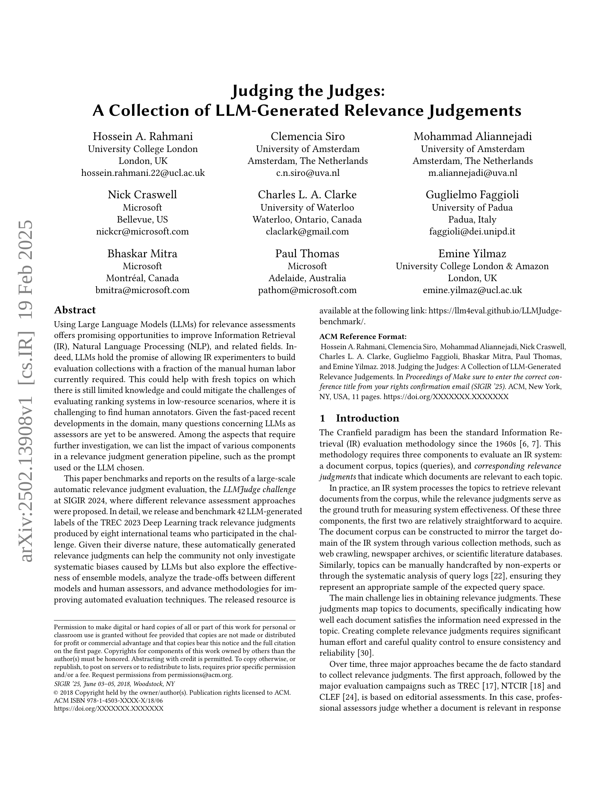
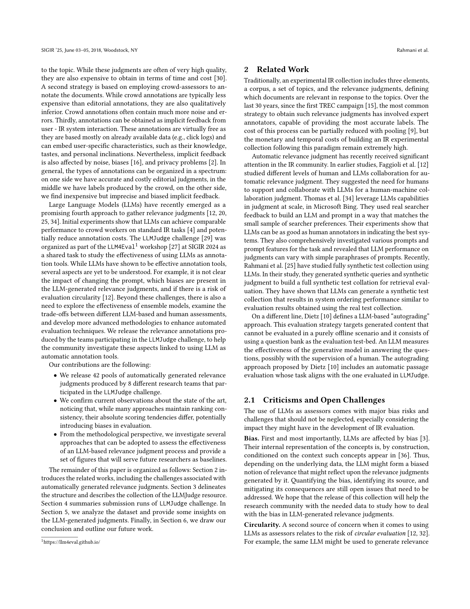
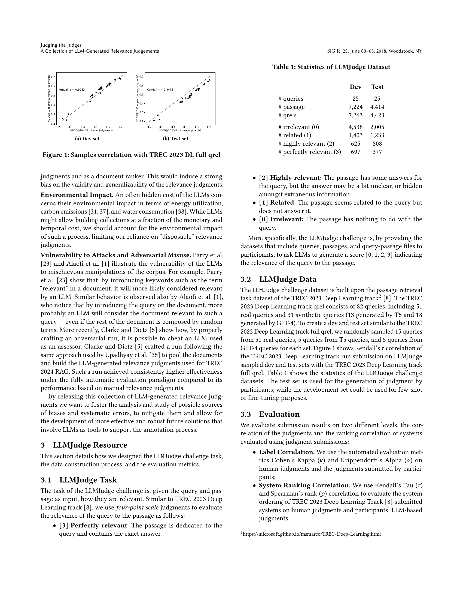
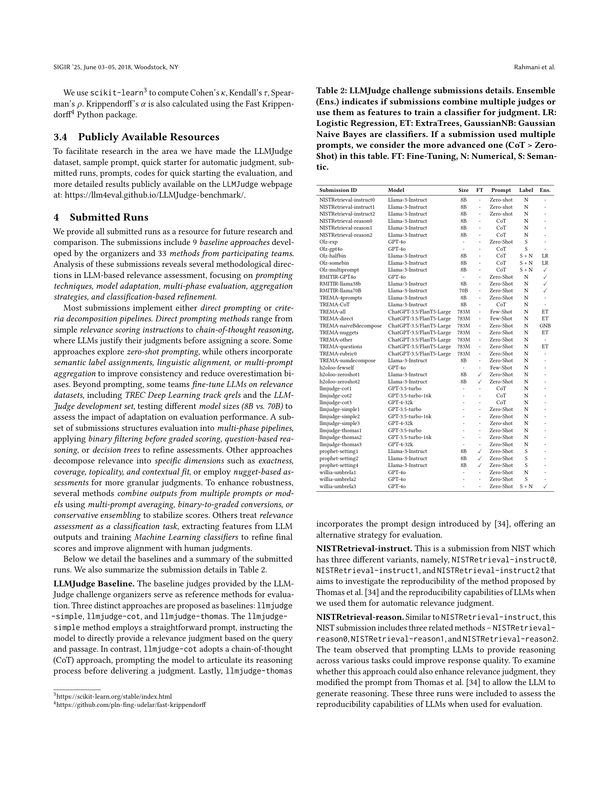
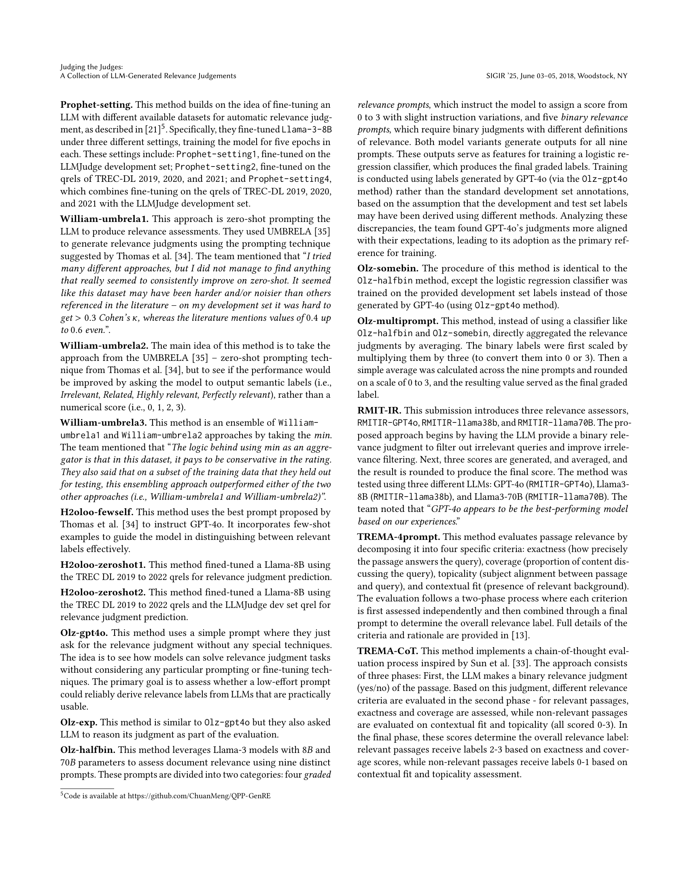
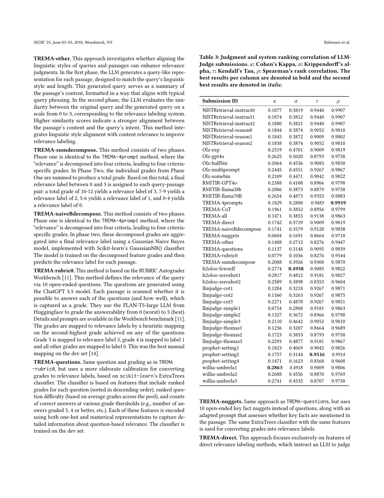
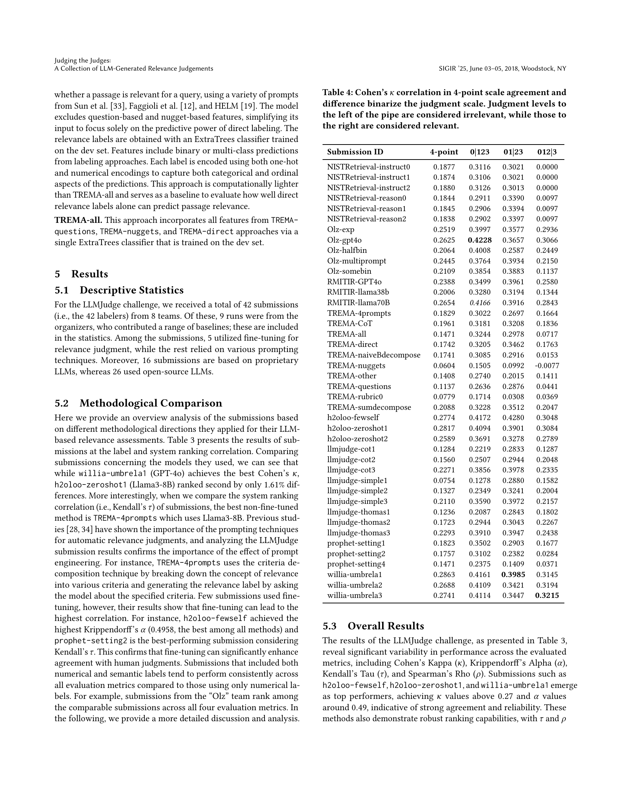
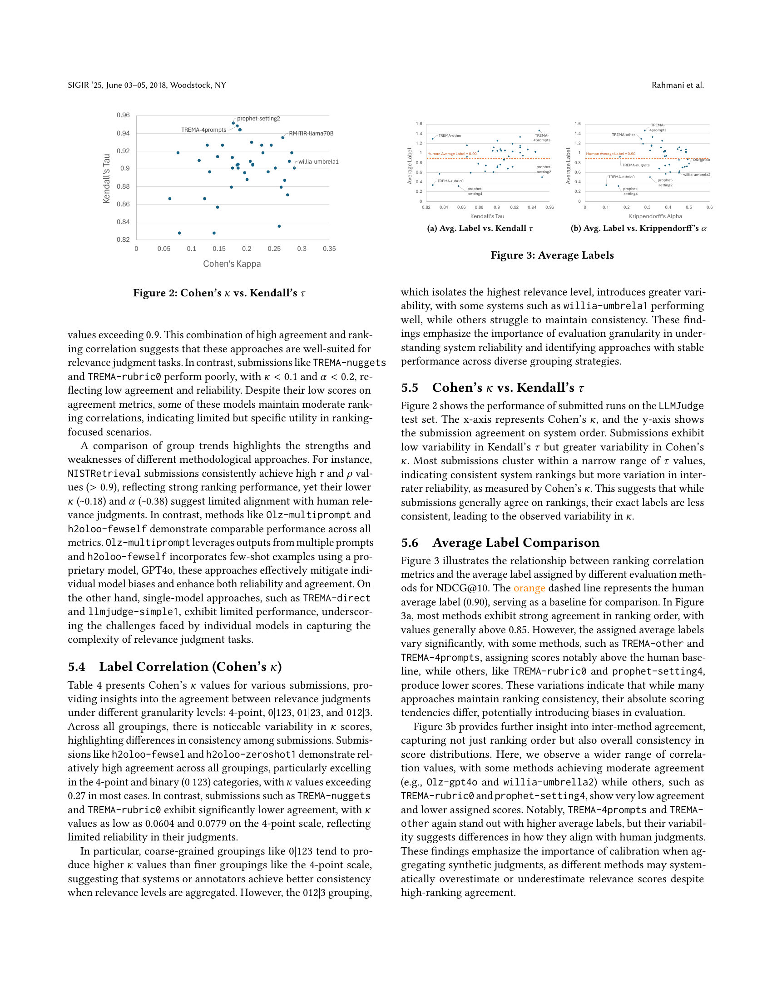
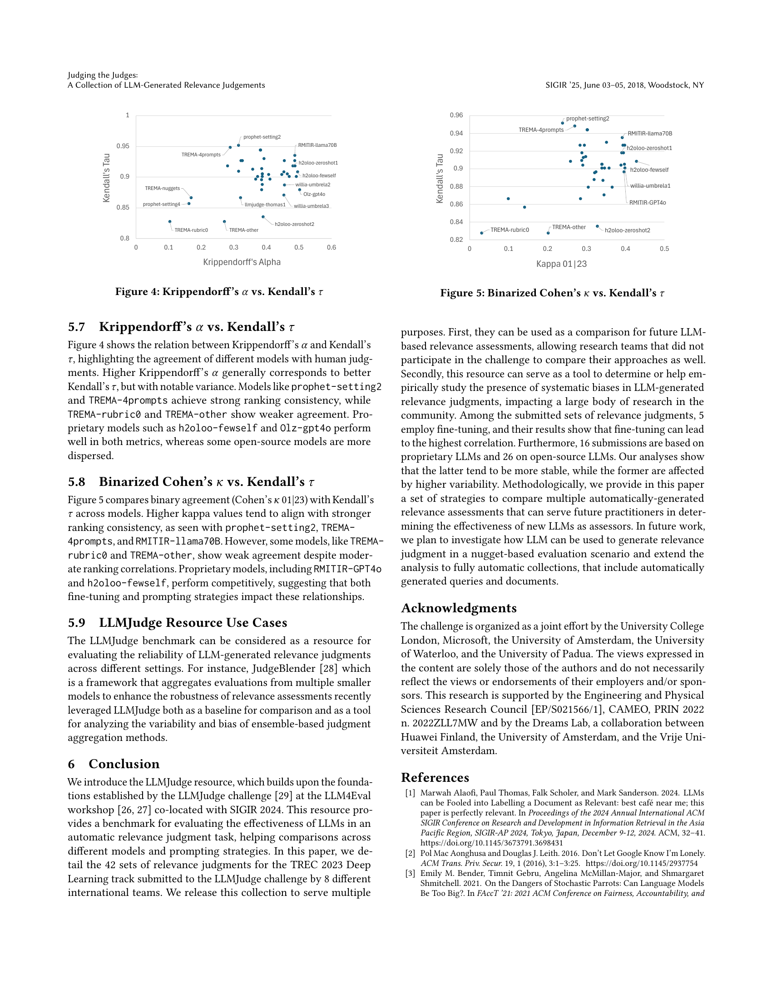
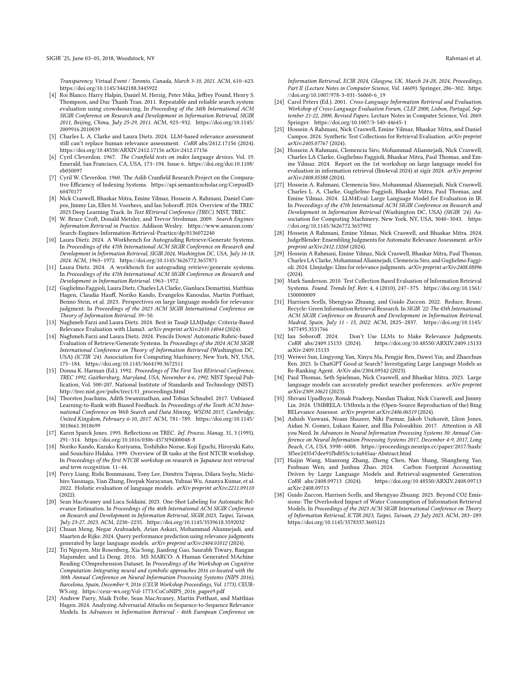
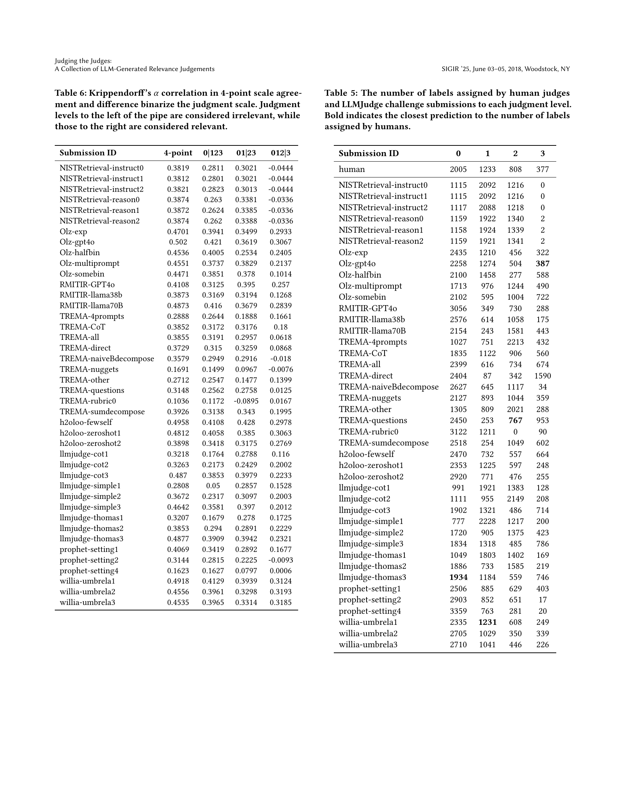
