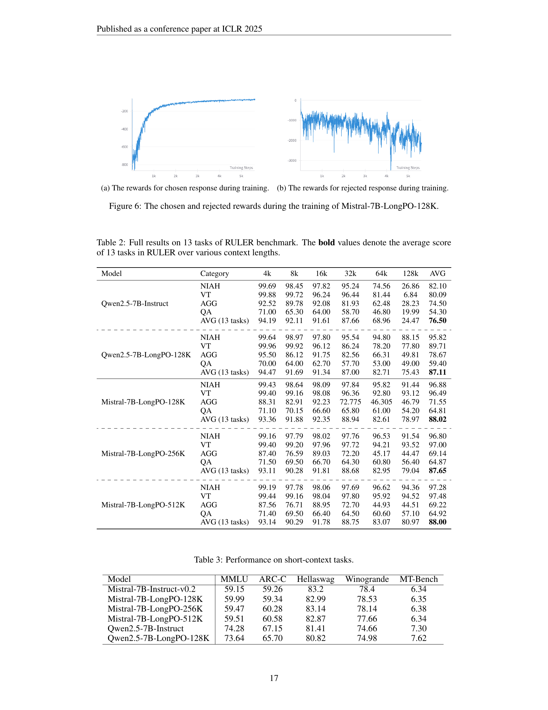

 


 2502.13922 
 Guanzheng Chen et el. 
 
 🤗 2025-02-20 
 



↗ arXiv


↗ Hugging Face


↗ Papers with Code


### TL;DR



기존의 거대 언어 모델(LLM)들은 **짧은 컨텍스트에서는 잘 작동하지만 긴 컨텍스트에서는 성능이 저하**되는 문제가 있습니다. 이는 **긴 컨텍스트에 대한 인간의 주석이 어렵고 비효율적**이기 때문입니다.  또한 단문 및 장문 컨텍스트에서의 성능 균형을 맞추는 것도 어려운 과제입니다. 

본 논문에서는 이러한 문제를 해결하기 위해 **LongPO**라는 새로운 방법을 제시합니다.  LongPO는 **모델 스스로 단문에서 학습한 지식을 장문 컨텍스트에 적용**하여 성능을 향상시키는 자기 진화 방식을 사용합니다.  이는 **모델이 스스로 단문-장문 컨텍스트의 차이를 학습**하도록 함으로써, 별도의 대량의 장문 컨텍스트 데이터 없이도 성능을 향상시킬 수 있게 합니다. 실험 결과, LongPO는 기존 방법들보다 우수한 성능을 보였으며, **일부 최첨단 모델들과 비교해도 경쟁력 있는 성능**을 보였습니다.



#### Key Takeaways


 LongPO는 단문 컨텍스트에서 잘 학습된 거대 언어 모델의 능력을 장문 컨텍스트로 효과적으로 전이하여 성능을 향상시킵니다. 



 LongPO는 기존의 지도 학습이나 직접적 선호도 최적화 방식보다 효율적이며, 장문 컨텍스트 데이터에 대한 의존성을 줄입니다. 



 LongPO는 장문 컨텍스트 작업에서 우수한 성능을 달성하며, 기존 최첨단 모델들과 비교하여 경쟁력을 갖추었습니다. 


#### Why does it matter?
본 논문은 **장문 컨텍스트에서의 언어 모델 성능 향상**이라는 중요한 문제를 해결하는 데 기여하며, **데이터에 대한 과도한 의존성을 줄이고 모델 자체의 능력을 활용**하는 새로운 접근법을 제시합니다.  이는 관련 연구 분야의 발전에 크게 기여하며, 향후 **더 효율적이고 확장성 있는 장문 컨텍스트 언어 모델 개발**을 위한 새로운 방향을 제시할 것입니다.

------
#### Visual Insights

> 🔼 그림 1은 GPT-4-128K와 더 작은 크기의 언어 모델들의 성능을 비교하여 보여줍니다.  InfiniteBench라는 긴 문맥(Long-context) 작업과 MMLU라는 짧은 문맥(Short-context) 작업에서의 성능을 모두 보여주어, 긴 문맥 작업에서 우수한 짧은 문맥 모델의 성능 저하를 시각적으로 보여줍니다.  이를 통해 논문에서 다루는 긴 문맥 정렬(Alignment)의 어려움과 긴 문맥과 짧은 문맥 성능 간의 균형 문제를 명확히 제시합니다.
> 

> 
read the caption

> Figure 1: The comparison of long-context (InfiniteBench) and short-context (MMLU) performance among GPT-4-128K and smaller LLMs.
> 


| Model | Train/Claimed |  | En.Sum | En.QA | En.MC | AVG. |  | NIAH | VT | QA | AVG. |  | LongBench-Chat (EN) |
|---|---|---|---|---|---|---|---|---|---|---|---|---|---|---|
| GPT-4-128K | 128K |  | 14.73 | 22.44 | 67.25 | 34.81 |  | 95.4 | 99.9 | 70.3 | 88.53 |  | 8.40 |
| Qwen2-72B | 128K |  | 24.32♭ | 7.03♭ | 72.05♭ | 34.47♭ |  | 88.6 | 95.7 | 66.7 | 83.67 |  | 7.72♭ |
| LLaMA 3.1-70B | 128K |  | 33.55♭ | 36.08♭ | 69.00♭ | 46.21♭ |  | 96.1 | 93.2 | 67.8 | 85.7 |  | 6.67♭ |
| LLaMA 3.1-8B | 128K |  | 28.06♭ | 30.47♭ | 58.08♭ | 38.87♭ |  | 97.93 | 91.4 | 64.7 | 84.68 |  | 6.22♭ |
| GLM-4-9B | 128K |  | 14.84♭ | 9.51♭ | 67.25♭ | 30.53♭ |  | 96.51♭ | 97.3♭ | 64.8♭0 | 86.20♭ |  | 5.67♭ |
| GLM-4-9B-1M | 1M |  | 28.3 | 9.7 | 68.6 | 35.53 |  | 98.2 | 99.4 | 69.4 | 89.0 |  | 5.03♭ |
| LWM-7B-1M | 1M |  | 4.33♭ | 0.0♭ | 3.06♭ | 2.46♭ |  | 87.20 | 57.5 | 56.4 | 67.03 |  | 1.25♭ |
| YaRN-Mistral-7B | 128K |  | 9.09 | 9.55 | 27.95 | 15.53 |  | 63.4 | 36.1 | 25.9 | 41.8 |  | - |
| \hdashlineMistral-7B | 32K |  | 22.13 | 4.93 | 14.41 | 13.82 |  | 72.60 | 74.40 | 52.2 | 66.4 |  | 4.10 |
| - SFT | 128K |  | 23.44 | 13.45 | 53.21 | 30.03 |  | 88.73 | 79.64 | 51.08 | 73.15 |  | 4.25 |
| - DPO | 128K |  | 15.21 | 10.34 | 48.14 | 25.56 |  | 74.25 | 72.36 | 50.24 | 65.62 |  | 4.08 |
| - LongPO (iter1) | 128K |  | 27.05 | 23.51 | 67.25 | 39.27 |  | 96.88 | 96.49 | 64.81 | 86.06 |  | 5.42 |
| - LongPO (iter2) | 256K |  | 28.16 | 24.43 | 66.35 | 39.65 |  | 96.80 | 97.0 | 64.87 | 86.22 |  | 5.48 |
| - LongPO (iter3) | 512K |  | 29.10 | 27.85 | 66.67 | 41.21 |  | 97.28 | 97.48 | 64.92 | 86.56 |  | 5.80 |
| \hdashlineQwen2.5-7B | 128K |  | 22.89 | 6.08 | 52.4 | 27.12 |  | 82.1 | 80.09 | 54.30 | 72.16 |  | 5.80 |
| - LongPO (iter1) | 128K |  | 32.06 | 17.32 | 72.05 | 40.48 |  | 95.81 | 89.71 | 59.4 | 81.64 |  | 5.75 |

> 🔼 표 1은 LongPO의 장점을 보여주는 표입니다.  LongPO 모델과 기준 모델들의 긴 컨텍스트 성능을 비교하여 LongPO의 우수성을 보여줍니다.  모든 지표에서 높을수록 성능이 좋으며, ♭♭ 기호가 붙은 결과는 연구팀이 직접 평가한 것이고, 나머지는 원 논문의 벤치마크에서 가져온 것입니다.  RULER 벤치마크의 자세한 결과는 표 2에 나와있습니다.  LongPO는 다양한 긴 컨텍스트 작업에서 기준 모델들보다 우수한 성능을 보여줍니다.
> 

> 
read the caption

> Table 1: Long-Context Performance of our LongPO compared with baselines. Higher is better for all metrics. Results marked with ♭♭\flat♭ are evaluated by ourselves, while other results of baselines are sourced from the original benchmarks. Full results on RULER are listed in Table 2.
> 

### In-depth insights

#### Short-to-Long LLM
본 논문에서 제시된 "단기-장기 LLM" 개념은 **기존의 단기 컨텍스트에 특화된 LLM의 성능을 장기 컨텍스트 작업으로 확장**하는 데 초점을 맞추고 있습니다.  이를 위해 단기 컨텍스트에서의 우수한 성능을 유지하면서 장기 컨텍스트 작업에서도 뛰어난 성능을 달성하는 방법을 모색합니다.  **단기-장기 선호도 학습(LongPO)**이라는 새로운 방법을 통해 단기 컨텍스트 LLM이 자체적으로 장기 컨텍스트 작업에 적응하도록 유도하는 것이 핵심입니다.  이는 인간의 어노테이션 없이도 LLM이 스스로 단기 컨텍스트의 지식을 장기 컨텍스트로 전이시키도록 하는 **자기 진화적 학습** 방법이며,  **데이터 효율성** 측면에서도 큰 장점을 가지고 있습니다.  **단기-장기 KL 제약 조건**을 추가하여 단기 컨텍스트 성능 저하를 방지하는 것도 중요한 특징입니다.  결과적으로, 제한된 자원으로도 뛰어난 장기 컨텍스트 LLM을 개발할 수 있는 효율적인 방법론을 제시하는 것으로 해석됩니다.

#### LongPO: Method
LongPO는 짧은 컨텍스트에서 잘 작동하는 LLM을 **긴 컨텍스트 작업에 탁월하게** 만들기 위한 새로운 방법입니다. 핵심 아이디어는 **짧은 컨텍스트에서 학습된 능력을 긴 컨텍스트로 전이**하는 것입니다.  이는 **LLM이 스스로 생성한 짧은 컨텍스트와 긴 컨텍스트 응답 쌍**을 이용하여 이루어집니다.  짧은 컨텍스트 응답은 높은 품질을 유지하고 긴 컨텍스트 응답은 개선될 여지가 있기 때문에 이러한 쌍을 통해  **선호도를 학습**합니다.  **단순히 긴 컨텍스트 데이터만 사용하는 기존 방법과 달리**, LongPO는 짧은 컨텍스트의 강점을 유지하면서 긴 컨텍스트 성능을 향상시키는 데 중점을 둡니다.  또한,  **짧은 컨텍스트 성능 저하를 방지**하기 위해 짧은 컨텍스트와 긴 컨텍스트 사이의 KL 제약 조건을 도입하여 모델의 안정성을 높였습니다.  결과적으로 LongPO는 **데이터 효율성**을 높이고 **긴 컨텍스트 능력을 효과적으로 향상**시키는 매력적인 방법론임을 보여줍니다.

#### Long-Context Bench
**장문 컨텍스트 벤치마크(Long-Context Bench)**는 기존의 짧은 문맥만을 다루던 언어 모델 평가의 한계를 넘어, **매우 긴 문맥을 이해하고 처리하는 능력**을 평가하는 새로운 지표입니다.  이를 통해 단순히 짧은 문장을 생성하는 능력 뿐 아니라, **방대한 정보를 종합적으로 이해하고, 복잡한 추론을 수행하며, 일관성 있는 응답을 생성하는 모델의 고차원적 능력**을 평가할 수 있습니다.  **실제 세계의 문제 해결에 더욱 가까운 평가**가 가능하며, **장문 컨텍스트 처리에 특화된 모델의 개발 및 발전**에 중요한 역할을 할 것입니다.  본 논문에서는 이러한 벤치마크를 통해, 기존 모델들의 성능 한계를 드러내고, 장문 컨텍스트 처리 능력 향상을 위한 새로운 연구 방향을 제시합니다. 특히, **데이터셋 구축의 어려움**과 **단문/장문 성능 간의 균형**이라는 과제를 해결하기 위한 새로운 접근법을 제시하여, **실용적인 장문 컨텍스트 모델 개발**에 기여할 것으로 예상됩니다.

#### Limitations of LongPO
LongPO는 기존의 장문 컨텍스트 정렬 방법의 한계점을 극복하기 위해 고안되었지만, 여전히 몇 가지 제한점을 가지고 있습니다. **데이터 의존성**은 가장 큰 문제점 중 하나입니다. LongPO는 자체적으로 생성한 단문-장문 선호도 데이터에 의존하며, 이 데이터의 질은 최종 성능에 직접적인 영향을 미칩니다. **데이터의 편향**이나 **불충분한 다양성**은 모델의 일반화 능력을 저해할 수 있습니다. 또한, LongPO는 **계산 비용**이 상당히 높을 수 있습니다. 장문 컨텍스트를 다루는 모델의 훈련에는 많은 계산 자원이 필요하며, 이는 실제 적용에 있어서 제약이 될 수 있습니다.  **단문 컨텍스트 성능 저하** 문제 또한 존재합니다. 장문 컨텍스트 정렬 과정에서 단문 컨텍스트에 대한 성능이 저하될 수 있으며, 이는 LongPO의 실용성에 영향을 줄 수 있습니다.  마지막으로, LongPO는 **특정한 종류의 LLM**에만 적용 가능할 수 있습니다.  모든 LLM이 LongPO의 접근 방식에 적합한 것은 아니며, 적용 가능성에 대한 추가적인 연구가 필요합니다.  따라서, LongPO의 실제적인 활용을 위해서는 이러한 제한점들을 고려하고, 개선 방안을 모색하는 것이 중요합니다.

#### Future of Long LLMs
장문 LLMs의 미래는 **매우 밝지만, 동시에 도전 과제 또한 많습니다.**  현재의 기술적 한계를 극복하고 잠재력을 완전히 실현하기 위해서는 **데이터 확보**, **알고리즘 개선**, **컴퓨팅 자원 확보** 등 다방면의 노력이 필요합니다. 특히, **데이터 품질과 양적 확보**는 모델 성능 향상에 직접적인 영향을 미치는 중요한 요소입니다.  **효율적인 학습 방법**의 개발은 막대한 컴퓨팅 자원을 필요로 하는 장문 LLMs의 훈련 비용을 절감하는 데 필수적입니다.  또한, **장문 컨텍스트에 대한 모델의 이해도를 높이기 위한 새로운 알고리즘 연구**는 지속적인 성능 향상의 핵심이 될 것입니다.  **윤리적, 사회적 문제**에 대한 고려도 중요하며, 편향성 제거와 악용 방지 기술 개발이 필수적입니다. 장문 LLMs의 미래는 이러한 기술적, 윤리적 과제들을 성공적으로 해결하는 데 달려 있습니다.  궁극적으로 **인간의 지능과 유사한 수준의 이해와 추론 능력을 갖춘 장문 LLMs**의 개발은 학문과 산업 전반에 걸쳐 혁신적인 변화를 가져올 것입니다.

### More visual insights

More on figures

> 🔼 그림 2는 긴 문맥 데이터를 생성하는 과정을 7단계로 보여줍니다. 먼저 긴 문서에서 짧은 구절을 추출하고, 이 구절을 기반으로 짧은 문맥 모델이 질문을 생성합니다. 그런 다음, 짧은 문맥과 긴 문맥 모두를 사용하여 짧은 문맥 모델과 긴 문맥 모델이 각각 응답을 생성합니다. 이렇게 생성된 두 응답을 비교하여 선호도 데이터 쌍을 생성합니다. 이 과정을 통해 짧은 문맥에서 잘 학습된 모델의 지식을 긴 문맥으로 전달하는 데 도움이 됩니다.
> 

> 
read the caption

> Figure 2: The procedure of generating short-to-long preference data from step 1 to 7.
> 

> 🔼 그림 3은 Mistral-7B 기반 모델에 LongPO를 적용했을 때의 단기 컨텍스트 성능 변화를 보여줍니다.  LongPO 적용 전후의 성능 차이(margin)를 기준 모델(Mistral-7B)과 비교하여 나타냅니다.  비교 대상으로는 GLM-9B-1M, LWM-7B-1M 모델이 있으며, 각각 GLM-9B-128K, LWM-7B-128K 모델과의 성능 차이를 나타냅니다. MT-Bench 지표는 원래 0~10 범위의 값을 가지지만, 다른 지표들과의 비교를 위해 0~100으로 선형 스케일링 되었습니다. 자세한 수치는 표 3에 제시되어 있습니다.
> 

> 
read the caption

> Figure 3: The margins of the short-context performance of Mistral-7B-LongPO and baselines relative to corresponding base model. GLM and LWM refer to the margins of GLM-9B-1M and LWM-7B-1M over GLM-9B-128K and LWM-7B-128K, respectively. MT-Bench metrics (∈\in∈[0, 10]) are linearly scaled to [0, 100] for better comparability across tasks. See numerical results in Table 3.
> 

> 🔼 그림 4는 LongPO, 선택된 응답에 대한 SFT(SFT-Chosen), 거부된 응답에 대한 SFT(SFT-Rejected), DPO, 그리고 단기-장기 제약 조건이 있는 선택된 응답에 대한 SFT(SFT-Chosen-Constraint)를 비교하여 장기 및 단기 컨텍스트 성능을 보여줍니다.  두 개의 그래프가 있는데, 하나는 RULER-NIAH(Needle-in-a-haystack) 작업의 장기 컨텍스트 성능을, 다른 하나는 MMLU(Massive Multitask Language Understanding) 작업의 단기 컨텍스트 성능을 보여줍니다.  훈련 단계에 따른 각 모델의 성능 변화를 보여주는 그래프를 통해 LongPO가 장기 및 단기 컨텍스트 작업 모두에서 다른 방법들보다 우수한 성능을 보임을 알 수 있습니다. 특히, SFT-Rejected는 성능이 현저히 낮은 반면, LongPO는 단기 컨텍스트 성능을 유지하면서 장기 컨텍스트 성능을 크게 향상시키는 것을 확인할 수 있습니다.
> 

> 
read the caption

> Figure 4: Long- and short-context performance comparison among LongPO, SFT on chosen responses (SFT-Chosen), SFT on rejected responses (SFT-Rejected), DPO, and SFT on chosen responses with short-to-long constraint (SFT-Chosen-Constraint).
> 

> 🔼 그림 5는 긴 문서 컨텍스트를 다룰 수 있도록, 짧은 컨텍스트에 대해 잘 학습된 언어 모델을 이용하여, 긴 문서 컨텍스트에 대한 질문 생성을 위한 프롬프트(Instruction)를 생성하는 과정을 보여줍니다.  프롬프트는 독해력, 분석적 사고 능력, 그리고 핵심 주제와 아이디어들을 연결하는 능력을 평가하는 4가지 종합적인 질문을 생성하도록 설계되었습니다. 각 질문은 독립적인 초점을 가지고 있으며, 문서의 다양한 부분을 다룹니다.  가상 시나리오를 활용하여 비판적 사고를 유도하기도 합니다. 즉, 이 프롬프트는 단순히 정보를 기억하는 것을 넘어, 텍스트를 종합하고 분석하며, 보다 넓은 맥락에서 적용하는 능력을 평가하는 것을 목표로 합니다.
> 

> 
read the caption

> Figure 5: The prompt for generating instruction pool.
> 

> 🔼 그림은 Mistral-7B-LongPO-128K 모델의 학습 중에 선택된 응답에 대한 보상을 보여줍니다.  x축은 학습 단계(training steps)이고 y축은 보상 값(reward)입니다.  곡선은 학습이 진행됨에 따라 선택된 응답에 대한 보상이 어떻게 변화하는지를 보여줍니다. 이는 LongPO 모델이 학습 과정에서 얼마나 효과적으로  선택된 응답을 학습하는지를 시각적으로 나타냅니다.  보상 값이 높을수록 모델이 선택된 응답을 더 잘 학습했음을 의미합니다.
> 

> 
read the caption

> (a) The rewards for chosen response during training.
> 

> 🔼 그림 (b)는 Mistral-7B-LongPO-128K 모델 학습 중에 잘못된 응답에 대한 보상을 보여줍니다.  x축은 학습 단계를 나타내고 y축은 보상 값을 나타냅니다. 이 그래프는 모델이 학습 과정에서 잘못된 응답을 생성하는 패턴과 그에 따른 보상 변화를 시각적으로 보여주어, 모델의 학습 성과 및 잘못된 응답에 대한 보상 메커니즘을 이해하는 데 도움을 줍니다.  LongPO 모델 학습에서 잘못된 응답에 대한 보상이 어떻게 변화하는지 보여주는 그래프입니다. 학습이 진행됨에 따라 잘못된 응답에 대한 보상이 감소하는 것을 확인할 수 있으며, 이는 모델이 학습을 통해 점진적으로 더 정확한 응답을 생성하도록 학습됨을 의미합니다.
> 

> 
read the caption

> (b) The rewards for rejected response during training.
> 

More on tables


| Model | Category | 4k | 8k | 16k | 32k | 64k | 128k | AVG |
|---|---|---|---|---|---|---|---|---|
| Qwen2.5-7B-Instruct | NIAH | 99.69 | 98.45 | 97.82 | 95.24 | 74.56 | 26.86 | 82.10 |
|  | VT | 99.88 | 99.72 | 96.24 | 96.44 | 81.44 | 6.84 | 80.09 |
|  | AGG | 92.52 | 89.78 | 92.08 | 81.93 | 62.48 | 28.23 | 74.50 |
|  | QA | 71.00 | 65.30 | 64.00 | 58.70 | 46.80 | 19.99 | 54.30 |
|  | AVG (13 tasks) | 94.19 | 92.11 | 91.61 | 87.66 | 68.96 | 24.47 | **76.50** |
| Qwen2.5-7B-LongPO-128K | NIAH | 99.64 | 98.97 | 97.80 | 95.54 | 94.80 | 88.15 | 95.82 |
|  | VT | 99.96 | 99.92 | 96.12 | 86.24 | 78.20 | 77.80 | 89.71 |
|  | AGG | 95.50 | 86.12 | 91.75 | 82.56 | 66.31 | 49.81 | 78.67 |
|  | QA | 70.00 | 64.00 | 62.70 | 57.70 | 53.00 | 49.00 | 59.40 |
|  | AVG (13 tasks) | 94.47 | 91.69 | 91.34 | 87.00 | 82.71 | 75.43 | **87.11** |
| Mistral-7B-LongPO-128K | NIAH | 99.43 | 98.64 | 98.09 | 97.84 | 95.82 | 91.44 | 96.88 |
|  | VT | 99.40 | 99.16 | 98.08 | 96.36 | 92.80 | 93.12 | 96.49 |
|  | AGG | 88.31 | 82.91 | 92.23 | 72.775 | 46.305 | 46.79 | 71.55 |
|  | QA | 71.10 | 70.15 | 66.60 | 65.80 | 61.00 | 54.20 | 64.81 |
|  | AVG (13 tasks) | 93.36 | 91.88 | 92.35 | 88.94 | 82.61 | 78.97 | **88.02** |
| Mistral-7B-LongPO-256K | NIAH | 99.16 | 97.79 | 98.02 | 97.76 | 96.53 | 91.54 | 96.80 |
|  | VT | 99.40 | 99.20 | 97.96 | 97.72 | 94.21 | 93.52 | 97.00 |
|  | AGG | 87.40 | 76.59 | 89.03 | 72.20 | 45.17 | 44.47 | 69.14 |
|  | QA | 71.50 | 69.50 | 66.70 | 64.30 | 60.80 | 56.40 | 64.87 |
|  | AVG (13 tasks) | 93.11 | 90.28 | 91.81 | 88.68 | 82.95 | 79.04 | **87.65** |
| Mistral-7B-LongPO-512K | NIAH | 99.19 | 97.78 | 98.06 | 97.69 | 96.62 | 94.36 | 97.28 |
|  | VT | 99.44 | 99.16 | 98.04 | 97.80 | 95.92 | 94.52 | 97.48 |
|  | AGG | 87.56 | 76.71 | 88.95 | 72.70 | 44.93 | 44.51 | 69.22 |
|  | QA | 71.40 | 69.50 | 66.40 | 64.50 | 60.60 | 57.10 | 64.92 |
|  | AVG (13 tasks) | 93.14 | 90.29 | 91.78 | 88.75 | 83.07 | 80.97 | **88.00** |
> 🔼 표 2는 RULER 벤치마크의 13가지 과제에 대한 전체 결과를 보여줍니다. 이 표는 다양한 문맥 길이에서 수행된 13가지 과제에 대한 평균 점수를 보여주며, 굵은 값은 다양한 문맥 길이에 걸쳐 13가지 과제의 평균 점수를 나타냅니다.  RULER 벤치마크는 다양한 길이(4K, 8K, 16K, 32K, 64K, 128K)의 문맥을 사용하는 네 가지 종류의 합성 과제 (Needle-in-a-haystack 검색, 가변 추적 다단계 추적, 집계 및 질의응답)로 구성됩니다. 표는 각 모델(Qwen2.5-7B-Instruct, Qwen2.5-7B-LongPO-128K, Mistral-7B-LongPO-128K, Mistral-7B-LongPO-256K, Mistral-7B-LongPO-512K)의 각 과제 및 문맥 길이에 대한 점수를 보여줍니다.
> 

> 
read the caption

> Table 2: Full results on 13 tasks of RULER benchmark. The bold values denote the average score of 13 tasks in RULER over various context lengths.
> 


| Model | MMLU | ARC-C | Hellaswag | Winogrande | MT-Bench |
|---|---|---|---|---|---| 
| Mistral-7B-Instruct-v0.2 | 59.15 | 59.26 | 83.2 | 78.4 | 6.34 |
| Mistral-7B-LongPO-128K | 59.99 | 59.34 | 82.99 | 78.53 | 6.35 |
| Mistral-7B-LongPO-256K | 59.47 | 60.28 | 83.14 | 78.14 | 6.38 |
| Mistral-7B-LongPO-512K | 59.51 | 60.58 | 82.87 | 77.66 | 6.34 |
| Qwen2.5-7B-Instruct | 74.28 | 67.15 | 81.41 | 74.66 | 7.30 |
| Qwen2.5-7B-LongPO-128K | 73.64 | 65.70 | 80.82 | 74.98 | 7.62 |
> 🔼 표 3은 단일 맥락(short-context) 작업에 대한 성능을 보여줍니다.  표에는 다양한 단일 맥락 언어 이해 및 추론 벤치마크(MMLU, ARC-C, Hellaswag, Winogrande)와 지침 따르기 벤치마크(MT-Bench)에서 Mistral-7B 기본 모델과 LongPO로 조정된 Mistral-7B 모델의 성능을 비교하여 LongPO가 단일 맥락 성능을 유지하면서 장문 맥락(long-context) 성능을 향상시키는 데 효과적임을 보여줍니다.
> 

> 
read the caption

> Table 3: Performance on short-context tasks.
> 

### Full paper



