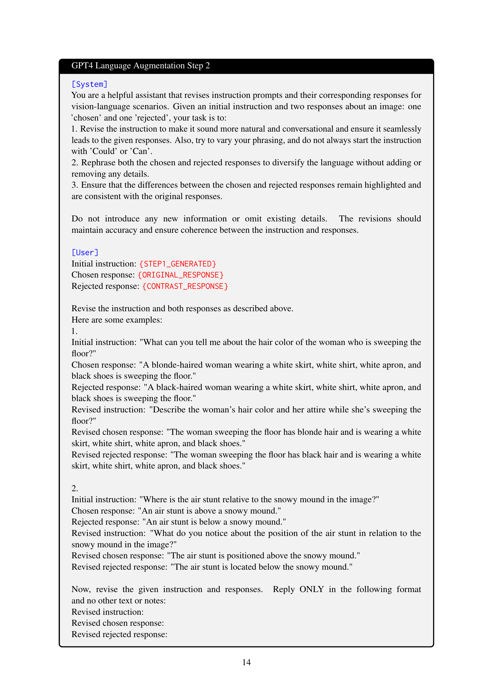

 


 2502.13928 
 Shengguang Wu et el. 
 
 🤗 2025-02-21 
 



↗ arXiv


↗ Hugging Face


↗ Papers with Code


### TL;DR



기존의 대규모 시각 언어 모델(VLMs)은 언어 모델에 과도하게 의존하여 시각적 내용을 간과하고, 시각적 근거가 부족한 작업에서 오류나 환각을 발생시키는 문제가 있습니다. 이는 시각적 세부 정보를 정확하게 반영하는 텍스트 생성에 대한 명시적인 훈련이 부족하기 때문입니다.

본 논문에서는 이러한 문제를 해결하기 위해 새로운 미세 조정 목표인 S-VCO(대칭적 시각적 대조 최적화)를 제시합니다.  S-VCO는 모델이 중요한 시각적 세부 정보를 포착하고 해당 텍스트 토큰과 정렬하도록 유도합니다. 또한, 최소 시각적 대조(MVC)라는 새로운 이미지-텍스트 데이터셋을 도입하여 모델에 대한 어려운 대조 사례를 제공합니다. 실험 결과, 제시된 방법이 환각을 최대 22%까지 줄이고 시각 중심 및 일반 작업에서 성능을 크게 향상시킴을 보여줍니다.



#### Key Takeaways


 S-VCO는 VLM의 시각적 세부 사항에 대한 집중도를 높여 환각을 최대 22%까지 줄입니다. 



 MVC 데이터셋은 VLM을 더욱 까다로운 시각적 대조 사례로 훈련시켜 시각 중심 작업의 성능을 향상시킵니다. 



 S-VCO는 다양한 벤치마크에서 VLM의 전반적인 성능을 향상시키면서 모델의 일반적인 능력도 유지하거나 향상시킵니다. 


#### Why does it matter?
이 논문은 **시각 언어 모델(VLM)**의 성능 향상에 중요한 영향을 미칩니다. **S-VCO** 최적화 기법과 **MVC** 데이터셋은 시각적 세부 사항에 대한 VLM의 의존성을 높이고 환각을 줄이며 다양한 벤치마크에서 성능을 향상시킵니다. 이는 **시각적 지능** 연구에 새로운 가능성을 제시하고, 향후 연구를 위한 새로운 방향을 제시합니다.  특히 **시각적 의존성**이 높은 작업에 대한 성능 향상은 자율 주행, 의료 영상 분석 등 다양한 분야에 적용 가능성을 시사합니다.  이러한 발견들은 **다양한 시각적 작업에서 VLM의 신뢰성과 정확성**을 높이는 데 크게 기여할 것으로 기대됩니다.

------
#### Visual Insights

> 🔼 그림 1은 벤치마크의 테스트 능력 영역별로 기준 VLM에 대한 개선 사항을 그룹화하여 보여줍니다. 제안된 S-VCO는 거의 모든 영역에서 가장 큰 전반적인 개선을 제공하며, 특히 시각적 환각 감소에 있어 상당한 성과를 보입니다. 시각 중심 및 일반적인 기능 영역에서 S-VCO는 기준 VLM을 능가하는 상당한 성능 향상을 달성하며, DPO 및 mDPO를 포함한 기존의 기본 설정 조정 방법보다 우수한 성능을 보입니다. (5.2절에서 자세히 설명)
> 

> 
read the caption

> Figure 1: Improvement over the base-VLM grouped by the test ability domain of benchmarks. Our S-VCO delivers the most significant overall improvement across nearly all domains, with particularly strong gains in reducing visual hallucinations. In vision-centric and general capability domains, S-VCO also achieves considerable performance boosts over the base-VLM, outperforming existing preference tuning methods including DPO and mDPO (discussed in more detail in Section 5.2).
> 


 | Benchmarks | Hallucination | Vision-Centric | General | OCR | Knowledge | TOTAL |
|---|---|---|---|---|---|---|---|
| ModelsTrainSet | score | hal_rate↓ | acc. | acc. | acc. | score | score | acc. | acc. | avg_impr. |
|---|---|---|---|---|---|---|---|---|---|---|
| LV-1.5-7B | BASE | 2.16 | 57% | 59.3 | **56.0** | 35.3 | 30.46 | 61.2 | 46.4 | 66.78 | 0% |
| DPOVLF | 2.06 | 65% | 57.0 | 54.3 | 39.5 | 31.65 | 68.1 | **49.16** | 66.71 | +0.82% |
| DPOMVC | **2.45** | **53%** | **63.2** | 55.0 | 42.1 | **33.53** | 66.0 | **49.43** | 66.07 | +7.54% |
| mDPOVLF | 2.39 | 57% | 53.2 | 50.3 | **44.2** | 31.79 | 68.4 | 41.71 | 66.52 | +2.34% |
| mDPOMVC | 2.29 | 56% | 59.4 | **55.3** | 35.2 | 31.51 | 63.0 | 46.42 | 66.8 | +1.43% |
| S-VCOMVC | **2.75** | **46%** | **63.5** | **56.0** | 43.0 | **34.68** | **69.5** | **49.16** | **67.22** | **+12.17%** |
| LV-INT-7B | BASE | 2.74 | 46% | 67.6 | 69.0 | 57.5 | 41.01 | 74.5 | 58.62 | 74.77 | 0% |
| DPOVLF | 2.7 | 48% | 68.1 | 70.0 | 54.4 | 40.87 | 81.0 | 59.2 | **74.79** | -0.11% |
| DPOMVC | 2.92 | **38%** | 68.8 | **71.3** | **57.9** | **41.51** | 83.5 | **59.76** | 73.8 | +4.70% |
| mDPOVLF | 2.97 | 42% | 68.0 | 69.0 | 54.8 | 40.46 | 79.3 | 58.97 | 74.53 | +1.88% |
| mDPOMVC | **3.04** | **38%** | 70.0 | 70.0 | 57.9 | 41.24 | 80.2 | 59.43 | 74.65 | +4.67% |
| S-VCOMVC | **3.28** | **35%** | **71.0** | **73.0** | **58.2** | **44.04** | **85.0** | **60.26** | 73.87 | **+8.59%** |
| S-VCOMVC-Raw | 3.10 | 35% | 71.3 | 71.3 | 58.8 | 40.55 | 86.5 | 59.22 | 73.87 | +6.83% |
| VCOMVC | 3.16 | 39% | 70.1 | 71.7 | 56.2 | 42.61 | 84.8 | 59.87 | 74.44 | +5.98% |
| SFTMVC×2 | 2.68 | 46% | 66.6 | 67.7 | 56.5 | 38.94 | 70.7 | 59.32 | 74.77 | -1.96% |

> 🔼 표 1은 두 가지 기본 VLM(Large Language Model)에 적용된 다양한 방법들의 성능을 나타낸 표입니다.  능력 영역별로 그룹화된 여러 벤치마크에서 테스트를 진행했습니다.  mDPO에서 사용된 VLFeedback(VLF) 데이터셋과 본 논문에서 제시하는 최소 시각적 대조 데이터셋(MVC)을 비교 분석했습니다. 마지막 열은 모든 지표에 대한 기본 VLM 대비 평균 향상률(%)을 보여줍니다.  가장 좋은 점수는 굵은 글씨체로, 두 번째로 좋은 점수는 밑줄이 그어져 있습니다.  S-VCO는 모든 영역에서 일관된 성능 향상을 보이며, 기본 VLM에 비해 가장 큰 향상을 보였습니다.  표의 마지막 세 행은 다음과 같은 ablation 연구 결과를 보여줍니다. 1) 필터링 및 증강되지 않은 시각적 반례 데이터(MVC-Raw)를 사용한 S-VCO, 2) 대칭 구조 없이 S-VCO(VCO, 3.1절), 3) MVC의 이미지-텍스트 쌍의 양쪽 모두를 사용하는 SFT(SFTMVC×2). 이러한 결과는 데이터 전처리(4.2절) 및 대칭 목적 함수(3.2절)의 중요성을 강조합니다.
> 

> 
read the caption

> Table 1: Performance of different methods applied to two base-VLMs, tested across benchmarks grouped by ability domains. VLF refers to VLFeedback used in mDPO; MVC is our minimal visual contrastive dataset; RQA and SQA represent RealworldQA and ScienceQA (Section 5.1). The last column shows the average percentage of improvement over the base-VLM across all metrics. Best scores are in boldface, second-best underlined. Our S-VCO demonstrates consistent improvement across domains, achieving the most significant enhancement over the base-VLMs overall. The last three rows present ablation results (Section 5.3): 1. S-VCO on unfiltered and unaugmented visual counterfactual data (MVC-Raw); 2. S-VCO without the symmetrical construct (VCO, Section 3.1); 3. SFT using both sides of image-text pairs from MVC (SFTMVC×2MVC2{}_{\text{MVC}\times 2}start_FLOATSUBSCRIPT MVC × 2 end_FLOATSUBSCRIPT). These results highlight the importance of our data preprocessing (Section 4.2) and the symmetrical objective (Section 3.2) for optimal performance.
> 

### In-depth insights

#### Visual Neglect in VLMs
본 논문은 **대규모 비전-언어 모델(VLMs)**에서 **시각 정보의 무시(Visual Neglect)** 현상에 대한 심층적인 분석을 제시합니다. VLMs는 언어 모델의 사전 정보에 과도하게 의존하여 시각적 내용을 충분히 고려하지 못하는 경향이 있습니다. 이는 시각적 근거가 필요한 작업에서 오류나 환각을 유발합니다.  **S-VCO(Symmetrical Visual Contrastive Optimization)**는 이러한 문제를 해결하기 위해 제안된 새로운 미세 조정 방법으로, **세밀한 시각적 세부 사항을 포착하고 해당 텍스트 토큰과 정렬**하도록 모델을 유도합니다.  **MVC(Minimal Visual Contrasts)** 데이터셋을 통해 모델은 미세한 시각적 차이를 구별하도록 학습됩니다.  결과적으로 S-VCO는 환각을 최대 22% 감소시키고 시각 중심 및 일반 작업에서 상당한 성능 향상을 가져옵니다. 특히 시각적 의존도가 높은 벤치마크에서 그 효과가 더욱 두드러집니다. 따라서 **S-VCO는 VLM의 시각적 성능을 크게 향상시키면서 일반적인 능력도 유지하거나 개선**하는 중요한 발전입니다.

#### S-VCO Optimization
S-VCO(Symmetrical Visual Contrastive Optimization)는 시각적 세부 정보와 텍스트 토큰 간의 정확한 대응 관계를 강화하는 새로운 미세 조정 목표를 제시합니다. **기존 VLM(Vision-Language Model)의 한계인 시각적 세부 정보 무시 및 과도한 언어 모델 의존 문제를 해결**하기 위해 고안되었습니다. S-VCO는 일치하는 이미지에 대한 보상과 상반되는 이미지에 대한 강력한 거부를 통해 모델이 중요한 시각적 세부 정보에 집중하고 정확한 텍스트를 생성하도록 유도합니다.  **대칭적 구조**를 통해 단순한 지름길 학습을 피하고, '부정적' 이미지도 해당 텍스트와 짝을 이룰 때 '긍정적'으로 간주하여 모델의 시각적 이해 능력을 향상시킵니다.  **MVC(Minimal Visual Contrast) 데이터셋**은 최소한의 시각적 차이를 가진 이미지-텍스트 쌍으로 구성되어, 모델이 세부적인 시각적 차이를 정확하게 구분하고 이해할 수 있도록 돕습니다. 이는 **기존의 단순한 이미지 손상 방식보다 세부적인 시각적 비교**를 제공하여 더욱 효과적입니다. 결론적으로 S-VCO는 VLM의 시각적 의존적인 작업 성능을 크게 향상시키면서 일반적인 능력도 유지하거나 개선하는 혁신적인 방법입니다.

#### MVC Dataset
본 논문에서 제시된 MVC 데이터셋은 **최소한의 시각적 대조(Minimal Visual Contrasts)**를 특징으로 하는 이미지-텍스트 쌍으로 구성되어 있습니다.  기존의 시각적 반박 데이터셋과 달리, MVC는 **미세하지만 의미있는 시각적 차이**를 보이는 이미지 쌍을 통해 VLM(Vision-Language Model)의 성능을 향상시키는 데 초점을 맞추고 있습니다.  이는 단순한 이미지 변형(예: 자르기, 노이즈 추가)이 아닌, **의미있는 시각적 차이를 유발하는 변형**을 통해 만들어졌다는 점에서 차별성을 가지며, VLM이 시각적 세부사항을 정확히 이해하고 텍스트와 연결하는 능력을 강화하는 데 효과적입니다.  **자동화된 필터링 및 증강 기법**을 통해 생성된 MVC 데이터셋은 다양한 시각적 대조 유형을 포함하며, 이는 VLM의 시각적 이해 능력 향상에 기여합니다.  **대조적인 텍스트 응답**과의 결합을 통해 VLM은 시각적 정보와 언어적 정보 간의 정확한 매핑을 학습하도록 유도됩니다. 따라서, MVC 데이터셋은 **VLM의 시각적 지각 능력 향상**에 중요한 역할을 수행하는 핵심 요소로 볼 수 있습니다.

#### Ablation Studies
본 논문의 ablation study는 **S-VCO의 주요 구성 요소인 대칭적 구조와 MVC 데이터셋의 효과를 면밀히 분석**합니다.  **대칭적 손실 함수의 제거는 특히 환각 감소와 시각 중심 과제에서 성능 저하를 야기**하며, 이는 대칭적 구조가 모델의 단순한 지름길 학습을 방지하고 시각적 세부 정보에 대한 집중도를 높이는 데 중요함을 시사합니다.  **MVC 데이터셋의 필터링 및 증강 과정 생략 시에도 성능 향상이 관찰**되지만, 정제된 데이터셋을 사용했을 때 더욱 뛰어난 성능을 보입니다. 따라서, **S-VCO의 성공은 대칭적 구조와 정교하게 구성된 데이터셋의 상호 작용**에 크게 의존하며, 이러한 요소들이 시각 언어 모델의 시각적 이해 능력 향상에 필수적임을 보여줍니다.  **추가적으로, 단일 모달 선호도 최적화 방식과의 비교를 통해 S-VCO의 우수성을 확인**하며, 이는 시각 정보와 언어 정보의 통합적 이해를 강조합니다.

#### Future Directions
본 논문에서 제시된 S-VCO 및 MVC는 시각 언어 모델의 성능 향상에 기여하지만, **여전히 개선의 여지가 존재**합니다.  미래 연구 방향으로는 다음 세 가지를 고려할 수 있습니다. 첫째, **더욱 다양하고 정교한 시각적 대조 데이터셋**을 구축하여 모델의 시각적 이해 능력을 더욱 향상시키는 것입니다. 현재 MVC는 특정 유형의 시각적 변화에만 집중하고 있어, 다양한 시각적 상황에 대한 모델의 일반화 능력을 제한할 수 있습니다. 둘째, **S-VCO의 손실 함수를 더욱 정교화**하는 것입니다.  현재 S-VCO는 여러 손실 항을 포함하고 있으며, 각 항의 가중치를 조정하는 것이 성능에 영향을 미칩니다.  **각 손실 항의 상호작용을 더욱 깊이 이해**하고 최적의 가중치를 자동으로 학습하는 방법을 연구할 필요가 있습니다. 셋째, **다양한 시각 언어 모델에 대한 S-VCO의 적용 가능성을 확장**하는 것입니다.  현재 연구는 특정 모델에 대해서만 실험되었으므로, 다른 모델에도 적용 가능하도록 일반화된 S-VCO 프레임워크를 개발하는 것이 중요합니다.  **모델의 크기와 구조에 따라 최적의 S-VCO 설정을 찾는 연구**도 필요합니다.

### More visual insights

More on figures

> 🔼 이 그림은 큰 비전-언어 모델(VLM)이 이미지 내용을 무시하고 언어 모델에 과도하게 의존하는 경향을 보여줍니다.  위쪽 부분은 일치하는 이미지, 상반되는 이미지, 이미지 없음의 세 가지 조건에서 텍스트 캡션을 생성할 때 VLM의 퍼플렉서티(PPL)를 비교합니다.  직관적으로는 이미지가 텍스트와 일치할 때 PPL이 가장 낮아야 하지만, 현재 VLM은 이미지가 없을 때 PPL이 가장 낮고, 일치하는 이미지가 있을 때 가장 높은 PPL을 보입니다. 아래쪽 부분은 CounterCurate 데이터셋에서 추출한 1,000개의 시각적 반례 쌍에 대해 이러한 반직관적인 패턴이 유지됨을 보여줍니다. 이는 VLM이 세부적인 이미지 정보를 무시하고 언어 모델 사전에만 의존한다는 것을 시사합니다.
> 

> 
read the caption

> Figure 2: Upper Part: A comparison of a VLM’s perplexity (PPL) for generating a text caption when the input is an image matching the text, an image contradicting the text, or no image input at all. Intuitively, the PPL should be lowest when the image matches the text. However, the current VLM exhibits the lowest PPL without any image input and the highest PPL given the matching image. Lower Part: This counterintuitive pattern holds across 1,00010001,0001 , 000 random examples with these visual counterfactual pairs extracted from CounterCurate dataset (Section 4.1).
> 

> 🔼 그림 3은 기존 연구에서 사용된 이미지 쌍 데이터(a)와 비교하여 최소한의 시각적 차이를 갖는 이미지 쌍 데이터(MVC, b)를 보여줍니다. MVC 이미지 쌍은 관련 텍스트에 근거하여 의미있는 시각적 세부 사항에서 차이가 있지만, 무작위 자르기나 노이즈 추가를 통해 원본 이미지를 손상시키면 언어 기반 선호도 데이터에서 직접 파생된 텍스트와 정렬되지 않은 이미지가 생성됩니다(a). 하단에는 기존 VLM 선호도 조정 방법인 DPO와 시각적 조건부 PO와 비교하여 S-VCO를 보여줍니다. 기존 방법들이 시각적 지도를 단일 모드 선호도로 취급하는 것과 달리, S-VCO는 이미지-텍스트 쌍의 대조를 전체적으로 고려합니다. S-VCO는 모델이 일치하는 이미지에 주의를 기울이고 모순되는 이미지를 거부하도록(3.1절) 보상하는 동시에 각 이미지-텍스트 쌍의 역할을 바꾸는 대칭 메커니즘을 사용하여 지름길 학습을 방지합니다(3.2절).
> 

> 
read the caption

> Figure 3: Upper Part: MVC of visual counterfactual images [b)] in comparison to the image pair data used in prior work [a)] (Section 4). MVC’s image pair differs in meaningful visual details that are also grounded in the associated texts [b)], while corrupting original images with random cropping or adding noise leads to images that are not aligned with the texts directly derived from language preference data [a)]. Lower Part: S-VCO in comparison to existing VLM preference tuning paradigms DPO and visual-conditional PO (Section 3). Unlike prior methods that treat visual supervision as uni-modal preferences, S-VCO considers the contrast of the image-text pair as a whole. It rewards the model for attending to matching images and rejecting contradictory ones (Section 3.1), while using a symmetrical mechanism to switch the role of each image-text pair, thus avoiding shortcut learning (Section 3.2).
> 

> 🔼 그림 4는 논문에서 제안하는 MVC(Minimal Visual Contrasts) 데이터셋의 개요를 보여줍니다. (a)는 Zhang et al. (2024)과 Liu et al. (2024c)의 연구에서 사용된 시각적 반례 이미지 유형들을 보여줍니다.  이미지 변형은 객체 교체, 속성 변경, 개수 수정, 위치 반전의 네 가지 유형으로 구성됩니다. (b)는 제안된 시각 중심 필터의 작동 방식을 설명합니다.  CLIP 유사도가 0.7보다 크고 DINOv2 유사도가 0.5보다 작은 이미지 쌍만을 선택하여 기존 VLM 모델에 도전적인 샘플을 선택하면서 의미 있는 시각적 차이를 유지합니다. (c)는 원래 캡션을 대화형 질문과 응답으로 다시 작성하여 명시적인 최소 시각적 대조를 유지하면서 VLM 미세 조정에 적합하도록 만드는 과정을 보여줍니다.
> 

> 
read the caption

> Figure 4: MVC dataset outline: a). Types of visual counterfactuals sourced from Zhang et al. (2024); Liu et al. (2024c); b). Our vision-centric filter that keeps only image pairs whose CLIP-similarity >0.7absent0.7>0.7> 0.7 to select hard samples for current VLMs, while ensuring meaningful visual differences with DINOv2-similarity <0.5absent0.5<0.5< 0.5; c). Rewriting captions into conversational queries and responses without changing the explicit minimal visual contrasts.
> 

> 🔼 그림 5는 MVC 데이터셋에서 DPO, mDPO 또는 S-VCO를 사용하여 미세 조정한 후 기본 VLM(LV-INT 또는 LV-1.5)과의 비교 결과를 보여주는 다양한 벤치마크에서 추출한 정성적 예시들을 보여줍니다. 시각 정보의 정확한 캡션이 강조 표시되어 있습니다. 제안된 S-VCO 방법은 섬세한 시각적 세부 사항(예: 칫솔의 부재 식별)을 더 잘 이해하고 시각적 환각 현상(예: 마커 그림, 소화전, 슬라이드폰 인식)에 대한 강력한 복원력을 보여줍니다. 또한 S-VCO는 더욱 고급 시각적 추론(예: 차선 상황 및 규정 해석, 물체 크기 및 거리 추정)에서 뛰어나며, 창문을 통해 날씨를 식별하고 저조도 환경에서 다가오는 차량을 인식하는 등 더욱 상세하고 깊이 있는 복잡한 장면을 포착합니다.
> 

> 
read the caption

> Figure 5: Qualitative examples extracted from various benchmarks comparing base-VLMs (LV-INT or LV-1.5) to the results after finetuning with DPO, mDPO or S-VCO on MVC dataset. Accurate captions of visual information are highlighted. Our method S-VCO demonstrates superior understanding of fine-grained visual details (e.g., identifying the absence of a toothbrush) and shows strong resilience to visual hallucinations (e.g., recognizing marker-drawings, fire hydrants, slide-phones). Furthermore, S-VCO excels in more advanced visual reasoning (e.g., interpreting drive-lane conditions & regulations, estimating object sizes & distances), and captures complex scenes with greater detailedness and depth (e.g., identifying weather through the window, recognizing oncoming vehicles in low-light settings).
> 

> 🔼 그림 6은 시각적 의존도가 점점 높아지는 벤치마크에서 기준 VLM에 대한 성능 향상 추세를 보여줍니다. 측정항목의 시각적 의존도는 이미지 입력이 없을 때 기준 VLM의 성능 저하로 측정됩니다. S-VCO는 작업의 시각적 의존도가 증가함에 따라 가장 큰 성능 향상 추세를 보여주며, 이는 3절에서 설명한 S-VCO의 목표 설계가 모델의 중요한 시각적 세부 사항에 대한 집중도를 높인다는 것을 강조합니다. MVC 데이터셋은 기존의 선호도 조정 방법(DPO 및 mDPO)을 강화하지만, 5.3절에서 설명한 SFT는 시각적 요구 사항이 많은 벤치마크에서 성능이 저하됩니다.
> 

> 
read the caption

> Figure 6: Trend of improvement over the base-VLM as benchmarks become increasingly visually dependent. A metric’s visual dependency is measured as the performance drop of the base-VLM when no image input is provided. S-VCO exhibits the most significant trend of improvements with increasing task visual dependency, highlighting how its objective design (Section 3) enhances model’s focus on critical visual details. MVC dataset also strengthens existing preference tuning methods (DPO and mDPO), while SFT (Section 5.3) degrades performance on more visually demanding benchmarks.
> 

### Full paper



