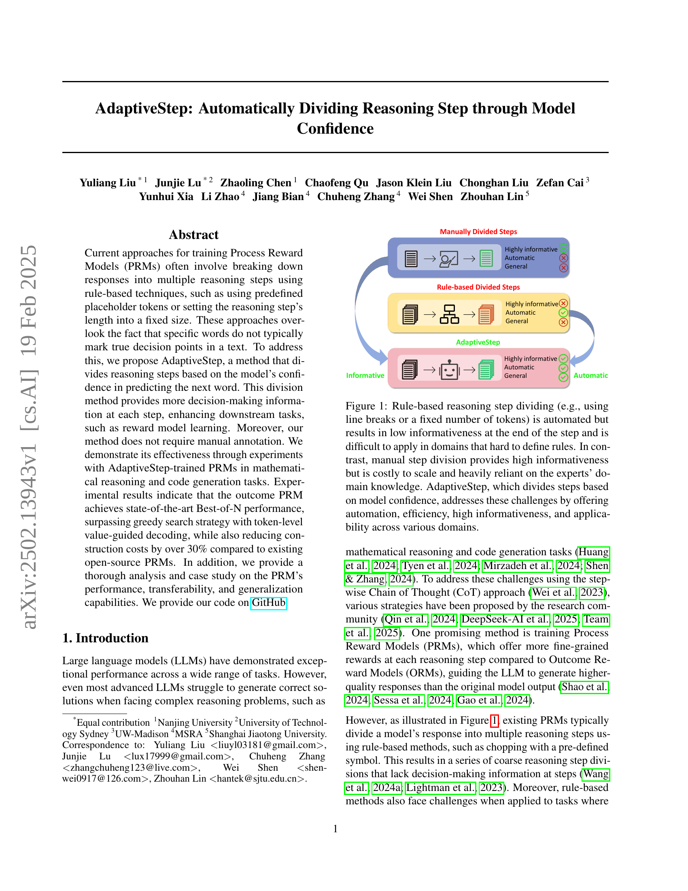
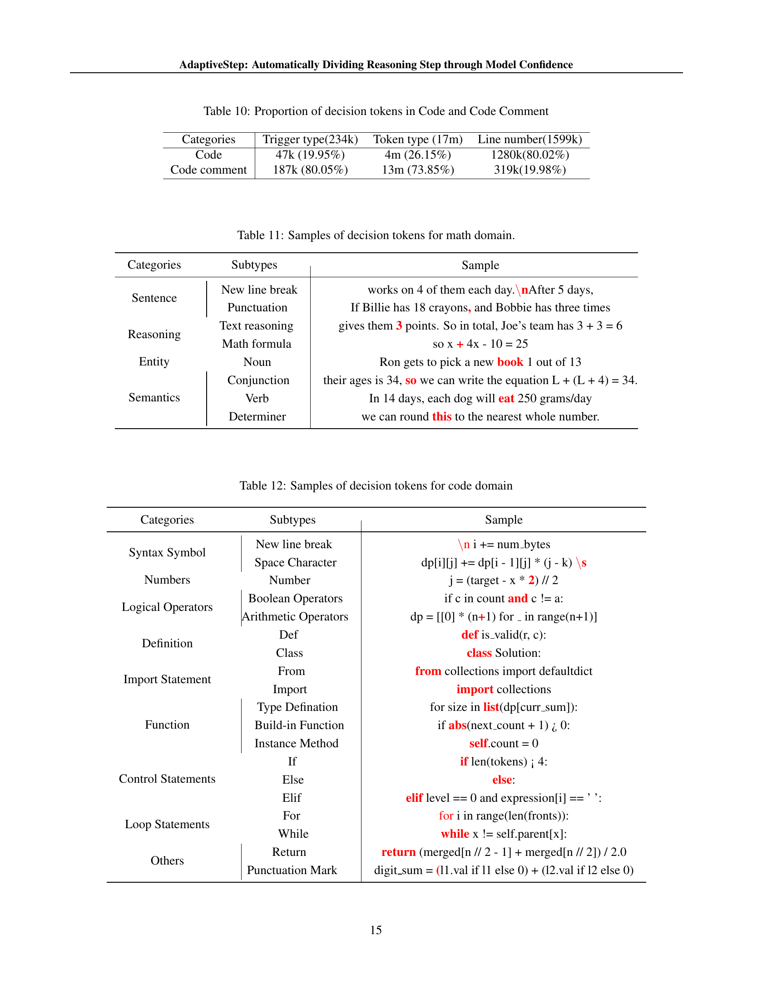

 


 2502.13943 
 Yuliang Liu et el. 
 
 🤗 2025-02-20 
 



↗ arXiv


↗ Hugging Face


↗ Papers with Code


### TL;DR



현재의 프로세스 보상 모델(PRM)은 규칙 기반 방법을 사용하여 응답을 여러 추론 단계로 나누는데, 이는 특정 단어가 실제로 추론의 결정점을 나타내는 것은 아니라는 점을 간과합니다. 또한, 이러한 규칙 기반 방법은 단계의 정보량이 부족하고, 규칙을 정의하기 어려운 영역에는 적용하기 어렵습니다.  더 나아가, 수동으로 단계를 나누는 것은 비용이 많이 들고 전문가의 지식에 크게 의존합니다.

본 논문에서는 모델의 다음 단어 예측에 대한 신뢰도를 기반으로 추론 단계를 나누는 새로운 방법인 AdaptiveStep을 제안합니다.  AdaptiveStep은 각 단계에서 더 많은 의사결정 정보를 제공하여, 보상 모델 학습과 같은 다운스트림 작업을 향상시킵니다. 또한, 수동 주석이 필요하지 않다는 장점이 있습니다.  실험 결과, AdaptiveStep으로 학습된 PRM은 수학적 추론과 코드 생성 작업에서 최첨단 성능을 달성하고, 기존 오픈소스 PRM에 비해 구축 비용을 30% 이상 절감하는 것으로 나타났습니다.



#### Key Takeaways


 모델의 신뢰도를 사용하여 추론 단계를 자동으로 분할하는 AdaptiveStep 기법 제시 



 수학적 추론 및 코드 생성 작업에서 기존 방법 대비 최첨단 성능 달성 



 GitHub에 코드 및 데이터셋 공개하여 후속 연구 지원 


#### Why does it matter?
본 논문은 **모델의 신뢰도를 기반으로 추론 단계를 자동으로 나누는 새로운 방법인 AdaptiveStep**을 제시하여 기존의 규칙 기반 방법의 한계를 극복하고, 수학적 추론 및 코드 생성 작업에서 **최첨단 성능**을 달성함으로써, **LLM의 추론 능력 향상**에 크게 기여합니다.  또한, 공개된 코드와 데이터셋은 후속 연구에 중요한 기여를 할 것입니다. 이는 현재 **LLM의 추론 성능 개선**이라는 중요한 연구 트렌드와 밀접하게 관련되어 있으며, 향후 **더욱 정교하고 효율적인 추론 모델 개발**의 새로운 방향을 제시합니다.

------
#### Visual Insights

> 🔼 그림 1은 추론 단계를 나누는 세 가지 방법을 보여줍니다. 첫 번째는 줄 바꿈이나 고정된 토큰 수를 사용하는 규칙 기반 방법입니다. 이 방법은 자동화되어 있지만 단계의 끝 부분에서 정보가 부족하고 규칙을 정의하기 어려운 도메인에는 적용하기 어렵습니다. 두 번째는 전문가의 도메인 지식에 크게 의존하는 수동 분할 방법입니다. 이 방법은 정보가 풍부하지만 확장성이 낮고 비용이 많이 듭니다. 세 번째 방법인 AdaptiveStep은 모델의 신뢰도를 기반으로 단계를 나눕니다. 이 방법은 자동화, 효율성, 높은 정보성, 다양한 도메인에 대한 적용성을 제공하여 위의 두 가지 문제점을 해결합니다.
> 

> 
read the caption

> Figure 1: Rule-based reasoning step dividing (e.g., using line breaks or a fixed number of tokens) is automated but results in low informativeness at the end of the step and is difficult to apply in domains that hard to define rules. In contrast, manual step division provides high informativeness but is costly to scale and heavily reliant on the experts’ domain knowledge. AdaptiveStep, which divides steps based on model confidence, addresses these challenges by offering automation, efficiency, high informativeness, and applicability across various domains.
> 


| Dataset | Inference Model | A/P@1 | Math-Shepherd | ER-PRM | ASPRM-L / -M | ASPRM-D |
|---|---|---|---|---|---|---|
| **GSM8k** | MetaMath-M | 77.10 | 75.66↓ | 75.13↓ | **79.53**↑ / 77.33↑ | / |
|  | MetaMath-L | 81.80 | 81.73↓ | 81.58↓ | **83.47**↑ / 82.56↑ | / |
| **MATH500** | MetaMath-M | 25.00 | 27.60↑ | 27.80↑ | **28.60**↑ / 26.80↑ | / |
|  | MetaMath-L | 38.80 | 41.00↑ | 38.60↓ | **42.00**↑ / 41.20↑ | / |
| **LeetCodeDataset** | LCD-DS | 26.28 | / | / | / | 28.00↑ |
| **LiveCodeBench** | LCD-DS | 19.21 | / | / | / | 19.92↑ |

> 🔼 표 1은 토큰 수준의 값 안내 디코딩 결과를 보여줍니다. A/P@1은 추론 모델의 탐욕적 검색 성능을 나타내며, 수학 문제의 경우 정확도@1을, 코드 문제의 경우 통과율@1을 지표로 사용합니다. ↑ 및 ↓는 A/P@1과 비교하여 성능 향상 또는 저하를 나타냅니다.
> 

> 
read the caption

> Table 1: Token-level Value-guided Decoding results. A/P@1 refers to the inference model’s greedy search performance, we use Accuracy@1 for math tasks, and Pass@1 for code tasks as the metrics. ↑ and ↓ represent the performance improvement or decline compared to A/P@1.
> 

### In-depth insights

#### AdaptiveStep's Core
AdaptiveStep의 핵심은 **모델의 다음 단어 예측에 대한 신뢰도를 기반으로 추론 단계를 나누는 것**입니다. 기존의 규칙 기반 방법과 달리, AdaptiveStep은 단어 자체가 아닌 모델의 불확실성을 분석하여 진정한 의사결정 지점을 파악합니다. 이는 각 단계에서 더욱 풍부한 의사결정 정보를 제공하여 보상 모델 학습과 같은 다운스트림 작업을 향상시키는 데 기여합니다.  **수동 주석이 필요 없다는 점**도 큰 장점이며, 다양한 분야에 적용 가능한 자동화된 방법론임을 시사합니다.  **모델 신뢰도 기반의 단계 분할은 효율성과 일반성을 높여주고**,  수동 분할의 높은 비용과 규칙 기반 방법의 정보 부족 문제를 동시에 해결합니다.  결과적으로 AdaptiveStep은 **최첨단 성능의 PRM을 구축**하는 데 기여하며,  기존 방식보다 훨씬 적은 비용으로 우수한 성능을 달성합니다.

#### PRM Training
본 논문에서 제시된 'PRM Training' 부분은 **프로세스 보상 모델(PRM)**을 학습시키는 과정에 대한 심도있는 설명을 제공합니다.  이는 단순히 보상을 부여하는 것을 넘어, **각 추론 단계의 중요도를 정확하게 평가**하고 이를 모델 학습에 반영하는 방법에 초점을 맞춥니다.  **AdaptiveStep 기법**을 통해 모델의 예측 신뢰도에 기반하여 추론 단계를 자동으로 분할함으로써, 기존의 규칙 기반 방법의 한계를 극복합니다.  **단계별 보상(reward)**은 롤아웃(rollout) 기법을 통해 추정되며, 이는 각 단계에서 시작하여 여러 번의 시뮬레이션을 수행하여 성공 확률을 평가하는 방식입니다.  **학습 과정**에서는 추론 단계의 보상 예측값과 실제 보상값 사이의 차이를 최소화하도록 PRM을 학습시키며, 이를 위해 적절한 손실 함수(loss function)가 사용됩니다.  **토큰 수준의 가치 유도 디코딩(TVD)**은 학습된 PRM을 활용하여 모델의 예측 신뢰도가 낮은 지점에서 최적의 토큰을 선택하도록 유도하는 기술로, **모델 성능 향상**에 기여합니다.  **효율적인 데이터 구성** 및 **일반화 성능** 향상을 위한 다양한 실험 결과 또한 제시되어 있습니다.  이는 PRM 학습의 전 과정을 보다 정확하고 효율적으로 수행하는 방법론을 제시함으로써, **복잡한 추론 과제**에서 LLM의 성능을 향상시키는 데 중요한 역할을 합니다.

#### BoN Evaluation
본 논문에서 제시된 'BoN Evaluation'은 **Best-of-N 방식**을 활용한 성능 평가 전략을 의미합니다. 이는 모델이 생성한 여러 응답 후보군 중 상위 N개를 선택하여 정답률을 측정하는 방식으로, 단순히 최고의 응답만 고려하는 것보다 **더욱 견고하고 신뢰할 수 있는 평가 지표**를 제공합니다. 특히, 확률적 요소가 있는 언어 모델의 경우, 여러 번의 시도를 통해 최적의 결과를 얻을 확률을 높일 수 있습니다.  **BoN 평가는 모델의 안정성과 견고성을 평가**하는 데 효과적이며, 단일 응답에 의존하는 기존의 평가 방식의 한계를 극복하는 데 기여합니다. 또한, BoN 평가를 통해 **다양한 하이퍼파라미터 조합이나 샘플링 전략** 등의 영향을 효과적으로 비교 분석할 수 있으며, 이는 모델 개선과 최적화에 중요한 정보를 제공합니다.  결론적으로, **BoN Evaluation은 언어 모델의 성능을 더욱 포괄적이고 정확하게 평가**하기 위한 유용한 방법론으로 볼 수 있습니다.

#### Transferability
본 논문에서 제시된 어댑티브스텝(AdaptiveStep) 방법론의 전이성(Transferability)에 대한 심층적인 논의는 **다양한 모델과 데이터셋에 대한 실험 결과**를 통해 이루어집니다.  특히, 수학적 추론과 코드 생성이라는 **서로 다른 영역**에서의 성능을 비교 분석하여, **방법론의 일반화 능력**을 평가합니다.  **메타매스-미스트랄(MetaMath-Mistral)과 메타매스-라마(MetaMath-Llama)**와 같은 서로 다른 기반 모델을 사용한 실험을 통해, **데이터 생성 방식의 영향**과 **모델의 전이 학습 성능**을 분석합니다.  이러한 다양한 실험 결과들을 종합적으로 분석하여 **어댑티브스텝의 우수한 전이성**을 보여줍니다.  이는 **다양한 도메인에 적용 가능한 범용성**을 시사하며, 이는 기존의 규칙 기반 방법론과 차별화되는 주요 강점으로 해석될 수 있습니다.  **ASPRM(AdaptiveStep Process Reward Model)** 의 전이성 분석은 단순한 성능 비교를 넘어, **모델의 내부 동작 원리를 이해**하고 **개선 방향을 제시**하는 데 중요한 역할을 합니다.  이는 **실용적인 측면**에서 **효율적인 자원 사용**을 가능하게 하고, **다양한 응용 분야**로의 확장성을 높여줍니다.

#### Generalization
본 논문에서 "일반화"에 대한 논의는 모델의 **도메인 내 및 도메인 간 일반화 능력**을 평가하는 실험 결과와 분석으로 이루어집니다.  **다양한 데이터셋 (GSM8k, MATH500, LeetCode)**에서의 성능 비교를 통해, 제안된 AdaptiveStep 방법이 특정 데이터셋에 과적합되지 않고 다양한 문제 유형에 적용 가능함을 보여줍니다.  **특히,  혼합된 데이터셋으로 훈련된 모델의 성능 향상**은 도메인 간 일반화 능력을 강화하는 효과를 시사합니다.  **토큰 수준의 가치 유도 디코딩(TVD) 전략**의 효과적인 활용 또한 일반화 능력 향상에 기여하는 요인으로 제시됩니다.  하지만, 일부 경우에는 **특정 데이터셋에 대한 의존성**이 나타나기도 하는데, 이는 훈련 데이터의 생성 방식과 모델의 특성이 복합적으로 작용한 결과로 해석될 수 있습니다.  **추가적인 분석을 통해 모델의 일반화 성능을 더욱 향상시킬 수 있는 방향**을 제시하고,  **향후 연구를 위한 방향**을 제시하는 것이 필요합니다.

### More visual insights

More on figures

> 🔼 그림 2는 AdaptiveStep 기반의 프로세스 보상 모델 (ASPRM) 학습 데이터 생성 과정과 기존의 규칙 기반 방법과 AdaptiveStep 방법의 차이점을 보여줍니다. (a)는 ASPRM 학습 데이터 생성 파이프라인을 나타냅니다. 1단계에서는 주어진 도메인의 데이터셋에서 샘플을 추출하고, 모델의 예측 신뢰도 점수와 샘플을 수집합니다. 그런 다음 모든 샘플의 신뢰도 분포를 축적하여 임계값을 결정합니다. 2단계에서는 이 임계값을 기반으로 추론 단계를 나누고, rollout을 사용하여 단계에 레이블을 지정합니다. (b)는 규칙 기반 방법과 AdaptiveStep 방법의 차이점을 보여줍니다. 규칙 기반 방법은 미리 정의된 심볼이나 고정된 토큰 수(예: 줄 바꿈)를 사용하여 추론 과정을 나누는 반면, AdaptiveStep은 모델의 신뢰도를 기반으로 추론 단계를 나눕니다. 그림에서 볼 수 있듯이, 모델은 수학적 표현식 내부, 명사 선택 및 최종 답변을 결정할 때와 같이 주요 의사 결정 지점에서 추론 단계를 나누는 경향이 있습니다. 반면에 줄 바꿈 지점에서의 신뢰도는 특히 높은 것을 확인할 수 있습니다.
> 

> 
read the caption

> Figure 2: Method overview. a) ASPRM  Training Data Construction Pipeline. Step 1: Sample from the dataset of a given domain, collecting confidence scores and samples for the training data. Then, accumulate the confidence distribution of all samples and determine the threshold. Step 2: Divide reasoning steps based on the threshold and label the steps using rollout. b) The difference between Rule-based method and AdaptiveStep division. The Rule-based method divides the reasoning process using predefined symbols or fixed token counts (e.g., line breaks, as shown in the figure), while AdaptiveStep divides reasoning steps based on model confidence. We observe that the model tends to divide reasoning steps at key decision points, such as within mathematical expressions, at noun selections, and when determining the final answer. In contrast, we find that the confidence at line breaks is particularly high.
> 

> 🔼 그림 3은 토큰 수준 가치 유도 디코딩(TVD)의 간단한 예시를 보여줍니다. 녹색 토큰은 선택된 토큰을, 회색 토큰은 선택되지 않은 토큰을 나타냅니다. 질문은 3 * (1 + 1) = ?이며 정답은 6입니다. 이 예시에서 모델은 1+1의 결과를 계산할 때 낮은 신뢰도(c_y < τ)를 보이며, 이후 어떤 숫자에 3을 곱할지 결정합니다. 따라서 PRM은 정답에 도달하기 위해 판단에 따라 최적의 토큰을 선택해야 합니다. 그림의 왼쪽 상단에 표시된 것처럼 각 토큰에 대해 가운데 상자는 토큰 자체를, 아래쪽 상자는 예측된 신뢰도를, 오른쪽 상자는 PRM 점수를 나타냅니다. 빨간색 신뢰도 점수는 상위 1개의 예측 후보의 신뢰도가 임계값보다 낮음을 나타냅니다.
> 

> 
read the caption

> Figure 3: We illustrate Token-level Value-guided Decoding (TVD) with a simple example. The green token denotes the selected tokens, while the gray token indicates the tokens that were not selected. The question is 3 * (1 + 1) = ?, and the correct output is 6. In this case, the model exhibits low confidence (where cy<τsubscript𝑐𝑦𝜏c_{y}<\tauitalic_c start_POSTSUBSCRIPT italic_y end_POSTSUBSCRIPT < italic_τ) when calculating the result of 1+1, and subsequently determines which number to multiply by 3. The PRM should select the best token based on its judgment to arrive at the correct final answer. As shown in the top-left corner, for each token, the middle box represents the token itself, the bottom box shows the predicted confidence, and the box on the right displays the PRM score. The red confidence score indicates that the confidence of the Top-1 predicted candidate is lower than the threshold.
> 

> 🔼 그림 4는 수학 추론 작업에 대한 BoN(Best-of-N) 결과를 보여줍니다. 네 가지 다른 설정에서 모든 PRM(Process Reward Model)을 평가했습니다. (a)는 MetaMath-Llama 모델이 생성한 GSM8k 후보 솔루션, (b)는 MetaMath-Mistral 모델이 생성한 GSM8k 후보 솔루션, (c)는 MetaMath-Llama 모델이 생성한 MATH500 후보 솔루션, 그리고 (d)는 MetaMath-Mistral 모델이 생성한 MATH500 후보 솔루션을 평가한 결과입니다. '-L'과 '-M' 접미사는 각각 Llama와 Mistral 기본 모델을 나타냅니다. 다른 연구에서 공개된 결과를 바탕으로 평가 결과를 보고합니다.
> 

> 
read the caption

> Figure 4: BoN results for the math tasks. We evaluate all PRMs on: (a) MetaMath-Llama generated GSM8k candidate solutions; (b) MetaMath-Mistral generated GSM8k candidates; (c) MetaMath-Llama generated MATH500 candidates; and (d) MetaMath-Mistral generated MATH500 candidates. The ”-L” and ”-M” suffixes denote the base models (Llama and Mistral, respectively). We report the evaluation results based on the released versions of other works.
> 

> 🔼 그림 5는 코드 데이터셋에 대한 Best-of-N (BoN) 평가 결과를 보여줍니다.  (a)는 LCD-DS(LeetCode Dataset)에서 생성된 BoN 후보군을 사용하여 ASPRM-D와 Code-ORM(ORM-D)를 평가한 결과이고, (b)는 LCD-DS에서 생성된 LiveCodeBench BoN 후보군을 사용하여 평가한 결과입니다.  즉,  ASPRM-D(AdaptiveStep Process Reward Model)의 성능을 기존의 Code-ORM과 비교하여 LeetCodeDataset과 LiveCodeBench 두 가지 코드 데이터셋에서 평가한 결과를 시각적으로 나타낸 것입니다.  각 그래프는 BoN 값에 따른 성능을 보여줍니다.
> 

> 
read the caption

> Figure 5: BoN results for the code datasets, we test ASPRM-D   and a Code-ORM (ORM-D) on (a) LCD-DS generated LeetCodeDataset BoN candidates; (b) LCD-DS generated LiveCodeBench BoN candidates.
> 

> 🔼 그림 4는 수학적 추론 과제에 대한 BoN(Best-of-N) 결과를 보여줍니다.  (a)는 MetaMath-Llama 모델로 생성된 GSM8k 후보 솔루션, (b)는 MetaMath-Mistral 모델로 생성된 GSM8k 후보 솔루션, (c)는 MetaMath-Llama 모델로 생성된 MATH500 후보 솔루션, (d)는 MetaMath-Mistral 모델로 생성된 MATH500 후보 솔루션에 대한 각 PRM(Process Reward Model)의 성능을 보여줍니다.  '-L'과 '-M' 접미사는 기본 모델(Llama와 Mistral)을 나타냅니다. 다른 연구의 공개된 버전을 기반으로 평가 결과를 보고합니다.
> 

> 
read the caption

> (a)
> 

> 🔼 그림 4(b)는 수학 추론 작업에 대한 BoN(Best-of-N) 결과를 보여줍니다. MetaMath-Mistral이 생성한 GSM8k 후보 솔루션에 대한 모든 PRM(Process Reward Model)을 평가한 결과입니다.  '-L' 및 '-M' 접미사는 기본 모델(Llama 및 Mistral)을 나타냅니다. 다른 연구에서 공개된 버전을 기반으로 평가 결과를 보고합니다.  각 그래프는 다른 BoN 값(1, 4, 8, 16, 32, 64)에 대한 정확도를 보여줍니다.  이를 통해 다양한 PRM의 성능을 비교하고, 특히 AdaptiveStep 기반의 PRM인 ASPRM이 다른 방법에 비해 우수한 성능을 보이는지 확인할 수 있습니다.
> 

> 
read the caption

> (b)
> 

> 🔼 그림 4(c)는 메타매스-라마(MetaMath-Llama)가 생성한 MATH500 후보 솔루션에 대한 BoN(Best-of-N) 결과를 보여줍니다.  여러 개의 PRM(Process Reward Model)의 성능을 비교하여,  ASPRM(AdaptiveStep Process Reward Model)이 다른 방법들보다 우수한 성능을 보임을 나타냅니다.  각 PRM은 Llama와 Mistral 기반 모델로 구분되어 있으며,  다양한 BoN 값(1, 4, 8, 16, 32, 64)에 따른 정확도가 제시됩니다. 이를 통해 ASPRM의 우수성과 BoN 평가 방식의 유효성을 보여줍니다.
> 

> 
read the caption

> (c)
> 

> 🔼 그림 4(d)는 MATH500 데이터셋에 대한 MetaMath-Mistral 모델 기반의 다양한 PRM(Process Reward Model)들의 성능을 보여줍니다.  Best-of-N (BoN) 평가 방식을 사용하여,  각 PRM이 여러 후보 답변 중 최적의 답변을 선택하는 능력을 평가합니다.  그래프는 BoN 값(1, 4, 8, 16, 32, 64)에 따른 정확도를 나타내며, ASPRM(AdaptiveStep Process Reward Model)이 기존의 다른 오픈소스 PRM(Shepherd-MER-PRM-L, ASPRM-L, ASPRM-M)보다 우수한 성능을 보임을 시각적으로 보여줍니다.  즉, 더 많은 후보 답변을 고려할수록 ASPRM의 성능이 더욱 뛰어나다는 것을 의미합니다.
> 

> 
read the caption

> (d)
> 

> 🔼 그림 6은 논문에서 제시된 수학 데이터셋에 대한 통계 정보를 보여줍니다. Ours-M은 Mistral 모델로 생성된 데이터를, Ours-L은 Llama 모델로 생성된 데이터를 나타냅니다. ER-PRM, Math-Shepherd(M-S), PRM800K는 비교 대상 모델입니다. (a)는 평균 단계 수, (b)는 샘플 수, (c)는 추론 단계당 평균 토큰 수, (d)는 샘플 길이를 나타냅니다. Mistral 토크나이저를 사용하여 통계를 계산했습니다.  즉,  다양한 모델(Ours-M, Ours-L, ER-PRM, Math-Shepherd, PRM800K)을 사용하여 생성한 수학 데이터셋의 특징을 네 가지 측면(평균 추론 단계 수, 데이터셋의 샘플 수, 추론 단계당 토큰 수, 샘플의 평균 길이)에서 비교 분석한 그림입니다. Mistral 토크나이저를 사용하여 분석 결과를 도출했습니다.
> 

> 
read the caption

> Figure 6: Statistic Information of our math dataset, Ours-M represents data constructed by Mistral, and Ours-L represents data constructed by Llama. ER-PRM, Math-Shepherd (M-S), PRM800K. (a): Average step; (b): Sample number; (c): Average tokens per reasoning step; (d): Sample length. We use a Mistral tokenizer for statistics.
> 

> 🔼 그림 4는 수학적 추론 과제에 대한 BoN(Best-of-N) 결과를 보여줍니다.  (a)는 MetaMath-Llama 모델로 생성된 GSM8k 후보 솔루션에 대한 결과를 나타냅니다. 그림은 서로 다른 PRM(Process Reward Model) 방법(ASPRM, Shepherd-MER-PRM 등)을 사용하여 얻은 결과를 비교 분석하여, 제안된 ASPRM 모델의 성능 우수성을 보여줍니다.  각 그래프는 BoN 값(Best-of-N 값, N=1,4,8,16,32,64)에 따른 정확도를 나타내며, ASPRM 모델이 다른 모델보다 우수한 성능을 보임을 시각적으로 확인할 수 있습니다.
> 

> 
read the caption

> (a)
> 

More on tables


| Setup | Test Dataset | Bo64 / TVD |
|---|---|---|
| L to M | M-MATH500 | 34.20↓ / 27.60↑ |
|  | M-GSM8k | 83.40↓ / 77.94↑ |
|  | L-MATH500 | 41.80↓ / 41.40↑ |
|  | L-GSM8k | 87.87↓ / 82.49↓ |
> 🔼 표 2는 PRM 학습 데이터의 전이 학습 성능을 보여줍니다.  'L to M'은 메타매스-라마(MetaMath-Llama)로 생성된 PRM 학습 데이터를 사용하여 미스트랄(Mistral) 모델을 학습시킨 것을 의미합니다.  표는 미스트랄 기반 ASPRM-M 모델과 비교하여 성능 향상(↑) 또는 저하(↓)를 나타냅니다.  즉,  다른 모델(Llama)로 생성된 데이터를 사용하여 미스트랄 모델을 학습시켰을 때, 원래 미스트랄 모델로 생성된 데이터만 사용했을 때와 비교하여 성능이 어떻게 변화했는지 보여줍니다.
> 

> 
read the caption

> Table 2: Transferability of PRM training data: L to M indicates training Mistral using PRM training data generated by MetaMath-Llama. ↑ and ↓ denote performance improvement or decline compared to ASPRM-M.
> 


| Models | Scoring Setup | Bo64 |
|---|---|---|
|ASPRM-L | confidence | 90.45 |
|  | random | 90.22 |
|ASPRM-M | confidence | 85.82 |
|  | random | 86.96 |
|MS-M | hard | 86.50 |
|  | random | 86.20 |
|ER-PRM-L | hard | 88.70 |
|  | random | 87.71 |
> 🔼 표 3은 다양한 설정에서 평가한 PRM의 등급 위치 일반화 성능을 보여줍니다. '신뢰도' 설정에서는 신뢰도가 임계값 미만인 위치를 평가 지점으로 사용합니다. '임의' 설정에서는 5개의 임의 위치를 평가 지점으로 선택합니다. '강제' 설정에서는 줄 바꿈을 평가 지점으로 사용합니다.
> 

> 
read the caption

> Table 3: Rating position generalization. In the confidence setup, rating points are the positions where confidence falls below the threshold. In the random setup, rating points are selected at five random positions. In the hard setup, rating points are line breaks.
> 


| PRM Model | Base | Bo64 / TVD |
|---|---|---|
|ASPRM-L | 22.80 | 51.56 / 24.56 ↑ |
|ASPRM-M | 22.80 | 37.88 / 24.68 ↑ |
> 🔼 표 4는 모델의 도메인 내 일반화 능력을 보여줍니다. GSM-Symbolic p2 데이터셋에서 그리디 검색 방식과 비교하여 ASPRM 모델의 성능 향상을 보여주는 실험 결과를 나타냅니다.  ↑ 기호는 그리디 검색 방식에 비해 성능이 향상되었음을 의미합니다.  본 표는 다양한  Best-of-N (BoN) 설정에서 ASPRM이 그리디 검색 방식보다 우수한 성능을 보임을 보여줍니다.
> 

> 
read the caption

> Table 4: In-domain generalization ability. The experiments are conducted on the GSM-Symbolic p2 dataset. ↑ indicates the performance improvement compared to greedy search.
> 


| PRM Model | Target | Bo64 / TVD |
|---|---|---|
| ASPRM-L | Code-LCD | 34.29↑ / 28.00↑ |
| ASPRM-L | Code-LCB | 22.30↑ / 19.21- |
| ASPRM-D | Math-GSM8k | 75.13↓ / 75.28↓ |
| ASPRM-D | Math-MATH500 | 30.00↑ / 26.00↑ |
> 🔼 표 5는 PRM의 도메인 일반화 능력을 보여줍니다.  'Source'는 PRM이 학습된 원본 도메인과 해당 모델을 나타내고, 'Target'은 PRM이 평가된 대상 도메인과 해당 테스트 데이터를 나타냅니다.  '↑'는 표 1의 A/P@1 성능과 비교하여 성능이 향상되었음을, '↓'는 성능이 저하되었음을 의미합니다.  즉,  다양한 도메인에서 PRM의 성능을 비교 분석하여 일반화 능력을 평가한 표입니다.
> 

> 
read the caption

> Table 5: Cross-domain generalization ability of the PRMs: Source represents the source domain and the corresponding model. Target represents the target dataset domain and the corresponding test data. ↑ and ↓ indicate performance improvements or declines compared to the A/P@1 performance in Table 1.
> 


| Base Model | Train | Test | Bo64 / TVD |
|---|---|---|---| 
| Mistral | M+C | GSM8k | 86.35↑ / 77.79↑ |
|  | M+C | MATH500 | 35.40↑ / 29.00↑ |
| Deepseek | C+M | LCD | 37.71- / 28.00- |
|  | C+M | LCB | 24.96↓ / 20.33↑ |
> 🔼 표 6은 혼합된 학습 데이터셋으로 학습된 PRM의 테스트 결과를 보여줍니다. 베이스 모델이 Mistral인 경우, M+C 학습 데이터는 MetaMath-Mistral이 생성한 수학 데이터셋과 전체 코드 학습 데이터셋으로 구성됩니다. 베이스 모델이 Deepseek인 경우, C+M 학습 데이터는 전체 코드 데이터셋과 무작위로 샘플링된 동일한 양의 수학 학습 데이터를 포함합니다. ↑ 및 ↓는 원래 도메인의 학습 데이터로 학습된 PRM과 비교하여 성능 향상 또는 저하를 나타냅니다.
> 

> 
read the caption

> Table 6: The test results of the PRMs trained with a mixed training dataset. When the base model is Mistral, the M+C training data consists of the MetaMATH-Mistral generated math dataset and full code training dataset. When the base model is Deepseek, the C+M training data includes all of the code dataset and an equal amount of randomly sampled math training data. ↑ and ↓ represent the performance improvement or decline compared to the no mixed data trained PRMs in the origin domain of test data.
> 


| Categories | Subtypes | Token type proportion (78m) | decision token proportion (1517k) |
|---|---|---|---| 
| Natural Sentence | New line break | 3.85% | 2.70% |
|  | Punctuation | 26.92% | 4.61% |
| Reasoning | Symbolic Reasoning | 15.39% | 6.79% |
|  | Math Formula | 3.85% | 21.03% |
| Entity | Noun | 15.38% | 11.01% |
| Semantics | Conjunction | 20.51% | 29.00% |
|  | Verb | 6.41% | 5.34% |
|  | Determiner | 7.69% | 2.64% |
> 🔼 본 표는 MetaMath-Mistral 모델이 생성한 수학 데이터의 통계적 결과를 보여줍니다.  각 토큰 유형의 비율과 의사결정 토큰의 비율을 나타냅니다.  자연어 문장은 줄 바꿈이나 마침표, 물음표와 같은 구두점으로 구분된 텍스트를 의미합니다. 추론은 기호적 추론이나 수학 공식을 나타내며, 개체는 사과나 이름과 같은 명사를 나타내고, 의미론은 접속사, 동사, 관형사를 나타냅니다.  단어 단위 분할(Split Word)은 일부 포함되었는데, 이는 모델의 일반화 성능을 높이기 위해 의도적으로 유지된 것입니다.
> 

> 
read the caption

> Table 7: MetaMath-Mistral generated data statistic results: percentage of tokens types and percentage of decision tokens types for math domain. Natural Sentence stands for a piece of text separated by a New line break or Punctuation like Period and Question Mark. Reasoning represents symbolic reasoning or Math Formula; Entity represents Noun like apple or personal name; Semantics represents Conjunction, Verb and Determiner. We also find that there are few word level splits represented by Split Word; we retained these segmentation points to enhance the model’s generalization at these points during PRM training.
> 


| Categories | Subtypes | Position | Position | 
|---|---|---|---| 
|  |  | Token type proportion (81m) | decision token proportion (1413k) | 
| Natural Sentence | New line break | 2.47% | 6.69% | 
|  | Punctuation | 28.40% | 14.91% | 
| Reasoning | Symbolic Reasoning | 16.05% | 5.66% | 
|  | Math Formula | 3.7% | 20.24% | 
| Entity | Noun | 14.82% | 7.35% | 
| Semantics | Conjunction | 20.99% | 23.48% | 
|  | Verb | 6.17% | 5.24% | 
|  | Determiner | 7.4% | 2.99% | 
> 🔼 본 표는 MetaMath-Llama 모델로 생성된 수학 데이터셋에서 동일한 유형의 결정 토큰 비율을 보여줍니다.  각 범주(자연어 문장, 추론, 개체, 의미론)와 하위 유형(새 줄 바꿈, 구두점, 기호 추론, 수학 공식, 명사, 접속사, 동사, 관사 등)별로 토큰의 비율과 결정 토큰의 비율을 보여줍니다. 이는 AdaptiveStep 방법의 효율성과 정보성을 분석하는 데 사용됩니다.
> 

> 
read the caption

> Table 8: Proportion of decision tokens in the original data of the same type for math domain generated by MetaMath-Llama.
> 


| Categories | Subtypes | Position  | Position  |
|---|---|---|---| 
|  |  | Token type proportion (17m) |    decision token proportion (47k) | 
| Syntax Symbol | New line break | 6.99% | 11.79% | 
|  | Space Character | 77.58% | 1.60% | 
| Numbers | Number | 4.21% | 0.84% | 
| Logical Operators | Boolean Operators | 0.26% | 3.21% | 
|  | Arithmetic Operators | 2.04% | 3.54% | 
| Definition | Def / Class | 0.53% | 1.82% | 
| Import Statement | From / Import | 0.58% | 0.76% | 
| Function | Type Defination | 0.16% | 0.48% | 
|  | Build-in Function | 0.49% | 0.77% | 
|  | Instance Method | 0.09% | 0.26% | 
| Control Statements | If / Else / Elif | 0.64% | 3.51% | 
| Loop Statements | For / While | 0.62% | 1.73% | 
| Others | Return | 0.68% | 0.58% | 
|  | Punctuation Mark | 4.99% | 6.52% |
> 🔼 표 9는 코드 도메인에 대한 원본 데이터에서 동일한 유형의 결정 토큰 비율을 보여줍니다.  이 표는 각 코드 유형(예: 구문 기호, 숫자, 논리 연산자, 정의, 가져오기 문, 함수, 제어 문, 루프 문, 기타)에 대해 토큰의 비율과 결정 토큰의 비율을 보여줍니다. 이를 통해 코드 생성 과정에서 모델의 예측에 대한 확신이 낮은 부분(결정 지점)이 어떤 코드 유형에서 더 많이 발생하는지 확인할 수 있습니다. 이는 AdaptiveStep 방법이 코드에서 중요한 결정 지점을 효과적으로 식별하는 데 도움이 됨을 보여주는 중요한 분석 결과입니다.
> 

> 
read the caption

> Table 9: Proportion of decision tokens in the original data of the same type for code domain
> 


| Categories | Trigger type(234k) | Token type (17m) | Line number(1599k) |
|---|---|---|---|
| Code | 47k (19.95%) | 4m (26.15%) | 1280k(80.02%) |
| Code comment | 187k (80.05%) | 13m (73.85%) | 319k(19.98%) |
> 🔼 표 10은 코드와 코드 주석에서 결정 토큰의 비율을 보여줍니다. 코드와 코드 주석 내에서 결정 토큰의 비율을 세 가지 측면(트리거 유형, 토큰 유형, 줄 번호)으로 나누어 분석한 결과를 보여줍니다. 각 측면에서 코드와 코드 주석의 결정 토큰 비율을 비교하여 코드 주석이 코드보다 결정 토큰을 더 많이 포함하고 있음을 보여줍니다.
> 

> 
read the caption

> Table 10: Proportion of decision tokens in Code and Code Comment
> 


| Categories | Subtypes | Sample |
|---|---|---|
| Sentence | New line break | works on 4 of them each day.\nAfter 5 days, |
|  | Punctuation | If Billie has 18 crayons, and Bobbie has three times |
| Reasoning | Text reasoning | gives them 3 points. So in total, Joe’s team has 3 + 3 = 6 |
|  | Math formula | so x + 4x - 10 = 25 |
| Entity | Noun | Ron gets to pick a new book 1 out of 13 |
| Semantics | Conjunction | their ages is 34, so we can write the equation L + (L + 4) = 34. |
|  | Verb | In 14 days, each dog will eat 250 grams/day |
|  | Determiner | we can round this to the nearest whole number. |
> 🔼 표 11은 논문에서 제시된 수학적 추론 과정에서 모델의 신뢰도가 낮은 토큰 (decision token)의 예시들을 보여줍니다.  각 토큰 유형(새 줄, 구두점, 텍스트 추론, 수학 공식, 명사, 접속사, 동사, 관사)별로 모델이 어떤 부분에서 예측에 어려움을 겪는지, 즉 어떤 유형의 단어나 구문이 의사결정 지점으로 작용하는지를 보여주는 구체적인 예시들을 제시합니다. 이를 통해 AdaptiveStep 방법론이 모델의 신뢰도를 기반으로 추론 단계를 나누는 과정에서 어떤 종류의 정보에 중점을 두는지 이해하는 데 도움을 줍니다.
> 

> 
read the caption

> Table 11: Samples of decision tokens for math domain.
> 


| Categories | Subtypes | Sample |
|---|---|---|
| Syntax Symbol | New line break | \n i += num_bytes |
|  | Space Character | dp[i][j] += dp[i - 1][j] * (j - k) \s |
| Numbers | Number | j = (target - x * 2) // 2 |
| Logical Operators | Boolean Operators | if c in count and c != a: |
|  | Arithmetic Operators | dp = [[0] * (n+1) for _ in range(n+1)] |
| Definition | Def | def is_valid(r, c): |
|  | Class | class Solution: |
| Import Statement | From | from collections import defaultdict |
|  | Import | import collections |
| Function | Type Defination | for size in list(dp[curr_sum]): |
|  | Build-in Function | if abs(next_count + 1) ¿ 0: |
|  | Instance Method | self.count = 0 |
| Control Statements | If | if len(tokens) ¡ 4: |
|  | Else | else: |
|  | Elif | elif level == 0 and expression[i] == ’ ’: |
| Loop Statements | For | for i in range(len(fronts)): |
|  | While | while x != self.parent[x]: |
| Others | Return | return (merged[n // 2 - 1] + merged[n // 2]) / 2.0 |
|  | Punctuation Mark | digit_sum = (l1.val if l1 else 0) + (l2.val if l2 else 0) |
> 🔼 표 12는 논문에서 코드 영역에 대한 의사결정 토큰의 예시들을 보여줍니다.  각 범주(구문 기호, 숫자, 논리 연산자, 정의, import문, 함수, 제어문, 반복문, 기타)에 대해 여러 하위 유형의 코드 조각들이 예시로 제시되어 있으며, 이러한 코드 조각들이 모델의 예측 신뢰도가 낮은 지점, 즉 의사결정이 필요한 지점을 나타낸다는 것을 보여줍니다.  각 예시는 어떤 종류의 코드 구조 또는 구성 요소를 나타내는지, 그리고 이러한 코드가 모델이 어려움을 겪는 부분인 이유를 명확히 보여주는 것을 목표로 합니다.
> 

> 
read the caption

> Table 12: Samples of decision tokens for code domain
> 

### Full paper



