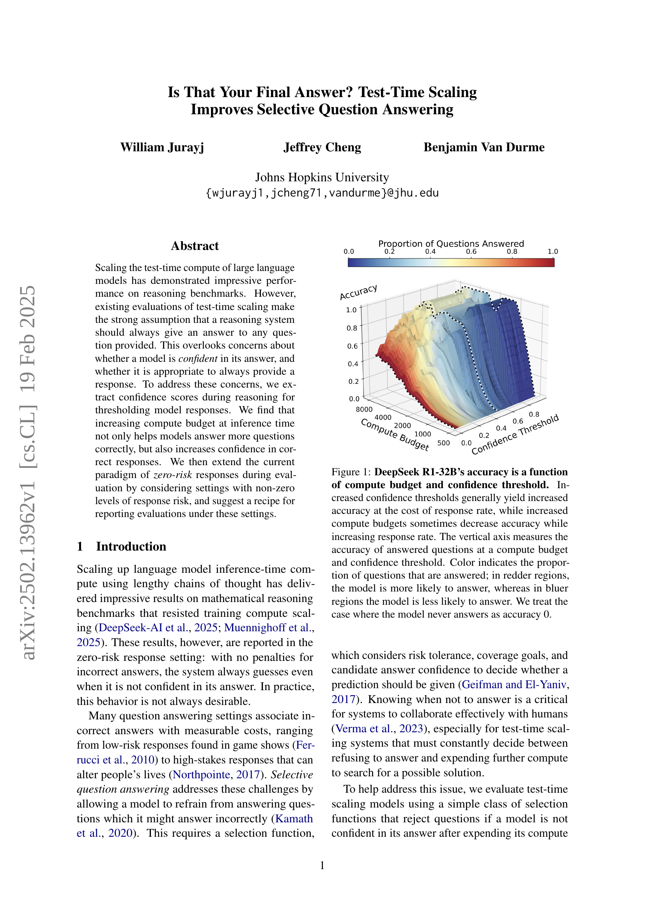
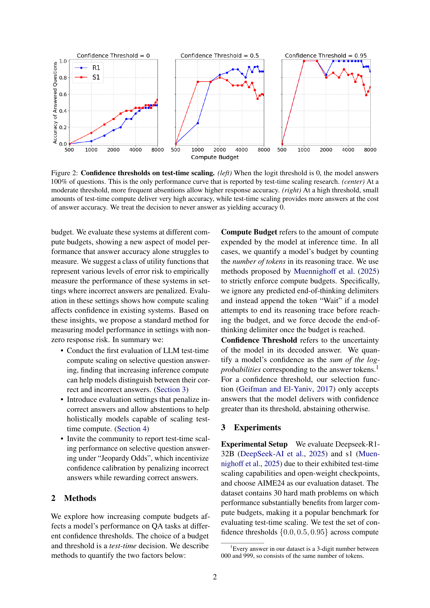
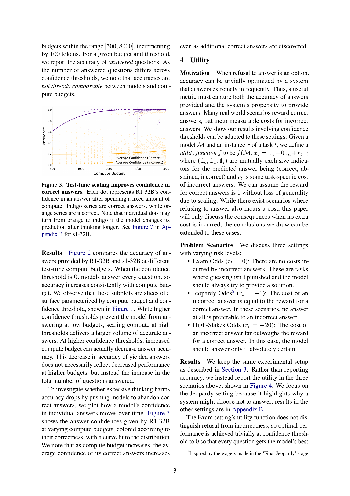
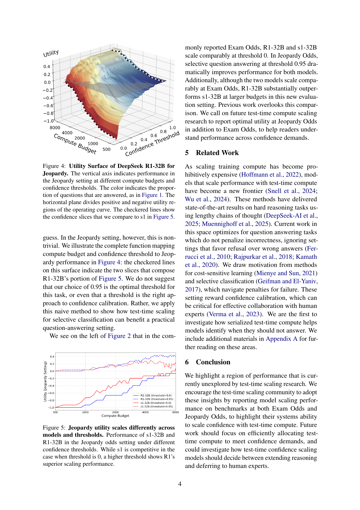
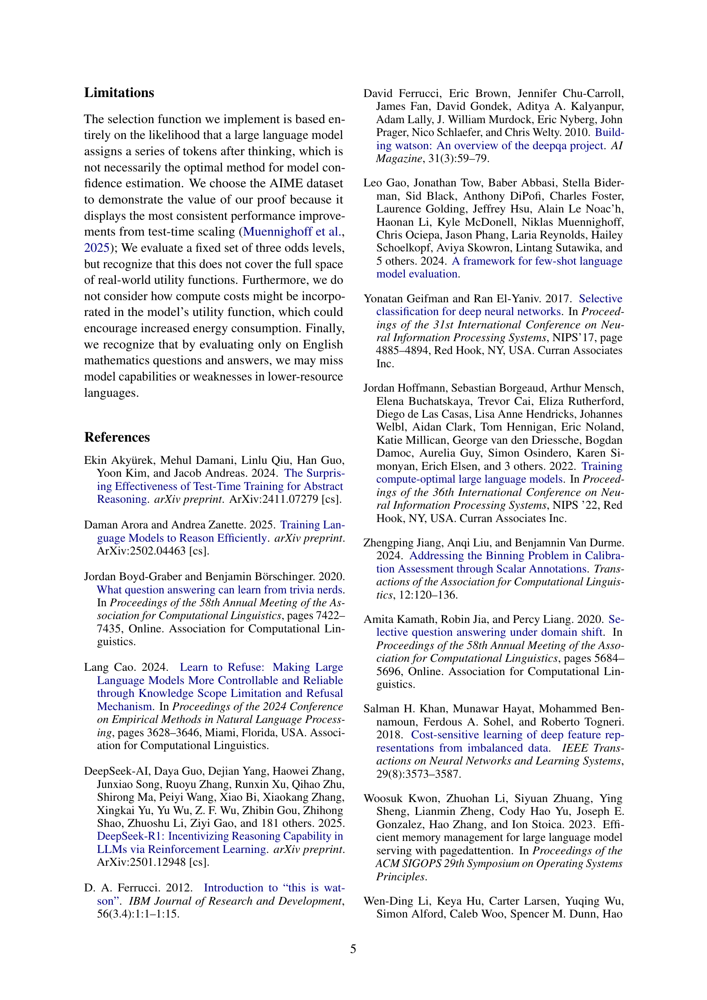
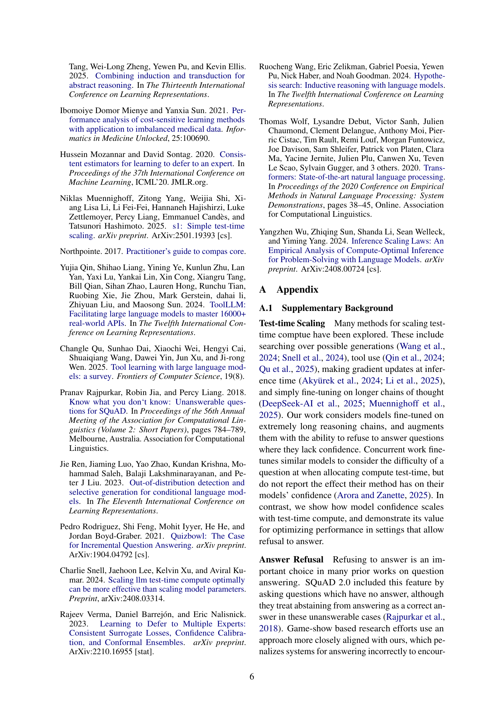
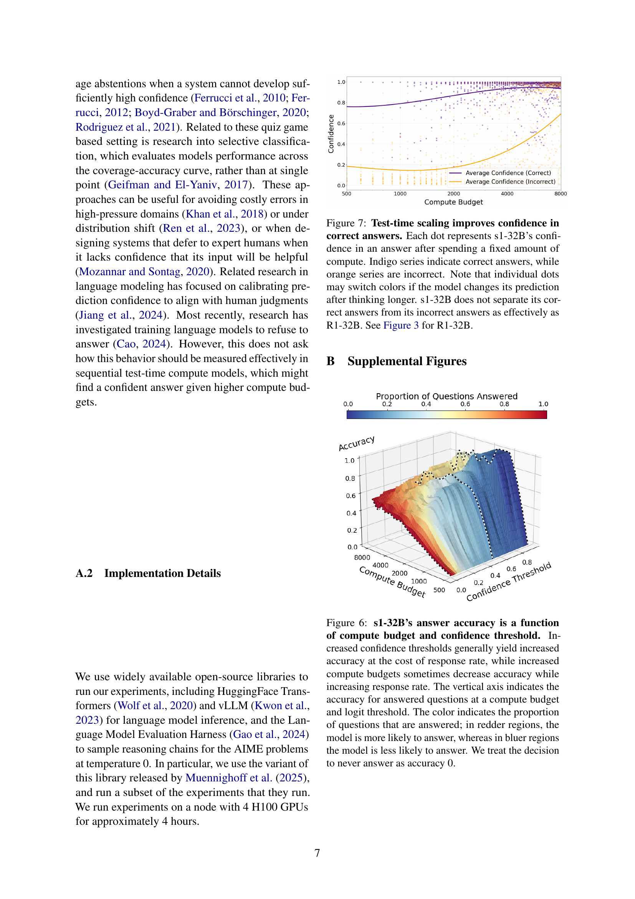
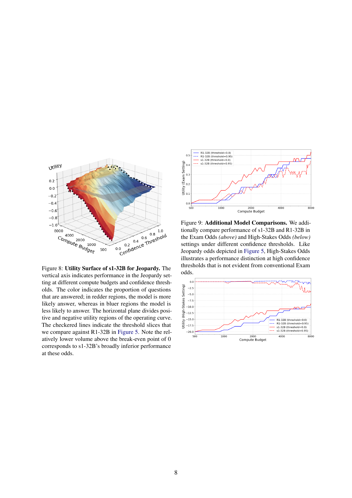

 


 2502.13962 
 William Jurayj et el. 
 
 🤗 2025-02-20 
 



↗ arXiv


↗ Hugging Face


↗ Papers with Code


### TL;DR



대규모 언어 모델(LLM)의 추론 성능을 높이기 위해 **테스트 시간 연산 확장** 기법이 주목받고 있지만, 기존 연구는 모델이 모든 질문에 답해야 한다는 가정을 전제로 합니다. 하지만 실제 응용에서는 모델의 자신감 수준을 고려하여 답변 여부를 결정하는 것이 중요합니다.  모델이 확신이 없는 질문에는 답하지 않고, 추가 연산을 통해 답을 찾는 선택적 질문 응답이 필요합니다.

본 연구는 **테스트 시간 연산 확장 기법**을 선택적 질문 응답에 적용하여, 추론 시간 연산량 증가가 모델의 정답률과 신뢰도를 높인다는 것을 실험적으로 입증했습니다.  또한, **오답에 대한 위험을 고려한 새로운 평가 방식**을 제안하고, 다양한 위험 수준에 따른 모델 성능을 평가했습니다.  이는 기존의 0-위험(zero-risk) 설정을 넘어, 실제 응용 환경에 더욱 적합한 평가 체계를 제시한 것입니다.



#### Key Takeaways


 테스트 시간 연산 확장을 통해 모델의 정답률 향상 및 정답에 대한 신뢰도 증가 



 오답에 대한 페널티를 고려한 새로운 평가 방식 제안 및 실험적 검증 



 선택적 질문 응답 모델의 성능 평가를 위한 표준화된 방법론 제시 


#### Why does it matter?
본 논문은 **테스트 시간 확장(test-time scaling)**이 선택적 질문 응답에 미치는 영향을 최초로 평가하여, 추론 시간 연산을 늘리면 모델이 정답과 오답을 구분하는 데 도움이 된다는 것을 밝혔습니다. 또한, **오답에 대한 패널티를 고려한 새로운 평가 설정**을 제시하여, 모델 성능을 측정하는 새로운 기준을 제시하고 있습니다. 이러한 연구는 **신뢰성 있고 효율적인 대규모 언어 모델 개발**에 중요한 시사점을 제공합니다.

------
#### Visual Insights

> 🔼 그림 1은 DeepSeek R1-32B 모델의 정확도가 연산 비용과 신뢰도 임계값의 함수임을 보여줍니다. 신뢰도 임계값이 증가하면 응답률 감소에도 불구하고 정확도가 일반적으로 향상됩니다. 반면에 연산 비용이 증가하면 정확도가 감소하는 경우도 있지만 응답률은 증가합니다. 세로축은 특정 연산 비용과 신뢰도 임계값에서 응답한 질문의 정확도를 나타냅니다. 색상은 응답한 질문의 비율을 나타내며, 빨간색 영역일수록 모델이 응답할 가능성이 높고, 파란색 영역일수록 응답할 가능성이 낮습니다. 모델이 전혀 응답하지 않는 경우 정확도는 0으로 처리합니다.
> 

> 
read the caption

> Figure 1: DeepSeek R1-32B’s accuracy is a function of compute budget and confidence threshold. Increased confidence thresholds generally yield increased accuracy at the cost of response rate, while increased compute budgets sometimes decrease accuracy while increasing response rate. The vertical axis measures the accuracy of answered questions at a compute budget and confidence threshold. Color indicates the proportion of questions that are answered; in redder regions, the model is more likely to answer, whereas in bluer regions the model is less likely to answer. We treat the case where the model never answers as accuracy 0.
> 

### In-depth insights

#### Test-Time Scaling QA
본 논문은 Test-Time Scaling을 질의응답(QA) 과제에 적용하는 심층적인 연구입니다. **기존의 접근 방식은 모델이 항상 모든 질문에 답변해야 한다는 강력한 가정을 전제**로 하지만, 본 연구는 모델의 자신감 수준을 고려하여 **필요에 따라 답변을 거부할 수 있는 선택적 QA 시스템**을 제시합니다. 추론 시점에서 신뢰도 점수를 추출하여 응답을 필터링함으로써, 정확도 향상과 함께 정확한 답변에 대한 자신감을 높이는 효과를 확인했습니다. 또한, **오답에 대한 페널티를 고려하여 위험 수준이 다른 다양한 시나리오를 평가**하고, 각 상황에 맞는 평가 지표를 제안합니다. 이를 통해, **기존의 제로-리스크 응답 설정을 넘어 비제로-리스크 환경에서 모델 성능을 평가하는 새로운 기준**을 제시하며, 실제 응용 환경에서의 모델 활용에 대한 중요한 시사점을 제공합니다.

#### Confidence Calibration
본 논문에서는 모델의 자신감 수준을 정확하게 반영하는 **신뢰도 보정(Confidence Calibration)**의 중요성을 강조합니다.  모델이 예측에 얼마나 확신하는지를 정확히 나타내는 것은, 특히 **잘못된 응답에 대한 비용이 큰 상황**에서는 매우 중요합니다.  **높은 신뢰도를 가진 정답은 높은 보상을, 낮은 신뢰도를 가진 오답은 큰 페널티를 부여하는 유틸리티 함수**를 통해 이를 명확히 제시합니다.  이는 단순히 정답률만을 평가하는 기존 방식에서 벗어나, **리스크 관리 및 의사결정**에 있어 모델의 신뢰도를 고려해야 함을 시사합니다.  더 나아가, **계산량 증가에 따른 신뢰도 변화**를 분석함으로써,  **계산 비용 증가가 신뢰도 향상에 기여**할 수 있음을 보여줍니다.  하지만,  **신뢰도 측정 방식 및 유틸리티 함수의 선택**에 따라 성능 평가 결과가 달라질 수 있으므로,  다양한 측정 방법과 유틸리티 함수를 고려한 **포괄적인 평가 방식**의 필요성을 제기합니다.

#### Selective QA Utility
선택적 질의응답(QA) 유틸리티는 **모델의 응답 정확도와 응답률 사이의 균형**을 평가하는 데 중점을 둡니다.  단순히 정확도만 높이는 것보다 **잘못된 응답에 대한 비용과 정답에 대한 보상을 고려**하여 실제 환경에서의 유용성을 측정합니다.  이러한 접근 방식은 시스템이 언제 질문에 답해야 하고 언제 답을 회피해야 하는지 결정하는 데 도움이 되어, **높은 위험을 수반하는 상황에서는 신중한 판단**을 가능하게 합니다.  **다양한 위험 수준(시험, 제퍼디, 고위험)**을 반영한 유틸리티 함수를 통해 다양한 상황에서의 성능을 평가할 수 있습니다.  **계산 비용과 신뢰도 임계값**을 조정하여 최적의 유틸리티를 달성하는 방법을 제시하며, 단순히 정답률만 높이는 기존의 평가 방식을 넘어, **실제 응용 환경에서의 효율성**을 고려한 새로운 평가 지표를 제시하는 것이 핵심입니다.

#### Risk-Aware Evaluation
본 논문은 기존의 질문응답 평가 방식의 한계를 극복하고자 **위험 감수를 고려한 새로운 평가 방식**을 제안합니다. 기존 방식은 모델이 모든 질문에 답변해야 한다는 강한 가정 하에 오류에 대한 패널티 없이 정답률만을 평가하는 반면, 제안하는 방식은 **오답에 따른 비용(risk)**을 고려하여 모델의 답변 전략(모든 질문에 답변할지, 아니면 자신 있는 질문에만 답변할지)을 평가합니다. 이는 **실제 응용 환경**에서 오답으로 인한 손실을 고려해야 하는 경우에 더욱 적합합니다. 또한, 모델의 **신뢰도(confidence)**를 활용하여 답변 여부를 결정하는 선택적 질문 응답 방식을 제시하며, 다양한 위험 수준(Exam Odds, Jeopardy Odds, High-Stakes Odds)에 따른 평가 지표를 제시하여 모델의 성능을 다각적으로 분석합니다. 이를 통해 **모델의 정확성뿐만 아니라 위험 관리 능력**까지 평가할 수 있는 보다 현실적인 평가 체계를 제시합니다.

#### Future Research
미래 연구 방향은 **테스트 시간 확장 모델의 신뢰도 보정 및 교정**에 집중되어야 합니다.  모델의 자신감 점수를 보다 정확하게 측정하고, 다양한 유틸리티 함수를 통해 **실제 문제 상황에 맞는 성능 평가 지표를 개발**하는 것이 중요합니다.  **다양한 유형의 질문과 응답**, 특히 저자원 언어에 대한 연구가 필요하며, **에너지 소비량을 고려한 효율적인 컴퓨팅 방법**을 연구하여 환경적인 측면까지 고려해야 합니다.  또한, 모델이 답변을 거부하는 결정 과정에 대한 **투명성을 높이는 연구**와 더불어, **인간과의 효과적인 협업**을 위한 방안을 모색하는 것이 미래 연구의 중요한 과제입니다.  **선택적 질문 답변 시스템의 최적화**를 위해서는 다양한 신뢰도 역치와 컴퓨팅 예산을 고려한 포괄적인 실험이 필수적이며,  이를 바탕으로 더욱 효과적인 **오류 관리 전략**이 개발되어야 합니다.

### More visual insights

More on figures

> 🔼 그림 2는 테스트 시간 확장에서의 신뢰도 임계값을 보여줍니다. (왼쪽) 로짓 임계값이 0일 때 모델은 질문의 100%에 답변합니다. 이것은 테스트 시간 확장 연구에서 보고된 유일한 성능 곡선입니다. (가운데) 중간 임계값에서는 더 빈번한 응답 거부가 더 높은 응답 정확도를 허용합니다. (오른쪽) 높은 임계값에서는 소량의 테스트 시간 컴퓨팅이 매우 높은 정확도를 제공하지만, 테스트 시간 확장은 응답 정확도의 비용으로 더 많은 답변을 제공합니다. 응답하지 않기로 하는 결정은 정확도 0으로 처리합니다.
> 

> 
read the caption

> Figure 2: Confidence thresholds on test-time scaling. (left) When the logit threshold is 0, the model answers 100% of questions. This is the only performance curve that is reported by test-time scaling research. (center) At a moderate threshold, more frequent absentions allow higher response accuracy. (right) At a high threshold, small amounts of test-time compute deliver very high accuracy, while test-time scaling provides more answers at the cost of answer accuracy. We treat the decision to never answer as yielding accuracy 0.
> 

> 🔼 그림 3은 모델이 계산 시간을 더 많이 사용할수록 정답에 대한 신뢰도가 높아짐을 보여줍니다. 각 점은 R1-32B 모델이 특정 계산량을 사용한 후 답변에 대해 가진 신뢰도를 나타냅니다. 보라색 점은 정답, 주황색 점은 오답을 나타냅니다. 모델이 더 오래 생각하면서 예측을 바꾸면 주황색 점이 보라색 점으로 바뀔 수 있습니다. s1-32B 모델에 대한 결과는 부록 B의 그림 7에 나와 있습니다.
> 

> 
read the caption

> Figure 3: Test-time scaling improves confidence in correct answers. Each dot represents R1 32B’s confidence in an answer after spending a fixed amount of compute. Indigo series are correct answers, while orange series are incorrect. Note that individual dots may turn from orange to indigo if the model changes its prediction after thinking longer. See Figure 7 in Appendix B for s1-32B.
> 

> 🔼 그림 4는 Jeopardy 설정에서 DeepSeek R1-32B 모델의 유틸리티 표면을 보여줍니다. 세로축은 다양한 컴퓨팅 예산과 신뢰도 임계값에서 Jeopardy 설정의 성능을 나타냅니다. 색상은 그림 1과 같이 질문에 대한 응답 비율을 나타냅니다. 수평면은 양수와 음수 유틸리티 영역을 구분합니다. 체크무늬 선은 그림 5의 s1 모델과 비교하기 위해 사용된 신뢰도 슬라이스를 보여줍니다. 즉, 이 그림은 계산 비용과 신뢰도 임계값에 따른 모델의 성능을 시각적으로 보여주는 3차원 그래프입니다. Jeopardy 설정에서 모델이 정답을 맞추면 1점을 얻고, 틀리면 -1점을 잃는 상황을 가정하여, 계산 비용을 늘리고 신뢰도 임계값을 높일수록 모델의 전반적인 성능(유틸리티)이 어떻게 변하는지 보여줍니다.
> 

> 
read the caption

> Figure 4: Utility Surface of DeepSeek R1-32B for Jeopardy. The vertical axis indicates performance in the Jeopardy setting at different compute budgets and confidence thresholds. The color indicates the proportion of questions that are answered, as in Figure 1. The horizontal plane divides positive and negative utility regions of the operating curve. The checkered lines show the confidence slices that we compare to s1 in Figure 5.
> 

> 🔼 그림 5는 Jeopardy 규칙(틀린 답에 대한 패널티가 있는 상황) 하에서, 신뢰도 임계값을 다르게 설정했을 때 s1-32B와 R1-32B 모델의 성능을 비교한 그래프입니다. 신뢰도 임계값이 0일 때는 두 모델의 성능이 비슷하지만, 신뢰도 임계값이 높아질수록 R1-32B 모델이 훨씬 더 나은 성능을 보여줍니다. 즉, R1-32B는 높은 신뢰도를 요구하는 상황에서 계산량을 늘리면 성능이 더 크게 향상되는 것을 보여줍니다.
> 

> 
read the caption

> Figure 5: Jeopardy utility scales differently across models and thresholds. Performance of s1-32B and R1-32B in the Jeopardy odds setting under different confidence thresholds. While s1 is competitive in the case when threshold is 0, a higher threshold shows R1’s superior scaling performance.
> 

> 🔼 그림 6은 s1-32B 모델의 답변 정확도가 계산 비용과 신뢰도 임계값에 따라 달라지는 것을 보여줍니다. 신뢰도 임계값이 증가하면 응답률은 감소하지만 정확도는 일반적으로 증가합니다. 반면에 계산 비용이 증가하면 정확도가 감소하는 경우도 있지만 응답률은 증가합니다. 세로축은 특정 계산 비용과 로그 임계값에서 응답한 질문의 정확도를 나타내고, 색상은 응답한 질문의 비율을 나타냅니다. 빨간색 영역은 모델이 응답할 가능성이 높은 영역이고, 파란색 영역은 응답할 가능성이 낮은 영역입니다. 모델이 전혀 응답하지 않는 경우 정확도는 0으로 처리합니다. 이 그림은 모델의 신뢰도와 응답률 간의 상호작용을 보여주는 시각적 자료로, 신뢰도 임계값과 계산 비용을 조절하여 모델 성능을 최적화하는 데 도움이 됩니다.
> 

> 
read the caption

> Figure 6: s1-32B’s answer accuracy is a function of compute budget and confidence threshold. Increased confidence thresholds generally yield increased accuracy at the cost of response rate, while increased compute budgets sometimes decrease accuracy while increasing response rate. The vertical axis indicates the accuracy for answered questions at a compute budget and logit threshold. The color indicates the proportion of questions that are answered; in redder regions, the model is more likely to answer, whereas in bluer regions the model is less likely to answer. We treat the decision to never answer as accuracy 0.
> 

> 🔼 그림 7은 테스트 시간 확장이 정답에 대한 신뢰도를 향상시키는 것을 보여줍니다. 각 점은 s1-32B 모델이 특정 연산량을 사용한 후 정답에 대해 가진 신뢰도를 나타냅니다. 남색 계열은 정답, 주황색 계열은 오답을 나타냅니다. 모델이 더 오래 생각한 후 예측을 바꾸면 개별 점의 색상이 바뀔 수 있습니다. s1-32B는 R1-32B만큼 정답과 오답을 효과적으로 구분하지 못합니다. R1-32B에 대한 자세한 내용은 그림 3을 참조하십시오.
> 

> 
read the caption

> Figure 7: Test-time scaling improves confidence in correct answers. Each dot represents s1-32B’s confidence in an answer after spending a fixed amount of compute. Indigo series indicate correct answers, while orange series are incorrect. Note that individual dots may switch colors if the model changes its prediction after thinking longer. s1-32B does not separate its correct answers from its incorrect answers as effectively as R1-32B. See Figure 3 for R1-32B.
> 

> 🔼 그림 8은 s1-32B 모델의 제퍼디 설정에서의 효용 함수 표면을 보여줍니다. 세로축은 다양한 연산 비용 및 신뢰도 임계값에서의 성능을 나타내며, 색상은 질문에 대한 응답 비율을 나타냅니다. 빨간색 영역은 모델이 응답할 가능성이 높음을, 파란색 영역은 응답할 가능성이 낮음을 나타냅니다. 수평선은 양의 효용 영역과 음의 효용 영역을 구분합니다. 체크무늬 선은 그림 5에서 R1-32B 모델과 비교하기 위해 사용된 임계값 슬라이스를 나타냅니다. 0 지점 이상의 상대적으로 낮은 부피는 s1-32B 모델의 이러한 조건에서의 성능이 전반적으로 열등함을 보여줍니다.
> 

> 
read the caption

> Figure 8: Utility Surface of s1-32B for Jeopardy. The vertical axis indicates performance in the Jeopardy setting at different compute budgets and confidence thresholds. The color indicates the proportion of questions that are answered; in redder regions, the model is more likely answer, whereas in bluer regions the model is less likely to answer. The horizontal plane divides positive and negative utility regions of the operating curve. The checkered lines indicate the threshold slices that we compare against R1-32B in Figure 5. Note the relatively lower volume above the break-even point of 0 corresponds to s1-32B’s broadly inferior performance at these odds.
> 

### Full paper



