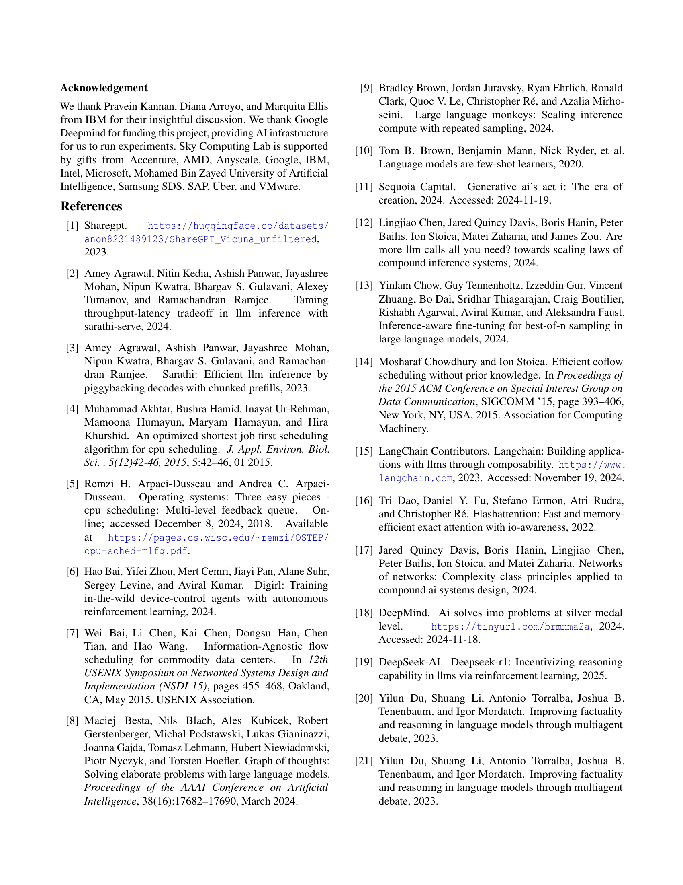
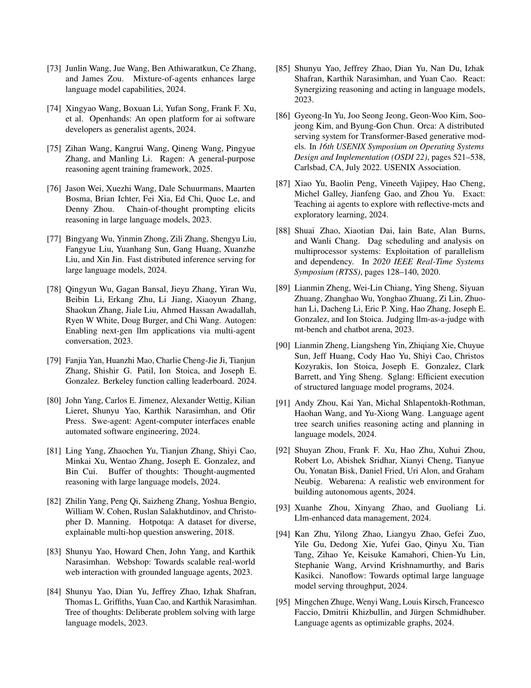

 


 2502.13965 
 Michael Luo et el. 
 
 🤗 2025-02-20 
 



↗ arXiv


↗ Hugging Face


↗ Papers with Code


### TL;DR



기존 LLM 서빙 시스템은 프로그램과 LLM 호출 간의 의존성을 무시하여 성능 저하를 야기합니다. 특히, **긴 프로그램은 짧은 프로그램의 실행을 지연시키는 헤드-오브-라인 블로킹 문제**를 발생시키고, 이로 인해 프로그램의 종단 간 지연 시간이 길어집니다. 또한, 기존 시스템은 프로그램의 전체 실행 시간과 같은 프로그램 수준의 통계를 고려하지 않아 최적화 기회를 놓치게 됩니다.

본 논문에서는 이러한 문제를 해결하기 위해 **프로그램을 일급 시민으로 다루는 새로운 LLM 서빙 시스템인 Autellix 를 제시**합니다. Autellix는 프로그램 수준의 컨텍스트를 스케줄러에 추가하여 프로그램의 이전에 완료된 호출을 기반으로 LLM 호출의 우선 순위를 결정하고, 단일 스레드 및 다중 스레드 프로그램을 위한 두 가지 스케줄링 알고리즘을 제안합니다. 실험 결과, Autellix는 다양한 LLM 및 에이전트 워크로드에서 기존 시스템에 비해 프로그램 처리량을 4~15배 향상시키는 것으로 나타났습니다.



#### Key Takeaways


 Autellix는 LLM 콜 간의 의존성을 고려하여 프로그램의 종단 간 지연 시간을 최소화합니다. 



 Autellix는 프로그램 수준 통계를 활용한 스케줄링 알고리즘으로 처리량을 최대 15배 향상시킵니다. 



 Autellix는 다중 엔진 환경에서 프로그램의 데이터 지역성을 고려한 부하 분산 기법을 통해 효율성을 높입니다. 


#### Why does it matter?
본 논문은 **LLM 에이전트 기반의 일반적인 프로그램 서빙을 위한 효율적인 엔진인 Autellix 를 소개**함으로써, 연구자들에게 **LLM 에이전트의 성능 향상 및 효율적인 자원 관리에 대한 새로운 방향**을 제시합니다.  **다양한 에이전트 워크로드와 LLM에 대한 실험 결과**를 제시하여 Autellix의 우수성을 입증하고 있으며, **분산 환경에서의 LLM 서빙 시스템 설계 및 최적화**에 대한 새로운 연구 방향을 제시합니다.  특히, **프로그램 수준의 컨텍스트를 활용한 스케줄링 알고리즘과 부하 분산 기법**은 향후 LLM 에이전트 기반 응용 프로그램 개발 및 배포에 중요한 영향을 미칠 것으로 예상됩니다.

------
#### Visual Insights

> 🔼 그림 (a)는 간단한 챗봇의 실행 흐름을 보여줍니다. 사용자의 질문이 LLM 에이전트로 전달되고, 에이전트는 답변을 생성하여 사용자에게 돌려줍니다. 이 과정은 단일 LLM 호출로 이루어지며, 외부 도구나 인간의 개입 없이 진행됩니다.  다른 그림들과 비교하여, 이 그림은 에이전트 프로그램의 가장 간단한 형태를 보여줍니다.
> 

> 
read the caption

> (a) Chatbot
> 

### In-depth insights

#### LLM Agent Programs
LLM 에이전트 프로그램은 **대규모 언어 모델(LLM)을 기반으로 한 에이전트가 복잡한 작업을 수행하기 위해 상호 작용하고, 추론하고, 탐색하는 방식**을 나타냅니다. 이러한 프로그램은 **동적이고 비결정적인 특성**을 지니며, 실행 중에 LLM 호출과 외부 인터럽트(도구 호출, 인간 입력 등)의 순서가 결정됩니다.  **단일 스레드 프로그램**은 LLM 호출과 인터럽트의 순차적 실행을 따르는 반면, **멀티 스레드 프로그램**은 동시에 여러 LLM 에이전트를 활용하여 DAG(Directed Acyclic Graph) 형태의 동적 실행 워크플로우를 만듭니다.  **프로그램의 동적 특성**은 기존의 LLM 서빙 시스템이 프로그램 간의 종속성을 무시하여 최적화 기회를 놓치게 만드는 주요 원인입니다.  **Autellix와 같은 최신 서빙 엔진**은 프로그램을 일급 시민으로 다루어 이러한 문제를 해결하려고 시도합니다. 이는 프로그램의 전반적인 지연 시간을 최소화하고 처리량을 향상시키는 데 중요한 역할을 합니다.

#### Autellix Scheduling
Autellix는 기존의 LLM 서빙 시스템의 한계를 극복하기 위해 **프로그램 수준의 스케줄링**을 도입한 혁신적인 시스템입니다.  기존 시스템은 개별 LLM 호출에 초점을 맞춰 프로그램 내부의 의존성을 고려하지 못했지만, Autellix는 **프로그램의 이전 호출 완료 시간을 활용하여 우선순위를 지정**함으로써 지연 시간을 최소화합니다.  **단일 스레드 프로그램을 위한 PLAS와 다중 스레드 프로그램을 위한 ATLAS 알고리즘**은 프로그램의 수행 시간 통계를 기반으로 LLM 호출의 우선 순위를 지능적으로 조정합니다.  특히, ATLAS는 프로그램의 임계 경로를 고려하여 다중 스레드의 의존성을 효율적으로 관리합니다.  **데이터 지역성을 고려한 로드 밸런서**는 프로그램의 데이터 재사용을 극대화하여 성능을 향상시키고, **비선점형 스케줄링**은 불필요한 문맥 전환을 줄여 효율성을 높입니다.  Autellix의 스케줄링 전략은 프로그램의 대기 시간을 줄이고 처리량을 높이며, 다양한 종류의 에이전트 프로그램에 대한 높은 적응성과 확장성을 제공합니다.

#### Multi-Engine Serving
본 논문에서 다루는 멀티 엔진 서빙은 **LLM 에이전트 기반의 프로그램을 효율적으로 처리하기 위해 여러 개의 LLM 엔진을 활용하는 아키텍처**를 의미합니다. 단일 엔진으로는 처리가 어려운 복잡하고 대규모의 프로그램을 여러 엔진에 분산하여 처리함으로써 성능 향상을 도모합니다. 특히, **프로그램 내 LLM 호출 간의 데이터 지역성을 고려하여** 호출을 특정 엔진으로 라우팅함으로써 불필요한 계산을 줄이고 캐시 활용도를 높입니다.  **단순한 부하 분산 방식과 달리, 프로그램의 특성과 이전 호출들의 수행 시간 등을 고려하여** LLM 호출의 우선순위를 지능적으로 결정하는 스케줄링 알고리즘을 사용합니다. 이를 통해 프로그램 전체의 지연 시간과 처리량을 최적화합니다. **Autellix 시스템은 이러한 멀티 엔진 서빙 아키텍처를 실제로 구현한 시스템**으로,  다양한 종류의 프로그램과 LLM 모델에 대해 성능 향상을 보였습니다.  **특히 장기 실행 프로그램의 처리량을 크게 개선**하였으며, 확장성 및 안정성도 확보하였습니다.

#### Program-Level Metrics
논문에서 "Program-Level Metrics"라는 제목의 섹션은 **프로그램의 전반적인 성능을 평가하기 위한 지표**를 제시할 것으로 예상됩니다. 단순히 개별 LLM 호출의 속도나 효율성이 아니라, **전체 프로그램 실행 시간, 대기 시간, 그리고 프로그램의 완료율**과 같은 종합적인 지표들을 다룰 것입니다.  특히, 에이전트 프로그램은 동적인 특성을 가지므로, **프로그램의 실행 흐름, 병렬 처리 과정, 그리고 외부 도구나 사용자와의 상호 작용** 등을 고려한 지표가 중요합니다.  따라서, 단순한 평균값이나 최대값 대신, **퍼센타일(percentile)과 같은 통계적 지표**를 활용하여 프로그램의 성능을 더욱 정확하게 파악할 수 있을 것입니다.  이를 통해, **시스템의 병목 현상을 찾아내고, 프로그램 최적화 방향을 제시**할 수 있는 중요한 근거가 마련될 것입니다.  **대기 시간 비율이나 프로그램 완료율 같은 지표**는 시스템의 효율성과 안정성을 평가하는데 유용하게 사용될 것입니다. 결론적으로, Program-Level Metrics는 단순한 측정값을 넘어, **실제 프로그램의 동작을 깊이 있게 이해하고 시스템 개선 방향을 제시하는 데 필수적인 요소**가 될 것으로 예상됩니다.

#### Future Work
본 논문의 "미래 연구" 부분은 **LLM 에이전트의 동적 실행 그래프(DAG)에 대한 더욱 정교한 이해와 활용**에 초점을 맞춰야 합니다. 현재는 DAG 를 실행 시점에 동적으로 생성하지만, **프로그램 실행 흐름에 대한 사전 예측 및 최적화**를 통해 성능 향상을 도모할 수 있습니다. 예측 기반의 분기 예측 및 투기적 실행과 같은 컴파일러 최적화 기법을 적용하여 LLM 호출의 지연 시간을 줄이는 방안을 모색해야 합니다.  또한, **강화 학습 기반의 사후 학습 (Post-Training)** 방법론을 통해 에이전트의 의사결정 과정을 개선하고, **분산 강화 학습 시스템과의 통합**을 통해 학습 효율을 높이는 연구가 필요합니다. 특히, 분산 환경에서의 효율적인 정책 그래디언트 업데이트 전략 개발은 중요한 과제입니다.  **프로그램 수준의 캐시 활용 전략 개선**도 중요합니다.  현재는 단순한 로드 밸런서를 사용하지만, 프로그램의 데이터 지역성을 고려한 더욱 정교한 캐시 관리 기법을 개발하여  KV 캐시 재계산 비용을 줄일 수 있습니다.  **다양한 에이전트 응용 프로그램에 대한 실험 및 평가**를 통해 Autellix 시스템의 일반성과 확장성을 검증하고, 실제 환경에서의 성능을 측정하는 연구도 필요합니다.

### More visual insights

More on figures

> 🔼 그림 (b)는 ReAct(Reasoning and Acting) 에이전트의 실행 흐름을 보여줍니다. ReAct 에이전트는 LLM(Large Language Model) 호출과 외부 인터럽트(도구 호출 또는 인간의 입력) 사이를 반복하며, 인간 또는 LLM의 결정에 따라 종료됩니다. 이 그림은 에이전트 프로그램의 동적이고 비결정적인 특성을 보여주는 여러 가지 예시 중 하나입니다.  LLM 호출과 인터럽트의 순서는 프로그램의 제어 흐름에 따라 결정되며, 실행 중에야 비로소 파악 가능합니다.
> 

> 
read the caption

> (b) ReAct Agent
> 

> 🔼 그림 (c)는 Map-Reduce 방식의 에이전트 프로그램 실행 워크플로우를 보여줍니다.  Map-Reduce는 분산 처리 프레임워크로, 여러 개의 에이전트가 각자 작업을 병렬적으로 처리한 후, 최종 결과를 하나로 합치는 방식입니다. 그림에서는 여러 에이전트가 각각 작업을 수행하고, 그 결과를 다른 에이전트에게 전달하는 과정을 DAG(Directed Acyclic Graph) 형태로 나타냅니다.  각 에이전트는 LLM 호출을 수행하고, 툴이나 인간의 입력을 받을 수 있습니다. 이 그림은 에이전트 프로그램의 동적이고 비결정적인 특성을 보여주는 다양한 예시 중 하나입니다.
> 

> 
read the caption

> (c) Map-Reduce
> 

> 🔼 그림 (d)는 Monte Carlo Tree Search(MCTS) 알고리즘을 사용하는 에이전트 프로그램의 실행 워크플로우를 보여줍니다. MCTS는 게임, 로보틱스, 그리고 기타 의사결정 문제에서 최적의 행동을 찾는 데 사용되는 강력한 탐색 알고리즘입니다. 그림은 여러 개의 에이전트가 병렬적으로 동작하고, 각 에이전트는 LLM을 호출하고, 도구를 사용하며, 다른 에이전트와 상호작용하는 DAG(Directed Acyclic Graph)를 나타냅니다.  각 에이전트의 LLM 호출은 트리 구조를 확장하고, 시뮬레이션을 통해 각 노드의 가치를 평가하며, 최적의 액션을 결정합니다.  이 그림은 MCTS 에이전트 프로그램의 동적이고 다중 스레드적인 특성을 보여주는 예시입니다.
> 

> 
read the caption

> (d) Monte Carlo Tree Search
> 

> 🔼 그림 1은 에이전트 프로그램의 실행 워크플로우를 보여줍니다. 에이전트 프로그램은 방향성 비순환 그래프(DAG)를 따르는 매우 동적인 실행 워크플로우입니다. 하나 이상의 LLM 에이전트의 LLM 호출과 외부 인터럽트(도구 호출, 사람)로 구성됩니다.  각각의 서브피규어 (a)부터 (d)는 서로 다른 유형의 에이전트 프로그램(챗봇, ReAct 에이전트, 맵리듀스, 몬테카를로 트리 탐색)의 실행 흐름을 예시로 보여줍니다.  각 프로그램은 LLM 호출과 외부 인터럽트(도구 호출, 사용자 입력 등)가 순차적 또는 병렬적으로 실행되는 과정을 나타냅니다. 이 그림은 에이전트 프로그램의 동적이고 다양한 특징을 보여주는 것을 목표로 합니다.
> 

> 
read the caption

> Figure 1: Execution workflows for Agentic Programs. Agentic programs are highly dynamic execution workflows that follow a directed acyclic graph (DAG). It consists of LLM calls from one or more LLM agents and external interrupts (i.e. tool calls, humans).
> 

> 🔼 그림 (a)는 시간 t=0에 도착하는 네 개의 프로그램(A, B, C, D)을 보여줍니다. 각 프로그램은 다른 수의 LLM 호출을 가지며, 각 호출은 서로 다른 디코딩 단계 수를 필요로 합니다.  프로그램 A와 B는 긴 LLM 호출을, 프로그램 C와 D는 짧은 LLM 호출을 각각 포함하고 있습니다. 이 그림은 Autellix 논문의 2장에서 다루는 프로그램의 LLM 호출 실행에 대한 다양한 스케줄링 기법의 영향을 보여주는 예시로 사용됩니다.
> 

> 
read the caption

> (a) Programs, arriving at t=0
> 

> 🔼 그림은 LLM 호출 실행에 대한 간트 차트를 보여줍니다. 프로그램 A, B는 긴 LLM 호출을 가지고 있고 프로그램 C, D는 짧은 LLM 호출을 가지고 있습니다. FCFS(선입선처리) 방식에서는 긴 LLM 호출이 짧은 LLM 호출을 지연시켜 대기 시간이 발생합니다. 그림 (b)는 프로그램 A와 B의 긴 LLM 호출이 프로그램 C와 D의 실행을 t=3,4까지 지연시키는 헤드-오브-라인 블로킹을 보여줍니다. 총 대기 시간은 18단위입니다.
> 

> 
read the caption

> (b) First-Come First-Served (FCFS)
> 

> 🔼 그림 2(c)는 다양한 길이의 LLM 호출을 가진 여러 프로그램이 LLM 서빙 엔진에 제출될 때, 다단계 피드백 대기열(MLFQ) 스케줄링 알고리즘의 동작을 보여줍니다. MLFQ는 긴 LLM 호출을 선점하여 짧은 호출이 실행될 수 있도록 하지만, 프로그램 수준의 맥락을 고려하지 않아 프로그램 수준의 HOL 블로킹이 발생합니다. 긴 프로그램의 새로운 LLM 호출이 지속적으로 우선순위를 부여받으면서 짧은 프로그램의 실행이 지연되는 현상을 보여줍니다.
> 

> 
read the caption

> (c) Multilevel Feedback Queue (MLFQ)
> 

> 🔼 그림 2(d)는 Autellix 시스템의 프로그램 수준 서비스(Program-Level Attained Service, PLAS) 스케줄링 알고리즘을 보여줍니다.  긴 프로그램(A, B)과 짧은 프로그램(C, D)의 LLM 호출 실행 순서를 보여주는 간트 차트입니다. PLAS는 프로그램의 이전에 완료된 호출들의 누적 실행 시간을 고려하여 우선 순위를 정함으로써, 긴 프로그램의 LLM 호출들이 짧은 프로그램들의 실행을 지연시키는 현상인 프로그램 수준의 HOL 블로킹을 최소화합니다.  짧은 프로그램 C와 D는 긴 프로그램 A와 B의 후속 LLM 호출들에 의해 더 이상 블로킹되지 않고, 대기 시간이 18 단위에서 12 단위로 줄어듭니다. 이는 프로그램 수준의 통계를 활용하여 효율적인 스케줄링을 보여주는 예시입니다.
> 

> 
read the caption

> (d) Program-Level Attained Service (PLAS)
> 

> 🔼 그림 2는 최대 배치 크기가 2인 LLM 서빙 엔진에서 디코딩 단계에 따른 LLM 호출 실행에 대한 간트 차트를 보여줍니다. (a)는 LLM 호출 수와 호출당 디코딩 단계가 다양한 네 개의 프로그램을 보여줍니다. 긴 프로그램(A, B)과 짧은 프로그램(C, D)이 표시됩니다. (b)는 선입선처리(FCFS) 방식이 긴 LLM 호출이 짧은 LLM 호출을 지연시켜 헤드-오브-라인 블로킹을 발생시키고, 대기 시간이 18단위가 되는 것을 보여줍니다. (c)는 다단계 피드백 대기열(MLFQ)이 선점을 통해 블로킹을 줄이지만, 프로그램 A와 B의 새로운 LLM 호출이 가장 높은 우선순위 대기열에 배치되어 프로그램 D가 지연되고, 대기 시간이 18단위가 되는 것을 보여줍니다. (d)는 프로그램 수준 도달 서비스(PLAS)가 프로그램 수준 통계를 활용하여 A와 B의 후속 호출을 지연시켜 프로그램 C와 D를 우선시하고 대기 시간을 12단위로 줄이는 것을 보여줍니다.
> 

> 
read the caption

> Figure 2: Gantt chart of LLM call execution on an LLM serving engine with a max batch size (BS) of 2 (Y-axis) over decoding steps (X-axis). (a) Four programs vary in the number of LLM calls and decode steps per call. Long programs (A, B) and short programs (C, D) are shown. (b) First-Come First-Served (FCFS) incurs head-of-line blocking as long LLM calls delay short LLM calls, resulting in a waiting time of 18 units. (c) Multilevel Feedback Queue (MLFQ) reduces blocking with preemption but still incurs program-level blocking. Programs A and B’s new LLM calls are placed in the highest priority queue, delaying Program D, incurring 18 units of waiting time. (d) Program-Level Attained Service (PLAS) leverages program-level statistics, delaying subsequent calls in A and B to prioritize programs C and D, reducing waiting time to 12 units.
> 

> 🔼 그림 3은 AI 에이전트 인프라스트럭처를 보여줍니다. 상단은 개발자와 사용자가 에이전트, 도구 및 사람 간의 실행을 조정하고 전역 누적 기록을 유지하는 에이전트 프로그램을 구축하고 실행하는 과정을 나타냅니다. 하단은 LLM 서빙 시스템이 에이전트의 LLM 호출을 처리하고 하나 이상의 LLM 엔진에 걸쳐 호출을 라우팅하는 방법을 보여줍니다.  즉, 개발자는 에이전트 프로그램을 설계하고, 이 프로그램이 여러 에이전트, 도구, 혹은 사람들과 상호작용하며 복잡한 작업을 수행하는 과정을 보여주는 것이 상단 그림이며, 하단 그림은 실제로 LLM 서버가 에이전트의 요청을 받아 처리하고, 여러 엔진에 분산하여 처리하는 것을 나타냅니다.
> 

> 
read the caption

> Figure 3: AI Agent Infrastructure. Top: Developers and users build and execute agentic programs that orchestrate execution and persist global, cumulative history across agents, tools, and humans. Bottom: LLM serving systems process agents’ LLM calls and route calls across one or more LLM engines.
> 

> 🔼 그림 4는 1시간 동안 안정 상태에서 서빙 엔진의 LLM 호출 수를 보여줍니다. 이 그래프는 Autellix 시스템이 프로그램의 대기 시간을 최적화함으로써, 안정 상태에서 처리할 수 있는 LLM 호출의 총량을 증가시킨다는 것을 보여줍니다.  Autellix를 사용하지 않은 경우(VLLM)에 비해, 프로그램 대기 시간을 줄임으로써 더 많은 LLM 호출을 처리할 수 있음을 시각적으로 나타냅니다.  즉, 시스템 효율성 향상을 의미합니다.
> 

> 
read the caption

> Figure 4: Number of LLM calls in serving engine during steady state over 1 hour. Optimizing programs’ wait times increases the volume of LLM calls at steady state.
> 

> 🔼 그림 5는 다양한 프로그램과 시스템 부하 조건에서 프로그램 실행 시간과 대기 시간을 보여줍니다. 중간 정도의 부하에서는 프로그램이 대부분의 시간을 대기하는 데 소비합니다. 대기 시간의 길이는 작업량에 따라 달라집니다.  이 그림은 프로그램의 종류와 시스템 부하에 따라 프로그램 실행에 소요되는 시간과 대기 시간의 비율이 어떻게 변하는지 보여주어, 프로그램 실행 성능 분석에 중요한 시각자료를 제공합니다.
> 

> 
read the caption

> Figure 5: Program execution and wait times, over different programs and system loads. With moderate loads, programs spend the most time waiting. The duration of waiting depends on the workload.
> 

> 🔼 그림 6(a)는 챗봇 에이전트의 LLM 호출에 대한 대기 시간과 실행 시간의 비율을 보여줍니다.  x축은 LLM 호출의 디코딩 단계 수이고, y축은 대기 시간과 실행 시간의 비율입니다. 세 가지 다른 스케줄링 정책(FCFS, MLFQ, Autellix)에 따른 비율을 보여줍니다. 이 그림은 Autellix가 대기 시간을 줄이고 처리량을 높이는 데 효과적임을 보여줍니다.
> 

> 
read the caption

> (a) Chatbot, LLM Calls
> 

> 🔼 그림 (b)는 여러 개의 채봇 프로그램에 대한 대기 시간 대 실행 시간 비율을 보여줍니다.  x축은 프로그램의 LLM 호출 수이고, y축은 대기 시간과 실행 시간의 비율입니다.  이 그래프는 짧은 프로그램이 긴 프로그램에 의해 차단되어 대기 시간이 길어지는 프로그램 수준의 병목 현상을 보여줍니다.  FCFS(선입선출) 방식은 긴 프로그램의 LLM 호출이 짧은 프로그램의 호출을 차단하는 헤드-오브-라인 블로킹을 발생시키는 반면, MLFQ(다단계 피드백 큐)와 Autellix는 이러한 문제를 완화하는 것을 보여줍니다.  Autellix는 프로그램 수준의 통계를 활용하여 대기 시간을 더욱 줄이는 것을 보여줍니다.
> 

> 
read the caption

> (b) Chatbot, Programs
> 

> 🔼 그림 (c)는 Monte Carlo Tree Search (MCTS) 알고리즘을 사용하는 에이전트 프로그램에서의 LLM 호출의 Gantt 차트를 보여줍니다.  가로축은 디코딩 단계를, 세로축은 LLM 호출을 나타냅니다.  이 그림은 다양한 길이의 LLM 호출이 MCTS 프로그램 내에서 어떻게 실행되는지를 보여주며, 긴 LLM 호출이 짧은 LLM 호출의 실행을 지연시키는 헤드-오브-라인 블로킹 현상을 강조합니다.  특히, 프로그램 수준에서의 헤드-오브-라인 블로킹이 어떻게 발생하는지를 보여주는 예시입니다. FCFS, MLFQ, 그리고 Autellix의 세 가지 스케줄링 알고리즘에 따른 LLM 호출의 실행 순서와 대기 시간을 비교하여, Autellix가 프로그램 수준의 성능을 향상시키는 데 어떻게 도움이 되는지를 보여줍니다.
> 

> 
read the caption

> (c) MCTS, LLM Calls
> 

> 🔼 그림 (d)는 다양한 길이의 디코딩 단계를 가진 여러 개의 LLM 호출로 구성된 4개의 프로그램(A, B, C, D)의 실행을 보여줍니다. 프로그램 A와 B는 LLM 호출 수가 많고 디코딩 단계가 긴 반면, 프로그램 C와 D는 LLM 호출 수가 적고 디코딩 단계가 짧습니다. 프로그램 수준의 도달 서비스(PLAS) 알고리즘은 긴 프로그램의 후속 LLM 호출을 지연시켜 짧은 프로그램의 우선순위를 높이고 대기 시간을 줄입니다.
> 

> 
read the caption

> (d) MCTS, Programs
> 

> 🔼 그림 6은 LLM 호출 및 프로그램에 대한 대기 시간과 실행 시간의 비율을 보여줍니다.  짧은 LLM 호출과 프로그램이 실행 시간보다 훨씬 더 오래 대기하는 현상인 헤드-오브-라인(Head-of-Line) 블로킹이 발생하는 경우를 보여줍니다. 이는 긴 LLM 호출이 짧은 호출을 차단하여 프로그램의 전체 지연 시간을 증가시키는 문제를 강조합니다.  이 그림은  LLM 서빙 엔진에서의  단일 LLM 호출 및 프로그램 수준의 대기 시간 문제를 시각적으로 보여주며, Autellix가 이 문제를 어떻게 해결하는지를 이해하는 데 중요합니다.  차트는  다양한 LLM 호출과 프로그램에 걸친 대기 시간 대 실행 시간 비율을 보여주며,  대기 시간과 실행 시간 비율이 크게 높은 경우를 확인할 수 있습니다.  이러한 현상을 분석하여 Autellix 시스템의 필요성을 보여줍니다.
> 

> 
read the caption

> Figure 6: Ratio of Waiting to Execution Time for LLM Calls and Programs. Head-of-line blocking occurs when short LLM calls and programs wait significantly longer than their execution times.
> 

> 🔼 그림 7(a)는 챗봇 프로그램의 단일 스레드 실행에 대한 접두사 캐시 적중률을 보여줍니다. 그림은 프로그램 내 LLM 호출과 프로그램 간 LLM 호출에 대한 캐시 적중률을 비교합니다. 프로그램 내 LLM 호출은 종종 공통 접두사를 공유하지만, 프로그램 간 LLM 호출은 일반적으로 그렇지 않습니다. 이는 프로그램 내 LLM 호출이 프로그램의 데이터 지역성을 존중하여 동일한 엔진에 라우팅되는 반면, 프로그램 간 LLM 호출은 시스템 프롬프트를 제외하고는 공유되는 부분이 거의 없기 때문입니다. 프로그램 내 호출에 대한 캐시 적중률은 일반적으로 높지만, 프로그램 간 호출의 캐시 적중률은 상대적으로 낮습니다.
> 

> 
read the caption

> (a) Single thread: Chatbot
> 

> 🔼 그림 (b)는 다중 스레드 환경에서의 몬테카를로 트리 탐색(MCTS) 알고리즘의 실행 흐름을 보여줍니다. MCTS는 여러 개의 스레드가 동시에 실행되면서 각 스레드는 LLM 호출과 외부 인터럽트(예: 툴 호출, 사용자 입력)를 수행하는 DAG(Directed Acyclic Graph) 형태의 동적인 실행 흐름을 따릅니다. 각 스레드는 서로 다른 LLM 호출 순서와 인터럽트를 가질 수 있으며, 이러한 동적인 특성으로 인해 기존의 단일 스레드 기반의 LLM 서비스 시스템으로는 최적화하기 어렵다는 점을 보여줍니다. 그림에서는 여러 스레드가 병렬적으로 실행되는 과정과, 스레드들이 합쳐지고 나뉘는 과정을 시각적으로 보여줍니다. 각 스레드의 실행 경로에 따라 LLM 호출과 인터럽트의 순서가 달라지며, 그 결과 프로그램의 전체적인 실행 시간이 스레드들의 작업 완료 시간 중 최대값에 의해 결정된다는 점을 시각적으로 설명합니다.
> 

> 
read the caption

> (b) Multiple threads: MCTS
> 

> 🔼 이 그림은 같은 프로그램 내의 LLM 호출은 종종 KV 캐시를 공유하지만, 서로 다른 프로그램의 LLM 호출은 일반적으로 공유하지 않는다는 것을 보여줍니다.  프로그램 내의 LLM 호출들은 같은 프로그램의 컨텍스트를 공유하기 때문에, 이전 호출에서 생성된 정보를 재사용하여 캐시 적중률을 높입니다. 반면 서로 다른 프로그램의 LLM 호출은 각각 독립적인 컨텍스트를 가지므로 캐시 재사용이 제한적입니다.  이를 통해 프로그램 내부의 LLM 호출 간의 의존성과 효율적인 캐시 사용에 대한 이해를 도와줍니다.
> 

> 
read the caption

> Figure 7: Prefix cache hit rates for LLM calls within and across programs. LLM calls within the same program often share KV cache, whereas LLM calls across programs typically do not.
> 

> 🔼 그림 8은 Autellix 시스템의 아키텍처를 보여줍니다. 사용자는 로컬에서 프로그램을 실행하고, 이는 상태 유지 세션을 시작하고 Autellix 백엔드로 LLM 호출을 제출합니다. Autellix는 세션을 추적하고 사용자 정의 부하 분산기와 스케줄러를 더 잘 알 수 있도록 전역 프로세스 테이블을 활용합니다.  사용자 프로그램은 Autellix 시스템에 의해 관리되는 전역 프로세스 테이블에 등록되어 각 프로그램의 상태(예: 실행 시간, 대기 시간 등)를 추적합니다.  이 정보는 Autellix의 부하 분산기와 스케줄러가 각 프로그램의 LLM 호출을 효율적으로 관리하는 데 사용됩니다.  즉, 로컬 머신에서 실행되는 프로그램은 Autellix와의 상태 유지 세션을 통해 통신하며, 세션 ID를 통해 각 LLM 호출이 관리됩니다.  Autellix 백엔드는 전역 프로세스 테이블, 부하 분산기, 스케줄러 등을 통해 LLM 호출 처리를 최적화합니다.
> 

> 
read the caption

> Figure 8: Autellix’s system architecture. Users run their programs locally, which initiates a stateful session and submits LLM calls to Autellix’s backend. Autellix leverages a global process table to track sessions and better inform its custom load-balancer and scheduler.
> 

> 🔼 그림 9는 다중 스레드 프로그램의 중요 경로를 보여줍니다. 왼쪽은 DAG(Directed Acyclic Graph)를 통과하는 중요 경로의 예시를, 오른쪽은 최상의 시나리오에서의 메이크스팬(14단위)과 최악의 시나리오에서의 메이크스팬(11단위)을 비교하여 보여줍니다. 다중 스레드 프로그램은 작업 흐름을 DAG로 표현할 수 있으며, 이때 중요 경로는 프로그램 완료 시간을 결정하는 가장 긴 경로입니다. 그림에서는 다중 스레드 프로그램이 작업을 병렬로 처리하지만, 중요 경로의 작업들이 순차적으로 처리되어야 하므로, 프로그램의 총 실행 시간은 중요 경로의 길이에 의해 결정됨을 보여줍니다. 이는 프로그램의 실행 시간을 최적화하기 위해서는 중요 경로의 길이를 최소화해야 함을 의미합니다.
> 

> 
read the caption

> Figure 9: Critical path for multi-threaded programs. (Left) Example of a critical path through a DAG. (Right) Best-case scenario makespan, 14 units, versus worst-case makespan. 11 units.
> 

> 🔼 그림 10은 Autellix 시스템의 이산화된 우선순위 기반 LLM 호출 수명 주기를 보여줍니다. 우선순위가 높은 프로그램의 LLM 호출은 우선적으로 처리되고, 우선순위가 낮은 호출은 큐에서 대기합니다. 각 큐는 시간 할당량(quanta)을 가지고 있으며, 호출이 시간 할당량을 소모하면 더 낮은 우선순위 큐로 이동합니다. 이 과정은 프로그램의 완료를 지연시키는 지연 요소(straggler)들을 방지하고, 프로그램의 병렬 호출들이 원활하게 그룹화되도록 돕습니다.  이를 통해 프로그램의 종료를 가속화하고 전체 시스템 처리량을 향상시킵니다.
> 

> 
read the caption

> Figure 10: LLM call lifecycle based on discretized prioritization.
> 

> 🔼 그림 11(a)는 ShareGPT 데이터셋을 사용한 실험 결과를 보여줍니다. ShareGPT는 사용자들이 생성한 대화 데이터셋으로, 챗봇 애플리케이션에 전형적인 데이터입니다. 그림은 ShareGPT 데이터셋을 사용하여 LLM 호출의 토큰 분포를 보여주는 히스토그램입니다.  x축은 토큰의 수를 나타내고, y축은 각 토큰 수를 갖는 LLM 호출의 비율을 나타냅니다. 이 그림을 통해 ShareGPT 데이터셋에서 LLM 호출의 토큰 수가 긴 꼬리 분포를 따르는 것을 확인할 수 있습니다. 즉, 짧은 토큰의 LLM 호출이 많은 반면, 긴 토큰의 LLM 호출도 상당수 존재하며, 평균값은 6.66개, 최대값은 80개임을 알 수 있습니다.
> 

> 
read the caption

> (a) ShareGPT
> 

> 🔼 그림 (b)는 논문의 6.1절 실험에서 사용된 BFCL(Berkeley Function Calling Leaderboard) 워크로드에 대한 설명입니다. BFCL은 다중 턴, 다중 단계 도구 사용 작업을 기반으로 하는 대화형 LLM 호출 데이터셋이며,  긴 시스템 프롬프트와 자세한 도구 서명으로 인해 긴 프리필(prefill) 토큰을 가지는 반면, 디코드(decode) 토큰은 짧다는 특징을 보입니다. 즉,  프리필 단계에서 많은 토큰 처리가 필요하며 디코드 단계의 토큰 처리는 상대적으로 적다는 것을 의미합니다. 그림은 BFCL 워크로드의 토큰 분포를 보여주는 것으로,  프로그램의 LLM 호출 특징을 이해하는 데 도움을 줍니다.
> 

> 
read the caption

> (b) BFCL
> 

> 🔼 그림 (c)는 LLM 콜의 수와 각 콜당 디코드 단계의 분포를 보여주는 LATS 워크로드의 통계를 나타냅니다.  이 그림은 LLM 호출의 입력 토큰과 디코드 토큰의 분포를 보여주어,  MCTS 기반의 LATS 작업이 다른 작업(예: ShareGPT, BFCL)과 비교하여 매우 많은 수의 LLM 호출을 포함하고 있으며, 각 호출의 디코드 토큰 수도 상대적으로 적다는 점을 보여줍니다. 이는 MCTS의 반복적인 병렬 특성을 반영합니다.
> 

> 
read the caption

> (c) LATS
> 

> 🔼 이 그림은 네 가지 작업(ShareGPT, BFCL, LATS, Mixed)에서 각 프로그램의 LLM 호출 수의 분포를 보여줍니다.  x축은 LLM 호출 수이고 y축은 각 호출 수를 가진 프로그램의 밀도를 나타냅니다. 이 그림을 통해 각 작업의 프로그램 복잡성과 규모를 파악하고, Autellix가 다양한 크기의 프로그램을 처리하는 능력을 평가하는 데 도움이 됩니다. ShareGPT는 긴 꼬리 분포를 보이는 반면, BFCL과 LATS는 상대적으로 평균값 주변에 집중된 분포를 보여줍니다. Mixed는 네 가지 작업의 혼합으로, 다양한 프로그램 크기의 분포를 나타냅니다.
> 

> 
read the caption

> (d) Number of LLM calls
> 

> 🔼 그림 11은 네 가지 작업(ShareGPT, BFCL, LATS 및 혼합)에 대한 프로그램의 LLM 호출 통계를 보여줍니다. (a), (b), (c)는 각 작업에 대한 입력 및 출력 토큰 길이 분포를 보여주고, (d)는 각 작업에서 LLM 호출 수 분포를 보여줍니다. 이 그림은 각 작업의 특징을 이해하는 데 도움이 되며,  ShareGPT는 대화형 응답이 많고 긴 토큰 시퀀스를 생성하는 반면, BFCL은 여러 단계의 툴 사용이 포함된 다중 턴 작업으로 구성되며, LATS는 병렬 LLM 호출이 많은 계산 집약적인 작업임을 보여줍니다.
> 

> 
read the caption

> Figure 11: Workload analysis. LLM call statistics of programs from each workload. Input and output length distributions for (a) ShareGPT, (b) BFCL, and (c) LATS. Subfigure (d) plots the distribution of number of LLM calls in each workload.
> 

> 🔼 그림 12는 네 가지 실제 환경 작업(ShareGPT, BFCL, LATS, Mixed)에 대해 서로 다른 LLM 서빙 시스템의 평균 지연 시간을 보여줍니다. 이 그림은 각 작업에 대한 도착률(program/s) 대비 지연 시간(s/token)을 나타내는 여러 개의 그래프로 구성되어 있습니다.  각 그래프는 VLLM, VLLM-opt, MLFQ, Autellix 네 가지 서빙 시스템의 성능을 비교 분석하고 있습니다.  Autellix는 모든 작업에서 가장 높은 처리량을 달성하는 것을 보여줍니다.
> 

> 
read the caption

> Figure 12: Single Engine, Main Results. Average latency for different LLM serving systems across four real-world workloads.
> 

> 🔼 그림 13은 단일 엔진 환경에서 다양한 서빙 시스템의 95번째 백분위수(P95) 및 99번째 백분위수(P99) 지연 시간을 보여줍니다. 이는 시스템의 극단적인 지연 시간을 나타내는 지표로, 시스템의 안정성과 예측 가능성을 평가하는 데 중요한 역할을 합니다.  다양한 도착률에서 각 시스템의 P95와 P99 지연 시간을 비교함으로써, 시스템의 성능 특성과 극단적인 상황에서의 내구성을 파악할 수 있습니다.  이를 통해 각 시스템이 처리할 수 있는 프로그램 수의 한계 및 지연 시간의 안정성을 평가할 수 있습니다.
> 

> 
read the caption

> Figure 13: Single Engine, Tail Latencies. 95th (P95) and 99th (P99) percentile latencies of different serving systems.
> 

> 🔼 그림 14는 여러 엔진을 사용하는 환경에서 평균, 95번째 백분위수, 99번째 백분위수 지연 시간을 다양한 부하 분산 정책과 비교하여 보여줍니다. 라운드 로빈, 최소 사용, Autellix 세 가지 부하 분산 전략에 대한 결과를 보여주며, 각 전략의 평균 및 지연 시간(꼬리 지연 시간 포함)을 다양한 도착률에서 비교합니다.  이 그림은 Autellix의 부하 분산 전략이 다른 전략들보다 훨씬 더 나은 성능을 제공함을 시각적으로 보여줍니다.
> 

> 
read the caption

> Figure 14: Multi-engine, Main Results. Latencies (Avg., P95/99) w.r.t. different load balancing policies.
> 

> 🔼 그림 15는 Autellix 시스템의 확장성을 보여줍니다.  's/tok'(초당 토큰)으로 정의된 동일한 서비스 수준 목표(SLO) 하에서 Autellix의 최대 프로그램 도착률(초당 프로그램)이 복제본 또는 LLM 엔진 수에 따라 선형적으로 증가함을 보여줍니다.  즉, 엔진 수를 늘릴수록 더 많은 프로그램을 동시에 처리할 수 있음을 의미합니다. 이는 Autellix가 대규모 배포 환경에서도 효율적으로 작동할 수 있음을 시사합니다.
> 

> 
read the caption

> Figure 15: Scalability Experiments. Given same SLO (defined as s/tok), Autellix’s max arrival rate (program/s) scales linearly w.r.t number of replicas, or LLM engines.
> 

> 🔼 그림 16은 오프라인 일괄 추론 작업에서 Autellix가 프로그램 처리에 필요한 시간 또는 메이크스팬을 단축하는 모습을 보여줍니다. 다양한 프로그램(예: ShareGPT, LATS 등)을 일괄 처리하는 경우, Autellix는 기존 시스템들(vLLM, vLLM-opt, MLFQ)보다 훨씬 빠르게 작업을 완료합니다. 이는 Autellix의 프로그램 수준 우선 순위 지정 및 효율적인 스케줄링 전략 덕분입니다.  Autellix는 프로그램의 총 실행 시간을 최적화하여 대기 시간을 줄이고 처리량을 높여 일괄 처리 시간을 단축합니다.
> 

> 
read the caption

> Figure 16: Offline batch inference. Autellix decreases the time, or makespan, required to process a batch of programs.
> 

### Full paper



