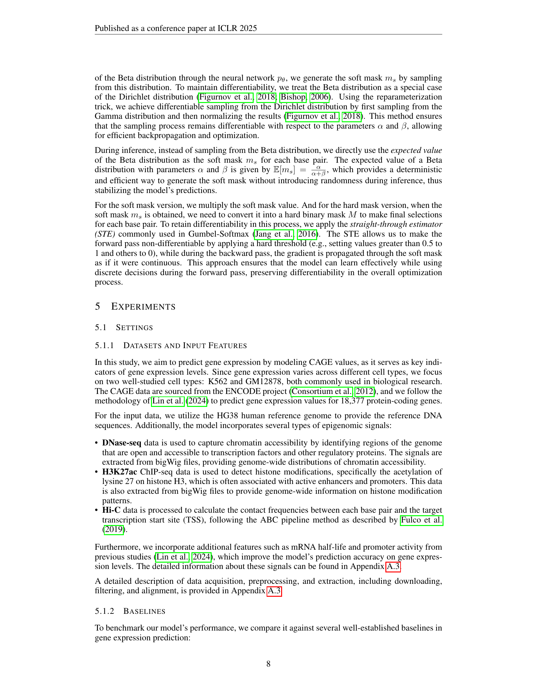

 


 2502.13991 
 Xingyu Su et el. 
 
 🤗 2025-02-24 
 



↗ arXiv


↗ Hugging Face


↗ Papers with Code


### TL;DR



유전자 발현 예측은 생명과학에서 중요한 과제입니다. 기존의 방법들은 DNA 서열 정보만을 사용하거나, 후성유전체 신호를 효과적으로 통합하지 못해 정확도가 떨어지는 한계를 보였습니다. 특히, 유전자 발현을 조절하는 **핵심 조절 요소(regulatory elements)**를 정확히 찾아내는 것이 어려웠습니다.

본 연구는 이러한 문제를 해결하기 위해 Seq2Exp라는 새로운 모델을 제시합니다. Seq2Exp는 **DNA 서열과 후성유전체 신호를 통합**하여 **핵심 조절 요소를 효과적으로 찾아내고**, 이를 바탕으로 유전자 발현을 예측합니다.  **정보 병목(Information Bottleneck) 기법**을 활용하여 불필요한 정보를 제거하고, **핵심적인 정보만 추출**함으로써 예측 정확도를 높였습니다. 실험 결과, Seq2Exp는 기존 모델보다 뛰어난 성능을 보였습니다.



#### Key Takeaways


 Seq2Exp는 DNA 서열과 후성유전체 신호를 통합하여 유전자 발현 예측의 정확도를 향상시켰습니다. 



 정보 병목 현상(Information Bottleneck) 기법을 통해 중요한 조절 요소를 효과적으로 추출하는 기법을 제시했습니다. 



 기존의 유전자 발현 예측 모델을 능가하는 성능을 보여주었습니다. 


#### Why does it matter?
본 논문은 **유전자 발현 예측의 정확도를 높이는 새로운 방법론**을 제시하여 유전체학 연구자들에게 중요한 의미를 지닙니다. **기존의 방법론들이 DNA 서열 정보만을 사용하거나, 후성유전체 신호를 효과적으로 통합하지 못한 점을 극복**하여, 유전자 발현 조절에 중요한 역할을 하는 조절 요소를 효과적으로 찾아낼 수 있는 가능성을 제시합니다. **다양한 유전체 데이터와 조합하여 새로운 연구 분야를 개척**할 수 있는 잠재력을 가지고 있으며, **유전자 발현 예측 모델의 성능 향상**에 기여할 수 있습니다.  더 나아가, **질병 연구 및 신약 개발 분야**에도 활용될 수 있는 잠재력을 가지고 있으므로 생명과학 및 의학 분야 연구자들에게 큰 영향을 미칠 수 있습니다.

------
#### Visual Insights

> 🔼 그림 1은 유전자 발현 예측을 위한 후속 연구의 배경이 되는 원인 관계를 보여줍니다.  유전체 데이터(DNA 서열)와 후성 유전체 신호(epigenomic signals)는 규제 요소(regulatory elements)와 인과 관계가 있습니다.  이러한 규제 요소는 크게 세 가지로 나뉘는데, 표적 유전자와 상호 작용할 가능성이 있는 요소(Rg), 측정을 통해 발견된 요소(Rm), 그리고 표적 유전자 발현에 실제로 영향을 미치는 활성화된 요소(Rag)입니다.  Rag는 Rg와 Rm 모두에 영향을 미치는 핵심 원인이며, 표적 유전자 발현(Y)에 직접적인 영향을 미칩니다.  이러한 인과 관계를 바탕으로, 후성 유전체 신호와 DNA 서열을 조건으로 하여 규제 요소를 학습하고 추출하는 프레임워크가 제안됩니다.
> 

> 
read the caption

> Figure 1: Causal relationships between epigenomic signals, sequence, gene expression Y𝑌Yitalic_Y and related regulatory elements.
> 


|       | K562                | K562                | K562                | GM12878             | GM12878             | GM12878             |
| :---- | :-------------------- | :-------------------- | :-------------------- | :-------------------- | :-------------------- | :-------------------- |
|       | MSE ↓                  | MAE ↓                  | Pearson ↑              | MSE ↓                  | MAE ↓                  | Pearson ↑              |
| Enformer | 0.2920               | 0.4056               | 0.7961               | 0.2889               | 0.4185               | 0.8327               |
| HyenaDNA | 0.2265               | 0.3497               | 0.8425               | 0.2217               | 0.3562               | 0.8729               |
| Mamba    | 0.2241               | 0.3416               | 0.8412               | 0.2145               | 0.3446               | 0.8788               |
| Caduceus | 0.2197               | 0.3327               | 0.8475               | 0.2124               | 0.3436               | 0.8819               |
| Caduceus w/ signals | 0.1959               | 0.3187               | 0.8630               | 0.1942               | 0.3269               | 0.8928               |
| EPInformer | 0.2140               | 0.3291               | 0.8473               | 0.1975               | 0.3246               | 0.8907               |
| Seq2Exp-hard | 0.1863               | 0.3074               | 0.8682               | 0.1890               | 0.3199               | 0.8916               |
| Seq2Exp-soft | **0.1856**           | **0.3054**           | **0.8723**           | **0.1873**           | **0.3137**           | **0.8951**           |

> 🔼 표 1은 다양한 방법들을 사용하여 유전자 발현량 예측 성능을 비교 분석한 결과를 보여줍니다.  MSE, MAE, Pearson 상관계수 세 가지 지표를 사용하여 K562와 GM12878 두 가지 세포주에 대한 예측 성능을 평가했습니다.  각 방법의 성능을 수치적으로 비교하여 최고 성능을 보이는 방법과 기준 모델들에 비해 가장 우수한 성능을 보이는 방법을 강조 표시했습니다. 이 표는 다양한 모델의 상대적 성능을 한눈에 파악하는 데 도움을 줍니다.
> 

> 
read the caption

> Table 1: Performance on Gene Expression CAGE Prediction. The top performance over all the methods are highlighted in bold. Underline indicates that the best performance over all the baselines.
> 

### In-depth insights

#### Causal Gene Regulators
**인과적 유전자 조절 인자**에 대한 심층적인 논의는 유전자 발현 조절에 있어서 **직접적인 인과 관계**를 갖는 요소들을 규명하는 데 초점을 맞춥니다. 단순히 상관관계를 넘어서, 특정 유전자의 발현 변화를 **직접적으로 유발하는** DNA 서열, 전사 인자, 후성유전학적 변형 등을 찾아내는 것이 중요합니다.  이는 기존의 상관관계 분석으로는 파악하기 어려운 **미묘한 조절 메커니즘**을 이해하는 데 필수적입니다.  **머신러닝 기법**을 활용하여 유전자 발현 데이터와 다양한 유전체 데이터를 통합 분석함으로써, 인과적 유전자 조절 인자를 효과적으로 찾아낼 수 있습니다.  특히, **인과 추론 모델**을 적용하면 유전자 발현 변화의 원인을 보다 정확하게 예측하고, 이를 통해 새로운 **치료 표적** 발굴 및 **질병 예측**에 활용 가능합니다.  하지만, **데이터의 복잡성**과 **인과 관계 규명의 어려움**은 여전히 극복해야 할 과제입니다.  **다양한 유전체 데이터**와 **외부 요인**까지 고려하는 종합적인 접근법이 필요하며,  **윤리적, 사회적 함의** 또한 고려되어야 합니다.  궁극적으로, 인과적 유전자 조절 인자에 대한 이해는 **정밀 의학** 발전에 중요한 기여를 할 것입니다.

#### Seq2Exp Framework
Seq2Exp 프레임워크는 **유전자 발현 예측을 위한 새로운 접근 방식**을 제시합니다. 기존의 DNA 시퀀스만을 사용하는 방법과 달리, **DNA 시퀀스와 후성유전체 신호를 모두 활용**하여 유전자 발현을 조절하는 regulatory element를 효과적으로 찾아냅니다. 특히, **인과 관계를 고려한 causal relationship 모델링**을 통해 DNA 시퀀스와 후성유전체 신호의 상호작용을 분석하고, 정보 손실을 최소화하며 중요한 정보만 추출하는 **정보 병목(information bottleneck)** 기법을 적용합니다. 이를 통해, **비효율적인 정보를 제거하고 예측 정확도를 향상**시키는 것입니다.  **Beta 분포를 활용**하여 마스크 학습 과정을 효율적으로 수행하고, **희소성(sparsity)**를 유지하여 관련성이 높은 영역만을 선택적으로 추출하는 전략을 사용합니다.  **실험 결과**는 Seq2Exp가 기존 방법들을 능가하는 성능을 보임을 보여주며, **새로운 regulatory element 발견**에 대한 가능성을 제시합니다.  Seq2Exp는 **DNA 시퀀스 분석 및 유전자 발현 예측 분야**에 중요한 발전을 가져올 수 있는 잠재력을 가지고 있습니다.

#### Beta Mask Distribution
본 논문에서 제안하는 베타 분포 기반 마스크는 **유전자 발현 예측을 위한 핵심 요소**입니다.  기존의 이진 마스크와 달리, 베타 분포는 각 DNA 염기쌍의 중요도를 0과 1 사이의 연속적인 값으로 표현하여, **더욱 세밀하고 유연한 조절**을 가능하게 합니다.  이는 단순히 중요한 영역을 선택하는 것을 넘어, 각 염기쌍의 기여도를 정량적으로 반영함으로써, **예측 정확도를 향상**시키는 데 기여합니다.  또한, 베타 분포는 **계산 효율성**과 **모델 해석력**을 높이는 데 유용합니다.  특히, 두 개의 베타 분포를 곱하여 최종 마스크를 생성하는 과정은 수학적으로 간결하며,  **DNA 시퀀스와 후성유전체 신호의 정보를 효과적으로 통합**하는 전략입니다.  **정보 병목 현상**을 이용하여 비관련 정보를 제거하고 관련 정보만 추출하는 점 또한 중요한 특징입니다. 이러한 베타 분포 기반 마스크 전략은 **새로운 유전자 조절 요소를 발견**하고, 유전자 발현 예측 모델의 성능을 개선하는데 기여할 것으로 기대됩니다. 

#### Cross-Chromosome Valid
**크로스-크로모좀 검증**은 기계 학습 모델의 일반화 능력을 평가하는 강력한 방법입니다.  이 방법은 모델을 훈련시키는 데 사용된 데이터와 독립적인 데이터로 모델을 평가하여 **과적합**을 방지하고 **일반화 성능**을 향상시키는 데 도움이 됩니다.  특히 게놈 연구와 같이 데이터의 크로모좀 구조가 중요한 분야에서는 각 크로모좀을 독립적인 데이터셋으로 간주하여 크로스-크로모좀 검증을 수행하는 것이 매우 중요합니다. 이를 통해 특정 크로모좀에 대한 과적합을 피하고, 다른 크로모좀 데이터에 대한 예측 성능을 정확하게 평가할 수 있습니다. **본 연구에서 크로스-크로모좀 검증을 사용한 이유는 모델이 특정 크로모좀에 과적합되지 않고 다양한 게놈 영역에 대해서도 일반화된 예측 능력을 가지는지 확인하기 위함입니다.** 이러한 검증 절차는 모델의 견고성과 신뢰성을 높이는 데 크게 기여합니다.  **결과적으로, 크로스-크로모좀 검증은 모델의 실제 성능과 일반화 능력을 더욱 정확하게 평가할 수 있게 해주는 중요한 과정입니다.**

#### Future Directions
본 논문의 "미래 방향"에 대한 심층적인 고찰은 **다양한 세포 유형 및 광범위한 후성유전체 데이터를 통합하여 Seq2Exp 프레임워크의 일반화 가능성을 검증하는 것**에 초점을 맞춰야 합니다.  **유전자 발현 예측을 넘어 규제 요소 발견 및 서열 분석 관련 작업에 이러한 접근 방식을 적용하는 것은 매우 흥미로운 연구 방향**입니다.  특히, **규제 요소 추출에 중점을 둔 사전 훈련 모델 개발은 다양한 유전체 작업 전반에 걸쳐 일반화 성능을 향상시키는 데 중요한 역할**을 할 것입니다.  **전반적으로, Seq2Exp 프레임워크의 범용성을 확장하고 다양한 유전체 과제에 적용 가능성을 입증하는 것은 향후 연구의 핵심 목표**가 되어야 하며, 이를 통해 **유전체 연구 전반의 발전**에 기여할 수 있을 것입니다.  더 나아가, 본 연구의 한계점을 인지하고 이를 극복하기 위한 노력을 지속해야 합니다.

### More visual insights

More on tables


| Cell | K562 |  |  |  | GM12878 |  |  |  |
|---|---|---|---|---|---|---|---|---|
|  | MSE ↓ | MAE ↓ | Pearson ↑ | Mask Ratio | MSE ↓ | MAE ↓ | Pearson ↑ | Mask Ratio |
|---|---|---|---|---|---|---|---|---|
| Seq2Exp-hard | 0.1863 | 0.3074 | 0.8682 | 6.88% | 0.1890 | 0.3199 | 0.8916 | 6.32% |
|---|---|---|---|---|---|---|---|---|
| Seq2Exp-retrain | 0.1979 | 0.3168 | 0.8623 | 10.00% | 0.1887 | 0.3177 | 0.8941 | 10.00% |
|---|---|---|---|---|---|---|---|---|
| MACS3 | 0.2195 | 0.3455 | 0.8435 | 13.61% | 0.2340 | 0.3654 | 0.8634 | 15.95% |
> 🔼 표 2는 제안된 Seq2Exp 모델의 성능을 기존의 MACS3 피크 탐지 방법과 비교하여 유전자 발현 CAGE 예측의 정확도를 보여줍니다. K562 및 GM12878 세포주에 대한 MSE, MAE, Pearson 상관 계수와 함께 MACS3에 의해 식별된 규제 요소의 비율을 비교 분석하여 Seq2Exp가 유전자 발현 예측에서 MACS3보다 우수한 성능을 보임을 보여줍니다.  Seq2Exp-hard는 하드 마스크를 사용하고 Seq2Exp-retrain은 소프트 마스크를 사용하여 상위 10%의 염기쌍을 선택적으로 사용하며, 두 모델 모두 MACS3보다 우수한 성능을 나타냅니다.
> 

> 
read the caption

> Table 2: Comparison with MACS3 on Gene Expression CAGE Prediction.
> 


| Hyperparameters | Values |
|---|---| 
| # Layers of Generator | 4 |
| # Layers of Predictor | 4 |
| Hidden dimensions | 128 |
| \alpha_{3},\beta_{3} | [1,9],**[10,90]**, [10,190], [10,10], [10,1.11] |
| # training steps | **50000**, 85000 |
| Batch size | 8 |
| Learning rate | 1e-3,**5e-4**,1e-4,5e-5 |
| Scheduler strategy | CosineLR with Linear Warmup |
| Initial warmup learning rate | 1e-5 |
| Min learning rate | 1e-4 |
| Warmup steps | 5,000 |
| Validation model selection criterion | validation MSE |
> 🔼 표 3은 논문의 모델 학습에 사용된 하이퍼파라미터 값과 그 값들을 결정하기 위해 탐색한 공간을 보여줍니다. 각 하이퍼파라미터별로 최종적으로 사용된 값이 굵게 표시되어 있습니다.  표에는 생성자와 예측자의 레이어 수, 은닉층 차원, 정보 병목 현상(information bottleneck)에 사용되는 α3와 β3의 값, 학습 스텝 수, 배치 크기, 학습률, 스케줄러 전략, 초기 웜업 학습률, 최소 학습률, 웜업 스텝 수, 그리고 검증 모델 선택 기준 등의 하이퍼파라미터 정보가 포함되어 있습니다.  각 하이퍼파라미터 값의 범위는 괄호 안에 제시되어 있습니다.  이 표는 모델의 성능에 영향을 미치는 여러 하이퍼파라미터의 조정 과정과 최종 선택된 값을 한눈에 보여줌으로써 논문의 재현성과 이해도를 높이는 데 기여합니다.
> 

> 
read the caption

> Table 3: Hyperparameter values and their search space (final choices are highlighted in bold).
> 


| Metric | Enformer | HyenaDNA | Mamba | Caduceus | Caduceus w/ signals | EPInformer | MACS3 | Seq2Exp-hard | Seq2Exp-soft |
|---|---|---|---|---|---|---|---|---|---| 
| MSE ↓ | 0.2920 ± 0.0050 | 0.2265 ± 0.0013 | 0.2241 ± 0.0027 | 0.2197 ± 0.0038 | 0.1959 ± 0.0036 | 0.2140 ± 0.0042 | 0.2195 ± 0.0023 | 0.1863 ± 0.0051 | 0.1856 ± 0.0032 |
| MAE ↓ | 0.4056 ± 0.0040 | 0.3497 ± 0.0012 | 0.3416 ± 0.0026 | 0.3327 ± 0.0070 | 0.3187 ± 0.0036 | 0.3291 ± 0.0031 | 0.3455 ± 0.0018 | 0.3074 ± 0.0036 | 0.3054 ± 0.0024 |
| Pearson ↑ | 0.7961 ± 0.0019 | 0.8425 ± 0.0008 | 0.8412 ± 0.0021 | 0.8475 ± 0.0014 | 0.8630 ± 0.0008 | 0.8473 ± 0.0017 | 0.8435 ± 0.0013 | 0.8682 ± 0.0045 | 0.8723 ± 0.0012 |
> 🔼 표 4는 K562 세포 유형에 대한 유전자 발현 CAGE 예측 성능을 표준 편차와 함께 보여줍니다. MSE(평균 제곱 오차), MAE(평균 절대 오차), Pearson 상관 계수와 같은 다양한 지표를 사용하여 여러 모델의 성능을 비교합니다. 표준 편차는 각 지표에 대한 다양성을 보여주어 결과의 신뢰성을 높여줍니다.
> 

> 
read the caption

> Table 4: Performance on Gene Expression CAGE Prediction with Standard Deviation for Cell Type K562.
> 


| Metric | Enformer | HyenaDNA | Mamba | Caduceus | Caduceus w/ signals | EPInformer | MACS3 | Seq2Exp-hard | Seq2Exp-soft |
|---|---|---|---|---|---|---|---|---|---| 
| MSE ↓ | 0.2889 ± 0.0009 | 0.2217 ± 0.0018 | 0.2145 ± 0.0021 | 0.2124 ± 0.0037 | 0.1942 ± 0.0058 | 0.1975 ± 0.0031 | 0.2340 ± 0.0028 | 0.1890 ± 0.0045 | 0.1873 ± 0.0044 |
| MAE ↓ | 0.4185 ± 0.0013 | 0.3562 ± 0.0012 | 0.3446 ± 0.0022 | 0.3436 ± 0.0031 | 0.3269 ± 0.0048 | 0.3246 ± 0.0025 | 0.3654 ± 0.0017 | 0.3199 ± 0.0040 | 0.3137 ± 0.0028 |
| Pearson ↑ | 0.8327 ± 0.0025 | 0.8729 ± 0.0010 | 0.8788 ± 0.0011 | 0.8819 ± 0.0009 | 0.8928 ± 0.0017 | 0.8907 ± 0.0011 | 0.8634 ± 0.0020 | 0.8916 ± 0.0027 | 0.8951 ± 0.0038 |
> 🔼 표 5는 GM12878 세포 유형에 대한 유전자 발현 CAGE 예측 성능을 표준 편차와 함께 보여줍니다.  표에는 다양한 모델(Enformer, HyenaDNA, Mamba, Caduceus, Caduceus with signals, EPInformer, MACS3, Seq2Exp-hard, Seq2Exp-soft)의 MSE(평균 제곱 오차), MAE(평균 절대 오차), Pearson 상관 계수가 표시되어 있습니다.  각 지표는 GM12878 세포 유형의 유전자 발현 예측 정확도를 평가하는 데 사용됩니다. 표준 편차 값은 각 모델의 성능 변동성을 보여줍니다.
> 

> 
read the caption

> Table 5: Performance on Gene Expression CAGE Prediction with Standard Deviation for Cell Type GM12878.
> 

### Full paper



