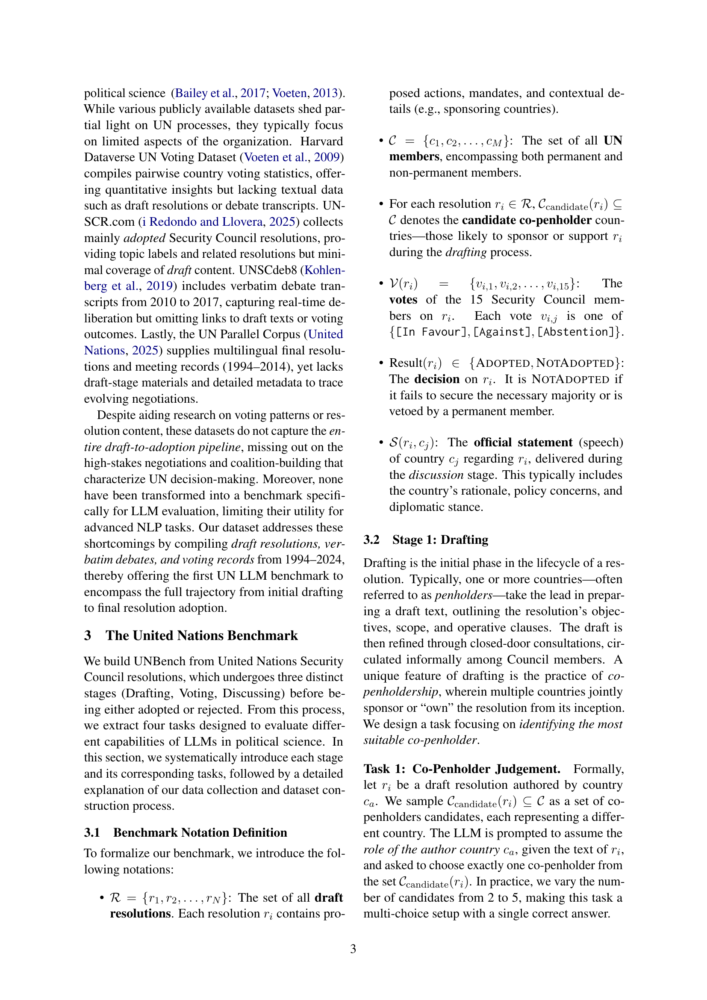

 


 2502.14122 
 Yueqing Liang et el. 
 
 🤗 2025-02-24 
 



↗ arXiv


↗ Hugging Face


↗ Papers with Code


### TL;DR



본 논문은 **국제 관계 및 정치 과학 분야에서 대규모 언어 모델(LLM)의 잠재력**을 평가하는 것을 목표로 합니다. 특히, 유엔 안보리의 의사결정 과정에 중점을 두어, LLM이 정치적 역동성을 이해하고 시뮬레이션하는 능력을 평가합니다. 기존 연구의 한계는 **고위험 정치적 의사결정에 대한 LLM의 적용 가능성이 거의 탐구되지 않았다는 점**입니다. 

연구팀은 유엔 안보리 회의록, 투표 기록, 외교 연설 등의 데이터를 포함하는 **새로운 데이터 세트를 만들고 UNBench라는 벤치마크를 개발**했습니다. 이 벤치마크는 공동 집필자 판단, 대표 투표 시뮬레이션, 초안 채택 예측, 대표 성명 생성 등 네 가지 정치 과학 과제를 포함합니다. 실험 결과는 LLM의 강점과 한계를 보여주고, **정치 과학 분야에서의 LLM 적용 가능성과 향후 연구 방향**을 제시합니다.



#### Key Takeaways


 UNBench는 유엔 안보리 데이터를 활용한 최초의 종합적인 정치 과학 벤치마크입니다. 



 LLM의 정치적 의사결정 과정 적용 가능성과 한계를 실험적으로 분석했습니다. 



 UNBench는 정치 과학 및 AI 연구에 새로운 가능성을 제시하고 실제 글로벌 거버넌스 응용 프로그램에 기여합니다. 


#### Why does it matter?
본 논문은 **유엔 안보리 의사결정 과정에 대한 새로운 벤치마크인 UNBench를 제시**하여, 정치 과학 분야에서 대규모 언어 모델(LLM)의 활용 가능성과 한계를 평가하고 AI와 정치 과학의 상호 작용에 대한 새로운 연구 방향을 제시합니다. **국제 정치 분석 및 외교 정책 결정**에 대한 기계 학습 모델의 적용 가능성을 높이고 이를 **실제 글로벌 거버넌스**에 적용하는 데 중요한 의미를 가집니다.

------
#### Visual Insights

> 🔼 그림 1은 유엔 의사결정 과정의 세 가지 주요 단계를 보여줍니다.  먼저, 회원국들이 함께 초안을 작성하는 ‘초안 작성’ 단계가 있습니다. 다음으로, 회원국들이 투표를 통해 초안을 승인하거나 거부하는 ‘투표’ 단계가 있습니다. 마지막으로, 회원국들이 투표 결과에 대한 이유를 설명하고 논의하는 ‘논의’ 단계가 있습니다. 이러한 세 단계는 상호 연결되어 있으며, 각 단계에서 다양한 작업이 이루어집니다.
> 

> 
read the caption

> Figure 1: Three Key Stages of the United Nations Decision-Making Process
> 


| Task | Statistic | Value |
|---|---|---|
| Task 1 | # Drafts | 1,300 |
|  | # Unique Draft Authors | 209 |
|  | Avg. # Authors per Draft | 7 |
|  | # Total Instances | 355,126 |
| Task 2 | # Drafts | 1,162 |
|  | # Total Instances | 17,430 |
|  | # [In Favour] | 17,020 |
|  | # [Against] | 16 |
|  | # [Abstention] | 391 |
| Task 3 | # Drafts | 1,978 |
|  | # [Adopted] | 1,880 |
|  | # [NotAdopted] | 98 |
| Task 4 | # Meetings (Drafts) | 1,752 |
|  | # Statements | 7,394 |
|  | # Countries | 204 |
|  | Avg. # Tokens per Statement | 450 |

> 🔼 표 1은 논문에서 제시된 UNBench 데이터셋의 통계를 보여줍니다.  UNBench는 유엔 안보리 결의안 초안, 투표 기록, 외교 연설문 등을 포함하는 새로운 정치 과학용 데이터셋입니다. 표에는 초안 수, 고유 초안 작성 국가 수, 초안 당 평균 작성 국가 수, 총 사례 수, 채택된 초안 수, 채택되지 않은 초안 수, 회의 수, 성명 수, 국가 수, 성명 당 평균 토큰 수 등 UNBench 데이터셋의 주요 통계가 요약되어 있습니다. 이 표는 UNBench의 규모와 다양성을 이해하는 데 도움을 줍니다.
> 

> 
read the caption

> Table 1: Statistics for our UNBench.
> 

### In-depth insights

#### LLM Political Analysis
LLM 정치 분석은 막대한 양의 텍스트 데이터를 처리하고 정치적 패턴과 동향을 식별할 수 있는 능력 때문에 정치 과학 분야에서 잠재력이 매우 큰 분야입니다. **LLM은 선거 결과 예측, 여론 분석, 사회 운동의 동향 파악 등 다양한 정치적 과제에 적용될 수 있습니다.** 하지만 LLM을 정치 분석에 사용할 때는 몇 가지 중요한 고려 사항이 있습니다. 첫째, **LLM은 편향된 데이터로 훈련될 수 있으며, 이로 인해 편향된 결과가 생성될 수 있습니다.** 둘째, **LLM은 복잡한 정치적 과정을 완전히 이해하지 못할 수 있으며, 단순한 통계적 상관 관계에 의존할 수 있습니다.** 셋째, **LLM의 결과는 투명하지 않고 해석하기 어려울 수 있습니다.** 따라서 LLM을 정치 분석에 사용할 때는 이러한 한계점을 인지하고 주의 깊게 결과를 해석해야 합니다.  LLM의 잠재력을 최대한 활용하기 위해서는 **데이터의 품질을 관리하고, 알고리즘의 투명성을 높이고, 인간 전문가의 전문 지식을 활용하는 것이 중요합니다.**  결론적으로, LLM은 정치 분석에 유용한 도구가 될 수 있지만, 그 한계를 인지하고 신중하게 사용해야 합니다.

#### UNBench Framework
본 논문에서 제시된 UNBench 프레임워크는 **유엔 안전보장이사회(UNSC)의 의사결정 과정을 모방한 종합적인 벤치마킹 시스템**입니다.  UNSC의 결정 과정은 초안 작성, 투표, 토론의 세 단계로 구성되며, UNBench는 이러한 각 단계를 반영한 네 가지 과제(공동 필기자 판단, 대표자 투표 시뮬레이션, 초안 채택 예측, 대표자 성명 생성)를 통해 LLMs의 역량을 평가합니다.  **다양한 유형의 질문(예측, 생성)**을 포함하고 있어 LLMs의 정치적 맥락 이해, 전략적 추론 능력 및 다국어 능력을 종합적으로 평가할 수 있다는 **강점**이 있습니다.  하지만 **UNSC 데이터에만 국한**되어 실제 세계의 다양한 정치적 의사결정 상황을 완전히 포괄하지 못하고, **영어 데이터 중심**이라는 한계도 존재합니다.  **데이터 편향** 및 모델의 **윤리적 측면**에 대한 고려 또한 필요합니다.  결론적으로, UNBench는 정치 과학 분야에서 LLMs의 활용 가능성을 탐색하는 데 유용한 도구이지만, 그 한계점을 인지하고 개선해나가야 합니다.

#### Model Evaluation
본 논문에서는 다양한 언어 모델의 성능을 평가하기 위해 **모델 평가** 전략을 제시합니다. 이는 단순히 정확도만을 평가하는 것이 아니라, 모델이 정치적 맥락을 얼마나 잘 이해하고, 실제 정치적 의사결정 과정을 얼마나 효과적으로 시뮬레이션할 수 있는지에 대한 종합적인 평가를 포함합니다.  **특히, UN 안보리 결의안 초안 작성, 투표 시뮬레이션, 결의안 채택 예측, 대표 발언 생성 등 다양한 과제를 통해 모델의 강점과 약점을 다각적으로 분석**합니다.  본 평가는 단순한 성능 수치뿐만 아니라, 모델의 정치적 이해, 시뮬레이션 능력, 설명 가능성 등을 고려한 정성적 평가 또한 포함합니다.  **결과적으로,  모델 평가는 단순한 정량적 척도를 넘어 모델의 실제 응용 가능성과 한계를 밝히는 데 중점**을 두고 있습니다.  이는 단순히 기술적 성능을 넘어, AI 모델의 사회적 영향력과 윤리적 함의를 고려한 책임 있는 AI 개발을 위한 중요한 단계임을 시사합니다.

#### Future Directions
본 논문에서 제시된 유엔 벤치마크(UNBench)는 **정치 과학 분야에서 대규모 언어 모델(LLM)의 활용 가능성**을 보여주는 중요한 첫걸음입니다. 하지만, 이는 시작일 뿐이며, 향후 연구 방향은 다음과 같이 제시될 수 있습니다. 첫째, **다양한 언어 지원 확대**를 통해 LLM이 다양한 문화적 맥락과 정치적 관점을 이해하고 반영할 수 있도록 해야 합니다. 둘째, **보다 정교한 평가 지표**를 개발하여 정치적 뉘앙스와 복잡한 의사결정 과정을 정확하게 평가해야 합니다. 셋째, **데이터셋의 지속적인 업데이트 및 확장**을 통해 LLM이 최신 정치 동향을 반영하고, 변화하는 국제 정세를 정확하게 예측할 수 있도록 해야 합니다. 넷째, **LLM의 투명성과 윤리적 문제**에 대한 심도 있는 연구가 필요합니다. LLM의 예측이나 결정 과정의 편향성과 오류 가능성을 파악하고 해결 방안을 모색하여 신뢰할 수 있는 시스템을 구축하는 것이 중요합니다. 다섯째, **실제 정치 과정에 대한 LLM의 적용 및 활용 방안**에 대한 연구가 필요합니다. 예를 들어, 국제협상 지원, 정책 결정 지원, 국제 관계 분석 등에 LLM을 활용하는 다양한 방법을 모색하고, 실제 적용을 통한 효과와 한계를 평가해야 합니다. 마지막으로, **다학제적 접근**을 통해 인공지능, 정치 과학, 국제 관계 등 여러 분야의 전문가들이 협력하여 LLM의 발전 방향과 적용 방안을 모색해야 합니다.

#### Study Limitations
본 연구의 제한점은 다음과 같습니다. **데이터의 제한**: 연구는 1994년부터 2024년까지의 유엔 안전보장이사회 기록에만 국한되어 있어, 국제 관계 역학의 전체적인 흐름을 반영하지 못할 수 있습니다.  **언어적 한계**: 분석은 영어 문서에만 초점을 맞춰, 다른 유엔 공식 언어로 된 외교적 소통의 미묘한 차이를 놓칠 수 있습니다. **시대적 변화**: 정치적 환경은 역동적으로 변화하므로, 과거 데이터가 현재의 외교 역학을 정확히 반영하지 못할 가능성이 있습니다.  **데이터 오염**: 사전 훈련된 대규모 언어 모델(LLM)은 공개된 유엔 문서를 통해 이미 사전 훈련되었을 수 있으므로,  **모델의 편향성 및 공정성**: 연구는 LLM의 편향성 및 공정성 문제를 충분히 다루지 못했습니다. 더욱 심층적인 분석이 필요합니다. 따라서 본 연구의 결과는 신중하게 해석되어야 하며, **추가 연구**를 통해 제한점을 보완하는 것이 중요합니다.

### More visual insights

More on figures

> 🔼 그림 2는 제안된 UNBench의 개념을 보여줍니다. UNBench는 UN 안보리 결의안 초안의 세 가지 주요 단계(초안 작성, 투표, 토론)에서 추출한 네 가지 과제로 구성됩니다. 각 과제는 특정 단계와 관련된 LLM의 능력을 평가하도록 설계되었습니다. 즉, 초안 작성 단계에서는 공동 기고국 선정 과제가, 투표 단계에서는 대표 투표 시뮬레이션 및 초안 채택 예측 과제가, 토론 단계에서는 대표 연설 생성 과제가 포함됩니다. 각 과제는 UN 안보리 결의안 초안, 투표 기록, 회의 기록과 같은 실제 UN 데이터를 사용하여 평가되므로, LLM의 정치적 역량을 현실 세계의 맥락에서 평가할 수 있습니다.
> 

> 
read the caption

> Figure 2: The proposed UNBench. It consists of 4444 tasks extracted from different stages of a UN draft.
> 

> 🔼 이 그림은 논문의 Task 1에 대한 모델 성능을 보여줍니다. Task 1은 유엔 안보리 결의안 초안 작성에서 최적의 공동 기고국을 식별하는 과제입니다. 그림은 선택지 수(2개, 3개, 4개, 5개)를 변화시키면서 각 모델의 정확도를 비교 분석한 결과를 나타냅니다.  모델의 성능은 선택지 수가 증가함에 따라 전반적으로 감소하는 경향을 보입니다.  이는 선택지가 많아질수록 모델이 올바른 답을 찾기 어려워짐을 시사합니다. GPT-40 모델이 모든 선택지 수에서 가장 높은 정확도를 보이며 다른 모델들에 비해 뛰어난 성능을 보임을 알 수 있습니다.  반면에 더 작거나 전통적인 모델들은 상대적으로 낮은 정확도를 보입니다.
> 

> 
read the caption

> Figure 3: Models performance in Task 1 by varying the number of choices.
> 

> 🔼 그림 4는 상위 15명의 저자와 주제에 대한 공동 발생 행렬을 보여줍니다. 각 셀은 저자가 특정 주제에 대해 작성한 횟수를 나타내며, 셀이 어두울수록 저자가 해당 주제에 대해 더 많이 작성했음을 의미합니다. 이는 UN 안보리 결의안 초안 작성에서 주요 국가들의 역할과 집중 영역을 시각적으로 보여줍니다.  예를 들어, 미국, 영국, 프랑스 등 서방 국가들은 평화유지 작전, 인도적 지원, 인권 등 다양한 분야에 걸쳐 활발하게 참여하는 반면, 특정 국가들은 특정 주제에 집중하는 경향을 보입니다.
> 

> 
read the caption

> Figure 4: Author-Subjects Relationships. This figure shows the co-occurrence matrix of the top 15 authors and subjects. Each cell represents the number of times an author has written about a topic. The darker the cell, the more the author has written about the topic.
> 

> 🔼 이 그림은 유엔 안전보장이사회에서 적어도 한 국가가 '찬성' 투표를 하지 않은 상위 30개 주제를 보여줍니다.  즉, 각 주제에 대해서는 이견이 있었음을 의미합니다.  그래프의 세로축은 주제를, 가로축은 해당 주제에 대해 '찬성' 외의 투표(반대 또는 기권)를 한 횟수를 나타냅니다. 이 그림을 통해 유엔 안보리에서 논의되는 주제들에 대한 국가 간의 의견 불일치 정도를 파악할 수 있습니다. 특히 제재, 평화유지 활동, 인도적 지원 등 강제적 조치와 관련된 주제에서 이견이 큰 것을 알 수 있습니다.
> 

> 
read the caption

> Figure 5: This figure shows the top 30 subjects that at least one country did not vote ’Yes’ on.
> 

> 🔼 그림 6은 1994년부터 2024년까지 5년 단위 기간별 상위 10개 주제를 보여줍니다.  각 기간 동안 유엔 안전보장이사회 결의안에서 가장 자주 다루어진 주제들을 막대 그래프로 시각화하여, 시간 경과에 따른 유엔의 주요 관심사 변화를 보여줍니다.  이를 통해 특정 주제가 장기간 지속적으로 중요하게 다루어지는지, 아니면 특정 시기에 집중적으로 다루어졌다가 사라지는지 등을 파악할 수 있습니다.  이는 유엔의 정책 우선순위 변화와 국제 정세 변화를 이해하는 데 도움이 될 수 있습니다.
> 

> 
read the caption

> Figure 6: This figure shows the top 10 subjects per 5-year period from 1994 to 2024.
> 

> 🔼 그림 7은 UN 안보리 결의안의 주제별 지속 기간 분포를 보여줍니다. 대부분의 주제는 1년에서 5년 사이의 짧은 기간 동안만 다뤄지지만, 일부 주제는 30년 이상 지속되는 것을 알 수 있습니다. 이는 UN 안보리의 초점이 시대적 상황에 따라 변화무쌍하게 움직이는 반면, 일부 주요 의제는 장기간에 걸쳐 지속적으로 다뤄진다는 점을 시사합니다.  결의안 주제의 지속 기간이 다양하다는 것은 국제 정세의 역동성과 UN의 대응 방식을 보여주는 중요한 지표입니다.
> 

> 
read the caption

> Figure 7: Distribution of the duration of each subject. We can observe that most subjects last for 1 to 5 years, while a few last for more than 30 years.
> 

> 🔼 그림 8은 유엔 안전보장이사회 투표에 가장 많이 참여한 국가 상위 30개국을 보여줍니다. 영구 이사국 5개국(중국, 프랑스, 러시아, 영국, 미국)이 가장 많은 득표수를 기록하여 국제적 의사결정과 안보 유지에서의 영향력을 보여줍니다. 비영구 이사국 중 일본, 브라질, 아르헨티나, 독일, 나이지리아 등도 상위권에 포함되어 국제 거버넌스 참여의 중요성을 보여줍니다. 투표 횟수 분포는 대다수 국가가 250회 미만으로 투표에 참여한 반면, 일부 국가는 상당히 많은 횟수로 투표에 참여했음을 나타냅니다. 이는 UN 투표에서 국가들의 참여 정도가 다름을 시사합니다.
> 

> 
read the caption

> Figure 8: The top 30 countries that participated in voting the most.
> 

> 🔼 그림 9는 유엔 안전보장이사회 투표에 참여한 각 국가의 투표 횟수 분포를 보여줍니다.  이 분포도는 특정 국가들이 유엔 의사결정 과정에 얼마나 적극적으로 참여하는지를 보여주는 시각적 자료입니다.  일부 국가들은 매우 높은 빈도로 투표에 참여하지만, 많은 국가들은 상대적으로 적은 횟수만 투표에 참여합니다. 이는 국가 간의 국제 정치적 영향력 및 참여 수준의 차이를 보여주는 지표가 될 수 있습니다.  즉, 투표 횟수가 많은 국가는 국제 무대에서 상대적으로 더 큰 영향력을 행사하는 것으로 해석될 수 있습니다.
> 

> 
read the caption

> Figure 9: Distribution of the number of votes each country participated
> 

More on tables


| Model | task 1 (1/2) | task 1 (1/5) | task 2 Bal. ACC | task 2 PR AUC | task 3 Bal. ACC | task 3 Mac. F1 | task 4 ROUGE | task 4 Cosine Sim. |
|---|---|---|---|---|---|---|---|---|
| BERT | 0.011 | 0.010 | 0.537 | 0.396 | 0.333 | 0.328 | / | / |
| DeBERTa | 0.010 | 0.011 | 0.500 | 0.527 | 0.333 | 0.328 | / | / |
| Llama-3.2-1B | 0.581 | 0.269 | 0.546 | 0.185 | 0.320 | 0.326 | 0.033 | 0.329 |
| Llama-3.2-3B | 0.578 | 0.297 | 0.597 | 0.385 | 0.597 | 0.402 | 0.041 | 0.290 |
| Llama-3.1-8B | 0.665 | 0.379 | 0.530 | 0.168 | 0.357 | 0.359 | 0.039 | 0.355 |
| Mistral-7B | 0.563 | 0.281 | 0.426 | 0.268 | 0.529 | 0.140 | 0.194 | 0.575 |
| GPT-4o | 0.726 | 0.464 | 0.823 | 0.696 | 0.677 | 0.363 | 0.199 | 0.619 |
| Qwen2.5-7B | 0.642 | 0.293 | 0.699 | 0.375 | 0.578 | 0.241 | 0.201 | 0.623 |
| DeepSeek-V3 | 0.695 | 0.422 | 0.724 | 0.655 | 0.668 | 0.351 | 0.207 | 0.623 |
> 🔼 표 2는 본 논문에서 제시하는 UNBench의 네 가지 과제에 대한 결과를 보여줍니다. 각 과제마다 두 가지 평가 지표를 사용했습니다. (1/k)는 k개의 선택지 중 하나를 선택하는 것을 의미하며, Bal. ACC는 균형 정확도, PR AUC는 정밀도-재현율 곡선 아래 면적을 나타냅니다. 각 지표에 대한 최고 성능은 굵은 글씨체로, 두 번째로 높은 성능은 밑줄 친 글씨체로 표시되어 있습니다. 자세한 결과는 부록 B를 참조하십시오.
> 

> 
read the caption

> Table 2: Our UNBench contains four tasks. For each task, we choose two metrics to show. (1/k) means choosing 1 from k choices, Bal. ACC is balance accuracy, PR AUC is precision-recall AUC. The best results for each metric are highlighted in bold, while the second-best results are underlined. More results could be found in Appendix B.
> 


| Author | Rejection | Count |
|---|---|---|
| United States | RUSSIAN | 68 |
| United States | CHINA | 52 |
| United Kingdom | RUSSIAN | 47 |
| France | RUSSIAN | 45 |
| France | CHINA | 39 |
| United Kingdom | CHINA | 39 |
| Germany | RUSSIAN | 22 |
| Germany | CHINA | 21 |
| Japan | CHINA | 15 |
| Italy | CHINA | 13 |
> 🔼 표 3은 UN 안보리 결의안 초안에 대해 '찬성' 투표를 하지 않은(반대 또는 기권) 상위 10개 국가-저자 쌍을 보여줍니다.  '거부'는 '반대' 또는 '기권' 투표를 받았음을 의미합니다.  '횟수' 열은 특정 저자가 작성한 초안에 대해 특정 국가가 '찬성' 투표를 하지 않은 횟수를 나타냅니다.  이 표는 특정 국가와 저자 간의 의견 불일치 패턴을 분석하는 데 도움이 됩니다.
> 

> 
read the caption

> Table 3: This table shows the top 10 pairs of authors and countries that vote not ’Yes’ the most. The “Rejection” means receiving either a ’No’ or ’Abstention’ vote. The ’Count’ column represents the number of times the author’s draft was not voted ’Yes’ by the country.
> 


| Country Pair | Count |
|---|---| 
| (FRANCE, UK) | 1,153 |
| (UK, US) | 1,147 |
| (FRANCE, US) | 1,142 |
| (CHINA, UK) | 1,068 |
| (CHINA, FRANCE) | 1,064 |
| (CHINA, US) | 1,058 |
| (RUSSIAN, UK) | 1,035 |
| (FRANCE, RUSSIAN) | 1,031 |
| (RUSSIAN, US) | 1,024 |
| (CHINA, RUSSIAN) | 1,013 |
> 🔼 표 4는 두 국가가 함께 '찬성' 투표를 한 상위 10개 국가 쌍을 보여줍니다. '미국'과 '영국'은 각각 '미합중국'과 '영국'을 의미하는 약어입니다. '횟수' 열은 두 국가가 함께 '찬성' 투표를 한 횟수를 나타냅니다. 이 표는 UN 안전보장이사회에서의 국가 간 협력 관계를 보여주는 데 도움이 됩니다. 특히, 미국과 영국, 프랑스, 중국 간의 협력 관계는 매우 강하게 나타나고 있습니다.
> 

> 
read the caption

> Table 4: This table shows the top 10 pairs of countries that voted ’Yes’ together the most. ’US’ and ’UK’ are the abbreviations for ’UNITED STATES’ and ’UNITED KINGDOM’. The ’Count’ column represents the number of times the two countries voted ’Yes’ together.
> 


| Country Pair | Count |
|---|---| 
| (CHINA, RUSSIAN) | 69 |
| (ALGERIA, CHINA) | 8 |
| (ALGERIA, RUSSIAN) | 7 |
| (RUSSIAN, SOUTH AFRICA) | 6 |
| (GABON, RUSSIAN) | 6 |
| (CHINA, GABON) | 6 |
| (RUSSIAN, VENEZUELA) | 6 |
| (KENYA, RUSSIAN) | 5 |
| (EGYPT, RUSSIAN) | 5 |
| (CHINA, INDIA) | 5 |
> 🔼 표 5는 두 국가가 함께 '예'로 투표하지 않은 상위 10개 국가 쌍을 보여줍니다. '횟수' 열은 두 국가가 함께 '예'로 투표하지 않은 횟수를 나타냅니다. 이 표는 유엔 안보리에서 특정 국가 조합 간의 투표 패턴과 의견 불일치를 보여주는 통계적 개요를 제공합니다.  특히, 국가 간의 협력 및 갈등을 파악하는 데 도움이 되는 통찰력을 제공합니다.
> 

> 
read the caption

> Table 5: This table shows the top 10 pairs of countries that did not vote ’Yes’ together the most. The ’Count’ column represents the number of times the two countries did not vote ’Yes’ together.
> 


| Model | 2 choices | 3 choices | 4 choices | 5 choices |
|---|---|---|---|---|
| Llama-3.2-1B | 0.581 | 0.394 | 0.312 | 0.269 |
| Llama-3.2-3B | 0.578 | 0.393 | 0.328 | 0.297 |
| Llama-3.1-8B | 0.665 | 0.507 | 0.408 | 0.379 |
| GPT-4o | 0.726 | 0.613 | 0.511 | 0.464 |
| DeepSeek-V3 | 0.695 | 0.555 | 0.443 | 0.422 |
| Mistral-7B | 0.563 | 0.407 | 0.335 | 0.281 |
| Qwen2.5-7B | 0.642 | 0.478 | 0.353 | 0.293 |
> 🔼 표 6은 본 논문의 UNBench(유엔 벤치마크) 평가 프레임워크 내 첫 번째 과제(Task 1: 공동 펜홀더 판단)에 대한 종합적인 결과를 보여줍니다. 이 표는 다양한 규모의 언어 모델(LLM)들이 2가지부터 5가지까지의 선택지 중에서 올바른 공동 펜홀더를 선택하는 정확도를 비교 분석한 것입니다.  각 모델의 성능은 선택지의 개수에 따라 달라지는 것을 확인할 수 있습니다. 특히, 선택지가 많아질수록 모델들의 정확도가 떨어지는 경향이 있음을 보여줍니다. 이는 UNSC(유엔 안전보장이사회) 결의안 초안 작성 과정의 복잡성과 뉘앙스를 정확히 파악하고,  정치적, 외교적 역학 관계를 고려하여 의사결정을 내리는 데 어려움이 있음을 시사합니다.
> 

> 
read the caption

> Table 6: Comprehensive results for Task 1.
> 


| Model | ROUGE | Jaccard | TF-IDF | SentBERT |
|---|---|---|---|---|
| Llama-3.2-1B | 0.0328 | 0.0304 | 0.3666 | 0.3293 |
| Llama-3.2-3B | 0.0407 | 0.0341 | 0.4287 | 0.2902 |
| Llama-3.1-8B | 0.0394 | 0.0363 | 0.4021 | 0.3553 |
| GPT-4o | 0.1985 | 0.1837 | 0.7958 | 0.6188 |
| DeepSeek-V3 | 0.2069 | 0.1876 | 0.8012 | 0.6225 |
| Mistral-7B | 0.1935 | 0.1688 | 0.7522 | 0.5750 |
| Qwen2.5-7B | 0.2008 | 0.1761 | 0.7842 | 0.6229 |
> 🔼 표 7은 본 논문의 Task 4에 대한 종합적인 결과를 보여줍니다. Task 4는 대표적인 발언 생성 작업으로, 모델이 국가별 이해관계, 투표 행태, 외교적 담론 규범에 맞춰 적절한 발언을 생성할 수 있는지를 평가합니다. 표에는 다양한 모델의 성능을 ROUGE, Jaccard 유사도, TF-IDF 유사도, SentBERT 유사도 등 여러 지표를 사용하여 비교 분석한 결과가 제시되어 있습니다. 특히, IT-IDF와 SentBERT 유사도는 코사인 유사도를 통해 계산되었습니다. 이를 통해 각 모델의 강점과 약점, 그리고 어떤 모델이 특정 유형의 텍스트 생성에 더 적합한지에 대한 통찰력을 제공합니다.
> 

> 
read the caption

> Table 7: Comprehensive results for Task 4. Similarity of IT-IDF and SentBert are calculated by cosine similarity.
> 


| Model | Accuracy | AUC | Bal. ACC | Precision | Recall | F1 | PR_AUC | MCC | G-Mean |
|---|---|---|---|---|---|---|---|---|---| 
| Llama-3.2-1B | 0.898 | 0.497 | 0.320 | 0.332 | 0.320 | 0.326 | 0.334 | 0.006 | 0.464 |
| Llama-3.2-3B | 0.523 | 0.597 | 0.597 | 0.520 | 0.597 | 0.402 | 0.956 | 0.087 | 0.597 |
| Llama-3.1-8B | 0.917 | 0.532 | 0.357 | 0.360 | 0.357 | 0.359 | 0.338 | 0.079 | 0.502 |
| GPT-4o | 0.922 | 0.731 | 0.677 | 0.400 | 0.677 | 0.363 | 0.343 | 0.162 | 0.729 |
| DeepSeek-V3 | 0.931 | 0.720 | 0.668 | 0.464 | 0.668 | 0.351 | 0.343 | 0.151 | 0.718 |
| Mistral-7B | 0.557 | 0.593 | 0.426 | 0.345 | 0.426 | 0.268 | 0.341 | 0.100 | 0.569 |
| Qwen2.5-7B | 0.935 | 0.719 | 0.699 | 0.373 | 0.699 | 0.375 | 0.344 | 0.141 | 0.719 |
> 🔼 표 8은 본 논문의 Task 2에 대한 종합적인 결과를 보여줍니다. Task 2는 대표자 투표 시뮬레이션으로, 각 국가의 대표가 UNSC 결의안에 대해 투표하는 방식을 시뮬레이션하는 과제입니다. 이 표는 다양한 LLM 모델(Llama-3.2-1B, Llama-3.2-3B, Llama-3.1-8B, GPT-4, DeepSeek-V3, Mistral-7B, Qwen2.5-7B)의 성능을 정확도, AUC, 균형 정확도, 정밀도, 재현율, F1 점수, PR AUC, MCC, G-mean 등 다양한 지표를 통해 비교 분석한 결과를 보여줍니다. 각 모델의 강점과 약점을 비교하여 UNBench 프레임워크 내에서 특정 작업에 가장 적합한 모델을 선택하는 데 도움이 되는 정보를 제공합니다.
> 

> 
read the caption

> Table 8: Comprehensive results for Task 2.
> 


| Model | Accuracy | AUC | Bal. ACC | Precision | Recall | F1 | PR_AUC | MCC | G-Mean |
|---|---|---|---|---|---|---|---|---|---| 
| Llama-3.2-1B | 0.815 | 0.546 | 0.546 | 0.083 | 0.245 | 0.124 | 0.185 | 0.057 | 0.456 |
| Llama-3.2-3B | 0.523 | 0.597 | 0.597 | 0.073 | 0.679 | 0.132 | 0.385 | 0.087 | 0.591 |
| Llama-3.1-8B | 0.935 | 0.530 | 0.530 | 0.211 | 0.076 | 0.111 | 0.168 | 0.098 | 0.273 |
| GPT-4o | 0.968 | 0.823 | 0.823 | 0.714 | 0.660 | 0.686 | 0.696 | 0.670 | 0.807 |
| DeepSeek-V3 | 0.966 | 0.724 | 0.724 | 0.828 | 0.453 | 0.585 | 0.655 | 0.597 | 0.671 |
| Mistral-7B | 0.867 | 0.529 | 0.529 | 0.084 | 0.151 | 0.108 | 0.140 | 0.044 | 0.370 |
| Qwen2.5-7B | 0.926 | 0.578 | 0.578 | 0.250 | 0.189 | 0.215 | 0.241 | 0.179 | 0.427 |
> 🔼 표 9는 논문의 실험 결과 중 세 번째 과제(Task 3)에 대한 종합적인 결과를 보여줍니다. 이 표는 다양한 LLM 모델들의 성능을 정확도, AUC, 균형 정확도, 정밀도, 재현율, F1 점수, PR AUC, MCC, G-Mean 등 여러 지표를 통해 비교 분석합니다. 각 지표는 해당 모델의 강점과 약점을 보여주는 유용한 정보를 제공하며, 특히 다중 클래스 분류 문제에서 모델 성능을 평가하는 데 중요한 지표들을 포함합니다. 이를 통해 각 모델의 강점과 약점, 그리고 특정 작업에 가장 적합한 모델을 파악하는 데 도움을 줍니다.
> 

> 
read the caption

> Table 9: Comprehensive results for Task 3.
> 

### Full paper



