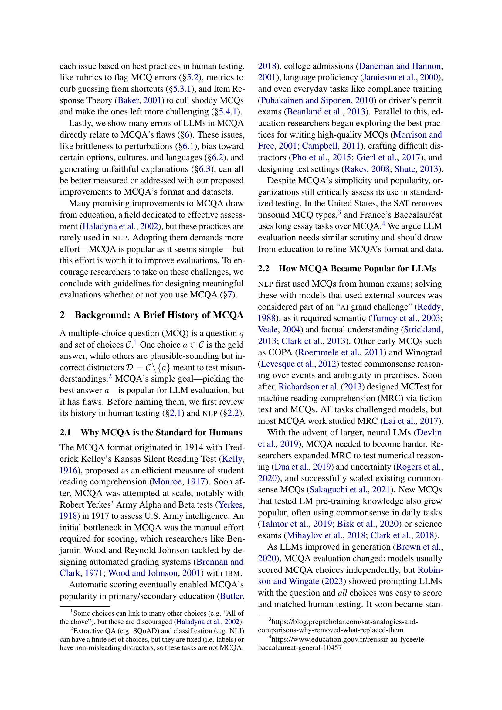
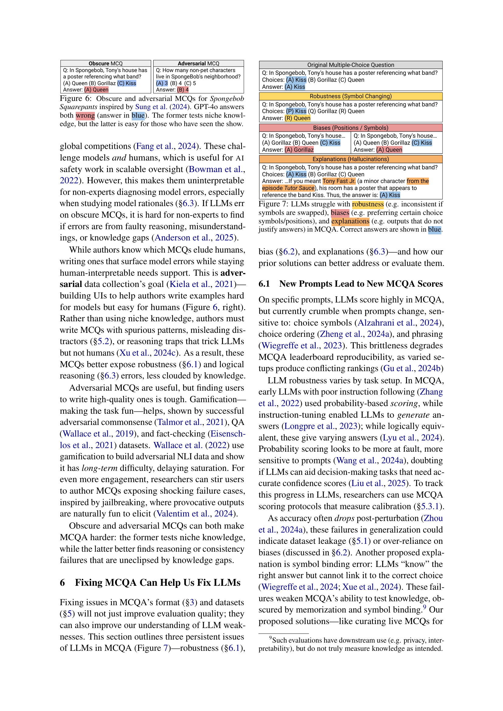

 


 2502.14127 
 Nishant Balepur et el. 
 
 🤗 2025-02-20 
 



↗ arXiv


↗ Hugging Face


### TL;DR



대규모 언어 모델(LLM)의 성능 평가에 널리 사용되는 다중 선택형 질문 답변(MCQA) 방식이 생성 능력, 주관성, 지식 완전성 등에서 한계를 드러낸다는 점을 지적합니다.  기존 MCQA 방식의 데이터셋에도 누출, 해결 불가능한 질문, 지름길 활용, 포화 등의 문제점이 존재합니다.  

본 연구는 교육 평가 분야의 전문성을 바탕으로 MCQA의 문제점을 해결하기 위한 다양한 해결책을 제시합니다.  구체적으로, 평가 척도 개선, 문항 작성 지침, 문항 반응 이론(IRT) 활용 등을 통해 MCQA의 질을 높이고, 생성형 응답 방식 및 정당화된 선택 방식을 도입하여 LLM 평가의 정확성과 신뢰성을 개선하고자 합니다.



#### Key Takeaways


 LLM 평가의 표준 방식인 MCQA는 생성 능력, 주관성, 지식 완전성 측면에서 한계가 있음 



 교육 평가 분야의 통찰(예: 평가 척도, 채점 방식, 문항 반응 이론)을 활용하여 MCQA의 형식 및 데이터셋 개선 



 생성형 MCQA 방식(예: 구성형 응답, 정당화된 선택)을 통해 LLM의 생성 능력 및 주관성 평가 개선 


#### Why does it matter?
본 논문은 **LLM 평가의 표준 방식인 MCQA의 여러 문제점을 제기**하고, **교육 평가 분야의 통찰을 활용하여 문제 해결 방안을 제시**함으로써, **LLM 평가의 신뢰성과 유용성을 높이는 데 크게 기여**합니다.  **새로운 평가 방식**을 제안하고, 기존 방식의 **데이터셋 문제점 해결 방안**을 제시함으로써, 후속 연구에 중요한 방향을 제시하고 있습니다. 특히, LLM의 **견고성, 편향성, 설명의 충실성**에 대한 측정 및 개선 방안은 LLM 연구 전반에 중요한 시사점을 제공합니다. 

------
#### Visual Insights

> 🔼 본 논문의 개요를 보여주는 그림입니다. 그림에서 보듯이, 다양한 대규모 언어 모델(LLM) 평가 방법 중 하나인 다지선다형 문제 풀이(MCQA)의 형식, 데이터셋, 그리고 LLM 자체의 문제점을 보여줍니다.  각 섹션(형식: 3절, 데이터셋: 5절, LLM: 6절)에서 MCQA 평가 방식의 여러 문제점을 제기하고, 교육 분야의 연구를 바탕으로 해결책과 추가 연구 아이디어를 제시합니다.
> 

> 
read the caption

> Figure 1: Overview of this paper. We show many problems in formats (section 3), datasets (section 5), and LLMs (section 6) when using MCQA. Along the way, we propose solutions and ideas for future work, drawing from education research.
> 

### In-depth insights

#### MCQA's inherent flaws
본 논문에서 다룬 MCQA(다중 선택 질문 답변)의 고유한 결함은 **주관성 부족, LLM 활용 사례와의 불일치, 지식 검증의 불완전성** 등 세 가지 주요 측면에서 드러납니다.  **단일 정답 고수**는 주관적인 질문 유형에 대한 적절한 평가를 제한하며, **선택지 제한**은 LLM의 생성 및 주관성 평가를 저해하고 실제 사용 사례와의 괴리를 발생시킵니다.  **지식의 불완전한 검증** 또한 MCQA의 한계로, 단순한 정보 암기 능력만을 평가하며 깊이 있는 이해나 추론 능력은 측정하지 못합니다. 따라서 MCQA는 LLM 평가의 표준 방식으로서 한계를 가지며 개선이 필요함을 시사합니다.

#### LLM evaluation issues
본 논문은 대규모 언어 모델(LLM) 평가의 문제점들을 심층적으로 다룹니다. 특히, **다중 선택형 질문 답변(MCQA)** 방식의 평가가 LLM의 생성 능력이나 주관성을 제대로 평가하지 못하고, 실제 사용 사례와의 차이가 크다는 점을 지적합니다. 또한, MCQA 데이터셋의 **누출, 해결 불가능한 질문, 지름길 활용, 포화** 등의 문제점을 분석하고, 교육 분야의 경험을 바탕으로 해결책을 제시합니다.  **새로운 생성형 평가 방식**으로서, 단답형 답변과 답변에 대한 설명을 요구하는 방식을 제안하여, LLM의 생성 능력과 지식을 더 잘 평가할 수 있음을 강조합니다.  **데이터셋 개선 방안**으로는, 아이템 반응 이론(IRT)을 활용한 어려운 문제 선별과,  교육적 기준을 적용한 질문 작성, 지름길 방지 기법 등을 제시하며,  **LLM의 견고성, 편향성, 설명의 신뢰성**에 대한 문제점도 함께 논의하고 있습니다.

#### Generative MCQA
본 논문에서 제안하는 생성형 MCQA는 기존의 다지선다형 평가 방식의 한계를 극복하기 위한 대안으로, **LLM의 생성 능력과 추론 능력을 종합적으로 평가**할 수 있도록 설계되었습니다.  **단순히 정답을 고르는 것을 넘어, LLM이 스스로 답을 구성하고 그 이유를 설명하도록 함으로써 단순 지식 암기가 아닌 진정한 이해도를 측정**하고자 합니다.  이를 통해 기존 MCQA의 문제점으로 지적된 **주관성, 실제 활용 사례와의 부합성, 지식 측정의 불완전성 등을 개선**하고자 하는 시도입니다.  생성형 MCQA는 **교육 평가 분야의 통찰력을 활용**, 보다 의미있는 평가 방식을 제시함으로써 LLM 평가의 질적 향상을 도모하고 있습니다.  **구체적으로는 단답형 답변 생성 방식과 답변에 대한 설명 생성 방식** 두 가지를 제안하며, 각각의 장단점과 향후 개선 방향을 제시합니다.  이는 단순히 새로운 평가 방식을 제시하는 것을 넘어, **LLM의 한계와 개선 방향에 대한 깊이있는 이해**를 바탕으로 이루어진 혁신적인 시도라고 할 수 있습니다.

#### Dataset improvements
본 논문에서 제시된 데이터셋 개선 방안은 LLMs의 MCQA 평가에서 나타나는 문제점들을 해결하기 위한 중요한 부분입니다. **데이터 누출 문제 해결을 위해서는 지속적으로 업데이트되는 라이브 MCQA 방식을 제안**하며, **교육 분야의 모범 사례를 적용하여 질문의 모호성 및 오류를 줄이고, 지나치게 쉬운 문제 또는 지름길을 이용한 답변을 방지하는 개선 방안**을 제시합니다. 특히 **IRT(Item Response Theory)를 활용하여 어려운 문제를 식별하고, 대조 집합(Contrast Sets)을 활용하여 모델이 입력에 충분히 주의를 기울이는지 확인하는 등의 방법**을 제시하고 있습니다.  **데이터셋의 질적 향상을 통해 LLMs의 견고성 및 편향성을 측정하고 개선**할 수 있다는 점에서, 데이터셋 개선은 LLM 평가의 신뢰성을 높이는 데 매우 중요한 역할을 합니다. 이러한 개선 방안들은 MCQA 평가 뿐 아니라 다른 LLM 평가 방식에도 적용될 수 있는 보편적인 방법론적 시사점을 제공합니다.

#### Future research
본 논문은 대규모 언어 모델(LLM)의 다중 선택 평가 방식인 MCQA의 문제점을 다루고 있으며, **향후 연구 방향**으로 MCQA의 형식 개선 및 데이터셋 개선을 제시합니다.  **평가 방식의 개선**은 생성형 답변 방식 도입 및 답변에 대한 설명 추가를 통해 LLM의 생성 및 주관성 평가를 개선하는 방향으로 이루어져야 합니다.  또한, **데이터셋 개선**은 데이터 누출 방지, 모호한 질문 제거, 지름길 사용 방지, 과포화 방지를 위한 교육적 접근법 활용을 통해 이루어질 수 있습니다.  **교육 분야의 지식**을 활용하여 MCQA 작성 지침을 마련하고, 답변 추측을 억제하는 채점 방식을 개발하고, 더욱 어려운 MCQA를 구성하는 방안을 모색하는 것이 중요합니다.  **LLM의 오류**에 대한 분석을 통해, 견고성, 편향성, 신뢰성 없는 설명 등을 개선하기 위한 방안을 모색해야 합니다.  결론적으로, 향후 연구는 MCQA의 한계를 인지하고 교육적 지식을 적극적으로 활용하여 LLM 평가 방식을 더욱 개선하는 데 집중되어야 합니다.

### More visual insights

More on figures

> 🔼 그림 2는 Palta 외 (2024)의 논문에서 가져온 상식적인 MCQ입니다. 사용자들이 가장 타당하다고 평가한 선택지가 정답과 일치하지 않습니다. 다양한 맥락에서 두 선택지 모두 주관적으로 정답일 수 있습니다. 이 그림은 주관적인 질문에 대한 MCQ의 어려움을 보여줍니다.
> 

> 
read the caption

> Figure 2: Commonsense MCQ from Palta et al. (2024) where the choice rated most plausible by users is not the same as the gold answer; both are subjectively correct in varied contexts.
> 

> 🔼 이 그림은 기존의 객관식 문제(MCQ)를 생성형 평가 방식인 구성형 응답(Constructed Response)과 정당화된 객관식 응답(Justified MCQA)으로 변형한 예시를 보여줍니다. 구성형 응답은 선택지를 제거하고 답만 작성하는 방식이며, 정당화된 객관식 응답은 답과 그 이유를 함께 제시하는 방식입니다.  이를 통해 단순히 정답을 고르는 것을 넘어, LLM이 지식을 이해하고 설명하는 능력을 평가하고자 함을 보여줍니다.
> 

> 
read the caption

> Figure 3: Example of adapting typical MCQs to our generative formats: Constructed Response and Justified MCQA.
> 

> 🔼 그림 4는 MMLU 데이터셋(Gema et al., 2024)에서 OpenAI의 o1(Jaech et al., 2024)에 의해 잘못된 것으로 플래그 지정된 답변할 수 없는 MCQ의 예시와 Haladyna와 Downing(1989)의 평가 기준을 보여줍니다.  이 그림은 잘못된 MCQ의 예시와 함께 MCQ 작성에 대한 교육적 지침을 제시하여,  LLM 평가에 사용되는 MCQA 데이터셋의 질적 문제를 강조합니다.  특히, 답변할 수 없는 질문과 불완전한 평가 기준의 문제점을 보여주고 있습니다.
> 

> 
read the caption

> Figure 4: Example unanswerable MCQ from MMLU Gema et al. (2024), along with rubric criteria from Haladyna and Downing (1989) flagged by OpenAI’s o1 Jaech et al. (2024).
> 

> 🔼 이 그림은 Balepur과 Rudinger (2024)의 연구에서 제시된 대조 집합(contrast set)의 예시입니다. 두 질문은 선택지가 동일하지만, 질문의 내용에 따라 정답이 바뀌도록 설계되어 있습니다. 이를 통해 모델이 질문을 제대로 이해하고 있는지, 혹은 선택지만 보고 답하는지 여부를 평가할 수 있습니다.  즉, 모델이 질문의 내용을 무시하고 선택지에만 의존하여 답하는 지름길(shortcut)을 사용하는지 여부를 확인하기 위한 것입니다.
> 

> 
read the caption

> Figure 5: Example MCQ pair for a contrast set from Balepur and Rudinger (2024). The choices are identical, but the question swaps the answer, testing if models ignore the question.
> 

> 🔼 이 그림은 2024년 Sung 등의 연구에서 영감을 얻어 만든 뚱이의네모자바지 관련 난해한 문제와 적대적 문제를 보여줍니다. GPT-4는 두 문제 모두 틀렸습니다 (파란색으로 표시된 답변). 난해한 문제는 특정한 지식을 요구하는 반면에, 적대적 문제는 해당 프로그램을 본 사람들에게는 쉬운 문제입니다. 두 문제 유형 모두 LLM 평가에 사용할 수 있는 질문의 유형을 보여줍니다.
> 

> 
read the caption

> Figure 6: Obscure and adversarial MCQs for Spongebob Squarepants inspired by Sung et al. (2024). GPT-4o answers both wrong (answer in blue). The former tests niche knowledge, but the latter is easy for those who have seen the show.
> 

### Full paper



