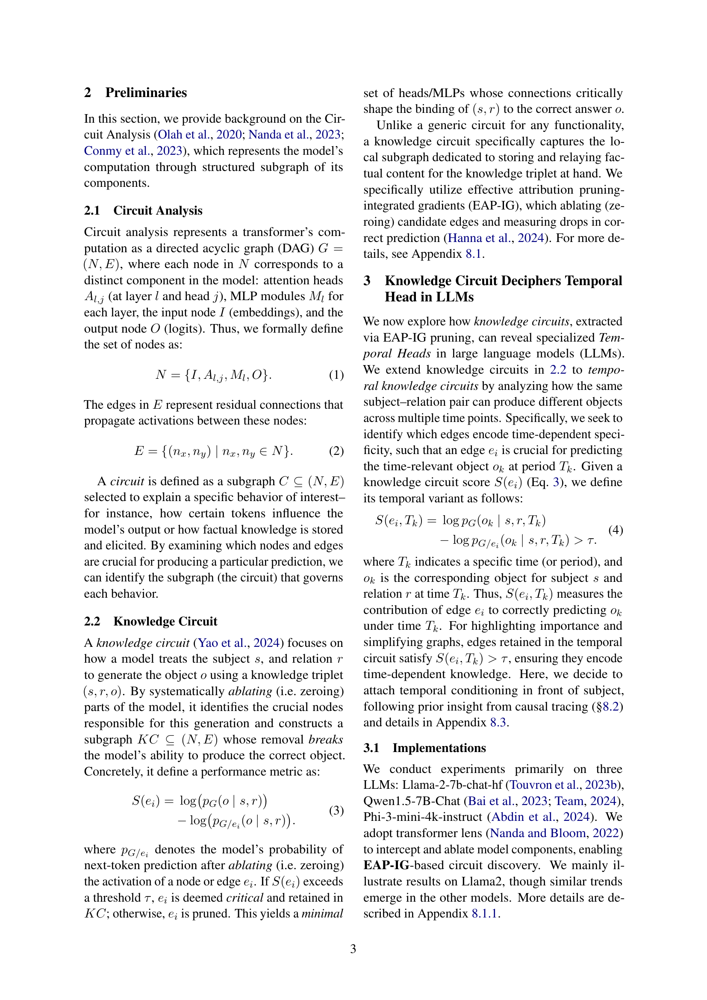
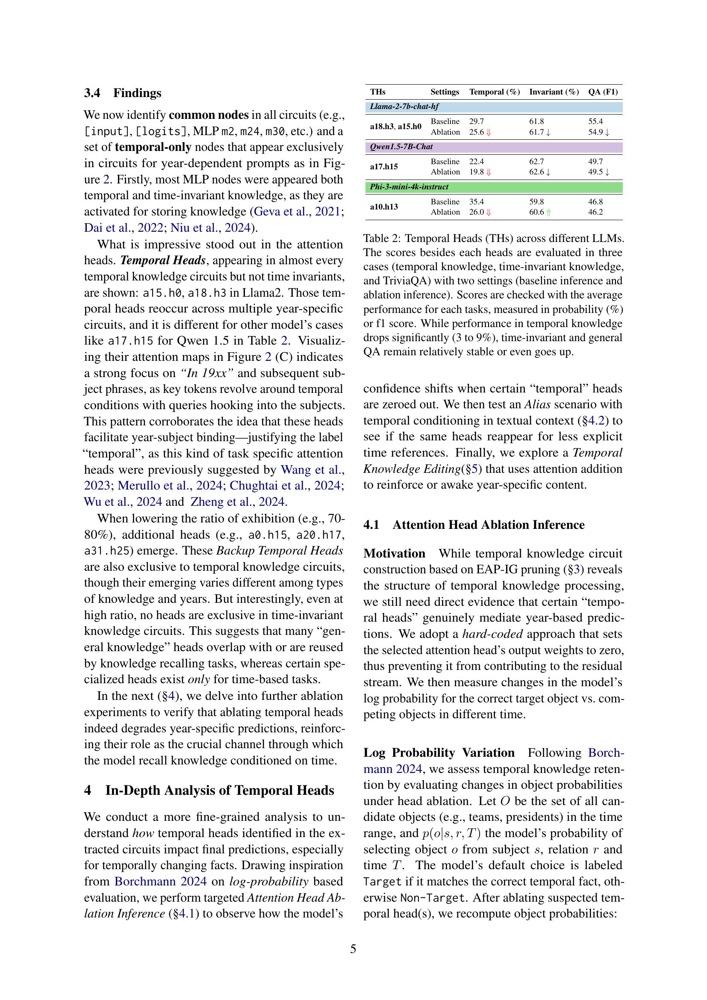
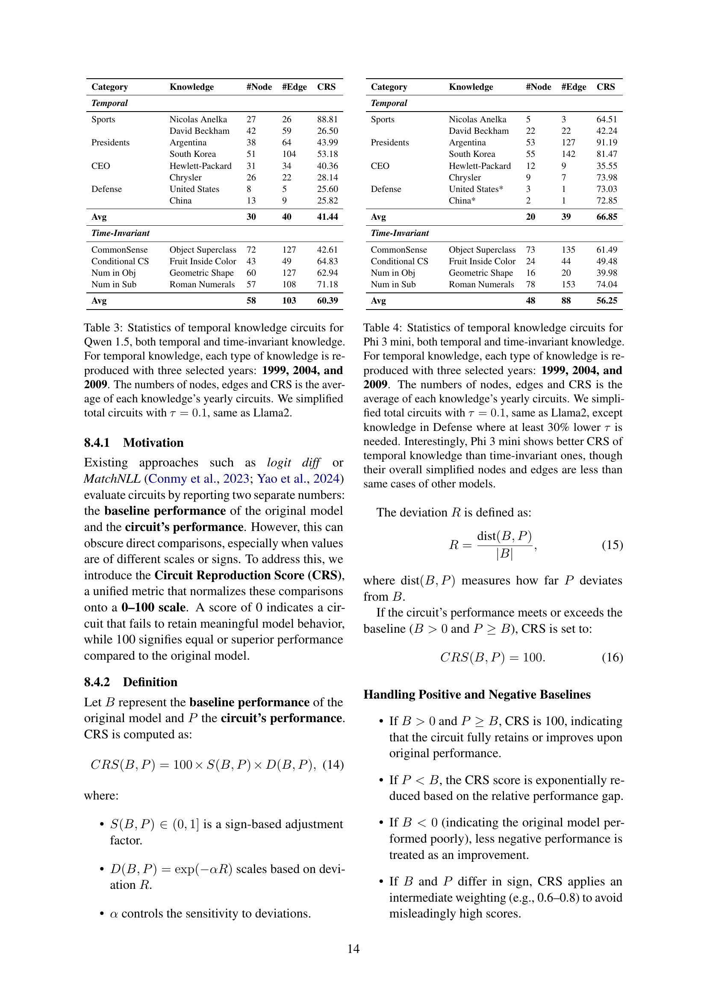

 


 2502.14258 
 Yein Park et el. 
 
 🤗 2025-02-21 
 



↗ arXiv


↗ Hugging Face


↗ Papers with Code


### TL;DR



본 논문은 대규모 언어 모델(LLM)이 시간에 따라 변화하는 정보를 어떻게 처리하는지에 대한 연구입니다. 기존 연구는 주로 LLM이 사실을 얼마나 잘 생성하는지에 초점을 맞추었지만, 시간에 따른 사실의 변화를 다루는 것은 상대적으로 덜 연구되었습니다. 이는 특히 역사적 정보나 시계열 데이터를 다루는 어플리케이션에서 중요한 문제입니다.  

본 연구는 LLM 내부의 특정 어텐션 헤드가 시간 관련 지식 처리에 중요한 역할을 한다는 것을 발견했습니다. 연구진은 이 '시간적 어텐션 헤드'를 식별하고, 이를 제거하거나 활성화함으로써 모델의 시간적 지식 처리 능력을 평가했습니다. 그 결과, 시간적 어텐션 헤드를 제거하면 시간 특정 지식에 대한 모델의 성능이 저하되는 반면, 일반적인 질문 답변 능력에는 영향을 미치지 않는다는 것을 발견했습니다. 더 나아가, 연구진은 시간적 어텐션 헤드의 값을 조절하여 시간에 따른 사실을 직접적으로 편집하는 방법을 제시했습니다.



#### Key Takeaways


 언어 모델 내부에 시간적 지식을 처리하는 데 특화된 '시간적 어텐션 헤드'가 존재함을 밝힘 



 시간적 어텐션 헤드를 조작하여 시간에 따른 특정 사실을 편집하는 방법 제시 



 시간 불변 지식에는 영향을 미치지 않으면서 시간 특정 지식에 대한 모델의 정확도를 향상시키는 방법 제시 


#### Why does it matter?
**본 논문은 언어 모델의 시간적 지식 처리 능력에 대한 새로운 이해를 제공하며, 특히 시간 관련 지식에 특화된 어텐션 헤드를 발견하여 이를 조작함으로써 시간에 따른 사실의 정확성을 편집할 수 있음을 보여줍니다.** 이는 시간에 민감한 정보를 처리하고 이를 모델에 통합하는 새로운 방법을 제시하며, **향후 연구에서 시간적 지식을 가진 언어 모델의 개발 및 개선에 중요한 영향을 미칠 것으로 예상됩니다.** 또한, **기존의 메커니즘적 해석성 연구에 새로운 관점을 제공하며, 언어 모델의 내부 작동 방식에 대한 보다 깊이 있는 이해를 도울 수 있습니다.**

------
#### Visual Insights

> 🔼 그림 1은 다양한 시간대(Tk)에서 여러 가지 시간 관련 지식 회로(TKC) 내에 존재하는 시간 관련 헤드(Temporal Heads)를 보여줍니다. 시간 관련 헤드를 제거하면 모델의 시간 정렬이 깨지고 잘못된 객체가 생성됩니다. 이 그림은 시간에 따라 변화하는 사실들을 언어 모델이 어떻게 처리하는지를 이해하는 데 도움이 되는 시각적 설명을 제공합니다. 특히, 시간 관련 헤드는 시간에 민감한 정보를 처리하는 데 중요한 역할을 하며, 이 헤드의 기능이 손상되면 모델의 시간적 일관성에 문제가 발생할 수 있음을 보여줍니다.
> 

> 
read the caption

> Figure 1: Temporal Heads exist within various TKCs at different times Tksubscript𝑇𝑘T_{k}italic_T start_POSTSUBSCRIPT italic_k end_POSTSUBSCRIPT. Ablating them disrupts the model’s temporal alignment, yielding incorrect objects.
> 


| Category |  | Knowledge | #Node | #Edge | CRS |
|---|---|---|---|---|---| 
| **Temporal** |  |  |  |  |  |
| Sports |  | Nicolas Anelka | 29 | 37 | 74.14 |
|  |  | David Beckham | 43 | 80 | 39.53 |
| Presidents |  | Argentina | 42 | 102 | 60.97 |
|  |  | South Korea | 46 | 110 | 65.55 |
| CEO |  | Hewlett-Packard | 52 | 115 | 53.49 |
|  |  | Chrysler | 51 | 97 | 57.10 |
| Defense |  | United States | 50 | 137 | 48.08 |
|  |  | China | 19 | 19 | 37.62 |
| **Avg** |  |  | **42** | **87** | **54.56** |
| **Time-Invariant** |  |  |  |  |  |
| CommonSense |  | Object Superclass | 43 | 56 | 44.47 |
| Conditional CS |  | Fruit Inside Color | 76 | 131 | 53.08 |
| Num in Obj |  | Geometric Shape | 52 | 118 | 76.09 |
| Num in Sub |  | Roman Numerals | 43 | 135 | 95.70 |
| **Avg** |  |  | **54** | **110** | **67.33** |

> 🔼 본 표는 Llama2 모델을 사용하여 생성한 시간 관련 지식 회로의 통계를 보여줍니다. 시간 관련 지식의 경우, 세 가지 연도(1999년, 2004년, 2009년)에 대해 각 지식 유형별로 회로가 생성되었고, 노드, 에지, CRS(Circuit Reproduction Score) 값은 각 지식의 연간 회로 평균값입니다. 시간 불변 지식에 대한 통계도 함께 제시되어 있습니다.
> 

> 
read the caption

> Table 1: Statistics of temporal knowledge circuits for Llama2, both temporal and time-invariant knowledge. For temporal knowledge, each type of knowledge is reproduced with three selected years: 1999, 2004, and 2009. The numbers of nodes, edges and CRS is the average of each knowledge’s yearly circuits.
> 

### In-depth insights

#### Temporal Heads
논문에서 제시된 'Temporal Heads'는 **시간에 민감한 정보를 처리하는 데 특화된 어텐션 헤드**를 의미합니다.  이는 단순히 숫자(

#### Circuit Analysis
본 논문에서 회로 분석(Circuit Analysis)은 **대규모 언어 모델(LLM)**의 내부 동작 메커니즘을 이해하기 위한 핵심적인 방법론으로 제시됩니다.  이는 LLM이 어떻게 특정 정보를 처리하고, 특히 시간에 따라 변화하는 지식을 다루는지에 대한 심층적인 분석을 가능하게 합니다.  **뉴런이나 연결 구조가 아닌, 모델 내부의 여러 구성 요소(어텐션 헤드, MLP 등) 간의 정보 흐름을 그래프 형태로 시각화**하여 분석하는 방식으로, 특정 질문에 대한 답변 생성 과정에 기여하는 요소들을 명확히 밝혀낼 수 있습니다.  이를 통해 **시간 관련 정보 처리에 특화된 '시간 헤드(Temporal Heads)'를 발견**하고, 이들의 역할과 중요성을 규명하는 데 활용됩니다.  즉, 단순히 모델의 예측 결과만이 아닌, 그 **내부적인 처리 과정을 추적**함으로써 시간 정보 처리 메커니즘에 대한 보다 명확한 이해를 제시합니다.

#### Ablation Study
본 논문의 '절제 연구(Ablation Study)' 부분은 **언어 모델의 시간적 지식 처리 능력에 대한 심층적인 이해**를 제공합니다.  연구진은 **시간 특화 어텐션 헤드(Temporal Heads)** 라는 특정 어텐션 메커니즘을 식별하고, 이를 제거(절제)했을 때 모델의 시간 특유 지식 재현 능력이 저하되는 것을 확인했습니다.  **시간 불변 지식이나 일반적인 질의응답 능력에는 영향을 미치지 않으면서 시간 특유 지식에만 영향**을 준다는 점이 중요한 발견입니다. 이는 **시간적 지식이 모델 내부에 특정 메커니즘에 의해 독립적으로 처리**됨을 시사합니다.  **수치적 표현뿐 아니라 텍스트 언급에도 반응**하는 점은 시간적 차원을 단순한 숫자 표현 이상으로 인코딩함을 보여줍니다.  이 연구는 **언어 모델의 내부 메커니즘에 대한 새로운 통찰력**을 제공하며, 시간적 지식 편집 및 개선을 위한 새로운 가능성을 제시합니다.  **시간적 지식에 대한 어텐션 헤드의 중요성**을 명확히 보여주는 이 절제 연구는 향후 언어 모델의 시간적 추론 능력 향상에 기여할 것으로 예상됩니다.

#### Knowledge Editing
본 논문에서 제시된 '지식 편집(Knowledge Editing)' 개념은 **언어 모델의 내부 메커니즘을 조작하여 특정 시간에 따른 지식을 수정하는 혁신적인 방법**을 의미합니다.  단순히 모델에 새로운 정보를 추가하는 것이 아니라, **특정 어텐션 헤드(Temporal Heads)의 활성화 값을 조정**함으로써 시간에 따른 사실의 변화를 직접적으로 반영할 수 있습니다. 이는 **기존의 미세 조정(fine-tuning) 방식과 달리 모델 전체를 재학습시키지 않고 특정 지식만을 효율적으로 수정**할 수 있다는 점에서 매우 중요한 의미를 지닙니다.  **Temporal Heads는 시간 특이적 지식 처리에 주로 관여하는 특정 어텐션 헤드**이며, 이를 조작하여 과거의 잘못된 정보를 수정하거나 현재의 정보와 일치하도록 만들 수 있습니다.  이는 **인간의 기억과 유사하게 과거의 기억을 수정하거나 갱신**하는 모델의 능력을 보여주는 중요한 발견입니다.  하지만 이 방법은 아직 초기 단계이며,  **모든 유형의 지식에 적용 가능한 것은 아니고,  모델의 내부 구조에 대한 깊이 있는 이해**가 필요하다는 점을 명심해야 합니다.

#### Future Work
본 논문에서 제시된 시간적 지식에 대한 심층적인 이해는 **미래 연구를 위한 풍부한 가능성**을 제시합니다.  특히, **다양한 언어 모델 아키텍처 전반에 걸쳐 시간적 헤드의 존재와 역할**을 규명하는 연구는 모델의 시간적 추론 메커니즘에 대한 보다 포괄적인 이해를 제공할 것입니다.  또한, **시간적 헤드의 조작을 통한 시간 특이적 지식의 편집 및 수정**은 기존의 미세 조정 방식을 뛰어넘는 효율적인 방법으로,  **새로운 지식 편집 및 증강 기술** 개발에 중요한 발판이 될 수 있습니다.  **시간적 헤드에 대한 더욱 정교한 분석**을 통해, 특정 시점에 대한 정보의 정확도 및 신뢰성을 향상시키는 연구도 필요하며,  **다양한 종류의 시간적 지식 표현에 대한 연구**도 중요한 미래 과제입니다.  **시간적 헤드의 기능을 보다 명확히 규명**하고 이를 다양한 응용 분야에 활용하기 위한 후속 연구가 필요합니다. 이를 통해, 시간에 따라 변화하는 정보를 정확하고 효율적으로 처리하는 차세대 언어 모델 개발에 크게 기여할 것입니다.

### More visual insights

More on figures

> 🔼 그림 2는 시간에 따른 지식 회로 분석의 개요를 보여줍니다. (A)는 시간에 따른 지식 회로(TKC)를 구성하고, 시간 불변 지식을 사용하여 일반 지식 회로(KC)와 비교하는 과정을 보여줍니다. 회로는 시간 T, 주어 S, 관계 R에 대한 잔차 스트림을 재현합니다. 이를 통해 다양한 연도 Tk마다 서로 다른 TKC에서만 발견되는 시간적 헤드가 검증됩니다. (B)는 단순화된 TKC의 예시입니다. 여기서 기본 지식 노드는 보라색으로 표시되며(두 가지 모두 공통), 시간적 헤드는 강조 표시됩니다. (C)는 시간적 헤드에 대한 어텐션 맵을 보여줍니다. a15.h0는 15번째 계층의 첫 번째 어텐션 헤드를 의미합니다. 각 헤드의 어텐션 패턴은 어휘 공간에 매핑하여 헤드의 출력 로짓으로 표현됩니다. 쿼리는 다른 토큰에 집중하는 입력 토큰이고, 키는 집중되는 토큰입니다. 값은 어텐션 가중치를 나타내며 초점의 강도를 나타냅니다. 전체 결과는 그림 7-8과 그림 9-11에 나와 있습니다.
> 

> 
read the caption

> Figure 2: Overview of temporal knowledge circuit analysis. (A): Construct temporal knowledge circuits (TKCs), and compare it with general knowledge circuits (KCs) using time-invariant knowledge. Circuits reproduce residual streams for time T, subject S and relation R. This verifies temporal heads only found in each different TKCs of various year Tksubscript𝑇𝑘T_{k}italic_T start_POSTSUBSCRIPT italic_k end_POSTSUBSCRIPT. (B): Example of simplified TKC. Here, basic knowledge nodes is colored violet, (common in both), while Temporal Heads is highlited. (C): Attention map for temporal heads. a15.h0 means the 15th layer’s first attention head. Each head’s attention pattern is represented as the output logits of the hean by mapping to vocabulary space. Queries are input tokens focusing on others, while keys are the tokens being focused on. Values represent attention weights, indicating the strength of this focus. Total results are in Figures 7–8 and 9–11.
> 

> 🔼 그림 3은 시간에 따른 지식에 대한 로그 확률 결과를 보여줍니다.  'XXXX년도 대한민국 대통령은 누구였습니까?' 라는 프롬프트를 사용했습니다. (A)는 Llama2 모델의 예측 확률 변화를 보여줍니다. 동일한 프롬프트를 사용하여 연도별로 헤드 절제의 영향이 다르게 나타납니다. 각 서브 플롯은 올바른 답변(녹색)과 잘못된 답변(빨간색)의 확률 분포를 보여주며, x축은 확률 값을, y축은 목표 응답과 목표 외 응답을 구분합니다. 각 모델에 대한 전체 결과는 부록 그림 12-13에 나와 있습니다. (B)는 여러 해에 걸친 성능 저하 추세를 보여줍니다. 절제 결과의 평균을 내어 두 선 그래프 사이의 회색 영역이 빨간색 화살표로 표시된 성능 저하 수준을 나타냅니다. (갭이 클수록 어두워지고 커짐). 배경에는 1999년부터 2009년까지 객체가 어떻게 변화했는지 나와 있습니다.
> 

> 
read the caption

> Figure 3: Log probability results with temporal knowledge; In XXXX, the president of South Korea was. (A) shows prediction probability change among results of Llama2. The effect of head ablation reacts differently for each selected year with the same prompt. Each subplot in (A) represents the probability distribution of correct (green) and incorrect (red) predictions, where the x-axis denotes probability values and the y-axis differentiates between target and non-target responses. Total results for each model are in Figures 12–13 in Appendix. (B) illustrates the performance degradation trends across various years. As averaging the result of ablation, the gray space between two line plots represent degradation level pointed out by red arrows (which becomes darker and bigger when the gap is wider). The background shows how objects were changed in the time range between 1999 to 2009.
> 

> 🔼 그림 4는 다양한 유형의 지식에 대한 헤드 제거(ablation)의 영향을 보여줍니다. 세 가지 모델에서 시간 관련 지식(왼쪽)과 시간 불변 지식(오른쪽)에 대한 차이가 뚜렷하게 나타납니다. 성능 변화는 모델별 시간 헤드 정보를 사용하여 기준(제거 전) 및 수정된(제거 후) 점수의 평균으로 계산됩니다. 모델에 따라 성능 저하 정도는 다르지만, 전반적인 경향은 시간에 민감한 지식 추론에 시간 헤드의 중요성을 반영합니다.
> 

> 
read the caption

> Figure 4:  Head ablation effect across various knowledge types. Three selcted model shows distinct differentiation for temporal knowledge (left side) and time invariant knowledge (right side). The change of performance is calculated with the average score of baseline (non-ablation) and modified (ablated result), using model specific temporal head information. While degrees of degradation is different among models, overall tendency reflects the importance of temporal head to inference temporal knowledge.
> 

> 🔼 그림 5는 시간 특정 지식 편집의 예시를 보여줍니다. 소스 프롬프트에서 모델 헤드의 특정 어텐션 값 (예: a18.h3)을 가져와 타겟 프롬프트에 추가하면 모델의 출력이 시간적으로 잘못된 답변에서 시간적으로 정확한 답변으로 변경됩니다. 아래의 히트맵은 계층과 헤드의 모든 조합에 대한 편집 성공 횟수를 나타냅니다. 가장 성공적인 경우는 강조 표시된 시간 헤드 a18.h3이며, 백업 시간 헤드 a20.h17과 같은 다른 헤드가 그 뒤를 잇습니다.
> 

> 
read the caption

> Figure 5: Example Of Temporal Knowledge Editing. From the source prompt, we catch the specific attention value of model’s head, for example, a18.h3. By simply adding it to target prompt, the model’s output is changed into temporally correct answer from temporally wrong answer. The headmap below denotes the number of success in editing for every combination of layers and heads. The most successful case in here is temporal heads a18.h3 as highlighted, following other heads such as backup temporal heads a20.h17.
> 

> 🔼 그림 6은 주어, 관계, 목적어 세 가지 위치에 대한 원인 추적 결과를 보여줍니다. 위에서부터 아래 순서대로 총 여섯 개의 그래프가 있으며, 각 위치에 대해 1999년과 2004년 두 시점을 기준으로 시간적 조건을 설정했습니다.  각 그래프는 시간적 훼손(corruption) 이후 서로 다른 레이어(x축)들을 복구했을 때 p(New) 또는 p(Barcelona)에 어떤 영향을 미치는지 보여주는 원인 추적 히트맵입니다. 목적어 위치에는 대체값으로 [Object]를 사용했습니다.  왼쪽 열은 단일 레이어 복구를, 가운데와 오른쪽 열은 MLP 대비 어텐션 간격을 반영합니다.  중간 레이어에서 주어와 연도를 복구하면 큰 차이(어두운 영역)가 나타나는 반면, 관계+연도 또는 목적어+연도를 복구하면 범위가 크게 겹쳐 미미한 차이만 보입니다.
> 

> 
read the caption

> Figure 6: Results of Causal Tracing for all position(subject, relation, object), six plots for each cases from the top to middle and bottom. The restoring part is set to each temporal conditioning, in two different age: 1999 and 2004. (Illustrative) Causal tracing heatmaps showing how restoring different layers (x-axis) after temporal corruption affects p⁢(New)pNew\mathrm{p}(\text{New})roman_p ( New ) or p⁢(Barcelona)pBarcelona\mathrm{p}(\text{Barcelona})roman_p ( Barcelona ). For the object position, we set a simulated [Object] for the place holder. Each figure’s left column represents single-layer restoration; the center and right columns reflect MLP vs. attention intervals. Restoring subject+year at mid layers yields pronounced differences (dark regions). On the other hand, restoring relation+year or object+year yields trivial differences as their range is overlap significantly.
> 

> 🔼 그림 7은 Llama2 모델의 시간적 지식 회로를 보여줍니다.  EAP-IG(Effective Attribution Pruning-Integrated Gradients) 기법을 사용하여 모델의 내부 연산을 분석하고, 각 노드의 중요도를 평가하여 시간에 따라 변화하는 사실을 처리하는 데 중요한 노드들만을 포함하는 간소화된 버전의 회로입니다. 임계값 τ (tau)를 0.1로 설정하여 중요도가 낮은 노드는 제거되었습니다. 그림은 시간 관련 정보를 처리하는 데 중요한 역할을 하는 주요 노드들과 그들 간의 연결 관계를 시각적으로 보여줍니다. 이를 통해, 모델이 시간 특정 정보를 어떻게 처리하고 기억하는지에 대한 이해를 도울 수 있습니다.
> 

> 
read the caption

> Figure 7: Temporal knowledge circuit of Llama2. It is simplified version of total circuit by its importance of each nodes using τ=0.1𝜏0.1\tau=0.1italic_τ = 0.1 as threshold.
> 

> 🔼 그림 8은 Qwen 1.5와 Phi 3 mini 모델의 시간적 지식 회로를 보여줍니다. 이 그림은 각 노드와 간선의 중요도에 따라 단순화된 전체 회로의 간략한 버전입니다. 여기서 임계값 τ (tau)는 0.1로 설정되었습니다. 그림은 각 모델의 시간적 지식 처리 과정을 보여주는 다양한 노드와 간선들의 연결을 시각적으로 보여줍니다.  단순화된 회로는 모델 내에서 시간에 민감한 정보의 흐름을 이해하는 데 도움이 됩니다. 특히, 특정 노드와 간선이 시간 관련 지식에 얼마나 중요한 역할을 하는지 보여줍니다.
> 

> 
read the caption

> Figure 8: Temporal knowledge circuit of Qwen 1.5 and Phi 3 mini. Those are simplified version of total circuit according to each nodes and edges’ importance of using same τ=0.1𝜏0.1\tau=0.1italic_τ = 0.1 as threshold.
> 

> 🔼 그림 9는 Llama2-7b-chat-hf 모델에서 시간 관련 정보를 처리하는 데 주로 사용되는 어텐션 헤드(Temporal Heads)와 보조적으로 사용되는 어텐션 헤드(Backup Temporal Heads)의 어텐션 분포를 보여줍니다. 그림의 왼쪽은 Temporal Heads의 어텐션 분포를, 오른쪽은 Backup Temporal Heads의 어텐션 분포를 나타냅니다. 각 어텐션 헤드는 특정 토큰에 대한 어텐션 가중치를 시각화하여 모델이 시간 관련 정보를 어떻게 처리하는지 이해하는 데 도움을 줍니다.  각 셀의 색깔은 어텐션 가중치의 크기를 나타내며, 밝은 색일수록 가중치가 높다는 것을 의미합니다. 이 그림을 통해 모델이 시간에 따른 지식 변화를 어떻게 처리하는지, 그리고 Temporal Heads와 Backup Temporal Heads가 각각 어떤 역할을 수행하는지에 대한 통찰력을 얻을 수 있습니다.
> 

> 
read the caption

> Figure 9: Total map of attention with Llama2-7b-chat-hf, for each temporal heads and backup temporal heads. The left side of border line is the attention map of Temporal Heads, and the other side is the result of Backup Temporal Heads.
> 

> 🔼 그림 10은 Qwen-1.5-7B-Chat 모델의 어텐션 메커니즘에서 시간 정보를 처리하는 데 주로 관여하는 어텐션 헤드(Temporal Heads)와 보조적인 역할을 하는 어텐션 헤드(Backup Temporal Heads)의 어텐션 분포를 보여줍니다. 그림의 왼쪽은 Temporal Heads의 어텐션 분포를, 오른쪽은 Backup Temporal Heads의 어텐션 분포를 나타냅니다.  각 어텐션 헤드는 특정 토큰(단어)에 얼마나 집중하는지를 나타내는 어텐션 가중치(attention weight)를 시각적으로 보여줍니다. 이를 통해 시간에 따른 정보 처리 과정에서 각 어텐션 헤드의 역할과 상호작용을 이해할 수 있습니다. 특히, 시간 관련 단어나 구문에 어떤 헤드가 더 많이 집중하는지, 그리고 Temporal Heads와 Backup Temporal Heads 간의 상호 연관성을 파악하는 데 도움이 됩니다.
> 

> 
read the caption

> Figure 10: Total map of attention with Qwen1.5-7B-Chat, for each temporal heads and backup temporal heads. The left side of border line is the attention map of Temporal Heads, and the other side is the result of Backup Temporal Heads.
> 

> 🔼 그림 11은 Phi-3-mini-4k-instruct 모델의 어텐션 맵을 보여줍니다. 각각의 시간 관련 헤드와 백업 시간 관련 헤드에 대한 어텐션 맵을 나타냅니다. 경계선 왼쪽은 시간 관련 헤드의 어텐션 맵이고, 오른쪽은 백업 시간 관련 헤드의 결과를 보여줍니다. 이 그림은 특정 시간 정보를 처리하는 데 사용되는 모델 내부 메커니즘을 이해하는 데 도움이 됩니다.  각 헤드의 어텐션 패턴을 시각화하여, 모델이 특정 단어나 구절에 얼마나 집중하는지 보여줍니다. 이는 시간 관련 지식을 처리하는 모델의 능력을 평가하고, 시간 관련 지식에 대한 모델의 내부 표현 방식을 분석하는 데 사용될 수 있습니다.
> 

> 
read the caption

> Figure 11: Total map of attention with Phi-3-mini-4k-instruct, for each temporal heads and backup temporal heads. The left side of border line is the attention map of Temporal Heads, and the other side is the result of Backup Temporal Heads.
> 

> 🔼 그림 12는 Llama2-7b-chat-hf 모델에서 각 어텐션 헤드를 제거했을 때의 결과를 로그 확률로 나타낸 것입니다. 그림은 시간에 따른 지식(temporal knowledge)에 대한 질문에 대해, 특정 어텐션 헤드(a15.h0, a18.h3)를 제거했을 때 정답 확률이 어떻게 변하는지를 보여줍니다. 각 그래프는 특정 연도(1999년부터 2009년까지)의 질문에 대한 결과를 나타내며, 헤드 제거 전후의 정답 및 오답 확률의 변화를 시각적으로 보여줍니다. 이를 통해 특정 어텐션 헤드가 시간에 따른 지식을 처리하는 데 중요한 역할을 한다는 것을 확인할 수 있습니다.
> 

> 
read the caption

> Figure 12: Total results of Llama2-7b-chat-hf, head ablation inference with log probability.
> 

More on tables


| THs | Settings | Temporal (%) | Invariant (%) | QA (F1) |
|---|---|---|---|---|
| **Llama-2-7b-chat-hf** |
| **a18.h3**, **a15.h0** | Baseline | 29.7 | 61.8 | 55.4 |
|  | Ablation | 25.6 ↓ | 61.7 ↓ | 54.9 ↓ |
| **Qwen1.5-7B-Chat** |
| **a17.h15** | Baseline | 22.4 | 62.7 | 49.7 |
|  | Ablation | 19.8 ↓ | 62.6 ↓ | 49.5 ↓ |
| **Phi-3-mini-4k-instruct** |
| **a10.h13** | Baseline | 35.4 | 59.8 | 46.8 |
|  | Ablation | 26.0 ↓ | 60.6 ↑ | 46.2 |
> 🔼 표 2는 세 가지 다른 대규모 언어 모델(LLM)에서 발견된 시간적 헤드(Temporal Heads, THs)를 보여줍니다. 각 시간적 헤드에 대해 세 가지 다른 유형의 지식(시간 종속적 지식, 시간 불변 지식, TriviaQA)에 대한 기준 추론(baseline inference)과 시간적 헤드 제거 추론(ablation inference) 두 가지 설정에서의 점수가 제시됩니다. 점수는 각 작업에 대한 평균 성능을 기준으로 하며, 백분율(%) 또는 F1 점수로 측정됩니다. 결과적으로, 시간 종속적 지식에 대한 성능은 3~9% 감소했지만, 시간 불변 지식과 일반적인 질의응답(QA)의 성능은 상대적으로 안정적이거나 오히려 향상되었습니다.
> 

> 
read the caption

> Table 2: Temporal Heads (THs) across different LLMs. The scores besides each heads are evaluated in three cases (temporal knowledge, time-invariant knowledge, and TriviaQA) with two settings (baseline inference and ablation inference). Scores are checked with the average performance for each tasks, measured in probability (%) or f1 score. While performance in temporal knowledge drops significantly (3 to 9%), time-invariant and general QA remain relatively stable or even goes up.
> 


| Category |  | Knowledge | #Node | #Edge | CRS |
|---|---|---|---|---|---| 
| **Temporal** |  |  |  |  |  |
| Sports |  | Nicolas Anelka | 27 | 26 | 88.81 |
|  |  | David Beckham | 42 | 59 | 26.50 |
| Presidents |  | Argentina | 38 | 64 | 43.99 |
|  |  | South Korea | 51 | 104 | 53.18 |
| CEO |  | Hewlett-Packard | 31 | 34 | 40.36 |
|  |  | Chrysler | 26 | 22 | 28.14 |
| Defense |  | United States | 8 | 5 | 25.60 |
|  |  | China | 13 | 9 | 25.82 |
| **Avg** |  |  | **30** | **40** | **41.44** |
| **Time-Invariant** |  |  |  |  |  |
| CommonSense |  | Object Superclass | 72 | 127 | 42.61 |
| Conditional CS |  | Fruit Inside Color | 43 | 49 | 64.83 |
| Num in Obj |  | Geometric Shape | 60 | 127 | 62.94 |
| Num in Sub |  | Roman Numerals | 57 | 108 | 71.18 |
| **Avg** |  |  | **58** | **103** | **60.39** |
> 🔼 표 3은 Qwen 1.5 모델을 사용하여 생성한 시간 관련 지식 회로의 통계를 보여줍니다.  시간 관련 지식과 시간 불변 지식 모두 포함되어 있으며, 시간 관련 지식의 경우 1999년, 2004년, 2009년 세 해의 데이터를 사용하여 각 지식 유형별로 회로를 생성했습니다. 노드, 에지, CRS(회로 재현 점수) 값은 각 지식 유형별 연도별 회로의 평균값입니다. Llama2와 동일하게, 임계값 τ를 0.1로 설정하여 전체 회로를 간소화했습니다.  즉, 이 표는 Qwen 1.5 모델에서 시간에 따른 지식 처리 방식을 분석하기 위해 사용된 지식 회로의 크기와 성능을 보여주는 통계 데이터입니다.
> 

> 
read the caption

> Table 3: Statistics of temporal knowledge circuits for Qwen 1.5, both temporal and time-invariant knowledge. For temporal knowledge, each type of knowledge is reproduced with three selected years: 1999, 2004, and 2009. The numbers of nodes, edges and CRS is the average of each knowledge’s yearly circuits. We simplified total circuits with τ=0.1𝜏0.1\tau=0.1italic_τ = 0.1, same as Llama2.
> 


| Category |  | Knowledge | #Node | #Edge | CRS |
|---|---|---|---|---|---| 
| **Temporal** |  |  |  |  |  |
| Sports |  | Nicolas Anelka | 5 | 3 | 64.51 |
|  |  | David Beckham | 22 | 22 | 42.24 |
| Presidents |  | Argentina | 53 | 127 | 91.19 |
|  |  | South Korea | 55 | 142 | 81.47 |
| CEO |  | Hewlett-Packard | 12 | 9 | 35.55 |
|  |  | Chrysler | 9 | 7 | 73.98 |
| Defense |  | United States* | 3 | 1 | 73.03 |
|  |  | China* | 2 | 1 | 72.85 |
| **Avg** |  |  | **20** | **39** | **66.85** |
| **Time-Invariant** |  |  |  |  |  |
| CommonSense |  | Object Superclass | 73 | 135 | 61.49 |
| Conditional CS |  | Fruit Inside Color | 24 | 44 | 49.48 |
| Num in Obj |  | Geometric Shape | 16 | 20 | 39.98 |
| Num in Sub |  | Roman Numerals | 78 | 153 | 74.04 |
| **Avg** |  |  | **48** | **88** | **56.25** |
> 🔼 표 4는 Phi-3 mini 모델을 사용하여 생성된 시간 관련 지식 회로의 통계를 보여줍니다. 시간 관련 지식의 경우 세 가지 연도(1999년, 2004년, 2009년)의 데이터를 사용하여 각 지식 유형에 대한 회로를 생성하였고, 노드와 에지의 수, 그리고 CRS(Circuit Reproduction Score) 값은 각 연도별 회로의 평균값을 나타냅니다. Llama2와 동일하게 임계값 τ를 0.1로 설정하였으나, 방위산업 분야 지식의 경우에는 τ값을 최소 30% 낮춰서 적용했습니다. 흥미롭게도 Phi-3 mini 모델은 시간 불변 지식보다 시간 관련 지식에 대해 더 높은 CRS 값을 보였는데, 이는 시간 관련 지식의 경우 더 정확하게 모델의 동작을 재현한다는 것을 의미합니다.  하지만,  전반적인 노드와 에지의 수는 다른 모델들에 비해 적었습니다.
> 

> 
read the caption

> Table 4: Statistics of temporal knowledge circuits for Phi 3 mini, both temporal and time-invariant knowledge. For temporal knowledge, each type of knowledge is reproduced with three selected years: 1999, 2004, and 2009. The numbers of nodes, edges and CRS is the average of each knowledge’s yearly circuits. We simplified total circuits with τ=0.1𝜏0.1\tau=0.1italic_τ = 0.1, same as Llama2, except knowledge in Defense where at least 30% lower τ𝜏\tauitalic_τ is needed. Interestingly, Phi 3 mini shows better CRS of temporal knowledge than time-invariant ones, though their overall simplified nodes and edges are less than same cases of other models.
> 


| Category | Time Range | # of Cases |
|---|---|---|
| **Temporal Knowledge (Vrandečić and Krötzsch, 2014)** |  |  |
| Sports | 1996-2020 | 81 |
| Presidents | 1999-2009 | 65 |
| CEO | 1999-2009 | 65 |
| Defense | 1999-2009 | 77 |
| Movies | 1999-2009 | 33 |
| GDP | 1999-2009 | 33 |
| Inflations | 1999-2009 | 33 |
| **Time Invariant Knowledge (Hernandez et al., 2024)** |  |  |
| Object Superclass | - | 36 |
| Fruit Inside Color | - | 76 |
| Geometric Shape | - | 28 |
| Roman Numerals | - | 31 |
> 🔼 본 표는 논문의 데이터셋 통계를 보여줍니다.  Temporal Knowledge와 Time-Invariant Knowledge 두 가지 유형의 데이터셋에 대한 통계를 나타냅니다. 각 유형별로 여러 하위 범주 (예: 스포츠, 대통령, CEO 등)가 있으며, 각 범주에 대해 데이터 수집 기간과 데이터 포인트 수가 제시되어 있습니다. 이 표는 논문에서 사용된 Temporal Knowledge Circuit과 Time-Invariant Knowledge Circuit 분석에 사용된 데이터의 규모와 특징을 이해하는 데 도움이 됩니다.
> 

> 
read the caption

> Table 5: Statistics of dataset used for circuits.
> 


| Dataset | Format | Test | Source |
|---|---|---|---| 
| TriviaQA | MCQA | 11,313 | Joshi et al., 2017 | 
| Math ChroKnowledge | MCQA | 2,585 | Wang, 2022; Park et al., 2025 |
> 🔼 표 6은 논문에서 사용된 일반적인 질문 답변(QA) 데이터셋의 통계를 보여줍니다.  TriviaQA와 Math ChroKnowledge 두 가지 데이터셋이 사용되었으며, 각 데이터셋의 형식(MCQA), 데이터셋 크기, 그리고 데이터셋의 출처를 나타냅니다. 이 표는 논문의 실험에서 사용된 QA 데이터셋의 전반적인 특징을 한눈에 보여주어 독자들이 데이터셋에 대한 이해를 돕습니다.
> 

> 
read the caption

> Table 6: Statistics of dataset used general QA.
> 


| Settings | Temporal Knowledge (%) | Average |
|---|---|---|
|  | Sports | Presidents | CEO | Defense | Movies | GDP | Inflations |  |
| **Llama-2-7b-chat-hf - a18,h3, a15.h0** |  |  |  |  |  |  |  |  |
| Baseline | 41.9 | 80.7 | 27.5 | 13.5 | 23.1 | 10.4 | 10.8 | 29.7 |
| Ablation | 40.0 | 75.6 | 21.3 | 13.3 | 9.37 | 10.7 | 9.34 | 25.6 |
| **Qwen1.5-7B-Chat - a17.h15** |  |  |  |  |  |  |  |  |
| Baseline | 32.4 | 57.2 | 19.6 | 11.5 | 16.7 | 9.58 | 10.0 | 22.4 |
| Ablation | 32.0 | 49.4 | 16.6 | 10.3 | 10.8 | 9.50 | 10.3 | 19.8 |
| **Phi-3-mini-4k-instruct - a10.h13** |  |  |  |  |  |  |  |  |
| Baseline | 24.4 | 72.1 | 30.8 | 73.7 | 21.4 | 12.2 | 13.5 | 35.4 |
| Ablation | 24.8 | 69.6 | 30.7 | 11.5 | 21.6 | 11.7 | 11.8 | 26.0 |
> 🔼 표 7은 여러 언어 모델에서 시간에 따른 지식에 대한 결과를 보여줍니다. 각 점수는 여러 헤드 절단 결과의 평균 확률(%)로 측정되었으며, 각 열에서 가장 점수가 많이 떨어진 점수는 빨간색으로 표시되었습니다. 이 표는 시간에 따라 변하는 지식에 대한 모델의 성능을 평가하고, 시간 지식 처리에 특정 어텐션 헤드의 중요성을 강조하는 데 도움이 됩니다.
> 

> 
read the caption

> Table 7: Total results of temporal knowledge across multiple models. Each scores were measured in probability (%) with averaging effect of multiple heads ablation results. The most dropped score for each column is colored red.
> 


| Settings | Obj-Super | Fruit In-Color | Geo-Shape | Roman-Num | Average | TriviaQA | Math |
|---|---|---|---|---|---|---|---| 
| **Llama-2-7b-chat-hf - a18,h3, a15.h0** |  |  |  |  |  |  |  |
| Baseline | 49.7 | 75.6 | 68.5 | 53.5 | 61.8 | 55.4 | 45.4 |
| Ablation | 50.2 | 75.6 | 68.1 | 53.0 | 61.7 | 54.9 | 45.3 |
| **Qwen1.5-7B-Chat - a17.h15** |  |  |  |  |  |  |  |
| Baseline | 48.0 | 72.0 | 69.4 | 61.5 | 62.7 | 49.7 | 77.0 |
| Ablation | 47.8 | 72.0 | 69.3 | 61.1 | 62.6 | 49.5 | 77.0 |
| **Phi-3-mini-4k-instruct - a10.h13** |  |  |  |  |  |  |  |
| Baseline | 21.8 | 76.0 | 68.3 | 73.2 | 59.8 | 46.8 | 80.8 |
| Ablation | 23.2 | 76.4 | 69.1 | 73.7 | 60.6 | 46.2 | 81.2 |
> 🔼 표 8은 세 가지 대규모 언어 모델(LLM)에서 시간 불변 지식과 일반적인 질의응답(QA) 작업에 대한 실험 결과를 보여줍니다. TriviaQA 데이터셋의 경우 필터링되지 않고 문맥이 없는 검증 세트(11,313개)를 사용했습니다. 각 점수는 여러 헤드 절제 결과의 평균 확률(%) 또는 F1 점수로 측정되었으며, 대부분의 경우 점수가 안정적으로 유지되거나 개체 중첩과 같이 상승하는 경향을 보였습니다.
> 

> 
read the caption

> Table 8: Total results of time invariant knowledge and general QA across multiple models. For TriviaQA, we test the unfiltered, no-context validation set (11.3k). Each scores were measured in probability (%) or f1 score with averaging effect of multiple heads ablation results. Most of cases, the scores remain stable or even goes up such as Object Superposition.
> 

### Full paper



