 


 2502.14282 
 Haowei Liu et el. 
 
 🤗 2025-02-21 
 



↗ arXiv


↗ Hugging Face


↗ Papers with Code


### TL;DR



현재의 대형 언어 모델(MLLM) 기반 GUI 에이전트는 스마트폰과 달리 PC 환경의 복잡한 상호 작용과 앱 간 작업 흐름을 효과적으로 처리하는 데 어려움을 겪고 있습니다. 특히 화면 정보 인식 및 복잡한 사용자 지시 사항의 해석에 어려움이 있습니다.  기존 연구들은 이러한 문제에 대한 완벽한 해결책을 제시하지 못했습니다.

본 논문에서는 이러한 문제를 해결하기 위해 PC-Agent라는 새로운 프레임워크를 제시합니다. PC-Agent는 **계층적 다중 에이전트 협업 구조**를 통해 복잡한 작업을 하위 작업으로 분해하고, **능동적 인식 모듈(APM)**을 통해 화면 정보 인식 능력을 향상시켰습니다. 또한 **오류 감지 및 수정 메커니즘**을 도입하여 시스템의 안정성을 높였습니다.  새로운 벤치마크 PC-Eval을 통해 PC-Agent의 성능을 평가한 결과, 기존 방법론에 비해 상당한 성능 향상을 확인했습니다.



#### Key Takeaways


 PC 환경의 복잡한 상호 작용 환경과 작업 흐름을 효과적으로 처리하기 위한 계층적 다중 에이전트 프레임워크인 PC-Agent 제시 



 개선된 화면 인식 모듈(APM)을 통해 MLLM의 부족한 화면 인식 능력을 보완하고, 복잡한 사용자 지시 사항을 하위 작업으로 분해하여 처리 



 새로운 벤치마크 PC-Eval과 실험 결과를 통해 PC-Agent가 기존 방법론에 비해 32%의 성능 향상을 달성함을 입증 


#### Why does it matter?
본 논문은 **복잡한 PC 환경에서의 작업 자동화**라는 중요한 문제를 해결하기 위한 새로운 솔루션을 제시합니다. 기존의 방법론의 한계를 극복하고, **계층적 다중 에이전트 협업 구조**를 통해 복잡한 사용자 지시 사항을 효율적으로 처리하며, **실제 PC 작업 시나리오에 대한 새로운 평가 기준**을 제시합니다. 이는 향후 연구의 방향을 제시하고, **더욱 정교하고 효율적인 GUI 에이전트 개발**에 기여할 것입니다.  특히 **오류 감지 및 수정 메커니즘**을 통합하여 시스템의 안정성과 신뢰성을 높였으며, 실제 환경에서의 실험 결과를 통해 성능 향상을 입증했습니다.  따라서 **GUI 에이전트, MLLM 기반 시스템 및 다중 에이전트 시스템 연구**에 종사하는 연구원들에게 귀중한 통찰력과 실질적인 지침을 제공합니다.

------
#### Visual Insights

> 🔼 그림 1은 PC 환경의 복잡성을 보여줍니다. (1)은 밀집되고 다양한 요소들로 이루어진 복잡한 대화형 환경을, (2)는 여러 응용 프로그램에 걸친 복잡하고 긴 작업 순서를 보여줍니다.  (1)에서는 Word의 상단 리본 메뉴에 있는 여러 아이콘과 위젯들이 기능을 나타내는 텍스트 레이블 없이 밀집되어 있는 것을 예로 들어 PC 화면에서 아이콘과 텍스트를 인식하는 데 어려움이 있음을 보여줍니다. (2)에서는 PC에서 여행 계획을 세우는 예시를 통해 여러 응용 프로그램에 걸쳐 여러 하위 작업이 포함된 복잡한 작업 흐름을 보여줍니다.  여러 단계의 연산과 하위 작업 간의 의존성으로 인해 작업 진행 상황을 감지하고 결정을 내리는 것이 어려워짐을 보여줍니다.
> 

> 
read the caption

> Figure 1: Illustration of the complexity of the PC scenario: (1) Complex interactive environment with dense and diverse elements. (2) Long and complex task sequences containing intra- and inter-software workflows.
> 


| Applications | Instruction | Steps |
|---|---|---|
| File Explorer   Notepad, Clock   Calculator | In the Notepad app, open the ’travel_plan’ file in ’Documents’, and check the time and location of the travel plans. Add the travel destination to the World Clock list on the Clock app. Calculate the interval between February 18 and the start time of the travel on the Calculator. | 20 |
| Chrome   Excel | Search on Chrome for the total population of China, the United States, and India in 2024 respectively. Create a new spreadsheet in Excel, write the three countries’ names in column A in descending order of population, and the corresponding populations in column B. | 23 |
| File Explorer   Word | Open the ’test_doc1’ file in ’Documents’ in File Explorer, set the title to be bold, and set the line spacing of the first two paragraphs to 1.5x in Word. | 8 |

> 🔼 PC-Eval 평가 기준에 사용된 복잡한 사용자 지시 사항의 예시를 보여주는 표입니다. 각 지시 사항은 여러 개의 하위 작업으로 구성되며, 8가지 일반적인 PC 애플리케이션(Chrome, Microsoft Word, Microsoft Excel, Notepad, Clock, Calculator, Outlook, File Explorer)을 사용합니다.  표에는 지시 사항, 사용된 애플리케이션, 그리고 지시 사항을 완료하는 데 필요한 단계 수가 포함되어 있습니다. 이 표는 PC 환경에서 복잡한 작업 자동화를 평가하기 위한 PC-Eval 벤치마크의 복잡성과 현실성을 보여줍니다.
> 

> 
read the caption

> Table 1: Examples of complex instructions in PC-Eval.
> 

### In-depth insights

#### PC GUI Automation
PC GUI 자동화는 **복잡하고 다양한 사용자 인터페이스**를 가진 PC 환경에서 자동화된 작업 수행을 목표로 합니다. 기존의 스마트폰 기반 GUI 에이전트와 달리, PC는 더욱 복잡한 **다중 애플리케이션 상호작용**과 **복잡한 작업 순서**를 필요로 합니다. 따라서, 효과적인 PC GUI 자동화 시스템은 **정확한 화면 인식**, **효율적인 의사결정**, 그리고 **다양한 애플리케이션 간의 원활한 상호 작용**을 위한 메커니즘이 필요합니다.  **계층적 다중 에이전트 협업 구조**는 복잡한 작업을 여러 하위 작업으로 분해하여 처리하고, 각 에이전트가 특정 작업에 집중하여 효율성을 높입니다.  **능동적 인식 모듈**은 기존의 MLLM의 부족한 화면 인식 능력을 보완하고, **반추 기반 동적 의사결정**은 오류를 감지하고 수정하며 안정성을 높입니다.  **새로운 벤치마크 데이터셋**의 개발은 다양하고 현실적인 시나리오를 평가하는데 중요하며, 앞으로 더욱 발전된 PC GUI 자동화 시스템 개발에 중요한 기여를 할 것입니다.  궁극적으로 PC GUI 자동화는 생산성 향상과 사용자 편의성 증대에 기여할 것으로 기대됩니다.

#### Multi-Agent Collab
본 논문에서 제시된 'Multi-Agent Collab' 개념은 **계층적 다중 에이전트 협업 구조**를 통해 복잡한 PC 작업 자동화를 달성하는 핵심 전략입니다.  **관리 에이전트(Manager Agent), 진행 에이전트(Progress Agent), 의사결정 에이전트(Decision Agent)**의 3단계 계층 구조는 사용자의 복잡한 지시를 세분화된 하위 작업으로 분해하고, 각 에이전트가 전문적인 역할을 수행함으로써 효율적인 의사결정과 작업 완료를 가능하게 합니다. 특히, **상향식 피드백 메커니즘(Reflection Agent)**은 하위 작업 수행 결과를 상위 에이전트에 전달하여 오류를 감지하고 수정하는 데 중요한 역할을 합니다. 이러한 협업 구조는 단순한 단일 에이전트 접근 방식보다 **복잡한 작업 흐름과 하위 작업 간의 의존성**을 효과적으로 처리하여 전체 작업 성공률을 높입니다.  **분할 정복(Divide and Conquer)** 전략과 **실시간 피드백**의 결합은 복잡한 PC 환경에서의 다중 응용 프로그램 작업 자동화에 효과적인 해결책을 제시하며, **실용적인 다중 에이전트 시스템 설계**의 중요한 사례를 보여줍니다.  **APM(Active Perception Module)**과의 연동을 통해 정확한 정보 인식을 기반으로 한 협업이 가능해짐을 주목해야 합니다.

#### Active Perception
능동적 지각(Active Perception)은 단순히 이미지를 수동적으로 분석하는 것을 넘어, **환경과의 상호작용을 통해 정보를 능동적으로 획득하고 처리하는 과정**을 의미합니다.  본 논문에서 제시된 능동적 지각 모듈(APM)은 PC 환경의 복잡성을 고려하여 **접근성 트리(accessibility tree)와 OCR 기술을 결합**, 인터랙티브 요소의 위치와 의미, 텍스트 정보를 정확히 파악합니다. 특히, **불완전하거나 모호한 텍스트 정보를 처리하기 위해 MLLM 기반 의도 이해 에이전트를 활용**, 정확한 텍스트 위치를 추출하고 이를 활용하여 작업을 수행합니다. 이는 기존의 수동적 지각 방식의 한계를 극복하고, **더욱 정확하고 효율적인 작업 수행**을 가능하게 하는 핵심 기술입니다. APM은 단순한 이미지 인식을 넘어, **GUI 환경과의 상호작용을 통해 컨텍스트를 이해**하고 필요한 정보를 선택적으로 수집하여 사용함으로써,  PC 환경에서의 복잡한 작업 자동화에 중요한 역할을 합니다. **계층적 멀티 에이전트 구조와의 통합**을 통해 전체 시스템의 의사결정 및 작업 수행의 정확도를 높이는 데 크게 기여할 것입니다.

#### PC-Eval Benchmark
본 논문에서 제시된 PC-Eval 벤치마크는 기존 벤치마크의 한계를 극복하고 **실제 PC 사용 환경을 더욱 정확하게 반영**하기 위해 고안되었습니다. 단순한 작업이 아닌, **복잡하고 상호 연관된 여러 하위 작업들을 포함하는 25개의 복잡한 사용자 지시어**로 구성되어 있으며, **8개의 일반적인 PC 애플리케이션**을 활용하여 실제 업무 환경과 유사한 상황을 구현합니다.  **하위 작업의 성공률(SSR)과 전체 작업 성공률(SR)** 두 가지 지표를 통해 다각적인 평가가 가능하도록 설계되었으며, 이는 **단순한 작업 성공률 측정을 넘어, 작업의 복잡성과 하위 작업 간의 상호 의존성을 고려**한 종합적인 평가를 가능하게 합니다.  **기존의 단일 에이전트 기반 접근 방식의 한계를 드러내고 다중 에이전트 협업의 필요성을 강조**하는 데 중요한 역할을 하며, PC 환경에서의 복잡한 작업 자동화를 위한 **향후 연구 방향을 제시**하는 데 유용한 기준점을 제공합니다.  **실제 사용자의 작업 과정을 반영**하여 만들어졌기에, **실용적인 측면에서 높은 가치**를 지닙니다.

#### Future Work
본 논문의 "향후 연구" 부분에 대한 심도있는 고찰은 **PC 환경의 복잡성을 넘어서는 다양한 상호작용 환경으로의 확장**을 시사합니다.  **소셜 미디어나 엔터테인먼트와 같은 새로운 영역으로의 적용 가능성**을 탐구하여, PC-Agent 프레임워크의 일반화 및 실용성을 높이는 방향으로 연구가 진행되어야 합니다.  또한, **현재 사용하는 폐쇄형 모델의 한계를 극복하기 위한 개방형 모델의 효율성 향상**과 **개인정보 보호 및 보안 문제 해결**에 대한 연구도 필수적입니다.  **에러 처리 및 복구 메커니즘의 개선을 통해 더욱 안정적이고 신뢰할 수 있는 시스템 구축**을 위한 연구가 지속되어야 하며, 이를 위해서는 **실제 사용자 피드백을 기반으로 한 지속적인 평가 및 개선**이 필요합니다.  **다양한 유형의 복잡한 작업에 대한 일반화된 접근 방식**을 제시하고, **특히 장기적인 의사결정과 복잡한 작업 흐름을 효율적으로 처리**할 수 있는 새로운 알고리즘 개발이 중요한 과제가 될 것입니다.  **다양한 플랫폼 및 장치와의 호환성을 확보**하고,  **다국어 지원 및 문화적 차이에 대한 고려** 또한 중요한 연구 방향입니다.

### More visual insights

More on figures

> 🔼 그림 2는 제안된 PC-Agent의 개요를 보여줍니다. PC-Agent는 의사결정 과정을 세 가지 수준(Instruction, Subtask, Action)으로 분해합니다. 주황색 선은 상위에서 하위로 내려가는 의사결정 분해 과정을 나타내고, 보라색 선은 하위에서 상위로 올라가는 반성(Reflection) 과정을 나타냅니다.  각 수준에는 특정 에이전트(Manager Agent, Progress Agent, Decision Agent, Reflection Agent)가 있으며, 이들은 상호 협력하여 복잡한 사용자 지시 사항을 처리합니다.  Manager Agent는 사용자 지시 사항을 하위 작업으로 분해하고, Progress Agent는 진행 상황을 추적하며, Decision Agent는 단계별 의사 결정을 하고, Reflection Agent는 오류를 감지하고 수정합니다.
> 

> 
read the caption

> Figure 2: Overview of the proposed PC-Agent, which decomposes the decision-making process into three levels. The orange lines denote the top-down decision-making decomposition, and the purple lines represent the bottom-up reflection process.
> 

> 🔼 그림 3은 활성 지각 모듈의 작동 방식을 보여줍니다.  대화형 요소의 경우, 접근성 트리(A11y tree)를 사용하여 경계 상자와 기능 정보를 얻습니다. 텍스트의 경우, 의도 이해 에이전트와 OCR 도구를 사용하여 정확한 선택 및 편집 작업을 수행합니다.  즉, 사용자 인터페이스 요소의 위치와 기능을 파악하고, 텍스트의 위치와 내용을 정확하게 인식하여 이미지 내 요소 조작을 가능하게 합니다.
> 

> 
read the caption

> Figure 3: Illustration of the active perception module. For interactive elements, the A11y tree is adopted to obtain the bounding boxes and functional information. For text, an intention understanding agent and an OCR tool are utilized to perform precise selecting or editing.
> 

> 🔼 이 그림은 PC-Agent 프레임워크가 복잡한 작업을 처리하는 과정을 보여줍니다. 사용자의 요청을 받아 Chrome에서 주식 가격 정보를 검색하고, 이를 Excel 시트에 입력하는 과정입니다. 그림은 PC-Agent가 여러 번의 정보 검색을 수행하고, 그 결과를 통합하여 Excel 시트를 만드는 과정을 단계별로 보여줍니다. 각 단계는 개별 에이전트(Manager, Progress, Decision)의 역할과 상호 작용을 통해 수행되며, 이를 통해 복잡한 작업을 효율적으로 처리하는 것을 보여줍니다.
> 

> 
read the caption

> Figure 4: A case of searching for information multiple times and build an Excel sheet accordingly.
> 

> 🔼 그림 5는 Chrome에서 여러 번 연속 검색을 수행할 때 반영 메커니즘이 작동하는 과정을 보여줍니다.  의도한 대로 검색 결과가 나오지 않을 경우, Reflection Agent가 이를 감지하여 Decision Agent에게 피드백을 제공합니다. 이를 통해 Decision Agent는 잘못된 동작을 수정하고, 올바른 검색 결과를 얻을 수 있도록 합니다. 그림에서는 잘못된 검색 이후 새로운 탭을 열어 올바른 검색을 수행하는 과정을 보여주는 예시를 보여줍니다.
> 

> 
read the caption

> Figure 5: A case of reflection when performing multiple successive searches in Chrome.
> 

> 🔼 그림 6은 Word 어플리케이션에서 세세한 텍스트 편집 작업의 사례를 보여줍니다. 그림은 PC-Agent가 Word 문서의 제목을 가운데 정렬하고 마지막 단락에 밑줄을 긋는 작업을 수행하는 과정을 보여주는 여러 단계의 스크린샷으로 구성되어 있습니다. 각 스크린샷은 PC-Agent가 작업을 수행하기 위해 취한 단계와 해당 단계의 결과를 시각적으로 보여줍니다. 이 그림은 PC-Agent가 APM(Active Perception Module)을 사용하여 텍스트 요소의 위치를 정확하게 파악하고, 작업을 성공적으로 완료하기 위해 복잡한 GUI 상호작용을 정확하게 수행할 수 있음을 보여줍니다.
> 

> 
read the caption

> Figure 6: A case of refined text editing operations in the Word application.
> 

> 🔼 이 그림은 논문에서 사용된 GUI 접지 데이터셋의 예시 화면들을 보여줍니다.  데이터셋은 PC 환경에서 일반적으로 사용되는 애플리케이션들(예: Booking.com, Chrome, Outlook, Excel, File Explorer, Word 등)의 다양한 GUI 요소들에 대한 접지 정보를 포함하고 있습니다.  각 화면 캡처는 특정 GUI 요소(예: 날짜 선택, 폴더 선택, 메뉴 클릭 등)와 그에 대한 상호 작용을 나타냅니다. 이 데이터셋은 논문에서 제시된 PC-Agent 모델의 성능 평가에 활용되었습니다. 그림은 데이터셋의 일부 화면만 보여주는 것이며, 실제 데이터셋은 더욱 방대한 양의 화면 캡처와 GUI 요소 접지 정보를 포함하고 있습니다.
> 

> 
read the caption

> Figure 7: Example screenshots from the GUI grounding dataset we built for commonly used applications in PC scenarios.
> 

More on tables


| Model | Type | Subtask SR (%) ↑ | Success Rate (%) ↑ |
|---|---|---|---| 
| Gemini-2.0 | Single-Agent | 35.4% | 0.0% |
| Claude-3.5 | Single-Agent | 15.2% | 0.0% |
| Qwen2.5-VL | Single-Agent | 46.8% | 12.0% |
| GPT-4o | Single-Agent | 41.8% | 8.0% |
| UFO [Zhang et al. (2024)] | Multi-Agent | 43.0% | 12.0% |
| Agent-S [Agashe et al. (2024)] | Multi-Agent | 55.7% | 24.0% |
| **PC-Agent** (Ours) | Multi-Agent | **76.0%** | **56.0%** |
> 🔼 표 2는 논문에서 제시된 PC-Eval 벤치마크에 대한 동적 평가 결과를 보여줍니다.  PC-Eval은 8가지 일반적인 PC 애플리케이션과 복잡한 작업 지침 25개(하위 작업 79개 포함)로 구성된 새로운 벤치마크입니다. 이 표에서는 다양한 단일 및 다중 에이전트 방법(예: GPT-40, UFO, Agent-S 및 제안된 PC-Agent)을 사용한 하위 작업 성공률(%)과 지침 성공률(%)을 비교 분석하여 PC-Agent의 성능 우수성을 보여줍니다.
> 

> 
read the caption

> Table 2: Dynamic evaluation results on the PC-Eval benchmark.
> 


| Ablation study | APM | Manager Agent | Reflection Agent | Subtask Success Rate | Success Rate |
|---|---|---|---|---|---| 
|  | ✓ | ✓ | 58.2% | 20.0% |
| ✓ |  | ✓ | 50.6% | 12.0% |
| ✓ | ✓ |  | 48.1% | 12.0% |
| ✓ | ✓ | ✓ | 76.0% | 56.0% |
> 🔼 표 3은 APM 모듈, 관리자 에이전트 및 반영 에이전트에 대한 ablation study 결과를 보여줍니다.  각 구성 요소를 제거했을 때 성능 변화를 보여주는 실험 결과를 통해 각 구성 요소의 중요성을 분석합니다.  구체적으로는 하위 작업 성공률(SSR)과 작업 성공률(SR)의 변화를 측정하여 APM, 관리자 에이전트, 반영 에이전트 각각의 기여도를 정량적으로 평가합니다.
> 

> 
read the caption

> Table 3: The results of the ablation study on the APM module, Manager agent and Reflection Agent.
> 


| Model | Subtask SR (%) ↑ | Success Rate (%) ↑ | Recovery Rate (%) ↑ | Manager SR (%) ↑ |
|---|---|---|---|---|
| Gemini-2.0 | 55.7% | 28.0% | 24.0% | 84.0% |
| Claude-3.5 | 63.3% | 40.0% | 48.0% | 88.0% |
| Qwen2.5-VL | 32.9% | 12.0% | 40.0% | 88.0% |
| **GPT-4o** | **76.0%** | **56.0%** | **64.0%** | **96.0%** |
> 🔼 표 4는 PC-Eval 데이터셋에서 다양한 기초 모델을 사용한 PC-Agent의 성능 결과를 보여줍니다.  기초 모델의 종류에 따라 PC-Agent의 하위 작업 성공률(SSR), 작업 성공률(SR), 복구율, 그리고 관리자 에이전트 성공률을 비교 분석하여 각 모델의 효율성과 강점, 약점을 보여줍니다.  각 지표는 PC-Agent의 성능을 다각적으로 평가하는 데 사용됩니다.
> 

> 
read the caption

> Table 4: Performance results of PC-Agent with different foundation models on PC-Eval.
> 

### Full paper


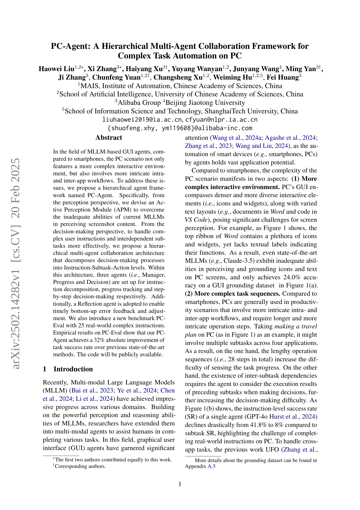
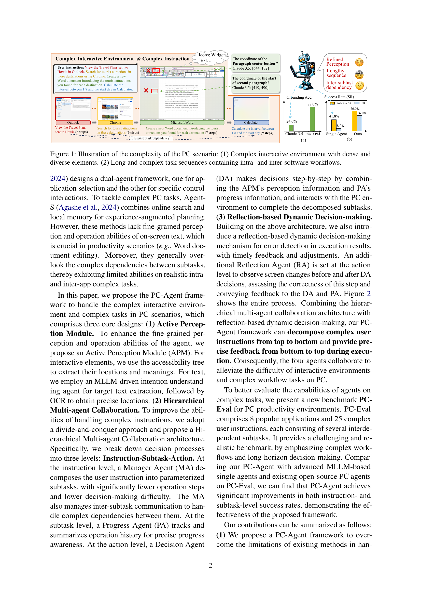
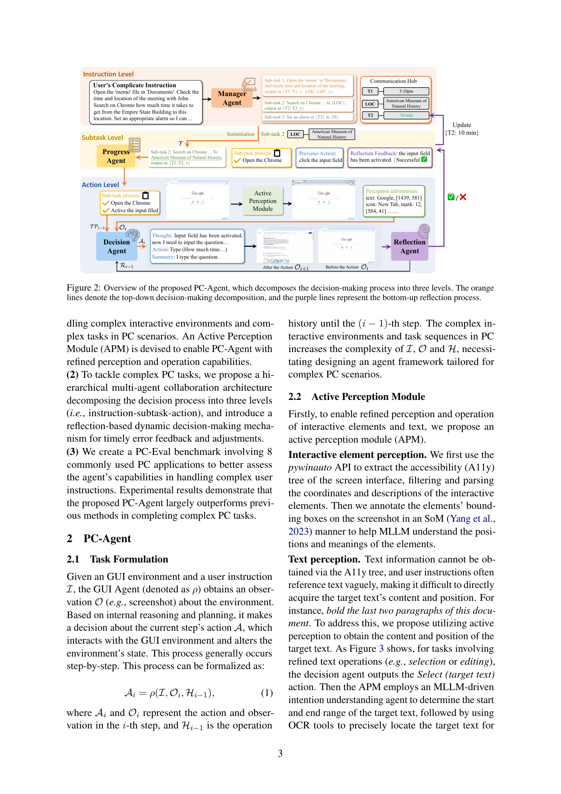
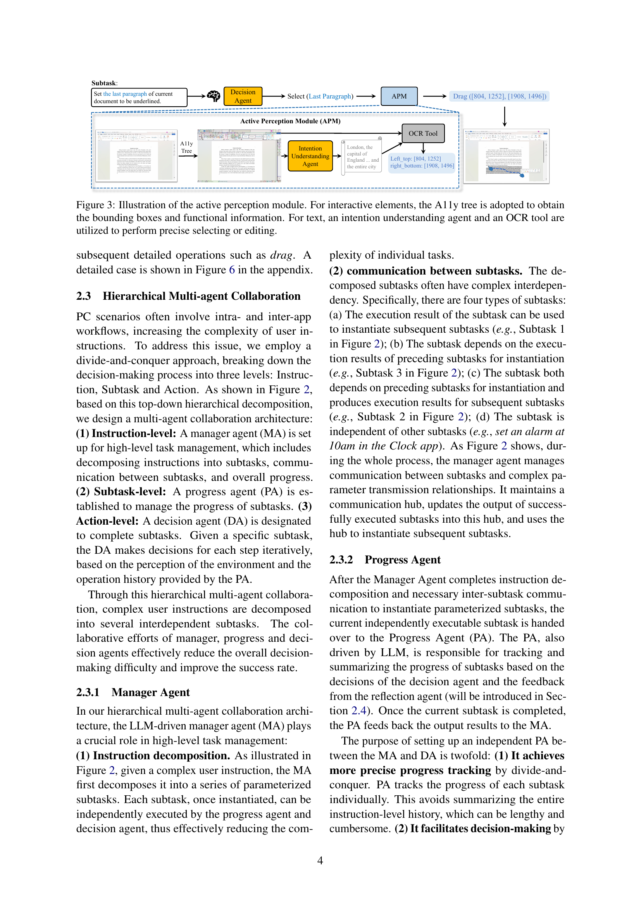
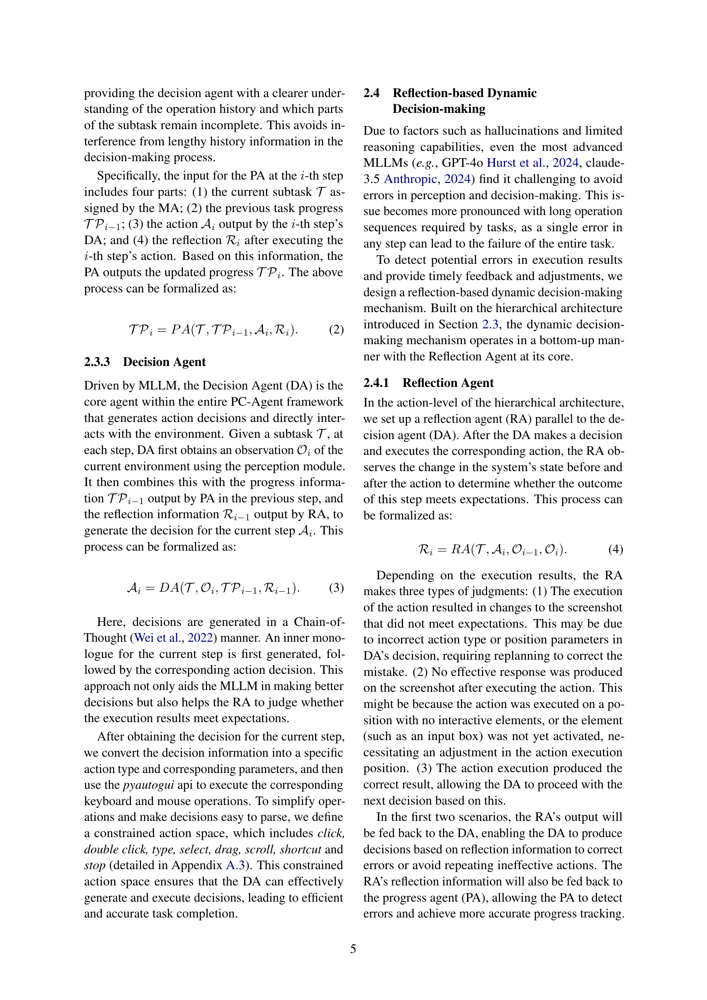
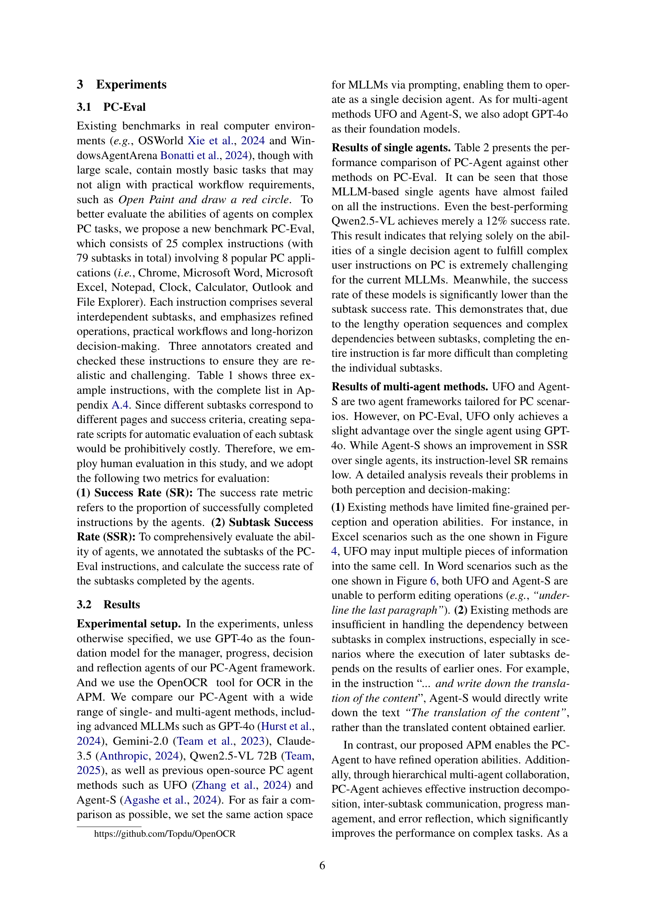
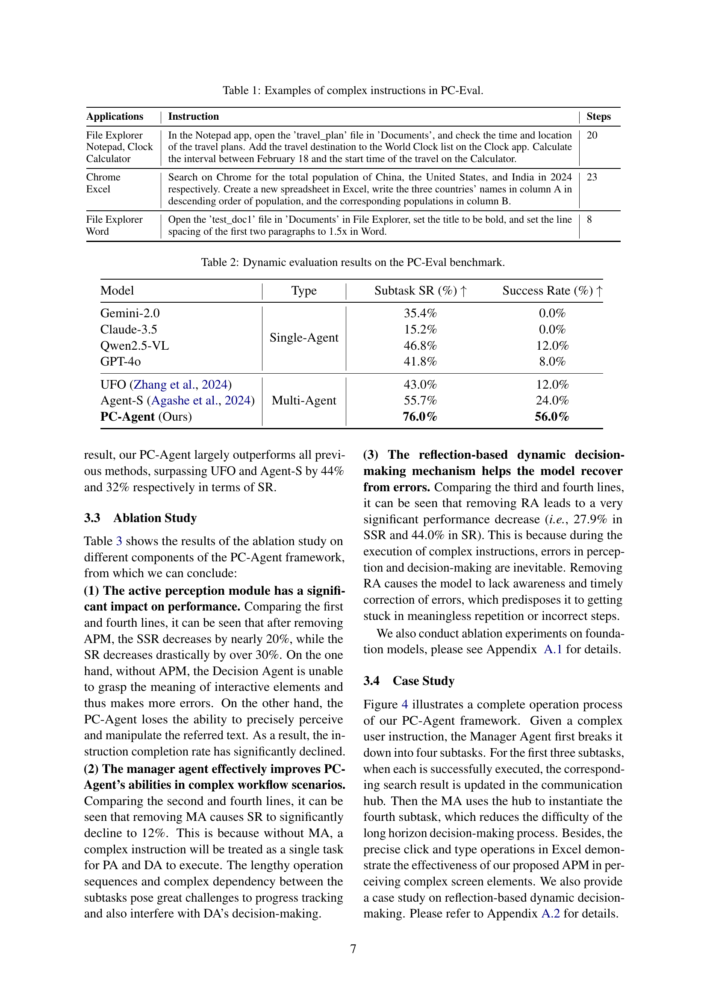
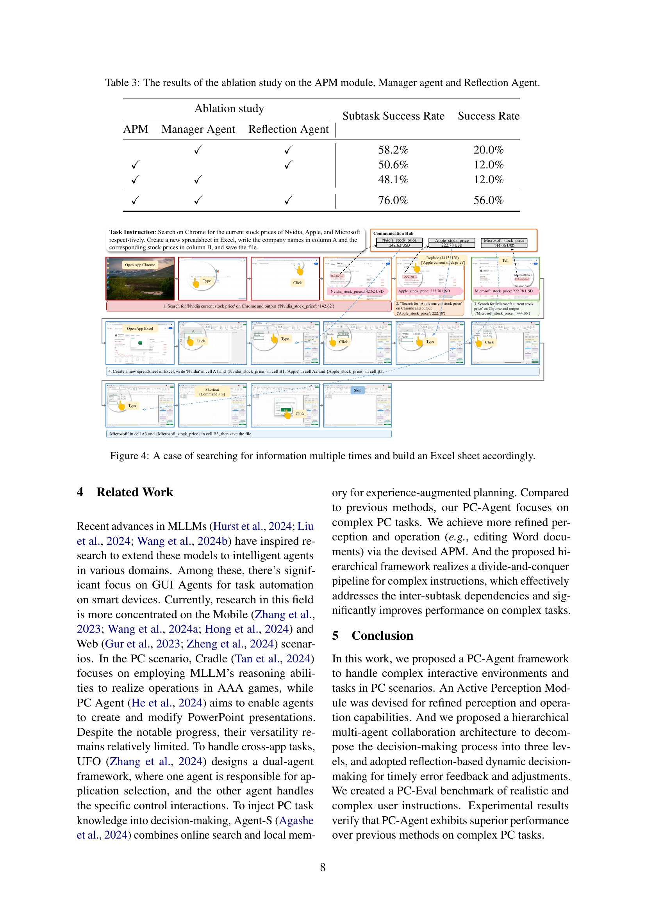
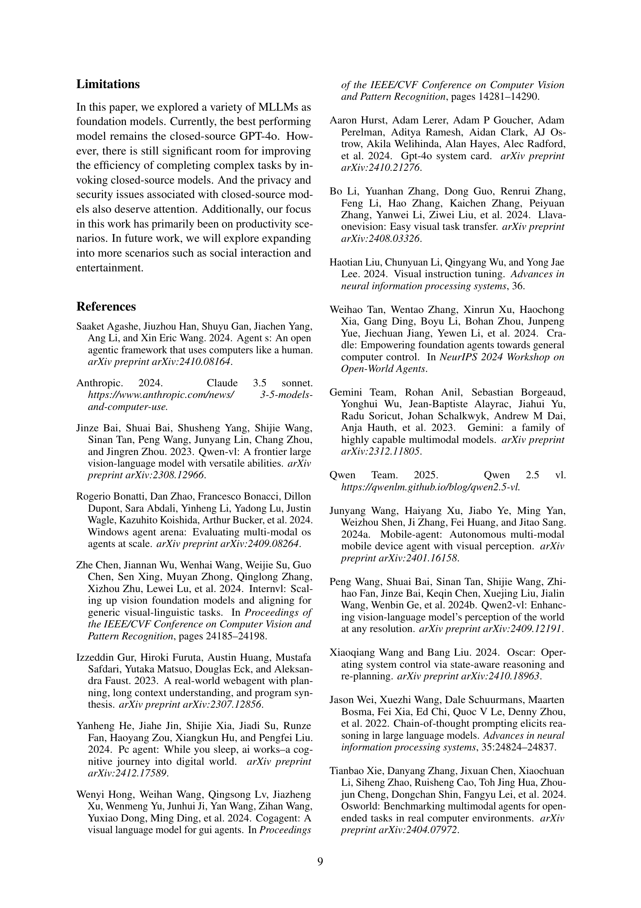
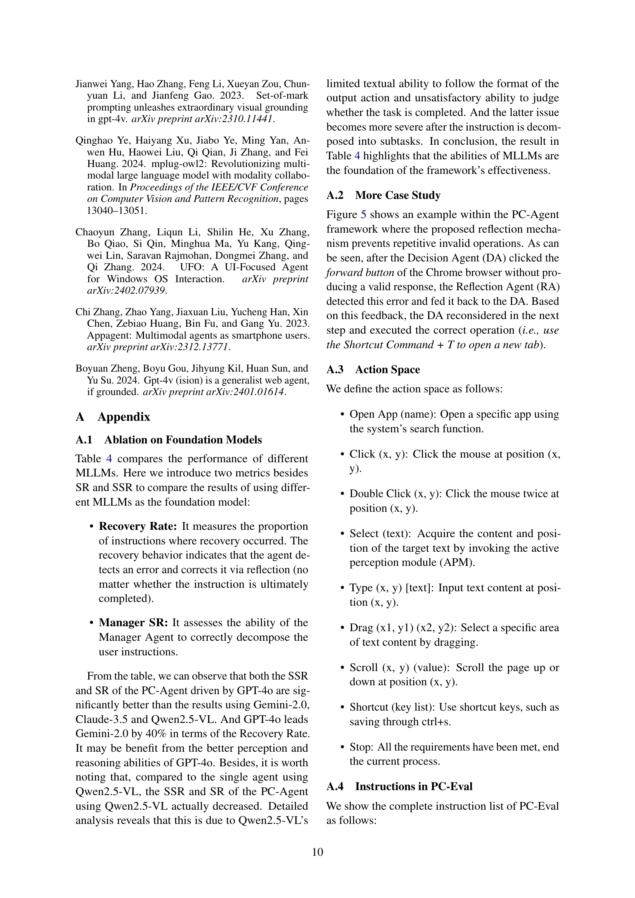
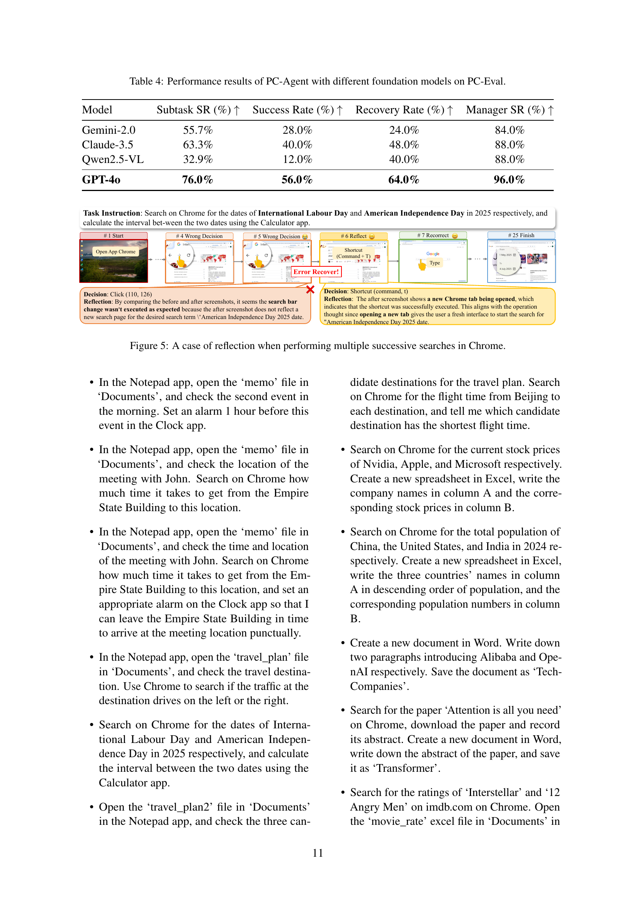
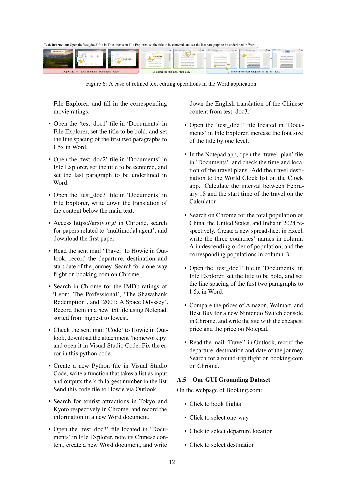
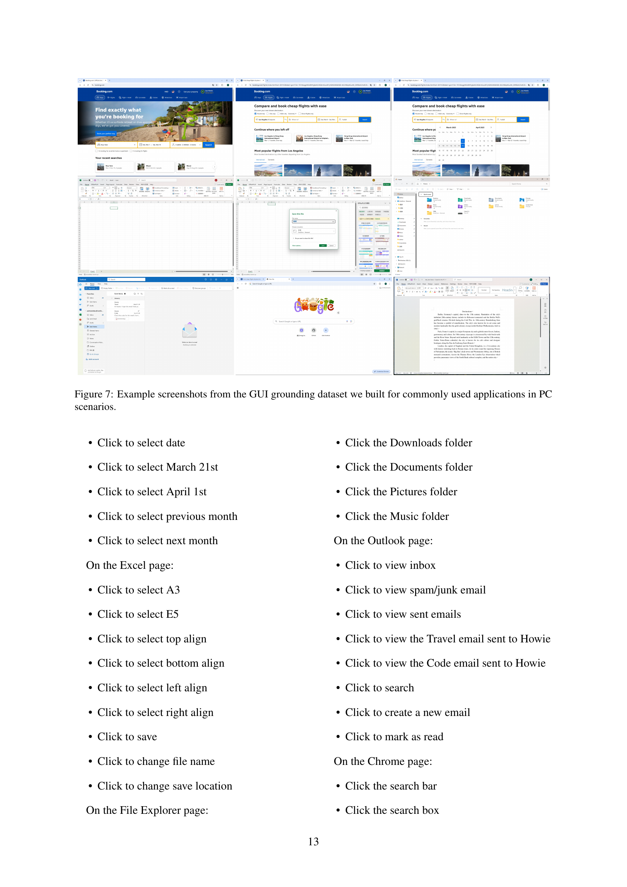
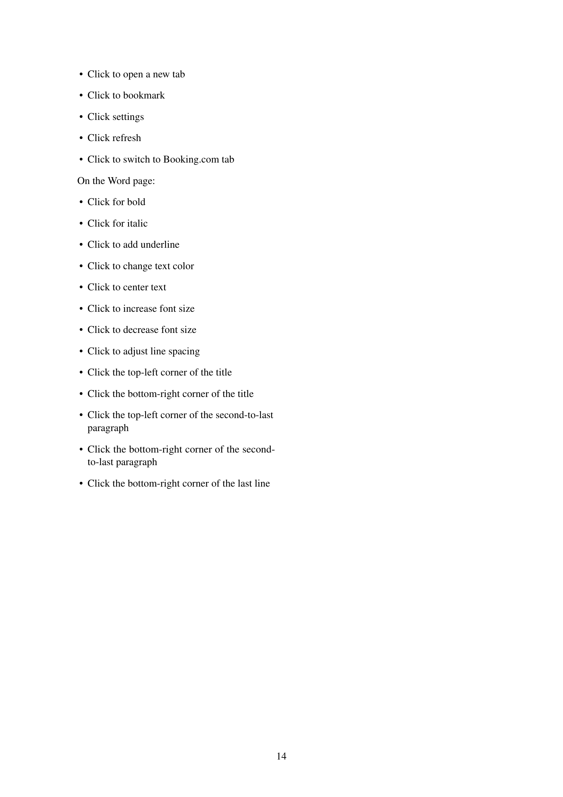
