 


 2502.14397 
 Shijie Huang et el. 
 
 🤗 2025-02-24 
 



↗ arXiv


↗ Hugging Face


↗ Papers with Code


### TL;DR



기존의 이미지 편집 방법들은 전반적인 스타일 변환이나 지역적인 보정에 초점을 맞추어 **사진에 장식 요소를 추가하고 배경의 일관성을 유지하는 예술적인 사진 낙서(PhotoDoodling)에는 적합하지 않았습니다.**  PhotoDoodling은 아티스트의 고유한 스타일을 효율적으로 포착하고 배경 이미지의 왜곡 없이 장식 요소를 자연스럽게 통합하는 기술이 필요합니다.  이는 기존의 방식으로는 달성하기 어려운 과제입니다.

본 논문에서는 이러한 문제를 해결하기 위해 **두 단계 학습 전략을 사용하는 PhotoDoodle이라는 새로운 프레임워크**를 제안합니다.  먼저, 대규모 데이터로 다용도 이미지 편집 모델을 학습시키고, 그 다음에 소규모 아티스트 전용 데이터셋으로 미세 조정하여 특정 스타일을 학습합니다.  **위치 인코딩 재사용 메커니즘**을 통해 생성 결과의 일관성을 높이고, **여섯 가지 고품질 스타일**을 갖춘 PhotoDoodle 데이터셋을 공개하여 향후 연구를 위한 기반을 마련했습니다.  실험 결과, PhotoDoodle은 기존 방법보다 우수한 성능과 강건성을 보였습니다.



#### Key Takeaways


 PhotoDoodle은 적은 수의 예제 이미지만으로 아티스트의 스타일을 효과적으로 학습하고 사진에 장식 요소를 추가하는 새로운 이미지 편집 프레임워크입니다. 



 위치 인코딩 재사용 메커니즘과 노이즈 없는 조건화 패러다임을 통해 생성된 결과의 일관성을 높였습니다. 



 고품질의 PhotoDoodle 데이터셋을 공개하여, 향후 연구를 위한 벤치마크를 제공합니다. 


#### Why does it matter?
본 논문은 **소수의 예제만으로 예술적인 이미지 편집을 가능하게 하는 새로운 프레임워크인 PhotoDoodle**을 제시하여, 기존 방법들의 한계를 극복하고 **예술적 이미지 편집 분야에 새로운 가능성**을 제시합니다.  **효율적인 스타일 전이 기법과 배경 일관성 유지를 위한 혁신적인 기법**을 통해, 제한된 데이터로도 높은 성능을 달성함으로써, 다양한 분야의 연구자들에게 중요한 시사점을 제공합니다. 특히, **소규모 데이터셋으로 개인화된 편집 스타일을 효과적으로 구현**할 수 있는 방법론을 제시하여, 사용자 맞춤형 이미지 편집 기술 발전에 크게 기여할 것으로 예상됩니다.

------
#### Visual Insights

> 🔼 그림 1은 PhotoDoodle이 사진에 장식적인 요소를 추가하여 사진 낙서를 만드는 과정에서 인간 아티스트의 스타일과 기법을 모방할 수 있음을 보여줍니다.  PhotoDoodle은 편집 전후의 상태 간에 완벽한 일관성을 유지하면서 사진에 장식적인 요소를 추가합니다.  즉, 기존 사진을 손상시키지 않고 아티스트의 스타일을 반영한 새로운 요소를 자연스럽게 추가하는 능력을 보여줍니다.  사진에 추가된 요소들은 배경과 완벽하게 조화를 이루며, 원근감과 문맥적 일관성을 유지합니다.  아티스트의 고유한 스타일은 제한된 훈련 데이터에서도 효율적으로 포착됩니다.
> 

> 
read the caption

> Figure 1: PhotoDoodle can mimic the styles and techniques of human artists in creating photo doodles, adding decorative elements to photos while maintaining perfect consistency between the pre- and post-edit states.
> 


| Methods | CLIP Score ↑ | GPT Score ↑ | CLIPimg ↑ |
|---|---|---|---|
| Instruct-Pix2Pix | 0.237 | 38.201 | 0.806 |
| Magic Brush | 0.234 | 36.555 | 0.811 |
| SDEdit(FLUX) | 0.230 | 34.329 | 0.704 |
| Ours | **0.261** | **51.159** | **0.871** |

> 🔼 표 1은 일반적인 이미지 편집 작업에 대한 비교 결과를 보여줍니다.  세 가지 지표인 CLIP 점수, GPT 점수, CLIP 이미지 점수를 사용하여 네 가지 방법(Instruct-Pix2Pix, Magic Brush, SDEdit(FLUX), PhotoDoodle)의 성능을 평가했습니다.  각 지표는 이미지 편집의 품질, 일관성, 지침 따르기 능력을 반영합니다. PhotoDoodle이 세 가지 지표 모두에서 가장 좋은 성능을 보였음을 알 수 있습니다. 이는 PhotoDoodle이 이미지의 배경을 보존하면서도 원하는 편집을 정확하게 수행할 수 있음을 시사합니다.
> 

> 
read the caption

> Table 1: Comparison Results in General Image Editing Tasks. The best results are denoted as Bold.
> 

### In-depth insights

#### Few-Shot PhotoDoodle
본 논문에서 제시된 "Few-Shot PhotoDoodle"은 소량의 학습 데이터만으로도 사진에 예술적인 낙서를 추가하는 이미지 편집 프레임워크입니다. **핵심은 이전의 전이 학습 방식과 달리, 예술가의 독특한 스타일을 효율적으로 포착하여 배경과의 조화, 원근감 일치, 문맥적 일관성을 유지하면서 자연스럽게 낙서 요소를 사진에 통합하는 데 있습니다.**  **두 단계 학습 전략** (범용 이미지 편집 모델 OmniEditor 사전 학습 및 EditLoRA를 이용한 미세 조정)을 통해 **일관성 있는 결과**를 얻고, **위치 인코딩 재사용 메커니즘**을 도입하여 생성 결과의 일관성을 더욱 향상시켰습니다.  **소량의 예술가별 데이터셋**을 이용한 미세 조정을 통해 다양한 예술적 스타일을 효과적으로 구현할 수 있다는 점이 특징입니다.  전반적으로 PhotoDoodle은 기존의 전역 스타일 전이 또는 지역적 복원 방식에 비해 **세련되고 효율적인 사진 낙서 생성 방식**을 제시하며, **예술적 창작의 새로운 가능성**을 열었습니다.

#### Dual-Stage Training
본 논문에서 제안하는 **두 단계 학습 전략**은 먼저 **범용 이미지 편집 모델(OmniEditor)**을 대규모 데이터셋으로 사전 훈련하여 다양한 편집 작업에 대한 기본 성능을 확보하는 단계와, 사용자 지정 스타일을 반영하여 **저해상도 적응(EditLoRA)**으로 미세 조정하는 단계로 구성됩니다.  **OmniEditor**는 위치 인코딩 재사용 메커니즘을 통해 편집 일관성을 높이고, **EditLoRA**는 소량의 예제 이미지 쌍으로 아티스트의 고유한 스타일을 효율적으로 학습합니다. 이러한 **두 단계 접근 방식**은 범용성과 개인화된 스타일을 동시에 만족시키는 핵심이며,  **PhotoDoodle**의 강력한 성능과 유연성을 가능하게 하는 중요한 요소입니다. 특히, 소량의 데이터로 개인화된 스타일을 효과적으로 학습할 수 있다는 점은 **데이터 효율성** 측면에서 큰 장점으로 작용합니다.

#### Position Encoding
본 논문에서 제시된 "Position Encoding" 기법은 **이미지 편집의 정확성과 일관성을 크게 향상**시키는 핵심 요소입니다. 기존의 방법들이 이미지의 공간 정보를 효과적으로 활용하지 못해 편집 결과물에서 왜곡이나 불일치 현상이 발생하는 문제점을 해결하기 위해 고안되었습니다. 특히, **위치 정보를 명확히 유지**하면서 노이즈 제거 과정을 수행하여 원본 이미지의 세부적인 특징들을 보존하는 데 중점을 둡니다. 이를 통해 **배경 이미지의 왜곡 없이** 새로운 요소들을 자연스럽게 추가하거나 수정할 수 있으며, **사용자의 의도를 보다 정확하게 반영**하는 결과물을 얻을 수 있습니다.  **Positional Encoding Cloning**이라는 독창적인 접근 방식을 통해 입력 이미지와 편집 결과 이미지 간의 공간적 일관성을 유지하며, **세밀한 수준의 편집도 가능**하게 합니다. 이러한 기법은 특히 사진에 장식적인 요소를 추가하는 PhotoDoodling 작업에서 효과적이며, **자연스럽고 정교한 결과**를 얻는 데 기여합니다.  결론적으로, 본 논문의 Position Encoding은 이미지 편집의 정확성과 일관성을 높이는 데 크게 기여하며, **새로운 이미지 편집 패러다임을 제시**하는 혁신적인 기술로 평가될 수 있습니다.

#### EditLoRA Fine-tuning
EditLoRA 미세 조정은 PhotoDoodle의 핵심 구성 요소로, **소규모의 아티스트 큐레이션 데이터셋**을 사용하여 사전 훈련된 OmniEditor 모델을 미세 조정하는 과정입니다. 이를 통해 **개별 아티스트의 고유한 편집 스타일과 기법**을 효율적으로 학습할 수 있습니다.  **단 30~50개의 전후 이미지 쌍**만으로도 개성 넘치는 스타일을 재현하는 EditLoRA의 강점은 **LoRA(Low-Rank Adaptation)** 기법에 있습니다.  LoRA는 전체 모델 파라미터를 수정하지 않고, 저차원의 매개변수만 미세 조정하여 **메모리 효율과 계산 효율을 높이며 과적합을 방지**합니다. 이러한 효율성은 다양한 아티스트의 스타일을 빠르게 적용하는 데 중요한 역할을 합니다.  결과적으로, EditLoRA 미세 조정은 PhotoDoodle이 **사용자 지정 이미지 편집에서 유연성과 효율성을 동시에 달성**하는 데 기여합니다.  **소량의 데이터로 개인화된 아티스트 스타일을 구현**하는 EditLoRA의 능력은 PhotoDoodle의 실용성과 확장성을 크게 높여줍니다.

#### Future Work
논문의 "미래 연구" 부분에서 언급된 한계점들을 극복하고 PhotoDoodle의 기능을 더욱 향상시키기 위한 구체적인 방향을 제시해야 합니다.  **데이터셋 확장**을 통해 더욱 다양한 예술 스타일과 편집 기법을 학습시켜 모델의 일반화 능력을 높이는 것이 중요합니다. 현재는 쌍으로 이루어진 이미지 데이터에 의존하고 있으므로, **단일 이미지만을 이용한 스타일 전이** 또는 **제한된 쌍으로 학습하는 방안**을 모색해야 합니다. 또한, **계산 비용 감소**를 위한 효율적인 학습 및 추론 방법을 연구해야 합니다.  **사용자 인터페이스 개선**을 통해 사용자의 편의성을 높여 접근성을 높일 수 있습니다.  **비디오 편집 기능 확장**을 통해 동영상에 대한 창의적인 편집을 가능하게 하여 활용 범위를 넓힐 수 있습니다.  **다양한 응용 분야**를 탐색하는 것 또한 중요합니다.  **오류 수정 및 성능 개선**을 위한 지속적인 연구와 개발이 필요합니다.  **윤리적 문제**에 대한 고려 또한 필수적이며, 편향된 데이터 사용으로 인한 부정적 결과를 최소화하기 위한 노력이 필요합니다. 이러한 노력들을 통해 PhotoDoodle은 더욱 강력하고 유용한 이미지 편집 도구로 발전할 수 있을 것입니다.

### More visual insights

More on figures

> 🔼 그림 2는 PhotoDoodle의 전체 아키텍처와 훈련 과정을 보여줍니다. OmniEditor와 EditLoRA는 모두 LoRA 훈련 방식을 따릅니다. OmniEditor는 대규모 데이터셋으로 사전 훈련되어 일반적인 이미지 편집 및 텍스트 따르기 기능을 제공하며, 고랭크 LoRA를 사용합니다. EditLoRA는 소규모의 스타일 이미지 쌍으로 미세 조정되어 개별 아티스트의 특정 스타일과 전략을 효율적으로 맞춤화하며, 저랭크 LoRA를 사용합니다. 소스 이미지는 조건 토큰으로 인코딩되고 노이즈가 있는 잠재 토큰과 연결되어 MMAttention을 통해 생성 결과를 제어합니다.
> 

> 
read the caption

> Figure 2: The overall architecture and training prodigim of photodoodle. The ominiEditor and EditLora all follow the lora training prodigm. We use a high rank lora for pre-training the OmniEditor on a large-scale dataset for general-purpose editing and text-following capabilities, and a low rank lora for fine-tuning EditLoRA on a small set of paired stylized images to capture individual artists’ specific styles and strategies for efficient customization. We encode the source image into a condition token and concatenate it with a noised latent token, controlling the generation outcome through MMAttention.
> 

> 🔼 그림 3은 PhotoDoodle의 생성 결과를 보여줍니다. PhotoDoodle은 사진에 장식 요소를 추가하여 사진 낙서를 만드는 아티스트의 방식과 스타일을 모방할 수 있습니다.  이를 통해 사용자의 지시에 따라 고품질의 이미지 편집이 가능해집니다.  다양한 아티스트의 스타일을 보여주는 여러 사진과 각 사진에 적용된 PhotoDoodle의 편집 결과가 제시되어 있습니다.  각각의 결과는 원본 사진의 배경을 유지하면서 아티스트의 독특한 스타일을 반영하여 새롭고 창의적인 사진 낙서를 생성하는 PhotoDoodle의 능력을 보여줍니다.
> 

> 
read the caption

> Figure 3: The generated results of PhotoDoodle. PhotoDoodle can mimic the manner and style of artists creating photo doodles, enabling instruction-driven high-quality image editing.
> 

> 🔼 그림 4는 PhotoDoodle이 기존의 이미지 편집 방법들에 비해 명령어를 더 잘 따르고, 이미지 일관성을 유지하며, 편집 효과가 뛰어남을 보여줍니다.  PhotoDoodle은 사용자의 지시에 따라 이미지를 수정하면서도 원본 이미지의 특징을 잘 보존하고, 부자연스러운 변화 없이 자연스럽게 편집된 결과물을 생성합니다.  이를 통해 사용자는 원하는 스타일과 효과를 보다 정확하고 효율적으로 이미지에 적용할 수 있습니다.
> 

> 
read the caption

> Figure 4:  Compared to baselines, PhotoDoodle demonstrates superior instruction following, image consistency, and editing effectiveness.
> 

> 🔼 그림 5는 제안된 PhotoDoodle 모델의 성능에 대한 ablation study 결과를 보여줍니다.  각각의 구성 요소 (OmniEditor 사전 학습, 위치 인코딩 복제, EditLoRA)를 제거했을 때의 결과를 보여주어 각 구성요소의 중요성을 강조합니다.  예를 들어, OmniEditor 사전 학습을 제거하면 스타일링 정도가 크게 감소하고, 위치 인코딩 복제를 제거하면 일관성이 떨어지며, EditLoRA를 제거하면 개인화된 스타일 적용이 되지 않는 것을 확인할 수 있습니다. 이는 각 구성요소가 PhotoDoodle 모델의 최종 성능에 중요한 역할을 한다는 것을 시각적으로 보여줍니다.
> 

> 
read the caption

> Figure 5: Ablation study results.
> 

> 🔼 그림 6은 사용자 연구 결과를 보여줍니다. 세 가지 평가 지표(전반적인 선호도, 지시 사항 따르기, 이미지 일관성)에 따라 사용자들이 PhotoDoodle을 다른 기준 모델보다 선호하는 비율을 백분율로 나타냅니다. 결과는 PhotoDoodle이 모든 기준 모델들보다 우수함을 보여줍니다.
> 

> 
read the caption

> Figure 6: User study results. The scores demonstrate the percentage of users who prefer ours over others under three evaluation metrics. PhotoDoodle outweighs all other baselines in user study.
> 

### Full paper


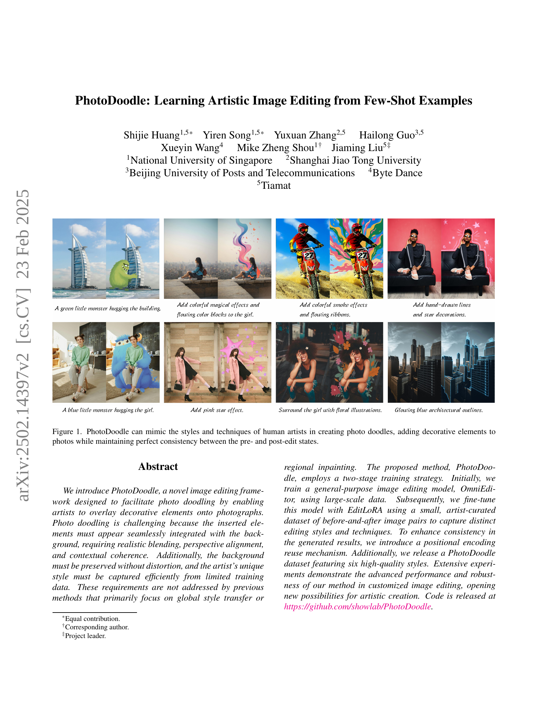
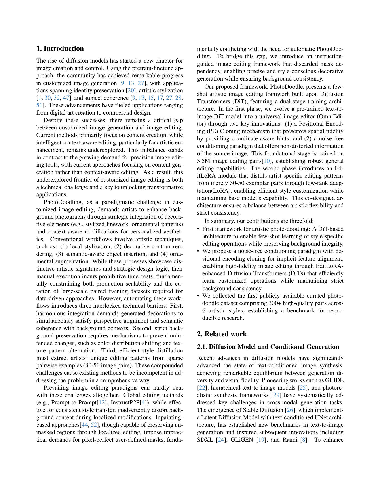
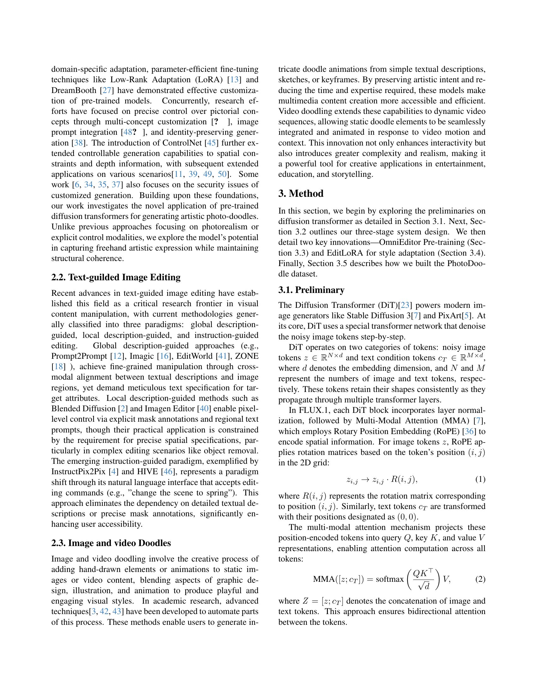
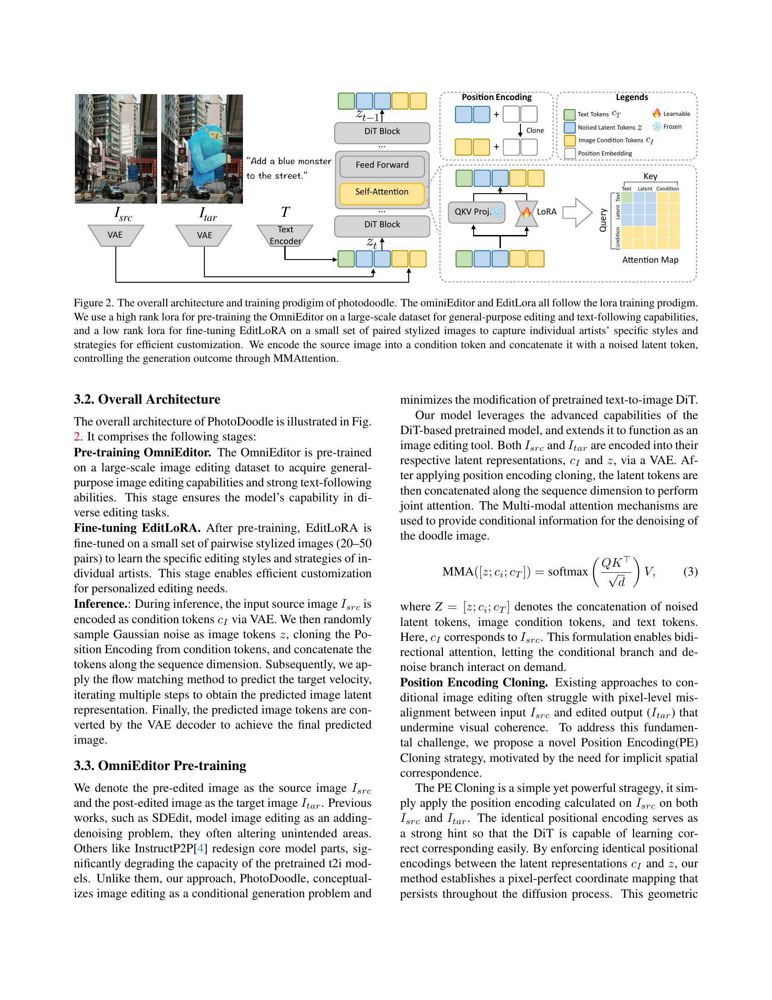
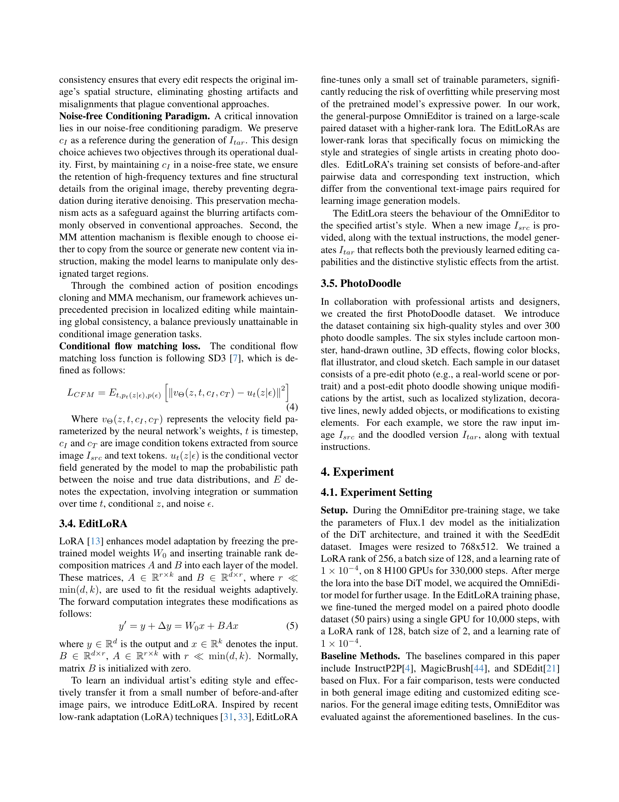
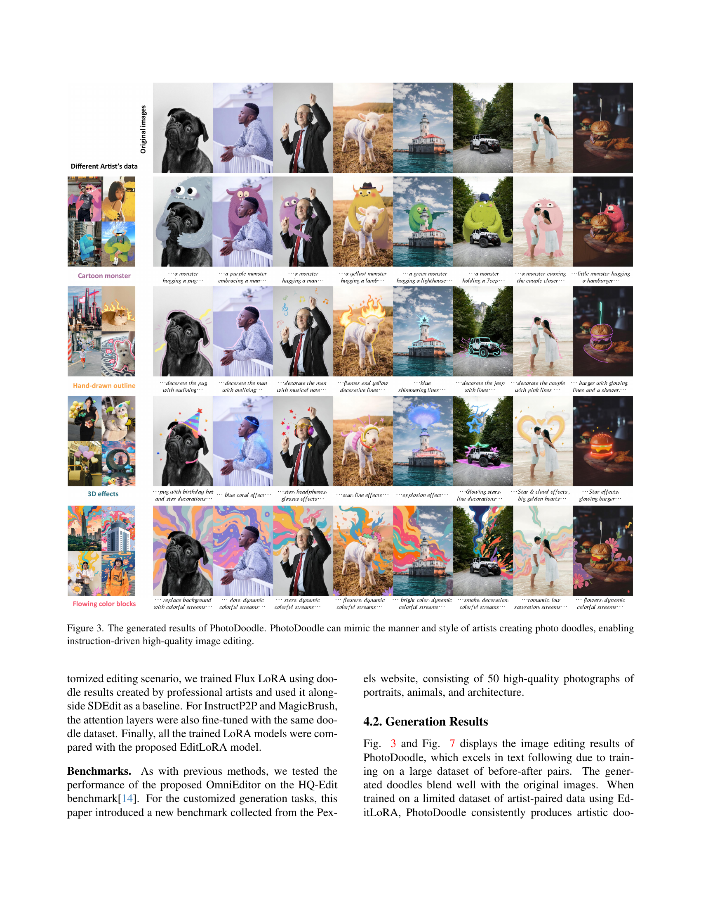
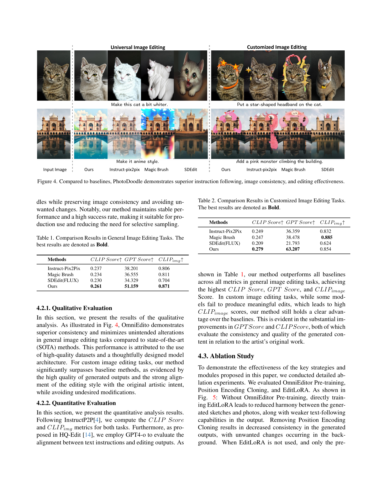
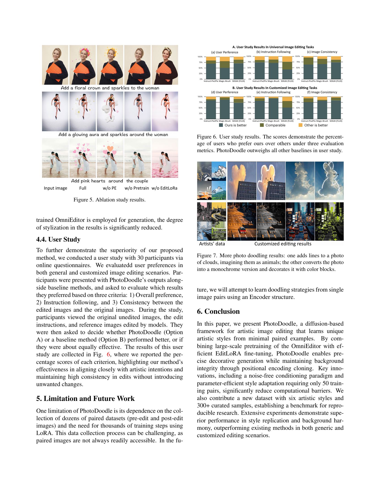
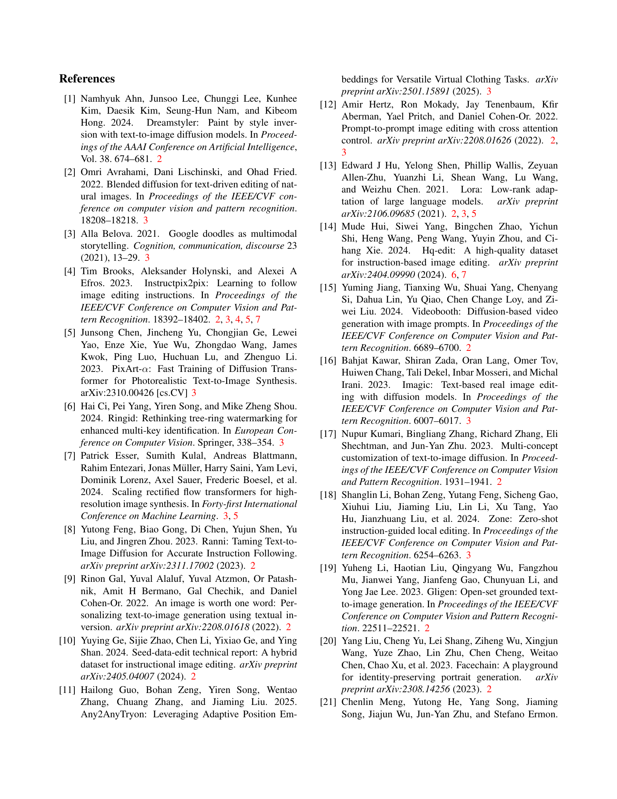
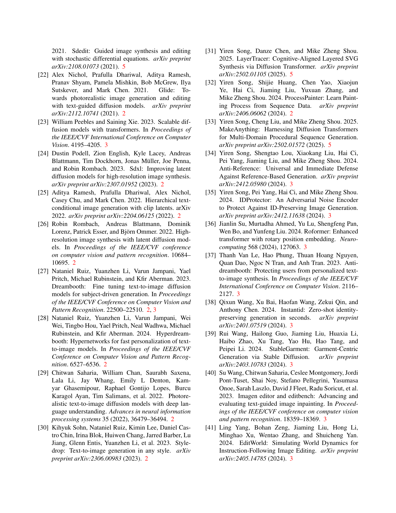
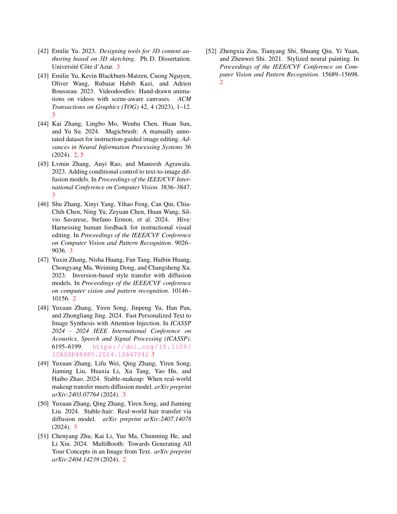
