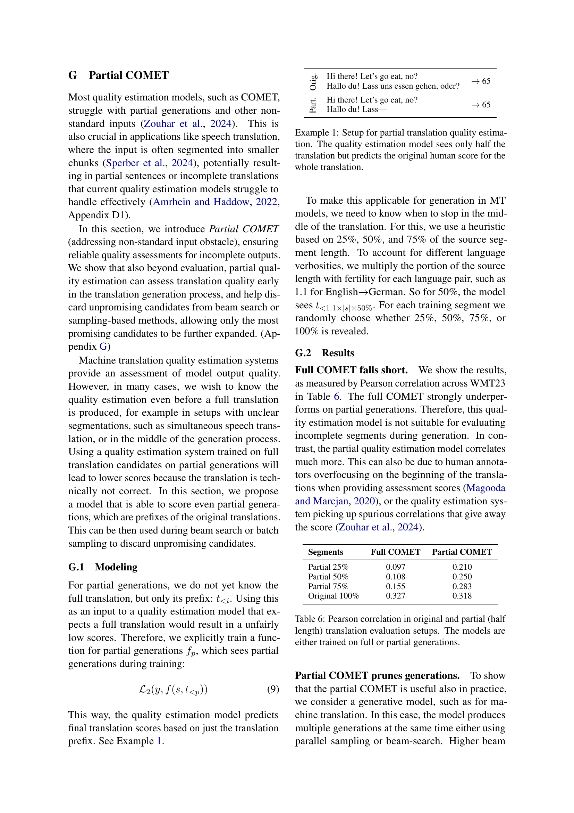

 


 2502.14429 
 Vilém Zouhar et el. 
 
 🤗 2025-02-25 
 



↗ arXiv


↗ Hugging Face


↗ Papers with Code


### TL;DR



기계 번역의 품질을 자동으로 평가하는 **품질 추정**은 매우 중요하지만, 기존 모델은 복잡하고 비용이 많이 든다는 문제가 있습니다. 또한, 번역 결과의 정확성에 대한 **신뢰도**를 측정하는 것도 어려웠습니다. 이 논문은 이러한 문제를 해결하기 위해 **두 가지 새로운 방법**을 제시합니다. 첫째, **모델의 초기 계층에서 품질 점수를 계산하고 신뢰도를 평가하여 계산을 조기에 종료**하는 방법입니다. 둘째, **품질 점수와 신뢰도를 동시에 예측하는 새로운 모델**을 제시합니다. 이를 통해 기존 방법과 동등한 성능을 더 적은 비용으로 달성할 수 있었습니다.  실제 기계 번역 재순위 지정 작업에 적용한 결과, **계산 비용을 50% 절감하면서 성능 저하를 최소화**했습니다. 

본 연구는 **조기 종료 및 순간 신뢰도 COMET**이라는 두 가지 새로운 품질 추정 모델을 제시합니다. **조기 종료 COMET**은 모델의 초기 계층에서 품질 점수를 계산하여 계산량을 줄이고, **순간 신뢰도 COMET**은 품질 점수와 함께 신뢰도를 제공하여 불확실성을 해결합니다.  두 모델을 **상위 신뢰 경계 밴딧 알고리즘**과 결합하여 기계 번역 후보군을 효율적으로 재순위 지정하는 방법을 제시하고, 실험 결과를 통해 **계산 비용을 50% 감소시키면서 성능 저하를 최소화**함을 보였습니다.  이러한 결과는 **대규모 기계 번역 시스템의 효율성과 신뢰성을 향상**시키는 데 기여할 것으로 기대됩니다.



#### Key Takeaways


 조기 종료 메커니즘을 통해 기계 번역 품질 추정의 계산 비용을 최대 50%까지 절감 



 순간 신뢰도 COMET 모델을 통해 기존 방법과 동등한 성능을 유지하면서 불확실성을 효과적으로 추정 



 상위 신뢰 경계 밴딧 알고리즘과 조합하여 대규모 후보군에서 최적의 기계 번역 결과를 효율적으로 선택 


#### Why does it matter?
본 논문은 **대규모 기계 번역 시스템에서 품질 추정의 비용을 줄이고 불확실성을 효과적으로 추정하는 방법**을 제시하여 기계 번역 분야의 효율성과 신뢰성을 향상시키는 데 중요한 의미를 가집니다.  **특히, 신속한 의사결정이 필요한 실시간 시스템이나 자원이 제한적인 환경에서 높은 효용성**을 보일 것으로 예상되며, **추후 연구를 위한 새로운 가능성**을 제시합니다.

------
#### Visual Insights

> 🔼 이 그림은 테스트 세트의 네 가지 예시에 대해 품질 추정 모델 계산 과정에서 예측된 품질 추정 점수(진한 선)와 순간 신뢰도 추정(음영 영역)의 변화를 보여줍니다. 계층은 계산 비용에 해당합니다. 빨간색 선은 신뢰도가 충분히 높아 계산이 중지되는(조기 종료) 시점을 나타냅니다.  즉, 모델의 각 계층에서 예측된 품질 점수와 그 점수에 대한 신뢰 수준(즉, 불확실성)을 시각적으로 보여줍니다.  신뢰도가 충분히 높으면 모델의 계산을 더 이상 진행하지 않고 조기에 결과를 출력하는 조기 종료 기법을 설명하는 데 도움이 됩니다.
> 

> 
read the caption

> Figure 1: Progression of predicted quality estimation score (dark line) and instant confidence estimation (shaded area) along the quality estimation model computation for four examples from the test set. Layer corresponds to compute cost. Red line stops computation because the confidence is high enough (early-exit).
> 


| Method | Cost ↓ | Human ↑ | Error ↑ | Notes |
|---|---|---|---|---|
| Instant Confidence β=0.25 | 1× | 0.316 | 0.222 |  |
| Instant Confidence β=0.5 | 1× | 0.309 | 0.224 |  |
| Instant Confidence β=0.75 | 1× | 0.326 | 0.228 | ★ |
| Instant Confidence β=1.0 | 1× | 0.330 | 0.207 |  |
| Instant Confidence β=1.5 | 1× | 0.325 | 0.200 |  |
| No Confidence | 1× | 0.327 | - |  |
| MC Dropout (2) | 2× | 0.210 | 0.201 |  |
| MC Dropout (5) | 5× | 0.247 | 0.267 |  |
| MC Dropout (10) | 10× | 0.262 | 0.301 |  |
| MC Dropout (50) | 50× | 0.279 | 0.328 |  |
| MC Dropout (100) | 100× | 0.281 | 0.333 |  |
| MC Dropout† (2) | 2× | 0.327 | 0.061 |  |
| MC Dropout† (5) | 5× | 0.327 | 0.092 |  |
| MC Dropout† (10) | 10× | 0.327 | 0.115 |  |
| MC Dropout† (50) | 50× | 0.327 | 0.131 |  |
| MC Dropout† (100) | 100× | 0.327 | 0.134 |  |
| DUP (parallelizable) | 2× | 0.327 | 0.135 |  |
| DUP (sequential) | 2× | 0.327 | 0.216 |  |

> 🔼 이 표는 품질 추정 모델의 점수와 인간의 점수 간의 상관 관계와 모델 오차 예측(음수 신뢰도)과 실제 오차 간의 상관 관계를 보여줍니다.  MC Dropout†는 오차 예측에만 dropout을 사용하고 품질 점수는 dropout 없이 계산합니다. 상관 관계 값이 높을수록(↑↑) 좋고 낮을수록(↓↓) 좋지 않습니다.  즉, 모델 점수가 인간의 평가와 얼마나 잘 일치하는지, 그리고 모델의 오차 예측이 실제 오차와 얼마나 잘 맞는지를 보여주는 지표입니다. 높은 상관관계는 모델의 정확성과 신뢰성을 나타냅니다.
> 

> 
read the caption

> Table 1: Correlation (Pearson) of model scores with human scores (Human) and correlation of model error predictions (negative confidence) with true error (Error). Higher is better ↑↑\uparrow↑ and lower is better ↓↓\downarrow↓. MC Dropout† uses dropout only for predicting the error and calculates the quality score without dropout.
> 

### In-depth insights

#### Instant Confidence
본 논문에서 제시하는 "Instant Confidence"는 기존의 번역 품질 추정 모델의 한계를 극복하기 위한 중요한 개념입니다. **기존 모델들은 단일 품질 점수만 제공하여 불확실성을 고려하지 못했지만**, Instant Confidence는 **품질 점수와 함께 신뢰도 점수(uncertainty)를 동시에 예측**합니다. 이를 통해 높은 점수를 받았지만 실제로는 불확실성이 높은 번역 결과를 식별하고, 추가적인 검토가 필요한 경우를 파악할 수 있습니다. 이는 **의료, 법률 등 정확성이 매우 중요한 분야**에서 특히 유용하며, **자원 효율적인 인간 평가 파이프라인**을 구축하는 데에도 도움이 될 수 있습니다.  **계산 비용을 절감**하면서 이전 접근 방식과 동등한 성능을 달성한다는 점에서 실용적인 측면도 뛰어납니다.  즉, Instant Confidence는 품질 추정의 정확성과 효율성을 동시에 높이는 혁신적인 방법론으로, **대규모 시스템에의 적용 가능성**을 크게 높입니다.

#### Early-Exit COMET
본 논문에서 제안하는 조기 종료 COMET은 **계산 비용을 절감**하기 위해 고안된 **불확실성 인식 번역 품질 추정 모델**입니다. 기존의 COMET 모델이 모든 계층을 계산하는 것과 달리, 조기 종료 COMET은 **각 계층에서 품질 점수와 불확실성을 동시에 예측**하고, **신뢰도가 충분히 높으면 계산을 중단**합니다. 이를 통해 전체 모델을 실행하는 것보다 **훨씬 빠르게 품질 점수를 얻을 수 있으며, 계산량을 최대 50%까지 줄일 수 있습니다**.  **즉각적 신뢰도 COMET**과 결합하여, 불확실성을 고려한 효율적인 품질 추정이 가능하다는 점이 특징입니다.  이는 특히 **자원 제약 환경이나 실시간 처리가 필요한 애플리케이션**에서 매우 유용합니다.  **기계 번역 재순위 지정 작업**에도 적용되어, 전체 후보군에 대한 완전한 평가 없이도 최적의 후보를 효율적으로 찾을 수 있습니다.

#### Reranking Methods
본 논문에서 제시된 **조기 종료 기법과 순간 신뢰도 추정**은 기계 번역의 후보군 재순위 지정에 효과적으로 적용될 수 있습니다. **대규모 후보군에 대한 완전한 평가 모델을 실행하지 않고도 최적의 후보를 찾을 수 있는 방법**을 제공합니다. 특히, **상한 신뢰 구간 밴딧 알고리즘**과 결합하여 계산 비용을 절감하면서 성능 저하를 최소화하는 효과적인 재순위 지정 전략을 제시합니다. 이는 **자원 제약 환경에서의 대규모 기계 번역 시스템** 구축에 큰 도움을 줄 수 있습니다.  **신뢰도를 고려한 조기 종료**를 통해 계산 비용을 줄이면서, **불확실성을 고려한 의사결정**을 가능하게 합니다.  다만, 실제 적용 시 **최적의 하이퍼파라미터 조정** 및 **알고리즘의 안정성 확보**가 중요한 과제입니다.

#### Computational Cost
본 논문은 기계 번역 품질 추정(quality estimation)에서 **계산 비용을 줄이는 방법**을 제시합니다. 기존의 방법들은 계산 비용이 많이 들고, 특히 대규모 시스템에서는 비효율적일 수 있습니다. 따라서 **Early-Exit COMET**과 같은 효율적인 모델을 제시하여, 계산 비용을 절감하면서 성능 저하를 최소화하는 것을 목표로 합니다.  **Instant Confidence COMET**을 통해 불확실성을 고려한 품질 추정도 가능하다는 것을 보여줍니다. 이를 통해, **신뢰도가 높은 예측**을 얻을 수 있으며, 이는 특히 의료, 법률, 외교와 같이 높은 정확도가 요구되는 분야에서 중요합니다.  **Early-Exit 전략**을 통해 모델 계산을 조기에 종료함으로써, 전체 계산 비용의 절반 이상을 줄이는 것을 실험적으로 확인합니다. 또한, **상위 신뢰 경계 밴딧 알고리즘**을 이용하여 후보 번역문을 재순위화하는 작업에서도 계산 비용을 크게 줄이고 성능 저하를 최소화합니다. 전체적으로, 본 논문은 **계산 비용 효율성**을 중시하면서도 높은 성능을 유지하는 다양한 방법들을 제시하여, 기계 번역 품질 추정 분야에 기여합니다.

#### Future Directions
이 논문은 기계 번역 품질 추정의 효율성을 높이기 위한 세 가지 접근 방식을 제시합니다. **즉각적인 신뢰도 COMET**은 계산 비용을 크게 낮추면서 이전 방법의 성능과 일치합니다. **조기 종료 COMET**은 전체 모델을 실행하지 않고도 품질 점수를 계산할 수 있습니다. 마지막으로, **상한 신뢰 구간 밴딧 알고리즘**과 결합하여 기계 번역 후보의 순위를 지정할 때 계산 시간을 단축시키면서 번역 품질에 거의 영향을 미치지 않습니다.  하지만, **불확실성 추정의 정확성** 및 **조기 종료 시점 결정**에 대한 추가 연구가 필요하며, 다양한 기계 번역 시스템 및 언어 조합에 대한 실험이 필요합니다. 또한, **부분 COMET**의 확장 가능성을 고려하여 더욱 견고하고 효율적인 품질 추정 모델 개발을 위한 미래 연구 방향을 제시합니다.

### More visual insights

More on figures

> 🔼 그림 2는 본 논문에서 제안하는 불확실성을 고려한 품질 추정 시스템의 구조를 보여줍니다. 기존의 COMET 모델을 기반으로 하여, 번역 품질 점수와 예측 오류의 두 가지 값을 동시에 출력하도록 수정되었습니다. 이를 통해, 번역 품질 점수에 대한 신뢰도를 정량적으로 평가할 수 있습니다. 그림에서는 소스 문장, 번역 결과, 타겟 문장이 입력으로 사용되고, COMET 모델을 통해 품질 점수(ŷ)와 오류 점수(ê)가 출력되는 과정을 보여줍니다. 이 두 값은 훈련 과정에서 함께 학습되어, 번역 품질 예측의 정확도와 불확실성을 동시에 향상시키도록 설계되었습니다.
> 

> 
read the caption

> Figure 2: Architecture for uncertainty-aware quality estimation system based on COMET.
> 

> 🔼 그림 3은 COMET 기반의 조기 종료 품질 추정 시스템의 구조를 보여줍니다. 이 시스템은 신뢰도 기반의 조기 종료 기능을 사용하여 계산 비용을 줄입니다. 각 레이어는 최종 COMET 점수와의 오차를 예측하는 자기 신뢰도 예측을 생성합니다. 모델이 최종 COMET 점수를 자신 있게 추정할 수 있다면, 평가를 조기에 종료하여 계산 비용을 절약할 수 있습니다.
> 

> 
read the caption

> Figure 3: Architecture for confidence-aware (with respect to last layer) early-exit quality estimation system based on COMET.
> 

> 🔼 그림 4는 휴리스틱 기반의 조기 종료 COMET에 대한 최종 계층(최종 예측, 위쪽) 및 인간 점수(아래쪽)와의 품질 추정 상관 관계를 보여줍니다. 상단 그래프는 조기 종료 알고리즘이 실행될 때 최종 COMET 점수와의 상관 관계를 보여주고, 하단 그래프는 조기 종료 알고리즘이 실행될 때 인간 점수와의 상관 관계를 보여줍니다. 이를 통해 계산 비용에 대한 품질 점수의 정확성을 확인할 수 있습니다.
> 

> 
read the caption

> Figure 4:  Quality estimation correlation with last layer (final prediction, top) and with human scores (bottom) for heuristic-based early-exit COMET.
> 

> 🔼 그림 6은 실제 오류와 순간 자체 신뢰도 간의 상관관계를 보여줍니다. 각 레이어에 대한 피어슨 상관 계수는 괄호 안에 표시되어 있습니다. 이 그림은 모델이 예측한 오류와 실제 오류 간의 관계를 보여주는 산점도 또는 선 그래프일 가능성이 높습니다. 각 점 또는 선은 특정 레이어의 예측 오류와 실제 오류를 나타내며, 상관 계수는 모델의 신뢰도 예측 정확도를 나타냅니다. 상관 계수가 높을수록 모델의 신뢰도 예측이 실제 오류와 더 잘 일치함을 의미합니다.
> 

> 
read the caption

> Figure 6: Correspondence of true and instant self-confidence. Correlations in brackets are Pearson correlation for each layer.
> 

> 🔼 그림 7은 예측된 품질 추정 모델의 신뢰도를 보여줍니다. 가로축은 100개의 신뢰도 구간을 나타내고, 세로축은 각 구간의 예측값과 실제값 사이의 평균 절대 오차를 나타냅니다.  즉, 모델의 신뢰도가 높을수록(높은 신뢰도 구간), 예측 오차가 작아짐을 보여줍니다. 이는 모델의 신뢰도가 예측 정확도와 잘 맞아떨어짐을 시각적으로 확인할 수 있게 해줍니다.
> 

> 
read the caption

> Figure 7: Calibration of predicted quality estimation model confidence based on 100 confidence bins (x-axis) and mean true absolute error of the prediction in each bin (y-axis).
> 

More on tables


| Layer | 01 | 05 | 09 | 13 | 17 | 21 | 24 | Human |
|---|---|---|---|---|---|---|---|---|
| 01 | 1.00 | 0.30 | 0.23 | 0.17 | 0.17 | 0.15 | 0.15 | 0.034 |
| 05 | 0.30 | 1.00 | 0.93 | 0.72 | 0.70 | 0.66 | 0.65 | 0.207 |
| 09 | 0.23 | 0.93 | 1.00 | 0.78 | 0.75 | 0.70 | 0.69 | 0.221 |
| 13 | 0.17 | 0.72 | 0.78 | 1.00 | 0.97 | 0.87 | 0.85 | 0.278 |
| 17 | 0.17 | 0.70 | 0.75 | 0.97 | 1.00 | 0.91 | 0.89 | 0.281 |
| 21 | 0.15 | 0.66 | 0.70 | 0.87 | 0.91 | 1.00 | 0.99 | 0.312 |
| 24 | 0.15 | 0.65 | 0.69 | 0.85 | 0.89 | 0.99 | 1.00 | 0.309 |
> 🔼 표 2는 3.1절에서 설명된 지도 학습 방식의 조기 종료(Early-Exit)와 표준 COMET 기반의 비지도 학습 방식 조기 종료의 중간 계층 출력 간의 피어슨 상관 관계를 보여줍니다. 왼쪽 열은 지도 학습 방식 조기 종료의 결과를, 오른쪽 열은 표준 COMET 기반의 비지도 학습 방식 조기 종료의 결과를 보여줍니다. 녹색으로 표시된 부분은 중간 계층 출력 간의 상관 관계를, 보라색으로 표시된 부분은 중간 계층 출력과 사람 평가 간의 상관 관계를 나타냅니다. 표의 자세한 내용은 부록 3.1절을 참조하십시오.
> 

> 
read the caption

> Table 2: Pearson correlations between intermediate layer outputs (green) and between intermediate layer outputs and humans (purple) for supervised Early-Exit as described in Section 3.1 (left) and unsupervised Early-Exit based on standard COMET (right). See Appendix Section 3.1 for detailed version.
> 


| Layer | 01 | 05 | 09 | 13 | 17 | 21 | 24 |
|---|---|---|---|---|---|---|---| 
| 01 | 1.00 | 0.23 | 0.17 | 0.10 | -0.01 | -0.07 | -0.06 | -0.033 |
| 05 | 0.23 | 1.00 | 0.86 | 0.68 | 0.48 | 0.38 | 0.28 | 0.064 |
| 09 | 0.17 | 0.86 | 1.00 | 0.90 | 0.68 | 0.56 | 0.41 | 0.116 |
| 13 | 0.10 | 0.68 | 0.90 | 1.00 | 0.86 | 0.73 | 0.53 | 0.176 |
| 17 | -0.01 | 0.48 | 0.68 | 0.86 | 1.00 | 0.96 | 0.73 | 0.264 |
| 21 | -0.07 | 0.38 | 0.56 | 0.73 | 0.96 | 1.00 | 0.80 | 0.283 |
| 24 | -0.06 | 0.28 | 0.41 | 0.53 | 0.73 | 0.80 | 1.00 | 0.327 |
> 🔼 그림 5는 상위 신뢰 구간 경계 밴딧 알고리즘에 의해 반환된 후보군의 품질을 보여줍니다. 품질은 평균 최종 후보 점수와 상위 1개 후보가 선택된 비율로 측정됩니다. 다양한 평가 예산에 대한 이러한 측정값을 그래프로 나타냅니다. 비용(또는 예산)은 모든 후보에 대해 전체 COMET 점수를 계산하는 데 드는 비용을 기준으로 합니다(100%). 부록 표 4에 표 형식의 결과가 나와 있습니다.
> 

> 
read the caption

> Figure 5: Quality of the candidates returned by the Upper Confidence Bound bandit. Quality is measured in terms of the average final candidate score and the proportion to top-1 candidates selected. We plot these measures for various evaluation budgets. Cost (or budget) is given relative to calculating the full COMET scores for all candidates (100%percent100100\%100 %). See results in tabular form in Appendix Table 4.
> 


| Encoder | xlm-roberta-large (24 layers) |
|---|---| 
| Embeddings | Layerwise attention & CLS |
| Encoder frozen | 30% of first epoch |
| Regression head | (4×768)×2048×1024×(1 or 2) |
| Optimizer | AdamW |
| Learning rate | 1.5×10⁻⁵, encoder 10⁻⁶ |
| Batch size | 256 (simulated) |
| Loss | MSE for both targets |
| Training epochs | 5 |
> 🔼 이 표는 논문의 모델 아키텍처와 학습 세부 정보를 보여줍니다.  모델 아키텍처는 인코더, 임베딩, 인코더 고정 여부, 회귀 헤드, 최적화 기법, 학습률, 배치 크기, 손실 함수 및 학습 에폭 등의 세부 정보를 포함합니다.  구체적으로, 인코더는 xlm-roberta-large(24 레이어)를 사용하고, 임베딩은 레이어별 어텐션 및 CLS를 사용합니다.  인코더는 첫 번째 에폭의 30% 동안 고정되고, 회귀 헤드는 (4x768) x 2048 x 1024 x (1 또는 2)의 크기를 갖습니다.  최적화 기법은 AdamW이며, 학습률은 1.5 x 10-5이고 인코더 학습률은 10-6입니다.  배치 크기는 256이고, 손실 함수는 MSE이며, 학습 에폭은 5입니다. 이러한 세부 정보는 재현 가능성을 위해 제공됩니다.
> 

> 
read the caption

> Table 3: Model architecture and training details.
> 


|                   | 15%        | 25%        | 35%        | 45%        | 55%        | 65%        | 75%        | 85%        | 95%        |
|-------------------|-------------|-------------|-------------|-------------|-------------|-------------|-------------|-------------|-------------|
| Bandit (γ=1.0)    | 28.4%       | 31.1%       | 45.1%       | 61.3%       | 78.2%       | 89.2%       | 95.3%       | 98.4%       | 99.7%       |
| Random            | 14.7%       | 23.6%       | 34.6%       | 44.7%       | 54.8%       | 64.3%       | 74.9%       | 85.3%       | 94.6%       |
| LogProb Sum       | 17.1%       | 27.2%       | 36.9%       | 46.8%       | 56.6%       | 66.2%       | 76.2%       | 86.0%       | 95.7%       |
| LogProb Avg       | 13.7%       | 23.2%       | 32.5%       | 42.1%       | 51.9%       | 62.3%       | 72.4%       | 83.2%       | 94.4%       |
> 🔼 이 표는 Upper Confidence Bound Bandit 알고리즘의 성능을 평가하기 위해 처음 몇 계층을 강제로 계산하는 실험 결과를 보여줍니다.  품질은 평균 최종 후보 점수와 상위 1개 후보가 선택된 비율이라는 두 가지 측면으로 측정됩니다. 다양한 평가 예산에 대해 이러한 측정값을 표시하며, 비용(또는 예산)은 모든 후보에 대해 전체 COMET 점수를 계산하는 데 드는 비용을 기준(100%)으로 합니다.  즉,  전체 COMET 점수 계산 비용 대비 얼마나 계산 비용을 줄였는지 비교하는 것입니다.
> 

> 
read the caption

> Figure 8:  Ablation for the Upper Confidence Bound bandit by forcefully computing the first few layers. Quality is measured in terms of the average final candidate score and the proportion to top-1 candidates selected. We plot these measures for various evaluation budgets. Cost (or budget) is given relative to calculating the full COMET scores for all candidates (100%percent100100\%100 %).
> 


| Bandit (γ=1.0) | 78.74 | 79.12 | 79.59 | 79.91 | 80.11 | 80.18 | 80.20 | 80.21 | 80.21 |
|---|---|---|---|---|---|---|---|---|---| 
| Random | 78.62 | 79.13 | 79.45 | 79.65 | 79.80 | 79.92 | 80.03 | 80.11 | 80.18 |
|---|---|---|---|---|---|---|---|---|---| 
| LogProb Sum | 78.47 | 79.03 | 79.37 | 79.59 | 79.76 | 79.89 | 80.01 | 80.10 | 80.18 |
|---|---|---|---|---|---|---|---|---|---| 
| LogProb Avg | 78.34 | 78.91 | 79.23 | 79.47 | 79.65 | 79.80 | 79.93 | 80.05 | 80.16 |
> 🔼 그림 9는 상위 신뢰 구간 경계 밴딧 알고리즘에서 탐색-활용 간의 절충을 조절하는 하이퍼파라미터 감마(γ)의 변화에 따른 실험 결과를 보여줍니다. 감마 값이 높을수록 알고리즘은 점수가 낮은 후보군도 더 많이 탐색합니다.  품질은 평균 최종 후보 점수와 최상위 1개 후보가 선택된 비율로 측정됩니다. 다양한 평가 예산에 대해 이러한 척도를 그래프로 나타냅니다. 비용(또는 예산)은 모든 후보에 대해 전체 COMET 점수를 계산하는 데 드는 비용을 기준으로 합니다 (100%).
> 

> 
read the caption

> Figure 9:  Ablation for the Upper Confidence Bound bandit with changing γ𝛾\gammaitalic_γ (exploitation-exploration trade-off). With higher γ𝛾\gammaitalic_γ, the algorithm explores even otherwise low-scoring candidates. Quality is measured in terms of the average final candidate score and the proportion to top-1 candidates selected. We plot these measures for various evaluation budgets. Cost (or budget) is given relative to calculating the full COMET scores for all candidates (100%percent100100\%100 %).
> 


| Bandit (<math alttext="\gamma=1.0" class="ltx_Math" display="inline" id="A6.T4.3.1.1.m1.1"><semantics id="A6.T4.3.1.1.m1.1a"><mrow id="A6.T4.3.1.1.m1.1.1" xref="A6.T4.3.1.1.m1.1.1.cmml"><mi id="A6.T4.3.1.1.m1.1.1.2" xref="A6.T4.3.1.1.m1.1.1.2.cmml">\gamma</mi><mo id="A6.T4.3.1.1.m1.1.1.1" xref="A6.T4.3.1.1.m1.1.1.1.cmml">=</mo><mn id="A6.T4.3.1.1.m1.1.1.3" xref="A6.T4.3.1.1.m1.1.1.3.cmml">1.0</mn></mrow><annotation-xml encoding="MathML-Content" id="A6.T4.3.1.1.m1.1b"><apply id="A6.T4.3.1.1.m1.1.1.cmml" xref="A6.T4.3.1.1.m1.1.1"><eq id="A6.T4.3.1.1.m1.1.1.1.cmml" xref="A6.T4.3.1.1.m1.1.1.1"></eq><ci id="A6.T4.3.1.1.m1.1.1.2.cmml" xref="A6.T4.3.1.1.m1.1.1.2">\gamma</ci><cn id="A6.T4.3.1.1.m1.1.1.3.cmml" type="float" xref="A6.T4.3.1.1.m1.1.1.3">1.0</cn></apply></annotation-xml><annotation encoding="application/x-tex" id="A6.T4.3.1.1.m1.1c">\gamma=1.0</annotation><annotation encoding="application/x-llamapun" id="A6.T4.3.1.1.m1.1d">italic_\gamma = 1.0</annotation></semantics></math>) | 32.1% | 33.9% | 44.3% | 57.1% | 71.7% | 83.7% | 92.7% | 97.5% | 99.5% |
|---|---|---|---|---|---|---|---|---|---|
| Random | 15.1% | 25.0% | 35.8% | 44.6% | 55.9% | 63.9% | 75.4% | 84.0% | 95.2% |
| LogProb Sum | 15.8% | 25.6% | 34.3% | 43.4% | 52.6% | 62.4% | 72.4% | 83.4% | 93.4% |
| LogProb Avg | 9.3% | 17.6% | 27.1% | 36.5% | 47.1% | 57.9% | 68.8% | 79.5% | 92.1% |
> 🔼 표 4는 상위 신뢰 구간 상한선 밴딧 알고리즘에 의해 반환된 후보들의 품질을 보여줍니다.  품질은 평균 최종 후보 점수와 상위 1위 후보 선택 비율이라는 두 가지 측면으로 측정됩니다.  다양한 평가 예산에 따른 이러한 척도들을 보여줍니다.  비용(또는 예산)은 모든 후보에 대해 전체 COMET 점수를 계산하는 데 드는 비용을 기준으로 합니다(100%). 3.1절에서 시각화되어 있습니다.
> 

> 
read the caption

> Table 4:  Quality of the candidates returned by the Upper Confidence Bound bandit. Quality is measured in terms of the average final candidate score and the proportion to top-1 candidates selected. We plot these measures for various evaluation budgets. Cost (or budget) is given relative to calculating the full COMET scores for all candidates (100%percent100100\%100 %). Visualized in Section 3.1.
> 


| Bandit (γ=1.0) | 77.87 | 78.22 | 78.61 | 78.85 | 79.04 | 79.10 | 79.11 | 79.11 | 79.11 |
|---|---|---|---|---|---|---|---|---|---| 
| Random | 77.99 | 78.33 | 78.58 | 78.70 | 78.84 | 78.90 | 78.98 | 79.03 | 79.08 |
| LogProb Sum | 77.59 | 78.08 | 78.36 | 78.54 | 78.70 | 78.83 | 78.92 | 79.00 | 79.07 |
| LogProb Avg | 77.41 | 77.88 | 78.16 | 78.38 | 78.54 | 78.70 | 78.82 | 78.94 | 79.04 |
> 🔼 이 표는 표제에서 언급했듯이 세 가지 다른 초기 종료 방법에 대한 중간층 출력과 사람 평가 간의 피어슨 상관 관계를 보여줍니다. 첫 번째 방법은 표준 COMET 모델을 기반으로 한 비지도 초기 종료입니다. 두 번째 방법은 각 층에 단일 회귀 헤드를 사용한 지도 초기 종료입니다. 세 번째 방법은 각 층에 별도의 회귀 헤드를 사용하는 지도 초기 종료입니다. 상관 관계는 녹색과 보라색으로 표시되어 각각 중간층 출력 간의 상관 관계와 중간층 출력 및 인간 평가 간의 상관 관계를 나타냅니다.
> 

> 
read the caption

> Table 5: Pearson correlations between intermediate layer outputs (green) and between intermediate layer outputs and humans (purple) for unsupervised Early-Exit based on standard COMET, supervised Early-Exit with a single regression head, and supervised Early-Exit with separate regression head for each layer.
> 


Layer|01|03|05|07|09|11|13|15|17|19|21|23|24|Human
---|---|---|---|---|---|---|---|---|---|---|---|---|---|---
01|1.00|0.37|0.30|0.24|0.23|0.21|0.17|0.17|0.17|0.15|0.15|0.15|0.15|0.034
03|0.37|1.00|0.77|0.67|0.65|0.64|0.54|0.52|0.52|0.49|0.49|0.50|0.49|0.159
05|0.30|0.77|1.00|0.95|0.93|0.82|0.72|0.70|0.70|0.66|0.66|0.66|0.65|0.207
07|0.24|0.67|0.95|1.00|0.99|0.87|0.77|0.75|0.74|0.70|0.69|0.69|0.68|0.221
09|0.23|0.65|0.93|0.99|1.00|0.88|0.78|0.76|0.75|0.71|0.70|0.70|0.69|0.221
11|0.21|0.64|0.82|0.87|0.88|1.00|0.94|0.91|0.89|0.82|0.81|0.81|0.80|0.251
13|0.17|0.54|0.72|0.77|0.78|0.94|1.00|0.98|0.97|0.88|0.87|0.86|0.85|0.278
15|0.17|0.52|0.70|0.75|0.76|0.91|0.98|1.00|0.99|0.91|0.89|0.89|0.88|0.281
17|0.17|0.52|0.70|0.74|0.75|0.89|0.97|0.99|1.00|0.92|0.91|0.90|0.89|0.281
19|0.15|0.49|0.66|0.70|0.71|0.82|0.88|0.91|0.92|1.00|0.99|0.98|0.98|0.310
21|0.15|0.49|0.66|0.69|0.70|0.81|0.87|0.89|0.91|0.99|1.00|1.00|0.99|0.312
23|0.15|0.50|0.66|0.69|0.70|0.81|0.86|0.89|0.90|0.98|1.00|1.00|1.00|0.310
24|0.15|0.49|0.65|0.68|0.70|0.80|0.85|0.88|0.89|0.98|0.99|1.00|1.00|0.309
> 🔼 이 표는 부분 번역 품질 추정 설정을 보여줍니다. 품질 추정 모델은 번역의 절반만 보지만 전체 번역에 대한 원래의 인간 점수를 예측합니다.  즉, 모델은 전체 문장에 대한 품질 점수를 예측하도록 훈련되었지만, 실제로는 문장의 절반만을 입력으로 받습니다. 이를 통해 모델이 부분적인 정보만으로도 전체 문장의 품질을 얼마나 잘 예측하는지 평가할 수 있습니다.
> 

> 
read the caption

> Setup for partial translation quality estimation. The quality estimation model sees only half the translation but predicts the original human score for the whole translation.
> 


Layer|01|03|05|07|09|11|13|15|17|19|21|23|24|Human
---|---|---|---|---|---|---|---|---|---|---|---|---|---|---
01|1.00|0.14|-0.17|-0.17|-0.14|-0.14|-0.14|-0.14|-0.15|-0.13|-0.12|-0.12|-0.12|-0.057
03|0.14|1.00|0.11|0.10|0.12|0.09|0.05|0.05|0.05|0.06|0.03|0.03|0.03|0.018
05|-0.17|0.11|1.00|0.86|0.78|0.71|0.66|0.65|0.64|0.58|0.56|0.56|0.56|0.186
07|-0.17|0.10|0.86|1.00|0.97|0.80|0.74|0.73|0.73|0.66|0.63|0.63|0.62|0.220
09|-0.14|0.12|0.78|0.97|1.00|0.84|0.77|0.76|0.76|0.68|0.65|0.65|0.65|0.231
11|-0.14|0.09|0.71|0.80|0.84|1.00|0.95|0.92|0.91|0.81|0.78|0.77|0.77|0.267
13|-0.14|0.05|0.66|0.74|0.77|0.95|1.00|0.99|0.98|0.87|0.83|0.82|0.82|0.284
15|-0.14|0.05|0.65|0.73|0.76|0.92|0.99|1.00|0.99|0.88|0.84|0.83|0.83|0.285
17|-0.15|0.05|0.64|0.73|0.76|0.91|0.98|0.99|1.00|0.89|0.85|0.84|0.84|0.287
19|-0.13|0.06|0.58|0.66|0.68|0.81|0.87|0.88|0.89|1.00|0.97|0.96|0.96|0.320
21|-0.12|0.03|0.56|0.63|0.65|0.78|0.83|0.84|0.85|0.97|1.00|1.00|0.99|0.324
23|-0.12|0.03|0.56|0.63|0.65|0.77|0.82|0.83|0.84|0.96|1.00|1.00|1.00|0.324
24|-0.12|0.03|0.56|0.62|0.65|0.77|0.82|0.83|0.84|0.96|0.99|1.00|1.00|0.325
> 🔼 이 표는 전체 데이터셋과 절반 길이의 번역 평가 설정에서 피어슨 상관관계를 보여줍니다. 모델은 전체 또는 부분 생성 데이터로 학습됩니다.  '원본 100%' 열은 전체 길이의 번역에 대한 품질 추정 점수와 인간 평가 점수 간의 상관 관계를 나타냅니다.  '부분 25%', '부분 50%', '부분 75%' 열은 각각 소스 문장 길이의 25%, 50%, 75%만 사용하여 생성된 부분 번역에 대한 상관 관계를 나타냅니다.  모델이 전체 또는 부분 번역 데이터로 학습되었는지 여부에 따라 상관 관계가 어떻게 달라지는지 보여줍니다.  이는 부분 번역에 대한 품질 추정의 정확도를 평가하는 데 사용됩니다.
> 

> 
read the caption

> Table 7: Pearson correlation in original and partial (half length) translation evaluation setups. The models are either trained on full or partial generations.
> 


| Orig. | Hi there! Let’s go eat, no? | → 65 |
|---|---|---|
| Hallo du! Lass uns essen gehen, oder? |  |  |
| Part. | Hi there! Let’s go eat, no? | → 65 |
| Hallo du! Lass— |  |  |
> 🔼 그림 11은 생성 모델의 계산 비용에 대한 비율로 최고 후보를 선택하는 가지치기 과정의 비율(왼쪽) 또는 최종 후보 점수(오른쪽)을 보여줍니다.  왼쪽 그래프는 부분적 COMET, 랜덤, 전체 COMET의 세 가지 가지치기 방법을 비교하여 생성 모델의 계산 비용(x축, 0%에서 100%까지)에 따른 최고 후보 선택 비율(y축)을 보여줍니다. 오른쪽 그래프는 같은 가지치기 방법들에 대해 생성 모델의 계산 비용에 따른 최종 후보 점수(y축)을 보여줍니다. 이를 통해 부분적 COMET을 사용한 가지치기가 계산 효율성을 유지하면서 우수한 후보를 선택하는 데 효과적임을 시각적으로 보여줍니다.
> 

> 
read the caption

> Figure 11:  Proportion of the pruning process leading to the top candidate being chosen (left) or final candidate score (right) with respect to the computation cost of the generative model.
> 

### Full paper



