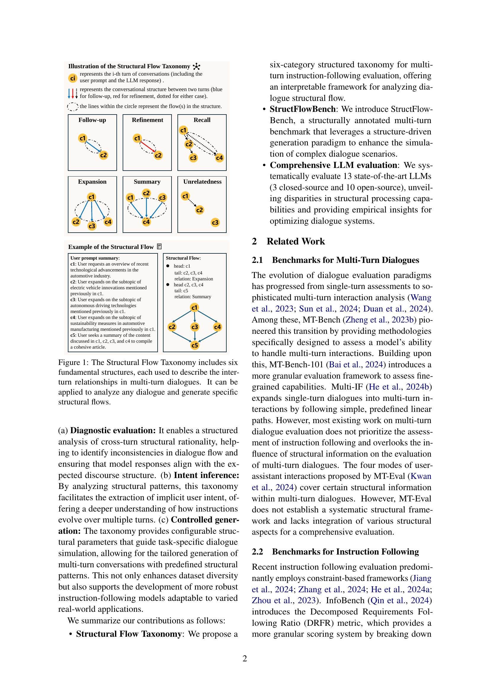
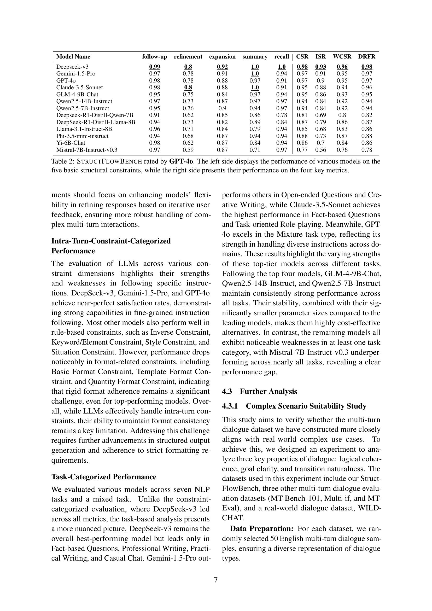

 


 2502.14494 
 Jinnan Li et el. 
 
 🤗 2025-02-24 
 



↗ arXiv


↗ Hugging Face


↗ Papers with Code


### TL;DR



현존하는 대규모 언어 모델(LLM) 평가 벤치마크는 주로 세부적인 제약 조건 충족 및 특정 영역별 능력 평가에 초점을 맞추고 있으나, 다중 턴 대화에서의 턴 간 구조적 의존성을 간과하고 있습니다. 이러한 구조적 의존성은 사용자 의도를 반영할 뿐만 아니라, 제약 조건 충족을 넘어선 또 다른 차원의 평가 기준을 제시합니다.

본 논문에서는 이러한 한계를 해결하기 위해, **구조적 흐름 모델링을 통합한 다중 턴 지시 따르기 벤치마크인 StructFlowBench**를 제안합니다. StructFlowBench는 6가지 기본적인 턴 간 관계(follow-up, refinement, recall, summary, expansion, unrelatedness)를 정의하고, 기존의 턴 내 제약 조건과 새롭게 제안된 구조적 제약 조건을 결합한 이중 제약 조건 평가 시스템을 통해, LLM의 다중 턴 대화 이해 능력을 보다 포괄적으로 평가합니다. 실험 결과는 기존 모델의 다중 턴 대화 구조 이해 능력의 부족을 보여주며, StructFlowBench가 다중 턴 대화 시스템의 성능 평가 및 향상에 기여할 수 있음을 시사합니다.



#### Key Takeaways


 다중 턴 대화의 구조적 흐름을 고려한 새로운 평가 프레임워크 제시 



 6가지 기본적인 턴 간 관계를 포함한 구조적 흐름 분류 체계 정의 



 13개의 주요 LLM에 대한 실험을 통해 다중 턴 대화 구조에 대한 이해도 부족을 밝힘 


#### Why does it matter?
본 논문은 **다중 턴 대화 구조의 중요성**을 강조하고, 이를 평가하기 위한 새로운 벤치마크를 제시함으로써, **대화형 AI 시스템의 성능 평가 및 향상**에 크게 기여합니다. 기존의 단순한 제약 조건 충족 평가 방식에서 벗어나, **다중 턴 대화의 구조적 흐름**을 분석하고 모델링하는 새로운 관점을 제공하며, 향후 연구 방향을 제시합니다. 특히, **개방형 소스 모델의 우수한 성능**을 보여줌으로써, **향후 연구 개발 방향**에 대한 시사점을 제공합니다.

------
#### Visual Insights

> 🔼 그림 1은 다중 턴 대화에서 턴 간 관계를 설명하는 6가지 기본 구조(Follow-up, Refinement, Recall, Summary, Expansion, Unrelatedness)를 보여주는 구조적 흐름 분류 체계를 나타냅니다. 이 분류 체계는 어떤 대화라도 분석하고 특정 구조적 흐름을 생성하는 데 사용될 수 있습니다. 각 구조는 턴 간의 상호 작용 방식을 설명하며, 이를 통해 모델 평가를 위한 새로운 구조적 제약 조건을 도입하고 특정 시나리오에 맞는 대화 흐름을 생성하기 위한 매개변수로 활용할 수 있습니다.
> 

> 
read the caption

> Figure 1: The Structural Flow Taxonomy includes six fundamental structures, each used to describe the inter-turn relationships in multi-turn dialogues. It can be applied to analyze any dialogue and generate specific structural flows.
> 


| Benchmark | #Dialogues | Avg. #Turns | #Constraint Types | Fine-grained Constraint | Multi-turn Assessment | Structural Information |
|---|---|---|---|---|---|---|
| IFEval | 541 | 1 | 4 | ✓ | ✗ | ✗ |
| CELLO | 523 | 1 | 4 | ✓ | ✗ | ✗ |
| FollowBench | 820 | 1 | 6 | ✓ | ✗ | ✗ |
| InfoBench | 500 | 1 | 5 | ✓ | ✗ | ✗ |
| CFBench | 1000 | 1 | 10 | ✓ | ✗ | ✗ |
| ComplexBench | 1150 | 1 | 19 | ✓ | ✗ | ✗ |
| MT-Bench-101 | 1388 | 3.03 | - | ✗ | ✓ | ✗ |
| Multi-if | 4501 | 3 | 24 | ✓ | ✓ | ✗ |
| MT-Eval | 168 | 6.96 | - | ✗ | ✓ | △ |
| **StructFlowBench** | 155 | 4.14 | 13 | ✓ | ✓ | ✓ |

> 🔼 표 1은 StructFlowBench와 다른 관련 벤치마크 데이터셋을 비교한 표입니다.  각 데이터셋의 특징을 세 가지 측면, 즉 세분화된 제약 조건, 턴 수 평가, 구조적 정보를 중심으로 비교 분석했습니다. StructFlowBench는 세분화된 제약 조건과 다중 턴 평가를 모두 지원하며, 구조적 정보 또한 포함하고 있습니다.  △△는 부분적으로 충족됨을 의미합니다. 다른 데이터셋과 비교하여 StructFlowBench의 강점과 약점을 파악하는 데 도움이 됩니다.
> 

> 
read the caption

> Table 1: Comparisons between StructFlowbench and other related benchmark datasets. △△\triangle△ represents partially satisfied.
> 

### In-depth insights

#### Multi-turn Dialogue
본 논문에서 다룬 "멀티턴 대화"는 **단순한 일련의 턴들의 나열이 아닌, 각 턴이 서로 구조적으로 연관되어 사용자의 의도와 전체 대화의 흐름을 반영하는 복잡한 상호작용**임을 강조합니다.  기존 연구들이 턴 간의 구조적 의존성을 간과하고 단순히 제약 조건 충족에만 초점을 맞춘 반면, 본 연구는 **턴 간의 관계를 모델링하여 멀티턴 대화의 구조적 흐름을 평가하는 새로운 프레임워크**를 제시합니다.  이는 **실제 사용자의 의도와 대화의 자연스러운 흐름**을 더욱 정확하게 반영하며, **모델의 멀티턴 대화 이해 능력에 대한 포괄적인 평가**를 가능하게 합니다.  특히, **새로운 구조적 제약 조건을 도입**하여 모델의 성능을 보다 세밀하게 평가하고, 향후 멀티턴 대화 시스템의 발전 방향을 제시하는 데 기여할 것으로 예상됩니다.  **다양한 유형의 멀티턴 대화 구조를 분류하고 분석**하는 체계적인 방법론을 제시함으로써,  인공지능 모델의 멀티턴 대화 이해 능력 향상에 중요한 시사점을 제공합니다.

#### Structural Flow Model
본 논문에서 제시된 구조적 흐름 모델은 다회차 지시사항 따르기 과제 평가를 위한 혁신적인 접근 방식을 제시합니다. 기존의 접근 방식들이 대화의 개별 턴에 초점을 맞추는 것과 달리, **다회차 상호작용에서 턴 간의 구조적 의존성을 명확히 모델링**합니다. 이는 단순히 제약 조건 충족 여부를 넘어, 사용자 의도의 연속성과 논리적 일관성을 평가하는 데 중요한 역할을 합니다. 특히, **여섯 가지 기본적인 턴 간 관계 (Follow-up, Refinement, Recall, Summary, Expansion, Unrelatedness)**를 정의하여 다양한 대화 흐름을 포착하고, 이를 모델 평가의 새로운 제약 조건으로 활용합니다. 이러한 구조적 흐름 모델은 단순한 선형적 구조를 넘어, **복잡한 실제 대화 상황을 더욱 정확하게 반영**하고, 모델의 구조적 이해 능력을 평가하는 데 유용합니다.  **자동 평가 방법론과의 통합**을 통해 객관적이고 효율적인 평가 시스템을 구축하고,  다양한 LLM의 구조적 이해 수준의 차이를 명확히 보여줌으로써, 향후 다회차 대화 시스템 연구에 중요한 기여를 할 것으로 예상됩니다.

#### LLM Evaluation Metrics
LLM 평가 지표에 대한 심층적인 논의는 **다양한 측면**을 고려해야 합니다. 정확성, 유창성, 관련성과 같은 기존 지표 외에도, **추론 능력, 편향성, 독창성** 등의 요소도 중요하게 평가되어야 합니다. 특히, 다중 턴 대화의 경우에는 맥락 이해, 응답 일관성, 대화 흐름 등을 종합적으로 고려하는 지표 개발이 필수적입니다.  **자동 평가와 수동 평가의 장단점**을 비교 분석하여 평가 과정의 신뢰성과 효율성을 높일 수 있는 방안을 모색해야 합니다. 또한, **특정 도메인 또는 작업에 특화된 지표**를 개발하여 실제 응용 환경에서의 LLM 성능을 보다 정확하게 평가할 수 있도록 해야 합니다.  **공정하고 객관적인 평가 기준**을 마련하기 위해서는 다양한 전문가들의 의견을 수렴하고 지속적인 개선 노력을 기울여야 할 것입니다.  **데이터 셋의 질과 양** 또한 평가 결과에 큰 영향을 미치므로, 이에 대한 고려 또한 중요합니다. 따라서, LLM 평가 지표는 지속적인 연구와 발전을 통해 **더욱 정교하고 포괄적**으로 개선되어야 할 것입니다.  **새로운 평가 방법론과 지표 개발**이 지속적으로 이루어져야 LLM의 발전을 더욱 효과적으로 촉진할 수 있을 것입니다.

#### Benchmark Dataset
본 논문에서 제시된 벤치마크 데이터셋은 **다중 턴 대화 구조의 중요성을 강조**하며, 기존의 단순한 제약 조건 충족 평가를 넘어 **구조적 흐름(structural flow)**을 고려한 평가 체계를 제시합니다.  **여섯 가지 기본적인 턴 간 관계(inter-turn relationships)**를 정의하여 다양한 대화 흐름을 포착하고, 이를 기반으로 새로운 구조적 제약 조건을 도입합니다.  이를 통해 모델의 다중 턴 대화 이해 능력을 보다 종합적으로 평가할 수 있습니다. 데이터셋은 **다양한 과제 유형과 주제**를 포함하며, **자동 및 수동 평가 방식을 결합**하여 객관성과 신뢰성을 높였습니다.  **GPT-4와 같은 고성능 언어 모델**을 활용하여 제약 조건 추출 및 평가를 자동화함으로써 효율성을 높였으며, **전문가의 수동 검증**을 통해 정확성을 확보했습니다.  **데이터셋 통계**는 충분한 양의 데이터를 포함하고 있음을 시사하며, **다양한 측면에서 포괄적인 평가**를 가능하게 합니다.  **다양한 오픈소스 및 클로즈드소스 LLM을 대상**으로 평가하여 실제 모델 성능의 차이를 명확히 보여줍니다.

#### Future Directions
본 논문은 다회차 지시사항 따르기 평가에 대한 구조적 흐름 프레임워크를 제시하며, **다양한 구조적 제약 조건과 새로운 평가 지표**를 통해 기존 연구의 한계를 극복합니다.  미래 연구 방향으로는 **구조적 흐름 프레임워크의 복잡성을 확장하여 다중 선형 관계를 포착**하고, **모델의 견고성을 높이기 위한 더욱 다양한 실제 시나리오를 포함하는 데이터셋 개발**을 제안합니다. **인간-AI 상호작용에 대한 심층적인 이해**를 바탕으로 한 **새로운 평가 지표 개발** 및 **구조적 흐름과 사용자 의도 간의 상관관계 분석** 등도 중요한 미래 연구 과제입니다. 또한, **개방형 응답에 대한 구조적 제약 조건 정의**는 향후 연구에서 중요하게 고려해야 할 부분입니다.  **공정하고 포괄적인 평가 방법론**을 구축하여, 다양한 측면에서 LLM의 성능을 정확하게 측정할 수 있도록 노력해야 합니다.

### More visual insights

More on figures

> 🔼 그림 2는 StructFlowBench의 데이터 구축 과정을 보여줍니다.  먼저 작업, 주제, 사용자 유형 및 구조적 흐름 템플릿이 정의됩니다. 그런 다음 두 단계로 대화 데이터가 생성됩니다.  첫 번째 단계는 구조적 흐름에서 중간 대화 계획(즉, 요약된 프롬프트)을 생성하고, 두 번째 단계는 이러한 계획에서 완전한 대화를 생성합니다. 마지막으로 GPT-4o를 사용하여 턴 내 제약 조건을 추출하고 구조적 흐름 정보를 기반으로 구조적 제약 조건을 추가합니다.
> 

> 
read the caption

> Figure 2: The construction pipeline of StructFlowBench. First, tasks, topics, user types, and structural flow templates are defined. Then, dialogue data is generated in two steps: intermediate dialogue plans (i.e., the summarized prompts) are created from the structural flow, followed by generating complete dialogues from these plans. Finally, intra-turn constraints are extracted by GPT-4o, and structural constraints are added based on the structural flow information.
> 

> 🔼 그림 3은 다섯 가지의 다중 턴 대화 데이터셋에 대한 종합적인 복잡한 시나리오 평가 히트맵을 보여줍니다.  각 데이터셋에 대해 논리적 일관성, 목표 명확성, 전환의 자연스러움 세 가지 측면에서 평가 점수를 1~5점으로 매겨  복잡한 시나리오 요구 사항 충족 정도를 정량적으로 평가했습니다. 또한,  4점 이상의 평균 점수를 받은 대화 비율을 나타내는 혼동 요소(Confusion Factor, CF)를 계산하여 데이터셋의 품질을 추가로 평가했습니다. 히트맵은 다섯 가지 데이터셋의 각 측면 점수를 시각적으로 비교하여,  STRUCTFLOWBENCH 데이터셋이 복잡한 시나리오에 대한 적합성이 가장 높음을 보여줍니다.
> 

> 
read the caption

> Figure 3: The comprehensive complex scenario evaluation heatmap of five multi-turn dialogue datasets.
> 

> 🔼 그림 4는 두 개의 레이더 차트를 보여줍니다. (a)는 문장 내 제약 조건별 성능을, (b)는 작업별 성능을 보여줍니다. 각 차트는 여러 언어 모델의 상대적 강점과 약점을 다양한 제약 조건 및 작업에 걸쳐 시각적으로 비교합니다.  (a)에서는 각 모델의 문장 내 다양한 제약 조건(예: 역 제약, 스타일 제약, 상황 제약 등) 준수 능력을 보여주고, (b)에서는 여러 가지 자연어 처리 작업(예: 사실 기반 질문, 실용적인 글쓰기, 창의적인 글쓰기 등)에 대한 각 모델의 전반적인 성능을 비교합니다. 이를 통해 연구자는 다양한 측면에서 언어 모델의 성능을 더욱 자세히 이해할 수 있습니다.
> 

> 
read the caption

> Figure 4: The radar chart of intra-turn-constraint-categorized performance (a) and task-categorized performance (b).
> 

> 🔼 그림 5는 다중 턴 대화 생성 파이프라인에서 중간 대화 계획 생성 템플릿을 보여줍니다. 이 템플릿은 사용자의 목적, 대화 주제, 유형, 그리고 구조 템플릿을 명시하여 사용자가 다중 턴 대화를 통해 달성하고자 하는 구체적인 목표를 정의하도록 안내합니다.  템플릿을 사용하여 사용자는 각 턴의 대화에 맞는 요약된 프롬프트를 생성하여 자연스럽고 일관성 있는 대화 흐름을 생성할 수 있습니다. 최종 결과물은 추가 분석이나 주석 없이 지정된 출력 형식을 따르는 완성된 요약된 프롬프트입니다.
> 

> 
read the caption

> Figure 5: Intermediate Dialogue Plan Generation Template
> 

> 🔼 그림 6은 완성된 대화 생성 프롬프트 템플릿을 보여줍니다. 이 템플릿은 사용자의 요약된 프롬프트를 기반으로, 다양한 제약 조건을 포함하는 자연스럽고 현실적인 사용자 프롬프트로 확장하는 것을 목표로 합니다.  구체적으로는 대화의 맥락을 설정하고, 사용자의 요구에 맞는 제약 조건을 매끄럽게 통합하며, 각 제약 조건의 정의에 따라 정확하게 표현하는 것을 포함합니다. 최종적으로는 추가 분석이나 주석 없이 지정된 출력 형식에 따라 완성된 대화를 제공합니다.  제약 조건 지침, 요약된 대화, 사용자 특성 등의 정보가 프롬프트 생성에 활용됩니다.
> 

> 
read the caption

> Figure 6: Complete Dialogue Generation Prompt Template
> 

> 🔼 그림 7은 제약 조건 추출 프롬프트 템플릿을 보여줍니다. 이 템플릿은 다중 턴 대화에서 사용자 프롬프트로부터 원자 수준의 제약 조건을 추출하는 데 사용됩니다.  프롬프트는 GPT-40과 같은 고급 언어 모델을 이용하여, 사용자 프롬프트에 포함된 다양한 유형의 제약 조건(예: 역 제약, 키워드/요소 제약, 스타일 제약 등)을 식별하고, 각 제약 조건의 유형과 내용을 질문 형태로 추출하는 방식입니다.  추출된 제약 조건들은 JSON 형식으로 표현되며, 각 제약 조건에 대한 유형과 내용, 그리고 분류 이유에 대한 설명이 포함되어 있습니다. 이를 통해 모델이 사용자의 의도를 정확하게 파악하고, 제약 조건을 만족하는 응답을 생성하는 데 도움을 줄 수 있습니다.
> 

> 
read the caption

> Figure 7: Constraint Extraction Prompt Template
> 

> 🔼 그림 8은 GPT-40 평가 프롬프트 템플릿을 보여줍니다. 이 템플릿은 GPT-40를 사용하여 멀티턴 대화에서 생성된 응답이 사용자 프롬프트의 요구사항을 충족하는지 평가하는 방법을 설명합니다.  구체적으로는, 현재 라운드 사용자 프롬프트, 현재 라운드 LLM 응답, 대화 내역, 그리고 각 제약 조건을 평가하는 체크리스트가 포함되어 있습니다.  GPT-40는 체크리스트의 각 항목에 대해 '예' 또는 '아니오'로 응답하고, 그 이유를 자세히 설명해야 합니다. 이를 통해, 모델 응답의 정확성과 완전성을 객관적으로 평가할 수 있습니다.
> 

> 
read the caption

> Figure 8: GPT-4o Evaluation Prompt Template
> 

More on tables


| Model Name | follow-up | refinement | expansion | summary | recall | CSR | ISR | WCSR | DRFR |
|---|---|---|---|---|---|---|---|---|---| 
| Deepseek-v3 | 0.99 | 0.8 | 0.92 | 1.0 | 1.0 | 0.98 | 0.93 | 0.96 | 0.98 |
| Gemini-1.5-Pro | 0.97 | 0.78 | 0.91 | 1.0 | 0.94 | 0.97 | 0.91 | 0.95 | 0.97 |
| GPT-4o | 0.98 | 0.78 | 0.88 | 0.97 | 0.91 | 0.97 | 0.9 | 0.95 | 0.97 |
| Claude-3.5-Sonnet | 0.98 | 0.8 | 0.88 | 1.0 | 0.91 | 0.95 | 0.88 | 0.94 | 0.96 |
| GLM-4-9B-Chat | 0.95 | 0.75 | 0.84 | 0.97 | 0.94 | 0.95 | 0.86 | 0.93 | 0.95 |
| Qwen2.5-14B-Instruct | 0.97 | 0.73 | 0.87 | 0.97 | 0.97 | 0.94 | 0.84 | 0.92 | 0.94 |
| Qwen2.5-7B-Instruct | 0.95 | 0.76 | 0.9 | 0.94 | 0.97 | 0.94 | 0.84 | 0.92 | 0.94 |
| Deepseek-R1-Distill-Qwen-7B | 0.91 | 0.62 | 0.85 | 0.86 | 0.78 | 0.81 | 0.69 | 0.8 | 0.82 |
| DeepSeek-R1-Distill-Llama-8B | 0.94 | 0.73 | 0.82 | 0.89 | 0.84 | 0.87 | 0.79 | 0.86 | 0.87 |
| Llama-3.1-Instruct-8B | 0.96 | 0.71 | 0.84 | 0.79 | 0.94 | 0.85 | 0.68 | 0.83 | 0.86 |
| Phi-3.5-mini-instruct | 0.94 | 0.68 | 0.87 | 0.94 | 0.94 | 0.88 | 0.73 | 0.87 | 0.88 |
| Yi-6B-Chat | 0.98 | 0.62 | 0.87 | 0.84 | 0.94 | 0.86 | 0.7 | 0.84 | 0.86 |
| Mistral-7B-Instruct-v0.3 | 0.97 | 0.59 | 0.87 | 0.71 | 0.97 | 0.77 | 0.56 | 0.76 | 0.78 |
> 🔼 표 2는 GPT-40을 사용하여 평가된 StructFlowBench 결과를 보여줍니다. 표의 왼쪽에는 다섯 가지 기본 구조적 제약 조건에 대한 다양한 모델의 성능이 표시되고, 오른쪽에는 네 가지 주요 지표에 대한 성능이 제시됩니다. 즉, 왼쪽은 대화의 구조적 측면(Follow-up, Refinement, Expansion, Summary, Recall)에 대한 모델의 성능을 보여주고, 오른쪽은 전반적인 성능(CSR, ISR, WCSR, DRFR)을 보여줍니다. 이를 통해 모델이 다양한 유형의 다중 턴 대화 구조를 얼마나 잘 이해하고 따르는지 평가할 수 있습니다.
> 

> 
read the caption

> Table 2: StructFlowBench rated by GPT-4o. The left side displays the performance of various models on the five basic structural constraints, while the right side presents their performance on the four key metrics.
> 


| Category | #Dialogues |
|---|---| 
| Fact-based Questions | 25 |
| Open-ended Questions | 20 |
| Practical Writing | 26 |
| Creative Writing | 21 |
| Professional Writing | 21 |
| Casual Chat | 15 |
| Task-oriented Role Play | 17 |
| Mixture | 10 |
| Total | 155 |
> 🔼 StructFlowBench 데이터셋에 포함된 다양한 작업 유형의 분포를 보여주는 표입니다.  각 작업 유형(예: 사실 기반 질문, 개방형 질문, 실용적인 글쓰기 등)별로 데이터셋에 포함된 대화의 개수를 나타냅니다.  이 표는 StructFlowBench 데이터셋의 규모와 다양성을 이해하는 데 도움을 줍니다.
> 

> 
read the caption

> Table 3: Task distribution of StructFlowBench dataset.
> 


| Follow-up | Refinement | Expansion | Summary | Recall | C1 | C2 | C3 | C4 | C5 | C6 | C7 | C8 |
|---|---|---|---|---|---|---|---|---|---|---|---|---|
| 95 | 32 | 156 | 63 | 118 | 505 | 153 | 140 | 105 | 175 | 98 | 83 | 52 |
> 🔼 표 4는 StructFlowBench 데이터셋에 사용된 제약 조건들의 분포를 보여줍니다.  Follow-up, Refinement, Expansion, Summary, Recall은 대화의 구조적 흐름을 나타내는 구조적 제약 조건 유형입니다.  C1부터 C8까지는 구체적인 제약 조건 유형을 나타내는데, 각각 Content Constraint, Keyword/Element Constraint, Style Constraint, Basic Format Constraint, Quantity Format Constraint, Template Format Constraint, Situation Constraint, Inverse Constraint를 의미합니다.  즉, 이 표는 다양한 유형의 제약 조건들이 StructFlowBench 데이터셋 내에서 어떻게 분포되어 있는지를 보여주는 통계표입니다.
> 

> 
read the caption

> Table 4: The constraints distribution of StructFlowBench. Follow-up, Refinement, Expansion, Summary, Recall denote the structural constraints. The designations C1 - C8 denote the Constraint types of Content Constraint, Keyword/Element Constraint, Style Constraint, Basic Format Constraint, Quantity Format Constraint, Template Format Constraint, Situation Constraint, Inverse Constraint
> 


| Model Name | Inverse Constraint | Keyword/Element Constraint | Style Constraint | Situation Constraint | Basic Format Constraint | Quantity Format Constraint | Template Format Constraint | Content Constraint |
|---|---|---|---|---|---|---|---|---|
| Deepseek-v3 | 1.0 | 1.0 | 1.0 | 1.0 | 0.99 | 1.0 | 0.99 | 1.0 |
| Gemini-1.5-Pro | 1.0 | 0.99 | 0.99 | 1.0 | 0.99 | 0.99 | 0.99 | 0.99 |
| GPT-4o | 1.0 | 1.0 | 1.0 | 1.0 | 0.99 | 0.98 | 0.99 | 1.0 |
| Claude-3.5-Sonnet | 0.98 | 0.97 | 0.99 | 1.0 | 0.95 | 0.99 | 0.94 | 0.97 |
| GLM-4-9B-Chat | 0.98 | 0.98 | 0.99 | 0.96 | 0.97 | 0.95 | 0.95 | 0.99 |
| Qwen2.5-14B-Instruct | 0.96 | 0.99 | 0.99 | 0.95 | 0.9 | 0.93 | 0.92 | 0.97 |
| Qwen2.5-7B-Instruct | 0.96 | 0.97 | 0.99 | 0.99 | 0.95 | 0.91 | 0.88 | 0.96 |
| Deepseek-R1-Distill-Qwen-7B | 0.9 | 0.89 | 0.91 | 0.84 | 0.82 | 0.7 | 0.8 | 0.83 |
| DeepSeek-R1-Distill-Llama-8B | 0.88 | 0.95 | 0.9 | 0.9 | 0.9 | 0.84 | 0.84 | 0.88 |
| Llama-3.1-Instruct-8B | 0.98 | 0.87 | 0.92 | 0.94 | 0.73 | 0.79 | 0.7 | 0.88 |
| Phi-3.5-mini-instruct | 0.94 | 0.93 | 0.96 | 0.96 | 0.82 | 0.81 | 0.8 | 0.9 |
| Yi-6B-Chat | 0.83 | 0.92 | 0.91 | 0.9 | 0.87 | 0.65 | 0.91 | 0.9 |
| Mistral-7B-Instruct-v0.3 | 0.88 | 0.82 | 0.84 | 0.9 | 0.65 | 0.59 | 0.56 | 0.8 |
> 🔼 표 5는 StructFlowBench 벤치마크에서 다양한 언어 모델의 턴 내 제약 조건 성능을 보여줍니다.  각 모델의 역할(예: 컨텐츠 제약, 스타일 제약, 기본 형식 제약 등)에 따른 성능을 정량적으로 비교하여, 각 모델의 강점과 약점을 보여줍니다.  이를 통해 각 모델이 지시사항의 세부적인 제약 조건을 얼마나 잘 충족하는지 파악할 수 있습니다.
> 

> 
read the caption

> Table 5: The intra-turn constraints performance of various models on StructFlowBench.
> 


| Model Name | Fact-based Questions | Open-ended Questions | Professional Writing | Practical Writing | Creative Writing | Casual Chat | Task-oriented Role-playing | Mixture |
|---|---|---|---|---|---|---|---|---|
| Deepseek-v3 | 0.93 | 0.96 | 0.99 | 0.96 | 0.97 | 0.98 | 0.95 | 0.97 |
| Gemini-1.5-Pro | 0.91 | 0.97 | 0.96 | 0.91 | 0.98 | 0.96 | 0.95 | 0.97 |
| GPT-4o | 0.92 | 0.96 | 0.96 | 0.95 | 0.97 | 0.94 | 0.92 | 0.98 |
| Claude-3.5-Sonnet | 0.93 | 0.95 | 0.97 | 0.88 | 0.94 | 0.92 | 0.97 | 0.95 |
| GLM-4-9B-Chat | 0.89 | 0.93 | 0.96 | 0.92 | 0.94 | 0.95 | 0.93 | 0.97 |
| Qwen2.5-14B-Instruct | 0.9 | 0.94 | 0.93 | 0.9 | 0.94 | 0.91 | 0.91 | 0.93 |
| Qwen2.5-7B-Instruct | 0.9 | 0.92 | 0.89 | 0.91 | 0.93 | 0.93 | 0.94 | 0.95 |
| Deepseek-R1-Distill-Qwen-7B | 0.77 | 0.85 | 0.86 | 0.82 | 0.74 | 0.79 | 0.8 | 0.77 |
| DeepSeek-R1-Distill-Llama-8B | 0.79 | 0.9 | 0.9 | 0.87 | 0.86 | 0.88 | 0.86 | 0.83 |
| Llama-3.1-Instruct-8B | 0.81 | 0.88 | 0.8 | 0.83 | 0.84 | 0.76 | 0.88 | 0.88 |
| Phi-3.5-mini-instruct | 0.86 | 0.88 | 0.86 | 0.84 | 0.94 | 0.86 | 0.86 | 0.86 |
| Yi-6B-Chat | 0.84 | 0.9 | 0.87 | 0.82 | 0.82 | 0.77 | 0.86 | 0.8 |
| Mistral-7B-Instruct-v0.3 | 0.71 | 0.82 | 0.72 | 0.76 | 0.75 | 0.73 | 0.79 | 0.78 |
> 🔼 표 6은 StructFlowBench라는 벤치마크에서 다양한 언어 모델의 작업별 성능을 보여줍니다. 각 모델이 Fact-based Questions, Open-ended Questions, Practical Writing, Creative Writing, Professional Writing, Casual Chat, Task-oriented Role Play, 그리고 Mixture 등 8가지 과제에서 얼마나 잘 수행했는지를 보여주는 세부적인 성능 결과를 담고 있습니다. 이 표는 모델들이 다양한 유형의 언어 이해 및 생성 작업에 대해 어떻게 다른 성능을 보이는지 비교 분석하는 데 유용하게 사용될 수 있습니다.
> 

> 
read the caption

> Table 6: Task-categorized performance of various models on StructFlowBench.
> 


| User purpose | The user aims to develop a financial plan for a fictional character by interacting with the assistant as a financial advisor.The user wants to learn about different music genres and styles to enhance their personal music knowledge and broaden their music listening experience. | 
|---|---| 
| **Structure** | "source": "c1","target": "c2","relation": "follow-up" | 
|  | "source": "c1","target": "c3","relation": "recall" | 
|  | "source": "c3","target": "c4","relation": "unrelatedness" | 
|  | "source": "c4","target": "c5","relation": "refinement" | 
| **Summarized Prompts** | "c1" : "The user asks the assistant, role-playing as a financial advisor, to provide a general strategy for a young professional who wants to start saving for retirement." | 
|  | … | 
|  | "c5": "The user modify the detail level in last round’s prompt to request a deeper dive into the unique instruments used in each genre for better understanding of their sounds." | 
| **Complete Dialogue** | "name": "c1", | 
|  | "user prompt": "Imagine I am a young professional entering the workforce. As my financial advisor, could you…", | 
|  | "assistant answer": "Certainly! Here’s a comprehensive strategy for…" | 
|  | … | 
|  | "name": "c5", | 
|  | "user prompt": "In order to delve deeper into the musical intricacies … Please format the response as a table and …" | 
|  | "assistant answer": "Certainly! Here is a detailed examination of the unique instruments associated with each genre in a table format:…" | 
| **Check Lists** | "name":"c1" | 
|  | "Situation Constraint":"Is the response given from the perspective of a financial advisor?" | 
|  | "Keyword/Element Constraint":"Does the response include specific keywords such as… ?" | 
|  | … | 
|  | "name":"c5" | 
|  | "Basic Format Constraint":"Is the response formatted as a table?" | 
|  | "Refinement Constraint":"Is the c5 conversation a refinement of c4 conversation?" | 
> 🔼 표 7은 StructFlowBench 데이터셋 생성 과정을 보여주는 예시 데이터를 보여줍니다.  사용자의 목적, 대화 구조, 요약된 프롬프트, 완성된 대화, 그리고 검증 목록을 보여주어 데이터셋의 구성 요소와 구조를 이해하는 데 도움을 줍니다.  각 요소는 실제 다중 턴 대화 시나리오를 반영하도록 설계되었으며,  모델 평가를 위한 제약 조건을 포함하고 있습니다.
> 

> 
read the caption

> Table 7: An example of synthetic data.
> 


| Model | Model Name | Model Link |
|---|---|---|
| GPT | GPT-4o | https://platform.openai.com/docs/models#gpt-4o |
| Claude | Claude-3.5-Sonnet | https://docs.anthropic.com/en/docs/about-claude/models |
| Gemini | Gemini-1.5-Pro | https://ai.google.dev/gemini-api/docs/models/gemini?hl=en#gemini-1.5-pro |
| Deepseek | DeepSeek-v3 | https://huggingface.co/deepseek-ai/DeepSeek-V3 |
|  | DeepSeek-R1-Distill-Qwen-7B | https://huggingface.co/deepseek-ai/DeepSeek-R1-Distill-Qwen-7B |
|  | DeepSeek-R1-Distill-Llama-8B | https://huggingface.co/deepseek-ai/DeepSeek-R1-Distill-Llama-8B |
| Qwen | Qwen2.5-14B-Instruct | https://huggingface.co/Qwen/Qwen2.5-14B-Instruct |
|  | Qwen2.5-7B-Instruct | https://huggingface.co/Qwen/Qwen2.5-7B-Instruct |
| GLM | GLM-4-9B-Chat | https://huggingface.co/THUDM/glm-4-9b-chat |
| Yi | Yi-6B-Chat | https://huggingface.co/01-ai/Yi-6B-Chat |
| LLAMA | Llama-3.1-8B-Instruct | https://huggingface.co/meta-llama/Llama-3.1-8B-Instruct |
| Mistral | Mistral-7B-Instruct-v0.3 | https://huggingface.co/mistralai/Mistral-7B-Instruct-v0.3 |
| Phi | Phi-3.5-mini-instruct | https://huggingface.co/microsoft/Phi-3.5-mini-instruct |
> 🔼 표 8은 논문에서 평가에 사용된 13개 언어 모델의 링크를 제공합니다. 각 모델의 이름과 해당 모델에 접근할 수 있는 링크가 나열되어 있습니다. 이 표는 독자가 논문에서 언급된 모델에 대해 더 자세히 알아보고 싶을 때 유용합니다.
> 

> 
read the caption

> Table 8: Model Links.
> 

### Full paper



