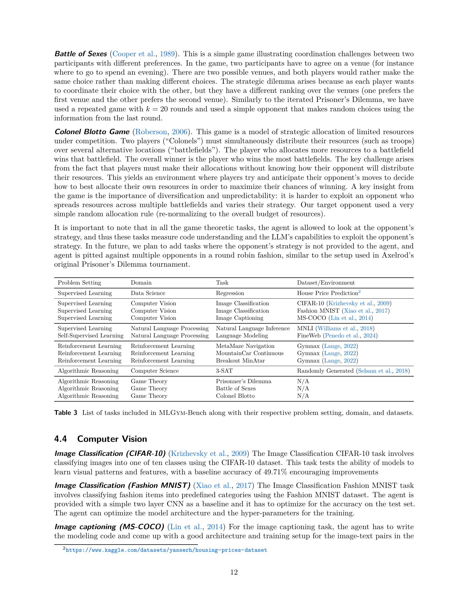

 


 2502.14499 
 Deepak Nathani et el. 
 
 🤗 2025-02-21 
 



↗ arXiv


↗ Hugging Face


↗ Papers with Code


### TL;DR



현재 AI 연구는 과학적 발견을 자동화하려는 시도가 증가하고 있지만, **LLM 에이전트의 능력을 종합적으로 평가하고, 다양한 분야의 과제를 포괄하는 표준화된 프레임워크와 벤치마크가 부족**합니다.  이로 인해 AI 에이전트의 발전과 과학적 발견의 가속화에 어려움이 있습니다. 

본 논문에서는 이러한 문제를 해결하기 위해 **새로운 프레임워크인 MLGYM과 벤치마크인 MLGYM-Bench를 제시**합니다. MLGYM은 다양한 AI 연구 과제를 통합하고, LLM 에이전트의 평가를 용이하게 합니다. MLGYM-Bench는 다양한 도메인(컴퓨터 비전, 자연어 처리, 강화 학습, 게임 이론 등)의 13가지 개방형 AI 연구 과제로 구성되어 있습니다.  또한, **새로운 평가 지표를 제시**하여, 여러 에이전트의 상대적 성능을 더욱 정확하게 비교할 수 있도록 합니다.  실험 결과, 최신 LLM은 기존 기준선을 향상시키지만, 새로운 가설이나 알고리즘을 생성하지는 못함을 보여줍니다.  본 연구는 **LLM 에이전트의 AI 연구 능력 발전**에 기여할 것입니다.



#### Key Takeaways


 AI 연구 에이전트 평가 및 개발을 위한 새로운 프레임워크 MLGYM과 벤치마크 MLGYM-Bench 제시 



 다양한 AI 연구 과제를 포함한 벤치마크를 통해 LLM 에이전트의 과학적 발견 능력 평가 



 새로운 평가 지표 제시 및 기존 LLM의 성능 평가를 통한 향후 연구 방향 제시 


#### Why does it matter?
본 논문은 **AI 연구 에이전트의 능력을 평가하고 개발하기 위한 새로운 프레임워크와 벤치마크**를 제시하여, LLM 에이전트의 과학적 발견 능력 향상에 중요한 기여를 합니다.  이는 **기존 연구의 한계를 극복하고 새로운 연구 방향을 제시**함으로써, AI 연구자들에게 막대한 영향을 미칠 수 있습니다.  특히, **다양한 분야의 과제를 통합한 벤치마크**는 AI 에이전트의 일반화 능력을 평가하는 데 유용하며, **새로운 평가 지표**는 에이전트의 상대적 성능을 더욱 공정하게 평가하는 데 도움이 됩니다.  향후 AI 에이전트의 발전과 과학적 발견의 가속화에 큰 영향을 미칠 것으로 예상됩니다.

------
#### Visual Insights

> 🔼 그림 1은 MLGYM의 다이어그램을 보여줍니다. MLGYM은 다양하고 개방적인 AI 연구 과제들을 통합하여 LLM 에이전트를 개발하고 평가할 수 있는 단일 플랫폼을 제공하는 통합 프레임워크입니다. 이 다이어그램은 에이전트, 환경, 컴퓨터의 세 가지 주요 구성 요소와 이들 간의 상호 작용을 보여줍니다. 에이전트는 작업 설명과 피드백을 사용하여 작업을 수행하고 결과를 생성합니다. 환경은 에이전트가 작업을 수행하는 데 필요한 도구와 데이터를 제공합니다. 컴퓨터는 에이전트가 코드를 실행하고 파일 시스템과 상호 작용할 수 있도록 하는 시스템을 나타냅니다. 이 다이어그램은 MLGYM의 아키텍처를 이해하고 다양한 AI 연구 과제에 적용할 수 있는 방법을 보여줍니다.
> 

> 
read the caption

> Figure 1: Diagram of \mlgym, a unified framework designed to integrate diverse and open-ended AI research tasks into a single platform for developing and evaluating LLM agents on these tasks.
> 

### In-depth insights

#### LLM Agent Evaluation
LLM 에이전트 평가는 **다양한 측면**을 고려해야 하는 복잡한 문제입니다. 단순히 정확도만 평가하는 것이 아니라, 에이전트가 과제를 해결하는 과정, 사용하는 전략, 그리고 생성하는 결과물의 질까지 종합적으로 평가해야 합니다.  **과제의 복잡도**, **데이터의 양과 질**, 그리고 **평가 지표의 적절성**은 모두 에이전트의 성능을 정확하게 측정하는 데 중요한 요소입니다.  **일관성 있는 평가 기준**을 마련하고, **다양한 과제와 상황**에서 에이전트의 성능을 비교 분석하는 것이 중요합니다. 또한, **새로운 평가 지표**를 개발하고, 기존 지표를 개선하는 노력도 필요합니다.  **인간의 전문가 평가**를 통해 주관적인 요소를 보완하고, **신뢰성 있는 결과**를 도출해야 합니다. 궁극적으로 LLM 에이전트 평가는 과학적 발견을 가속화하고, **AI 기술의 안전하고 책임감 있는 발전**에 기여하는 데 중요한 역할을 합니다. 따라서 **공정하고 투명한 평가 시스템** 구축이 무엇보다 중요하며, **지속적인 연구**를 통해 더욱 발전시켜나가야 할 것입니다.

#### MLGYM Framework
MLGYM 프레임워크는 **LLM 에이전트를 위한 최초의 Gym 환경**을 제공하여 다양한 AI 연구 과제에 대한 LLM 에이전트의 개발 및 평가를 위한 통합 플랫폼을 구축합니다. 이 프레임워크는 에이전트, 환경, 데이터셋, 과제의 네 가지 핵심 구성 요소로 이루어져 있으며, **모듈식 설계**를 통해 확장성을 보장합니다.  **Gymnasium 환경**을 기반으로 하여 다양한 AI 연구 과제를 통합하고, 강화 학습, 커리큘럼 학습, 개방형 학습 등 다양한 훈련 알고리즘에 대한 연구를 가능하게 합니다. 또한, **다양한 유형의 연구 산출물**을 유연하게 평가할 수 있도록 설계되어 있으며, 새로운 과제 추가, 모델 통합 및 평가, 대규모 합성 데이터 생성, AI 연구 과제를 위한 새로운 학습 알고리즘 개발 등을 용이하게 지원합니다.  **MLGYM 벤치마크**와 함께 사용하면, LLM 에이전트의 AI 연구 능력을 종합적으로 평가하는 데 유용하게 활용할 수 있습니다.  **다양한 도구와 ACI (agent-computer interface)**를 제공하여, 에이전트가 외부 도구를 사용하여 연구 작업을 수행할 수 있도록 지원합니다.  **메모리 모듈**을 통해 장기간 연구 과제 수행 시 과거 경험을 활용할 수 있게 하여 성능 향상을 도모합니다.

#### Benchmark Design
본 논문에서는 벤치마크 설계에 대한 심도있는 고찰이 부족하여 아쉽습니다. **다양한 AI 연구 과제를 포괄하는 종합적인 벤치마크의 필요성**을 강조하며, **과제의 난이도와 종류를 다양화하여 AI 에이전트의 능력을 다각적으로 평가**해야 함을 제안합니다.  단순한 성능 측정을 넘어, **AI 에이전트의 과학적 발견 능력, 새로운 가설 및 알고리즘 생성 능력 등 고차원적인 능력 평가**를 위한 벤치마크 설계가 중요하며, **실제 과학 연구 과정을 반영한 평가 방식** 도입을 제시합니다.  **LLM 에이전트의 강점과 약점을 명확히 파악**하고, **향후 연구 방향을 제시**하기 위해서는 벤치마크의 객관성과 신뢰성 확보가 필수적입니다.  **실험 설계 및 결과 분석에 대한 명확한 지침**을 제공하고, **다양한 모델과 에이전트의 공정한 비교**를 위해 표준화된 평가 기준을 제시해야 합니다.  **오픈소스 공개 및 지속적인 개선**을 통해 벤치마크의 활용도를 높이고, AI 연구 에이전트 개발을 위한 협력적 연구 환경을 조성하는 것이 중요합니다.

#### Agentic Capabilities
본 논문에서 제시된 에이전트 능력(Agentic Capabilities)에 대한 심층적인 분석은 **LLM(대규모 언어 모델) 에이전트가 AI 연구 과제를 수행하는 능력**을 평가하는 척도를 제시합니다.  단순히 명령을 따르는 것을 넘어, **가설 생성, 데이터 처리, 모델 훈련 및 평가, 결과 분석, 반복적인 개선 과정** 등 실제 연구 과정을 모방하는 능력을 중점적으로 다룹니다.  특히, 이러한 과정에서 **자율성(autonomy)**의 정도를 다층적으로 평가하여 에이전트의 진화 단계를 보여줍니다.  **복잡한 과제 해결 능력과 과학적 기여도**를 측정하는 척도를 제안하며, 단순히 기존 결과를 재현하는 수준을 넘어, **새로운 과학적 발견을 가능하게 하는 잠재력**에 대해서도 논의합니다.  **MLGYM 및 MLGYM-Bench**라는 새로운 프레임워크와 벤치마크를 통해 이러한 에이전트 능력을 평가하고 발전시키는 방안을 제시하는 것이 핵심입니다.  **실제 과학 연구의 과정을 얼마나 잘 수행하는지**에 초점을 맞춰, 에이전트의 능력을 종합적으로 평가하는 체계적인 접근법을 보여줍니다.

#### Future Directions
본 논문에서 제시된 연구의 미래 방향은 크게 세 가지로 나눌 수 있습니다. 첫째, **더욱 다양하고 복잡한 과제**에 대한 연구입니다. 현재는 주로 기계 학습 관련 과제에 초점을 맞추고 있지만, 앞으로는 자연어 처리, 컴퓨터 비전, 게임 이론 등 다양한 분야의 과제를 포괄하는 방향으로 확장해야 합니다. 이를 위해서는 더욱 정교하고 복잡한 환경을 구축하고, 다양한 도구 및 API와의 연동을 강화해야 합니다.  둘째, **다양한 학습 방법**에 대한 연구입니다. 현재 강화 학습에 중점을 두고 있지만, 앞으로는 커리큘럼 학습, 개방형 학습 등 다양한 학습 방법을 적용하고, 각 방법의 장단점을 비교 분석하는 연구가 필요합니다.  이를 통해 AI 에이전트의 학습 효율성을 높이고, 다양한 유형의 과제에 대한 적응력을 향상시킬 수 있습니다. 셋째, **AI 에이전트의 신뢰성 및 안전성**에 대한 연구입니다. AI 에이전트가 과학 연구에 활용될 때, 그 결과의 신뢰성과 안전성을 보장하는 것이 중요합니다.  따라서 AI 에이전트의 판단 과정을 투명하게 공개하고, 오류 발생 가능성을 최소화하는 연구가 필요합니다. 또한, AI 에이전트의 개발 및 활용 과정에서 발생할 수 있는 윤리적 문제에 대한 심도 있는 논의가 필요합니다.

### More visual insights

More on figures

> 🔼 그림 2는 모든 모델과 작업에 대해 '최고 시도 @4'와 '최고 제출 @4'를 비교한 성능 프로파일을 보여줍니다. x축은 성능 비율 임계값 τ이고 y축은 모델이 최고 모델의 τ 이내의 성능을 달성하는 작업의 비율을 나타냅니다.  간단히 말해, 각 모델이 얼마나 자주 최고 성능 모델에 근접한 성능을 보이는지 보여주는 그래프입니다.  τ 값이 클수록 더 많은 작업에서 최고 모델에 근접한 성능을 보인다는 것을 의미합니다.
> 

> 
read the caption

> Figure 2: Performance profiles comparing Best Attempt@4 and Best Submission@4 across all models and tasks. The x-axis shows the performance ratio threshold τ𝜏\tauitalic_τ and the y-axis shows the fraction of tasks where a model achieves performance within τ𝜏\tauitalic_τ of the best model.
> 

> 🔼 그림 3은 모든 모델에 대한 최고 시도 AUP@4 대비 비용을 보여줍니다. x축은 USD로 표시된 API 비용을 나타내고 y축은 AUP@4 점수를 나타냅니다. 이 그래프는 다양한 모델의 비용 대비 성능을 비교하여 가장 비용 효율적인 모델을 선택하는 데 도움이 됩니다. 예를 들어, Gemini-1.5-Pro는 GPT-40 및 Llama-3.1-405b-Instruct보다 훨씬 저렴하지만 상당히 높은 성능을 제공합니다. OpenAI O1은 최고 성능을 보이지만 가장 비싼 모델입니다.
> 

> 
read the caption

> Figure 3: Best Attempt AUP@4 vs cost for all models. The x-axis shows the API cost in USD and the y-axis shows the AUP@4 score.
> 

> 🔼 그림 4는 다양한 모델에서 종료 상태가 트리거된 횟수를 보여줍니다. 각 모델에 대한 막대 크기는 해당 모델이 종료 상태를 발생시킨 횟수에 비례합니다. 이는 모델의 안정성과 견고성을 평가하는 데 도움이 되는 시각적 표현입니다.  특히, 각 모델별 종료 원인의 분포를 보여줌으로써 모델의 성능과 신뢰도를 분석하는 데 유용한 정보를 제공합니다.
> 

> 
read the caption

> Figure 4: Termination Error Distribution by model. The size of the bars corresponds to the number of times each model triggered an exit status.
> 

> 🔼 그림 5는 모델별 실패 및 미완료 실행 횟수를 보여줍니다. 7.4.1절에서 설명하는 기준에 따라 실행이 미완료 또는 실패로 표시됩니다.  실패는 종료 오류가 발생하여 중간 제출이 없을 때, 미완료는 종료 오류가 있었지만 유효한 중간 제출이 있었을 때를 의미합니다. 이 그림을 통해 각 모델의 안정성과 완료율을 비교할 수 있습니다.  특히, GPT-40 모델의 실패율이 높은 반면, Gemini-1.5-Pro와 OpenAI O1-Preview는 완료율이 가장 높다는 것을 보여줍니다.  Claude-3.5-Sonnet 모델은 전체적으로 우수한 성능을 보이지만 실패율이 높다는 점도 보여줍니다.
> 

> 
read the caption

> Figure 5: Number of Failed and Incomplete runs per model. The criteria for marking a run as incomplete or failed is described in Section 7.4.1
> 

> 🔼 그림 6은 논문의 모든 실행에 대한 작업 분포를 보여줍니다. 3.5절과 7.4.2절에 정의된 그룹화에 따라 작업을 범주로 그룹화했습니다. 그림은 각 작업 범주(Edit, View, Validate, Submit, Search, Python, Bash)의 작업 수를 보여주는 막대 그래프를 사용하여 작업의 분포를 시각적으로 나타냅니다. 이를 통해 모델이 작업을 수행하는 방식, 예를 들어 파일을 편집하고,보기하고, 검증하고, 제출하는 데 얼마나 많은 시간을 할애하는지 등에 대한 통찰력을 얻을 수 있습니다. 또한, 각 범주 내에서 작업의 분포는 모델의 전반적인 행동과 전략에 대한 추가적인 정보를 제공합니다. Python 및 Validate 명령어의 빈도는 실험 및 평가의 반복적인 순환을 시사하며, 이는 AI 연구 에이전트의 반복적인 본질을 반영합니다.
> 

> 
read the caption

> Figure 6: Action distribution across all runs. We group the actions into categories following the grouping defined in Section 3.5 and Section 7.4.2.
> 

> 🔼 그림 7은 각 모델의 행동 분포를 보여줍니다. 3.5절과 7.4.2절에서 정의된 그룹핑에 따라 행동을 범주별로 그룹화했습니다. 각 모델이 수행한 행동의 비율을 보여주는 막대 그래프로, 각 모델의 전반적인 전략과 접근 방식을 파악하는 데 도움이 됩니다. 예를 들어, 특정 모델이 코드 편집(Edit)에 많은 시간을 할애하는지, 아니면 다른 작업(예: 파일 보기(View), 평가(Validate), 제출(Submit), 검색(Search), Python 스크립트 실행, Bash 명령어 실행)에 더 많은 시간을 할애하는지 확인할 수 있습니다.
> 

> 
read the caption

> Figure 7: Action distribution for each model. We group the actions into categories following the grouping defined in Section 3.5 and Section 7.4.2.
> 

> 🔼 그림 8은 에이전트가 작업을 수행하는 동안 각 단계에서 수행한 작업의 분포를 보여줍니다. 이 그림은 각 작업의 빈도를 보여주는 막대 그래프로 표현되어 있으며, 작업 유형은 3.5절과 7.4.2절에서 정의된 그룹화를 따릅니다.  각 단계에서 에이전트가 어떤 유형의 작업을 얼마나 자주 수행하는지 보여주어, 에이전트의 작업 전략과 패턴을 이해하는 데 도움이 됩니다. 예를 들어, 초기 단계에서는 환경 설정과 같은 작업이 많고, 후반부로 갈수록 모델 평가 및 제출과 같은 작업이 증가하는 것을 확인할 수 있습니다.
> 

> 
read the caption

> Figure 8: Action distribution for each step. We group the actions into categories following the grouping defined in Section 3.5 and Section 7.4.2.
> 

> 🔼 그림 9는 각 과제별 실패 및 미완료 실행 횟수를 보여줍니다. 실패 또는 미완료 실행으로 간주되는 기준은 7.4.1절에 설명되어 있습니다. 이 그림은 각 과제의 어려움을 시각적으로 보여주는 데 도움이 됩니다.  실패율이 높은 과제는 모델이 해결하기 어려운 과제임을 나타냅니다.  반대로 실패율이 낮은 과제는 모델이 성공적으로 해결할 가능성이 높은 과제임을 나타냅니다. 이는 모델 성능 향상을 위한 추가 연구 및 개발 방향을 설정하는 데 유용한 정보를 제공합니다.
> 

> 
read the caption

> Figure 9: Number of Failed and Incomplete runs per task. The criteria for marking a run as incomplete or failed is described in Section 7.4.1
> 

> 🔼 그림 10은 각 과제에 대한 행동 분포를 보여줍니다. 3.5절과 7.4.2절에서 정의된 그룹핑에 따라 행동을 범주화하여 표시합니다.  각 과제에서 모든 모델이 수행한 모든 행동의 합계를 막대 그래프로 나타냅니다. 강화 학습 과제는 행동 수가 가장 많고, 게임 이론 과제는 가장 적은 것을 알 수 있습니다. 3-SAT 및 게임 이론(블로토, 죄수의 딜레마, 성별의 전투) 알고리즘 과제는 검증 행동이 가장 많으며, 이는 빠른 실험 주기를 나타냅니다. 모든 강화 학습 과제는 모든 MLGYM 벤치마크 과제 중 가장 복잡한 코드베이스를 가지고 있으므로 에이전트가 자주 '보기' 명령을 사용합니다.
> 

> 
read the caption

> Figure 10: Action Distribution for each task. We group the actions into categories following the grouping defined in Section 3.5 and Section 7.4.2.
> 

### Full paper



