 


 2502.14502 
 Sergey Pletenev et el. 
 
 🤗 2025-02-21 
 



↗ arXiv


↗ Hugging Face


↗ Papers with Code


### TL;DR



본 연구는 대규모 언어 모델(LLM)의 성능 향상을 위해 저차원 적응(LoRA)을 이용하여 새로운 정보를 효율적으로 통합하는 방법을 조사했습니다.  기존의 사전 훈련된 지식을 유지하면서 새로운 정보를 추가하는 것은 어려운 과제이며, LoRA 기반의 업데이트는 모델의 성능 저하 또는 특정 정보에 대한 과도한 집중으로 이어질 수 있다는 것을 발견했습니다.  이는 모델이 과도한 자신감을 갖게 되거나, 답변을 거부하는 경우로 나타납니다. 

본 연구에서는 LoRA 기반의 LLM 업데이트에 대한 심층적인 실험을 통해 새로운 사실을 추가하는 최적의 방법을 모색했습니다.  특히, 기존 지식과 새로운 지식을 혼합하여 훈련 데이터를 구성하는 접근 방식을 제시했으며, 이를 통해 모델의 전반적인 성능을 개선할 수 있음을 보여주었습니다.  또한, 새로운 정보를 삽입하는 동안 발생할 수 있는 문제점들을 해결하기 위한 새로운 기술을 제안하고, 이 기술이 모델의 성능 저하 및 부정적인 영향을 줄이는 데 효과적임을 입증했습니다.  본 연구는 LoRA를 사용한 LLM 업데이트에 대한 깊이 있는 이해와 이를 개선하기 위한 새로운 접근 방식을 제시함으로써,  LLM 연구 분야에 중요한 기여를 합니다.



#### Key Takeaways


 LoRA를 사용한 LLM 업데이트는 기존 지식을 손상시킬 수 있습니다. 



 훈련 데이터에 기존 및 새로운 정보를 혼합하여 최상의 결과를 얻을 수 있습니다. 



 새로운 지식 통합과 일반 모델 성능 간의 균형을 맞추기 위해 훈련 데이터 구성 및 매개변수 조정이 중요합니다. 


#### Why does it matter?
본 논문은 **LoRA를 사용한 LLM 업데이트의 잠재적 위험**을 강조하고, **새로운 지식 통합과 일반적인 모델 성능 간의 균형을 맞추기 위한 훈련 데이터 구성 및 튜닝 매개변수의 중요성**을 보여줍니다.  이는 **PEFT 기술의 발전과 LLM의 지식 확장 및 개선**에 대한 연구에 중요한 시사점을 제공합니다.  **다양한 LLM 아키텍처에 대한 추가 연구**를 위한 새로운 길을 제시합니다.

------
#### Visual Insights

> 🔼 그림 1은 미세 조정된 Llama-3.1-8B-Instruct 모델이 TruthfulQA 벤치마크에서 새로운 사실을 학습함에 따라 성능이 저하되는 것을 보여줍니다.  x축은 학습 데이터에 포함된 알려지지 않은 새로운 사실의 개수를 나타내고, y축은 TruthfulQA 정확도를 나타냅니다. 실선은 세 번의 다른 랜덤 시드를 사용한 실행의 평균 점수를 나타내고, 오차 범위는 최소/최대 점수를 나타냅니다. 새로운 사실의 수가 증가함에 따라 모델의 성능이 저하되는 것을 확인할 수 있습니다.
> 

> 
read the caption

> Figure 1: Decrease in quality with increase of new facts learned by the model: results of the fine-tuned Llama-3.1-8B-Instruct on TruthfulQA (solid line corresponds to the mean score, error margin – to the min/max scores of three runs with different random seeds).
> 


| Category | Definition | Explanation | # Facts |
|---|---|---|---| 
| `Unknown (UK)` | **P**correct(q,a,F)=0 | LLM **never** returns the correct answer | 14,373 |
| `MaybeKnown (MK)` | **P**correct(q,a,F)>0 | LLM returns the correct answer **occasionally** | 3,931 |
| `HighlyKnown (HK)` | **P**correct(q,a,F)=1 | LLM **always** returns the correct answer | 2,732 |

> 🔼 이 표는 질문에 대한 정답을 제공하는 확률과 각 범주에 속하는 사실의 수 (q, a)를 기반으로 사실을 세 가지 범주(HighlyKnown, MaybeKnown, Unknown)로 분류한 것을 보여줍니다. HighlyKnown은 모델이 항상 정답을 생성하는 경우, MaybeKnown은 모델이 가끔 정답을 생성하는 경우, Unknown은 모델이 정답을 생성하지 못하는 경우를 의미합니다. 각 범주에 속한 사실의 수는 모델이 해당 지식을 얼마나 잘 습득했는지 보여주는 지표입니다.
> 

> 
read the caption

> Table 1: Fact categories based on the probability of providing the correct answer to a corresponding question and number of fact (q,a)𝑞𝑎(q,a)( italic_q , italic_a ) from each category.
> 

### In-depth insights

#### LoRA Adapter Tuning
본 논문은 LoRA 어댑터를 사용한 LLM 파인튜닝의 효과와 한계를 심도있게 다룹니다. **LoRA의 매력적인 점은 기존 LLM의 가중치를 고정한 채 저차원 어댑터를 훈련하여 새로운 지식을 효율적으로 통합하는 데 있습니다.** 하지만 이러한 접근 방식은 이전에 학습된 지식을 손상시키는 **파괴적 망각** 현상을 야기할 수 있습니다.  실험 결과, 새로운 지식의 양이 증가함에 따라 기존 지식의 정확도가 감소하는 경향을 보였습니다. 특히 **훈련 데이터가 특정 개체에 치우친 경우 과대표된 답변에 모델이 회귀하는 현상**이 나타났습니다.  **새로운 지식과 기존 지식을 균형 있게 통합**하기 위해서는 훈련 데이터 구성 및 튜닝 파라미터 조정이 필수적임을 강조하며,  **다양한 외부 벤치마크 평가를 통해 모델 성능 저하**를 면밀히 분석하고 새로운 파인튜닝 기법을 제시하여 이러한 문제를 해결하고자 노력했습니다.  결론적으로 LoRA 어댑터 튜닝은 효율적이나,  **지식 통합 과정에서 발생하는 부정적 영향에 대한 주의 깊은 고려**가 필요함을 시사합니다.

#### Knowledge Integration
본 논문은 LoRA(Low-Rank Adaptation)를 사용하여 대규모 언어 모델(LLM)에 새로운 지식을 통합하는 방법과 그 과정에서 발생할 수 있는 문제점들을 심도 있게 다룹니다. **LoRA를 통해 새로운 지식을 추가하는 것은 효율적이지만, 기존 지식의 손실(Catastrophic Forgetting) 또는 성능 저하를 야기할 수 있다는 점이 중요한 문제로 제기됩니다.** 특히, 훈련 데이터에 새로운 지식이 편향되어 있을 경우, 모델은 과대표된 답변에 치우치는 경향을 보입니다. 따라서, **새로운 지식의 통합은 훈련 데이터의 구성과 미세 조정 매개변수의 신중한 조절을 통해 기존 지식과의 균형을 맞추는 것이 필수적입니다.**  본 연구는 다양한 실험을 통해 새로운 지식을 추가하는 LoRA의 효과와 한계를 보여주고, 이러한 문제를 완화하기 위한 전략들을 제시합니다.  **결론적으로, 새로운 지식을 효과적으로 통합하기 위해서는 훈련 데이터의 신중한 구성과 미세조정 파라미터의 최적화가 매우 중요함을 시사합니다.**

#### Catastrophic Forgetting
본 논문에서 다룬 핵심 개념 중 하나인 '파국적 망각(Catastrophic Forgetting)'은 **대규모 언어 모델(LLM)의 미세 조정 과정에서 발생하는 심각한 문제**입니다.  LLM에 새로운 지식을 추가하기 위해 LoRA와 같은 파라미터 효율적 미세 조정 기법을 사용할 때, 기존에 학습된 지식이 상당 부분 손실될 수 있다는 것을 의미합니다. 이는 마치 사람이 새로운 것을 배우는 과정에서 이전에 알고 있던 내용을 잊어버리는 것과 유사합니다.  **LoRA를 이용한 미세 조정 시 새로운 지식과 기존 지식 간의 균형**을 어떻게 맞출 것인가 하는 것이 중요한 과제이며, 본 연구는 이러한 문제점을 해결하기 위한 다양한 전략들을 제시하고 있습니다.  특히, **훈련 데이터의 구성** (새로운 사실과 기존 사실의 혼합) 및 **미세 조정 파라미터**의 적절한 설정이 파국적 망각을 최소화하는 데 중요한 역할을 한다는 점을 강조하고 있습니다.  **훈련 데이터에 특정 개체가 과도하게 나타나는 경우, 모델이 과대표된 답변으로 회귀하는 경향**을 보이는 점 또한 중요한 발견입니다.  따라서, **새로운 지식 통합과 일반적인 모델 성능 간의 균형**을 이루는 것이 미세 조정의 성공을 위한 핵심 요소임을 시사합니다.

#### Benchmark Evaluation
본 논문에서는 벤치마크 평가를 통해 LoRA 어댑터를 사용한 LLM의 지식 통합에 대한 효과를 심층적으로 분석합니다. **TruthfulQA와 MMLU 벤치마크**를 활용하여 기존 지식의 손실 없이 새로운 지식을 효과적으로 통합하는 LoRA 기반 미세 조정 전략을 평가합니다. **다양한 크기의 새로운 지식 데이터셋**을 사용하여 모델 성능 변화를 추적하고, **긍정적 및 부정적 지식 변화**를 정량적으로 분석합니다. 특히, **모델의 신뢰성 및 추론 능력**에 미치는 영향을 중점적으로 살펴보며, 새로운 지식 추가로 인한 부정적 영향을 최소화하기 위한 전략을 제시합니다. 또한, 다양한 실험 결과를 바탕으로 새로운 지식 통합 과정에서 발생할 수 있는 문제점을 파악하고, 이를 해결하기 위한 방안을 모색합니다. **모델의 지식 획득 및 손실 메커니즘에 대한 통찰력**을 제공하며, 향후 연구 방향을 제시합니다.

#### Future Research
본 논문은 LoRA 어댑터를 사용하여 LLM에 새로운 지식을 통합하는 방법에 대한 심층적인 연구를 제시하며, **새로운 지식 추가로 인한 기존 지식 손실 및 성능 저하 문제**에 중점을 둡니다.  미래 연구는 **다양한 LLM 아키텍처 및 PEFT 기법**에 대한 LoRA의 일반화 가능성을 조사하고, **더욱 정교한 지식 범주화 및 관리 전략**을 개발하는 데 집중해야 합니다. 특히, **부정적인 지식 전이를 최소화**하면서 **긍정적인 지식 전파를 극대화**하는 방법론을 연구하고, **훈련 데이터의 구성 및 튜닝 파라미터**가 모델 성능에 미치는 영향에 대한 더욱 폭넓은 이해를 바탕으로 **최적의 훈련 전략**을 제시하는 것이 중요합니다. 또한, 본 연구에서 사용된 지식 샘플의 균형 및 다양성에 대한 분석을 확장하여, 더욱 **견고하고 일반화된 LLM 업데이트 전략**을 수립해야 합니다.  마지막으로, **실제 응용 환경**에서 LoRA 어댑터의 효율성과 안정성을 평가하고, **실제 문제 해결에 대한 적용 가능성**을 검증하는 연구도 필요합니다. 

### More visual insights

More on figures

> 🔼 그림 2는 알려지지 않은 항목 500개(왼쪽)와 3000개(오른쪽)에 대한 훈련 중 신뢰도 점수의 역동성을 보여줍니다.  여기에는  paraphrases(문장 바꿔쓰기)와 HighlyKnown facts(잘 알려진 사실)이 포함됩니다. 오차 막대는 3개의 시드 실행에 대한 최소값과 최대값을 나타냅니다. 이 그래프는 LoRA 어댑터를 사용하여 새로운 지식을 LLM에 통합하는 과정에서 신뢰도 점수가 어떻게 변화하는지 시각적으로 보여줍니다.  다양한 훈련 데이터 구성(paraphrases 및 HighlyKnown facts 유무)에 따른 신뢰도 점수의 변화 추세를 비교 분석하여 LoRA 기반 LLM 업데이트의 효율성과 안정성을 평가하는 데 사용됩니다.
> 

> 
read the caption

> Figure 2: Dynamics of the reliability score during training on 500 (left) and 3,000 (right) Unknown items along with paraphrases and HighlyKnown facts. Error bar is min-max for 3 seed run.
> 

> 🔼 그림 3은 MMLU(Massive Multitask Language Understanding) 벤치마크에서 알려지지 않은 새로운 지식의 양에 따른 정확도 변화를 보여줍니다. 수평선은 기준 성능(베이스라인)을 나타냅니다. 추가 학습 데이터가 적을수록 추론 능력 저하가 적다는 것을 보여줍니다. 즉, 새로운 지식을 추가하여 모델을 미세 조정할 때, 너무 많은 새로운 정보를 추가하면 기존에 학습된 지식이 손상되어 추론 능력이 저하될 수 있음을 시사합니다. 적절한 양의 새로운 지식을 추가하는 것이 중요함을 강조합니다.
> 

> 
read the caption

> Figure 3: MMLU: Accuracy dependent on the amount of Unknown learned. Pointed horizontal line indicates the baseline. Models trained with less additional data tend to disrupt reasoning less.
> 

More on tables


|       | Highly Known       |       |       | Paraphrase        |       |       |
|---|---|---|---|---|---|---|
| UK   | 0   | 1   | 10  | 0   | 1   | 10  |
| 1    | 1.0 | 1.0 | 1.0 | 1.0 | 1.0 | 1.0 |
| 10   | 1.0 | 1.0 | 1.0 | 1.0 | 1.0 | 1.0 |
| 50   | 1.0 | 1.0 | 1.0 | 1.0 | 1.0 | 1.0 |
| 100  | 0.98| 1.0 | 1.0 | 0.98| 0.99| 1.0 |
| 500  | 1.0 | 0.99| 0.97| 1.0 | 0.99| 1.0 |
| 3,000| 0.98| 0.92| 0.48| 0.98| 0.97| 0.99|
> 🔼 표 2는 HighlyKnown 및 Paraphrase 데이터로 학습된 모델에 대한 테스트 결과의 신뢰도를 보여줍니다. 표는 다양한 크기의 Unknown 데이터셋(1, 10, 50, 100, 500, 3000)에 대한 모델의 정확도를 보여주며, HighlyKnown 데이터를 추가하여 학습한 3000개의 Unknown 데이터셋을 제외하고는 거의 모든 UK 데이터가 학습되었음을 보여줍니다. HighlyKnown 데이터는 모델의 학습에 부정적인 영향을 미칠 수 있음을 시사합니다.  Paraphrase 데이터로 학습한 모델은 더 빠르게 수렴되는 경향이 있습니다.
> 

> 
read the caption

> Table 2: Reliability on test for models trained on HighlyKnown and Paraphrase. Almost all UK facts are learned except for 3,000 UK trained with HK.
> 


|         | 0        | 1 HK     | 1 Paraphrase | 10 HK    | 10 Paraphrase |
| :-------- | :-------- | :-------- | :------------ | :-------- | :------------- |
|         |          |           |             |          |               |
| 1 UK     |          |           |             |          |               |
| positive shift | 0.034     | 0.036     | 0.029        | **0.056** | 0.045        |
| negative shift | **0.053** | 0.054     | 0.056        | 0.118     | 0.067        |
| 10 UK    |          |           |             |          |               |
| positive shift | 0.021     | 0.051     | 0.049        | **0.068** | 0.038        |
| negative shift | 0.245     | 0.181     | **0.154**     | 0.158     | 0.187        |
| 50 UK    |          |           |             |          |               |
| positive shift | 0.06      | 0.071     | 0.069        | **0.078** | 0.07         |
| negative shift | 0.148     | 0.138     | 0.159        | **0.16**  | 0.174        |
| 100 UK   |          |           |             |          |               |
| positive shift | 0.067     | **0.083** | 0.078        | 0.071     | 0.064        |
| negative shift | 0.172     | **0.151** | 0.154        | 0.181     | 0.204        |
| 500 UK   |          |           |             |          |               |
| positive shift | 0.096     | 0.1       | **0.105**     | 0.089     | 0.076        |
| negative shift | 0.195     | **0.191** | 0.194        | 0.213     | 0.25         |
| 3,000 UK |          |           |             |          |               |
| positive shift | 0.222     | **0.229** | 0.222        | 0.163     | 0.213        |
| negative shift | 0.235     | 0.202     | 0.23         | **0.149** | 0.253        |
> 🔼 표 3은 LoRA 어댑터를 사용하여 미리 훈련되지 않은 새로운 사실(Unknown facts)을 학습하는 동안 발생하는 양수 및 음수 변화를 보여줍니다. 각각의 소표는 학습된 Unknown 사실의 양에 따른 양수 및 음수 변화를 비교합니다. 열은 추가 학습 데이터(HighlyKnown facts 또는 Paraphrasing)를 나타냅니다. 녹색 숫자는 학습된 UK 양에 대한 최대 양수 변화를, 빨간색 숫자는 최소 음수 변화를 나타냅니다.
> 

> 
read the caption

> Table 3: Positive and negative shifts. Each minitable compares positive and negative shifts for amount of unknown facts learned. Columns represent extra training data used: either HK or paraphrasing. Green numbers indicate maximum positive shift for the amount of UK learned, while red numbers indicate minimum negative shift for UK learned.
> 


| 1 | HK |
|---|---|
> 🔼 표 4는 학습된 모델에서 응답 거부 및 다양성 추세를 보여줍니다. 기본 모델은 15%의 경우 응답을 거부하지만, 학습된 모델은 거의 응답을 거부하지 않습니다. 일부 모델은 과도하게 나타나는 답변으로 수렴합니다. 이 표는 모델이 새로운 지식을 학습하는 과정에서 응답 전략이 어떻게 변화하는지 보여줍니다. 기본 모델과 달리 학습된 모델은 응답을 거부하는 경우가 매우 적고, 특정 답변에 치우치는 경향을 보이는 모델도 존재함을 알 수 있습니다. 이러한 경향은 학습 데이터의 크기와 구성에 따라 달라질 수 있습니다.
> 

> 
read the caption

> Table 4: Trends for the answers’ refusal and diversity in trained models. Default model refuses to answer in 15% cases, while trained models almost never. Some models converge to answers that become over-represented.
> 


| 1 | Paraphrase |
|---|---|
> 🔼 표 5는 지식 변화의 원인을 분석한 결과를 보여줍니다.  UK→HK 및 HK→UK는 지식 변화의 절대적인 양을 나타냅니다. 각 원인은 지식 변화의 본질을 이해하는 데 기여하는 상대적 비중을 반영합니다. 굵은 숫자는 주요 원인을 나타내고, 밑줄 친 숫자는 두 번째로 중요한 원인을 나타냅니다.  각 열은 지식 변화 유형(예: 긍정적 변화, 부정적 변화)별 세부 분석을 제공합니다. 이를 통해 모델이 새로운 지식을 학습하거나 기존 지식을 망각하는 이유를 다각적으로 이해할 수 있습니다.
> 

> 
read the caption

> Table 5: Reasons for knowledge shifts. UK →→\to→ HK and HK →→\to→ UK indicate absolute amount of shifts. Each reason reflects the relative contribution to understanding the nature of shifts. Bold numbers reflect a main reason of shift, underlined numbers - the second best reason of shift.
> 


| 10 | HK |
|---|---|
> 🔼 표 6은 Mistral-7B-Instruct-v0.3 모델에 대한 정확도 변화를 보여줍니다.  새로운 지식을 추가하여 미세 조정했을 때, 양성 및 음성 변화를 정량적으로 분석하여 모델 성능에 미치는 영향을 보여줍니다.  특히, 다양한 양의 새로운 지식을 추가했을 때의 정확도 변화(양성/음성)를 보여주어 LoRA 어댑터의 성능과 한계를 이해하는 데 도움을 줍니다. 추가된 데이터 종류(Paraphrase, HighlyKnown)에 따른 영향도 함께 제시합니다.
> 

> 
read the caption

> Table 6: Accuracy shift for Mistral-7B-Instruct-v0.3.
> 


| 10 | Paraphrase |
|-|-|

> 🔼 본 표는 LoRA 어댑터로 학습된 모든 모델에 대한 MMLU(Massive Multitask Language Understanding) 정확도와 TruthfulQA(다양한 지표 포함) 결과를 보여줍니다.  MMLU는 모델의 다양한 작업에 대한 일반적인 언어 능력을 평가하고, TruthfulQA는 모델의 사실 정확도를 평가합니다. 표에는 다양한 LoRA 학습 설정(예: 알려지지 않은 사실의 수, 추가된 패러프레이즈 또는 고도로 알려진 사실의 수)에 따른 성능 변화가 자세히 나와 있습니다.
> 

> 
read the caption

> Table 7: Accuracy for MMLU and a range of metrics for ThruthfulQA for all trained LoRA adapters
> 


| # Refused | # Unique | Mean (Variance) |
|---|---|---|
| Default | 3,189 | 48,136 | 3.72 (10.96) |
| 1 UK + 0 HK | 758 | 48,084 | 4.17 (13.61) |
| + 1 HK | 816 | 46,966 | 4.31 (12.91) |
| + 10 HK | 0 | 43,766 | 4.81 (14.26) |
| 10 UK + 0 HK | 0 | 22,804 | 9.22 (96.52) |
| + 1 HK | 0 | 22,148 | 9.38 (166.57) |
| + 10 HK | 5 | 36,798 | 5.71 (38.26) |
| 50 UK + 0 HK | 0 | 37,394 | 5.62 (38.26) |
| + 1 HK | 0 | 52,253 | 4.02 (14.72) |
| + 10 HK | 0 | 47,734 | 4.40 (15.14) |
| 100 UK + 0 HK | 1 | 49,403 | 4.26 (16.58) |
| + 1 HK | 1 | 53,576 | 3.92 (11.74) |
| + 10 HK | 0 | 59,914 | 3.51 (12.02) |
| 500 UK + 1 HK | 1 | 48,446 | 4.34 (16.17) |
| + 10 HK | 0 | 57,114 | 3.68 (12.97) |
> 🔼 표 8은 미세 조정된 LoRA 어댑터에 대한 ARC 및 LogiQA 벤치마크 지표를 보여줍니다.  이 표는 다양한 LoRA 미세 조정 설정(예: 알려지지 않은 사실의 수, 추가된 문구 또는 고도로 알려진 사실의 수)에 따른 모델 성능을 평가한 결과를 보여줍니다.  특히, 알려지지 않은 사실과 고도로 알려진 사실의 조합이 추가되었을 때 모델의 성능 향상과 저하를 비교 분석하여 LoRA 어댑터의 효율성과 한계를 보여줍니다.  ARC와 LogiQA는 모델의 추론 및 지식 능력을 평가하기 위해 사용된 외부 벤치마크입니다.
> 

> 
read the caption

> Table 8: Metrics for ARC and LogiQA benchmarks for trained LoRA adapters
> 

### Full paper


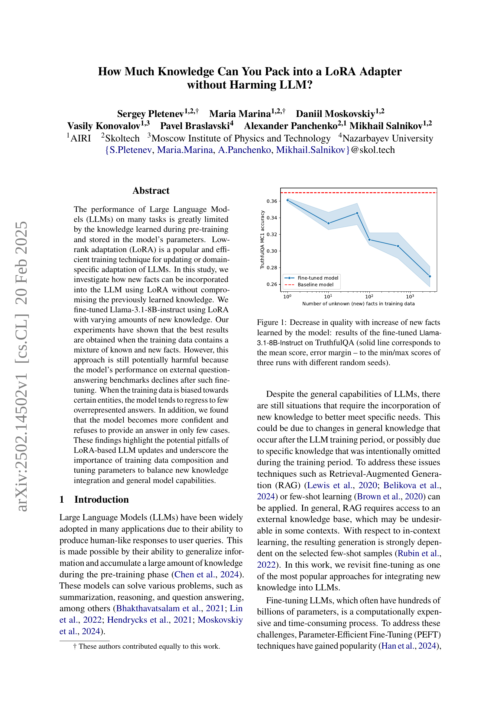
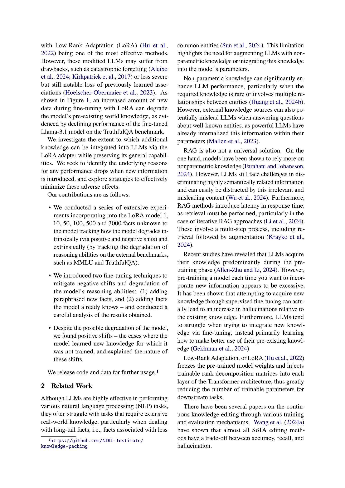
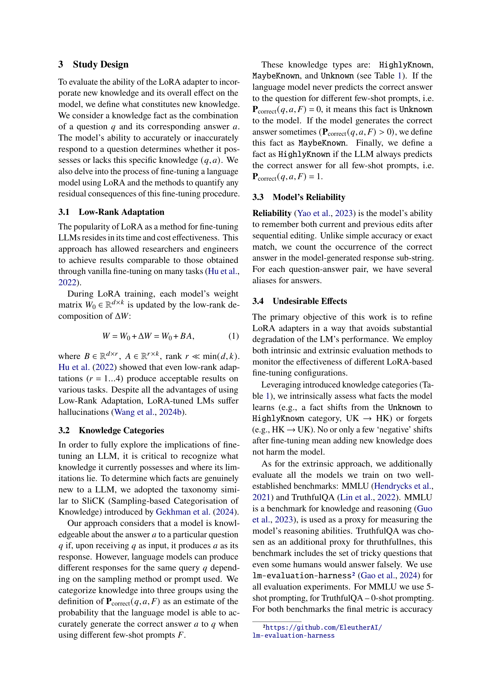
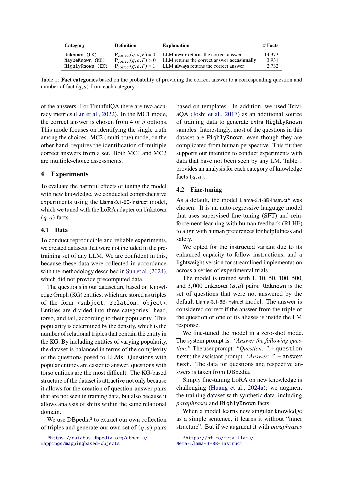
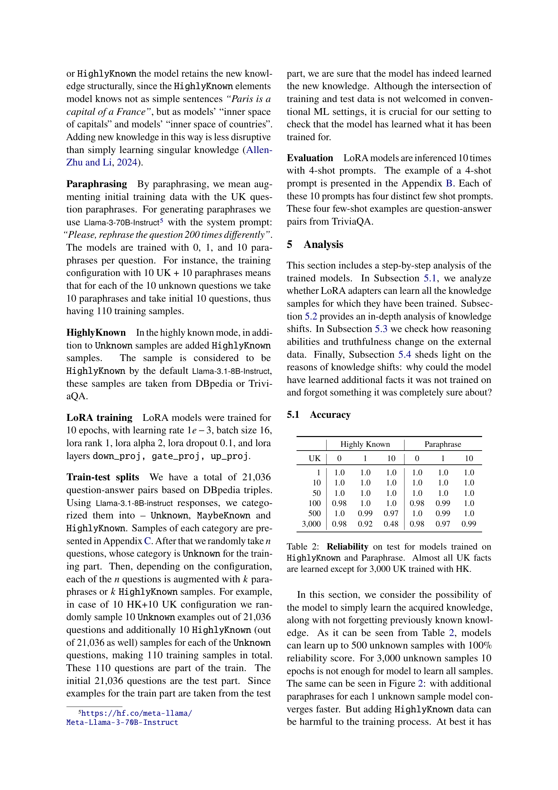
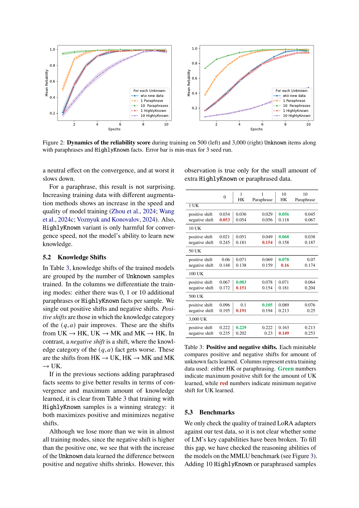
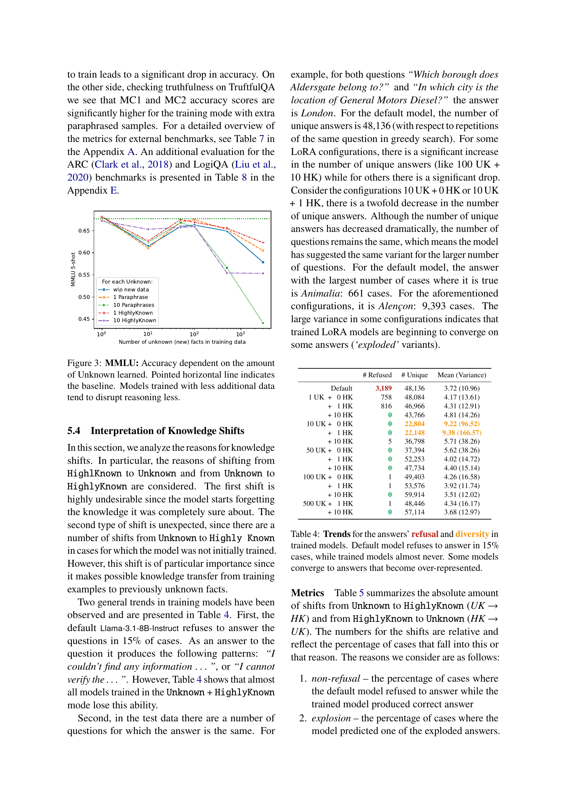
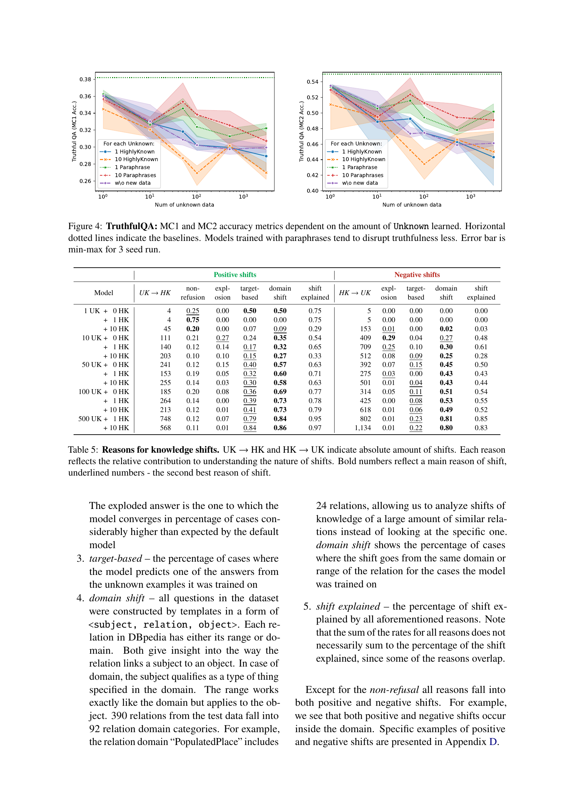
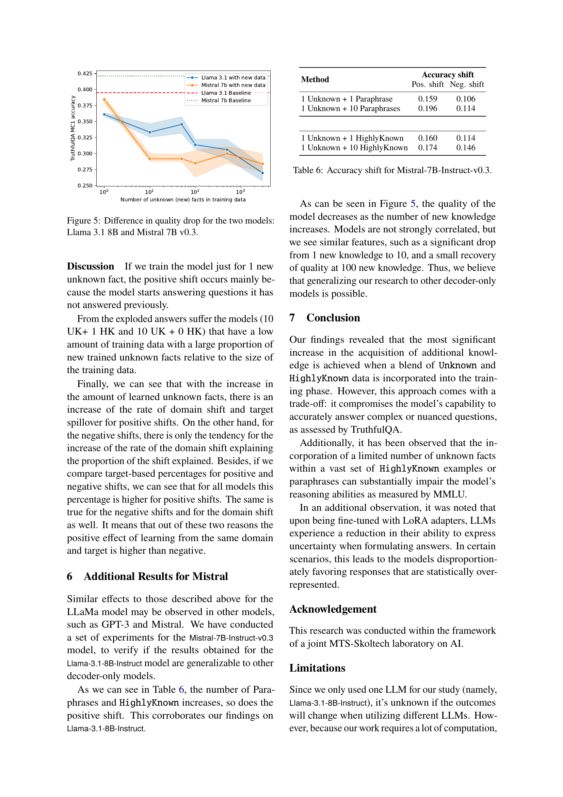
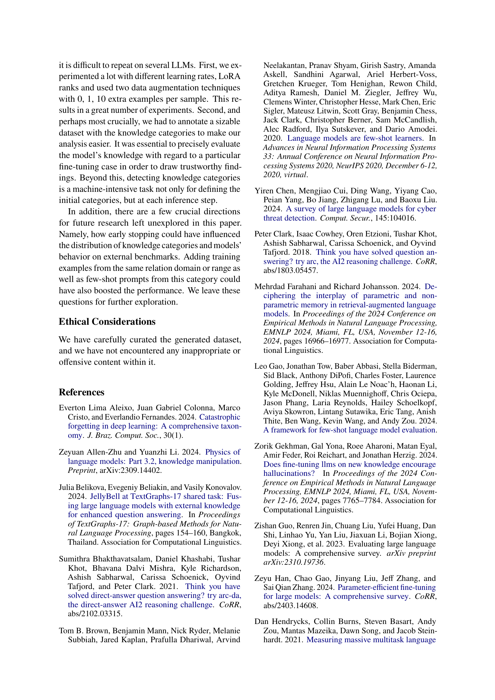
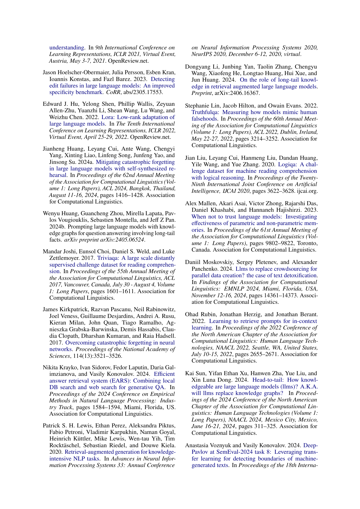
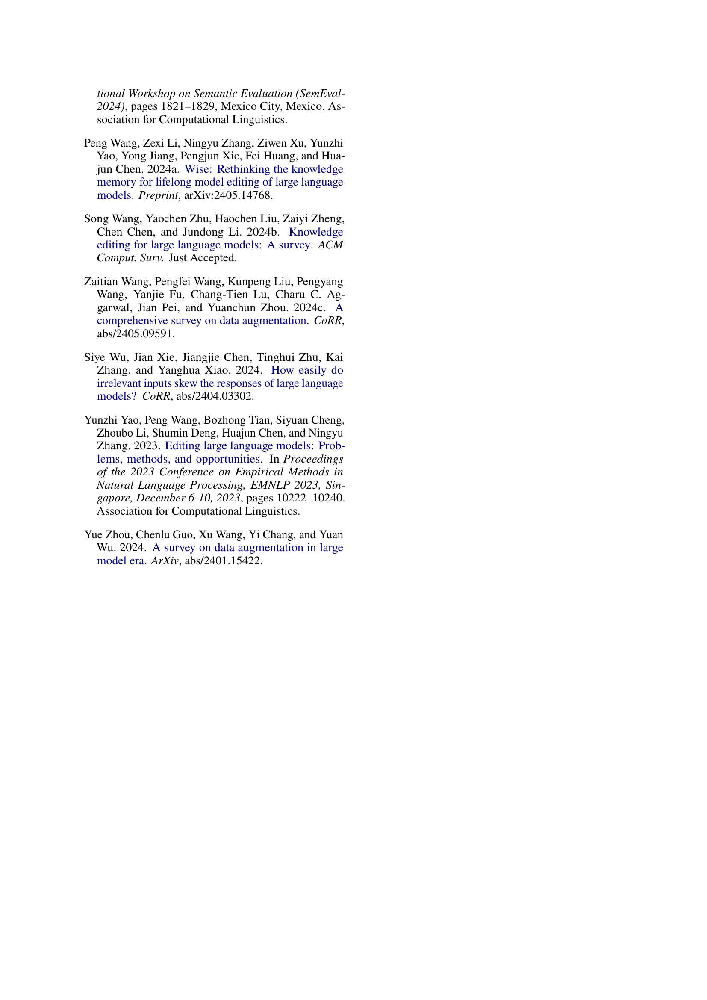
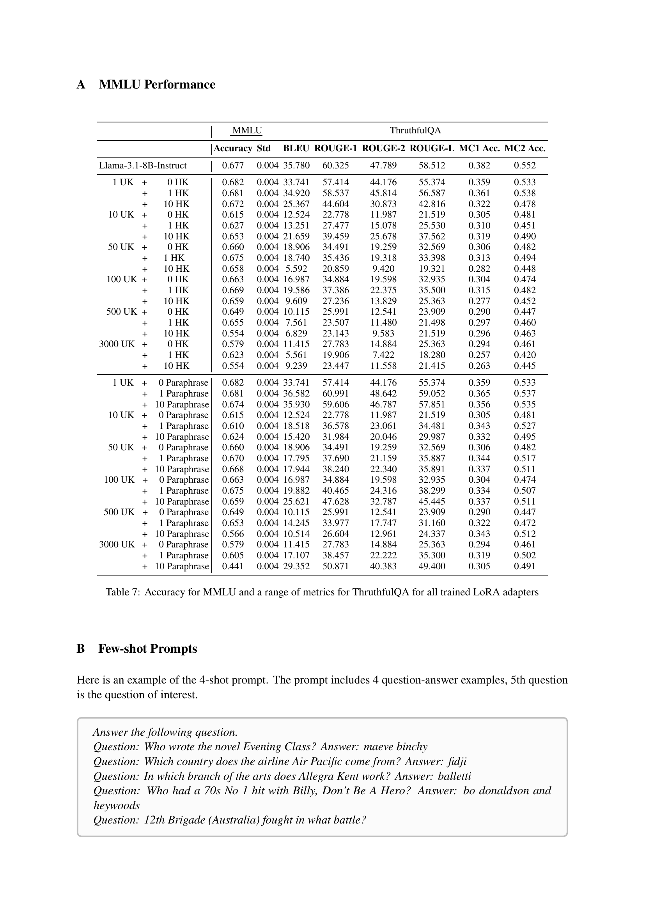
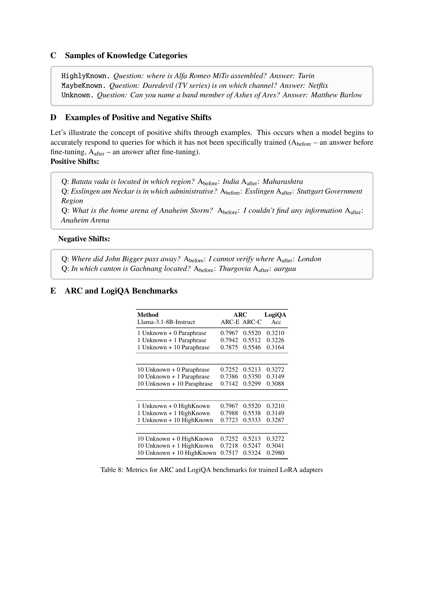
