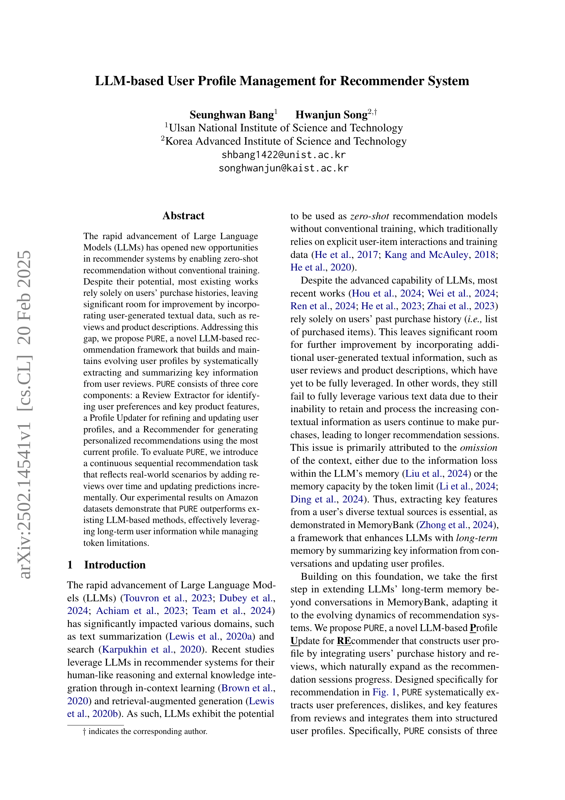
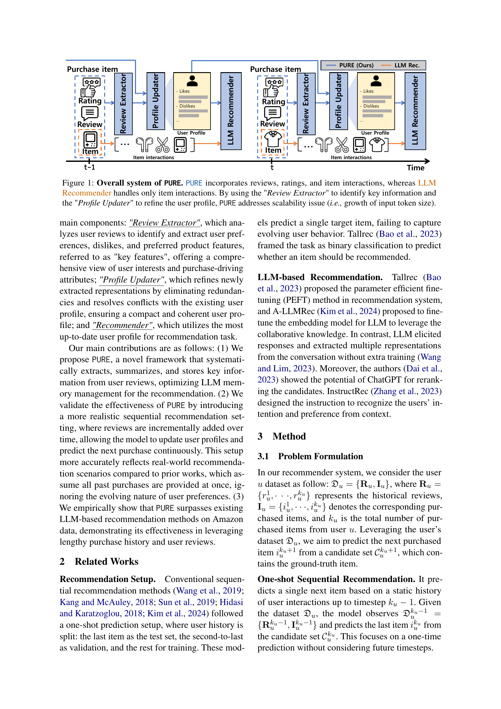
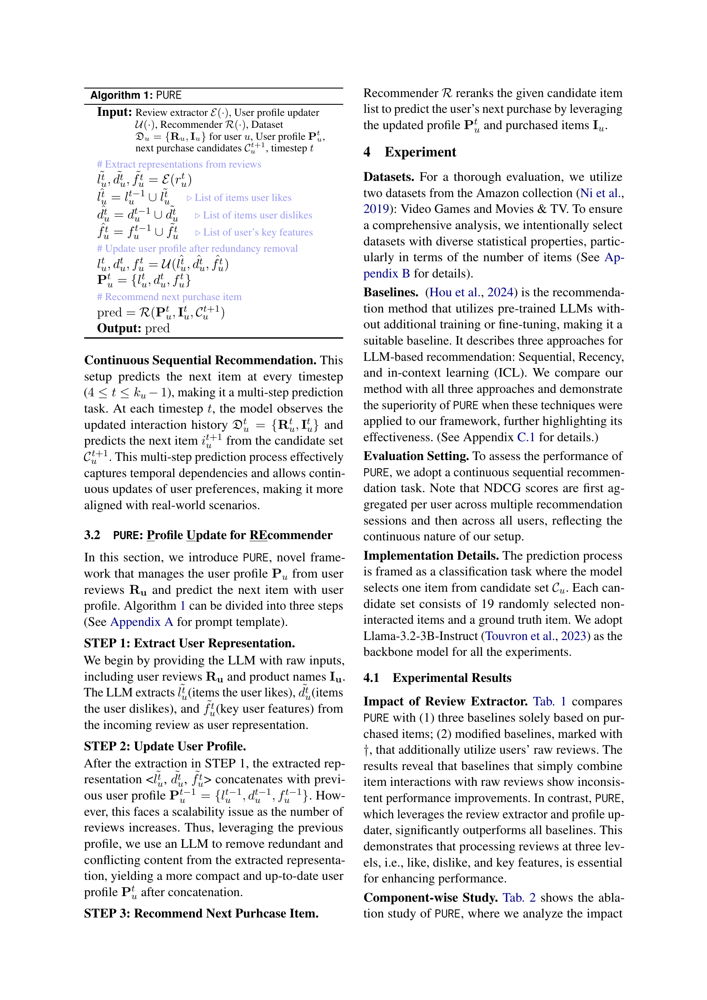
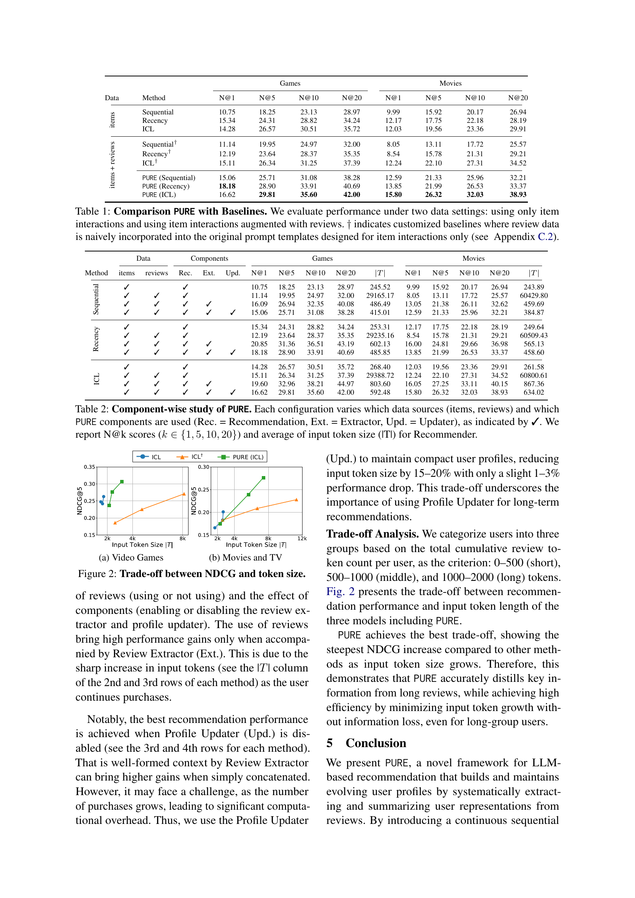
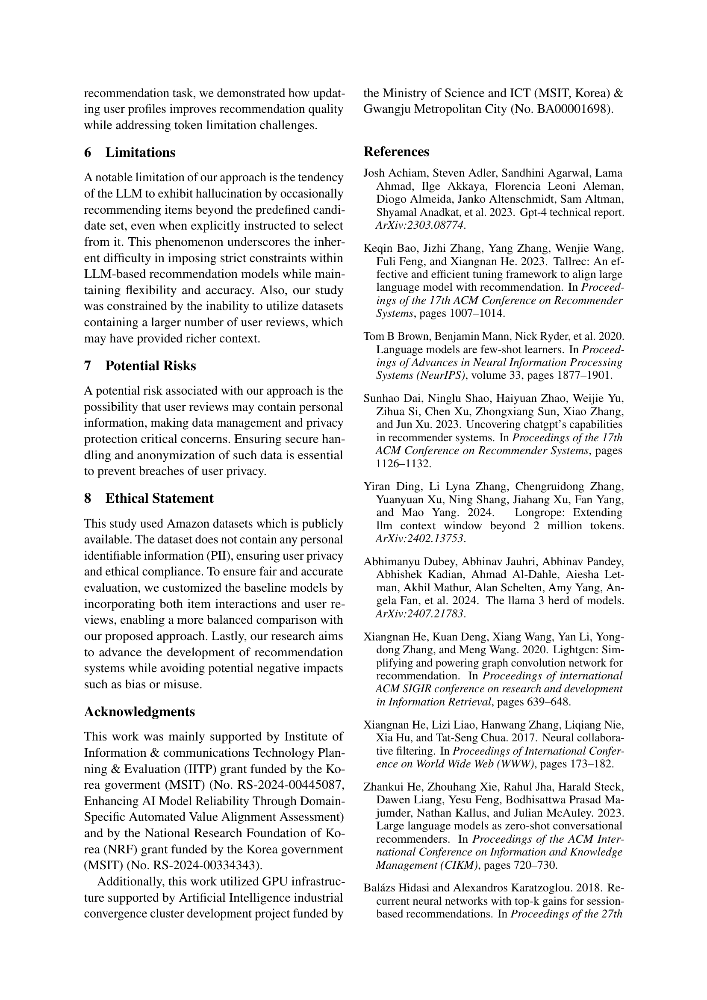
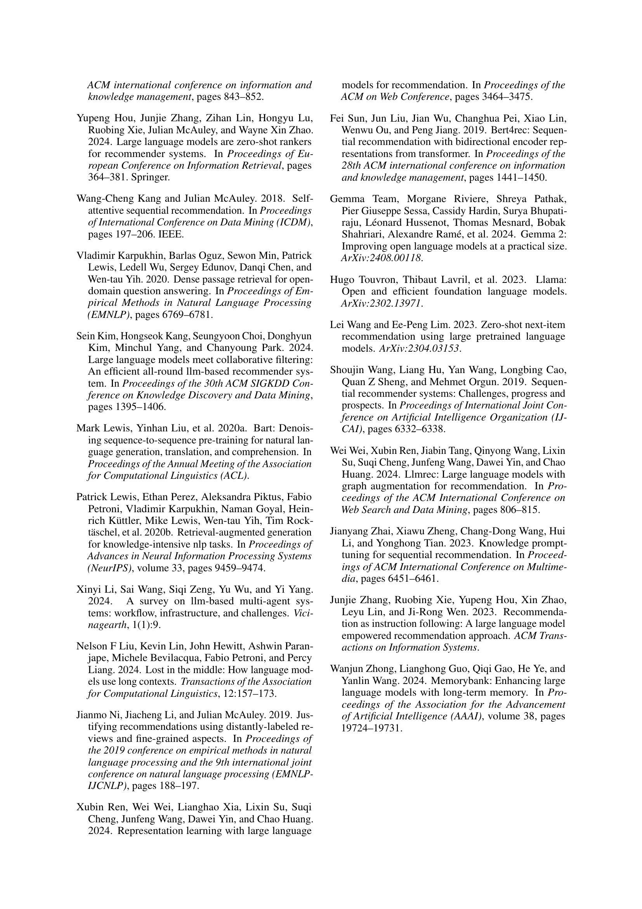
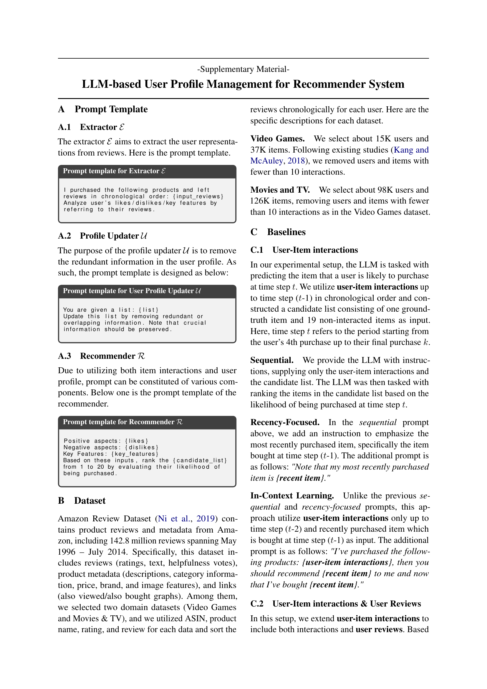
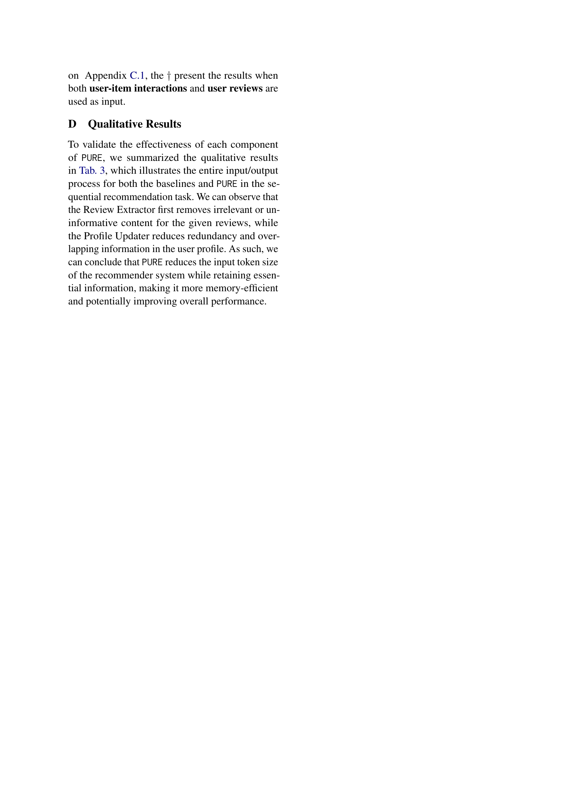
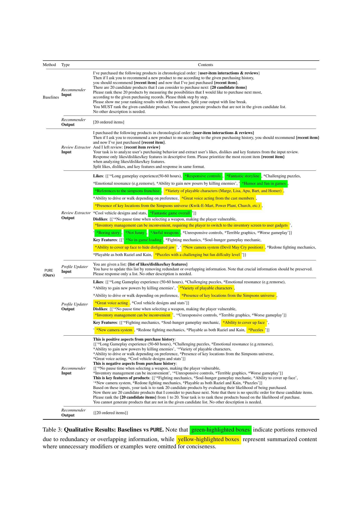

 


 2502.14541 
 Seunghwan Bang et el. 
 
 🤗 2025-02-21 
 



↗ arXiv


↗ Hugging Face


↗ Papers with Code


### TL;DR



많은 기존 연구들이 사용자의 과거 구매 이력에만 의존하여 추천 시스템을 구축하는데 반해, 본 연구는 **사용자들이 직접 작성한 리뷰와 상품 설명과 같은 텍스트 데이터를 활용**하여 추천 시스템의 정확도를 높이고자 합니다. 이는 사용자의 선호도를 더욱 정확하게 파악하고, 보다 개인화된 추천을 제공할 수 있도록 도와줍니다.  하지만, 기존의 LLM 기반 추천 시스템들은 텍스트 데이터의 양이 많아질수록 LLM의 메모리 제한 및 정보 손실 문제에 직면하여 실제 사용자의 장기간 정보를 충분히 활용하는 데 어려움을 겪습니다.

본 연구는 이러한 문제를 해결하기 위해 **PURE라는 새로운 LLM 기반 추천 프레임워크**를 제시합니다. PURE는 사용자 리뷰로부터 사용자의 선호도 및 중요 특징을 체계적으로 추출, 요약하여 사용자 프로필을 지속적으로 업데이트하는 시스템입니다. 이를 통해 LLM의 메모리 제약을 극복하고, 시간에 따라 변화하는 사용자의 선호도를 반영하여 보다 정확하고 효율적인 추천을 가능하게 합니다. Amazon 데이터셋을 사용한 실험 결과, PURE는 기존의 LLM 기반 방법들보다 뛰어난 성능을 보여주었으며, 특히 장기간의 사용자 데이터를 효과적으로 활용하는 데 큰 강점을 보였습니다.



#### Key Takeaways


 사용자 리뷰를 체계적으로 분석하여 사용자 프로필을 동적으로 관리하는 LLM 기반 추천 시스템 프레임워크 PURE 제안 



 기존의 정적 접근 방식을 넘어, 시간에 따라 변화하는 사용자 선호도를 반영하는 연속적인 추천 작업 설정을 통해 실제 환경을 더욱 잘 반영 



 Amazon 데이터셋 실험 결과, 기존 LLM 기반 방법보다 우수한 성능을 보이며, 장기간 사용자 정보 활용 및 토큰 제한 문제 해결에 효과적임을 입증 


#### Why does it matter?
본 논문은 **LLM 기반의 추천 시스템에 대한 새로운 프레임워크인 PURE를 제시**하여, 기존의 구매 이력만을 사용하는 방식에서 벗어나 사용자 리뷰를 활용함으로써 사용자 프로필을 동적으로 관리하고 더욱 정확한 추천을 가능하게 합니다. **장기간의 사용자 정보를 효과적으로 활용**하고 토큰 제한 문제를 해결하며, **실제 추천 시나리오를 더욱 반영**하는 연속적인 추천 작업을 통해 실질적인 성능 향상을 보여줍니다. 이는 추천 시스템 분야 연구자들에게 중요한 시사점을 제공하며, LLM 기반의 추천 시스템 발전에 기여할 것입니다. 

------
#### Visual Insights

> 🔼 그림 1은 제안하는 PURE 시스템의 전체 구조를 보여줍니다. 기존의 LLM 추천 시스템은 사용자의 아이템 상호작용 정보만을 사용하는 반면, PURE는 사용자 리뷰, 평점, 아이템 상호작용 정보를 모두 활용합니다.  PURE는 세 가지 핵심 구성 요소로 이루어져 있습니다.  먼저, 리뷰 추출기(Review Extractor)는 사용자 리뷰에서 핵심 정보(선호도, 비선호도, 주요 특징)를 추출합니다.  다음으로, 프로필 업데이터(Profile Updater)는 사용자 프로필을 개선하고, 중복 정보를 제거하여 효율성을 높입니다. 마지막으로, 추천기(Recommender)는 업데이트된 사용자 프로필을 사용하여 개인화된 추천을 생성합니다.  특히, 리뷰 추출기와 프로필 업데이터를 통해 입력 토큰의 크기 증가 문제(scalability issue)를 해결하여 LLM의 토큰 제한 문제를 효과적으로 완화합니다.
> 

> 
read the caption

> Figure 1: Overall system of PURE. PURE incorporates reviews, ratings, and item interactions, whereas LLM Recommender handles only item interactions. By using the 'Review Extractor' to identify key information and the 'Profile Updater' to refine the user profile, PURE addresses scalability issue (i.e., growth of input token size).
> 


| Data | Method | Games N@1 | Games N@5 | Games N@10 | Games N@20 | Movies N@1 | Movies N@5 | Movies N@10 | Movies N@20 |
|---|---|---|---|---|---|---|---|---|---| 
| items &#8634 | Sequential | 10.75 | 18.25 | 23.13 | 28.97 | 9.99 | 15.92 | 20.17 | 26.94 |
|  | Recency | 15.34 | 24.31 | 28.82 | 34.24 | 12.17 | 17.75 | 22.18 | 28.19 |
|  | ICL | 14.28 | 26.57 | 30.51 | 35.72 | 12.03 | 19.56 | 23.36 | 29.91 |
| items + reviews &#8634 | Sequential† | 11.14 | 19.95 | 24.97 | 32.00 | 8.05 | 13.11 | 17.72 | 25.57 |
|  | Recency† | 12.19 | 23.64 | 28.37 | 35.35 | 8.54 | 15.78 | 21.31 | 29.21 |
|  | ICL† | 15.11 | 26.34 | 31.25 | 37.39 | 12.24 | 22.10 | 27.31 | 34.52 |
|  | PURE (Sequential) | 15.06 | 25.71 | 31.08 | 38.28 | 12.59 | 21.33 | 25.96 | 32.21 |
|  | PURE (Recency) | **18.18** | 28.90 | 33.91 | 40.69 | 13.85 | 21.99 | 26.53 | 33.37 |
|  | PURE (ICL) | 16.62 | **29.81** | **35.60** | **42.00** | **15.80** | **26.32** | **32.03** | **38.93** |

> 🔼 표 1은 제안된 PURE 모델과 기존 기준 모델들의 성능 비교 결과를 보여줍니다.  두 가지 데이터 설정(아이템 상호작용만 사용, 아이템 상호작용과 리뷰 데이터 모두 사용) 하에 성능 평가를 진행했습니다.  † 표시는 기존 아이템 상호작용 기반 프롬프트에 리뷰 데이터를 단순히 추가한 기준 모델들을 나타냅니다 (자세한 내용은 C.2절 참조).  성능 비교를 통해 PURE 모델의 우수성을 보여줍니다.
> 

> 
read the caption

> Table 1: Comparison PURE with Baselines. We evaluate performance under two data settings: using only item interactions and using item interactions augmented with reviews. ††\dagger† indicates customized baselines where review data is naively incorporated into the original prompt templates designed for item interactions only (see  Sec. C.2).
> 

### In-depth insights

#### LLM Rec. Systems
LLM 기반 추천 시스템은 기존의 추천 시스템의 한계를 극복하고 사용자 경험을 향상시킬 수 있는 잠재력을 가지고 있습니다. **기존 시스템이 주로 사용자의 과거 구매 이력이나 명시적인 평점에 의존하는 것과 달리**, LLM 기반 시스템은 **사용자의 리뷰, 상품 설명과 같은 비정형 텍스트 데이터를 활용**하여 사용자의 선호도를 더욱 정교하게 파악할 수 있습니다.  **LLM의 자연어 처리 능력을 통해 사용자의 암묵적인 의도를 추론**하고, 다양한 정보원을 통합하여 보다 개인화된 추천을 제공할 수 있습니다.  하지만 **LLM의 계산 비용과 토큰 제한 등의 기술적인 과제**가 있으며, **개인정보 보호와 같은 윤리적인 문제**도 고려해야 합니다.  **데이터의 질과 양**도 LLM 기반 추천 시스템의 성능에 큰 영향을 미치므로, 고품질의 데이터 확보 및 관리 전략이 필수적입니다.

#### PURE Framework
본 논문에서 제시된 PURE 프레임워크는 **LLM 기반의 사용자 프로필 관리를 통해 추천 시스템의 성능을 향상**시키는 데 초점을 맞추고 있습니다. 기존의 추천 시스템이 주로 사용자의 구매 이력에만 의존하는 한계를 극복하기 위해, **사용자 리뷰를 체계적으로 분석하여 사용자의 선호도, 비선호도 및 주요 제품 특징을 추출**하는 데 중점을 두고 있습니다. 이를 위해 리뷰 추출기, 프로필 업데이터, 추천기의 세 가지 핵심 구성 요소를 활용하여 **지속적으로 발전하는 사용자 프로필**을 구축하고 유지합니다. 특히, **시간에 따른 리뷰 반영을 통해 실제 사용자 행동을 더욱 정확하게 반영**하고 있으며, **토큰 제한 문제를 효과적으로 관리**함으로써 LLM 기반 추천 시스템의 확장성을 높이고 있습니다.  **Amazon 데이터셋을 통한 실험 결과를 통해 기존 방법론 대비 우수한 성능**을 보여줌으로써 PURE 프레임워크의 실용성을 확인했습니다.

#### Sequential Rec.
순차적 추천(Sequential Rec.)은 사용자의 과거 행동 순서를 고려하여 다음 상호작용을 예측하는 추천 시스템의 한 유형입니다. **시간적 순서**가 중요한 역할을 하며, 최근 상호작용이 미래 예측에 더 큰 영향을 미칩니다. 기존의 순차적 추천 방식은 주로 사용자의 구매 기록에 의존하며, **단순히 최근 구매 항목만 고려**하는 경우도 많았습니다. 하지만 본 논문에서는 **LLM을 활용하여 사용자 리뷰 정보를 추가적으로 활용**함으로써, 사용자의 선호도를 더욱 정확하게 파악하고 장기적인 추천 성능을 개선하고자 합니다. 이는 단순히 최근 구매 내역만으로는 포착하기 어려운 사용자의 숨겨진 니즈나 선호도 변화를 감지할 수 있다는 점에서 **혁신적인 시도**라고 할 수 있습니다. 특히, **시간에 따른 리뷰 데이터의 누적**을 고려하여 사용자 프로파일을 지속적으로 업데이트하는 점은 실제 사용자 행동 패턴을 보다 잘 반영하는 효과적인 접근 방식으로 보입니다.

#### Review Extraction
본 논문에서 제시된 '리뷰 추출' 과정은 사용자 리뷰에서 핵심 정보를 체계적으로 추출하는 데 중점을 둡니다. **LLM 기반 접근 방식**을 통해 사용자의 선호도, 비선호도, 그리고 제품의 주요 특징을 효과적으로 파악합니다. 단순히 키워드 추출을 넘어, **맥락적 이해**를 바탕으로 리뷰 내용을 요약, 정제하여 **정확성과 효율성**을 높입니다. 이는 추후 사용자 프로필 생성 및 업데이트 단계의 정확성에 직접적으로 영향을 미치며, **개인 맞춤형 추천 시스템** 구축에 필수적인 요소입니다.  **토큰 제한 문제**를 고려하여 리뷰 정보의 효율적인 관리 및 요약이 중요하며, 이를 위해 본 논문은 **LLM의 장점과 한계**를 모두 고려한 설계를 제시합니다.  **데이터 전처리 및 특징 추출** 과정에 대한 자세한 설명이 부족하다는 점은 개선 과제로 남습니다.  추후 연구에서는 **다양한 리뷰 데이터**와 **LLM 모델**에 대한 실험적 검증을 통해 리뷰 추출 모듈의 성능 및 일반화 가능성을 더욱 강화할 필요가 있습니다.  **다양한 언어**에 대한 지원 및 **비정형 데이터 처리** 방안도 중요한 연구 과제입니다.

#### Token Limits
토큰 제한은 대규모 언어 모델(LLM) 기반 추천 시스템에서 중요한 제약 조건입니다. **LLM은 입력으로 제공되는 토큰의 수에 제한**이 있기 때문에, 사용자의 과거 구매 이력, 리뷰, 상품 설명 등 모든 텍스트 정보를 한꺼번에 처리하는 데 어려움이 있습니다. 이러한 제약은 추천 시스템의 성능에 직접적인 영향을 미칩니다. **토큰 수가 제한되면 장기간에 걸친 사용자의 행동 패턴을 충분히 반영하지 못하고 단기적인 정보에만 의존**하게 되어, 사용자의 변화하는 선호도를 정확하게 예측하지 못하는 문제가 발생합니다. 따라서, 효율적인 토큰 사용 전략과 장기간 사용자 정보를 효과적으로 요약하고 관리하는 기법이 필수적입니다. **본 논문에서 제시된 PURE 모델은 리뷰 텍스트에서 핵심 정보만 추출하여 사용자 프로필을 효율적으로 관리**함으로써 이러한 토큰 제한 문제를 해결하고자 합니다. 이를 통해 장기간 사용자 정보를 반영하여 더욱 정확하고 개인화된 추천을 제공할 수 있습니다.

### More visual insights

More on tables


| Method | Data items | Data reviews | Components Rec. | Components Ext. | Components Upd. | Games N@1 | Games N@5 | Games N@10 | Games N@20 | Games |T| | Movies N@1 | Movies N@5 | Movies N@10 | Movies N@20 | Movies |T| |
|---|---|---|---|---|---|---|---|---|---|---|---|---|---|---|---|---|
| Sequential  | ✓ |  | ✓ |  |  | 10.75 | 18.25 | 23.13 | 28.97 | 245.52 | 9.99 | 15.92 | 20.17 | 26.94 | 243.89 |
|  | ✓ | ✓ |  |  | 11.14 | 19.95 | 24.97 | 32.00 | 29165.17 | 8.05 | 13.11 | 17.72 | 25.57 | 60429.80 |
|  | ✓ | ✓ | ✓ |  | 16.09 | 26.94 | 32.35 | 40.08 | 486.49 | 13.05 | 21.38 | 26.11 | 32.62 | 459.69 |
|  | ✓ | ✓ | ✓ | ✓ | 15.06 | 25.71 | 31.08 | 38.28 | 415.01 | 12.59 | 21.33 | 25.96 | 32.21 | 384.87 |
| Recency  | ✓ |  | ✓ |  |  | 15.34 | 24.31 | 28.82 | 34.24 | 253.31 | 12.17 | 17.75 | 22.18 | 28.19 | 249.64 |
|  | ✓ | ✓ |  |  | 12.19 | 23.64 | 28.37 | 35.35 | 29235.16 | 8.54 | 15.78 | 21.31 | 29.21 | 60509.43 |
|  | ✓ | ✓ | ✓ |  | 20.85 | 31.36 | 36.51 | 43.19 | 602.13 | 16.00 | 24.81 | 29.66 | 36.98 | 565.13 |
|  | ✓ | ✓ | ✓ | ✓ | 18.18 | 28.90 | 33.91 | 40.69 | 485.85 | 13.85 | 21.99 | 26.53 | 33.37 | 458.60 |
| ICL  | ✓ |  | ✓ |  |  | 14.28 | 26.57 | 30.51 | 35.72 | 268.40 | 12.03 | 19.56 | 23.36 | 29.91 | 261.58 |
|  | ✓ | ✓ |  |  | 15.11 | 26.34 | 31.25 | 37.39 | 29388.72 | 12.24 | 22.10 | 27.31 | 34.52 | 60800.61 |
|  | ✓ | ✓ | ✓ |  | 19.60 | 32.96 | 38.21 | 44.97 | 803.60 | 16.05 | 27.25 | 33.11 | 40.15 | 867.36 |
|  | ✓ | ✓ | ✓ | ✓ | 16.62 | 29.81 | 35.60 | 42.00 | 592.48 | 15.80 | 26.32 | 32.03 | 38.93 | 634.02 |
> 🔼 표 2는 PURE의 각 구성 요소별 성능을 분석한 결과입니다.  각 설정은 사용된 데이터 소스(아이템, 리뷰)와 PURE 구성 요소(Rec. = 추천, Ext. = 추출기, Upd. = 업데이터)를 다르게 하여 비교 분석하였습니다.  ✓ 표시는 해당 구성 요소가 사용되었음을 나타냅니다.  추천 시스템의 성능 지표인 N@k (k∈{1,5,10,20}) 점수와 추천기에 사용된 평균 토큰 수(|T|)를 함께 제시하여, 데이터 사용과 모델 성능 간의 상관관계를 보여줍니다.
> 

> 
read the caption

> Table 2: Component-wise study of PURE. Each configuration varies which data sources (items, reviews) and which PURE components are used (Rec. = Recommendation, Ext. = Extractor, Upd. = Updater), as indicated by ✓. We report N@k scores (k∈{1,5,10,20}𝑘151020k\in\{1,5,10,20\}italic_k ∈ { 1 , 5 , 10 , 20 }) and average of input token size (|T|) for Recommender.
> 


| Method | Type | Contents |
|---|---|---|
| Baselines | Recommender Input | I’ve purchased the following products in chronological order: **user-item interactions & reviews**. Then if I ask you to recommend a new product to me according to the given purchasing history, you should recommend **recent item** and now that I’ve just purchased **recent item**. There are 20 candidate products that I can consider to purchase next: **20 candidate items**. Please rank these 20 products by measuring the possibilities that I would like to purchase next most, according to the given purchasing records. Please think step by step. Please show me your ranking results with order numbers. Split your output with line break. You MUST rank the given candidate product. You cannot generate products that are not in the given candidate list. No other description is needed. |
|  | Recommender Output | [20 ordered items] |
| PURE (Ours) | Review Extractor Input | I purchased the following products in chronological order: **user-item interactions & reviews**. Then if I ask you to recommend a new product to me according to the given purchasing history, you should recommend **recent item** and now I’ve just purchased **recent item**. And I left review: **recent item review**. Your task is to analyze user’s purchasing behavior and extract user’s likes, dislikes and key features from the input review. Response only likes/dislikes/key features in descriptive form. Please prioritize the most recent item **recent item** when analyzing likes/dislikes/key features. Split likes, dislikes, and key features and response in same format. |
|  | Review Extractor Output | **Likes**: [‘*Long gameplay experience(50-60 hours), *Responsive controls, *Fantastic storyline, *Challenging puzzles, Emotional resonance (e.g.remorse), *Ability to gain new posers by killing enemies’, ‘*Humor and fun in games, *References to the simpsons franchise, *Variety of playable characters (Marge, Lisa, Apu, Bart, and Homer), Ability to drive or walk depending on preference, *Great voice acting from the cast members, *Presence of key locations from the Simpsons universe (Kwik-E-Mart, Power Plant, Church, etc.), Cool vehicle designs and stats, *Fantastic game overall’] **Dislikes**: [‘*No pause time when selecting a weapon, making the player vulnerable, *Inventory management can be inconvenient, requiring the player to switch to the inventory screen to user gadgets’, ‘*Boring story, *Not funny, *Awful weapons, *Unresponsive controls, *Terrible graphics, *Worse gameplay’] **Key Features**: [‘*No in-game loading, *Fighting mechanics, *Soul-hunger gameplay mechanic, *Ability to cover up face to hide disfigured jaw’, ‘*New camera system (Devil May Cry position), *Redone fighting mechanics, Playable as both Raziel and Kain, *Puzzles with a challenging but fun diffculty level’] |
|  | Profile Updater Input | You are given a list: **list of likes/dislikes/key features**. You have to update this list by removing redundant or overlapping information. Note that crucial information should be preserved. Please response only a list. No other description is needed. |
|  | Profile Updater Output | **Likes**: [‘*Long Gameplay experience (50-60 hours), *Challenging puzzles, *Emotional resonance (e.g.remorse), Ability to gain new powers by killing enemies’, ‘*Variety of playable characters, Ability to drive or walk depending on preference, *Presence of key locations from the Simpsons universe, *Great voice acting, *Cool vehicle designs and stats’] **Dislikes**: [‘*No pause time when selecting a weapon, making the player vulnerable, *Inventory management can be inconvenient’, ‘*Unresponsive controls, *Terrible graphics, *Worse gameplay’] **Key Features**: [‘*Fighting mechanics, *Soul-hunger gameplay mechanic, *Ability to cover up face’, ‘*New camera system, *Redone fighting mechanics, *Playable as both Raziel and Kain, *Puzzles’] |
|  | Recommender Input | **This is positive aspects from purchase history**: [‘*Long Gameplay experience (50-60 hours), *Challenging puzzles, *Emotional resonance (e.g.remorse), Ability to gain new powers by killing enemies’, ‘*Variety of playable characters, Ability to drive or walk depending on preference, *Presence of key locations from the Simpsons universe, Great voice acting, *Cool vehicle designs and stats’] **This is negative aspects from purchase history**: [‘*No pause time when selecting a weapon, making the player vulnerable, Inventory management can be inconvenient’, ‘*Unresponsive controls, *Terrible graphics, *Worse gameplay’] **This is key features of products**: [‘*Fighting mechanics, *Soul-hunger gameplay mechanic, *Ability to cover up face’, ‘*New camera system, *Redone fighting mechanics, *Playable as both Raziel and Kain, *Puzzles’] Based on these inputs, your task is to rank 20 candidate products by evaluating their likelihood of being purchased. Now there are 20 candidate products that I consider to purchase next. Note that there is no specific order for these candidate items. Please rank the **20 candidate items** from 1 to 20. Your task is to rank these products based on the likelihood of purchase. You cannot generate products that are not in the given candidate list. No other description is needed. |
|  | Recommender Output | [20 ordered items] |
> 🔼 표 3은 기준 모델과 PURE의 정성적 결과를 비교 분석한 표입니다. 녹색으로 강조 표시된 부분은 중복되거나 겹치는 정보를 제거한 부분이며, 노란색으로 강조 표시된 부분은 불필요한 수식어나 예시를 생략하여 요약한 내용입니다.  이 표는 PURE의 각 구성 요소(Review Extractor, Profile Updater, Recommender)가 어떻게 작동하는지, 그리고 이를 통해 입력 토큰의 크기를 줄이면서도 성능 저하 없이 효율적인 추천 시스템을 구축하는지 보여줍니다.  각 구성요소의 입력과 출력 과정을 단계별로 보여주어 PURE의 작동 원리를 자세하게 설명합니다.
> 

> 
read the caption

> Table 3: Qualitative Results: Baselines vs PURE. Note that green-highlighted boxes indicate portions removed due to redundancy or overlapping information, while yellow-highlighted boxes represent summarized content where unnecessary modifiers or examples were omitted for conciseness.
> 

### Full paper



