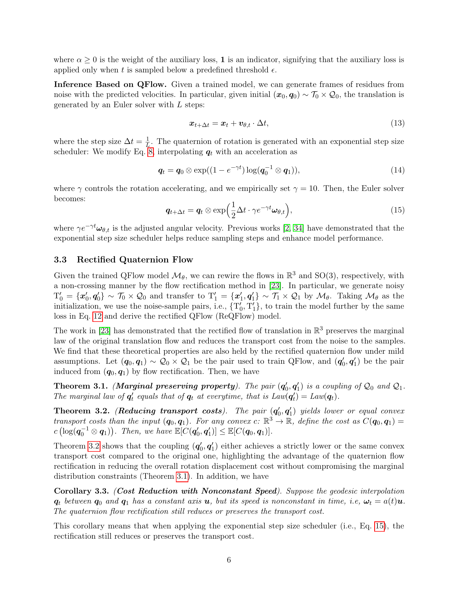
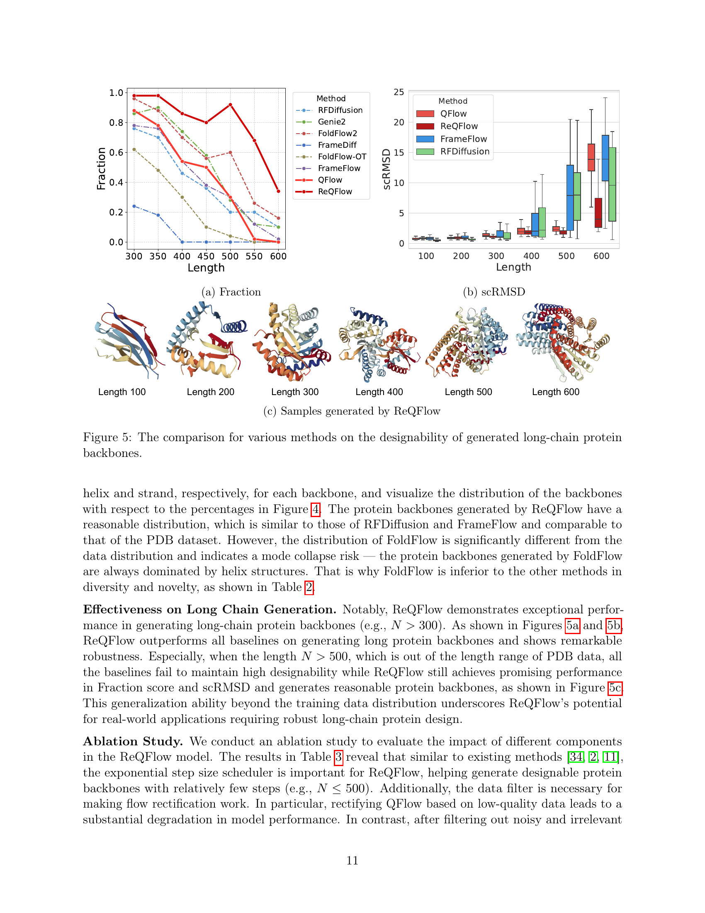

 


 2502.14637 
 Angxiao Yue et el. 
 
 🤗 2025-02-24 
 



↗ arXiv


↗ Hugging Face


↗ Papers with Code


### TL;DR



단백질 백본 생성은 신약 개발 및 생물학적 응용에 필수적이나, 기존의 확산 및 플로우 기반 모델은 계산 비효율성과 낮은 생성 품질로 어려움을 겪었습니다. 특히, 긴 아미노산 사슬을 가진 단백질의 경우 이러한 문제가 더욱 심각하게 나타납니다.

본 논문에서는 이러한 문제를 해결하기 위해 ReQFlow라는 새로운 방법을 제안합니다. ReQFlow는 **단위 쿼터니언**을 이용한 효율적인 회전 표현과 **지수 형태의 구면 선형 보간법(SLERP)**을 통해 수치적 안정성을 확보하고, **플로우 정정 기법**을 사용하여 추론 속도를 높이고 생성 품질을 향상시켰습니다. 실험 결과, ReQFlow는 기존 방법보다 훨씬 빠르고 효율적이며, 특히 긴 아미노산 사슬을 가진 단백질에서도 우수한 성능을 보였습니다.



#### Key Takeaways


 ReQFlow는 기존 방법보다 훨씬 빠르고 효율적으로 고품질의 단백질 백본을 생성합니다. 



 ReQFlow는 수치적 안정성이 보장되는 쿼터니언 플로우 매칭 방법을 사용하여, 장쇄 단백질 생성에서도 우수한 성능을 보입니다. 



 ReQFlow는 단백질 백본 생성 분야의 새로운 표준을 제시하며, 향후 단백질 설계 및 약물 발견 연구에 크게 기여할 것으로 예상됩니다. 


#### Why does it matter?
**본 논문은 단백질 백본 생성 분야의 효율성과 정확성을 크게 향상시키는 새로운 방법을 제시하여, 단백질 설계 및 약물 발견 연구에 중요한 영향을 미칠 것으로 예상됩니다.**  **특히, 기존 방법들의 계산 비효율성과 낮은 생성 품질 문제를 해결하는 데 기여하며, 향후 단백질 구조 예측 및 설계 분야의 발전에 크게 기여할 수 있는 잠재력을 가지고 있습니다.**  **더불어, 제시된 방법의 효율성과 일반성은 다양한 분야의 연구자들에게 영감을 줄 수 있으며, 새로운 연구 방향을 제시할 수 있습니다.**

------
#### Visual Insights

> 🔼 그림 1은 제안된 방법인 정정된 쿼터니언 플로우 매칭 방법을 보여줍니다. 각 아미노산 잔기는 국소 변환과 연관된 프레임으로 표현됩니다. 즉, 각 잔기는 3차원 공간에서의 위치(변환)와 방향(회전)을 나타내는 프레임으로 표현되고, 이 프레임들은 노이즈로부터 생성된 쿼터니언 플로우를 통해 연결됩니다. 이 플로우는 구면 선형 보간법(SLERP)을 이용하여 표현되며, 이 방법은 수치적 안정성을 보장하고 효율적인 추론을 가능하게 합니다. 또한, 학습된 쿼터니언 플로우 모델을 정정하여 생성된 단백질 백본의 설계 가능성을 향상시킵니다. 그림은 전체 과정을 시각적으로 보여주어, 노이즈로부터 시작하여 국소 변환, 쿼터니언 플로우, 최종 단백질 백본을 생성하는 단계를 명확히 설명합니다.
> 

> 
read the caption

> Figure 1: An illustration of our rectified quaternion flow matching method, in which each residue is represented as a frame associated with a local transformation.
> 


Method | Matrix Geodesic | SLERP (Add. Format) | SLERP (Exp. Format)
---|---|---
Interpolation | 𝑅₀expₘ(tlogₘ(𝑅₀ᵀ𝑅₁)) | sin((1−t)ϕ/2)/sin(ϕ/2)𝒒₀+sin(tϕ/2)/sin(ϕ/2)𝒒₁ | 𝒒₀⊗exp(tlog(𝒒₀⁻¹⊗𝒒₁))
Velocity | Ω=logₘ(𝑅₀ᵀ𝑅₁) | ηt=ϕ(cos(tϕ/2)𝒒₁−cos((1−t)ϕ/2)𝒒₀)/(2sin(ϕ/2)) | ω=2log(𝒒₀⁻¹⊗𝒒₁)
Euler Solver |  |  |  
Update | 𝑅ₜ₊Δt=𝑅ₜexpₘ(Δt⋅Ω) | 𝒒ₜ₊Δt=𝒒ₜ+Δt⋅ηt | 𝒒ₜ₊Δt=𝒒ₜ⊗exp(1/2Δt⋅ω)
No Renomalization | ✓ | ✗ | ✓
Numerical Stability | ϕ≥π−10⁻² | ✗ | ✓ | ✓
ϕ≤10⁻⁶ | ✓ | ✗ | ✓
Application Scenarios | FrameFlow [34], FoldFlow [2] | AssembleFlow [8] | QFlow (Ours), ReQFlow (Ours)

> 🔼 표 1은 다양한 회전 보간법(rotation interpolation methods)을 비교한 표입니다. 회전 보간법은 3차원 회전을 나타내는 방법으로, 이 표에서는 행렬 기반 방법(Matrix Geodesic), SLERP(Additive Format), SLERP(Exponential Format)의 세 가지 방법을 비교합니다. 각 방법의 수식, 속도, 수치적 안정성, 적용 사례 등을 보여주어 서로 다른 회전 보간법의 특징을 명확하게 파악할 수 있도록 합니다. ReQFlow 논문의 3장(Proposed Method)에서 제시된 Quaternion Flow Matching 방법을 이해하는데 필수적인 내용을 담고 있습니다. 특히, ReQFlow에서 사용된 SLERP(Exponential Format) 방법의 장점을 부각하고, 기존 방법들과의 차이점을 명확히 설명합니다.
> 

> 
read the caption

> Table 1: Comparisons for various rotation interpolation methods.
> 

### In-depth insights

#### Quaternion Flows
본 논문에서 제시된 쿼터니언 플로우(Quaternion Flows)는 단백질 백본 생성에 있어 **효율성과 정확성을 모두 만족시키는 혁신적인 방법**입니다. 기존의 확률적 방법들과 달리, 쿼터니언 플로우는 3D 회전을 단위 쿼터니언으로 표현하여 수치적 안정성을 보장하며, SLERP(Spherical Linear Interpolation)를 통해 매끄러운 보간을 수행합니다.  **지수 형태의 SLERP**는 특히 회전 각도가 0 또는 π에 가까울 때 계산 효율성을 크게 향상시킵니다.  더 나아가, 플로우 정정(Rectification) 기법을 통해 생성 과정의 수치적 안정성을 더욱 강화하고 불필요한 샘플링 단계를 줄여 효율성을 높입니다. 이러한 쿼터니언 플로우 기반 모델은 **기존의 확산 및 플로우 기반 모델보다 훨씬 빠른 속도**로 고품질의 단백질 백본을 생성하며, 특히 긴 아미노산 사슬을 가진 단백질에 대해서도 우수한 성능을 보입니다. **결론적으로, 제안된 쿼터니언 플로우는 단백질 디자인 분야에 중요한 발전**을 가져올 수 있는 잠재력을 지닌 기술입니다. 

#### ReQFlow Model
ReQFlow 모델은 단백질 골격 생성을 위한 효율적이고 고품질의 새로운 방법을 제시합니다. 기존 확산 및 흐름 기반 모델의 단점을 극복하기 위해 **구면 선형 보간법(SLERP)**을 지수 형식으로 사용하여 3D 회전을 단위 사원수로 표현하고, 이를 통해 수치적 안정성을 보장하는 동시에 추론 속도를 높였습니다. 특히, **수정된 흐름 기법**을 통해 생성 과정에서 샘플링 단계를 줄이고, 생성된 단백질 골격의 설계 가능성을 향상시켰습니다. 실험 결과는 ReQFlow가 기존 방법보다 훨씬 빠르고(예: RFDiffusion보다 37배, Genie2보다 62배 빠름), 고품질의 단백질 골격을 생성한다는 것을 보여줍니다. **긴 아미노산 사슬을 가진 단백질**에서도 효과적이고 효율적이라는 점 또한 중요한 강점입니다.  **모델의 안정성과 효율성**을 높인 점과 **긴 아미노산 사슬 단백질에 대한 우수한 성능**은 ReQFlow 모델의 핵심적인 가치를 보여줍니다.

#### Design & Efficiency
본 논문은 단백질 백본 생성을 위한 새로운 방법인 ReQFlow를 제시하며, **계산 효율성과 생성 품질을 동시에 개선**하는 데 중점을 둡니다.  ReQFlow는 쿼터니언 흐름을 사용하여 단백질 구조를 효율적으로 표현하고, **수치적 안정성을 보장**하는 새로운 훈련 방법을 제시합니다.  기존의 확산 모델이나 흐름 기반 모델들과 비교하여 ReQFlow는 **훨씬 적은 샘플링 단계**와 **짧은 추론 시간**으로 고품질의 단백질 백본을 생성합니다.  특히, 긴 사슬 단백질 생성에서 기존 방법의 성능 저하 문제를 해결하고, **최첨단의 성능**을 달성합니다.  이러한 설계 및 효율성 개선은 단백질 설계 및 관련 생물 의학 응용 분야에 **중요한 기여**를 할 것으로 기대됩니다.

#### Ablation Study
본 논문의 "Ablation Study" 부분은 **ReQFlow 모델의 성능에 기여하는 각 구성 요소의 중요성을 객관적으로 평가**하기 위해 수행되었습니다.  특히, 지수적 스케줄러, 흐름 수정, 데이터 필터링 등의 요소들을 제거하거나 변경하면서 모델 성능의 변화를 정량적으로 분석했습니다. 이를 통해 각 요소가 ReQFlow 모델의 최종 성능에 미치는 영향을 명확히 파악하고, **모델의 효율성과 안정성을 개선**하는 데 중요한 통찰력을 제공합니다.  **지수적 스케줄러는 적은 샘플링 단계로도 우수한 성능을 유지**하는 데 중요한 역할을 하며, **흐름 수정은 모델의 안정성과 효율성을 향상**시키는 것으로 나타났습니다.  또한, **데이터 필터링은 저품질 데이터로 인한 모델 성능 저하를 방지**하는 중요한 과정임을 확인했습니다.  결과적으로, 이러한 ablation study는 ReQFlow 모델의 설계 원칙을 검증하고, 향후 모델 개선 및 발전 방향을 제시하는 데 유용한 정보를 제공합니다.  **각 요소의 상호 작용 및 영향**에 대한 심층적인 분석을 통해 ReQFlow 모델의 강점과 약점을 명확히 파악하고, 더욱 개선된 모델 개발에 기여할 수 있을 것으로 기대됩니다.

#### Future Work
본 논문의 "미래 연구" 부분은 **장쇄 단백질 백본 생성에 대한 모델 개선**을 중점적으로 다룹니다.  이는 더욱 방대한 훈련 데이터셋 구축, 모델 아키텍처 개선, 그리고 대규모 사전 훈련 모델 활용 등의 방안을 포함합니다.  **조건부 단백질 백본 생성**을 통한 제어 가능한 단백질 디자인 및 **측쇄 생성 및 완전한 원자 단위 단백질 생성**으로의 확장 또한 중요한 미래 연구 과제로 제시됩니다.  **이러한 연구는 단백질 설계 및 응용 분야에 큰 영향**을 미칠 것으로 예상되며, 특히 제어 가능한 단백질 생성은 신약 개발 등 다양한 분야에 파급 효과를 가져올 수 있을 것입니다.  **결론적으로 본 논문의 미래 연구 계획은 현재 연구의 확장 및 심화를 통해 단백질 디자인 및 생성 분야의 발전에 크게 기여할 것으로 전망**됩니다.

### More visual insights

More on figures

> 🔼 그림 2는 다양한 단백질 백본 생성 방법들의 비교 결과를 보여줍니다. 각 모델의 원 크기는 모델 크기를 나타내고, 원 중심의 위치는 단백질 백본 길이가 300일 때 평균 추론 시간(로그 스케일)과 설계 가능한 단백질 백본의 비율(Fraction score)을 나타냅니다. QFlow와 ReQFlow의 경우, 샘플링 단계 L은 각각 {20, 50, 500}으로 설정되었습니다.
> 

> 
read the caption

> Figure 2: Comparisons for each method. For each model, the size of its circle indicates the model size, and the location of the circle’s centroid indicates the logarithm of the average inference time when generating a protein backbone with length N=300𝑁300N=300italic_N = 300 and the Fraction score of designable protein backbones. For QFlow and ReQFlow, we set the sampling step L∈{20,50,500}𝐿2050500L\in\{20,50,500\}italic_L ∈ { 20 , 50 , 500 }, respectively.
> 

> 🔼 그림 3(a)는 다양한 회전 보간 방법을 비교 분석한 결과를 보여줍니다. 특히, 큰 각도의 회전(π-ε 근처)에 대한 평균 왕복 오차를 보여주는 그래프입니다. 쿼터니언 기반 방법은 수치적 안정성이 뛰어나고, 행렬 기반 방법에 비해 오차가 훨씬 적음을 보여줍니다. 이는 긴 단백질 백본 생성 시 수치적 안정성이 중요함을 강조합니다.
> 

> 
read the caption

> (a)
> 

> 🔼 그림 (b)는 두 데이터셋(PDB 및 SCOPe)에서 훈련할 때 각 모델이 큰 회전 각도(π-ε)를 겪는 빈도를 보여줍니다.  π에 가까운 큰 회전 각도는 수치적 불안정성을 야기할 수 있으므로, 이 그래프는 각 모델의 회전 표현 및 보간 방법의 수치적 안정성을 평가하는 데 중요한 지표가 됩니다.  PDB 데이터셋은 SCOPe 데이터셋보다 더 큰 회전 각도의 빈도가 높은 경향이 있는데, 이는 PDB 데이터셋의 구조적 다양성이 더 크기 때문일 수 있습니다. 이는 ReQFlow 모델이 제안하는 사원수 기반 회전 표현 및 지수 형식의 SLERP 보간 방법의 장점을 보여주는 근거가 됩니다.
> 

> 
read the caption

> (b)
> 

> 🔼 그림 (c)는 ReQFlow 모델을 사용하여 생성된 길이 100, 200, 300, 400, 500, 600의 단백질 골격 구조를 보여줍니다. 각 구조는 ReQFlow 모델의 효율성과 생성 품질을 시각적으로 보여주며, 다양한 길이의 단백질 골격을 생성할 수 있는 ReQFlow의 능력을 강조합니다. 특히, 긴 길이의 단백질 골격 (500, 600)에서도 ReQFlow가 높은 품질의 구조를 생성하는 것을 확인할 수 있습니다.
> 

> 
read the caption

> (c)
> 

> 🔼 그림 3은 회전 보간법의 수치적 안정성을 보여줍니다. (a)는 축-각 표현에서 쿼터니언으로 변환하고 다시 축-각 표현으로 변환하는 과정에서의 평균 왕복 오차를 나타냅니다. 회전 각도가 π에 가까워질수록 행렬 기반 방법의 오차가 커지는 반면, 쿼터니언 기반 방법은 안정적임을 보여줍니다. (b)는 두 데이터셋(PDB와 SCOPe)에서 학습할 때 단백질당 큰 회전 각도의 발생 빈도를 보여줍니다. (c)는 각 길이에 대해 10개의 백본을 생성할 때 단백질당 작은 회전 각도의 평균 개수를 보여줍니다. 이 그림은 쿼터니언 기반 방법의 수치적 안정성과 효율성을 강조합니다.
> 

> 
read the caption

> Figure 3: (a) Mean round-trip errors from π−10−1𝜋superscript101\pi-10^{-1}italic_π - 10 start_POSTSUPERSCRIPT - 1 end_POSTSUPERSCRIPT to π−10−7𝜋superscript107\pi-10^{-7}italic_π - 10 start_POSTSUPERSCRIPT - 7 end_POSTSUPERSCRIPT. (b) The frequency of suffering large rotation angles per protein when training on the two datasets. (c) The average number of small rotation angles per protein when generating ten backbones for each length.
> 

> 🔼 그림 4는 생성된 단백질 백본의 이차 구조 비율에 따른 분포를 보여줍니다.  각 백본의 헬릭스 및 스트랜드 비율을 나타내는 히스토그램을 통해, ReQFlow를 포함한 다양한 모델에서 생성된 단백질 백본의 이차 구조 분포를 PDB 데이터셋의 분포와 비교 분석합니다. 이를 통해 각 모델이 생성하는 단백질 백본의 구조적 특징과 PDB 데이터셋과의 유사성 및 차이점을 파악할 수 있습니다. 특히, ReQFlow가 다른 방법들에 비해 PDB 데이터셋과 유사한 분포를 보여주는지 확인할 수 있습니다.
> 

> 
read the caption

> Figure 4: The distribution of protein backbones with respect to the percentages of their secondary structure.
> 

> 🔼 그림 5는 다양한 방법으로 생성된 긴 사슬 단백질 골격의 설계 가능성을 비교한 것입니다. (a)는 다양한 모델의 분획 점수를 보여주는 선 그래프입니다. (b)는 다양한 모델의 scRMSD를 보여주는 막대 그래프입니다. (c)는 ReQFlow가 생성한 다양한 길이의 단백질 골격의 예시입니다. 그림을 통해 ReQFlow가 긴 사슬 단백질 골격 생성에 있어 기존 방법들보다 뛰어난 성능을 보이며 안정성을 유지한다는 것을 알 수 있습니다.
> 

> 
read the caption

> (a) Fraction
> 

> 🔼 그림 5(b)는 생성된 장쇄 단백질 골격의 설계 가능성을 다양한 방법으로 비교한 결과를 보여줍니다.  x축은 단백질의 길이(아미노산 잔기 수)를, y축은 scRMSD(자체 일관성 RMSD) 값을 나타냅니다. scRMSD는 생성된 단백질 골격과 ESMFold에 의해 예측된 단백질 골격 사이의 RMSD를 나타내는 지표로, 값이 낮을수록 생성된 골격이 실제 단백질 구조와 더 유사하다는 것을 의미합니다. 이 그림은 다양한 길이의 단백질 골격을 생성할 때 각 모델의 scRMSD 값 분포를 보여주어 모델의 설계 가능성을 평가하는 데 사용됩니다. ReQFlow는 다른 방법보다 전반적으로 더 낮은 scRMSD 값을 보여주어 생성된 단백질 골격의 설계 가능성이 더 높음을 시사합니다.
> 

> 
read the caption

> (b) scRMSD
> 

> 🔼 그림 5(c)는 ReQFlow 모델을 사용하여 생성된 단백질 백본 샘플들을 보여줍니다. 각 이미지는 서로 다른 길이(100, 200, 300, 400, 500, 600)의 단백질 백본 구조를 나타냅니다.  이 그림은 ReQFlow 모델이 다양한 길이의 단백질 백본을 생성할 수 있는 능력을 시각적으로 보여주며, 생성된 구조들의 다양성과 품질을 평가하는 데 도움이 됩니다.  각 이미지 아래에 표시된 RMSD 값은 생성된 구조와 실제 단백질 구조 사이의 차이를 정량적으로 나타내는 지표입니다. RMSD 값이 낮을수록 생성된 구조가 실제 구조와 유사하다는 것을 의미합니다.
> 

> 
read the caption

> (c) Samples generated by ReQFlow
> 

> 🔼 그림 5는 다양한 방법으로 생성된 긴 사슬 단백질 골격의 설계 가능성을 비교한 그래프입니다. (a)는 다양한 방법의 단백질 길이에 따른 Fraction 값을 보여주는 그래프입니다. Fraction은 scRMSD가 2Å 미만인 생성된 골격의 비율을 나타냅니다.  (b)는 단백질 길이에 따른 scRMSD 값을 보여주는 그래프입니다. scRMSD는 생성된 골격과 ESMFold [21]에 의해 예측된 골격 사이의 RMSD를 나타냅니다. (c)는 ReQFlow에 의해 생성된 다양한 길이의 단백질 골격 구조의 예시를 보여줍니다. 이 그림을 통해 ReQFlow가 긴 사슬 단백질 골격 생성에서도 높은 설계 가능성을 유지함을 알 수 있습니다.
> 

> 
read the caption

> Figure 5: The comparison for various methods on the designability of generated long-chain protein backbones.
> 

> 🔼 그림 6은 다양한 방법의 설계 가능성을 샘플링 단계 감소와 함께 비교한 그래프입니다.  Table 5에 제시된 원본 데이터를 기반으로, 각 방법이 샘플링 단계를 줄여감에 따라 설계 가능성(designability)이 어떻게 변화하는지를 보여줍니다.  즉, 모델이 단백질 백본을 생성하는데 필요한 샘플링 횟수를 줄이면서도 높은 품질을 유지하는 능력을 비교 분석한 것입니다.  그림은 각 방법의 설계 가능성을 수치적으로 제시하여, 효율성과 성능을 평가하는 데 중요한 시각적 정보를 제공합니다.
> 

> 
read the caption

> Figure 6: A comparison for various methods on their designability with the reduction of sampling steps. Original data is in Table 5.
> 

> 🔼 그림 7은 본 논문에서 사용된 단백질 백본 생성 모델 학습을 위한 PDB 및 SCOPe 데이터셋의 길이 분포를 보여줍니다. 두 데이터셋 모두 60개 이상의 잔기(아미노산)를 가진 단백질 구조를 포함하고 있으며, PDB 데이터셋은 500개 이상의 잔기를 가진 단백질 구조까지 다양하게 분포되어 있는 반면, SCOPe 데이터셋은 130개 이하의 잔기를 가진 단백질 구조에 집중되어 있음을 보여줍니다. 이는 두 데이터셋의 특징과 차이점을 명확하게 나타내어, 각 데이터셋을 사용한 모델 학습의 결과에 어떤 영향을 미칠 수 있는지에 대한 이해를 돕습니다.  각 데이터셋의 길이 분포는 모델의 성능과 일반화 능력에 영향을 줄 수 있는 중요한 요소이며, 이 그림은 이러한 요소를 시각적으로 보여줍니다.
> 

> 
read the caption

> Figure 7: The length distribution of PDB and SCOPe dataset we use for training.
> 

More on tables


Method | Efficiency |  | Designability |  | Diversity | Novelty
---|---|---|---|---|---|---
| Step | Time(s) | Fraction ↑ | scRMSD ↓ | TM ↓ | TM ↓ | 
RFDiffusion | 50 | 66.23 | 0.904 | 1.102 ± 1.617 | 0.382 | 0.822
Genie2 | 1000 | 112.93 | 0.908 | 1.132 ± 1.389 | 0.370 | 0.759
 | 500 | 55.86 | 0.000 | 18.169 ± 5.963 | - | 0.115
FrameDiff | 500 | 48.12 | 0.564 | 2.936 ± 3.093 | 0.441 | 0.799
FoldFlowBase | 500 | 43.52 | 0.624 | 3.080 ± 3.449 | 0.469 | 0.870
FoldFlowSFM | 500 | 43.63 | 0.636 | 3.031 ± 3.589 | 0.411 | 0.848
FoldFlowOT | 500 | 43.35 | 0.852 | 1.760 ± 2.593 | 0.434 | 0.857
FoldFlow2 | 50 | 6.35 | 0.952 | 1.083 ± 1.308 | 0.373 | 0.813
 | 20 | 2.63 | 0.644 | 3.060 ± 3.210 | 0.339 | 0.736
FrameFlow | 500 | 20.72 | 0.872 | 1.380 ± 1.392 | 0.346 | 0.803
 | 200 | 8.69 | 0.864 | 1.542 ± 1.889 | 0.348 | 0.809
 | 100 | 4.20 | 0.708 | 2.167 ± 2.373 | 0.332 | 0.806
 | 50 | 2.23 | 0.704 | 2.639 ± 3.079 | 0.334 | 0.791
 | 20 | 0.84 | 0.436 | 4.652 ± 4.390 | 0.319 | 0.772
 | 10 | 0.47 | 0.180 | 7.343 ± 5.125 | 0.317 | 0.762
QFlow | 500 | 17.52 | 0.936 | 1.163 ± 0.938 | 0.356 | 0.821
 | 200 | 6.85 | 0.864 | 1.400 ± 1.259 | 0.344 | 0.807
 | 100 | 3.45 | 0.916 | 1.342 ± 1.364 | 0.348 | 0.809
 | 50 | 1.87 | 0.812 | 1.785 ± 2.151 | 0.344 | 0.784
 | 20 | 0.81 | 0.604 | 3.090 ± 3.374 | 0.325 | 0.758
 | 10 | 0.45 | 0.332 | 5.032 ± 4.303 | 0.313 | 0.715
ReQFlow | 500 | 17.29 | 0.972 | 1.071 ± 0.482 | 0.377 | 0.828
 | 200 | 7.44 | 0.932 | 1.160 ± 0.782 | 0.384 | 0.826
 | 100 | 3.62 | 0.928 | 1.245 ± 1.059 | 0.369 | 0.819
 | 50 | 1.81 | 0.912 | 1.254 ± 0.915 | 0.369 | 0.810
 | 20 | 0.80 | 0.872 | 1.418 ± 0.998 | 0.355 | 0.791
 | 10 | 0.45 | 0.676 | 2.443 ± 2.382 | 0.337 | 0.760
> 🔼 표 2는 PDB 데이터셋을 사용한 다양한 단백질 백본 생성 모델들의 성능 비교 결과를 보여줍니다. 각 지표(설계 가능성, 다양성, 참신성)에서 최고 성능을 보인 결과는 굵은 글씨체로 표시하고, 상위 3개의 결과는 파란색 배경으로 강조 표시했습니다. 설계 가능성(Fraction)이 0.8을 초과하는 행들 중에서 다양성과 참신성 지표에서 최고 및 상위 3개의 결과 또한 같은 방식으로 강조 표시했습니다. 추론 시간은 길이가 300인 단백질 백본을 생성하는 데 걸린 시간을 나타냅니다.
> 

> 
read the caption

> Table 2: Comparisons for various models on PDB. For each designability metric, we bold the best result and show the top-3 results with a blue background. In the same way, we indicate the best and top-3 diversity and novelty results among the rows with Fraction >0.8absent0.8>0.8> 0.8. The inference time corresponds to generating a protein backbone with length N=300𝑁300N=300italic_N = 300.
> 


| Exponential | Flow | Data | Sampling Steps | Sampling Steps | Sampling Steps |
|---|---|---|---|---|---|---|
| Scheduler | Rectification | Filtering | 500 | 50 | 10 |
| ✗ | ✗ | ✗ | 0.040 | 0.004 | 0.004 |
| ✓ | ✗ | ✗ | 0.936 | 0.812 | 0.332 |
| ✓ | ✓ | ✗ | 0.716 | 0.704 | 0.624 |
| ✓ | ✓ | ✓ | 0.972 | 0.912 | 0.676 |
> 🔼 표 3은 ReQFlow 모델의 성능을 다양한 설정 하에서 평가한 결과를 보여줍니다. 300개의 잔기로 이루어진 단백질 골격을 생성하는 과정에서, ReQFlow 모델은 지수형 스케줄러, 흐름 수정, 데이터 필터링 등의 설정을 조합하여 사용됩니다. 표는 각 설정 조합에 따른 생성된 단백질 골격의 설계 가능성(Fraction) 점수를 500단계의 샘플링을 통해 보여줍니다. 이를 통해 각 설정 요소가 모델 성능에 미치는 영향을 분석하고 최적의 설정을 찾는 데 도움이 됩니다.
> 

> 
read the caption

> Table 3: The Fraction scores of ReQFlow under different settings when generating backbones with 300 residues by 500 steps.
> 


| Method | Effciency |  | Designability |  | Diversity | Novelty |
|---|---|---|---|---|---|---|
|  | Step | Time(s) | Fraction ↑ | scRMSD ↓ | TM ↓ | TM ↓ |
| FrameFlow | 500 | 16.18 | 0.849 | 1.448 ± 1.114 | 0.397 | 0.858 |
|  | 50 | 1.69 | 0.820 | 1.546 ± 1.316 | 0.379 | 0.836 |
|  | 20 | 0.69 | 0.713 | 1.918 ± 1.495 | 0.362 | 0.803 |
| ReFrameFlow | 500 | 16.24 | 0.897 | 1.368 ± 1.412 | 0.403 | 0.857 |
|  | 50 | 1.65 | 0.903 | 1.291 ± 0.763 | 0.400 | 0.850 |
|  | 20 | 0.68 | 0.871 | 1.416 ± 0.880 | 0.401 | 0.846 |
| QFlow | 500 | 12.22 | 0.907 | 1.263 ± 1.334 | 0.389 | 0.868 |
|  | 50 | 1.33 | 0.872 | 1.389 ± 1.314 | 0.371 | 0.863 |
|  | 20 | 0.56 | 0.764 | 1.764 ± 1.529 | 0.367 | 0.814 |
| ReQFlow | 500 | 12.18 | **0.972** | **1.043 ± 0.416** | 0.416 | 0.868 |
|  | 50 | 1.27 | 0.932 | 1.162 ± 0.812 | 0.415 | 0.855 |
|  | 20 | 0.51 | 0.929 | 1.214 ± 0.633 | 0.404 | 0.844 |
> 🔼 표 4는 SCOPe 데이터셋을 사용하여 다양한 단백질 백본 생성 모델의 성능을 비교한 표입니다.  2번 표와 마찬가지로, 생성 품질 지표(Designability, Diversity, Novelty)에 대해 최고 및 상위 3개의 결과를 강조 표시합니다. 추론 시간은 길이가 N=128인 백본을 생성하는 데 걸리는 시간을 나타냅니다.  이 표는 각 모델의 효율성, 생성된 백본의 설계 가능성, 다양성 및 참신성을 정량적으로 비교 분석하여 모델 성능의 우수성을 평가하는 데 사용됩니다. 
> 

> 
read the caption

> Table 4: Comparisons for various models on SCOPe. For each metric of generation quality, we indicate the best and top-3 results in the same way as Table 2 does. The inference time corresponds to generating a backbone with length N=128𝑁128N=128italic_N = 128.
> 


|
| **Effciency** | **Designability** | **Diversity** | **Novelty** | **Sec. Struct.** |
|---|---|---|---|---|---|
| | Step | Time(s) | Fraction ↑ | scRMSD ↓ | TM ↓ | TM ↓ | Helix | Strand |
| Scope Dataset |  | - | - | - | - | - | 0.330 | 0.260 |
| FrameFlow | 500 | 16.18 | 0.849 | 1.448 (± 1.114) | 0.397 | 0.858 (± 0.059) | 0.439 | 0.236 |
|  | 400 | 13.43 | 0.864 | 1.353 (± 0.890) | 0.380 | 0.859 (± 0.067) | 0.452 | 0.229 |
|  | 300 | 9.80 | 0.861 | 1.422 (± 1.178) | 0.383 | 0.870 (± 0.062) | 0.449 | 0.230 |
|  | 200 | 6.61 | 0.842 | 1.496 (± 1.411) | 0.378 | 0.854 (± 0.062) | 0.437 | 0.237 |
|  | 100 | 3.19 | 0.823 | 1.517 (± 1.228) | 0.378 | 0.848 (± 0.061) | 0.426 | 0.238 |
|  | 50 | 1.69 | 0.820 | 1.546 (± 1.316) | 0.379 | 0.836 (± 0.064) | 0.441 | 0.228 |
|  | 20 | 0.69 | 0.713 | 1.918 (± 1.495) | 0.362 | 0.803 (± 0.071) | 0.416 | 0.219 |
|  | 10 | 0.35 | 0.504 | 2.924 (± 2.362) | 0.344 | 0.782 (± 0.084) | 0.363 | 0.213 |
| ReFrameFlow | 500 | 16.24 | 0.897 | 1.368 (± 1.412) | 0.403 | 0.857 (± 0.052) | 0.501 | 0.187 |
|  | 400 | 13.29 | 0.893 | 1.328 (± 0.763) | 0.402 | 0.858 (± 0.052) | 0.489 | 0.202 |
|  | 300 | 10.27 | 0.888 | 1.313 (± 0.686) | 0.401 | 0.860 (± 0.047) | 0.485 | 0.199 |
|  | 200 | 6.60 | 0.907 | 1.326 (± 0.761) | 0.403 | 0.852 (± 0.051) | 0.482 | 0.206 |
|  | 100 | 3.65 | 0.886 | 1.322 (± 0.804) | 0.408 | 0.853 (± 0.057) | 0.499 | 0.201 |
|  | 50 | 1.65 | 0.903 | 1.291 (± 0.763) | 0.400 | 0.850 (± 0.053) | 0.504 | 0.202 |
|  | 20 | 0.68 | 0.871 | 1.416 (± 0.880) | 0.401 | 0.846 (± 0.050) | 0.528 | 0.190 |
|  | 10 | 0.33 | 0.806 | 1.696 (± 1.093) | 0.390 | **0.814 (± 0.056)** | 0.496 | 0.192 |
| QFlow | 500 | 12.22 | 0.907 | 1.263 (± 1.334) | 0.389 | 0.868 (± 0.057) | 0.498 | 0.214 |
|  | 400 | 10.11 | 0.907 | 1.199 (± 0.847) | 0.390 | 0.873 (± 0.060) | 0.476 | 0.223 |
|  | 300 | 7.25 | 0.910 | 1.243 (± 1.027) | 0.393 | 0.876 (± 0.056) | 0.503 | 0.209 |
|  | 200 | 4.78 | 0.877 | 1.309 (± 1.208) | 0.389 | 0.864 (± 0.068) | 0.481 | 0.224 |
|  | 100 | 2.48 | 0.903 | 1.283 (± 1.027) | 0.385 | 0.884 (± 0.052) | 0.476 | 0.225 |
|  | 50 | 1.33 | 0.872 | 1.389 (± 1.314) | **0.371** | 0.863 (± 0.064) | 0.491 | 0.206 |
|  | 20 | 0.56 | 0.764 | 1.764 (± 1.529) | 0.367 | 0.814 (± 0.071) | 0.492 | 0.192 |
|  | 10 | 0.29 | 0.565 | 2.589 (± 2.216) | 0.348 | 0.772 (± 0.081) | 0.467 | 0.167 |
| ReQFlow | 500 | 12.18 | **0.972** | **1.043 (± 0.416)** | 0.416 | 0.868 (± 0.046) | 0.507 | 0.228 |
|  | 400 | 10.01 | 0.962 | 1.050 (± 0.445) | 0.416 | 0.864 (± 0.053) | 0.523 | 0.212 |
|  | 300 | 7.13 | 0.962 | 1.076 (± 0.518) | 0.415 | 0.864 (± 0.050) | 0.498 | 0.233 |
|  | 200 | 4.80 | 0.948 | 1.084 (± 0.509) | 0.406 | 0.862 (± 0.050) | 0.513 | 0.218 |
|  | 100 | 2.43 | 0.933 | 1.123 (± 0.669) | 0.420 | 0.861 (± 0.053) | 0.514 | 0.310 |
|  | 50 | 1.27 | 0.932 | 1.162 (± 0.812) | 0.415 | 0.855 (± 0.053) | 0.491 | 0.237 |
|  | 20 | 0.51 | 0.929 | 1.214 (± 0.633) | 0.404 | 0.844 (± 0.053) | 0.514 | 0.307 |
|  | 10 | 0.26 | 0.848 | 1.546 (± 0.944) | 0.403 | 0.827 (± 0.058) | 0.518 | 0.195 |

> 🔼 표 5는 길이가 60, 61, ..., 128인 10개의 샘플 각각에 대한 무조건적 단백질 백본 생성 성능을 보여줍니다. 이 표는 2절에 설명된 지표들을 사용하여 각 방법의 성능을 평가하며, 표 2와 동일한 방식으로 최고 성능 및 상위 3개의 결과를 표시합니다.  즉, 각 길이에 대해 10개의 단백질 백본을 생성하고 효율성(단계 수, 시간), 설계 가능성(Fraction, scRMSD), 다양성(TM), 참신성(TM), 이차 구조(나선, 가닥) 측면에서 성능을 평가합니다.
> 

> 
read the caption

> Table 5: Unconditional protein backbone generation performance for 10 samples each length in {60,61,⋯,128}6061⋯128\{60,61,\cdots,128\}{ 60 , 61 , ⋯ , 128 }. We report the metrics from Section 2 and we indicate the best and top-3 results in the same way as Table 2 does.
> 


| Model | Training Dataset Size | Model Size (M) |
|---|---|---|
| RFDiffusion | >208K | 59.8 |
| Genie2 | 590K | 15.7 |
| FrameDiff | 23K | 16.7 |
| FoldFlow(Base,OT,SFM) | 23K | 17.5 |
| FoldFlow2 | ~160K | 672 |
| FrameFlow | 23K | 16.7 |
| QFlow | 23K | 16.7 |
| ReQFlow | 23K+7K | 16.7 |
> 🔼 표 6은 다양한 단백질 백본 생성 모델의 크기와 학습에 사용된 데이터셋 크기를 보여줍니다.  모델 크기는 총 매개변수 수(백만 단위)를 나타내고, 학습 데이터셋 크기는 각 모델을 학습시키는 데 사용된 단백질 백본의 개수를 나타냅니다.  표에서 볼 수 있듯이, 모델의 크기와 학습 데이터셋의 크기는 모델의 성능에 영향을 미칠 수 있습니다. 특히 ReQFlow 모델의 경우, 추가적인 7,000개의 데이터를 사용하여 미세 조정했기 때문에, 모델 크기는 동일하지만 데이터셋 크기가 다른 것을 알 수 있습니다.
> 

> 
read the caption

> Table 6: Model Sizes and Training Dataset Sizes
> 


| Length N | 300 | 350 | 400 | 450 | 500 | 550 | 600 |
|---|---|---|---|---|---|---|---| 
| RFDiffusion | 0.76 | 0.70 | 0.46 | 0.36 | 0.20 | 0.20 | 0.10 |
| Genie2 | 0.86 | 0.90 | 0.74 | 0.58 | 0.28 | 0.12 | 0.10 |
| FoldFlow2 | 0.96 | 0.88 | 0.70 | 0.56 | 0.60 | 0.26 | 0.16 |
| FrameDiff | 0.24 | 0.18 | 0.00 | 0.00 | 0.00 | 0.00 | 0.00 |
| FoldFlow-OT | 0.62 | 0.48 | 0.30 | 0.10 | 0.04 | 0.00 | 0.00 |
| FrameFlow | 0.78 | 0.76 | 0.54 | 0.38 | 0.30 | 0.12 | 0.02 |
| QFlow | 0.88 | 0.78 | 0.54 | 0.50 | 0.30 | 0.02 | 0.00 |
| ReQFlow | 0.98 | 0.98 | 0.86 | 0.80 | 0.92 | 0.68 | 0.34 |
> 🔼 표 7은 다양한 방법의 긴 백본 생성 성능(Fraction Score)을 비교한 표입니다. 생성된 백본의 길이는 300~600이며, 각 길이에 대해 50개의 샘플을 생성했습니다. 가장 좋은 결과는 굵게 표시하고, 상위 3개의 결과는 파란색 배경으로 표시했습니다. 이 표는 각 모델이 긴 단백질 백본을 생성하는 성능을 비교 분석하여,  각 모델의 정확성(Fraction Score), 효율성(샘플 수, 계산 시간), 그리고 생성된 백본의 다양성(diversity)과 참신성(novelty)을 평가하는 데 유용하게 활용됩니다.
> 

> 
read the caption

> Table 7: Comparisions for various methods on their performance (Fraction Score) in long backbone generation. The lengths of the generated backbones range from 300 to 600. We generate 50 samples for each length. We bold the best result and show the top-3 results with a blue background.
> 

### Full paper



